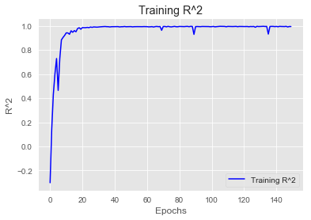

# MSW-to-Energy-Feedstock-Analysis

## Summary
 This project analyzes <b>Energy Density (kWh/kg)</b> and <b>Total Household MSW Energy (kWh)</b> from <b>Municipal
 Solid Waste (MSW)</b> data collected from Belize, Solomon Islands, and Vanuatu. 
 
 This data was collected by the <b>Asia Pacific Water Consultants (APWC)</b>, <b>Commonwealth Litter Programme (CLiP)</b>
 with the support of the <b> Centre for Environment Fisheries and Aquaculture Science (CEFAS)</b>. The original purpose for 
 collecting this data was to support local governments in mitigating ocean waste.  
 
 <b>The purpose of this project is to determine the viability of measured household MSW samples as feedstock for Plasma Gasification 
 Technology.</b> Plasma Gasification converts all MSW except metals and glass, into a <i>"Syngas"</i> (mostly CO and H2) which then 
 either generates energy or can be further processed into other valuable chemical products. Understanding a facility's 
 feedstock composition is critical for the initial facility design and therefore its future operational and revenue 
 generating capabilities.
 
 ## Results
 Energy Density and Total Household MSW Energy was calculated using each sample's specific <b>Net Heating Value</b>.
 
 ### Energy Density (kWh/kg)
 Median Energy Density per Household: <b>2.03 kWh/kg</b>
 
 Top Performing Model RMSE: <b>+/- 0.22 kWh/kg</b>
 
  
  
  
  
  

 ### Total Household MSW Energy (kWh/kg)
 Median MSW Energy per Household: <b>10.85 kWh</b>
 
 Top Performing Model RMSE: <b>+/- 0.70 kWh</b>
 
 
 
 
 
 
 
 ## Model Comparisons
 
 
 
 ## Methodology
 The data was labeled by calculating the <b>Net Heating Value</b> for each households specific MSW sample.  Each sample's
 compositions wt% was needed for this calculation, manipulation and reformatting of the dataset was required before
 this could be completed.  Once derived, these values were then factored into the necessary formulas for a <b>Proximate 
 Elemental Analysis</b>, thereby resulting in an Energy Density (kWh/kg) estimation.
 
 ## Sample Visualizations: Belize
 
 
 
 
 
