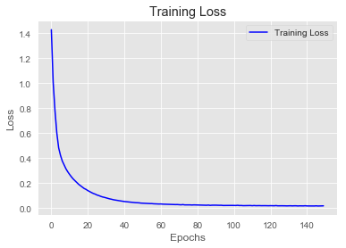
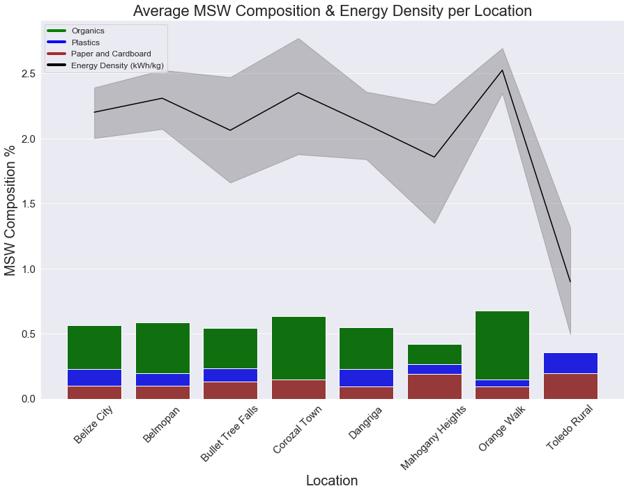
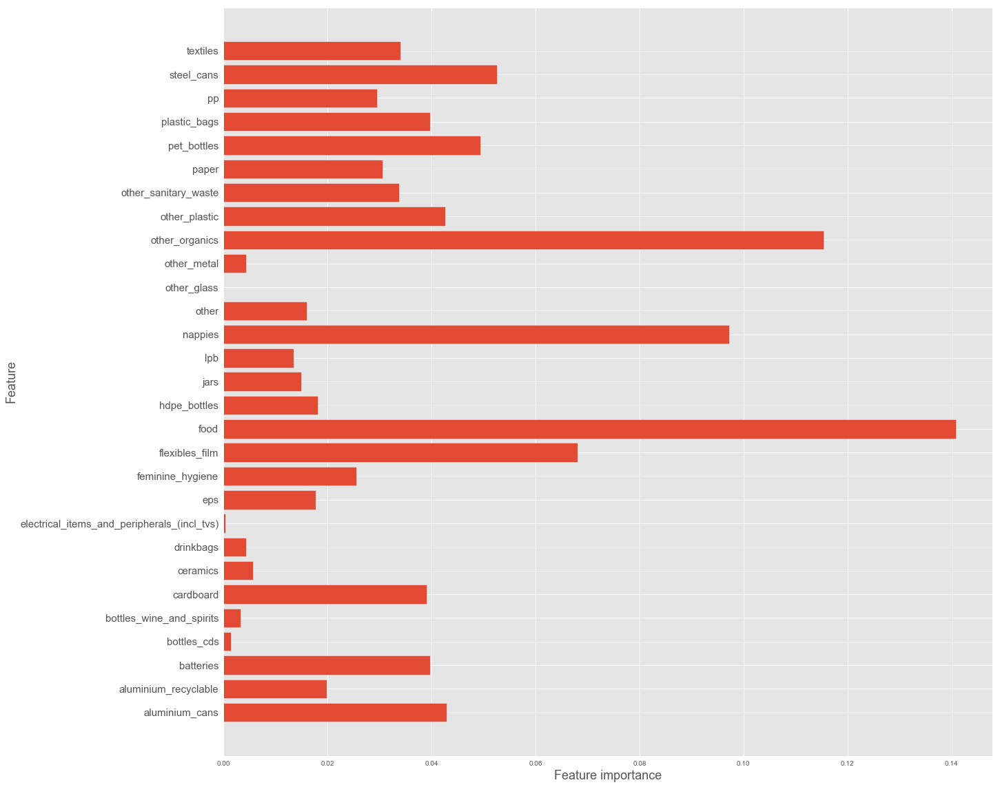

# MSW to Energy - Feedstock Analysis

## Summary
 This project's <b>Feedstock Analysis</b> measures <b>Energy Density (kWh/kg)</b> and <b>Total Household MSW Energy (kWh)</b> in <b>Municipal
 Solid Waste (MSW)</b> sample data collected from Belize, Solomon Islands, and Vanuatu. 
 
 This data was collected by the <b>Asia Pacific Water Consultants (APWC)</b>, commissioned by the <b>Commonwealth Litter Programme (CLiP)</b>
 with support from the <b> Centre for Environment Fisheries and Aquaculture Science (CEFAS)</b>. The original purpose for 
 the collection of this data was to support local governments in developing better ocean waste management strategies.  
 
 <b>The purpose of this project is to determine the viability of measured household MSW samples as feedstock for Plasma Gasification 
 Technology.</b> Plasma Gasification converts all MSW except metals and glass, into a <i>"Syngas"</i> (mostly CO and H2) which 
 can generate energy directly or can be further processed into other valuable chemical products. Understanding a facility's 
 feedstock composition is critical for the initial facility design and therefore its future operations and revenue 
 generating capabilities.
 
 ## Methodology
 The data was labeled by calculating the <b>Net Heating Value</b> for each households specific MSW sample.  Each sample's
 compositions wt% was needed for this calculation, feature engineering and reformatting of the original datasets was required before
 this could be completed.  Once derived, these values were then factored into the necessary formulas using a <b>Proximate Elemental Analysis</b> 
 (<i>"Municipal Solid Waste to Energy Conversion Process", Gary C. Young , 2010, pg.146 </i>), thereby resulting in an 
 Energy Density (kWh/kg) estimation.
 
 ## Results
 
 ### Energy Density (kWh/kg)
 Median Energy Density per Household: <b>2.03 kWh/kg</b>
 
 Top Performing Model: <b>Neural Network, Trainable Parameters: 2137</b>
 
 RMSE: <b>+/- 0.22 kWh/kg</b>
 
 r2: <b>0.9575</b>
 
  
  
  
  
  

 ### Total Household MSW Energy (kWh)
 Median MSW Energy per Household: <b>10.85 kWh</b>
 
 Top Performing Model: <b>Neural Network, Trainable Parameters: 2092</b>
 
 RMSE: <b>+/- 0.70 kWh</b>
 
 r2: <b>0.9943</b>
 
 
 
 
 
 
 
 ## Model Comparisons
 
 
 
 ## Sample Visualizations

 

 
 
 
