# Import Data


```python
import pandas as pd
import matplotlib.pyplot as plt
%matplotlib inline

import seaborn as sns
sns.set_style('darkgrid')
import warnings

import scipy
import numpy as np
import tensorflow as tf
from sklearn.preprocessing import StandardScaler, OneHotEncoder, MinMaxScaler
from sklearn.model_selection import train_test_split
from sklearn.metrics import mean_squared_error
from sklearn.model_selection import cross_val_predict

warnings.filterwarnings('ignore')
pd.set_option('display.max_rows', 500)
pd.set_option('display.max_columns', 500)
pd.set_option('display.width', 1000)

np.random.seed(123)

belize_model = pd.read_csv('Belize Final Model.csv', index_col='Unnamed: 0')
belize_model['ID'] = belize_model['ID'].astype(str)  + '_B'

solomon_model = pd.read_csv('Solomon Final Model.csv', index_col='Unnamed: 0')
solomon_model['ID'] = solomon_model['ID'].astype(str)  + '_S'

vanuatu_model = pd.read_csv('Vanuatu Final Model.csv', index_col='Unnamed: 0')
vanuatu_model['ID'] = vanuatu_model['ID'].astype(str)  + '_V'
```

# Modeling


```python
model_df = pd.concat([belize_model, solomon_model, vanuatu_model])
model_df = model_df.fillna(0)
print(model_df.shape)
model_df.head()
```

    (657, 37)
    


<div>
<style scoped>
    .dataframe tbody tr th:only-of-type {
        vertical-align: middle;
    }

    .dataframe tbody tr th {
        vertical-align: top;
    }

    .dataframe thead th {
        text-align: right;
    }
</style>
<table border="1" class="dataframe">
  <thead>
    <tr style="text-align: right;">
      <th></th>
      <th>ID</th>
      <th>Non_combust_wt_%</th>
      <th>Organics_wt_%</th>
      <th>Paper_and_cardboard_wt_%</th>
      <th>Plastics_wt_%</th>
      <th>Total_weight_(kg)</th>
      <th>aluminium_cans</th>
      <th>aluminium_recyclable</th>
      <th>batteries</th>
      <th>bottles_cds</th>
      <th>bottles_wine_and_spirits</th>
      <th>cardboard</th>
      <th>ceramics</th>
      <th>drinkbags</th>
      <th>electrical_items_and_peripherals_(incl_tvs)</th>
      <th>energy_kWh_per_kg</th>
      <th>eps</th>
      <th>feminine_hygiene</th>
      <th>flexibles_film</th>
      <th>food</th>
      <th>hdpe_bottles</th>
      <th>jars</th>
      <th>lpb</th>
      <th>nappies</th>
      <th>other</th>
      <th>other_glass</th>
      <th>other_metal</th>
      <th>other_organics</th>
      <th>other_plastic</th>
      <th>other_sanitary_waste</th>
      <th>paper</th>
      <th>pet_bottles</th>
      <th>plastic_bags</th>
      <th>pp</th>
      <th>steel_cans</th>
      <th>textiles</th>
      <th>total_energy_kWh</th>
    </tr>
  </thead>
  <tbody>
    <tr>
      <th>0</th>
      <td>1_B</td>
      <td>0.000000</td>
      <td>0.235955</td>
      <td>0.359551</td>
      <td>0.404494</td>
      <td>0.534</td>
      <td>0.000</td>
      <td>0.000</td>
      <td>0.0</td>
      <td>0.0</td>
      <td>0.0</td>
      <td>0.192</td>
      <td>0.0</td>
      <td>0.0000</td>
      <td>0.0</td>
      <td>1.30</td>
      <td>0.010</td>
      <td>0.126</td>
      <td>0.066</td>
      <td>0.000</td>
      <td>0.000</td>
      <td>0.00</td>
      <td>0.000</td>
      <td>0.000</td>
      <td>0.0</td>
      <td>0.0</td>
      <td>0.0</td>
      <td>0.000</td>
      <td>0.067</td>
      <td>0.000</td>
      <td>0.000</td>
      <td>0.030</td>
      <td>0.026</td>
      <td>0.017</td>
      <td>0.000</td>
      <td>0.000</td>
      <td>0.69</td>
    </tr>
    <tr>
      <th>1</th>
      <td>2_B</td>
      <td>0.062102</td>
      <td>0.738022</td>
      <td>0.016245</td>
      <td>0.183632</td>
      <td>4.863</td>
      <td>0.013</td>
      <td>0.029</td>
      <td>0.0</td>
      <td>0.0</td>
      <td>0.0</td>
      <td>0.000</td>
      <td>0.0</td>
      <td>0.0115</td>
      <td>0.0</td>
      <td>2.76</td>
      <td>0.003</td>
      <td>0.000</td>
      <td>0.196</td>
      <td>2.989</td>
      <td>0.203</td>
      <td>0.26</td>
      <td>0.009</td>
      <td>0.063</td>
      <td>0.0</td>
      <td>0.0</td>
      <td>0.0</td>
      <td>0.537</td>
      <td>0.188</td>
      <td>0.000</td>
      <td>0.070</td>
      <td>0.147</td>
      <td>0.058</td>
      <td>0.075</td>
      <td>0.000</td>
      <td>0.000</td>
      <td>13.42</td>
    </tr>
    <tr>
      <th>2</th>
      <td>3_B</td>
      <td>0.020291</td>
      <td>0.894826</td>
      <td>0.016571</td>
      <td>0.068312</td>
      <td>2.957</td>
      <td>0.000</td>
      <td>0.013</td>
      <td>0.0</td>
      <td>0.0</td>
      <td>0.0</td>
      <td>0.000</td>
      <td>0.0</td>
      <td>0.0000</td>
      <td>0.0</td>
      <td>3.03</td>
      <td>0.035</td>
      <td>0.000</td>
      <td>0.012</td>
      <td>1.927</td>
      <td>0.057</td>
      <td>0.00</td>
      <td>0.000</td>
      <td>0.000</td>
      <td>0.0</td>
      <td>0.0</td>
      <td>0.0</td>
      <td>0.000</td>
      <td>0.023</td>
      <td>0.719</td>
      <td>0.031</td>
      <td>0.000</td>
      <td>0.075</td>
      <td>0.000</td>
      <td>0.047</td>
      <td>0.018</td>
      <td>8.96</td>
    </tr>
    <tr>
      <th>3</th>
      <td>4_B</td>
      <td>0.238462</td>
      <td>0.407692</td>
      <td>0.094872</td>
      <td>0.258974</td>
      <td>0.390</td>
      <td>0.000</td>
      <td>0.000</td>
      <td>0.0</td>
      <td>0.0</td>
      <td>0.0</td>
      <td>0.037</td>
      <td>0.0</td>
      <td>0.0050</td>
      <td>0.0</td>
      <td>1.72</td>
      <td>0.003</td>
      <td>0.000</td>
      <td>0.028</td>
      <td>0.000</td>
      <td>0.000</td>
      <td>0.00</td>
      <td>0.000</td>
      <td>0.000</td>
      <td>0.0</td>
      <td>0.0</td>
      <td>0.0</td>
      <td>0.000</td>
      <td>0.000</td>
      <td>0.159</td>
      <td>0.000</td>
      <td>0.000</td>
      <td>0.065</td>
      <td>0.000</td>
      <td>0.093</td>
      <td>0.000</td>
      <td>0.67</td>
    </tr>
    <tr>
      <th>4</th>
      <td>5_B</td>
      <td>0.000000</td>
      <td>0.896653</td>
      <td>0.027299</td>
      <td>0.076048</td>
      <td>3.077</td>
      <td>0.000</td>
      <td>0.000</td>
      <td>0.0</td>
      <td>0.0</td>
      <td>0.0</td>
      <td>0.047</td>
      <td>0.0</td>
      <td>0.0180</td>
      <td>0.0</td>
      <td>3.09</td>
      <td>0.000</td>
      <td>0.071</td>
      <td>0.106</td>
      <td>2.366</td>
      <td>0.000</td>
      <td>0.00</td>
      <td>0.037</td>
      <td>0.000</td>
      <td>0.0</td>
      <td>0.0</td>
      <td>0.0</td>
      <td>0.000</td>
      <td>0.000</td>
      <td>0.322</td>
      <td>0.000</td>
      <td>0.000</td>
      <td>0.068</td>
      <td>0.024</td>
      <td>0.000</td>
      <td>0.000</td>
      <td>9.51</td>
    </tr>
  </tbody>
</table>
</div>


## Remove Outliers


```python
model_df.describe()
```


<div>
<style scoped>
    .dataframe tbody tr th:only-of-type {
        vertical-align: middle;
    }

    .dataframe tbody tr th {
        vertical-align: top;
    }

    .dataframe thead th {
        text-align: right;
    }
</style>
<table border="1" class="dataframe">
  <thead>
    <tr style="text-align: right;">
      <th></th>
      <th>Non_combust_wt_%</th>
      <th>Organics_wt_%</th>
      <th>Paper_and_cardboard_wt_%</th>
      <th>Plastics_wt_%</th>
      <th>Total_weight_(kg)</th>
      <th>aluminium_cans</th>
      <th>aluminium_recyclable</th>
      <th>batteries</th>
      <th>bottles_cds</th>
      <th>bottles_wine_and_spirits</th>
      <th>cardboard</th>
      <th>ceramics</th>
      <th>drinkbags</th>
      <th>electrical_items_and_peripherals_(incl_tvs)</th>
      <th>energy_kWh_per_kg</th>
      <th>eps</th>
      <th>feminine_hygiene</th>
      <th>flexibles_film</th>
      <th>food</th>
      <th>hdpe_bottles</th>
      <th>jars</th>
      <th>lpb</th>
      <th>nappies</th>
      <th>other</th>
      <th>other_glass</th>
      <th>other_metal</th>
      <th>other_organics</th>
      <th>other_plastic</th>
      <th>other_sanitary_waste</th>
      <th>paper</th>
      <th>pet_bottles</th>
      <th>plastic_bags</th>
      <th>pp</th>
      <th>steel_cans</th>
      <th>textiles</th>
      <th>total_energy_kWh</th>
    </tr>
  </thead>
  <tbody>
    <tr>
      <th>count</th>
      <td>657.000000</td>
      <td>657.000000</td>
      <td>657.000000</td>
      <td>657.000000</td>
      <td>657.000000</td>
      <td>657.000000</td>
      <td>657.000000</td>
      <td>657.000000</td>
      <td>657.000000</td>
      <td>657.000000</td>
      <td>657.000000</td>
      <td>657.000000</td>
      <td>657.000000</td>
      <td>657.000000</td>
      <td>657.000000</td>
      <td>657.000000</td>
      <td>657.000000</td>
      <td>657.000000</td>
      <td>657.000000</td>
      <td>657.000000</td>
      <td>657.000000</td>
      <td>657.000000</td>
      <td>657.000000</td>
      <td>657.000000</td>
      <td>657.000000</td>
      <td>657.000000</td>
      <td>657.000000</td>
      <td>657.000000</td>
      <td>657.000000</td>
      <td>657.000000</td>
      <td>657.000000</td>
      <td>657.000000</td>
      <td>657.000000</td>
      <td>657.000000</td>
      <td>657.000000</td>
      <td>657.000000</td>
    </tr>
    <tr>
      <th>mean</th>
      <td>0.164221</td>
      <td>0.562368</td>
      <td>0.097642</td>
      <td>0.174883</td>
      <td>7.039078</td>
      <td>0.278236</td>
      <td>0.027437</td>
      <td>0.003476</td>
      <td>0.025985</td>
      <td>0.026689</td>
      <td>0.187169</td>
      <td>0.009470</td>
      <td>0.005390</td>
      <td>0.006925</td>
      <td>2.037534</td>
      <td>0.024411</td>
      <td>0.044382</td>
      <td>0.215837</td>
      <td>2.083743</td>
      <td>0.031814</td>
      <td>0.098312</td>
      <td>0.035486</td>
      <td>1.002744</td>
      <td>0.079878</td>
      <td>0.002893</td>
      <td>0.026321</td>
      <td>1.572169</td>
      <td>0.106202</td>
      <td>0.073056</td>
      <td>0.118170</td>
      <td>0.227420</td>
      <td>0.175761</td>
      <td>0.017618</td>
      <td>0.346152</td>
      <td>0.184600</td>
      <td>16.829696</td>
    </tr>
    <tr>
      <th>std</th>
      <td>0.212095</td>
      <td>0.328298</td>
      <td>0.142824</td>
      <td>0.184810</td>
      <td>7.905361</td>
      <td>0.903705</td>
      <td>0.134408</td>
      <td>0.027986</td>
      <td>0.187057</td>
      <td>0.198246</td>
      <td>0.449210</td>
      <td>0.074386</td>
      <td>0.033875</td>
      <td>0.065450</td>
      <td>1.064171</td>
      <td>0.061599</td>
      <td>0.171813</td>
      <td>0.342665</td>
      <td>3.639778</td>
      <td>0.085608</td>
      <td>0.329199</td>
      <td>0.135543</td>
      <td>3.389378</td>
      <td>0.338525</td>
      <td>0.033120</td>
      <td>0.201365</td>
      <td>4.954004</td>
      <td>0.301088</td>
      <td>0.315111</td>
      <td>0.258696</td>
      <td>0.481947</td>
      <td>0.486143</td>
      <td>0.096537</td>
      <td>0.737697</td>
      <td>0.812959</td>
      <td>22.966856</td>
    </tr>
    <tr>
      <th>min</th>
      <td>0.000000</td>
      <td>0.000000</td>
      <td>0.000000</td>
      <td>0.000000</td>
      <td>0.056000</td>
      <td>0.000000</td>
      <td>0.000000</td>
      <td>0.000000</td>
      <td>0.000000</td>
      <td>0.000000</td>
      <td>0.000000</td>
      <td>0.000000</td>
      <td>0.000000</td>
      <td>0.000000</td>
      <td>0.000000</td>
      <td>0.000000</td>
      <td>0.000000</td>
      <td>0.000000</td>
      <td>0.000000</td>
      <td>0.000000</td>
      <td>0.000000</td>
      <td>0.000000</td>
      <td>0.000000</td>
      <td>0.000000</td>
      <td>0.000000</td>
      <td>0.000000</td>
      <td>0.000000</td>
      <td>0.000000</td>
      <td>0.000000</td>
      <td>0.000000</td>
      <td>0.000000</td>
      <td>0.000000</td>
      <td>0.000000</td>
      <td>0.000000</td>
      <td>0.000000</td>
      <td>0.000000</td>
    </tr>
    <tr>
      <th>25%</th>
      <td>0.018805</td>
      <td>0.283636</td>
      <td>0.002865</td>
      <td>0.045108</td>
      <td>2.161000</td>
      <td>0.000000</td>
      <td>0.000000</td>
      <td>0.000000</td>
      <td>0.000000</td>
      <td>0.000000</td>
      <td>0.000000</td>
      <td>0.000000</td>
      <td>0.000000</td>
      <td>0.000000</td>
      <td>1.300000</td>
      <td>0.000000</td>
      <td>0.000000</td>
      <td>0.031000</td>
      <td>0.000000</td>
      <td>0.000000</td>
      <td>0.000000</td>
      <td>0.000000</td>
      <td>0.000000</td>
      <td>0.000000</td>
      <td>0.000000</td>
      <td>0.000000</td>
      <td>0.000000</td>
      <td>0.000000</td>
      <td>0.000000</td>
      <td>0.000000</td>
      <td>0.000000</td>
      <td>0.000000</td>
      <td>0.000000</td>
      <td>0.000000</td>
      <td>0.000000</td>
      <td>2.710000</td>
    </tr>
    <tr>
      <th>50%</th>
      <td>0.077644</td>
      <td>0.628221</td>
      <td>0.044877</td>
      <td>0.116012</td>
      <td>4.552000</td>
      <td>0.000000</td>
      <td>0.000000</td>
      <td>0.000000</td>
      <td>0.000000</td>
      <td>0.000000</td>
      <td>0.000000</td>
      <td>0.000000</td>
      <td>0.000000</td>
      <td>0.000000</td>
      <td>2.480000</td>
      <td>0.000000</td>
      <td>0.000000</td>
      <td>0.096000</td>
      <td>0.562000</td>
      <td>0.000000</td>
      <td>0.000000</td>
      <td>0.000000</td>
      <td>0.000000</td>
      <td>0.000000</td>
      <td>0.000000</td>
      <td>0.000000</td>
      <td>0.000000</td>
      <td>0.018000</td>
      <td>0.000000</td>
      <td>0.004000</td>
      <td>0.088000</td>
      <td>0.048000</td>
      <td>0.000000</td>
      <td>0.078000</td>
      <td>0.000000</td>
      <td>9.270000</td>
    </tr>
    <tr>
      <th>75%</th>
      <td>0.219512</td>
      <td>0.854651</td>
      <td>0.118399</td>
      <td>0.232143</td>
      <td>8.460000</td>
      <td>0.084000</td>
      <td>0.006000</td>
      <td>0.000000</td>
      <td>0.000000</td>
      <td>0.000000</td>
      <td>0.159000</td>
      <td>0.000000</td>
      <td>0.000000</td>
      <td>0.000000</td>
      <td>2.940000</td>
      <td>0.014000</td>
      <td>0.000000</td>
      <td>0.252000</td>
      <td>2.754000</td>
      <td>0.018000</td>
      <td>0.000000</td>
      <td>0.011000</td>
      <td>0.000000</td>
      <td>0.000000</td>
      <td>0.000000</td>
      <td>0.000000</td>
      <td>0.338000</td>
      <td>0.096000</td>
      <td>0.000000</td>
      <td>0.115000</td>
      <td>0.236000</td>
      <td>0.168000</td>
      <td>0.004000</td>
      <td>0.343000</td>
      <td>0.028000</td>
      <td>20.450000</td>
    </tr>
    <tr>
      <th>max</th>
      <td>0.998243</td>
      <td>1.000000</td>
      <td>0.899387</td>
      <td>1.000000</td>
      <td>59.815000</td>
      <td>8.612000</td>
      <td>1.840000</td>
      <td>0.356000</td>
      <td>3.670000</td>
      <td>2.873000</td>
      <td>4.242000</td>
      <td>1.122000</td>
      <td>0.509000</td>
      <td>0.862000</td>
      <td>3.120000</td>
      <td>0.574000</td>
      <td>1.580000</td>
      <td>3.228000</td>
      <td>29.239000</td>
      <td>0.912000</td>
      <td>5.362000</td>
      <td>1.860000</td>
      <td>36.750000</td>
      <td>4.494000</td>
      <td>0.616000</td>
      <td>4.306000</td>
      <td>56.020000</td>
      <td>4.904000</td>
      <td>3.280000</td>
      <td>2.408000</td>
      <td>6.804000</td>
      <td>6.048000</td>
      <td>2.008000</td>
      <td>6.452000</td>
      <td>15.806000</td>
      <td>175.410000</td>
    </tr>
  </tbody>
</table>
</div>


### Total Weight (kg)


```python
model_df[model_df['Total_weight_(kg)'] < 16]['Total_weight_(kg)'].hist();
```


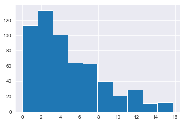


```python
print('Old length:', len(model_df))
print('New length:', len(model_df[model_df['total_energy_kWh'] > 0]))
model_df = model_df[model_df['total_energy_kWh'] > 0]
model_df.describe()
```

    Old length: 657
    New length: 586
    


<div>
<style scoped>
    .dataframe tbody tr th:only-of-type {
        vertical-align: middle;
    }

    .dataframe tbody tr th {
        vertical-align: top;
    }

    .dataframe thead th {
        text-align: right;
    }
</style>
<table border="1" class="dataframe">
  <thead>
    <tr style="text-align: right;">
      <th></th>
      <th>Non_combust_wt_%</th>
      <th>Organics_wt_%</th>
      <th>Paper_and_cardboard_wt_%</th>
      <th>Plastics_wt_%</th>
      <th>Total_weight_(kg)</th>
      <th>aluminium_cans</th>
      <th>aluminium_recyclable</th>
      <th>batteries</th>
      <th>bottles_cds</th>
      <th>bottles_wine_and_spirits</th>
      <th>cardboard</th>
      <th>ceramics</th>
      <th>drinkbags</th>
      <th>electrical_items_and_peripherals_(incl_tvs)</th>
      <th>energy_kWh_per_kg</th>
      <th>eps</th>
      <th>feminine_hygiene</th>
      <th>flexibles_film</th>
      <th>food</th>
      <th>hdpe_bottles</th>
      <th>jars</th>
      <th>lpb</th>
      <th>nappies</th>
      <th>other</th>
      <th>other_glass</th>
      <th>other_metal</th>
      <th>other_organics</th>
      <th>other_plastic</th>
      <th>other_sanitary_waste</th>
      <th>paper</th>
      <th>pet_bottles</th>
      <th>plastic_bags</th>
      <th>pp</th>
      <th>steel_cans</th>
      <th>textiles</th>
      <th>total_energy_kWh</th>
    </tr>
  </thead>
  <tbody>
    <tr>
      <th>count</th>
      <td>586.000000</td>
      <td>586.000000</td>
      <td>586.000000</td>
      <td>586.000000</td>
      <td>586.000000</td>
      <td>586.00000</td>
      <td>586.000000</td>
      <td>586.000000</td>
      <td>586.000000</td>
      <td>586.000000</td>
      <td>586.000000</td>
      <td>586.000000</td>
      <td>586.000000</td>
      <td>586.000000</td>
      <td>586.000000</td>
      <td>586.000000</td>
      <td>586.000000</td>
      <td>586.000000</td>
      <td>586.000000</td>
      <td>586.000000</td>
      <td>586.000000</td>
      <td>586.000000</td>
      <td>586.000000</td>
      <td>586.000000</td>
      <td>586.000000</td>
      <td>586.000000</td>
      <td>586.000000</td>
      <td>586.000000</td>
      <td>586.000000</td>
      <td>586.000000</td>
      <td>586.000000</td>
      <td>586.000000</td>
      <td>586.000000</td>
      <td>586.000000</td>
      <td>586.000000</td>
      <td>586.000000</td>
    </tr>
    <tr>
      <th>mean</th>
      <td>0.134367</td>
      <td>0.630505</td>
      <td>0.087085</td>
      <td>0.147051</td>
      <td>7.618173</td>
      <td>0.25152</td>
      <td>0.029147</td>
      <td>0.003898</td>
      <td>0.026519</td>
      <td>0.020462</td>
      <td>0.194246</td>
      <td>0.007824</td>
      <td>0.005555</td>
      <td>0.007166</td>
      <td>2.284403</td>
      <td>0.026384</td>
      <td>0.049759</td>
      <td>0.222308</td>
      <td>2.336210</td>
      <td>0.033171</td>
      <td>0.101196</td>
      <td>0.038166</td>
      <td>1.124237</td>
      <td>0.085688</td>
      <td>0.003022</td>
      <td>0.029156</td>
      <td>1.762654</td>
      <td>0.113937</td>
      <td>0.081908</td>
      <td>0.126618</td>
      <td>0.226881</td>
      <td>0.175517</td>
      <td>0.019394</td>
      <td>0.321509</td>
      <td>0.192631</td>
      <td>18.868788</td>
    </tr>
    <tr>
      <th>std</th>
      <td>0.169104</td>
      <td>0.278974</td>
      <td>0.122657</td>
      <td>0.144996</td>
      <td>8.125326</td>
      <td>0.85164</td>
      <td>0.140723</td>
      <td>0.029608</td>
      <td>0.189857</td>
      <td>0.160275</td>
      <td>0.457601</td>
      <td>0.070767</td>
      <td>0.034206</td>
      <td>0.068399</td>
      <td>0.839638</td>
      <td>0.064155</td>
      <td>0.181202</td>
      <td>0.350437</td>
      <td>3.776908</td>
      <td>0.087942</td>
      <td>0.335554</td>
      <td>0.142816</td>
      <td>3.570059</td>
      <td>0.356283</td>
      <td>0.034662</td>
      <td>0.212890</td>
      <td>5.213870</td>
      <td>0.316792</td>
      <td>0.332596</td>
      <td>0.266703</td>
      <td>0.484771</td>
      <td>0.448975</td>
      <td>0.102026</td>
      <td>0.691295</td>
      <td>0.841872</td>
      <td>23.514974</td>
    </tr>
    <tr>
      <th>min</th>
      <td>0.000000</td>
      <td>0.003579</td>
      <td>0.000000</td>
      <td>0.000000</td>
      <td>0.056000</td>
      <td>0.00000</td>
      <td>0.000000</td>
      <td>0.000000</td>
      <td>0.000000</td>
      <td>0.000000</td>
      <td>0.000000</td>
      <td>0.000000</td>
      <td>0.000000</td>
      <td>0.000000</td>
      <td>0.020000</td>
      <td>0.000000</td>
      <td>0.000000</td>
      <td>0.000000</td>
      <td>0.000000</td>
      <td>0.000000</td>
      <td>0.000000</td>
      <td>0.000000</td>
      <td>0.000000</td>
      <td>0.000000</td>
      <td>0.000000</td>
      <td>0.000000</td>
      <td>0.000000</td>
      <td>0.000000</td>
      <td>0.000000</td>
      <td>0.000000</td>
      <td>0.000000</td>
      <td>0.000000</td>
      <td>0.000000</td>
      <td>0.000000</td>
      <td>0.000000</td>
      <td>0.070000</td>
    </tr>
    <tr>
      <th>25%</th>
      <td>0.017861</td>
      <td>0.419896</td>
      <td>0.003361</td>
      <td>0.039520</td>
      <td>2.529000</td>
      <td>0.00000</td>
      <td>0.000000</td>
      <td>0.000000</td>
      <td>0.000000</td>
      <td>0.000000</td>
      <td>0.000000</td>
      <td>0.000000</td>
      <td>0.000000</td>
      <td>0.000000</td>
      <td>1.742500</td>
      <td>0.000000</td>
      <td>0.000000</td>
      <td>0.036000</td>
      <td>0.000000</td>
      <td>0.000000</td>
      <td>0.000000</td>
      <td>0.000000</td>
      <td>0.000000</td>
      <td>0.000000</td>
      <td>0.000000</td>
      <td>0.000000</td>
      <td>0.000000</td>
      <td>0.000000</td>
      <td>0.000000</td>
      <td>0.000000</td>
      <td>0.000000</td>
      <td>0.000000</td>
      <td>0.000000</td>
      <td>0.000000</td>
      <td>0.000000</td>
      <td>4.755000</td>
    </tr>
    <tr>
      <th>50%</th>
      <td>0.068807</td>
      <td>0.685711</td>
      <td>0.042050</td>
      <td>0.103559</td>
      <td>4.906000</td>
      <td>0.00000</td>
      <td>0.000000</td>
      <td>0.000000</td>
      <td>0.000000</td>
      <td>0.000000</td>
      <td>0.000000</td>
      <td>0.000000</td>
      <td>0.000000</td>
      <td>0.000000</td>
      <td>2.620000</td>
      <td>0.000000</td>
      <td>0.000000</td>
      <td>0.101000</td>
      <td>0.791000</td>
      <td>0.000000</td>
      <td>0.000000</td>
      <td>0.000000</td>
      <td>0.000000</td>
      <td>0.000000</td>
      <td>0.000000</td>
      <td>0.000000</td>
      <td>0.000000</td>
      <td>0.020000</td>
      <td>0.000000</td>
      <td>0.010000</td>
      <td>0.088000</td>
      <td>0.053500</td>
      <td>0.000000</td>
      <td>0.078000</td>
      <td>0.000000</td>
      <td>11.000000</td>
    </tr>
    <tr>
      <th>75%</th>
      <td>0.181555</td>
      <td>0.871793</td>
      <td>0.110851</td>
      <td>0.204231</td>
      <td>9.231000</td>
      <td>0.08000</td>
      <td>0.007000</td>
      <td>0.000000</td>
      <td>0.000000</td>
      <td>0.000000</td>
      <td>0.175500</td>
      <td>0.000000</td>
      <td>0.000000</td>
      <td>0.000000</td>
      <td>2.970000</td>
      <td>0.024000</td>
      <td>0.000000</td>
      <td>0.258000</td>
      <td>3.067500</td>
      <td>0.020750</td>
      <td>0.000000</td>
      <td>0.012000</td>
      <td>0.057250</td>
      <td>0.000000</td>
      <td>0.000000</td>
      <td>0.000000</td>
      <td>0.663000</td>
      <td>0.100000</td>
      <td>0.000000</td>
      <td>0.130000</td>
      <td>0.232000</td>
      <td>0.179000</td>
      <td>0.005000</td>
      <td>0.304750</td>
      <td>0.033750</td>
      <td>22.677500</td>
    </tr>
    <tr>
      <th>max</th>
      <td>0.926819</td>
      <td>1.000000</td>
      <td>0.823762</td>
      <td>0.860902</td>
      <td>59.815000</td>
      <td>8.61200</td>
      <td>1.840000</td>
      <td>0.356000</td>
      <td>3.670000</td>
      <td>2.873000</td>
      <td>4.242000</td>
      <td>1.122000</td>
      <td>0.509000</td>
      <td>0.862000</td>
      <td>3.120000</td>
      <td>0.574000</td>
      <td>1.580000</td>
      <td>3.228000</td>
      <td>29.239000</td>
      <td>0.912000</td>
      <td>5.362000</td>
      <td>1.860000</td>
      <td>36.750000</td>
      <td>4.494000</td>
      <td>0.616000</td>
      <td>4.306000</td>
      <td>56.020000</td>
      <td>4.904000</td>
      <td>3.280000</td>
      <td>2.408000</td>
      <td>6.804000</td>
      <td>5.256000</td>
      <td>2.008000</td>
      <td>6.452000</td>
      <td>15.806000</td>
      <td>175.410000</td>
    </tr>
  </tbody>
</table>
</div>


### Total Energy kWh


```python
model_df[model_df['total_energy_kWh'] > 0]['total_energy_kWh'].hist();
```


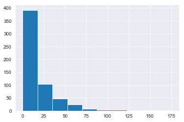


```python
print('Old length:', len(model_df))
print('New length:', len(model_df[model_df['Total_weight_(kg)'] < 16]))
model_df = model_df[model_df['Total_weight_(kg)'] < 16]
model_df.describe()
```

    Old length: 586
    New length: 516
    


<div>
<style scoped>
    .dataframe tbody tr th:only-of-type {
        vertical-align: middle;
    }

    .dataframe tbody tr th {
        vertical-align: top;
    }

    .dataframe thead th {
        text-align: right;
    }
</style>
<table border="1" class="dataframe">
  <thead>
    <tr style="text-align: right;">
      <th></th>
      <th>Non_combust_wt_%</th>
      <th>Organics_wt_%</th>
      <th>Paper_and_cardboard_wt_%</th>
      <th>Plastics_wt_%</th>
      <th>Total_weight_(kg)</th>
      <th>aluminium_cans</th>
      <th>aluminium_recyclable</th>
      <th>batteries</th>
      <th>bottles_cds</th>
      <th>bottles_wine_and_spirits</th>
      <th>cardboard</th>
      <th>ceramics</th>
      <th>drinkbags</th>
      <th>electrical_items_and_peripherals_(incl_tvs)</th>
      <th>energy_kWh_per_kg</th>
      <th>eps</th>
      <th>feminine_hygiene</th>
      <th>flexibles_film</th>
      <th>food</th>
      <th>hdpe_bottles</th>
      <th>jars</th>
      <th>lpb</th>
      <th>nappies</th>
      <th>other</th>
      <th>other_glass</th>
      <th>other_metal</th>
      <th>other_organics</th>
      <th>other_plastic</th>
      <th>other_sanitary_waste</th>
      <th>paper</th>
      <th>pet_bottles</th>
      <th>plastic_bags</th>
      <th>pp</th>
      <th>steel_cans</th>
      <th>textiles</th>
      <th>total_energy_kWh</th>
    </tr>
  </thead>
  <tbody>
    <tr>
      <th>count</th>
      <td>516.000000</td>
      <td>516.000000</td>
      <td>516.000000</td>
      <td>516.000000</td>
      <td>516.000000</td>
      <td>516.000000</td>
      <td>516.000000</td>
      <td>516.000000</td>
      <td>516.000000</td>
      <td>516.000000</td>
      <td>516.000000</td>
      <td>516.000000</td>
      <td>516.000000</td>
      <td>516.000000</td>
      <td>516.000000</td>
      <td>516.000000</td>
      <td>516.000000</td>
      <td>516.000000</td>
      <td>516.000000</td>
      <td>516.000000</td>
      <td>516.000000</td>
      <td>516.000000</td>
      <td>516.000000</td>
      <td>516.000000</td>
      <td>516.000000</td>
      <td>516.000000</td>
      <td>516.000000</td>
      <td>516.000000</td>
      <td>516.000000</td>
      <td>516.000000</td>
      <td>516.000000</td>
      <td>516.000000</td>
      <td>516.000000</td>
      <td>516.000000</td>
      <td>516.000000</td>
      <td>516.000000</td>
    </tr>
    <tr>
      <th>mean</th>
      <td>0.141575</td>
      <td>0.610547</td>
      <td>0.090113</td>
      <td>0.156637</td>
      <td>5.223431</td>
      <td>0.199983</td>
      <td>0.024217</td>
      <td>0.002147</td>
      <td>0.030116</td>
      <td>0.023238</td>
      <td>0.147915</td>
      <td>0.005998</td>
      <td>0.006309</td>
      <td>0.004107</td>
      <td>2.227578</td>
      <td>0.026977</td>
      <td>0.056083</td>
      <td>0.179067</td>
      <td>1.701150</td>
      <td>0.034548</td>
      <td>0.091444</td>
      <td>0.032537</td>
      <td>0.651723</td>
      <td>0.062072</td>
      <td>0.003432</td>
      <td>0.019728</td>
      <td>0.896434</td>
      <td>0.091599</td>
      <td>0.091713</td>
      <td>0.112634</td>
      <td>0.181076</td>
      <td>0.140967</td>
      <td>0.015632</td>
      <td>0.273866</td>
      <td>0.115027</td>
      <td>12.109748</td>
    </tr>
    <tr>
      <th>std</th>
      <td>0.173728</td>
      <td>0.283029</td>
      <td>0.126608</td>
      <td>0.149067</td>
      <td>3.635338</td>
      <td>0.756555</td>
      <td>0.104719</td>
      <td>0.022486</td>
      <td>0.202081</td>
      <td>0.170631</td>
      <td>0.331126</td>
      <td>0.065309</td>
      <td>0.036391</td>
      <td>0.049133</td>
      <td>0.859181</td>
      <td>0.063719</td>
      <td>0.192178</td>
      <td>0.288849</td>
      <td>2.294945</td>
      <td>0.083585</td>
      <td>0.246646</td>
      <td>0.138367</td>
      <td>1.984713</td>
      <td>0.240087</td>
      <td>0.036923</td>
      <td>0.114199</td>
      <td>2.250055</td>
      <td>0.274567</td>
      <td>0.352108</td>
      <td>0.227172</td>
      <td>0.328292</td>
      <td>0.382436</td>
      <td>0.060521</td>
      <td>0.586254</td>
      <td>0.414171</td>
      <td>10.445627</td>
    </tr>
    <tr>
      <th>min</th>
      <td>0.000000</td>
      <td>0.003579</td>
      <td>0.000000</td>
      <td>0.000000</td>
      <td>0.056000</td>
      <td>0.000000</td>
      <td>0.000000</td>
      <td>0.000000</td>
      <td>0.000000</td>
      <td>0.000000</td>
      <td>0.000000</td>
      <td>0.000000</td>
      <td>0.000000</td>
      <td>0.000000</td>
      <td>0.020000</td>
      <td>0.000000</td>
      <td>0.000000</td>
      <td>0.000000</td>
      <td>0.000000</td>
      <td>0.000000</td>
      <td>0.000000</td>
      <td>0.000000</td>
      <td>0.000000</td>
      <td>0.000000</td>
      <td>0.000000</td>
      <td>0.000000</td>
      <td>0.000000</td>
      <td>0.000000</td>
      <td>0.000000</td>
      <td>0.000000</td>
      <td>0.000000</td>
      <td>0.000000</td>
      <td>0.000000</td>
      <td>0.000000</td>
      <td>0.000000</td>
      <td>0.070000</td>
    </tr>
    <tr>
      <th>25%</th>
      <td>0.019392</td>
      <td>0.395613</td>
      <td>0.003385</td>
      <td>0.044443</td>
      <td>2.246500</td>
      <td>0.000000</td>
      <td>0.000000</td>
      <td>0.000000</td>
      <td>0.000000</td>
      <td>0.000000</td>
      <td>0.000000</td>
      <td>0.000000</td>
      <td>0.000000</td>
      <td>0.000000</td>
      <td>1.645000</td>
      <td>0.000000</td>
      <td>0.000000</td>
      <td>0.031000</td>
      <td>0.000000</td>
      <td>0.000000</td>
      <td>0.000000</td>
      <td>0.000000</td>
      <td>0.000000</td>
      <td>0.000000</td>
      <td>0.000000</td>
      <td>0.000000</td>
      <td>0.000000</td>
      <td>0.000000</td>
      <td>0.000000</td>
      <td>0.000000</td>
      <td>0.000000</td>
      <td>0.000000</td>
      <td>0.000000</td>
      <td>0.000000</td>
      <td>0.000000</td>
      <td>4.145000</td>
    </tr>
    <tr>
      <th>50%</th>
      <td>0.076120</td>
      <td>0.667773</td>
      <td>0.043399</td>
      <td>0.116282</td>
      <td>4.318000</td>
      <td>0.000000</td>
      <td>0.000000</td>
      <td>0.000000</td>
      <td>0.000000</td>
      <td>0.000000</td>
      <td>0.000000</td>
      <td>0.000000</td>
      <td>0.000000</td>
      <td>0.000000</td>
      <td>2.540000</td>
      <td>0.000000</td>
      <td>0.000000</td>
      <td>0.088000</td>
      <td>0.721500</td>
      <td>0.000000</td>
      <td>0.000000</td>
      <td>0.000000</td>
      <td>0.000000</td>
      <td>0.000000</td>
      <td>0.000000</td>
      <td>0.000000</td>
      <td>0.000000</td>
      <td>0.016500</td>
      <td>0.000000</td>
      <td>0.012000</td>
      <td>0.081000</td>
      <td>0.052000</td>
      <td>0.000000</td>
      <td>0.069000</td>
      <td>0.000000</td>
      <td>9.270000</td>
    </tr>
    <tr>
      <th>75%</th>
      <td>0.194802</td>
      <td>0.861856</td>
      <td>0.113435</td>
      <td>0.217723</td>
      <td>7.429000</td>
      <td>0.070500</td>
      <td>0.009000</td>
      <td>0.000000</td>
      <td>0.000000</td>
      <td>0.000000</td>
      <td>0.150250</td>
      <td>0.000000</td>
      <td>0.000000</td>
      <td>0.000000</td>
      <td>2.940000</td>
      <td>0.026000</td>
      <td>0.000000</td>
      <td>0.226500</td>
      <td>2.603000</td>
      <td>0.027250</td>
      <td>0.000000</td>
      <td>0.009000</td>
      <td>0.000000</td>
      <td>0.000000</td>
      <td>0.000000</td>
      <td>0.000000</td>
      <td>0.340750</td>
      <td>0.089500</td>
      <td>0.000000</td>
      <td>0.114250</td>
      <td>0.211250</td>
      <td>0.160000</td>
      <td>0.005000</td>
      <td>0.241000</td>
      <td>0.020250</td>
      <td>16.872500</td>
    </tr>
    <tr>
      <th>max</th>
      <td>0.926819</td>
      <td>1.000000</td>
      <td>0.823762</td>
      <td>0.860902</td>
      <td>15.750000</td>
      <td>8.612000</td>
      <td>1.840000</td>
      <td>0.356000</td>
      <td>3.670000</td>
      <td>2.873000</td>
      <td>2.825000</td>
      <td>1.122000</td>
      <td>0.509000</td>
      <td>0.838000</td>
      <td>3.120000</td>
      <td>0.574000</td>
      <td>1.580000</td>
      <td>3.228000</td>
      <td>11.976000</td>
      <td>0.848000</td>
      <td>2.306000</td>
      <td>1.860000</td>
      <td>15.092000</td>
      <td>2.780000</td>
      <td>0.616000</td>
      <td>1.300000</td>
      <td>15.232000</td>
      <td>4.904000</td>
      <td>3.280000</td>
      <td>1.896000</td>
      <td>3.338000</td>
      <td>5.256000</td>
      <td>0.970000</td>
      <td>5.308000</td>
      <td>4.376000</td>
      <td>48.840000</td>
    </tr>
  </tbody>
</table>
</div>


```python
# print('Old length:', len(model_df))
# print('New length:', len(model_df[model_df['total_energy_kWh'] < 150]))
# model_df = model_df[model_df['total_energy_kWh'] < 150]
# model_df.describe()
```

## Remove Unnecessary Features


```python
X = model_df.drop(['ID',
                   'total_energy_kWh',
                   'energy_kWh_per_kg',
                   'Total_weight_(kg)',
                   'Organics_wt_%',
                   'Paper_and_cardboard_wt_%',
                   'Plastics_wt_%',
                   'Non_combust_wt_%'],
                   axis=1)
y = model_df[['total_energy_kWh']]
```


```python
# X = model_df.drop(['ID',
#                    'total_energy_kWh',
#                    'energy_kWh_per_kg',
#                    'Total_weight (kg)',
#                    'Organics_wt_%',
#                    'Paper_and_cardboard_wt_%',
#                    'Plastics_wt_%',
#                    'Non_combust_wt_%'], axis=1)
# y = model_df[['energy_kWh_per_kg']]
```

## Train/Test Split


```python
X_train, X_test, y_train, y_test = train_test_split(X, y, test_size=0.15, random_state=42)
print(X_train.shape)
print(X_test.shape)
```

    (438, 29)
    (78, 29)
    


```python
scaler = StandardScaler()
X_train_Scaled = pd.DataFrame(scaler.fit_transform(X_train), columns=X.columns)
X_test_Scaled = pd.DataFrame(scaler.transform(X_test), columns=X.columns)

y_train_Scaled = scaler.fit_transform(y_train)
y_test_Scaled = scaler.transform(y_test)
```


```python
X_train_Scaled.head()
```


<div>
<style scoped>
    .dataframe tbody tr th:only-of-type {
        vertical-align: middle;
    }

    .dataframe tbody tr th {
        vertical-align: top;
    }

    .dataframe thead th {
        text-align: right;
    }
</style>
<table border="1" class="dataframe">
  <thead>
    <tr style="text-align: right;">
      <th></th>
      <th>aluminium_cans</th>
      <th>aluminium_recyclable</th>
      <th>batteries</th>
      <th>bottles_cds</th>
      <th>bottles_wine_and_spirits</th>
      <th>cardboard</th>
      <th>ceramics</th>
      <th>drinkbags</th>
      <th>electrical_items_and_peripherals_(incl_tvs)</th>
      <th>eps</th>
      <th>feminine_hygiene</th>
      <th>flexibles_film</th>
      <th>food</th>
      <th>hdpe_bottles</th>
      <th>jars</th>
      <th>lpb</th>
      <th>nappies</th>
      <th>other</th>
      <th>other_glass</th>
      <th>other_metal</th>
      <th>other_organics</th>
      <th>other_plastic</th>
      <th>other_sanitary_waste</th>
      <th>paper</th>
      <th>pet_bottles</th>
      <th>plastic_bags</th>
      <th>pp</th>
      <th>steel_cans</th>
      <th>textiles</th>
    </tr>
  </thead>
  <tbody>
    <tr>
      <th>0</th>
      <td>-0.270417</td>
      <td>-0.228289</td>
      <td>-0.103834</td>
      <td>-0.14073</td>
      <td>-0.136738</td>
      <td>1.265438</td>
      <td>-0.098466</td>
      <td>-0.154106</td>
      <td>-0.079706</td>
      <td>-0.413417</td>
      <td>-0.30746</td>
      <td>5.950470</td>
      <td>-0.611218</td>
      <td>-0.412176</td>
      <td>0.861347</td>
      <td>-0.170126</td>
      <td>-0.332314</td>
      <td>0.959775</td>
      <td>-0.090284</td>
      <td>-0.16923</td>
      <td>-0.229082</td>
      <td>2.599808</td>
      <td>-0.266459</td>
      <td>2.736695</td>
      <td>0.034459</td>
      <td>-0.321770</td>
      <td>-0.263237</td>
      <td>0.178715</td>
      <td>0.629460</td>
    </tr>
    <tr>
      <th>1</th>
      <td>-0.270417</td>
      <td>-0.228289</td>
      <td>-0.103834</td>
      <td>-0.14073</td>
      <td>-0.136738</td>
      <td>-0.445976</td>
      <td>-0.098466</td>
      <td>-0.154106</td>
      <td>-0.079706</td>
      <td>0.294467</td>
      <td>-0.30746</td>
      <td>0.281862</td>
      <td>0.121999</td>
      <td>-0.005058</td>
      <td>-0.379311</td>
      <td>-0.105424</td>
      <td>-0.332314</td>
      <td>0.122243</td>
      <td>-0.090284</td>
      <td>-0.16923</td>
      <td>-0.398419</td>
      <td>-0.332371</td>
      <td>3.751712</td>
      <td>-0.182397</td>
      <td>2.210006</td>
      <td>-0.049377</td>
      <td>0.106801</td>
      <td>-0.472867</td>
      <td>-0.276395</td>
    </tr>
    <tr>
      <th>2</th>
      <td>-0.270417</td>
      <td>-0.228289</td>
      <td>-0.103834</td>
      <td>-0.14073</td>
      <td>-0.136738</td>
      <td>-0.215897</td>
      <td>-0.098466</td>
      <td>-0.154106</td>
      <td>-0.079706</td>
      <td>4.636151</td>
      <td>-0.30746</td>
      <td>-0.367938</td>
      <td>1.107798</td>
      <td>3.635061</td>
      <td>-0.379311</td>
      <td>-0.234828</td>
      <td>-0.332314</td>
      <td>-0.260629</td>
      <td>-0.090284</td>
      <td>-0.16923</td>
      <td>-0.398419</td>
      <td>0.074405</td>
      <td>3.968911</td>
      <td>-0.490546</td>
      <td>-0.251950</td>
      <td>-0.083733</td>
      <td>0.338075</td>
      <td>-0.472867</td>
      <td>-0.190893</td>
    </tr>
    <tr>
      <th>3</th>
      <td>-0.235729</td>
      <td>-0.228289</td>
      <td>-0.103834</td>
      <td>-0.14073</td>
      <td>-0.136738</td>
      <td>-0.445976</td>
      <td>-0.098466</td>
      <td>-0.154106</td>
      <td>-0.079706</td>
      <td>-0.413417</td>
      <td>-0.30746</td>
      <td>0.402679</td>
      <td>-0.734281</td>
      <td>-0.412176</td>
      <td>-0.379311</td>
      <td>-0.234828</td>
      <td>-0.332314</td>
      <td>-0.260629</td>
      <td>-0.090284</td>
      <td>-0.16923</td>
      <td>6.707200</td>
      <td>-0.128983</td>
      <td>-0.266459</td>
      <td>-0.490546</td>
      <td>-0.538359</td>
      <td>-0.164715</td>
      <td>-0.263237</td>
      <td>-0.472867</td>
      <td>-0.276395</td>
    </tr>
    <tr>
      <th>4</th>
      <td>-0.270417</td>
      <td>-0.228289</td>
      <td>-0.103834</td>
      <td>-0.14073</td>
      <td>-0.136738</td>
      <td>-0.124495</td>
      <td>-0.098466</td>
      <td>-0.154106</td>
      <td>-0.079706</td>
      <td>-0.413417</td>
      <td>-0.30746</td>
      <td>-0.191611</td>
      <td>-0.310444</td>
      <td>0.186528</td>
      <td>0.759267</td>
      <td>0.160573</td>
      <td>-0.332314</td>
      <td>5.546261</td>
      <td>-0.090284</td>
      <td>-0.16923</td>
      <td>-0.373695</td>
      <td>0.098134</td>
      <td>-0.266459</td>
      <td>0.317305</td>
      <td>-0.448675</td>
      <td>-0.351218</td>
      <td>-0.263237</td>
      <td>-0.375466</td>
      <td>-0.174717</td>
    </tr>
  </tbody>
</table>
</div>


```python
plt.figure(figsize=(10,7))
sns.heatmap(X_train_Scaled.corr());
```


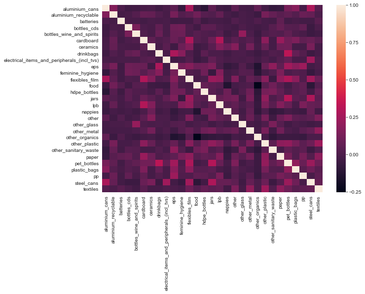


## Statsmodel OLS


```python
from statsmodels.regression.linear_model import OLS
import statsmodels.api as sm
import statsmodels.stats.api as sms
import statsmodels.formula.api as smf
import scipy.stats as stats
plt.style.use('ggplot')

X_int = sm.tools.add_constant(X)
model = OLS(y, X_int).fit()
model.summary()
```


<table class="simpletable">
<caption>OLS Regression Results</caption>
<tr>
  <th>Dep. Variable:</th>    <td>total_energy_kWh</td> <th>  R-squared:         </th> <td>   0.992</td>
</tr>
<tr>
  <th>Model:</th>                   <td>OLS</td>       <th>  Adj. R-squared:    </th> <td>   0.992</td>
</tr>
<tr>
  <th>Method:</th>             <td>Least Squares</td>  <th>  F-statistic:       </th> <td>   2096.</td>
</tr>
<tr>
  <th>Date:</th>             <td>Tue, 27 Oct 2020</td> <th>  Prob (F-statistic):</th>  <td>  0.00</td> 
</tr>
<tr>
  <th>Time:</th>                 <td>11:48:46</td>     <th>  Log-Likelihood:    </th> <td> -694.44</td>
</tr>
<tr>
  <th>No. Observations:</th>      <td>   516</td>      <th>  AIC:               </th> <td>   1449.</td>
</tr>
<tr>
  <th>Df Residuals:</th>          <td>   486</td>      <th>  BIC:               </th> <td>   1576.</td>
</tr>
<tr>
  <th>Df Model:</th>              <td>    29</td>      <th>                     </th>     <td> </td>   
</tr>
<tr>
  <th>Covariance Type:</th>      <td>nonrobust</td>    <th>                     </th>     <td> </td>   
</tr>
</table>
<table class="simpletable">
<tr>
                       <td></td>                          <th>coef</th>     <th>std err</th>      <th>t</th>      <th>P>|t|</th>  <th>[0.025</th>    <th>0.975]</th>  
</tr>
<tr>
  <th>const</th>                                       <td>   -0.0901</td> <td>    0.080</td> <td>   -1.128</td> <td> 0.260</td> <td>   -0.247</td> <td>    0.067</td>
</tr>
<tr>
  <th>aluminium_cans</th>                              <td>   -0.0238</td> <td>    0.063</td> <td>   -0.380</td> <td> 0.704</td> <td>   -0.147</td> <td>    0.099</td>
</tr>
<tr>
  <th>aluminium_recyclable</th>                        <td>    0.0748</td> <td>    0.423</td> <td>    0.177</td> <td> 0.860</td> <td>   -0.755</td> <td>    0.905</td>
</tr>
<tr>
  <th>batteries</th>                                   <td>   -7.7792</td> <td>    1.891</td> <td>   -4.113</td> <td> 0.000</td> <td>  -11.496</td> <td>   -4.063</td>
</tr>
<tr>
  <th>bottles_cds</th>                                 <td>   -0.1660</td> <td>    0.214</td> <td>   -0.776</td> <td> 0.438</td> <td>   -0.586</td> <td>    0.254</td>
</tr>
<tr>
  <th>bottles_wine_and_spirits</th>                    <td>   -0.1591</td> <td>    0.252</td> <td>   -0.631</td> <td> 0.528</td> <td>   -0.654</td> <td>    0.336</td>
</tr>
<tr>
  <th>cardboard</th>                                   <td>    1.3185</td> <td>    0.140</td> <td>    9.425</td> <td> 0.000</td> <td>    1.044</td> <td>    1.593</td>
</tr>
<tr>
  <th>ceramics</th>                                    <td>   -0.2133</td> <td>    0.685</td> <td>   -0.311</td> <td> 0.756</td> <td>   -1.560</td> <td>    1.133</td>
</tr>
<tr>
  <th>drinkbags</th>                                   <td>    0.5455</td> <td>    1.301</td> <td>    0.419</td> <td> 0.675</td> <td>   -2.010</td> <td>    3.101</td>
</tr>
<tr>
  <th>electrical_items_and_peripherals_(incl_tvs)</th> <td>   -0.9696</td> <td>    0.889</td> <td>   -1.091</td> <td> 0.276</td> <td>   -2.716</td> <td>    0.776</td>
</tr>
<tr>
  <th>eps</th>                                         <td>    1.8900</td> <td>    0.783</td> <td>    2.415</td> <td> 0.016</td> <td>    0.352</td> <td>    3.428</td>
</tr>
<tr>
  <th>feminine_hygiene</th>                            <td>    3.6907</td> <td>    0.235</td> <td>   15.696</td> <td> 0.000</td> <td>    3.229</td> <td>    4.153</td>
</tr>
<tr>
  <th>flexibles_film</th>                              <td>    0.8802</td> <td>    0.174</td> <td>    5.057</td> <td> 0.000</td> <td>    0.538</td> <td>    1.222</td>
</tr>
<tr>
  <th>food</th>                                        <td>    3.3253</td> <td>    0.020</td> <td>  169.311</td> <td> 0.000</td> <td>    3.287</td> <td>    3.364</td>
</tr>
<tr>
  <th>hdpe_bottles</th>                                <td>    2.8406</td> <td>    0.530</td> <td>    5.359</td> <td> 0.000</td> <td>    1.799</td> <td>    3.882</td>
</tr>
<tr>
  <th>jars</th>                                        <td>   -0.3421</td> <td>    0.193</td> <td>   -1.773</td> <td> 0.077</td> <td>   -0.721</td> <td>    0.037</td>
</tr>
<tr>
  <th>lpb</th>                                         <td>    1.0103</td> <td>    0.337</td> <td>    3.001</td> <td> 0.003</td> <td>    0.349</td> <td>    1.672</td>
</tr>
<tr>
  <th>nappies</th>                                     <td>    3.2646</td> <td>    0.022</td> <td>  147.493</td> <td> 0.000</td> <td>    3.221</td> <td>    3.308</td>
</tr>
<tr>
  <th>other</th>                                       <td>   -0.2740</td> <td>    0.185</td> <td>   -1.484</td> <td> 0.139</td> <td>   -0.637</td> <td>    0.089</td>
</tr>
<tr>
  <th>other_glass</th>                                 <td>   -0.6256</td> <td>    1.161</td> <td>   -0.539</td> <td> 0.590</td> <td>   -2.907</td> <td>    1.656</td>
</tr>
<tr>
  <th>other_metal</th>                                 <td>    0.0077</td> <td>    0.391</td> <td>    0.020</td> <td> 0.984</td> <td>   -0.761</td> <td>    0.777</td>
</tr>
<tr>
  <th>other_organics</th>                              <td>    3.2458</td> <td>    0.020</td> <td>  162.403</td> <td> 0.000</td> <td>    3.207</td> <td>    3.285</td>
</tr>
<tr>
  <th>other_plastic</th>                               <td>    0.9958</td> <td>    0.170</td> <td>    5.862</td> <td> 0.000</td> <td>    0.662</td> <td>    1.330</td>
</tr>
<tr>
  <th>other_sanitary_waste</th>                        <td>    3.6716</td> <td>    0.127</td> <td>   28.987</td> <td> 0.000</td> <td>    3.423</td> <td>    3.920</td>
</tr>
<tr>
  <th>paper</th>                                       <td>    1.4035</td> <td>    0.203</td> <td>    6.915</td> <td> 0.000</td> <td>    1.005</td> <td>    1.802</td>
</tr>
<tr>
  <th>pet_bottles</th>                                 <td>    0.5361</td> <td>    0.155</td> <td>    3.458</td> <td> 0.001</td> <td>    0.231</td> <td>    0.841</td>
</tr>
<tr>
  <th>plastic_bags</th>                                <td>    0.5485</td> <td>    0.118</td> <td>    4.635</td> <td> 0.000</td> <td>    0.316</td> <td>    0.781</td>
</tr>
<tr>
  <th>pp</th>                                          <td>    1.4359</td> <td>    0.733</td> <td>    1.958</td> <td> 0.051</td> <td>   -0.005</td> <td>    2.877</td>
</tr>
<tr>
  <th>steel_cans</th>                                  <td>   -0.1627</td> <td>    0.083</td> <td>   -1.952</td> <td> 0.052</td> <td>   -0.327</td> <td>    0.001</td>
</tr>
<tr>
  <th>textiles</th>                                    <td>    0.9247</td> <td>    0.109</td> <td>    8.512</td> <td> 0.000</td> <td>    0.711</td> <td>    1.138</td>
</tr>
</table>
<table class="simpletable">
<tr>
  <th>Omnibus:</th>       <td>260.276</td> <th>  Durbin-Watson:     </th> <td>   2.006</td>
</tr>
<tr>
  <th>Prob(Omnibus):</th> <td> 0.000</td>  <th>  Jarque-Bera (JB):  </th> <td>3898.028</td>
</tr>
<tr>
  <th>Skew:</th>          <td>-1.821</td>  <th>  Prob(JB):          </th> <td>    0.00</td>
</tr>
<tr>
  <th>Kurtosis:</th>      <td>15.963</td>  <th>  Cond. No.          </th> <td>    134.</td>
</tr>
</table><br/><br/>Notes:<br/>[1] Standard Errors assume that the covariance matrix of the errors is correctly specified.


```python
# from statsmodels.regression.linear_model import OLS
# import statsmodels.api as sm
# import statsmodels.stats.api as sms
# import statsmodels.formula.api as smf
# import scipy.stats as stats
# plt.style.use('ggplot')

# X_int = sm.tools.add_constant(X)
# model = OLS(y, X_int).fit()
# model.summary()
```


```python
#
# results = []
# print('Model Residuals Plot')
# print('--------------------')
# fig = sm.graphics.qqplot(model.resid, dist=stats.norm, line='45', fit=True)
# plt.show()
# for idx, column in enumerate(X.columns):
#     print(f'Belize MSW Regression Plot for {column} Feature')
#     print('------------------------------------------------')
    
#     fig, axes = plt.subplots(figsize=(15,12))
#     fig = sm.graphics.plot_regress_exog(model, column, fig=fig)
#     fig.tight_layout()
#     plt.show()
    
#     input('Press ENTER to continue...')
```


```python
# Plot redisuals from Statsmodel OLS
plt.scatter(model.predict(X_int), scaler.inverse_transform(model.resid))
plt.plot(model.predict(X_int), [0 for i in range(len(X_int))]);
```


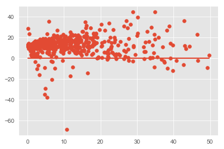


```python
model.predict(X_int)
```


    0       0.826514
    1      12.984664
    2       9.313686
    3       0.595986
    4       9.496008
    5      16.847785
    6      11.513271
    7       5.995017
    8       2.935031
    9      11.317503
    10      1.085964
    12      5.439744
    13      3.228693
    14     13.701900
    15      6.595444
    16     14.290378
    17      5.528725
    18     24.312654
    19     13.088233
    20     22.654283
    21      2.416647
    22      4.792566
    23      1.936755
    24     18.299601
    25      2.508644
    26      1.682131
    27      5.159748
    28      6.442032
    29      4.093297
    30      9.692694
    31      8.929825
    32      9.360254
    33     16.835963
    34      0.897732
    35     11.835366
    36      2.620750
    37      7.217516
    38     23.802051
    39     10.262615
    40      7.409380
    41     13.221055
    42     18.055667
    43      2.388848
    44      5.794616
    45      4.414023
    46      9.074750
    47      9.848725
    48     32.222538
    49      3.824385
    50     17.775287
    51     23.556205
    52     30.081862
    53     17.755210
    54      5.843692
    55      9.956095
    56      9.826669
    57      5.901992
    58     28.145943
    59     11.145319
    60     43.335253
    61     17.728001
    62     13.171220
    63     12.617989
    64     11.889116
    65     26.703001
    66     25.445750
    67     11.394757
    68     31.870140
    69     19.091550
    70      0.512706
    71     11.979965
    72      3.534379
    73     20.434856
    75     22.398607
    76     27.759893
    77     13.929722
    78     10.075974
    79     15.533309
    80      5.493971
    81     13.084950
    82     17.816091
    83     39.220613
    84     15.948356
    85     23.399499
    86     15.528705
    87      7.072786
    88     24.859617
    89      8.125952
    90      2.835966
    91     16.828254
    92      2.142630
    93      6.228910
    94      4.322522
    95      7.278324
    96      4.510558
    97      0.942186
    98      8.044836
    99      3.493886
    100     4.899969
    101     9.196343
    102     3.340185
    103    14.266306
    104     4.130513
    105    22.212783
    106    14.455167
    107     0.779396
    108     4.857849
    109     7.883030
    110     5.585457
    111     9.703495
    112     1.357449
    113     2.529852
    114     5.664535
    115    21.059453
    116     6.495047
    117     2.886330
    118     7.600253
    119     1.434471
    120     3.569649
    121     5.858199
    122     9.846080
    123     3.515660
    124    10.866273
    125    13.523847
    126     9.546021
    127     9.392888
    128    16.050207
    129     6.434900
    130     8.111090
    131    10.560950
    132     8.831108
    133     3.514813
    135     6.041260
    136    16.230016
    137    17.064057
    138    11.178848
    139     6.710419
    140    19.707979
    141    18.909426
    142     4.713009
    143    18.670575
    144    20.339070
    145    11.364158
    146    22.995515
    147     5.201057
    148     8.176677
    149    13.922549
    150    11.379685
    151    34.262678
    152    13.346506
    153    13.005975
    154     4.449894
    155     2.806877
    156     2.561777
    157    11.974581
    158     2.760907
    159     1.795752
    160    16.381635
    161     6.530906
    162     1.892969
    163     1.290481
    164     2.788687
    165    10.395238
    166    13.841658
    167     8.871479
    168     2.671449
    169     9.863434
    170     4.165150
    171     5.855458
    172     2.662558
    173     4.091206
    174    23.136251
    175     7.408451
    176    27.589259
    177     9.424410
    178    10.403241
    179    21.922064
    180     1.066389
    181     1.256116
    182     5.691652
    183     1.882811
    184    14.710296
    185     3.911692
    192     1.221868
    193     1.991277
    194     3.159897
    198     5.312780
    200     1.715768
    207     6.567708
    208    40.734288
    209     1.579582
    210    13.943838
    211     9.685085
    212    14.301742
    213     0.537520
    214     3.652405
    215     3.163460
    216    11.095953
    217     6.001972
    219    15.822172
    220     3.438953
    221     4.979322
    0      10.814076
    1      18.328498
    2      37.531377
    3       1.328372
    4      34.541194
    5      34.798888
    6       3.322460
    7      10.882280
    8       3.832736
    10      6.425387
    11      7.297621
    12     20.217621
    14     18.260550
    16     36.693608
    17     33.578296
    19      2.144161
    20     32.805759
    21      7.835953
    25     26.361934
    27     18.606947
    29      0.290840
    32     15.493000
    33     10.033142
    34      7.210982
    35     17.067705
    37     43.047805
    38     22.911689
    39      1.613777
    41      2.187970
    42     49.721321
    46      5.164861
    50      5.371046
    51      7.446121
    53      7.261551
    54      1.927546
    55      2.114594
    56     20.275229
    58     13.200459
    59      5.046855
    60      6.937069
    61     13.235318
    62      4.128296
    63      2.862100
    64     18.713796
    65      3.561953
    66     29.105837
    68     30.173728
    70     36.999054
             ...    
    93     37.293834
    94     13.375007
    95     22.216610
    96      7.193412
    97      2.734425
    98     13.123147
    99      2.818929
    100    14.077102
    101     0.118780
    102    46.525716
    103    15.389929
    104    11.788236
    105     2.515234
    106    22.139942
    107    12.770594
    108    25.200905
    109    28.902090
    110    16.600599
    111     1.027157
    112    35.874073
    113     1.281481
    114    27.739976
    115    12.477325
    116     7.584294
    117     5.731114
    118    16.200921
    119    19.333400
    120    13.058954
    121    14.591373
    122    39.733486
    123     4.844024
    124    12.853583
    125     6.308378
    127     1.933252
    128    12.114163
    129    21.058000
    130     5.439300
    131     4.489420
    132    10.324407
    138    16.536084
    143    14.310439
    144    13.953331
    145     2.400199
    146     9.214981
    148     1.412040
    149    11.552293
    151     7.045693
    154    34.748465
    155    14.817820
    156    34.965358
    157    27.107280
    160    18.851622
    164    11.865846
    165     9.767262
    167     8.568877
    172     5.417975
    173    10.351373
    174     1.988640
    175     7.214155
    176     5.741901
    177     3.261691
    179     2.512360
    180     8.744174
    181     2.260418
    183     1.572492
    185     0.667661
    186     8.970530
    187     9.719261
    188     2.843359
    189     9.118727
    190     2.748446
    191    13.427344
    192    11.444188
    193     9.794282
    194     9.231143
    195    17.875406
    196    21.992132
    197    14.442535
    198    16.148066
    199     5.505294
    200     6.644423
    201    26.948211
    202     4.541849
    203     6.384306
    204     7.025973
    205    46.663574
    206     8.125250
    207    12.214330
    208     6.682553
    209    31.945667
    210     3.685982
    211    10.335905
    212     7.693711
    213    16.349532
    214     0.186473
    215    21.898271
    216    15.672089
    217    19.450860
    218    15.545192
    219     9.480548
    220     6.568680
    221    13.537583
    222     7.467260
    224     7.548117
    226    21.625011
    227    20.408031
    228    24.340243
    229     5.915665
    230     7.192650
    1      15.235182
    4      30.216300
    7       8.102134
    8      12.377241
    10     11.799879
    16      2.037315
    17     22.807345
    19     39.798959
    21     34.902736
    23      4.693544
    24     16.157448
    25     13.025505
    26     19.137739
    28     14.612638
    29     27.351334
    31      1.085574
    33     23.769440
    34     21.120611
    35      6.913761
    37     26.411519
    39     18.029277
    41     28.851682
    42     33.985589
    43     38.167645
    46     16.520120
    48     42.842987
    51     18.136081
    52     13.855359
    54     12.436428
    55      9.844565
    56      4.333105
    57      3.411765
    58      4.041856
    60     24.916227
    61     29.535575
    63     15.387503
    64      6.813034
    66      5.379944
    67     11.992528
    69      1.188285
    70      1.938396
    71     14.426553
    72     16.704435
    73     22.990827
    74      8.793168
    75     11.968557
    76     38.895609
    77     22.115615
    78     39.088700
    81     11.416381
    82     49.179461
    83     42.754695
    86     32.317475
    87      5.363690
    88      2.574071
    89     29.010316
    90      6.699962
    91     14.925192
    92      3.297935
    93      0.503109
    94      5.138742
    96      1.349089
    97      1.606693
    98     11.427509
    101     3.595955
    102     2.767076
    103    13.949930
    106     4.178871
    107    35.483200
    109     9.299845
    110     1.644592
    111     9.275235
    112    12.033628
    113    15.542307
    114     2.505955
    116     8.842381
    117     2.014069
    118     2.367550
    120     0.489020
    122     6.170807
    123     0.277770
    124     2.439506
    129    11.522154
    130     9.838339
    131     1.932578
    132     0.748781
    136     4.833132
    137     3.970564
    138    14.353580
    139     0.091624
    141    26.356023
    142     5.851587
    143     0.354808
    144     2.145936
    148     4.469327
    149     4.852524
    150     2.038452
    153     7.477409
    154     7.521826
    156    14.818110
    157     0.103437
    158     1.704529
    160    10.404529
    161    18.691388
    162     4.079946
    163    38.376218
    164    17.791042
    165     2.438718
    166     7.510175
    168     4.176658
    169    24.048064
    170    16.070473
    171    13.500188
    172     2.427960
    174     0.209618
    175    26.900974
    176    24.132217
    177     5.865455
    179    31.967825
    180    27.502404
    181     7.117020
    182    10.780992
    183     6.920488
    184     0.805801
    185    23.852896
    186     2.204312
    187     8.096987
    188     4.006383
    189    12.172571
    190     7.419611
    191    17.363025
    192     5.946183
    193     3.748782
    194    10.666954
    195     8.444041
    196     6.024397
    197     5.621997
    198     2.671350
    199     8.313318
    200    33.677687
    202    33.241079
    Length: 516, dtype: float64


```python
plt.scatter(model.predict(X_int), y)
```


    <matplotlib.collections.PathCollection at 0x1c272000438>


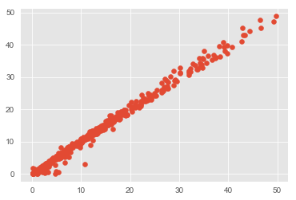


```python
model.resid.mean()
```


    -9.955860425475823e-15


## Scikit Learn LinearRegression Model


```python
from sklearn.linear_model import LinearRegression, LassoCV
linreg = LinearRegression()
linreg.fit(X_train_Scaled, y_train_Scaled)

y_hat_train_scaled = linreg.predict(X_train_Scaled)
y_hat_test_scaled = linreg.predict(X_test_Scaled)

train_residuals = scaler.inverse_transform(y_hat_train_scaled) - y_train
test_residuals = scaler.inverse_transform(y_hat_test_scaled) - y_test

train_mse = mean_squared_error(y_train, scaler.inverse_transform(y_hat_train_scaled))
test_mse = mean_squared_error(y_test, scaler.inverse_transform(y_hat_test_scaled))

print('Train RMSE:', np.sqrt(train_mse))
print('------------------------------')
print('Test RMSE:', np.sqrt(test_mse))
linreg.score(X_test_Scaled, y_test_Scaled)
```

    Train RMSE: 0.9516489799695513
    ------------------------------
    Test RMSE: 0.8361236990107691
    


    0.9946853016254273


```python
plt.scatter(scaler.inverse_transform(y_hat_test_scaled), y_test)
plt.plot(scaler.inverse_transform(y_hat_test_scaled), y_test);
```


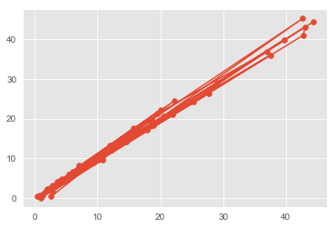


```python
sklearn_results = pd.DataFrame()
sklearn_results['Item'] = [x for x in X_train_Scaled.columns]
sklearn_results['Coef'] = [x for x in linreg.coef_[0]]
print('Sklearn Model Intercept:', linreg.intercept_)
sklearn_results['Coef'].hist();
```

    Sklearn Model Intercept: [1.74102674e-16]
    


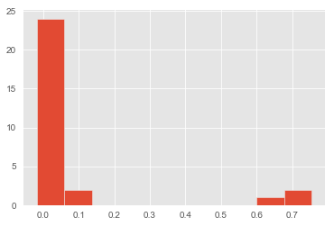


## Decision Tree Regressor

### Baseline Model


```python
from sklearn.tree import DecisionTreeRegressor
regressor = DecisionTreeRegressor(random_state=42)
regressor.fit(X_train_Scaled, y_train_Scaled)
```


    DecisionTreeRegressor(criterion='mse', max_depth=None, max_features=None,
               max_leaf_nodes=None, min_impurity_decrease=0.0,
               min_impurity_split=None, min_samples_leaf=1,
               min_samples_split=2, min_weight_fraction_leaf=0.0,
               presort=False, random_state=42, splitter='best')


```python
from sklearn.metrics import r2_score

y_pred = regressor.predict(X_test_Scaled)
y_pred = scaler.inverse_transform(y_pred)

print('RMSE Score:', np.sqrt(mean_squared_error(y_test, y_pred)))
print('R-sq Score:', r2_score(y_test, y_pred))
```

    RMSE Score: 3.7385908492989097
    R-sq Score: 0.8937440073412928
    


```python
plt.figure(figsize=(10,6))
sns.barplot(X_train_Scaled.columns, regressor.feature_importances_, orient="v");
plt.xticks(rotation=90);
```


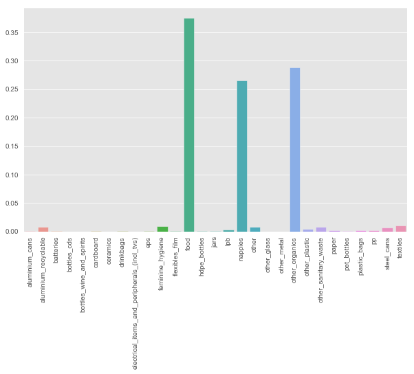


### Optimized Model


```python
op_regressor = DecisionTreeRegressor(random_state=42,
                                     max_depth=4,
                                     min_samples_leaf=2,
                                     min_samples_split=4)
op_regressor.fit(X_train_Scaled, y_train_Scaled)
```


    DecisionTreeRegressor(criterion='mse', max_depth=4, max_features=None,
               max_leaf_nodes=None, min_impurity_decrease=0.0,
               min_impurity_split=None, min_samples_leaf=2,
               min_samples_split=4, min_weight_fraction_leaf=0.0,
               presort=False, random_state=42, splitter='best')


```python
y_pred = op_regressor.predict(X_test_Scaled)
y_pred = scaler.inverse_transform(y_pred)

print('RMSE Score:', np.sqrt(mean_squared_error(y_test, y_pred)))
print('R-sq Score:', r2_score(y_test, y_pred))
```

    RMSE Score: 5.266603000466135
    R-sq Score: 0.7891378064597618
    


```python
plt.figure(figsize=(10,6))
sns.barplot(X_train_Scaled.columns, op_regressor.feature_importances_, orient="v");
plt.xticks(rotation=90);
```


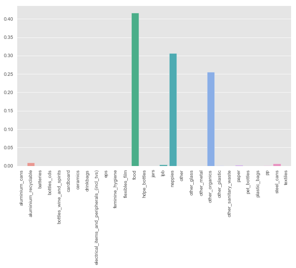


## Random Forest Model


```python
from sklearn.model_selection import GridSearchCV
from sklearn.linear_model import LogisticRegression
from sklearn import tree
from sklearn.ensemble import RandomForestRegressor
from sklearn.metrics import r2_score
from sklearn.tree import export_graphviz
from IPython.display import Image  
from pydotplus import graph_from_dot_data
import pydotplus
from sklearn.pipeline import Pipeline
```

### Baseline Model


```python
rdm_forest = RandomForestRegressor(200, random_state=42)
```


```python
rdm_forest.fit(X_train_Scaled, y_train_Scaled)
```


    RandomForestRegressor(bootstrap=True, criterion='mse', max_depth=None,
               max_features='auto', max_leaf_nodes=None,
               min_impurity_decrease=0.0, min_impurity_split=None,
               min_samples_leaf=1, min_samples_split=2,
               min_weight_fraction_leaf=0.0, n_estimators=200, n_jobs=None,
               oob_score=False, random_state=42, verbose=0, warm_start=False)


```python
rdm_forest.score(X_train_Scaled, y_train_Scaled)
```


    0.9904453325177128


```python
rdm_forest.score(X_test_Scaled, y_test_Scaled)
```


    0.9312683078559036


```python
y_preds = rdm_forest.predict(X_test_Scaled)
y_preds
```


    array([-7.45326316e-02, -9.60877738e-01,  1.54923452e-01, -7.29864050e-01,
           -8.85565870e-01, -7.46943985e-01,  2.19273351e+00, -5.30998531e-01,
           -7.00298869e-01,  1.89367352e+00, -5.25275922e-01, -1.79559576e-02,
           -3.35526537e-01,  5.40574515e-01, -1.10056407e+00, -4.42166268e-01,
           -6.55958420e-01, -1.97690779e-01, -9.49559474e-01, -7.65903787e-01,
           -1.06912878e+00, -7.29539580e-04,  1.22881581e+00, -9.21244282e-01,
           -5.52512022e-01,  2.90823533e+00, -5.68179364e-02,  1.23047596e+00,
            3.86011853e-02, -9.05453398e-01, -8.86464300e-01, -1.13957253e+00,
            4.80365059e-01, -1.42720536e-01,  5.09261301e-01,  1.96445906e+00,
           -9.51722542e-01, -6.43194855e-01,  1.12536942e+00, -1.10349373e+00,
            2.99795284e-01,  3.67909947e-01, -1.04241514e+00, -1.40464696e-01,
           -6.50660613e-01, -4.17234836e-01,  2.53980239e-01, -6.30826795e-01,
            6.61730726e-01, -9.83597274e-01, -9.69071029e-01,  6.77526492e-01,
            2.54331798e-01,  1.59737865e-01, -7.26722957e-02, -4.27457888e-02,
           -1.81812006e-01,  8.62896031e-01,  7.29029966e-01,  1.10594575e+00,
            1.81821029e+00, -1.08858175e+00, -3.90775097e-01,  4.12655666e-01,
           -5.38464288e-01, -2.49399329e-01, -9.99324682e-01,  3.07334625e+00,
            2.84442238e+00, -1.12481679e+00, -2.49130777e-01, -9.77855135e-01,
           -9.84632422e-01,  2.63506526e-01, -6.25314146e-01,  3.21157410e-01,
            3.47389130e-02, -1.11008059e+00])


```python
# Plot redisuals from Random Forest

plt.scatter(scaler.inverse_transform(rdm_forest.predict(X_test_Scaled)), y_test);
# plt.plot(scaler.inverse_transform(rdm_forest.predict(X_test_Scaled)), y_test);
```


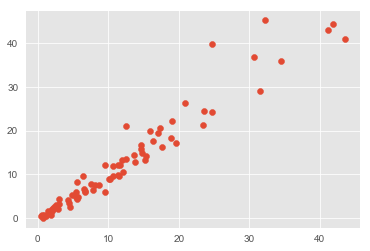


```python
np.sqrt(mean_squared_error(y_test, scaler.inverse_transform(y_preds)))
```


    3.0068359930822433


### GridSearch


```python
rf_grid_reg = RandomForestRegressor(random_state=42)
grid_param = [{'n_estimators': [150, 200, 250, 300],
               'max_depth': [13, 15, 17, 20],
               'min_samples_split': [2, 3, 4, 5],
               'min_samples_leaf': [1, 2, 3]}]
```


```python
# rf_gridsearch = GridSearchCV(rf_grid_reg, grid_param, cv=3)
# rf_gridsearch.fit(X_train_Scaled, y_train_Scaled)
```


```python
# rf_gridsearch.best_params_
```


```python
# rf_gridsearch.score(X_test_Scaled, y_test_Scaled)
```


```python
optimal_rf_model = RandomForestRegressor(max_depth=20,
                                         min_samples_leaf=1,
                                         min_samples_split=3,
                                         n_estimators=200,
                                         random_state=42)
optimal_rf_model.fit(X_train_Scaled, y_train_Scaled)
```


    RandomForestRegressor(bootstrap=True, criterion='mse', max_depth=20,
               max_features='auto', max_leaf_nodes=None,
               min_impurity_decrease=0.0, min_impurity_split=None,
               min_samples_leaf=1, min_samples_split=3,
               min_weight_fraction_leaf=0.0, n_estimators=200, n_jobs=None,
               oob_score=False, random_state=42, verbose=0, warm_start=False)


```python
optimal_rf_model.score(X_train_Scaled, y_train_Scaled)
```


    0.9893350212330665


```python
optimal_rf_model.score(X_test_Scaled, y_test_Scaled)
```


    0.9328774669395232


```python
y_preds = optimal_rf_model.predict(X_test_Scaled)
y_preds
```


    array([-0.06242396, -0.95984967,  0.14700184, -0.73092374, -0.87665485,
           -0.74703163,  2.18361451, -0.52458553, -0.70083812,  1.87780945,
           -0.52237018, -0.02154073, -0.33051589,  0.54684782, -1.09674266,
           -0.44502684, -0.64856471, -0.18101536, -0.94885813, -0.76953349,
           -1.06859822,  0.0095289 ,  1.22882094, -0.91411999, -0.54527958,
            2.90999288, -0.04395948,  1.25244556,  0.05033894, -0.9063808 ,
           -0.88414173, -1.13865653,  0.49496879, -0.15530303,  0.51274567,
            1.97986111, -0.9469593 , -0.64011594,  1.14689595, -1.10183845,
            0.28717176,  0.37323746, -1.04181094, -0.14158147, -0.63697095,
           -0.41740644,  0.26168487, -0.63960769,  0.64130219, -0.98430663,
           -0.96679038,  0.69175082,  0.26496271,  0.14858543, -0.07412289,
           -0.0389186 , -0.17617884,  0.86868221,  0.73283008,  1.08985531,
            1.82445248, -1.08264988, -0.3883538 ,  0.41793201, -0.53871098,
           -0.25562592, -1.00018174,  3.06989409,  2.81338635, -1.11998842,
           -0.25196569, -0.98211407, -0.98461388,  0.25801381, -0.62376277,
            0.32969439,  0.03840319, -1.1103399 ])


```python
plt.scatter(scaler.inverse_transform(optimal_rf_model.predict(X_test_Scaled)), y_test);
```


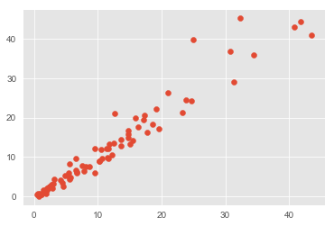


```python
np.sqrt(mean_squared_error(y_test, scaler.inverse_transform(y_preds)))
```


    2.9714292281826133


```python
def plot_feature_importances(model):
    n_features = X_train.shape[1]
    plt.figure(figsize=(20,20))
    plt.barh(range(n_features), model.feature_importances_, align='center') 
    plt.yticks(np.arange(n_features), X_train.columns.values) 
    plt.xlabel('Feature importance', fontsize=18)
    plt.yticks(fontsize=15)
    plt.ylabel('Feature', fontsize=18)
    plt.yticks(fontsize=15)

plot_feature_importances(optimal_rf_model)
```


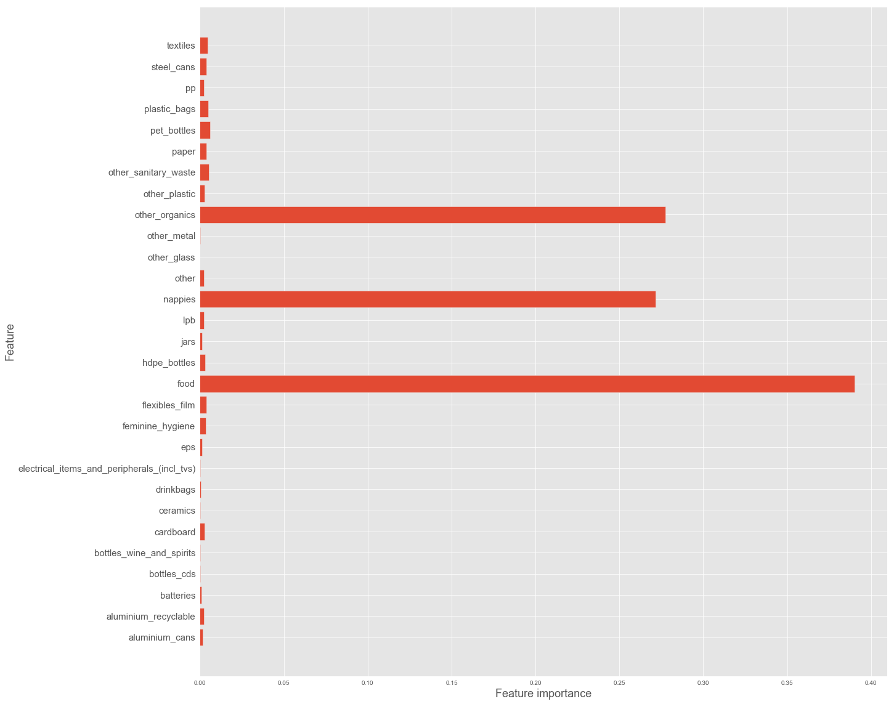


## XG Boost


```python
import xgboost as xgb

xgb_reg = xgb.XGBRegressor(random_state=42)
xgb_reg.fit(X_train_Scaled, y_train_Scaled)
```


    XGBRegressor(base_score=0.5, booster='gbtree', colsample_bylevel=1,
           colsample_bytree=1, gamma=0, learning_rate=0.1, max_delta_step=0,
           max_depth=3, min_child_weight=1, missing=None, n_estimators=100,
           n_jobs=1, nthread=None, objective='reg:linear', random_state=42,
           reg_alpha=0, reg_lambda=1, scale_pos_weight=1, seed=None,
           silent=True, subsample=1)


```python
xgb_reg.score(X_train_Scaled, y_train_Scaled)
```


    0.9938883151193825


```python
xgb_reg.score(X_test_Scaled, y_test_Scaled)
```


    0.9467979553634431


```python
training_preds = scaler.inverse_transform(xgb_reg.predict(X_train_Scaled))
test_preds = scaler.inverse_transform(xgb_reg.predict(X_test_Scaled))
```


```python
print('Train RMSE:', np.sqrt(mean_squared_error(y_train, training_preds)))
print('Test RMSE:', np.sqrt(mean_squared_error(y_test, test_preds)))
```

    Train RMSE: 0.8005419215692037
    Test RMSE: 2.645424539619799
    


```python
plot_feature_importances(xgb_reg)
```


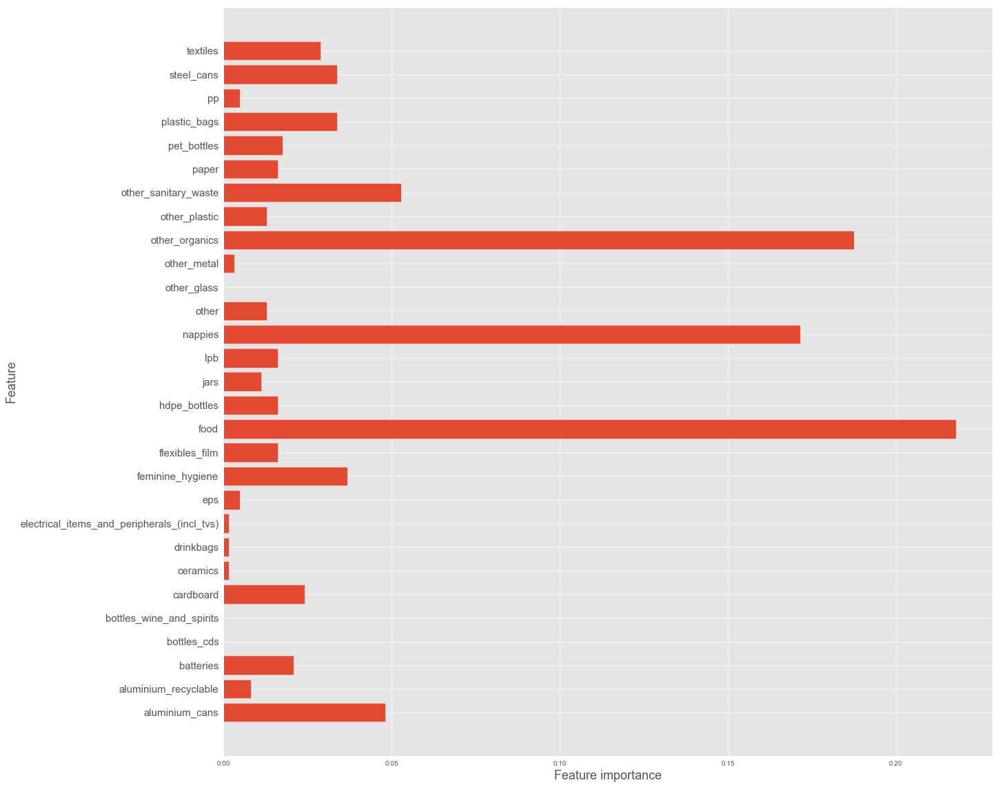


### GridSearch


```python
xgb_grid_model = xgb.XGBRegressor(random_state=42)

xgb_reg_grid_param = [{'max_depth': [5, 7, 10, 12],
               'learning_rate': [0.1, 0.2],
               'n_estimators': [100, 150, 200],
               'min_child_weight': [2, 3, 4],
               'max_delta_step': [0, 1]}]
```


```python
xgbclf_gridsearch = GridSearchCV(xgb_grid_model,
                                 xgb_reg_grid_param,
                                 scoring='neg_mean_squared_error')
xgbclf_gridsearch.fit(X_train_Scaled, y_train_Scaled)
```


    ---------------------------------------------------------------------------

    KeyboardInterrupt                         Traceback (most recent call last)

    <ipython-input-57-248e0944ff33> in <module>()
          2                                  xgb_reg_grid_param,
          3                                  scoring='neg_mean_squared_error')
    ----> 4 xgbclf_gridsearch.fit(X_train_Scaled, y_train_Scaled)
    

    ~\anaconda3\envs\learn-env\lib\site-packages\sklearn\model_selection\_search.py in fit(self, X, y, groups, **fit_params)
        720                 return results_container[0]
        721 
    --> 722             self._run_search(evaluate_candidates)
        723 
        724         results = results_container[0]
    

    ~\anaconda3\envs\learn-env\lib\site-packages\sklearn\model_selection\_search.py in _run_search(self, evaluate_candidates)
       1189     def _run_search(self, evaluate_candidates):
       1190         """Search all candidates in param_grid"""
    -> 1191         evaluate_candidates(ParameterGrid(self.param_grid))
       1192 
       1193 
    

    ~\anaconda3\envs\learn-env\lib\site-packages\sklearn\model_selection\_search.py in evaluate_candidates(candidate_params)
        709                                for parameters, (train, test)
        710                                in product(candidate_params,
    --> 711                                           cv.split(X, y, groups)))
        712 
        713                 all_candidate_params.extend(candidate_params)
    

    ~\anaconda3\envs\learn-env\lib\site-packages\sklearn\externals\joblib\parallel.py in __call__(self, iterable)
        918                 self._iterating = self._original_iterator is not None
        919 
    --> 920             while self.dispatch_one_batch(iterator):
        921                 pass
        922 
    

    ~\anaconda3\envs\learn-env\lib\site-packages\sklearn\externals\joblib\parallel.py in dispatch_one_batch(self, iterator)
        757                 return False
        758             else:
    --> 759                 self._dispatch(tasks)
        760                 return True
        761 
    

    ~\anaconda3\envs\learn-env\lib\site-packages\sklearn\externals\joblib\parallel.py in _dispatch(self, batch)
        714         with self._lock:
        715             job_idx = len(self._jobs)
    --> 716             job = self._backend.apply_async(batch, callback=cb)
        717             # A job can complete so quickly than its callback is
        718             # called before we get here, causing self._jobs to
    

    ~\anaconda3\envs\learn-env\lib\site-packages\sklearn\externals\joblib\_parallel_backends.py in apply_async(self, func, callback)
        180     def apply_async(self, func, callback=None):
        181         """Schedule a func to be run"""
    --> 182         result = ImmediateResult(func)
        183         if callback:
        184             callback(result)
    

    ~\anaconda3\envs\learn-env\lib\site-packages\sklearn\externals\joblib\_parallel_backends.py in __init__(self, batch)
        547         # Don't delay the application, to avoid keeping the input
        548         # arguments in memory
    --> 549         self.results = batch()
        550 
        551     def get(self):
    

    ~\anaconda3\envs\learn-env\lib\site-packages\sklearn\externals\joblib\parallel.py in __call__(self)
        223         with parallel_backend(self._backend, n_jobs=self._n_jobs):
        224             return [func(*args, **kwargs)
    --> 225                     for func, args, kwargs in self.items]
        226 
        227     def __len__(self):
    

    ~\anaconda3\envs\learn-env\lib\site-packages\sklearn\externals\joblib\parallel.py in <listcomp>(.0)
        223         with parallel_backend(self._backend, n_jobs=self._n_jobs):
        224             return [func(*args, **kwargs)
    --> 225                     for func, args, kwargs in self.items]
        226 
        227     def __len__(self):
    

    ~\anaconda3\envs\learn-env\lib\site-packages\sklearn\model_selection\_validation.py in _fit_and_score(estimator, X, y, scorer, train, test, verbose, parameters, fit_params, return_train_score, return_parameters, return_n_test_samples, return_times, return_estimator, error_score)
        526             estimator.fit(X_train, **fit_params)
        527         else:
    --> 528             estimator.fit(X_train, y_train, **fit_params)
        529 
        530     except Exception as e:
    

    ~\anaconda3\envs\learn-env\lib\site-packages\xgboost\sklearn.py in fit(self, X, y, sample_weight, eval_set, eval_metric, early_stopping_rounds, verbose, xgb_model, sample_weight_eval_set)
        300                               early_stopping_rounds=early_stopping_rounds,
        301                               evals_result=evals_result, obj=obj, feval=feval,
    --> 302                               verbose_eval=verbose, xgb_model=xgb_model)
        303 
        304         if evals_result:
    

    ~\anaconda3\envs\learn-env\lib\site-packages\xgboost\training.py in train(params, dtrain, num_boost_round, evals, obj, feval, maximize, early_stopping_rounds, evals_result, verbose_eval, xgb_model, callbacks, learning_rates)
        202                            evals=evals,
        203                            obj=obj, feval=feval,
    --> 204                            xgb_model=xgb_model, callbacks=callbacks)
        205 
        206 
    

    ~\anaconda3\envs\learn-env\lib\site-packages\xgboost\training.py in _train_internal(params, dtrain, num_boost_round, evals, obj, feval, xgb_model, callbacks)
         72         # Skip the first update if it is a recovery step.
         73         if version % 2 == 0:
    ---> 74             bst.update(dtrain, i, obj)
         75             bst.save_rabit_checkpoint()
         76             version += 1
    

    ~\anaconda3\envs\learn-env\lib\site-packages\xgboost\core.py in update(self, dtrain, iteration, fobj)
        892         if fobj is None:
        893             _check_call(_LIB.XGBoosterUpdateOneIter(self.handle, ctypes.c_int(iteration),
    --> 894                                                     dtrain.handle))
        895         else:
        896             pred = self.predict(dtrain)
    

    KeyboardInterrupt: 


```python
xgbclf_gridsearch.best_params_
```


```python
xgb_grid_model = xgb.XGBRegressor(learning_rate = 0.1,
                                  max_delta_step = 1,
                                  max_depth = 5,
                                  min_child_weight = 3,
                                  n_estimators = 200,
                                  random_state=42)
xgb_grid_model.fit(X_train_Scaled, y_train_Scaled)
```


    XGBRegressor(base_score=0.5, booster='gbtree', colsample_bylevel=1,
           colsample_bytree=1, gamma=0, learning_rate=0.1, max_delta_step=1,
           max_depth=5, min_child_weight=3, missing=None, n_estimators=200,
           n_jobs=1, nthread=None, objective='reg:linear', random_state=42,
           reg_alpha=0, reg_lambda=1, scale_pos_weight=1, seed=None,
           silent=True, subsample=1)


```python
xgb_grid_model.score(X_train_Scaled, y_train_Scaled)
```


    0.9996621914402065


```python
xgb_grid_model.score(X_test_Scaled, y_test_Scaled)
```


    0.947040804841784


```python
training_preds = scaler.inverse_transform(xgb_grid_model.predict(X_train_Scaled))
test_preds = scaler.inverse_transform(xgb_grid_model.predict(X_test_Scaled))
```


```python
print('Train RMSE:', np.sqrt(mean_squared_error(y_train, training_preds)))
print('Test RMSE:', np.sqrt(mean_squared_error(y_test, test_preds)))
```

    Train RMSE: 0.18820831030912136
    Test RMSE: 2.639379992817984
    


```python
plot_feature_importances(xgb_grid_model)
```


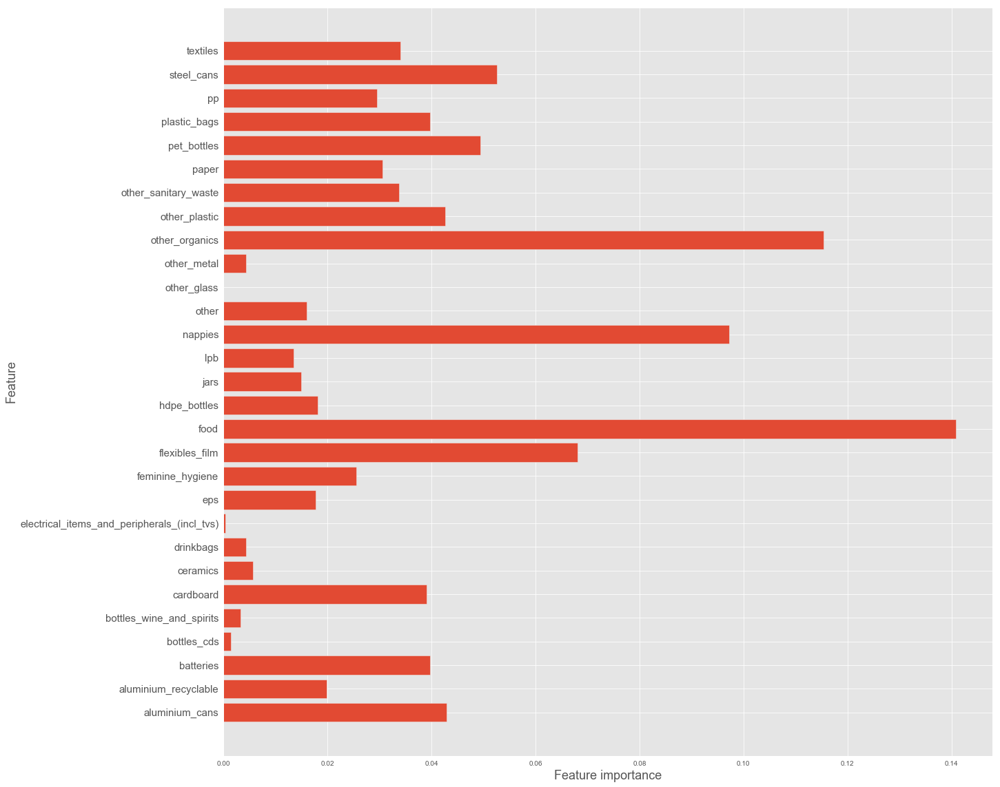


## MLP Regression Model


```python
from keras import layers, models, optimizers, regularizers
from keras import backend as K
from keras.models import Sequential
from tensorflow.keras.callbacks import TensorBoard
from keras.wrappers.scikit_learn import KerasRegressor
```


```python
n_features = X_train_Scaled.shape[1]
```

### Loss, MSE, & R^2 Visualization Function


```python
def coef_determination(y_true, y_pred):
    SS_res = K.sum(K.square(y_true-y_pred))
    SS_tot = K.sum(K.square(y_true - K.mean(y_true)))
    return (1 - SS_res/(SS_tot + K.epsilon()))
```


```python
#Build vizualization function for training/validation loss and accuracy
def visualize_loss_MSE(results):
    history = results.history
    
    plt.plot(history['loss'], 'b', label='Training Loss')
    plt.title('Training Loss')
    plt.xlabel('Epochs', fontsize=12)
    plt.ylabel('Loss', fontsize=12)
    plt.legend(loc='best')
    plt.show()
    
    plt.plot(history['mse'], 'b', label='Training MSE')
    plt.title('Training MSE')
    plt.xlabel('Epochs', fontsize=12)
    plt.ylabel('MSE', fontsize=12)
    plt.legend(loc='best')
    plt.show()
    
    plt.plot(history['coef_determination'], 'b', label='Training R^2')
    plt.title('Training R^2')
    plt.xlabel('Epochs', fontsize=12)
    plt.ylabel('R^2', fontsize=12)
    plt.legend(loc='best')
    plt.show()
```

### Baseline Model


```python
baseline_model = Sequential()

baseline_model.add(layers.Dense(10, activation='relu', input_shape=(n_features, )))

baseline_model.add(layers.Dense(5, activation='relu'))

baseline_model.add(layers.Dense(1, activation='linear'))

baseline_model.compile(optimizer='SGD',
              loss='mse',
              metrics=['mse', coef_determination])

```


```python
baseline_model.fit(X_train_Scaled,
                  y_train_Scaled,
                  epochs=150)
```

    Epoch 1/150
    14/14 [==============================] - 0s 855us/step - loss: 1.5462 - mse: 1.5462 - coef_determination: -0.7075
    Epoch 2/150
    14/14 [==============================] - 0s 784us/step - loss: 1.2260 - mse: 1.2260 - coef_determination: -0.2850
    Epoch 3/150
    14/14 [==============================] - 0s 855us/step - loss: 1.1028 - mse: 1.1028 - coef_determination: -0.1345
    Epoch 4/150
    14/14 [==============================] - 0s 856us/step - loss: 1.0348 - mse: 1.0348 - coef_determination: -0.1082
    Epoch 5/150
    14/14 [==============================] - 0s 641us/step - loss: 0.9829 - mse: 0.9829 - coef_determination: -0.0169
    Epoch 6/150
    14/14 [==============================] - 0s 642us/step - loss: 0.9357 - mse: 0.9357 - coef_determination: 0.0395
    Epoch 7/150
    14/14 [==============================] - 0s 570us/step - loss: 0.8915 - mse: 0.8915 - coef_determination: 0.0813
    Epoch 8/150
    14/14 [==============================] - 0s 570us/step - loss: 0.8463 - mse: 0.8463 - coef_determination: 0.1001
    Epoch 9/150
    14/14 [==============================] - 0s 641us/step - loss: 0.7997 - mse: 0.7997 - coef_determination: 0.1642
    Epoch 10/150
    14/14 [==============================] - 0s 712us/step - loss: 0.7451 - mse: 0.7451 - coef_determination: 0.2049
    Epoch 11/150
    14/14 [==============================] - 0s 712us/step - loss: 0.6953 - mse: 0.6953 - coef_determination: 0.2504
    Epoch 12/150
    14/14 [==============================] - 0s 712us/step - loss: 0.6368 - mse: 0.6368 - coef_determination: 0.3359
    Epoch 13/150
    14/14 [==============================] - 0s 641us/step - loss: 0.5771 - mse: 0.5771 - coef_determination: 0.3511
    Epoch 14/150
    14/14 [==============================] - 0s 641us/step - loss: 0.5136 - mse: 0.5136 - coef_determination: 0.4683
    Epoch 15/150
    14/14 [==============================] - 0s 712us/step - loss: 0.4584 - mse: 0.4584 - coef_determination: 0.5033
    Epoch 16/150
    14/14 [==============================] - 0s 641us/step - loss: 0.4040 - mse: 0.4040 - coef_determination: 0.5687
    Epoch 17/150
    14/14 [==============================] - 0s 641us/step - loss: 0.3569 - mse: 0.3569 - coef_determination: 0.5902
    Epoch 18/150
    14/14 [==============================] - 0s 712us/step - loss: 0.3121 - mse: 0.3121 - coef_determination: 0.6603
    Epoch 19/150
    14/14 [==============================] - 0s 712us/step - loss: 0.2765 - mse: 0.2765 - coef_determination: 0.6733
    Epoch 20/150
    14/14 [==============================] - 0s 716us/step - loss: 0.2444 - mse: 0.2444 - coef_determination: 0.7038
    Epoch 21/150
    14/14 [==============================] - 0s 641us/step - loss: 0.2203 - mse: 0.2203 - coef_determination: 0.7416
    Epoch 22/150
    14/14 [==============================] - 0s 712us/step - loss: 0.2005 - mse: 0.2005 - coef_determination: 0.7822
    Epoch 23/150
    14/14 [==============================] - 0s 784us/step - loss: 0.1845 - mse: 0.1845 - coef_determination: 0.7923
    Epoch 24/150
    14/14 [==============================] - 0s 641us/step - loss: 0.1709 - mse: 0.1709 - coef_determination: 0.8154
    Epoch 25/150
    14/14 [==============================] - 0s 712us/step - loss: 0.1601 - mse: 0.1601 - coef_determination: 0.8172
    Epoch 26/150
    14/14 [==============================] - 0s 709us/step - loss: 0.1511 - mse: 0.1511 - coef_determination: 0.8433
    Epoch 27/150
    14/14 [==============================] - 0s 641us/step - loss: 0.1434 - mse: 0.1434 - coef_determination: 0.8342
    Epoch 28/150
    14/14 [==============================] - 0s 641us/step - loss: 0.1366 - mse: 0.1366 - coef_determination: 0.8397
    Epoch 29/150
    14/14 [==============================] - 0s 641us/step - loss: 0.1305 - mse: 0.1305 - coef_determination: 0.8510
    Epoch 30/150
    14/14 [==============================] - 0s 641us/step - loss: 0.1249 - mse: 0.1249 - coef_determination: 0.8709
    Epoch 31/150
    14/14 [==============================] - 0s 642us/step - loss: 0.1200 - mse: 0.1200 - coef_determination: 0.8573
    Epoch 32/150
    14/14 [==============================] - 0s 712us/step - loss: 0.1159 - mse: 0.1159 - coef_determination: 0.8707
    Epoch 33/150
    14/14 [==============================] - 0s 712us/step - loss: 0.1128 - mse: 0.1128 - coef_determination: 0.8762
    Epoch 34/150
    14/14 [==============================] - 0s 715us/step - loss: 0.1090 - mse: 0.1090 - coef_determination: 0.8588
    Epoch 35/150
    14/14 [==============================] - 0s 641us/step - loss: 0.1059 - mse: 0.1059 - coef_determination: 0.8883
    Epoch 36/150
    14/14 [==============================] - 0s 641us/step - loss: 0.1035 - mse: 0.1035 - coef_determination: 0.8845
    Epoch 37/150
    14/14 [==============================] - 0s 641us/step - loss: 0.1010 - mse: 0.1010 - coef_determination: 0.8837
    Epoch 38/150
    14/14 [==============================] - 0s 641us/step - loss: 0.0983 - mse: 0.0983 - coef_determination: 0.8879
    Epoch 39/150
    14/14 [==============================] - 0s 641us/step - loss: 0.0957 - mse: 0.0957 - coef_determination: 0.8916
    Epoch 40/150
    14/14 [==============================] - 0s 641us/step - loss: 0.0933 - mse: 0.0933 - coef_determination: 0.8912
    Epoch 41/150
    14/14 [==============================] - 0s 712us/step - loss: 0.0911 - mse: 0.0911 - coef_determination: 0.8979
    Epoch 42/150
    14/14 [==============================] - 0s 645us/step - loss: 0.0892 - mse: 0.0892 - coef_determination: 0.8889
    Epoch 43/150
    14/14 [==============================] - 0s 784us/step - loss: 0.0867 - mse: 0.0867 - coef_determination: 0.9133
    Epoch 44/150
    14/14 [==============================] - 0s 641us/step - loss: 0.0851 - mse: 0.0851 - coef_determination: 0.9081
    Epoch 45/150
    14/14 [==============================] - 0s 641us/step - loss: 0.0831 - mse: 0.0831 - coef_determination: 0.9002
    Epoch 46/150
    14/14 [==============================] - 0s 570us/step - loss: 0.0815 - mse: 0.0815 - coef_determination: 0.9168
    Epoch 47/150
    14/14 [==============================] - 0s 570us/step - loss: 0.0802 - mse: 0.0802 - coef_determination: 0.9084
    Epoch 48/150
    14/14 [==============================] - 0s 570us/step - loss: 0.0788 - mse: 0.0788 - coef_determination: 0.9135
    Epoch 49/150
    14/14 [==============================] - 0s 641us/step - loss: 0.0770 - mse: 0.0770 - coef_determination: 0.9150
    Epoch 50/150
    14/14 [==============================] - 0s 641us/step - loss: 0.0756 - mse: 0.0756 - coef_determination: 0.9133
    Epoch 51/150
    14/14 [==============================] - 0s 641us/step - loss: 0.0745 - mse: 0.0745 - coef_determination: 0.9229
    Epoch 52/150
    14/14 [==============================] - 0s 641us/step - loss: 0.0732 - mse: 0.0732 - coef_determination: 0.9235
    Epoch 53/150
    14/14 [==============================] - 0s 641us/step - loss: 0.0717 - mse: 0.0717 - coef_determination: 0.9270
    Epoch 54/150
    14/14 [==============================] - 0s 570us/step - loss: 0.0705 - mse: 0.0705 - coef_determination: 0.9206
    Epoch 55/150
    14/14 [==============================] - 0s 641us/step - loss: 0.0696 - mse: 0.0696 - coef_determination: 0.9247
    Epoch 56/150
    14/14 [==============================] - 0s 641us/step - loss: 0.0685 - mse: 0.0685 - coef_determination: 0.9201
    Epoch 57/150
    14/14 [==============================] - 0s 712us/step - loss: 0.0675 - mse: 0.0675 - coef_determination: 0.9216
    Epoch 58/150
    14/14 [==============================] - 0s 712us/step - loss: 0.0660 - mse: 0.0660 - coef_determination: 0.9267
    Epoch 59/150
    14/14 [==============================] - 0s 712us/step - loss: 0.0648 - mse: 0.0648 - coef_determination: 0.9231
    Epoch 60/150
    14/14 [==============================] - 0s 641us/step - loss: 0.0635 - mse: 0.0635 - coef_determination: 0.9329
    Epoch 61/150
    14/14 [==============================] - 0s 641us/step - loss: 0.0624 - mse: 0.0624 - coef_determination: 0.9305
    Epoch 62/150
    14/14 [==============================] - 0s 641us/step - loss: 0.0617 - mse: 0.0617 - coef_determination: 0.9286
    Epoch 63/150
    14/14 [==============================] - 0s 644us/step - loss: 0.0610 - mse: 0.0610 - coef_determination: 0.9368
    Epoch 64/150
    14/14 [==============================] - 0s 641us/step - loss: 0.0599 - mse: 0.0599 - coef_determination: 0.9383
    Epoch 65/150
    14/14 [==============================] - 0s 712us/step - loss: 0.0588 - mse: 0.0588 - coef_determination: 0.9285
    Epoch 66/150
    14/14 [==============================] - 0s 641us/step - loss: 0.0581 - mse: 0.0581 - coef_determination: 0.9305
    Epoch 67/150
    14/14 [==============================] - 0s 641us/step - loss: 0.0570 - mse: 0.0570 - coef_determination: 0.9375
    Epoch 68/150
    14/14 [==============================] - 0s 712us/step - loss: 0.0564 - mse: 0.0564 - coef_determination: 0.9393
    Epoch 69/150
    14/14 [==============================] - 0s 738us/step - loss: 0.0557 - mse: 0.0557 - coef_determination: 0.9397
    Epoch 70/150
    14/14 [==============================] - 0s 803us/step - loss: 0.0549 - mse: 0.0549 - coef_determination: 0.9409
    Epoch 71/150
    14/14 [==============================] - 0s 784us/step - loss: 0.0543 - mse: 0.0543 - coef_determination: 0.9402
    Epoch 72/150
    14/14 [==============================] - 0s 641us/step - loss: 0.0534 - mse: 0.0534 - coef_determination: 0.9419
    Epoch 73/150
    14/14 [==============================] - 0s 712us/step - loss: 0.0527 - mse: 0.0527 - coef_determination: 0.9430
    Epoch 74/150
    14/14 [==============================] - 0s 712us/step - loss: 0.0517 - mse: 0.0517 - coef_determination: 0.9404
    Epoch 75/150
    14/14 [==============================] - 0s 641us/step - loss: 0.0511 - mse: 0.0511 - coef_determination: 0.9431
    Epoch 76/150
    14/14 [==============================] - 0s 644us/step - loss: 0.0502 - mse: 0.0502 - coef_determination: 0.9434
    Epoch 77/150
    14/14 [==============================] - 0s 641us/step - loss: 0.0496 - mse: 0.0496 - coef_determination: 0.9431
    Epoch 78/150
    14/14 [==============================] - 0s 641us/step - loss: 0.0489 - mse: 0.0489 - coef_determination: 0.9439
    Epoch 79/150
    14/14 [==============================] - 0s 641us/step - loss: 0.0482 - mse: 0.0482 - coef_determination: 0.9468
    Epoch 80/150
    14/14 [==============================] - 0s 712us/step - loss: 0.0476 - mse: 0.0476 - coef_determination: 0.9419
    Epoch 81/150
    14/14 [==============================] - 0s 784us/step - loss: 0.0470 - mse: 0.0470 - coef_determination: 0.9454
    Epoch 82/150
    14/14 [==============================] - 0s 713us/step - loss: 0.0464 - mse: 0.0464 - coef_determination: 0.9456
    Epoch 83/150
    14/14 [==============================] - 0s 641us/step - loss: 0.0460 - mse: 0.0460 - coef_determination: 0.9505
    Epoch 84/150
    14/14 [==============================] - 0s 641us/step - loss: 0.0454 - mse: 0.0454 - coef_determination: 0.9524
    Epoch 85/150
    14/14 [==============================] - 0s 784us/step - loss: 0.0447 - mse: 0.0447 - coef_determination: 0.9523
    Epoch 86/150
    14/14 [==============================] - 0s 641us/step - loss: 0.0444 - mse: 0.0444 - coef_determination: 0.9529
    Epoch 87/150
    14/14 [==============================] - 0s 643us/step - loss: 0.0437 - mse: 0.0437 - coef_determination: 0.9534
    Epoch 88/150
    14/14 [==============================] - 0s 641us/step - loss: 0.0432 - mse: 0.0432 - coef_determination: 0.9476
    Epoch 89/150
    14/14 [==============================] - 0s 641us/step - loss: 0.0428 - mse: 0.0428 - coef_determination: 0.9513
    Epoch 90/150
    14/14 [==============================] - 0s 641us/step - loss: 0.0424 - mse: 0.0424 - coef_determination: 0.9512
    Epoch 91/150
    14/14 [==============================] - 0s 641us/step - loss: 0.0420 - mse: 0.0420 - coef_determination: 0.9531
    Epoch 92/150
    14/14 [==============================] - 0s 641us/step - loss: 0.0416 - mse: 0.0416 - coef_determination: 0.9522
    Epoch 93/150
    14/14 [==============================] - 0s 641us/step - loss: 0.0410 - mse: 0.0410 - coef_determination: 0.9569
    Epoch 94/150
    14/14 [==============================] - 0s 641us/step - loss: 0.0408 - mse: 0.0408 - coef_determination: 0.9571
    Epoch 95/150
    14/14 [==============================] - 0s 570us/step - loss: 0.0402 - mse: 0.0402 - coef_determination: 0.9540
    Epoch 96/150
    14/14 [==============================] - 0s 641us/step - loss: 0.0399 - mse: 0.0399 - coef_determination: 0.9571
    Epoch 97/150
    14/14 [==============================] - 0s 570us/step - loss: 0.0397 - mse: 0.0397 - coef_determination: 0.9490
    Epoch 98/150
    14/14 [==============================] - 0s 641us/step - loss: 0.0391 - mse: 0.0391 - coef_determination: 0.9555
    Epoch 99/150
    14/14 [==============================] - 0s 641us/step - loss: 0.0389 - mse: 0.0389 - coef_determination: 0.9533
    Epoch 100/150
    14/14 [==============================] - 0s 642us/step - loss: 0.0385 - mse: 0.0385 - coef_determination: 0.9582
    Epoch 101/150
    14/14 [==============================] - 0s 641us/step - loss: 0.0381 - mse: 0.0381 - coef_determination: 0.9574
    Epoch 102/150
    14/14 [==============================] - 0s 712us/step - loss: 0.0378 - mse: 0.0378 - coef_determination: 0.9558
    Epoch 103/150
    14/14 [==============================] - 0s 641us/step - loss: 0.0376 - mse: 0.0376 - coef_determination: 0.9598
    Epoch 104/150
    14/14 [==============================] - 0s 641us/step - loss: 0.0372 - mse: 0.0372 - coef_determination: 0.9582
    Epoch 105/150
    14/14 [==============================] - 0s 641us/step - loss: 0.0370 - mse: 0.0370 - coef_determination: 0.9578
    Epoch 106/150
    14/14 [==============================] - 0s 641us/step - loss: 0.0367 - mse: 0.0367 - coef_determination: 0.9594
    Epoch 107/150
    14/14 [==============================] - 0s 641us/step - loss: 0.0363 - mse: 0.0363 - coef_determination: 0.9566
    Epoch 108/150
    14/14 [==============================] - 0s 570us/step - loss: 0.0360 - mse: 0.0360 - coef_determination: 0.9618
    Epoch 109/150
    14/14 [==============================] - 0s 570us/step - loss: 0.0356 - mse: 0.0356 - coef_determination: 0.9610
    Epoch 110/150
    14/14 [==============================] - 0s 641us/step - loss: 0.0354 - mse: 0.0354 - coef_determination: 0.9595
    Epoch 111/150
    14/14 [==============================] - 0s 570us/step - loss: 0.0350 - mse: 0.0350 - coef_determination: 0.9614
    Epoch 112/150
    14/14 [==============================] - 0s 570us/step - loss: 0.0347 - mse: 0.0347 - coef_determination: 0.9577
    Epoch 113/150
    14/14 [==============================] - 0s 641us/step - loss: 0.0343 - mse: 0.0343 - coef_determination: 0.9632
    Epoch 114/150
    14/14 [==============================] - 0s 641us/step - loss: 0.0340 - mse: 0.0340 - coef_determination: 0.9616
    Epoch 115/150
    14/14 [==============================] - 0s 644us/step - loss: 0.0336 - mse: 0.0336 - coef_determination: 0.9628
    Epoch 116/150
    14/14 [==============================] - 0s 641us/step - loss: 0.0334 - mse: 0.0334 - coef_determination: 0.9611
    Epoch 117/150
    14/14 [==============================] - 0s 641us/step - loss: 0.0332 - mse: 0.0332 - coef_determination: 0.9635
    Epoch 118/150
    14/14 [==============================] - 0s 641us/step - loss: 0.0330 - mse: 0.0330 - coef_determination: 0.9615
    Epoch 119/150
    14/14 [==============================] - 0s 570us/step - loss: 0.0327 - mse: 0.0327 - coef_determination: 0.9636
    Epoch 120/150
    14/14 [==============================] - 0s 641us/step - loss: 0.0323 - mse: 0.0323 - coef_determination: 0.9626
    Epoch 121/150
    14/14 [==============================] - 0s 641us/step - loss: 0.0320 - mse: 0.0320 - coef_determination: 0.9647
    Epoch 122/150
    14/14 [==============================] - 0s 570us/step - loss: 0.0320 - mse: 0.0320 - coef_determination: 0.9635
    Epoch 123/150
    14/14 [==============================] - 0s 641us/step - loss: 0.0315 - mse: 0.0315 - coef_determination: 0.9668
    Epoch 124/150
    14/14 [==============================] - 0s 641us/step - loss: 0.0314 - mse: 0.0314 - coef_determination: 0.9639
    Epoch 125/150
    14/14 [==============================] - 0s 641us/step - loss: 0.0312 - mse: 0.0312 - coef_determination: 0.9643
    Epoch 126/150
    14/14 [==============================] - 0s 641us/step - loss: 0.0309 - mse: 0.0309 - coef_determination: 0.9647
    Epoch 127/150
    14/14 [==============================] - 0s 570us/step - loss: 0.0306 - mse: 0.0306 - coef_determination: 0.9614
    Epoch 128/150
    14/14 [==============================] - 0s 712us/step - loss: 0.0305 - mse: 0.0305 - coef_determination: 0.9642
    Epoch 129/150
    14/14 [==============================] - 0s 641us/step - loss: 0.0302 - mse: 0.0302 - coef_determination: 0.9671
    Epoch 130/150
    14/14 [==============================] - 0s 641us/step - loss: 0.0301 - mse: 0.0301 - coef_determination: 0.9679
    Epoch 131/150
    14/14 [==============================] - 0s 572us/step - loss: 0.0298 - mse: 0.0298 - coef_determination: 0.9632
    Epoch 132/150
    14/14 [==============================] - 0s 638us/step - loss: 0.0296 - mse: 0.0296 - coef_determination: 0.9681
    Epoch 133/150
    14/14 [==============================] - 0s 715us/step - loss: 0.0294 - mse: 0.0294 - coef_determination: 0.9684
    Epoch 134/150
    14/14 [==============================] - 0s 784us/step - loss: 0.0292 - mse: 0.0292 - coef_determination: 0.9655
    Epoch 135/150
    14/14 [==============================] - 0s 713us/step - loss: 0.0291 - mse: 0.0291 - coef_determination: 0.9660
    Epoch 136/150
    14/14 [==============================] - 0s 709us/step - loss: 0.0289 - mse: 0.0289 - coef_determination: 0.9668
    Epoch 137/150
    14/14 [==============================] - 0s 713us/step - loss: 0.0287 - mse: 0.0287 - coef_determination: 0.9664
    Epoch 138/150
    14/14 [==============================] - 0s 781us/step - loss: 0.0285 - mse: 0.0285 - coef_determination: 0.9686
    Epoch 139/150
    14/14 [==============================] - 0s 645us/step - loss: 0.0282 - mse: 0.0282 - coef_determination: 0.9693
    Epoch 140/150
    14/14 [==============================] - 0s 784us/step - loss: 0.0282 - mse: 0.0282 - coef_determination: 0.9695
    Epoch 141/150
    14/14 [==============================] - 0s 782us/step - loss: 0.0281 - mse: 0.0281 - coef_determination: 0.9670
    Epoch 142/150
    14/14 [==============================] - 0s 641us/step - loss: 0.0279 - mse: 0.0279 - coef_determination: 0.9613
    Epoch 143/150
    14/14 [==============================] - 0s 641us/step - loss: 0.0277 - mse: 0.0277 - coef_determination: 0.9666
    Epoch 144/150
    14/14 [==============================] - 0s 781us/step - loss: 0.0276 - mse: 0.0276 - coef_determination: 0.9692
    Epoch 145/150
    14/14 [==============================] - ETA: 0s - loss: 0.0191 - mse: 0.0191 - coef_determination: 0.98 - 0s 746us/step - loss: 0.0273 - mse: 0.0273 - coef_determination: 0.9676
    Epoch 146/150
    14/14 [==============================] - 0s 710us/step - loss: 0.0273 - mse: 0.0273 - coef_determination: 0.9694
    Epoch 147/150
    14/14 [==============================] - 0s 712us/step - loss: 0.0271 - mse: 0.0271 - coef_determination: 0.9696
    Epoch 148/150
    14/14 [==============================] - 0s 781us/step - loss: 0.0269 - mse: 0.0269 - coef_determination: 0.9714
    Epoch 149/150
    14/14 [==============================] - 0s 712us/step - loss: 0.0268 - mse: 0.0268 - coef_determination: 0.9709
    Epoch 150/150
    14/14 [==============================] - 0s 638us/step - loss: 0.0267 - mse: 0.0267 - coef_determination: 0.9685
    


    <tensorflow.python.keras.callbacks.History at 0x1c276c12978>


```python
visualize_loss_MSE(baseline_model.history)
```


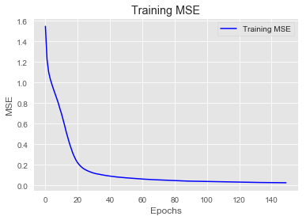


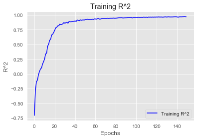


```python
baseline_preds_scaled = baseline_model.predict(X_test_Scaled)
baseline_preds = scaler.inverse_transform(baseline_preds_scaled)
rmse = np.sqrt(mean_squared_error(y_test, baseline_preds))

print('RMSE:', rmse)
print('-------------------------')
print(baseline_model.summary())
```

    RMSE: 3.0048039182206567
    -------------------------
    Model: "sequential"
    _________________________________________________________________
    Layer (type)                 Output Shape              Param #   
    =================================================================
    dense (Dense)                (None, 10)                300       
    _________________________________________________________________
    dense_1 (Dense)              (None, 5)                 55        
    _________________________________________________________________
    dense_2 (Dense)              (None, 1)                 6         
    =================================================================
    Total params: 361
    Trainable params: 361
    Non-trainable params: 0
    _________________________________________________________________
    None
    

### Overfit Model


```python
overfit_model = Sequential()

overfit_model.add(layers.Dense(10, activation='relu', input_shape=(n_features, )))

overfit_model.add(layers.Dense(10, activation='relu'))

overfit_model.add(layers.Dense(10, activation='relu'))

overfit_model.add(layers.Dense(10, activation='relu'))

overfit_model.add(layers.Dense(1, activation='linear'))

overfit_model.compile(optimizer='SGD',
              loss='mse',
              metrics=['mse', coef_determination])

```


```python
overfit_model.fit(X_train_Scaled,
                  y_train_Scaled,
                  epochs=150)
```

    Epoch 1/150
     1/14 [=>............................] - ETA: 0s - loss: 1.5465 - mse: 1.5465 - coef_determination: -0.3178WARNING:tensorflow:Callbacks method `on_train_batch_end` is slow compared to the batch time (batch time: 0.0000s vs `on_train_batch_end` time: 0.0010s). Check your callbacks.
    14/14 [==============================] - 0s 786us/step - loss: 1.0838 - mse: 1.0838 - coef_determination: -0.1248
    Epoch 2/150
    14/14 [==============================] - 0s 851us/step - loss: 0.9822 - mse: 0.9822 - coef_determination: -0.0281
    Epoch 3/150
    14/14 [==============================] - 0s 785us/step - loss: 0.9399 - mse: 0.9399 - coef_determination: 0.0336
    Epoch 4/150
    14/14 [==============================] - 0s 782us/step - loss: 0.9012 - mse: 0.9012 - coef_determination: 0.0379
    Epoch 5/150
    14/14 [==============================] - 0s 784us/step - loss: 0.8657 - mse: 0.8657 - coef_determination: 0.1190
    Epoch 6/150
    14/14 [==============================] - 0s 784us/step - loss: 0.8285 - mse: 0.8285 - coef_determination: 0.1202
    Epoch 7/150
    14/14 [==============================] - 0s 717us/step - loss: 0.7891 - mse: 0.7891 - coef_determination: 0.1836
    Epoch 8/150
    14/14 [==============================] - 0s 709us/step - loss: 0.7428 - mse: 0.7428 - coef_determination: 0.2123
    Epoch 9/150
    14/14 [==============================] - 0s 715us/step - loss: 0.6902 - mse: 0.6902 - coef_determination: 0.2890
    Epoch 10/150
    14/14 [==============================] - 0s 641us/step - loss: 0.6384 - mse: 0.6384 - coef_determination: 0.3157
    Epoch 11/150
    14/14 [==============================] - 0s 712us/step - loss: 0.5848 - mse: 0.5848 - coef_determination: 0.3640
    Epoch 12/150
    14/14 [==============================] - 0s 641us/step - loss: 0.5297 - mse: 0.5297 - coef_determination: 0.4494
    Epoch 13/150
    14/14 [==============================] - 0s 712us/step - loss: 0.4768 - mse: 0.4768 - coef_determination: 0.4660
    Epoch 14/150
    14/14 [==============================] - 0s 712us/step - loss: 0.4265 - mse: 0.4265 - coef_determination: 0.5318
    Epoch 15/150
    14/14 [==============================] - 0s 645us/step - loss: 0.3837 - mse: 0.3837 - coef_determination: 0.5921
    Epoch 16/150
    14/14 [==============================] - 0s 786us/step - loss: 0.3455 - mse: 0.3455 - coef_determination: 0.6385
    Epoch 17/150
    14/14 [==============================] - 0s 640us/step - loss: 0.3177 - mse: 0.3177 - coef_determination: 0.6397
    Epoch 18/150
    14/14 [==============================] - 0s 712us/step - loss: 0.2960 - mse: 0.2960 - coef_determination: 0.6561
    Epoch 19/150
    14/14 [==============================] - 0s 641us/step - loss: 0.2776 - mse: 0.2776 - coef_determination: 0.7074
    Epoch 20/150
    14/14 [==============================] - 0s 712us/step - loss: 0.2650 - mse: 0.2650 - coef_determination: 0.7087
    Epoch 21/150
    14/14 [==============================] - 0s 641us/step - loss: 0.2537 - mse: 0.2537 - coef_determination: 0.7021
    Epoch 22/150
    14/14 [==============================] - 0s 712us/step - loss: 0.2434 - mse: 0.2434 - coef_determination: 0.7394
    Epoch 23/150
    14/14 [==============================] - 0s 712us/step - loss: 0.2355 - mse: 0.2355 - coef_determination: 0.7145
    Epoch 24/150
    14/14 [==============================] - 0s 712us/step - loss: 0.2285 - mse: 0.2285 - coef_determination: 0.7270
    Epoch 25/150
    14/14 [==============================] - 0s 644us/step - loss: 0.2220 - mse: 0.2220 - coef_determination: 0.7563
    Epoch 26/150
    14/14 [==============================] - 0s 712us/step - loss: 0.2153 - mse: 0.2153 - coef_determination: 0.7653
    Epoch 27/150
    14/14 [==============================] - 0s 712us/step - loss: 0.2114 - mse: 0.2114 - coef_determination: 0.7749
    Epoch 28/150
    14/14 [==============================] - 0s 786us/step - loss: 0.2067 - mse: 0.2067 - coef_determination: 0.7691
    Epoch 29/150
    14/14 [==============================] - 0s 855us/step - loss: 0.2026 - mse: 0.2026 - coef_determination: 0.7931
    Epoch 30/150
    14/14 [==============================] - 0s 715us/step - loss: 0.1988 - mse: 0.1988 - coef_determination: 0.7773
    Epoch 31/150
    14/14 [==============================] - 0s 712us/step - loss: 0.1955 - mse: 0.1955 - coef_determination: 0.7842
    Epoch 32/150
    14/14 [==============================] - 0s 781us/step - loss: 0.1917 - mse: 0.1917 - coef_determination: 0.7579
    Epoch 33/150
    14/14 [==============================] - 0s 782us/step - loss: 0.1895 - mse: 0.1895 - coef_determination: 0.8003
    Epoch 34/150
    14/14 [==============================] - 0s 784us/step - loss: 0.1864 - mse: 0.1864 - coef_determination: 0.7948
    Epoch 35/150
    14/14 [==============================] - 0s 712us/step - loss: 0.1833 - mse: 0.1833 - coef_determination: 0.8078
    Epoch 36/150
    14/14 [==============================] - 0s 712us/step - loss: 0.1809 - mse: 0.1809 - coef_determination: 0.8001
    Epoch 37/150
    14/14 [==============================] - 0s 784us/step - loss: 0.1775 - mse: 0.1775 - coef_determination: 0.8127
    Epoch 38/150
    14/14 [==============================] - 0s 781us/step - loss: 0.1755 - mse: 0.1755 - coef_determination: 0.8090
    Epoch 39/150
    14/14 [==============================] - 0s 712us/step - loss: 0.1724 - mse: 0.1724 - coef_determination: 0.8061
    Epoch 40/150
    14/14 [==============================] - 0s 715us/step - loss: 0.1695 - mse: 0.1695 - coef_determination: 0.8157
    Epoch 41/150
    14/14 [==============================] - 0s 709us/step - loss: 0.1668 - mse: 0.1668 - coef_determination: 0.8026
    Epoch 42/150
    14/14 [==============================] - 0s 639us/step - loss: 0.1648 - mse: 0.1648 - coef_determination: 0.8274
    Epoch 43/150
    14/14 [==============================] - 0s 781us/step - loss: 0.1618 - mse: 0.1618 - coef_determination: 0.8083
    Epoch 44/150
    14/14 [==============================] - 0s 710us/step - loss: 0.1592 - mse: 0.1592 - coef_determination: 0.8230
    Epoch 45/150
    14/14 [==============================] - 0s 641us/step - loss: 0.1571 - mse: 0.1571 - coef_determination: 0.8323
    Epoch 46/150
    14/14 [==============================] - 0s 641us/step - loss: 0.1546 - mse: 0.1546 - coef_determination: 0.8256
    Epoch 47/150
    14/14 [==============================] - 0s 641us/step - loss: 0.1532 - mse: 0.1532 - coef_determination: 0.8240
    Epoch 48/150
    14/14 [==============================] - 0s 715us/step - loss: 0.1501 - mse: 0.1501 - coef_determination: 0.8242
    Epoch 49/150
    14/14 [==============================] - 0s 712us/step - loss: 0.1479 - mse: 0.1479 - coef_determination: 0.8338
    Epoch 50/150
    14/14 [==============================] - 0s 641us/step - loss: 0.1461 - mse: 0.1461 - coef_determination: 0.8399
    Epoch 51/150
    14/14 [==============================] - 0s 712us/step - loss: 0.1434 - mse: 0.1434 - coef_determination: 0.8403
    Epoch 52/150
    14/14 [==============================] - 0s 640us/step - loss: 0.1410 - mse: 0.1410 - coef_determination: 0.8278
    Epoch 53/150
    14/14 [==============================] - 0s 639us/step - loss: 0.1392 - mse: 0.1392 - coef_determination: 0.8384
    Epoch 54/150
    14/14 [==============================] - 0s 641us/step - loss: 0.1371 - mse: 0.1371 - coef_determination: 0.8410
    Epoch 55/150
    14/14 [==============================] - 0s 716us/step - loss: 0.1356 - mse: 0.1356 - coef_determination: 0.8462
    Epoch 56/150
    14/14 [==============================] - 0s 712us/step - loss: 0.1331 - mse: 0.1331 - coef_determination: 0.8591
    Epoch 57/150
    14/14 [==============================] - 0s 717us/step - loss: 0.1314 - mse: 0.1314 - coef_determination: 0.8578
    Epoch 58/150
    14/14 [==============================] - 0s 713us/step - loss: 0.1298 - mse: 0.1298 - coef_determination: 0.8438
    Epoch 59/150
    14/14 [==============================] - 0s 668us/step - loss: 0.1276 - mse: 0.1276 - coef_determination: 0.8559
    Epoch 60/150
    14/14 [==============================] - 0s 712us/step - loss: 0.1265 - mse: 0.1265 - coef_determination: 0.8706
    Epoch 61/150
    14/14 [==============================] - 0s 784us/step - loss: 0.1245 - mse: 0.1245 - coef_determination: 0.8611
    Epoch 62/150
    14/14 [==============================] - 0s 781us/step - loss: 0.1220 - mse: 0.1220 - coef_determination: 0.8709
    Epoch 63/150
    14/14 [==============================] - 0s 712us/step - loss: 0.1203 - mse: 0.1203 - coef_determination: 0.8697
    Epoch 64/150
    14/14 [==============================] - 0s 709us/step - loss: 0.1186 - mse: 0.1186 - coef_determination: 0.8743
    Epoch 65/150
    14/14 [==============================] - 0s 641us/step - loss: 0.1167 - mse: 0.1167 - coef_determination: 0.8670
    Epoch 66/150
    14/14 [==============================] - 0s 712us/step - loss: 0.1145 - mse: 0.1145 - coef_determination: 0.8823
    Epoch 67/150
    14/14 [==============================] - 0s 712us/step - loss: 0.1125 - mse: 0.1125 - coef_determination: 0.8614
    Epoch 68/150
    14/14 [==============================] - 0s 710us/step - loss: 0.1099 - mse: 0.1099 - coef_determination: 0.8778
    Epoch 69/150
    14/14 [==============================] - 0s 709us/step - loss: 0.1083 - mse: 0.1083 - coef_determination: 0.8786
    Epoch 70/150
    14/14 [==============================] - 0s 784us/step - loss: 0.1066 - mse: 0.1066 - coef_determination: 0.8767
    Epoch 71/150
    14/14 [==============================] - 0s 644us/step - loss: 0.1043 - mse: 0.1043 - coef_determination: 0.8849
    Epoch 72/150
    14/14 [==============================] - 0s 712us/step - loss: 0.1037 - mse: 0.1037 - coef_determination: 0.8871
    Epoch 73/150
    14/14 [==============================] - 0s 712us/step - loss: 0.1015 - mse: 0.1015 - coef_determination: 0.8902
    Epoch 74/150
    14/14 [==============================] - 0s 641us/step - loss: 0.0999 - mse: 0.0999 - coef_determination: 0.8860
    Epoch 75/150
    14/14 [==============================] - 0s 783us/step - loss: 0.0982 - mse: 0.0982 - coef_determination: 0.8912
    Epoch 76/150
    14/14 [==============================] - 0s 710us/step - loss: 0.0965 - mse: 0.0965 - coef_determination: 0.8860
    Epoch 77/150
    14/14 [==============================] - 0s 712us/step - loss: 0.0952 - mse: 0.0952 - coef_determination: 0.8837
    Epoch 78/150
    14/14 [==============================] - 0s 781us/step - loss: 0.0937 - mse: 0.0937 - coef_determination: 0.8890
    Epoch 79/150
    14/14 [==============================] - 0s 710us/step - loss: 0.0924 - mse: 0.0924 - coef_determination: 0.8965
    Epoch 80/150
    14/14 [==============================] - 0s 856us/step - loss: 0.0907 - mse: 0.0907 - coef_determination: 0.9051
    Epoch 81/150
    14/14 [==============================] - 0s 712us/step - loss: 0.0898 - mse: 0.0898 - coef_determination: 0.8927
    Epoch 82/150
    14/14 [==============================] - 0s 641us/step - loss: 0.0885 - mse: 0.0885 - coef_determination: 0.9024
    Epoch 83/150
    14/14 [==============================] - 0s 712us/step - loss: 0.0876 - mse: 0.0876 - coef_determination: 0.8980
    Epoch 84/150
    14/14 [==============================] - 0s 715us/step - loss: 0.0866 - mse: 0.0866 - coef_determination: 0.8982
    Epoch 85/150
    14/14 [==============================] - 0s 926us/step - loss: 0.0847 - mse: 0.0847 - coef_determination: 0.8997
    Epoch 86/150
    14/14 [==============================] - 0s 712us/step - loss: 0.0838 - mse: 0.0838 - coef_determination: 0.8944
    Epoch 87/150
    14/14 [==============================] - 0s 712us/step - loss: 0.0824 - mse: 0.0824 - coef_determination: 0.8984
    Epoch 88/150
    14/14 [==============================] - 0s 712us/step - loss: 0.0815 - mse: 0.0815 - coef_determination: 0.8921
    Epoch 89/150
    14/14 [==============================] - 0s 641us/step - loss: 0.0807 - mse: 0.0807 - coef_determination: 0.8995
    Epoch 90/150
    14/14 [==============================] - 0s 710us/step - loss: 0.0796 - mse: 0.0796 - coef_determination: 0.9144
    Epoch 91/150
    14/14 [==============================] - 0s 784us/step - loss: 0.0785 - mse: 0.0785 - coef_determination: 0.9194
    Epoch 92/150
    14/14 [==============================] - 0s 710us/step - loss: 0.0772 - mse: 0.0772 - coef_determination: 0.9183
    Epoch 93/150
    14/14 [==============================] - 0s 639us/step - loss: 0.0767 - mse: 0.0767 - coef_determination: 0.9074
    Epoch 94/150
    14/14 [==============================] - 0s 640us/step - loss: 0.0757 - mse: 0.0757 - coef_determination: 0.9155
    Epoch 95/150
    14/14 [==============================] - 0s 712us/step - loss: 0.0751 - mse: 0.0751 - coef_determination: 0.9178
    Epoch 96/150
    14/14 [==============================] - 0s 710us/step - loss: 0.0741 - mse: 0.0741 - coef_determination: 0.9176
    Epoch 97/150
    14/14 [==============================] - 0s 712us/step - loss: 0.0731 - mse: 0.0731 - coef_determination: 0.9204
    Epoch 98/150
    14/14 [==============================] - 0s 637us/step - loss: 0.0725 - mse: 0.0725 - coef_determination: 0.9155
    Epoch 99/150
    14/14 [==============================] - 0s 641us/step - loss: 0.0715 - mse: 0.0715 - coef_determination: 0.9237
    Epoch 100/150
    14/14 [==============================] - 0s 713us/step - loss: 0.0708 - mse: 0.0708 - coef_determination: 0.9236
    Epoch 101/150
    14/14 [==============================] - 0s 710us/step - loss: 0.0702 - mse: 0.0702 - coef_determination: 0.9215
    Epoch 102/150
    14/14 [==============================] - 0s 710us/step - loss: 0.0694 - mse: 0.0694 - coef_determination: 0.9217
    Epoch 103/150
    14/14 [==============================] - 0s 641us/step - loss: 0.0686 - mse: 0.0686 - coef_determination: 0.9154
    Epoch 104/150
    14/14 [==============================] - 0s 782us/step - loss: 0.0681 - mse: 0.0681 - coef_determination: 0.9130
    Epoch 105/150
    14/14 [==============================] - 0s 713us/step - loss: 0.0672 - mse: 0.0672 - coef_determination: 0.9221
    Epoch 106/150
    14/14 [==============================] - ETA: 0s - loss: 0.0811 - mse: 0.0811 - coef_determination: 0.92 - 0s 638us/step - loss: 0.0668 - mse: 0.0668 - coef_determination: 0.9304
    Epoch 107/150
    14/14 [==============================] - 0s 709us/step - loss: 0.0655 - mse: 0.0655 - coef_determination: 0.9294
    Epoch 108/150
    14/14 [==============================] - 0s 713us/step - loss: 0.0649 - mse: 0.0649 - coef_determination: 0.9222
    Epoch 109/150
    14/14 [==============================] - 0s 710us/step - loss: 0.0641 - mse: 0.0641 - coef_determination: 0.9293
    Epoch 110/150
    14/14 [==============================] - 0s 710us/step - loss: 0.0636 - mse: 0.0636 - coef_determination: 0.9311
    Epoch 111/150
    14/14 [==============================] - 0s 641us/step - loss: 0.0628 - mse: 0.0628 - coef_determination: 0.9301
    Epoch 112/150
    14/14 [==============================] - 0s 712us/step - loss: 0.0623 - mse: 0.0623 - coef_determination: 0.9262
    Epoch 113/150
    14/14 [==============================] - 0s 642us/step - loss: 0.0618 - mse: 0.0618 - coef_determination: 0.9356
    Epoch 114/150
    14/14 [==============================] - ETA: 0s - loss: 0.0499 - mse: 0.0499 - coef_determination: 0.89 - 0s 715us/step - loss: 0.0615 - mse: 0.0615 - coef_determination: 0.9283
    Epoch 115/150
    14/14 [==============================] - 0s 640us/step - loss: 0.0604 - mse: 0.0604 - coef_determination: 0.9272
    Epoch 116/150
    14/14 [==============================] - 0s 641us/step - loss: 0.0599 - mse: 0.0599 - coef_determination: 0.9389
    Epoch 117/150
    14/14 [==============================] - 0s 712us/step - loss: 0.0595 - mse: 0.0595 - coef_determination: 0.9357
    Epoch 118/150
    14/14 [==============================] - 0s 783us/step - loss: 0.0588 - mse: 0.0588 - coef_determination: 0.9332
    Epoch 119/150
    14/14 [==============================] - 0s 721us/step - loss: 0.0586 - mse: 0.0586 - coef_determination: 0.9356
    Epoch 120/150
    14/14 [==============================] - 0s 712us/step - loss: 0.0581 - mse: 0.0581 - coef_determination: 0.9274
    Epoch 121/150
    14/14 [==============================] - 0s 712us/step - loss: 0.0576 - mse: 0.0576 - coef_determination: 0.9363
    Epoch 122/150
    14/14 [==============================] - 0s 705us/step - loss: 0.0567 - mse: 0.0567 - coef_determination: 0.9212
    Epoch 123/150
    14/14 [==============================] - 0s 710us/step - loss: 0.0562 - mse: 0.0562 - coef_determination: 0.9365
    Epoch 124/150
    14/14 [==============================] - 0s 926us/step - loss: 0.0559 - mse: 0.0559 - coef_determination: 0.9404
    Epoch 125/150
    14/14 [==============================] - 0s 855us/step - loss: 0.0553 - mse: 0.0553 - coef_determination: 0.9258
    Epoch 126/150
    14/14 [==============================] - 0s 784us/step - loss: 0.0549 - mse: 0.0549 - coef_determination: 0.9400
    Epoch 127/150
    14/14 [==============================] - 0s 712us/step - loss: 0.0544 - mse: 0.0544 - coef_determination: 0.9390
    Epoch 128/150
    14/14 [==============================] - 0s 712us/step - loss: 0.0540 - mse: 0.0540 - coef_determination: 0.9364
    Epoch 129/150
    14/14 [==============================] - 0s 857us/step - loss: 0.0534 - mse: 0.0534 - coef_determination: 0.9411
    Epoch 130/150
    14/14 [==============================] - 0s 784us/step - loss: 0.0529 - mse: 0.0529 - coef_determination: 0.9449
    Epoch 131/150
    14/14 [==============================] - 0s 641us/step - loss: 0.0525 - mse: 0.0525 - coef_determination: 0.9412
    Epoch 132/150
    14/14 [==============================] - 0s 855us/step - loss: 0.0521 - mse: 0.0521 - coef_determination: 0.9405
    Epoch 133/150
    14/14 [==============================] - 0s 784us/step - loss: 0.0516 - mse: 0.0516 - coef_determination: 0.9390
    Epoch 134/150
    14/14 [==============================] - 0s 713us/step - loss: 0.0509 - mse: 0.0509 - coef_determination: 0.9388
    Epoch 135/150
    14/14 [==============================] - 0s 641us/step - loss: 0.0505 - mse: 0.0505 - coef_determination: 0.9455
    Epoch 136/150
    14/14 [==============================] - 0s 641us/step - loss: 0.0502 - mse: 0.0502 - coef_determination: 0.9455
    Epoch 137/150
    14/14 [==============================] - 0s 855us/step - loss: 0.0497 - mse: 0.0497 - coef_determination: 0.9481
    Epoch 138/150
    14/14 [==============================] - 0s 784us/step - loss: 0.0492 - mse: 0.0492 - coef_determination: 0.9283
    Epoch 139/150
    14/14 [==============================] - 0s 712us/step - loss: 0.0489 - mse: 0.0489 - coef_determination: 0.9400
    Epoch 140/150
    14/14 [==============================] - 0s 712us/step - loss: 0.0485 - mse: 0.0485 - coef_determination: 0.9448
    Epoch 141/150
    14/14 [==============================] - 0s 713us/step - loss: 0.0479 - mse: 0.0479 - coef_determination: 0.9504
    Epoch 142/150
    14/14 [==============================] - 0s 715us/step - loss: 0.0477 - mse: 0.0477 - coef_determination: 0.9479
    Epoch 143/150
    14/14 [==============================] - 0s 641us/step - loss: 0.0473 - mse: 0.0473 - coef_determination: 0.9462
    Epoch 144/150
    14/14 [==============================] - 0s 787us/step - loss: 0.0467 - mse: 0.0467 - coef_determination: 0.9505
    Epoch 145/150
    14/14 [==============================] - 0s 712us/step - loss: 0.0461 - mse: 0.0461 - coef_determination: 0.9510
    Epoch 146/150
    14/14 [==============================] - 0s 784us/step - loss: 0.0460 - mse: 0.0460 - coef_determination: 0.9483
    Epoch 147/150
    14/14 [==============================] - ETA: 0s - loss: 0.0226 - mse: 0.0226 - coef_determination: 0.97 - 0s 712us/step - loss: 0.0461 - mse: 0.0461 - coef_determination: 0.9435
    Epoch 148/150
    14/14 [==============================] - 0s 712us/step - loss: 0.0453 - mse: 0.0453 - coef_determination: 0.9506
    Epoch 149/150
    14/14 [==============================] - 0s 641us/step - loss: 0.0446 - mse: 0.0446 - coef_determination: 0.9471
    Epoch 150/150
    14/14 [==============================] - 0s 713us/step - loss: 0.0445 - mse: 0.0445 - coef_determination: 0.9524
    


    <tensorflow.python.keras.callbacks.History at 0x1c2771332b0>


```python
visualize_loss_MSE(overfit_model.history)
```


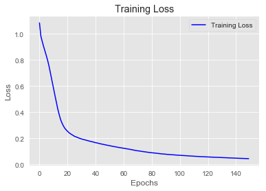


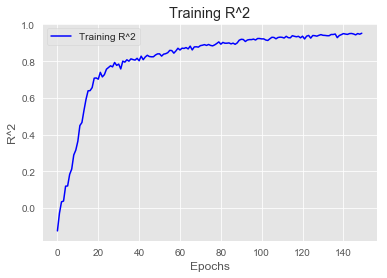


```python
overfit_preds_scaled = overfit_model.predict(X_test_Scaled)
overfit_preds = scaler.inverse_transform(overfit_preds_scaled)
rmse = np.sqrt(mean_squared_error(y_test, overfit_preds))

print('RMSE:', rmse)
print('-------------------------')
print(overfit_model.summary())
```

    RMSE: 3.987558806459101
    -------------------------
    Model: "sequential_1"
    _________________________________________________________________
    Layer (type)                 Output Shape              Param #   
    =================================================================
    dense_3 (Dense)              (None, 10)                300       
    _________________________________________________________________
    dense_4 (Dense)              (None, 10)                110       
    _________________________________________________________________
    dense_5 (Dense)              (None, 10)                110       
    _________________________________________________________________
    dense_6 (Dense)              (None, 10)                110       
    _________________________________________________________________
    dense_7 (Dense)              (None, 1)                 11        
    =================================================================
    Total params: 641
    Trainable params: 641
    Non-trainable params: 0
    _________________________________________________________________
    None
    

### Regularized Model


```python
reg_model = Sequential()

reg_model.add(layers.Dense(10, kernel_regularizer=regularizers.L2(0.005),
                           activation='relu', input_shape=(n_features, )))

reg_model.add(layers.Dense(10, kernel_regularizer=regularizers.L2(0.005),
                           activation='relu'))

reg_model.add(layers.Dense(10, kernel_regularizer=regularizers.L2(0.005),
                           activation='relu'))

reg_model.add(layers.Dense(10, kernel_regularizer=regularizers.L2(0.005),
                           activation='relu'))

reg_model.add(layers.Dense(10, kernel_regularizer=regularizers.L2(0.005),
                           activation='relu'))

reg_model.add(layers.Dense(1, activation='linear'))

reg_model.compile(optimizer='SGD',
              loss='mse',
              metrics=['mse', coef_determination])

```


```python
reg_model.fit(X_train_Scaled,
                  y_train_Scaled,
                  epochs=150)
```

    Epoch 1/150
    14/14 [==============================] - 0s 925us/step - loss: 1.2839 - mse: 0.9994 - coef_determination: -0.0409
    Epoch 2/150
    14/14 [==============================] - 0s 997us/step - loss: 1.2631 - mse: 0.9794 - coef_determination: -0.0276
    Epoch 3/150
    14/14 [==============================] - 0s 926us/step - loss: 1.2522 - mse: 0.9692 - coef_determination: -0.0795
    Epoch 4/150
    14/14 [==============================] - 0s 997us/step - loss: 1.2371 - mse: 0.9549 - coef_determination: 0.0195
    Epoch 5/150
    14/14 [==============================] - 0s 855us/step - loss: 1.2275 - mse: 0.9460 - coef_determination: -0.0067
    Epoch 6/150
    14/14 [==============================] - 0s 855us/step - loss: 1.2157 - mse: 0.9347 - coef_determination: 0.0423
    Epoch 7/150
    14/14 [==============================] - 0s 783us/step - loss: 1.2062 - mse: 0.9259 - coef_determination: 0.0408
    Epoch 8/150
    14/14 [==============================] - 0s 712us/step - loss: 1.1995 - mse: 0.9197 - coef_determination: -0.0033
    Epoch 9/150
    14/14 [==============================] - 0s 712us/step - loss: 1.1879 - mse: 0.9086 - coef_determination: 0.0147
    Epoch 10/150
    14/14 [==============================] - 0s 784us/step - loss: 1.1728 - mse: 0.8939 - coef_determination: 0.0741
    Epoch 11/150
    14/14 [==============================] - 0s 855us/step - loss: 1.1608 - mse: 0.8825 - coef_determination: 0.0882
    Epoch 12/150
    14/14 [==============================] - 0s 926us/step - loss: 1.1474 - mse: 0.8693 - coef_determination: 0.0990
    Epoch 13/150
    14/14 [==============================] - 0s 855us/step - loss: 1.1330 - mse: 0.8554 - coef_determination: 0.1197
    Epoch 14/150
    14/14 [==============================] - 0s 855us/step - loss: 1.1158 - mse: 0.8384 - coef_determination: 0.1380
    Epoch 15/150
    14/14 [==============================] - 0s 784us/step - loss: 1.1014 - mse: 0.8243 - coef_determination: 0.1423
    Epoch 16/150
    14/14 [==============================] - 0s 784us/step - loss: 1.0837 - mse: 0.8069 - coef_determination: 0.1605
    Epoch 17/150
    14/14 [==============================] - 0s 784us/step - loss: 1.0621 - mse: 0.7855 - coef_determination: 0.1740
    Epoch 18/150
    14/14 [==============================] - 0s 858us/step - loss: 1.0400 - mse: 0.7636 - coef_determination: 0.2039
    Epoch 19/150
    14/14 [==============================] - 0s 784us/step - loss: 1.0176 - mse: 0.7414 - coef_determination: 0.2517
    Epoch 20/150
    14/14 [==============================] - 0s 712us/step - loss: 0.9949 - mse: 0.7189 - coef_determination: 0.2223
    Epoch 21/150
    14/14 [==============================] - 0s 784us/step - loss: 0.9696 - mse: 0.6935 - coef_determination: 0.2621
    Epoch 22/150
    14/14 [==============================] - 0s 711us/step - loss: 0.9420 - mse: 0.6662 - coef_determination: 0.2940
    Epoch 23/150
    14/14 [==============================] - 0s 712us/step - loss: 0.9084 - mse: 0.6326 - coef_determination: 0.3303
    Epoch 24/150
    14/14 [==============================] - 0s 784us/step - loss: 0.8791 - mse: 0.6032 - coef_determination: 0.3380
    Epoch 25/150
    14/14 [==============================] - 0s 784us/step - loss: 0.8457 - mse: 0.5699 - coef_determination: 0.3970
    Epoch 26/150
    14/14 [==============================] - 0s 784us/step - loss: 0.8118 - mse: 0.5360 - coef_determination: 0.4165
    Epoch 27/150
    14/14 [==============================] - 0s 855us/step - loss: 0.7743 - mse: 0.4985 - coef_determination: 0.4847
    Epoch 28/150
    14/14 [==============================] - 0s 712us/step - loss: 0.7360 - mse: 0.4602 - coef_determination: 0.5110
    Epoch 29/150
    14/14 [==============================] - 0s 786us/step - loss: 0.6929 - mse: 0.4171 - coef_determination: 0.5358
    Epoch 30/150
    14/14 [==============================] - 0s 712us/step - loss: 0.6573 - mse: 0.3816 - coef_determination: 0.5827
    Epoch 31/150
    14/14 [==============================] - 0s 712us/step - loss: 0.6200 - mse: 0.3441 - coef_determination: 0.5109
    Epoch 32/150
    14/14 [==============================] - 0s 712us/step - loss: 0.5911 - mse: 0.3155 - coef_determination: 0.6513
    Epoch 33/150
    14/14 [==============================] - 0s 715us/step - loss: 0.5570 - mse: 0.2816 - coef_determination: 0.6751
    Epoch 34/150
    14/14 [==============================] - 0s 784us/step - loss: 0.5376 - mse: 0.2626 - coef_determination: 0.6727
    Epoch 35/150
    14/14 [==============================] - 0s 787us/step - loss: 0.5058 - mse: 0.2312 - coef_determination: 0.7495
    Epoch 36/150
    14/14 [==============================] - 0s 784us/step - loss: 0.4850 - mse: 0.2108 - coef_determination: 0.7766
    Epoch 37/150
    14/14 [==============================] - 0s 712us/step - loss: 0.4761 - mse: 0.2025 - coef_determination: 0.7696
    Epoch 38/150
    14/14 [==============================] - 0s 784us/step - loss: 0.4637 - mse: 0.1908 - coef_determination: 0.7869
    Epoch 39/150
    14/14 [==============================] - 0s 784us/step - loss: 0.4498 - mse: 0.1775 - coef_determination: 0.8015
    Epoch 40/150
    14/14 [==============================] - 0s 783us/step - loss: 0.4376 - mse: 0.1660 - coef_determination: 0.8219
    Epoch 41/150
    14/14 [==============================] - 0s 786us/step - loss: 0.4296 - mse: 0.1586 - coef_determination: 0.8302
    Epoch 42/150
    14/14 [==============================] - 0s 781us/step - loss: 0.4264 - mse: 0.1561 - coef_determination: 0.8235
    Epoch 43/150
    14/14 [==============================] - 0s 852us/step - loss: 0.4145 - mse: 0.1451 - coef_determination: 0.8409
    Epoch 44/150
    14/14 [==============================] - 0s 715us/step - loss: 0.4059 - mse: 0.1370 - coef_determination: 0.8551
    Epoch 45/150
    14/14 [==============================] - 0s 784us/step - loss: 0.3965 - mse: 0.1282 - coef_determination: 0.8519
    Epoch 46/150
    14/14 [==============================] - 0s 712us/step - loss: 0.3976 - mse: 0.1302 - coef_determination: 0.8623
    Epoch 47/150
    14/14 [==============================] - 0s 784us/step - loss: 0.3858 - mse: 0.1190 - coef_determination: 0.8738
    Epoch 48/150
    14/14 [==============================] - 0s 712us/step - loss: 0.3822 - mse: 0.1162 - coef_determination: 0.8757
    Epoch 49/150
    14/14 [==============================] - 0s 712us/step - loss: 0.3754 - mse: 0.1100 - coef_determination: 0.8655
    Epoch 50/150
    14/14 [==============================] - 0s 713us/step - loss: 0.3704 - mse: 0.1058 - coef_determination: 0.8840
    Epoch 51/150
    14/14 [==============================] - 0s 712us/step - loss: 0.3658 - mse: 0.1017 - coef_determination: 0.8791
    Epoch 52/150
    14/14 [==============================] - 0s 784us/step - loss: 0.3620 - mse: 0.0987 - coef_determination: 0.8931
    Epoch 53/150
    14/14 [==============================] - 0s 784us/step - loss: 0.3591 - mse: 0.0964 - coef_determination: 0.8977
    Epoch 54/150
    14/14 [==============================] - 0s 784us/step - loss: 0.3554 - mse: 0.0934 - coef_determination: 0.8927
    Epoch 55/150
    14/14 [==============================] - 0s 784us/step - loss: 0.3516 - mse: 0.0903 - coef_determination: 0.9094
    Epoch 56/150
    14/14 [==============================] - 0s 784us/step - loss: 0.3479 - mse: 0.0873 - coef_determination: 0.9035
    Epoch 57/150
    14/14 [==============================] - 0s 784us/step - loss: 0.3459 - mse: 0.0858 - coef_determination: 0.9097
    Epoch 58/150
    14/14 [==============================] - 0s 784us/step - loss: 0.3423 - mse: 0.0829 - coef_determination: 0.9036
    Epoch 59/150
    14/14 [==============================] - 0s 786us/step - loss: 0.3394 - mse: 0.0807 - coef_determination: 0.9088
    Epoch 60/150
    14/14 [==============================] - 0s 784us/step - loss: 0.3367 - mse: 0.0787 - coef_determination: 0.9065
    Epoch 61/150
    14/14 [==============================] - 0s 794us/step - loss: 0.3353 - mse: 0.0778 - coef_determination: 0.9143
    Epoch 62/150
    14/14 [==============================] - 0s 715us/step - loss: 0.3317 - mse: 0.0750 - coef_determination: 0.9095
    Epoch 63/150
    14/14 [==============================] - 0s 784us/step - loss: 0.3299 - mse: 0.0739 - coef_determination: 0.9111
    Epoch 64/150
    14/14 [==============================] - 0s 784us/step - loss: 0.3266 - mse: 0.0710 - coef_determination: 0.9244
    Epoch 65/150
    14/14 [==============================] - 0s 641us/step - loss: 0.3265 - mse: 0.0717 - coef_determination: 0.9182
    Epoch 66/150
    14/14 [==============================] - 0s 712us/step - loss: 0.3228 - mse: 0.0685 - coef_determination: 0.9208
    Epoch 67/150
    14/14 [==============================] - 0s 712us/step - loss: 0.3212 - mse: 0.0677 - coef_determination: 0.9244
    Epoch 68/150
    14/14 [==============================] - 0s 712us/step - loss: 0.3187 - mse: 0.0657 - coef_determination: 0.9121
    Epoch 69/150
    14/14 [==============================] - 0s 712us/step - loss: 0.3174 - mse: 0.0650 - coef_determination: 0.9314
    Epoch 70/150
    14/14 [==============================] - 0s 784us/step - loss: 0.3155 - mse: 0.0638 - coef_determination: 0.9291
    Epoch 71/150
    14/14 [==============================] - 0s 787us/step - loss: 0.3126 - mse: 0.0615 - coef_determination: 0.9296
    Epoch 72/150
    14/14 [==============================] - 0s 712us/step - loss: 0.3127 - mse: 0.0622 - coef_determination: 0.9292
    Epoch 73/150
    14/14 [==============================] - 0s 869us/step - loss: 0.3115 - mse: 0.0618 - coef_determination: 0.9316
    Epoch 74/150
    14/14 [==============================] - 0s 782us/step - loss: 0.3069 - mse: 0.0577 - coef_determination: 0.9379
    Epoch 75/150
    14/14 [==============================] - 0s 786us/step - loss: 0.3086 - mse: 0.0600 - coef_determination: 0.9326
    Epoch 76/150
    14/14 [==============================] - 0s 856us/step - loss: 0.3051 - mse: 0.0571 - coef_determination: 0.9354
    Epoch 77/150
    14/14 [==============================] - 0s 785us/step - loss: 0.3042 - mse: 0.0568 - coef_determination: 0.9324
    Epoch 78/150
    14/14 [==============================] - 0s 712us/step - loss: 0.3017 - mse: 0.0549 - coef_determination: 0.9381
    Epoch 79/150
    14/14 [==============================] - 0s 712us/step - loss: 0.3006 - mse: 0.0544 - coef_determination: 0.9392
    Epoch 80/150
    14/14 [==============================] - 0s 642us/step - loss: 0.3007 - mse: 0.0551 - coef_determination: 0.9366
    Epoch 81/150
    14/14 [==============================] - 0s 710us/step - loss: 0.2976 - mse: 0.0527 - coef_determination: 0.9464
    Epoch 82/150
    14/14 [==============================] - 0s 712us/step - loss: 0.2959 - mse: 0.0515 - coef_determination: 0.9435
    Epoch 83/150
    14/14 [==============================] - 0s 712us/step - loss: 0.2951 - mse: 0.0513 - coef_determination: 0.9392
    Epoch 84/150
    14/14 [==============================] - 0s 712us/step - loss: 0.2927 - mse: 0.0496 - coef_determination: 0.9392
    Epoch 85/150
    14/14 [==============================] - 0s 784us/step - loss: 0.2924 - mse: 0.0498 - coef_determination: 0.9459
    Epoch 86/150
    14/14 [==============================] - 0s 784us/step - loss: 0.2905 - mse: 0.0485 - coef_determination: 0.9451
    Epoch 87/150
    14/14 [==============================] - 0s 784us/step - loss: 0.2902 - mse: 0.0489 - coef_determination: 0.9512
    Epoch 88/150
    14/14 [==============================] - 0s 784us/step - loss: 0.2881 - mse: 0.0473 - coef_determination: 0.9458
    Epoch 89/150
    14/14 [==============================] - 0s 852us/step - loss: 0.2861 - mse: 0.0459 - coef_determination: 0.9453
    Epoch 90/150
    14/14 [==============================] - 0s 784us/step - loss: 0.2853 - mse: 0.0457 - coef_determination: 0.9472
    Epoch 91/150
    14/14 [==============================] - 0s 855us/step - loss: 0.2847 - mse: 0.0457 - coef_determination: 0.9492
    Epoch 92/150
    14/14 [==============================] - 0s 712us/step - loss: 0.2833 - mse: 0.0449 - coef_determination: 0.9498
    Epoch 93/150
    14/14 [==============================] - 0s 855us/step - loss: 0.2810 - mse: 0.0432 - coef_determination: 0.9527
    Epoch 94/150
    14/14 [==============================] - 0s 712us/step - loss: 0.2802 - mse: 0.0430 - coef_determination: 0.9516
    Epoch 95/150
    14/14 [==============================] - 0s 784us/step - loss: 0.2790 - mse: 0.0424 - coef_determination: 0.9474
    Epoch 96/150
    14/14 [==============================] - 0s 784us/step - loss: 0.2779 - mse: 0.0418 - coef_determination: 0.9546
    Epoch 97/150
    14/14 [==============================] - 0s 710us/step - loss: 0.2767 - mse: 0.0412 - coef_determination: 0.9574
    Epoch 98/150
    14/14 [==============================] - 0s 784us/step - loss: 0.2755 - mse: 0.0407 - coef_determination: 0.9528
    Epoch 99/150
    14/14 [==============================] - 0s 712us/step - loss: 0.2742 - mse: 0.0398 - coef_determination: 0.9484
    Epoch 100/150
    14/14 [==============================] - 0s 839us/step - loss: 0.2733 - mse: 0.0396 - coef_determination: 0.9500
    Epoch 101/150
    14/14 [==============================] - 0s 855us/step - loss: 0.2721 - mse: 0.0390 - coef_determination: 0.9530
    Epoch 102/150
    14/14 [==============================] - 0s 784us/step - loss: 0.2713 - mse: 0.0387 - coef_determination: 0.9529
    Epoch 103/150
    14/14 [==============================] - 0s 712us/step - loss: 0.2702 - mse: 0.0381 - coef_determination: 0.9537
    Epoch 104/150
    14/14 [==============================] - 0s 714us/step - loss: 0.2692 - mse: 0.0377 - coef_determination: 0.9618
    Epoch 105/150
    14/14 [==============================] - ETA: 0s - loss: 0.2561 - mse: 0.0249 - coef_determination: 0.97 - 0s 784us/step - loss: 0.2677 - mse: 0.0368 - coef_determination: 0.9612
    Epoch 106/150
    14/14 [==============================] - 0s 855us/step - loss: 0.2668 - mse: 0.0365 - coef_determination: 0.9592
    Epoch 107/150
    14/14 [==============================] - 0s 712us/step - loss: 0.2652 - mse: 0.0355 - coef_determination: 0.9536
    Epoch 108/150
    14/14 [==============================] - 0s 712us/step - loss: 0.2654 - mse: 0.0362 - coef_determination: 0.9608
    Epoch 109/150
    14/14 [==============================] - 0s 783us/step - loss: 0.2636 - mse: 0.0350 - coef_determination: 0.9582
    Epoch 110/150
    14/14 [==============================] - 0s 858us/step - loss: 0.2626 - mse: 0.0345 - coef_determination: 0.9581
    Epoch 111/150
    14/14 [==============================] - 0s 712us/step - loss: 0.2619 - mse: 0.0344 - coef_determination: 0.9577
    Epoch 112/150
    14/14 [==============================] - 0s 784us/step - loss: 0.2612 - mse: 0.0342 - coef_determination: 0.9583
    Epoch 113/150
    14/14 [==============================] - 0s 781us/step - loss: 0.2599 - mse: 0.0335 - coef_determination: 0.9599
    Epoch 114/150
    14/14 [==============================] - 0s 784us/step - loss: 0.2592 - mse: 0.0333 - coef_determination: 0.9639
    Epoch 115/150
    14/14 [==============================] - 0s 713us/step - loss: 0.2587 - mse: 0.0334 - coef_determination: 0.9595
    Epoch 116/150
    14/14 [==============================] - 0s 787us/step - loss: 0.2572 - mse: 0.0324 - coef_determination: 0.9620
    Epoch 117/150
    14/14 [==============================] - 0s 712us/step - loss: 0.2562 - mse: 0.0320 - coef_determination: 0.9630
    Epoch 118/150
    14/14 [==============================] - 0s 785us/step - loss: 0.2552 - mse: 0.0316 - coef_determination: 0.9652
    Epoch 119/150
    14/14 [==============================] - 0s 781us/step - loss: 0.2545 - mse: 0.0314 - coef_determination: 0.9654
    Epoch 120/150
    14/14 [==============================] - 0s 784us/step - loss: 0.2538 - mse: 0.0312 - coef_determination: 0.9669
    Epoch 121/150
    14/14 [==============================] - 0s 781us/step - loss: 0.2529 - mse: 0.0309 - coef_determination: 0.9680
    Epoch 122/150
    14/14 [==============================] - 0s 712us/step - loss: 0.2518 - mse: 0.0303 - coef_determination: 0.9674
    Epoch 123/150
    14/14 [==============================] - 0s 715us/step - loss: 0.2510 - mse: 0.0301 - coef_determination: 0.9646
    Epoch 124/150
    14/14 [==============================] - 0s 644us/step - loss: 0.2501 - mse: 0.0297 - coef_determination: 0.9629
    Epoch 125/150
    14/14 [==============================] - 0s 784us/step - loss: 0.2493 - mse: 0.0294 - coef_determination: 0.9674
    Epoch 126/150
    14/14 [==============================] - 0s 712us/step - loss: 0.2488 - mse: 0.0295 - coef_determination: 0.9667
    Epoch 127/150
    14/14 [==============================] - 0s 784us/step - loss: 0.2482 - mse: 0.0294 - coef_determination: 0.9683
    Epoch 128/150
    14/14 [==============================] - 0s 713us/step - loss: 0.2471 - mse: 0.0288 - coef_determination: 0.9684
    Epoch 129/150
    14/14 [==============================] - 0s 712us/step - loss: 0.2463 - mse: 0.0286 - coef_determination: 0.9676
    Epoch 130/150
    14/14 [==============================] - 0s 713us/step - loss: 0.2456 - mse: 0.0284 - coef_determination: 0.9700
    Epoch 131/150
    14/14 [==============================] - 0s 786us/step - loss: 0.2449 - mse: 0.0282 - coef_determination: 0.9686
    Epoch 132/150
    14/14 [==============================] - 0s 784us/step - loss: 0.2436 - mse: 0.0275 - coef_determination: 0.9643
    Epoch 133/150
    14/14 [==============================] - 0s 787us/step - loss: 0.2432 - mse: 0.0275 - coef_determination: 0.9680
    Epoch 134/150
    14/14 [==============================] - 0s 784us/step - loss: 0.2425 - mse: 0.0274 - coef_determination: 0.9701
    Epoch 135/150
    14/14 [==============================] - 0s 784us/step - loss: 0.2416 - mse: 0.0270 - coef_determination: 0.9685
    Epoch 136/150
    14/14 [==============================] - 0s 855us/step - loss: 0.2409 - mse: 0.0268 - coef_determination: 0.9668
    Epoch 137/150
    14/14 [==============================] - 0s 784us/step - loss: 0.2399 - mse: 0.0264 - coef_determination: 0.9697
    Epoch 138/150
    14/14 [==============================] - 0s 784us/step - loss: 0.2393 - mse: 0.0263 - coef_determination: 0.9680
    Epoch 139/150
    14/14 [==============================] - 0s 784us/step - loss: 0.2386 - mse: 0.0261 - coef_determination: 0.9698
    Epoch 140/150
    14/14 [==============================] - 0s 710us/step - loss: 0.2381 - mse: 0.0262 - coef_determination: 0.9652
    Epoch 141/150
    14/14 [==============================] - 0s 854us/step - loss: 0.2375 - mse: 0.0260 - coef_determination: 0.9707
    Epoch 142/150
    14/14 [==============================] - 0s 712us/step - loss: 0.2366 - mse: 0.0257 - coef_determination: 0.9698
    Epoch 143/150
    14/14 [==============================] - 0s 712us/step - loss: 0.2359 - mse: 0.0254 - coef_determination: 0.9695
    Epoch 144/150
    14/14 [==============================] - 0s 852us/step - loss: 0.2352 - mse: 0.0253 - coef_determination: 0.9690
    Epoch 145/150
    14/14 [==============================] - 0s 712us/step - loss: 0.2344 - mse: 0.0250 - coef_determination: 0.9715
    Epoch 146/150
    14/14 [==============================] - 0s 805us/step - loss: 0.2337 - mse: 0.0248 - coef_determination: 0.9710
    Epoch 147/150
    14/14 [==============================] - 0s 784us/step - loss: 0.2330 - mse: 0.0246 - coef_determination: 0.9724
    Epoch 148/150
    14/14 [==============================] - 0s 855us/step - loss: 0.2323 - mse: 0.0244 - coef_determination: 0.9708
    Epoch 149/150
    14/14 [==============================] - 0s 784us/step - loss: 0.2319 - mse: 0.0245 - coef_determination: 0.9714
    Epoch 150/150
    14/14 [==============================] - 0s 855us/step - loss: 0.2312 - mse: 0.0244 - coef_determination: 0.9735
    


    <tensorflow.python.keras.callbacks.History at 0x1c276fa6a58>


```python
visualize_loss_MSE(reg_model.history)
```


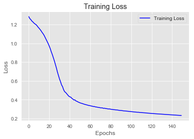


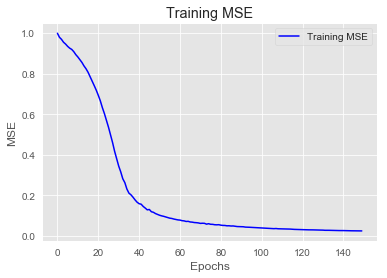


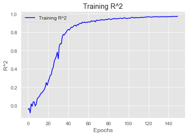


```python
reg_preds_scaled = reg_model.predict(X_test_Scaled)
reg_preds = scaler.inverse_transform(reg_preds_scaled)
rmse = np.sqrt(mean_squared_error(y_test, reg_preds))

print('RMSE:', rmse)
print('-------------------------')
print(reg_model.summary())
```

    RMSE: 2.1915848506310605
    -------------------------
    Model: "sequential_2"
    _________________________________________________________________
    Layer (type)                 Output Shape              Param #   
    =================================================================
    dense_8 (Dense)              (None, 10)                300       
    _________________________________________________________________
    dense_9 (Dense)              (None, 10)                110       
    _________________________________________________________________
    dense_10 (Dense)             (None, 10)                110       
    _________________________________________________________________
    dense_11 (Dense)             (None, 10)                110       
    _________________________________________________________________
    dense_12 (Dense)             (None, 10)                110       
    _________________________________________________________________
    dense_13 (Dense)             (None, 1)                 11        
    =================================================================
    Total params: 751
    Trainable params: 751
    Non-trainable params: 0
    _________________________________________________________________
    None
    

### Optimized Model


```python
optimized_model = Sequential()

optimized_model.add(layers.Dense(45,
                                  kernel_regularizer=regularizers.L2(0.005),
                           activation='relu', input_shape=(n_features, )))

optimized_model.add(layers.Dense(15,
                                  kernel_regularizer=regularizers.L2(0.005),
                           activation='relu'))

optimized_model.add(layers.Dense(3,
                                  kernel_regularizer=regularizers.L2(0.005),
                           activation='relu'))

optimized_model.add(layers.Dense(1, activation='linear'))

optimized_model.compile(optimizer='RMSprop',
              loss='mse',
              metrics=['mse', coef_determination])
```


```python
import time

NAME = 'Optimal Model -relu- Layers(D34L2 & D15L2 & D3L2)'

tensorboard = TensorBoard(log_dir='logs/fit/' + NAME,
                          histogram_freq=1,
                          write_graph=True,
                          write_images=True)

callbacks = [tensorboard]


optimized_model.fit(X_train_Scaled,
                     y_train_Scaled,
                     epochs=150,
                     batch_size=15,
                     callbacks = callbacks)
```

    Epoch 1/150
     2/30 [=>............................] - ETA: 4s - loss: 1.5809 - mse: 1.2694 - coef_determination: -2.0177WARNING:tensorflow:Callbacks method `on_train_batch_end` is slow compared to the batch time (batch time: 0.0010s vs `on_train_batch_end` time: 0.3333s). Check your callbacks.
    30/30 [==============================] - 0s 12ms/step - loss: 1.4284 - mse: 1.1224 - coef_determination: -0.3016
    Epoch 2/150
    30/30 [==============================] - 0s 999us/step - loss: 1.0093 - mse: 0.7097 - coef_determination: 0.1368
    Epoch 3/150
    30/30 [==============================] - 0s 963us/step - loss: 0.7807 - mse: 0.4871 - coef_determination: 0.4301
    Epoch 4/150
    30/30 [==============================] - 0s 1ms/step - loss: 0.6014 - mse: 0.3136 - coef_determination: 0.6010
    Epoch 5/150
    30/30 [==============================] - 0s 997us/step - loss: 0.4835 - mse: 0.2020 - coef_determination: 0.7291
    Epoch 6/150
    30/30 [==============================] - 0s 972us/step - loss: 0.4232 - mse: 0.1497 - coef_determination: 0.4644
    Epoch 7/150
    30/30 [==============================] - 0s 964us/step - loss: 0.3773 - mse: 0.1136 - coef_determination: 0.7284
    Epoch 8/150
    30/30 [==============================] - 0s 1ms/step - loss: 0.3455 - mse: 0.0929 - coef_determination: 0.8833
    Epoch 9/150
    30/30 [==============================] - 0s 997us/step - loss: 0.3151 - mse: 0.0730 - coef_determination: 0.9038
    Epoch 10/150
    30/30 [==============================] - 0s 998us/step - loss: 0.2910 - mse: 0.0595 - coef_determination: 0.9209
    Epoch 11/150
    30/30 [==============================] - 0s 964us/step - loss: 0.2700 - mse: 0.0488 - coef_determination: 0.9420
    Epoch 12/150
    30/30 [==============================] - 0s 997us/step - loss: 0.2505 - mse: 0.0406 - coef_determination: 0.9411
    Epoch 13/150
    30/30 [==============================] - 0s 964us/step - loss: 0.2332 - mse: 0.0344 - coef_determination: 0.9301
    Epoch 14/150
    30/30 [==============================] - 0s 1ms/step - loss: 0.2187 - mse: 0.0303 - coef_determination: 0.9590
    Epoch 15/150
    30/30 [==============================] - 0s 964us/step - loss: 0.2038 - mse: 0.0255 - coef_determination: 0.9464
    Epoch 16/150
    30/30 [==============================] - 0s 964us/step - loss: 0.1904 - mse: 0.0216 - coef_determination: 0.9605
    Epoch 17/150
    30/30 [==============================] - 0s 971us/step - loss: 0.1794 - mse: 0.0202 - coef_determination: 0.9509
    Epoch 18/150
    30/30 [==============================] - 0s 1ms/step - loss: 0.1687 - mse: 0.0177 - coef_determination: 0.9774
    Epoch 19/150
    30/30 [==============================] - 0s 963us/step - loss: 0.1573 - mse: 0.0141 - coef_determination: 0.9842
    Epoch 20/150
    30/30 [==============================] - 0s 931us/step - loss: 0.1502 - mse: 0.0153 - coef_determination: 0.9721
    Epoch 21/150
    30/30 [==============================] - 0s 1ms/step - loss: 0.1406 - mse: 0.0126 - coef_determination: 0.9855
    Epoch 22/150
    30/30 [==============================] - 0s 997us/step - loss: 0.1323 - mse: 0.0112 - coef_determination: 0.9848
    Epoch 23/150
    30/30 [==============================] - 0s 997us/step - loss: 0.1249 - mse: 0.0108 - coef_determination: 0.9849
    Epoch 24/150
    30/30 [==============================] - 0s 964us/step - loss: 0.1176 - mse: 0.0093 - coef_determination: 0.9874
    Epoch 25/150
    30/30 [==============================] - 0s 997us/step - loss: 0.1124 - mse: 0.0098 - coef_determination: 0.9851
    Epoch 26/150
    30/30 [==============================] - 0s 931us/step - loss: 0.1052 - mse: 0.0077 - coef_determination: 0.9902
    Epoch 27/150
    30/30 [==============================] - 0s 964us/step - loss: 0.1009 - mse: 0.0081 - coef_determination: 0.9876
    Epoch 28/150
    30/30 [==============================] - 0s 1ms/step - loss: 0.0948 - mse: 0.0068 - coef_determination: 0.9910
    Epoch 29/150
    30/30 [==============================] - 0s 963us/step - loss: 0.0899 - mse: 0.0064 - coef_determination: 0.9899
    Epoch 30/150
    30/30 [==============================] - 0s 965us/step - loss: 0.0867 - mse: 0.0074 - coef_determination: 0.9892
    Epoch 31/150
    30/30 [==============================] - 0s 965us/step - loss: 0.0824 - mse: 0.0065 - coef_determination: 0.9906
    Epoch 32/150
    30/30 [==============================] - 0s 985us/step - loss: 0.0781 - mse: 0.0060 - coef_determination: 0.9919
    Epoch 33/150
    30/30 [==============================] - 0s 970us/step - loss: 0.0743 - mse: 0.0056 - coef_determination: 0.9925
    Epoch 34/150
    30/30 [==============================] - 0s 964us/step - loss: 0.0714 - mse: 0.0056 - coef_determination: 0.9939
    Epoch 35/150
    30/30 [==============================] - 0s 998us/step - loss: 0.0675 - mse: 0.0048 - coef_determination: 0.9946
    Epoch 36/150
    30/30 [==============================] - 0s 1ms/step - loss: 0.0648 - mse: 0.0052 - coef_determination: 0.9933
    Epoch 37/150
    30/30 [==============================] - 0s 1ms/step - loss: 0.0626 - mse: 0.0055 - coef_determination: 0.9929
    Epoch 38/150
    30/30 [==============================] - 0s 1ms/step - loss: 0.0602 - mse: 0.0054 - coef_determination: 0.9911
    Epoch 39/150
    30/30 [==============================] - 0s 1ms/step - loss: 0.0578 - mse: 0.0052 - coef_determination: 0.9929
    Epoch 40/150
    30/30 [==============================] - 0s 1ms/step - loss: 0.0554 - mse: 0.0050 - coef_determination: 0.9931
    Epoch 41/150
    30/30 [==============================] - 0s 1ms/step - loss: 0.0534 - mse: 0.0046 - coef_determination: 0.9939
    Epoch 42/150
    30/30 [==============================] - 0s 1ms/step - loss: 0.0518 - mse: 0.0049 - coef_determination: 0.9938
    Epoch 43/150
    30/30 [==============================] - 0s 1ms/step - loss: 0.0501 - mse: 0.0046 - coef_determination: 0.9938
    Epoch 44/150
    30/30 [==============================] - 0s 1ms/step - loss: 0.0486 - mse: 0.0047 - coef_determination: 0.9911
    Epoch 45/150
    30/30 [==============================] - 0s 1ms/step - loss: 0.0471 - mse: 0.0047 - coef_determination: 0.9928
    Epoch 46/150
    30/30 [==============================] - 0s 1ms/step - loss: 0.0463 - mse: 0.0053 - coef_determination: 0.9927
    Epoch 47/150
    30/30 [==============================] - 0s 1ms/step - loss: 0.0441 - mse: 0.0044 - coef_determination: 0.9948
    Epoch 48/150
    30/30 [==============================] - 0s 1ms/step - loss: 0.0434 - mse: 0.0049 - coef_determination: 0.9927
    Epoch 49/150
    30/30 [==============================] - 0s 1ms/step - loss: 0.0427 - mse: 0.0052 - coef_determination: 0.9930
    Epoch 50/150
    30/30 [==============================] - 0s 1ms/step - loss: 0.0406 - mse: 0.0042 - coef_determination: 0.9932
    Epoch 51/150
    30/30 [==============================] - 0s 1ms/step - loss: 0.0398 - mse: 0.0043 - coef_determination: 0.9938
    Epoch 52/150
    30/30 [==============================] - 0s 1ms/step - loss: 0.0394 - mse: 0.0049 - coef_determination: 0.9917
    Epoch 53/150
    30/30 [==============================] - 0s 1ms/step - loss: 0.0386 - mse: 0.0050 - coef_determination: 0.9931
    Epoch 54/150
    30/30 [==============================] - 0s 1ms/step - loss: 0.0370 - mse: 0.0043 - coef_determination: 0.9936
    Epoch 55/150
    30/30 [==============================] - 0s 1ms/step - loss: 0.0367 - mse: 0.0047 - coef_determination: 0.9935
    Epoch 56/150
    30/30 [==============================] - 0s 1ms/step - loss: 0.0367 - mse: 0.0053 - coef_determination: 0.9932
    Epoch 57/150
    30/30 [==============================] - 0s 1ms/step - loss: 0.0351 - mse: 0.0044 - coef_determination: 0.9925
    Epoch 58/150
    30/30 [==============================] - 0s 1ms/step - loss: 0.0349 - mse: 0.0048 - coef_determination: 0.9931
    Epoch 59/150
    30/30 [==============================] - 0s 1ms/step - loss: 0.0339 - mse: 0.0045 - coef_determination: 0.9939
    Epoch 60/150
    30/30 [==============================] - 0s 1ms/step - loss: 0.0332 - mse: 0.0044 - coef_determination: 0.9937
    Epoch 61/150
    30/30 [==============================] - 0s 1ms/step - loss: 0.0337 - mse: 0.0056 - coef_determination: 0.9934
    Epoch 62/150
    30/30 [==============================] - 0s 1ms/step - loss: 0.0323 - mse: 0.0046 - coef_determination: 0.9917
    Epoch 63/150
    30/30 [==============================] - 0s 1ms/step - loss: 0.0318 - mse: 0.0046 - coef_determination: 0.9923
    Epoch 64/150
    30/30 [==============================] - 0s 1ms/step - loss: 0.0309 - mse: 0.0043 - coef_determination: 0.9936
    Epoch 65/150
    30/30 [==============================] - 0s 1ms/step - loss: 0.0309 - mse: 0.0047 - coef_determination: 0.9904
    Epoch 66/150
    30/30 [==============================] - 0s 1ms/step - loss: 0.0307 - mse: 0.0050 - coef_determination: 0.9937
    Epoch 67/150
    30/30 [==============================] - 0s 1ms/step - loss: 0.0289 - mse: 0.0036 - coef_determination: 0.9952
    Epoch 68/150
    30/30 [==============================] - 0s 1ms/step - loss: 0.0295 - mse: 0.0047 - coef_determination: 0.9930
    Epoch 69/150
    30/30 [==============================] - 0s 1ms/step - loss: 0.0288 - mse: 0.0043 - coef_determination: 0.9943
    Epoch 70/150
    30/30 [==============================] - 0s 1ms/step - loss: 0.0291 - mse: 0.0051 - coef_determination: 0.9631
    Epoch 71/150
    30/30 [==============================] - 0s 1ms/step - loss: 0.0282 - mse: 0.0045 - coef_determination: 0.9946
    Epoch 72/150
    30/30 [==============================] - 0s 1ms/step - loss: 0.0268 - mse: 0.0035 - coef_determination: 0.9952
    Epoch 73/150
    30/30 [==============================] - 0s 1ms/step - loss: 0.0288 - mse: 0.0059 - coef_determination: 0.9917
    Epoch 74/150
    30/30 [==============================] - 0s 1ms/step - loss: 0.0264 - mse: 0.0037 - coef_determination: 0.9960
    Epoch 75/150
    30/30 [==============================] - 0s 1ms/step - loss: 0.0264 - mse: 0.0041 - coef_determination: 0.9926
    Epoch 76/150
    30/30 [==============================] - 0s 1ms/step - loss: 0.0270 - mse: 0.0050 - coef_determination: 0.9913
    Epoch 77/150
    30/30 [==============================] - 0s 1ms/step - loss: 0.0263 - mse: 0.0045 - coef_determination: 0.9931
    Epoch 78/150
    30/30 [==============================] - 0s 1ms/step - loss: 0.0253 - mse: 0.0038 - coef_determination: 0.9957
    Epoch 79/150
    30/30 [==============================] - 0s 1ms/step - loss: 0.0263 - mse: 0.0051 - coef_determination: 0.9927
    Epoch 80/150
    30/30 [==============================] - 0s 1ms/step - loss: 0.0259 - mse: 0.0049 - coef_determination: 0.9925
    Epoch 81/150
    30/30 [==============================] - 0s 1ms/step - loss: 0.0253 - mse: 0.0044 - coef_determination: 0.9950
    Epoch 82/150
    30/30 [==============================] - 0s 1ms/step - loss: 0.0249 - mse: 0.0042 - coef_determination: 0.9945
    Epoch 83/150
    30/30 [==============================] - 0s 1ms/step - loss: 0.0242 - mse: 0.0037 - coef_determination: 0.9939
    Epoch 84/150
    30/30 [==============================] - 0s 1ms/step - loss: 0.0246 - mse: 0.0044 - coef_determination: 0.9937
    Epoch 85/150
    30/30 [==============================] - 0s 1ms/step - loss: 0.0239 - mse: 0.0039 - coef_determination: 0.9951
    Epoch 86/150
    30/30 [==============================] - 0s 1ms/step - loss: 0.0234 - mse: 0.0037 - coef_determination: 0.9957
    Epoch 87/150
    30/30 [==============================] - 0s 1ms/step - loss: 0.0248 - mse: 0.0053 - coef_determination: 0.9928
    Epoch 88/150
    30/30 [==============================] - 0s 1ms/step - loss: 0.0225 - mse: 0.0031 - coef_determination: 0.9961
    Epoch 89/150
    30/30 [==============================] - 0s 1ms/step - loss: 0.0239 - mse: 0.0047 - coef_determination: 0.9947
    Epoch 90/150
    30/30 [==============================] - 0s 1ms/step - loss: 0.0241 - mse: 0.0051 - coef_determination: 0.9291
    Epoch 91/150
    30/30 [==============================] - 0s 1ms/step - loss: 0.0240 - mse: 0.0051 - coef_determination: 0.9936
    Epoch 92/150
    30/30 [==============================] - 0s 1ms/step - loss: 0.0233 - mse: 0.0046 - coef_determination: 0.9944
    Epoch 93/150
    30/30 [==============================] - 0s 1ms/step - loss: 0.0230 - mse: 0.0044 - coef_determination: 0.9939
    Epoch 94/150
    30/30 [==============================] - 0s 1ms/step - loss: 0.0233 - mse: 0.0049 - coef_determination: 0.9932
    Epoch 95/150
    30/30 [==============================] - 0s 1ms/step - loss: 0.0216 - mse: 0.0034 - coef_determination: 0.9948
    Epoch 96/150
    30/30 [==============================] - 0s 1ms/step - loss: 0.0219 - mse: 0.0038 - coef_determination: 0.9944
    Epoch 97/150
    30/30 [==============================] - 0s 1ms/step - loss: 0.0225 - mse: 0.0046 - coef_determination: 0.9940
    Epoch 98/150
    30/30 [==============================] - 0s 1ms/step - loss: 0.0219 - mse: 0.0041 - coef_determination: 0.9942
    Epoch 99/150
    30/30 [==============================] - 0s 1ms/step - loss: 0.0217 - mse: 0.0040 - coef_determination: 0.9942
    Epoch 100/150
    30/30 [==============================] - 0s 997us/step - loss: 0.0221 - mse: 0.0045 - coef_determination: 0.9927
    Epoch 101/150
    30/30 [==============================] - 0s 1ms/step - loss: 0.0220 - mse: 0.0045 - coef_determination: 0.9934
    Epoch 102/150
    30/30 [==============================] - 0s 1ms/step - loss: 0.0215 - mse: 0.0041 - coef_determination: 0.9951
    Epoch 103/150
    30/30 [==============================] - 0s 1ms/step - loss: 0.0229 - mse: 0.0057 - coef_determination: 0.9920
    Epoch 104/150
    30/30 [==============================] - 0s 1ms/step - loss: 0.0211 - mse: 0.0039 - coef_determination: 0.9933
    Epoch 105/150
    30/30 [==============================] - 0s 1ms/step - loss: 0.0215 - mse: 0.0044 - coef_determination: 0.9949
    Epoch 106/150
    30/30 [==============================] - 0s 1ms/step - loss: 0.0201 - mse: 0.0031 - coef_determination: 0.9960
    Epoch 107/150
    30/30 [==============================] - 0s 1ms/step - loss: 0.0206 - mse: 0.0036 - coef_determination: 0.9955
    Epoch 108/150
    30/30 [==============================] - 0s 1ms/step - loss: 0.0212 - mse: 0.0044 - coef_determination: 0.9948
    Epoch 109/150
    30/30 [==============================] - 0s 1ms/step - loss: 0.0207 - mse: 0.0041 - coef_determination: 0.9952
    Epoch 110/150
    30/30 [==============================] - 0s 1ms/step - loss: 0.0212 - mse: 0.0046 - coef_determination: 0.9924
    Epoch 111/150
    30/30 [==============================] - 0s 1ms/step - loss: 0.0198 - mse: 0.0033 - coef_determination: 0.9954
    Epoch 112/150
    30/30 [==============================] - 0s 1ms/step - loss: 0.0213 - mse: 0.0049 - coef_determination: 0.9949
    Epoch 113/150
    30/30 [==============================] - 0s 1ms/step - loss: 0.0200 - mse: 0.0037 - coef_determination: 0.9946
    Epoch 114/150
    30/30 [==============================] - 0s 1ms/step - loss: 0.0202 - mse: 0.0040 - coef_determination: 0.9942
    Epoch 115/150
    30/30 [==============================] - 0s 1ms/step - loss: 0.0205 - mse: 0.0044 - coef_determination: 0.9946
    Epoch 116/150
    30/30 [==============================] - 0s 1000us/step - loss: 0.0198 - mse: 0.0038 - coef_determination: 0.9956
    Epoch 117/150
    30/30 [==============================] - 0s 1ms/step - loss: 0.0202 - mse: 0.0042 - coef_determination: 0.9930
    Epoch 118/150
    30/30 [==============================] - 0s 1ms/step - loss: 0.0201 - mse: 0.0041 - coef_determination: 0.9949
    Epoch 119/150
    30/30 [==============================] - 0s 1000us/step - loss: 0.0195 - mse: 0.0036 - coef_determination: 0.9950
    Epoch 120/150
    30/30 [==============================] - 0s 1ms/step - loss: 0.0194 - mse: 0.0037 - coef_determination: 0.9946
    Epoch 121/150
    30/30 [==============================] - 0s 997us/step - loss: 0.0200 - mse: 0.0043 - coef_determination: 0.9941
    Epoch 122/150
    30/30 [==============================] - 0s 1ms/step - loss: 0.0195 - mse: 0.0039 - coef_determination: 0.9946
    Epoch 123/150
    30/30 [==============================] - 0s 964us/step - loss: 0.0193 - mse: 0.0037 - coef_determination: 0.9946
    Epoch 124/150
    30/30 [==============================] - 0s 997us/step - loss: 0.0208 - mse: 0.0053 - coef_determination: 0.9926
    Epoch 125/150
    30/30 [==============================] - 0s 997us/step - loss: 0.0188 - mse: 0.0034 - coef_determination: 0.9946
    Epoch 126/150
    30/30 [==============================] - 0s 997us/step - loss: 0.0193 - mse: 0.0040 - coef_determination: 0.9938
    Epoch 127/150
    30/30 [==============================] - 0s 1ms/step - loss: 0.0192 - mse: 0.0039 - coef_determination: 0.9950
    Epoch 128/150
    30/30 [==============================] - 0s 1ms/step - loss: 0.0192 - mse: 0.0040 - coef_determination: 0.9883
    Epoch 129/150
    30/30 [==============================] - 0s 1ms/step - loss: 0.0188 - mse: 0.0036 - coef_determination: 0.9961
    Epoch 130/150
    30/30 [==============================] - 0s 1ms/step - loss: 0.0183 - mse: 0.0032 - coef_determination: 0.9941
    Epoch 131/150
    30/30 [==============================] - 0s 1ms/step - loss: 0.0189 - mse: 0.0039 - coef_determination: 0.9947
    Epoch 132/150
    30/30 [==============================] - 0s 1ms/step - loss: 0.0192 - mse: 0.0042 - coef_determination: 0.9948
    Epoch 133/150
    30/30 [==============================] - 0s 1ms/step - loss: 0.0182 - mse: 0.0032 - coef_determination: 0.9962
    Epoch 134/150
    30/30 [==============================] - 0s 1ms/step - loss: 0.0191 - mse: 0.0041 - coef_determination: 0.9948
    Epoch 135/150
    30/30 [==============================] - 0s 1ms/step - loss: 0.0190 - mse: 0.0041 - coef_determination: 0.9955
    Epoch 136/150
    30/30 [==============================] - 0s 1ms/step - loss: 0.0178 - mse: 0.0030 - coef_determination: 0.9316
    Epoch 137/150
    30/30 [==============================] - 0s 1ms/step - loss: 0.0187 - mse: 0.0040 - coef_determination: 0.9946
    Epoch 138/150
    30/30 [==============================] - 0s 997us/step - loss: 0.0182 - mse: 0.0035 - coef_determination: 0.9955
    Epoch 139/150
    30/30 [==============================] - 0s 1ms/step - loss: 0.0182 - mse: 0.0036 - coef_determination: 0.9954
    Epoch 140/150
    30/30 [==============================] - 0s 1ms/step - loss: 0.0194 - mse: 0.0048 - coef_determination: 0.9936
    Epoch 141/150
    30/30 [==============================] - 0s 1ms/step - loss: 0.0179 - mse: 0.0034 - coef_determination: 0.9952
    Epoch 142/150
    30/30 [==============================] - 0s 997us/step - loss: 0.0179 - mse: 0.0034 - coef_determination: 0.9925
    Epoch 143/150
    30/30 [==============================] - 0s 1ms/step - loss: 0.0179 - mse: 0.0034 - coef_determination: 0.9958
    Epoch 144/150
    30/30 [==============================] - 0s 1ms/step - loss: 0.0183 - mse: 0.0039 - coef_determination: 0.9948
    Epoch 145/150
    30/30 [==============================] - 0s 1ms/step - loss: 0.0177 - mse: 0.0034 - coef_determination: 0.9947
    Epoch 146/150
    30/30 [==============================] - 0s 1ms/step - loss: 0.0187 - mse: 0.0043 - coef_determination: 0.9941
    Epoch 147/150
    30/30 [==============================] - 0s 1ms/step - loss: 0.0174 - mse: 0.0031 - coef_determination: 0.9960
    Epoch 148/150
    30/30 [==============================] - 0s 1ms/step - loss: 0.0181 - mse: 0.0038 - coef_determination: 0.9909
    Epoch 149/150
    30/30 [==============================] - 0s 1ms/step - loss: 0.0184 - mse: 0.0042 - coef_determination: 0.9945
    Epoch 150/150
    30/30 [==============================] - 0s 1ms/step - loss: 0.0187 - mse: 0.0046 - coef_determination: 0.9943
    


    <tensorflow.python.keras.callbacks.History at 0x1c204fbe588>


```python
visualize_loss_MSE(optimized_model.history)
```


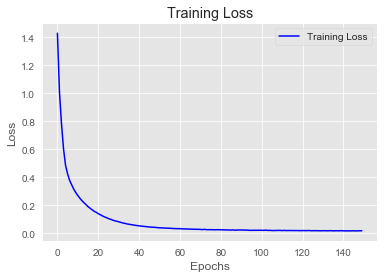


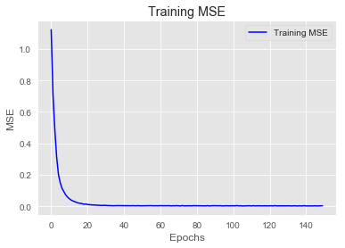


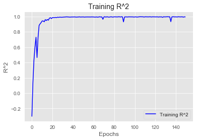


```python
op_preds_scaled = optimized_model.predict(X_test_Scaled)
op_preds = scaler.inverse_transform(op_preds_scaled)
rmse = np.sqrt(mean_squared_error(y_test, op_preds))

print('RMSE:', rmse)
print('-------------------------')
print(optimized_model.summary())
```

    WARNING:tensorflow:5 out of the last 13 calls to <function Model.make_predict_function.<locals>.predict_function at 0x000001C20536A9D8> triggered tf.function retracing. Tracing is expensive and the excessive number of tracings could be due to (1) creating @tf.function repeatedly in a loop, (2) passing tensors with different shapes, (3) passing Python objects instead of tensors. For (1), please define your @tf.function outside of the loop. For (2), @tf.function has experimental_relax_shapes=True option that relaxes argument shapes that can avoid unnecessary retracing. For (3), please refer to https://www.tensorflow.org/tutorials/customization/performance#python_or_tensor_args and https://www.tensorflow.org/api_docs/python/tf/function for  more details.
    RMSE: 0.6779113963020904
    -------------------------
    Model: "sequential_9"
    _________________________________________________________________
    Layer (type)                 Output Shape              Param #   
    =================================================================
    dense_38 (Dense)             (None, 45)                1350      
    _________________________________________________________________
    dense_39 (Dense)             (None, 15)                690       
    _________________________________________________________________
    dense_40 (Dense)             (None, 3)                 48        
    _________________________________________________________________
    dense_41 (Dense)             (None, 1)                 4         
    =================================================================
    Total params: 2,092
    Trainable params: 2,092
    Non-trainable params: 0
    _________________________________________________________________
    None
    


```python

```
