# Import Data


```python
import pandas as pd
import matplotlib.pyplot as plt
%matplotlib inline

import seaborn as sns
sns.set_style('darkgrid')
import warnings

import scipy
import numpy as np
import tensorflow as tf
from sklearn.preprocessing import StandardScaler, OneHotEncoder, MinMaxScaler
from sklearn.model_selection import train_test_split
from sklearn.metrics import mean_squared_error
from sklearn.model_selection import cross_val_predict

warnings.filterwarnings('ignore')
pd.set_option('display.max_rows', 500)
pd.set_option('display.max_columns', 500)
pd.set_option('display.width', 1000)

np.random.seed(123)

model_df = pd.read_csv('Model Dataset')
print(model_df.shape)
model_df.head()
```

    (657, 38)
    


<div>
<style scoped>
    .dataframe tbody tr th:only-of-type {
        vertical-align: middle;
    }

    .dataframe tbody tr th {
        vertical-align: top;
    }

    .dataframe thead th {
        text-align: right;
    }
</style>
<table border="1" class="dataframe">
  <thead>
    <tr style="text-align: right;">
      <th></th>
      <th>Unnamed: 0</th>
      <th>ID</th>
      <th>Non_combust_wt_%</th>
      <th>Organics_wt_%</th>
      <th>Paper_and_cardboard_wt_%</th>
      <th>Plastics_wt_%</th>
      <th>Total_weight_(kg)</th>
      <th>aluminium_cans</th>
      <th>aluminium_recyclable</th>
      <th>batteries</th>
      <th>bottles_cds</th>
      <th>bottles_wine_and_spirits</th>
      <th>cardboard</th>
      <th>ceramics</th>
      <th>drinkbags</th>
      <th>electrical_items_and_peripherals_(incl_tvs)</th>
      <th>energy_kWh_per_kg</th>
      <th>eps</th>
      <th>feminine_hygiene</th>
      <th>flexibles_film</th>
      <th>food</th>
      <th>hdpe_bottles</th>
      <th>jars</th>
      <th>lpb</th>
      <th>nappies</th>
      <th>other</th>
      <th>other_glass</th>
      <th>other_metal</th>
      <th>other_organics</th>
      <th>other_plastic</th>
      <th>other_sanitary_waste</th>
      <th>paper</th>
      <th>pet_bottles</th>
      <th>plastic_bags</th>
      <th>pp</th>
      <th>steel_cans</th>
      <th>textiles</th>
      <th>total_energy_kWh</th>
    </tr>
  </thead>
  <tbody>
    <tr>
      <th>0</th>
      <td>0</td>
      <td>1_B</td>
      <td>0.000000</td>
      <td>0.235955</td>
      <td>0.359551</td>
      <td>0.404494</td>
      <td>0.534</td>
      <td>0.000</td>
      <td>0.000</td>
      <td>0.0</td>
      <td>0.0</td>
      <td>0.0</td>
      <td>0.192</td>
      <td>0.0</td>
      <td>0.0000</td>
      <td>0.0</td>
      <td>1.30</td>
      <td>0.010</td>
      <td>0.126</td>
      <td>0.066</td>
      <td>0.000</td>
      <td>0.000</td>
      <td>0.00</td>
      <td>0.000</td>
      <td>0.000</td>
      <td>0.0</td>
      <td>0.0</td>
      <td>0.0</td>
      <td>0.000</td>
      <td>0.067</td>
      <td>0.000</td>
      <td>0.000</td>
      <td>0.030</td>
      <td>0.026</td>
      <td>0.017</td>
      <td>0.000</td>
      <td>0.000</td>
      <td>0.69</td>
    </tr>
    <tr>
      <th>1</th>
      <td>1</td>
      <td>2_B</td>
      <td>0.062102</td>
      <td>0.738022</td>
      <td>0.016245</td>
      <td>0.183632</td>
      <td>4.863</td>
      <td>0.013</td>
      <td>0.029</td>
      <td>0.0</td>
      <td>0.0</td>
      <td>0.0</td>
      <td>0.000</td>
      <td>0.0</td>
      <td>0.0115</td>
      <td>0.0</td>
      <td>2.76</td>
      <td>0.003</td>
      <td>0.000</td>
      <td>0.196</td>
      <td>2.989</td>
      <td>0.203</td>
      <td>0.26</td>
      <td>0.009</td>
      <td>0.063</td>
      <td>0.0</td>
      <td>0.0</td>
      <td>0.0</td>
      <td>0.537</td>
      <td>0.188</td>
      <td>0.000</td>
      <td>0.070</td>
      <td>0.147</td>
      <td>0.058</td>
      <td>0.075</td>
      <td>0.000</td>
      <td>0.000</td>
      <td>13.42</td>
    </tr>
    <tr>
      <th>2</th>
      <td>2</td>
      <td>3_B</td>
      <td>0.020291</td>
      <td>0.894826</td>
      <td>0.016571</td>
      <td>0.068312</td>
      <td>2.957</td>
      <td>0.000</td>
      <td>0.013</td>
      <td>0.0</td>
      <td>0.0</td>
      <td>0.0</td>
      <td>0.000</td>
      <td>0.0</td>
      <td>0.0000</td>
      <td>0.0</td>
      <td>3.03</td>
      <td>0.035</td>
      <td>0.000</td>
      <td>0.012</td>
      <td>1.927</td>
      <td>0.057</td>
      <td>0.00</td>
      <td>0.000</td>
      <td>0.000</td>
      <td>0.0</td>
      <td>0.0</td>
      <td>0.0</td>
      <td>0.000</td>
      <td>0.023</td>
      <td>0.719</td>
      <td>0.031</td>
      <td>0.000</td>
      <td>0.075</td>
      <td>0.000</td>
      <td>0.047</td>
      <td>0.018</td>
      <td>8.96</td>
    </tr>
    <tr>
      <th>3</th>
      <td>3</td>
      <td>4_B</td>
      <td>0.238462</td>
      <td>0.407692</td>
      <td>0.094872</td>
      <td>0.258974</td>
      <td>0.390</td>
      <td>0.000</td>
      <td>0.000</td>
      <td>0.0</td>
      <td>0.0</td>
      <td>0.0</td>
      <td>0.037</td>
      <td>0.0</td>
      <td>0.0050</td>
      <td>0.0</td>
      <td>1.72</td>
      <td>0.003</td>
      <td>0.000</td>
      <td>0.028</td>
      <td>0.000</td>
      <td>0.000</td>
      <td>0.00</td>
      <td>0.000</td>
      <td>0.000</td>
      <td>0.0</td>
      <td>0.0</td>
      <td>0.0</td>
      <td>0.000</td>
      <td>0.000</td>
      <td>0.159</td>
      <td>0.000</td>
      <td>0.000</td>
      <td>0.065</td>
      <td>0.000</td>
      <td>0.093</td>
      <td>0.000</td>
      <td>0.67</td>
    </tr>
    <tr>
      <th>4</th>
      <td>4</td>
      <td>5_B</td>
      <td>0.000000</td>
      <td>0.896653</td>
      <td>0.027299</td>
      <td>0.076048</td>
      <td>3.077</td>
      <td>0.000</td>
      <td>0.000</td>
      <td>0.0</td>
      <td>0.0</td>
      <td>0.0</td>
      <td>0.047</td>
      <td>0.0</td>
      <td>0.0180</td>
      <td>0.0</td>
      <td>3.09</td>
      <td>0.000</td>
      <td>0.071</td>
      <td>0.106</td>
      <td>2.366</td>
      <td>0.000</td>
      <td>0.00</td>
      <td>0.037</td>
      <td>0.000</td>
      <td>0.0</td>
      <td>0.0</td>
      <td>0.0</td>
      <td>0.000</td>
      <td>0.000</td>
      <td>0.322</td>
      <td>0.000</td>
      <td>0.000</td>
      <td>0.068</td>
      <td>0.024</td>
      <td>0.000</td>
      <td>0.000</td>
      <td>9.51</td>
    </tr>
  </tbody>
</table>
</div>


# Modeling

## Remove Outliers


```python
model_df.describe()
```


<div>
<style scoped>
    .dataframe tbody tr th:only-of-type {
        vertical-align: middle;
    }

    .dataframe tbody tr th {
        vertical-align: top;
    }

    .dataframe thead th {
        text-align: right;
    }
</style>
<table border="1" class="dataframe">
  <thead>
    <tr style="text-align: right;">
      <th></th>
      <th>Non_combust_wt_%</th>
      <th>Organics_wt_%</th>
      <th>Paper_and_cardboard_wt_%</th>
      <th>Plastics_wt_%</th>
      <th>Total_weight_(kg)</th>
      <th>aluminium_cans</th>
      <th>aluminium_recyclable</th>
      <th>batteries</th>
      <th>bottles_cds</th>
      <th>bottles_wine_and_spirits</th>
      <th>cardboard</th>
      <th>ceramics</th>
      <th>drinkbags</th>
      <th>electrical_items_and_peripherals_(incl_tvs)</th>
      <th>energy_kWh_per_kg</th>
      <th>eps</th>
      <th>feminine_hygiene</th>
      <th>flexibles_film</th>
      <th>food</th>
      <th>hdpe_bottles</th>
      <th>jars</th>
      <th>lpb</th>
      <th>nappies</th>
      <th>other</th>
      <th>other_glass</th>
      <th>other_metal</th>
      <th>other_organics</th>
      <th>other_plastic</th>
      <th>other_sanitary_waste</th>
      <th>paper</th>
      <th>pet_bottles</th>
      <th>plastic_bags</th>
      <th>pp</th>
      <th>steel_cans</th>
      <th>textiles</th>
      <th>total_energy_kWh</th>
    </tr>
  </thead>
  <tbody>
    <tr>
      <th>count</th>
      <td>657.000000</td>
      <td>657.000000</td>
      <td>657.000000</td>
      <td>657.000000</td>
      <td>657.000000</td>
      <td>657.000000</td>
      <td>657.000000</td>
      <td>657.000000</td>
      <td>657.000000</td>
      <td>657.000000</td>
      <td>657.000000</td>
      <td>657.000000</td>
      <td>657.000000</td>
      <td>657.000000</td>
      <td>657.000000</td>
      <td>657.000000</td>
      <td>657.000000</td>
      <td>657.000000</td>
      <td>657.000000</td>
      <td>657.000000</td>
      <td>657.000000</td>
      <td>657.000000</td>
      <td>657.000000</td>
      <td>657.000000</td>
      <td>657.000000</td>
      <td>657.000000</td>
      <td>657.000000</td>
      <td>657.000000</td>
      <td>657.000000</td>
      <td>657.000000</td>
      <td>657.000000</td>
      <td>657.000000</td>
      <td>657.000000</td>
      <td>657.000000</td>
      <td>657.000000</td>
      <td>657.000000</td>
    </tr>
    <tr>
      <th>mean</th>
      <td>0.164221</td>
      <td>0.562368</td>
      <td>0.097642</td>
      <td>0.174883</td>
      <td>7.039078</td>
      <td>0.278236</td>
      <td>0.027437</td>
      <td>0.003476</td>
      <td>0.025985</td>
      <td>0.026689</td>
      <td>0.187169</td>
      <td>0.009470</td>
      <td>0.005390</td>
      <td>0.006925</td>
      <td>2.037534</td>
      <td>0.024411</td>
      <td>0.044382</td>
      <td>0.215837</td>
      <td>2.083743</td>
      <td>0.031814</td>
      <td>0.098312</td>
      <td>0.035486</td>
      <td>1.002744</td>
      <td>0.079878</td>
      <td>0.002893</td>
      <td>0.026321</td>
      <td>1.572169</td>
      <td>0.106202</td>
      <td>0.073056</td>
      <td>0.118170</td>
      <td>0.227420</td>
      <td>0.175761</td>
      <td>0.017618</td>
      <td>0.346152</td>
      <td>0.184600</td>
      <td>16.829696</td>
    </tr>
    <tr>
      <th>std</th>
      <td>0.212095</td>
      <td>0.328298</td>
      <td>0.142824</td>
      <td>0.184810</td>
      <td>7.905361</td>
      <td>0.903705</td>
      <td>0.134408</td>
      <td>0.027986</td>
      <td>0.187057</td>
      <td>0.198246</td>
      <td>0.449210</td>
      <td>0.074386</td>
      <td>0.033875</td>
      <td>0.065450</td>
      <td>1.064171</td>
      <td>0.061599</td>
      <td>0.171813</td>
      <td>0.342665</td>
      <td>3.639778</td>
      <td>0.085608</td>
      <td>0.329199</td>
      <td>0.135543</td>
      <td>3.389378</td>
      <td>0.338525</td>
      <td>0.033120</td>
      <td>0.201365</td>
      <td>4.954004</td>
      <td>0.301088</td>
      <td>0.315111</td>
      <td>0.258696</td>
      <td>0.481947</td>
      <td>0.486143</td>
      <td>0.096537</td>
      <td>0.737697</td>
      <td>0.812959</td>
      <td>22.966856</td>
    </tr>
    <tr>
      <th>min</th>
      <td>0.000000</td>
      <td>0.000000</td>
      <td>0.000000</td>
      <td>0.000000</td>
      <td>0.056000</td>
      <td>0.000000</td>
      <td>0.000000</td>
      <td>0.000000</td>
      <td>0.000000</td>
      <td>0.000000</td>
      <td>0.000000</td>
      <td>0.000000</td>
      <td>0.000000</td>
      <td>0.000000</td>
      <td>0.000000</td>
      <td>0.000000</td>
      <td>0.000000</td>
      <td>0.000000</td>
      <td>0.000000</td>
      <td>0.000000</td>
      <td>0.000000</td>
      <td>0.000000</td>
      <td>0.000000</td>
      <td>0.000000</td>
      <td>0.000000</td>
      <td>0.000000</td>
      <td>0.000000</td>
      <td>0.000000</td>
      <td>0.000000</td>
      <td>0.000000</td>
      <td>0.000000</td>
      <td>0.000000</td>
      <td>0.000000</td>
      <td>0.000000</td>
      <td>0.000000</td>
      <td>0.000000</td>
    </tr>
    <tr>
      <th>25%</th>
      <td>0.018805</td>
      <td>0.283636</td>
      <td>0.002865</td>
      <td>0.045108</td>
      <td>2.161000</td>
      <td>0.000000</td>
      <td>0.000000</td>
      <td>0.000000</td>
      <td>0.000000</td>
      <td>0.000000</td>
      <td>0.000000</td>
      <td>0.000000</td>
      <td>0.000000</td>
      <td>0.000000</td>
      <td>1.300000</td>
      <td>0.000000</td>
      <td>0.000000</td>
      <td>0.031000</td>
      <td>0.000000</td>
      <td>0.000000</td>
      <td>0.000000</td>
      <td>0.000000</td>
      <td>0.000000</td>
      <td>0.000000</td>
      <td>0.000000</td>
      <td>0.000000</td>
      <td>0.000000</td>
      <td>0.000000</td>
      <td>0.000000</td>
      <td>0.000000</td>
      <td>0.000000</td>
      <td>0.000000</td>
      <td>0.000000</td>
      <td>0.000000</td>
      <td>0.000000</td>
      <td>2.710000</td>
    </tr>
    <tr>
      <th>50%</th>
      <td>0.077644</td>
      <td>0.628221</td>
      <td>0.044877</td>
      <td>0.116012</td>
      <td>4.552000</td>
      <td>0.000000</td>
      <td>0.000000</td>
      <td>0.000000</td>
      <td>0.000000</td>
      <td>0.000000</td>
      <td>0.000000</td>
      <td>0.000000</td>
      <td>0.000000</td>
      <td>0.000000</td>
      <td>2.480000</td>
      <td>0.000000</td>
      <td>0.000000</td>
      <td>0.096000</td>
      <td>0.562000</td>
      <td>0.000000</td>
      <td>0.000000</td>
      <td>0.000000</td>
      <td>0.000000</td>
      <td>0.000000</td>
      <td>0.000000</td>
      <td>0.000000</td>
      <td>0.000000</td>
      <td>0.018000</td>
      <td>0.000000</td>
      <td>0.004000</td>
      <td>0.088000</td>
      <td>0.048000</td>
      <td>0.000000</td>
      <td>0.078000</td>
      <td>0.000000</td>
      <td>9.270000</td>
    </tr>
    <tr>
      <th>75%</th>
      <td>0.219512</td>
      <td>0.854651</td>
      <td>0.118399</td>
      <td>0.232143</td>
      <td>8.460000</td>
      <td>0.084000</td>
      <td>0.006000</td>
      <td>0.000000</td>
      <td>0.000000</td>
      <td>0.000000</td>
      <td>0.159000</td>
      <td>0.000000</td>
      <td>0.000000</td>
      <td>0.000000</td>
      <td>2.940000</td>
      <td>0.014000</td>
      <td>0.000000</td>
      <td>0.252000</td>
      <td>2.754000</td>
      <td>0.018000</td>
      <td>0.000000</td>
      <td>0.011000</td>
      <td>0.000000</td>
      <td>0.000000</td>
      <td>0.000000</td>
      <td>0.000000</td>
      <td>0.338000</td>
      <td>0.096000</td>
      <td>0.000000</td>
      <td>0.115000</td>
      <td>0.236000</td>
      <td>0.168000</td>
      <td>0.004000</td>
      <td>0.343000</td>
      <td>0.028000</td>
      <td>20.450000</td>
    </tr>
    <tr>
      <th>max</th>
      <td>0.998243</td>
      <td>1.000000</td>
      <td>0.899387</td>
      <td>1.000000</td>
      <td>59.815000</td>
      <td>8.612000</td>
      <td>1.840000</td>
      <td>0.356000</td>
      <td>3.670000</td>
      <td>2.873000</td>
      <td>4.242000</td>
      <td>1.122000</td>
      <td>0.509000</td>
      <td>0.862000</td>
      <td>3.120000</td>
      <td>0.574000</td>
      <td>1.580000</td>
      <td>3.228000</td>
      <td>29.239000</td>
      <td>0.912000</td>
      <td>5.362000</td>
      <td>1.860000</td>
      <td>36.750000</td>
      <td>4.494000</td>
      <td>0.616000</td>
      <td>4.306000</td>
      <td>56.020000</td>
      <td>4.904000</td>
      <td>3.280000</td>
      <td>2.408000</td>
      <td>6.804000</td>
      <td>6.048000</td>
      <td>2.008000</td>
      <td>6.452000</td>
      <td>15.806000</td>
      <td>175.410000</td>
    </tr>
  </tbody>
</table>
</div>


### Total Weight (kg)


```python
model_df[model_df['Total_weight_(kg)'] < 16]['Total_weight_(kg)'].hist();
```


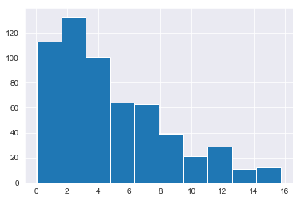


```python
print('Old length:', len(model_df))
print('New length:', len(model_df[model_df['total_energy_kWh'] > 0]))
model_df = model_df[model_df['total_energy_kWh'] > 0]
model_df.describe()
```

    Old length: 657
    New length: 586
    


<div>
<style scoped>
    .dataframe tbody tr th:only-of-type {
        vertical-align: middle;
    }

    .dataframe tbody tr th {
        vertical-align: top;
    }

    .dataframe thead th {
        text-align: right;
    }
</style>
<table border="1" class="dataframe">
  <thead>
    <tr style="text-align: right;">
      <th></th>
      <th>Non_combust_wt_%</th>
      <th>Organics_wt_%</th>
      <th>Paper_and_cardboard_wt_%</th>
      <th>Plastics_wt_%</th>
      <th>Total_weight_(kg)</th>
      <th>aluminium_cans</th>
      <th>aluminium_recyclable</th>
      <th>batteries</th>
      <th>bottles_cds</th>
      <th>bottles_wine_and_spirits</th>
      <th>cardboard</th>
      <th>ceramics</th>
      <th>drinkbags</th>
      <th>electrical_items_and_peripherals_(incl_tvs)</th>
      <th>energy_kWh_per_kg</th>
      <th>eps</th>
      <th>feminine_hygiene</th>
      <th>flexibles_film</th>
      <th>food</th>
      <th>hdpe_bottles</th>
      <th>jars</th>
      <th>lpb</th>
      <th>nappies</th>
      <th>other</th>
      <th>other_glass</th>
      <th>other_metal</th>
      <th>other_organics</th>
      <th>other_plastic</th>
      <th>other_sanitary_waste</th>
      <th>paper</th>
      <th>pet_bottles</th>
      <th>plastic_bags</th>
      <th>pp</th>
      <th>steel_cans</th>
      <th>textiles</th>
      <th>total_energy_kWh</th>
    </tr>
  </thead>
  <tbody>
    <tr>
      <th>count</th>
      <td>586.000000</td>
      <td>586.000000</td>
      <td>586.000000</td>
      <td>586.000000</td>
      <td>586.000000</td>
      <td>586.00000</td>
      <td>586.000000</td>
      <td>586.000000</td>
      <td>586.000000</td>
      <td>586.000000</td>
      <td>586.000000</td>
      <td>586.000000</td>
      <td>586.000000</td>
      <td>586.000000</td>
      <td>586.000000</td>
      <td>586.000000</td>
      <td>586.000000</td>
      <td>586.000000</td>
      <td>586.000000</td>
      <td>586.000000</td>
      <td>586.000000</td>
      <td>586.000000</td>
      <td>586.000000</td>
      <td>586.000000</td>
      <td>586.000000</td>
      <td>586.000000</td>
      <td>586.000000</td>
      <td>586.000000</td>
      <td>586.000000</td>
      <td>586.000000</td>
      <td>586.000000</td>
      <td>586.000000</td>
      <td>586.000000</td>
      <td>586.000000</td>
      <td>586.000000</td>
      <td>586.000000</td>
    </tr>
    <tr>
      <th>mean</th>
      <td>0.134367</td>
      <td>0.630505</td>
      <td>0.087085</td>
      <td>0.147051</td>
      <td>7.618173</td>
      <td>0.25152</td>
      <td>0.029147</td>
      <td>0.003898</td>
      <td>0.026519</td>
      <td>0.020462</td>
      <td>0.194246</td>
      <td>0.007824</td>
      <td>0.005555</td>
      <td>0.007166</td>
      <td>2.284403</td>
      <td>0.026384</td>
      <td>0.049759</td>
      <td>0.222308</td>
      <td>2.336210</td>
      <td>0.033171</td>
      <td>0.101196</td>
      <td>0.038166</td>
      <td>1.124237</td>
      <td>0.085688</td>
      <td>0.003022</td>
      <td>0.029156</td>
      <td>1.762654</td>
      <td>0.113937</td>
      <td>0.081908</td>
      <td>0.126618</td>
      <td>0.226881</td>
      <td>0.175517</td>
      <td>0.019394</td>
      <td>0.321509</td>
      <td>0.192631</td>
      <td>18.868788</td>
    </tr>
    <tr>
      <th>std</th>
      <td>0.169104</td>
      <td>0.278974</td>
      <td>0.122657</td>
      <td>0.144996</td>
      <td>8.125326</td>
      <td>0.85164</td>
      <td>0.140723</td>
      <td>0.029608</td>
      <td>0.189857</td>
      <td>0.160275</td>
      <td>0.457601</td>
      <td>0.070767</td>
      <td>0.034206</td>
      <td>0.068399</td>
      <td>0.839638</td>
      <td>0.064155</td>
      <td>0.181202</td>
      <td>0.350437</td>
      <td>3.776908</td>
      <td>0.087942</td>
      <td>0.335554</td>
      <td>0.142816</td>
      <td>3.570059</td>
      <td>0.356283</td>
      <td>0.034662</td>
      <td>0.212890</td>
      <td>5.213870</td>
      <td>0.316792</td>
      <td>0.332596</td>
      <td>0.266703</td>
      <td>0.484771</td>
      <td>0.448975</td>
      <td>0.102026</td>
      <td>0.691295</td>
      <td>0.841872</td>
      <td>23.514974</td>
    </tr>
    <tr>
      <th>min</th>
      <td>0.000000</td>
      <td>0.003579</td>
      <td>0.000000</td>
      <td>0.000000</td>
      <td>0.056000</td>
      <td>0.00000</td>
      <td>0.000000</td>
      <td>0.000000</td>
      <td>0.000000</td>
      <td>0.000000</td>
      <td>0.000000</td>
      <td>0.000000</td>
      <td>0.000000</td>
      <td>0.000000</td>
      <td>0.020000</td>
      <td>0.000000</td>
      <td>0.000000</td>
      <td>0.000000</td>
      <td>0.000000</td>
      <td>0.000000</td>
      <td>0.000000</td>
      <td>0.000000</td>
      <td>0.000000</td>
      <td>0.000000</td>
      <td>0.000000</td>
      <td>0.000000</td>
      <td>0.000000</td>
      <td>0.000000</td>
      <td>0.000000</td>
      <td>0.000000</td>
      <td>0.000000</td>
      <td>0.000000</td>
      <td>0.000000</td>
      <td>0.000000</td>
      <td>0.000000</td>
      <td>0.070000</td>
    </tr>
    <tr>
      <th>25%</th>
      <td>0.017861</td>
      <td>0.419896</td>
      <td>0.003361</td>
      <td>0.039520</td>
      <td>2.529000</td>
      <td>0.00000</td>
      <td>0.000000</td>
      <td>0.000000</td>
      <td>0.000000</td>
      <td>0.000000</td>
      <td>0.000000</td>
      <td>0.000000</td>
      <td>0.000000</td>
      <td>0.000000</td>
      <td>1.742500</td>
      <td>0.000000</td>
      <td>0.000000</td>
      <td>0.036000</td>
      <td>0.000000</td>
      <td>0.000000</td>
      <td>0.000000</td>
      <td>0.000000</td>
      <td>0.000000</td>
      <td>0.000000</td>
      <td>0.000000</td>
      <td>0.000000</td>
      <td>0.000000</td>
      <td>0.000000</td>
      <td>0.000000</td>
      <td>0.000000</td>
      <td>0.000000</td>
      <td>0.000000</td>
      <td>0.000000</td>
      <td>0.000000</td>
      <td>0.000000</td>
      <td>4.755000</td>
    </tr>
    <tr>
      <th>50%</th>
      <td>0.068807</td>
      <td>0.685711</td>
      <td>0.042050</td>
      <td>0.103559</td>
      <td>4.906000</td>
      <td>0.00000</td>
      <td>0.000000</td>
      <td>0.000000</td>
      <td>0.000000</td>
      <td>0.000000</td>
      <td>0.000000</td>
      <td>0.000000</td>
      <td>0.000000</td>
      <td>0.000000</td>
      <td>2.620000</td>
      <td>0.000000</td>
      <td>0.000000</td>
      <td>0.101000</td>
      <td>0.791000</td>
      <td>0.000000</td>
      <td>0.000000</td>
      <td>0.000000</td>
      <td>0.000000</td>
      <td>0.000000</td>
      <td>0.000000</td>
      <td>0.000000</td>
      <td>0.000000</td>
      <td>0.020000</td>
      <td>0.000000</td>
      <td>0.010000</td>
      <td>0.088000</td>
      <td>0.053500</td>
      <td>0.000000</td>
      <td>0.078000</td>
      <td>0.000000</td>
      <td>11.000000</td>
    </tr>
    <tr>
      <th>75%</th>
      <td>0.181555</td>
      <td>0.871793</td>
      <td>0.110851</td>
      <td>0.204231</td>
      <td>9.231000</td>
      <td>0.08000</td>
      <td>0.007000</td>
      <td>0.000000</td>
      <td>0.000000</td>
      <td>0.000000</td>
      <td>0.175500</td>
      <td>0.000000</td>
      <td>0.000000</td>
      <td>0.000000</td>
      <td>2.970000</td>
      <td>0.024000</td>
      <td>0.000000</td>
      <td>0.258000</td>
      <td>3.067500</td>
      <td>0.020750</td>
      <td>0.000000</td>
      <td>0.012000</td>
      <td>0.057250</td>
      <td>0.000000</td>
      <td>0.000000</td>
      <td>0.000000</td>
      <td>0.663000</td>
      <td>0.100000</td>
      <td>0.000000</td>
      <td>0.130000</td>
      <td>0.232000</td>
      <td>0.179000</td>
      <td>0.005000</td>
      <td>0.304750</td>
      <td>0.033750</td>
      <td>22.677500</td>
    </tr>
    <tr>
      <th>max</th>
      <td>0.926819</td>
      <td>1.000000</td>
      <td>0.823762</td>
      <td>0.860902</td>
      <td>59.815000</td>
      <td>8.61200</td>
      <td>1.840000</td>
      <td>0.356000</td>
      <td>3.670000</td>
      <td>2.873000</td>
      <td>4.242000</td>
      <td>1.122000</td>
      <td>0.509000</td>
      <td>0.862000</td>
      <td>3.120000</td>
      <td>0.574000</td>
      <td>1.580000</td>
      <td>3.228000</td>
      <td>29.239000</td>
      <td>0.912000</td>
      <td>5.362000</td>
      <td>1.860000</td>
      <td>36.750000</td>
      <td>4.494000</td>
      <td>0.616000</td>
      <td>4.306000</td>
      <td>56.020000</td>
      <td>4.904000</td>
      <td>3.280000</td>
      <td>2.408000</td>
      <td>6.804000</td>
      <td>5.256000</td>
      <td>2.008000</td>
      <td>6.452000</td>
      <td>15.806000</td>
      <td>175.410000</td>
    </tr>
  </tbody>
</table>
</div>


### Total Weight (kg)


```python
model_df[model_df['total_energy_kWh'] > 0]['total_energy_kWh'].hist();
```


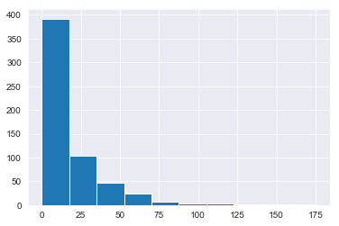


```python
print('Old length:', len(model_df))
print('New length:', len(model_df[model_df['Total_weight_(kg)'] < 16]))
model_df = model_df[model_df['Total_weight_(kg)'] < 16]
model_df.describe()
```

    Old length: 586
    New length: 516
    


<div>
<style scoped>
    .dataframe tbody tr th:only-of-type {
        vertical-align: middle;
    }

    .dataframe tbody tr th {
        vertical-align: top;
    }

    .dataframe thead th {
        text-align: right;
    }
</style>
<table border="1" class="dataframe">
  <thead>
    <tr style="text-align: right;">
      <th></th>
      <th>Non_combust_wt_%</th>
      <th>Organics_wt_%</th>
      <th>Paper_and_cardboard_wt_%</th>
      <th>Plastics_wt_%</th>
      <th>Total_weight_(kg)</th>
      <th>aluminium_cans</th>
      <th>aluminium_recyclable</th>
      <th>batteries</th>
      <th>bottles_cds</th>
      <th>bottles_wine_and_spirits</th>
      <th>cardboard</th>
      <th>ceramics</th>
      <th>drinkbags</th>
      <th>electrical_items_and_peripherals_(incl_tvs)</th>
      <th>energy_kWh_per_kg</th>
      <th>eps</th>
      <th>feminine_hygiene</th>
      <th>flexibles_film</th>
      <th>food</th>
      <th>hdpe_bottles</th>
      <th>jars</th>
      <th>lpb</th>
      <th>nappies</th>
      <th>other</th>
      <th>other_glass</th>
      <th>other_metal</th>
      <th>other_organics</th>
      <th>other_plastic</th>
      <th>other_sanitary_waste</th>
      <th>paper</th>
      <th>pet_bottles</th>
      <th>plastic_bags</th>
      <th>pp</th>
      <th>steel_cans</th>
      <th>textiles</th>
      <th>total_energy_kWh</th>
    </tr>
  </thead>
  <tbody>
    <tr>
      <th>count</th>
      <td>516.000000</td>
      <td>516.000000</td>
      <td>516.000000</td>
      <td>516.000000</td>
      <td>516.000000</td>
      <td>516.000000</td>
      <td>516.000000</td>
      <td>516.000000</td>
      <td>516.000000</td>
      <td>516.000000</td>
      <td>516.000000</td>
      <td>516.000000</td>
      <td>516.000000</td>
      <td>516.000000</td>
      <td>516.000000</td>
      <td>516.000000</td>
      <td>516.000000</td>
      <td>516.000000</td>
      <td>516.000000</td>
      <td>516.000000</td>
      <td>516.000000</td>
      <td>516.000000</td>
      <td>516.000000</td>
      <td>516.000000</td>
      <td>516.000000</td>
      <td>516.000000</td>
      <td>516.000000</td>
      <td>516.000000</td>
      <td>516.000000</td>
      <td>516.000000</td>
      <td>516.000000</td>
      <td>516.000000</td>
      <td>516.000000</td>
      <td>516.000000</td>
      <td>516.000000</td>
      <td>516.000000</td>
    </tr>
    <tr>
      <th>mean</th>
      <td>0.141575</td>
      <td>0.610547</td>
      <td>0.090113</td>
      <td>0.156637</td>
      <td>5.223431</td>
      <td>0.199983</td>
      <td>0.024217</td>
      <td>0.002147</td>
      <td>0.030116</td>
      <td>0.023238</td>
      <td>0.147915</td>
      <td>0.005998</td>
      <td>0.006309</td>
      <td>0.004107</td>
      <td>2.227578</td>
      <td>0.026977</td>
      <td>0.056083</td>
      <td>0.179067</td>
      <td>1.701150</td>
      <td>0.034548</td>
      <td>0.091444</td>
      <td>0.032537</td>
      <td>0.651723</td>
      <td>0.062072</td>
      <td>0.003432</td>
      <td>0.019728</td>
      <td>0.896434</td>
      <td>0.091599</td>
      <td>0.091713</td>
      <td>0.112634</td>
      <td>0.181076</td>
      <td>0.140967</td>
      <td>0.015632</td>
      <td>0.273866</td>
      <td>0.115027</td>
      <td>12.109748</td>
    </tr>
    <tr>
      <th>std</th>
      <td>0.173728</td>
      <td>0.283029</td>
      <td>0.126608</td>
      <td>0.149067</td>
      <td>3.635338</td>
      <td>0.756555</td>
      <td>0.104719</td>
      <td>0.022486</td>
      <td>0.202081</td>
      <td>0.170631</td>
      <td>0.331126</td>
      <td>0.065309</td>
      <td>0.036391</td>
      <td>0.049133</td>
      <td>0.859181</td>
      <td>0.063719</td>
      <td>0.192178</td>
      <td>0.288849</td>
      <td>2.294945</td>
      <td>0.083585</td>
      <td>0.246646</td>
      <td>0.138367</td>
      <td>1.984713</td>
      <td>0.240087</td>
      <td>0.036923</td>
      <td>0.114199</td>
      <td>2.250055</td>
      <td>0.274567</td>
      <td>0.352108</td>
      <td>0.227172</td>
      <td>0.328292</td>
      <td>0.382436</td>
      <td>0.060521</td>
      <td>0.586254</td>
      <td>0.414171</td>
      <td>10.445627</td>
    </tr>
    <tr>
      <th>min</th>
      <td>0.000000</td>
      <td>0.003579</td>
      <td>0.000000</td>
      <td>0.000000</td>
      <td>0.056000</td>
      <td>0.000000</td>
      <td>0.000000</td>
      <td>0.000000</td>
      <td>0.000000</td>
      <td>0.000000</td>
      <td>0.000000</td>
      <td>0.000000</td>
      <td>0.000000</td>
      <td>0.000000</td>
      <td>0.020000</td>
      <td>0.000000</td>
      <td>0.000000</td>
      <td>0.000000</td>
      <td>0.000000</td>
      <td>0.000000</td>
      <td>0.000000</td>
      <td>0.000000</td>
      <td>0.000000</td>
      <td>0.000000</td>
      <td>0.000000</td>
      <td>0.000000</td>
      <td>0.000000</td>
      <td>0.000000</td>
      <td>0.000000</td>
      <td>0.000000</td>
      <td>0.000000</td>
      <td>0.000000</td>
      <td>0.000000</td>
      <td>0.000000</td>
      <td>0.000000</td>
      <td>0.070000</td>
    </tr>
    <tr>
      <th>25%</th>
      <td>0.019392</td>
      <td>0.395613</td>
      <td>0.003385</td>
      <td>0.044443</td>
      <td>2.246500</td>
      <td>0.000000</td>
      <td>0.000000</td>
      <td>0.000000</td>
      <td>0.000000</td>
      <td>0.000000</td>
      <td>0.000000</td>
      <td>0.000000</td>
      <td>0.000000</td>
      <td>0.000000</td>
      <td>1.645000</td>
      <td>0.000000</td>
      <td>0.000000</td>
      <td>0.031000</td>
      <td>0.000000</td>
      <td>0.000000</td>
      <td>0.000000</td>
      <td>0.000000</td>
      <td>0.000000</td>
      <td>0.000000</td>
      <td>0.000000</td>
      <td>0.000000</td>
      <td>0.000000</td>
      <td>0.000000</td>
      <td>0.000000</td>
      <td>0.000000</td>
      <td>0.000000</td>
      <td>0.000000</td>
      <td>0.000000</td>
      <td>0.000000</td>
      <td>0.000000</td>
      <td>4.145000</td>
    </tr>
    <tr>
      <th>50%</th>
      <td>0.076120</td>
      <td>0.667773</td>
      <td>0.043399</td>
      <td>0.116282</td>
      <td>4.318000</td>
      <td>0.000000</td>
      <td>0.000000</td>
      <td>0.000000</td>
      <td>0.000000</td>
      <td>0.000000</td>
      <td>0.000000</td>
      <td>0.000000</td>
      <td>0.000000</td>
      <td>0.000000</td>
      <td>2.540000</td>
      <td>0.000000</td>
      <td>0.000000</td>
      <td>0.088000</td>
      <td>0.721500</td>
      <td>0.000000</td>
      <td>0.000000</td>
      <td>0.000000</td>
      <td>0.000000</td>
      <td>0.000000</td>
      <td>0.000000</td>
      <td>0.000000</td>
      <td>0.000000</td>
      <td>0.016500</td>
      <td>0.000000</td>
      <td>0.012000</td>
      <td>0.081000</td>
      <td>0.052000</td>
      <td>0.000000</td>
      <td>0.069000</td>
      <td>0.000000</td>
      <td>9.270000</td>
    </tr>
    <tr>
      <th>75%</th>
      <td>0.194802</td>
      <td>0.861856</td>
      <td>0.113435</td>
      <td>0.217723</td>
      <td>7.429000</td>
      <td>0.070500</td>
      <td>0.009000</td>
      <td>0.000000</td>
      <td>0.000000</td>
      <td>0.000000</td>
      <td>0.150250</td>
      <td>0.000000</td>
      <td>0.000000</td>
      <td>0.000000</td>
      <td>2.940000</td>
      <td>0.026000</td>
      <td>0.000000</td>
      <td>0.226500</td>
      <td>2.603000</td>
      <td>0.027250</td>
      <td>0.000000</td>
      <td>0.009000</td>
      <td>0.000000</td>
      <td>0.000000</td>
      <td>0.000000</td>
      <td>0.000000</td>
      <td>0.340750</td>
      <td>0.089500</td>
      <td>0.000000</td>
      <td>0.114250</td>
      <td>0.211250</td>
      <td>0.160000</td>
      <td>0.005000</td>
      <td>0.241000</td>
      <td>0.020250</td>
      <td>16.872500</td>
    </tr>
    <tr>
      <th>max</th>
      <td>0.926819</td>
      <td>1.000000</td>
      <td>0.823762</td>
      <td>0.860902</td>
      <td>15.750000</td>
      <td>8.612000</td>
      <td>1.840000</td>
      <td>0.356000</td>
      <td>3.670000</td>
      <td>2.873000</td>
      <td>2.825000</td>
      <td>1.122000</td>
      <td>0.509000</td>
      <td>0.838000</td>
      <td>3.120000</td>
      <td>0.574000</td>
      <td>1.580000</td>
      <td>3.228000</td>
      <td>11.976000</td>
      <td>0.848000</td>
      <td>2.306000</td>
      <td>1.860000</td>
      <td>15.092000</td>
      <td>2.780000</td>
      <td>0.616000</td>
      <td>1.300000</td>
      <td>15.232000</td>
      <td>4.904000</td>
      <td>3.280000</td>
      <td>1.896000</td>
      <td>3.338000</td>
      <td>5.256000</td>
      <td>0.970000</td>
      <td>5.308000</td>
      <td>4.376000</td>
      <td>48.840000</td>
    </tr>
  </tbody>
</table>
</div>


```python
# print('Old length:', len(model_df))
# print('New length:', len(model_df[model_df['total_energy_kWh'] < 150]))
# model_df = model_df[model_df['total_energy_kWh'] < 150]
# model_df.describe()
```

## Remove Unnecessary Features


```python
# X = model_df.drop(['ID',
#                    'total_energy_kWh',
#                    'energy_kWh_per_kg',
#                    'Total_weight_(kg)',
#                    'Organics_wt_%',
#                    'Paper_and_cardboard_wt_%',
#                    'Plastics_wt_%',
#                    'Non_combust_wt_%'],
#                    axis=1)
# y = model_df[['total_energy_kWh']]
```


```python
X = model_df.drop(['ID',
                   'total_energy_kWh',
                   'energy_kWh_per_kg',
                   'Total_weight_(kg)',
                   'Organics_wt_%',
                   'Paper_and_cardboard_wt_%',
                   'Plastics_wt_%',
                   'Non_combust_wt_%'], axis=1)
y = model_df[['energy_kWh_per_kg']]
```

## Train/Test Split


```python
X_train, X_test, y_train, y_test = train_test_split(X, y, test_size=0.15, random_state=42)
```


```python
scaler = StandardScaler()
X_train_Scaled = pd.DataFrame(scaler.fit_transform(X_train), columns=X.columns)
X_test_Scaled = pd.DataFrame(scaler.transform(X_test), columns=X.columns)

y_train_Scaled = scaler.fit_transform(y_train)
y_test_Scaled = scaler.transform(y_test)
```


```python
X_train_Scaled.head()
```


<div>
<style scoped>
    .dataframe tbody tr th:only-of-type {
        vertical-align: middle;
    }

    .dataframe tbody tr th {
        vertical-align: top;
    }

    .dataframe thead th {
        text-align: right;
    }
</style>
<table border="1" class="dataframe">
  <thead>
    <tr style="text-align: right;">
      <th></th>
      <th>aluminium_cans</th>
      <th>aluminium_recyclable</th>
      <th>batteries</th>
      <th>bottles_cds</th>
      <th>bottles_wine_and_spirits</th>
      <th>cardboard</th>
      <th>ceramics</th>
      <th>drinkbags</th>
      <th>electrical_items_and_peripherals_(incl_tvs)</th>
      <th>eps</th>
      <th>feminine_hygiene</th>
      <th>flexibles_film</th>
      <th>food</th>
      <th>hdpe_bottles</th>
      <th>jars</th>
      <th>lpb</th>
      <th>nappies</th>
      <th>other</th>
      <th>other_glass</th>
      <th>other_metal</th>
      <th>other_organics</th>
      <th>other_plastic</th>
      <th>other_sanitary_waste</th>
      <th>paper</th>
      <th>pet_bottles</th>
      <th>plastic_bags</th>
      <th>pp</th>
      <th>steel_cans</th>
      <th>textiles</th>
    </tr>
  </thead>
  <tbody>
    <tr>
      <th>0</th>
      <td>-0.270417</td>
      <td>-0.228289</td>
      <td>-0.103834</td>
      <td>-0.14073</td>
      <td>-0.136738</td>
      <td>1.265438</td>
      <td>-0.098466</td>
      <td>-0.154106</td>
      <td>-0.079706</td>
      <td>-0.413417</td>
      <td>-0.30746</td>
      <td>5.950470</td>
      <td>-0.611218</td>
      <td>-0.412176</td>
      <td>0.861347</td>
      <td>-0.170126</td>
      <td>-0.332314</td>
      <td>0.959775</td>
      <td>-0.090284</td>
      <td>-0.16923</td>
      <td>-0.229082</td>
      <td>2.599808</td>
      <td>-0.266459</td>
      <td>2.736695</td>
      <td>0.034459</td>
      <td>-0.321770</td>
      <td>-0.263237</td>
      <td>0.178715</td>
      <td>0.629460</td>
    </tr>
    <tr>
      <th>1</th>
      <td>-0.270417</td>
      <td>-0.228289</td>
      <td>-0.103834</td>
      <td>-0.14073</td>
      <td>-0.136738</td>
      <td>-0.445976</td>
      <td>-0.098466</td>
      <td>-0.154106</td>
      <td>-0.079706</td>
      <td>0.294467</td>
      <td>-0.30746</td>
      <td>0.281862</td>
      <td>0.121999</td>
      <td>-0.005058</td>
      <td>-0.379311</td>
      <td>-0.105424</td>
      <td>-0.332314</td>
      <td>0.122243</td>
      <td>-0.090284</td>
      <td>-0.16923</td>
      <td>-0.398419</td>
      <td>-0.332371</td>
      <td>3.751712</td>
      <td>-0.182397</td>
      <td>2.210006</td>
      <td>-0.049377</td>
      <td>0.106801</td>
      <td>-0.472867</td>
      <td>-0.276395</td>
    </tr>
    <tr>
      <th>2</th>
      <td>-0.270417</td>
      <td>-0.228289</td>
      <td>-0.103834</td>
      <td>-0.14073</td>
      <td>-0.136738</td>
      <td>-0.215897</td>
      <td>-0.098466</td>
      <td>-0.154106</td>
      <td>-0.079706</td>
      <td>4.636151</td>
      <td>-0.30746</td>
      <td>-0.367938</td>
      <td>1.107798</td>
      <td>3.635061</td>
      <td>-0.379311</td>
      <td>-0.234828</td>
      <td>-0.332314</td>
      <td>-0.260629</td>
      <td>-0.090284</td>
      <td>-0.16923</td>
      <td>-0.398419</td>
      <td>0.074405</td>
      <td>3.968911</td>
      <td>-0.490546</td>
      <td>-0.251950</td>
      <td>-0.083733</td>
      <td>0.338075</td>
      <td>-0.472867</td>
      <td>-0.190893</td>
    </tr>
    <tr>
      <th>3</th>
      <td>-0.235729</td>
      <td>-0.228289</td>
      <td>-0.103834</td>
      <td>-0.14073</td>
      <td>-0.136738</td>
      <td>-0.445976</td>
      <td>-0.098466</td>
      <td>-0.154106</td>
      <td>-0.079706</td>
      <td>-0.413417</td>
      <td>-0.30746</td>
      <td>0.402679</td>
      <td>-0.734281</td>
      <td>-0.412176</td>
      <td>-0.379311</td>
      <td>-0.234828</td>
      <td>-0.332314</td>
      <td>-0.260629</td>
      <td>-0.090284</td>
      <td>-0.16923</td>
      <td>6.707200</td>
      <td>-0.128983</td>
      <td>-0.266459</td>
      <td>-0.490546</td>
      <td>-0.538359</td>
      <td>-0.164715</td>
      <td>-0.263237</td>
      <td>-0.472867</td>
      <td>-0.276395</td>
    </tr>
    <tr>
      <th>4</th>
      <td>-0.270417</td>
      <td>-0.228289</td>
      <td>-0.103834</td>
      <td>-0.14073</td>
      <td>-0.136738</td>
      <td>-0.124495</td>
      <td>-0.098466</td>
      <td>-0.154106</td>
      <td>-0.079706</td>
      <td>-0.413417</td>
      <td>-0.30746</td>
      <td>-0.191611</td>
      <td>-0.310444</td>
      <td>0.186528</td>
      <td>0.759267</td>
      <td>0.160573</td>
      <td>-0.332314</td>
      <td>5.546261</td>
      <td>-0.090284</td>
      <td>-0.16923</td>
      <td>-0.373695</td>
      <td>0.098134</td>
      <td>-0.266459</td>
      <td>0.317305</td>
      <td>-0.448675</td>
      <td>-0.351218</td>
      <td>-0.263237</td>
      <td>-0.375466</td>
      <td>-0.174717</td>
    </tr>
  </tbody>
</table>
</div>


```python
plt.figure(figsize=(10,7))
sns.heatmap(X_train_Scaled.corr());
```


## Statsmodel OLS


```python
from statsmodels.regression.linear_model import OLS
import statsmodels.api as sm
import statsmodels.stats.api as sms
import statsmodels.formula.api as smf
import scipy.stats as stats
plt.style.use('ggplot')

X_int = sm.tools.add_constant(X)
model = OLS(y, X_int).fit()
model.summary()
```


<table class="simpletable">
<caption>OLS Regression Results</caption>
<tr>
  <th>Dep. Variable:</th>    <td>energy_kWh_per_kg</td> <th>  R-squared:         </th> <td>   0.656</td>
</tr>
<tr>
  <th>Model:</th>                   <td>OLS</td>        <th>  Adj. R-squared:    </th> <td>   0.636</td>
</tr>
<tr>
  <th>Method:</th>             <td>Least Squares</td>   <th>  F-statistic:       </th> <td>   32.02</td>
</tr>
<tr>
  <th>Date:</th>             <td>Tue, 27 Oct 2020</td>  <th>  Prob (F-statistic):</th> <td>6.53e-94</td>
</tr>
<tr>
  <th>Time:</th>                 <td>11:32:16</td>      <th>  Log-Likelihood:    </th> <td> -377.73</td>
</tr>
<tr>
  <th>No. Observations:</th>      <td>   516</td>       <th>  AIC:               </th> <td>   815.5</td>
</tr>
<tr>
  <th>Df Residuals:</th>          <td>   486</td>       <th>  BIC:               </th> <td>   942.8</td>
</tr>
<tr>
  <th>Df Model:</th>              <td>    29</td>       <th>                     </th>     <td> </td>   
</tr>
<tr>
  <th>Covariance Type:</th>      <td>nonrobust</td>     <th>                     </th>     <td> </td>   
</tr>
</table>
<table class="simpletable">
<tr>
                       <td></td>                          <th>coef</th>     <th>std err</th>      <th>t</th>      <th>P>|t|</th>  <th>[0.025</th>    <th>0.975]</th>  
</tr>
<tr>
  <th>const</th>                                       <td>    2.1585</td> <td>    0.043</td> <td>   49.881</td> <td> 0.000</td> <td>    2.074</td> <td>    2.244</td>
</tr>
<tr>
  <th>aluminium_cans</th>                              <td>   -0.2035</td> <td>    0.034</td> <td>   -6.003</td> <td> 0.000</td> <td>   -0.270</td> <td>   -0.137</td>
</tr>
<tr>
  <th>aluminium_recyclable</th>                        <td>   -0.3243</td> <td>    0.229</td> <td>   -1.418</td> <td> 0.157</td> <td>   -0.774</td> <td>    0.125</td>
</tr>
<tr>
  <th>batteries</th>                                   <td>   -2.1234</td> <td>    1.024</td> <td>   -2.074</td> <td> 0.039</td> <td>   -4.135</td> <td>   -0.112</td>
</tr>
<tr>
  <th>bottles_cds</th>                                 <td>   -0.4972</td> <td>    0.116</td> <td>   -4.296</td> <td> 0.000</td> <td>   -0.725</td> <td>   -0.270</td>
</tr>
<tr>
  <th>bottles_wine_and_spirits</th>                    <td>   -0.4632</td> <td>    0.136</td> <td>   -3.396</td> <td> 0.001</td> <td>   -0.731</td> <td>   -0.195</td>
</tr>
<tr>
  <th>cardboard</th>                                   <td>   -0.2559</td> <td>    0.076</td> <td>   -3.380</td> <td> 0.001</td> <td>   -0.405</td> <td>   -0.107</td>
</tr>
<tr>
  <th>ceramics</th>                                    <td>   -0.0999</td> <td>    0.371</td> <td>   -0.269</td> <td> 0.788</td> <td>   -0.829</td> <td>    0.629</td>
</tr>
<tr>
  <th>drinkbags</th>                                   <td>   -0.5219</td> <td>    0.704</td> <td>   -0.741</td> <td> 0.459</td> <td>   -1.905</td> <td>    0.861</td>
</tr>
<tr>
  <th>electrical_items_and_peripherals_(incl_tvs)</th> <td>   -1.1816</td> <td>    0.481</td> <td>   -2.456</td> <td> 0.014</td> <td>   -2.127</td> <td>   -0.236</td>
</tr>
<tr>
  <th>eps</th>                                         <td>   -0.0338</td> <td>    0.424</td> <td>   -0.080</td> <td> 0.936</td> <td>   -0.866</td> <td>    0.799</td>
</tr>
<tr>
  <th>feminine_hygiene</th>                            <td>    0.3821</td> <td>    0.127</td> <td>    3.002</td> <td> 0.003</td> <td>    0.132</td> <td>    0.632</td>
</tr>
<tr>
  <th>flexibles_film</th>                              <td>   -0.1973</td> <td>    0.094</td> <td>   -2.094</td> <td> 0.037</td> <td>   -0.382</td> <td>   -0.012</td>
</tr>
<tr>
  <th>food</th>                                        <td>    0.1643</td> <td>    0.011</td> <td>   15.456</td> <td> 0.000</td> <td>    0.143</td> <td>    0.185</td>
</tr>
<tr>
  <th>hdpe_bottles</th>                                <td>   -0.2407</td> <td>    0.287</td> <td>   -0.839</td> <td> 0.402</td> <td>   -0.804</td> <td>    0.323</td>
</tr>
<tr>
  <th>jars</th>                                        <td>   -0.4169</td> <td>    0.104</td> <td>   -3.992</td> <td> 0.000</td> <td>   -0.622</td> <td>   -0.212</td>
</tr>
<tr>
  <th>lpb</th>                                         <td>    0.0457</td> <td>    0.182</td> <td>    0.251</td> <td> 0.802</td> <td>   -0.312</td> <td>    0.404</td>
</tr>
<tr>
  <th>nappies</th>                                     <td>    0.1183</td> <td>    0.012</td> <td>    9.870</td> <td> 0.000</td> <td>    0.095</td> <td>    0.142</td>
</tr>
<tr>
  <th>other</th>                                       <td>   -0.2913</td> <td>    0.100</td> <td>   -2.914</td> <td> 0.004</td> <td>   -0.488</td> <td>   -0.095</td>
</tr>
<tr>
  <th>other_glass</th>                                 <td>   -0.9989</td> <td>    0.628</td> <td>   -1.589</td> <td> 0.113</td> <td>   -2.234</td> <td>    0.236</td>
</tr>
<tr>
  <th>other_metal</th>                                 <td>   -0.2867</td> <td>    0.212</td> <td>   -1.353</td> <td> 0.177</td> <td>   -0.703</td> <td>    0.130</td>
</tr>
<tr>
  <th>other_organics</th>                              <td>    0.1253</td> <td>    0.011</td> <td>   11.580</td> <td> 0.000</td> <td>    0.104</td> <td>    0.147</td>
</tr>
<tr>
  <th>other_plastic</th>                               <td>   -0.1040</td> <td>    0.092</td> <td>   -1.131</td> <td> 0.259</td> <td>   -0.285</td> <td>    0.077</td>
</tr>
<tr>
  <th>other_sanitary_waste</th>                        <td>    0.2824</td> <td>    0.069</td> <td>    4.119</td> <td> 0.000</td> <td>    0.148</td> <td>    0.417</td>
</tr>
<tr>
  <th>paper</th>                                       <td>   -0.2425</td> <td>    0.110</td> <td>   -2.207</td> <td> 0.028</td> <td>   -0.458</td> <td>   -0.027</td>
</tr>
<tr>
  <th>pet_bottles</th>                                 <td>   -0.2013</td> <td>    0.084</td> <td>   -2.398</td> <td> 0.017</td> <td>   -0.366</td> <td>   -0.036</td>
</tr>
<tr>
  <th>plastic_bags</th>                                <td>   -0.1769</td> <td>    0.064</td> <td>   -2.763</td> <td> 0.006</td> <td>   -0.303</td> <td>   -0.051</td>
</tr>
<tr>
  <th>pp</th>                                          <td>   -0.0737</td> <td>    0.397</td> <td>   -0.186</td> <td> 0.853</td> <td>   -0.854</td> <td>    0.706</td>
</tr>
<tr>
  <th>steel_cans</th>                                  <td>   -0.3285</td> <td>    0.045</td> <td>   -7.280</td> <td> 0.000</td> <td>   -0.417</td> <td>   -0.240</td>
</tr>
<tr>
  <th>textiles</th>                                    <td>   -0.2089</td> <td>    0.059</td> <td>   -3.552</td> <td> 0.000</td> <td>   -0.324</td> <td>   -0.093</td>
</tr>
</table>
<table class="simpletable">
<tr>
  <th>Omnibus:</th>       <td>91.342</td> <th>  Durbin-Watson:     </th> <td>   2.019</td>
</tr>
<tr>
  <th>Prob(Omnibus):</th> <td> 0.000</td> <th>  Jarque-Bera (JB):  </th> <td> 148.502</td>
</tr>
<tr>
  <th>Skew:</th>          <td>-1.093</td> <th>  Prob(JB):          </th> <td>5.67e-33</td>
</tr>
<tr>
  <th>Kurtosis:</th>      <td> 4.460</td> <th>  Cond. No.          </th> <td>    134.</td>
</tr>
</table><br/><br/>Notes:<br/>[1] Standard Errors assume that the covariance matrix of the errors is correctly specified.


```python
# from statsmodels.regression.linear_model import OLS
# import statsmodels.api as sm
# import statsmodels.stats.api as sms
# import statsmodels.formula.api as smf
# import scipy.stats as stats
# plt.style.use('ggplot')

# X_int = sm.tools.add_constant(X)
# model = OLS(y, X_int).fit()
# model.summary()
```


```python
#
# results = []
# print('Model Residuals Plot')
# print('--------------------')
# fig = sm.graphics.qqplot(model.resid, dist=stats.norm, line='45', fit=True)
# plt.show()
# for idx, column in enumerate(X.columns):
#     print(f'Belize MSW Regression Plot for {column} Feature')
#     print('------------------------------------------------')
    
#     fig, axes = plt.subplots(figsize=(15,12))
#     fig = sm.graphics.plot_regress_exog(model, column, fig=fig)
#     fig.tight_layout()
#     plt.show()
    
#     input('Press ENTER to continue...')
```


```python
# Plot redisuals from Statsmodel OLS
plt.scatter(model.predict(X_int), scaler.inverse_transform(model.resid))
plt.plot(model.predict(X_int), [0 for i in range(len(X_int))]);
```


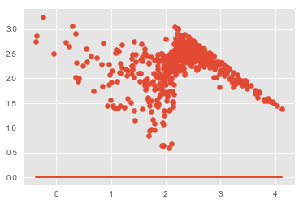


```python
model.predict(X_int)
```


    0      2.125332
    1      2.428816
    2      2.614348
    3      2.143678
    4      2.610926
    5      2.874390
    6      2.297044
    7      1.541377
    8      1.771196
    9      2.418981
    10     2.055725
    12     2.179512
    13     1.806501
    14     2.809967
    15     0.978560
    16     2.477922
    17     2.023130
    18     3.385116
    19     2.580472
    20     2.817343
    21     1.953351
    22     2.056655
    23     1.963994
    24     2.457757
    25     2.140835
    26     1.164597
    27     2.069993
    28     1.655710
    29     2.101448
    30     2.542295
    31     1.683270
    32     2.321586
    33     2.093886
    34     1.246383
    35     2.427249
    36     1.835000
    37     2.551097
    38     2.717292
    39     2.348813
    40     2.553973
    41     2.504539
    42     2.463856
    43     2.068502
    44     2.067374
    45     2.157760
    46     2.286300
    47     2.204454
    48     3.280003
    49     2.230515
    50     2.328505
    51     2.006140
    52     1.739130
    53     2.692762
    54     1.291793
    55     2.582487
    56     1.131684
    57     2.121626
    58     2.981542
    59     2.277684
    60     3.638292
    61     2.868893
    62     2.747697
    63     1.840226
    64     2.383450
    65     3.203491
    66     2.928673
    67     2.313767
    68     3.302166
    69     2.252373
    70     2.136389
    71     1.685546
    72     2.175360
    73     2.883302
    75     2.488368
    76     2.777705
    77     2.337083
    78     2.636392
    79     2.696963
    80     1.861950
    81     1.547701
    82     2.109880
    83     3.675415
    84     1.960443
    85     3.268273
    86     2.455513
    87     1.767135
    88     2.710274
    89     2.226155
    90     2.185917
    91     2.184773
    92     2.007594
    93     2.283432
    94     2.300989
    95     2.574455
    96     2.284520
    97     1.930517
    98     2.564866
    99     1.987167
    100    2.021390
    101    2.261983
    102    1.683706
    103    2.156836
    104    2.151590
    105    3.015441
    106    2.290137
    107    2.127803
    108    2.169680
    109    2.361480
    110    2.360677
    111    2.771251
    112    1.727347
    113    1.931091
    114    2.135334
    115    2.386613
    116    2.234379
    117    1.856982
    118    2.253096
    119    1.940202
    120    1.960405
    121    2.199755
    122    2.701132
    123    2.243863
    124    2.470006
    125    2.710368
    126    2.648245
    127    2.503968
    128    2.735394
    129    2.300842
    130    2.023459
    131    2.553055
    132    0.350360
    133    1.952106
    135    2.435889
    136    2.372994
    137    1.422200
    138    2.491539
    139    2.267023
    140    2.472114
    141    2.315930
    142    1.301229
    143    2.630003
    144    2.570329
    145    2.342184
    146    2.997565
    147    1.617530
    148    2.129450
    149    2.648744
    150    1.985313
    151    3.471791
    152    2.515912
    153    2.644032
    154    2.145843
    155    1.993450
    156    1.675154
    157    2.395868
    158    2.117188
    159    2.192810
    160    2.685411
    161    2.376177
    162    1.670172
    163    2.082909
    164    1.895016
    165    2.266950
    166    2.441800
    167    2.488398
    168    1.740138
    169    2.405396
    170    2.110962
    171    1.610531
    172    2.025272
    173    1.943042
    174    2.925992
    175    2.432655
    176    3.390263
    177    1.792252
    178    2.560823
    179    3.115103
    180    1.951657
    181    1.970959
    182    2.238774
    183    2.016072
    184    2.541503
    185    1.867703
    192    1.816262
    193    2.058486
    194    2.274788
    198    2.222419
    200    2.123993
    207    2.410202
    208    3.202644
    209    1.424216
    210    2.605518
    211    0.631382
    212    2.693428
    213    1.131998
    214    1.979203
    215    1.949512
    216    2.485829
    217    2.245788
    219    2.335083
    220    1.651585
    221    2.194435
    0      1.961247
    1      2.477472
    2      3.798623
    3      2.209995
    4      3.449881
    5      3.868313
    6      1.904185
    7      2.667853
    8      2.091236
    10     2.202395
    11     2.175419
    12     2.825618
    14     2.706334
    16     3.798889
    17     3.446998
    19     2.169668
    20     3.155096
    21     1.148645
    25     3.098657
    27     1.083173
    29     1.031628
    32     1.117463
    33     1.851123
    34     1.990125
    35     2.716228
    37     3.490937
    38     2.885929
    39     1.573859
    41    -0.050153
    42     3.980691
    46     1.110467
    50    -0.360153
    51     0.486038
    53     0.963817
    54     0.998818
    55     0.842855
    56     2.168482
    58     1.139137
    59     0.375395
    60     1.016577
    61     1.105617
    62     1.005292
    63     2.112888
    64     1.198029
    65     1.794686
    66     3.067321
    68     2.702004
    70     3.470567
             ...   
    93     3.910204
    94     2.600100
    95     3.230487
    96     2.512665
    97     1.887985
    98     2.761117
    99     2.248379
    100    2.761982
    101    2.108530
    102    3.444090
    103    2.626757
    104    1.557645
    105    2.258708
    106    1.381423
    107    2.622232
    108    3.134742
    109    3.565527
    110    2.826174
    111    2.213746
    112    3.229595
    113    2.203985
    114    3.418479
    115    2.664761
    116    2.398063
    117    2.308696
    118    2.795845
    119    3.061114
    120    2.796725
    121    2.780857
    122    4.126373
    123    2.342337
    124    2.617799
    125    2.374191
    127    2.172790
    128    2.593106
    129    3.016997
    130    1.829821
    131    2.302524
    132    2.557920
    138    1.373806
    143    2.179275
    144    2.841051
    145    1.356969
    146    1.308491
    148    1.786643
    149    1.951437
    151    2.000010
    154    3.436052
    155   -0.245254
    156    2.414719
    157    2.116809
    160    2.875799
    164    1.617126
    165    1.271669
    167    1.884826
    172    1.056504
    173    2.394791
    174    2.166754
    175    2.199801
    176    1.815411
    177    2.053901
    179    2.193313
    180    2.176594
    181    1.856913
    183    1.972001
    185    2.078574
    186    2.471798
    187    2.525907
    188    2.279775
    189    0.232781
    190    2.117359
    191    2.825523
    192    2.706697
    193    1.506869
    194    2.494590
    195    3.018349
    196    3.130797
    197    2.870872
    198    2.263940
    199    2.162054
    200    2.329397
    201    2.868304
    202    2.310302
    203    1.624786
    204    2.510171
    205    3.857156
    206    2.473905
    207    2.148015
    208    2.348534
    209    2.986430
    210    1.876889
    211    2.218705
    212    2.530966
    213    2.587342
    214    1.615202
    215    3.227916
    216    2.483482
    217    3.106980
    218    2.831852
    219    2.480513
    220    2.441886
    221    2.755905
    222    2.419183
    224    2.509672
    226    2.972066
    227    3.146355
    228    3.308643
    229    1.451323
    230    1.424467
    1      2.037235
    4      2.463174
    7      0.548404
    8      1.168722
    10     0.831004
    16     1.435518
    17     3.108201
    19     3.482800
    21     3.099581
    23     0.937138
    24     1.927957
    25     1.569456
    26     0.296727
    28     1.906702
    29     2.399201
    31     0.391577
    33     1.610183
    34     2.209781
    35     0.562416
    37     2.080200
    39     2.250930
    41     2.644780
    42     2.993137
    43     2.912830
    46     1.207098
    48     3.339480
    51     2.056750
    52     2.484619
    54     2.244969
    55     1.456394
    56     2.193453
    57     2.192573
    58     1.786637
    60     2.527546
    61     2.893890
    63     1.096567
    64     0.742555
    66     0.174825
    67     2.518704
    69     2.089058
    70     2.230405
    71     2.560684
    72     2.691043
    73     2.840733
    74     2.455707
    75     2.569838
    76     2.827474
    77     2.784206
    78     3.406059
    81     1.393126
    82     3.943270
    83     3.710541
    86     2.348808
    87     2.201240
    88     1.080242
    89     2.102226
    90     0.966374
    91     0.859139
    92     0.683185
    93    -0.372434
    94     1.378598
    96     2.024157
    97     2.179722
    98     2.571666
    101    2.309393
    102    2.222499
    103    2.687070
    106    1.528566
    107    3.066566
    109    2.475165
    110    2.087326
    111    2.524893
    112    2.521778
    113    2.681045
    114    2.185209
    116    2.178766
    117    2.154865
    118    2.248656
    120    1.732809
    122    2.257982
    123    2.127956
    124    1.949245
    129    2.501784
    130    2.410060
    131    2.169516
    132    1.799995
    136    1.857644
    137    2.162602
    138    2.036851
    139    2.165552
    141    3.117992
    142    2.308555
    143    2.057348
    144    2.071418
    148    2.263435
    149    0.349889
    150    2.085007
    153    2.244176
    154    1.776793
    156    2.798192
    157    1.957968
    158    1.709222
    160    1.567426
    161    2.401331
    162    1.711900
    163    4.039736
    164    1.949924
    165    2.091773
    166    2.212516
    168    2.214810
    169    2.729176
    170    1.655034
    171    2.398339
    172    1.948255
    174    1.686875
    175    3.082883
    176    3.031150
    177    2.068595
    179    2.703340
    180    3.158044
    181    1.393291
    182    2.010275
    183    1.885328
    184    1.706554
    185    3.055079
    186    1.939788
    187    2.004459
    188    2.042946
    189    2.594411
    190    2.170929
    191    2.196226
    192    1.187769
    193    1.626765
    194    2.309024
    195    1.914321
    196    2.080838
    197    1.387064
    198    1.868239
    199    2.029388
    200    3.637409
    202    3.216189
    Length: 516, dtype: float64


```python
plt.scatter(model.predict(X_int), y)
```


    <matplotlib.collections.PathCollection at 0x131f65ff6a0>


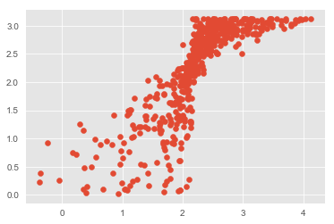


```python
model.resid.mean()
```


    -6.850678508539726e-16


## Scikit Learn LinearRegression Model


```python
from sklearn.linear_model import LinearRegression, LassoCV
linreg = LinearRegression()
linreg.fit(X_train_Scaled, y_train_Scaled)

y_hat_train_scaled = linreg.predict(X_train_Scaled)
y_hat_test_scaled = linreg.predict(X_test_Scaled)

train_residuals = scaler.inverse_transform(y_hat_train_scaled) - y_train
test_residuals = scaler.inverse_transform(y_hat_test_scaled) - y_test

train_mse = mean_squared_error(y_train, scaler.inverse_transform(y_hat_train_scaled))
test_mse = mean_squared_error(y_test, scaler.inverse_transform(y_hat_test_scaled))

print('Train RMSE:', np.sqrt(train_mse))
print('------------------------------')
print('Test RMSE:', np.sqrt(test_mse))
linreg.score(X_test_Scaled, y_test_Scaled)
```

    Train RMSE: 0.49745306603043815
    ------------------------------
    Test RMSE: 0.5471072210302643
    


    0.6156898871389254


```python
plt.scatter(scaler.inverse_transform(y_hat_test_scaled), y_test)
plt.plot(scaler.inverse_transform(y_hat_test_scaled), y_test);
```


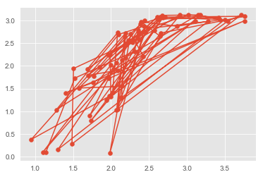


```python
sklearn_results = pd.DataFrame()
sklearn_results['Item'] = [x for x in X_train_Scaled.columns]
sklearn_results['Coef'] = [x for x in linreg.coef_[0]]
print('Sklearn Model Intercept:', linreg.intercept_)
sklearn_results['Coef'].hist();
```

    Sklearn Model Intercept: [-6.60619538e-17]
    


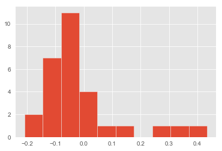


## Decision Tree Regressor

### Baseline Model


```python
from sklearn.tree import DecisionTreeRegressor
regressor = DecisionTreeRegressor(random_state=42)
regressor.fit(X_train_Scaled, y_train_Scaled)
```


    DecisionTreeRegressor(criterion='mse', max_depth=None, max_features=None,
               max_leaf_nodes=None, min_impurity_decrease=0.0,
               min_impurity_split=None, min_samples_leaf=1,
               min_samples_split=2, min_weight_fraction_leaf=0.0,
               presort=False, random_state=42, splitter='best')


```python
from sklearn.metrics import r2_score

y_pred = regressor.predict(X_test_Scaled)
y_pred = scaler.inverse_transform(y_pred)

print('RMSE Score:', np.sqrt(mean_squared_error(y_test, y_pred)))
print('R-sq Score:', r2_score(y_test, y_pred))
```

    RMSE Score: 0.6414986460005296
    R-sq Score: 0.4716418545432719
    


```python
plt.figure(figsize=(10,6))
sns.barplot(X_train_Scaled.columns, regressor.feature_importances_, orient="v");
plt.xticks(rotation=90);
```


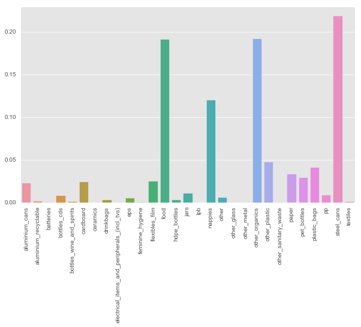


### Optimized Model


```python
op_regressor = DecisionTreeRegressor(random_state=42,
                                     max_depth=4,
                                     min_samples_leaf=2,
                                     min_samples_split=4)
op_regressor.fit(X_train_Scaled, y_train_Scaled)
```


    DecisionTreeRegressor(criterion='mse', max_depth=4, max_features=None,
               max_leaf_nodes=None, min_impurity_decrease=0.0,
               min_impurity_split=None, min_samples_leaf=2,
               min_samples_split=4, min_weight_fraction_leaf=0.0,
               presort=False, random_state=42, splitter='best')


```python
y_pred = op_regressor.predict(X_test_Scaled)
y_pred = scaler.inverse_transform(y_pred)

print('RMSE Score:', np.sqrt(mean_squared_error(y_test, y_pred)))
print('R-sq Score:', r2_score(y_test, y_pred))
```

    RMSE Score: 0.6129616958543077
    R-sq Score: 0.5176041184195483
    


```python
plt.figure(figsize=(10,6))
sns.barplot(X_train_Scaled.columns, op_regressor.feature_importances_, orient="v");
plt.xticks(rotation=90);
```


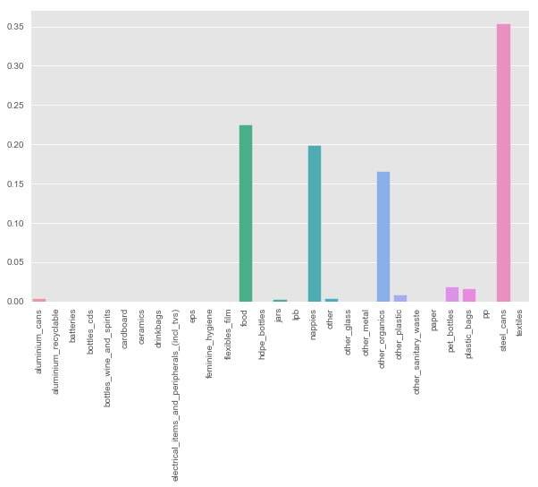


## Random Forest Model


```python
from sklearn.model_selection import GridSearchCV
from sklearn.linear_model import LogisticRegression
from sklearn import tree
from sklearn.ensemble import RandomForestRegressor
from sklearn.metrics import r2_score
from sklearn.tree import export_graphviz
from IPython.display import Image  
from pydotplus import graph_from_dot_data
import pydotplus
from sklearn.pipeline import Pipeline
```

### Baseline Model


```python
rdm_forest = RandomForestRegressor(200, random_state=42)
```


```python
rdm_forest.fit(X_train_Scaled, y_train_Scaled)
```


    RandomForestRegressor(bootstrap=True, criterion='mse', max_depth=None,
               max_features='auto', max_leaf_nodes=None,
               min_impurity_decrease=0.0, min_impurity_split=None,
               min_samples_leaf=1, min_samples_split=2,
               min_weight_fraction_leaf=0.0, n_estimators=200, n_jobs=None,
               oob_score=False, random_state=42, verbose=0, warm_start=False)


```python
rdm_forest.score(X_train_Scaled, y_train_Scaled)
```


    0.9637235727710164


```python
rdm_forest.score(X_test_Scaled, y_test_Scaled)
```


    0.7525967273498192


```python
y_preds = rdm_forest.predict(X_test_Scaled)
y_preds
```


    array([ 0.68431537, -0.93838825,  0.78645176, -1.24356757, -0.79256278,
           -0.37353419,  0.5885625 , -0.43233289, -0.42876046,  0.70645273,
           -1.13001111,  0.37726199,  0.60941144,  0.45181452, -0.99109625,
            0.22358889, -0.11520642,  0.2380543 , -0.10308358, -0.15596728,
           -1.78452734,  0.91177967,  1.02498474, -1.05510719, -0.02531   ,
            0.76378732,  0.88548423,  0.52847538,  1.03084118,  0.02663666,
           -0.28861574, -0.7253308 ,  0.32560815,  0.36970717,  0.64320313,
            0.29480325, -1.38675763, -0.43385556,  0.59307196, -1.36748993,
           -0.09506025,  0.45632399, -0.16703596,  0.56092008, -0.21019795,
            0.55676201,  0.65784424,  0.2512313 ,  1.01760562, -1.08544357,
           -0.78863897,  0.47061371, -0.20205749,  0.36355791,  0.73760901,
           -0.58735297,  0.63746381,  0.86879337,  0.96261361, -0.06390397,
            0.45029185, -0.30214413,  0.58270606,  0.25890325,  0.4233522 ,
           -0.01418276, -0.53124823,  1.02299355,  0.47049658, -0.85030733,
           -0.02273317, -1.71237594, -0.53962295,  0.43887178,  0.52853395,
            0.51810948, -0.15778277, -1.92543339])


```python
# Plot redisuals from Random Forest

plt.scatter(scaler.inverse_transform(rdm_forest.predict(X_test_Scaled)), y_test);
# plt.plot(scaler.inverse_transform(rdm_forest.predict(X_test_Scaled)), y_test);
```


```python
np.sqrt(mean_squared_error(y_test, scaler.inverse_transform(y_preds)))
```


    0.43896941354226604


### GridSearch


```python
rf_grid_reg = RandomForestRegressor(random_state=42)
grid_param = [{'n_estimators': [150, 200, 250, 300],
               'max_depth': [13, 15, 17, 20],
               'min_samples_split': [2, 3, 4, 5],
               'min_samples_leaf': [1, 2, 3]}]
```


```python
# rf_gridsearch = GridSearchCV(rf_grid_reg, grid_param, cv=3)
# rf_gridsearch.fit(X_train_Scaled, y_train_Scaled)
```


```python
# rf_gridsearch.best_params_
```


```python
# rf_gridsearch.score(X_test_Scaled, y_test_Scaled)
```


```python
optimal_rf_model = RandomForestRegressor(max_depth=20,
                                         min_samples_leaf=1,
                                         min_samples_split=3,
                                         n_estimators=200,
                                         random_state=42)
optimal_rf_model.fit(X_train_Scaled, y_train_Scaled)
```


    RandomForestRegressor(bootstrap=True, criterion='mse', max_depth=20,
               max_features='auto', max_leaf_nodes=None,
               min_impurity_decrease=0.0, min_impurity_split=None,
               min_samples_leaf=1, min_samples_split=3,
               min_weight_fraction_leaf=0.0, n_estimators=200, n_jobs=None,
               oob_score=False, random_state=42, verbose=0, warm_start=False)


```python
optimal_rf_model.score(X_train_Scaled, y_train_Scaled)
```


    0.9609207525084612


```python
optimal_rf_model.score(X_test_Scaled, y_test_Scaled)
```


    0.749441990615014


```python
y_preds = optimal_rf_model.predict(X_test_Scaled)
y_preds
```


    array([ 0.68778531, -0.92485666,  0.75552813, -1.2575073 , -0.78418068,
           -0.36214731,  0.5509269 , -0.41168697, -0.42767158,  0.71024652,
           -1.13272041,  0.36000988,  0.58378155,  0.43777983, -0.99764013,
            0.21003944, -0.09407791,  0.22108672, -0.11536538, -0.15745384,
           -1.82117892,  0.90982582,  1.02547828, -0.99878144, -0.03147489,
            0.75267067,  0.89107519,  0.51727382,  1.03093008, -0.01778411,
           -0.32753446, -0.64675391,  0.33340307,  0.40564294,  0.65362174,
            0.26127706, -1.31950237, -0.41311301,  0.5995114 , -1.34762153,
           -0.0794195 ,  0.43765155, -0.13339849,  0.55818805, -0.19955338,
            0.55360573,  0.6735416 ,  0.27118295,  1.01706606, -1.08530483,
           -0.79722061,  0.47488306, -0.20944749,  0.35935089,  0.75066832,
           -0.60151999,  0.63222494,  0.85381412,  0.9595554 , -0.10413886,
            0.46022312, -0.29826326,  0.59179366,  0.2891218 ,  0.42042319,
            0.02915884, -0.52417853,  1.02285013,  0.51838654, -0.8201834 ,
           -0.02217778, -1.71714797, -0.51677794,  0.46695762,  0.48107975,
            0.48602606, -0.16304674, -1.89527465])


```python
plt.scatter(scaler.inverse_transform(optimal_rf_model.predict(X_test_Scaled)), y_test);
```


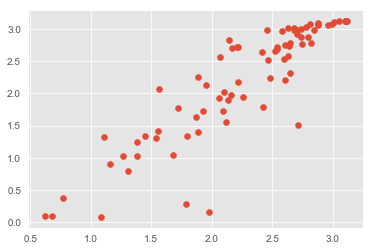


```python
np.sqrt(mean_squared_error(y_test, scaler.inverse_transform(y_preds)))
```


    0.44175928411644894


```python
def plot_feature_importances(model):
    n_features = X_train.shape[1]
    plt.figure(figsize=(20,20))
    plt.barh(range(n_features), model.feature_importances_, align='center') 
    plt.yticks(np.arange(n_features), X_train.columns.values) 
    plt.xlabel('Feature importance', fontsize=18)
    plt.yticks(fontsize=15)
    plt.ylabel('Feature', fontsize=18)
    plt.yticks(fontsize=15)

plot_feature_importances(optimal_rf_model)
```


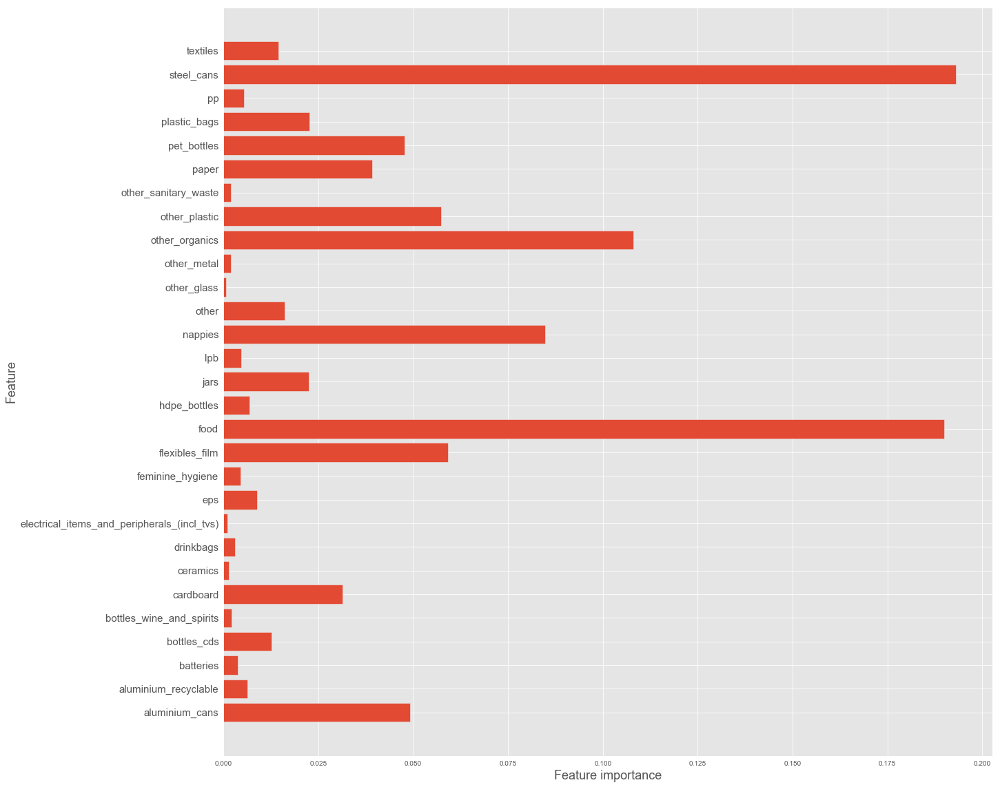


## XG Boost


```python
import xgboost as xgb

xgb_reg = xgb.XGBRegressor(random_state=42)
xgb_reg.fit(X_train_Scaled, y_train_Scaled)
```


    XGBRegressor(base_score=0.5, booster='gbtree', colsample_bylevel=1,
           colsample_bytree=1, gamma=0, learning_rate=0.1, max_delta_step=0,
           max_depth=3, min_child_weight=1, missing=None, n_estimators=100,
           n_jobs=1, nthread=None, objective='reg:linear', random_state=42,
           reg_alpha=0, reg_lambda=1, scale_pos_weight=1, seed=None,
           silent=True, subsample=1)


```python
xgb_reg.score(X_train_Scaled, y_train_Scaled)
```


    0.946750421284703


```python
xgb_reg.score(X_test_Scaled, y_test_Scaled)
```


    0.8374254521212664


```python
training_preds = scaler.inverse_transform(xgb_reg.predict(X_train_Scaled))
test_preds = scaler.inverse_transform(xgb_reg.predict(X_test_Scaled))
```


```python
print('Train RMSE:', np.sqrt(mean_squared_error(y_train, training_preds)))
print('Test RMSE:', np.sqrt(mean_squared_error(y_test, test_preds)))
```

    Train RMSE: 0.19701263136768798
    Test RMSE: 0.35584250603316425
    


```python
plot_feature_importances(xgb_reg)
```


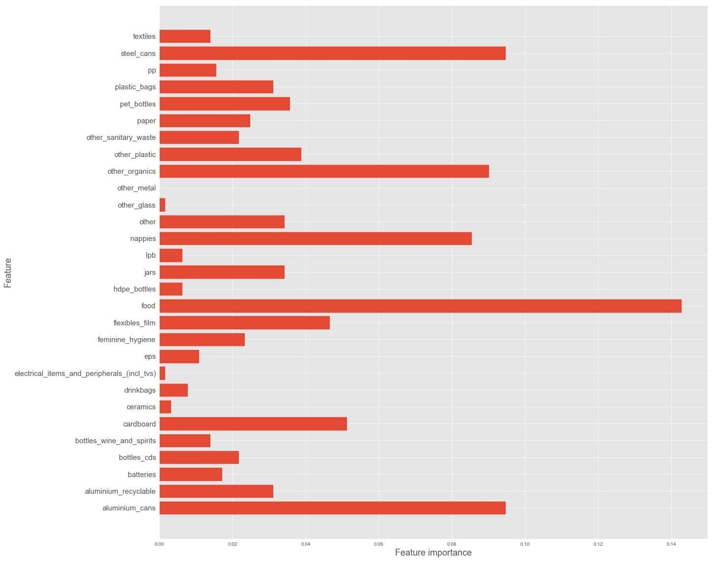


### GridSearch


```python
xgb_grid_model = xgb.XGBRegressor(random_state=42)

xgb_reg_grid_param = [{'max_depth': [5, 7, 10, 12],
               'learning_rate': [0.1, 0.2],
               'n_estimators': [100, 150, 200],
               'min_child_weight': [2, 3, 4],
               'max_delta_step': [0, 1]}]
```


```python
xgbclf_gridsearch = GridSearchCV(xgb_grid_model,
                                 xgb_reg_grid_param,
                                 scoring='neg_mean_squared_error')
xgbclf_gridsearch.fit(X_train_Scaled, y_train_Scaled)
```


    ---------------------------------------------------------------------------

    KeyboardInterrupt                         Traceback (most recent call last)

    <ipython-input-58-248e0944ff33> in <module>()
          2                                  xgb_reg_grid_param,
          3                                  scoring='neg_mean_squared_error')
    ----> 4 xgbclf_gridsearch.fit(X_train_Scaled, y_train_Scaled)
    

    ~\anaconda3\envs\learn-env\lib\site-packages\sklearn\model_selection\_search.py in fit(self, X, y, groups, **fit_params)
        720                 return results_container[0]
        721 
    --> 722             self._run_search(evaluate_candidates)
        723 
        724         results = results_container[0]
    

    ~\anaconda3\envs\learn-env\lib\site-packages\sklearn\model_selection\_search.py in _run_search(self, evaluate_candidates)
       1189     def _run_search(self, evaluate_candidates):
       1190         """Search all candidates in param_grid"""
    -> 1191         evaluate_candidates(ParameterGrid(self.param_grid))
       1192 
       1193 
    

    ~\anaconda3\envs\learn-env\lib\site-packages\sklearn\model_selection\_search.py in evaluate_candidates(candidate_params)
        709                                for parameters, (train, test)
        710                                in product(candidate_params,
    --> 711                                           cv.split(X, y, groups)))
        712 
        713                 all_candidate_params.extend(candidate_params)
    

    ~\anaconda3\envs\learn-env\lib\site-packages\sklearn\externals\joblib\parallel.py in __call__(self, iterable)
        918                 self._iterating = self._original_iterator is not None
        919 
    --> 920             while self.dispatch_one_batch(iterator):
        921                 pass
        922 
    

    ~\anaconda3\envs\learn-env\lib\site-packages\sklearn\externals\joblib\parallel.py in dispatch_one_batch(self, iterator)
        757                 return False
        758             else:
    --> 759                 self._dispatch(tasks)
        760                 return True
        761 
    

    ~\anaconda3\envs\learn-env\lib\site-packages\sklearn\externals\joblib\parallel.py in _dispatch(self, batch)
        714         with self._lock:
        715             job_idx = len(self._jobs)
    --> 716             job = self._backend.apply_async(batch, callback=cb)
        717             # A job can complete so quickly than its callback is
        718             # called before we get here, causing self._jobs to
    

    ~\anaconda3\envs\learn-env\lib\site-packages\sklearn\externals\joblib\_parallel_backends.py in apply_async(self, func, callback)
        180     def apply_async(self, func, callback=None):
        181         """Schedule a func to be run"""
    --> 182         result = ImmediateResult(func)
        183         if callback:
        184             callback(result)
    

    ~\anaconda3\envs\learn-env\lib\site-packages\sklearn\externals\joblib\_parallel_backends.py in __init__(self, batch)
        547         # Don't delay the application, to avoid keeping the input
        548         # arguments in memory
    --> 549         self.results = batch()
        550 
        551     def get(self):
    

    ~\anaconda3\envs\learn-env\lib\site-packages\sklearn\externals\joblib\parallel.py in __call__(self)
        223         with parallel_backend(self._backend, n_jobs=self._n_jobs):
        224             return [func(*args, **kwargs)
    --> 225                     for func, args, kwargs in self.items]
        226 
        227     def __len__(self):
    

    ~\anaconda3\envs\learn-env\lib\site-packages\sklearn\externals\joblib\parallel.py in <listcomp>(.0)
        223         with parallel_backend(self._backend, n_jobs=self._n_jobs):
        224             return [func(*args, **kwargs)
    --> 225                     for func, args, kwargs in self.items]
        226 
        227     def __len__(self):
    

    ~\anaconda3\envs\learn-env\lib\site-packages\sklearn\model_selection\_validation.py in _fit_and_score(estimator, X, y, scorer, train, test, verbose, parameters, fit_params, return_train_score, return_parameters, return_n_test_samples, return_times, return_estimator, error_score)
        526             estimator.fit(X_train, **fit_params)
        527         else:
    --> 528             estimator.fit(X_train, y_train, **fit_params)
        529 
        530     except Exception as e:
    

    ~\anaconda3\envs\learn-env\lib\site-packages\xgboost\sklearn.py in fit(self, X, y, sample_weight, eval_set, eval_metric, early_stopping_rounds, verbose, xgb_model, sample_weight_eval_set)
        300                               early_stopping_rounds=early_stopping_rounds,
        301                               evals_result=evals_result, obj=obj, feval=feval,
    --> 302                               verbose_eval=verbose, xgb_model=xgb_model)
        303 
        304         if evals_result:
    

    ~\anaconda3\envs\learn-env\lib\site-packages\xgboost\training.py in train(params, dtrain, num_boost_round, evals, obj, feval, maximize, early_stopping_rounds, evals_result, verbose_eval, xgb_model, callbacks, learning_rates)
        202                            evals=evals,
        203                            obj=obj, feval=feval,
    --> 204                            xgb_model=xgb_model, callbacks=callbacks)
        205 
        206 
    

    ~\anaconda3\envs\learn-env\lib\site-packages\xgboost\training.py in _train_internal(params, dtrain, num_boost_round, evals, obj, feval, xgb_model, callbacks)
         72         # Skip the first update if it is a recovery step.
         73         if version % 2 == 0:
    ---> 74             bst.update(dtrain, i, obj)
         75             bst.save_rabit_checkpoint()
         76             version += 1
    

    ~\anaconda3\envs\learn-env\lib\site-packages\xgboost\core.py in update(self, dtrain, iteration, fobj)
        892         if fobj is None:
        893             _check_call(_LIB.XGBoosterUpdateOneIter(self.handle, ctypes.c_int(iteration),
    --> 894                                                     dtrain.handle))
        895         else:
        896             pred = self.predict(dtrain)
    

    KeyboardInterrupt: 


```python
xgbclf_gridsearch.best_params_
```


```python
xgb_grid_model = xgb.XGBRegressor(learning_rate = 0.1,
                                  max_delta_step = 1,
                                  max_depth = 5,
                                  min_child_weight = 3,
                                  n_estimators = 200,
                                  random_state=42)
xgb_grid_model.fit(X_train_Scaled, y_train_Scaled)
```


    XGBRegressor(base_score=0.5, booster='gbtree', colsample_bylevel=1,
           colsample_bytree=1, gamma=0, learning_rate=0.1, max_delta_step=1,
           max_depth=5, min_child_weight=3, missing=None, n_estimators=200,
           n_jobs=1, nthread=None, objective='reg:linear', random_state=42,
           reg_alpha=0, reg_lambda=1, scale_pos_weight=1, seed=None,
           silent=True, subsample=1)


```python
xgb_grid_model.score(X_train_Scaled, y_train_Scaled)
```


    0.9981781497453177


```python
xgb_grid_model.score(X_test_Scaled, y_test_Scaled)
```


    0.8738270923835171


```python
training_preds = scaler.inverse_transform(xgb_grid_model.predict(X_train_Scaled))
test_preds = scaler.inverse_transform(xgb_grid_model.predict(X_test_Scaled))
```


```python
print('Train RMSE:', np.sqrt(mean_squared_error(y_train, training_preds)))
print('Test RMSE:', np.sqrt(mean_squared_error(y_test, test_preds)))
```

    Train RMSE: 0.03644116707933983
    Test RMSE: 0.3134834245996956
    


```python
plot_feature_importances(xgb_grid_model)
```


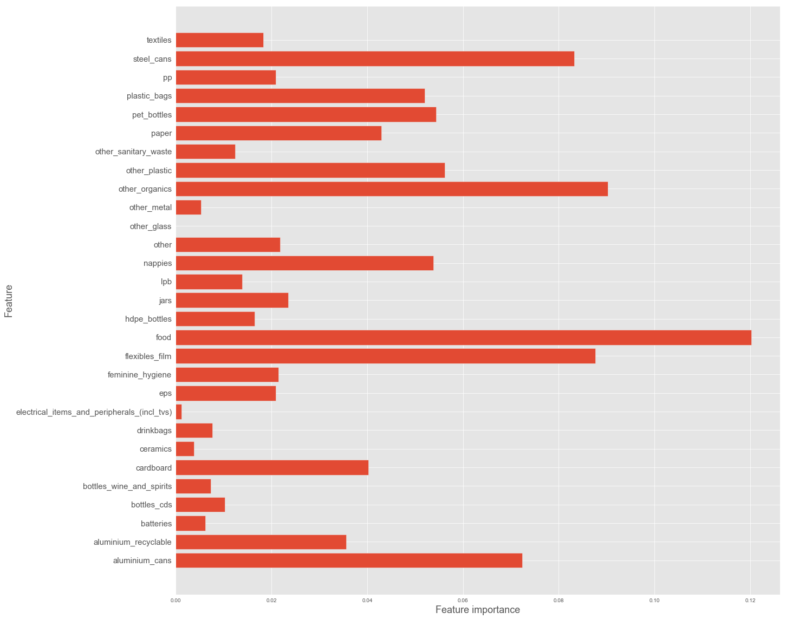


## MLP Regression Model


```python
from keras import layers, models, optimizers, regularizers
from keras import backend as K
from keras.models import Sequential
from tensorflow.keras.callbacks import TensorBoard
from keras.wrappers.scikit_learn import KerasRegressor
```


```python
n_features = X_train_Scaled.shape[1]
```

### Loss, MSE, & R^2 Visualization Function


```python
def coef_determination(y_true, y_pred):
    SS_res = K.sum(K.square(y_true-y_pred))
    SS_tot = K.sum(K.square(y_true - K.mean(y_true)))
    return (1 - SS_res/(SS_tot + K.epsilon()))
```


```python
#Build vizualization function for training/validation loss and accuracy
def visualize_loss_MSE(results):
    history = results.history
    
    plt.plot(history['loss'], 'b', label='Training Loss')
    plt.title('Training Loss')
    plt.xlabel('Epochs', fontsize=12)
    plt.ylabel('Loss', fontsize=12)
    plt.legend(loc='best')
    plt.show()
    
    plt.plot(history['mse'], 'b', label='Training MSE')
    plt.title('Training MSE')
    plt.xlabel('Epochs', fontsize=12)
    plt.ylabel('MSE', fontsize=12)
    plt.legend(loc='best')
    plt.show()
    
    plt.plot(history['coef_determination'], 'b', label='Training R^2')
    plt.title('Training R^2')
    plt.xlabel('Epochs', fontsize=12)
    plt.ylabel('R^2', fontsize=12)
    plt.legend(loc='best')
    plt.show()
```

### Baseline Model


```python
baseline_model = Sequential()

baseline_model.add(layers.Dense(10, activation='relu', input_shape=(n_features, )))

baseline_model.add(layers.Dense(5, activation='relu'))

baseline_model.add(layers.Dense(1, activation='linear'))

baseline_model.compile(optimizer='SGD',
              loss='mse',
              metrics=['mse', coef_determination])

```


```python
baseline_model.fit(X_train_Scaled,
                  y_train_Scaled,
                  epochs=150)
```

    Epoch 1/150
    14/14 [==============================] - 0s 846us/step - loss: 1.0629 - mse: 1.0629 - coef_determination: -0.1266
    Epoch 2/150
    14/14 [==============================] - 0s 712us/step - loss: 0.9207 - mse: 0.9207 - coef_determination: 0.0593
    Epoch 3/150
    14/14 [==============================] - 0s 712us/step - loss: 0.8346 - mse: 0.8346 - coef_determination: 0.1569
    Epoch 4/150
    14/14 [==============================] - 0s 641us/step - loss: 0.7755 - mse: 0.7755 - coef_determination: 0.1780
    Epoch 5/150
    14/14 [==============================] - 0s 712us/step - loss: 0.7304 - mse: 0.7304 - coef_determination: 0.2549
    Epoch 6/150
    14/14 [==============================] - 0s 784us/step - loss: 0.6918 - mse: 0.6918 - coef_determination: 0.2862
    Epoch 7/150
    14/14 [==============================] - 0s 641us/step - loss: 0.6611 - mse: 0.6611 - coef_determination: 0.3011
    Epoch 8/150
    14/14 [==============================] - 0s 784us/step - loss: 0.6308 - mse: 0.6308 - coef_determination: 0.3202
    Epoch 9/150
    14/14 [==============================] - 0s 784us/step - loss: 0.6084 - mse: 0.6084 - coef_determination: 0.3819
    Epoch 10/150
    14/14 [==============================] - 0s 711us/step - loss: 0.5836 - mse: 0.5836 - coef_determination: 0.3854
    Epoch 11/150
    14/14 [==============================] - 0s 712us/step - loss: 0.5621 - mse: 0.5621 - coef_determination: 0.3959
    Epoch 12/150
    14/14 [==============================] - 0s 570us/step - loss: 0.5412 - mse: 0.5412 - coef_determination: 0.3996
    Epoch 13/150
    14/14 [==============================] - 0s 570us/step - loss: 0.5214 - mse: 0.5214 - coef_determination: 0.4318
    Epoch 14/150
    14/14 [==============================] - 0s 710us/step - loss: 0.5046 - mse: 0.5046 - coef_determination: 0.4311
    Epoch 15/150
    14/14 [==============================] - 0s 783us/step - loss: 0.4863 - mse: 0.4863 - coef_determination: 0.4977
    Epoch 16/150
    14/14 [==============================] - 0s 572us/step - loss: 0.4704 - mse: 0.4704 - coef_determination: 0.5216
    Epoch 17/150
    14/14 [==============================] - 0s 712us/step - loss: 0.4537 - mse: 0.4537 - coef_determination: 0.5189
    Epoch 18/150
    14/14 [==============================] - 0s 712us/step - loss: 0.4366 - mse: 0.4366 - coef_determination: 0.5489
    Epoch 19/150
    14/14 [==============================] - 0s 644us/step - loss: 0.4213 - mse: 0.4213 - coef_determination: 0.5668
    Epoch 20/150
    14/14 [==============================] - 0s 641us/step - loss: 0.4061 - mse: 0.4061 - coef_determination: 0.5838
    Epoch 21/150
    14/14 [==============================] - 0s 641us/step - loss: 0.3896 - mse: 0.3896 - coef_determination: 0.6005
    Epoch 22/150
    14/14 [==============================] - 0s 641us/step - loss: 0.3760 - mse: 0.3760 - coef_determination: 0.6037
    Epoch 23/150
    14/14 [==============================] - 0s 712us/step - loss: 0.3641 - mse: 0.3641 - coef_determination: 0.6231
    Epoch 24/150
    14/14 [==============================] - 0s 570us/step - loss: 0.3506 - mse: 0.3506 - coef_determination: 0.6410
    Epoch 25/150
    14/14 [==============================] - 0s 641us/step - loss: 0.3396 - mse: 0.3396 - coef_determination: 0.6294
    Epoch 26/150
    14/14 [==============================] - ETA: 0s - loss: 0.3265 - mse: 0.3265 - coef_determination: 0.69 - 0s 499us/step - loss: 0.3293 - mse: 0.3293 - coef_determination: 0.6571
    Epoch 27/150
    14/14 [==============================] - 0s 570us/step - loss: 0.3180 - mse: 0.3180 - coef_determination: 0.6691
    Epoch 28/150
    14/14 [==============================] - 0s 641us/step - loss: 0.3097 - mse: 0.3097 - coef_determination: 0.6687
    Epoch 29/150
    14/14 [==============================] - 0s 568us/step - loss: 0.3008 - mse: 0.3008 - coef_determination: 0.6928
    Epoch 30/150
    14/14 [==============================] - 0s 641us/step - loss: 0.2948 - mse: 0.2948 - coef_determination: 0.6934
    Epoch 31/150
    14/14 [==============================] - 0s 639us/step - loss: 0.2876 - mse: 0.2876 - coef_determination: 0.7042
    Epoch 32/150
    14/14 [==============================] - 0s 639us/step - loss: 0.2806 - mse: 0.2806 - coef_determination: 0.7040
    Epoch 33/150
    14/14 [==============================] - 0s 642us/step - loss: 0.2739 - mse: 0.2739 - coef_determination: 0.7150
    Epoch 34/150
    14/14 [==============================] - 0s 641us/step - loss: 0.2682 - mse: 0.2682 - coef_determination: 0.7221
    Epoch 35/150
    14/14 [==============================] - 0s 644us/step - loss: 0.2626 - mse: 0.2626 - coef_determination: 0.7206
    Epoch 36/150
    14/14 [==============================] - 0s 641us/step - loss: 0.2577 - mse: 0.2577 - coef_determination: 0.7304
    Epoch 37/150
    14/14 [==============================] - 0s 712us/step - loss: 0.2515 - mse: 0.2515 - coef_determination: 0.7348
    Epoch 38/150
    14/14 [==============================] - 0s 712us/step - loss: 0.2462 - mse: 0.2462 - coef_determination: 0.7361
    Epoch 39/150
    14/14 [==============================] - 0s 641us/step - loss: 0.2412 - mse: 0.2412 - coef_determination: 0.7561
    Epoch 40/150
    14/14 [==============================] - 0s 641us/step - loss: 0.2378 - mse: 0.2378 - coef_determination: 0.7442
    Epoch 41/150
    14/14 [==============================] - 0s 641us/step - loss: 0.2334 - mse: 0.2334 - coef_determination: 0.7530
    Epoch 42/150
    14/14 [==============================] - 0s 712us/step - loss: 0.2301 - mse: 0.2301 - coef_determination: 0.7563
    Epoch 43/150
    14/14 [==============================] - 0s 571us/step - loss: 0.2260 - mse: 0.2260 - coef_determination: 0.7518
    Epoch 44/150
    14/14 [==============================] - 0s 641us/step - loss: 0.2223 - mse: 0.2223 - coef_determination: 0.7681
    Epoch 45/150
    14/14 [==============================] - 0s 641us/step - loss: 0.2190 - mse: 0.2190 - coef_determination: 0.7784
    Epoch 46/150
    14/14 [==============================] - 0s 641us/step - loss: 0.2159 - mse: 0.2159 - coef_determination: 0.7833
    Epoch 47/150
    14/14 [==============================] - 0s 641us/step - loss: 0.2130 - mse: 0.2130 - coef_determination: 0.7785
    Epoch 48/150
    14/14 [==============================] - 0s 644us/step - loss: 0.2083 - mse: 0.2083 - coef_determination: 0.7857
    Epoch 49/150
    14/14 [==============================] - 0s 570us/step - loss: 0.2072 - mse: 0.2072 - coef_determination: 0.7810
    Epoch 50/150
    14/14 [==============================] - 0s 567us/step - loss: 0.2038 - mse: 0.2038 - coef_determination: 0.7756
    Epoch 51/150
    14/14 [==============================] - 0s 570us/step - loss: 0.2019 - mse: 0.2019 - coef_determination: 0.7957
    Epoch 52/150
    14/14 [==============================] - 0s 712us/step - loss: 0.1990 - mse: 0.1990 - coef_determination: 0.7903
    Epoch 53/150
    14/14 [==============================] - 0s 641us/step - loss: 0.1953 - mse: 0.1953 - coef_determination: 0.7839
    Epoch 54/150
    14/14 [==============================] - 0s 566us/step - loss: 0.1932 - mse: 0.1932 - coef_determination: 0.7950
    Epoch 55/150
    14/14 [==============================] - 0s 709us/step - loss: 0.1903 - mse: 0.1903 - coef_determination: 0.7992
    Epoch 56/150
    14/14 [==============================] - 0s 641us/step - loss: 0.1880 - mse: 0.1880 - coef_determination: 0.7917
    Epoch 57/150
    14/14 [==============================] - ETA: 0s - loss: 0.1118 - mse: 0.1118 - coef_determination: 0.89 - 0s 784us/step - loss: 0.1852 - mse: 0.1852 - coef_determination: 0.8086
    Epoch 58/150
    14/14 [==============================] - 0s 641us/step - loss: 0.1830 - mse: 0.1830 - coef_determination: 0.8065
    Epoch 59/150
    14/14 [==============================] - 0s 641us/step - loss: 0.1819 - mse: 0.1819 - coef_determination: 0.8110
    Epoch 60/150
    14/14 [==============================] - 0s 644us/step - loss: 0.1784 - mse: 0.1784 - coef_determination: 0.8209
    Epoch 61/150
    14/14 [==============================] - 0s 709us/step - loss: 0.1771 - mse: 0.1771 - coef_determination: 0.8148
    Epoch 62/150
    14/14 [==============================] - 0s 641us/step - loss: 0.1747 - mse: 0.1747 - coef_determination: 0.8208
    Epoch 63/150
    14/14 [==============================] - 0s 637us/step - loss: 0.1715 - mse: 0.1715 - coef_determination: 0.8215
    Epoch 64/150
    14/14 [==============================] - 0s 712us/step - loss: 0.1704 - mse: 0.1704 - coef_determination: 0.8238
    Epoch 65/150
    14/14 [==============================] - 0s 712us/step - loss: 0.1684 - mse: 0.1684 - coef_determination: 0.8277
    Epoch 66/150
    14/14 [==============================] - 0s 644us/step - loss: 0.1666 - mse: 0.1666 - coef_determination: 0.8267
    Epoch 67/150
    14/14 [==============================] - 0s 712us/step - loss: 0.1660 - mse: 0.1660 - coef_determination: 0.8171
    Epoch 68/150
    14/14 [==============================] - 0s 712us/step - loss: 0.1634 - mse: 0.1634 - coef_determination: 0.8336
    Epoch 69/150
    14/14 [==============================] - 0s 712us/step - loss: 0.1610 - mse: 0.1610 - coef_determination: 0.8322
    Epoch 70/150
    14/14 [==============================] - 0s 641us/step - loss: 0.1596 - mse: 0.1596 - coef_determination: 0.8330
    Epoch 71/150
    14/14 [==============================] - 0s 641us/step - loss: 0.1575 - mse: 0.1575 - coef_determination: 0.8384
    Epoch 72/150
    14/14 [==============================] - 0s 713us/step - loss: 0.1580 - mse: 0.1580 - coef_determination: 0.8385
    Epoch 73/150
    14/14 [==============================] - ETA: 0s - loss: 0.2691 - mse: 0.2691 - coef_determination: 0.67 - 0s 709us/step - loss: 0.1546 - mse: 0.1546 - coef_determination: 0.8383
    Epoch 74/150
    14/14 [==============================] - 0s 712us/step - loss: 0.1528 - mse: 0.1528 - coef_determination: 0.8324
    Epoch 75/150
    14/14 [==============================] - 0s 644us/step - loss: 0.1516 - mse: 0.1516 - coef_determination: 0.8484
    Epoch 76/150
    14/14 [==============================] - 0s 714us/step - loss: 0.1507 - mse: 0.1507 - coef_determination: 0.8421
    Epoch 77/150
    14/14 [==============================] - 0s 637us/step - loss: 0.1484 - mse: 0.1484 - coef_determination: 0.8429
    Epoch 78/150
    14/14 [==============================] - 0s 640us/step - loss: 0.1468 - mse: 0.1468 - coef_determination: 0.8436
    Epoch 79/150
    14/14 [==============================] - 0s 642us/step - loss: 0.1456 - mse: 0.1456 - coef_determination: 0.8498
    Epoch 80/150
    14/14 [==============================] - 0s 709us/step - loss: 0.1444 - mse: 0.1444 - coef_determination: 0.8468
    Epoch 81/150
    14/14 [==============================] - 0s 644us/step - loss: 0.1430 - mse: 0.1430 - coef_determination: 0.8523
    Epoch 82/150
    14/14 [==============================] - 0s 570us/step - loss: 0.1420 - mse: 0.1420 - coef_determination: 0.8486
    Epoch 83/150
    14/14 [==============================] - 0s 638us/step - loss: 0.1408 - mse: 0.1408 - coef_determination: 0.8437
    Epoch 84/150
    14/14 [==============================] - 0s 712us/step - loss: 0.1401 - mse: 0.1401 - coef_determination: 0.8531
    Epoch 85/150
    14/14 [==============================] - 0s 855us/step - loss: 0.1378 - mse: 0.1378 - coef_determination: 0.8564
    Epoch 86/150
    14/14 [==============================] - 0s 926us/step - loss: 0.1370 - mse: 0.1370 - coef_determination: 0.8574
    Epoch 87/150
    14/14 [==============================] - 0s 712us/step - loss: 0.1349 - mse: 0.1349 - coef_determination: 0.8621
    Epoch 88/150
    14/14 [==============================] - 0s 784us/step - loss: 0.1343 - mse: 0.1343 - coef_determination: 0.8440
    Epoch 89/150
    14/14 [==============================] - 0s 712us/step - loss: 0.1329 - mse: 0.1329 - coef_determination: 0.8555
    Epoch 90/150
    14/14 [==============================] - 0s 712us/step - loss: 0.1320 - mse: 0.1320 - coef_determination: 0.8561
    Epoch 91/150
    14/14 [==============================] - 0s 712us/step - loss: 0.1303 - mse: 0.1303 - coef_determination: 0.8687
    Epoch 92/150
    14/14 [==============================] - 0s 888us/step - loss: 0.1302 - mse: 0.1302 - coef_determination: 0.8610
    Epoch 93/150
    14/14 [==============================] - 0s 855us/step - loss: 0.1279 - mse: 0.1279 - coef_determination: 0.8656
    Epoch 94/150
    14/14 [==============================] - 0s 710us/step - loss: 0.1274 - mse: 0.1274 - coef_determination: 0.8637
    Epoch 95/150
    14/14 [==============================] - 0s 639us/step - loss: 0.1270 - mse: 0.1270 - coef_determination: 0.8662
    Epoch 96/150
    14/14 [==============================] - 0s 645us/step - loss: 0.1254 - mse: 0.1254 - coef_determination: 0.8641
    Epoch 97/150
    14/14 [==============================] - 0s 710us/step - loss: 0.1249 - mse: 0.1249 - coef_determination: 0.8716
    Epoch 98/150
    14/14 [==============================] - 0s 641us/step - loss: 0.1224 - mse: 0.1224 - coef_determination: 0.8694
    Epoch 99/150
    14/14 [==============================] - 0s 712us/step - loss: 0.1226 - mse: 0.1226 - coef_determination: 0.8745
    Epoch 100/150
    14/14 [==============================] - 0s 715us/step - loss: 0.1218 - mse: 0.1218 - coef_determination: 0.8572
    Epoch 101/150
    14/14 [==============================] - 0s 710us/step - loss: 0.1200 - mse: 0.1200 - coef_determination: 0.8696
    Epoch 102/150
    14/14 [==============================] - 0s 710us/step - loss: 0.1195 - mse: 0.1195 - coef_determination: 0.8707
    Epoch 103/150
    14/14 [==============================] - 0s 784us/step - loss: 0.1193 - mse: 0.1193 - coef_determination: 0.8760
    Epoch 104/150
    14/14 [==============================] - 0s 712us/step - loss: 0.1181 - mse: 0.1181 - coef_determination: 0.8761
    Epoch 105/150
    14/14 [==============================] - 0s 712us/step - loss: 0.1175 - mse: 0.1175 - coef_determination: 0.8785
    Epoch 106/150
    14/14 [==============================] - 0s 570us/step - loss: 0.1163 - mse: 0.1163 - coef_determination: 0.8702
    Epoch 107/150
    14/14 [==============================] - 0s 499us/step - loss: 0.1158 - mse: 0.1158 - coef_determination: 0.8775
    Epoch 108/150
    14/14 [==============================] - 0s 570us/step - loss: 0.1147 - mse: 0.1147 - coef_determination: 0.8606
    Epoch 109/150
    14/14 [==============================] - 0s 570us/step - loss: 0.1140 - mse: 0.1140 - coef_determination: 0.8813
    Epoch 110/150
    14/14 [==============================] - 0s 641us/step - loss: 0.1135 - mse: 0.1135 - coef_determination: 0.8757
    Epoch 111/150
    14/14 [==============================] - 0s 712us/step - loss: 0.1124 - mse: 0.1124 - coef_determination: 0.8725
    Epoch 112/150
    14/14 [==============================] - 0s 641us/step - loss: 0.1121 - mse: 0.1121 - coef_determination: 0.8825
    Epoch 113/150
    14/14 [==============================] - 0s 570us/step - loss: 0.1106 - mse: 0.1106 - coef_determination: 0.8830
    Epoch 114/150
    14/14 [==============================] - 0s 570us/step - loss: 0.1110 - mse: 0.1110 - coef_determination: 0.8896
    Epoch 115/150
    14/14 [==============================] - 0s 641us/step - loss: 0.1100 - mse: 0.1100 - coef_determination: 0.8792
    Epoch 116/150
    14/14 [==============================] - 0s 641us/step - loss: 0.1091 - mse: 0.1091 - coef_determination: 0.8811
    Epoch 117/150
    14/14 [==============================] - 0s 641us/step - loss: 0.1094 - mse: 0.1094 - coef_determination: 0.8888
    Epoch 118/150
    14/14 [==============================] - 0s 641us/step - loss: 0.1082 - mse: 0.1082 - coef_determination: 0.8862
    Epoch 119/150
    14/14 [==============================] - 0s 712us/step - loss: 0.1079 - mse: 0.1079 - coef_determination: 0.8895
    Epoch 120/150
    14/14 [==============================] - 0s 641us/step - loss: 0.1072 - mse: 0.1072 - coef_determination: 0.8826
    Epoch 121/150
    14/14 [==============================] - 0s 641us/step - loss: 0.1072 - mse: 0.1072 - coef_determination: 0.8921
    Epoch 122/150
    14/14 [==============================] - 0s 573us/step - loss: 0.1061 - mse: 0.1061 - coef_determination: 0.8895
    Epoch 123/150
    14/14 [==============================] - 0s 641us/step - loss: 0.1063 - mse: 0.1063 - coef_determination: 0.8911
    Epoch 124/150
    14/14 [==============================] - 0s 639us/step - loss: 0.1056 - mse: 0.1056 - coef_determination: 0.8894
    Epoch 125/150
    14/14 [==============================] - 0s 641us/step - loss: 0.1042 - mse: 0.1042 - coef_determination: 0.8881
    Epoch 126/150
    14/14 [==============================] - 0s 639us/step - loss: 0.1037 - mse: 0.1037 - coef_determination: 0.8940
    Epoch 127/150
    14/14 [==============================] - 0s 570us/step - loss: 0.1039 - mse: 0.1039 - coef_determination: 0.8911
    Epoch 128/150
    14/14 [==============================] - 0s 639us/step - loss: 0.1026 - mse: 0.1026 - coef_determination: 0.8964
    Epoch 129/150
    14/14 [==============================] - 0s 641us/step - loss: 0.1030 - mse: 0.1030 - coef_determination: 0.8785
    Epoch 130/150
    14/14 [==============================] - 0s 644us/step - loss: 0.1028 - mse: 0.1028 - coef_determination: 0.8911
    Epoch 131/150
    14/14 [==============================] - 0s 639us/step - loss: 0.1024 - mse: 0.1024 - coef_determination: 0.8931
    Epoch 132/150
    14/14 [==============================] - 0s 637us/step - loss: 0.1016 - mse: 0.1016 - coef_determination: 0.8852
    Epoch 133/150
    14/14 [==============================] - 0s 638us/step - loss: 0.1014 - mse: 0.1014 - coef_determination: 0.8931
    Epoch 134/150
    14/14 [==============================] - 0s 641us/step - loss: 0.1006 - mse: 0.1006 - coef_determination: 0.8953
    Epoch 135/150
    14/14 [==============================] - 0s 641us/step - loss: 0.1019 - mse: 0.1019 - coef_determination: 0.8943
    Epoch 136/150
    14/14 [==============================] - 0s 641us/step - loss: 0.1001 - mse: 0.1001 - coef_determination: 0.8959
    Epoch 137/150
    14/14 [==============================] - 0s 641us/step - loss: 0.0999 - mse: 0.0999 - coef_determination: 0.8925
    Epoch 138/150
    14/14 [==============================] - 0s 641us/step - loss: 0.0993 - mse: 0.0993 - coef_determination: 0.8962
    Epoch 139/150
    14/14 [==============================] - 0s 641us/step - loss: 0.0983 - mse: 0.0983 - coef_determination: 0.8999
    Epoch 140/150
    14/14 [==============================] - 0s 641us/step - loss: 0.0984 - mse: 0.0984 - coef_determination: 0.9009
    Epoch 141/150
    14/14 [==============================] - 0s 641us/step - loss: 0.0979 - mse: 0.0979 - coef_determination: 0.9008
    Epoch 142/150
    14/14 [==============================] - 0s 641us/step - loss: 0.0978 - mse: 0.0978 - coef_determination: 0.8967
    Epoch 143/150
    14/14 [==============================] - 0s 711us/step - loss: 0.0972 - mse: 0.0972 - coef_determination: 0.9065
    Epoch 144/150
    14/14 [==============================] - 0s 711us/step - loss: 0.0967 - mse: 0.0967 - coef_determination: 0.9020
    Epoch 145/150
    14/14 [==============================] - 0s 639us/step - loss: 0.0966 - mse: 0.0966 - coef_determination: 0.8974
    Epoch 146/150
    14/14 [==============================] - 0s 570us/step - loss: 0.0961 - mse: 0.0961 - coef_determination: 0.9009
    Epoch 147/150
    14/14 [==============================] - 0s 643us/step - loss: 0.0955 - mse: 0.0955 - coef_determination: 0.9018
    Epoch 148/150
    14/14 [==============================] - 0s 638us/step - loss: 0.0953 - mse: 0.0953 - coef_determination: 0.8926
    Epoch 149/150
    14/14 [==============================] - 0s 641us/step - loss: 0.0949 - mse: 0.0949 - coef_determination: 0.9008
    Epoch 150/150
    14/14 [==============================] - 0s 641us/step - loss: 0.0944 - mse: 0.0944 - coef_determination: 0.8974
    


    <tensorflow.python.keras.callbacks.History at 0x131fb039be0>


```python
visualize_loss_MSE(baseline_model.history)
```


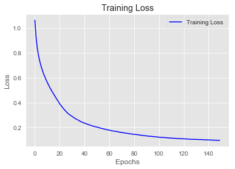


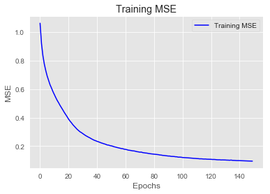


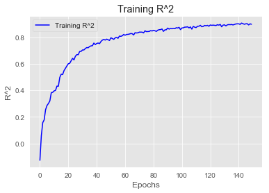


```python
baseline_preds_scaled = baseline_model.predict(X_test_Scaled)
baseline_preds = scaler.inverse_transform(baseline_preds_scaled)
rmse = np.sqrt(mean_squared_error(y_test, baseline_preds))

print('RMSE:', rmse)
print('-------------------------')
print(baseline_model.summary())
```

    RMSE: 0.39000057590681964
    -------------------------
    Model: "sequential"
    _________________________________________________________________
    Layer (type)                 Output Shape              Param #   
    =================================================================
    dense (Dense)                (None, 10)                300       
    _________________________________________________________________
    dense_1 (Dense)              (None, 5)                 55        
    _________________________________________________________________
    dense_2 (Dense)              (None, 1)                 6         
    =================================================================
    Total params: 361
    Trainable params: 361
    Non-trainable params: 0
    _________________________________________________________________
    None
    

### Overfit Model


```python
overfit_model = Sequential()

overfit_model.add(layers.Dense(10, activation='relu', input_shape=(n_features, )))

overfit_model.add(layers.Dense(10, activation='relu'))

overfit_model.add(layers.Dense(10, activation='relu'))

overfit_model.add(layers.Dense(10, activation='relu'))

overfit_model.add(layers.Dense(1, activation='linear'))

overfit_model.compile(optimizer='SGD',
              loss='mse',
              metrics=['mse', coef_determination])

```


```python
overfit_model.fit(X_train_Scaled,
                  y_train_Scaled,
                  epochs=150)
```

    Epoch 1/150
    14/14 [==============================] - 0s 781us/step - loss: 0.9437 - mse: 0.9437 - coef_determination: 0.0340
    Epoch 2/150
    14/14 [==============================] - 0s 639us/step - loss: 0.8456 - mse: 0.8456 - coef_determination: 0.1332
    Epoch 3/150
    14/14 [==============================] - 0s 710us/step - loss: 0.8159 - mse: 0.8159 - coef_determination: 0.0940
    Epoch 4/150
    14/14 [==============================] - 0s 644us/step - loss: 0.7782 - mse: 0.7782 - coef_determination: 0.2053
    Epoch 5/150
    14/14 [==============================] - 0s 712us/step - loss: 0.7485 - mse: 0.7485 - coef_determination: 0.2226
    Epoch 6/150
    14/14 [==============================] - 0s 712us/step - loss: 0.7178 - mse: 0.7178 - coef_determination: 0.2406
    Epoch 7/150
    14/14 [==============================] - 0s 639us/step - loss: 0.6894 - mse: 0.6894 - coef_determination: 0.2888
    Epoch 8/150
    14/14 [==============================] - 0s 712us/step - loss: 0.6590 - mse: 0.6590 - coef_determination: 0.3245
    Epoch 9/150
    14/14 [==============================] - 0s 710us/step - loss: 0.6287 - mse: 0.6287 - coef_determination: 0.3566
    Epoch 10/150
    14/14 [==============================] - 0s 784us/step - loss: 0.5993 - mse: 0.5993 - coef_determination: 0.3651
    Epoch 11/150
    14/14 [==============================] - 0s 784us/step - loss: 0.5736 - mse: 0.5736 - coef_determination: 0.4131
    Epoch 12/150
    14/14 [==============================] - 0s 781us/step - loss: 0.5467 - mse: 0.5467 - coef_determination: 0.4209
    Epoch 13/150
    14/14 [==============================] - 0s 784us/step - loss: 0.5228 - mse: 0.5228 - coef_determination: 0.4713
    Epoch 14/150
    14/14 [==============================] - 0s 782us/step - loss: 0.4974 - mse: 0.4974 - coef_determination: 0.5016
    Epoch 15/150
    14/14 [==============================] - 0s 783us/step - loss: 0.4750 - mse: 0.4750 - coef_determination: 0.5088
    Epoch 16/150
    14/14 [==============================] - 0s 780us/step - loss: 0.4508 - mse: 0.4508 - coef_determination: 0.5357
    Epoch 17/150
    14/14 [==============================] - 0s 712us/step - loss: 0.4296 - mse: 0.4296 - coef_determination: 0.5387
    Epoch 18/150
    14/14 [==============================] - 0s 712us/step - loss: 0.4093 - mse: 0.4093 - coef_determination: 0.5733
    Epoch 19/150
    14/14 [==============================] - 0s 641us/step - loss: 0.3891 - mse: 0.3891 - coef_determination: 0.5950
    Epoch 20/150
    14/14 [==============================] - 0s 784us/step - loss: 0.3668 - mse: 0.3668 - coef_determination: 0.6152
    Epoch 21/150
    14/14 [==============================] - 0s 712us/step - loss: 0.3551 - mse: 0.3551 - coef_determination: 0.6327
    Epoch 22/150
    14/14 [==============================] - 0s 641us/step - loss: 0.3370 - mse: 0.3370 - coef_determination: 0.6577
    Epoch 23/150
    14/14 [==============================] - 0s 712us/step - loss: 0.3238 - mse: 0.3238 - coef_determination: 0.6572
    Epoch 24/150
    14/14 [==============================] - 0s 712us/step - loss: 0.3121 - mse: 0.3121 - coef_determination: 0.6820
    Epoch 25/150
    14/14 [==============================] - 0s 784us/step - loss: 0.3015 - mse: 0.3015 - coef_determination: 0.6913
    Epoch 26/150
    14/14 [==============================] - 0s 715us/step - loss: 0.2893 - mse: 0.2893 - coef_determination: 0.7011
    Epoch 27/150
    14/14 [==============================] - 0s 784us/step - loss: 0.2796 - mse: 0.2796 - coef_determination: 0.6966
    Epoch 28/150
    14/14 [==============================] - 0s 787us/step - loss: 0.2713 - mse: 0.2713 - coef_determination: 0.7285
    Epoch 29/150
    14/14 [==============================] - 0s 712us/step - loss: 0.2633 - mse: 0.2633 - coef_determination: 0.7302
    Epoch 30/150
    14/14 [==============================] - 0s 855us/step - loss: 0.2573 - mse: 0.2573 - coef_determination: 0.7386
    Epoch 31/150
    14/14 [==============================] - 0s 855us/step - loss: 0.2514 - mse: 0.2514 - coef_determination: 0.7372
    Epoch 32/150
    14/14 [==============================] - 0s 785us/step - loss: 0.2492 - mse: 0.2492 - coef_determination: 0.7260
    Epoch 33/150
    14/14 [==============================] - 0s 712us/step - loss: 0.2410 - mse: 0.2410 - coef_determination: 0.7472
    Epoch 34/150
    14/14 [==============================] - 0s 784us/step - loss: 0.2377 - mse: 0.2377 - coef_determination: 0.7414
    Epoch 35/150
    14/14 [==============================] - 0s 1ms/step - loss: 0.2294 - mse: 0.2294 - coef_determination: 0.7654
    Epoch 36/150
    14/14 [==============================] - 0s 855us/step - loss: 0.2270 - mse: 0.2270 - coef_determination: 0.7683
    Epoch 37/150
    14/14 [==============================] - 0s 784us/step - loss: 0.2235 - mse: 0.2235 - coef_determination: 0.7638
    Epoch 38/150
    14/14 [==============================] - 0s 926us/step - loss: 0.2205 - mse: 0.2205 - coef_determination: 0.7719
    Epoch 39/150
    14/14 [==============================] - 0s 712us/step - loss: 0.2152 - mse: 0.2152 - coef_determination: 0.7751
    Epoch 40/150
    14/14 [==============================] - 0s 641us/step - loss: 0.2135 - mse: 0.2135 - coef_determination: 0.7829
    Epoch 41/150
    14/14 [==============================] - 0s 784us/step - loss: 0.2083 - mse: 0.2083 - coef_determination: 0.7840
    Epoch 42/150
    14/14 [==============================] - 0s 712us/step - loss: 0.2062 - mse: 0.2062 - coef_determination: 0.7685
    Epoch 43/150
    14/14 [==============================] - 0s 716us/step - loss: 0.2009 - mse: 0.2009 - coef_determination: 0.7816
    Epoch 44/150
    14/14 [==============================] - 0s 855us/step - loss: 0.1976 - mse: 0.1976 - coef_determination: 0.8024
    Epoch 45/150
    14/14 [==============================] - 0s 712us/step - loss: 0.1943 - mse: 0.1943 - coef_determination: 0.7876
    Epoch 46/150
    14/14 [==============================] - 0s 784us/step - loss: 0.1914 - mse: 0.1914 - coef_determination: 0.7946
    Epoch 47/150
    14/14 [==============================] - 0s 712us/step - loss: 0.1890 - mse: 0.1890 - coef_determination: 0.8052
    Epoch 48/150
    14/14 [==============================] - 0s 710us/step - loss: 0.1859 - mse: 0.1859 - coef_determination: 0.7980
    Epoch 49/150
    14/14 [==============================] - 0s 712us/step - loss: 0.1851 - mse: 0.1851 - coef_determination: 0.8034
    Epoch 50/150
    14/14 [==============================] - 0s 641us/step - loss: 0.1819 - mse: 0.1819 - coef_determination: 0.8079
    Epoch 51/150
    14/14 [==============================] - 0s 784us/step - loss: 0.1787 - mse: 0.1787 - coef_determination: 0.8143
    Epoch 52/150
    14/14 [==============================] - 0s 783us/step - loss: 0.1763 - mse: 0.1763 - coef_determination: 0.8186
    Epoch 53/150
    14/14 [==============================] - 0s 781us/step - loss: 0.1761 - mse: 0.1761 - coef_determination: 0.8157
    Epoch 54/150
    14/14 [==============================] - 0s 781us/step - loss: 0.1728 - mse: 0.1728 - coef_determination: 0.8199
    Epoch 55/150
    14/14 [==============================] - 0s 781us/step - loss: 0.1717 - mse: 0.1717 - coef_determination: 0.8179
    Epoch 56/150
    14/14 [==============================] - 0s 786us/step - loss: 0.1701 - mse: 0.1701 - coef_determination: 0.8242
    Epoch 57/150
    14/14 [==============================] - 0s 713us/step - loss: 0.1678 - mse: 0.1678 - coef_determination: 0.8154
    Epoch 58/150
    14/14 [==============================] - 0s 786us/step - loss: 0.1656 - mse: 0.1656 - coef_determination: 0.8301
    Epoch 59/150
    14/14 [==============================] - 0s 713us/step - loss: 0.1651 - mse: 0.1651 - coef_determination: 0.8270
    Epoch 60/150
    14/14 [==============================] - 0s 712us/step - loss: 0.1629 - mse: 0.1629 - coef_determination: 0.8309
    Epoch 61/150
    14/14 [==============================] - 0s 641us/step - loss: 0.1631 - mse: 0.1631 - coef_determination: 0.8273
    Epoch 62/150
    14/14 [==============================] - 0s 712us/step - loss: 0.1612 - mse: 0.1612 - coef_determination: 0.8317
    Epoch 63/150
    14/14 [==============================] - 0s 712us/step - loss: 0.1590 - mse: 0.1590 - coef_determination: 0.8343
    Epoch 64/150
    14/14 [==============================] - 0s 712us/step - loss: 0.1571 - mse: 0.1571 - coef_determination: 0.8342
    Epoch 65/150
    14/14 [==============================] - 0s 712us/step - loss: 0.1568 - mse: 0.1568 - coef_determination: 0.8380
    Epoch 66/150
    14/14 [==============================] - 0s 712us/step - loss: 0.1548 - mse: 0.1548 - coef_determination: 0.8423
    Epoch 67/150
    14/14 [==============================] - 0s 712us/step - loss: 0.1543 - mse: 0.1543 - coef_determination: 0.8368
    Epoch 68/150
    14/14 [==============================] - 0s 713us/step - loss: 0.1522 - mse: 0.1522 - coef_determination: 0.8325
    Epoch 69/150
    14/14 [==============================] - 0s 683us/step - loss: 0.1512 - mse: 0.1512 - coef_determination: 0.8383
    Epoch 70/150
    14/14 [==============================] - 0s 712us/step - loss: 0.1506 - mse: 0.1506 - coef_determination: 0.8478
    Epoch 71/150
    14/14 [==============================] - 0s 784us/step - loss: 0.1489 - mse: 0.1489 - coef_determination: 0.8276
    Epoch 72/150
    14/14 [==============================] - 0s 784us/step - loss: 0.1475 - mse: 0.1475 - coef_determination: 0.8453
    Epoch 73/150
    14/14 [==============================] - 0s 712us/step - loss: 0.1457 - mse: 0.1457 - coef_determination: 0.8386
    Epoch 74/150
    14/14 [==============================] - 0s 712us/step - loss: 0.1454 - mse: 0.1454 - coef_determination: 0.8475
    Epoch 75/150
    14/14 [==============================] - 0s 784us/step - loss: 0.1435 - mse: 0.1435 - coef_determination: 0.8475
    Epoch 76/150
    14/14 [==============================] - 0s 712us/step - loss: 0.1443 - mse: 0.1443 - coef_determination: 0.8500
    Epoch 77/150
    14/14 [==============================] - 0s 712us/step - loss: 0.1425 - mse: 0.1425 - coef_determination: 0.8527
    Epoch 78/150
    14/14 [==============================] - 0s 784us/step - loss: 0.1412 - mse: 0.1412 - coef_determination: 0.8582
    Epoch 79/150
    14/14 [==============================] - 0s 712us/step - loss: 0.1414 - mse: 0.1414 - coef_determination: 0.8466
    Epoch 80/150
    14/14 [==============================] - 0s 712us/step - loss: 0.1387 - mse: 0.1387 - coef_determination: 0.8553
    Epoch 81/150
    14/14 [==============================] - 0s 784us/step - loss: 0.1404 - mse: 0.1404 - coef_determination: 0.8547
    Epoch 82/150
    14/14 [==============================] - 0s 786us/step - loss: 0.1382 - mse: 0.1382 - coef_determination: 0.8530
    Epoch 83/150
    14/14 [==============================] - 0s 784us/step - loss: 0.1373 - mse: 0.1373 - coef_determination: 0.8590
    Epoch 84/150
    14/14 [==============================] - 0s 784us/step - loss: 0.1369 - mse: 0.1369 - coef_determination: 0.8613
    Epoch 85/150
    14/14 [==============================] - 0s 784us/step - loss: 0.1359 - mse: 0.1359 - coef_determination: 0.8598
    Epoch 86/150
    14/14 [==============================] - 0s 784us/step - loss: 0.1347 - mse: 0.1347 - coef_determination: 0.8593
    Epoch 87/150
    14/14 [==============================] - 0s 712us/step - loss: 0.1343 - mse: 0.1343 - coef_determination: 0.8556
    Epoch 88/150
    14/14 [==============================] - 0s 712us/step - loss: 0.1335 - mse: 0.1335 - coef_determination: 0.8601
    Epoch 89/150
    14/14 [==============================] - 0s 784us/step - loss: 0.1325 - mse: 0.1325 - coef_determination: 0.8491
    Epoch 90/150
    14/14 [==============================] - 0s 855us/step - loss: 0.1313 - mse: 0.1313 - coef_determination: 0.8700
    Epoch 91/150
    14/14 [==============================] - 0s 713us/step - loss: 0.1314 - mse: 0.1314 - coef_determination: 0.8622
    Epoch 92/150
    14/14 [==============================] - 0s 712us/step - loss: 0.1298 - mse: 0.1298 - coef_determination: 0.8644
    Epoch 93/150
    14/14 [==============================] - 0s 712us/step - loss: 0.1289 - mse: 0.1289 - coef_determination: 0.8597
    Epoch 94/150
    14/14 [==============================] - 0s 784us/step - loss: 0.1283 - mse: 0.1283 - coef_determination: 0.8694
    Epoch 95/150
    14/14 [==============================] - 0s 855us/step - loss: 0.1274 - mse: 0.1274 - coef_determination: 0.8592
    Epoch 96/150
    14/14 [==============================] - ETA: 0s - loss: 0.1452 - mse: 0.1452 - coef_determination: 0.83 - 0s 712us/step - loss: 0.1263 - mse: 0.1263 - coef_determination: 0.8618
    Epoch 97/150
    14/14 [==============================] - 0s 784us/step - loss: 0.1257 - mse: 0.1257 - coef_determination: 0.8682
    Epoch 98/150
    14/14 [==============================] - 0s 712us/step - loss: 0.1247 - mse: 0.1247 - coef_determination: 0.8726
    Epoch 99/150
    14/14 [==============================] - 0s 712us/step - loss: 0.1249 - mse: 0.1249 - coef_determination: 0.8680
    Epoch 100/150
    14/14 [==============================] - 0s 784us/step - loss: 0.1253 - mse: 0.1253 - coef_determination: 0.8727
    Epoch 101/150
    14/14 [==============================] - 0s 712us/step - loss: 0.1231 - mse: 0.1231 - coef_determination: 0.8732
    Epoch 102/150
    14/14 [==============================] - 0s 784us/step - loss: 0.1222 - mse: 0.1222 - coef_determination: 0.8732
    Epoch 103/150
    14/14 [==============================] - 0s 712us/step - loss: 0.1224 - mse: 0.1224 - coef_determination: 0.8638
    Epoch 104/150
    14/14 [==============================] - 0s 712us/step - loss: 0.1205 - mse: 0.1205 - coef_determination: 0.8712
    Epoch 105/150
    14/14 [==============================] - 0s 712us/step - loss: 0.1207 - mse: 0.1207 - coef_determination: 0.8801
    Epoch 106/150
    14/14 [==============================] - 0s 923us/step - loss: 0.1212 - mse: 0.1212 - coef_determination: 0.8609
    Epoch 107/150
    14/14 [==============================] - 0s 712us/step - loss: 0.1208 - mse: 0.1208 - coef_determination: 0.8785
    Epoch 108/150
    14/14 [==============================] - 0s 784us/step - loss: 0.1192 - mse: 0.1192 - coef_determination: 0.8773
    Epoch 109/150
    14/14 [==============================] - 0s 713us/step - loss: 0.1185 - mse: 0.1185 - coef_determination: 0.8769
    Epoch 110/150
    14/14 [==============================] - 0s 712us/step - loss: 0.1178 - mse: 0.1178 - coef_determination: 0.8736
    Epoch 111/150
    14/14 [==============================] - 0s 712us/step - loss: 0.1166 - mse: 0.1166 - coef_determination: 0.8778
    Epoch 112/150
    14/14 [==============================] - 0s 784us/step - loss: 0.1180 - mse: 0.1180 - coef_determination: 0.8763
    Epoch 113/150
    14/14 [==============================] - 0s 780us/step - loss: 0.1156 - mse: 0.1156 - coef_determination: 0.8797
    Epoch 114/150
    14/14 [==============================] - 0s 712us/step - loss: 0.1145 - mse: 0.1145 - coef_determination: 0.8782
    Epoch 115/150
    14/14 [==============================] - 0s 712us/step - loss: 0.1150 - mse: 0.1150 - coef_determination: 0.8856
    Epoch 116/150
    14/14 [==============================] - 0s 784us/step - loss: 0.1136 - mse: 0.1136 - coef_determination: 0.8813
    Epoch 117/150
    14/14 [==============================] - 0s 712us/step - loss: 0.1120 - mse: 0.1120 - coef_determination: 0.8802
    Epoch 118/150
    14/14 [==============================] - 0s 712us/step - loss: 0.1131 - mse: 0.1131 - coef_determination: 0.8803
    Epoch 119/150
    14/14 [==============================] - 0s 715us/step - loss: 0.1101 - mse: 0.1101 - coef_determination: 0.8865
    Epoch 120/150
    14/14 [==============================] - 0s 712us/step - loss: 0.1117 - mse: 0.1117 - coef_determination: 0.8872
    Epoch 121/150
    14/14 [==============================] - 0s 712us/step - loss: 0.1095 - mse: 0.1095 - coef_determination: 0.8841
    Epoch 122/150
    14/14 [==============================] - 0s 713us/step - loss: 0.1088 - mse: 0.1088 - coef_determination: 0.8875
    Epoch 123/150
    14/14 [==============================] - 0s 772us/step - loss: 0.1096 - mse: 0.1096 - coef_determination: 0.8853
    Epoch 124/150
    14/14 [==============================] - 0s 712us/step - loss: 0.1088 - mse: 0.1088 - coef_determination: 0.8873
    Epoch 125/150
    14/14 [==============================] - 0s 784us/step - loss: 0.1075 - mse: 0.1075 - coef_determination: 0.8861
    Epoch 126/150
    14/14 [==============================] - 0s 641us/step - loss: 0.1063 - mse: 0.1063 - coef_determination: 0.8902
    Epoch 127/150
    14/14 [==============================] - 0s 712us/step - loss: 0.1087 - mse: 0.1087 - coef_determination: 0.8831
    Epoch 128/150
    14/14 [==============================] - 0s 712us/step - loss: 0.1054 - mse: 0.1054 - coef_determination: 0.8908
    Epoch 129/150
    14/14 [==============================] - 0s 712us/step - loss: 0.1060 - mse: 0.1060 - coef_determination: 0.8887
    Epoch 130/150
    14/14 [==============================] - 0s 784us/step - loss: 0.1060 - mse: 0.1060 - coef_determination: 0.8889
    Epoch 131/150
    14/14 [==============================] - 0s 784us/step - loss: 0.1055 - mse: 0.1055 - coef_determination: 0.8874
    Epoch 132/150
    14/14 [==============================] - 0s 784us/step - loss: 0.1047 - mse: 0.1047 - coef_determination: 0.8932
    Epoch 133/150
    14/14 [==============================] - 0s 784us/step - loss: 0.1042 - mse: 0.1042 - coef_determination: 0.8916
    Epoch 134/150
    14/14 [==============================] - 0s 784us/step - loss: 0.1031 - mse: 0.1031 - coef_determination: 0.8882
    Epoch 135/150
    14/14 [==============================] - 0s 784us/step - loss: 0.1030 - mse: 0.1030 - coef_determination: 0.8882
    Epoch 136/150
    14/14 [==============================] - 0s 716us/step - loss: 0.1018 - mse: 0.1018 - coef_determination: 0.8947
    Epoch 137/150
    14/14 [==============================] - 0s 786us/step - loss: 0.1009 - mse: 0.1009 - coef_determination: 0.8920
    Epoch 138/150
    14/14 [==============================] - 0s 712us/step - loss: 0.1014 - mse: 0.1014 - coef_determination: 0.8880
    Epoch 139/150
    14/14 [==============================] - 0s 715us/step - loss: 0.1027 - mse: 0.1027 - coef_determination: 0.8905
    Epoch 140/150
    14/14 [==============================] - 0s 713us/step - loss: 0.1011 - mse: 0.1011 - coef_determination: 0.8981
    Epoch 141/150
    14/14 [==============================] - 0s 784us/step - loss: 0.1001 - mse: 0.1001 - coef_determination: 0.8852
    Epoch 142/150
    14/14 [==============================] - 0s 855us/step - loss: 0.0990 - mse: 0.0990 - coef_determination: 0.8958
    Epoch 143/150
    14/14 [==============================] - 0s 715us/step - loss: 0.0976 - mse: 0.0976 - coef_determination: 0.8970
    Epoch 144/150
    14/14 [==============================] - 0s 784us/step - loss: 0.0995 - mse: 0.0995 - coef_determination: 0.8906
    Epoch 145/150
    14/14 [==============================] - 0s 710us/step - loss: 0.0981 - mse: 0.0981 - coef_determination: 0.8983
    Epoch 146/150
    14/14 [==============================] - 0s 713us/step - loss: 0.0978 - mse: 0.0978 - coef_determination: 0.8906
    Epoch 147/150
    14/14 [==============================] - 0s 784us/step - loss: 0.0972 - mse: 0.0972 - coef_determination: 0.8954
    Epoch 148/150
    14/14 [==============================] - 0s 784us/step - loss: 0.0973 - mse: 0.0973 - coef_determination: 0.8986
    Epoch 149/150
    14/14 [==============================] - 0s 784us/step - loss: 0.0961 - mse: 0.0961 - coef_determination: 0.9012
    Epoch 150/150
    14/14 [==============================] - 0s 783us/step - loss: 0.0953 - mse: 0.0953 - coef_determination: 0.9025
    


    <tensorflow.python.keras.callbacks.History at 0x131fb5224a8>


```python
visualize_loss_MSE(overfit_model.history)
```


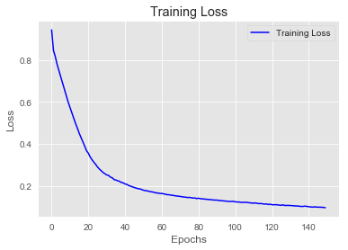


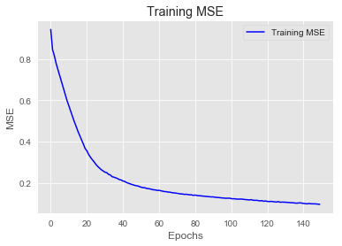


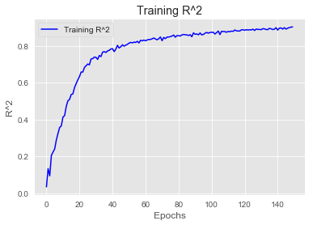


```python
overfit_preds_scaled = overfit_model.predict(X_test_Scaled)
overfit_preds = scaler.inverse_transform(overfit_preds_scaled)
rmse = np.sqrt(mean_squared_error(y_test, overfit_preds))

print('RMSE:', rmse)
print('-------------------------')
print(overfit_model.summary())
```

    RMSE: 0.45329459840206215
    -------------------------
    Model: "sequential_1"
    _________________________________________________________________
    Layer (type)                 Output Shape              Param #   
    =================================================================
    dense_3 (Dense)              (None, 10)                300       
    _________________________________________________________________
    dense_4 (Dense)              (None, 10)                110       
    _________________________________________________________________
    dense_5 (Dense)              (None, 10)                110       
    _________________________________________________________________
    dense_6 (Dense)              (None, 10)                110       
    _________________________________________________________________
    dense_7 (Dense)              (None, 1)                 11        
    =================================================================
    Total params: 641
    Trainable params: 641
    Non-trainable params: 0
    _________________________________________________________________
    None
    

### Regularized Model


```python
reg_model = Sequential()

reg_model.add(layers.Dense(10, kernel_regularizer=regularizers.L2(0.005),
                           activation='relu', input_shape=(n_features, )))

reg_model.add(layers.Dense(10, kernel_regularizer=regularizers.L2(0.005),
                           activation='relu'))

reg_model.add(layers.Dense(10, kernel_regularizer=regularizers.L2(0.005),
                           activation='relu'))

reg_model.add(layers.Dense(10, kernel_regularizer=regularizers.L2(0.005),
                           activation='relu'))

reg_model.add(layers.Dense(10, kernel_regularizer=regularizers.L2(0.005),
                           activation='relu'))

reg_model.add(layers.Dense(1, activation='linear'))

reg_model.compile(optimizer='SGD',
              loss='mse',
              metrics=['mse', coef_determination])

```


```python
reg_model.fit(X_train_Scaled,
                  y_train_Scaled,
                  epochs=150)
```

    Epoch 1/150
    14/14 [==============================] - 0s 816us/step - loss: 1.2817 - mse: 1.0070 - coef_determination: -0.0374
    Epoch 2/150
    14/14 [==============================] - 0s 784us/step - loss: 1.2719 - mse: 0.9980 - coef_determination: -0.0272
    Epoch 3/150
    14/14 [==============================] - 0s 783us/step - loss: 1.2623 - mse: 0.9891 - coef_determination: -0.0209
    Epoch 4/150
    14/14 [==============================] - 0s 784us/step - loss: 1.2520 - mse: 0.9795 - coef_determination: -0.0104
    Epoch 5/150
    14/14 [==============================] - 0s 712us/step - loss: 1.2406 - mse: 0.9687 - coef_determination: 9.0961e-04
    Epoch 6/150
    14/14 [==============================] - 0s 641us/step - loss: 1.2288 - mse: 0.9575 - coef_determination: -0.0134
    Epoch 7/150
    14/14 [==============================] - 0s 715us/step - loss: 1.2110 - mse: 0.9402 - coef_determination: 0.0068
    Epoch 8/150
    14/14 [==============================] - 0s 715us/step - loss: 1.1864 - mse: 0.9160 - coef_determination: 0.0574
    Epoch 9/150
    14/14 [==============================] - 0s 715us/step - loss: 1.1595 - mse: 0.8894 - coef_determination: 0.0754
    Epoch 10/150
    14/14 [==============================] - 0s 785us/step - loss: 1.1299 - mse: 0.8600 - coef_determination: 0.0786
    Epoch 11/150
    14/14 [==============================] - 0s 784us/step - loss: 1.0988 - mse: 0.8291 - coef_determination: 0.1427
    Epoch 12/150
    14/14 [==============================] - 0s 784us/step - loss: 1.0677 - mse: 0.7983 - coef_determination: 0.1761
    Epoch 13/150
    14/14 [==============================] - 0s 713us/step - loss: 1.0396 - mse: 0.7704 - coef_determination: 0.1985
    Epoch 14/150
    14/14 [==============================] - 0s 712us/step - loss: 1.0128 - mse: 0.7439 - coef_determination: 0.2373
    Epoch 15/150
    14/14 [==============================] - 0s 786us/step - loss: 0.9879 - mse: 0.7193 - coef_determination: 0.2501
    Epoch 16/150
    14/14 [==============================] - 0s 784us/step - loss: 0.9653 - mse: 0.6970 - coef_determination: 0.2702
    Epoch 17/150
    14/14 [==============================] - 0s 712us/step - loss: 0.9423 - mse: 0.6746 - coef_determination: 0.3010
    Epoch 18/150
    14/14 [==============================] - 0s 713us/step - loss: 0.9207 - mse: 0.6534 - coef_determination: 0.3126
    Epoch 19/150
    14/14 [==============================] - 0s 784us/step - loss: 0.8977 - mse: 0.6309 - coef_determination: 0.3432
    Epoch 20/150
    14/14 [==============================] - 0s 713us/step - loss: 0.8762 - mse: 0.6097 - coef_determination: 0.3776
    Epoch 21/150
    14/14 [==============================] - 0s 641us/step - loss: 0.8585 - mse: 0.5926 - coef_determination: 0.3808
    Epoch 22/150
    14/14 [==============================] - 0s 641us/step - loss: 0.8427 - mse: 0.5773 - coef_determination: 0.3881
    Epoch 23/150
    14/14 [==============================] - 0s 712us/step - loss: 0.8238 - mse: 0.5587 - coef_determination: 0.4156
    Epoch 24/150
    14/14 [==============================] - 0s 712us/step - loss: 0.8027 - mse: 0.5384 - coef_determination: 0.4330
    Epoch 25/150
    14/14 [==============================] - 0s 712us/step - loss: 0.7829 - mse: 0.5189 - coef_determination: 0.4706
    Epoch 26/150
    14/14 [==============================] - 0s 784us/step - loss: 0.7636 - mse: 0.5002 - coef_determination: 0.4859
    Epoch 27/150
    14/14 [==============================] - 0s 855us/step - loss: 0.7456 - mse: 0.4826 - coef_determination: 0.4928
    Epoch 28/150
    14/14 [==============================] - 0s 712us/step - loss: 0.7277 - mse: 0.4655 - coef_determination: 0.5167
    Epoch 29/150
    14/14 [==============================] - 0s 712us/step - loss: 0.7063 - mse: 0.4446 - coef_determination: 0.5344
    Epoch 30/150
    14/14 [==============================] - 0s 641us/step - loss: 0.6920 - mse: 0.4308 - coef_determination: 0.5582
    Epoch 31/150
    14/14 [==============================] - 0s 784us/step - loss: 0.6712 - mse: 0.4104 - coef_determination: 0.5866
    Epoch 32/150
    14/14 [==============================] - 0s 712us/step - loss: 0.6569 - mse: 0.3966 - coef_determination: 0.5750
    Epoch 33/150
    14/14 [==============================] - 0s 712us/step - loss: 0.6354 - mse: 0.3757 - coef_determination: 0.6171
    Epoch 34/150
    14/14 [==============================] - 0s 712us/step - loss: 0.6227 - mse: 0.3638 - coef_determination: 0.6152
    Epoch 35/150
    14/14 [==============================] - 0s 784us/step - loss: 0.6049 - mse: 0.3463 - coef_determination: 0.6486
    Epoch 36/150
    14/14 [==============================] - 0s 713us/step - loss: 0.5921 - mse: 0.3340 - coef_determination: 0.6504
    Epoch 37/150
    14/14 [==============================] - 0s 712us/step - loss: 0.5768 - mse: 0.3192 - coef_determination: 0.6736
    Epoch 38/150
    14/14 [==============================] - 0s 641us/step - loss: 0.5646 - mse: 0.3074 - coef_determination: 0.6839
    Epoch 39/150
    14/14 [==============================] - 0s 712us/step - loss: 0.5540 - mse: 0.2974 - coef_determination: 0.6936
    Epoch 40/150
    14/14 [==============================] - 0s 712us/step - loss: 0.5408 - mse: 0.2847 - coef_determination: 0.6984
    Epoch 41/150
    14/14 [==============================] - 0s 713us/step - loss: 0.5289 - mse: 0.2734 - coef_determination: 0.7231
    Epoch 42/150
    14/14 [==============================] - 0s 712us/step - loss: 0.5193 - mse: 0.2642 - coef_determination: 0.7288
    Epoch 43/150
    14/14 [==============================] - 0s 784us/step - loss: 0.5061 - mse: 0.2515 - coef_determination: 0.7353
    Epoch 44/150
    14/14 [==============================] - 0s 712us/step - loss: 0.4990 - mse: 0.2449 - coef_determination: 0.7497
    Epoch 45/150
    14/14 [==============================] - 0s 713us/step - loss: 0.4899 - mse: 0.2362 - coef_determination: 0.7558
    Epoch 46/150
    14/14 [==============================] - 0s 712us/step - loss: 0.4847 - mse: 0.2315 - coef_determination: 0.7578
    Epoch 47/150
    14/14 [==============================] - 0s 712us/step - loss: 0.4750 - mse: 0.2222 - coef_determination: 0.7780
    Epoch 48/150
    14/14 [==============================] - 0s 641us/step - loss: 0.4678 - mse: 0.2156 - coef_determination: 0.7783
    Epoch 49/150
    14/14 [==============================] - 0s 712us/step - loss: 0.4611 - mse: 0.2092 - coef_determination: 0.7858
    Epoch 50/150
    14/14 [==============================] - 0s 784us/step - loss: 0.4589 - mse: 0.2076 - coef_determination: 0.7880
    Epoch 51/150
    14/14 [==============================] - 0s 712us/step - loss: 0.4520 - mse: 0.2012 - coef_determination: 0.7834
    Epoch 52/150
    14/14 [==============================] - 0s 712us/step - loss: 0.4460 - mse: 0.1957 - coef_determination: 0.7948
    Epoch 53/150
    14/14 [==============================] - 0s 712us/step - loss: 0.4397 - mse: 0.1898 - coef_determination: 0.8092
    Epoch 54/150
    14/14 [==============================] - 0s 712us/step - loss: 0.4359 - mse: 0.1863 - coef_determination: 0.8034
    Epoch 55/150
    14/14 [==============================] - 0s 784us/step - loss: 0.4325 - mse: 0.1835 - coef_determination: 0.8069
    Epoch 56/150
    14/14 [==============================] - 0s 641us/step - loss: 0.4299 - mse: 0.1814 - coef_determination: 0.8127
    Epoch 57/150
    14/14 [==============================] - 0s 713us/step - loss: 0.4252 - mse: 0.1772 - coef_determination: 0.8172
    Epoch 58/150
    14/14 [==============================] - 0s 712us/step - loss: 0.4200 - mse: 0.1725 - coef_determination: 0.8201
    Epoch 59/150
    14/14 [==============================] - 0s 712us/step - loss: 0.4170 - mse: 0.1699 - coef_determination: 0.8230
    Epoch 60/150
    14/14 [==============================] - 0s 641us/step - loss: 0.4132 - mse: 0.1667 - coef_determination: 0.8244
    Epoch 61/150
    14/14 [==============================] - 0s 640us/step - loss: 0.4087 - mse: 0.1626 - coef_determination: 0.8162
    Epoch 62/150
    14/14 [==============================] - 0s 712us/step - loss: 0.4054 - mse: 0.1598 - coef_determination: 0.8299
    Epoch 63/150
    14/14 [==============================] - 0s 784us/step - loss: 0.4008 - mse: 0.1557 - coef_determination: 0.8388
    Epoch 64/150
    14/14 [==============================] - 0s 712us/step - loss: 0.3997 - mse: 0.1551 - coef_determination: 0.8291
    Epoch 65/150
    14/14 [==============================] - 0s 712us/step - loss: 0.3973 - mse: 0.1531 - coef_determination: 0.8409
    Epoch 66/150
    14/14 [==============================] - 0s 712us/step - loss: 0.3927 - mse: 0.1489 - coef_determination: 0.8507
    Epoch 67/150
    14/14 [==============================] - 0s 644us/step - loss: 0.3898 - mse: 0.1466 - coef_determination: 0.8516
    Epoch 68/150
    14/14 [==============================] - 0s 712us/step - loss: 0.3881 - mse: 0.1453 - coef_determination: 0.8512
    Epoch 69/150
    14/14 [==============================] - 0s 713us/step - loss: 0.3848 - mse: 0.1425 - coef_determination: 0.8531
    Epoch 70/150
    14/14 [==============================] - 0s 712us/step - loss: 0.3815 - mse: 0.1397 - coef_determination: 0.8584
    Epoch 71/150
    14/14 [==============================] - 0s 641us/step - loss: 0.3814 - mse: 0.1400 - coef_determination: 0.8527
    Epoch 72/150
    14/14 [==============================] - 0s 713us/step - loss: 0.3786 - mse: 0.1377 - coef_determination: 0.8648
    Epoch 73/150
    14/14 [==============================] - 0s 712us/step - loss: 0.3772 - mse: 0.1367 - coef_determination: 0.8452
    Epoch 74/150
    14/14 [==============================] - 0s 641us/step - loss: 0.3734 - mse: 0.1334 - coef_determination: 0.8657
    Epoch 75/150
    14/14 [==============================] - 0s 641us/step - loss: 0.3725 - mse: 0.1331 - coef_determination: 0.8565
    Epoch 76/150
    14/14 [==============================] - 0s 712us/step - loss: 0.3694 - mse: 0.1304 - coef_determination: 0.8606
    Epoch 77/150
    14/14 [==============================] - 0s 641us/step - loss: 0.3671 - mse: 0.1286 - coef_determination: 0.8532
    Epoch 78/150
    14/14 [==============================] - 0s 712us/step - loss: 0.3663 - mse: 0.1282 - coef_determination: 0.8603
    Epoch 79/150
    14/14 [==============================] - 0s 712us/step - loss: 0.3641 - mse: 0.1265 - coef_determination: 0.8679
    Epoch 80/150
    14/14 [==============================] - 0s 641us/step - loss: 0.3614 - mse: 0.1243 - coef_determination: 0.8666
    Epoch 81/150
    14/14 [==============================] - 0s 712us/step - loss: 0.3604 - mse: 0.1237 - coef_determination: 0.8703
    Epoch 82/150
    14/14 [==============================] - 0s 712us/step - loss: 0.3580 - mse: 0.1218 - coef_determination: 0.8682
    Epoch 83/150
    14/14 [==============================] - 0s 641us/step - loss: 0.3594 - mse: 0.1236 - coef_determination: 0.8744
    Epoch 84/150
    14/14 [==============================] - 0s 641us/step - loss: 0.3566 - mse: 0.1213 - coef_determination: 0.8709
    Epoch 85/150
    14/14 [==============================] - 0s 712us/step - loss: 0.3532 - mse: 0.1185 - coef_determination: 0.8786
    Epoch 86/150
    14/14 [==============================] - 0s 641us/step - loss: 0.3529 - mse: 0.1186 - coef_determination: 0.8770
    Epoch 87/150
    14/14 [==============================] - 0s 784us/step - loss: 0.3513 - mse: 0.1175 - coef_determination: 0.8775
    Epoch 88/150
    14/14 [==============================] - 0s 641us/step - loss: 0.3492 - mse: 0.1158 - coef_determination: 0.8614
    Epoch 89/150
    14/14 [==============================] - 0s 713us/step - loss: 0.3498 - mse: 0.1168 - coef_determination: 0.8821
    Epoch 90/150
    14/14 [==============================] - 0s 712us/step - loss: 0.3486 - mse: 0.1161 - coef_determination: 0.8803
    Epoch 91/150
    14/14 [==============================] - 0s 712us/step - loss: 0.3447 - mse: 0.1127 - coef_determination: 0.8834
    Epoch 92/150
    14/14 [==============================] - 0s 712us/step - loss: 0.3430 - mse: 0.1115 - coef_determination: 0.8839
    Epoch 93/150
    14/14 [==============================] - 0s 855us/step - loss: 0.3426 - mse: 0.1116 - coef_determination: 0.8792
    Epoch 94/150
    14/14 [==============================] - 0s 783us/step - loss: 0.3407 - mse: 0.1102 - coef_determination: 0.8803
    Epoch 95/150
    14/14 [==============================] - 0s 784us/step - loss: 0.3402 - mse: 0.1101 - coef_determination: 0.8865
    Epoch 96/150
    14/14 [==============================] - 0s 783us/step - loss: 0.3380 - mse: 0.1083 - coef_determination: 0.8836
    Epoch 97/150
    14/14 [==============================] - 0s 712us/step - loss: 0.3369 - mse: 0.1078 - coef_determination: 0.8848
    Epoch 98/150
    14/14 [==============================] - 0s 784us/step - loss: 0.3354 - mse: 0.1068 - coef_determination: 0.8908
    Epoch 99/150
    14/14 [==============================] - 0s 784us/step - loss: 0.3334 - mse: 0.1052 - coef_determination: 0.8895
    Epoch 100/150
    14/14 [==============================] - 0s 712us/step - loss: 0.3334 - mse: 0.1057 - coef_determination: 0.8911
    Epoch 101/150
    14/14 [==============================] - 0s 784us/step - loss: 0.3324 - mse: 0.1051 - coef_determination: 0.8855
    Epoch 102/150
    14/14 [==============================] - 0s 712us/step - loss: 0.3307 - mse: 0.1039 - coef_determination: 0.8925
    Epoch 103/150
    14/14 [==============================] - 0s 784us/step - loss: 0.3293 - mse: 0.1030 - coef_determination: 0.8924
    Epoch 104/150
    14/14 [==============================] - 0s 855us/step - loss: 0.3284 - mse: 0.1025 - coef_determination: 0.8965
    Epoch 105/150
    14/14 [==============================] - ETA: 0s - loss: 0.3030 - mse: 0.0775 - coef_determination: 0.93 - 0s 784us/step - loss: 0.3285 - mse: 0.1032 - coef_determination: 0.8791
    Epoch 106/150
    14/14 [==============================] - 0s 712us/step - loss: 0.3280 - mse: 0.1031 - coef_determination: 0.8972
    Epoch 107/150
    14/14 [==============================] - 0s 642us/step - loss: 0.3238 - mse: 0.0993 - coef_determination: 0.8967
    Epoch 108/150
    14/14 [==============================] - 0s 713us/step - loss: 0.3238 - mse: 0.0999 - coef_determination: 0.8804
    Epoch 109/150
    14/14 [==============================] - 0s 712us/step - loss: 0.3224 - mse: 0.0990 - coef_determination: 0.8997
    Epoch 110/150
    14/14 [==============================] - 0s 773us/step - loss: 0.3215 - mse: 0.0985 - coef_determination: 0.8968
    Epoch 111/150
    14/14 [==============================] - 0s 664us/step - loss: 0.3204 - mse: 0.0979 - coef_determination: 0.9042
    Epoch 112/150
    14/14 [==============================] - 0s 712us/step - loss: 0.3188 - mse: 0.0967 - coef_determination: 0.8982
    Epoch 113/150
    14/14 [==============================] - 0s 781us/step - loss: 0.3184 - mse: 0.0969 - coef_determination: 0.8950
    Epoch 114/150
    14/14 [==============================] - 0s 784us/step - loss: 0.3159 - mse: 0.0947 - coef_determination: 0.9000
    Epoch 115/150
    14/14 [==============================] - 0s 855us/step - loss: 0.3161 - mse: 0.0954 - coef_determination: 0.9001
    Epoch 116/150
    14/14 [==============================] - 0s 710us/step - loss: 0.3172 - mse: 0.0970 - coef_determination: 0.8985
    Epoch 117/150
    14/14 [==============================] - 0s 784us/step - loss: 0.3134 - mse: 0.0936 - coef_determination: 0.9060
    Epoch 118/150
    14/14 [==============================] - 0s 781us/step - loss: 0.3117 - mse: 0.0924 - coef_determination: 0.9049
    Epoch 119/150
    14/14 [==============================] - 0s 715us/step - loss: 0.3105 - mse: 0.0916 - coef_determination: 0.9075
    Epoch 120/150
    14/14 [==============================] - 0s 784us/step - loss: 0.3100 - mse: 0.0917 - coef_determination: 0.9023
    Epoch 121/150
    14/14 [==============================] - 0s 786us/step - loss: 0.3096 - mse: 0.0917 - coef_determination: 0.9002
    Epoch 122/150
    14/14 [==============================] - 0s 712us/step - loss: 0.3071 - mse: 0.0897 - coef_determination: 0.9099
    Epoch 123/150
    14/14 [==============================] - 0s 784us/step - loss: 0.3068 - mse: 0.0899 - coef_determination: 0.9076
    Epoch 124/150
    14/14 [==============================] - 0s 713us/step - loss: 0.3067 - mse: 0.0901 - coef_determination: 0.9083
    Epoch 125/150
    14/14 [==============================] - 0s 712us/step - loss: 0.3072 - mse: 0.0912 - coef_determination: 0.9054
    Epoch 126/150
    14/14 [==============================] - 0s 712us/step - loss: 0.3045 - mse: 0.0890 - coef_determination: 0.9079
    Epoch 127/150
    14/14 [==============================] - 0s 784us/step - loss: 0.3071 - mse: 0.0919 - coef_determination: 0.9020
    Epoch 128/150
    14/14 [==============================] - 0s 712us/step - loss: 0.3046 - mse: 0.0899 - coef_determination: 0.9101
    Epoch 129/150
    14/14 [==============================] - 0s 784us/step - loss: 0.3028 - mse: 0.0885 - coef_determination: 0.9085
    Epoch 130/150
    14/14 [==============================] - 0s 783us/step - loss: 0.3009 - mse: 0.0870 - coef_determination: 0.9087
    Epoch 131/150
    14/14 [==============================] - 0s 784us/step - loss: 0.3012 - mse: 0.0878 - coef_determination: 0.9064
    Epoch 132/150
    14/14 [==============================] - 0s 784us/step - loss: 0.3022 - mse: 0.0893 - coef_determination: 0.9097
    Epoch 133/150
    14/14 [==============================] - 0s 855us/step - loss: 0.2977 - mse: 0.0852 - coef_determination: 0.9055
    Epoch 134/150
    14/14 [==============================] - 0s 782us/step - loss: 0.2975 - mse: 0.0854 - coef_determination: 0.9076
    Epoch 135/150
    14/14 [==============================] - 0s 786us/step - loss: 0.2983 - mse: 0.0867 - coef_determination: 0.9093
    Epoch 136/150
    14/14 [==============================] - 0s 712us/step - loss: 0.2973 - mse: 0.0862 - coef_determination: 0.9144
    Epoch 137/150
    14/14 [==============================] - 0s 712us/step - loss: 0.2946 - mse: 0.0839 - coef_determination: 0.9043
    Epoch 138/150
    14/14 [==============================] - 0s 784us/step - loss: 0.2956 - mse: 0.0853 - coef_determination: 0.9087
    Epoch 139/150
    14/14 [==============================] - 0s 712us/step - loss: 0.2943 - mse: 0.0844 - coef_determination: 0.9142
    Epoch 140/150
    14/14 [==============================] - 0s 784us/step - loss: 0.2929 - mse: 0.0835 - coef_determination: 0.9159
    Epoch 141/150
    14/14 [==============================] - ETA: 0s - loss: 0.2647 - mse: 0.0555 - coef_determination: 0.95 - 0s 855us/step - loss: 0.2932 - mse: 0.0842 - coef_determination: 0.9130
    Epoch 142/150
    14/14 [==============================] - 0s 784us/step - loss: 0.2926 - mse: 0.0840 - coef_determination: 0.9169
    Epoch 143/150
    14/14 [==============================] - 0s 712us/step - loss: 0.2921 - mse: 0.0840 - coef_determination: 0.9206
    Epoch 144/150
    14/14 [==============================] - 0s 784us/step - loss: 0.2903 - mse: 0.0827 - coef_determination: 0.9104
    Epoch 145/150
    14/14 [==============================] - 0s 712us/step - loss: 0.2887 - mse: 0.0814 - coef_determination: 0.9156
    Epoch 146/150
    14/14 [==============================] - 0s 783us/step - loss: 0.2891 - mse: 0.0822 - coef_determination: 0.9147
    Epoch 147/150
    14/14 [==============================] - 0s 784us/step - loss: 0.2879 - mse: 0.0814 - coef_determination: 0.9133
    Epoch 148/150
    14/14 [==============================] - 0s 712us/step - loss: 0.2862 - mse: 0.0803 - coef_determination: 0.9192
    Epoch 149/150
    14/14 [==============================] - 0s 784us/step - loss: 0.2863 - mse: 0.0808 - coef_determination: 0.9190
    Epoch 150/150
    14/14 [==============================] - 0s 784us/step - loss: 0.2855 - mse: 0.0804 - coef_determination: 0.9110
    


    <tensorflow.python.keras.callbacks.History at 0x131fb409fd0>


```python
visualize_loss_MSE(reg_model.history)
```


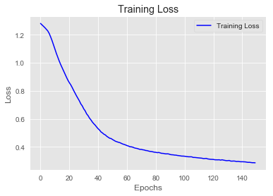


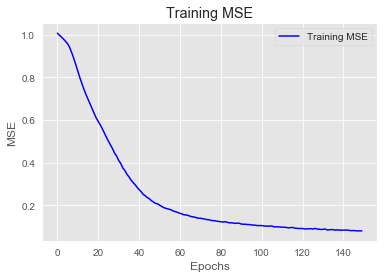


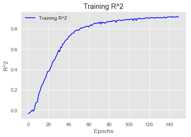


```python
reg_preds_scaled = reg_model.predict(X_test_Scaled)
reg_preds = scaler.inverse_transform(reg_preds_scaled)
rmse = np.sqrt(mean_squared_error(y_test, reg_preds))

print('RMSE:', rmse)
print('-------------------------')
print(reg_model.summary())
```

    RMSE: 0.3120995088019562
    -------------------------
    Model: "sequential_2"
    _________________________________________________________________
    Layer (type)                 Output Shape              Param #   
    =================================================================
    dense_8 (Dense)              (None, 10)                300       
    _________________________________________________________________
    dense_9 (Dense)              (None, 10)                110       
    _________________________________________________________________
    dense_10 (Dense)             (None, 10)                110       
    _________________________________________________________________
    dense_11 (Dense)             (None, 10)                110       
    _________________________________________________________________
    dense_12 (Dense)             (None, 10)                110       
    _________________________________________________________________
    dense_13 (Dense)             (None, 1)                 11        
    =================================================================
    Total params: 751
    Trainable params: 751
    Non-trainable params: 0
    _________________________________________________________________
    None
    

### Optimized Model


```python
optimized_model = Sequential()

optimized_model.add(layers.Dense(45,
                                  kernel_regularizer=regularizers.L2(0.005),
                           activation='relu', input_shape=(n_features, )))

optimized_model.add(layers.Dense(15,
                                  kernel_regularizer=regularizers.L2(0.005),
                           activation='relu'))

optimized_model.add(layers.Dense(3,
                                  kernel_regularizer=regularizers.L2(0.005),
                           activation='relu'))

optimized_model.add(layers.Dense(1, activation='linear'))

optimized_model.compile(optimizer='RMSprop',
              loss='mse',
              metrics=['mse', coef_determination])
```


```python
import time

# NAME = 'Optimal Model -relu- Layers(D34L2 & D15L2 & D3L2)'

# tensorboard = TensorBoard(log_dir='logs/fit/' + NAME,
#                           histogram_freq=1,
#                           write_graph=True,
#                           write_images=True)

# callbacks = [tensorboard]


optimized_model.fit(X_train_Scaled,
                     y_train_Scaled,
                     epochs=150,
                     batch_size=15)
# ,
#                      callbacks = callbacks)
```

    Epoch 1/150
    30/30 [==============================] - 0s 798us/step - loss: 1.2554 - mse: 0.9652 - coef_determination: -0.1977
    Epoch 2/150
    30/30 [==============================] - 0s 797us/step - loss: 1.1530 - mse: 0.8829 - coef_determination: -0.0183
    Epoch 3/150
    30/30 [==============================] - 0s 764us/step - loss: 1.0763 - mse: 0.8235 - coef_determination: -1.0849
    Epoch 4/150
    30/30 [==============================] - 0s 800us/step - loss: 1.0178 - mse: 0.7819 - coef_determination: 0.1159
    Epoch 5/150
    30/30 [==============================] - 0s 765us/step - loss: 0.9534 - mse: 0.7330 - coef_determination: 0.2792
    Epoch 6/150
    30/30 [==============================] - 0s 764us/step - loss: 0.8932 - mse: 0.6857 - coef_determination: 0.2819
    Epoch 7/150
    30/30 [==============================] - 0s 731us/step - loss: 0.8294 - mse: 0.6327 - coef_determination: 0.3224
    Epoch 8/150
    30/30 [==============================] - 0s 731us/step - loss: 0.7548 - mse: 0.5664 - coef_determination: 0.4106
    Epoch 9/150
    30/30 [==============================] - 0s 698us/step - loss: 0.6740 - mse: 0.4916 - coef_determination: 0.5130
    Epoch 10/150
    30/30 [==============================] - 0s 666us/step - loss: 0.5825 - mse: 0.4040 - coef_determination: 0.5942
    Epoch 11/150
    30/30 [==============================] - 0s 696us/step - loss: 0.5007 - mse: 0.3253 - coef_determination: 0.6709
    Epoch 12/150
    30/30 [==============================] - 0s 665us/step - loss: 0.4477 - mse: 0.2748 - coef_determination: 0.6839
    Epoch 13/150
    30/30 [==============================] - 0s 698us/step - loss: 0.4158 - mse: 0.2468 - coef_determination: 0.7322
    Epoch 14/150
    30/30 [==============================] - 0s 798us/step - loss: 0.3905 - mse: 0.2261 - coef_determination: 0.7521
    Epoch 15/150
    30/30 [==============================] - 0s 698us/step - loss: 0.3664 - mse: 0.2059 - coef_determination: 0.7892
    Epoch 16/150
    30/30 [==============================] - 0s 698us/step - loss: 0.3478 - mse: 0.1913 - coef_determination: 0.7756
    Epoch 17/150
    30/30 [==============================] - 0s 665us/step - loss: 0.3277 - mse: 0.1745 - coef_determination: 0.8143
    Epoch 18/150
    30/30 [==============================] - 0s 731us/step - loss: 0.3156 - mse: 0.1671 - coef_determination: 0.7984
    Epoch 19/150
    30/30 [==============================] - 0s 699us/step - loss: 0.2977 - mse: 0.1524 - coef_determination: 0.7870
    Epoch 20/150
    30/30 [==============================] - 0s 665us/step - loss: 0.2851 - mse: 0.1440 - coef_determination: 0.8381
    Epoch 21/150
    30/30 [==============================] - 0s 632us/step - loss: 0.2702 - mse: 0.1325 - coef_determination: 0.7813
    Epoch 22/150
    30/30 [==============================] - 0s 665us/step - loss: 0.2611 - mse: 0.1273 - coef_determination: 0.8592
    Epoch 23/150
    30/30 [==============================] - 0s 698us/step - loss: 0.2503 - mse: 0.1187 - coef_determination: 0.8393
    Epoch 24/150
    30/30 [==============================] - 0s 765us/step - loss: 0.2463 - mse: 0.1178 - coef_determination: 0.8695
    Epoch 25/150
    30/30 [==============================] - 0s 667us/step - loss: 0.2357 - mse: 0.1097 - coef_determination: 0.8700
    Epoch 26/150
    30/30 [==============================] - 0s 730us/step - loss: 0.2262 - mse: 0.1025 - coef_determination: 0.8724
    Epoch 27/150
    30/30 [==============================] - 0s 763us/step - loss: 0.2257 - mse: 0.1038 - coef_determination: 0.8905
    Epoch 28/150
    30/30 [==============================] - 0s 696us/step - loss: 0.2141 - mse: 0.0943 - coef_determination: 0.9008
    Epoch 29/150
    30/30 [==============================] - 0s 697us/step - loss: 0.2079 - mse: 0.0901 - coef_determination: 0.5675
    Epoch 30/150
    30/30 [==============================] - 0s 731us/step - loss: 0.2037 - mse: 0.0875 - coef_determination: 0.8986
    Epoch 31/150
    30/30 [==============================] - 0s 699us/step - loss: 0.1958 - mse: 0.0817 - coef_determination: 0.8719
    Epoch 32/150
    30/30 [==============================] - 0s 698us/step - loss: 0.1908 - mse: 0.0784 - coef_determination: 0.9185
    Epoch 33/150
    30/30 [==============================] - 0s 674us/step - loss: 0.1880 - mse: 0.0774 - coef_determination: 0.9208
    Epoch 34/150
    30/30 [==============================] - 0s 631us/step - loss: 0.1843 - mse: 0.0758 - coef_determination: 0.9179
    Epoch 35/150
    30/30 [==============================] - 0s 698us/step - loss: 0.1762 - mse: 0.0694 - coef_determination: 0.9124
    Epoch 36/150
    30/30 [==============================] - 0s 765us/step - loss: 0.1777 - mse: 0.0725 - coef_determination: 0.9062
    Epoch 37/150
    30/30 [==============================] - 0s 765us/step - loss: 0.1751 - mse: 0.0716 - coef_determination: 0.9289
    Epoch 38/150
    30/30 [==============================] - 0s 731us/step - loss: 0.1722 - mse: 0.0701 - coef_determination: 0.9200
    Epoch 39/150
    30/30 [==============================] - 0s 665us/step - loss: 0.1666 - mse: 0.0660 - coef_determination: 0.9303
    Epoch 40/150
    30/30 [==============================] - 0s 765us/step - loss: 0.1676 - mse: 0.0682 - coef_determination: 0.9289
    Epoch 41/150
    30/30 [==============================] - 0s 698us/step - loss: 0.1616 - mse: 0.0633 - coef_determination: 0.9340
    Epoch 42/150
    30/30 [==============================] - 0s 731us/step - loss: 0.1596 - mse: 0.0628 - coef_determination: 0.9319
    Epoch 43/150
    30/30 [==============================] - 0s 698us/step - loss: 0.1550 - mse: 0.0594 - coef_determination: 0.9327
    Epoch 44/150
    30/30 [==============================] - 0s 731us/step - loss: 0.1542 - mse: 0.0597 - coef_determination: 0.9435
    Epoch 45/150
    30/30 [==============================] - 0s 698us/step - loss: 0.1556 - mse: 0.0624 - coef_determination: 0.9292
    Epoch 46/150
    30/30 [==============================] - 0s 698us/step - loss: 0.1537 - mse: 0.0616 - coef_determination: 0.9185
    Epoch 47/150
    30/30 [==============================] - 0s 765us/step - loss: 0.1486 - mse: 0.0575 - coef_determination: 0.9338
    Epoch 48/150
    30/30 [==============================] - 0s 698us/step - loss: 0.1453 - mse: 0.0549 - coef_determination: 0.9427
    Epoch 49/150
    30/30 [==============================] - 0s 798us/step - loss: 0.1474 - mse: 0.0584 - coef_determination: 0.9296
    Epoch 50/150
    30/30 [==============================] - 0s 698us/step - loss: 0.1438 - mse: 0.0554 - coef_determination: 0.9389
    Epoch 51/150
    30/30 [==============================] - 0s 765us/step - loss: 0.1411 - mse: 0.0536 - coef_determination: 0.9407
    Epoch 52/150
    30/30 [==============================] - 0s 731us/step - loss: 0.1450 - mse: 0.0586 - coef_determination: 0.8287
    Epoch 53/150
    30/30 [==============================] - 0s 732us/step - loss: 0.1445 - mse: 0.0590 - coef_determination: 0.9303
    Epoch 54/150
    30/30 [==============================] - 0s 731us/step - loss: 0.1386 - mse: 0.0535 - coef_determination: 0.9300
    Epoch 55/150
    30/30 [==============================] - 0s 874us/step - loss: 0.1397 - mse: 0.0555 - coef_determination: 0.9355
    Epoch 56/150
    30/30 [==============================] - 0s 698us/step - loss: 0.1356 - mse: 0.0521 - coef_determination: 0.9444
    Epoch 57/150
    30/30 [==============================] - 0s 698us/step - loss: 0.1389 - mse: 0.0560 - coef_determination: 0.9348
    Epoch 58/150
    30/30 [==============================] - 0s 765us/step - loss: 0.1364 - mse: 0.0542 - coef_determination: 0.9354
    Epoch 59/150
    30/30 [==============================] - 0s 698us/step - loss: 0.1288 - mse: 0.0475 - coef_determination: 0.9460
    Epoch 60/150
    30/30 [==============================] - 0s 698us/step - loss: 0.1350 - mse: 0.0543 - coef_determination: 0.9456
    Epoch 61/150
    30/30 [==============================] - 0s 765us/step - loss: 0.1336 - mse: 0.0538 - coef_determination: 0.9404
    Epoch 62/150
    30/30 [==============================] - 0s 765us/step - loss: 0.1301 - mse: 0.0511 - coef_determination: 0.9365
    Epoch 63/150
    30/30 [==============================] - 0s 698us/step - loss: 0.1352 - mse: 0.0568 - coef_determination: 0.9292
    Epoch 64/150
    30/30 [==============================] - 0s 798us/step - loss: 0.1301 - mse: 0.0524 - coef_determination: 0.9445
    Epoch 65/150
    30/30 [==============================] - 0s 764us/step - loss: 0.1274 - mse: 0.0504 - coef_determination: 0.9374
    Epoch 66/150
    30/30 [==============================] - 0s 665us/step - loss: 0.1298 - mse: 0.0533 - coef_determination: 0.9370
    Epoch 67/150
    30/30 [==============================] - 0s 665us/step - loss: 0.1280 - mse: 0.0519 - coef_determination: 0.9315
    Epoch 68/150
    30/30 [==============================] - 0s 766us/step - loss: 0.1253 - mse: 0.0498 - coef_determination: 0.9345
    Epoch 69/150
    30/30 [==============================] - 0s 710us/step - loss: 0.1258 - mse: 0.0509 - coef_determination: 0.9391
    Epoch 70/150
    30/30 [==============================] - 0s 698us/step - loss: 0.1278 - mse: 0.0535 - coef_determination: 0.9391
    Epoch 71/150
    30/30 [==============================] - 0s 700us/step - loss: 0.1229 - mse: 0.0490 - coef_determination: 0.9466
    Epoch 72/150
    30/30 [==============================] - 0s 665us/step - loss: 0.1252 - mse: 0.0521 - coef_determination: 0.9440
    Epoch 73/150
    30/30 [==============================] - 0s 749us/step - loss: 0.1248 - mse: 0.0521 - coef_determination: 0.9358
    Epoch 74/150
    30/30 [==============================] - 0s 731us/step - loss: 0.1197 - mse: 0.0475 - coef_determination: -2.1864
    Epoch 75/150
    30/30 [==============================] - 0s 731us/step - loss: 0.1199 - mse: 0.0482 - coef_determination: 0.9397
    Epoch 76/150
    30/30 [==============================] - 0s 635us/step - loss: 0.1198 - mse: 0.0484 - coef_determination: 0.9454
    Epoch 77/150
    30/30 [==============================] - 0s 665us/step - loss: 0.1214 - mse: 0.0497 - coef_determination: 0.9423
    Epoch 78/150
    30/30 [==============================] - 0s 665us/step - loss: 0.1219 - mse: 0.0509 - coef_determination: 0.9262
    Epoch 79/150
    30/30 [==============================] - 0s 698us/step - loss: 0.1233 - mse: 0.0528 - coef_determination: 0.9298
    Epoch 80/150
    30/30 [==============================] - 0s 665us/step - loss: 0.1175 - mse: 0.0470 - coef_determination: 0.9520
    Epoch 81/150
    30/30 [==============================] - 0s 673us/step - loss: 0.1182 - mse: 0.0482 - coef_determination: 0.9452
    Epoch 82/150
    30/30 [==============================] - 0s 677us/step - loss: 0.1202 - mse: 0.0506 - coef_determination: 0.9126
    Epoch 83/150
    30/30 [==============================] - 0s 698us/step - loss: 0.1166 - mse: 0.0476 - coef_determination: 0.9461
    Epoch 84/150
    30/30 [==============================] - 0s 765us/step - loss: 0.1153 - mse: 0.0467 - coef_determination: 0.9426
    Epoch 85/150
    30/30 [==============================] - 0s 743us/step - loss: 0.1149 - mse: 0.0466 - coef_determination: 0.9387
    Epoch 86/150
    30/30 [==============================] - 0s 731us/step - loss: 0.1173 - mse: 0.0493 - coef_determination: 0.9446
    Epoch 87/150
    30/30 [==============================] - 0s 697us/step - loss: 0.1164 - mse: 0.0488 - coef_determination: 0.9432
    Epoch 88/150
    30/30 [==============================] - 0s 763us/step - loss: 0.1183 - mse: 0.0509 - coef_determination: 0.9489
    Epoch 89/150
    30/30 [==============================] - 0s 765us/step - loss: 0.1184 - mse: 0.0511 - coef_determination: 0.9403
    Epoch 90/150
    30/30 [==============================] - 0s 765us/step - loss: 0.1133 - mse: 0.0462 - coef_determination: 0.9512
    Epoch 91/150
    30/30 [==============================] - 0s 731us/step - loss: 0.1155 - mse: 0.0488 - coef_determination: 0.9458
    Epoch 92/150
    30/30 [==============================] - 0s 732us/step - loss: 0.1148 - mse: 0.0485 - coef_determination: 0.9517
    Epoch 93/150
    30/30 [==============================] - 0s 765us/step - loss: 0.1108 - mse: 0.0448 - coef_determination: 0.9513
    Epoch 94/150
    30/30 [==============================] - 0s 688us/step - loss: 0.1137 - mse: 0.0476 - coef_determination: 0.9476
    Epoch 95/150
    30/30 [==============================] - 0s 662us/step - loss: 0.1131 - mse: 0.0470 - coef_determination: 0.9470
    Epoch 96/150
    30/30 [==============================] - 0s 698us/step - loss: 0.1142 - mse: 0.0486 - coef_determination: 0.9473
    Epoch 97/150
    30/30 [==============================] - 0s 798us/step - loss: 0.1118 - mse: 0.0463 - coef_determination: 0.9489
    Epoch 98/150
    30/30 [==============================] - 0s 731us/step - loss: 0.1071 - mse: 0.0421 - coef_determination: 0.9389
    Epoch 99/150
    30/30 [==============================] - 0s 665us/step - loss: 0.1131 - mse: 0.0480 - coef_determination: 0.9315
    Epoch 100/150
    30/30 [==============================] - 0s 738us/step - loss: 0.1109 - mse: 0.0460 - coef_determination: 0.9500
    Epoch 101/150
    30/30 [==============================] - 0s 731us/step - loss: 0.1088 - mse: 0.0440 - coef_determination: 0.9505
    Epoch 102/150
    30/30 [==============================] - 0s 765us/step - loss: 0.1094 - mse: 0.0453 - coef_determination: 0.9517
    Epoch 103/150
    30/30 [==============================] - 0s 765us/step - loss: 0.1070 - mse: 0.0434 - coef_determination: 0.9577
    Epoch 104/150
    30/30 [==============================] - 0s 765us/step - loss: 0.1078 - mse: 0.0445 - coef_determination: 0.9416
    Epoch 105/150
    30/30 [==============================] - 0s 732us/step - loss: 0.1090 - mse: 0.0459 - coef_determination: 0.9550
    Epoch 106/150
    30/30 [==============================] - 0s 697us/step - loss: 0.1053 - mse: 0.0424 - coef_determination: 0.9543
    Epoch 107/150
    30/30 [==============================] - 0s 699us/step - loss: 0.1081 - mse: 0.0454 - coef_determination: 0.9415
    Epoch 108/150
    30/30 [==============================] - 0s 731us/step - loss: 0.1088 - mse: 0.0463 - coef_determination: 0.9533
    Epoch 109/150
    30/30 [==============================] - 0s 698us/step - loss: 0.1064 - mse: 0.0444 - coef_determination: 0.9592
    Epoch 110/150
    30/30 [==============================] - 0s 731us/step - loss: 0.1021 - mse: 0.0402 - coef_determination: 0.9594
    Epoch 111/150
    30/30 [==============================] - 0s 665us/step - loss: 0.1056 - mse: 0.0440 - coef_determination: 0.9391
    Epoch 112/150
    30/30 [==============================] - 0s 698us/step - loss: 0.1070 - mse: 0.0454 - coef_determination: 0.9478
    Epoch 113/150
    30/30 [==============================] - 0s 731us/step - loss: 0.1081 - mse: 0.0464 - coef_determination: 0.9484
    Epoch 114/150
    30/30 [==============================] - 0s 802us/step - loss: 0.1045 - mse: 0.0431 - coef_determination: 0.9382
    Epoch 115/150
    30/30 [==============================] - 0s 698us/step - loss: 0.1017 - mse: 0.0406 - coef_determination: 0.9568
    Epoch 116/150
    30/30 [==============================] - 0s 698us/step - loss: 0.1024 - mse: 0.0414 - coef_determination: 0.9525
    Epoch 117/150
    30/30 [==============================] - 0s 665us/step - loss: 0.1095 - mse: 0.0489 - coef_determination: 0.8666
    Epoch 118/150
    30/30 [==============================] - 0s 666us/step - loss: 0.1027 - mse: 0.0423 - coef_determination: 0.9572
    Epoch 119/150
    30/30 [==============================] - 0s 665us/step - loss: 0.1034 - mse: 0.0433 - coef_determination: 0.9502
    Epoch 120/150
    30/30 [==============================] - 0s 700us/step - loss: 0.1019 - mse: 0.0420 - coef_determination: 0.9539
    Epoch 121/150
    30/30 [==============================] - 0s 665us/step - loss: 0.1025 - mse: 0.0424 - coef_determination: 0.9471
    Epoch 122/150
    30/30 [==============================] - 0s 698us/step - loss: 0.1008 - mse: 0.0412 - coef_determination: 0.9626
    Epoch 123/150
    30/30 [==============================] - 0s 677us/step - loss: 0.1052 - mse: 0.0456 - coef_determination: 0.9541
    Epoch 124/150
    30/30 [==============================] - 0s 698us/step - loss: 0.1028 - mse: 0.0435 - coef_determination: 0.9495
    Epoch 125/150
    30/30 [==============================] - 0s 698us/step - loss: 0.0991 - mse: 0.0399 - coef_determination: 0.9568
    Epoch 126/150
    30/30 [==============================] - 0s 698us/step - loss: 0.1046 - mse: 0.0455 - coef_determination: 0.9288
    Epoch 127/150
    30/30 [==============================] - 0s 731us/step - loss: 0.0997 - mse: 0.0408 - coef_determination: 0.9453
    Epoch 128/150
    30/30 [==============================] - 0s 744us/step - loss: 0.0980 - mse: 0.0393 - coef_determination: 0.9460
    Epoch 129/150
    30/30 [==============================] - 0s 765us/step - loss: 0.1015 - mse: 0.0433 - coef_determination: 0.9532
    Epoch 130/150
    30/30 [==============================] - 0s 763us/step - loss: 0.1009 - mse: 0.0428 - coef_determination: 0.9603
    Epoch 131/150
    30/30 [==============================] - 0s 698us/step - loss: 0.1015 - mse: 0.0438 - coef_determination: 0.9448
    Epoch 132/150
    30/30 [==============================] - 0s 775us/step - loss: 0.0965 - mse: 0.0389 - coef_determination: 0.9527
    Epoch 133/150
    30/30 [==============================] - 0s 765us/step - loss: 0.0986 - mse: 0.0414 - coef_determination: 0.9527
    Epoch 134/150
    30/30 [==============================] - 0s 732us/step - loss: 0.0969 - mse: 0.0398 - coef_determination: 0.9577
    Epoch 135/150
    30/30 [==============================] - 0s 796us/step - loss: 0.0960 - mse: 0.0393 - coef_determination: 0.9615
    Epoch 136/150
    30/30 [==============================] - 0s 762us/step - loss: 0.1009 - mse: 0.0444 - coef_determination: 0.9465
    Epoch 137/150
    30/30 [==============================] - 0s 698us/step - loss: 0.0982 - mse: 0.0416 - coef_determination: 0.9511
    Epoch 138/150
    30/30 [==============================] - 0s 731us/step - loss: 0.0983 - mse: 0.0419 - coef_determination: 0.9206
    Epoch 139/150
    30/30 [==============================] - 0s 730us/step - loss: 0.0970 - mse: 0.0405 - coef_determination: 0.9477
    Epoch 140/150
    30/30 [==============================] - 0s 730us/step - loss: 0.0977 - mse: 0.0414 - coef_determination: 0.9541
    Epoch 141/150
    30/30 [==============================] - 0s 665us/step - loss: 0.1022 - mse: 0.0459 - coef_determination: 0.9432
    Epoch 142/150
    30/30 [==============================] - 0s 678us/step - loss: 0.0970 - mse: 0.0414 - coef_determination: 0.9538
    Epoch 143/150
    30/30 [==============================] - 0s 698us/step - loss: 0.0974 - mse: 0.0421 - coef_determination: 0.9529
    Epoch 144/150
    30/30 [==============================] - 0s 731us/step - loss: 0.0956 - mse: 0.0403 - coef_determination: 0.9208
    Epoch 145/150
    30/30 [==============================] - 0s 664us/step - loss: 0.0986 - mse: 0.0436 - coef_determination: 0.9285
    Epoch 146/150
    30/30 [==============================] - 0s 665us/step - loss: 0.0949 - mse: 0.0401 - coef_determination: 0.9558
    Epoch 147/150
    30/30 [==============================] - 0s 661us/step - loss: 0.0946 - mse: 0.0397 - coef_determination: 0.9594
    Epoch 148/150
    30/30 [==============================] - 0s 598us/step - loss: 0.0917 - mse: 0.0370 - coef_determination: 0.9611
    Epoch 149/150
    30/30 [==============================] - 0s 598us/step - loss: 0.0974 - mse: 0.0428 - coef_determination: 0.9533
    Epoch 150/150
    30/30 [==============================] - 0s 699us/step - loss: 0.0926 - mse: 0.0383 - coef_determination: 0.9598
    


    <tensorflow.python.keras.callbacks.History at 0x131fa6a1da0>


```python
visualize_loss_MSE(optimized_model.history)
```


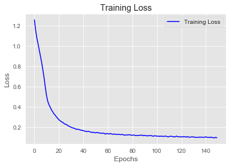


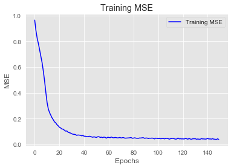


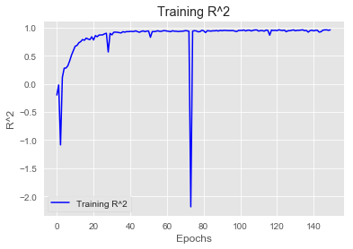


```python
op_preds_scaled = optimized_model.predict(X_test_Scaled)
op_preds = scaler.inverse_transform(op_preds_scaled)
rmse = np.sqrt(mean_squared_error(y_test, op_preds))

print('RMSE:', rmse)
print('-------------------------')
print(optimized_model.summary())
```

    WARNING:tensorflow:5 out of the last 13 calls to <function Model.make_predict_function.<locals>.predict_function at 0x00000131FB742268> triggered tf.function retracing. Tracing is expensive and the excessive number of tracings could be due to (1) creating @tf.function repeatedly in a loop, (2) passing tensors with different shapes, (3) passing Python objects instead of tensors. For (1), please define your @tf.function outside of the loop. For (2), @tf.function has experimental_relax_shapes=True option that relaxes argument shapes that can avoid unnecessary retracing. For (3), please refer to https://www.tensorflow.org/tutorials/customization/performance#python_or_tensor_args and https://www.tensorflow.org/api_docs/python/tf/function for  more details.
    RMSE: 0.23514818247437985
    -------------------------
    Model: "sequential_5"
    _________________________________________________________________
    Layer (type)                 Output Shape              Param #   
    =================================================================
    dense_22 (Dense)             (None, 45)                1350      
    _________________________________________________________________
    dense_23 (Dense)             (None, 15)                690       
    _________________________________________________________________
    dense_24 (Dense)             (None, 3)                 48        
    _________________________________________________________________
    dense_25 (Dense)             (None, 1)                 4         
    =================================================================
    Total params: 2,092
    Trainable params: 2,092
    Non-trainable params: 0
    _________________________________________________________________
    None
    


```python

```
