# Import Data


```python
import pandas as pd
import matplotlib.pyplot as plt
%matplotlib inline

import seaborn as sns
sns.set_style('darkgrid')
import warnings

import scipy
import numpy as np
import tensorflow as tf
from sklearn.preprocessing import StandardScaler, OneHotEncoder, MinMaxScaler
from sklearn.model_selection import train_test_split
from sklearn.metrics import mean_squared_error
from sklearn.model_selection import cross_val_predict

warnings.filterwarnings('ignore')
pd.set_option('display.max_rows', 500)
pd.set_option('display.max_columns', 500)
pd.set_option('display.width', 1000)

np.random.seed(123)

model_df = pd.read_csv('Model Dataset')
print(model_df.shape)
model_df.head()
```

    (657, 38)
    


<div>
<style scoped>
    .dataframe tbody tr th:only-of-type {
        vertical-align: middle;
    }

    .dataframe tbody tr th {
        vertical-align: top;
    }

    .dataframe thead th {
        text-align: right;
    }
</style>
<table border="1" class="dataframe">
  <thead>
    <tr style="text-align: right;">
      <th></th>
      <th>Unnamed: 0</th>
      <th>ID</th>
      <th>Non_combust_wt_%</th>
      <th>Organics_wt_%</th>
      <th>Paper_and_cardboard_wt_%</th>
      <th>Plastics_wt_%</th>
      <th>Total_weight_(kg)</th>
      <th>aluminium_cans</th>
      <th>aluminium_recyclable</th>
      <th>batteries</th>
      <th>bottles_cds</th>
      <th>bottles_wine_and_spirits</th>
      <th>cardboard</th>
      <th>ceramics</th>
      <th>drinkbags</th>
      <th>electrical_items_and_peripherals_(incl_tvs)</th>
      <th>energy_kWh_per_kg</th>
      <th>eps</th>
      <th>feminine_hygiene</th>
      <th>flexibles_film</th>
      <th>food</th>
      <th>hdpe_bottles</th>
      <th>jars</th>
      <th>lpb</th>
      <th>nappies</th>
      <th>other</th>
      <th>other_glass</th>
      <th>other_metal</th>
      <th>other_organics</th>
      <th>other_plastic</th>
      <th>other_sanitary_waste</th>
      <th>paper</th>
      <th>pet_bottles</th>
      <th>plastic_bags</th>
      <th>pp</th>
      <th>steel_cans</th>
      <th>textiles</th>
      <th>total_energy_kWh</th>
    </tr>
  </thead>
  <tbody>
    <tr>
      <th>0</th>
      <td>0</td>
      <td>1_B</td>
      <td>0.000000</td>
      <td>0.235955</td>
      <td>0.359551</td>
      <td>0.404494</td>
      <td>0.534</td>
      <td>0.000</td>
      <td>0.000</td>
      <td>0.0</td>
      <td>0.0</td>
      <td>0.0</td>
      <td>0.192</td>
      <td>0.0</td>
      <td>0.0000</td>
      <td>0.0</td>
      <td>1.30</td>
      <td>0.010</td>
      <td>0.126</td>
      <td>0.066</td>
      <td>0.000</td>
      <td>0.000</td>
      <td>0.00</td>
      <td>0.000</td>
      <td>0.000</td>
      <td>0.0</td>
      <td>0.0</td>
      <td>0.0</td>
      <td>0.000</td>
      <td>0.067</td>
      <td>0.000</td>
      <td>0.000</td>
      <td>0.030</td>
      <td>0.026</td>
      <td>0.017</td>
      <td>0.000</td>
      <td>0.000</td>
      <td>0.69</td>
    </tr>
    <tr>
      <th>1</th>
      <td>1</td>
      <td>2_B</td>
      <td>0.062102</td>
      <td>0.738022</td>
      <td>0.016245</td>
      <td>0.183632</td>
      <td>4.863</td>
      <td>0.013</td>
      <td>0.029</td>
      <td>0.0</td>
      <td>0.0</td>
      <td>0.0</td>
      <td>0.000</td>
      <td>0.0</td>
      <td>0.0115</td>
      <td>0.0</td>
      <td>2.76</td>
      <td>0.003</td>
      <td>0.000</td>
      <td>0.196</td>
      <td>2.989</td>
      <td>0.203</td>
      <td>0.26</td>
      <td>0.009</td>
      <td>0.063</td>
      <td>0.0</td>
      <td>0.0</td>
      <td>0.0</td>
      <td>0.537</td>
      <td>0.188</td>
      <td>0.000</td>
      <td>0.070</td>
      <td>0.147</td>
      <td>0.058</td>
      <td>0.075</td>
      <td>0.000</td>
      <td>0.000</td>
      <td>13.42</td>
    </tr>
    <tr>
      <th>2</th>
      <td>2</td>
      <td>3_B</td>
      <td>0.020291</td>
      <td>0.894826</td>
      <td>0.016571</td>
      <td>0.068312</td>
      <td>2.957</td>
      <td>0.000</td>
      <td>0.013</td>
      <td>0.0</td>
      <td>0.0</td>
      <td>0.0</td>
      <td>0.000</td>
      <td>0.0</td>
      <td>0.0000</td>
      <td>0.0</td>
      <td>3.03</td>
      <td>0.035</td>
      <td>0.000</td>
      <td>0.012</td>
      <td>1.927</td>
      <td>0.057</td>
      <td>0.00</td>
      <td>0.000</td>
      <td>0.000</td>
      <td>0.0</td>
      <td>0.0</td>
      <td>0.0</td>
      <td>0.000</td>
      <td>0.023</td>
      <td>0.719</td>
      <td>0.031</td>
      <td>0.000</td>
      <td>0.075</td>
      <td>0.000</td>
      <td>0.047</td>
      <td>0.018</td>
      <td>8.96</td>
    </tr>
    <tr>
      <th>3</th>
      <td>3</td>
      <td>4_B</td>
      <td>0.238462</td>
      <td>0.407692</td>
      <td>0.094872</td>
      <td>0.258974</td>
      <td>0.390</td>
      <td>0.000</td>
      <td>0.000</td>
      <td>0.0</td>
      <td>0.0</td>
      <td>0.0</td>
      <td>0.037</td>
      <td>0.0</td>
      <td>0.0050</td>
      <td>0.0</td>
      <td>1.72</td>
      <td>0.003</td>
      <td>0.000</td>
      <td>0.028</td>
      <td>0.000</td>
      <td>0.000</td>
      <td>0.00</td>
      <td>0.000</td>
      <td>0.000</td>
      <td>0.0</td>
      <td>0.0</td>
      <td>0.0</td>
      <td>0.000</td>
      <td>0.000</td>
      <td>0.159</td>
      <td>0.000</td>
      <td>0.000</td>
      <td>0.065</td>
      <td>0.000</td>
      <td>0.093</td>
      <td>0.000</td>
      <td>0.67</td>
    </tr>
    <tr>
      <th>4</th>
      <td>4</td>
      <td>5_B</td>
      <td>0.000000</td>
      <td>0.896653</td>
      <td>0.027299</td>
      <td>0.076048</td>
      <td>3.077</td>
      <td>0.000</td>
      <td>0.000</td>
      <td>0.0</td>
      <td>0.0</td>
      <td>0.0</td>
      <td>0.047</td>
      <td>0.0</td>
      <td>0.0180</td>
      <td>0.0</td>
      <td>3.09</td>
      <td>0.000</td>
      <td>0.071</td>
      <td>0.106</td>
      <td>2.366</td>
      <td>0.000</td>
      <td>0.00</td>
      <td>0.037</td>
      <td>0.000</td>
      <td>0.0</td>
      <td>0.0</td>
      <td>0.0</td>
      <td>0.000</td>
      <td>0.000</td>
      <td>0.322</td>
      <td>0.000</td>
      <td>0.000</td>
      <td>0.068</td>
      <td>0.024</td>
      <td>0.000</td>
      <td>0.000</td>
      <td>9.51</td>
    </tr>
  </tbody>
</table>
</div>


# Modeling

## Remove Outliers


```python
model_df.describe()
```


<div>
<style scoped>
    .dataframe tbody tr th:only-of-type {
        vertical-align: middle;
    }

    .dataframe tbody tr th {
        vertical-align: top;
    }

    .dataframe thead th {
        text-align: right;
    }
</style>
<table border="1" class="dataframe">
  <thead>
    <tr style="text-align: right;">
      <th></th>
      <th>Unnamed: 0</th>
      <th>Non_combust_wt_%</th>
      <th>Organics_wt_%</th>
      <th>Paper_and_cardboard_wt_%</th>
      <th>Plastics_wt_%</th>
      <th>Total_weight_(kg)</th>
      <th>aluminium_cans</th>
      <th>aluminium_recyclable</th>
      <th>batteries</th>
      <th>bottles_cds</th>
      <th>bottles_wine_and_spirits</th>
      <th>cardboard</th>
      <th>ceramics</th>
      <th>drinkbags</th>
      <th>electrical_items_and_peripherals_(incl_tvs)</th>
      <th>energy_kWh_per_kg</th>
      <th>eps</th>
      <th>feminine_hygiene</th>
      <th>flexibles_film</th>
      <th>food</th>
      <th>hdpe_bottles</th>
      <th>jars</th>
      <th>lpb</th>
      <th>nappies</th>
      <th>other</th>
      <th>other_glass</th>
      <th>other_metal</th>
      <th>other_organics</th>
      <th>other_plastic</th>
      <th>other_sanitary_waste</th>
      <th>paper</th>
      <th>pet_bottles</th>
      <th>plastic_bags</th>
      <th>pp</th>
      <th>steel_cans</th>
      <th>textiles</th>
      <th>total_energy_kWh</th>
    </tr>
  </thead>
  <tbody>
    <tr>
      <th>count</th>
      <td>657.000000</td>
      <td>657.000000</td>
      <td>657.000000</td>
      <td>657.000000</td>
      <td>657.000000</td>
      <td>657.000000</td>
      <td>657.000000</td>
      <td>657.000000</td>
      <td>657.000000</td>
      <td>657.000000</td>
      <td>657.000000</td>
      <td>657.000000</td>
      <td>657.000000</td>
      <td>657.000000</td>
      <td>657.000000</td>
      <td>657.000000</td>
      <td>657.000000</td>
      <td>657.000000</td>
      <td>657.000000</td>
      <td>657.000000</td>
      <td>657.000000</td>
      <td>657.000000</td>
      <td>657.000000</td>
      <td>657.000000</td>
      <td>657.000000</td>
      <td>657.000000</td>
      <td>657.000000</td>
      <td>657.000000</td>
      <td>657.000000</td>
      <td>657.000000</td>
      <td>657.000000</td>
      <td>657.000000</td>
      <td>657.000000</td>
      <td>657.000000</td>
      <td>657.000000</td>
      <td>657.000000</td>
      <td>657.000000</td>
    </tr>
    <tr>
      <th>mean</th>
      <td>109.287671</td>
      <td>0.164221</td>
      <td>0.562368</td>
      <td>0.097642</td>
      <td>0.174883</td>
      <td>7.039078</td>
      <td>0.278236</td>
      <td>0.027437</td>
      <td>0.003476</td>
      <td>0.025985</td>
      <td>0.026689</td>
      <td>0.187169</td>
      <td>0.009470</td>
      <td>0.005390</td>
      <td>0.006925</td>
      <td>2.037534</td>
      <td>0.024411</td>
      <td>0.044382</td>
      <td>0.215837</td>
      <td>2.083743</td>
      <td>0.031814</td>
      <td>0.098312</td>
      <td>0.035486</td>
      <td>1.002744</td>
      <td>0.079878</td>
      <td>0.002893</td>
      <td>0.026321</td>
      <td>1.572169</td>
      <td>0.106202</td>
      <td>0.073056</td>
      <td>0.118170</td>
      <td>0.227420</td>
      <td>0.175761</td>
      <td>0.017618</td>
      <td>0.346152</td>
      <td>0.184600</td>
      <td>16.829696</td>
    </tr>
    <tr>
      <th>std</th>
      <td>63.756954</td>
      <td>0.212095</td>
      <td>0.328298</td>
      <td>0.142824</td>
      <td>0.184810</td>
      <td>7.905361</td>
      <td>0.903705</td>
      <td>0.134408</td>
      <td>0.027986</td>
      <td>0.187057</td>
      <td>0.198246</td>
      <td>0.449210</td>
      <td>0.074386</td>
      <td>0.033875</td>
      <td>0.065450</td>
      <td>1.064171</td>
      <td>0.061599</td>
      <td>0.171813</td>
      <td>0.342665</td>
      <td>3.639778</td>
      <td>0.085608</td>
      <td>0.329199</td>
      <td>0.135543</td>
      <td>3.389378</td>
      <td>0.338525</td>
      <td>0.033120</td>
      <td>0.201365</td>
      <td>4.954004</td>
      <td>0.301088</td>
      <td>0.315111</td>
      <td>0.258696</td>
      <td>0.481947</td>
      <td>0.486143</td>
      <td>0.096537</td>
      <td>0.737697</td>
      <td>0.812959</td>
      <td>22.966856</td>
    </tr>
    <tr>
      <th>min</th>
      <td>0.000000</td>
      <td>0.000000</td>
      <td>0.000000</td>
      <td>0.000000</td>
      <td>0.000000</td>
      <td>0.056000</td>
      <td>0.000000</td>
      <td>0.000000</td>
      <td>0.000000</td>
      <td>0.000000</td>
      <td>0.000000</td>
      <td>0.000000</td>
      <td>0.000000</td>
      <td>0.000000</td>
      <td>0.000000</td>
      <td>0.000000</td>
      <td>0.000000</td>
      <td>0.000000</td>
      <td>0.000000</td>
      <td>0.000000</td>
      <td>0.000000</td>
      <td>0.000000</td>
      <td>0.000000</td>
      <td>0.000000</td>
      <td>0.000000</td>
      <td>0.000000</td>
      <td>0.000000</td>
      <td>0.000000</td>
      <td>0.000000</td>
      <td>0.000000</td>
      <td>0.000000</td>
      <td>0.000000</td>
      <td>0.000000</td>
      <td>0.000000</td>
      <td>0.000000</td>
      <td>0.000000</td>
      <td>0.000000</td>
    </tr>
    <tr>
      <th>25%</th>
      <td>54.000000</td>
      <td>0.018805</td>
      <td>0.283636</td>
      <td>0.002865</td>
      <td>0.045108</td>
      <td>2.161000</td>
      <td>0.000000</td>
      <td>0.000000</td>
      <td>0.000000</td>
      <td>0.000000</td>
      <td>0.000000</td>
      <td>0.000000</td>
      <td>0.000000</td>
      <td>0.000000</td>
      <td>0.000000</td>
      <td>1.300000</td>
      <td>0.000000</td>
      <td>0.000000</td>
      <td>0.031000</td>
      <td>0.000000</td>
      <td>0.000000</td>
      <td>0.000000</td>
      <td>0.000000</td>
      <td>0.000000</td>
      <td>0.000000</td>
      <td>0.000000</td>
      <td>0.000000</td>
      <td>0.000000</td>
      <td>0.000000</td>
      <td>0.000000</td>
      <td>0.000000</td>
      <td>0.000000</td>
      <td>0.000000</td>
      <td>0.000000</td>
      <td>0.000000</td>
      <td>0.000000</td>
      <td>2.710000</td>
    </tr>
    <tr>
      <th>50%</th>
      <td>109.000000</td>
      <td>0.077644</td>
      <td>0.628221</td>
      <td>0.044877</td>
      <td>0.116012</td>
      <td>4.552000</td>
      <td>0.000000</td>
      <td>0.000000</td>
      <td>0.000000</td>
      <td>0.000000</td>
      <td>0.000000</td>
      <td>0.000000</td>
      <td>0.000000</td>
      <td>0.000000</td>
      <td>0.000000</td>
      <td>2.480000</td>
      <td>0.000000</td>
      <td>0.000000</td>
      <td>0.096000</td>
      <td>0.562000</td>
      <td>0.000000</td>
      <td>0.000000</td>
      <td>0.000000</td>
      <td>0.000000</td>
      <td>0.000000</td>
      <td>0.000000</td>
      <td>0.000000</td>
      <td>0.000000</td>
      <td>0.018000</td>
      <td>0.000000</td>
      <td>0.004000</td>
      <td>0.088000</td>
      <td>0.048000</td>
      <td>0.000000</td>
      <td>0.078000</td>
      <td>0.000000</td>
      <td>9.270000</td>
    </tr>
    <tr>
      <th>75%</th>
      <td>164.000000</td>
      <td>0.219512</td>
      <td>0.854651</td>
      <td>0.118399</td>
      <td>0.232143</td>
      <td>8.460000</td>
      <td>0.084000</td>
      <td>0.006000</td>
      <td>0.000000</td>
      <td>0.000000</td>
      <td>0.000000</td>
      <td>0.159000</td>
      <td>0.000000</td>
      <td>0.000000</td>
      <td>0.000000</td>
      <td>2.940000</td>
      <td>0.014000</td>
      <td>0.000000</td>
      <td>0.252000</td>
      <td>2.754000</td>
      <td>0.018000</td>
      <td>0.000000</td>
      <td>0.011000</td>
      <td>0.000000</td>
      <td>0.000000</td>
      <td>0.000000</td>
      <td>0.000000</td>
      <td>0.338000</td>
      <td>0.096000</td>
      <td>0.000000</td>
      <td>0.115000</td>
      <td>0.236000</td>
      <td>0.168000</td>
      <td>0.004000</td>
      <td>0.343000</td>
      <td>0.028000</td>
      <td>20.450000</td>
    </tr>
    <tr>
      <th>max</th>
      <td>230.000000</td>
      <td>0.998243</td>
      <td>1.000000</td>
      <td>0.899387</td>
      <td>1.000000</td>
      <td>59.815000</td>
      <td>8.612000</td>
      <td>1.840000</td>
      <td>0.356000</td>
      <td>3.670000</td>
      <td>2.873000</td>
      <td>4.242000</td>
      <td>1.122000</td>
      <td>0.509000</td>
      <td>0.862000</td>
      <td>3.120000</td>
      <td>0.574000</td>
      <td>1.580000</td>
      <td>3.228000</td>
      <td>29.239000</td>
      <td>0.912000</td>
      <td>5.362000</td>
      <td>1.860000</td>
      <td>36.750000</td>
      <td>4.494000</td>
      <td>0.616000</td>
      <td>4.306000</td>
      <td>56.020000</td>
      <td>4.904000</td>
      <td>3.280000</td>
      <td>2.408000</td>
      <td>6.804000</td>
      <td>6.048000</td>
      <td>2.008000</td>
      <td>6.452000</td>
      <td>15.806000</td>
      <td>175.410000</td>
    </tr>
  </tbody>
</table>
</div>


### Total Weight (kg)


```python
model_df[model_df['Total_weight_(kg)'] < 16]['Total_weight_(kg)'].hist();
```


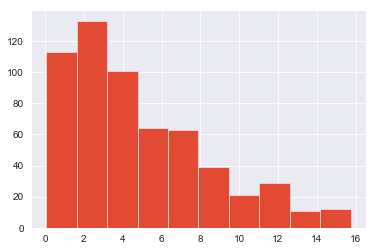


```python
print('Old length:', len(model_df))
print('New length:', len(model_df[model_df['total_energy_kWh'] > 0]))
model_df = model_df[model_df['total_energy_kWh'] > 0]
model_df.describe()
```

    Old length: 657
    New length: 586
    


<div>
<style scoped>
    .dataframe tbody tr th:only-of-type {
        vertical-align: middle;
    }

    .dataframe tbody tr th {
        vertical-align: top;
    }

    .dataframe thead th {
        text-align: right;
    }
</style>
<table border="1" class="dataframe">
  <thead>
    <tr style="text-align: right;">
      <th></th>
      <th>Unnamed: 0</th>
      <th>Non_combust_wt_%</th>
      <th>Organics_wt_%</th>
      <th>Paper_and_cardboard_wt_%</th>
      <th>Plastics_wt_%</th>
      <th>Total_weight_(kg)</th>
      <th>aluminium_cans</th>
      <th>aluminium_recyclable</th>
      <th>batteries</th>
      <th>bottles_cds</th>
      <th>bottles_wine_and_spirits</th>
      <th>cardboard</th>
      <th>ceramics</th>
      <th>drinkbags</th>
      <th>electrical_items_and_peripherals_(incl_tvs)</th>
      <th>energy_kWh_per_kg</th>
      <th>eps</th>
      <th>feminine_hygiene</th>
      <th>flexibles_film</th>
      <th>food</th>
      <th>hdpe_bottles</th>
      <th>jars</th>
      <th>lpb</th>
      <th>nappies</th>
      <th>other</th>
      <th>other_glass</th>
      <th>other_metal</th>
      <th>other_organics</th>
      <th>other_plastic</th>
      <th>other_sanitary_waste</th>
      <th>paper</th>
      <th>pet_bottles</th>
      <th>plastic_bags</th>
      <th>pp</th>
      <th>steel_cans</th>
      <th>textiles</th>
      <th>total_energy_kWh</th>
    </tr>
  </thead>
  <tbody>
    <tr>
      <th>count</th>
      <td>586.000000</td>
      <td>586.000000</td>
      <td>586.000000</td>
      <td>586.000000</td>
      <td>586.000000</td>
      <td>586.000000</td>
      <td>586.00000</td>
      <td>586.000000</td>
      <td>586.000000</td>
      <td>586.000000</td>
      <td>586.000000</td>
      <td>586.000000</td>
      <td>586.000000</td>
      <td>586.000000</td>
      <td>586.000000</td>
      <td>586.000000</td>
      <td>586.000000</td>
      <td>586.000000</td>
      <td>586.000000</td>
      <td>586.000000</td>
      <td>586.000000</td>
      <td>586.000000</td>
      <td>586.000000</td>
      <td>586.000000</td>
      <td>586.000000</td>
      <td>586.000000</td>
      <td>586.000000</td>
      <td>586.000000</td>
      <td>586.000000</td>
      <td>586.000000</td>
      <td>586.000000</td>
      <td>586.000000</td>
      <td>586.000000</td>
      <td>586.000000</td>
      <td>586.000000</td>
      <td>586.000000</td>
      <td>586.000000</td>
    </tr>
    <tr>
      <th>mean</th>
      <td>106.073379</td>
      <td>0.134367</td>
      <td>0.630505</td>
      <td>0.087085</td>
      <td>0.147051</td>
      <td>7.618173</td>
      <td>0.25152</td>
      <td>0.029147</td>
      <td>0.003898</td>
      <td>0.026519</td>
      <td>0.020462</td>
      <td>0.194246</td>
      <td>0.007824</td>
      <td>0.005555</td>
      <td>0.007166</td>
      <td>2.284403</td>
      <td>0.026384</td>
      <td>0.049759</td>
      <td>0.222308</td>
      <td>2.336210</td>
      <td>0.033171</td>
      <td>0.101196</td>
      <td>0.038166</td>
      <td>1.124237</td>
      <td>0.085688</td>
      <td>0.003022</td>
      <td>0.029156</td>
      <td>1.762654</td>
      <td>0.113937</td>
      <td>0.081908</td>
      <td>0.126618</td>
      <td>0.226881</td>
      <td>0.175517</td>
      <td>0.019394</td>
      <td>0.321509</td>
      <td>0.192631</td>
      <td>18.868788</td>
    </tr>
    <tr>
      <th>std</th>
      <td>64.153473</td>
      <td>0.169104</td>
      <td>0.278974</td>
      <td>0.122657</td>
      <td>0.144996</td>
      <td>8.125326</td>
      <td>0.85164</td>
      <td>0.140723</td>
      <td>0.029608</td>
      <td>0.189857</td>
      <td>0.160275</td>
      <td>0.457601</td>
      <td>0.070767</td>
      <td>0.034206</td>
      <td>0.068399</td>
      <td>0.839638</td>
      <td>0.064155</td>
      <td>0.181202</td>
      <td>0.350437</td>
      <td>3.776908</td>
      <td>0.087942</td>
      <td>0.335554</td>
      <td>0.142816</td>
      <td>3.570059</td>
      <td>0.356283</td>
      <td>0.034662</td>
      <td>0.212890</td>
      <td>5.213870</td>
      <td>0.316792</td>
      <td>0.332596</td>
      <td>0.266703</td>
      <td>0.484771</td>
      <td>0.448975</td>
      <td>0.102026</td>
      <td>0.691295</td>
      <td>0.841872</td>
      <td>23.514974</td>
    </tr>
    <tr>
      <th>min</th>
      <td>0.000000</td>
      <td>0.000000</td>
      <td>0.003579</td>
      <td>0.000000</td>
      <td>0.000000</td>
      <td>0.056000</td>
      <td>0.00000</td>
      <td>0.000000</td>
      <td>0.000000</td>
      <td>0.000000</td>
      <td>0.000000</td>
      <td>0.000000</td>
      <td>0.000000</td>
      <td>0.000000</td>
      <td>0.000000</td>
      <td>0.020000</td>
      <td>0.000000</td>
      <td>0.000000</td>
      <td>0.000000</td>
      <td>0.000000</td>
      <td>0.000000</td>
      <td>0.000000</td>
      <td>0.000000</td>
      <td>0.000000</td>
      <td>0.000000</td>
      <td>0.000000</td>
      <td>0.000000</td>
      <td>0.000000</td>
      <td>0.000000</td>
      <td>0.000000</td>
      <td>0.000000</td>
      <td>0.000000</td>
      <td>0.000000</td>
      <td>0.000000</td>
      <td>0.000000</td>
      <td>0.000000</td>
      <td>0.070000</td>
    </tr>
    <tr>
      <th>25%</th>
      <td>50.250000</td>
      <td>0.017861</td>
      <td>0.419896</td>
      <td>0.003361</td>
      <td>0.039520</td>
      <td>2.529000</td>
      <td>0.00000</td>
      <td>0.000000</td>
      <td>0.000000</td>
      <td>0.000000</td>
      <td>0.000000</td>
      <td>0.000000</td>
      <td>0.000000</td>
      <td>0.000000</td>
      <td>0.000000</td>
      <td>1.742500</td>
      <td>0.000000</td>
      <td>0.000000</td>
      <td>0.036000</td>
      <td>0.000000</td>
      <td>0.000000</td>
      <td>0.000000</td>
      <td>0.000000</td>
      <td>0.000000</td>
      <td>0.000000</td>
      <td>0.000000</td>
      <td>0.000000</td>
      <td>0.000000</td>
      <td>0.000000</td>
      <td>0.000000</td>
      <td>0.000000</td>
      <td>0.000000</td>
      <td>0.000000</td>
      <td>0.000000</td>
      <td>0.000000</td>
      <td>0.000000</td>
      <td>4.755000</td>
    </tr>
    <tr>
      <th>50%</th>
      <td>103.000000</td>
      <td>0.068807</td>
      <td>0.685711</td>
      <td>0.042050</td>
      <td>0.103559</td>
      <td>4.906000</td>
      <td>0.00000</td>
      <td>0.000000</td>
      <td>0.000000</td>
      <td>0.000000</td>
      <td>0.000000</td>
      <td>0.000000</td>
      <td>0.000000</td>
      <td>0.000000</td>
      <td>0.000000</td>
      <td>2.620000</td>
      <td>0.000000</td>
      <td>0.000000</td>
      <td>0.101000</td>
      <td>0.791000</td>
      <td>0.000000</td>
      <td>0.000000</td>
      <td>0.000000</td>
      <td>0.000000</td>
      <td>0.000000</td>
      <td>0.000000</td>
      <td>0.000000</td>
      <td>0.000000</td>
      <td>0.020000</td>
      <td>0.000000</td>
      <td>0.010000</td>
      <td>0.088000</td>
      <td>0.053500</td>
      <td>0.000000</td>
      <td>0.078000</td>
      <td>0.000000</td>
      <td>11.000000</td>
    </tr>
    <tr>
      <th>75%</th>
      <td>161.000000</td>
      <td>0.181555</td>
      <td>0.871793</td>
      <td>0.110851</td>
      <td>0.204231</td>
      <td>9.231000</td>
      <td>0.08000</td>
      <td>0.007000</td>
      <td>0.000000</td>
      <td>0.000000</td>
      <td>0.000000</td>
      <td>0.175500</td>
      <td>0.000000</td>
      <td>0.000000</td>
      <td>0.000000</td>
      <td>2.970000</td>
      <td>0.024000</td>
      <td>0.000000</td>
      <td>0.258000</td>
      <td>3.067500</td>
      <td>0.020750</td>
      <td>0.000000</td>
      <td>0.012000</td>
      <td>0.057250</td>
      <td>0.000000</td>
      <td>0.000000</td>
      <td>0.000000</td>
      <td>0.663000</td>
      <td>0.100000</td>
      <td>0.000000</td>
      <td>0.130000</td>
      <td>0.232000</td>
      <td>0.179000</td>
      <td>0.005000</td>
      <td>0.304750</td>
      <td>0.033750</td>
      <td>22.677500</td>
    </tr>
    <tr>
      <th>max</th>
      <td>230.000000</td>
      <td>0.926819</td>
      <td>1.000000</td>
      <td>0.823762</td>
      <td>0.860902</td>
      <td>59.815000</td>
      <td>8.61200</td>
      <td>1.840000</td>
      <td>0.356000</td>
      <td>3.670000</td>
      <td>2.873000</td>
      <td>4.242000</td>
      <td>1.122000</td>
      <td>0.509000</td>
      <td>0.862000</td>
      <td>3.120000</td>
      <td>0.574000</td>
      <td>1.580000</td>
      <td>3.228000</td>
      <td>29.239000</td>
      <td>0.912000</td>
      <td>5.362000</td>
      <td>1.860000</td>
      <td>36.750000</td>
      <td>4.494000</td>
      <td>0.616000</td>
      <td>4.306000</td>
      <td>56.020000</td>
      <td>4.904000</td>
      <td>3.280000</td>
      <td>2.408000</td>
      <td>6.804000</td>
      <td>5.256000</td>
      <td>2.008000</td>
      <td>6.452000</td>
      <td>15.806000</td>
      <td>175.410000</td>
    </tr>
  </tbody>
</table>
</div>


### Total Weight (kg)


```python
model_df[model_df['total_energy_kWh'] > 0]['total_energy_kWh'].hist();
```


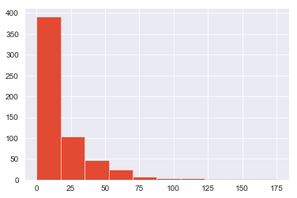


```python
print('Old length:', len(model_df))
print('New length:', len(model_df[model_df['Total_weight_(kg)'] < 16]))
model_df = model_df[model_df['Total_weight_(kg)'] < 16]
model_df.describe()
```

    Old length: 586
    New length: 516
    


<div>
<style scoped>
    .dataframe tbody tr th:only-of-type {
        vertical-align: middle;
    }

    .dataframe tbody tr th {
        vertical-align: top;
    }

    .dataframe thead th {
        text-align: right;
    }
</style>
<table border="1" class="dataframe">
  <thead>
    <tr style="text-align: right;">
      <th></th>
      <th>Unnamed: 0</th>
      <th>Non_combust_wt_%</th>
      <th>Organics_wt_%</th>
      <th>Paper_and_cardboard_wt_%</th>
      <th>Plastics_wt_%</th>
      <th>Total_weight_(kg)</th>
      <th>aluminium_cans</th>
      <th>aluminium_recyclable</th>
      <th>batteries</th>
      <th>bottles_cds</th>
      <th>bottles_wine_and_spirits</th>
      <th>cardboard</th>
      <th>ceramics</th>
      <th>drinkbags</th>
      <th>electrical_items_and_peripherals_(incl_tvs)</th>
      <th>energy_kWh_per_kg</th>
      <th>eps</th>
      <th>feminine_hygiene</th>
      <th>flexibles_film</th>
      <th>food</th>
      <th>hdpe_bottles</th>
      <th>jars</th>
      <th>lpb</th>
      <th>nappies</th>
      <th>other</th>
      <th>other_glass</th>
      <th>other_metal</th>
      <th>other_organics</th>
      <th>other_plastic</th>
      <th>other_sanitary_waste</th>
      <th>paper</th>
      <th>pet_bottles</th>
      <th>plastic_bags</th>
      <th>pp</th>
      <th>steel_cans</th>
      <th>textiles</th>
      <th>total_energy_kWh</th>
    </tr>
  </thead>
  <tbody>
    <tr>
      <th>count</th>
      <td>516.000000</td>
      <td>516.000000</td>
      <td>516.000000</td>
      <td>516.000000</td>
      <td>516.000000</td>
      <td>516.000000</td>
      <td>516.000000</td>
      <td>516.000000</td>
      <td>516.000000</td>
      <td>516.000000</td>
      <td>516.000000</td>
      <td>516.000000</td>
      <td>516.000000</td>
      <td>516.000000</td>
      <td>516.000000</td>
      <td>516.000000</td>
      <td>516.000000</td>
      <td>516.000000</td>
      <td>516.000000</td>
      <td>516.000000</td>
      <td>516.000000</td>
      <td>516.000000</td>
      <td>516.000000</td>
      <td>516.000000</td>
      <td>516.000000</td>
      <td>516.000000</td>
      <td>516.000000</td>
      <td>516.000000</td>
      <td>516.000000</td>
      <td>516.000000</td>
      <td>516.000000</td>
      <td>516.000000</td>
      <td>516.000000</td>
      <td>516.000000</td>
      <td>516.000000</td>
      <td>516.000000</td>
      <td>516.000000</td>
    </tr>
    <tr>
      <th>mean</th>
      <td>110.676357</td>
      <td>0.141575</td>
      <td>0.610547</td>
      <td>0.090113</td>
      <td>0.156637</td>
      <td>5.223431</td>
      <td>0.199983</td>
      <td>0.024217</td>
      <td>0.002147</td>
      <td>0.030116</td>
      <td>0.023238</td>
      <td>0.147915</td>
      <td>0.005998</td>
      <td>0.006309</td>
      <td>0.004107</td>
      <td>2.227578</td>
      <td>0.026977</td>
      <td>0.056083</td>
      <td>0.179067</td>
      <td>1.701150</td>
      <td>0.034548</td>
      <td>0.091444</td>
      <td>0.032537</td>
      <td>0.651723</td>
      <td>0.062072</td>
      <td>0.003432</td>
      <td>0.019728</td>
      <td>0.896434</td>
      <td>0.091599</td>
      <td>0.091713</td>
      <td>0.112634</td>
      <td>0.181076</td>
      <td>0.140967</td>
      <td>0.015632</td>
      <td>0.273866</td>
      <td>0.115027</td>
      <td>12.109748</td>
    </tr>
    <tr>
      <th>std</th>
      <td>63.054807</td>
      <td>0.173728</td>
      <td>0.283029</td>
      <td>0.126608</td>
      <td>0.149067</td>
      <td>3.635338</td>
      <td>0.756555</td>
      <td>0.104719</td>
      <td>0.022486</td>
      <td>0.202081</td>
      <td>0.170631</td>
      <td>0.331126</td>
      <td>0.065309</td>
      <td>0.036391</td>
      <td>0.049133</td>
      <td>0.859181</td>
      <td>0.063719</td>
      <td>0.192178</td>
      <td>0.288849</td>
      <td>2.294945</td>
      <td>0.083585</td>
      <td>0.246646</td>
      <td>0.138367</td>
      <td>1.984713</td>
      <td>0.240087</td>
      <td>0.036923</td>
      <td>0.114199</td>
      <td>2.250055</td>
      <td>0.274567</td>
      <td>0.352108</td>
      <td>0.227172</td>
      <td>0.328292</td>
      <td>0.382436</td>
      <td>0.060521</td>
      <td>0.586254</td>
      <td>0.414171</td>
      <td>10.445627</td>
    </tr>
    <tr>
      <th>min</th>
      <td>0.000000</td>
      <td>0.000000</td>
      <td>0.003579</td>
      <td>0.000000</td>
      <td>0.000000</td>
      <td>0.056000</td>
      <td>0.000000</td>
      <td>0.000000</td>
      <td>0.000000</td>
      <td>0.000000</td>
      <td>0.000000</td>
      <td>0.000000</td>
      <td>0.000000</td>
      <td>0.000000</td>
      <td>0.000000</td>
      <td>0.020000</td>
      <td>0.000000</td>
      <td>0.000000</td>
      <td>0.000000</td>
      <td>0.000000</td>
      <td>0.000000</td>
      <td>0.000000</td>
      <td>0.000000</td>
      <td>0.000000</td>
      <td>0.000000</td>
      <td>0.000000</td>
      <td>0.000000</td>
      <td>0.000000</td>
      <td>0.000000</td>
      <td>0.000000</td>
      <td>0.000000</td>
      <td>0.000000</td>
      <td>0.000000</td>
      <td>0.000000</td>
      <td>0.000000</td>
      <td>0.000000</td>
      <td>0.070000</td>
    </tr>
    <tr>
      <th>25%</th>
      <td>58.750000</td>
      <td>0.019392</td>
      <td>0.395613</td>
      <td>0.003385</td>
      <td>0.044443</td>
      <td>2.246500</td>
      <td>0.000000</td>
      <td>0.000000</td>
      <td>0.000000</td>
      <td>0.000000</td>
      <td>0.000000</td>
      <td>0.000000</td>
      <td>0.000000</td>
      <td>0.000000</td>
      <td>0.000000</td>
      <td>1.645000</td>
      <td>0.000000</td>
      <td>0.000000</td>
      <td>0.031000</td>
      <td>0.000000</td>
      <td>0.000000</td>
      <td>0.000000</td>
      <td>0.000000</td>
      <td>0.000000</td>
      <td>0.000000</td>
      <td>0.000000</td>
      <td>0.000000</td>
      <td>0.000000</td>
      <td>0.000000</td>
      <td>0.000000</td>
      <td>0.000000</td>
      <td>0.000000</td>
      <td>0.000000</td>
      <td>0.000000</td>
      <td>0.000000</td>
      <td>0.000000</td>
      <td>4.145000</td>
    </tr>
    <tr>
      <th>50%</th>
      <td>109.000000</td>
      <td>0.076120</td>
      <td>0.667773</td>
      <td>0.043399</td>
      <td>0.116282</td>
      <td>4.318000</td>
      <td>0.000000</td>
      <td>0.000000</td>
      <td>0.000000</td>
      <td>0.000000</td>
      <td>0.000000</td>
      <td>0.000000</td>
      <td>0.000000</td>
      <td>0.000000</td>
      <td>0.000000</td>
      <td>2.540000</td>
      <td>0.000000</td>
      <td>0.000000</td>
      <td>0.088000</td>
      <td>0.721500</td>
      <td>0.000000</td>
      <td>0.000000</td>
      <td>0.000000</td>
      <td>0.000000</td>
      <td>0.000000</td>
      <td>0.000000</td>
      <td>0.000000</td>
      <td>0.000000</td>
      <td>0.016500</td>
      <td>0.000000</td>
      <td>0.012000</td>
      <td>0.081000</td>
      <td>0.052000</td>
      <td>0.000000</td>
      <td>0.069000</td>
      <td>0.000000</td>
      <td>9.270000</td>
    </tr>
    <tr>
      <th>75%</th>
      <td>165.000000</td>
      <td>0.194802</td>
      <td>0.861856</td>
      <td>0.113435</td>
      <td>0.217723</td>
      <td>7.429000</td>
      <td>0.070500</td>
      <td>0.009000</td>
      <td>0.000000</td>
      <td>0.000000</td>
      <td>0.000000</td>
      <td>0.150250</td>
      <td>0.000000</td>
      <td>0.000000</td>
      <td>0.000000</td>
      <td>2.940000</td>
      <td>0.026000</td>
      <td>0.000000</td>
      <td>0.226500</td>
      <td>2.603000</td>
      <td>0.027250</td>
      <td>0.000000</td>
      <td>0.009000</td>
      <td>0.000000</td>
      <td>0.000000</td>
      <td>0.000000</td>
      <td>0.000000</td>
      <td>0.340750</td>
      <td>0.089500</td>
      <td>0.000000</td>
      <td>0.114250</td>
      <td>0.211250</td>
      <td>0.160000</td>
      <td>0.005000</td>
      <td>0.241000</td>
      <td>0.020250</td>
      <td>16.872500</td>
    </tr>
    <tr>
      <th>max</th>
      <td>230.000000</td>
      <td>0.926819</td>
      <td>1.000000</td>
      <td>0.823762</td>
      <td>0.860902</td>
      <td>15.750000</td>
      <td>8.612000</td>
      <td>1.840000</td>
      <td>0.356000</td>
      <td>3.670000</td>
      <td>2.873000</td>
      <td>2.825000</td>
      <td>1.122000</td>
      <td>0.509000</td>
      <td>0.838000</td>
      <td>3.120000</td>
      <td>0.574000</td>
      <td>1.580000</td>
      <td>3.228000</td>
      <td>11.976000</td>
      <td>0.848000</td>
      <td>2.306000</td>
      <td>1.860000</td>
      <td>15.092000</td>
      <td>2.780000</td>
      <td>0.616000</td>
      <td>1.300000</td>
      <td>15.232000</td>
      <td>4.904000</td>
      <td>3.280000</td>
      <td>1.896000</td>
      <td>3.338000</td>
      <td>5.256000</td>
      <td>0.970000</td>
      <td>5.308000</td>
      <td>4.376000</td>
      <td>48.840000</td>
    </tr>
  </tbody>
</table>
</div>


```python
# print('Old length:', len(model_df))
# print('New length:', len(model_df[model_df['total_energy_kWh'] < 150]))
# model_df = model_df[model_df['total_energy_kWh'] < 150]
# model_df.describe()
```

## Remove Unnecessary Features


```python
# X = model_df.drop(['ID',
#                    'total_energy_kWh',
#                    'energy_kWh_per_kg',
#                    'Total_weight_(kg)',
#                    'Organics_wt_%',
#                    'Paper_and_cardboard_wt_%',
#                    'Plastics_wt_%',
#                    'Non_combust_wt_%'],
#                    axis=1)
# y = model_df[['total_energy_kWh']]
```


```python
X = model_df.drop(['ID',
                   'total_energy_kWh',
                   'energy_kWh_per_kg',
                   'Total_weight_(kg)',
                   'Organics_wt_%',
                   'Paper_and_cardboard_wt_%',
                   'Plastics_wt_%',
                   'Non_combust_wt_%'], axis=1)
y = model_df[['energy_kWh_per_kg']]
```

## Train/Test Split


```python
X_train, X_test, y_train, y_test = train_test_split(X, y, test_size=0.15, random_state=42)
```


```python
scaler = StandardScaler()
X_train_Scaled = pd.DataFrame(scaler.fit_transform(X_train), columns=X.columns)
X_test_Scaled = pd.DataFrame(scaler.transform(X_test), columns=X.columns)

y_train_Scaled = scaler.fit_transform(y_train)
y_test_Scaled = scaler.transform(y_test)
```


```python
X_train_Scaled.head()
```


<div>
<style scoped>
    .dataframe tbody tr th:only-of-type {
        vertical-align: middle;
    }

    .dataframe tbody tr th {
        vertical-align: top;
    }

    .dataframe thead th {
        text-align: right;
    }
</style>
<table border="1" class="dataframe">
  <thead>
    <tr style="text-align: right;">
      <th></th>
      <th>Unnamed: 0</th>
      <th>aluminium_cans</th>
      <th>aluminium_recyclable</th>
      <th>batteries</th>
      <th>bottles_cds</th>
      <th>bottles_wine_and_spirits</th>
      <th>cardboard</th>
      <th>ceramics</th>
      <th>drinkbags</th>
      <th>electrical_items_and_peripherals_(incl_tvs)</th>
      <th>eps</th>
      <th>feminine_hygiene</th>
      <th>flexibles_film</th>
      <th>food</th>
      <th>hdpe_bottles</th>
      <th>jars</th>
      <th>lpb</th>
      <th>nappies</th>
      <th>other</th>
      <th>other_glass</th>
      <th>other_metal</th>
      <th>other_organics</th>
      <th>other_plastic</th>
      <th>other_sanitary_waste</th>
      <th>paper</th>
      <th>pet_bottles</th>
      <th>plastic_bags</th>
      <th>pp</th>
      <th>steel_cans</th>
      <th>textiles</th>
    </tr>
  </thead>
  <tbody>
    <tr>
      <th>0</th>
      <td>-0.345164</td>
      <td>-0.270417</td>
      <td>-0.228289</td>
      <td>-0.103834</td>
      <td>-0.14073</td>
      <td>-0.136738</td>
      <td>1.265438</td>
      <td>-0.098466</td>
      <td>-0.154106</td>
      <td>-0.079706</td>
      <td>-0.413417</td>
      <td>-0.30746</td>
      <td>5.950470</td>
      <td>-0.611218</td>
      <td>-0.412176</td>
      <td>0.861347</td>
      <td>-0.170126</td>
      <td>-0.332314</td>
      <td>0.959775</td>
      <td>-0.090284</td>
      <td>-0.16923</td>
      <td>-0.229082</td>
      <td>2.599808</td>
      <td>-0.266459</td>
      <td>2.736695</td>
      <td>0.034459</td>
      <td>-0.321770</td>
      <td>-0.263237</td>
      <td>0.178715</td>
      <td>0.629460</td>
    </tr>
    <tr>
      <th>1</th>
      <td>-1.472678</td>
      <td>-0.270417</td>
      <td>-0.228289</td>
      <td>-0.103834</td>
      <td>-0.14073</td>
      <td>-0.136738</td>
      <td>-0.445976</td>
      <td>-0.098466</td>
      <td>-0.154106</td>
      <td>-0.079706</td>
      <td>0.294467</td>
      <td>-0.30746</td>
      <td>0.281862</td>
      <td>0.121999</td>
      <td>-0.005058</td>
      <td>-0.379311</td>
      <td>-0.105424</td>
      <td>-0.332314</td>
      <td>0.122243</td>
      <td>-0.090284</td>
      <td>-0.16923</td>
      <td>-0.398419</td>
      <td>-0.332371</td>
      <td>3.751712</td>
      <td>-0.182397</td>
      <td>2.210006</td>
      <td>-0.049377</td>
      <td>0.106801</td>
      <td>-0.472867</td>
      <td>-0.276395</td>
    </tr>
    <tr>
      <th>2</th>
      <td>1.068197</td>
      <td>-0.270417</td>
      <td>-0.228289</td>
      <td>-0.103834</td>
      <td>-0.14073</td>
      <td>-0.136738</td>
      <td>-0.215897</td>
      <td>-0.098466</td>
      <td>-0.154106</td>
      <td>-0.079706</td>
      <td>4.636151</td>
      <td>-0.30746</td>
      <td>-0.367938</td>
      <td>1.107798</td>
      <td>3.635061</td>
      <td>-0.379311</td>
      <td>-0.234828</td>
      <td>-0.332314</td>
      <td>-0.260629</td>
      <td>-0.090284</td>
      <td>-0.16923</td>
      <td>-0.398419</td>
      <td>0.074405</td>
      <td>3.968911</td>
      <td>-0.490546</td>
      <td>-0.251950</td>
      <td>-0.083733</td>
      <td>0.338075</td>
      <td>-0.472867</td>
      <td>-0.190893</td>
    </tr>
    <tr>
      <th>3</th>
      <td>-1.107427</td>
      <td>-0.235729</td>
      <td>-0.228289</td>
      <td>-0.103834</td>
      <td>-0.14073</td>
      <td>-0.136738</td>
      <td>-0.445976</td>
      <td>-0.098466</td>
      <td>-0.154106</td>
      <td>-0.079706</td>
      <td>-0.413417</td>
      <td>-0.30746</td>
      <td>0.402679</td>
      <td>-0.734281</td>
      <td>-0.412176</td>
      <td>-0.379311</td>
      <td>-0.234828</td>
      <td>-0.332314</td>
      <td>-0.260629</td>
      <td>-0.090284</td>
      <td>-0.16923</td>
      <td>6.707200</td>
      <td>-0.128983</td>
      <td>-0.266459</td>
      <td>-0.490546</td>
      <td>-0.538359</td>
      <td>-0.164715</td>
      <td>-0.263237</td>
      <td>-0.472867</td>
      <td>-0.276395</td>
    </tr>
    <tr>
      <th>4</th>
      <td>1.290524</td>
      <td>-0.270417</td>
      <td>-0.228289</td>
      <td>-0.103834</td>
      <td>-0.14073</td>
      <td>-0.136738</td>
      <td>-0.124495</td>
      <td>-0.098466</td>
      <td>-0.154106</td>
      <td>-0.079706</td>
      <td>-0.413417</td>
      <td>-0.30746</td>
      <td>-0.191611</td>
      <td>-0.310444</td>
      <td>0.186528</td>
      <td>0.759267</td>
      <td>0.160573</td>
      <td>-0.332314</td>
      <td>5.546261</td>
      <td>-0.090284</td>
      <td>-0.16923</td>
      <td>-0.373695</td>
      <td>0.098134</td>
      <td>-0.266459</td>
      <td>0.317305</td>
      <td>-0.448675</td>
      <td>-0.351218</td>
      <td>-0.263237</td>
      <td>-0.375466</td>
      <td>-0.174717</td>
    </tr>
  </tbody>
</table>
</div>


```python
plt.figure(figsize=(10,7))
sns.heatmap(X_train_Scaled.corr());
```


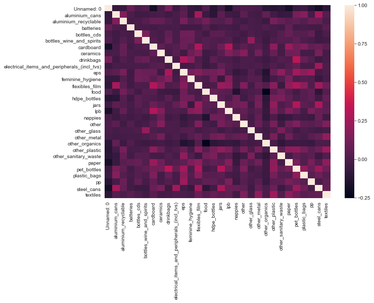


## Statsmodel OLS


```python
from statsmodels.regression.linear_model import OLS
import statsmodels.api as sm
import statsmodels.stats.api as sms
import statsmodels.formula.api as smf
import scipy.stats as stats
plt.style.use('ggplot')

X_int = sm.tools.add_constant(X)
model = OLS(y, X_int).fit()
model.summary()
```


<table class="simpletable">
<caption>OLS Regression Results</caption>
<tr>
  <th>Dep. Variable:</th>    <td>energy_kWh_per_kg</td> <th>  R-squared:         </th> <td>   0.656</td>
</tr>
<tr>
  <th>Model:</th>                   <td>OLS</td>        <th>  Adj. R-squared:    </th> <td>   0.635</td>
</tr>
<tr>
  <th>Method:</th>             <td>Least Squares</td>   <th>  F-statistic:       </th> <td>   30.89</td>
</tr>
<tr>
  <th>Date:</th>             <td>Thu, 29 Oct 2020</td>  <th>  Prob (F-statistic):</th> <td>3.58e-93</td>
</tr>
<tr>
  <th>Time:</th>                 <td>18:24:58</td>      <th>  Log-Likelihood:    </th> <td> -377.68</td>
</tr>
<tr>
  <th>No. Observations:</th>      <td>   516</td>       <th>  AIC:               </th> <td>   817.4</td>
</tr>
<tr>
  <th>Df Residuals:</th>          <td>   485</td>       <th>  BIC:               </th> <td>   949.0</td>
</tr>
<tr>
  <th>Df Model:</th>              <td>    30</td>       <th>                     </th>     <td> </td>   
</tr>
<tr>
  <th>Covariance Type:</th>      <td>nonrobust</td>     <th>                     </th>     <td> </td>   
</tr>
</table>
<table class="simpletable">
<tr>
                       <td></td>                          <th>coef</th>     <th>std err</th>      <th>t</th>      <th>P>|t|</th>  <th>[0.025</th>    <th>0.975]</th>  
</tr>
<tr>
  <th>const</th>                                       <td>    2.1428</td> <td>    0.069</td> <td>   31.253</td> <td> 0.000</td> <td>    2.008</td> <td>    2.278</td>
</tr>
<tr>
  <th>Unnamed: 0</th>                                  <td>    0.0001</td> <td>    0.000</td> <td>    0.295</td> <td> 0.768</td> <td>   -0.001</td> <td>    0.001</td>
</tr>
<tr>
  <th>aluminium_cans</th>                              <td>   -0.2028</td> <td>    0.034</td> <td>   -5.961</td> <td> 0.000</td> <td>   -0.270</td> <td>   -0.136</td>
</tr>
<tr>
  <th>aluminium_recyclable</th>                        <td>   -0.3237</td> <td>    0.229</td> <td>   -1.414</td> <td> 0.158</td> <td>   -0.773</td> <td>    0.126</td>
</tr>
<tr>
  <th>batteries</th>                                   <td>   -2.1449</td> <td>    1.027</td> <td>   -2.088</td> <td> 0.037</td> <td>   -4.164</td> <td>   -0.126</td>
</tr>
<tr>
  <th>bottles_cds</th>                                 <td>   -0.4967</td> <td>    0.116</td> <td>   -4.287</td> <td> 0.000</td> <td>   -0.724</td> <td>   -0.269</td>
</tr>
<tr>
  <th>bottles_wine_and_spirits</th>                    <td>   -0.4613</td> <td>    0.137</td> <td>   -3.375</td> <td> 0.001</td> <td>   -0.730</td> <td>   -0.193</td>
</tr>
<tr>
  <th>cardboard</th>                                   <td>   -0.2538</td> <td>    0.076</td> <td>   -3.334</td> <td> 0.001</td> <td>   -0.403</td> <td>   -0.104</td>
</tr>
<tr>
  <th>ceramics</th>                                    <td>   -0.1024</td> <td>    0.371</td> <td>   -0.276</td> <td> 0.783</td> <td>   -0.832</td> <td>    0.627</td>
</tr>
<tr>
  <th>drinkbags</th>                                   <td>   -0.5503</td> <td>    0.711</td> <td>   -0.774</td> <td> 0.439</td> <td>   -1.948</td> <td>    0.847</td>
</tr>
<tr>
  <th>electrical_items_and_peripherals_(incl_tvs)</th> <td>   -1.1811</td> <td>    0.481</td> <td>   -2.453</td> <td> 0.015</td> <td>   -2.127</td> <td>   -0.235</td>
</tr>
<tr>
  <th>eps</th>                                         <td>   -0.0409</td> <td>    0.425</td> <td>   -0.096</td> <td> 0.923</td> <td>   -0.875</td> <td>    0.794</td>
</tr>
<tr>
  <th>feminine_hygiene</th>                            <td>    0.3852</td> <td>    0.128</td> <td>    3.014</td> <td> 0.003</td> <td>    0.134</td> <td>    0.636</td>
</tr>
<tr>
  <th>flexibles_film</th>                              <td>   -0.1983</td> <td>    0.094</td> <td>   -2.101</td> <td> 0.036</td> <td>   -0.384</td> <td>   -0.013</td>
</tr>
<tr>
  <th>food</th>                                        <td>    0.1644</td> <td>    0.011</td> <td>   15.442</td> <td> 0.000</td> <td>    0.144</td> <td>    0.185</td>
</tr>
<tr>
  <th>hdpe_bottles</th>                                <td>   -0.2324</td> <td>    0.289</td> <td>   -0.805</td> <td> 0.421</td> <td>   -0.799</td> <td>    0.335</td>
</tr>
<tr>
  <th>jars</th>                                        <td>   -0.4181</td> <td>    0.105</td> <td>   -3.997</td> <td> 0.000</td> <td>   -0.624</td> <td>   -0.213</td>
</tr>
<tr>
  <th>lpb</th>                                         <td>    0.0503</td> <td>    0.183</td> <td>    0.275</td> <td> 0.784</td> <td>   -0.309</td> <td>    0.410</td>
</tr>
<tr>
  <th>nappies</th>                                     <td>    0.1185</td> <td>    0.012</td> <td>    9.861</td> <td> 0.000</td> <td>    0.095</td> <td>    0.142</td>
</tr>
<tr>
  <th>other</th>                                       <td>   -0.2929</td> <td>    0.100</td> <td>   -2.923</td> <td> 0.004</td> <td>   -0.490</td> <td>   -0.096</td>
</tr>
<tr>
  <th>other_glass</th>                                 <td>   -0.9992</td> <td>    0.629</td> <td>   -1.588</td> <td> 0.113</td> <td>   -2.235</td> <td>    0.237</td>
</tr>
<tr>
  <th>other_metal</th>                                 <td>   -0.2892</td> <td>    0.212</td> <td>   -1.363</td> <td> 0.174</td> <td>   -0.706</td> <td>    0.128</td>
</tr>
<tr>
  <th>other_organics</th>                              <td>    0.1258</td> <td>    0.011</td> <td>   11.477</td> <td> 0.000</td> <td>    0.104</td> <td>    0.147</td>
</tr>
<tr>
  <th>other_plastic</th>                               <td>   -0.1030</td> <td>    0.092</td> <td>   -1.119</td> <td> 0.264</td> <td>   -0.284</td> <td>    0.078</td>
</tr>
<tr>
  <th>other_sanitary_waste</th>                        <td>    0.2848</td> <td>    0.069</td> <td>    4.121</td> <td> 0.000</td> <td>    0.149</td> <td>    0.421</td>
</tr>
<tr>
  <th>paper</th>                                       <td>   -0.2390</td> <td>    0.111</td> <td>   -2.160</td> <td> 0.031</td> <td>   -0.456</td> <td>   -0.022</td>
</tr>
<tr>
  <th>pet_bottles</th>                                 <td>   -0.2000</td> <td>    0.084</td> <td>   -2.378</td> <td> 0.018</td> <td>   -0.365</td> <td>   -0.035</td>
</tr>
<tr>
  <th>plastic_bags</th>                                <td>   -0.1765</td> <td>    0.064</td> <td>   -2.753</td> <td> 0.006</td> <td>   -0.303</td> <td>   -0.051</td>
</tr>
<tr>
  <th>pp</th>                                          <td>   -0.0627</td> <td>    0.399</td> <td>   -0.157</td> <td> 0.875</td> <td>   -0.847</td> <td>    0.722</td>
</tr>
<tr>
  <th>steel_cans</th>                                  <td>   -0.3269</td> <td>    0.046</td> <td>   -7.185</td> <td> 0.000</td> <td>   -0.416</td> <td>   -0.238</td>
</tr>
<tr>
  <th>textiles</th>                                    <td>   -0.2079</td> <td>    0.059</td> <td>   -3.528</td> <td> 0.000</td> <td>   -0.324</td> <td>   -0.092</td>
</tr>
</table>
<table class="simpletable">
<tr>
  <th>Omnibus:</th>       <td>91.220</td> <th>  Durbin-Watson:     </th> <td>   2.019</td>
</tr>
<tr>
  <th>Prob(Omnibus):</th> <td> 0.000</td> <th>  Jarque-Bera (JB):  </th> <td> 148.331</td>
</tr>
<tr>
  <th>Skew:</th>          <td>-1.091</td> <th>  Prob(JB):          </th> <td>6.17e-33</td>
</tr>
<tr>
  <th>Kurtosis:</th>      <td> 4.462</td> <th>  Cond. No.          </th> <td>5.73e+03</td>
</tr>
</table><br/><br/>Notes:<br/>[1] Standard Errors assume that the covariance matrix of the errors is correctly specified.<br/>[2] The condition number is large, 5.73e+03. This might indicate that there are<br/>strong multicollinearity or other numerical problems.


```python
# from statsmodels.regression.linear_model import OLS
# import statsmodels.api as sm
# import statsmodels.stats.api as sms
# import statsmodels.formula.api as smf
# import scipy.stats as stats
# plt.style.use('ggplot')

# X_int = sm.tools.add_constant(X)
# model = OLS(y, X_int).fit()
# model.summary()
```


```python
#
# results = []
# print('Model Residuals Plot')
# print('--------------------')
# fig = sm.graphics.qqplot(model.resid, dist=stats.norm, line='45', fit=True)
# plt.show()
# for idx, column in enumerate(X.columns):
#     print(f'Belize MSW Regression Plot for {column} Feature')
#     print('------------------------------------------------')
    
#     fig, axes = plt.subplots(figsize=(15,12))
#     fig = sm.graphics.plot_regress_exog(model, column, fig=fig)
#     fig.tight_layout()
#     plt.show()
    
#     input('Press ENTER to continue...')
```


```python
# Plot redisuals from Statsmodel OLS
plt.scatter(model.predict(X_int), scaler.inverse_transform(model.resid))
plt.plot(model.predict(X_int), [0 for i in range(len(X_int))]);
```


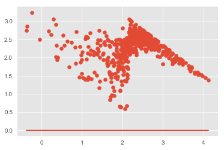


```python
model.predict(X_int)
```


    0      2.110590
    1      2.416230
    2      2.601294
    3      2.128776
    4      2.596887
    5      2.868457
    6      2.282587
    7      1.528425
    8      1.761194
    9      2.406410
    10     2.042502
    12     2.166383
    13     1.794164
    14     2.796461
    15     0.973830
    16     2.466219
    17     2.011189
    18     3.376023
    19     2.572168
    20     2.812258
    21     1.941312
    22     2.048601
    23     1.953000
    24     2.452053
    25     2.129945
    26     1.155001
    27     2.060542
    28     1.648703
    29     2.090935
    30     2.533442
    31     1.673683
    32     2.323607
    33     2.093342
    34     1.238589
    35     2.420157
    36     1.824004
    37     2.543877
    38     2.713810
    39     2.343035
    40     2.548061
    41     2.497149
    42     2.456424
    43     2.059455
    44     2.061998
    45     2.150089
    46     2.280888
    47     2.196830
    48     3.270770
    49     2.221208
    50     2.322958
    51     2.004816
    52     1.740388
    53     2.686738
    54     1.290020
    55     2.573708
    56     1.130185
    57     2.114128
    58     2.982770
    59     2.273133
    60     3.634587
    61     2.861645
    62     2.744178
    63     1.838562
    64     2.378237
    65     3.196315
    66     2.928329
    67     2.311502
    68     3.301508
    69     2.248561
    70     2.128713
    71     1.686077
    72     2.167966
    73     2.880624
    75     2.484961
    76     2.772456
    77     2.341571
    78     2.629633
    79     2.691713
    80     1.856904
    81     1.544947
    82     2.109874
    83     3.671530
    84     1.956485
    85     3.272580
    86     2.452825
    87     1.766863
    88     2.712915
    89     2.220807
    90     2.182289
    91     2.177628
    92     2.003392
    93     2.282174
    94     2.297657
    95     2.575361
    96     2.281267
    97     1.926462
    98     2.567164
    99     1.987341
    100    2.018456
    101    2.264220
    102    1.684747
    103    2.157001
    104    2.148766
    105    3.015445
    106    2.292221
    107    2.125130
    108    2.167892
    109    2.359782
    110    2.359736
    111    2.774056
    112    1.726031
    113    1.929787
    114    2.130859
    115    2.386793
    116    2.232965
    117    1.855619
    118    2.255428
    119    1.939501
    120    1.959795
    121    2.198802
    122    2.705050
    123    2.242756
    124    2.470486
    125    2.709097
    126    2.649840
    127    2.508685
    128    2.736183
    129    2.304245
    130    2.022679
    131    2.554706
    132    0.352473
    133    1.949418
    135    2.438707
    136    2.375960
    137    1.431123
    138    2.493812
    139    2.269271
    140    2.472059
    141    2.316656
    142    1.304950
    143    2.629507
    144    2.573960
    145    2.347477
    146    3.006626
    147    1.616228
    148    2.132944
    149    2.652578
    150    1.993854
    151    3.478906
    152    2.520202
    153    2.647702
    154    2.150485
    155    1.996872
    156    1.678638
    157    2.402826
    158    2.124830
    159    2.196037
    160    2.689993
    161    2.379869
    162    1.675671
    163    2.086502
    164    1.899978
    165    2.274360
    166    2.447986
    167    2.495424
    168    1.748843
    169    2.411659
    170    2.115934
    171    1.616797
    172    2.032219
    173    1.948062
    174    2.931926
    175    2.437547
    176    3.401986
    177    1.800153
    178    2.566964
    179    3.125921
    180    1.956435
    181    1.977430
    182    2.244726
    183    2.022703
    184    2.550496
    185    1.874936
    192    1.823214
    193    2.065824
    194    2.282012
    198    2.230802
    200    2.131725
    207    2.419686
    208    3.212817
    209    1.433003
    210    2.616761
    211    0.631201
    212    2.704789
    213    1.141086
    214    1.986615
    215    1.960349
    216    2.497345
    217    2.255830
    219    2.345774
    220    1.652279
    221    2.197660
    222    1.944156
    223    2.466029
    224    3.785194
    225    2.194876
    226    3.440121
    227    3.854400
    228    1.890426
    229    2.653284
    230    2.076758
    232    2.189573
    233    2.163019
    234    2.814930
    236    2.695889
    238    3.786492
    239    3.438408
    241    2.156428
    242    3.145460
    243    1.142113
    247    3.089941
    249    1.077756
    251    1.024084
    254    1.113164
    255    1.842361
    256    1.980801
    257    2.707456
    259    3.487177
    260    2.878390
    261    1.565211
    263   -0.050698
    264    3.977317
    268    1.106012
    272   -0.361048
    273    0.483142
    275    0.953771
    276    0.995584
    277    0.839141
    278    2.166030
    280    1.137580
    281    0.373015
    282    1.013019
    283    1.098567
    284    1.000331
    285    2.105453
    286    1.196584
    287    1.789017
    288    3.064734
    290    2.700432
    292    3.468444
             ...   
    315    3.907016
    316    2.596241
    317    3.226654
    318    2.508396
    319    1.886047
    320    2.757458
    321    2.244721
    322    2.758515
    323    2.104842
    324    3.445271
    325    2.626006
    326    1.559404
    327    2.255482
    328    1.384825
    329    2.621066
    330    3.135548
    331    3.563682
    332    2.825356
    333    2.211052
    334    3.229207
    335    2.201461
    336    3.418008
    337    2.663314
    338    2.397484
    339    2.307590
    340    2.794880
    341    3.060218
    342    2.795549
    343    2.780176
    344    4.126228
    345    2.341372
    346    2.618393
    347    2.373671
    349    2.172355
    350    2.594402
    351    3.018005
    352    1.834562
    353    2.302584
    354    2.558301
    360    1.378435
    365    2.183764
    366    2.842657
    367    1.360922
    368    1.319543
    370    1.789739
    371    1.955082
    373    2.003989
    376    3.440004
    377   -0.242973
    378    2.424871
    379    2.124368
    382    2.881729
    386    1.626044
    387    1.280108
    389    1.889489
    394    1.066132
    395    2.399181
    396    2.171756
    397    2.206659
    398    1.822649
    399    2.060166
    401    2.199317
    402    2.184919
    403    1.864873
    405    1.980657
    407    2.085231
    408    2.478479
    409    2.532708
    410    2.286201
    411    0.242199
    412    2.124757
    413    2.832577
    414    2.713917
    415    1.519311
    416    2.502404
    417    3.025906
    418    3.140034
    419    2.878640
    420    2.264709
    421    2.171021
    422    2.337685
    423    2.881643
    424    2.318916
    425    1.634497
    426    2.518538
    427    3.873142
    428    2.482556
    429    2.160809
    430    2.357406
    431    2.996253
    432    1.888516
    433    2.228970
    434    2.540348
    435    2.599227
    436    1.620926
    437    3.238108
    438    2.495760
    439    3.117326
    440    2.842194
    441    2.490574
    442    2.452256
    443    2.766553
    444    2.430654
    446    2.520446
    448    2.986122
    449    3.157996
    450    3.320479
    451    1.459061
    452    1.438841
    454    2.024673
    457    2.454303
    460    0.535701
    461    1.161939
    463    0.830462
    469    1.425414
    470    3.096249
    472    3.473894
    474    3.094060
    476    0.931080
    477    1.923319
    478    1.562805
    479    0.293425
    481    1.899668
    482    2.395216
    484    0.384902
    486    1.603121
    487    2.202444
    488    0.558874
    490    2.077980
    492    2.247430
    494    2.640279
    495    2.990762
    496    2.913134
    499    1.212161
    501    3.335698
    504    2.050004
    505    2.476689
    507    2.238452
    508    1.455093
    509    2.185687
    510    2.184447
    511    1.780300
    513    2.524346
    514    2.888236
    516    1.094201
    517    0.743804
    519    0.175508
    520    2.513077
    522    2.082056
    523    2.223245
    524    2.555885
    525    2.686976
    526    2.838461
    527    2.450219
    528    2.564827
    529    2.830065
    530    2.782242
    531    3.406693
    534    1.392540
    535    3.940296
    536    3.707273
    539    2.350310
    540    2.197599
    541    1.080605
    542    2.098463
    543    0.964643
    544    0.854241
    545    0.686200
    546   -0.370082
    547    1.378442
    549    2.020673
    550    2.176160
    551    2.569367
    554    2.305822
    555    2.219217
    556    2.684463
    559    1.527524
    560    3.066488
    562    2.473957
    563    2.085084
    564    2.523062
    565    2.519909
    566    2.680500
    567    2.183315
    569    2.177846
    570    2.153712
    571    2.246983
    573    1.730078
    575    2.259274
    576    2.126653
    577    1.948795
    582    2.503299
    583    2.412060
    584    2.169368
    585    1.800757
    589    1.859368
    590    2.166065
    591    2.041921
    592    2.166121
    594    3.120794
    595    2.310575
    596    2.058795
    597    2.072087
    601    2.265758
    602    0.359014
    603    2.087994
    606    2.247768
    607    1.782241
    609    2.803563
    610    1.960598
    611    1.713798
    613    1.573764
    614    2.408722
    615    1.715185
    616    4.044385
    617    1.952713
    618    2.098678
    619    2.217690
    621    2.219574
    622    2.735865
    623    1.663586
    624    2.404179
    625    1.952613
    627    1.693770
    628    3.090668
    629    3.037539
    630    2.074954
    632    2.712241
    633    3.165136
    634    1.403106
    635    2.013854
    636    1.893092
    637    1.713328
    638    3.063054
    639    1.947510
    640    2.013563
    641    2.051173
    642    2.602802
    643    2.179623
    644    2.206047
    645    1.199615
    646    1.632822
    647    2.318112
    648    1.923351
    649    2.089343
    650    1.395532
    651    1.878468
    652    2.042468
    653    3.648704
    655    3.226542
    Length: 516, dtype: float64


```python
plt.scatter(model.predict(X_int), y)
```


    <matplotlib.collections.PathCollection at 0x1a41e2d6a90>


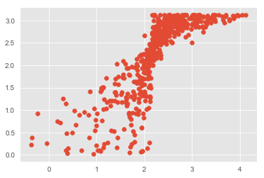


```python
model.resid.mean()
```


    6.747401948109479e-16


## Scikit Learn LinearRegression Model


```python
from sklearn.linear_model import LinearRegression, LassoCV
linreg = LinearRegression()
linreg.fit(X_train_Scaled, y_train_Scaled)

y_hat_train_scaled = linreg.predict(X_train_Scaled)
y_hat_test_scaled = linreg.predict(X_test_Scaled)

train_residuals = scaler.inverse_transform(y_hat_train_scaled) - y_train
test_residuals = scaler.inverse_transform(y_hat_test_scaled) - y_test

train_mse = mean_squared_error(y_train, scaler.inverse_transform(y_hat_train_scaled))
test_mse = mean_squared_error(y_test, scaler.inverse_transform(y_hat_test_scaled))

print('Train RMSE:', np.sqrt(train_mse))
print('------------------------------')
print('Test RMSE:', np.sqrt(test_mse))
linreg.score(X_test_Scaled, y_test_Scaled)
```

    Train RMSE: 0.4974395642639883
    ------------------------------
    Test RMSE: 0.5468910966926648
    


    0.6159934560189793


```python
plt.scatter(scaler.inverse_transform(y_hat_test_scaled), y_test)
plt.plot(scaler.inverse_transform(y_hat_test_scaled), y_test);
```


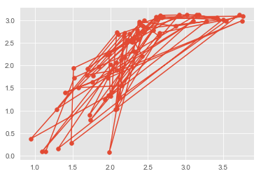


```python
sklearn_results = pd.DataFrame()
sklearn_results['Item'] = [x for x in X_train_Scaled.columns]
sklearn_results['Coef'] = [x for x in linreg.coef_[0]]
print('Sklearn Model Intercept:', linreg.intercept_)
sklearn_results['Coef'].hist();
```

    Sklearn Model Intercept: [-7.4602681e-17]
    


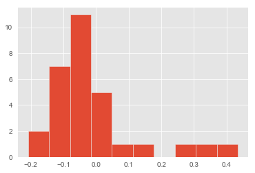


## Decision Tree Regressor

### Baseline Model


```python
from sklearn.tree import DecisionTreeRegressor
regressor = DecisionTreeRegressor(random_state=42)
regressor.fit(X_train_Scaled, y_train_Scaled)
```


    DecisionTreeRegressor(criterion='mse', max_depth=None, max_features=None,
               max_leaf_nodes=None, min_impurity_decrease=0.0,
               min_impurity_split=None, min_samples_leaf=1,
               min_samples_split=2, min_weight_fraction_leaf=0.0,
               presort=False, random_state=42, splitter='best')


```python
from sklearn.metrics import r2_score

y_pred = regressor.predict(X_test_Scaled)
y_pred = scaler.inverse_transform(y_pred)

print('RMSE Score:', np.sqrt(mean_squared_error(y_test, y_pred)))
print('R-sq Score:', r2_score(y_test, y_pred))
```

    RMSE Score: 0.6441920003642807
    R-sq Score: 0.46719588072859275
    


```python
plt.figure(figsize=(10,6))
sns.barplot(X_train_Scaled.columns, regressor.feature_importances_, orient="v");
plt.xticks(rotation=90);
```


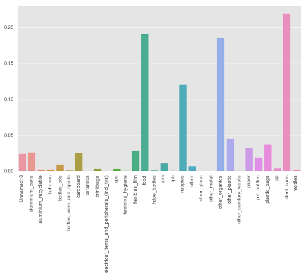


### Optimized Model


```python
op_regressor = DecisionTreeRegressor(random_state=42,
                                     max_depth=4,
                                     min_samples_leaf=2,
                                     min_samples_split=4)
op_regressor.fit(X_train_Scaled, y_train_Scaled)
```


    DecisionTreeRegressor(criterion='mse', max_depth=4, max_features=None,
               max_leaf_nodes=None, min_impurity_decrease=0.0,
               min_impurity_split=None, min_samples_leaf=2,
               min_samples_split=4, min_weight_fraction_leaf=0.0,
               presort=False, random_state=42, splitter='best')


```python
y_pred = op_regressor.predict(X_test_Scaled)
y_pred = scaler.inverse_transform(y_pred)

print('RMSE Score:', np.sqrt(mean_squared_error(y_test, y_pred)))
print('R-sq Score:', r2_score(y_test, y_pred))
```

    RMSE Score: 0.602221630272326
    R-sq Score: 0.5343607088309321
    


```python
plt.figure(figsize=(10,6))
sns.barplot(X_train_Scaled.columns, op_regressor.feature_importances_, orient="v");
plt.xticks(rotation=90);
```


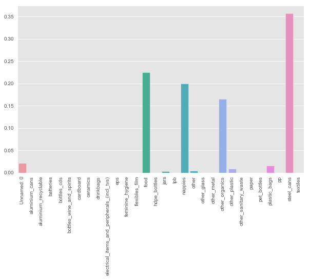


## Random Forest Model


```python
from sklearn.model_selection import GridSearchCV
from sklearn.linear_model import LogisticRegression
from sklearn import tree
from sklearn.ensemble import RandomForestRegressor
from sklearn.metrics import r2_score
from sklearn.tree import export_graphviz
from IPython.display import Image  
from pydotplus import graph_from_dot_data
import pydotplus
from sklearn.pipeline import Pipeline
```

### Baseline Model


```python
rdm_forest = RandomForestRegressor(200, random_state=42)
```


```python
rdm_forest.fit(X_train_Scaled, y_train_Scaled)
```


    RandomForestRegressor(bootstrap=True, criterion='mse', max_depth=None,
               max_features='auto', max_leaf_nodes=None,
               min_impurity_decrease=0.0, min_impurity_split=None,
               min_samples_leaf=1, min_samples_split=2,
               min_weight_fraction_leaf=0.0, n_estimators=200, n_jobs=None,
               oob_score=False, random_state=42, verbose=0, warm_start=False)


```python
rdm_forest.score(X_train_Scaled, y_train_Scaled)
```


    0.9620717255495986


```python
rdm_forest.score(X_test_Scaled, y_test_Scaled)
```


    0.7426983476649892


```python
y_preds = rdm_forest.predict(X_test_Scaled)
y_preds
```


    array([ 0.69649677, -0.82448041,  0.78686171, -1.3095697 , -0.83057111,
           -0.3687319 ,  0.53327767, -0.41546633, -0.42425099,  0.70522287,
           -1.06541453,  0.35588596,  0.60671748,  0.45175596, -1.00673296,
            0.155537  , -0.04943855,  0.20900634, -0.15163351, -0.16258506,
           -1.8514665 ,  0.89444459,  1.02000676, -1.04509267, -0.03526596,
            0.69965925,  0.86106286,  0.53515173,  1.02972846,  0.01217124,
           -0.3766381 , -0.67795217,  0.30106965,  0.30060113,  0.66159236,
            0.28795121, -1.35806106, -0.41968297,  0.59963118, -1.33481097,
           -0.06577803,  0.44291273, -0.10132665,  0.58235467, -0.19930497,
            0.58504863,  0.61895745,  0.23916703,  1.00671263, -1.0987377 ,
           -0.77926866,  0.44502105, -0.18958327,  0.35412903,  0.72220656,
           -0.57616716,  0.58223754,  0.82680266,  0.95634721, -0.081649  ,
            0.48250229, -0.23830888,  0.59693722,  0.26189003,  0.44291273,
           -0.01564687, -0.57523013,  1.00876239,  0.48349789, -0.71865446,
            0.03378152, -1.68930155, -0.48094138,  0.45140457,  0.53790426,
            0.50961763, -0.13757804, -1.83705964])


```python
# Plot redisuals from Random Forest

plt.scatter(scaler.inverse_transform(rdm_forest.predict(X_test_Scaled)), y_test);
# plt.plot(scaler.inverse_transform(rdm_forest.predict(X_test_Scaled)), y_test);
```


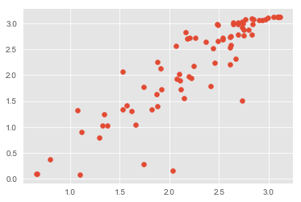


```python
np.sqrt(mean_squared_error(y_test, scaler.inverse_transform(y_preds)))
```


    0.44766467737066834


### GridSearch


```python
rf_grid_reg = RandomForestRegressor(random_state=42)
grid_param = [{'n_estimators': [150, 200, 250, 300],
               'max_depth': [13, 15, 17, 20],
               'min_samples_split': [2, 3, 4, 5],
               'min_samples_leaf': [1, 2, 3]}]
```


```python
# rf_gridsearch = GridSearchCV(rf_grid_reg, grid_param, cv=3)
# rf_gridsearch.fit(X_train_Scaled, y_train_Scaled)
```


```python
# rf_gridsearch.best_params_
```


```python
# rf_gridsearch.score(X_test_Scaled, y_test_Scaled)
```


```python
optimal_rf_model = RandomForestRegressor(max_depth=20,
                                         min_samples_leaf=1,
                                         min_samples_split=3,
                                         n_estimators=200,
                                         random_state=42)
optimal_rf_model.fit(X_train_Scaled, y_train_Scaled)
```


    RandomForestRegressor(bootstrap=True, criterion='mse', max_depth=20,
               max_features='auto', max_leaf_nodes=None,
               min_impurity_decrease=0.0, min_impurity_split=None,
               min_samples_leaf=1, min_samples_split=3,
               min_weight_fraction_leaf=0.0, n_estimators=200, n_jobs=None,
               oob_score=False, random_state=42, verbose=0, warm_start=False)


```python
optimal_rf_model.score(X_train_Scaled, y_train_Scaled)
```


    0.9593299470471697


```python
optimal_rf_model.score(X_test_Scaled, y_test_Scaled)
```


    0.7377093153775187


```python
y_preds = optimal_rf_model.predict(X_test_Scaled)
y_preds
```


    array([ 0.69743213, -0.83068475,  0.78709632, -1.29556526, -0.79347904,
           -0.3543369 ,  0.54095435, -0.38862492, -0.4399478 ,  0.68341682,
           -1.05316564,  0.35096599,  0.5904169 ,  0.45314882, -0.99584485,
            0.16524922, -0.05239348,  0.26125677, -0.14172538, -0.17341809,
           -1.80563494,  0.89112264,  1.02019131, -1.09856159, -0.06993708,
            0.7250772 ,  0.86433661,  0.52666016,  1.03044106, -0.01415236,
           -0.38265657, -0.64630199,  0.30360256,  0.34544079,  0.66663476,
            0.27256828, -1.35461761, -0.44638668,  0.57641805, -1.28083366,
           -0.04313981,  0.45442747, -0.06998603,  0.57978216, -0.16862305,
            0.61350071,  0.61956136,  0.24427148,  1.00147941, -1.08920898,
           -0.74583324,  0.41222245, -0.17964906,  0.36456354,  0.72643923,
           -0.58430218,  0.60224985,  0.85249669,  0.95023292, -0.09564269,
            0.48538813, -0.24489348,  0.58284863,  0.25552017,  0.41432132,
           -0.07781846, -0.52658358,  1.00996693,  0.51225359, -0.74932321,
            0.02258302, -1.68342266, -0.49265915,  0.46087221,  0.54627263,
            0.51882996, -0.13355857, -1.84498927])


```python
plt.scatter(scaler.inverse_transform(optimal_rf_model.predict(X_test_Scaled)), y_test);
```


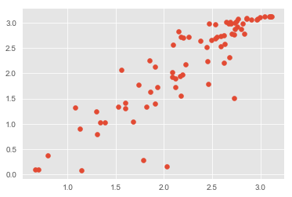


```python
np.sqrt(mean_squared_error(y_test, scaler.inverse_transform(y_preds)))
```


    0.4519839089890358


```python
def plot_feature_importances(model):
    n_features = X_train.shape[1]
    plt.figure(figsize=(20,20))
    plt.barh(range(n_features), model.feature_importances_, align='center') 
    plt.yticks(np.arange(n_features), X_train.columns.values) 
    plt.xlabel('Feature importance', fontsize=18)
    plt.yticks(fontsize=15)
    plt.ylabel('Feature', fontsize=18)
    plt.yticks(fontsize=15)

plot_feature_importances(optimal_rf_model)
```


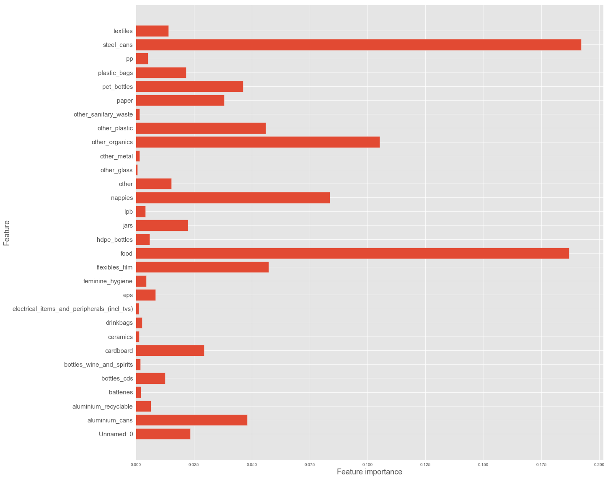


## XG Boost


```python
import xgboost as xgb

xgb_reg = xgb.XGBRegressor(random_state=42)
xgb_reg.fit(X_train_Scaled, y_train_Scaled)
```


    XGBRegressor(base_score=0.5, booster='gbtree', colsample_bylevel=1,
           colsample_bytree=1, gamma=0, learning_rate=0.1, max_delta_step=0,
           max_depth=3, min_child_weight=1, missing=None, n_estimators=100,
           n_jobs=1, nthread=None, objective='reg:linear', random_state=42,
           reg_alpha=0, reg_lambda=1, scale_pos_weight=1, seed=None,
           silent=True, subsample=1)


```python
xgb_reg.score(X_train_Scaled, y_train_Scaled)
```


    0.9438280122391194


```python
xgb_reg.score(X_test_Scaled, y_test_Scaled)
```


    0.8381074242065781


```python
training_preds = scaler.inverse_transform(xgb_reg.predict(X_train_Scaled))
test_preds = scaler.inverse_transform(xgb_reg.predict(X_test_Scaled))
```


```python
print('Train RMSE:', np.sqrt(mean_squared_error(y_train, training_preds)))
print('Test RMSE:', np.sqrt(mean_squared_error(y_test, test_preds)))
```

    Train RMSE: 0.2023465838026906
    Test RMSE: 0.3550953699033109
    


```python
plot_feature_importances(xgb_reg)
```


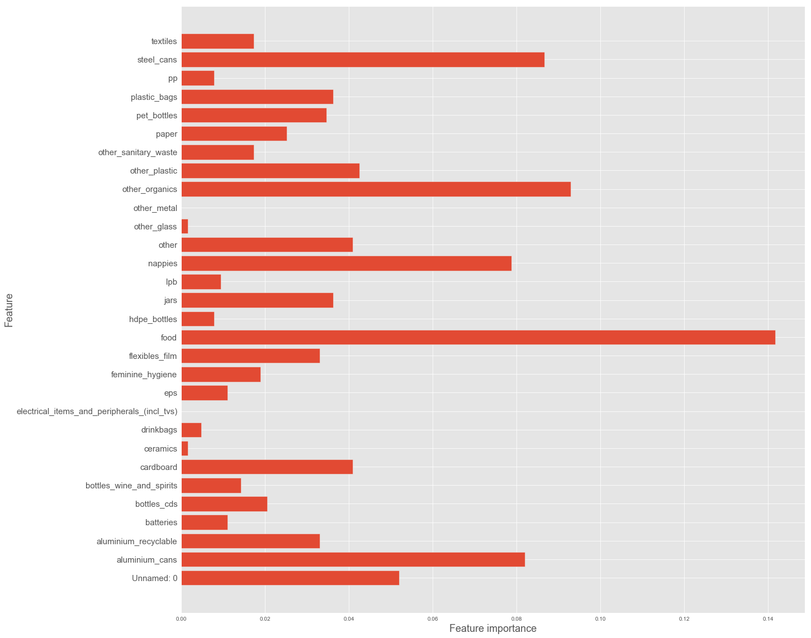


### GridSearch


```python
xgb_grid_model = xgb.XGBRegressor(random_state=42)

xgb_reg_grid_param = [{'max_depth': [5, 7, 10, 12],
               'learning_rate': [0.1, 0.2],
               'n_estimators': [100, 150, 200],
               'min_child_weight': [2, 3, 4],
               'max_delta_step': [0, 1]}]
```


```python
# xgbclf_gridsearch = GridSearchCV(xgb_grid_model,
#                                  xgb_reg_grid_param,
#                                  scoring='neg_mean_squared_error')
# xgbclf_gridsearch.fit(X_train_Scaled, y_train_Scaled)
```


```python
# xgbclf_gridsearch.best_params_
```


```python
xgb_grid_model = xgb.XGBRegressor(learning_rate = 0.1,
                                  max_delta_step = 1,
                                  max_depth = 5,
                                  min_child_weight = 3,
                                  n_estimators = 200,
                                  random_state=42)
xgb_grid_model.fit(X_train_Scaled, y_train_Scaled)
```


    XGBRegressor(base_score=0.5, booster='gbtree', colsample_bylevel=1,
           colsample_bytree=1, gamma=0, learning_rate=0.1, max_delta_step=1,
           max_depth=5, min_child_weight=3, missing=None, n_estimators=200,
           n_jobs=1, nthread=None, objective='reg:linear', random_state=42,
           reg_alpha=0, reg_lambda=1, scale_pos_weight=1, seed=None,
           silent=True, subsample=1)


```python
xgb_grid_model.score(X_train_Scaled, y_train_Scaled)
```


    0.9978751947909383


```python
xgb_grid_model.score(X_test_Scaled, y_test_Scaled)
```


    0.8762362698720361


```python
training_preds = scaler.inverse_transform(xgb_grid_model.predict(X_train_Scaled))
test_preds = scaler.inverse_transform(xgb_grid_model.predict(X_test_Scaled))
```


```python
print('Train RMSE:', np.sqrt(mean_squared_error(y_train, training_preds)))
print('Test RMSE:', np.sqrt(mean_squared_error(y_test, test_preds)))
```

    Train RMSE: 0.03935460468066705
    Test RMSE: 0.3104761446371596
    


```python
plot_feature_importances(xgb_grid_model)
```


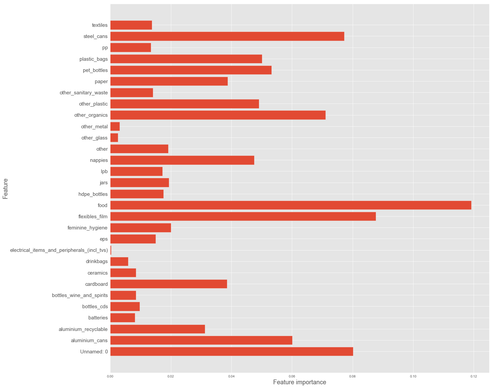


## MLP Regression Model


```python
from keras import layers, models, optimizers, regularizers
from keras import backend as K
from keras.models import Sequential
from tensorflow.keras.callbacks import TensorBoard
from keras.wrappers.scikit_learn import KerasRegressor
```


```python
n_features = X_train_Scaled.shape[1]
```

### Loss, MSE, & R^2 Visualization Function


```python
def coef_determination(y_true, y_pred):
    SS_res = K.sum(K.square(y_true-y_pred))
    SS_tot = K.sum(K.square(y_true - K.mean(y_true)))
    return (1 - SS_res/(SS_tot + K.epsilon()))
```


```python
#Build vizualization function for training/validation loss and accuracy
def visualize_loss_MSE(results):
    history = results.history
    
    plt.plot(history['loss'], 'b', label='Training Loss')
    plt.title('Training Loss')
    plt.xlabel('Epochs', fontsize=12)
    plt.ylabel('Loss', fontsize=12)
    plt.legend(loc='best')
    plt.show()
    
    plt.plot(history['mse'], 'b', label='Training MSE')
    plt.title('Training MSE')
    plt.xlabel('Epochs', fontsize=12)
    plt.ylabel('MSE', fontsize=12)
    plt.legend(loc='best')
    plt.show()
    
    plt.plot(history['coef_determination'], 'b', label='Training R^2')
    plt.title('Training R^2')
    plt.xlabel('Epochs', fontsize=12)
    plt.ylabel('R^2', fontsize=12)
    plt.legend(loc='best')
    plt.show()
```

### Baseline Model


```python
baseline_model = Sequential()

baseline_model.add(layers.Dense(10, activation='relu', input_shape=(n_features, )))

baseline_model.add(layers.Dense(5, activation='relu'))

baseline_model.add(layers.Dense(1, activation='linear'))

baseline_model.compile(optimizer='SGD',
              loss='mse',
              metrics=['mse', coef_determination])

```


```python
baseline_model.fit(X_train_Scaled,
                  y_train_Scaled,
                  epochs=150)
```

    Epoch 1/150
    14/14 [==============================] - 0s 642us/step - loss: 1.4282 - mse: 1.4282 - coef_determination: -0.4536
    Epoch 2/150
    14/14 [==============================] - 0s 715us/step - loss: 0.9399 - mse: 0.9399 - coef_determination: 0.0513
    Epoch 3/150
    14/14 [==============================] - 0s 641us/step - loss: 0.8569 - mse: 0.8569 - coef_determination: 0.0987
    Epoch 4/150
    14/14 [==============================] - 0s 712us/step - loss: 0.8155 - mse: 0.8155 - coef_determination: 0.1282
    Epoch 5/150
    14/14 [==============================] - 0s 712us/step - loss: 0.7848 - mse: 0.7848 - coef_determination: 0.1866
    Epoch 6/150
    14/14 [==============================] - 0s 641us/step - loss: 0.7583 - mse: 0.7583 - coef_determination: 0.2086
    Epoch 7/150
    14/14 [==============================] - 0s 784us/step - loss: 0.7371 - mse: 0.7371 - coef_determination: 0.2505
    Epoch 8/150
    14/14 [==============================] - 0s 712us/step - loss: 0.7178 - mse: 0.7178 - coef_determination: 0.2365
    Epoch 9/150
    14/14 [==============================] - 0s 641us/step - loss: 0.7007 - mse: 0.7007 - coef_determination: 0.2808
    Epoch 10/150
    14/14 [==============================] - 0s 641us/step - loss: 0.6826 - mse: 0.6826 - coef_determination: 0.2809
    Epoch 11/150
    14/14 [==============================] - 0s 712us/step - loss: 0.6674 - mse: 0.6674 - coef_determination: 0.2930
    Epoch 12/150
    14/14 [==============================] - 0s 638us/step - loss: 0.6499 - mse: 0.6499 - coef_determination: 0.3267
    Epoch 13/150
    14/14 [==============================] - 0s 709us/step - loss: 0.6337 - mse: 0.6337 - coef_determination: 0.3447
    Epoch 14/150
    14/14 [==============================] - 0s 641us/step - loss: 0.6178 - mse: 0.6178 - coef_determination: 0.3627
    Epoch 15/150
    14/14 [==============================] - 0s 570us/step - loss: 0.6021 - mse: 0.6021 - coef_determination: 0.3720
    Epoch 16/150
    14/14 [==============================] - 0s 641us/step - loss: 0.5845 - mse: 0.5845 - coef_determination: 0.3928
    Epoch 17/150
    14/14 [==============================] - 0s 570us/step - loss: 0.5686 - mse: 0.5686 - coef_determination: 0.4014
    Epoch 18/150
    14/14 [==============================] - 0s 641us/step - loss: 0.5530 - mse: 0.5530 - coef_determination: 0.4248
    Epoch 19/150
    14/14 [==============================] - 0s 638us/step - loss: 0.5386 - mse: 0.5386 - coef_determination: 0.4308
    Epoch 20/150
    14/14 [==============================] - 0s 570us/step - loss: 0.5224 - mse: 0.5224 - coef_determination: 0.4534
    Epoch 21/150
    14/14 [==============================] - 0s 641us/step - loss: 0.5069 - mse: 0.5069 - coef_determination: 0.4686
    Epoch 22/150
    14/14 [==============================] - 0s 784us/step - loss: 0.4924 - mse: 0.4924 - coef_determination: 0.4759
    Epoch 23/150
    14/14 [==============================] - 0s 855us/step - loss: 0.4767 - mse: 0.4767 - coef_determination: 0.4959
    Epoch 24/150
    14/14 [==============================] - 0s 641us/step - loss: 0.4648 - mse: 0.4648 - coef_determination: 0.5007
    Epoch 25/150
    14/14 [==============================] - 0s 784us/step - loss: 0.4490 - mse: 0.4490 - coef_determination: 0.5404
    Epoch 26/150
    14/14 [==============================] - 0s 856us/step - loss: 0.4346 - mse: 0.4346 - coef_determination: 0.5412
    Epoch 27/150
    14/14 [==============================] - 0s 712us/step - loss: 0.4184 - mse: 0.4184 - coef_determination: 0.5787
    Epoch 28/150
    14/14 [==============================] - 0s 712us/step - loss: 0.4058 - mse: 0.4058 - coef_determination: 0.5700
    Epoch 29/150
    14/14 [==============================] - 0s 758us/step - loss: 0.3933 - mse: 0.3933 - coef_determination: 0.6013
    Epoch 30/150
    14/14 [==============================] - 0s 641us/step - loss: 0.3819 - mse: 0.3819 - coef_determination: 0.5987
    Epoch 31/150
    14/14 [==============================] - 0s 641us/step - loss: 0.3730 - mse: 0.3730 - coef_determination: 0.5962
    Epoch 32/150
    14/14 [==============================] - 0s 641us/step - loss: 0.3635 - mse: 0.3635 - coef_determination: 0.6067
    Epoch 33/150
    14/14 [==============================] - 0s 641us/step - loss: 0.3547 - mse: 0.3547 - coef_determination: 0.6330
    Epoch 34/150
    14/14 [==============================] - 0s 570us/step - loss: 0.3467 - mse: 0.3467 - coef_determination: 0.6418
    Epoch 35/150
    14/14 [==============================] - 0s 641us/step - loss: 0.3380 - mse: 0.3380 - coef_determination: 0.6420
    Epoch 36/150
    14/14 [==============================] - 0s 519us/step - loss: 0.3306 - mse: 0.3306 - coef_determination: 0.6537
    Epoch 37/150
    14/14 [==============================] - 0s 570us/step - loss: 0.3236 - mse: 0.3236 - coef_determination: 0.6544
    Epoch 38/150
    14/14 [==============================] - 0s 641us/step - loss: 0.3156 - mse: 0.3156 - coef_determination: 0.6705
    Epoch 39/150
    14/14 [==============================] - 0s 641us/step - loss: 0.3094 - mse: 0.3094 - coef_determination: 0.6794
    Epoch 40/150
    14/14 [==============================] - 0s 712us/step - loss: 0.3027 - mse: 0.3027 - coef_determination: 0.6825
    Epoch 41/150
    14/14 [==============================] - 0s 641us/step - loss: 0.2971 - mse: 0.2971 - coef_determination: 0.6859
    Epoch 42/150
    14/14 [==============================] - 0s 784us/step - loss: 0.2909 - mse: 0.2909 - coef_determination: 0.6998
    Epoch 43/150
    14/14 [==============================] - ETA: 0s - loss: 0.3330 - mse: 0.3330 - coef_determination: 0.64 - 0s 641us/step - loss: 0.2844 - mse: 0.2844 - coef_determination: 0.7085
    Epoch 44/150
    14/14 [==============================] - 0s 641us/step - loss: 0.2784 - mse: 0.2784 - coef_determination: 0.7030
    Epoch 45/150
    14/14 [==============================] - 0s 712us/step - loss: 0.2730 - mse: 0.2730 - coef_determination: 0.7299
    Epoch 46/150
    14/14 [==============================] - 0s 664us/step - loss: 0.2687 - mse: 0.2687 - coef_determination: 0.7252
    Epoch 47/150
    14/14 [==============================] - 0s 712us/step - loss: 0.2638 - mse: 0.2638 - coef_determination: 0.7261
    Epoch 48/150
    14/14 [==============================] - 0s 784us/step - loss: 0.2595 - mse: 0.2595 - coef_determination: 0.7376
    Epoch 49/150
    14/14 [==============================] - 0s 1ms/step - loss: 0.2547 - mse: 0.2547 - coef_determination: 0.7102
    Epoch 50/150
    14/14 [==============================] - 0s 712us/step - loss: 0.2502 - mse: 0.2502 - coef_determination: 0.7397
    Epoch 51/150
    14/14 [==============================] - 0s 855us/step - loss: 0.2457 - mse: 0.2457 - coef_determination: 0.7376
    Epoch 52/150
    14/14 [==============================] - 0s 997us/step - loss: 0.2432 - mse: 0.2432 - coef_determination: 0.7376
    Epoch 53/150
    14/14 [==============================] - 0s 913us/step - loss: 0.2392 - mse: 0.2392 - coef_determination: 0.7546
    Epoch 54/150
    14/14 [==============================] - 0s 641us/step - loss: 0.2346 - mse: 0.2346 - coef_determination: 0.7532
    Epoch 55/150
    14/14 [==============================] - 0s 641us/step - loss: 0.2326 - mse: 0.2326 - coef_determination: 0.7637
    Epoch 56/150
    14/14 [==============================] - 0s 600us/step - loss: 0.2277 - mse: 0.2277 - coef_determination: 0.7635
    Epoch 57/150
    14/14 [==============================] - 0s 641us/step - loss: 0.2210 - mse: 0.2210 - coef_determination: 0.7575
    Epoch 58/150
    14/14 [==============================] - 0s 641us/step - loss: 0.2159 - mse: 0.2159 - coef_determination: 0.7673
    Epoch 59/150
    14/14 [==============================] - 0s 570us/step - loss: 0.2128 - mse: 0.2128 - coef_determination: 0.7698
    Epoch 60/150
    14/14 [==============================] - 0s 712us/step - loss: 0.2085 - mse: 0.2085 - coef_determination: 0.7781
    Epoch 61/150
    14/14 [==============================] - 0s 705us/step - loss: 0.2051 - mse: 0.2051 - coef_determination: 0.7766
    Epoch 62/150
    14/14 [==============================] - 0s 712us/step - loss: 0.2023 - mse: 0.2023 - coef_determination: 0.7938
    Epoch 63/150
    14/14 [==============================] - 0s 719us/step - loss: 0.1996 - mse: 0.1996 - coef_determination: 0.7895
    Epoch 64/150
    14/14 [==============================] - 0s 641us/step - loss: 0.1971 - mse: 0.1971 - coef_determination: 0.7961
    Epoch 65/150
    14/14 [==============================] - 0s 641us/step - loss: 0.1948 - mse: 0.1948 - coef_determination: 0.7903
    Epoch 66/150
    14/14 [==============================] - 0s 642us/step - loss: 0.1916 - mse: 0.1916 - coef_determination: 0.7795
    Epoch 67/150
    14/14 [==============================] - 0s 616us/step - loss: 0.1900 - mse: 0.1900 - coef_determination: 0.7844
    Epoch 68/150
    14/14 [==============================] - 0s 682us/step - loss: 0.1873 - mse: 0.1873 - coef_determination: 0.8039
    Epoch 69/150
    14/14 [==============================] - 0s 712us/step - loss: 0.1852 - mse: 0.1852 - coef_determination: 0.8089
    Epoch 70/150
    14/14 [==============================] - 0s 784us/step - loss: 0.1841 - mse: 0.1841 - coef_determination: 0.8066
    Epoch 71/150
    14/14 [==============================] - 0s 756us/step - loss: 0.1814 - mse: 0.1814 - coef_determination: 0.8109
    Epoch 72/150
    14/14 [==============================] - 0s 712us/step - loss: 0.1793 - mse: 0.1793 - coef_determination: 0.8067
    Epoch 73/150
    14/14 [==============================] - 0s 641us/step - loss: 0.1779 - mse: 0.1779 - coef_determination: 0.7999
    Epoch 74/150
    14/14 [==============================] - 0s 641us/step - loss: 0.1767 - mse: 0.1767 - coef_determination: 0.8180
    Epoch 75/150
    14/14 [==============================] - 0s 712us/step - loss: 0.1751 - mse: 0.1751 - coef_determination: 0.8145
    Epoch 76/150
    14/14 [==============================] - 0s 695us/step - loss: 0.1740 - mse: 0.1740 - coef_determination: 0.8117
    Epoch 77/150
    14/14 [==============================] - 0s 784us/step - loss: 0.1720 - mse: 0.1720 - coef_determination: 0.8162
    Epoch 78/150
    14/14 [==============================] - 0s 641us/step - loss: 0.1706 - mse: 0.1706 - coef_determination: 0.7969
    Epoch 79/150
    14/14 [==============================] - 0s 617us/step - loss: 0.1691 - mse: 0.1691 - coef_determination: 0.8260
    Epoch 80/150
    14/14 [==============================] - 0s 641us/step - loss: 0.1676 - mse: 0.1676 - coef_determination: 0.8264
    Epoch 81/150
    14/14 [==============================] - 0s 712us/step - loss: 0.1665 - mse: 0.1665 - coef_determination: 0.8204
    Epoch 82/150
    14/14 [==============================] - 0s 641us/step - loss: 0.1652 - mse: 0.1652 - coef_determination: 0.8244
    Epoch 83/150
    14/14 [==============================] - 0s 682us/step - loss: 0.1637 - mse: 0.1637 - coef_determination: 0.8335
    Epoch 84/150
    14/14 [==============================] - 0s 712us/step - loss: 0.1623 - mse: 0.1623 - coef_determination: 0.8300
    Epoch 85/150
    14/14 [==============================] - 0s 570us/step - loss: 0.1607 - mse: 0.1607 - coef_determination: 0.8312
    Epoch 86/150
    14/14 [==============================] - 0s 712us/step - loss: 0.1591 - mse: 0.1591 - coef_determination: 0.8376
    Epoch 87/150
    14/14 [==============================] - 0s 712us/step - loss: 0.1584 - mse: 0.1584 - coef_determination: 0.8348
    Epoch 88/150
    14/14 [==============================] - 0s 570us/step - loss: 0.1574 - mse: 0.1574 - coef_determination: 0.8303
    Epoch 89/150
    14/14 [==============================] - 0s 641us/step - loss: 0.1553 - mse: 0.1553 - coef_determination: 0.8209
    Epoch 90/150
    14/14 [==============================] - 0s 641us/step - loss: 0.1545 - mse: 0.1545 - coef_determination: 0.8230
    Epoch 91/150
    14/14 [==============================] - 0s 617us/step - loss: 0.1537 - mse: 0.1537 - coef_determination: 0.8499
    Epoch 92/150
    14/14 [==============================] - 0s 641us/step - loss: 0.1524 - mse: 0.1524 - coef_determination: 0.8376
    Epoch 93/150
    14/14 [==============================] - 0s 717us/step - loss: 0.1513 - mse: 0.1513 - coef_determination: 0.8416
    Epoch 94/150
    14/14 [==============================] - 0s 570us/step - loss: 0.1500 - mse: 0.1500 - coef_determination: 0.8361
    Epoch 95/150
    14/14 [==============================] - 0s 570us/step - loss: 0.1495 - mse: 0.1495 - coef_determination: 0.8318
    Epoch 96/150
    14/14 [==============================] - ETA: 0s - loss: 0.0594 - mse: 0.0594 - coef_determination: 0.93 - 0s 712us/step - loss: 0.1489 - mse: 0.1489 - coef_determination: 0.8465
    Epoch 97/150
    14/14 [==============================] - 0s 712us/step - loss: 0.1478 - mse: 0.1478 - coef_determination: 0.8402
    Epoch 98/150
    14/14 [==============================] - 0s 570us/step - loss: 0.1472 - mse: 0.1472 - coef_determination: 0.8477
    Epoch 99/150
    14/14 [==============================] - 0s 570us/step - loss: 0.1454 - mse: 0.1454 - coef_determination: 0.8475
    Epoch 100/150
    14/14 [==============================] - 0s 641us/step - loss: 0.1445 - mse: 0.1445 - coef_determination: 0.8452
    Epoch 101/150
    14/14 [==============================] - 0s 712us/step - loss: 0.1439 - mse: 0.1439 - coef_determination: 0.8494
    Epoch 102/150
    14/14 [==============================] - 0s 638us/step - loss: 0.1422 - mse: 0.1422 - coef_determination: 0.8618
    Epoch 103/150
    14/14 [==============================] - 0s 641us/step - loss: 0.1419 - mse: 0.1419 - coef_determination: 0.8452
    Epoch 104/150
    14/14 [==============================] - 0s 641us/step - loss: 0.1397 - mse: 0.1397 - coef_determination: 0.8511
    Epoch 105/150
    14/14 [==============================] - 0s 570us/step - loss: 0.1393 - mse: 0.1393 - coef_determination: 0.8501
    Epoch 106/150
    14/14 [==============================] - 0s 712us/step - loss: 0.1381 - mse: 0.1381 - coef_determination: 0.8458
    Epoch 107/150
    14/14 [==============================] - 0s 641us/step - loss: 0.1367 - mse: 0.1367 - coef_determination: 0.8573
    Epoch 108/150
    14/14 [==============================] - 0s 764us/step - loss: 0.1355 - mse: 0.1355 - coef_determination: 0.8597
    Epoch 109/150
    14/14 [==============================] - 0s 641us/step - loss: 0.1347 - mse: 0.1347 - coef_determination: 0.8641
    Epoch 110/150
    14/14 [==============================] - 0s 712us/step - loss: 0.1336 - mse: 0.1336 - coef_determination: 0.8311
    Epoch 111/150
    14/14 [==============================] - 0s 712us/step - loss: 0.1329 - mse: 0.1329 - coef_determination: 0.8683
    Epoch 112/150
    14/14 [==============================] - 0s 712us/step - loss: 0.1312 - mse: 0.1312 - coef_determination: 0.8560
    Epoch 113/150
    14/14 [==============================] - 0s 712us/step - loss: 0.1306 - mse: 0.1306 - coef_determination: 0.8629
    Epoch 114/150
    14/14 [==============================] - 0s 712us/step - loss: 0.1294 - mse: 0.1294 - coef_determination: 0.8545
    Epoch 115/150
    14/14 [==============================] - 0s 641us/step - loss: 0.1284 - mse: 0.1284 - coef_determination: 0.8661
    Epoch 116/150
    14/14 [==============================] - 0s 569us/step - loss: 0.1279 - mse: 0.1279 - coef_determination: 0.8621
    Epoch 117/150
    14/14 [==============================] - 0s 641us/step - loss: 0.1262 - mse: 0.1262 - coef_determination: 0.8697
    Epoch 118/150
    14/14 [==============================] - 0s 570us/step - loss: 0.1256 - mse: 0.1256 - coef_determination: 0.8789
    Epoch 119/150
    14/14 [==============================] - 0s 712us/step - loss: 0.1245 - mse: 0.1245 - coef_determination: 0.8675
    Epoch 120/150
    14/14 [==============================] - 0s 641us/step - loss: 0.1227 - mse: 0.1227 - coef_determination: 0.8734
    Epoch 121/150
    14/14 [==============================] - 0s 570us/step - loss: 0.1219 - mse: 0.1219 - coef_determination: 0.8695
    Epoch 122/150
    14/14 [==============================] - 0s 641us/step - loss: 0.1213 - mse: 0.1213 - coef_determination: 0.8731
    Epoch 123/150
    14/14 [==============================] - 0s 641us/step - loss: 0.1203 - mse: 0.1203 - coef_determination: 0.8717
    Epoch 124/150
    14/14 [==============================] - 0s 575us/step - loss: 0.1198 - mse: 0.1198 - coef_determination: 0.8701
    Epoch 125/150
    14/14 [==============================] - 0s 712us/step - loss: 0.1187 - mse: 0.1187 - coef_determination: 0.8803
    Epoch 126/150
    14/14 [==============================] - 0s 572us/step - loss: 0.1178 - mse: 0.1178 - coef_determination: 0.8749
    Epoch 127/150
    14/14 [==============================] - 0s 633us/step - loss: 0.1163 - mse: 0.1163 - coef_determination: 0.8765
    Epoch 128/150
    14/14 [==============================] - 0s 571us/step - loss: 0.1141 - mse: 0.1141 - coef_determination: 0.8838
    Epoch 129/150
    14/14 [==============================] - 0s 572us/step - loss: 0.1128 - mse: 0.1128 - coef_determination: 0.8806
    Epoch 130/150
    14/14 [==============================] - 0s 641us/step - loss: 0.1118 - mse: 0.1118 - coef_determination: 0.8819
    Epoch 131/150
    14/14 [==============================] - 0s 639us/step - loss: 0.1108 - mse: 0.1108 - coef_determination: 0.8826
    Epoch 132/150
    14/14 [==============================] - 0s 712us/step - loss: 0.1100 - mse: 0.1100 - coef_determination: 0.8860
    Epoch 133/150
    14/14 [==============================] - 0s 712us/step - loss: 0.1092 - mse: 0.1092 - coef_determination: 0.8848
    Epoch 134/150
    14/14 [==============================] - 0s 641us/step - loss: 0.1081 - mse: 0.1081 - coef_determination: 0.8811
    Epoch 135/150
    14/14 [==============================] - 0s 644us/step - loss: 0.1067 - mse: 0.1067 - coef_determination: 0.8897
    Epoch 136/150
    14/14 [==============================] - 0s 644us/step - loss: 0.1054 - mse: 0.1054 - coef_determination: 0.8894
    Epoch 137/150
    14/14 [==============================] - 0s 703us/step - loss: 0.1050 - mse: 0.1050 - coef_determination: 0.8890
    Epoch 138/150
    14/14 [==============================] - 0s 641us/step - loss: 0.1047 - mse: 0.1047 - coef_determination: 0.8899
    Epoch 139/150
    14/14 [==============================] - 0s 641us/step - loss: 0.1037 - mse: 0.1037 - coef_determination: 0.8875
    Epoch 140/150
    14/14 [==============================] - 0s 643us/step - loss: 0.1028 - mse: 0.1028 - coef_determination: 0.8751
    Epoch 141/150
    14/14 [==============================] - 0s 784us/step - loss: 0.1026 - mse: 0.1026 - coef_determination: 0.8926
    Epoch 142/150
    14/14 [==============================] - 0s 653us/step - loss: 0.1026 - mse: 0.1026 - coef_determination: 0.8976
    Epoch 143/150
    14/14 [==============================] - 0s 784us/step - loss: 0.1009 - mse: 0.1009 - coef_determination: 0.8920
    Epoch 144/150
    14/14 [==============================] - 0s 712us/step - loss: 0.1001 - mse: 0.1001 - coef_determination: 0.8938
    Epoch 145/150
    14/14 [==============================] - 0s 876us/step - loss: 0.1004 - mse: 0.1004 - coef_determination: 0.8958
    Epoch 146/150
    14/14 [==============================] - 0s 712us/step - loss: 0.0995 - mse: 0.0995 - coef_determination: 0.8923
    Epoch 147/150
    14/14 [==============================] - 0s 766us/step - loss: 0.0988 - mse: 0.0988 - coef_determination: 0.8961
    Epoch 148/150
    14/14 [==============================] - 0s 712us/step - loss: 0.0983 - mse: 0.0983 - coef_determination: 0.8960
    Epoch 149/150
    14/14 [==============================] - 0s 641us/step - loss: 0.0973 - mse: 0.0973 - coef_determination: 0.8950
    Epoch 150/150
    14/14 [==============================] - 0s 712us/step - loss: 0.0970 - mse: 0.0970 - coef_determination: 0.9004
    


    <tensorflow.python.keras.callbacks.History at 0x1a42a4ee710>


```python
visualize_loss_MSE(baseline_model.history)
```


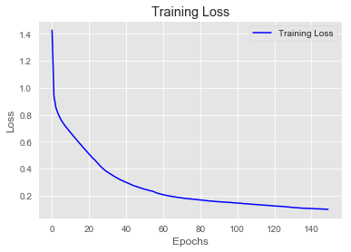


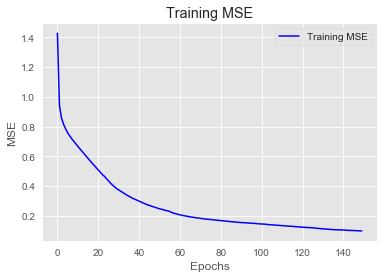


```python
baseline_preds_scaled = baseline_model.predict(X_test_Scaled)
baseline_preds = scaler.inverse_transform(baseline_preds_scaled)
rmse = np.sqrt(mean_squared_error(y_test, baseline_preds))

print('RMSE:', rmse)
print('-------------------------')
print(baseline_model.summary())
```

    WARNING:tensorflow:5 out of the last 13 calls to <function Model.make_predict_function.<locals>.predict_function at 0x000001A41CFA1268> triggered tf.function retracing. Tracing is expensive and the excessive number of tracings could be due to (1) creating @tf.function repeatedly in a loop, (2) passing tensors with different shapes, (3) passing Python objects instead of tensors. For (1), please define your @tf.function outside of the loop. For (2), @tf.function has experimental_relax_shapes=True option that relaxes argument shapes that can avoid unnecessary retracing. For (3), please refer to https://www.tensorflow.org/tutorials/customization/performance#python_or_tensor_args and https://www.tensorflow.org/api_docs/python/tf/function for  more details.
    RMSE: 0.6695696762295189
    -------------------------
    Model: "sequential_4"
    _________________________________________________________________
    Layer (type)                 Output Shape              Param #   
    =================================================================
    dense_18 (Dense)             (None, 10)                310       
    _________________________________________________________________
    dense_19 (Dense)             (None, 5)                 55        
    _________________________________________________________________
    dense_20 (Dense)             (None, 1)                 6         
    =================================================================
    Total params: 371
    Trainable params: 371
    Non-trainable params: 0
    _________________________________________________________________
    None
    

### Overfit Model


```python
overfit_model = Sequential()

overfit_model.add(layers.Dense(10, activation='relu', input_shape=(n_features, )))

overfit_model.add(layers.Dense(10, activation='relu'))

overfit_model.add(layers.Dense(10, activation='relu'))

overfit_model.add(layers.Dense(10, activation='relu'))

overfit_model.add(layers.Dense(1, activation='linear'))

overfit_model.compile(optimizer='SGD',
              loss='mse',
              metrics=['mse', coef_determination])

```


```python
overfit_model.fit(X_train_Scaled,
                  y_train_Scaled,
                  epochs=150)
```

    Epoch 1/150
    14/14 [==============================] - 0s 784us/step - loss: 0.9702 - mse: 0.9702 - coef_determination: -0.0101
    Epoch 2/150
    14/14 [==============================] - 0s 712us/step - loss: 0.9406 - mse: 0.9406 - coef_determination: 0.0284
    Epoch 3/150
    14/14 [==============================] - 0s 712us/step - loss: 0.9116 - mse: 0.9116 - coef_determination: 0.0615
    Epoch 4/150
    14/14 [==============================] - 0s 838us/step - loss: 0.8797 - mse: 0.8797 - coef_determination: 0.0841
    Epoch 5/150
    14/14 [==============================] - 0s 784us/step - loss: 0.8449 - mse: 0.8449 - coef_determination: 0.1431
    Epoch 6/150
    14/14 [==============================] - 0s 784us/step - loss: 0.8128 - mse: 0.8128 - coef_determination: 0.1664
    Epoch 7/150
    14/14 [==============================] - 0s 784us/step - loss: 0.7785 - mse: 0.7785 - coef_determination: 0.2106
    Epoch 8/150
    14/14 [==============================] - 0s 712us/step - loss: 0.7429 - mse: 0.7429 - coef_determination: 0.2387
    Epoch 9/150
    14/14 [==============================] - 0s 712us/step - loss: 0.7090 - mse: 0.7090 - coef_determination: 0.2604
    Epoch 10/150
    14/14 [==============================] - 0s 712us/step - loss: 0.6762 - mse: 0.6762 - coef_determination: 0.3213
    Epoch 11/150
    14/14 [==============================] - 0s 815us/step - loss: 0.6448 - mse: 0.6448 - coef_determination: 0.3480
    Epoch 12/150
    14/14 [==============================] - 0s 784us/step - loss: 0.6156 - mse: 0.6156 - coef_determination: 0.3694
    Epoch 13/150
    14/14 [==============================] - 0s 712us/step - loss: 0.5870 - mse: 0.5870 - coef_determination: 0.3820
    Epoch 14/150
    14/14 [==============================] - 0s 644us/step - loss: 0.5581 - mse: 0.5581 - coef_determination: 0.4265
    Epoch 15/150
    14/14 [==============================] - 0s 712us/step - loss: 0.5339 - mse: 0.5339 - coef_determination: 0.4584
    Epoch 16/150
    14/14 [==============================] - 0s 769us/step - loss: 0.5091 - mse: 0.5091 - coef_determination: 0.4788
    Epoch 17/150
    14/14 [==============================] - 0s 709us/step - loss: 0.4850 - mse: 0.4850 - coef_determination: 0.5037
    Epoch 18/150
    14/14 [==============================] - 0s 692us/step - loss: 0.4666 - mse: 0.4666 - coef_determination: 0.5090
    Epoch 19/150
    14/14 [==============================] - 0s 712us/step - loss: 0.4471 - mse: 0.4471 - coef_determination: 0.5453
    Epoch 20/150
    14/14 [==============================] - 0s 830us/step - loss: 0.4283 - mse: 0.4283 - coef_determination: 0.5567
    Epoch 21/150
    14/14 [==============================] - 0s 923us/step - loss: 0.4123 - mse: 0.4123 - coef_determination: 0.5777
    Epoch 22/150
    14/14 [==============================] - 0s 784us/step - loss: 0.3982 - mse: 0.3982 - coef_determination: 0.5991
    Epoch 23/150
    14/14 [==============================] - 0s 709us/step - loss: 0.3854 - mse: 0.3854 - coef_determination: 0.6103
    Epoch 24/150
    14/14 [==============================] - 0s 780us/step - loss: 0.3730 - mse: 0.3730 - coef_determination: 0.6142
    Epoch 25/150
    14/14 [==============================] - 0s 784us/step - loss: 0.3596 - mse: 0.3596 - coef_determination: 0.6289
    Epoch 26/150
    14/14 [==============================] - 0s 794us/step - loss: 0.3506 - mse: 0.3506 - coef_determination: 0.6421
    Epoch 27/150
    14/14 [==============================] - 0s 780us/step - loss: 0.3403 - mse: 0.3403 - coef_determination: 0.6600
    Epoch 28/150
    14/14 [==============================] - 0s 784us/step - loss: 0.3297 - mse: 0.3297 - coef_determination: 0.6563
    Epoch 29/150
    14/14 [==============================] - 0s 712us/step - loss: 0.3190 - mse: 0.3190 - coef_determination: 0.6607
    Epoch 30/150
    14/14 [==============================] - 0s 780us/step - loss: 0.3137 - mse: 0.3137 - coef_determination: 0.6634
    Epoch 31/150
    14/14 [==============================] - 0s 780us/step - loss: 0.3040 - mse: 0.3040 - coef_determination: 0.6848
    Epoch 32/150
    14/14 [==============================] - 0s 784us/step - loss: 0.2952 - mse: 0.2952 - coef_determination: 0.6945
    Epoch 33/150
    14/14 [==============================] - 0s 926us/step - loss: 0.2898 - mse: 0.2898 - coef_determination: 0.7128
    Epoch 34/150
    14/14 [==============================] - 0s 929us/step - loss: 0.2849 - mse: 0.2849 - coef_determination: 0.7011
    Epoch 35/150
    14/14 [==============================] - 0s 786us/step - loss: 0.2779 - mse: 0.2779 - coef_determination: 0.7135
    Epoch 36/150
    14/14 [==============================] - 0s 712us/step - loss: 0.2719 - mse: 0.2719 - coef_determination: 0.7162
    Epoch 37/150
    14/14 [==============================] - 0s 712us/step - loss: 0.2654 - mse: 0.2654 - coef_determination: 0.7370
    Epoch 38/150
    14/14 [==============================] - 0s 712us/step - loss: 0.2605 - mse: 0.2605 - coef_determination: 0.7299
    Epoch 39/150
    14/14 [==============================] - 0s 710us/step - loss: 0.2557 - mse: 0.2557 - coef_determination: 0.7438
    Epoch 40/150
    14/14 [==============================] - 0s 783us/step - loss: 0.2511 - mse: 0.2511 - coef_determination: 0.7408
    Epoch 41/150
    14/14 [==============================] - 0s 784us/step - loss: 0.2464 - mse: 0.2464 - coef_determination: 0.7488
    Epoch 42/150
    14/14 [==============================] - 0s 783us/step - loss: 0.2423 - mse: 0.2423 - coef_determination: 0.7538
    Epoch 43/150
    14/14 [==============================] - 0s 712us/step - loss: 0.2380 - mse: 0.2380 - coef_determination: 0.7634
    Epoch 44/150
    14/14 [==============================] - 0s 641us/step - loss: 0.2347 - mse: 0.2347 - coef_determination: 0.7625
    Epoch 45/150
    14/14 [==============================] - 0s 641us/step - loss: 0.2317 - mse: 0.2317 - coef_determination: 0.7485
    Epoch 46/150
    14/14 [==============================] - 0s 712us/step - loss: 0.2285 - mse: 0.2285 - coef_determination: 0.7655
    Epoch 47/150
    14/14 [==============================] - 0s 851us/step - loss: 0.2250 - mse: 0.2250 - coef_determination: 0.7603
    Epoch 48/150
    14/14 [==============================] - 0s 784us/step - loss: 0.2225 - mse: 0.2225 - coef_determination: 0.7707
    Epoch 49/150
    14/14 [==============================] - 0s 781us/step - loss: 0.2196 - mse: 0.2196 - coef_determination: 0.7624
    Epoch 50/150
    14/14 [==============================] - 0s 713us/step - loss: 0.2180 - mse: 0.2180 - coef_determination: 0.7797
    Epoch 51/150
    14/14 [==============================] - 0s 712us/step - loss: 0.2157 - mse: 0.2157 - coef_determination: 0.7813
    Epoch 52/150
    14/14 [==============================] - 0s 784us/step - loss: 0.2138 - mse: 0.2138 - coef_determination: 0.7767
    Epoch 53/150
    14/14 [==============================] - 0s 784us/step - loss: 0.2111 - mse: 0.2111 - coef_determination: 0.7821
    Epoch 54/150
    14/14 [==============================] - 0s 784us/step - loss: 0.2092 - mse: 0.2092 - coef_determination: 0.7788
    Epoch 55/150
    14/14 [==============================] - 0s 784us/step - loss: 0.2074 - mse: 0.2074 - coef_determination: 0.7695
    Epoch 56/150
    14/14 [==============================] - 0s 784us/step - loss: 0.2054 - mse: 0.2054 - coef_determination: 0.7772
    Epoch 57/150
    14/14 [==============================] - 0s 712us/step - loss: 0.2045 - mse: 0.2045 - coef_determination: 0.7920
    Epoch 58/150
    14/14 [==============================] - 0s 712us/step - loss: 0.2022 - mse: 0.2022 - coef_determination: 0.7995
    Epoch 59/150
    14/14 [==============================] - 0s 757us/step - loss: 0.2001 - mse: 0.2001 - coef_determination: 0.7986
    Epoch 60/150
    14/14 [==============================] - 0s 680us/step - loss: 0.1989 - mse: 0.1989 - coef_determination: 0.7926
    Epoch 61/150
    14/14 [==============================] - 0s 572us/step - loss: 0.1958 - mse: 0.1958 - coef_determination: 0.7875
    Epoch 62/150
    14/14 [==============================] - 0s 641us/step - loss: 0.1928 - mse: 0.1928 - coef_determination: 0.8051
    Epoch 63/150
    14/14 [==============================] - 0s 711us/step - loss: 0.1913 - mse: 0.1913 - coef_determination: 0.8060
    Epoch 64/150
    14/14 [==============================] - 0s 784us/step - loss: 0.1897 - mse: 0.1897 - coef_determination: 0.8058
    Epoch 65/150
    14/14 [==============================] - 0s 784us/step - loss: 0.1878 - mse: 0.1878 - coef_determination: 0.8101
    Epoch 66/150
    14/14 [==============================] - 0s 784us/step - loss: 0.1858 - mse: 0.1858 - coef_determination: 0.8200
    Epoch 67/150
    14/14 [==============================] - 0s 784us/step - loss: 0.1842 - mse: 0.1842 - coef_determination: 0.8096
    Epoch 68/150
    14/14 [==============================] - 0s 784us/step - loss: 0.1836 - mse: 0.1836 - coef_determination: 0.7968
    Epoch 69/150
    14/14 [==============================] - 0s 786us/step - loss: 0.1815 - mse: 0.1815 - coef_determination: 0.8143
    Epoch 70/150
    14/14 [==============================] - 0s 712us/step - loss: 0.1806 - mse: 0.1806 - coef_determination: 0.8105
    Epoch 71/150
    14/14 [==============================] - 0s 781us/step - loss: 0.1788 - mse: 0.1788 - coef_determination: 0.8194
    Epoch 72/150
    14/14 [==============================] - 0s 784us/step - loss: 0.1767 - mse: 0.1767 - coef_determination: 0.8189
    Epoch 73/150
    14/14 [==============================] - 0s 784us/step - loss: 0.1763 - mse: 0.1763 - coef_determination: 0.8049
    Epoch 74/150
    14/14 [==============================] - 0s 712us/step - loss: 0.1743 - mse: 0.1743 - coef_determination: 0.8199
    Epoch 75/150
    14/14 [==============================] - 0s 994us/step - loss: 0.1728 - mse: 0.1728 - coef_determination: 0.8217
    Epoch 76/150
    14/14 [==============================] - 0s 829us/step - loss: 0.1714 - mse: 0.1714 - coef_determination: 0.8241
    Epoch 77/150
    14/14 [==============================] - 0s 712us/step - loss: 0.1696 - mse: 0.1696 - coef_determination: 0.8182
    Epoch 78/150
    14/14 [==============================] - 0s 712us/step - loss: 0.1678 - mse: 0.1678 - coef_determination: 0.8202
    Epoch 79/150
    14/14 [==============================] - 0s 758us/step - loss: 0.1669 - mse: 0.1669 - coef_determination: 0.8241
    Epoch 80/150
    14/14 [==============================] - 0s 715us/step - loss: 0.1654 - mse: 0.1654 - coef_determination: 0.8290
    Epoch 81/150
    14/14 [==============================] - 0s 712us/step - loss: 0.1635 - mse: 0.1635 - coef_determination: 0.8310
    Epoch 82/150
    14/14 [==============================] - 0s 784us/step - loss: 0.1616 - mse: 0.1616 - coef_determination: 0.8242
    Epoch 83/150
    14/14 [==============================] - 0s 709us/step - loss: 0.1610 - mse: 0.1610 - coef_determination: 0.8372
    Epoch 84/150
    14/14 [==============================] - 0s 781us/step - loss: 0.1594 - mse: 0.1594 - coef_determination: 0.8292
    Epoch 85/150
    14/14 [==============================] - 0s 799us/step - loss: 0.1577 - mse: 0.1577 - coef_determination: 0.8408
    Epoch 86/150
    14/14 [==============================] - 0s 712us/step - loss: 0.1562 - mse: 0.1562 - coef_determination: 0.8282
    Epoch 87/150
    14/14 [==============================] - 0s 855us/step - loss: 0.1547 - mse: 0.1547 - coef_determination: 0.8394
    Epoch 88/150
    14/14 [==============================] - 0s 709us/step - loss: 0.1534 - mse: 0.1534 - coef_determination: 0.8396
    Epoch 89/150
    14/14 [==============================] - 0s 712us/step - loss: 0.1513 - mse: 0.1513 - coef_determination: 0.8414
    Epoch 90/150
    14/14 [==============================] - 0s 781us/step - loss: 0.1502 - mse: 0.1502 - coef_determination: 0.8485
    Epoch 91/150
    14/14 [==============================] - 0s 784us/step - loss: 0.1490 - mse: 0.1490 - coef_determination: 0.8354
    Epoch 92/150
    14/14 [==============================] - 0s 644us/step - loss: 0.1476 - mse: 0.1476 - coef_determination: 0.8448
    Epoch 93/150
    14/14 [==============================] - 0s 632us/step - loss: 0.1463 - mse: 0.1463 - coef_determination: 0.8519
    Epoch 94/150
    14/14 [==============================] - 0s 712us/step - loss: 0.1450 - mse: 0.1450 - coef_determination: 0.8549
    Epoch 95/150
    14/14 [==============================] - 0s 712us/step - loss: 0.1437 - mse: 0.1437 - coef_determination: 0.8556
    Epoch 96/150
    14/14 [==============================] - 0s 715us/step - loss: 0.1420 - mse: 0.1420 - coef_determination: 0.8548
    Epoch 97/150
    14/14 [==============================] - 0s 781us/step - loss: 0.1408 - mse: 0.1408 - coef_determination: 0.8569
    Epoch 98/150
    14/14 [==============================] - 0s 712us/step - loss: 0.1403 - mse: 0.1403 - coef_determination: 0.8556
    Epoch 99/150
    14/14 [==============================] - 0s 712us/step - loss: 0.1388 - mse: 0.1388 - coef_determination: 0.8593
    Epoch 100/150
    14/14 [==============================] - 0s 712us/step - loss: 0.1389 - mse: 0.1389 - coef_determination: 0.8523
    Epoch 101/150
    14/14 [==============================] - 0s 785us/step - loss: 0.1369 - mse: 0.1369 - coef_determination: 0.8568
    Epoch 102/150
    14/14 [==============================] - 0s 641us/step - loss: 0.1356 - mse: 0.1356 - coef_determination: 0.8629
    Epoch 103/150
    14/14 [==============================] - 0s 709us/step - loss: 0.1344 - mse: 0.1344 - coef_determination: 0.8622
    Epoch 104/150
    14/14 [==============================] - 0s 784us/step - loss: 0.1340 - mse: 0.1340 - coef_determination: 0.8597
    Epoch 105/150
    14/14 [==============================] - 0s 712us/step - loss: 0.1331 - mse: 0.1331 - coef_determination: 0.8631
    Epoch 106/150
    14/14 [==============================] - 0s 810us/step - loss: 0.1319 - mse: 0.1319 - coef_determination: 0.8582
    Epoch 107/150
    14/14 [==============================] - 0s 784us/step - loss: 0.1309 - mse: 0.1309 - coef_determination: 0.8577
    Epoch 108/150
    14/14 [==============================] - 0s 709us/step - loss: 0.1306 - mse: 0.1306 - coef_determination: 0.8623
    Epoch 109/150
    14/14 [==============================] - 0s 708us/step - loss: 0.1286 - mse: 0.1286 - coef_determination: 0.8657
    Epoch 110/150
    14/14 [==============================] - 0s 781us/step - loss: 0.1284 - mse: 0.1284 - coef_determination: 0.8680
    Epoch 111/150
    14/14 [==============================] - 0s 641us/step - loss: 0.1273 - mse: 0.1273 - coef_determination: 0.8660
    Epoch 112/150
    14/14 [==============================] - 0s 641us/step - loss: 0.1256 - mse: 0.1256 - coef_determination: 0.8741
    Epoch 113/150
    14/14 [==============================] - 0s 712us/step - loss: 0.1253 - mse: 0.1253 - coef_determination: 0.8739
    Epoch 114/150
    14/14 [==============================] - 0s 712us/step - loss: 0.1238 - mse: 0.1238 - coef_determination: 0.8630
    Epoch 115/150
    14/14 [==============================] - 0s 784us/step - loss: 0.1232 - mse: 0.1232 - coef_determination: 0.8752
    Epoch 116/150
    14/14 [==============================] - 0s 712us/step - loss: 0.1221 - mse: 0.1221 - coef_determination: 0.8708
    Epoch 117/150
    14/14 [==============================] - 0s 712us/step - loss: 0.1230 - mse: 0.1230 - coef_determination: 0.8609
    Epoch 118/150
    14/14 [==============================] - 0s 709us/step - loss: 0.1204 - mse: 0.1204 - coef_determination: 0.8700
    Epoch 119/150
    14/14 [==============================] - 0s 784us/step - loss: 0.1188 - mse: 0.1188 - coef_determination: 0.8716
    Epoch 120/150
    14/14 [==============================] - 0s 781us/step - loss: 0.1192 - mse: 0.1192 - coef_determination: 0.8818
    Epoch 121/150
    14/14 [==============================] - 0s 640us/step - loss: 0.1177 - mse: 0.1177 - coef_determination: 0.8810
    Epoch 122/150
    14/14 [==============================] - 0s 636us/step - loss: 0.1174 - mse: 0.1174 - coef_determination: 0.8759
    Epoch 123/150
    14/14 [==============================] - 0s 641us/step - loss: 0.1169 - mse: 0.1169 - coef_determination: 0.8750
    Epoch 124/150
    14/14 [==============================] - 0s 712us/step - loss: 0.1163 - mse: 0.1163 - coef_determination: 0.8823
    Epoch 125/150
    14/14 [==============================] - 0s 712us/step - loss: 0.1151 - mse: 0.1151 - coef_determination: 0.8812
    Epoch 126/150
    14/14 [==============================] - 0s 710us/step - loss: 0.1139 - mse: 0.1139 - coef_determination: 0.8847
    Epoch 127/150
    14/14 [==============================] - 0s 714us/step - loss: 0.1132 - mse: 0.1132 - coef_determination: 0.8738
    Epoch 128/150
    14/14 [==============================] - 0s 781us/step - loss: 0.1124 - mse: 0.1124 - coef_determination: 0.8775
    Epoch 129/150
    14/14 [==============================] - 0s 712us/step - loss: 0.1106 - mse: 0.1106 - coef_determination: 0.8856
    Epoch 130/150
    14/14 [==============================] - 0s 641us/step - loss: 0.1109 - mse: 0.1109 - coef_determination: 0.8843
    Epoch 131/150
    14/14 [==============================] - 0s 784us/step - loss: 0.1100 - mse: 0.1100 - coef_determination: 0.8874
    Epoch 132/150
    14/14 [==============================] - 0s 784us/step - loss: 0.1089 - mse: 0.1089 - coef_determination: 0.8851
    Epoch 133/150
    14/14 [==============================] - 0s 641us/step - loss: 0.1082 - mse: 0.1082 - coef_determination: 0.8820
    Epoch 134/150
    14/14 [==============================] - 0s 712us/step - loss: 0.1075 - mse: 0.1075 - coef_determination: 0.8896
    Epoch 135/150
    14/14 [==============================] - 0s 726us/step - loss: 0.1088 - mse: 0.1088 - coef_determination: 0.8862
    Epoch 136/150
    14/14 [==============================] - 0s 641us/step - loss: 0.1060 - mse: 0.1060 - coef_determination: 0.8834
    Epoch 137/150
    14/14 [==============================] - 0s 641us/step - loss: 0.1053 - mse: 0.1053 - coef_determination: 0.8934
    Epoch 138/150
    14/14 [==============================] - 0s 713us/step - loss: 0.1052 - mse: 0.1052 - coef_determination: 0.8899
    Epoch 139/150
    14/14 [==============================] - 0s 641us/step - loss: 0.1043 - mse: 0.1043 - coef_determination: 0.8967
    Epoch 140/150
    14/14 [==============================] - 0s 641us/step - loss: 0.1037 - mse: 0.1037 - coef_determination: 0.8938
    Epoch 141/150
    14/14 [==============================] - 0s 899us/step - loss: 0.1034 - mse: 0.1034 - coef_determination: 0.8922
    Epoch 142/150
    14/14 [==============================] - 0s 713us/step - loss: 0.1017 - mse: 0.1017 - coef_determination: 0.8911
    Epoch 143/150
    14/14 [==============================] - 0s 631us/step - loss: 0.1018 - mse: 0.1018 - coef_determination: 0.8979
    Epoch 144/150
    14/14 [==============================] - 0s 729us/step - loss: 0.1012 - mse: 0.1012 - coef_determination: 0.8991
    Epoch 145/150
    14/14 [==============================] - 0s 709us/step - loss: 0.1002 - mse: 0.1002 - coef_determination: 0.8948
    Epoch 146/150
    14/14 [==============================] - 0s 787us/step - loss: 0.1007 - mse: 0.1007 - coef_determination: 0.8956
    Epoch 147/150
    14/14 [==============================] - 0s 712us/step - loss: 0.0994 - mse: 0.0994 - coef_determination: 0.8937
    Epoch 148/150
    14/14 [==============================] - 0s 716us/step - loss: 0.0985 - mse: 0.0985 - coef_determination: 0.9015
    Epoch 149/150
    14/14 [==============================] - 0s 855us/step - loss: 0.0978 - mse: 0.0978 - coef_determination: 0.9021
    Epoch 150/150
    14/14 [==============================] - 0s 783us/step - loss: 0.0977 - mse: 0.0977 - coef_determination: 0.9018
    


    <tensorflow.python.keras.callbacks.History at 0x1a42a991f28>


```python
visualize_loss_MSE(overfit_model.history)
```


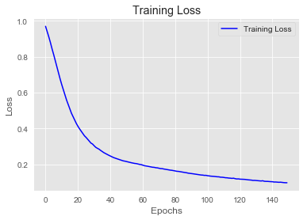


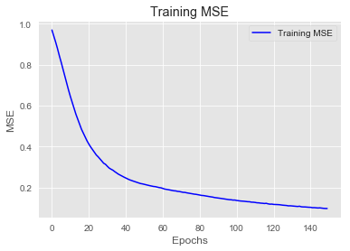


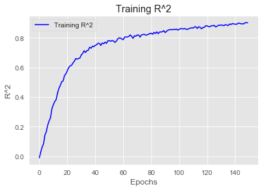


```python
overfit_preds_scaled = overfit_model.predict(X_test_Scaled)
overfit_preds = scaler.inverse_transform(overfit_preds_scaled)
rmse = np.sqrt(mean_squared_error(y_test, overfit_preds))

print('RMSE:', rmse)
print('-------------------------')
print(overfit_model.summary())
```

    WARNING:tensorflow:5 out of the last 13 calls to <function Model.make_predict_function.<locals>.predict_function at 0x000001A41D3BF840> triggered tf.function retracing. Tracing is expensive and the excessive number of tracings could be due to (1) creating @tf.function repeatedly in a loop, (2) passing tensors with different shapes, (3) passing Python objects instead of tensors. For (1), please define your @tf.function outside of the loop. For (2), @tf.function has experimental_relax_shapes=True option that relaxes argument shapes that can avoid unnecessary retracing. For (3), please refer to https://www.tensorflow.org/tutorials/customization/performance#python_or_tensor_args and https://www.tensorflow.org/api_docs/python/tf/function for  more details.
    RMSE: 0.31148173811226565
    -------------------------
    Model: "sequential_5"
    _________________________________________________________________
    Layer (type)                 Output Shape              Param #   
    =================================================================
    dense_21 (Dense)             (None, 10)                310       
    _________________________________________________________________
    dense_22 (Dense)             (None, 10)                110       
    _________________________________________________________________
    dense_23 (Dense)             (None, 10)                110       
    _________________________________________________________________
    dense_24 (Dense)             (None, 10)                110       
    _________________________________________________________________
    dense_25 (Dense)             (None, 1)                 11        
    =================================================================
    Total params: 651
    Trainable params: 651
    Non-trainable params: 0
    _________________________________________________________________
    None
    

### Regularized Model


```python
reg_model = Sequential()

reg_model.add(layers.Dense(10, kernel_regularizer=regularizers.L2(0.005),
                           activation='relu', input_shape=(n_features, )))

reg_model.add(layers.Dense(10, kernel_regularizer=regularizers.L2(0.005),
                           activation='relu'))

reg_model.add(layers.Dense(10, kernel_regularizer=regularizers.L2(0.005),
                           activation='relu'))

reg_model.add(layers.Dense(10, kernel_regularizer=regularizers.L2(0.005),
                           activation='relu'))

reg_model.add(layers.Dense(10, kernel_regularizer=regularizers.L2(0.005),
                           activation='relu'))

reg_model.add(layers.Dense(1, activation='linear'))

reg_model.compile(optimizer='SGD',
              loss='mse',
              metrics=['mse', coef_determination])

```


```python
reg_model.fit(X_train_Scaled,
                  y_train_Scaled,
                  epochs=150)
```

    Epoch 1/150
    14/14 [==============================] - 0s 927us/step - loss: 1.3549 - mse: 1.0648 - coef_determination: -0.1352
    Epoch 2/150
    14/14 [==============================] - 0s 925us/step - loss: 1.2349 - mse: 0.9467 - coef_determination: 0.0137
    Epoch 3/150
    14/14 [==============================] - 0s 926us/step - loss: 1.2098 - mse: 0.9225 - coef_determination: 0.0591
    Epoch 4/150
    14/14 [==============================] - 0s 972us/step - loss: 1.1925 - mse: 0.9061 - coef_determination: 0.0647
    Epoch 5/150
    14/14 [==============================] - 0s 829us/step - loss: 1.1788 - mse: 0.8930 - coef_determination: 0.0724
    Epoch 6/150
    14/14 [==============================] - 0s 858us/step - loss: 1.1665 - mse: 0.8812 - coef_determination: 0.0926
    Epoch 7/150
    14/14 [==============================] - 0s 855us/step - loss: 1.1547 - mse: 0.8699 - coef_determination: 0.0845
    Epoch 8/150
    14/14 [==============================] - 0s 956us/step - loss: 1.1421 - mse: 0.8578 - coef_determination: 0.1179
    Epoch 9/150
    14/14 [==============================] - 0s 722us/step - loss: 1.1301 - mse: 0.8463 - coef_determination: 0.1146
    Epoch 10/150
    14/14 [==============================] - 0s 784us/step - loss: 1.1192 - mse: 0.8358 - coef_determination: 0.1251
    Epoch 11/150
    14/14 [==============================] - 0s 784us/step - loss: 1.1072 - mse: 0.8240 - coef_determination: 0.1571
    Epoch 12/150
    14/14 [==============================] - 0s 712us/step - loss: 1.0964 - mse: 0.8136 - coef_determination: 0.1621
    Epoch 13/150
    14/14 [==============================] - 0s 701us/step - loss: 1.0865 - mse: 0.8040 - coef_determination: 0.1475
    Epoch 14/150
    14/14 [==============================] - 0s 784us/step - loss: 1.0747 - mse: 0.7925 - coef_determination: 0.1806
    Epoch 15/150
    14/14 [==============================] - 0s 855us/step - loss: 1.0635 - mse: 0.7817 - coef_determination: 0.1826
    Epoch 16/150
    14/14 [==============================] - 0s 930us/step - loss: 1.0480 - mse: 0.7663 - coef_determination: 0.1537
    Epoch 17/150
    14/14 [==============================] - 0s 764us/step - loss: 1.0285 - mse: 0.7470 - coef_determination: 0.2251
    Epoch 18/150
    14/14 [==============================] - 0s 851us/step - loss: 1.0053 - mse: 0.7240 - coef_determination: 0.2560
    Epoch 19/150
    14/14 [==============================] - 0s 783us/step - loss: 0.9757 - mse: 0.6947 - coef_determination: 0.2772
    Epoch 20/150
    14/14 [==============================] - 0s 855us/step - loss: 0.9439 - mse: 0.6628 - coef_determination: 0.3079
    Epoch 21/150
    14/14 [==============================] - 0s 784us/step - loss: 0.9141 - mse: 0.6333 - coef_determination: 0.3380
    Epoch 22/150
    14/14 [==============================] - 0s 841us/step - loss: 0.8820 - mse: 0.6012 - coef_determination: 0.4065
    Epoch 23/150
    14/14 [==============================] - 0s 783us/step - loss: 0.8498 - mse: 0.5694 - coef_determination: 0.4020
    Epoch 24/150
    14/14 [==============================] - 0s 642us/step - loss: 0.8222 - mse: 0.5418 - coef_determination: 0.4467
    Epoch 25/150
    14/14 [==============================] - 0s 712us/step - loss: 0.7982 - mse: 0.5183 - coef_determination: 0.4686
    Epoch 26/150
    14/14 [==============================] - 0s 751us/step - loss: 0.7727 - mse: 0.4931 - coef_determination: 0.4773
    Epoch 27/150
    14/14 [==============================] - 0s 712us/step - loss: 0.7489 - mse: 0.4695 - coef_determination: 0.5133
    Epoch 28/150
    14/14 [==============================] - 0s 712us/step - loss: 0.7264 - mse: 0.4473 - coef_determination: 0.5280
    Epoch 29/150
    14/14 [==============================] - 0s 784us/step - loss: 0.7048 - mse: 0.4261 - coef_determination: 0.5652
    Epoch 30/150
    14/14 [==============================] - 0s 834us/step - loss: 0.6879 - mse: 0.4099 - coef_determination: 0.5851
    Epoch 31/150
    14/14 [==============================] - 0s 784us/step - loss: 0.6707 - mse: 0.3930 - coef_determination: 0.5890
    Epoch 32/150
    14/14 [==============================] - 0s 824us/step - loss: 0.6599 - mse: 0.3826 - coef_determination: 0.6159
    Epoch 33/150
    14/14 [==============================] - 0s 784us/step - loss: 0.6457 - mse: 0.3688 - coef_determination: 0.6282
    Epoch 34/150
    14/14 [==============================] - 0s 855us/step - loss: 0.6352 - mse: 0.3587 - coef_determination: 0.6300
    Epoch 35/150
    14/14 [==============================] - 0s 855us/step - loss: 0.6261 - mse: 0.3501 - coef_determination: 0.6311
    Epoch 36/150
    14/14 [==============================] - 0s 786us/step - loss: 0.6174 - mse: 0.3417 - coef_determination: 0.6461
    Epoch 37/150
    14/14 [==============================] - 0s 784us/step - loss: 0.6065 - mse: 0.3314 - coef_determination: 0.6589
    Epoch 38/150
    14/14 [==============================] - 0s 715us/step - loss: 0.5945 - mse: 0.3199 - coef_determination: 0.6700
    Epoch 39/150
    14/14 [==============================] - 0s 715us/step - loss: 0.5930 - mse: 0.3187 - coef_determination: 0.6668
    Epoch 40/150
    14/14 [==============================] - 0s 829us/step - loss: 0.5829 - mse: 0.3091 - coef_determination: 0.6721
    Epoch 41/150
    14/14 [==============================] - 0s 783us/step - loss: 0.5716 - mse: 0.2983 - coef_determination: 0.6887
    Epoch 42/150
    14/14 [==============================] - 0s 809us/step - loss: 0.5648 - mse: 0.2919 - coef_determination: 0.6928
    Epoch 43/150
    14/14 [==============================] - 0s 712us/step - loss: 0.5574 - mse: 0.2849 - coef_determination: 0.7049
    Epoch 44/150
    14/14 [==============================] - 0s 855us/step - loss: 0.5516 - mse: 0.2797 - coef_determination: 0.7104
    Epoch 45/150
    14/14 [==============================] - 0s 712us/step - loss: 0.5468 - mse: 0.2753 - coef_determination: 0.7036
    Epoch 46/150
    14/14 [==============================] - 0s 855us/step - loss: 0.5390 - mse: 0.2679 - coef_determination: 0.7220
    Epoch 47/150
    14/14 [==============================] - 0s 792us/step - loss: 0.5321 - mse: 0.2615 - coef_determination: 0.7246
    Epoch 48/150
    14/14 [==============================] - 0s 764us/step - loss: 0.5276 - mse: 0.2576 - coef_determination: 0.7351
    Epoch 49/150
    14/14 [==============================] - 0s 785us/step - loss: 0.5213 - mse: 0.2518 - coef_determination: 0.7466
    Epoch 50/150
    14/14 [==============================] - 0s 855us/step - loss: 0.5208 - mse: 0.2518 - coef_determination: 0.7324
    Epoch 51/150
    14/14 [==============================] - 0s 2ms/step - loss: 0.5122 - mse: 0.2438 - coef_determination: 0.7559
    Epoch 52/150
    14/14 [==============================] - 0s 1ms/step - loss: 0.5092 - mse: 0.2413 - coef_determination: 0.7528
    Epoch 53/150
    14/14 [==============================] - 0s 1ms/step - loss: 0.5007 - mse: 0.2330 - coef_determination: 0.7552
    Epoch 54/150
    14/14 [==============================] - 0s 641us/step - loss: 0.5001 - mse: 0.2331 - coef_determination: 0.7495
    Epoch 55/150
    14/14 [==============================] - 0s 855us/step - loss: 0.4947 - mse: 0.2281 - coef_determination: 0.7652
    Epoch 56/150
    14/14 [==============================] - 0s 784us/step - loss: 0.4896 - mse: 0.2235 - coef_determination: 0.7629
    Epoch 57/150
    14/14 [==============================] - 0s 884us/step - loss: 0.4869 - mse: 0.2213 - coef_determination: 0.7644
    Epoch 58/150
    14/14 [==============================] - 0s 790us/step - loss: 0.4789 - mse: 0.2139 - coef_determination: 0.7822
    Epoch 59/150
    14/14 [==============================] - 0s 784us/step - loss: 0.4764 - mse: 0.2118 - coef_determination: 0.7813
    Epoch 60/150
    14/14 [==============================] - 0s 712us/step - loss: 0.4732 - mse: 0.2090 - coef_determination: 0.7856
    Epoch 61/150
    14/14 [==============================] - 0s 919us/step - loss: 0.4697 - mse: 0.2062 - coef_determination: 0.7830
    Epoch 62/150
    14/14 [==============================] - 0s 784us/step - loss: 0.4661 - mse: 0.2030 - coef_determination: 0.7756
    Epoch 63/150
    14/14 [==============================] - 0s 696us/step - loss: 0.4592 - mse: 0.1967 - coef_determination: 0.7941
    Epoch 64/150
    14/14 [==============================] - 0s 703us/step - loss: 0.4561 - mse: 0.1940 - coef_determination: 0.7908
    Epoch 65/150
    14/14 [==============================] - 0s 929us/step - loss: 0.4564 - mse: 0.1948 - coef_determination: 0.7977
    Epoch 66/150
    14/14 [==============================] - 0s 688us/step - loss: 0.4516 - mse: 0.1906 - coef_determination: 0.8014
    Epoch 67/150
    14/14 [==============================] - 0s 712us/step - loss: 0.4486 - mse: 0.1879 - coef_determination: 0.8115
    Epoch 68/150
    14/14 [==============================] - 0s 855us/step - loss: 0.4448 - mse: 0.1847 - coef_determination: 0.8067
    Epoch 69/150
    14/14 [==============================] - 0s 783us/step - loss: 0.4437 - mse: 0.1842 - coef_determination: 0.8039
    Epoch 70/150
    14/14 [==============================] - 0s 879us/step - loss: 0.4404 - mse: 0.1815 - coef_determination: 0.8156
    Epoch 71/150
    14/14 [==============================] - 0s 706us/step - loss: 0.4381 - mse: 0.1796 - coef_determination: 0.8102
    Epoch 72/150
    14/14 [==============================] - 0s 784us/step - loss: 0.4342 - mse: 0.1763 - coef_determination: 0.8247
    Epoch 73/150
    14/14 [==============================] - 0s 712us/step - loss: 0.4311 - mse: 0.1737 - coef_determination: 0.8124
    Epoch 74/150
    14/14 [==============================] - 0s 712us/step - loss: 0.4273 - mse: 0.1704 - coef_determination: 0.8256
    Epoch 75/150
    14/14 [==============================] - 0s 740us/step - loss: 0.4258 - mse: 0.1693 - coef_determination: 0.8266
    Epoch 76/150
    14/14 [==============================] - 0s 712us/step - loss: 0.4223 - mse: 0.1665 - coef_determination: 0.8259
    Epoch 77/150
    14/14 [==============================] - 0s 784us/step - loss: 0.4204 - mse: 0.1650 - coef_determination: 0.8284
    Epoch 78/150
    14/14 [==============================] - 0s 712us/step - loss: 0.4191 - mse: 0.1642 - coef_determination: 0.8303
    Epoch 79/150
    14/14 [==============================] - 0s 641us/step - loss: 0.4153 - mse: 0.1607 - coef_determination: 0.8328
    Epoch 80/150
    14/14 [==============================] - 0s 812us/step - loss: 0.4138 - mse: 0.1598 - coef_determination: 0.8282
    Epoch 81/150
    14/14 [==============================] - 0s 712us/step - loss: 0.4112 - mse: 0.1578 - coef_determination: 0.8330
    Epoch 82/150
    14/14 [==============================] - 0s 701us/step - loss: 0.4089 - mse: 0.1559 - coef_determination: 0.8407
    Epoch 83/150
    14/14 [==============================] - 0s 712us/step - loss: 0.4088 - mse: 0.1563 - coef_determination: 0.8234
    Epoch 84/150
    14/14 [==============================] - 0s 855us/step - loss: 0.4041 - mse: 0.1520 - coef_determination: 0.8424
    Epoch 85/150
    14/14 [==============================] - 0s 712us/step - loss: 0.4024 - mse: 0.1508 - coef_determination: 0.8465
    Epoch 86/150
    14/14 [==============================] - 0s 724us/step - loss: 0.4024 - mse: 0.1513 - coef_determination: 0.8488
    Epoch 87/150
    14/14 [==============================] - 0s 763us/step - loss: 0.3995 - mse: 0.1490 - coef_determination: 0.8435
    Epoch 88/150
    14/14 [==============================] - 0s 713us/step - loss: 0.3986 - mse: 0.1485 - coef_determination: 0.8457
    Epoch 89/150
    14/14 [==============================] - 0s 785us/step - loss: 0.3952 - mse: 0.1456 - coef_determination: 0.8403
    Epoch 90/150
    14/14 [==============================] - 0s 710us/step - loss: 0.3949 - mse: 0.1457 - coef_determination: 0.8523
    Epoch 91/150
    14/14 [==============================] - 0s 784us/step - loss: 0.3920 - mse: 0.1434 - coef_determination: 0.8497
    Epoch 92/150
    14/14 [==============================] - 0s 751us/step - loss: 0.3918 - mse: 0.1436 - coef_determination: 0.8530
    Epoch 93/150
    14/14 [==============================] - 0s 854us/step - loss: 0.3878 - mse: 0.1401 - coef_determination: 0.8580
    Epoch 94/150
    14/14 [==============================] - 0s 781us/step - loss: 0.3849 - mse: 0.1376 - coef_determination: 0.8521
    Epoch 95/150
    14/14 [==============================] - 0s 891us/step - loss: 0.3843 - mse: 0.1375 - coef_determination: 0.8599
    Epoch 96/150
    14/14 [==============================] - 0s 712us/step - loss: 0.3831 - mse: 0.1368 - coef_determination: 0.8510
    Epoch 97/150
    14/14 [==============================] - 0s 712us/step - loss: 0.3826 - mse: 0.1368 - coef_determination: 0.8580
    Epoch 98/150
    14/14 [==============================] - 0s 643us/step - loss: 0.3799 - mse: 0.1346 - coef_determination: 0.8496
    Epoch 99/150
    14/14 [==============================] - 0s 785us/step - loss: 0.3754 - mse: 0.1306 - coef_determination: 0.8631
    Epoch 100/150
    14/14 [==============================] - 0s 717us/step - loss: 0.3788 - mse: 0.1344 - coef_determination: 0.8644
    Epoch 101/150
    14/14 [==============================] - 0s 711us/step - loss: 0.3764 - mse: 0.1325 - coef_determination: 0.8393
    Epoch 102/150
    14/14 [==============================] - 0s 641us/step - loss: 0.3733 - mse: 0.1299 - coef_determination: 0.8568
    Epoch 103/150
    14/14 [==============================] - 0s 712us/step - loss: 0.3736 - mse: 0.1305 - coef_determination: 0.8679
    Epoch 104/150
    14/14 [==============================] - 0s 709us/step - loss: 0.3728 - mse: 0.1303 - coef_determination: 0.8612
    Epoch 105/150
    14/14 [==============================] - 0s 793us/step - loss: 0.3696 - mse: 0.1274 - coef_determination: 0.8692
    Epoch 106/150
    14/14 [==============================] - 0s 784us/step - loss: 0.3698 - mse: 0.1281 - coef_determination: 0.8749
    Epoch 107/150
    14/14 [==============================] - 0s 666us/step - loss: 0.3671 - mse: 0.1259 - coef_determination: 0.8651
    Epoch 108/150
    14/14 [==============================] - 0s 784us/step - loss: 0.3657 - mse: 0.1250 - coef_determination: 0.8703
    Epoch 109/150
    14/14 [==============================] - 0s 762us/step - loss: 0.3656 - mse: 0.1253 - coef_determination: 0.8671
    Epoch 110/150
    14/14 [==============================] - 0s 787us/step - loss: 0.3633 - mse: 0.1235 - coef_determination: 0.8650
    Epoch 111/150
    14/14 [==============================] - 0s 784us/step - loss: 0.3612 - mse: 0.1218 - coef_determination: 0.8697
    Epoch 112/150
    14/14 [==============================] - 0s 698us/step - loss: 0.3601 - mse: 0.1211 - coef_determination: 0.8767
    Epoch 113/150
    14/14 [==============================] - 0s 641us/step - loss: 0.3626 - mse: 0.1242 - coef_determination: 0.8625
    Epoch 114/150
    14/14 [==============================] - 0s 796us/step - loss: 0.3573 - mse: 0.1194 - coef_determination: 0.8752
    Epoch 115/150
    14/14 [==============================] - 0s 715us/step - loss: 0.3576 - mse: 0.1201 - coef_determination: 0.8689
    Epoch 116/150
    14/14 [==============================] - 0s 698us/step - loss: 0.3591 - mse: 0.1219 - coef_determination: 0.8670
    Epoch 117/150
    14/14 [==============================] - 0s 711us/step - loss: 0.3547 - mse: 0.1180 - coef_determination: 0.8787
    Epoch 118/150
    14/14 [==============================] - 0s 713us/step - loss: 0.3547 - mse: 0.1184 - coef_determination: 0.8752
    Epoch 119/150
    14/14 [==============================] - 0s 716us/step - loss: 0.3545 - mse: 0.1186 - coef_determination: 0.8749
    Epoch 120/150
    14/14 [==============================] - 0s 712us/step - loss: 0.3516 - mse: 0.1162 - coef_determination: 0.8797
    Epoch 121/150
    14/14 [==============================] - 0s 712us/step - loss: 0.3510 - mse: 0.1161 - coef_determination: 0.8829
    Epoch 122/150
    14/14 [==============================] - 0s 712us/step - loss: 0.3499 - mse: 0.1154 - coef_determination: 0.8704
    Epoch 123/150
    14/14 [==============================] - 0s 784us/step - loss: 0.3485 - mse: 0.1144 - coef_determination: 0.8799
    Epoch 124/150
    14/14 [==============================] - 0s 712us/step - loss: 0.3461 - mse: 0.1125 - coef_determination: 0.8849
    Epoch 125/150
    14/14 [==============================] - 0s 712us/step - loss: 0.3465 - mse: 0.1133 - coef_determination: 0.8896
    Epoch 126/150
    14/14 [==============================] - 0s 642us/step - loss: 0.3462 - mse: 0.1135 - coef_determination: 0.8820
    Epoch 127/150
    14/14 [==============================] - 0s 712us/step - loss: 0.3445 - mse: 0.1121 - coef_determination: 0.8804
    Epoch 128/150
    14/14 [==============================] - 0s 712us/step - loss: 0.3445 - mse: 0.1126 - coef_determination: 0.8811
    Epoch 129/150
    14/14 [==============================] - 0s 785us/step - loss: 0.3423 - mse: 0.1107 - coef_determination: 0.8780
    Epoch 130/150
    14/14 [==============================] - 0s 641us/step - loss: 0.3424 - mse: 0.1113 - coef_determination: 0.8868
    Epoch 131/150
    14/14 [==============================] - 0s 784us/step - loss: 0.3402 - mse: 0.1095 - coef_determination: 0.8867
    Epoch 132/150
    14/14 [==============================] - 0s 836us/step - loss: 0.3394 - mse: 0.1092 - coef_determination: 0.8902
    Epoch 133/150
    14/14 [==============================] - ETA: 0s - loss: 0.2852 - mse: 0.0552 - coef_determination: 0.95 - 0s 749us/step - loss: 0.3386 - mse: 0.1088 - coef_determination: 0.8862
    Epoch 134/150
    14/14 [==============================] - 0s 855us/step - loss: 0.3359 - mse: 0.1064 - coef_determination: 0.8858
    Epoch 135/150
    14/14 [==============================] - 0s 855us/step - loss: 0.3358 - mse: 0.1069 - coef_determination: 0.8878
    Epoch 136/150
    14/14 [==============================] - 0s 784us/step - loss: 0.3384 - mse: 0.1098 - coef_determination: 0.8933
    Epoch 137/150
    14/14 [==============================] - 0s 711us/step - loss: 0.3349 - mse: 0.1067 - coef_determination: 0.8948
    Epoch 138/150
    14/14 [==============================] - 0s 712us/step - loss: 0.3346 - mse: 0.1069 - coef_determination: 0.8865
    Epoch 139/150
    14/14 [==============================] - 0s 627us/step - loss: 0.3335 - mse: 0.1061 - coef_determination: 0.8944
    Epoch 140/150
    14/14 [==============================] - 0s 712us/step - loss: 0.3327 - mse: 0.1057 - coef_determination: 0.8879
    Epoch 141/150
    14/14 [==============================] - 0s 784us/step - loss: 0.3308 - mse: 0.1043 - coef_determination: 0.8786
    Epoch 142/150
    14/14 [==============================] - 0s 784us/step - loss: 0.3298 - mse: 0.1037 - coef_determination: 0.8768
    Epoch 143/150
    14/14 [==============================] - 0s 784us/step - loss: 0.3287 - mse: 0.1030 - coef_determination: 0.8853
    Epoch 144/150
    14/14 [==============================] - 0s 752us/step - loss: 0.3281 - mse: 0.1028 - coef_determination: 0.8888
    Epoch 145/150
    14/14 [==============================] - 0s 784us/step - loss: 0.3296 - mse: 0.1046 - coef_determination: 0.8901
    Epoch 146/150
    14/14 [==============================] - 0s 712us/step - loss: 0.3252 - mse: 0.1008 - coef_determination: 0.8938
    Epoch 147/150
    14/14 [==============================] - 0s 712us/step - loss: 0.3264 - mse: 0.1023 - coef_determination: 0.9015
    Epoch 148/150
    14/14 [==============================] - 0s 784us/step - loss: 0.3276 - mse: 0.1039 - coef_determination: 0.8850
    Epoch 149/150
    14/14 [==============================] - 0s 712us/step - loss: 0.3251 - mse: 0.1018 - coef_determination: 0.8839
    Epoch 150/150
    14/14 [==============================] - 0s 712us/step - loss: 0.3242 - mse: 0.1012 - coef_determination: 0.8898
    


    <tensorflow.python.keras.callbacks.History at 0x1a41e3af9e8>


```python
visualize_loss_MSE(reg_model.history)
```


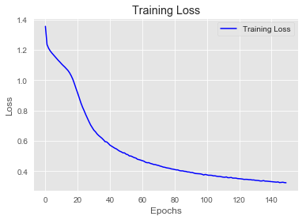


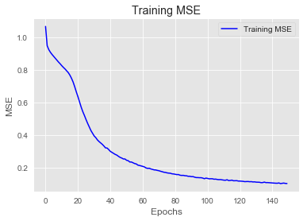


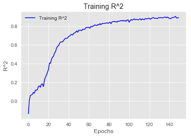


```python
reg_preds_scaled = reg_model.predict(X_test_Scaled)
reg_preds = scaler.inverse_transform(reg_preds_scaled)
rmse = np.sqrt(mean_squared_error(y_test, reg_preds))

print('RMSE:', rmse)
print('-------------------------')
print(reg_model.summary())
```

    WARNING:tensorflow:5 out of the last 13 calls to <function Model.make_predict_function.<locals>.predict_function at 0x000001A41B732EA0> triggered tf.function retracing. Tracing is expensive and the excessive number of tracings could be due to (1) creating @tf.function repeatedly in a loop, (2) passing tensors with different shapes, (3) passing Python objects instead of tensors. For (1), please define your @tf.function outside of the loop. For (2), @tf.function has experimental_relax_shapes=True option that relaxes argument shapes that can avoid unnecessary retracing. For (3), please refer to https://www.tensorflow.org/tutorials/customization/performance#python_or_tensor_args and https://www.tensorflow.org/api_docs/python/tf/function for  more details.
    RMSE: 0.32427166685622894
    -------------------------
    Model: "sequential_6"
    _________________________________________________________________
    Layer (type)                 Output Shape              Param #   
    =================================================================
    dense_26 (Dense)             (None, 10)                310       
    _________________________________________________________________
    dense_27 (Dense)             (None, 10)                110       
    _________________________________________________________________
    dense_28 (Dense)             (None, 10)                110       
    _________________________________________________________________
    dense_29 (Dense)             (None, 10)                110       
    _________________________________________________________________
    dense_30 (Dense)             (None, 10)                110       
    _________________________________________________________________
    dense_31 (Dense)             (None, 1)                 11        
    =================================================================
    Total params: 761
    Trainable params: 761
    Non-trainable params: 0
    _________________________________________________________________
    None
    

### Optimized Model


```python
optimized_model = Sequential()

optimized_model.add(layers.Dense(45,
                                  kernel_regularizer=regularizers.L2(0.005),
                           activation='relu', input_shape=(n_features, )))

optimized_model.add(layers.Dense(15,
                                  kernel_regularizer=regularizers.L2(0.005),
                           activation='relu'))

optimized_model.add(layers.Dense(3,
                                  kernel_regularizer=regularizers.L2(0.005),
                           activation='relu'))

optimized_model.add(layers.Dense(1, activation='linear'))

optimized_model.compile(optimizer='RMSprop',
              loss='mse',
              metrics=['mse', coef_determination])
```


```python
import time

# NAME = 'Optimal Model -relu- Layers(D34L2 & D15L2 & D3L2)'

# tensorboard = TensorBoard(log_dir='logs/fit/' + NAME,
#                           histogram_freq=1,
#                           write_graph=True,
#                           write_images=True)

# callbacks = [tensorboard]


optimized_model.fit(X_train_Scaled,
                     y_train_Scaled,
                     epochs=150,
                     batch_size=15)
# ,
#                      callbacks = callbacks)
```

    Epoch 1/150
    30/30 [==============================] - 0s 698us/step - loss: 1.2431 - mse: 0.9391 - coef_determination: -0.4011
    Epoch 2/150
    30/30 [==============================] - 0s 856us/step - loss: 0.9430 - mse: 0.6450 - coef_determination: -14.2767
    Epoch 3/150
    30/30 [==============================] - 0s 765us/step - loss: 0.7787 - mse: 0.4861 - coef_determination: 0.4737
    Epoch 4/150
    30/30 [==============================] - 0s 831us/step - loss: 0.6667 - mse: 0.3803 - coef_determination: 0.5619
    Epoch 5/150
    30/30 [==============================] - 0s 798us/step - loss: 0.5947 - mse: 0.3152 - coef_determination: 0.6537
    Epoch 6/150
    30/30 [==============================] - 0s 864us/step - loss: 0.5449 - mse: 0.2726 - coef_determination: 0.7112
    Epoch 7/150
    30/30 [==============================] - 0s 786us/step - loss: 0.5044 - mse: 0.2394 - coef_determination: 0.6914
    Epoch 8/150
    30/30 [==============================] - 0s 784us/step - loss: 0.4730 - mse: 0.2145 - coef_determination: 0.7418
    Epoch 9/150
    30/30 [==============================] - 0s 820us/step - loss: 0.4459 - mse: 0.1943 - coef_determination: 0.7709
    Epoch 10/150
    30/30 [==============================] - 0s 765us/step - loss: 0.4203 - mse: 0.1749 - coef_determination: 0.7986
    Epoch 11/150
    30/30 [==============================] - 0s 798us/step - loss: 0.4021 - mse: 0.1629 - coef_determination: 0.7966
    Epoch 12/150
    30/30 [==============================] - 0s 900us/step - loss: 0.3806 - mse: 0.1472 - coef_determination: 0.8296
    Epoch 13/150
    30/30 [==============================] - 0s 964us/step - loss: 0.3659 - mse: 0.1384 - coef_determination: 0.8546
    Epoch 14/150
    30/30 [==============================] - 0s 899us/step - loss: 0.3513 - mse: 0.1295 - coef_determination: 0.8570
    Epoch 15/150
    30/30 [==============================] - 0s 791us/step - loss: 0.3366 - mse: 0.1207 - coef_determination: 0.8125
    Epoch 16/150
    30/30 [==============================] - 0s 795us/step - loss: 0.3216 - mse: 0.1111 - coef_determination: 0.8718
    Epoch 17/150
    30/30 [==============================] - 0s 788us/step - loss: 0.3115 - mse: 0.1064 - coef_determination: 0.8737
    Epoch 18/150
    30/30 [==============================] - 0s 769us/step - loss: 0.2961 - mse: 0.0963 - coef_determination: 0.8892
    Epoch 19/150
    30/30 [==============================] - 0s 733us/step - loss: 0.2864 - mse: 0.0926 - coef_determination: 0.9006
    Epoch 20/150
    30/30 [==============================] - 0s 731us/step - loss: 0.2740 - mse: 0.0860 - coef_determination: 0.9040
    Epoch 21/150
    30/30 [==============================] - 0s 732us/step - loss: 0.2639 - mse: 0.0810 - coef_determination: 0.9089
    Epoch 22/150
    30/30 [==============================] - 0s 759us/step - loss: 0.2587 - mse: 0.0809 - coef_determination: 0.9141
    Epoch 23/150
    30/30 [==============================] - 0s 731us/step - loss: 0.2460 - mse: 0.0725 - coef_determination: 0.9108
    Epoch 24/150
    30/30 [==============================] - 0s 658us/step - loss: 0.2384 - mse: 0.0698 - coef_determination: 0.8472
    Epoch 25/150
    30/30 [==============================] - 0s 698us/step - loss: 0.2342 - mse: 0.0701 - coef_determination: 0.9238
    Epoch 26/150
    30/30 [==============================] - 0s 632us/step - loss: 0.2216 - mse: 0.0623 - coef_determination: 0.9243
    Epoch 27/150
    30/30 [==============================] - 0s 698us/step - loss: 0.2207 - mse: 0.0655 - coef_determination: 0.8963
    Epoch 28/150
    30/30 [==============================] - 0s 719us/step - loss: 0.2150 - mse: 0.0641 - coef_determination: 0.9309
    Epoch 29/150
    30/30 [==============================] - 0s 700us/step - loss: 0.2096 - mse: 0.0626 - coef_determination: 0.9340
    Epoch 30/150
    30/30 [==============================] - 0s 698us/step - loss: 0.2035 - mse: 0.0599 - coef_determination: 0.9277
    Epoch 31/150
    30/30 [==============================] - 0s 667us/step - loss: 0.2018 - mse: 0.0614 - coef_determination: 0.9273
    Epoch 32/150
    30/30 [==============================] - 0s 689us/step - loss: 0.1990 - mse: 0.0617 - coef_determination: 0.9346
    Epoch 33/150
    30/30 [==============================] - 0s 698us/step - loss: 0.1835 - mse: 0.0492 - coef_determination: 0.9496
    Epoch 34/150
    30/30 [==============================] - 0s 690us/step - loss: 0.1884 - mse: 0.0573 - coef_determination: 0.9390
    Epoch 35/150
    30/30 [==============================] - 0s 725us/step - loss: 0.1817 - mse: 0.0536 - coef_determination: 0.9400
    Epoch 36/150
    30/30 [==============================] - 0s 766us/step - loss: 0.1760 - mse: 0.0507 - coef_determination: 0.9424
    Epoch 37/150
    30/30 [==============================] - 0s 715us/step - loss: 0.1708 - mse: 0.0485 - coef_determination: 0.9113
    Epoch 38/150
    30/30 [==============================] - 0s 659us/step - loss: 0.1697 - mse: 0.0500 - coef_determination: 0.9239
    Epoch 39/150
    30/30 [==============================] - 0s 715us/step - loss: 0.1706 - mse: 0.0536 - coef_determination: 0.9462
    Epoch 40/150
    30/30 [==============================] - 0s 632us/step - loss: 0.1660 - mse: 0.0513 - coef_determination: 0.9473
    Epoch 41/150
    30/30 [==============================] - 0s 631us/step - loss: 0.1620 - mse: 0.0495 - coef_determination: 0.9483
    Epoch 42/150
    30/30 [==============================] - 0s 665us/step - loss: 0.1598 - mse: 0.0496 - coef_determination: 0.9457
    Epoch 43/150
    30/30 [==============================] - 0s 665us/step - loss: 0.1561 - mse: 0.0482 - coef_determination: 0.9310
    Epoch 44/150
    30/30 [==============================] - ETA: 0s - loss: 0.1324 - mse: 0.0256 - coef_determination: 0.97 - 0s 654us/step - loss: 0.1546 - mse: 0.0484 - coef_determination: 0.9501
    Epoch 45/150
    30/30 [==============================] - 0s 701us/step - loss: 0.1533 - mse: 0.0489 - coef_determination: 0.5938
    Epoch 46/150
    30/30 [==============================] - 0s 665us/step - loss: 0.1512 - mse: 0.0487 - coef_determination: 0.9449
    Epoch 47/150
    30/30 [==============================] - 0s 665us/step - loss: 0.1470 - mse: 0.0462 - coef_determination: 0.9484
    Epoch 48/150
    30/30 [==============================] - 0s 696us/step - loss: 0.1446 - mse: 0.0455 - coef_determination: 0.9493
    Epoch 49/150
    30/30 [==============================] - 0s 665us/step - loss: 0.1419 - mse: 0.0448 - coef_determination: 0.9459
    Epoch 50/150
    30/30 [==============================] - 0s 698us/step - loss: 0.1430 - mse: 0.0474 - coef_determination: 0.9521
    Epoch 51/150
    30/30 [==============================] - 0s 731us/step - loss: 0.1412 - mse: 0.0471 - coef_determination: 0.9360
    Epoch 52/150
    30/30 [==============================] - 0s 698us/step - loss: 0.1396 - mse: 0.0470 - coef_determination: 0.9517
    Epoch 53/150
    30/30 [==============================] - 0s 782us/step - loss: 0.1372 - mse: 0.0458 - coef_determination: 0.9534
    Epoch 54/150
    30/30 [==============================] - 0s 716us/step - loss: 0.1346 - mse: 0.0445 - coef_determination: 0.9572
    Epoch 55/150
    30/30 [==============================] - 0s 698us/step - loss: 0.1302 - mse: 0.0415 - coef_determination: 0.9563
    Epoch 56/150
    30/30 [==============================] - 0s 731us/step - loss: 0.1335 - mse: 0.0461 - coef_determination: 0.9445
    Epoch 57/150
    30/30 [==============================] - 0s 724us/step - loss: 0.1318 - mse: 0.0458 - coef_determination: 0.9467
    Epoch 58/150
    30/30 [==============================] - 0s 631us/step - loss: 0.1305 - mse: 0.0457 - coef_determination: 0.9446
    Epoch 59/150
    30/30 [==============================] - 0s 731us/step - loss: 0.1262 - mse: 0.0423 - coef_determination: 0.9545
    Epoch 60/150
    30/30 [==============================] - 0s 632us/step - loss: 0.1262 - mse: 0.0434 - coef_determination: 0.9522
    Epoch 61/150
    30/30 [==============================] - 0s 632us/step - loss: 0.1210 - mse: 0.0394 - coef_determination: 0.9581
    Epoch 62/150
    30/30 [==============================] - 0s 632us/step - loss: 0.1216 - mse: 0.0411 - coef_determination: 0.9467
    Epoch 63/150
    30/30 [==============================] - 0s 651us/step - loss: 0.1238 - mse: 0.0440 - coef_determination: 0.9411
    Epoch 64/150
    30/30 [==============================] - 0s 665us/step - loss: 0.1213 - mse: 0.0427 - coef_determination: 0.9538
    Epoch 65/150
    30/30 [==============================] - 0s 698us/step - loss: 0.1218 - mse: 0.0444 - coef_determination: 0.9401
    Epoch 66/150
    30/30 [==============================] - 0s 701us/step - loss: 0.1174 - mse: 0.0408 - coef_determination: 0.9572
    Epoch 67/150
    30/30 [==============================] - 0s 698us/step - loss: 0.1174 - mse: 0.0418 - coef_determination: 0.9201
    Epoch 68/150
    30/30 [==============================] - 0s 598us/step - loss: 0.1214 - mse: 0.0469 - coef_determination: 0.9509
    Epoch 69/150
    30/30 [==============================] - 0s 632us/step - loss: 0.1176 - mse: 0.0437 - coef_determination: 0.9294
    Epoch 70/150
    30/30 [==============================] - 0s 669us/step - loss: 0.1131 - mse: 0.0396 - coef_determination: 0.7703
    Epoch 71/150
    30/30 [==============================] - 0s 698us/step - loss: 0.1140 - mse: 0.0412 - coef_determination: 0.9545
    Epoch 72/150
    30/30 [==============================] - 0s 665us/step - loss: 0.1128 - mse: 0.0406 - coef_determination: 0.9574
    Epoch 73/150
    30/30 [==============================] - 0s 698us/step - loss: 0.1129 - mse: 0.0415 - coef_determination: 0.9590
    Epoch 74/150
    30/30 [==============================] - 0s 797us/step - loss: 0.1098 - mse: 0.0391 - coef_determination: 0.9561
    Epoch 75/150
    30/30 [==============================] - 0s 665us/step - loss: 0.1135 - mse: 0.0436 - coef_determination: 0.9499
    Epoch 76/150
    30/30 [==============================] - 0s 656us/step - loss: 0.1125 - mse: 0.0433 - coef_determination: 0.9535
    Epoch 77/150
    30/30 [==============================] - 0s 696us/step - loss: 0.1112 - mse: 0.0426 - coef_determination: 0.9515
    Epoch 78/150
    30/30 [==============================] - 0s 602us/step - loss: 0.1108 - mse: 0.0426 - coef_determination: 0.9497
    Epoch 79/150
    30/30 [==============================] - 0s 649us/step - loss: 0.1080 - mse: 0.0404 - coef_determination: 0.9159
    Epoch 80/150
    30/30 [==============================] - 0s 698us/step - loss: 0.1080 - mse: 0.0409 - coef_determination: 0.8119
    Epoch 81/150
    30/30 [==============================] - ETA: 0s - loss: 0.1292 - mse: 0.0623 - coef_determination: 0.87 - 0s 698us/step - loss: 0.1099 - mse: 0.0433 - coef_determination: 0.9527
    Epoch 82/150
    30/30 [==============================] - 0s 699us/step - loss: 0.1053 - mse: 0.0392 - coef_determination: 0.9599
    Epoch 83/150
    30/30 [==============================] - 0s 698us/step - loss: 0.1074 - mse: 0.0417 - coef_determination: 0.9563
    Epoch 84/150
    30/30 [==============================] - 0s 731us/step - loss: 0.1025 - mse: 0.0375 - coef_determination: 0.9615
    Epoch 85/150
    30/30 [==============================] - 0s 765us/step - loss: 0.1044 - mse: 0.0399 - coef_determination: 0.9489
    Epoch 86/150
    30/30 [==============================] - 0s 687us/step - loss: 0.1009 - mse: 0.0367 - coef_determination: 0.8220
    Epoch 87/150
    30/30 [==============================] - 0s 698us/step - loss: 0.1033 - mse: 0.0393 - coef_determination: 0.9565
    Epoch 88/150
    30/30 [==============================] - 0s 665us/step - loss: 0.1055 - mse: 0.0421 - coef_determination: 0.9578
    Epoch 89/150
    30/30 [==============================] - 0s 731us/step - loss: 0.1038 - mse: 0.0412 - coef_determination: 0.6886
    Epoch 90/150
    30/30 [==============================] - 0s 730us/step - loss: 0.1005 - mse: 0.0384 - coef_determination: 0.9486
    Epoch 91/150
    30/30 [==============================] - 0s 665us/step - loss: 0.1013 - mse: 0.0394 - coef_determination: -0.5806
    Epoch 92/150
    30/30 [==============================] - 0s 717us/step - loss: 0.1004 - mse: 0.0386 - coef_determination: 0.9607
    Epoch 93/150
    30/30 [==============================] - 0s 763us/step - loss: 0.0999 - mse: 0.0389 - coef_determination: 0.9529
    Epoch 94/150
    30/30 [==============================] - 0s 690us/step - loss: 0.0992 - mse: 0.0386 - coef_determination: 0.9560
    Epoch 95/150
    30/30 [==============================] - 0s 733us/step - loss: 0.0974 - mse: 0.0367 - coef_determination: 0.9588
    Epoch 96/150
    30/30 [==============================] - 0s 730us/step - loss: 0.0969 - mse: 0.0367 - coef_determination: 0.9536
    Epoch 97/150
    30/30 [==============================] - 0s 665us/step - loss: 0.0989 - mse: 0.0393 - coef_determination: 0.9545
    Epoch 98/150
    30/30 [==============================] - 0s 1ms/step - loss: 0.0997 - mse: 0.0403 - coef_determination: 0.9514
    Epoch 99/150
    30/30 [==============================] - 0s 898us/step - loss: 0.0966 - mse: 0.0376 - coef_determination: 0.9591
    Epoch 100/150
    30/30 [==============================] - 0s 747us/step - loss: 0.0950 - mse: 0.0365 - coef_determination: 0.9601
    Epoch 101/150
    30/30 [==============================] - 0s 733us/step - loss: 0.0951 - mse: 0.0372 - coef_determination: 0.9557
    Epoch 102/150
    30/30 [==============================] - 0s 740us/step - loss: 0.0946 - mse: 0.0366 - coef_determination: 0.9538
    Epoch 103/150
    30/30 [==============================] - 0s 698us/step - loss: 0.0931 - mse: 0.0355 - coef_determination: 0.9609
    Epoch 104/150
    30/30 [==============================] - 0s 664us/step - loss: 0.0887 - mse: 0.0315 - coef_determination: 0.9571
    Epoch 105/150
    30/30 [==============================] - 0s 691us/step - loss: 0.0974 - mse: 0.0405 - coef_determination: 0.9519
    Epoch 106/150
    30/30 [==============================] - 0s 698us/step - loss: 0.0938 - mse: 0.0372 - coef_determination: 0.9581
    Epoch 107/150
    30/30 [==============================] - 0s 797us/step - loss: 0.0943 - mse: 0.0381 - coef_determination: 0.9575
    Epoch 108/150
    30/30 [==============================] - 0s 741us/step - loss: 0.0933 - mse: 0.0373 - coef_determination: 0.9576
    Epoch 109/150
    30/30 [==============================] - 0s 769us/step - loss: 0.0930 - mse: 0.0375 - coef_determination: 0.9597
    Epoch 110/150
    30/30 [==============================] - 0s 658us/step - loss: 0.0934 - mse: 0.0379 - coef_determination: 0.9377
    Epoch 111/150
    30/30 [==============================] - 0s 664us/step - loss: 0.0936 - mse: 0.0386 - coef_determination: 0.9430
    Epoch 112/150
    30/30 [==============================] - 0s 666us/step - loss: 0.0911 - mse: 0.0361 - coef_determination: 0.9547
    Epoch 113/150
    30/30 [==============================] - 0s 731us/step - loss: 0.0912 - mse: 0.0363 - coef_determination: 0.9580
    Epoch 114/150
    30/30 [==============================] - 0s 731us/step - loss: 0.0919 - mse: 0.0373 - coef_determination: 0.9621
    Epoch 115/150
    30/30 [==============================] - 0s 765us/step - loss: 0.0924 - mse: 0.0382 - coef_determination: 0.9600
    Epoch 116/150
    30/30 [==============================] - 0s 764us/step - loss: 0.0914 - mse: 0.0374 - coef_determination: 0.9613
    Epoch 117/150
    30/30 [==============================] - 0s 719us/step - loss: 0.0881 - mse: 0.0343 - coef_determination: 0.9619
    Epoch 118/150
    30/30 [==============================] - 0s 653us/step - loss: 0.0917 - mse: 0.0379 - coef_determination: 0.9581
    Epoch 119/150
    30/30 [==============================] - 0s 632us/step - loss: 0.0871 - mse: 0.0336 - coef_determination: 0.9091
    Epoch 120/150
    30/30 [==============================] - 0s 752us/step - loss: 0.0924 - mse: 0.0393 - coef_determination: 0.9550
    Epoch 121/150
    30/30 [==============================] - 0s 766us/step - loss: 0.0877 - mse: 0.0345 - coef_determination: 0.9610
    Epoch 122/150
    30/30 [==============================] - 0s 736us/step - loss: 0.0878 - mse: 0.0350 - coef_determination: 0.9368
    Epoch 123/150
    30/30 [==============================] - 0s 757us/step - loss: 0.0880 - mse: 0.0353 - coef_determination: 0.9628
    Epoch 124/150
    30/30 [==============================] - 0s 697us/step - loss: 0.0898 - mse: 0.0373 - coef_determination: 0.9500
    Epoch 125/150
    30/30 [==============================] - 0s 765us/step - loss: 0.0912 - mse: 0.0389 - coef_determination: 0.9575
    Epoch 126/150
    30/30 [==============================] - 0s 756us/step - loss: 0.0905 - mse: 0.0386 - coef_determination: 0.9541
    Epoch 127/150
    30/30 [==============================] - 0s 724us/step - loss: 0.0892 - mse: 0.0374 - coef_determination: 0.9640
    Epoch 128/150
    30/30 [==============================] - 0s 758us/step - loss: 0.0890 - mse: 0.0373 - coef_determination: 0.9572
    Epoch 129/150
    30/30 [==============================] - 0s 664us/step - loss: 0.0869 - mse: 0.0354 - coef_determination: 0.8369
    Epoch 130/150
    30/30 [==============================] - 0s 698us/step - loss: 0.0844 - mse: 0.0332 - coef_determination: 0.9676
    Epoch 131/150
    30/30 [==============================] - 0s 670us/step - loss: 0.0864 - mse: 0.0354 - coef_determination: 0.9546
    Epoch 132/150
    30/30 [==============================] - 0s 772us/step - loss: 0.0885 - mse: 0.0378 - coef_determination: 0.8144
    Epoch 133/150
    30/30 [==============================] - 0s 731us/step - loss: 0.0833 - mse: 0.0329 - coef_determination: 0.9681
    Epoch 134/150
    30/30 [==============================] - 0s 732us/step - loss: 0.0854 - mse: 0.0351 - coef_determination: 0.9564
    Epoch 135/150
    30/30 [==============================] - 0s 751us/step - loss: 0.0847 - mse: 0.0346 - coef_determination: 0.9525
    Epoch 136/150
    30/30 [==============================] - 0s 765us/step - loss: 0.0858 - mse: 0.0361 - coef_determination: 0.9590
    Epoch 137/150
    30/30 [==============================] - 0s 846us/step - loss: 0.0843 - mse: 0.0347 - coef_determination: 0.9630
    Epoch 138/150
    30/30 [==============================] - 0s 791us/step - loss: 0.0854 - mse: 0.0360 - coef_determination: 0.9649
    Epoch 139/150
    30/30 [==============================] - 0s 721us/step - loss: 0.0841 - mse: 0.0349 - coef_determination: 0.9618
    Epoch 140/150
    30/30 [==============================] - 0s 726us/step - loss: 0.0832 - mse: 0.0340 - coef_determination: 0.9632
    Epoch 141/150
    30/30 [==============================] - 0s 698us/step - loss: 0.0858 - mse: 0.0368 - coef_determination: 0.9513
    Epoch 142/150
    30/30 [==============================] - 0s 720us/step - loss: 0.0819 - mse: 0.0331 - coef_determination: 0.9503
    Epoch 143/150
    30/30 [==============================] - 0s 731us/step - loss: 0.0834 - mse: 0.0348 - coef_determination: 0.9134
    Epoch 144/150
    30/30 [==============================] - 0s 831us/step - loss: 0.0856 - mse: 0.0373 - coef_determination: 0.9591
    Epoch 145/150
    30/30 [==============================] - 0s 764us/step - loss: 0.0857 - mse: 0.0377 - coef_determination: 0.9524
    Epoch 146/150
    30/30 [==============================] - 0s 730us/step - loss: 0.0823 - mse: 0.0344 - coef_determination: 0.9619
    Epoch 147/150
    30/30 [==============================] - 0s 765us/step - loss: 0.0801 - mse: 0.0324 - coef_determination: 0.9639
    Epoch 148/150
    30/30 [==============================] - 0s 798us/step - loss: 0.0865 - mse: 0.0390 - coef_determination: 0.9597
    Epoch 149/150
    30/30 [==============================] - 0s 765us/step - loss: 0.0811 - mse: 0.0336 - coef_determination: 0.9628
    Epoch 150/150
    30/30 [==============================] - 0s 709us/step - loss: 0.0836 - mse: 0.0364 - coef_determination: 0.9575
    


    <tensorflow.python.keras.callbacks.History at 0x1a41ec3d358>


```python
visualize_loss_MSE(optimized_model.history)
```


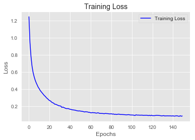


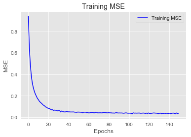


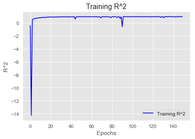


```python
op_preds_scaled = optimized_model.predict(X_test_Scaled)
op_preds = scaler.inverse_transform(op_preds_scaled)
rmse = np.sqrt(mean_squared_error(y_test, op_preds))

print('RMSE:', rmse)
print('-------------------------')
print(optimized_model.summary())
```

    WARNING:tensorflow:5 out of the last 13 calls to <function Model.make_predict_function.<locals>.predict_function at 0x000001A41EA59D90> triggered tf.function retracing. Tracing is expensive and the excessive number of tracings could be due to (1) creating @tf.function repeatedly in a loop, (2) passing tensors with different shapes, (3) passing Python objects instead of tensors. For (1), please define your @tf.function outside of the loop. For (2), @tf.function has experimental_relax_shapes=True option that relaxes argument shapes that can avoid unnecessary retracing. For (3), please refer to https://www.tensorflow.org/tutorials/customization/performance#python_or_tensor_args and https://www.tensorflow.org/api_docs/python/tf/function for  more details.
    RMSE: 0.27409887941013006
    -------------------------
    Model: "sequential_8"
    _________________________________________________________________
    Layer (type)                 Output Shape              Param #   
    =================================================================
    dense_36 (Dense)             (None, 45)                1395      
    _________________________________________________________________
    dense_37 (Dense)             (None, 15)                690       
    _________________________________________________________________
    dense_38 (Dense)             (None, 3)                 48        
    _________________________________________________________________
    dense_39 (Dense)             (None, 1)                 4         
    =================================================================
    Total params: 2,137
    Trainable params: 2,137
    Non-trainable params: 0
    _________________________________________________________________
    None
    


```python

```
