# Belize

## Import Data


```python
import pandas as pd
import matplotlib.pyplot as plt
%matplotlib inline
import seaborn as sns
sns.set_style('darkgrid')
import folium 

import warnings

warnings.filterwarnings('ignore')
pd.set_option('display.max_rows', 500)
pd.set_option('display.max_columns', 500)
pd.set_option('display.width', 1000)
```


```python
#Bring in qualitative dataset
belize_qual_df = pd.read_csv('Datasets/Household_solid_waste_audit_Belize_metadata.csv')
print('Shape of Dataset:', belize_qual_df.shape)
belize_qual_df
```

    Shape of Dataset: (282, 95)
    


<div>
<style scoped>
    .dataframe tbody tr th:only-of-type {
        vertical-align: middle;
    }

    .dataframe tbody tr th {
        vertical-align: top;
    }

    .dataframe thead th {
        text-align: right;
    }
</style>
<table border="1" class="dataframe">
  <thead>
    <tr style="text-align: right;">
      <th></th>
      <th>ID</th>
      <th>Date</th>
      <th>Premisestype</th>
      <th>Location</th>
      <th>Urbanity</th>
      <th>Locationlat</th>
      <th>Locationlong</th>
      <th>Currency</th>
      <th>Binsnumber</th>
      <th>Binssizematerial</th>
      <th>Collected</th>
      <th>Collectionavailable</th>
      <th>Collectioninfo</th>
      <th>Collectioninfochannel</th>
      <th>Collectioninfochannelinterp</th>
      <th>Collectionperiod</th>
      <th>Accumulationtimenum</th>
      <th>Collectionperiodother</th>
      <th>Collectionrating</th>
      <th>Collectionratingreason</th>
      <th>Collectionwastelevelwhenta</th>
      <th>Collectionrubbishbagsupport</th>
      <th>Collectionrubbishbagwilling</th>
      <th>Bownbowcollectionopinion</th>
      <th>Collectionsuggestions</th>
      <th>Collectionwillingtopay</th>
      <th>Wastedisposalbulky</th>
      <th>Wastedisposalbulkyother</th>
      <th>Wastedisposalgeneral</th>
      <th>Wastedisposalgeneralother</th>
      <th>Wastedisposalgreen</th>
      <th>Wastedisposalgreenother</th>
      <th>Wastedisposalnappies</th>
      <th>Wastedisposalnappiesother</th>
      <th>Dietfood_0</th>
      <th>Dietfrequency_0</th>
      <th>Dietsource_0</th>
      <th>Dietfood_1</th>
      <th>Dietfrequency_1</th>
      <th>Dietsource_1</th>
      <th>Dietfood_2</th>
      <th>Dietfrequency_2</th>
      <th>Dietsource_2</th>
      <th>Groceryexpenses</th>
      <th>Groceryperiod</th>
      <th>Groceryperiodnum</th>
      <th>Groceryperiodother</th>
      <th>Grocerytotal</th>
      <th>Housenumberpeople</th>
      <th>Housenumberchildren</th>
      <th>Housenumberpeopleincome</th>
      <th>Houseownership</th>
      <th>Whatsourcesofincomedoesthispersonhave_0</th>
      <th>Incomeamount_0</th>
      <th>Incomeperiod_0</th>
      <th>Incomeperiodnum_0</th>
      <th>Incomeperiodother_0</th>
      <th>Whatsourcesofincomedoesthispersonhave_1</th>
      <th>Incomeamount_1</th>
      <th>Incomeperiod_1</th>
      <th>Incomeperiodnum_1</th>
      <th>Incomeperiodother_1</th>
      <th>Whatsourcesofincomedoesthispersonhave_2</th>
      <th>Incomeamount_2</th>
      <th>Incomeperiod_2</th>
      <th>Incomeperiodnum_2</th>
      <th>Incomeperiodother_2</th>
      <th>Whatsourcesofincomedoesthispersonhave_3</th>
      <th>Incomeamount_3</th>
      <th>Incomeperiod_3</th>
      <th>Incomeperiodnum_3</th>
      <th>Whatsourcesofincomedoesthispersonhave_4</th>
      <th>Incomeamount_4</th>
      <th>Incomeperiod_4</th>
      <th>Incomeperiodnum_4</th>
      <th>Whatsourcesofincomedoesthispersonhave_5</th>
      <th>Incomeamount_5</th>
      <th>Incomeperiod_5</th>
      <th>Incomeperiodnum_5</th>
      <th>Incometotal</th>
      <th>Levysupport</th>
      <th>Electricityexpensesperiod</th>
      <th>Mobilephone</th>
      <th>Softdrinkcans</th>
      <th>Transportationexpensesperiod</th>
      <th>Waterbottlespweek</th>
      <th>Totalcontainers</th>
      <th>Cigarettebutts</th>
      <th>Cigarettepackets</th>
      <th>Straws</th>
      <th>Coffeecups</th>
      <th>Bagsglossy</th>
      <th>Bagssupermarket</th>
      <th>Takeawayconts</th>
      <th>Takeawaylids</th>
    </tr>
  </thead>
  <tbody>
    <tr>
      <th>0</th>
      <td>37</td>
      <td>03/06/2019</td>
      <td>pt_household</td>
      <td>Belmopan</td>
      <td>Urban</td>
      <td>NaN</td>
      <td>NaN</td>
      <td>NaN</td>
      <td>NaN</td>
      <td>NaN</td>
      <td>NaN</td>
      <td>NaN</td>
      <td>NaN</td>
      <td>NaN</td>
      <td>NaN</td>
      <td>NaN</td>
      <td>NaN</td>
      <td>NaN</td>
      <td>NaN</td>
      <td>NaN</td>
      <td>NaN</td>
      <td>NaN</td>
      <td>NaN</td>
      <td>NaN</td>
      <td>NaN</td>
      <td>NaN</td>
      <td>NaN</td>
      <td>NaN</td>
      <td>NaN</td>
      <td>NaN</td>
      <td>NaN</td>
      <td>NaN</td>
      <td>NaN</td>
      <td>NaN</td>
      <td>NaN</td>
      <td>NaN</td>
      <td>NaN</td>
      <td>NaN</td>
      <td>NaN</td>
      <td>NaN</td>
      <td>NaN</td>
      <td>NaN</td>
      <td>NaN</td>
      <td>NaN</td>
      <td>NaN</td>
      <td>NaN</td>
      <td>NaN</td>
      <td>NaN</td>
      <td>NaN</td>
      <td>NaN</td>
      <td>NaN</td>
      <td>NaN</td>
      <td>NaN</td>
      <td>NaN</td>
      <td>NaN</td>
      <td>NaN</td>
      <td>NaN</td>
      <td>NaN</td>
      <td>NaN</td>
      <td>NaN</td>
      <td>NaN</td>
      <td>NaN</td>
      <td>NaN</td>
      <td>NaN</td>
      <td>NaN</td>
      <td>NaN</td>
      <td>NaN</td>
      <td>NaN</td>
      <td>NaN</td>
      <td>NaN</td>
      <td>NaN</td>
      <td>NaN</td>
      <td>NaN</td>
      <td>NaN</td>
      <td>NaN</td>
      <td>NaN</td>
      <td>NaN</td>
      <td>NaN</td>
      <td>NaN</td>
      <td>NaN</td>
      <td>NaN</td>
      <td>NaN</td>
      <td>NaN</td>
      <td>NaN</td>
      <td>NaN</td>
      <td>NaN</td>
      <td>0.0</td>
      <td>0.0</td>
      <td>0.0</td>
      <td>0.0</td>
      <td>0.0</td>
      <td>0.0</td>
      <td>9.0</td>
      <td>7.0</td>
      <td>0.0</td>
    </tr>
    <tr>
      <th>1</th>
      <td>39</td>
      <td>03/06/2019</td>
      <td>pt_household</td>
      <td>Belmopan</td>
      <td>Urban</td>
      <td>17.244606</td>
      <td>-88.768488</td>
      <td>bzd</td>
      <td>1.0</td>
      <td>40L</td>
      <td>NaN</td>
      <td>yes</td>
      <td>yes</td>
      <td>Council</td>
      <td>council</td>
      <td>p_3days</td>
      <td>3.5</td>
      <td>NaN</td>
      <td>2.0</td>
      <td>Not consistent schedule because of using tractor</td>
      <td>half_full</td>
      <td>yes</td>
      <td>1.00</td>
      <td>yes</td>
      <td>More trucks</td>
      <td>2.0</td>
      <td>disp_collect</td>
      <td>NaN</td>
      <td>disp_collect</td>
      <td>NaN</td>
      <td>disp_collect</td>
      <td>NaN</td>
      <td>other</td>
      <td>None</td>
      <td>Rice</td>
      <td>df_some_days</td>
      <td>diet_buy</td>
      <td>Fruits</td>
      <td>df_every_day</td>
      <td>diet_buy</td>
      <td>Beans</td>
      <td>df_some_days</td>
      <td>diet_buy</td>
      <td>0.0</td>
      <td>p_week</td>
      <td>7.0</td>
      <td>NaN</td>
      <td>0.000000</td>
      <td>2.0</td>
      <td>0.0</td>
      <td>1.0</td>
      <td>own</td>
      <td>Teacher</td>
      <td>0.0</td>
      <td>p_month</td>
      <td>30.0</td>
      <td>NaN</td>
      <td>NaN</td>
      <td>NaN</td>
      <td>NaN</td>
      <td>NaN</td>
      <td>NaN</td>
      <td>NaN</td>
      <td>NaN</td>
      <td>NaN</td>
      <td>NaN</td>
      <td>NaN</td>
      <td>NaN</td>
      <td>NaN</td>
      <td>NaN</td>
      <td>NaN</td>
      <td>NaN</td>
      <td>NaN</td>
      <td>NaN</td>
      <td>NaN</td>
      <td>NaN</td>
      <td>NaN</td>
      <td>NaN</td>
      <td>NaN</td>
      <td>0.000000</td>
      <td>yes</td>
      <td>90</td>
      <td>yes</td>
      <td>0.0</td>
      <td>100</td>
      <td>3 5 gallons</td>
      <td>0.0</td>
      <td>0.0</td>
      <td>0.0</td>
      <td>0.0</td>
      <td>0.0</td>
      <td>0.0</td>
      <td>19.0</td>
      <td>8.0</td>
      <td>0.0</td>
    </tr>
    <tr>
      <th>2</th>
      <td>31</td>
      <td>03/06/2019</td>
      <td>pt_household</td>
      <td>Belmopan</td>
      <td>Urban</td>
      <td>17.251912</td>
      <td>-88.767950</td>
      <td>bzd</td>
      <td>1.0</td>
      <td>NaN</td>
      <td>NaN</td>
      <td>NaN</td>
      <td>NaN</td>
      <td>NaN</td>
      <td>NaN</td>
      <td>NaN</td>
      <td>NaN</td>
      <td>NaN</td>
      <td>NaN</td>
      <td>NaN</td>
      <td>NaN</td>
      <td>NaN</td>
      <td>NaN</td>
      <td>NaN</td>
      <td>NaN</td>
      <td>NaN</td>
      <td>NaN</td>
      <td>NaN</td>
      <td>NaN</td>
      <td>NaN</td>
      <td>NaN</td>
      <td>NaN</td>
      <td>NaN</td>
      <td>NaN</td>
      <td>NaN</td>
      <td>NaN</td>
      <td>NaN</td>
      <td>NaN</td>
      <td>NaN</td>
      <td>NaN</td>
      <td>NaN</td>
      <td>NaN</td>
      <td>NaN</td>
      <td>NaN</td>
      <td>NaN</td>
      <td>NaN</td>
      <td>NaN</td>
      <td>NaN</td>
      <td>NaN</td>
      <td>NaN</td>
      <td>2.0</td>
      <td>NaN</td>
      <td>teacher</td>
      <td>1500.0</td>
      <td>NaN</td>
      <td>NaN</td>
      <td>NaN</td>
      <td>NaN</td>
      <td>NaN</td>
      <td>NaN</td>
      <td>NaN</td>
      <td>NaN</td>
      <td>NaN</td>
      <td>NaN</td>
      <td>NaN</td>
      <td>NaN</td>
      <td>NaN</td>
      <td>NaN</td>
      <td>NaN</td>
      <td>NaN</td>
      <td>NaN</td>
      <td>NaN</td>
      <td>NaN</td>
      <td>NaN</td>
      <td>NaN</td>
      <td>NaN</td>
      <td>NaN</td>
      <td>NaN</td>
      <td>NaN</td>
      <td>NaN</td>
      <td>NaN</td>
      <td>NaN</td>
      <td>NaN</td>
      <td>NaN</td>
      <td>NaN</td>
      <td>NaN</td>
      <td>0.0</td>
      <td>0.0</td>
      <td>0.0</td>
      <td>5.0</td>
      <td>0.0</td>
      <td>0.0</td>
      <td>0.0</td>
      <td>6.0</td>
      <td>4.0</td>
    </tr>
    <tr>
      <th>3</th>
      <td>32</td>
      <td>03/06/2019</td>
      <td>pt_household</td>
      <td>Belmopan</td>
      <td>Urban</td>
      <td>NaN</td>
      <td>NaN</td>
      <td>NaN</td>
      <td>NaN</td>
      <td>NaN</td>
      <td>NaN</td>
      <td>NaN</td>
      <td>NaN</td>
      <td>NaN</td>
      <td>NaN</td>
      <td>NaN</td>
      <td>NaN</td>
      <td>NaN</td>
      <td>NaN</td>
      <td>NaN</td>
      <td>NaN</td>
      <td>NaN</td>
      <td>NaN</td>
      <td>NaN</td>
      <td>NaN</td>
      <td>NaN</td>
      <td>NaN</td>
      <td>NaN</td>
      <td>NaN</td>
      <td>NaN</td>
      <td>NaN</td>
      <td>NaN</td>
      <td>NaN</td>
      <td>NaN</td>
      <td>NaN</td>
      <td>NaN</td>
      <td>NaN</td>
      <td>NaN</td>
      <td>NaN</td>
      <td>NaN</td>
      <td>NaN</td>
      <td>NaN</td>
      <td>NaN</td>
      <td>NaN</td>
      <td>NaN</td>
      <td>NaN</td>
      <td>NaN</td>
      <td>NaN</td>
      <td>NaN</td>
      <td>NaN</td>
      <td>NaN</td>
      <td>NaN</td>
      <td>NaN</td>
      <td>NaN</td>
      <td>NaN</td>
      <td>NaN</td>
      <td>NaN</td>
      <td>NaN</td>
      <td>NaN</td>
      <td>NaN</td>
      <td>NaN</td>
      <td>NaN</td>
      <td>NaN</td>
      <td>NaN</td>
      <td>NaN</td>
      <td>NaN</td>
      <td>NaN</td>
      <td>NaN</td>
      <td>NaN</td>
      <td>NaN</td>
      <td>NaN</td>
      <td>NaN</td>
      <td>NaN</td>
      <td>NaN</td>
      <td>NaN</td>
      <td>NaN</td>
      <td>NaN</td>
      <td>NaN</td>
      <td>NaN</td>
      <td>NaN</td>
      <td>NaN</td>
      <td>NaN</td>
      <td>NaN</td>
      <td>NaN</td>
      <td>NaN</td>
      <td>NaN</td>
      <td>2.0</td>
      <td>0.0</td>
      <td>0.0</td>
      <td>0.0</td>
      <td>0.0</td>
      <td>0.0</td>
      <td>7.0</td>
      <td>3.0</td>
      <td>1.0</td>
    </tr>
    <tr>
      <th>4</th>
      <td>33</td>
      <td>03/06/2019</td>
      <td>pt_household</td>
      <td>Belmopan</td>
      <td>Urban</td>
      <td>NaN</td>
      <td>NaN</td>
      <td>NaN</td>
      <td>NaN</td>
      <td>NaN</td>
      <td>NaN</td>
      <td>NaN</td>
      <td>NaN</td>
      <td>NaN</td>
      <td>NaN</td>
      <td>NaN</td>
      <td>NaN</td>
      <td>NaN</td>
      <td>NaN</td>
      <td>NaN</td>
      <td>NaN</td>
      <td>NaN</td>
      <td>NaN</td>
      <td>NaN</td>
      <td>NaN</td>
      <td>NaN</td>
      <td>NaN</td>
      <td>NaN</td>
      <td>NaN</td>
      <td>NaN</td>
      <td>NaN</td>
      <td>NaN</td>
      <td>NaN</td>
      <td>NaN</td>
      <td>NaN</td>
      <td>NaN</td>
      <td>NaN</td>
      <td>NaN</td>
      <td>NaN</td>
      <td>NaN</td>
      <td>NaN</td>
      <td>NaN</td>
      <td>NaN</td>
      <td>NaN</td>
      <td>NaN</td>
      <td>NaN</td>
      <td>NaN</td>
      <td>NaN</td>
      <td>NaN</td>
      <td>NaN</td>
      <td>NaN</td>
      <td>NaN</td>
      <td>NaN</td>
      <td>NaN</td>
      <td>NaN</td>
      <td>NaN</td>
      <td>NaN</td>
      <td>NaN</td>
      <td>NaN</td>
      <td>NaN</td>
      <td>NaN</td>
      <td>NaN</td>
      <td>NaN</td>
      <td>NaN</td>
      <td>NaN</td>
      <td>NaN</td>
      <td>NaN</td>
      <td>NaN</td>
      <td>NaN</td>
      <td>NaN</td>
      <td>NaN</td>
      <td>NaN</td>
      <td>NaN</td>
      <td>NaN</td>
      <td>NaN</td>
      <td>NaN</td>
      <td>NaN</td>
      <td>NaN</td>
      <td>NaN</td>
      <td>NaN</td>
      <td>NaN</td>
      <td>NaN</td>
      <td>NaN</td>
      <td>NaN</td>
      <td>NaN</td>
      <td>NaN</td>
      <td>0.0</td>
      <td>0.0</td>
      <td>0.0</td>
      <td>0.0</td>
      <td>0.0</td>
      <td>0.0</td>
      <td>9.0</td>
      <td>11.0</td>
      <td>6.0</td>
    </tr>
    <tr>
      <th>5</th>
      <td>34</td>
      <td>03/06/2019</td>
      <td>pt_household</td>
      <td>Belmopan</td>
      <td>Urban</td>
      <td>17.251912</td>
      <td>-88.767944</td>
      <td>bzd</td>
      <td>0.0</td>
      <td>NaN</td>
      <td>NaN</td>
      <td>yes</td>
      <td>no</td>
      <td>NaN</td>
      <td>NaN</td>
      <td>p_3days</td>
      <td>3.5</td>
      <td>NaN</td>
      <td>5.0</td>
      <td>They do an excellent job of picking up garbage...</td>
      <td>half_full</td>
      <td>no</td>
      <td>NaN</td>
      <td>yes</td>
      <td>Educate the people to avoid problems related t...</td>
      <td>0.0</td>
      <td>other</td>
      <td>Give them away to a technician.</td>
      <td>disp_collect</td>
      <td>NaN</td>
      <td>other</td>
      <td>Use for garden</td>
      <td>other</td>
      <td>None</td>
      <td>Ground Meat</td>
      <td>df_some_days</td>
      <td>diet_buy</td>
      <td>Bread</td>
      <td>df_most_days</td>
      <td>diet_buy</td>
      <td>Sweet Potato</td>
      <td>df_most_days</td>
      <td>diet_buy</td>
      <td>200.0</td>
      <td>p_month</td>
      <td>30.0</td>
      <td>NaN</td>
      <td>200.000000</td>
      <td>2.0</td>
      <td>0.0</td>
      <td>2.0</td>
      <td>own</td>
      <td>Retired</td>
      <td>1500.0</td>
      <td>p_month</td>
      <td>30.0</td>
      <td>NaN</td>
      <td>Retired</td>
      <td>1500.0</td>
      <td>p_month</td>
      <td>30.0</td>
      <td>NaN</td>
      <td>NaN</td>
      <td>NaN</td>
      <td>NaN</td>
      <td>NaN</td>
      <td>NaN</td>
      <td>NaN</td>
      <td>NaN</td>
      <td>NaN</td>
      <td>NaN</td>
      <td>NaN</td>
      <td>NaN</td>
      <td>NaN</td>
      <td>NaN</td>
      <td>NaN</td>
      <td>NaN</td>
      <td>NaN</td>
      <td>NaN</td>
      <td>3000.000000</td>
      <td>yes</td>
      <td>150 per month</td>
      <td>no</td>
      <td>0.0</td>
      <td>0 as he walks</td>
      <td>One five gallon every so often</td>
      <td>3.0</td>
      <td>0.0</td>
      <td>0.0</td>
      <td>0.0</td>
      <td>0.0</td>
      <td>0.0</td>
      <td>16.0</td>
      <td>7.0</td>
      <td>3.0</td>
    </tr>
    <tr>
      <th>6</th>
      <td>35</td>
      <td>03/06/2019</td>
      <td>pt_household</td>
      <td>Belmopan</td>
      <td>Urban</td>
      <td>17.243243</td>
      <td>-88.765508</td>
      <td>bzd</td>
      <td>1.0</td>
      <td>50l</td>
      <td>NaN</td>
      <td>yes</td>
      <td>no</td>
      <td>NaN</td>
      <td>NaN</td>
      <td>p_week</td>
      <td>7.0</td>
      <td>NaN</td>
      <td>5.0</td>
      <td>Consistent time</td>
      <td>half_full</td>
      <td>no</td>
      <td>0.00</td>
      <td>yes</td>
      <td>Garbage drum needs to be placed back properly</td>
      <td>20.0</td>
      <td>other</td>
      <td>Dump</td>
      <td>disp_collect</td>
      <td>NaN</td>
      <td>disp_collect</td>
      <td>NaN</td>
      <td>other</td>
      <td>None</td>
      <td>Rice</td>
      <td>df_some_days</td>
      <td>diet_buy</td>
      <td>Soup</td>
      <td>df_some_days</td>
      <td>diet_buy</td>
      <td>Vegetables</td>
      <td>df_some_days</td>
      <td>diet_buy</td>
      <td>250.0</td>
      <td>p_month</td>
      <td>30.0</td>
      <td>NaN</td>
      <td>250.000000</td>
      <td>2.0</td>
      <td>0.0</td>
      <td>1.0</td>
      <td>rent</td>
      <td>Mechanic</td>
      <td>0.0</td>
      <td>p_month</td>
      <td>30.0</td>
      <td>NaN</td>
      <td>NaN</td>
      <td>NaN</td>
      <td>NaN</td>
      <td>NaN</td>
      <td>NaN</td>
      <td>NaN</td>
      <td>NaN</td>
      <td>NaN</td>
      <td>NaN</td>
      <td>NaN</td>
      <td>NaN</td>
      <td>NaN</td>
      <td>NaN</td>
      <td>NaN</td>
      <td>NaN</td>
      <td>NaN</td>
      <td>NaN</td>
      <td>NaN</td>
      <td>NaN</td>
      <td>NaN</td>
      <td>NaN</td>
      <td>NaN</td>
      <td>0.000000</td>
      <td>yes</td>
      <td>60</td>
      <td>no</td>
      <td>0.0</td>
      <td>100</td>
      <td>1 5gallon</td>
      <td>8.0</td>
      <td>0.0</td>
      <td>0.0</td>
      <td>0.0</td>
      <td>0.0</td>
      <td>0.0</td>
      <td>6.0</td>
      <td>17.0</td>
      <td>1.0</td>
    </tr>
    <tr>
      <th>7</th>
      <td>36</td>
      <td>03/06/2019</td>
      <td>pt_household</td>
      <td>Belmopan</td>
      <td>Urban</td>
      <td>NaN</td>
      <td>NaN</td>
      <td>NaN</td>
      <td>NaN</td>
      <td>NaN</td>
      <td>NaN</td>
      <td>NaN</td>
      <td>NaN</td>
      <td>NaN</td>
      <td>NaN</td>
      <td>NaN</td>
      <td>NaN</td>
      <td>NaN</td>
      <td>NaN</td>
      <td>NaN</td>
      <td>NaN</td>
      <td>NaN</td>
      <td>NaN</td>
      <td>NaN</td>
      <td>NaN</td>
      <td>NaN</td>
      <td>NaN</td>
      <td>NaN</td>
      <td>NaN</td>
      <td>NaN</td>
      <td>NaN</td>
      <td>NaN</td>
      <td>NaN</td>
      <td>NaN</td>
      <td>NaN</td>
      <td>NaN</td>
      <td>NaN</td>
      <td>NaN</td>
      <td>NaN</td>
      <td>NaN</td>
      <td>NaN</td>
      <td>NaN</td>
      <td>NaN</td>
      <td>NaN</td>
      <td>NaN</td>
      <td>NaN</td>
      <td>NaN</td>
      <td>NaN</td>
      <td>NaN</td>
      <td>NaN</td>
      <td>NaN</td>
      <td>NaN</td>
      <td>NaN</td>
      <td>NaN</td>
      <td>NaN</td>
      <td>NaN</td>
      <td>NaN</td>
      <td>NaN</td>
      <td>NaN</td>
      <td>NaN</td>
      <td>NaN</td>
      <td>NaN</td>
      <td>NaN</td>
      <td>NaN</td>
      <td>NaN</td>
      <td>NaN</td>
      <td>NaN</td>
      <td>NaN</td>
      <td>NaN</td>
      <td>NaN</td>
      <td>NaN</td>
      <td>NaN</td>
      <td>NaN</td>
      <td>NaN</td>
      <td>NaN</td>
      <td>NaN</td>
      <td>NaN</td>
      <td>NaN</td>
      <td>NaN</td>
      <td>NaN</td>
      <td>NaN</td>
      <td>NaN</td>
      <td>NaN</td>
      <td>NaN</td>
      <td>NaN</td>
      <td>NaN</td>
      <td>1.0</td>
      <td>0.0</td>
      <td>0.0</td>
      <td>0.0</td>
      <td>0.0</td>
      <td>0.0</td>
      <td>9.0</td>
      <td>0.0</td>
      <td>0.0</td>
    </tr>
    <tr>
      <th>8</th>
      <td>38</td>
      <td>03/06/2019</td>
      <td>pt_household</td>
      <td>Belmopan</td>
      <td>Urban</td>
      <td>NaN</td>
      <td>NaN</td>
      <td>NaN</td>
      <td>NaN</td>
      <td>NaN</td>
      <td>NaN</td>
      <td>NaN</td>
      <td>NaN</td>
      <td>NaN</td>
      <td>NaN</td>
      <td>NaN</td>
      <td>NaN</td>
      <td>NaN</td>
      <td>NaN</td>
      <td>NaN</td>
      <td>NaN</td>
      <td>NaN</td>
      <td>NaN</td>
      <td>NaN</td>
      <td>NaN</td>
      <td>NaN</td>
      <td>NaN</td>
      <td>NaN</td>
      <td>NaN</td>
      <td>NaN</td>
      <td>NaN</td>
      <td>NaN</td>
      <td>NaN</td>
      <td>NaN</td>
      <td>NaN</td>
      <td>NaN</td>
      <td>NaN</td>
      <td>NaN</td>
      <td>NaN</td>
      <td>NaN</td>
      <td>NaN</td>
      <td>NaN</td>
      <td>NaN</td>
      <td>NaN</td>
      <td>NaN</td>
      <td>NaN</td>
      <td>NaN</td>
      <td>NaN</td>
      <td>NaN</td>
      <td>NaN</td>
      <td>NaN</td>
      <td>NaN</td>
      <td>NaN</td>
      <td>NaN</td>
      <td>NaN</td>
      <td>NaN</td>
      <td>NaN</td>
      <td>NaN</td>
      <td>NaN</td>
      <td>NaN</td>
      <td>NaN</td>
      <td>NaN</td>
      <td>NaN</td>
      <td>NaN</td>
      <td>NaN</td>
      <td>NaN</td>
      <td>NaN</td>
      <td>NaN</td>
      <td>NaN</td>
      <td>NaN</td>
      <td>NaN</td>
      <td>NaN</td>
      <td>NaN</td>
      <td>NaN</td>
      <td>NaN</td>
      <td>NaN</td>
      <td>NaN</td>
      <td>NaN</td>
      <td>NaN</td>
      <td>NaN</td>
      <td>NaN</td>
      <td>NaN</td>
      <td>NaN</td>
      <td>NaN</td>
      <td>NaN</td>
      <td>NaN</td>
      <td>4.0</td>
      <td>0.0</td>
      <td>0.0</td>
      <td>0.0</td>
      <td>0.0</td>
      <td>0.0</td>
      <td>7.0</td>
      <td>6.0</td>
      <td>0.0</td>
    </tr>
    <tr>
      <th>9</th>
      <td>40</td>
      <td>03/06/2019</td>
      <td>pt_household</td>
      <td>Belmopan</td>
      <td>Urban</td>
      <td>NaN</td>
      <td>NaN</td>
      <td>NaN</td>
      <td>NaN</td>
      <td>NaN</td>
      <td>NaN</td>
      <td>NaN</td>
      <td>NaN</td>
      <td>NaN</td>
      <td>NaN</td>
      <td>NaN</td>
      <td>NaN</td>
      <td>NaN</td>
      <td>NaN</td>
      <td>NaN</td>
      <td>NaN</td>
      <td>NaN</td>
      <td>NaN</td>
      <td>NaN</td>
      <td>NaN</td>
      <td>NaN</td>
      <td>NaN</td>
      <td>NaN</td>
      <td>NaN</td>
      <td>NaN</td>
      <td>NaN</td>
      <td>NaN</td>
      <td>NaN</td>
      <td>NaN</td>
      <td>NaN</td>
      <td>NaN</td>
      <td>NaN</td>
      <td>NaN</td>
      <td>NaN</td>
      <td>NaN</td>
      <td>NaN</td>
      <td>NaN</td>
      <td>NaN</td>
      <td>NaN</td>
      <td>NaN</td>
      <td>NaN</td>
      <td>NaN</td>
      <td>NaN</td>
      <td>NaN</td>
      <td>NaN</td>
      <td>NaN</td>
      <td>NaN</td>
      <td>NaN</td>
      <td>NaN</td>
      <td>NaN</td>
      <td>NaN</td>
      <td>NaN</td>
      <td>NaN</td>
      <td>NaN</td>
      <td>NaN</td>
      <td>NaN</td>
      <td>NaN</td>
      <td>NaN</td>
      <td>NaN</td>
      <td>NaN</td>
      <td>NaN</td>
      <td>NaN</td>
      <td>NaN</td>
      <td>NaN</td>
      <td>NaN</td>
      <td>NaN</td>
      <td>NaN</td>
      <td>NaN</td>
      <td>NaN</td>
      <td>NaN</td>
      <td>NaN</td>
      <td>NaN</td>
      <td>NaN</td>
      <td>NaN</td>
      <td>NaN</td>
      <td>NaN</td>
      <td>NaN</td>
      <td>NaN</td>
      <td>NaN</td>
      <td>NaN</td>
      <td>NaN</td>
      <td>9.0</td>
      <td>0.0</td>
      <td>0.0</td>
      <td>0.0</td>
      <td>0.0</td>
      <td>0.0</td>
      <td>14.0</td>
      <td>12.0</td>
      <td>0.0</td>
    </tr>
    <tr>
      <th>10</th>
      <td>42</td>
      <td>03/06/2019</td>
      <td>pt_household</td>
      <td>Belmopan</td>
      <td>Urban</td>
      <td>17.242850</td>
      <td>-88.767047</td>
      <td>bzd</td>
      <td>0.0</td>
      <td>NaN</td>
      <td>NaN</td>
      <td>yes</td>
      <td>no</td>
      <td>NaN</td>
      <td>NaN</td>
      <td>p_3days</td>
      <td>3.5</td>
      <td>NaN</td>
      <td>5.0</td>
      <td>Timely collection.</td>
      <td>full</td>
      <td>yes</td>
      <td>5.00</td>
      <td>yes</td>
      <td>More advertisements about garbage collection.</td>
      <td>50.0</td>
      <td>disp_collect</td>
      <td>NaN</td>
      <td>disp_collect</td>
      <td>NaN</td>
      <td>disp_collect</td>
      <td>NaN</td>
      <td>disp_collect</td>
      <td>NaN</td>
      <td>Beans</td>
      <td>df_every_day</td>
      <td>diet_buy</td>
      <td>Chicken</td>
      <td>df_most_days</td>
      <td>diet_buy</td>
      <td>Flour</td>
      <td>df_every_day</td>
      <td>diet_buy</td>
      <td>150.0</td>
      <td>p_week</td>
      <td>7.0</td>
      <td>NaN</td>
      <td>642.857143</td>
      <td>1.0</td>
      <td>3.0</td>
      <td>0.0</td>
      <td>rent</td>
      <td>NaN</td>
      <td>NaN</td>
      <td>NaN</td>
      <td>NaN</td>
      <td>NaN</td>
      <td>NaN</td>
      <td>NaN</td>
      <td>NaN</td>
      <td>NaN</td>
      <td>NaN</td>
      <td>NaN</td>
      <td>NaN</td>
      <td>NaN</td>
      <td>NaN</td>
      <td>NaN</td>
      <td>NaN</td>
      <td>NaN</td>
      <td>NaN</td>
      <td>NaN</td>
      <td>NaN</td>
      <td>NaN</td>
      <td>NaN</td>
      <td>NaN</td>
      <td>NaN</td>
      <td>NaN</td>
      <td>NaN</td>
      <td>NaN</td>
      <td>NaN</td>
      <td>yes</td>
      <td>120</td>
      <td>yes</td>
      <td>0.0</td>
      <td>50 per month</td>
      <td>1 gallon</td>
      <td>0.0</td>
      <td>0.0</td>
      <td>0.0</td>
      <td>5.0</td>
      <td>0.0</td>
      <td>0.0</td>
      <td>11.0</td>
      <td>5.0</td>
      <td>0.0</td>
    </tr>
    <tr>
      <th>11</th>
      <td>44</td>
      <td>03/06/2019</td>
      <td>pt_household</td>
      <td>Belmopan</td>
      <td>Urban</td>
      <td>NaN</td>
      <td>NaN</td>
      <td>NaN</td>
      <td>NaN</td>
      <td>NaN</td>
      <td>NaN</td>
      <td>NaN</td>
      <td>NaN</td>
      <td>NaN</td>
      <td>NaN</td>
      <td>NaN</td>
      <td>NaN</td>
      <td>NaN</td>
      <td>NaN</td>
      <td>NaN</td>
      <td>NaN</td>
      <td>NaN</td>
      <td>NaN</td>
      <td>NaN</td>
      <td>NaN</td>
      <td>NaN</td>
      <td>NaN</td>
      <td>NaN</td>
      <td>NaN</td>
      <td>NaN</td>
      <td>NaN</td>
      <td>NaN</td>
      <td>NaN</td>
      <td>NaN</td>
      <td>NaN</td>
      <td>NaN</td>
      <td>NaN</td>
      <td>NaN</td>
      <td>NaN</td>
      <td>NaN</td>
      <td>NaN</td>
      <td>NaN</td>
      <td>NaN</td>
      <td>NaN</td>
      <td>NaN</td>
      <td>NaN</td>
      <td>NaN</td>
      <td>NaN</td>
      <td>NaN</td>
      <td>NaN</td>
      <td>NaN</td>
      <td>NaN</td>
      <td>NaN</td>
      <td>NaN</td>
      <td>NaN</td>
      <td>NaN</td>
      <td>NaN</td>
      <td>NaN</td>
      <td>NaN</td>
      <td>NaN</td>
      <td>NaN</td>
      <td>NaN</td>
      <td>NaN</td>
      <td>NaN</td>
      <td>NaN</td>
      <td>NaN</td>
      <td>NaN</td>
      <td>NaN</td>
      <td>NaN</td>
      <td>NaN</td>
      <td>NaN</td>
      <td>NaN</td>
      <td>NaN</td>
      <td>NaN</td>
      <td>NaN</td>
      <td>NaN</td>
      <td>NaN</td>
      <td>NaN</td>
      <td>NaN</td>
      <td>NaN</td>
      <td>NaN</td>
      <td>NaN</td>
      <td>NaN</td>
      <td>NaN</td>
      <td>NaN</td>
      <td>NaN</td>
      <td>0.0</td>
      <td>0.0</td>
      <td>2.0</td>
      <td>0.0</td>
      <td>0.0</td>
      <td>0.0</td>
      <td>7.0</td>
      <td>3.0</td>
      <td>0.0</td>
    </tr>
    <tr>
      <th>12</th>
      <td>41</td>
      <td>03/06/2019</td>
      <td>pt_household</td>
      <td>Belmopan</td>
      <td>Urban</td>
      <td>17.244606</td>
      <td>-88.768488</td>
      <td>bzd</td>
      <td>0.0</td>
      <td>NaN</td>
      <td>NaN</td>
      <td>yes</td>
      <td>no</td>
      <td>NaN</td>
      <td>NaN</td>
      <td>p_3days</td>
      <td>3.5</td>
      <td>NaN</td>
      <td>4.0</td>
      <td>Regular</td>
      <td>half_full</td>
      <td>yes</td>
      <td>1.00</td>
      <td>yes</td>
      <td>None</td>
      <td>10.0</td>
      <td>disp_collect</td>
      <td>NaN</td>
      <td>disp_collect</td>
      <td>NaN</td>
      <td>disp_collect</td>
      <td>NaN</td>
      <td>disp_collect</td>
      <td>NaN</td>
      <td>Rice</td>
      <td>df_some_days</td>
      <td>diet_buy</td>
      <td>Beans</td>
      <td>df_some_days</td>
      <td>diet_buy</td>
      <td>Can foods</td>
      <td>df_some_days</td>
      <td>diet_buy</td>
      <td>200.0</td>
      <td>p_fortnight</td>
      <td>14.0</td>
      <td>NaN</td>
      <td>428.571429</td>
      <td>2.0</td>
      <td>1.0</td>
      <td>2.0</td>
      <td>rent</td>
      <td>Teacher</td>
      <td>0.0</td>
      <td>p_month</td>
      <td>30.0</td>
      <td>NaN</td>
      <td>Nurse</td>
      <td>0.0</td>
      <td>p_fortnight</td>
      <td>14.0</td>
      <td>NaN</td>
      <td>NaN</td>
      <td>NaN</td>
      <td>NaN</td>
      <td>NaN</td>
      <td>NaN</td>
      <td>NaN</td>
      <td>NaN</td>
      <td>NaN</td>
      <td>NaN</td>
      <td>NaN</td>
      <td>NaN</td>
      <td>NaN</td>
      <td>NaN</td>
      <td>NaN</td>
      <td>NaN</td>
      <td>NaN</td>
      <td>NaN</td>
      <td>0.000000</td>
      <td>yes</td>
      <td>150</td>
      <td>yes</td>
      <td>0.0</td>
      <td>50</td>
      <td>1 5 gallon</td>
      <td>4.0</td>
      <td>0.0</td>
      <td>0.0</td>
      <td>0.0</td>
      <td>0.0</td>
      <td>0.0</td>
      <td>4.0</td>
      <td>1.0</td>
      <td>0.0</td>
    </tr>
    <tr>
      <th>13</th>
      <td>115</td>
      <td>05/06/2019</td>
      <td>pt_household</td>
      <td>Dangriga</td>
      <td>Regional</td>
      <td>NaN</td>
      <td>NaN</td>
      <td>NaN</td>
      <td>NaN</td>
      <td>NaN</td>
      <td>0.750000</td>
      <td>NaN</td>
      <td>NaN</td>
      <td>NaN</td>
      <td>NaN</td>
      <td>NaN</td>
      <td>NaN</td>
      <td>NaN</td>
      <td>NaN</td>
      <td>NaN</td>
      <td>NaN</td>
      <td>NaN</td>
      <td>NaN</td>
      <td>NaN</td>
      <td>NaN</td>
      <td>NaN</td>
      <td>NaN</td>
      <td>NaN</td>
      <td>NaN</td>
      <td>NaN</td>
      <td>NaN</td>
      <td>NaN</td>
      <td>NaN</td>
      <td>NaN</td>
      <td>NaN</td>
      <td>NaN</td>
      <td>NaN</td>
      <td>NaN</td>
      <td>NaN</td>
      <td>NaN</td>
      <td>NaN</td>
      <td>NaN</td>
      <td>NaN</td>
      <td>NaN</td>
      <td>NaN</td>
      <td>NaN</td>
      <td>NaN</td>
      <td>NaN</td>
      <td>NaN</td>
      <td>NaN</td>
      <td>NaN</td>
      <td>NaN</td>
      <td>NaN</td>
      <td>NaN</td>
      <td>NaN</td>
      <td>NaN</td>
      <td>NaN</td>
      <td>NaN</td>
      <td>NaN</td>
      <td>NaN</td>
      <td>NaN</td>
      <td>NaN</td>
      <td>NaN</td>
      <td>NaN</td>
      <td>NaN</td>
      <td>NaN</td>
      <td>NaN</td>
      <td>NaN</td>
      <td>NaN</td>
      <td>NaN</td>
      <td>NaN</td>
      <td>NaN</td>
      <td>NaN</td>
      <td>NaN</td>
      <td>NaN</td>
      <td>NaN</td>
      <td>NaN</td>
      <td>NaN</td>
      <td>NaN</td>
      <td>NaN</td>
      <td>NaN</td>
      <td>NaN</td>
      <td>NaN</td>
      <td>NaN</td>
      <td>NaN</td>
      <td>NaN</td>
      <td>5.0</td>
      <td>0.0</td>
      <td>0.0</td>
      <td>0.0</td>
      <td>0.0</td>
      <td>0.0</td>
      <td>8.0</td>
      <td>2.0</td>
      <td>0.0</td>
    </tr>
    <tr>
      <th>14</th>
      <td>43</td>
      <td>03/06/2019</td>
      <td>pt_household</td>
      <td>Belmopan</td>
      <td>Urban</td>
      <td>17.242805</td>
      <td>-88.767261</td>
      <td>bzd</td>
      <td>0.0</td>
      <td>NaN</td>
      <td>NaN</td>
      <td>yes</td>
      <td>no</td>
      <td>NaN</td>
      <td>NaN</td>
      <td>p_3days</td>
      <td>3.5</td>
      <td>NaN</td>
      <td>4.0</td>
      <td>Garbage collection should be scheduled on a Sa...</td>
      <td>full</td>
      <td>no</td>
      <td>NaN</td>
      <td>yes</td>
      <td>Implement a recycling system. Conduct educatio...</td>
      <td>0.0</td>
      <td>other</td>
      <td>Give it to a repair place for parts</td>
      <td>disp_collect</td>
      <td>NaN</td>
      <td>disp_collect</td>
      <td>NaN</td>
      <td>other</td>
      <td>None</td>
      <td>Vegetables</td>
      <td>df_most_days</td>
      <td>diet_buy</td>
      <td>Fruits</td>
      <td>df_most_days</td>
      <td>diet_buy</td>
      <td>Rice</td>
      <td>df_most_days</td>
      <td>diet_buy</td>
      <td>NaN</td>
      <td>p_fortnight</td>
      <td>14.0</td>
      <td>NaN</td>
      <td>NaN</td>
      <td>1.0</td>
      <td>1.0</td>
      <td>1.0</td>
      <td>rent</td>
      <td>Self employed (Babysits)</td>
      <td>0.0</td>
      <td>NaN</td>
      <td>NaN</td>
      <td>NaN</td>
      <td>NaN</td>
      <td>NaN</td>
      <td>NaN</td>
      <td>NaN</td>
      <td>NaN</td>
      <td>NaN</td>
      <td>NaN</td>
      <td>NaN</td>
      <td>NaN</td>
      <td>NaN</td>
      <td>NaN</td>
      <td>NaN</td>
      <td>NaN</td>
      <td>NaN</td>
      <td>NaN</td>
      <td>NaN</td>
      <td>NaN</td>
      <td>NaN</td>
      <td>NaN</td>
      <td>NaN</td>
      <td>NaN</td>
      <td>NaN</td>
      <td>NaN</td>
      <td>yes</td>
      <td>NaN</td>
      <td>yes</td>
      <td>0.0</td>
      <td>NaN</td>
      <td>NaN</td>
      <td>3.0</td>
      <td>0.0</td>
      <td>0.0</td>
      <td>0.0</td>
      <td>0.0</td>
      <td>0.0</td>
      <td>9.0</td>
      <td>3.0</td>
      <td>0.0</td>
    </tr>
    <tr>
      <th>15</th>
      <td>45</td>
      <td>03/06/2019</td>
      <td>pt_household</td>
      <td>Belmopan</td>
      <td>Urban</td>
      <td>17.242782</td>
      <td>-88.767635</td>
      <td>bzd</td>
      <td>2.0</td>
      <td>NaN</td>
      <td>NaN</td>
      <td>yes</td>
      <td>no</td>
      <td>NaN</td>
      <td>NaN</td>
      <td>p_3days</td>
      <td>3.5</td>
      <td>NaN</td>
      <td>5.0</td>
      <td>Impressive collection and timely service</td>
      <td>half_full</td>
      <td>no</td>
      <td>NaN</td>
      <td>yes</td>
      <td>A feasible way to dispose of bulky garbage.</td>
      <td>12.0</td>
      <td>disp_land_dump</td>
      <td>NaN</td>
      <td>disp_collect</td>
      <td>NaN</td>
      <td>disp_land_dump</td>
      <td>NaN</td>
      <td>other</td>
      <td>None</td>
      <td>Rice</td>
      <td>df_most_days</td>
      <td>diet_buy</td>
      <td>Flour</td>
      <td>df_every_day</td>
      <td>diet_buy</td>
      <td>Corn</td>
      <td>df_some_days</td>
      <td>diet_buy</td>
      <td>35.0</td>
      <td>p_2days</td>
      <td>2.0</td>
      <td>NaN</td>
      <td>525.000000</td>
      <td>1.0</td>
      <td>0.0</td>
      <td>1.0</td>
      <td>own</td>
      <td>Laundry Service</td>
      <td>700.0</td>
      <td>p_month</td>
      <td>30.0</td>
      <td>NaN</td>
      <td>NaN</td>
      <td>NaN</td>
      <td>NaN</td>
      <td>NaN</td>
      <td>NaN</td>
      <td>NaN</td>
      <td>NaN</td>
      <td>NaN</td>
      <td>NaN</td>
      <td>NaN</td>
      <td>NaN</td>
      <td>NaN</td>
      <td>NaN</td>
      <td>NaN</td>
      <td>NaN</td>
      <td>NaN</td>
      <td>NaN</td>
      <td>NaN</td>
      <td>NaN</td>
      <td>NaN</td>
      <td>NaN</td>
      <td>NaN</td>
      <td>700.000000</td>
      <td>yes</td>
      <td>50</td>
      <td>yes</td>
      <td>0.0</td>
      <td>0</td>
      <td>2 5 gallons</td>
      <td>1.0</td>
      <td>0.0</td>
      <td>0.0</td>
      <td>0.0</td>
      <td>0.0</td>
      <td>0.0</td>
      <td>12.0</td>
      <td>0.0</td>
      <td>0.0</td>
    </tr>
    <tr>
      <th>16</th>
      <td>47</td>
      <td>03/06/2019</td>
      <td>pt_household</td>
      <td>Belmopan</td>
      <td>Urban</td>
      <td>NaN</td>
      <td>NaN</td>
      <td>NaN</td>
      <td>NaN</td>
      <td>NaN</td>
      <td>NaN</td>
      <td>NaN</td>
      <td>NaN</td>
      <td>NaN</td>
      <td>NaN</td>
      <td>NaN</td>
      <td>NaN</td>
      <td>NaN</td>
      <td>NaN</td>
      <td>NaN</td>
      <td>NaN</td>
      <td>NaN</td>
      <td>NaN</td>
      <td>NaN</td>
      <td>NaN</td>
      <td>NaN</td>
      <td>NaN</td>
      <td>NaN</td>
      <td>NaN</td>
      <td>NaN</td>
      <td>NaN</td>
      <td>NaN</td>
      <td>NaN</td>
      <td>NaN</td>
      <td>NaN</td>
      <td>NaN</td>
      <td>NaN</td>
      <td>NaN</td>
      <td>NaN</td>
      <td>NaN</td>
      <td>NaN</td>
      <td>NaN</td>
      <td>NaN</td>
      <td>NaN</td>
      <td>NaN</td>
      <td>NaN</td>
      <td>NaN</td>
      <td>NaN</td>
      <td>NaN</td>
      <td>NaN</td>
      <td>NaN</td>
      <td>NaN</td>
      <td>NaN</td>
      <td>NaN</td>
      <td>NaN</td>
      <td>NaN</td>
      <td>NaN</td>
      <td>NaN</td>
      <td>NaN</td>
      <td>NaN</td>
      <td>NaN</td>
      <td>NaN</td>
      <td>NaN</td>
      <td>NaN</td>
      <td>NaN</td>
      <td>NaN</td>
      <td>NaN</td>
      <td>NaN</td>
      <td>NaN</td>
      <td>NaN</td>
      <td>NaN</td>
      <td>NaN</td>
      <td>NaN</td>
      <td>NaN</td>
      <td>NaN</td>
      <td>NaN</td>
      <td>NaN</td>
      <td>NaN</td>
      <td>NaN</td>
      <td>NaN</td>
      <td>NaN</td>
      <td>NaN</td>
      <td>NaN</td>
      <td>NaN</td>
      <td>NaN</td>
      <td>NaN</td>
      <td>12.0</td>
      <td>0.0</td>
      <td>0.0</td>
      <td>0.0</td>
      <td>0.0</td>
      <td>0.0</td>
      <td>0.0</td>
      <td>9.0</td>
      <td>0.0</td>
    </tr>
    <tr>
      <th>17</th>
      <td>49</td>
      <td>03/06/2019</td>
      <td>pt_household</td>
      <td>Belmopan</td>
      <td>Urban</td>
      <td>NaN</td>
      <td>NaN</td>
      <td>NaN</td>
      <td>NaN</td>
      <td>NaN</td>
      <td>NaN</td>
      <td>NaN</td>
      <td>NaN</td>
      <td>NaN</td>
      <td>NaN</td>
      <td>NaN</td>
      <td>NaN</td>
      <td>NaN</td>
      <td>NaN</td>
      <td>NaN</td>
      <td>NaN</td>
      <td>NaN</td>
      <td>NaN</td>
      <td>NaN</td>
      <td>NaN</td>
      <td>NaN</td>
      <td>NaN</td>
      <td>NaN</td>
      <td>NaN</td>
      <td>NaN</td>
      <td>NaN</td>
      <td>NaN</td>
      <td>NaN</td>
      <td>NaN</td>
      <td>NaN</td>
      <td>NaN</td>
      <td>NaN</td>
      <td>NaN</td>
      <td>NaN</td>
      <td>NaN</td>
      <td>NaN</td>
      <td>NaN</td>
      <td>NaN</td>
      <td>NaN</td>
      <td>NaN</td>
      <td>NaN</td>
      <td>NaN</td>
      <td>NaN</td>
      <td>NaN</td>
      <td>NaN</td>
      <td>NaN</td>
      <td>NaN</td>
      <td>NaN</td>
      <td>NaN</td>
      <td>NaN</td>
      <td>NaN</td>
      <td>NaN</td>
      <td>NaN</td>
      <td>NaN</td>
      <td>NaN</td>
      <td>NaN</td>
      <td>NaN</td>
      <td>NaN</td>
      <td>NaN</td>
      <td>NaN</td>
      <td>NaN</td>
      <td>NaN</td>
      <td>NaN</td>
      <td>NaN</td>
      <td>NaN</td>
      <td>NaN</td>
      <td>NaN</td>
      <td>NaN</td>
      <td>NaN</td>
      <td>NaN</td>
      <td>NaN</td>
      <td>NaN</td>
      <td>NaN</td>
      <td>NaN</td>
      <td>NaN</td>
      <td>NaN</td>
      <td>NaN</td>
      <td>NaN</td>
      <td>NaN</td>
      <td>NaN</td>
      <td>NaN</td>
      <td>4.0</td>
      <td>0.0</td>
      <td>0.0</td>
      <td>0.0</td>
      <td>0.0</td>
      <td>0.0</td>
      <td>4.0</td>
      <td>6.0</td>
      <td>0.0</td>
    </tr>
    <tr>
      <th>18</th>
      <td>51</td>
      <td>03/06/2019</td>
      <td>pt_household</td>
      <td>Belmopan</td>
      <td>Urban</td>
      <td>NaN</td>
      <td>NaN</td>
      <td>NaN</td>
      <td>NaN</td>
      <td>NaN</td>
      <td>NaN</td>
      <td>NaN</td>
      <td>NaN</td>
      <td>NaN</td>
      <td>NaN</td>
      <td>NaN</td>
      <td>NaN</td>
      <td>NaN</td>
      <td>NaN</td>
      <td>NaN</td>
      <td>NaN</td>
      <td>NaN</td>
      <td>NaN</td>
      <td>NaN</td>
      <td>NaN</td>
      <td>NaN</td>
      <td>NaN</td>
      <td>NaN</td>
      <td>NaN</td>
      <td>NaN</td>
      <td>NaN</td>
      <td>NaN</td>
      <td>NaN</td>
      <td>NaN</td>
      <td>NaN</td>
      <td>NaN</td>
      <td>NaN</td>
      <td>NaN</td>
      <td>NaN</td>
      <td>NaN</td>
      <td>NaN</td>
      <td>NaN</td>
      <td>NaN</td>
      <td>NaN</td>
      <td>NaN</td>
      <td>NaN</td>
      <td>NaN</td>
      <td>NaN</td>
      <td>NaN</td>
      <td>NaN</td>
      <td>NaN</td>
      <td>NaN</td>
      <td>NaN</td>
      <td>NaN</td>
      <td>NaN</td>
      <td>NaN</td>
      <td>NaN</td>
      <td>NaN</td>
      <td>NaN</td>
      <td>NaN</td>
      <td>NaN</td>
      <td>NaN</td>
      <td>NaN</td>
      <td>NaN</td>
      <td>NaN</td>
      <td>NaN</td>
      <td>NaN</td>
      <td>NaN</td>
      <td>NaN</td>
      <td>NaN</td>
      <td>NaN</td>
      <td>NaN</td>
      <td>NaN</td>
      <td>NaN</td>
      <td>NaN</td>
      <td>NaN</td>
      <td>NaN</td>
      <td>NaN</td>
      <td>NaN</td>
      <td>NaN</td>
      <td>NaN</td>
      <td>NaN</td>
      <td>NaN</td>
      <td>NaN</td>
      <td>NaN</td>
      <td>NaN</td>
      <td>2.0</td>
      <td>0.0</td>
      <td>0.0</td>
      <td>3.0</td>
      <td>0.0</td>
      <td>0.0</td>
      <td>22.0</td>
      <td>0.0</td>
      <td>1.0</td>
    </tr>
    <tr>
      <th>19</th>
      <td>53</td>
      <td>03/06/2019</td>
      <td>pt_household</td>
      <td>Belmopan</td>
      <td>Urban</td>
      <td>NaN</td>
      <td>NaN</td>
      <td>NaN</td>
      <td>NaN</td>
      <td>NaN</td>
      <td>NaN</td>
      <td>NaN</td>
      <td>NaN</td>
      <td>NaN</td>
      <td>NaN</td>
      <td>NaN</td>
      <td>NaN</td>
      <td>NaN</td>
      <td>NaN</td>
      <td>NaN</td>
      <td>NaN</td>
      <td>NaN</td>
      <td>NaN</td>
      <td>NaN</td>
      <td>NaN</td>
      <td>NaN</td>
      <td>NaN</td>
      <td>NaN</td>
      <td>NaN</td>
      <td>NaN</td>
      <td>NaN</td>
      <td>NaN</td>
      <td>NaN</td>
      <td>NaN</td>
      <td>NaN</td>
      <td>NaN</td>
      <td>NaN</td>
      <td>NaN</td>
      <td>NaN</td>
      <td>NaN</td>
      <td>NaN</td>
      <td>NaN</td>
      <td>NaN</td>
      <td>NaN</td>
      <td>NaN</td>
      <td>NaN</td>
      <td>NaN</td>
      <td>NaN</td>
      <td>NaN</td>
      <td>NaN</td>
      <td>NaN</td>
      <td>NaN</td>
      <td>NaN</td>
      <td>NaN</td>
      <td>NaN</td>
      <td>NaN</td>
      <td>NaN</td>
      <td>NaN</td>
      <td>NaN</td>
      <td>NaN</td>
      <td>NaN</td>
      <td>NaN</td>
      <td>NaN</td>
      <td>NaN</td>
      <td>NaN</td>
      <td>NaN</td>
      <td>NaN</td>
      <td>NaN</td>
      <td>NaN</td>
      <td>NaN</td>
      <td>NaN</td>
      <td>NaN</td>
      <td>NaN</td>
      <td>NaN</td>
      <td>NaN</td>
      <td>NaN</td>
      <td>NaN</td>
      <td>NaN</td>
      <td>NaN</td>
      <td>NaN</td>
      <td>NaN</td>
      <td>NaN</td>
      <td>NaN</td>
      <td>NaN</td>
      <td>NaN</td>
      <td>NaN</td>
      <td>0.0</td>
      <td>0.0</td>
      <td>0.0</td>
      <td>1.0</td>
      <td>0.0</td>
      <td>0.0</td>
      <td>24.0</td>
      <td>9.0</td>
      <td>0.0</td>
    </tr>
    <tr>
      <th>20</th>
      <td>55</td>
      <td>03/06/2019</td>
      <td>pt_household</td>
      <td>Belmopan</td>
      <td>Urban</td>
      <td>NaN</td>
      <td>NaN</td>
      <td>NaN</td>
      <td>NaN</td>
      <td>NaN</td>
      <td>NaN</td>
      <td>NaN</td>
      <td>NaN</td>
      <td>NaN</td>
      <td>NaN</td>
      <td>NaN</td>
      <td>NaN</td>
      <td>NaN</td>
      <td>NaN</td>
      <td>NaN</td>
      <td>NaN</td>
      <td>NaN</td>
      <td>NaN</td>
      <td>NaN</td>
      <td>NaN</td>
      <td>NaN</td>
      <td>NaN</td>
      <td>NaN</td>
      <td>NaN</td>
      <td>NaN</td>
      <td>NaN</td>
      <td>NaN</td>
      <td>NaN</td>
      <td>NaN</td>
      <td>NaN</td>
      <td>NaN</td>
      <td>NaN</td>
      <td>NaN</td>
      <td>NaN</td>
      <td>NaN</td>
      <td>NaN</td>
      <td>NaN</td>
      <td>NaN</td>
      <td>NaN</td>
      <td>NaN</td>
      <td>NaN</td>
      <td>NaN</td>
      <td>NaN</td>
      <td>NaN</td>
      <td>NaN</td>
      <td>NaN</td>
      <td>NaN</td>
      <td>NaN</td>
      <td>NaN</td>
      <td>NaN</td>
      <td>NaN</td>
      <td>NaN</td>
      <td>NaN</td>
      <td>NaN</td>
      <td>NaN</td>
      <td>NaN</td>
      <td>NaN</td>
      <td>NaN</td>
      <td>NaN</td>
      <td>NaN</td>
      <td>NaN</td>
      <td>NaN</td>
      <td>NaN</td>
      <td>NaN</td>
      <td>NaN</td>
      <td>NaN</td>
      <td>NaN</td>
      <td>NaN</td>
      <td>NaN</td>
      <td>NaN</td>
      <td>NaN</td>
      <td>NaN</td>
      <td>NaN</td>
      <td>NaN</td>
      <td>NaN</td>
      <td>NaN</td>
      <td>NaN</td>
      <td>NaN</td>
      <td>NaN</td>
      <td>NaN</td>
      <td>NaN</td>
      <td>10.0</td>
      <td>0.0</td>
      <td>0.0</td>
      <td>1.0</td>
      <td>0.0</td>
      <td>0.0</td>
      <td>11.0</td>
      <td>0.0</td>
      <td>0.0</td>
    </tr>
    <tr>
      <th>21</th>
      <td>57</td>
      <td>03/06/2019</td>
      <td>pt_household</td>
      <td>Belmopan</td>
      <td>Urban</td>
      <td>NaN</td>
      <td>NaN</td>
      <td>NaN</td>
      <td>NaN</td>
      <td>NaN</td>
      <td>NaN</td>
      <td>NaN</td>
      <td>NaN</td>
      <td>NaN</td>
      <td>NaN</td>
      <td>NaN</td>
      <td>NaN</td>
      <td>NaN</td>
      <td>NaN</td>
      <td>NaN</td>
      <td>NaN</td>
      <td>NaN</td>
      <td>NaN</td>
      <td>NaN</td>
      <td>NaN</td>
      <td>NaN</td>
      <td>NaN</td>
      <td>NaN</td>
      <td>NaN</td>
      <td>NaN</td>
      <td>NaN</td>
      <td>NaN</td>
      <td>NaN</td>
      <td>NaN</td>
      <td>NaN</td>
      <td>NaN</td>
      <td>NaN</td>
      <td>NaN</td>
      <td>NaN</td>
      <td>NaN</td>
      <td>NaN</td>
      <td>NaN</td>
      <td>NaN</td>
      <td>NaN</td>
      <td>NaN</td>
      <td>NaN</td>
      <td>NaN</td>
      <td>NaN</td>
      <td>NaN</td>
      <td>NaN</td>
      <td>NaN</td>
      <td>NaN</td>
      <td>NaN</td>
      <td>NaN</td>
      <td>NaN</td>
      <td>NaN</td>
      <td>NaN</td>
      <td>NaN</td>
      <td>NaN</td>
      <td>NaN</td>
      <td>NaN</td>
      <td>NaN</td>
      <td>NaN</td>
      <td>NaN</td>
      <td>NaN</td>
      <td>NaN</td>
      <td>NaN</td>
      <td>NaN</td>
      <td>NaN</td>
      <td>NaN</td>
      <td>NaN</td>
      <td>NaN</td>
      <td>NaN</td>
      <td>NaN</td>
      <td>NaN</td>
      <td>NaN</td>
      <td>NaN</td>
      <td>NaN</td>
      <td>NaN</td>
      <td>NaN</td>
      <td>NaN</td>
      <td>NaN</td>
      <td>NaN</td>
      <td>NaN</td>
      <td>NaN</td>
      <td>NaN</td>
      <td>5.0</td>
      <td>0.0</td>
      <td>0.0</td>
      <td>0.0</td>
      <td>0.0</td>
      <td>0.0</td>
      <td>9.0</td>
      <td>3.0</td>
      <td>0.0</td>
    </tr>
    <tr>
      <th>22</th>
      <td>59</td>
      <td>03/06/2019</td>
      <td>pt_household</td>
      <td>Belmopan</td>
      <td>Urban</td>
      <td>NaN</td>
      <td>NaN</td>
      <td>NaN</td>
      <td>NaN</td>
      <td>NaN</td>
      <td>NaN</td>
      <td>NaN</td>
      <td>NaN</td>
      <td>NaN</td>
      <td>NaN</td>
      <td>NaN</td>
      <td>NaN</td>
      <td>NaN</td>
      <td>NaN</td>
      <td>NaN</td>
      <td>NaN</td>
      <td>NaN</td>
      <td>NaN</td>
      <td>NaN</td>
      <td>NaN</td>
      <td>NaN</td>
      <td>NaN</td>
      <td>NaN</td>
      <td>NaN</td>
      <td>NaN</td>
      <td>NaN</td>
      <td>NaN</td>
      <td>NaN</td>
      <td>NaN</td>
      <td>NaN</td>
      <td>NaN</td>
      <td>NaN</td>
      <td>NaN</td>
      <td>NaN</td>
      <td>NaN</td>
      <td>NaN</td>
      <td>NaN</td>
      <td>NaN</td>
      <td>NaN</td>
      <td>NaN</td>
      <td>NaN</td>
      <td>NaN</td>
      <td>NaN</td>
      <td>NaN</td>
      <td>NaN</td>
      <td>NaN</td>
      <td>NaN</td>
      <td>NaN</td>
      <td>NaN</td>
      <td>NaN</td>
      <td>NaN</td>
      <td>NaN</td>
      <td>NaN</td>
      <td>NaN</td>
      <td>NaN</td>
      <td>NaN</td>
      <td>NaN</td>
      <td>NaN</td>
      <td>NaN</td>
      <td>NaN</td>
      <td>NaN</td>
      <td>NaN</td>
      <td>NaN</td>
      <td>NaN</td>
      <td>NaN</td>
      <td>NaN</td>
      <td>NaN</td>
      <td>NaN</td>
      <td>NaN</td>
      <td>NaN</td>
      <td>NaN</td>
      <td>NaN</td>
      <td>NaN</td>
      <td>NaN</td>
      <td>NaN</td>
      <td>NaN</td>
      <td>NaN</td>
      <td>NaN</td>
      <td>NaN</td>
      <td>NaN</td>
      <td>NaN</td>
      <td>9.0</td>
      <td>0.0</td>
      <td>0.0</td>
      <td>1.0</td>
      <td>0.0</td>
      <td>0.0</td>
      <td>9.0</td>
      <td>5.0</td>
      <td>0.0</td>
    </tr>
    <tr>
      <th>23</th>
      <td>46</td>
      <td>03/06/2019</td>
      <td>pt_household</td>
      <td>Belmopan</td>
      <td>Urban</td>
      <td>NaN</td>
      <td>NaN</td>
      <td>NaN</td>
      <td>NaN</td>
      <td>NaN</td>
      <td>NaN</td>
      <td>NaN</td>
      <td>NaN</td>
      <td>NaN</td>
      <td>NaN</td>
      <td>NaN</td>
      <td>NaN</td>
      <td>NaN</td>
      <td>NaN</td>
      <td>NaN</td>
      <td>NaN</td>
      <td>NaN</td>
      <td>NaN</td>
      <td>NaN</td>
      <td>NaN</td>
      <td>NaN</td>
      <td>NaN</td>
      <td>NaN</td>
      <td>NaN</td>
      <td>NaN</td>
      <td>NaN</td>
      <td>NaN</td>
      <td>NaN</td>
      <td>NaN</td>
      <td>NaN</td>
      <td>NaN</td>
      <td>NaN</td>
      <td>NaN</td>
      <td>NaN</td>
      <td>NaN</td>
      <td>NaN</td>
      <td>NaN</td>
      <td>NaN</td>
      <td>NaN</td>
      <td>NaN</td>
      <td>NaN</td>
      <td>NaN</td>
      <td>NaN</td>
      <td>NaN</td>
      <td>NaN</td>
      <td>NaN</td>
      <td>NaN</td>
      <td>NaN</td>
      <td>NaN</td>
      <td>NaN</td>
      <td>NaN</td>
      <td>NaN</td>
      <td>NaN</td>
      <td>NaN</td>
      <td>NaN</td>
      <td>NaN</td>
      <td>NaN</td>
      <td>NaN</td>
      <td>NaN</td>
      <td>NaN</td>
      <td>NaN</td>
      <td>NaN</td>
      <td>NaN</td>
      <td>NaN</td>
      <td>NaN</td>
      <td>NaN</td>
      <td>NaN</td>
      <td>NaN</td>
      <td>NaN</td>
      <td>NaN</td>
      <td>NaN</td>
      <td>NaN</td>
      <td>NaN</td>
      <td>NaN</td>
      <td>NaN</td>
      <td>NaN</td>
      <td>NaN</td>
      <td>NaN</td>
      <td>NaN</td>
      <td>NaN</td>
      <td>NaN</td>
      <td>0.0</td>
      <td>0.0</td>
      <td>0.0</td>
      <td>0.0</td>
      <td>0.0</td>
      <td>0.0</td>
      <td>5.0</td>
      <td>0.0</td>
      <td>0.0</td>
    </tr>
    <tr>
      <th>24</th>
      <td>48</td>
      <td>03/06/2019</td>
      <td>pt_household</td>
      <td>Belmopan</td>
      <td>Urban</td>
      <td>NaN</td>
      <td>NaN</td>
      <td>NaN</td>
      <td>NaN</td>
      <td>NaN</td>
      <td>NaN</td>
      <td>NaN</td>
      <td>NaN</td>
      <td>NaN</td>
      <td>NaN</td>
      <td>NaN</td>
      <td>NaN</td>
      <td>NaN</td>
      <td>NaN</td>
      <td>NaN</td>
      <td>NaN</td>
      <td>NaN</td>
      <td>NaN</td>
      <td>NaN</td>
      <td>NaN</td>
      <td>NaN</td>
      <td>NaN</td>
      <td>NaN</td>
      <td>NaN</td>
      <td>NaN</td>
      <td>NaN</td>
      <td>NaN</td>
      <td>NaN</td>
      <td>NaN</td>
      <td>NaN</td>
      <td>NaN</td>
      <td>NaN</td>
      <td>NaN</td>
      <td>NaN</td>
      <td>NaN</td>
      <td>NaN</td>
      <td>NaN</td>
      <td>NaN</td>
      <td>NaN</td>
      <td>NaN</td>
      <td>NaN</td>
      <td>NaN</td>
      <td>NaN</td>
      <td>NaN</td>
      <td>NaN</td>
      <td>NaN</td>
      <td>NaN</td>
      <td>NaN</td>
      <td>NaN</td>
      <td>NaN</td>
      <td>NaN</td>
      <td>NaN</td>
      <td>NaN</td>
      <td>NaN</td>
      <td>NaN</td>
      <td>NaN</td>
      <td>NaN</td>
      <td>NaN</td>
      <td>NaN</td>
      <td>NaN</td>
      <td>NaN</td>
      <td>NaN</td>
      <td>NaN</td>
      <td>NaN</td>
      <td>NaN</td>
      <td>NaN</td>
      <td>NaN</td>
      <td>NaN</td>
      <td>NaN</td>
      <td>NaN</td>
      <td>NaN</td>
      <td>NaN</td>
      <td>NaN</td>
      <td>NaN</td>
      <td>NaN</td>
      <td>NaN</td>
      <td>NaN</td>
      <td>NaN</td>
      <td>NaN</td>
      <td>NaN</td>
      <td>NaN</td>
      <td>1.0</td>
      <td>0.0</td>
      <td>0.0</td>
      <td>0.0</td>
      <td>0.0</td>
      <td>0.0</td>
      <td>11.0</td>
      <td>7.0</td>
      <td>0.0</td>
    </tr>
    <tr>
      <th>25</th>
      <td>50</td>
      <td>03/06/2019</td>
      <td>pt_household</td>
      <td>Belmopan</td>
      <td>Urban</td>
      <td>NaN</td>
      <td>NaN</td>
      <td>NaN</td>
      <td>NaN</td>
      <td>NaN</td>
      <td>NaN</td>
      <td>NaN</td>
      <td>NaN</td>
      <td>NaN</td>
      <td>NaN</td>
      <td>NaN</td>
      <td>NaN</td>
      <td>NaN</td>
      <td>NaN</td>
      <td>NaN</td>
      <td>NaN</td>
      <td>NaN</td>
      <td>NaN</td>
      <td>NaN</td>
      <td>NaN</td>
      <td>NaN</td>
      <td>NaN</td>
      <td>NaN</td>
      <td>NaN</td>
      <td>NaN</td>
      <td>NaN</td>
      <td>NaN</td>
      <td>NaN</td>
      <td>NaN</td>
      <td>NaN</td>
      <td>NaN</td>
      <td>NaN</td>
      <td>NaN</td>
      <td>NaN</td>
      <td>NaN</td>
      <td>NaN</td>
      <td>NaN</td>
      <td>NaN</td>
      <td>NaN</td>
      <td>NaN</td>
      <td>NaN</td>
      <td>NaN</td>
      <td>NaN</td>
      <td>NaN</td>
      <td>NaN</td>
      <td>NaN</td>
      <td>NaN</td>
      <td>NaN</td>
      <td>NaN</td>
      <td>NaN</td>
      <td>NaN</td>
      <td>NaN</td>
      <td>NaN</td>
      <td>NaN</td>
      <td>NaN</td>
      <td>NaN</td>
      <td>NaN</td>
      <td>NaN</td>
      <td>NaN</td>
      <td>NaN</td>
      <td>NaN</td>
      <td>NaN</td>
      <td>NaN</td>
      <td>NaN</td>
      <td>NaN</td>
      <td>NaN</td>
      <td>NaN</td>
      <td>NaN</td>
      <td>NaN</td>
      <td>NaN</td>
      <td>NaN</td>
      <td>NaN</td>
      <td>NaN</td>
      <td>NaN</td>
      <td>NaN</td>
      <td>NaN</td>
      <td>NaN</td>
      <td>NaN</td>
      <td>NaN</td>
      <td>NaN</td>
      <td>NaN</td>
      <td>3.0</td>
      <td>0.0</td>
      <td>0.0</td>
      <td>0.0</td>
      <td>0.0</td>
      <td>0.0</td>
      <td>12.0</td>
      <td>4.0</td>
      <td>0.0</td>
    </tr>
    <tr>
      <th>26</th>
      <td>52</td>
      <td>03/06/2019</td>
      <td>pt_household</td>
      <td>Belmopan</td>
      <td>Urban</td>
      <td>NaN</td>
      <td>NaN</td>
      <td>NaN</td>
      <td>NaN</td>
      <td>NaN</td>
      <td>NaN</td>
      <td>NaN</td>
      <td>NaN</td>
      <td>NaN</td>
      <td>NaN</td>
      <td>NaN</td>
      <td>NaN</td>
      <td>NaN</td>
      <td>NaN</td>
      <td>NaN</td>
      <td>NaN</td>
      <td>NaN</td>
      <td>NaN</td>
      <td>NaN</td>
      <td>NaN</td>
      <td>NaN</td>
      <td>NaN</td>
      <td>NaN</td>
      <td>NaN</td>
      <td>NaN</td>
      <td>NaN</td>
      <td>NaN</td>
      <td>NaN</td>
      <td>NaN</td>
      <td>NaN</td>
      <td>NaN</td>
      <td>NaN</td>
      <td>NaN</td>
      <td>NaN</td>
      <td>NaN</td>
      <td>NaN</td>
      <td>NaN</td>
      <td>NaN</td>
      <td>NaN</td>
      <td>NaN</td>
      <td>NaN</td>
      <td>NaN</td>
      <td>NaN</td>
      <td>NaN</td>
      <td>NaN</td>
      <td>NaN</td>
      <td>NaN</td>
      <td>NaN</td>
      <td>NaN</td>
      <td>NaN</td>
      <td>NaN</td>
      <td>NaN</td>
      <td>NaN</td>
      <td>NaN</td>
      <td>NaN</td>
      <td>NaN</td>
      <td>NaN</td>
      <td>NaN</td>
      <td>NaN</td>
      <td>NaN</td>
      <td>NaN</td>
      <td>NaN</td>
      <td>NaN</td>
      <td>NaN</td>
      <td>NaN</td>
      <td>NaN</td>
      <td>NaN</td>
      <td>NaN</td>
      <td>NaN</td>
      <td>NaN</td>
      <td>NaN</td>
      <td>NaN</td>
      <td>NaN</td>
      <td>NaN</td>
      <td>NaN</td>
      <td>NaN</td>
      <td>NaN</td>
      <td>NaN</td>
      <td>NaN</td>
      <td>NaN</td>
      <td>NaN</td>
      <td>0.0</td>
      <td>0.0</td>
      <td>0.0</td>
      <td>0.0</td>
      <td>0.0</td>
      <td>0.0</td>
      <td>3.0</td>
      <td>1.0</td>
      <td>0.0</td>
    </tr>
    <tr>
      <th>27</th>
      <td>54</td>
      <td>03/06/2019</td>
      <td>pt_household</td>
      <td>Belmopan</td>
      <td>Urban</td>
      <td>17.238922</td>
      <td>-88.777089</td>
      <td>bzd</td>
      <td>1.0</td>
      <td>80L</td>
      <td>NaN</td>
      <td>yes</td>
      <td>yes</td>
      <td>Council</td>
      <td>council</td>
      <td>p_3days</td>
      <td>3.5</td>
      <td>NaN</td>
      <td>5.0</td>
      <td>NaN</td>
      <td>half_full</td>
      <td>no</td>
      <td>0.00</td>
      <td>yes</td>
      <td>Anything not in bags not carried</td>
      <td>5.0</td>
      <td>other</td>
      <td>None</td>
      <td>disp_collect</td>
      <td>NaN</td>
      <td>disp_land_dump</td>
      <td>NaN</td>
      <td>other</td>
      <td>None</td>
      <td>Rice n beans</td>
      <td>df_most_days</td>
      <td>diet_buy</td>
      <td>Pasta</td>
      <td>df_some_days</td>
      <td>diet_buy</td>
      <td>Soup</td>
      <td>df_some_days</td>
      <td>diet_buy</td>
      <td>0.0</td>
      <td>p_month</td>
      <td>30.0</td>
      <td>NaN</td>
      <td>0.000000</td>
      <td>2.0</td>
      <td>1.0</td>
      <td>1.0</td>
      <td>own</td>
      <td>Secretary</td>
      <td>0.0</td>
      <td>p_month</td>
      <td>30.0</td>
      <td>NaN</td>
      <td>NaN</td>
      <td>NaN</td>
      <td>NaN</td>
      <td>NaN</td>
      <td>NaN</td>
      <td>NaN</td>
      <td>NaN</td>
      <td>NaN</td>
      <td>NaN</td>
      <td>NaN</td>
      <td>NaN</td>
      <td>NaN</td>
      <td>NaN</td>
      <td>NaN</td>
      <td>NaN</td>
      <td>NaN</td>
      <td>NaN</td>
      <td>NaN</td>
      <td>NaN</td>
      <td>NaN</td>
      <td>NaN</td>
      <td>NaN</td>
      <td>0.000000</td>
      <td>yes</td>
      <td>100</td>
      <td>yes</td>
      <td>0.0</td>
      <td>75</td>
      <td>2 5 gallons</td>
      <td>1.0</td>
      <td>0.0</td>
      <td>0.0</td>
      <td>0.0</td>
      <td>0.0</td>
      <td>0.0</td>
      <td>4.0</td>
      <td>7.0</td>
      <td>0.0</td>
    </tr>
    <tr>
      <th>28</th>
      <td>56</td>
      <td>03/06/2019</td>
      <td>pt_household</td>
      <td>Belmopan</td>
      <td>Urban</td>
      <td>NaN</td>
      <td>NaN</td>
      <td>NaN</td>
      <td>NaN</td>
      <td>NaN</td>
      <td>NaN</td>
      <td>NaN</td>
      <td>NaN</td>
      <td>NaN</td>
      <td>NaN</td>
      <td>NaN</td>
      <td>NaN</td>
      <td>NaN</td>
      <td>NaN</td>
      <td>NaN</td>
      <td>NaN</td>
      <td>NaN</td>
      <td>NaN</td>
      <td>NaN</td>
      <td>NaN</td>
      <td>NaN</td>
      <td>NaN</td>
      <td>NaN</td>
      <td>NaN</td>
      <td>NaN</td>
      <td>NaN</td>
      <td>NaN</td>
      <td>NaN</td>
      <td>NaN</td>
      <td>NaN</td>
      <td>NaN</td>
      <td>NaN</td>
      <td>NaN</td>
      <td>NaN</td>
      <td>NaN</td>
      <td>NaN</td>
      <td>NaN</td>
      <td>NaN</td>
      <td>NaN</td>
      <td>NaN</td>
      <td>NaN</td>
      <td>NaN</td>
      <td>NaN</td>
      <td>NaN</td>
      <td>NaN</td>
      <td>NaN</td>
      <td>NaN</td>
      <td>NaN</td>
      <td>NaN</td>
      <td>NaN</td>
      <td>NaN</td>
      <td>NaN</td>
      <td>NaN</td>
      <td>NaN</td>
      <td>NaN</td>
      <td>NaN</td>
      <td>NaN</td>
      <td>NaN</td>
      <td>NaN</td>
      <td>NaN</td>
      <td>NaN</td>
      <td>NaN</td>
      <td>NaN</td>
      <td>NaN</td>
      <td>NaN</td>
      <td>NaN</td>
      <td>NaN</td>
      <td>NaN</td>
      <td>NaN</td>
      <td>NaN</td>
      <td>NaN</td>
      <td>NaN</td>
      <td>NaN</td>
      <td>NaN</td>
      <td>NaN</td>
      <td>NaN</td>
      <td>NaN</td>
      <td>NaN</td>
      <td>NaN</td>
      <td>NaN</td>
      <td>NaN</td>
      <td>1.0</td>
      <td>0.0</td>
      <td>0.0</td>
      <td>0.0</td>
      <td>0.0</td>
      <td>0.0</td>
      <td>6.0</td>
      <td>4.0</td>
      <td>0.0</td>
    </tr>
    <tr>
      <th>29</th>
      <td>58</td>
      <td>03/06/2019</td>
      <td>pt_household</td>
      <td>Belmopan</td>
      <td>Urban</td>
      <td>NaN</td>
      <td>NaN</td>
      <td>NaN</td>
      <td>NaN</td>
      <td>NaN</td>
      <td>NaN</td>
      <td>NaN</td>
      <td>NaN</td>
      <td>NaN</td>
      <td>NaN</td>
      <td>NaN</td>
      <td>NaN</td>
      <td>NaN</td>
      <td>NaN</td>
      <td>NaN</td>
      <td>NaN</td>
      <td>NaN</td>
      <td>NaN</td>
      <td>NaN</td>
      <td>NaN</td>
      <td>NaN</td>
      <td>NaN</td>
      <td>NaN</td>
      <td>NaN</td>
      <td>NaN</td>
      <td>NaN</td>
      <td>NaN</td>
      <td>NaN</td>
      <td>NaN</td>
      <td>NaN</td>
      <td>NaN</td>
      <td>NaN</td>
      <td>NaN</td>
      <td>NaN</td>
      <td>NaN</td>
      <td>NaN</td>
      <td>NaN</td>
      <td>NaN</td>
      <td>NaN</td>
      <td>NaN</td>
      <td>NaN</td>
      <td>NaN</td>
      <td>NaN</td>
      <td>NaN</td>
      <td>NaN</td>
      <td>NaN</td>
      <td>NaN</td>
      <td>NaN</td>
      <td>NaN</td>
      <td>NaN</td>
      <td>NaN</td>
      <td>NaN</td>
      <td>NaN</td>
      <td>NaN</td>
      <td>NaN</td>
      <td>NaN</td>
      <td>NaN</td>
      <td>NaN</td>
      <td>NaN</td>
      <td>NaN</td>
      <td>NaN</td>
      <td>NaN</td>
      <td>NaN</td>
      <td>NaN</td>
      <td>NaN</td>
      <td>NaN</td>
      <td>NaN</td>
      <td>NaN</td>
      <td>NaN</td>
      <td>NaN</td>
      <td>NaN</td>
      <td>NaN</td>
      <td>NaN</td>
      <td>NaN</td>
      <td>NaN</td>
      <td>NaN</td>
      <td>NaN</td>
      <td>NaN</td>
      <td>NaN</td>
      <td>NaN</td>
      <td>NaN</td>
      <td>7.0</td>
      <td>0.0</td>
      <td>0.0</td>
      <td>0.0</td>
      <td>0.0</td>
      <td>0.0</td>
      <td>11.0</td>
      <td>9.0</td>
      <td>0.0</td>
    </tr>
    <tr>
      <th>30</th>
      <td>60</td>
      <td>03/06/2019</td>
      <td>pt_household</td>
      <td>Belmopan</td>
      <td>Urban</td>
      <td>NaN</td>
      <td>NaN</td>
      <td>NaN</td>
      <td>NaN</td>
      <td>NaN</td>
      <td>NaN</td>
      <td>NaN</td>
      <td>NaN</td>
      <td>NaN</td>
      <td>NaN</td>
      <td>NaN</td>
      <td>NaN</td>
      <td>NaN</td>
      <td>NaN</td>
      <td>NaN</td>
      <td>NaN</td>
      <td>NaN</td>
      <td>NaN</td>
      <td>NaN</td>
      <td>NaN</td>
      <td>NaN</td>
      <td>NaN</td>
      <td>NaN</td>
      <td>NaN</td>
      <td>NaN</td>
      <td>NaN</td>
      <td>NaN</td>
      <td>NaN</td>
      <td>NaN</td>
      <td>NaN</td>
      <td>NaN</td>
      <td>NaN</td>
      <td>NaN</td>
      <td>NaN</td>
      <td>NaN</td>
      <td>NaN</td>
      <td>NaN</td>
      <td>NaN</td>
      <td>NaN</td>
      <td>NaN</td>
      <td>NaN</td>
      <td>NaN</td>
      <td>NaN</td>
      <td>NaN</td>
      <td>NaN</td>
      <td>NaN</td>
      <td>NaN</td>
      <td>NaN</td>
      <td>NaN</td>
      <td>NaN</td>
      <td>NaN</td>
      <td>NaN</td>
      <td>NaN</td>
      <td>NaN</td>
      <td>NaN</td>
      <td>NaN</td>
      <td>NaN</td>
      <td>NaN</td>
      <td>NaN</td>
      <td>NaN</td>
      <td>NaN</td>
      <td>NaN</td>
      <td>NaN</td>
      <td>NaN</td>
      <td>NaN</td>
      <td>NaN</td>
      <td>NaN</td>
      <td>NaN</td>
      <td>NaN</td>
      <td>NaN</td>
      <td>NaN</td>
      <td>NaN</td>
      <td>NaN</td>
      <td>NaN</td>
      <td>NaN</td>
      <td>NaN</td>
      <td>NaN</td>
      <td>NaN</td>
      <td>NaN</td>
      <td>NaN</td>
      <td>NaN</td>
      <td>4.0</td>
      <td>0.0</td>
      <td>0.0</td>
      <td>0.0</td>
      <td>0.0</td>
      <td>0.0</td>
      <td>12.0</td>
      <td>6.0</td>
      <td>0.0</td>
    </tr>
    <tr>
      <th>31</th>
      <td>92</td>
      <td>04/06/2019</td>
      <td>pt_household</td>
      <td>Dangriga</td>
      <td>Regional</td>
      <td>16.966114</td>
      <td>-88.220685</td>
      <td>bzd</td>
      <td>0.0</td>
      <td>NaN</td>
      <td>1.000000</td>
      <td>yes</td>
      <td>no</td>
      <td>NaN</td>
      <td>NaN</td>
      <td>p_week</td>
      <td>7.0</td>
      <td>NaN</td>
      <td>4.0</td>
      <td>Could improve</td>
      <td>half_full</td>
      <td>yes</td>
      <td>0.00</td>
      <td>yes</td>
      <td>More trucks</td>
      <td>0.0</td>
      <td>other</td>
      <td>Truck</td>
      <td>disp_collect</td>
      <td>NaN</td>
      <td>disp_collect</td>
      <td>NaN</td>
      <td>other</td>
      <td>None</td>
      <td>Rice</td>
      <td>df_some_days</td>
      <td>diet_buy</td>
      <td>Rice</td>
      <td>df_some_days</td>
      <td>diet_buy</td>
      <td>Chicken</td>
      <td>df_most_days</td>
      <td>diet_buy</td>
      <td>300.0</td>
      <td>p_month</td>
      <td>30.0</td>
      <td>NaN</td>
      <td>300.000000</td>
      <td>2.0</td>
      <td>0.0</td>
      <td>1.0</td>
      <td>own</td>
      <td>NaN</td>
      <td>NaN</td>
      <td>NaN</td>
      <td>NaN</td>
      <td>NaN</td>
      <td>NaN</td>
      <td>NaN</td>
      <td>NaN</td>
      <td>NaN</td>
      <td>NaN</td>
      <td>NaN</td>
      <td>NaN</td>
      <td>NaN</td>
      <td>NaN</td>
      <td>NaN</td>
      <td>NaN</td>
      <td>NaN</td>
      <td>NaN</td>
      <td>NaN</td>
      <td>NaN</td>
      <td>NaN</td>
      <td>NaN</td>
      <td>NaN</td>
      <td>NaN</td>
      <td>NaN</td>
      <td>NaN</td>
      <td>NaN</td>
      <td>NaN</td>
      <td>yes</td>
      <td>100</td>
      <td>yes</td>
      <td>0.0</td>
      <td>20</td>
      <td>15</td>
      <td>0.0</td>
      <td>0.0</td>
      <td>0.0</td>
      <td>0.0</td>
      <td>0.0</td>
      <td>0.0</td>
      <td>4.0</td>
      <td>0.0</td>
      <td>0.0</td>
    </tr>
    <tr>
      <th>32</th>
      <td>94</td>
      <td>04/06/2019</td>
      <td>pt_household</td>
      <td>Dangriga</td>
      <td>Regional</td>
      <td>NaN</td>
      <td>NaN</td>
      <td>NaN</td>
      <td>NaN</td>
      <td>NaN</td>
      <td>1.000000</td>
      <td>NaN</td>
      <td>NaN</td>
      <td>NaN</td>
      <td>NaN</td>
      <td>NaN</td>
      <td>NaN</td>
      <td>NaN</td>
      <td>NaN</td>
      <td>NaN</td>
      <td>NaN</td>
      <td>NaN</td>
      <td>NaN</td>
      <td>NaN</td>
      <td>NaN</td>
      <td>NaN</td>
      <td>NaN</td>
      <td>NaN</td>
      <td>NaN</td>
      <td>NaN</td>
      <td>NaN</td>
      <td>NaN</td>
      <td>NaN</td>
      <td>NaN</td>
      <td>NaN</td>
      <td>NaN</td>
      <td>NaN</td>
      <td>NaN</td>
      <td>NaN</td>
      <td>NaN</td>
      <td>NaN</td>
      <td>NaN</td>
      <td>NaN</td>
      <td>NaN</td>
      <td>NaN</td>
      <td>NaN</td>
      <td>NaN</td>
      <td>NaN</td>
      <td>NaN</td>
      <td>NaN</td>
      <td>NaN</td>
      <td>NaN</td>
      <td>NaN</td>
      <td>NaN</td>
      <td>NaN</td>
      <td>NaN</td>
      <td>NaN</td>
      <td>NaN</td>
      <td>NaN</td>
      <td>NaN</td>
      <td>NaN</td>
      <td>NaN</td>
      <td>NaN</td>
      <td>NaN</td>
      <td>NaN</td>
      <td>NaN</td>
      <td>NaN</td>
      <td>NaN</td>
      <td>NaN</td>
      <td>NaN</td>
      <td>NaN</td>
      <td>NaN</td>
      <td>NaN</td>
      <td>NaN</td>
      <td>NaN</td>
      <td>NaN</td>
      <td>NaN</td>
      <td>NaN</td>
      <td>NaN</td>
      <td>NaN</td>
      <td>NaN</td>
      <td>NaN</td>
      <td>NaN</td>
      <td>NaN</td>
      <td>NaN</td>
      <td>NaN</td>
      <td>1.0</td>
      <td>0.0</td>
      <td>0.0</td>
      <td>0.0</td>
      <td>0.0</td>
      <td>0.0</td>
      <td>5.0</td>
      <td>4.0</td>
      <td>0.0</td>
    </tr>
    <tr>
      <th>33</th>
      <td>96</td>
      <td>04/06/2019</td>
      <td>pt_household</td>
      <td>Dangriga</td>
      <td>Regional</td>
      <td>16.967476</td>
      <td>-88.242130</td>
      <td>bzd</td>
      <td>1.0</td>
      <td>40L</td>
      <td>0.500000</td>
      <td>yes</td>
      <td>yes</td>
      <td>Council</td>
      <td>council</td>
      <td>p_3days</td>
      <td>3.5</td>
      <td>NaN</td>
      <td>4.0</td>
      <td>Timely</td>
      <td>full</td>
      <td>no</td>
      <td>0.00</td>
      <td>yes</td>
      <td>None</td>
      <td>0.0</td>
      <td>disp_land_dump</td>
      <td>NaN</td>
      <td>disp_collect</td>
      <td>NaN</td>
      <td>disp_land_dump</td>
      <td>NaN</td>
      <td>disp_collect</td>
      <td>NaN</td>
      <td>Rice</td>
      <td>df_every_day</td>
      <td>diet_buy</td>
      <td>Chicken</td>
      <td>df_most_days</td>
      <td>diet_buy</td>
      <td>Corn flakes</td>
      <td>df_every_day</td>
      <td>diet_buy</td>
      <td>300.0</td>
      <td>p_month</td>
      <td>30.0</td>
      <td>NaN</td>
      <td>300.000000</td>
      <td>2.0</td>
      <td>2.0</td>
      <td>1.0</td>
      <td>own</td>
      <td>Police</td>
      <td>1500.0</td>
      <td>p_fortnight</td>
      <td>14.0</td>
      <td>NaN</td>
      <td>NaN</td>
      <td>NaN</td>
      <td>NaN</td>
      <td>NaN</td>
      <td>NaN</td>
      <td>NaN</td>
      <td>NaN</td>
      <td>NaN</td>
      <td>NaN</td>
      <td>NaN</td>
      <td>NaN</td>
      <td>NaN</td>
      <td>NaN</td>
      <td>NaN</td>
      <td>NaN</td>
      <td>NaN</td>
      <td>NaN</td>
      <td>NaN</td>
      <td>NaN</td>
      <td>NaN</td>
      <td>NaN</td>
      <td>NaN</td>
      <td>3214.285714</td>
      <td>yes</td>
      <td>60</td>
      <td>yes</td>
      <td>0.0</td>
      <td>50</td>
      <td>2 5gallons</td>
      <td>4.0</td>
      <td>0.0</td>
      <td>0.0</td>
      <td>2.0</td>
      <td>0.0</td>
      <td>0.0</td>
      <td>0.0</td>
      <td>0.0</td>
      <td>0.0</td>
    </tr>
    <tr>
      <th>34</th>
      <td>98</td>
      <td>04/06/2019</td>
      <td>pt_household</td>
      <td>Dangriga</td>
      <td>Regional</td>
      <td>NaN</td>
      <td>NaN</td>
      <td>NaN</td>
      <td>NaN</td>
      <td>NaN</td>
      <td>1.000000</td>
      <td>NaN</td>
      <td>NaN</td>
      <td>NaN</td>
      <td>NaN</td>
      <td>NaN</td>
      <td>NaN</td>
      <td>NaN</td>
      <td>NaN</td>
      <td>NaN</td>
      <td>NaN</td>
      <td>NaN</td>
      <td>NaN</td>
      <td>NaN</td>
      <td>NaN</td>
      <td>NaN</td>
      <td>NaN</td>
      <td>NaN</td>
      <td>NaN</td>
      <td>NaN</td>
      <td>NaN</td>
      <td>NaN</td>
      <td>NaN</td>
      <td>NaN</td>
      <td>NaN</td>
      <td>NaN</td>
      <td>NaN</td>
      <td>NaN</td>
      <td>NaN</td>
      <td>NaN</td>
      <td>NaN</td>
      <td>NaN</td>
      <td>NaN</td>
      <td>NaN</td>
      <td>NaN</td>
      <td>NaN</td>
      <td>NaN</td>
      <td>NaN</td>
      <td>NaN</td>
      <td>NaN</td>
      <td>NaN</td>
      <td>NaN</td>
      <td>NaN</td>
      <td>NaN</td>
      <td>NaN</td>
      <td>NaN</td>
      <td>NaN</td>
      <td>NaN</td>
      <td>NaN</td>
      <td>NaN</td>
      <td>NaN</td>
      <td>NaN</td>
      <td>NaN</td>
      <td>NaN</td>
      <td>NaN</td>
      <td>NaN</td>
      <td>NaN</td>
      <td>NaN</td>
      <td>NaN</td>
      <td>NaN</td>
      <td>NaN</td>
      <td>NaN</td>
      <td>NaN</td>
      <td>NaN</td>
      <td>NaN</td>
      <td>NaN</td>
      <td>NaN</td>
      <td>NaN</td>
      <td>NaN</td>
      <td>NaN</td>
      <td>NaN</td>
      <td>NaN</td>
      <td>NaN</td>
      <td>NaN</td>
      <td>NaN</td>
      <td>NaN</td>
      <td>7.0</td>
      <td>0.0</td>
      <td>0.0</td>
      <td>0.0</td>
      <td>0.0</td>
      <td>0.0</td>
      <td>13.0</td>
      <td>7.0</td>
      <td>0.0</td>
    </tr>
    <tr>
      <th>35</th>
      <td>100</td>
      <td>04/06/2019</td>
      <td>pt_household</td>
      <td>Dangriga</td>
      <td>Regional</td>
      <td>17.247133</td>
      <td>-88.775410</td>
      <td>bzd</td>
      <td>1.0</td>
      <td>80L plastic</td>
      <td>0.750000</td>
      <td>yes</td>
      <td>no</td>
      <td>NaN</td>
      <td>NaN</td>
      <td>p_2days</td>
      <td>2.0</td>
      <td>NaN</td>
      <td>5.0</td>
      <td>Garbage collected on time.</td>
      <td>full</td>
      <td>no</td>
      <td>0.00</td>
      <td>yes</td>
      <td>Provide workers with masks and protective gear.</td>
      <td>5.0</td>
      <td>disp_collect</td>
      <td>NaN</td>
      <td>disp_collect</td>
      <td>NaN</td>
      <td>disp_collect</td>
      <td>NaN</td>
      <td>disp_collect</td>
      <td>NaN</td>
      <td>Rice</td>
      <td>df_some_days</td>
      <td>diet_buy</td>
      <td>Flour</td>
      <td>df_some_days</td>
      <td>diet_buy</td>
      <td>Pork</td>
      <td>df_some_days</td>
      <td>diet_buy</td>
      <td>250.0</td>
      <td>p_fortnight</td>
      <td>14.0</td>
      <td>NaN</td>
      <td>535.714286</td>
      <td>2.0</td>
      <td>1.0</td>
      <td>1.0</td>
      <td>rent</td>
      <td>Prison officer</td>
      <td>0.0</td>
      <td>p_fortnight</td>
      <td>14.0</td>
      <td>NaN</td>
      <td>NaN</td>
      <td>NaN</td>
      <td>NaN</td>
      <td>NaN</td>
      <td>NaN</td>
      <td>NaN</td>
      <td>NaN</td>
      <td>NaN</td>
      <td>NaN</td>
      <td>NaN</td>
      <td>NaN</td>
      <td>NaN</td>
      <td>NaN</td>
      <td>NaN</td>
      <td>NaN</td>
      <td>NaN</td>
      <td>NaN</td>
      <td>NaN</td>
      <td>NaN</td>
      <td>NaN</td>
      <td>NaN</td>
      <td>NaN</td>
      <td>0.000000</td>
      <td>yes</td>
      <td>40</td>
      <td>yes</td>
      <td>0.0</td>
      <td>30 per week</td>
      <td>0</td>
      <td>2.0</td>
      <td>0.0</td>
      <td>0.0</td>
      <td>0.0</td>
      <td>0.0</td>
      <td>0.0</td>
      <td>4.0</td>
      <td>0.0</td>
      <td>0.0</td>
    </tr>
    <tr>
      <th>36</th>
      <td>102</td>
      <td>04/06/2019</td>
      <td>pt_household</td>
      <td>Dangriga</td>
      <td>Regional</td>
      <td>16.959513</td>
      <td>-88.221742</td>
      <td>bzd</td>
      <td>1.0</td>
      <td>80 L Rubber bin</td>
      <td>0.200000</td>
      <td>yes</td>
      <td>no</td>
      <td>NaN</td>
      <td>NaN</td>
      <td>p_2days</td>
      <td>2.0</td>
      <td>NaN</td>
      <td>5.0</td>
      <td>Picks up garbage on time</td>
      <td>full</td>
      <td>yes</td>
      <td>0.50</td>
      <td>yes</td>
      <td>Suggest to come earlier and more often especia...</td>
      <td>0.0</td>
      <td>other</td>
      <td>Give to a technician for spare parts</td>
      <td>disp_collect</td>
      <td>NaN</td>
      <td>disp_collect</td>
      <td>NaN</td>
      <td>disp_collect</td>
      <td>NaN</td>
      <td>Chicken</td>
      <td>df_every_day</td>
      <td>diet_buy</td>
      <td>Beans</td>
      <td>df_some_days</td>
      <td>diet_buy</td>
      <td>Fish</td>
      <td>df_some_days</td>
      <td>diet_buy</td>
      <td>500.0</td>
      <td>p_month</td>
      <td>30.0</td>
      <td>NaN</td>
      <td>500.000000</td>
      <td>7.0</td>
      <td>4.0</td>
      <td>3.0</td>
      <td>own</td>
      <td>Contractor for BEL</td>
      <td>0.0</td>
      <td>NaN</td>
      <td>NaN</td>
      <td>NaN</td>
      <td>Belize Defense Force Officer</td>
      <td>0.0</td>
      <td>NaN</td>
      <td>NaN</td>
      <td>NaN</td>
      <td>Belize Defense Officer</td>
      <td>0.0</td>
      <td>NaN</td>
      <td>NaN</td>
      <td>NaN</td>
      <td>NaN</td>
      <td>NaN</td>
      <td>NaN</td>
      <td>NaN</td>
      <td>NaN</td>
      <td>NaN</td>
      <td>NaN</td>
      <td>NaN</td>
      <td>NaN</td>
      <td>NaN</td>
      <td>NaN</td>
      <td>NaN</td>
      <td>NaN</td>
      <td>yes</td>
      <td>150 per month</td>
      <td>yes</td>
      <td>0.0</td>
      <td>150 per month</td>
      <td>0 as drink from tap</td>
      <td>1.0</td>
      <td>0.0</td>
      <td>0.0</td>
      <td>1.0</td>
      <td>0.0</td>
      <td>0.0</td>
      <td>17.0</td>
      <td>5.0</td>
      <td>0.0</td>
    </tr>
    <tr>
      <th>37</th>
      <td>104</td>
      <td>04/06/2019</td>
      <td>pt_household</td>
      <td>Dangriga</td>
      <td>Regional</td>
      <td>NaN</td>
      <td>NaN</td>
      <td>NaN</td>
      <td>NaN</td>
      <td>NaN</td>
      <td>1.000000</td>
      <td>NaN</td>
      <td>NaN</td>
      <td>NaN</td>
      <td>NaN</td>
      <td>NaN</td>
      <td>NaN</td>
      <td>NaN</td>
      <td>NaN</td>
      <td>NaN</td>
      <td>NaN</td>
      <td>NaN</td>
      <td>NaN</td>
      <td>NaN</td>
      <td>NaN</td>
      <td>NaN</td>
      <td>NaN</td>
      <td>NaN</td>
      <td>NaN</td>
      <td>NaN</td>
      <td>NaN</td>
      <td>NaN</td>
      <td>NaN</td>
      <td>NaN</td>
      <td>NaN</td>
      <td>NaN</td>
      <td>NaN</td>
      <td>NaN</td>
      <td>NaN</td>
      <td>NaN</td>
      <td>NaN</td>
      <td>NaN</td>
      <td>NaN</td>
      <td>NaN</td>
      <td>NaN</td>
      <td>NaN</td>
      <td>NaN</td>
      <td>NaN</td>
      <td>NaN</td>
      <td>NaN</td>
      <td>NaN</td>
      <td>NaN</td>
      <td>NaN</td>
      <td>NaN</td>
      <td>NaN</td>
      <td>NaN</td>
      <td>NaN</td>
      <td>NaN</td>
      <td>NaN</td>
      <td>NaN</td>
      <td>NaN</td>
      <td>NaN</td>
      <td>NaN</td>
      <td>NaN</td>
      <td>NaN</td>
      <td>NaN</td>
      <td>NaN</td>
      <td>NaN</td>
      <td>NaN</td>
      <td>NaN</td>
      <td>NaN</td>
      <td>NaN</td>
      <td>NaN</td>
      <td>NaN</td>
      <td>NaN</td>
      <td>NaN</td>
      <td>NaN</td>
      <td>NaN</td>
      <td>NaN</td>
      <td>NaN</td>
      <td>NaN</td>
      <td>NaN</td>
      <td>NaN</td>
      <td>NaN</td>
      <td>NaN</td>
      <td>NaN</td>
      <td>3.0</td>
      <td>0.0</td>
      <td>0.0</td>
      <td>0.0</td>
      <td>0.0</td>
      <td>0.0</td>
      <td>1.0</td>
      <td>2.0</td>
      <td>0.0</td>
    </tr>
    <tr>
      <th>38</th>
      <td>106</td>
      <td>04/06/2019</td>
      <td>pt_household</td>
      <td>Dangriga</td>
      <td>Regional</td>
      <td>16.961980</td>
      <td>-88.220175</td>
      <td>bzd</td>
      <td>1.0</td>
      <td>80L</td>
      <td>0.500000</td>
      <td>yes</td>
      <td>no</td>
      <td>NaN</td>
      <td>NaN</td>
      <td>p_week</td>
      <td>7.0</td>
      <td>NaN</td>
      <td>4.0</td>
      <td>Come regularly</td>
      <td>half_full</td>
      <td>yes</td>
      <td>1.00</td>
      <td>yes</td>
      <td>Need more truck</td>
      <td>0.0</td>
      <td>other</td>
      <td>Truck</td>
      <td>disp_collect</td>
      <td>NaN</td>
      <td>disp_collect</td>
      <td>NaN</td>
      <td>other</td>
      <td>None</td>
      <td>Flour</td>
      <td>df_some_days</td>
      <td>diet_buy</td>
      <td>Beans</td>
      <td>df_some_days</td>
      <td>diet_buy</td>
      <td>Cocoa</td>
      <td>df_some_days</td>
      <td>diet_buy</td>
      <td>100.0</td>
      <td>p_month</td>
      <td>30.0</td>
      <td>NaN</td>
      <td>100.000000</td>
      <td>2.0</td>
      <td>0.0</td>
      <td>0.0</td>
      <td>own</td>
      <td>NaN</td>
      <td>NaN</td>
      <td>NaN</td>
      <td>NaN</td>
      <td>NaN</td>
      <td>NaN</td>
      <td>NaN</td>
      <td>NaN</td>
      <td>NaN</td>
      <td>NaN</td>
      <td>NaN</td>
      <td>NaN</td>
      <td>NaN</td>
      <td>NaN</td>
      <td>NaN</td>
      <td>NaN</td>
      <td>NaN</td>
      <td>NaN</td>
      <td>NaN</td>
      <td>NaN</td>
      <td>NaN</td>
      <td>NaN</td>
      <td>NaN</td>
      <td>NaN</td>
      <td>NaN</td>
      <td>NaN</td>
      <td>NaN</td>
      <td>NaN</td>
      <td>yes</td>
      <td>0</td>
      <td>no</td>
      <td>0.0</td>
      <td>0</td>
      <td>15</td>
      <td>0.0</td>
      <td>0.0</td>
      <td>0.0</td>
      <td>0.0</td>
      <td>0.0</td>
      <td>0.0</td>
      <td>1.0</td>
      <td>0.0</td>
      <td>0.0</td>
    </tr>
    <tr>
      <th>39</th>
      <td>108</td>
      <td>04/06/2019</td>
      <td>pt_household</td>
      <td>Dangriga</td>
      <td>Regional</td>
      <td>NaN</td>
      <td>NaN</td>
      <td>NaN</td>
      <td>NaN</td>
      <td>NaN</td>
      <td>0.250000</td>
      <td>NaN</td>
      <td>NaN</td>
      <td>NaN</td>
      <td>NaN</td>
      <td>NaN</td>
      <td>NaN</td>
      <td>NaN</td>
      <td>NaN</td>
      <td>NaN</td>
      <td>NaN</td>
      <td>NaN</td>
      <td>NaN</td>
      <td>NaN</td>
      <td>NaN</td>
      <td>NaN</td>
      <td>NaN</td>
      <td>NaN</td>
      <td>NaN</td>
      <td>NaN</td>
      <td>NaN</td>
      <td>NaN</td>
      <td>NaN</td>
      <td>NaN</td>
      <td>NaN</td>
      <td>NaN</td>
      <td>NaN</td>
      <td>NaN</td>
      <td>NaN</td>
      <td>NaN</td>
      <td>NaN</td>
      <td>NaN</td>
      <td>NaN</td>
      <td>NaN</td>
      <td>NaN</td>
      <td>NaN</td>
      <td>NaN</td>
      <td>NaN</td>
      <td>NaN</td>
      <td>NaN</td>
      <td>NaN</td>
      <td>NaN</td>
      <td>NaN</td>
      <td>NaN</td>
      <td>NaN</td>
      <td>NaN</td>
      <td>NaN</td>
      <td>NaN</td>
      <td>NaN</td>
      <td>NaN</td>
      <td>NaN</td>
      <td>NaN</td>
      <td>NaN</td>
      <td>NaN</td>
      <td>NaN</td>
      <td>NaN</td>
      <td>NaN</td>
      <td>NaN</td>
      <td>NaN</td>
      <td>NaN</td>
      <td>NaN</td>
      <td>NaN</td>
      <td>NaN</td>
      <td>NaN</td>
      <td>NaN</td>
      <td>NaN</td>
      <td>NaN</td>
      <td>NaN</td>
      <td>NaN</td>
      <td>NaN</td>
      <td>NaN</td>
      <td>NaN</td>
      <td>NaN</td>
      <td>NaN</td>
      <td>NaN</td>
      <td>NaN</td>
      <td>7.0</td>
      <td>0.0</td>
      <td>0.0</td>
      <td>0.0</td>
      <td>0.0</td>
      <td>0.0</td>
      <td>4.0</td>
      <td>5.0</td>
      <td>0.0</td>
    </tr>
    <tr>
      <th>40</th>
      <td>110</td>
      <td>04/06/2019</td>
      <td>pt_household</td>
      <td>Dangriga</td>
      <td>Regional</td>
      <td>NaN</td>
      <td>NaN</td>
      <td>NaN</td>
      <td>NaN</td>
      <td>NaN</td>
      <td>1.000000</td>
      <td>NaN</td>
      <td>NaN</td>
      <td>NaN</td>
      <td>NaN</td>
      <td>NaN</td>
      <td>NaN</td>
      <td>NaN</td>
      <td>NaN</td>
      <td>NaN</td>
      <td>NaN</td>
      <td>NaN</td>
      <td>NaN</td>
      <td>NaN</td>
      <td>NaN</td>
      <td>NaN</td>
      <td>NaN</td>
      <td>NaN</td>
      <td>NaN</td>
      <td>NaN</td>
      <td>NaN</td>
      <td>NaN</td>
      <td>NaN</td>
      <td>NaN</td>
      <td>NaN</td>
      <td>NaN</td>
      <td>NaN</td>
      <td>NaN</td>
      <td>NaN</td>
      <td>NaN</td>
      <td>NaN</td>
      <td>NaN</td>
      <td>NaN</td>
      <td>NaN</td>
      <td>NaN</td>
      <td>NaN</td>
      <td>NaN</td>
      <td>NaN</td>
      <td>NaN</td>
      <td>NaN</td>
      <td>NaN</td>
      <td>NaN</td>
      <td>NaN</td>
      <td>NaN</td>
      <td>NaN</td>
      <td>NaN</td>
      <td>NaN</td>
      <td>NaN</td>
      <td>NaN</td>
      <td>NaN</td>
      <td>NaN</td>
      <td>NaN</td>
      <td>NaN</td>
      <td>NaN</td>
      <td>NaN</td>
      <td>NaN</td>
      <td>NaN</td>
      <td>NaN</td>
      <td>NaN</td>
      <td>NaN</td>
      <td>NaN</td>
      <td>NaN</td>
      <td>NaN</td>
      <td>NaN</td>
      <td>NaN</td>
      <td>NaN</td>
      <td>NaN</td>
      <td>NaN</td>
      <td>NaN</td>
      <td>NaN</td>
      <td>NaN</td>
      <td>NaN</td>
      <td>NaN</td>
      <td>NaN</td>
      <td>NaN</td>
      <td>NaN</td>
      <td>0.0</td>
      <td>0.0</td>
      <td>0.0</td>
      <td>0.0</td>
      <td>0.0</td>
      <td>0.0</td>
      <td>13.0</td>
      <td>2.0</td>
      <td>0.0</td>
    </tr>
    <tr>
      <th>41</th>
      <td>112</td>
      <td>04/06/2019</td>
      <td>pt_household</td>
      <td>Dangriga</td>
      <td>Regional</td>
      <td>NaN</td>
      <td>NaN</td>
      <td>NaN</td>
      <td>NaN</td>
      <td>NaN</td>
      <td>0.500000</td>
      <td>NaN</td>
      <td>NaN</td>
      <td>NaN</td>
      <td>NaN</td>
      <td>NaN</td>
      <td>NaN</td>
      <td>NaN</td>
      <td>NaN</td>
      <td>NaN</td>
      <td>NaN</td>
      <td>NaN</td>
      <td>NaN</td>
      <td>NaN</td>
      <td>NaN</td>
      <td>NaN</td>
      <td>NaN</td>
      <td>NaN</td>
      <td>NaN</td>
      <td>NaN</td>
      <td>NaN</td>
      <td>NaN</td>
      <td>NaN</td>
      <td>NaN</td>
      <td>NaN</td>
      <td>NaN</td>
      <td>NaN</td>
      <td>NaN</td>
      <td>NaN</td>
      <td>NaN</td>
      <td>NaN</td>
      <td>NaN</td>
      <td>NaN</td>
      <td>NaN</td>
      <td>NaN</td>
      <td>NaN</td>
      <td>NaN</td>
      <td>NaN</td>
      <td>NaN</td>
      <td>NaN</td>
      <td>NaN</td>
      <td>NaN</td>
      <td>NaN</td>
      <td>NaN</td>
      <td>NaN</td>
      <td>NaN</td>
      <td>NaN</td>
      <td>NaN</td>
      <td>NaN</td>
      <td>NaN</td>
      <td>NaN</td>
      <td>NaN</td>
      <td>NaN</td>
      <td>NaN</td>
      <td>NaN</td>
      <td>NaN</td>
      <td>NaN</td>
      <td>NaN</td>
      <td>NaN</td>
      <td>NaN</td>
      <td>NaN</td>
      <td>NaN</td>
      <td>NaN</td>
      <td>NaN</td>
      <td>NaN</td>
      <td>NaN</td>
      <td>NaN</td>
      <td>NaN</td>
      <td>NaN</td>
      <td>NaN</td>
      <td>NaN</td>
      <td>NaN</td>
      <td>NaN</td>
      <td>NaN</td>
      <td>NaN</td>
      <td>NaN</td>
      <td>1.0</td>
      <td>0.0</td>
      <td>0.0</td>
      <td>0.0</td>
      <td>0.0</td>
      <td>0.0</td>
      <td>4.0</td>
      <td>1.0</td>
      <td>0.0</td>
    </tr>
    <tr>
      <th>42</th>
      <td>114</td>
      <td>04/06/2019</td>
      <td>pt_household</td>
      <td>Dangriga</td>
      <td>Regional</td>
      <td>NaN</td>
      <td>NaN</td>
      <td>NaN</td>
      <td>NaN</td>
      <td>NaN</td>
      <td>0.750000</td>
      <td>NaN</td>
      <td>NaN</td>
      <td>NaN</td>
      <td>NaN</td>
      <td>NaN</td>
      <td>NaN</td>
      <td>NaN</td>
      <td>NaN</td>
      <td>NaN</td>
      <td>NaN</td>
      <td>NaN</td>
      <td>NaN</td>
      <td>NaN</td>
      <td>NaN</td>
      <td>NaN</td>
      <td>NaN</td>
      <td>NaN</td>
      <td>NaN</td>
      <td>NaN</td>
      <td>NaN</td>
      <td>NaN</td>
      <td>NaN</td>
      <td>NaN</td>
      <td>NaN</td>
      <td>NaN</td>
      <td>NaN</td>
      <td>NaN</td>
      <td>NaN</td>
      <td>NaN</td>
      <td>NaN</td>
      <td>NaN</td>
      <td>NaN</td>
      <td>NaN</td>
      <td>NaN</td>
      <td>NaN</td>
      <td>NaN</td>
      <td>NaN</td>
      <td>NaN</td>
      <td>NaN</td>
      <td>NaN</td>
      <td>NaN</td>
      <td>NaN</td>
      <td>NaN</td>
      <td>NaN</td>
      <td>NaN</td>
      <td>NaN</td>
      <td>NaN</td>
      <td>NaN</td>
      <td>NaN</td>
      <td>NaN</td>
      <td>NaN</td>
      <td>NaN</td>
      <td>NaN</td>
      <td>NaN</td>
      <td>NaN</td>
      <td>NaN</td>
      <td>NaN</td>
      <td>NaN</td>
      <td>NaN</td>
      <td>NaN</td>
      <td>NaN</td>
      <td>NaN</td>
      <td>NaN</td>
      <td>NaN</td>
      <td>NaN</td>
      <td>NaN</td>
      <td>NaN</td>
      <td>NaN</td>
      <td>NaN</td>
      <td>NaN</td>
      <td>NaN</td>
      <td>NaN</td>
      <td>NaN</td>
      <td>NaN</td>
      <td>NaN</td>
      <td>3.0</td>
      <td>0.0</td>
      <td>0.0</td>
      <td>0.0</td>
      <td>0.0</td>
      <td>0.0</td>
      <td>6.0</td>
      <td>2.0</td>
      <td>0.0</td>
    </tr>
    <tr>
      <th>43</th>
      <td>116</td>
      <td>04/06/2019</td>
      <td>pt_household</td>
      <td>Dangriga</td>
      <td>Regional</td>
      <td>NaN</td>
      <td>NaN</td>
      <td>NaN</td>
      <td>NaN</td>
      <td>NaN</td>
      <td>0.500000</td>
      <td>NaN</td>
      <td>NaN</td>
      <td>NaN</td>
      <td>NaN</td>
      <td>NaN</td>
      <td>NaN</td>
      <td>NaN</td>
      <td>NaN</td>
      <td>NaN</td>
      <td>NaN</td>
      <td>NaN</td>
      <td>NaN</td>
      <td>NaN</td>
      <td>NaN</td>
      <td>NaN</td>
      <td>NaN</td>
      <td>NaN</td>
      <td>NaN</td>
      <td>NaN</td>
      <td>NaN</td>
      <td>NaN</td>
      <td>NaN</td>
      <td>NaN</td>
      <td>NaN</td>
      <td>NaN</td>
      <td>NaN</td>
      <td>NaN</td>
      <td>NaN</td>
      <td>NaN</td>
      <td>NaN</td>
      <td>NaN</td>
      <td>NaN</td>
      <td>NaN</td>
      <td>NaN</td>
      <td>NaN</td>
      <td>NaN</td>
      <td>NaN</td>
      <td>NaN</td>
      <td>NaN</td>
      <td>NaN</td>
      <td>NaN</td>
      <td>NaN</td>
      <td>NaN</td>
      <td>NaN</td>
      <td>NaN</td>
      <td>NaN</td>
      <td>NaN</td>
      <td>NaN</td>
      <td>NaN</td>
      <td>NaN</td>
      <td>NaN</td>
      <td>NaN</td>
      <td>NaN</td>
      <td>NaN</td>
      <td>NaN</td>
      <td>NaN</td>
      <td>NaN</td>
      <td>NaN</td>
      <td>NaN</td>
      <td>NaN</td>
      <td>NaN</td>
      <td>NaN</td>
      <td>NaN</td>
      <td>NaN</td>
      <td>NaN</td>
      <td>NaN</td>
      <td>NaN</td>
      <td>NaN</td>
      <td>NaN</td>
      <td>NaN</td>
      <td>NaN</td>
      <td>NaN</td>
      <td>NaN</td>
      <td>NaN</td>
      <td>NaN</td>
      <td>1.0</td>
      <td>0.0</td>
      <td>0.0</td>
      <td>0.0</td>
      <td>0.0</td>
      <td>0.0</td>
      <td>4.0</td>
      <td>0.0</td>
      <td>0.0</td>
    </tr>
    <tr>
      <th>44</th>
      <td>118</td>
      <td>04/06/2019</td>
      <td>pt_household</td>
      <td>Dangriga</td>
      <td>Regional</td>
      <td>16.967476</td>
      <td>-88.242130</td>
      <td>bzd</td>
      <td>1.0</td>
      <td>80L</td>
      <td>0.500000</td>
      <td>yes</td>
      <td>no</td>
      <td>NaN</td>
      <td>NaN</td>
      <td>p_3days</td>
      <td>3.5</td>
      <td>NaN</td>
      <td>4.0</td>
      <td>Timely</td>
      <td>half_full</td>
      <td>yes</td>
      <td>2.00</td>
      <td>yes</td>
      <td>None</td>
      <td>5.0</td>
      <td>other</td>
      <td>Truck</td>
      <td>disp_collect</td>
      <td>NaN</td>
      <td>other</td>
      <td>Compost</td>
      <td>other</td>
      <td>None</td>
      <td>Rice</td>
      <td>df_some_days</td>
      <td>diet_buy</td>
      <td>Beans</td>
      <td>df_some_days</td>
      <td>diet_buy</td>
      <td>Fish</td>
      <td>df_some_days</td>
      <td>diet_buy</td>
      <td>0.0</td>
      <td>p_month</td>
      <td>30.0</td>
      <td>NaN</td>
      <td>0.000000</td>
      <td>2.0</td>
      <td>2.0</td>
      <td>1.0</td>
      <td>own</td>
      <td>Agriclture officer</td>
      <td>0.0</td>
      <td>other</td>
      <td>NaN</td>
      <td>15 and end of month</td>
      <td>NaN</td>
      <td>NaN</td>
      <td>NaN</td>
      <td>NaN</td>
      <td>NaN</td>
      <td>NaN</td>
      <td>NaN</td>
      <td>NaN</td>
      <td>NaN</td>
      <td>NaN</td>
      <td>NaN</td>
      <td>NaN</td>
      <td>NaN</td>
      <td>NaN</td>
      <td>NaN</td>
      <td>NaN</td>
      <td>NaN</td>
      <td>NaN</td>
      <td>NaN</td>
      <td>NaN</td>
      <td>NaN</td>
      <td>NaN</td>
      <td>NaN</td>
      <td>yes</td>
      <td>100</td>
      <td>yes</td>
      <td>0.0</td>
      <td>50</td>
      <td>3 5gallons</td>
      <td>1.0</td>
      <td>0.0</td>
      <td>0.0</td>
      <td>0.0</td>
      <td>0.0</td>
      <td>0.0</td>
      <td>7.0</td>
      <td>0.0</td>
      <td>0.0</td>
    </tr>
    <tr>
      <th>45</th>
      <td>120</td>
      <td>04/06/2019</td>
      <td>pt_household</td>
      <td>Dangriga</td>
      <td>Regional</td>
      <td>NaN</td>
      <td>NaN</td>
      <td>NaN</td>
      <td>NaN</td>
      <td>NaN</td>
      <td>0.250000</td>
      <td>NaN</td>
      <td>NaN</td>
      <td>NaN</td>
      <td>NaN</td>
      <td>NaN</td>
      <td>NaN</td>
      <td>NaN</td>
      <td>NaN</td>
      <td>NaN</td>
      <td>NaN</td>
      <td>NaN</td>
      <td>NaN</td>
      <td>NaN</td>
      <td>NaN</td>
      <td>NaN</td>
      <td>NaN</td>
      <td>NaN</td>
      <td>NaN</td>
      <td>NaN</td>
      <td>NaN</td>
      <td>NaN</td>
      <td>NaN</td>
      <td>NaN</td>
      <td>NaN</td>
      <td>NaN</td>
      <td>NaN</td>
      <td>NaN</td>
      <td>NaN</td>
      <td>NaN</td>
      <td>NaN</td>
      <td>NaN</td>
      <td>NaN</td>
      <td>NaN</td>
      <td>NaN</td>
      <td>NaN</td>
      <td>NaN</td>
      <td>NaN</td>
      <td>NaN</td>
      <td>NaN</td>
      <td>NaN</td>
      <td>NaN</td>
      <td>NaN</td>
      <td>NaN</td>
      <td>NaN</td>
      <td>NaN</td>
      <td>NaN</td>
      <td>NaN</td>
      <td>NaN</td>
      <td>NaN</td>
      <td>NaN</td>
      <td>NaN</td>
      <td>NaN</td>
      <td>NaN</td>
      <td>NaN</td>
      <td>NaN</td>
      <td>NaN</td>
      <td>NaN</td>
      <td>NaN</td>
      <td>NaN</td>
      <td>NaN</td>
      <td>NaN</td>
      <td>NaN</td>
      <td>NaN</td>
      <td>NaN</td>
      <td>NaN</td>
      <td>NaN</td>
      <td>NaN</td>
      <td>NaN</td>
      <td>NaN</td>
      <td>NaN</td>
      <td>NaN</td>
      <td>NaN</td>
      <td>NaN</td>
      <td>NaN</td>
      <td>NaN</td>
      <td>0.0</td>
      <td>0.0</td>
      <td>0.0</td>
      <td>0.0</td>
      <td>0.0</td>
      <td>0.0</td>
      <td>13.0</td>
      <td>0.0</td>
      <td>0.0</td>
    </tr>
    <tr>
      <th>46</th>
      <td>91</td>
      <td>04/06/2019</td>
      <td>pt_household</td>
      <td>Dangriga</td>
      <td>Regional</td>
      <td>NaN</td>
      <td>NaN</td>
      <td>NaN</td>
      <td>NaN</td>
      <td>NaN</td>
      <td>0.200000</td>
      <td>NaN</td>
      <td>NaN</td>
      <td>NaN</td>
      <td>NaN</td>
      <td>NaN</td>
      <td>NaN</td>
      <td>NaN</td>
      <td>NaN</td>
      <td>NaN</td>
      <td>NaN</td>
      <td>NaN</td>
      <td>NaN</td>
      <td>NaN</td>
      <td>NaN</td>
      <td>NaN</td>
      <td>NaN</td>
      <td>NaN</td>
      <td>NaN</td>
      <td>NaN</td>
      <td>NaN</td>
      <td>NaN</td>
      <td>NaN</td>
      <td>NaN</td>
      <td>NaN</td>
      <td>NaN</td>
      <td>NaN</td>
      <td>NaN</td>
      <td>NaN</td>
      <td>NaN</td>
      <td>NaN</td>
      <td>NaN</td>
      <td>NaN</td>
      <td>NaN</td>
      <td>NaN</td>
      <td>NaN</td>
      <td>NaN</td>
      <td>NaN</td>
      <td>NaN</td>
      <td>NaN</td>
      <td>NaN</td>
      <td>NaN</td>
      <td>NaN</td>
      <td>NaN</td>
      <td>NaN</td>
      <td>NaN</td>
      <td>NaN</td>
      <td>NaN</td>
      <td>NaN</td>
      <td>NaN</td>
      <td>NaN</td>
      <td>NaN</td>
      <td>NaN</td>
      <td>NaN</td>
      <td>NaN</td>
      <td>NaN</td>
      <td>NaN</td>
      <td>NaN</td>
      <td>NaN</td>
      <td>NaN</td>
      <td>NaN</td>
      <td>NaN</td>
      <td>NaN</td>
      <td>NaN</td>
      <td>NaN</td>
      <td>NaN</td>
      <td>NaN</td>
      <td>NaN</td>
      <td>NaN</td>
      <td>NaN</td>
      <td>NaN</td>
      <td>NaN</td>
      <td>NaN</td>
      <td>NaN</td>
      <td>NaN</td>
      <td>NaN</td>
      <td>10.0</td>
      <td>0.0</td>
      <td>0.0</td>
      <td>0.0</td>
      <td>0.0</td>
      <td>0.0</td>
      <td>6.0</td>
      <td>3.0</td>
      <td>0.0</td>
    </tr>
    <tr>
      <th>47</th>
      <td>93</td>
      <td>04/06/2019</td>
      <td>pt_household</td>
      <td>Dangriga</td>
      <td>Regional</td>
      <td>NaN</td>
      <td>NaN</td>
      <td>NaN</td>
      <td>NaN</td>
      <td>NaN</td>
      <td>0.500000</td>
      <td>NaN</td>
      <td>NaN</td>
      <td>NaN</td>
      <td>NaN</td>
      <td>NaN</td>
      <td>NaN</td>
      <td>NaN</td>
      <td>NaN</td>
      <td>NaN</td>
      <td>NaN</td>
      <td>NaN</td>
      <td>NaN</td>
      <td>NaN</td>
      <td>NaN</td>
      <td>NaN</td>
      <td>NaN</td>
      <td>NaN</td>
      <td>NaN</td>
      <td>NaN</td>
      <td>NaN</td>
      <td>NaN</td>
      <td>NaN</td>
      <td>NaN</td>
      <td>NaN</td>
      <td>NaN</td>
      <td>NaN</td>
      <td>NaN</td>
      <td>NaN</td>
      <td>NaN</td>
      <td>NaN</td>
      <td>NaN</td>
      <td>NaN</td>
      <td>NaN</td>
      <td>NaN</td>
      <td>NaN</td>
      <td>NaN</td>
      <td>NaN</td>
      <td>NaN</td>
      <td>NaN</td>
      <td>NaN</td>
      <td>NaN</td>
      <td>NaN</td>
      <td>NaN</td>
      <td>NaN</td>
      <td>NaN</td>
      <td>NaN</td>
      <td>NaN</td>
      <td>NaN</td>
      <td>NaN</td>
      <td>NaN</td>
      <td>NaN</td>
      <td>NaN</td>
      <td>NaN</td>
      <td>NaN</td>
      <td>NaN</td>
      <td>NaN</td>
      <td>NaN</td>
      <td>NaN</td>
      <td>NaN</td>
      <td>NaN</td>
      <td>NaN</td>
      <td>NaN</td>
      <td>NaN</td>
      <td>NaN</td>
      <td>NaN</td>
      <td>NaN</td>
      <td>NaN</td>
      <td>NaN</td>
      <td>NaN</td>
      <td>NaN</td>
      <td>NaN</td>
      <td>NaN</td>
      <td>NaN</td>
      <td>NaN</td>
      <td>NaN</td>
      <td>5.0</td>
      <td>0.0</td>
      <td>0.0</td>
      <td>0.0</td>
      <td>0.0</td>
      <td>0.0</td>
      <td>9.0</td>
      <td>12.0</td>
      <td>8.0</td>
    </tr>
    <tr>
      <th>48</th>
      <td>95</td>
      <td>04/06/2019</td>
      <td>pt_household</td>
      <td>Dangriga</td>
      <td>Regional</td>
      <td>NaN</td>
      <td>NaN</td>
      <td>NaN</td>
      <td>NaN</td>
      <td>NaN</td>
      <td>0.500000</td>
      <td>NaN</td>
      <td>NaN</td>
      <td>NaN</td>
      <td>NaN</td>
      <td>NaN</td>
      <td>NaN</td>
      <td>NaN</td>
      <td>NaN</td>
      <td>NaN</td>
      <td>NaN</td>
      <td>NaN</td>
      <td>NaN</td>
      <td>NaN</td>
      <td>NaN</td>
      <td>NaN</td>
      <td>NaN</td>
      <td>NaN</td>
      <td>NaN</td>
      <td>NaN</td>
      <td>NaN</td>
      <td>NaN</td>
      <td>NaN</td>
      <td>NaN</td>
      <td>NaN</td>
      <td>NaN</td>
      <td>NaN</td>
      <td>NaN</td>
      <td>NaN</td>
      <td>NaN</td>
      <td>NaN</td>
      <td>NaN</td>
      <td>NaN</td>
      <td>NaN</td>
      <td>NaN</td>
      <td>NaN</td>
      <td>NaN</td>
      <td>NaN</td>
      <td>NaN</td>
      <td>NaN</td>
      <td>NaN</td>
      <td>NaN</td>
      <td>NaN</td>
      <td>NaN</td>
      <td>NaN</td>
      <td>NaN</td>
      <td>NaN</td>
      <td>NaN</td>
      <td>NaN</td>
      <td>NaN</td>
      <td>NaN</td>
      <td>NaN</td>
      <td>NaN</td>
      <td>NaN</td>
      <td>NaN</td>
      <td>NaN</td>
      <td>NaN</td>
      <td>NaN</td>
      <td>NaN</td>
      <td>NaN</td>
      <td>NaN</td>
      <td>NaN</td>
      <td>NaN</td>
      <td>NaN</td>
      <td>NaN</td>
      <td>NaN</td>
      <td>NaN</td>
      <td>NaN</td>
      <td>NaN</td>
      <td>NaN</td>
      <td>NaN</td>
      <td>NaN</td>
      <td>NaN</td>
      <td>NaN</td>
      <td>NaN</td>
      <td>NaN</td>
      <td>0.0</td>
      <td>0.0</td>
      <td>0.0</td>
      <td>0.0</td>
      <td>0.0</td>
      <td>0.0</td>
      <td>6.0</td>
      <td>0.0</td>
      <td>0.0</td>
    </tr>
    <tr>
      <th>49</th>
      <td>97</td>
      <td>04/06/2019</td>
      <td>pt_household</td>
      <td>Dangriga</td>
      <td>Regional</td>
      <td>16.970616</td>
      <td>-88.221408</td>
      <td>bzd</td>
      <td>1.0</td>
      <td>80L plas</td>
      <td>1.000000</td>
      <td>yes</td>
      <td>no</td>
      <td>NaN</td>
      <td>NaN</td>
      <td>p_3days</td>
      <td>3.5</td>
      <td>NaN</td>
      <td>5.0</td>
      <td>Garbage collected on time.</td>
      <td>full</td>
      <td>no</td>
      <td>0.00</td>
      <td>yes</td>
      <td>Collect garbage more often.</td>
      <td>0.0</td>
      <td>disp_collect</td>
      <td>NaN</td>
      <td>disp_collect</td>
      <td>NaN</td>
      <td>other</td>
      <td>Used on farm as fertilizer</td>
      <td>disp_collect</td>
      <td>NaN</td>
      <td>Rice</td>
      <td>df_most_days</td>
      <td>diet_buy</td>
      <td>Beans</td>
      <td>df_most_days</td>
      <td>diet_buy</td>
      <td>Chicken</td>
      <td>df_most_days</td>
      <td>diet_buy</td>
      <td>200.0</td>
      <td>p_fortnight</td>
      <td>14.0</td>
      <td>NaN</td>
      <td>428.571429</td>
      <td>2.0</td>
      <td>4.0</td>
      <td>1.0</td>
      <td>rent</td>
      <td>Orange factory</td>
      <td>0.0</td>
      <td>p_week</td>
      <td>7.0</td>
      <td>NaN</td>
      <td>NaN</td>
      <td>NaN</td>
      <td>NaN</td>
      <td>NaN</td>
      <td>NaN</td>
      <td>NaN</td>
      <td>NaN</td>
      <td>NaN</td>
      <td>NaN</td>
      <td>NaN</td>
      <td>NaN</td>
      <td>NaN</td>
      <td>NaN</td>
      <td>NaN</td>
      <td>NaN</td>
      <td>NaN</td>
      <td>NaN</td>
      <td>NaN</td>
      <td>NaN</td>
      <td>NaN</td>
      <td>NaN</td>
      <td>NaN</td>
      <td>0.000000</td>
      <td>yes</td>
      <td>55</td>
      <td>no</td>
      <td>5.0</td>
      <td>15</td>
      <td>0</td>
      <td>2.0</td>
      <td>0.0</td>
      <td>0.0</td>
      <td>1.0</td>
      <td>0.0</td>
      <td>0.0</td>
      <td>2.0</td>
      <td>1.0</td>
      <td>0.0</td>
    </tr>
    <tr>
      <th>50</th>
      <td>99</td>
      <td>04/06/2019</td>
      <td>pt_household</td>
      <td>Dangriga</td>
      <td>Regional</td>
      <td>16.959483</td>
      <td>-88.222175</td>
      <td>bzd</td>
      <td>1.0</td>
      <td>80L</td>
      <td>0.500000</td>
      <td>yes</td>
      <td>yes</td>
      <td>Town council employees</td>
      <td>enquiring in person</td>
      <td>p_week</td>
      <td>7.0</td>
      <td>NaN</td>
      <td>5.0</td>
      <td>Regular pick up to time</td>
      <td>overflowing</td>
      <td>yes</td>
      <td>1.00</td>
      <td>yes</td>
      <td>None</td>
      <td>0.0</td>
      <td>other</td>
      <td>Garbage truck</td>
      <td>disp_collect</td>
      <td>NaN</td>
      <td>disp_collect</td>
      <td>NaN</td>
      <td>other</td>
      <td>None</td>
      <td>Rice n beans</td>
      <td>df_some_days</td>
      <td>diet_buy</td>
      <td>Hudut</td>
      <td>df_some_days</td>
      <td>diet_buy</td>
      <td>Flour</td>
      <td>df_most_days</td>
      <td>diet_buy</td>
      <td>50.0</td>
      <td>p_week</td>
      <td>7.0</td>
      <td>NaN</td>
      <td>214.285714</td>
      <td>2.0</td>
      <td>2.0</td>
      <td>0.0</td>
      <td>own</td>
      <td>NaN</td>
      <td>NaN</td>
      <td>NaN</td>
      <td>NaN</td>
      <td>NaN</td>
      <td>NaN</td>
      <td>NaN</td>
      <td>NaN</td>
      <td>NaN</td>
      <td>NaN</td>
      <td>NaN</td>
      <td>NaN</td>
      <td>NaN</td>
      <td>NaN</td>
      <td>NaN</td>
      <td>NaN</td>
      <td>NaN</td>
      <td>NaN</td>
      <td>NaN</td>
      <td>NaN</td>
      <td>NaN</td>
      <td>NaN</td>
      <td>NaN</td>
      <td>NaN</td>
      <td>NaN</td>
      <td>NaN</td>
      <td>NaN</td>
      <td>NaN</td>
      <td>yes</td>
      <td>90</td>
      <td>no</td>
      <td>0.0</td>
      <td>0</td>
      <td>7 gallons</td>
      <td>0.0</td>
      <td>0.0</td>
      <td>0.0</td>
      <td>0.0</td>
      <td>0.0</td>
      <td>0.0</td>
      <td>5.0</td>
      <td>0.0</td>
      <td>0.0</td>
    </tr>
    <tr>
      <th>51</th>
      <td>101</td>
      <td>04/06/2019</td>
      <td>pt_household</td>
      <td>Dangriga</td>
      <td>Regional</td>
      <td>NaN</td>
      <td>NaN</td>
      <td>NaN</td>
      <td>NaN</td>
      <td>NaN</td>
      <td>0.750000</td>
      <td>NaN</td>
      <td>NaN</td>
      <td>NaN</td>
      <td>NaN</td>
      <td>NaN</td>
      <td>NaN</td>
      <td>NaN</td>
      <td>NaN</td>
      <td>NaN</td>
      <td>NaN</td>
      <td>NaN</td>
      <td>NaN</td>
      <td>NaN</td>
      <td>NaN</td>
      <td>NaN</td>
      <td>NaN</td>
      <td>NaN</td>
      <td>NaN</td>
      <td>NaN</td>
      <td>NaN</td>
      <td>NaN</td>
      <td>NaN</td>
      <td>NaN</td>
      <td>NaN</td>
      <td>NaN</td>
      <td>NaN</td>
      <td>NaN</td>
      <td>NaN</td>
      <td>NaN</td>
      <td>NaN</td>
      <td>NaN</td>
      <td>NaN</td>
      <td>NaN</td>
      <td>NaN</td>
      <td>NaN</td>
      <td>NaN</td>
      <td>NaN</td>
      <td>NaN</td>
      <td>NaN</td>
      <td>NaN</td>
      <td>NaN</td>
      <td>NaN</td>
      <td>NaN</td>
      <td>NaN</td>
      <td>NaN</td>
      <td>NaN</td>
      <td>NaN</td>
      <td>NaN</td>
      <td>NaN</td>
      <td>NaN</td>
      <td>NaN</td>
      <td>NaN</td>
      <td>NaN</td>
      <td>NaN</td>
      <td>NaN</td>
      <td>NaN</td>
      <td>NaN</td>
      <td>NaN</td>
      <td>NaN</td>
      <td>NaN</td>
      <td>NaN</td>
      <td>NaN</td>
      <td>NaN</td>
      <td>NaN</td>
      <td>NaN</td>
      <td>NaN</td>
      <td>NaN</td>
      <td>NaN</td>
      <td>NaN</td>
      <td>NaN</td>
      <td>NaN</td>
      <td>NaN</td>
      <td>NaN</td>
      <td>NaN</td>
      <td>NaN</td>
      <td>4.0</td>
      <td>0.0</td>
      <td>0.0</td>
      <td>0.0</td>
      <td>0.0</td>
      <td>0.0</td>
      <td>7.0</td>
      <td>8.0</td>
      <td>0.0</td>
    </tr>
    <tr>
      <th>52</th>
      <td>103</td>
      <td>04/06/2019</td>
      <td>pt_household</td>
      <td>Dangriga</td>
      <td>Regional</td>
      <td>16.959513</td>
      <td>-88.221742</td>
      <td>bzd</td>
      <td>0.0</td>
      <td>NaN</td>
      <td>NaN</td>
      <td>yes</td>
      <td>no</td>
      <td>NaN</td>
      <td>NaN</td>
      <td>p_3days</td>
      <td>3.5</td>
      <td>NaN</td>
      <td>5.0</td>
      <td>Picks up garbage and ensures is clean</td>
      <td>half_full</td>
      <td>no</td>
      <td>0.00</td>
      <td>yes</td>
      <td>None</td>
      <td>0.0</td>
      <td>disp_collect</td>
      <td>NaN</td>
      <td>disp_collect</td>
      <td>NaN</td>
      <td>disp_collect</td>
      <td>NaN</td>
      <td>other</td>
      <td>NaN</td>
      <td>Rice</td>
      <td>df_most_days</td>
      <td>diet_buy</td>
      <td>Chicken</td>
      <td>df_most_days</td>
      <td>diet_buy</td>
      <td>Fish</td>
      <td>df_most_days</td>
      <td>diet_buy</td>
      <td>35.0</td>
      <td>p_1day</td>
      <td>1.0</td>
      <td>NaN</td>
      <td>1050.000000</td>
      <td>2.0</td>
      <td>0.0</td>
      <td>1.0</td>
      <td>own</td>
      <td>Survey Land</td>
      <td>0.0</td>
      <td>NaN</td>
      <td>NaN</td>
      <td>NaN</td>
      <td>NaN</td>
      <td>NaN</td>
      <td>NaN</td>
      <td>NaN</td>
      <td>NaN</td>
      <td>NaN</td>
      <td>NaN</td>
      <td>NaN</td>
      <td>NaN</td>
      <td>NaN</td>
      <td>NaN</td>
      <td>NaN</td>
      <td>NaN</td>
      <td>NaN</td>
      <td>NaN</td>
      <td>NaN</td>
      <td>NaN</td>
      <td>NaN</td>
      <td>NaN</td>
      <td>NaN</td>
      <td>NaN</td>
      <td>NaN</td>
      <td>NaN</td>
      <td>yes</td>
      <td>NaN</td>
      <td>yes</td>
      <td>0.0</td>
      <td>40 per month</td>
      <td>0 as drinks from tap</td>
      <td>1.0</td>
      <td>0.0</td>
      <td>0.0</td>
      <td>1.0</td>
      <td>0.0</td>
      <td>0.0</td>
      <td>10.0</td>
      <td>3.0</td>
      <td>0.0</td>
    </tr>
    <tr>
      <th>53</th>
      <td>105</td>
      <td>04/06/2019</td>
      <td>pt_household</td>
      <td>Dangriga</td>
      <td>Regional</td>
      <td>NaN</td>
      <td>NaN</td>
      <td>NaN</td>
      <td>NaN</td>
      <td>NaN</td>
      <td>0.750000</td>
      <td>NaN</td>
      <td>NaN</td>
      <td>NaN</td>
      <td>NaN</td>
      <td>NaN</td>
      <td>NaN</td>
      <td>NaN</td>
      <td>NaN</td>
      <td>NaN</td>
      <td>NaN</td>
      <td>NaN</td>
      <td>NaN</td>
      <td>NaN</td>
      <td>NaN</td>
      <td>NaN</td>
      <td>NaN</td>
      <td>NaN</td>
      <td>NaN</td>
      <td>NaN</td>
      <td>NaN</td>
      <td>NaN</td>
      <td>NaN</td>
      <td>NaN</td>
      <td>NaN</td>
      <td>NaN</td>
      <td>NaN</td>
      <td>NaN</td>
      <td>NaN</td>
      <td>NaN</td>
      <td>NaN</td>
      <td>NaN</td>
      <td>NaN</td>
      <td>NaN</td>
      <td>NaN</td>
      <td>NaN</td>
      <td>NaN</td>
      <td>NaN</td>
      <td>NaN</td>
      <td>NaN</td>
      <td>NaN</td>
      <td>NaN</td>
      <td>NaN</td>
      <td>NaN</td>
      <td>NaN</td>
      <td>NaN</td>
      <td>NaN</td>
      <td>NaN</td>
      <td>NaN</td>
      <td>NaN</td>
      <td>NaN</td>
      <td>NaN</td>
      <td>NaN</td>
      <td>NaN</td>
      <td>NaN</td>
      <td>NaN</td>
      <td>NaN</td>
      <td>NaN</td>
      <td>NaN</td>
      <td>NaN</td>
      <td>NaN</td>
      <td>NaN</td>
      <td>NaN</td>
      <td>NaN</td>
      <td>NaN</td>
      <td>NaN</td>
      <td>NaN</td>
      <td>NaN</td>
      <td>NaN</td>
      <td>NaN</td>
      <td>NaN</td>
      <td>NaN</td>
      <td>NaN</td>
      <td>NaN</td>
      <td>NaN</td>
      <td>NaN</td>
      <td>3.0</td>
      <td>0.0</td>
      <td>0.0</td>
      <td>0.0</td>
      <td>0.0</td>
      <td>0.0</td>
      <td>8.0</td>
      <td>4.0</td>
      <td>0.0</td>
    </tr>
    <tr>
      <th>54</th>
      <td>107</td>
      <td>04/06/2019</td>
      <td>pt_household</td>
      <td>Dangriga</td>
      <td>Regional</td>
      <td>16.959709</td>
      <td>-88.221105</td>
      <td>bzd</td>
      <td>1.0</td>
      <td>20L</td>
      <td>1.000000</td>
      <td>yes</td>
      <td>no</td>
      <td>NaN</td>
      <td>NaN</td>
      <td>p_week</td>
      <td>7.0</td>
      <td>NaN</td>
      <td>4.0</td>
      <td>Room for improvement</td>
      <td>full</td>
      <td>yes</td>
      <td>1.00</td>
      <td>yes</td>
      <td>More trucks</td>
      <td>0.0</td>
      <td>disp_collect</td>
      <td>NaN</td>
      <td>disp_collect</td>
      <td>NaN</td>
      <td>disp_land_dump</td>
      <td>NaN</td>
      <td>other</td>
      <td>None</td>
      <td>Flour</td>
      <td>df_every_day</td>
      <td>diet_buy</td>
      <td>Rice</td>
      <td>df_some_days</td>
      <td>diet_buy</td>
      <td>Fish</td>
      <td>df_some_days</td>
      <td>diet_buy</td>
      <td>60.0</td>
      <td>p_week</td>
      <td>7.0</td>
      <td>NaN</td>
      <td>257.142857</td>
      <td>2.0</td>
      <td>1.0</td>
      <td>1.0</td>
      <td>own</td>
      <td>NaN</td>
      <td>NaN</td>
      <td>NaN</td>
      <td>NaN</td>
      <td>NaN</td>
      <td>NaN</td>
      <td>NaN</td>
      <td>NaN</td>
      <td>NaN</td>
      <td>NaN</td>
      <td>NaN</td>
      <td>NaN</td>
      <td>NaN</td>
      <td>NaN</td>
      <td>NaN</td>
      <td>NaN</td>
      <td>NaN</td>
      <td>NaN</td>
      <td>NaN</td>
      <td>NaN</td>
      <td>NaN</td>
      <td>NaN</td>
      <td>NaN</td>
      <td>NaN</td>
      <td>NaN</td>
      <td>NaN</td>
      <td>NaN</td>
      <td>NaN</td>
      <td>yes</td>
      <td>50</td>
      <td>yes</td>
      <td>0.0</td>
      <td>20</td>
      <td>14</td>
      <td>0.0</td>
      <td>0.0</td>
      <td>0.0</td>
      <td>2.0</td>
      <td>0.0</td>
      <td>0.0</td>
      <td>12.0</td>
      <td>6.0</td>
      <td>4.0</td>
    </tr>
    <tr>
      <th>55</th>
      <td>109</td>
      <td>04/06/2019</td>
      <td>pt_household</td>
      <td>Dangriga</td>
      <td>Regional</td>
      <td>17.247133</td>
      <td>-88.775410</td>
      <td>bzd</td>
      <td>2.0</td>
      <td>40L</td>
      <td>1.000000</td>
      <td>yes</td>
      <td>no</td>
      <td>NaN</td>
      <td>NaN</td>
      <td>p_3days</td>
      <td>3.5</td>
      <td>NaN</td>
      <td>3.0</td>
      <td>Do not always collect on time.</td>
      <td>full</td>
      <td>no</td>
      <td>0.00</td>
      <td>yes</td>
      <td>NaN</td>
      <td>10.0</td>
      <td>disp_collect</td>
      <td>NaN</td>
      <td>disp_collect</td>
      <td>NaN</td>
      <td>disp_land_dump</td>
      <td>NaN</td>
      <td>disp_collect</td>
      <td>NaN</td>
      <td>Rice</td>
      <td>df_some_days</td>
      <td>diet_buy</td>
      <td>Cassava</td>
      <td>df_some_days</td>
      <td>diet_buy</td>
      <td>NaN</td>
      <td>NaN</td>
      <td>NaN</td>
      <td>145.0</td>
      <td>p_fortnight</td>
      <td>14.0</td>
      <td>NaN</td>
      <td>310.714286</td>
      <td>3.0</td>
      <td>3.0</td>
      <td>1.0</td>
      <td>own</td>
      <td>Manager</td>
      <td>0.0</td>
      <td>p_fortnight</td>
      <td>14.0</td>
      <td>NaN</td>
      <td>NaN</td>
      <td>NaN</td>
      <td>NaN</td>
      <td>NaN</td>
      <td>NaN</td>
      <td>NaN</td>
      <td>NaN</td>
      <td>NaN</td>
      <td>NaN</td>
      <td>NaN</td>
      <td>NaN</td>
      <td>NaN</td>
      <td>NaN</td>
      <td>NaN</td>
      <td>NaN</td>
      <td>NaN</td>
      <td>NaN</td>
      <td>NaN</td>
      <td>NaN</td>
      <td>NaN</td>
      <td>NaN</td>
      <td>NaN</td>
      <td>0.000000</td>
      <td>yes</td>
      <td>60 per month</td>
      <td>no</td>
      <td>0.0</td>
      <td>0</td>
      <td>15</td>
      <td>5.0</td>
      <td>0.0</td>
      <td>0.0</td>
      <td>0.0</td>
      <td>0.0</td>
      <td>0.0</td>
      <td>22.0</td>
      <td>4.0</td>
      <td>0.0</td>
    </tr>
    <tr>
      <th>56</th>
      <td>111</td>
      <td>04/06/2019</td>
      <td>pt_household</td>
      <td>Dangriga</td>
      <td>Regional</td>
      <td>NaN</td>
      <td>NaN</td>
      <td>NaN</td>
      <td>NaN</td>
      <td>NaN</td>
      <td>0.500000</td>
      <td>NaN</td>
      <td>NaN</td>
      <td>NaN</td>
      <td>NaN</td>
      <td>NaN</td>
      <td>NaN</td>
      <td>NaN</td>
      <td>NaN</td>
      <td>NaN</td>
      <td>NaN</td>
      <td>NaN</td>
      <td>NaN</td>
      <td>NaN</td>
      <td>NaN</td>
      <td>NaN</td>
      <td>NaN</td>
      <td>NaN</td>
      <td>NaN</td>
      <td>NaN</td>
      <td>NaN</td>
      <td>NaN</td>
      <td>NaN</td>
      <td>NaN</td>
      <td>NaN</td>
      <td>NaN</td>
      <td>NaN</td>
      <td>NaN</td>
      <td>NaN</td>
      <td>NaN</td>
      <td>NaN</td>
      <td>NaN</td>
      <td>NaN</td>
      <td>NaN</td>
      <td>NaN</td>
      <td>NaN</td>
      <td>NaN</td>
      <td>NaN</td>
      <td>NaN</td>
      <td>NaN</td>
      <td>NaN</td>
      <td>NaN</td>
      <td>NaN</td>
      <td>NaN</td>
      <td>NaN</td>
      <td>NaN</td>
      <td>NaN</td>
      <td>NaN</td>
      <td>NaN</td>
      <td>NaN</td>
      <td>NaN</td>
      <td>NaN</td>
      <td>NaN</td>
      <td>NaN</td>
      <td>NaN</td>
      <td>NaN</td>
      <td>NaN</td>
      <td>NaN</td>
      <td>NaN</td>
      <td>NaN</td>
      <td>NaN</td>
      <td>NaN</td>
      <td>NaN</td>
      <td>NaN</td>
      <td>NaN</td>
      <td>NaN</td>
      <td>NaN</td>
      <td>NaN</td>
      <td>NaN</td>
      <td>NaN</td>
      <td>NaN</td>
      <td>NaN</td>
      <td>NaN</td>
      <td>NaN</td>
      <td>NaN</td>
      <td>NaN</td>
      <td>1.0</td>
      <td>0.0</td>
      <td>0.0</td>
      <td>0.0</td>
      <td>0.0</td>
      <td>0.0</td>
      <td>5.0</td>
      <td>4.0</td>
      <td>0.0</td>
    </tr>
    <tr>
      <th>57</th>
      <td>113</td>
      <td>04/06/2019</td>
      <td>pt_household</td>
      <td>Dangriga</td>
      <td>Regional</td>
      <td>NaN</td>
      <td>NaN</td>
      <td>NaN</td>
      <td>NaN</td>
      <td>NaN</td>
      <td>0.500000</td>
      <td>NaN</td>
      <td>NaN</td>
      <td>NaN</td>
      <td>NaN</td>
      <td>NaN</td>
      <td>NaN</td>
      <td>NaN</td>
      <td>NaN</td>
      <td>NaN</td>
      <td>NaN</td>
      <td>NaN</td>
      <td>NaN</td>
      <td>NaN</td>
      <td>NaN</td>
      <td>NaN</td>
      <td>NaN</td>
      <td>NaN</td>
      <td>NaN</td>
      <td>NaN</td>
      <td>NaN</td>
      <td>NaN</td>
      <td>NaN</td>
      <td>NaN</td>
      <td>NaN</td>
      <td>NaN</td>
      <td>NaN</td>
      <td>NaN</td>
      <td>NaN</td>
      <td>NaN</td>
      <td>NaN</td>
      <td>NaN</td>
      <td>NaN</td>
      <td>NaN</td>
      <td>NaN</td>
      <td>NaN</td>
      <td>NaN</td>
      <td>NaN</td>
      <td>NaN</td>
      <td>NaN</td>
      <td>NaN</td>
      <td>NaN</td>
      <td>NaN</td>
      <td>NaN</td>
      <td>NaN</td>
      <td>NaN</td>
      <td>NaN</td>
      <td>NaN</td>
      <td>NaN</td>
      <td>NaN</td>
      <td>NaN</td>
      <td>NaN</td>
      <td>NaN</td>
      <td>NaN</td>
      <td>NaN</td>
      <td>NaN</td>
      <td>NaN</td>
      <td>NaN</td>
      <td>NaN</td>
      <td>NaN</td>
      <td>NaN</td>
      <td>NaN</td>
      <td>NaN</td>
      <td>NaN</td>
      <td>NaN</td>
      <td>NaN</td>
      <td>NaN</td>
      <td>NaN</td>
      <td>NaN</td>
      <td>NaN</td>
      <td>NaN</td>
      <td>NaN</td>
      <td>NaN</td>
      <td>NaN</td>
      <td>NaN</td>
      <td>NaN</td>
      <td>4.0</td>
      <td>0.0</td>
      <td>0.0</td>
      <td>0.0</td>
      <td>0.0</td>
      <td>0.0</td>
      <td>13.0</td>
      <td>1.0</td>
      <td>0.0</td>
    </tr>
    <tr>
      <th>58</th>
      <td>117</td>
      <td>04/06/2019</td>
      <td>pt_household</td>
      <td>Dangriga</td>
      <td>Regional</td>
      <td>16.961653</td>
      <td>-88.222588</td>
      <td>bzd</td>
      <td>1.0</td>
      <td>80 L plastic bin</td>
      <td>0.500000</td>
      <td>yes</td>
      <td>yes</td>
      <td>The garbageman mentioned it</td>
      <td>collection worker</td>
      <td>p_3days</td>
      <td>3.5</td>
      <td>NaN</td>
      <td>5.0</td>
      <td>They ensure that the garbage is always picked up</td>
      <td>full</td>
      <td>yes</td>
      <td>208.00</td>
      <td>yes</td>
      <td>The garbage men should be treated better. They...</td>
      <td>12.0</td>
      <td>disp_collect</td>
      <td>NaN</td>
      <td>disp_collect</td>
      <td>NaN</td>
      <td>disp_collect</td>
      <td>NaN</td>
      <td>disp_collect</td>
      <td>NaN</td>
      <td>Rice</td>
      <td>df_every_day</td>
      <td>diet_buy</td>
      <td>Coco</td>
      <td>df_every_day</td>
      <td>diet_buy</td>
      <td>Plantain</td>
      <td>df_most_days</td>
      <td>diet_buy</td>
      <td>0.0</td>
      <td>p_fortnight</td>
      <td>14.0</td>
      <td>NaN</td>
      <td>0.000000</td>
      <td>2.0</td>
      <td>5.0</td>
      <td>2.0</td>
      <td>own</td>
      <td>Foot care and Counseling</td>
      <td>200.0</td>
      <td>p_month</td>
      <td>30.0</td>
      <td>NaN</td>
      <td>Business Owner at Security Firm</td>
      <td>NaN</td>
      <td>NaN</td>
      <td>NaN</td>
      <td>NaN</td>
      <td>NaN</td>
      <td>NaN</td>
      <td>NaN</td>
      <td>NaN</td>
      <td>NaN</td>
      <td>NaN</td>
      <td>NaN</td>
      <td>NaN</td>
      <td>NaN</td>
      <td>NaN</td>
      <td>NaN</td>
      <td>NaN</td>
      <td>NaN</td>
      <td>NaN</td>
      <td>NaN</td>
      <td>NaN</td>
      <td>NaN</td>
      <td>200.000000</td>
      <td>no</td>
      <td>190</td>
      <td>no</td>
      <td>0.0</td>
      <td>0</td>
      <td>Unsure</td>
      <td>1.0</td>
      <td>0.0</td>
      <td>0.0</td>
      <td>0.0</td>
      <td>0.0</td>
      <td>0.0</td>
      <td>7.0</td>
      <td>2.0</td>
      <td>0.0</td>
    </tr>
    <tr>
      <th>59</th>
      <td>139</td>
      <td>06/06/2019</td>
      <td>pt_household</td>
      <td>Belize City</td>
      <td>Urban</td>
      <td>NaN</td>
      <td>NaN</td>
      <td>NaN</td>
      <td>NaN</td>
      <td>NaN</td>
      <td>0.333333</td>
      <td>NaN</td>
      <td>NaN</td>
      <td>NaN</td>
      <td>NaN</td>
      <td>NaN</td>
      <td>NaN</td>
      <td>NaN</td>
      <td>NaN</td>
      <td>NaN</td>
      <td>NaN</td>
      <td>NaN</td>
      <td>NaN</td>
      <td>NaN</td>
      <td>NaN</td>
      <td>NaN</td>
      <td>NaN</td>
      <td>NaN</td>
      <td>NaN</td>
      <td>NaN</td>
      <td>NaN</td>
      <td>NaN</td>
      <td>NaN</td>
      <td>NaN</td>
      <td>NaN</td>
      <td>NaN</td>
      <td>NaN</td>
      <td>NaN</td>
      <td>NaN</td>
      <td>NaN</td>
      <td>NaN</td>
      <td>NaN</td>
      <td>NaN</td>
      <td>NaN</td>
      <td>NaN</td>
      <td>NaN</td>
      <td>NaN</td>
      <td>NaN</td>
      <td>NaN</td>
      <td>NaN</td>
      <td>NaN</td>
      <td>NaN</td>
      <td>NaN</td>
      <td>NaN</td>
      <td>NaN</td>
      <td>NaN</td>
      <td>NaN</td>
      <td>NaN</td>
      <td>NaN</td>
      <td>NaN</td>
      <td>NaN</td>
      <td>NaN</td>
      <td>NaN</td>
      <td>NaN</td>
      <td>NaN</td>
      <td>NaN</td>
      <td>NaN</td>
      <td>NaN</td>
      <td>NaN</td>
      <td>NaN</td>
      <td>NaN</td>
      <td>NaN</td>
      <td>NaN</td>
      <td>NaN</td>
      <td>NaN</td>
      <td>NaN</td>
      <td>NaN</td>
      <td>NaN</td>
      <td>NaN</td>
      <td>NaN</td>
      <td>NaN</td>
      <td>NaN</td>
      <td>NaN</td>
      <td>NaN</td>
      <td>NaN</td>
      <td>NaN</td>
      <td>3.0</td>
      <td>0.0</td>
      <td>0.0</td>
      <td>0.0</td>
      <td>0.0</td>
      <td>0.0</td>
      <td>12.0</td>
      <td>2.0</td>
      <td>0.0</td>
    </tr>
    <tr>
      <th>60</th>
      <td>135</td>
      <td>06/06/2019</td>
      <td>pt_household</td>
      <td>Belize City</td>
      <td>Urban</td>
      <td>17.506566</td>
      <td>-88.192756</td>
      <td>bzd</td>
      <td>1.0</td>
      <td>40L</td>
      <td>0.500000</td>
      <td>yes</td>
      <td>yes</td>
      <td>City council</td>
      <td>council</td>
      <td>p_3days</td>
      <td>3.5</td>
      <td>NaN</td>
      <td>5.0</td>
      <td>Prompt</td>
      <td>half_full</td>
      <td>yes</td>
      <td>1.00</td>
      <td>yes</td>
      <td>None</td>
      <td>0.0</td>
      <td>disp_collect</td>
      <td>NaN</td>
      <td>disp_collect</td>
      <td>NaN</td>
      <td>other</td>
      <td>Dog</td>
      <td>other</td>
      <td>NaN</td>
      <td>Rice n beans</td>
      <td>df_some_days</td>
      <td>diet_buy</td>
      <td>Soup</td>
      <td>df_some_days</td>
      <td>diet_buy</td>
      <td>Fish</td>
      <td>df_some_days</td>
      <td>diet_buy</td>
      <td>0.0</td>
      <td>other</td>
      <td>NaN</td>
      <td>NaN</td>
      <td>NaN</td>
      <td>4.0</td>
      <td>0.0</td>
      <td>2.0</td>
      <td>own</td>
      <td>Bowen</td>
      <td>0.0</td>
      <td>other</td>
      <td>NaN</td>
      <td>Dont know</td>
      <td>Ready call</td>
      <td>0.0</td>
      <td>other</td>
      <td>NaN</td>
      <td>NaN</td>
      <td>NaN</td>
      <td>NaN</td>
      <td>NaN</td>
      <td>NaN</td>
      <td>NaN</td>
      <td>NaN</td>
      <td>NaN</td>
      <td>NaN</td>
      <td>NaN</td>
      <td>NaN</td>
      <td>NaN</td>
      <td>NaN</td>
      <td>NaN</td>
      <td>NaN</td>
      <td>NaN</td>
      <td>NaN</td>
      <td>NaN</td>
      <td>NaN</td>
      <td>yes</td>
      <td>200</td>
      <td>no</td>
      <td>0.0</td>
      <td>25</td>
      <td>5gallon</td>
      <td>5.0</td>
      <td>0.0</td>
      <td>0.0</td>
      <td>0.0</td>
      <td>0.0</td>
      <td>0.0</td>
      <td>6.0</td>
      <td>0.0</td>
      <td>0.0</td>
    </tr>
    <tr>
      <th>61</th>
      <td>140</td>
      <td>06/06/2019</td>
      <td>pt_household</td>
      <td>Belize City</td>
      <td>Urban</td>
      <td>NaN</td>
      <td>NaN</td>
      <td>bzd</td>
      <td>1.0</td>
      <td>80L</td>
      <td>0.700000</td>
      <td>yes</td>
      <td>no</td>
      <td>NaN</td>
      <td>NaN</td>
      <td>p_3days</td>
      <td>3.5</td>
      <td>NaN</td>
      <td>4.0</td>
      <td>Timely</td>
      <td>full</td>
      <td>yes</td>
      <td>1.00</td>
      <td>yes</td>
      <td>None</td>
      <td>0.0</td>
      <td>other</td>
      <td>NaN</td>
      <td>disp_collect</td>
      <td>NaN</td>
      <td>other</td>
      <td>Pet</td>
      <td>other</td>
      <td>None</td>
      <td>Rice</td>
      <td>df_some_days</td>
      <td>diet_buy</td>
      <td>Flour</td>
      <td>df_some_days</td>
      <td>diet_buy</td>
      <td>Beans</td>
      <td>df_some_days</td>
      <td>diet_buy</td>
      <td>200.0</td>
      <td>p_week</td>
      <td>7.0</td>
      <td>NaN</td>
      <td>857.142857</td>
      <td>4.0</td>
      <td>0.0</td>
      <td>2.0</td>
      <td>rent</td>
      <td>NaN</td>
      <td>0.0</td>
      <td>other</td>
      <td>NaN</td>
      <td>NaN</td>
      <td>NaN</td>
      <td>0.0</td>
      <td>other</td>
      <td>NaN</td>
      <td>NaN</td>
      <td>NaN</td>
      <td>NaN</td>
      <td>NaN</td>
      <td>NaN</td>
      <td>NaN</td>
      <td>NaN</td>
      <td>NaN</td>
      <td>NaN</td>
      <td>NaN</td>
      <td>NaN</td>
      <td>NaN</td>
      <td>NaN</td>
      <td>NaN</td>
      <td>NaN</td>
      <td>NaN</td>
      <td>NaN</td>
      <td>NaN</td>
      <td>NaN</td>
      <td>yes</td>
      <td>10p</td>
      <td>yes</td>
      <td>0.0</td>
      <td>50</td>
      <td>5gallon</td>
      <td>14.0</td>
      <td>0.0</td>
      <td>0.0</td>
      <td>1.0</td>
      <td>1.0</td>
      <td>0.0</td>
      <td>11.0</td>
      <td>3.0</td>
      <td>0.0</td>
    </tr>
    <tr>
      <th>62</th>
      <td>136</td>
      <td>06/06/2019</td>
      <td>pt_household</td>
      <td>Belize City</td>
      <td>Urban</td>
      <td>NaN</td>
      <td>NaN</td>
      <td>NaN</td>
      <td>NaN</td>
      <td>NaN</td>
      <td>0.250000</td>
      <td>NaN</td>
      <td>NaN</td>
      <td>NaN</td>
      <td>NaN</td>
      <td>NaN</td>
      <td>NaN</td>
      <td>NaN</td>
      <td>NaN</td>
      <td>NaN</td>
      <td>NaN</td>
      <td>NaN</td>
      <td>NaN</td>
      <td>NaN</td>
      <td>NaN</td>
      <td>NaN</td>
      <td>NaN</td>
      <td>NaN</td>
      <td>NaN</td>
      <td>NaN</td>
      <td>NaN</td>
      <td>NaN</td>
      <td>NaN</td>
      <td>NaN</td>
      <td>NaN</td>
      <td>NaN</td>
      <td>NaN</td>
      <td>NaN</td>
      <td>NaN</td>
      <td>NaN</td>
      <td>NaN</td>
      <td>NaN</td>
      <td>NaN</td>
      <td>NaN</td>
      <td>NaN</td>
      <td>NaN</td>
      <td>NaN</td>
      <td>NaN</td>
      <td>NaN</td>
      <td>NaN</td>
      <td>NaN</td>
      <td>NaN</td>
      <td>NaN</td>
      <td>NaN</td>
      <td>NaN</td>
      <td>NaN</td>
      <td>NaN</td>
      <td>NaN</td>
      <td>NaN</td>
      <td>NaN</td>
      <td>NaN</td>
      <td>NaN</td>
      <td>NaN</td>
      <td>NaN</td>
      <td>NaN</td>
      <td>NaN</td>
      <td>NaN</td>
      <td>NaN</td>
      <td>NaN</td>
      <td>NaN</td>
      <td>NaN</td>
      <td>NaN</td>
      <td>NaN</td>
      <td>NaN</td>
      <td>NaN</td>
      <td>NaN</td>
      <td>NaN</td>
      <td>NaN</td>
      <td>NaN</td>
      <td>NaN</td>
      <td>NaN</td>
      <td>NaN</td>
      <td>NaN</td>
      <td>NaN</td>
      <td>NaN</td>
      <td>NaN</td>
      <td>1.0</td>
      <td>0.0</td>
      <td>0.0</td>
      <td>1.0</td>
      <td>1.0</td>
      <td>0.0</td>
      <td>4.0</td>
      <td>1.0</td>
      <td>0.0</td>
    </tr>
    <tr>
      <th>63</th>
      <td>132</td>
      <td>06/06/2019</td>
      <td>pt_household</td>
      <td>Belize City</td>
      <td>Urban</td>
      <td>NaN</td>
      <td>NaN</td>
      <td>NaN</td>
      <td>NaN</td>
      <td>NaN</td>
      <td>1.000000</td>
      <td>NaN</td>
      <td>NaN</td>
      <td>NaN</td>
      <td>NaN</td>
      <td>NaN</td>
      <td>NaN</td>
      <td>NaN</td>
      <td>NaN</td>
      <td>NaN</td>
      <td>NaN</td>
      <td>NaN</td>
      <td>NaN</td>
      <td>NaN</td>
      <td>NaN</td>
      <td>NaN</td>
      <td>NaN</td>
      <td>NaN</td>
      <td>NaN</td>
      <td>NaN</td>
      <td>NaN</td>
      <td>NaN</td>
      <td>NaN</td>
      <td>NaN</td>
      <td>NaN</td>
      <td>NaN</td>
      <td>NaN</td>
      <td>NaN</td>
      <td>NaN</td>
      <td>NaN</td>
      <td>NaN</td>
      <td>NaN</td>
      <td>NaN</td>
      <td>NaN</td>
      <td>NaN</td>
      <td>NaN</td>
      <td>NaN</td>
      <td>NaN</td>
      <td>NaN</td>
      <td>NaN</td>
      <td>NaN</td>
      <td>NaN</td>
      <td>NaN</td>
      <td>NaN</td>
      <td>NaN</td>
      <td>NaN</td>
      <td>NaN</td>
      <td>NaN</td>
      <td>NaN</td>
      <td>NaN</td>
      <td>NaN</td>
      <td>NaN</td>
      <td>NaN</td>
      <td>NaN</td>
      <td>NaN</td>
      <td>NaN</td>
      <td>NaN</td>
      <td>NaN</td>
      <td>NaN</td>
      <td>NaN</td>
      <td>NaN</td>
      <td>NaN</td>
      <td>NaN</td>
      <td>NaN</td>
      <td>NaN</td>
      <td>NaN</td>
      <td>NaN</td>
      <td>NaN</td>
      <td>NaN</td>
      <td>NaN</td>
      <td>NaN</td>
      <td>NaN</td>
      <td>NaN</td>
      <td>NaN</td>
      <td>NaN</td>
      <td>NaN</td>
      <td>3.0</td>
      <td>0.0</td>
      <td>0.0</td>
      <td>0.0</td>
      <td>0.0</td>
      <td>0.0</td>
      <td>5.0</td>
      <td>0.0</td>
      <td>0.0</td>
    </tr>
    <tr>
      <th>64</th>
      <td>62</td>
      <td>05/06/2019</td>
      <td>pt_household</td>
      <td>Orange Walk</td>
      <td>Regional</td>
      <td>18.072288</td>
      <td>-88.568538</td>
      <td>bzd</td>
      <td>1.0</td>
      <td>Concrete</td>
      <td>0.333333</td>
      <td>yes</td>
      <td>no</td>
      <td>NaN</td>
      <td>NaN</td>
      <td>p_fortnight</td>
      <td>14.0</td>
      <td>NaN</td>
      <td>5.0</td>
      <td>Come frequently</td>
      <td>half_full</td>
      <td>no</td>
      <td>NaN</td>
      <td>yes</td>
      <td>None</td>
      <td>NaN</td>
      <td>other</td>
      <td>Left in the yard. Parts are used for other pur...</td>
      <td>disp_collect</td>
      <td>NaN</td>
      <td>disp_collect</td>
      <td>NaN</td>
      <td>disp_collect</td>
      <td>NaN</td>
      <td>Spaghetti</td>
      <td>df_some_days</td>
      <td>diet_buy</td>
      <td>Stew chicken and rice</td>
      <td>df_most_days</td>
      <td>diet_buy</td>
      <td>Macaronie and cheese/ fry chicken</td>
      <td>df_some_days</td>
      <td>diet_buy</td>
      <td>200.0</td>
      <td>p_week</td>
      <td>7.0</td>
      <td>NaN</td>
      <td>857.142857</td>
      <td>3.0</td>
      <td>4.0</td>
      <td>0.0</td>
      <td>own</td>
      <td>NaN</td>
      <td>NaN</td>
      <td>NaN</td>
      <td>NaN</td>
      <td>NaN</td>
      <td>NaN</td>
      <td>NaN</td>
      <td>NaN</td>
      <td>NaN</td>
      <td>NaN</td>
      <td>NaN</td>
      <td>NaN</td>
      <td>NaN</td>
      <td>NaN</td>
      <td>NaN</td>
      <td>NaN</td>
      <td>NaN</td>
      <td>NaN</td>
      <td>NaN</td>
      <td>NaN</td>
      <td>NaN</td>
      <td>NaN</td>
      <td>NaN</td>
      <td>NaN</td>
      <td>NaN</td>
      <td>NaN</td>
      <td>NaN</td>
      <td>NaN</td>
      <td>yes</td>
      <td>$245</td>
      <td>yes</td>
      <td>0.0</td>
      <td>$60 per week</td>
      <td>4</td>
      <td>3.0</td>
      <td>0.0</td>
      <td>0.0</td>
      <td>0.0</td>
      <td>0.0</td>
      <td>0.0</td>
      <td>18.0</td>
      <td>1.0</td>
      <td>0.0</td>
    </tr>
    <tr>
      <th>65</th>
      <td>64</td>
      <td>05/06/2019</td>
      <td>pt_household</td>
      <td>Orange Walk</td>
      <td>Regional</td>
      <td>18.092808</td>
      <td>-88.564051</td>
      <td>bzd</td>
      <td>1.0</td>
      <td>160 L cement</td>
      <td>NaN</td>
      <td>yes</td>
      <td>no</td>
      <td>NaN</td>
      <td>NaN</td>
      <td>p_3days</td>
      <td>3.5</td>
      <td>NaN</td>
      <td>4.0</td>
      <td>They take garbage on time and clean properly</td>
      <td>empty</td>
      <td>yes</td>
      <td>3.00</td>
      <td>NaN</td>
      <td>NaN</td>
      <td>10.0</td>
      <td>other</td>
      <td>Give away to other people</td>
      <td>disp_collect</td>
      <td>NaN</td>
      <td>disp_collect</td>
      <td>NaN</td>
      <td>other</td>
      <td>None</td>
      <td>Bananas</td>
      <td>df_every_day</td>
      <td>diet_buy</td>
      <td>Onion</td>
      <td>df_most_days</td>
      <td>diet_buy</td>
      <td>Tomato</td>
      <td>df_most_days</td>
      <td>diet_buy</td>
      <td>100.0</td>
      <td>p_week</td>
      <td>7.0</td>
      <td>NaN</td>
      <td>428.571429</td>
      <td>1.0</td>
      <td>0.0</td>
      <td>1.0</td>
      <td>own</td>
      <td>Clerk</td>
      <td>NaN</td>
      <td>NaN</td>
      <td>NaN</td>
      <td>NaN</td>
      <td>NaN</td>
      <td>NaN</td>
      <td>NaN</td>
      <td>NaN</td>
      <td>NaN</td>
      <td>NaN</td>
      <td>NaN</td>
      <td>NaN</td>
      <td>NaN</td>
      <td>NaN</td>
      <td>NaN</td>
      <td>NaN</td>
      <td>NaN</td>
      <td>NaN</td>
      <td>NaN</td>
      <td>NaN</td>
      <td>NaN</td>
      <td>NaN</td>
      <td>NaN</td>
      <td>NaN</td>
      <td>NaN</td>
      <td>NaN</td>
      <td>NaN</td>
      <td>yes</td>
      <td>200</td>
      <td>yes</td>
      <td>0.0</td>
      <td>50 per week</td>
      <td>4 five gallons</td>
      <td>15.0</td>
      <td>0.0</td>
      <td>0.0</td>
      <td>1.0</td>
      <td>0.0</td>
      <td>0.0</td>
      <td>9.0</td>
      <td>0.0</td>
      <td>0.0</td>
    </tr>
    <tr>
      <th>66</th>
      <td>67</td>
      <td>05/06/2019</td>
      <td>pt_household</td>
      <td>Orange Walk</td>
      <td>Regional</td>
      <td>18.095966</td>
      <td>-88.566514</td>
      <td>bzd</td>
      <td>1.0</td>
      <td>80L steel container</td>
      <td>NaN</td>
      <td>yes</td>
      <td>no</td>
      <td>NaN</td>
      <td>NaN</td>
      <td>p_week</td>
      <td>7.0</td>
      <td>NaN</td>
      <td>2.0</td>
      <td>Not frequently/ garbage that isnt picked up go...</td>
      <td>full</td>
      <td>yes</td>
      <td>0.50</td>
      <td>yes</td>
      <td>More frequently/ reasonable times</td>
      <td>5.0</td>
      <td>disp_collect</td>
      <td>NaN</td>
      <td>disp_collect</td>
      <td>NaN</td>
      <td>disp_collect</td>
      <td>NaN</td>
      <td>NaN</td>
      <td>NaN</td>
      <td>Rice and beans</td>
      <td>df_most_days</td>
      <td>diet_buy</td>
      <td>Chicken</td>
      <td>df_some_days</td>
      <td>diet_buy</td>
      <td>Salads</td>
      <td>df_some_days</td>
      <td>diet_buy</td>
      <td>100.0</td>
      <td>p_week</td>
      <td>7.0</td>
      <td>NaN</td>
      <td>428.571429</td>
      <td>4.0</td>
      <td>0.0</td>
      <td>1.0</td>
      <td>own</td>
      <td>NaN</td>
      <td>NaN</td>
      <td>NaN</td>
      <td>NaN</td>
      <td>NaN</td>
      <td>NaN</td>
      <td>NaN</td>
      <td>NaN</td>
      <td>NaN</td>
      <td>NaN</td>
      <td>NaN</td>
      <td>NaN</td>
      <td>NaN</td>
      <td>NaN</td>
      <td>NaN</td>
      <td>NaN</td>
      <td>NaN</td>
      <td>NaN</td>
      <td>NaN</td>
      <td>NaN</td>
      <td>NaN</td>
      <td>NaN</td>
      <td>NaN</td>
      <td>NaN</td>
      <td>NaN</td>
      <td>NaN</td>
      <td>NaN</td>
      <td>NaN</td>
      <td>yes</td>
      <td>100+</td>
      <td>yes</td>
      <td>0.0</td>
      <td>NaN</td>
      <td>4</td>
      <td>5.0</td>
      <td>0.0</td>
      <td>0.0</td>
      <td>0.0</td>
      <td>0.0</td>
      <td>0.0</td>
      <td>16.0</td>
      <td>17.0</td>
      <td>0.0</td>
    </tr>
    <tr>
      <th>67</th>
      <td>68</td>
      <td>05/06/2019</td>
      <td>pt_household</td>
      <td>Orange Walk</td>
      <td>Regional</td>
      <td>18.095585</td>
      <td>-88.565676</td>
      <td>bzd</td>
      <td>1.0</td>
      <td>NaN</td>
      <td>NaN</td>
      <td>yes</td>
      <td>no</td>
      <td>NaN</td>
      <td>NaN</td>
      <td>p_week</td>
      <td>7.0</td>
      <td>NaN</td>
      <td>5.0</td>
      <td>Pick up all of the garbage around the house. U...</td>
      <td>full</td>
      <td>yes</td>
      <td>2.00</td>
      <td>yes</td>
      <td>None</td>
      <td>5.0</td>
      <td>other</td>
      <td>Give it away to garage</td>
      <td>disp_collect</td>
      <td>NaN</td>
      <td>disp_collect</td>
      <td>NaN</td>
      <td>NaN</td>
      <td>NaN</td>
      <td>Rice</td>
      <td>df_some_days</td>
      <td>diet_buy</td>
      <td>Beans</td>
      <td>df_some_days</td>
      <td>diet_buy</td>
      <td>Tortillas</td>
      <td>df_some_days</td>
      <td>diet_buy</td>
      <td>25.0</td>
      <td>p_1day</td>
      <td>1.0</td>
      <td>NaN</td>
      <td>750.000000</td>
      <td>5.0</td>
      <td>2.0</td>
      <td>2.0</td>
      <td>own</td>
      <td>Secretary</td>
      <td>275.0</td>
      <td>p_week</td>
      <td>7.0</td>
      <td>NaN</td>
      <td>Maintenance worker</td>
      <td>NaN</td>
      <td>NaN</td>
      <td>NaN</td>
      <td>NaN</td>
      <td>NaN</td>
      <td>NaN</td>
      <td>NaN</td>
      <td>NaN</td>
      <td>NaN</td>
      <td>NaN</td>
      <td>NaN</td>
      <td>NaN</td>
      <td>NaN</td>
      <td>NaN</td>
      <td>NaN</td>
      <td>NaN</td>
      <td>NaN</td>
      <td>NaN</td>
      <td>NaN</td>
      <td>NaN</td>
      <td>NaN</td>
      <td>1178.571429</td>
      <td>yes</td>
      <td>224</td>
      <td>no</td>
      <td>0.0</td>
      <td>0</td>
      <td>7</td>
      <td>7.0</td>
      <td>0.0</td>
      <td>0.0</td>
      <td>0.0</td>
      <td>0.0</td>
      <td>0.0</td>
      <td>20.0</td>
      <td>0.0</td>
      <td>0.0</td>
    </tr>
    <tr>
      <th>68</th>
      <td>70</td>
      <td>05/06/2019</td>
      <td>pt_household</td>
      <td>Orange Walk</td>
      <td>Regional</td>
      <td>18.085565</td>
      <td>-88.573895</td>
      <td>bzd</td>
      <td>1.0</td>
      <td>80 liters</td>
      <td>NaN</td>
      <td>yes</td>
      <td>no</td>
      <td>NaN</td>
      <td>NaN</td>
      <td>p_2days</td>
      <td>2.0</td>
      <td>NaN</td>
      <td>5.0</td>
      <td>The person has the priveledge of having garbag...</td>
      <td>empty</td>
      <td>no</td>
      <td>0.00</td>
      <td>yes</td>
      <td>None</td>
      <td>0.0</td>
      <td>disp_collect</td>
      <td>NaN</td>
      <td>disp_collect</td>
      <td>NaN</td>
      <td>disp_land_dump</td>
      <td>NaN</td>
      <td>other</td>
      <td>No children</td>
      <td>Beans</td>
      <td>df_some_days</td>
      <td>diet_buy</td>
      <td>Chicken</td>
      <td>df_most_days</td>
      <td>diet_buy</td>
      <td>Rice</td>
      <td>df_most_days</td>
      <td>diet_buy</td>
      <td>400.0</td>
      <td>p_month</td>
      <td>30.0</td>
      <td>NaN</td>
      <td>400.000000</td>
      <td>3.0</td>
      <td>0.0</td>
      <td>2.0</td>
      <td>own</td>
      <td>Did not want to discuss this section of the su...</td>
      <td>NaN</td>
      <td>NaN</td>
      <td>NaN</td>
      <td>NaN</td>
      <td>Did not want to discuss this section of the su...</td>
      <td>NaN</td>
      <td>NaN</td>
      <td>NaN</td>
      <td>NaN</td>
      <td>NaN</td>
      <td>NaN</td>
      <td>NaN</td>
      <td>NaN</td>
      <td>NaN</td>
      <td>NaN</td>
      <td>NaN</td>
      <td>NaN</td>
      <td>NaN</td>
      <td>NaN</td>
      <td>NaN</td>
      <td>NaN</td>
      <td>NaN</td>
      <td>NaN</td>
      <td>NaN</td>
      <td>NaN</td>
      <td>NaN</td>
      <td>NaN</td>
      <td>yes</td>
      <td>Did not want to discuss this section</td>
      <td>no</td>
      <td>0.0</td>
      <td>20</td>
      <td>3 five gallon</td>
      <td>3.0</td>
      <td>0.0</td>
      <td>0.0</td>
      <td>0.0</td>
      <td>0.0</td>
      <td>0.0</td>
      <td>11.0</td>
      <td>0.0</td>
      <td>0.0</td>
    </tr>
    <tr>
      <th>69</th>
      <td>72</td>
      <td>05/06/2019</td>
      <td>pt_household</td>
      <td>Orange Walk</td>
      <td>Regional</td>
      <td>18.075876</td>
      <td>-88.566044</td>
      <td>bzd</td>
      <td>1.0</td>
      <td>120L</td>
      <td>NaN</td>
      <td>yes</td>
      <td>no</td>
      <td>NaN</td>
      <td>NaN</td>
      <td>p_3days</td>
      <td>3.5</td>
      <td>NaN</td>
      <td>3.0</td>
      <td>There's always room for improvement</td>
      <td>full</td>
      <td>yes</td>
      <td>2.00</td>
      <td>yes</td>
      <td>Educational awareness on proper waste disposal</td>
      <td>15.0</td>
      <td>disp_collect</td>
      <td>NaN</td>
      <td>disp_collect</td>
      <td>NaN</td>
      <td>disp_collect</td>
      <td>NaN</td>
      <td>other</td>
      <td>No babies</td>
      <td>Beans</td>
      <td>df_most_days</td>
      <td>diet_buy</td>
      <td>Bread</td>
      <td>df_most_days</td>
      <td>diet_buy</td>
      <td>Chicken</td>
      <td>df_every_day</td>
      <td>diet_buy</td>
      <td>100.0</td>
      <td>p_week</td>
      <td>7.0</td>
      <td>NaN</td>
      <td>428.571429</td>
      <td>3.0</td>
      <td>1.0</td>
      <td>1.0</td>
      <td>own</td>
      <td>Cane farmer</td>
      <td>1500.0</td>
      <td>p_month</td>
      <td>30.0</td>
      <td>NaN</td>
      <td>NaN</td>
      <td>NaN</td>
      <td>NaN</td>
      <td>NaN</td>
      <td>NaN</td>
      <td>NaN</td>
      <td>NaN</td>
      <td>NaN</td>
      <td>NaN</td>
      <td>NaN</td>
      <td>NaN</td>
      <td>NaN</td>
      <td>NaN</td>
      <td>NaN</td>
      <td>NaN</td>
      <td>NaN</td>
      <td>NaN</td>
      <td>NaN</td>
      <td>NaN</td>
      <td>NaN</td>
      <td>NaN</td>
      <td>NaN</td>
      <td>1500.000000</td>
      <td>yes</td>
      <td>85</td>
      <td>yes</td>
      <td>0.0</td>
      <td>NaN</td>
      <td>2</td>
      <td>7.0</td>
      <td>0.0</td>
      <td>0.0</td>
      <td>1.0</td>
      <td>0.0</td>
      <td>1.0</td>
      <td>20.0</td>
      <td>11.0</td>
      <td>0.0</td>
    </tr>
    <tr>
      <th>70</th>
      <td>74</td>
      <td>05/06/2019</td>
      <td>pt_household</td>
      <td>Orange Walk</td>
      <td>Regional</td>
      <td>18.093770</td>
      <td>-88.564166</td>
      <td>bzd</td>
      <td>1.0</td>
      <td>Steel 100 l bin</td>
      <td>0.400000</td>
      <td>yes</td>
      <td>no</td>
      <td>NaN</td>
      <td>NaN</td>
      <td>p_week</td>
      <td>7.0</td>
      <td>NaN</td>
      <td>5.0</td>
      <td>NaN</td>
      <td>half_full</td>
      <td>no</td>
      <td>NaN</td>
      <td>yes</td>
      <td>None</td>
      <td>NaN</td>
      <td>disp_collect</td>
      <td>NaN</td>
      <td>disp_collect</td>
      <td>NaN</td>
      <td>disp_land_dump</td>
      <td>NaN</td>
      <td>disp_collect</td>
      <td>NaN</td>
      <td>Rice and beans</td>
      <td>df_some_days</td>
      <td>diet_buy</td>
      <td>Eggs</td>
      <td>df_some_days</td>
      <td>diet_buy</td>
      <td>Foods with dairy</td>
      <td>df_some_days</td>
      <td>diet_buy</td>
      <td>NaN</td>
      <td>p_week</td>
      <td>7.0</td>
      <td>NaN</td>
      <td>NaN</td>
      <td>2.0</td>
      <td>5.0</td>
      <td>2.0</td>
      <td>rent</td>
      <td>Babysitter</td>
      <td>150.0</td>
      <td>p_week</td>
      <td>7.0</td>
      <td>NaN</td>
      <td>Construction/ chops yard</td>
      <td>280.0</td>
      <td>p_week</td>
      <td>7.0</td>
      <td>NaN</td>
      <td>NaN</td>
      <td>NaN</td>
      <td>NaN</td>
      <td>NaN</td>
      <td>NaN</td>
      <td>NaN</td>
      <td>NaN</td>
      <td>NaN</td>
      <td>NaN</td>
      <td>NaN</td>
      <td>NaN</td>
      <td>NaN</td>
      <td>NaN</td>
      <td>NaN</td>
      <td>NaN</td>
      <td>NaN</td>
      <td>NaN</td>
      <td>1842.857143</td>
      <td>yes</td>
      <td>60</td>
      <td>yes</td>
      <td>0.0</td>
      <td>Usually use bikes</td>
      <td>5</td>
      <td>0.0</td>
      <td>0.0</td>
      <td>0.0</td>
      <td>2.0</td>
      <td>0.0</td>
      <td>0.0</td>
      <td>0.0</td>
      <td>1.0</td>
      <td>4.0</td>
    </tr>
    <tr>
      <th>71</th>
      <td>78</td>
      <td>05/06/2019</td>
      <td>pt_household</td>
      <td>Orange Walk</td>
      <td>Regional</td>
      <td>18.087759</td>
      <td>-88.569970</td>
      <td>bzd</td>
      <td>1.0</td>
      <td>130 liters</td>
      <td>NaN</td>
      <td>yes</td>
      <td>no</td>
      <td>NaN</td>
      <td>NaN</td>
      <td>p_3days</td>
      <td>3.5</td>
      <td>NaN</td>
      <td>4.0</td>
      <td>They are selective to picking up only garbage ...</td>
      <td>half_full</td>
      <td>no</td>
      <td>0.50</td>
      <td>yes</td>
      <td>Picking up all the garbage that is situated ne...</td>
      <td>10.0</td>
      <td>other</td>
      <td>Donate to people</td>
      <td>disp_collect</td>
      <td>NaN</td>
      <td>disp_land_dump</td>
      <td>NaN</td>
      <td>other</td>
      <td>No children</td>
      <td>Rice and beans</td>
      <td>df_some_days</td>
      <td>diet_buy</td>
      <td>Flour tortilla</td>
      <td>df_some_days</td>
      <td>diet_buy</td>
      <td>Chicken</td>
      <td>df_every_day</td>
      <td>diet_buy</td>
      <td>500.0</td>
      <td>p_month</td>
      <td>30.0</td>
      <td>NaN</td>
      <td>500.000000</td>
      <td>2.0</td>
      <td>0.0</td>
      <td>1.0</td>
      <td>own</td>
      <td>Teacher</td>
      <td>4000.0</td>
      <td>p_month</td>
      <td>30.0</td>
      <td>NaN</td>
      <td>NaN</td>
      <td>NaN</td>
      <td>NaN</td>
      <td>NaN</td>
      <td>NaN</td>
      <td>NaN</td>
      <td>NaN</td>
      <td>NaN</td>
      <td>NaN</td>
      <td>NaN</td>
      <td>NaN</td>
      <td>NaN</td>
      <td>NaN</td>
      <td>NaN</td>
      <td>NaN</td>
      <td>NaN</td>
      <td>NaN</td>
      <td>NaN</td>
      <td>NaN</td>
      <td>NaN</td>
      <td>NaN</td>
      <td>NaN</td>
      <td>4000.000000</td>
      <td>yes</td>
      <td>180 a month</td>
      <td>yes</td>
      <td>0.0</td>
      <td>80</td>
      <td>2-3 five gallons per week</td>
      <td>5.0</td>
      <td>0.0</td>
      <td>0.0</td>
      <td>0.0</td>
      <td>0.0</td>
      <td>0.0</td>
      <td>15.0</td>
      <td>4.0</td>
      <td>0.0</td>
    </tr>
    <tr>
      <th>72</th>
      <td>80</td>
      <td>05/06/2019</td>
      <td>pt_household</td>
      <td>Orange Walk</td>
      <td>Regional</td>
      <td>18.085195</td>
      <td>-88.570071</td>
      <td>bzd</td>
      <td>1.0</td>
      <td>240L</td>
      <td>0.500000</td>
      <td>yes</td>
      <td>no</td>
      <td>NaN</td>
      <td>NaN</td>
      <td>p_week</td>
      <td>7.0</td>
      <td>NaN</td>
      <td>4.0</td>
      <td>Inconsistent with garbage collection/ garbage ...</td>
      <td>full</td>
      <td>yes</td>
      <td>2.50</td>
      <td>yes</td>
      <td>Clean stadium and drains often/ collect garbag...</td>
      <td>150.0</td>
      <td>other</td>
      <td>Stored in Garage</td>
      <td>disp_collect</td>
      <td>NaN</td>
      <td>disp_collect</td>
      <td>NaN</td>
      <td>NaN</td>
      <td>NaN</td>
      <td>Beans</td>
      <td>df_some_days</td>
      <td>diet_buy</td>
      <td>Tortillas</td>
      <td>df_some_days</td>
      <td>diet_buy</td>
      <td>Sandwiches</td>
      <td>df_some_days</td>
      <td>diet_buy</td>
      <td>600.0</td>
      <td>p_month</td>
      <td>30.0</td>
      <td>NaN</td>
      <td>600.000000</td>
      <td>2.0</td>
      <td>2.0</td>
      <td>2.0</td>
      <td>own</td>
      <td>Store manager</td>
      <td>1000.0</td>
      <td>p_month</td>
      <td>30.0</td>
      <td>NaN</td>
      <td>Cook</td>
      <td>500.0</td>
      <td>p_month</td>
      <td>30.0</td>
      <td>NaN</td>
      <td>NaN</td>
      <td>NaN</td>
      <td>NaN</td>
      <td>NaN</td>
      <td>NaN</td>
      <td>NaN</td>
      <td>NaN</td>
      <td>NaN</td>
      <td>NaN</td>
      <td>NaN</td>
      <td>NaN</td>
      <td>NaN</td>
      <td>NaN</td>
      <td>NaN</td>
      <td>NaN</td>
      <td>NaN</td>
      <td>NaN</td>
      <td>1500.000000</td>
      <td>yes</td>
      <td>100</td>
      <td>yes</td>
      <td>0.0</td>
      <td>20 per week</td>
      <td>6</td>
      <td>1.0</td>
      <td>0.0</td>
      <td>0.0</td>
      <td>0.0</td>
      <td>0.0</td>
      <td>0.0</td>
      <td>0.0</td>
      <td>0.0</td>
      <td>0.0</td>
    </tr>
    <tr>
      <th>73</th>
      <td>82</td>
      <td>05/06/2019</td>
      <td>pt_household</td>
      <td>Orange Walk</td>
      <td>Regional</td>
      <td>18.087759</td>
      <td>-88.569970</td>
      <td>bzd</td>
      <td>1.0</td>
      <td>150 liters</td>
      <td>NaN</td>
      <td>yes</td>
      <td>yes</td>
      <td>Went to town board</td>
      <td>enquiring in person</td>
      <td>p_week</td>
      <td>7.0</td>
      <td>NaN</td>
      <td>4.0</td>
      <td>Sometimes for a whole week they do not come to...</td>
      <td>full</td>
      <td>no</td>
      <td>NaN</td>
      <td>yes</td>
      <td>Town council should warn and charge people abo...</td>
      <td>10.0</td>
      <td>other</td>
      <td>Donate</td>
      <td>disp_collect</td>
      <td>NaN</td>
      <td>other</td>
      <td>Donate to neighbour for chicken food</td>
      <td>other</td>
      <td>No children</td>
      <td>Chicken</td>
      <td>df_most_days</td>
      <td>diet_buy</td>
      <td>Pork</td>
      <td>df_some_days</td>
      <td>diet_buy</td>
      <td>Rice</td>
      <td>df_some_days</td>
      <td>diet_buy</td>
      <td>NaN</td>
      <td>other</td>
      <td>NaN</td>
      <td>Twice a week</td>
      <td>NaN</td>
      <td>3.0</td>
      <td>0.0</td>
      <td>3.0</td>
      <td>own</td>
      <td>Shop owner</td>
      <td>NaN</td>
      <td>p_1day</td>
      <td>1.0</td>
      <td>NaN</td>
      <td>Shop owner</td>
      <td>NaN</td>
      <td>p_1day</td>
      <td>1.0</td>
      <td>NaN</td>
      <td>Customer service BTL</td>
      <td>NaN</td>
      <td>other</td>
      <td>NaN</td>
      <td>Every 15 days</td>
      <td>NaN</td>
      <td>NaN</td>
      <td>NaN</td>
      <td>NaN</td>
      <td>NaN</td>
      <td>NaN</td>
      <td>NaN</td>
      <td>NaN</td>
      <td>NaN</td>
      <td>NaN</td>
      <td>NaN</td>
      <td>NaN</td>
      <td>NaN</td>
      <td>yes</td>
      <td>185-200 bz</td>
      <td>no</td>
      <td>0.0</td>
      <td>100</td>
      <td>4 five gallons</td>
      <td>1.0</td>
      <td>0.0</td>
      <td>0.0</td>
      <td>2.0</td>
      <td>0.0</td>
      <td>0.0</td>
      <td>0.0</td>
      <td>5.0</td>
      <td>4.0</td>
    </tr>
    <tr>
      <th>74</th>
      <td>84</td>
      <td>05/06/2019</td>
      <td>pt_household</td>
      <td>Orange Walk</td>
      <td>Regional</td>
      <td>18.087759</td>
      <td>-88.569970</td>
      <td>bzd</td>
      <td>1.0</td>
      <td>150 liters</td>
      <td>NaN</td>
      <td>yes</td>
      <td>yes</td>
      <td>Social media</td>
      <td>social media</td>
      <td>p_week</td>
      <td>7.0</td>
      <td>NaN</td>
      <td>4.0</td>
      <td>She just provided the general concept that the...</td>
      <td>half_full</td>
      <td>no</td>
      <td>0.25</td>
      <td>yes</td>
      <td>Garbage should be handled more carefully</td>
      <td>5.0</td>
      <td>disp_collect</td>
      <td>NaN</td>
      <td>disp_collect</td>
      <td>NaN</td>
      <td>disp_collect</td>
      <td>NaN</td>
      <td>disp_collect</td>
      <td>NaN</td>
      <td>Chicken</td>
      <td>df_most_days</td>
      <td>diet_buy</td>
      <td>Beans</td>
      <td>df_some_days</td>
      <td>diet_buy</td>
      <td>Rice</td>
      <td>df_every_day</td>
      <td>diet_buy</td>
      <td>85.0</td>
      <td>p_week</td>
      <td>7.0</td>
      <td>NaN</td>
      <td>364.285714</td>
      <td>2.0</td>
      <td>1.0</td>
      <td>2.0</td>
      <td>rent</td>
      <td>Construction worker</td>
      <td>240.0</td>
      <td>p_week</td>
      <td>7.0</td>
      <td>NaN</td>
      <td>Shop attendant</td>
      <td>50.0</td>
      <td>p_week</td>
      <td>7.0</td>
      <td>NaN</td>
      <td>NaN</td>
      <td>NaN</td>
      <td>NaN</td>
      <td>NaN</td>
      <td>NaN</td>
      <td>NaN</td>
      <td>NaN</td>
      <td>NaN</td>
      <td>NaN</td>
      <td>NaN</td>
      <td>NaN</td>
      <td>NaN</td>
      <td>NaN</td>
      <td>NaN</td>
      <td>NaN</td>
      <td>NaN</td>
      <td>NaN</td>
      <td>1242.857143</td>
      <td>yes</td>
      <td>45</td>
      <td>yes</td>
      <td>0.0</td>
      <td>0</td>
      <td>2 five gallons</td>
      <td>1.0</td>
      <td>0.0</td>
      <td>0.0</td>
      <td>0.0</td>
      <td>0.0</td>
      <td>0.0</td>
      <td>0.0</td>
      <td>0.0</td>
      <td>0.0</td>
    </tr>
    <tr>
      <th>75</th>
      <td>86</td>
      <td>05/06/2019</td>
      <td>pt_household</td>
      <td>Orange Walk</td>
      <td>Regional</td>
      <td>18.087530</td>
      <td>-88.574133</td>
      <td>bzd</td>
      <td>2.0</td>
      <td>80L steel bin</td>
      <td>NaN</td>
      <td>yes</td>
      <td>no</td>
      <td>NaN</td>
      <td>NaN</td>
      <td>p_week</td>
      <td>7.0</td>
      <td>NaN</td>
      <td>5.0</td>
      <td>Always take all the garbage</td>
      <td>half_full</td>
      <td>yes</td>
      <td>2.00</td>
      <td>yes</td>
      <td>None</td>
      <td>7.0</td>
      <td>disp_collect</td>
      <td>NaN</td>
      <td>disp_collect</td>
      <td>NaN</td>
      <td>disp_land_dump</td>
      <td>NaN</td>
      <td>disp_collect</td>
      <td>NaN</td>
      <td>Rice</td>
      <td>df_some_days</td>
      <td>diet_buy</td>
      <td>Flour</td>
      <td>df_some_days</td>
      <td>diet_buy</td>
      <td>Chicken</td>
      <td>df_some_days</td>
      <td>diet_buy</td>
      <td>200.0</td>
      <td>p_fortnight</td>
      <td>14.0</td>
      <td>NaN</td>
      <td>428.571429</td>
      <td>2.0</td>
      <td>1.0</td>
      <td>1.0</td>
      <td>own</td>
      <td>Pharmacy assistant</td>
      <td>250.0</td>
      <td>p_week</td>
      <td>7.0</td>
      <td>NaN</td>
      <td>NaN</td>
      <td>NaN</td>
      <td>NaN</td>
      <td>NaN</td>
      <td>NaN</td>
      <td>NaN</td>
      <td>NaN</td>
      <td>NaN</td>
      <td>NaN</td>
      <td>NaN</td>
      <td>NaN</td>
      <td>NaN</td>
      <td>NaN</td>
      <td>NaN</td>
      <td>NaN</td>
      <td>NaN</td>
      <td>NaN</td>
      <td>NaN</td>
      <td>NaN</td>
      <td>NaN</td>
      <td>NaN</td>
      <td>NaN</td>
      <td>1071.428571</td>
      <td>yes</td>
      <td>50</td>
      <td>yes</td>
      <td>0.0</td>
      <td>0</td>
      <td>4</td>
      <td>7.0</td>
      <td>0.0</td>
      <td>0.0</td>
      <td>0.0</td>
      <td>0.0</td>
      <td>0.0</td>
      <td>11.0</td>
      <td>3.0</td>
      <td>0.0</td>
    </tr>
    <tr>
      <th>76</th>
      <td>88</td>
      <td>05/06/2019</td>
      <td>pt_household</td>
      <td>Orange Walk</td>
      <td>Regional</td>
      <td>18.087759</td>
      <td>-88.569970</td>
      <td>bzd</td>
      <td>1.0</td>
      <td>130 liters</td>
      <td>0.750000</td>
      <td>yes</td>
      <td>yes</td>
      <td>Town council</td>
      <td>council</td>
      <td>p_week</td>
      <td>7.0</td>
      <td>NaN</td>
      <td>4.0</td>
      <td>Should pass more frequently</td>
      <td>half_full</td>
      <td>no</td>
      <td>2.00</td>
      <td>yes</td>
      <td>Town council should do more garbage runs</td>
      <td>2.0</td>
      <td>disp_collect</td>
      <td>NaN</td>
      <td>disp_collect</td>
      <td>NaN</td>
      <td>disp_land_dump</td>
      <td>NaN</td>
      <td>other</td>
      <td>No kids</td>
      <td>Rice</td>
      <td>df_some_days</td>
      <td>diet_buy</td>
      <td>Beans</td>
      <td>df_every_day</td>
      <td>diet_buy</td>
      <td>Bread</td>
      <td>df_most_days</td>
      <td>diet_buy</td>
      <td>25.0</td>
      <td>p_3days</td>
      <td>0.0</td>
      <td>NaN</td>
      <td>214.285714</td>
      <td>3.0</td>
      <td>0.0</td>
      <td>1.0</td>
      <td>own</td>
      <td>Pension (past teacher)</td>
      <td>1500.0</td>
      <td>p_month</td>
      <td>30.0</td>
      <td>NaN</td>
      <td>NaN</td>
      <td>NaN</td>
      <td>NaN</td>
      <td>NaN</td>
      <td>NaN</td>
      <td>NaN</td>
      <td>NaN</td>
      <td>NaN</td>
      <td>NaN</td>
      <td>NaN</td>
      <td>NaN</td>
      <td>NaN</td>
      <td>NaN</td>
      <td>NaN</td>
      <td>NaN</td>
      <td>NaN</td>
      <td>NaN</td>
      <td>NaN</td>
      <td>NaN</td>
      <td>NaN</td>
      <td>NaN</td>
      <td>NaN</td>
      <td>1500.000000</td>
      <td>yes</td>
      <td>100 monthly</td>
      <td>no</td>
      <td>0.0</td>
      <td>0</td>
      <td>3 five gallons</td>
      <td>6.0</td>
      <td>0.0</td>
      <td>0.0</td>
      <td>1.0</td>
      <td>0.0</td>
      <td>0.0</td>
      <td>8.0</td>
      <td>5.0</td>
      <td>0.0</td>
    </tr>
    <tr>
      <th>77</th>
      <td>90</td>
      <td>05/06/2019</td>
      <td>pt_household</td>
      <td>Orange Walk</td>
      <td>Regional</td>
      <td>18.087181</td>
      <td>-88.572754</td>
      <td>bzd</td>
      <td>1.0</td>
      <td>240L</td>
      <td>NaN</td>
      <td>yes</td>
      <td>no</td>
      <td>NaN</td>
      <td>NaN</td>
      <td>p_week</td>
      <td>7.0</td>
      <td>NaN</td>
      <td>5.0</td>
      <td>Good service except that they break the door t...</td>
      <td>half_full</td>
      <td>no</td>
      <td>NaN</td>
      <td>yes</td>
      <td>None</td>
      <td>5.0</td>
      <td>NaN</td>
      <td>NaN</td>
      <td>disp_collect</td>
      <td>NaN</td>
      <td>disp_land_dump</td>
      <td>NaN</td>
      <td>disp_collect</td>
      <td>NaN</td>
      <td>Beans</td>
      <td>df_some_days</td>
      <td>diet_buy</td>
      <td>Soup</td>
      <td>df_most_days</td>
      <td>diet_buy</td>
      <td>Chicken</td>
      <td>df_some_days</td>
      <td>diet_buy</td>
      <td>200.0</td>
      <td>p_week</td>
      <td>7.0</td>
      <td>NaN</td>
      <td>857.142857</td>
      <td>1.0</td>
      <td>3.0</td>
      <td>1.0</td>
      <td>rent</td>
      <td>Avon distributor</td>
      <td>NaN</td>
      <td>NaN</td>
      <td>NaN</td>
      <td>NaN</td>
      <td>NaN</td>
      <td>NaN</td>
      <td>NaN</td>
      <td>NaN</td>
      <td>NaN</td>
      <td>NaN</td>
      <td>NaN</td>
      <td>NaN</td>
      <td>NaN</td>
      <td>NaN</td>
      <td>NaN</td>
      <td>NaN</td>
      <td>NaN</td>
      <td>NaN</td>
      <td>NaN</td>
      <td>NaN</td>
      <td>NaN</td>
      <td>NaN</td>
      <td>NaN</td>
      <td>NaN</td>
      <td>NaN</td>
      <td>NaN</td>
      <td>NaN</td>
      <td>yes</td>
      <td>70</td>
      <td>yes</td>
      <td>0.0</td>
      <td>0</td>
      <td>6</td>
      <td>7.0</td>
      <td>0.0</td>
      <td>1.0</td>
      <td>0.0</td>
      <td>0.0</td>
      <td>0.0</td>
      <td>16.0</td>
      <td>2.0</td>
      <td>0.0</td>
    </tr>
    <tr>
      <th>78</th>
      <td>61</td>
      <td>05/06/2019</td>
      <td>pt_household</td>
      <td>Orange Walk</td>
      <td>Regional</td>
      <td>18.068822</td>
      <td>-88.569779</td>
      <td>bzd</td>
      <td>1.0</td>
      <td>240L Concrete Container</td>
      <td>0.142857</td>
      <td>NaN</td>
      <td>no</td>
      <td>NaN</td>
      <td>NaN</td>
      <td>p_2days</td>
      <td>2.0</td>
      <td>NaN</td>
      <td>5.0</td>
      <td>Timely pickup</td>
      <td>full</td>
      <td>yes</td>
      <td>5.00</td>
      <td>yes</td>
      <td>None</td>
      <td>NaN</td>
      <td>disp_collect</td>
      <td>NaN</td>
      <td>disp_collect</td>
      <td>NaN</td>
      <td>disp_collect</td>
      <td>NaN</td>
      <td>disp_collect</td>
      <td>NaN</td>
      <td>Beans</td>
      <td>df_every_day</td>
      <td>diet_buy</td>
      <td>Flour tortillas</td>
      <td>df_every_day</td>
      <td>diet_produce</td>
      <td>Chicken</td>
      <td>df_every_day</td>
      <td>diet_buy</td>
      <td>500.0</td>
      <td>p_month</td>
      <td>30.0</td>
      <td>NaN</td>
      <td>500.000000</td>
      <td>3.0</td>
      <td>2.0</td>
      <td>2.0</td>
      <td>own</td>
      <td>Teacher</td>
      <td>3000.0</td>
      <td>p_month</td>
      <td>30.0</td>
      <td>NaN</td>
      <td>Teacher</td>
      <td>1500.0</td>
      <td>p_month</td>
      <td>30.0</td>
      <td>NaN</td>
      <td>NaN</td>
      <td>NaN</td>
      <td>NaN</td>
      <td>NaN</td>
      <td>NaN</td>
      <td>NaN</td>
      <td>NaN</td>
      <td>NaN</td>
      <td>NaN</td>
      <td>NaN</td>
      <td>NaN</td>
      <td>NaN</td>
      <td>NaN</td>
      <td>NaN</td>
      <td>NaN</td>
      <td>NaN</td>
      <td>NaN</td>
      <td>4500.000000</td>
      <td>yes</td>
      <td>80 per month</td>
      <td>yes</td>
      <td>0.0</td>
      <td>100 every week</td>
      <td>6 five gallons</td>
      <td>2.0</td>
      <td>0.0</td>
      <td>0.0</td>
      <td>0.0</td>
      <td>0.0</td>
      <td>0.0</td>
      <td>11.0</td>
      <td>0.0</td>
      <td>0.0</td>
    </tr>
    <tr>
      <th>79</th>
      <td>63</td>
      <td>05/06/2019</td>
      <td>pt_household</td>
      <td>Orange Walk</td>
      <td>Regional</td>
      <td>18.068822</td>
      <td>-88.569779</td>
      <td>bzd</td>
      <td>2.0</td>
      <td>2</td>
      <td>0.250000</td>
      <td>yes</td>
      <td>no</td>
      <td>NaN</td>
      <td>NaN</td>
      <td>p_week</td>
      <td>7.0</td>
      <td>NaN</td>
      <td>5.0</td>
      <td>Come early in morning</td>
      <td>full</td>
      <td>no</td>
      <td>0.00</td>
      <td>yes</td>
      <td>None</td>
      <td>0.0</td>
      <td>disp_collect</td>
      <td>NaN</td>
      <td>disp_collect</td>
      <td>NaN</td>
      <td>disp_collect</td>
      <td>NaN</td>
      <td>disp_burn</td>
      <td>NaN</td>
      <td>Rice</td>
      <td>df_most_days</td>
      <td>diet_buy</td>
      <td>Beans</td>
      <td>df_most_days</td>
      <td>diet_buy</td>
      <td>Tortilla</td>
      <td>df_most_days</td>
      <td>diet_buy</td>
      <td>125.0</td>
      <td>p_week</td>
      <td>7.0</td>
      <td>NaN</td>
      <td>535.714286</td>
      <td>3.0</td>
      <td>0.0</td>
      <td>1.0</td>
      <td>own</td>
      <td>Clerk Assistant</td>
      <td>0.0</td>
      <td>NaN</td>
      <td>NaN</td>
      <td>NaN</td>
      <td>NaN</td>
      <td>NaN</td>
      <td>NaN</td>
      <td>NaN</td>
      <td>NaN</td>
      <td>NaN</td>
      <td>NaN</td>
      <td>NaN</td>
      <td>NaN</td>
      <td>NaN</td>
      <td>NaN</td>
      <td>NaN</td>
      <td>NaN</td>
      <td>NaN</td>
      <td>NaN</td>
      <td>NaN</td>
      <td>NaN</td>
      <td>NaN</td>
      <td>NaN</td>
      <td>NaN</td>
      <td>NaN</td>
      <td>NaN</td>
      <td>NaN</td>
      <td>yes</td>
      <td>40 per month</td>
      <td>no</td>
      <td>0.0</td>
      <td>0</td>
      <td>3 five gallons</td>
      <td>1.0</td>
      <td>0.0</td>
      <td>0.0</td>
      <td>6.0</td>
      <td>0.0</td>
      <td>0.0</td>
      <td>9.0</td>
      <td>0.0</td>
      <td>0.0</td>
    </tr>
    <tr>
      <th>80</th>
      <td>65</td>
      <td>05/06/2019</td>
      <td>pt_household</td>
      <td>Orange Walk</td>
      <td>Regional</td>
      <td>18.092918</td>
      <td>-88.564123</td>
      <td>bzd</td>
      <td>1.0</td>
      <td>160 liter/cement</td>
      <td>NaN</td>
      <td>yes</td>
      <td>yes</td>
      <td>Asked when went to pay property tax</td>
      <td>enquiring in person</td>
      <td>p_week</td>
      <td>7.0</td>
      <td>NaN</td>
      <td>3.0</td>
      <td>Pickup needs to be made more often</td>
      <td>overflowing</td>
      <td>no</td>
      <td>NaN</td>
      <td>yes</td>
      <td>Pickup garbage around same neighbours close to...</td>
      <td>10.0</td>
      <td>other</td>
      <td>Donate to repair individuals</td>
      <td>disp_collect</td>
      <td>NaN</td>
      <td>disp_collect</td>
      <td>NaN</td>
      <td>other</td>
      <td>None</td>
      <td>Rice</td>
      <td>df_most_days</td>
      <td>diet_buy</td>
      <td>Chicken</td>
      <td>df_most_days</td>
      <td>diet_buy</td>
      <td>Beans</td>
      <td>df_most_days</td>
      <td>diet_buy</td>
      <td>400.0</td>
      <td>p_fortnight</td>
      <td>14.0</td>
      <td>NaN</td>
      <td>857.142857</td>
      <td>3.0</td>
      <td>1.0</td>
      <td>2.0</td>
      <td>own</td>
      <td>Butane business owner</td>
      <td>NaN</td>
      <td>NaN</td>
      <td>NaN</td>
      <td>NaN</td>
      <td>Business manager</td>
      <td>NaN</td>
      <td>NaN</td>
      <td>NaN</td>
      <td>NaN</td>
      <td>NaN</td>
      <td>NaN</td>
      <td>NaN</td>
      <td>NaN</td>
      <td>NaN</td>
      <td>NaN</td>
      <td>NaN</td>
      <td>NaN</td>
      <td>NaN</td>
      <td>NaN</td>
      <td>NaN</td>
      <td>NaN</td>
      <td>NaN</td>
      <td>NaN</td>
      <td>NaN</td>
      <td>NaN</td>
      <td>NaN</td>
      <td>NaN</td>
      <td>yes</td>
      <td>300</td>
      <td>yes</td>
      <td>0.0</td>
      <td>150</td>
      <td>4 five gallons</td>
      <td>3.0</td>
      <td>0.0</td>
      <td>0.0</td>
      <td>2.0</td>
      <td>0.0</td>
      <td>1.0</td>
      <td>12.0</td>
      <td>3.0</td>
      <td>0.0</td>
    </tr>
    <tr>
      <th>81</th>
      <td>66</td>
      <td>05/06/2019</td>
      <td>pt_household</td>
      <td>Orange Walk</td>
      <td>Regional</td>
      <td>18.092870</td>
      <td>-88.564440</td>
      <td>bzd</td>
      <td>1.0</td>
      <td>80L</td>
      <td>NaN</td>
      <td>yes</td>
      <td>no</td>
      <td>NaN</td>
      <td>NaN</td>
      <td>p_3days</td>
      <td>3.5</td>
      <td>NaN</td>
      <td>3.0</td>
      <td>Unreasonable times (2am)/ dont pick up garbage...</td>
      <td>half_full</td>
      <td>no</td>
      <td>NaN</td>
      <td>yes</td>
      <td>Better timing/ provide more resources for peop...</td>
      <td>NaN</td>
      <td>other</td>
      <td>Given away to others who might use it</td>
      <td>disp_collect</td>
      <td>NaN</td>
      <td>disp_land_dump</td>
      <td>NaN</td>
      <td>disp_collect</td>
      <td>NaN</td>
      <td>Chicken  soup</td>
      <td>df_every_day</td>
      <td>diet_buy</td>
      <td>Rice and beans</td>
      <td>df_some_days</td>
      <td>diet_buy</td>
      <td>Pasta</td>
      <td>df_some_days</td>
      <td>diet_buy</td>
      <td>40.0</td>
      <td>p_week</td>
      <td>7.0</td>
      <td>NaN</td>
      <td>171.428571</td>
      <td>2.0</td>
      <td>2.0</td>
      <td>2.0</td>
      <td>own</td>
      <td>NaN</td>
      <td>NaN</td>
      <td>NaN</td>
      <td>NaN</td>
      <td>NaN</td>
      <td>NaN</td>
      <td>NaN</td>
      <td>NaN</td>
      <td>NaN</td>
      <td>NaN</td>
      <td>NaN</td>
      <td>NaN</td>
      <td>NaN</td>
      <td>NaN</td>
      <td>NaN</td>
      <td>NaN</td>
      <td>NaN</td>
      <td>NaN</td>
      <td>NaN</td>
      <td>NaN</td>
      <td>NaN</td>
      <td>NaN</td>
      <td>NaN</td>
      <td>NaN</td>
      <td>NaN</td>
      <td>NaN</td>
      <td>NaN</td>
      <td>NaN</td>
      <td>yes</td>
      <td>55</td>
      <td>yes</td>
      <td>0.0</td>
      <td>6</td>
      <td>1</td>
      <td>0.0</td>
      <td>0.0</td>
      <td>0.0</td>
      <td>0.0</td>
      <td>0.0</td>
      <td>0.0</td>
      <td>9.0</td>
      <td>5.0</td>
      <td>0.0</td>
    </tr>
    <tr>
      <th>82</th>
      <td>69</td>
      <td>05/06/2019</td>
      <td>pt_household</td>
      <td>Orange Walk</td>
      <td>Regional</td>
      <td>18.095827</td>
      <td>-88.564999</td>
      <td>bzd</td>
      <td>1.0</td>
      <td>250 L Rubber bmp</td>
      <td>NaN</td>
      <td>yes</td>
      <td>no</td>
      <td>NaN</td>
      <td>NaN</td>
      <td>p_week</td>
      <td>7.0</td>
      <td>NaN</td>
      <td>5.0</td>
      <td>Always on time</td>
      <td>full</td>
      <td>yes</td>
      <td>0.00</td>
      <td>yes</td>
      <td>None</td>
      <td>0.0</td>
      <td>disp_collect</td>
      <td>NaN</td>
      <td>disp_collect</td>
      <td>NaN</td>
      <td>disp_collect</td>
      <td>NaN</td>
      <td>other</td>
      <td>None</td>
      <td>Chicken</td>
      <td>df_every_day</td>
      <td>diet_buy</td>
      <td>Rice</td>
      <td>df_every_day</td>
      <td>diet_buy</td>
      <td>Beans</td>
      <td>df_every_day</td>
      <td>diet_buy</td>
      <td>15.0</td>
      <td>p_1day</td>
      <td>1.0</td>
      <td>NaN</td>
      <td>450.000000</td>
      <td>3.0</td>
      <td>0.0</td>
      <td>1.0</td>
      <td>own</td>
      <td>Call Center Clerk</td>
      <td>1500.0</td>
      <td>p_month</td>
      <td>30.0</td>
      <td>NaN</td>
      <td>NaN</td>
      <td>NaN</td>
      <td>NaN</td>
      <td>NaN</td>
      <td>NaN</td>
      <td>NaN</td>
      <td>NaN</td>
      <td>NaN</td>
      <td>NaN</td>
      <td>NaN</td>
      <td>NaN</td>
      <td>NaN</td>
      <td>NaN</td>
      <td>NaN</td>
      <td>NaN</td>
      <td>NaN</td>
      <td>NaN</td>
      <td>NaN</td>
      <td>NaN</td>
      <td>NaN</td>
      <td>NaN</td>
      <td>NaN</td>
      <td>1500.000000</td>
      <td>yes</td>
      <td>400 per month</td>
      <td>yes</td>
      <td>0.0</td>
      <td>100 a month</td>
      <td>5 five gallons</td>
      <td>3.0</td>
      <td>0.0</td>
      <td>0.0</td>
      <td>1.0</td>
      <td>0.0</td>
      <td>0.0</td>
      <td>27.0</td>
      <td>3.0</td>
      <td>0.0</td>
    </tr>
    <tr>
      <th>83</th>
      <td>71</td>
      <td>05/06/2019</td>
      <td>pt_household</td>
      <td>Orange Walk</td>
      <td>Regional</td>
      <td>18.093193</td>
      <td>-88.560195</td>
      <td>bzd</td>
      <td>0.0</td>
      <td>NaN</td>
      <td>NaN</td>
      <td>yes</td>
      <td>no</td>
      <td>NaN</td>
      <td>NaN</td>
      <td>p_3days</td>
      <td>3.5</td>
      <td>NaN</td>
      <td>5.0</td>
      <td>Do a good job with job collection</td>
      <td>full</td>
      <td>no</td>
      <td>NaN</td>
      <td>yes</td>
      <td>None</td>
      <td>5.0</td>
      <td>disp_collect</td>
      <td>NaN</td>
      <td>disp_collect</td>
      <td>NaN</td>
      <td>disp_collect</td>
      <td>NaN</td>
      <td>disp_collect</td>
      <td>NaN</td>
      <td>Rice and beans</td>
      <td>df_every_day</td>
      <td>diet_buy</td>
      <td>Bread</td>
      <td>df_some_days</td>
      <td>diet_buy</td>
      <td>Chicken</td>
      <td>df_every_day</td>
      <td>diet_buy</td>
      <td>NaN</td>
      <td>p_week</td>
      <td>7.0</td>
      <td>NaN</td>
      <td>NaN</td>
      <td>3.0</td>
      <td>6.0</td>
      <td>1.0</td>
      <td>own</td>
      <td>Vegetable seller</td>
      <td>150.0</td>
      <td>p_week</td>
      <td>7.0</td>
      <td>NaN</td>
      <td>NaN</td>
      <td>NaN</td>
      <td>NaN</td>
      <td>NaN</td>
      <td>NaN</td>
      <td>NaN</td>
      <td>NaN</td>
      <td>NaN</td>
      <td>NaN</td>
      <td>NaN</td>
      <td>NaN</td>
      <td>NaN</td>
      <td>NaN</td>
      <td>NaN</td>
      <td>NaN</td>
      <td>NaN</td>
      <td>NaN</td>
      <td>NaN</td>
      <td>NaN</td>
      <td>NaN</td>
      <td>NaN</td>
      <td>NaN</td>
      <td>642.857143</td>
      <td>yes</td>
      <td>60</td>
      <td>no</td>
      <td>0.0</td>
      <td>0</td>
      <td>7</td>
      <td>0.0</td>
      <td>0.0</td>
      <td>2.0</td>
      <td>0.0</td>
      <td>0.0</td>
      <td>0.0</td>
      <td>0.0</td>
      <td>2.0</td>
      <td>0.0</td>
    </tr>
    <tr>
      <th>84</th>
      <td>73</td>
      <td>05/06/2019</td>
      <td>pt_household</td>
      <td>Orange Walk</td>
      <td>Regional</td>
      <td>18.084005</td>
      <td>-88.563326</td>
      <td>bzd</td>
      <td>1.0</td>
      <td>80L</td>
      <td>NaN</td>
      <td>yes</td>
      <td>no</td>
      <td>NaN</td>
      <td>NaN</td>
      <td>p_week</td>
      <td>7.0</td>
      <td>NaN</td>
      <td>2.0</td>
      <td>Waste collectors are sloppy.</td>
      <td>overflowing</td>
      <td>yes</td>
      <td>1.00</td>
      <td>yes</td>
      <td>More disciplined waste collectors.</td>
      <td>0.0</td>
      <td>disp_collect</td>
      <td>NaN</td>
      <td>disp_collect</td>
      <td>NaN</td>
      <td>disp_collect</td>
      <td>NaN</td>
      <td>other</td>
      <td>No babies.</td>
      <td>Rice&amp;Beans</td>
      <td>df_some_days</td>
      <td>diet_buy</td>
      <td>Bread</td>
      <td>df_some_days</td>
      <td>diet_buy</td>
      <td>Beans</td>
      <td>df_some_days</td>
      <td>diet_buy</td>
      <td>100.0</td>
      <td>p_week</td>
      <td>7.0</td>
      <td>NaN</td>
      <td>428.571429</td>
      <td>4.0</td>
      <td>1.0</td>
      <td>4.0</td>
      <td>own</td>
      <td>Entrepreneur and Sales and Management.</td>
      <td>180.0</td>
      <td>p_week</td>
      <td>7.0</td>
      <td>NaN</td>
      <td>Sales and Marketing</td>
      <td>220.0</td>
      <td>p_week</td>
      <td>7.0</td>
      <td>NaN</td>
      <td>Management</td>
      <td>250.0</td>
      <td>p_week</td>
      <td>7.0</td>
      <td>NaN</td>
      <td>Landscaping</td>
      <td>190.0</td>
      <td>p_week</td>
      <td>7.0</td>
      <td>NaN</td>
      <td>NaN</td>
      <td>NaN</td>
      <td>NaN</td>
      <td>NaN</td>
      <td>NaN</td>
      <td>NaN</td>
      <td>NaN</td>
      <td>3600.000000</td>
      <td>yes</td>
      <td>130</td>
      <td>yes</td>
      <td>0.0</td>
      <td>25</td>
      <td>3</td>
      <td>0.0</td>
      <td>0.0</td>
      <td>0.0</td>
      <td>0.0</td>
      <td>0.0</td>
      <td>0.0</td>
      <td>5.0</td>
      <td>4.0</td>
      <td>0.0</td>
    </tr>
    <tr>
      <th>85</th>
      <td>75</td>
      <td>05/06/2019</td>
      <td>pt_household</td>
      <td>Orange Walk</td>
      <td>Regional</td>
      <td>18.094043</td>
      <td>-88.564106</td>
      <td>bzd</td>
      <td>0.0</td>
      <td>NaN</td>
      <td>NaN</td>
      <td>yes</td>
      <td>no</td>
      <td>NaN</td>
      <td>NaN</td>
      <td>p_week</td>
      <td>7.0</td>
      <td>NaN</td>
      <td>4.0</td>
      <td>Generally do a good job with waste collection</td>
      <td>full</td>
      <td>no</td>
      <td>NaN</td>
      <td>yes</td>
      <td>Provide drums/ alert people that they're comin...</td>
      <td>30.0</td>
      <td>disp_collect</td>
      <td>NaN</td>
      <td>disp_collect</td>
      <td>NaN</td>
      <td>disp_collect</td>
      <td>NaN</td>
      <td>disp_collect</td>
      <td>NaN</td>
      <td>Rice</td>
      <td>df_every_day</td>
      <td>diet_buy</td>
      <td>Vegetables</td>
      <td>df_some_days</td>
      <td>diet_buy</td>
      <td>Flour tortillas</td>
      <td>df_every_day</td>
      <td>diet_buy</td>
      <td>300.0</td>
      <td>p_fortnight</td>
      <td>14.0</td>
      <td>NaN</td>
      <td>642.857143</td>
      <td>2.0</td>
      <td>2.0</td>
      <td>1.0</td>
      <td>rent</td>
      <td>Manager at turneffe flats</td>
      <td>NaN</td>
      <td>NaN</td>
      <td>NaN</td>
      <td>NaN</td>
      <td>NaN</td>
      <td>NaN</td>
      <td>NaN</td>
      <td>NaN</td>
      <td>NaN</td>
      <td>NaN</td>
      <td>NaN</td>
      <td>NaN</td>
      <td>NaN</td>
      <td>NaN</td>
      <td>NaN</td>
      <td>NaN</td>
      <td>NaN</td>
      <td>NaN</td>
      <td>NaN</td>
      <td>NaN</td>
      <td>NaN</td>
      <td>NaN</td>
      <td>NaN</td>
      <td>NaN</td>
      <td>NaN</td>
      <td>NaN</td>
      <td>NaN</td>
      <td>yes</td>
      <td>85 per month</td>
      <td>yes</td>
      <td>0.0</td>
      <td>150 every 2 weeks</td>
      <td>6 five gallons</td>
      <td>0.0</td>
      <td>0.0</td>
      <td>0.0</td>
      <td>0.0</td>
      <td>0.0</td>
      <td>0.0</td>
      <td>0.0</td>
      <td>0.0</td>
      <td>0.0</td>
    </tr>
    <tr>
      <th>86</th>
      <td>76</td>
      <td>05/06/2019</td>
      <td>pt_household</td>
      <td>Orange Walk</td>
      <td>Regional</td>
      <td>18.084425</td>
      <td>-88.565494</td>
      <td>bzd</td>
      <td>1.0</td>
      <td>240 L</td>
      <td>0.500000</td>
      <td>yes</td>
      <td>no</td>
      <td>NaN</td>
      <td>NaN</td>
      <td>p_3days</td>
      <td>3.5</td>
      <td>NaN</td>
      <td>4.0</td>
      <td>Usually do a good job collecting garbage</td>
      <td>half_full</td>
      <td>no</td>
      <td>NaN</td>
      <td>yes</td>
      <td>More people to collect garbage and more freque...</td>
      <td>5.0</td>
      <td>disp_collect</td>
      <td>NaN</td>
      <td>disp_collect</td>
      <td>NaN</td>
      <td>disp_collect</td>
      <td>NaN</td>
      <td>disp_burn</td>
      <td>NaN</td>
      <td>Rice and beans</td>
      <td>df_some_days</td>
      <td>diet_buy</td>
      <td>Chicken</td>
      <td>df_some_days</td>
      <td>diet_buy</td>
      <td>Pork</td>
      <td>df_some_days</td>
      <td>diet_buy</td>
      <td>25.0</td>
      <td>p_1day</td>
      <td>1.0</td>
      <td>NaN</td>
      <td>750.000000</td>
      <td>4.0</td>
      <td>4.0</td>
      <td>3.0</td>
      <td>own</td>
      <td>Construction</td>
      <td>NaN</td>
      <td>NaN</td>
      <td>NaN</td>
      <td>NaN</td>
      <td>Shop keeper</td>
      <td>180.0</td>
      <td>p_week</td>
      <td>7.0</td>
      <td>NaN</td>
      <td>Bsi</td>
      <td>400.0</td>
      <td>p_week</td>
      <td>7.0</td>
      <td>NaN</td>
      <td>NaN</td>
      <td>NaN</td>
      <td>NaN</td>
      <td>NaN</td>
      <td>NaN</td>
      <td>NaN</td>
      <td>NaN</td>
      <td>NaN</td>
      <td>NaN</td>
      <td>NaN</td>
      <td>NaN</td>
      <td>NaN</td>
      <td>NaN</td>
      <td>yes</td>
      <td>30</td>
      <td>yes</td>
      <td>0.0</td>
      <td>0</td>
      <td>3</td>
      <td>1.0</td>
      <td>0.0</td>
      <td>0.0</td>
      <td>0.0</td>
      <td>0.0</td>
      <td>0.0</td>
      <td>4.0</td>
      <td>0.0</td>
      <td>0.0</td>
    </tr>
    <tr>
      <th>87</th>
      <td>77</td>
      <td>05/06/2019</td>
      <td>pt_household</td>
      <td>Orange Walk</td>
      <td>Regional</td>
      <td>18.084412</td>
      <td>-88.565134</td>
      <td>bzd</td>
      <td>1.0</td>
      <td>Washing machine tub about 60 L</td>
      <td>NaN</td>
      <td>yes</td>
      <td>yes</td>
      <td>Asking</td>
      <td>enquiring in person</td>
      <td>p_3days</td>
      <td>3.5</td>
      <td>NaN</td>
      <td>5.0</td>
      <td>They come three times a week</td>
      <td>empty</td>
      <td>no</td>
      <td>NaN</td>
      <td>yes</td>
      <td>The garbage collectors need to handle the bins...</td>
      <td>0.0</td>
      <td>disp_collect</td>
      <td>NaN</td>
      <td>disp_collect</td>
      <td>NaN</td>
      <td>disp_collect</td>
      <td>NaN</td>
      <td>disp_collect</td>
      <td>NaN</td>
      <td>Beans</td>
      <td>df_most_days</td>
      <td>diet_buy</td>
      <td>Rice</td>
      <td>df_most_days</td>
      <td>diet_buy</td>
      <td>Chicken</td>
      <td>df_some_days</td>
      <td>diet_buy</td>
      <td>190.0</td>
      <td>p_week</td>
      <td>7.0</td>
      <td>NaN</td>
      <td>814.285714</td>
      <td>6.0</td>
      <td>5.0</td>
      <td>2.0</td>
      <td>own</td>
      <td>Ice Company worker</td>
      <td>200.0</td>
      <td>p_week</td>
      <td>7.0</td>
      <td>NaN</td>
      <td>Mason Worker</td>
      <td>100.0</td>
      <td>other</td>
      <td>NaN</td>
      <td>When there is opportunity to work</td>
      <td>NaN</td>
      <td>NaN</td>
      <td>NaN</td>
      <td>NaN</td>
      <td>NaN</td>
      <td>NaN</td>
      <td>NaN</td>
      <td>NaN</td>
      <td>NaN</td>
      <td>NaN</td>
      <td>NaN</td>
      <td>NaN</td>
      <td>NaN</td>
      <td>NaN</td>
      <td>NaN</td>
      <td>NaN</td>
      <td>NaN</td>
      <td>857.142857</td>
      <td>yes</td>
      <td>210</td>
      <td>no</td>
      <td>0.0</td>
      <td>0</td>
      <td>10 five gallons</td>
      <td>12.0</td>
      <td>0.0</td>
      <td>0.0</td>
      <td>0.0</td>
      <td>0.0</td>
      <td>0.0</td>
      <td>10.0</td>
      <td>0.0</td>
      <td>0.0</td>
    </tr>
    <tr>
      <th>88</th>
      <td>79</td>
      <td>05/06/2019</td>
      <td>pt_household</td>
      <td>Orange Walk</td>
      <td>Regional</td>
      <td>18.084604</td>
      <td>-88.566673</td>
      <td>bzd</td>
      <td>1.0</td>
      <td>140 liters</td>
      <td>NaN</td>
      <td>yes</td>
      <td>no</td>
      <td>NaN</td>
      <td>NaN</td>
      <td>p_3days</td>
      <td>3.5</td>
      <td>NaN</td>
      <td>5.0</td>
      <td>They do a good job with the garbage collection</td>
      <td>half_full</td>
      <td>no</td>
      <td>NaN</td>
      <td>yes</td>
      <td>None</td>
      <td>5.0</td>
      <td>other</td>
      <td>Donate it to those in need</td>
      <td>disp_collect</td>
      <td>NaN</td>
      <td>other</td>
      <td>Used for plants</td>
      <td>disp_collect</td>
      <td>NaN</td>
      <td>Beans</td>
      <td>df_some_days</td>
      <td>diet_buy</td>
      <td>Fry Jack</td>
      <td>df_some_days</td>
      <td>diet_buy</td>
      <td>Pork</td>
      <td>df_some_days</td>
      <td>diet_buy</td>
      <td>100.0</td>
      <td>p_week</td>
      <td>7.0</td>
      <td>NaN</td>
      <td>428.571429</td>
      <td>4.0</td>
      <td>2.0</td>
      <td>3.0</td>
      <td>rent</td>
      <td>Architect</td>
      <td>NaN</td>
      <td>other</td>
      <td>NaN</td>
      <td>Unsure</td>
      <td>Domestic worker</td>
      <td>130.0</td>
      <td>other</td>
      <td>NaN</td>
      <td>Unsure</td>
      <td>Food vendor</td>
      <td>NaN</td>
      <td>other</td>
      <td>NaN</td>
      <td>Unsure</td>
      <td>NaN</td>
      <td>NaN</td>
      <td>NaN</td>
      <td>NaN</td>
      <td>NaN</td>
      <td>NaN</td>
      <td>NaN</td>
      <td>NaN</td>
      <td>NaN</td>
      <td>NaN</td>
      <td>NaN</td>
      <td>NaN</td>
      <td>NaN</td>
      <td>yes</td>
      <td>45 per month</td>
      <td>yes</td>
      <td>0.0</td>
      <td>100 per week</td>
      <td>12 five gallons</td>
      <td>1.0</td>
      <td>0.0</td>
      <td>0.0</td>
      <td>1.0</td>
      <td>0.0</td>
      <td>0.0</td>
      <td>0.0</td>
      <td>3.0</td>
      <td>0.0</td>
    </tr>
    <tr>
      <th>89</th>
      <td>81</td>
      <td>05/06/2019</td>
      <td>pt_household</td>
      <td>Orange Walk</td>
      <td>Regional</td>
      <td>18.084447</td>
      <td>-88.565457</td>
      <td>bzd</td>
      <td>1.0</td>
      <td>One 240 liter plastic bin</td>
      <td>NaN</td>
      <td>yes</td>
      <td>no</td>
      <td>NaN</td>
      <td>NaN</td>
      <td>p_week</td>
      <td>7.0</td>
      <td>NaN</td>
      <td>2.0</td>
      <td>Garbage should be collected more often</td>
      <td>full</td>
      <td>no</td>
      <td>0.00</td>
      <td>yes</td>
      <td>Do more garbage pickups</td>
      <td>5.0</td>
      <td>disp_collect</td>
      <td>NaN</td>
      <td>disp_collect</td>
      <td>NaN</td>
      <td>disp_land_dump</td>
      <td>NaN</td>
      <td>NaN</td>
      <td>NaN</td>
      <td>Beans</td>
      <td>df_every_day</td>
      <td>diet_buy</td>
      <td>Rice</td>
      <td>df_every_day</td>
      <td>diet_buy</td>
      <td>Tortilla</td>
      <td>df_most_days</td>
      <td>diet_buy</td>
      <td>30.0</td>
      <td>p_1day</td>
      <td>1.0</td>
      <td>NaN</td>
      <td>900.000000</td>
      <td>4.0</td>
      <td>2.0</td>
      <td>4.0</td>
      <td>own</td>
      <td>Truck driving</td>
      <td>NaN</td>
      <td>other</td>
      <td>NaN</td>
      <td>Whenever job is available</td>
      <td>Shop attendant</td>
      <td>190.0</td>
      <td>p_week</td>
      <td>7.0</td>
      <td>NaN</td>
      <td>Call Center worker</td>
      <td>NaN</td>
      <td>p_fortnight</td>
      <td>14.0</td>
      <td>NaN</td>
      <td>Babysitter</td>
      <td>100.0</td>
      <td>p_fortnight</td>
      <td>14.0</td>
      <td>NaN</td>
      <td>NaN</td>
      <td>NaN</td>
      <td>NaN</td>
      <td>NaN</td>
      <td>NaN</td>
      <td>NaN</td>
      <td>NaN</td>
      <td>NaN</td>
      <td>yes</td>
      <td>200</td>
      <td>yes</td>
      <td>NaN</td>
      <td>8</td>
      <td>3 five gallons</td>
      <td>1.0</td>
      <td>0.0</td>
      <td>0.0</td>
      <td>1.0</td>
      <td>0.0</td>
      <td>0.0</td>
      <td>12.0</td>
      <td>3.0</td>
      <td>0.0</td>
    </tr>
    <tr>
      <th>90</th>
      <td>83</td>
      <td>05/06/2019</td>
      <td>pt_household</td>
      <td>Orange Walk</td>
      <td>Regional</td>
      <td>18.087759</td>
      <td>-88.569970</td>
      <td>bzd</td>
      <td>2.0</td>
      <td>80 liters and 120 liters</td>
      <td>NaN</td>
      <td>yes</td>
      <td>yes</td>
      <td>Social media</td>
      <td>social media</td>
      <td>p_week</td>
      <td>7.0</td>
      <td>NaN</td>
      <td>5.0</td>
      <td>NaN</td>
      <td>empty</td>
      <td>no</td>
      <td>0.00</td>
      <td>yes</td>
      <td>NaN</td>
      <td>0.0</td>
      <td>other</td>
      <td>Donate</td>
      <td>disp_collect</td>
      <td>NaN</td>
      <td>disp_land_dump</td>
      <td>NaN</td>
      <td>other</td>
      <td>No kids</td>
      <td>Beans</td>
      <td>df_some_days</td>
      <td>diet_buy</td>
      <td>Rice</td>
      <td>df_every_day</td>
      <td>diet_buy</td>
      <td>Chicken</td>
      <td>df_most_days</td>
      <td>diet_buy</td>
      <td>NaN</td>
      <td>p_week</td>
      <td>7.0</td>
      <td>NaN</td>
      <td>NaN</td>
      <td>4.0</td>
      <td>0.0</td>
      <td>2.0</td>
      <td>own</td>
      <td>Teacher</td>
      <td>NaN</td>
      <td>p_month</td>
      <td>30.0</td>
      <td>NaN</td>
      <td>Teacher</td>
      <td>NaN</td>
      <td>p_month</td>
      <td>30.0</td>
      <td>NaN</td>
      <td>NaN</td>
      <td>NaN</td>
      <td>NaN</td>
      <td>NaN</td>
      <td>NaN</td>
      <td>NaN</td>
      <td>NaN</td>
      <td>NaN</td>
      <td>NaN</td>
      <td>NaN</td>
      <td>NaN</td>
      <td>NaN</td>
      <td>NaN</td>
      <td>NaN</td>
      <td>NaN</td>
      <td>NaN</td>
      <td>NaN</td>
      <td>NaN</td>
      <td>yes</td>
      <td>NaN</td>
      <td>yes</td>
      <td>0.0</td>
      <td>NaN</td>
      <td>4 five gallons</td>
      <td>6.0</td>
      <td>0.0</td>
      <td>0.0</td>
      <td>1.0</td>
      <td>0.0</td>
      <td>0.0</td>
      <td>26.0</td>
      <td>8.0</td>
      <td>0.0</td>
    </tr>
    <tr>
      <th>91</th>
      <td>85</td>
      <td>05/06/2019</td>
      <td>pt_household</td>
      <td>Orange Walk</td>
      <td>Regional</td>
      <td>18.087142</td>
      <td>-88.574264</td>
      <td>bzd</td>
      <td>2.0</td>
      <td>80L steel and plastic bins</td>
      <td>NaN</td>
      <td>yes</td>
      <td>no</td>
      <td>NaN</td>
      <td>NaN</td>
      <td>p_week</td>
      <td>7.0</td>
      <td>NaN</td>
      <td>3.0</td>
      <td>Careless with garbage sometimes/ dont always t...</td>
      <td>full</td>
      <td>no</td>
      <td>NaN</td>
      <td>yes</td>
      <td>Have multiple trucks/ more organization in tow...</td>
      <td>13.0</td>
      <td>other</td>
      <td>Taken to dump site</td>
      <td>disp_collect</td>
      <td>NaN</td>
      <td>disp_land_dump</td>
      <td>NaN</td>
      <td>NaN</td>
      <td>NaN</td>
      <td>Flour based foods</td>
      <td>df_some_days</td>
      <td>diet_buy</td>
      <td>Beans and tortillas</td>
      <td>df_some_days</td>
      <td>diet_buy</td>
      <td>Chicken</td>
      <td>df_most_days</td>
      <td>diet_buy</td>
      <td>200.0</td>
      <td>p_week</td>
      <td>7.0</td>
      <td>NaN</td>
      <td>857.142857</td>
      <td>2.0</td>
      <td>6.0</td>
      <td>2.0</td>
      <td>own</td>
      <td>Bsi worker</td>
      <td>1200.0</td>
      <td>p_month</td>
      <td>30.0</td>
      <td>NaN</td>
      <td>Call center</td>
      <td>1700.0</td>
      <td>p_month</td>
      <td>30.0</td>
      <td>NaN</td>
      <td>NaN</td>
      <td>NaN</td>
      <td>NaN</td>
      <td>NaN</td>
      <td>NaN</td>
      <td>NaN</td>
      <td>NaN</td>
      <td>NaN</td>
      <td>NaN</td>
      <td>NaN</td>
      <td>NaN</td>
      <td>NaN</td>
      <td>NaN</td>
      <td>NaN</td>
      <td>NaN</td>
      <td>NaN</td>
      <td>NaN</td>
      <td>2900.000000</td>
      <td>yes</td>
      <td>50</td>
      <td>yes</td>
      <td>0.0</td>
      <td>0</td>
      <td>8</td>
      <td>12.0</td>
      <td>0.0</td>
      <td>0.0</td>
      <td>4.0</td>
      <td>0.0</td>
      <td>0.0</td>
      <td>0.0</td>
      <td>18.0</td>
      <td>1.0</td>
    </tr>
    <tr>
      <th>92</th>
      <td>87</td>
      <td>05/06/2019</td>
      <td>pt_household</td>
      <td>Orange Walk</td>
      <td>Regional</td>
      <td>18.087506</td>
      <td>-88.573924</td>
      <td>bzd</td>
      <td>1.0</td>
      <td>80L steel bin</td>
      <td>NaN</td>
      <td>yes</td>
      <td>no</td>
      <td>NaN</td>
      <td>NaN</td>
      <td>p_week</td>
      <td>7.0</td>
      <td>NaN</td>
      <td>3.0</td>
      <td>Dont pick up garbage around drum</td>
      <td>full</td>
      <td>no</td>
      <td>NaN</td>
      <td>yes</td>
      <td>Supervisors should check up on workers to make...</td>
      <td>8.0</td>
      <td>NaN</td>
      <td>NaN</td>
      <td>disp_collect</td>
      <td>NaN</td>
      <td>disp_collect</td>
      <td>NaN</td>
      <td>NaN</td>
      <td>NaN</td>
      <td>Chicken</td>
      <td>df_some_days</td>
      <td>diet_buy</td>
      <td>Rice and beans</td>
      <td>df_some_days</td>
      <td>diet_buy</td>
      <td>Vegetables</td>
      <td>df_some_days</td>
      <td>diet_buy</td>
      <td>300.0</td>
      <td>p_month</td>
      <td>30.0</td>
      <td>NaN</td>
      <td>300.000000</td>
      <td>5.0</td>
      <td>NaN</td>
      <td>3.0</td>
      <td>own</td>
      <td>Peoples store</td>
      <td>NaN</td>
      <td>NaN</td>
      <td>NaN</td>
      <td>NaN</td>
      <td>Bakery worker</td>
      <td>NaN</td>
      <td>NaN</td>
      <td>NaN</td>
      <td>NaN</td>
      <td>Duty free-airport</td>
      <td>NaN</td>
      <td>NaN</td>
      <td>NaN</td>
      <td>NaN</td>
      <td>NaN</td>
      <td>NaN</td>
      <td>NaN</td>
      <td>NaN</td>
      <td>NaN</td>
      <td>NaN</td>
      <td>NaN</td>
      <td>NaN</td>
      <td>NaN</td>
      <td>NaN</td>
      <td>NaN</td>
      <td>NaN</td>
      <td>NaN</td>
      <td>yes</td>
      <td>60</td>
      <td>yes</td>
      <td>0.0</td>
      <td>NaN</td>
      <td>5</td>
      <td>14.0</td>
      <td>0.0</td>
      <td>0.0</td>
      <td>2.0</td>
      <td>0.0</td>
      <td>1.0</td>
      <td>18.0</td>
      <td>1.0</td>
      <td>0.0</td>
    </tr>
    <tr>
      <th>93</th>
      <td>89</td>
      <td>05/06/2019</td>
      <td>pt_household</td>
      <td>Orange Walk</td>
      <td>Regional</td>
      <td>18.087759</td>
      <td>-88.569970</td>
      <td>bzd</td>
      <td>1.0</td>
      <td>130 liters</td>
      <td>NaN</td>
      <td>yes</td>
      <td>yes</td>
      <td>Social media</td>
      <td>social media</td>
      <td>p_3days</td>
      <td>3.5</td>
      <td>NaN</td>
      <td>3.0</td>
      <td>Sometimes garbage comes out of the bag and the...</td>
      <td>half_full</td>
      <td>no</td>
      <td>2.00</td>
      <td>yes</td>
      <td>Being more careful about handling the garbage</td>
      <td>5.0</td>
      <td>other</td>
      <td>Donate</td>
      <td>disp_collect</td>
      <td>NaN</td>
      <td>disp_collect</td>
      <td>NaN</td>
      <td>disp_collect</td>
      <td>NaN</td>
      <td>Flour tortilla</td>
      <td>df_most_days</td>
      <td>diet_produce</td>
      <td>Chicken</td>
      <td>df_most_days</td>
      <td>diet_buy</td>
      <td>Beans</td>
      <td>df_some_days</td>
      <td>diet_buy</td>
      <td>25.0</td>
      <td>p_1day</td>
      <td>1.0</td>
      <td>NaN</td>
      <td>750.000000</td>
      <td>4.0</td>
      <td>1.0</td>
      <td>3.0</td>
      <td>own</td>
      <td>Cashier</td>
      <td>NaN</td>
      <td>p_fortnight</td>
      <td>14.0</td>
      <td>NaN</td>
      <td>Bank worker</td>
      <td>NaN</td>
      <td>p_fortnight</td>
      <td>14.0</td>
      <td>NaN</td>
      <td>Management worker</td>
      <td>NaN</td>
      <td>p_week</td>
      <td>7.0</td>
      <td>NaN</td>
      <td>NaN</td>
      <td>NaN</td>
      <td>NaN</td>
      <td>NaN</td>
      <td>NaN</td>
      <td>NaN</td>
      <td>NaN</td>
      <td>NaN</td>
      <td>NaN</td>
      <td>NaN</td>
      <td>NaN</td>
      <td>NaN</td>
      <td>NaN</td>
      <td>yes</td>
      <td>100</td>
      <td>yes</td>
      <td>0.0</td>
      <td>0</td>
      <td>3 five gallon</td>
      <td>5.0</td>
      <td>0.0</td>
      <td>0.0</td>
      <td>0.0</td>
      <td>0.0</td>
      <td>0.0</td>
      <td>7.0</td>
      <td>1.0</td>
      <td>0.0</td>
    </tr>
    <tr>
      <th>94</th>
      <td>1002</td>
      <td>06/06/2019</td>
      <td>pt_litter</td>
      <td>Belize City</td>
      <td>Urban</td>
      <td>NaN</td>
      <td>NaN</td>
      <td>NaN</td>
      <td>NaN</td>
      <td>NaN</td>
      <td>NaN</td>
      <td>NaN</td>
      <td>NaN</td>
      <td>NaN</td>
      <td>NaN</td>
      <td>NaN</td>
      <td>NaN</td>
      <td>NaN</td>
      <td>NaN</td>
      <td>NaN</td>
      <td>NaN</td>
      <td>NaN</td>
      <td>NaN</td>
      <td>NaN</td>
      <td>NaN</td>
      <td>NaN</td>
      <td>NaN</td>
      <td>NaN</td>
      <td>NaN</td>
      <td>NaN</td>
      <td>NaN</td>
      <td>NaN</td>
      <td>NaN</td>
      <td>NaN</td>
      <td>NaN</td>
      <td>NaN</td>
      <td>NaN</td>
      <td>NaN</td>
      <td>NaN</td>
      <td>NaN</td>
      <td>NaN</td>
      <td>NaN</td>
      <td>NaN</td>
      <td>NaN</td>
      <td>NaN</td>
      <td>NaN</td>
      <td>NaN</td>
      <td>NaN</td>
      <td>NaN</td>
      <td>NaN</td>
      <td>NaN</td>
      <td>NaN</td>
      <td>NaN</td>
      <td>NaN</td>
      <td>NaN</td>
      <td>NaN</td>
      <td>NaN</td>
      <td>NaN</td>
      <td>NaN</td>
      <td>NaN</td>
      <td>NaN</td>
      <td>NaN</td>
      <td>NaN</td>
      <td>NaN</td>
      <td>NaN</td>
      <td>NaN</td>
      <td>NaN</td>
      <td>NaN</td>
      <td>NaN</td>
      <td>NaN</td>
      <td>NaN</td>
      <td>NaN</td>
      <td>NaN</td>
      <td>NaN</td>
      <td>NaN</td>
      <td>NaN</td>
      <td>NaN</td>
      <td>NaN</td>
      <td>NaN</td>
      <td>NaN</td>
      <td>NaN</td>
      <td>NaN</td>
      <td>NaN</td>
      <td>NaN</td>
      <td>NaN</td>
      <td>NaN</td>
      <td>41.0</td>
      <td>0.0</td>
      <td>3.0</td>
      <td>12.0</td>
      <td>1.0</td>
      <td>0.0</td>
      <td>54.0</td>
      <td>29.0</td>
      <td>5.0</td>
    </tr>
    <tr>
      <th>95</th>
      <td>1001</td>
      <td>06/06/2019</td>
      <td>pt_litter</td>
      <td>Belize City</td>
      <td>Urban</td>
      <td>NaN</td>
      <td>NaN</td>
      <td>NaN</td>
      <td>NaN</td>
      <td>NaN</td>
      <td>NaN</td>
      <td>NaN</td>
      <td>NaN</td>
      <td>NaN</td>
      <td>NaN</td>
      <td>NaN</td>
      <td>NaN</td>
      <td>NaN</td>
      <td>NaN</td>
      <td>NaN</td>
      <td>NaN</td>
      <td>NaN</td>
      <td>NaN</td>
      <td>NaN</td>
      <td>NaN</td>
      <td>NaN</td>
      <td>NaN</td>
      <td>NaN</td>
      <td>NaN</td>
      <td>NaN</td>
      <td>NaN</td>
      <td>NaN</td>
      <td>NaN</td>
      <td>NaN</td>
      <td>NaN</td>
      <td>NaN</td>
      <td>NaN</td>
      <td>NaN</td>
      <td>NaN</td>
      <td>NaN</td>
      <td>NaN</td>
      <td>NaN</td>
      <td>NaN</td>
      <td>NaN</td>
      <td>NaN</td>
      <td>NaN</td>
      <td>NaN</td>
      <td>NaN</td>
      <td>NaN</td>
      <td>NaN</td>
      <td>NaN</td>
      <td>NaN</td>
      <td>NaN</td>
      <td>NaN</td>
      <td>NaN</td>
      <td>NaN</td>
      <td>NaN</td>
      <td>NaN</td>
      <td>NaN</td>
      <td>NaN</td>
      <td>NaN</td>
      <td>NaN</td>
      <td>NaN</td>
      <td>NaN</td>
      <td>NaN</td>
      <td>NaN</td>
      <td>NaN</td>
      <td>NaN</td>
      <td>NaN</td>
      <td>NaN</td>
      <td>NaN</td>
      <td>NaN</td>
      <td>NaN</td>
      <td>NaN</td>
      <td>NaN</td>
      <td>NaN</td>
      <td>NaN</td>
      <td>NaN</td>
      <td>NaN</td>
      <td>NaN</td>
      <td>NaN</td>
      <td>NaN</td>
      <td>NaN</td>
      <td>NaN</td>
      <td>NaN</td>
      <td>NaN</td>
      <td>0.0</td>
      <td>0.0</td>
      <td>0.0</td>
      <td>0.0</td>
      <td>0.0</td>
      <td>0.0</td>
      <td>2.0</td>
      <td>0.0</td>
      <td>0.0</td>
    </tr>
    <tr>
      <th>96</th>
      <td>121</td>
      <td>06/06/2019</td>
      <td>pt_household</td>
      <td>Belize City</td>
      <td>Urban</td>
      <td>17.506820</td>
      <td>-88.191948</td>
      <td>bzd</td>
      <td>2.0</td>
      <td>80L</td>
      <td>1.000000</td>
      <td>yes</td>
      <td>no</td>
      <td>NaN</td>
      <td>council</td>
      <td>p_3days</td>
      <td>3.5</td>
      <td>NaN</td>
      <td>4.0</td>
      <td>Slightly inconsistent</td>
      <td>full</td>
      <td>yes</td>
      <td>1.00</td>
      <td>yes</td>
      <td>None</td>
      <td>0.0</td>
      <td>disp_collect</td>
      <td>NaN</td>
      <td>disp_collect</td>
      <td>NaN</td>
      <td>disp_collect</td>
      <td>NaN</td>
      <td>other</td>
      <td>NaN</td>
      <td>Ricen beans</td>
      <td>df_every_day</td>
      <td>diet_buy</td>
      <td>Chicken</td>
      <td>df_every_day</td>
      <td>diet_buy</td>
      <td>Vegetables</td>
      <td>df_every_day</td>
      <td>diet_buy</td>
      <td>200.0</td>
      <td>p_week</td>
      <td>7.0</td>
      <td>NaN</td>
      <td>857.142857</td>
      <td>3.0</td>
      <td>2.0</td>
      <td>3.0</td>
      <td>own</td>
      <td>Call center</td>
      <td>0.0</td>
      <td>p_week</td>
      <td>7.0</td>
      <td>NaN</td>
      <td>Teacher</td>
      <td>0.0</td>
      <td>p_month</td>
      <td>30.0</td>
      <td>NaN</td>
      <td>Central bank</td>
      <td>0.0</td>
      <td>p_month</td>
      <td>30.0</td>
      <td>NaN</td>
      <td>NaN</td>
      <td>NaN</td>
      <td>NaN</td>
      <td>NaN</td>
      <td>NaN</td>
      <td>NaN</td>
      <td>NaN</td>
      <td>NaN</td>
      <td>NaN</td>
      <td>NaN</td>
      <td>NaN</td>
      <td>NaN</td>
      <td>0.000000</td>
      <td>yes</td>
      <td>0</td>
      <td>yes</td>
      <td>0.0</td>
      <td>25</td>
      <td>3 5gallons</td>
      <td>6.0</td>
      <td>0.0</td>
      <td>0.0</td>
      <td>0.0</td>
      <td>0.0</td>
      <td>0.0</td>
      <td>11.0</td>
      <td>3.0</td>
      <td>0.0</td>
    </tr>
    <tr>
      <th>97</th>
      <td>123</td>
      <td>06/06/2019</td>
      <td>pt_household</td>
      <td>Belize City</td>
      <td>Urban</td>
      <td>NaN</td>
      <td>NaN</td>
      <td>NaN</td>
      <td>NaN</td>
      <td>NaN</td>
      <td>1.000000</td>
      <td>NaN</td>
      <td>NaN</td>
      <td>NaN</td>
      <td>NaN</td>
      <td>NaN</td>
      <td>NaN</td>
      <td>NaN</td>
      <td>NaN</td>
      <td>NaN</td>
      <td>NaN</td>
      <td>NaN</td>
      <td>NaN</td>
      <td>NaN</td>
      <td>NaN</td>
      <td>NaN</td>
      <td>NaN</td>
      <td>NaN</td>
      <td>NaN</td>
      <td>NaN</td>
      <td>NaN</td>
      <td>NaN</td>
      <td>NaN</td>
      <td>NaN</td>
      <td>NaN</td>
      <td>NaN</td>
      <td>NaN</td>
      <td>NaN</td>
      <td>NaN</td>
      <td>NaN</td>
      <td>NaN</td>
      <td>NaN</td>
      <td>NaN</td>
      <td>NaN</td>
      <td>NaN</td>
      <td>NaN</td>
      <td>NaN</td>
      <td>NaN</td>
      <td>NaN</td>
      <td>NaN</td>
      <td>NaN</td>
      <td>NaN</td>
      <td>NaN</td>
      <td>NaN</td>
      <td>NaN</td>
      <td>NaN</td>
      <td>NaN</td>
      <td>NaN</td>
      <td>NaN</td>
      <td>NaN</td>
      <td>NaN</td>
      <td>NaN</td>
      <td>NaN</td>
      <td>NaN</td>
      <td>NaN</td>
      <td>NaN</td>
      <td>NaN</td>
      <td>NaN</td>
      <td>NaN</td>
      <td>NaN</td>
      <td>NaN</td>
      <td>NaN</td>
      <td>NaN</td>
      <td>NaN</td>
      <td>NaN</td>
      <td>NaN</td>
      <td>NaN</td>
      <td>NaN</td>
      <td>NaN</td>
      <td>NaN</td>
      <td>NaN</td>
      <td>NaN</td>
      <td>NaN</td>
      <td>NaN</td>
      <td>NaN</td>
      <td>NaN</td>
      <td>2.0</td>
      <td>0.0</td>
      <td>0.0</td>
      <td>0.0</td>
      <td>0.0</td>
      <td>0.0</td>
      <td>8.0</td>
      <td>0.0</td>
      <td>0.0</td>
    </tr>
    <tr>
      <th>98</th>
      <td>126</td>
      <td>06/06/2019</td>
      <td>pt_household</td>
      <td>Belize City</td>
      <td>Urban</td>
      <td>17.500701</td>
      <td>-88.186928</td>
      <td>bzd</td>
      <td>2.0</td>
      <td>2 80L</td>
      <td>1.000000</td>
      <td>yes</td>
      <td>no</td>
      <td>NaN</td>
      <td>NaN</td>
      <td>p_3days</td>
      <td>3.5</td>
      <td>NaN</td>
      <td>5.0</td>
      <td>Satisfied</td>
      <td>full</td>
      <td>yes</td>
      <td>0.50</td>
      <td>yes</td>
      <td>None</td>
      <td>20.0</td>
      <td>other</td>
      <td>NaN</td>
      <td>disp_collect</td>
      <td>NaN</td>
      <td>disp_collect</td>
      <td>NaN</td>
      <td>other</td>
      <td>NaN</td>
      <td>Rice n beans</td>
      <td>df_some_days</td>
      <td>diet_buy</td>
      <td>Pasta</td>
      <td>df_some_days</td>
      <td>diet_buy</td>
      <td>Flour</td>
      <td>df_some_days</td>
      <td>diet_buy</td>
      <td>200.0</td>
      <td>p_week</td>
      <td>7.0</td>
      <td>NaN</td>
      <td>857.142857</td>
      <td>3.0</td>
      <td>0.0</td>
      <td>2.0</td>
      <td>rent</td>
      <td>Messenger</td>
      <td>400.0</td>
      <td>p_fortnight</td>
      <td>14.0</td>
      <td>NaN</td>
      <td>Baker</td>
      <td>150.0</td>
      <td>p_week</td>
      <td>7.0</td>
      <td>NaN</td>
      <td>NaN</td>
      <td>NaN</td>
      <td>NaN</td>
      <td>NaN</td>
      <td>NaN</td>
      <td>NaN</td>
      <td>NaN</td>
      <td>NaN</td>
      <td>NaN</td>
      <td>NaN</td>
      <td>NaN</td>
      <td>NaN</td>
      <td>NaN</td>
      <td>NaN</td>
      <td>NaN</td>
      <td>NaN</td>
      <td>NaN</td>
      <td>1500.000000</td>
      <td>yes</td>
      <td>60</td>
      <td>yes</td>
      <td>0.0</td>
      <td>0</td>
      <td>3 5 gallons per week</td>
      <td>3.0</td>
      <td>0.0</td>
      <td>0.0</td>
      <td>0.0</td>
      <td>0.0</td>
      <td>0.0</td>
      <td>0.0</td>
      <td>4.0</td>
      <td>0.0</td>
    </tr>
    <tr>
      <th>99</th>
      <td>128</td>
      <td>06/06/2019</td>
      <td>pt_household</td>
      <td>Belize City</td>
      <td>Urban</td>
      <td>17.498630</td>
      <td>-88.187589</td>
      <td>bzd</td>
      <td>1.0</td>
      <td>80l</td>
      <td>0.500000</td>
      <td>yes</td>
      <td>no</td>
      <td>NaN</td>
      <td>NaN</td>
      <td>p_week</td>
      <td>7.0</td>
      <td>NaN</td>
      <td>4.0</td>
      <td>Timely</td>
      <td>full</td>
      <td>yes</td>
      <td>1.00</td>
      <td>yes</td>
      <td>None</td>
      <td>0.0</td>
      <td>other</td>
      <td>NaN</td>
      <td>disp_collect</td>
      <td>NaN</td>
      <td>disp_collect</td>
      <td>NaN</td>
      <td>other</td>
      <td>NaN</td>
      <td>Rice</td>
      <td>df_some_days</td>
      <td>diet_buy</td>
      <td>Beans</td>
      <td>df_some_days</td>
      <td>diet_buy</td>
      <td>Chicken</td>
      <td>df_some_days</td>
      <td>diet_buy</td>
      <td>0.0</td>
      <td>p_week</td>
      <td>7.0</td>
      <td>NaN</td>
      <td>0.000000</td>
      <td>2.0</td>
      <td>0.0</td>
      <td>1.0</td>
      <td>rent</td>
      <td>Courts sales rep</td>
      <td>0.0</td>
      <td>p_week</td>
      <td>7.0</td>
      <td>NaN</td>
      <td>NaN</td>
      <td>NaN</td>
      <td>NaN</td>
      <td>NaN</td>
      <td>NaN</td>
      <td>NaN</td>
      <td>NaN</td>
      <td>NaN</td>
      <td>NaN</td>
      <td>NaN</td>
      <td>NaN</td>
      <td>NaN</td>
      <td>NaN</td>
      <td>NaN</td>
      <td>NaN</td>
      <td>NaN</td>
      <td>NaN</td>
      <td>NaN</td>
      <td>NaN</td>
      <td>NaN</td>
      <td>NaN</td>
      <td>NaN</td>
      <td>0.000000</td>
      <td>yes</td>
      <td>80</td>
      <td>yes</td>
      <td>0.0</td>
      <td>20</td>
      <td>2 gallons</td>
      <td>2.0</td>
      <td>0.0</td>
      <td>1.0</td>
      <td>1.0</td>
      <td>0.0</td>
      <td>0.0</td>
      <td>9.0</td>
      <td>2.0</td>
      <td>0.0</td>
    </tr>
    <tr>
      <th>100</th>
      <td>130</td>
      <td>06/06/2019</td>
      <td>pt_household</td>
      <td>Belize City</td>
      <td>Urban</td>
      <td>17.502941</td>
      <td>-88.191475</td>
      <td>bzd</td>
      <td>2.0</td>
      <td>160L</td>
      <td>0.500000</td>
      <td>yes</td>
      <td>no</td>
      <td>NaN</td>
      <td>NaN</td>
      <td>p_3days</td>
      <td>3.5</td>
      <td>NaN</td>
      <td>5.0</td>
      <td>Garbage collected on time.</td>
      <td>full</td>
      <td>no</td>
      <td>0.00</td>
      <td>yes</td>
      <td>NaN</td>
      <td>0.0</td>
      <td>disp_collect</td>
      <td>NaN</td>
      <td>disp_collect</td>
      <td>NaN</td>
      <td>disp_collect</td>
      <td>NaN</td>
      <td>disp_collect</td>
      <td>NaN</td>
      <td>Rice</td>
      <td>df_every_day</td>
      <td>diet_buy</td>
      <td>Chicken</td>
      <td>df_most_days</td>
      <td>diet_buy</td>
      <td>Beans</td>
      <td>df_most_days</td>
      <td>diet_buy</td>
      <td>NaN</td>
      <td>p_fortnight</td>
      <td>14.0</td>
      <td>NaN</td>
      <td>NaN</td>
      <td>2.0</td>
      <td>1.0</td>
      <td>1.0</td>
      <td>rent</td>
      <td>Carpenter</td>
      <td>0.0</td>
      <td>other</td>
      <td>NaN</td>
      <td>Self employed</td>
      <td>NaN</td>
      <td>NaN</td>
      <td>NaN</td>
      <td>NaN</td>
      <td>NaN</td>
      <td>NaN</td>
      <td>NaN</td>
      <td>NaN</td>
      <td>NaN</td>
      <td>NaN</td>
      <td>NaN</td>
      <td>NaN</td>
      <td>NaN</td>
      <td>NaN</td>
      <td>NaN</td>
      <td>NaN</td>
      <td>NaN</td>
      <td>NaN</td>
      <td>NaN</td>
      <td>NaN</td>
      <td>NaN</td>
      <td>NaN</td>
      <td>NaN</td>
      <td>yes</td>
      <td>100</td>
      <td>no</td>
      <td>0.0</td>
      <td>0</td>
      <td>5</td>
      <td>4.0</td>
      <td>0.0</td>
      <td>0.0</td>
      <td>2.0</td>
      <td>0.0</td>
      <td>0.0</td>
      <td>5.0</td>
      <td>1.0</td>
      <td>0.0</td>
    </tr>
    <tr>
      <th>101</th>
      <td>134</td>
      <td>06/06/2019</td>
      <td>pt_household</td>
      <td>Belize City</td>
      <td>Urban</td>
      <td>NaN</td>
      <td>NaN</td>
      <td>NaN</td>
      <td>NaN</td>
      <td>NaN</td>
      <td>0.250000</td>
      <td>NaN</td>
      <td>NaN</td>
      <td>NaN</td>
      <td>NaN</td>
      <td>NaN</td>
      <td>NaN</td>
      <td>NaN</td>
      <td>NaN</td>
      <td>NaN</td>
      <td>NaN</td>
      <td>NaN</td>
      <td>NaN</td>
      <td>NaN</td>
      <td>NaN</td>
      <td>NaN</td>
      <td>NaN</td>
      <td>NaN</td>
      <td>NaN</td>
      <td>NaN</td>
      <td>NaN</td>
      <td>NaN</td>
      <td>NaN</td>
      <td>NaN</td>
      <td>NaN</td>
      <td>NaN</td>
      <td>NaN</td>
      <td>NaN</td>
      <td>NaN</td>
      <td>NaN</td>
      <td>NaN</td>
      <td>NaN</td>
      <td>NaN</td>
      <td>NaN</td>
      <td>NaN</td>
      <td>NaN</td>
      <td>NaN</td>
      <td>NaN</td>
      <td>NaN</td>
      <td>NaN</td>
      <td>NaN</td>
      <td>NaN</td>
      <td>NaN</td>
      <td>NaN</td>
      <td>NaN</td>
      <td>NaN</td>
      <td>NaN</td>
      <td>NaN</td>
      <td>NaN</td>
      <td>NaN</td>
      <td>NaN</td>
      <td>NaN</td>
      <td>NaN</td>
      <td>NaN</td>
      <td>NaN</td>
      <td>NaN</td>
      <td>NaN</td>
      <td>NaN</td>
      <td>NaN</td>
      <td>NaN</td>
      <td>NaN</td>
      <td>NaN</td>
      <td>NaN</td>
      <td>NaN</td>
      <td>NaN</td>
      <td>NaN</td>
      <td>NaN</td>
      <td>NaN</td>
      <td>NaN</td>
      <td>NaN</td>
      <td>NaN</td>
      <td>NaN</td>
      <td>NaN</td>
      <td>NaN</td>
      <td>NaN</td>
      <td>NaN</td>
      <td>1.0</td>
      <td>0.0</td>
      <td>0.0</td>
      <td>0.0</td>
      <td>0.0</td>
      <td>0.0</td>
      <td>0.0</td>
      <td>2.0</td>
      <td>0.0</td>
    </tr>
    <tr>
      <th>102</th>
      <td>138</td>
      <td>06/06/2019</td>
      <td>pt_household</td>
      <td>Belize City</td>
      <td>Urban</td>
      <td>NaN</td>
      <td>NaN</td>
      <td>NaN</td>
      <td>NaN</td>
      <td>NaN</td>
      <td>0.500000</td>
      <td>NaN</td>
      <td>NaN</td>
      <td>NaN</td>
      <td>NaN</td>
      <td>NaN</td>
      <td>NaN</td>
      <td>NaN</td>
      <td>NaN</td>
      <td>NaN</td>
      <td>NaN</td>
      <td>NaN</td>
      <td>NaN</td>
      <td>NaN</td>
      <td>NaN</td>
      <td>NaN</td>
      <td>NaN</td>
      <td>NaN</td>
      <td>NaN</td>
      <td>NaN</td>
      <td>NaN</td>
      <td>NaN</td>
      <td>NaN</td>
      <td>NaN</td>
      <td>NaN</td>
      <td>NaN</td>
      <td>NaN</td>
      <td>NaN</td>
      <td>NaN</td>
      <td>NaN</td>
      <td>NaN</td>
      <td>NaN</td>
      <td>NaN</td>
      <td>NaN</td>
      <td>NaN</td>
      <td>NaN</td>
      <td>NaN</td>
      <td>NaN</td>
      <td>NaN</td>
      <td>NaN</td>
      <td>NaN</td>
      <td>NaN</td>
      <td>NaN</td>
      <td>NaN</td>
      <td>NaN</td>
      <td>NaN</td>
      <td>NaN</td>
      <td>NaN</td>
      <td>NaN</td>
      <td>NaN</td>
      <td>NaN</td>
      <td>NaN</td>
      <td>NaN</td>
      <td>NaN</td>
      <td>NaN</td>
      <td>NaN</td>
      <td>NaN</td>
      <td>NaN</td>
      <td>NaN</td>
      <td>NaN</td>
      <td>NaN</td>
      <td>NaN</td>
      <td>NaN</td>
      <td>NaN</td>
      <td>NaN</td>
      <td>NaN</td>
      <td>NaN</td>
      <td>NaN</td>
      <td>NaN</td>
      <td>NaN</td>
      <td>NaN</td>
      <td>NaN</td>
      <td>NaN</td>
      <td>NaN</td>
      <td>NaN</td>
      <td>NaN</td>
      <td>5.0</td>
      <td>0.0</td>
      <td>0.0</td>
      <td>1.0</td>
      <td>1.0</td>
      <td>0.0</td>
      <td>22.0</td>
      <td>2.0</td>
      <td>0.0</td>
    </tr>
    <tr>
      <th>103</th>
      <td>122</td>
      <td>06/06/2019</td>
      <td>pt_household</td>
      <td>Belize City</td>
      <td>Urban</td>
      <td>NaN</td>
      <td>NaN</td>
      <td>NaN</td>
      <td>NaN</td>
      <td>NaN</td>
      <td>1.000000</td>
      <td>NaN</td>
      <td>NaN</td>
      <td>NaN</td>
      <td>NaN</td>
      <td>NaN</td>
      <td>NaN</td>
      <td>NaN</td>
      <td>NaN</td>
      <td>NaN</td>
      <td>NaN</td>
      <td>NaN</td>
      <td>NaN</td>
      <td>NaN</td>
      <td>NaN</td>
      <td>NaN</td>
      <td>NaN</td>
      <td>NaN</td>
      <td>NaN</td>
      <td>NaN</td>
      <td>NaN</td>
      <td>NaN</td>
      <td>NaN</td>
      <td>NaN</td>
      <td>NaN</td>
      <td>NaN</td>
      <td>NaN</td>
      <td>NaN</td>
      <td>NaN</td>
      <td>NaN</td>
      <td>NaN</td>
      <td>NaN</td>
      <td>NaN</td>
      <td>NaN</td>
      <td>NaN</td>
      <td>NaN</td>
      <td>NaN</td>
      <td>NaN</td>
      <td>NaN</td>
      <td>NaN</td>
      <td>NaN</td>
      <td>NaN</td>
      <td>NaN</td>
      <td>NaN</td>
      <td>NaN</td>
      <td>NaN</td>
      <td>NaN</td>
      <td>NaN</td>
      <td>NaN</td>
      <td>NaN</td>
      <td>NaN</td>
      <td>NaN</td>
      <td>NaN</td>
      <td>NaN</td>
      <td>NaN</td>
      <td>NaN</td>
      <td>NaN</td>
      <td>NaN</td>
      <td>NaN</td>
      <td>NaN</td>
      <td>NaN</td>
      <td>NaN</td>
      <td>NaN</td>
      <td>NaN</td>
      <td>NaN</td>
      <td>NaN</td>
      <td>NaN</td>
      <td>NaN</td>
      <td>NaN</td>
      <td>NaN</td>
      <td>NaN</td>
      <td>NaN</td>
      <td>NaN</td>
      <td>NaN</td>
      <td>NaN</td>
      <td>NaN</td>
      <td>6.0</td>
      <td>0.0</td>
      <td>0.0</td>
      <td>2.0</td>
      <td>0.0</td>
      <td>0.0</td>
      <td>0.0</td>
      <td>2.0</td>
      <td>0.0</td>
    </tr>
    <tr>
      <th>104</th>
      <td>124</td>
      <td>06/06/2019</td>
      <td>pt_household</td>
      <td>Belize City</td>
      <td>Urban</td>
      <td>17.504230</td>
      <td>-88.190506</td>
      <td>bzd</td>
      <td>1.0</td>
      <td>80 L Rubber bin</td>
      <td>1.000000</td>
      <td>yes</td>
      <td>no</td>
      <td>NaN</td>
      <td>NaN</td>
      <td>p_3days</td>
      <td>3.5</td>
      <td>NaN</td>
      <td>4.0</td>
      <td>Dirt is left at the bottom of the drum. They w...</td>
      <td>half_full</td>
      <td>yes</td>
      <td>2.00</td>
      <td>yes</td>
      <td>Pick up the garbage thoroughly.</td>
      <td>15.0</td>
      <td>disp_collect</td>
      <td>NaN</td>
      <td>disp_collect</td>
      <td>NaN</td>
      <td>disp_collect</td>
      <td>NaN</td>
      <td>other</td>
      <td>None</td>
      <td>Vegetables</td>
      <td>df_every_day</td>
      <td>diet_buy</td>
      <td>Rice</td>
      <td>df_most_days</td>
      <td>diet_buy</td>
      <td>Chicken</td>
      <td>df_most_days</td>
      <td>diet_buy</td>
      <td>150.0</td>
      <td>p_week</td>
      <td>7.0</td>
      <td>NaN</td>
      <td>642.857143</td>
      <td>2.0</td>
      <td>1.0</td>
      <td>1.0</td>
      <td>own</td>
      <td>Accountant</td>
      <td>2500.0</td>
      <td>p_month</td>
      <td>30.0</td>
      <td>NaN</td>
      <td>NaN</td>
      <td>NaN</td>
      <td>NaN</td>
      <td>NaN</td>
      <td>NaN</td>
      <td>NaN</td>
      <td>NaN</td>
      <td>NaN</td>
      <td>NaN</td>
      <td>NaN</td>
      <td>NaN</td>
      <td>NaN</td>
      <td>NaN</td>
      <td>NaN</td>
      <td>NaN</td>
      <td>NaN</td>
      <td>NaN</td>
      <td>NaN</td>
      <td>NaN</td>
      <td>NaN</td>
      <td>NaN</td>
      <td>NaN</td>
      <td>2500.000000</td>
      <td>yes</td>
      <td>200 per month</td>
      <td>yes</td>
      <td>0.0</td>
      <td>150 per month</td>
      <td>Three five gallons</td>
      <td>8.0</td>
      <td>0.0</td>
      <td>0.0</td>
      <td>5.0</td>
      <td>0.0</td>
      <td>0.0</td>
      <td>0.0</td>
      <td>6.0</td>
      <td>1.0</td>
    </tr>
    <tr>
      <th>105</th>
      <td>127</td>
      <td>06/06/2019</td>
      <td>pt_household</td>
      <td>Belize City</td>
      <td>Urban</td>
      <td>NaN</td>
      <td>NaN</td>
      <td>NaN</td>
      <td>NaN</td>
      <td>NaN</td>
      <td>0.500000</td>
      <td>NaN</td>
      <td>NaN</td>
      <td>NaN</td>
      <td>NaN</td>
      <td>NaN</td>
      <td>NaN</td>
      <td>NaN</td>
      <td>NaN</td>
      <td>NaN</td>
      <td>NaN</td>
      <td>NaN</td>
      <td>NaN</td>
      <td>NaN</td>
      <td>NaN</td>
      <td>NaN</td>
      <td>NaN</td>
      <td>NaN</td>
      <td>NaN</td>
      <td>NaN</td>
      <td>NaN</td>
      <td>NaN</td>
      <td>NaN</td>
      <td>NaN</td>
      <td>NaN</td>
      <td>NaN</td>
      <td>NaN</td>
      <td>NaN</td>
      <td>NaN</td>
      <td>NaN</td>
      <td>NaN</td>
      <td>NaN</td>
      <td>NaN</td>
      <td>NaN</td>
      <td>NaN</td>
      <td>NaN</td>
      <td>NaN</td>
      <td>NaN</td>
      <td>NaN</td>
      <td>NaN</td>
      <td>NaN</td>
      <td>NaN</td>
      <td>NaN</td>
      <td>NaN</td>
      <td>NaN</td>
      <td>NaN</td>
      <td>NaN</td>
      <td>NaN</td>
      <td>NaN</td>
      <td>NaN</td>
      <td>NaN</td>
      <td>NaN</td>
      <td>NaN</td>
      <td>NaN</td>
      <td>NaN</td>
      <td>NaN</td>
      <td>NaN</td>
      <td>NaN</td>
      <td>NaN</td>
      <td>NaN</td>
      <td>NaN</td>
      <td>NaN</td>
      <td>NaN</td>
      <td>NaN</td>
      <td>NaN</td>
      <td>NaN</td>
      <td>NaN</td>
      <td>NaN</td>
      <td>NaN</td>
      <td>NaN</td>
      <td>NaN</td>
      <td>NaN</td>
      <td>NaN</td>
      <td>NaN</td>
      <td>NaN</td>
      <td>NaN</td>
      <td>15.0</td>
      <td>0.0</td>
      <td>0.0</td>
      <td>0.0</td>
      <td>0.0</td>
      <td>0.0</td>
      <td>13.0</td>
      <td>12.0</td>
      <td>0.0</td>
    </tr>
    <tr>
      <th>106</th>
      <td>129</td>
      <td>06/06/2019</td>
      <td>pt_household</td>
      <td>Belize City</td>
      <td>Urban</td>
      <td>17.505895</td>
      <td>-88.191171</td>
      <td>bzd</td>
      <td>1.0</td>
      <td>40L</td>
      <td>0.500000</td>
      <td>yes</td>
      <td>no</td>
      <td>NaN</td>
      <td>NaN</td>
      <td>p_3days</td>
      <td>3.5</td>
      <td>NaN</td>
      <td>5.0</td>
      <td>NaN</td>
      <td>full</td>
      <td>no</td>
      <td>0.00</td>
      <td>yes</td>
      <td>NaN</td>
      <td>5.0</td>
      <td>disp_collect</td>
      <td>NaN</td>
      <td>disp_collect</td>
      <td>NaN</td>
      <td>disp_collect</td>
      <td>NaN</td>
      <td>disp_collect</td>
      <td>NaN</td>
      <td>Rice</td>
      <td>df_some_days</td>
      <td>diet_buy</td>
      <td>Chicken</td>
      <td>df_most_days</td>
      <td>diet_buy</td>
      <td>Beans</td>
      <td>df_most_days</td>
      <td>diet_buy</td>
      <td>NaN</td>
      <td>p_2days</td>
      <td>2.0</td>
      <td>NaN</td>
      <td>NaN</td>
      <td>2.0</td>
      <td>0.0</td>
      <td>2.0</td>
      <td>own</td>
      <td>Pension</td>
      <td>0.0</td>
      <td>p_month</td>
      <td>30.0</td>
      <td>NaN</td>
      <td>Pension</td>
      <td>0.0</td>
      <td>p_month</td>
      <td>30.0</td>
      <td>NaN</td>
      <td>NaN</td>
      <td>NaN</td>
      <td>NaN</td>
      <td>NaN</td>
      <td>NaN</td>
      <td>NaN</td>
      <td>NaN</td>
      <td>NaN</td>
      <td>NaN</td>
      <td>NaN</td>
      <td>NaN</td>
      <td>NaN</td>
      <td>NaN</td>
      <td>NaN</td>
      <td>NaN</td>
      <td>NaN</td>
      <td>NaN</td>
      <td>0.000000</td>
      <td>yes</td>
      <td>35</td>
      <td>yes</td>
      <td>0.0</td>
      <td>50</td>
      <td>10</td>
      <td>1.0</td>
      <td>0.0</td>
      <td>0.0</td>
      <td>0.0</td>
      <td>0.0</td>
      <td>0.0</td>
      <td>11.0</td>
      <td>2.0</td>
      <td>0.0</td>
    </tr>
    <tr>
      <th>107</th>
      <td>131</td>
      <td>06/06/2019</td>
      <td>pt_household</td>
      <td>Belize City</td>
      <td>Urban</td>
      <td>17.504506</td>
      <td>-88.191902</td>
      <td>bzd</td>
      <td>1.0</td>
      <td>240 L Rubber bin</td>
      <td>1.000000</td>
      <td>yes</td>
      <td>no</td>
      <td>NaN</td>
      <td>NaN</td>
      <td>p_3days</td>
      <td>3.5</td>
      <td>NaN</td>
      <td>5.0</td>
      <td>They usually collect the trash on time</td>
      <td>half_full</td>
      <td>no</td>
      <td>NaN</td>
      <td>yes</td>
      <td>None</td>
      <td>0.0</td>
      <td>other</td>
      <td>Give to a technician for parts</td>
      <td>disp_collect</td>
      <td>NaN</td>
      <td>disp_collect</td>
      <td>NaN</td>
      <td>other</td>
      <td>None</td>
      <td>Rice</td>
      <td>df_most_days</td>
      <td>diet_buy</td>
      <td>Flour</td>
      <td>df_every_day</td>
      <td>diet_buy</td>
      <td>Vegetables</td>
      <td>df_every_day</td>
      <td>diet_buy</td>
      <td>NaN</td>
      <td>p_week</td>
      <td>7.0</td>
      <td>NaN</td>
      <td>NaN</td>
      <td>3.0</td>
      <td>0.0</td>
      <td>1.0</td>
      <td>rent</td>
      <td>Construction worker</td>
      <td>NaN</td>
      <td>NaN</td>
      <td>NaN</td>
      <td>NaN</td>
      <td>NaN</td>
      <td>NaN</td>
      <td>NaN</td>
      <td>NaN</td>
      <td>NaN</td>
      <td>NaN</td>
      <td>NaN</td>
      <td>NaN</td>
      <td>NaN</td>
      <td>NaN</td>
      <td>NaN</td>
      <td>NaN</td>
      <td>NaN</td>
      <td>NaN</td>
      <td>NaN</td>
      <td>NaN</td>
      <td>NaN</td>
      <td>NaN</td>
      <td>NaN</td>
      <td>NaN</td>
      <td>NaN</td>
      <td>NaN</td>
      <td>NaN</td>
      <td>yes</td>
      <td>Not sure</td>
      <td>no</td>
      <td>0.0</td>
      <td>0</td>
      <td>Five 5 gallons</td>
      <td>2.0</td>
      <td>0.0</td>
      <td>0.0</td>
      <td>0.0</td>
      <td>0.0</td>
      <td>0.0</td>
      <td>25.0</td>
      <td>7.0</td>
      <td>0.0</td>
    </tr>
    <tr>
      <th>108</th>
      <td>133</td>
      <td>06/06/2019</td>
      <td>pt_household</td>
      <td>Belize City</td>
      <td>Urban</td>
      <td>17.506377</td>
      <td>-88.194071</td>
      <td>bzd</td>
      <td>1.0</td>
      <td>80L</td>
      <td>0.500000</td>
      <td>yes</td>
      <td>no</td>
      <td>NaN</td>
      <td>NaN</td>
      <td>p_3days</td>
      <td>3.5</td>
      <td>NaN</td>
      <td>4.0</td>
      <td>Regular</td>
      <td>full</td>
      <td>yes</td>
      <td>1.00</td>
      <td>yes</td>
      <td>None</td>
      <td>0.0</td>
      <td>other</td>
      <td>NaN</td>
      <td>disp_collect</td>
      <td>NaN</td>
      <td>other</td>
      <td>Dog</td>
      <td>other</td>
      <td>NaN</td>
      <td>Chicken</td>
      <td>df_some_days</td>
      <td>diet_buy</td>
      <td>Beef</td>
      <td>df_some_days</td>
      <td>diet_buy</td>
      <td>Pork</td>
      <td>df_some_days</td>
      <td>diet_buy</td>
      <td>500.0</td>
      <td>NaN</td>
      <td>NaN</td>
      <td>NaN</td>
      <td>NaN</td>
      <td>3.0</td>
      <td>1.0</td>
      <td>1.0</td>
      <td>own</td>
      <td>Sell food</td>
      <td>0.0</td>
      <td>p_week</td>
      <td>7.0</td>
      <td>NaN</td>
      <td>NaN</td>
      <td>NaN</td>
      <td>NaN</td>
      <td>NaN</td>
      <td>NaN</td>
      <td>NaN</td>
      <td>NaN</td>
      <td>NaN</td>
      <td>NaN</td>
      <td>NaN</td>
      <td>NaN</td>
      <td>NaN</td>
      <td>NaN</td>
      <td>NaN</td>
      <td>NaN</td>
      <td>NaN</td>
      <td>NaN</td>
      <td>NaN</td>
      <td>NaN</td>
      <td>NaN</td>
      <td>NaN</td>
      <td>NaN</td>
      <td>0.000000</td>
      <td>yes</td>
      <td>100</td>
      <td>yes</td>
      <td>0.0</td>
      <td>25</td>
      <td>5gallon</td>
      <td>19.0</td>
      <td>0.0</td>
      <td>0.0</td>
      <td>10.0</td>
      <td>0.0</td>
      <td>0.0</td>
      <td>11.0</td>
      <td>6.0</td>
      <td>0.0</td>
    </tr>
    <tr>
      <th>109</th>
      <td>137</td>
      <td>06/06/2019</td>
      <td>pt_household</td>
      <td>Belize City</td>
      <td>Urban</td>
      <td>17.510331</td>
      <td>-88.191171</td>
      <td>bzd</td>
      <td>1.0</td>
      <td>80L</td>
      <td>0.333333</td>
      <td>yes</td>
      <td>no</td>
      <td>NaN</td>
      <td>NaN</td>
      <td>p_3days</td>
      <td>3.5</td>
      <td>NaN</td>
      <td>5.0</td>
      <td>Very timely</td>
      <td>half_full</td>
      <td>yes</td>
      <td>1.00</td>
      <td>yes</td>
      <td>5</td>
      <td>5.0</td>
      <td>disp_land_dump</td>
      <td>NaN</td>
      <td>disp_collect</td>
      <td>NaN</td>
      <td>disp_collect</td>
      <td>NaN</td>
      <td>disp_collect</td>
      <td>NaN</td>
      <td>Chicken</td>
      <td>df_some_days</td>
      <td>diet_buy</td>
      <td>Rice</td>
      <td>df_some_days</td>
      <td>diet_buy</td>
      <td>NaN</td>
      <td>NaN</td>
      <td>NaN</td>
      <td>20.0</td>
      <td>p_week</td>
      <td>7.0</td>
      <td>NaN</td>
      <td>85.714286</td>
      <td>3.0</td>
      <td>0.0</td>
      <td>1.0</td>
      <td>rent</td>
      <td>Mechanic</td>
      <td>0.0</td>
      <td>p_fortnight</td>
      <td>14.0</td>
      <td>NaN</td>
      <td>NaN</td>
      <td>NaN</td>
      <td>NaN</td>
      <td>NaN</td>
      <td>NaN</td>
      <td>NaN</td>
      <td>NaN</td>
      <td>NaN</td>
      <td>NaN</td>
      <td>NaN</td>
      <td>NaN</td>
      <td>NaN</td>
      <td>NaN</td>
      <td>NaN</td>
      <td>NaN</td>
      <td>NaN</td>
      <td>NaN</td>
      <td>NaN</td>
      <td>NaN</td>
      <td>NaN</td>
      <td>NaN</td>
      <td>NaN</td>
      <td>0.000000</td>
      <td>yes</td>
      <td>0</td>
      <td>yes</td>
      <td>0.0</td>
      <td>50</td>
      <td>4</td>
      <td>3.0</td>
      <td>0.0</td>
      <td>0.0</td>
      <td>0.0</td>
      <td>0.0</td>
      <td>0.0</td>
      <td>9.0</td>
      <td>1.0</td>
      <td>0.0</td>
    </tr>
    <tr>
      <th>110</th>
      <td>141</td>
      <td>06/06/2019</td>
      <td>pt_household</td>
      <td>Belize City</td>
      <td>Urban</td>
      <td>NaN</td>
      <td>NaN</td>
      <td>NaN</td>
      <td>NaN</td>
      <td>NaN</td>
      <td>1.000000</td>
      <td>NaN</td>
      <td>NaN</td>
      <td>NaN</td>
      <td>NaN</td>
      <td>NaN</td>
      <td>NaN</td>
      <td>NaN</td>
      <td>NaN</td>
      <td>NaN</td>
      <td>NaN</td>
      <td>NaN</td>
      <td>NaN</td>
      <td>NaN</td>
      <td>NaN</td>
      <td>NaN</td>
      <td>NaN</td>
      <td>NaN</td>
      <td>NaN</td>
      <td>NaN</td>
      <td>NaN</td>
      <td>NaN</td>
      <td>NaN</td>
      <td>NaN</td>
      <td>NaN</td>
      <td>NaN</td>
      <td>NaN</td>
      <td>NaN</td>
      <td>NaN</td>
      <td>NaN</td>
      <td>NaN</td>
      <td>NaN</td>
      <td>NaN</td>
      <td>NaN</td>
      <td>NaN</td>
      <td>NaN</td>
      <td>NaN</td>
      <td>NaN</td>
      <td>NaN</td>
      <td>NaN</td>
      <td>NaN</td>
      <td>NaN</td>
      <td>NaN</td>
      <td>NaN</td>
      <td>NaN</td>
      <td>NaN</td>
      <td>NaN</td>
      <td>NaN</td>
      <td>NaN</td>
      <td>NaN</td>
      <td>NaN</td>
      <td>NaN</td>
      <td>NaN</td>
      <td>NaN</td>
      <td>NaN</td>
      <td>NaN</td>
      <td>NaN</td>
      <td>NaN</td>
      <td>NaN</td>
      <td>NaN</td>
      <td>NaN</td>
      <td>NaN</td>
      <td>NaN</td>
      <td>NaN</td>
      <td>NaN</td>
      <td>NaN</td>
      <td>NaN</td>
      <td>NaN</td>
      <td>NaN</td>
      <td>NaN</td>
      <td>NaN</td>
      <td>NaN</td>
      <td>NaN</td>
      <td>NaN</td>
      <td>NaN</td>
      <td>NaN</td>
      <td>16.0</td>
      <td>0.0</td>
      <td>0.0</td>
      <td>0.0</td>
      <td>0.0</td>
      <td>0.0</td>
      <td>16.0</td>
      <td>6.0</td>
      <td>0.0</td>
    </tr>
    <tr>
      <th>111</th>
      <td>143</td>
      <td>07/06/2019</td>
      <td>pt_household</td>
      <td>Belize City</td>
      <td>Urban</td>
      <td>17.493201</td>
      <td>-88.194349</td>
      <td>bzd</td>
      <td>1.0</td>
      <td>80 L Rubber bin</td>
      <td>0.500000</td>
      <td>yes</td>
      <td>no</td>
      <td>NaN</td>
      <td>NaN</td>
      <td>p_3days</td>
      <td>3.5</td>
      <td>NaN</td>
      <td>5.0</td>
      <td>They are always here on Tuesdays and Thursdays</td>
      <td>full</td>
      <td>no</td>
      <td>NaN</td>
      <td>yes</td>
      <td>None</td>
      <td>0.0</td>
      <td>disp_collect</td>
      <td>NaN</td>
      <td>disp_collect</td>
      <td>NaN</td>
      <td>disp_collect</td>
      <td>NaN</td>
      <td>other</td>
      <td>None</td>
      <td>Chicken</td>
      <td>df_most_days</td>
      <td>diet_buy</td>
      <td>Fish</td>
      <td>df_most_days</td>
      <td>diet_buy</td>
      <td>Ground food</td>
      <td>df_some_days</td>
      <td>diet_buy</td>
      <td>100.0</td>
      <td>p_week</td>
      <td>7.0</td>
      <td>NaN</td>
      <td>428.571429</td>
      <td>4.0</td>
      <td>0.0</td>
      <td>NaN</td>
      <td>own</td>
      <td>NaN</td>
      <td>NaN</td>
      <td>NaN</td>
      <td>NaN</td>
      <td>NaN</td>
      <td>NaN</td>
      <td>NaN</td>
      <td>NaN</td>
      <td>NaN</td>
      <td>NaN</td>
      <td>NaN</td>
      <td>NaN</td>
      <td>NaN</td>
      <td>NaN</td>
      <td>NaN</td>
      <td>NaN</td>
      <td>NaN</td>
      <td>NaN</td>
      <td>NaN</td>
      <td>NaN</td>
      <td>NaN</td>
      <td>NaN</td>
      <td>NaN</td>
      <td>NaN</td>
      <td>NaN</td>
      <td>NaN</td>
      <td>NaN</td>
      <td>NaN</td>
      <td>yes</td>
      <td>50 per month</td>
      <td>yes</td>
      <td>0.0</td>
      <td>NaN</td>
      <td>40 pouches of water per week</td>
      <td>21.0</td>
      <td>0.0</td>
      <td>0.0</td>
      <td>3.0</td>
      <td>0.0</td>
      <td>0.0</td>
      <td>35.0</td>
      <td>7.0</td>
      <td>0.0</td>
    </tr>
    <tr>
      <th>112</th>
      <td>145</td>
      <td>07/06/2019</td>
      <td>pt_household</td>
      <td>Belize City</td>
      <td>Urban</td>
      <td>17.493438</td>
      <td>-88.194824</td>
      <td>bzd</td>
      <td>1.0</td>
      <td>80L</td>
      <td>1.000000</td>
      <td>yes</td>
      <td>no</td>
      <td>NaN</td>
      <td>NaN</td>
      <td>p_3days</td>
      <td>3.5</td>
      <td>NaN</td>
      <td>5.0</td>
      <td>Timely</td>
      <td>full</td>
      <td>yes</td>
      <td>1.00</td>
      <td>yes</td>
      <td>None</td>
      <td>0.0</td>
      <td>disp_collect</td>
      <td>NaN</td>
      <td>disp_collect</td>
      <td>NaN</td>
      <td>disp_collect</td>
      <td>NaN</td>
      <td>other</td>
      <td>NaN</td>
      <td>Vegetable</td>
      <td>df_some_days</td>
      <td>diet_buy</td>
      <td>Rice</td>
      <td>df_some_days</td>
      <td>diet_buy</td>
      <td>Beans</td>
      <td>df_some_days</td>
      <td>diet_buy</td>
      <td>250.0</td>
      <td>p_month</td>
      <td>30.0</td>
      <td>NaN</td>
      <td>250.000000</td>
      <td>2.0</td>
      <td>0.0</td>
      <td>1.0</td>
      <td>own</td>
      <td>Clean house</td>
      <td>250.0</td>
      <td>p_week</td>
      <td>7.0</td>
      <td>NaN</td>
      <td>NaN</td>
      <td>NaN</td>
      <td>NaN</td>
      <td>NaN</td>
      <td>NaN</td>
      <td>NaN</td>
      <td>NaN</td>
      <td>NaN</td>
      <td>NaN</td>
      <td>NaN</td>
      <td>NaN</td>
      <td>NaN</td>
      <td>NaN</td>
      <td>NaN</td>
      <td>NaN</td>
      <td>NaN</td>
      <td>NaN</td>
      <td>NaN</td>
      <td>NaN</td>
      <td>NaN</td>
      <td>NaN</td>
      <td>NaN</td>
      <td>1071.428571</td>
      <td>yes</td>
      <td>0</td>
      <td>yes</td>
      <td>0.0</td>
      <td>10</td>
      <td>4 5gallon</td>
      <td>8.0</td>
      <td>0.0</td>
      <td>0.0</td>
      <td>0.0</td>
      <td>0.0</td>
      <td>0.0</td>
      <td>6.0</td>
      <td>4.0</td>
      <td>0.0</td>
    </tr>
    <tr>
      <th>113</th>
      <td>147</td>
      <td>07/06/2019</td>
      <td>pt_household</td>
      <td>Belize City</td>
      <td>Urban</td>
      <td>NaN</td>
      <td>NaN</td>
      <td>NaN</td>
      <td>NaN</td>
      <td>NaN</td>
      <td>0.500000</td>
      <td>NaN</td>
      <td>NaN</td>
      <td>NaN</td>
      <td>NaN</td>
      <td>NaN</td>
      <td>NaN</td>
      <td>NaN</td>
      <td>NaN</td>
      <td>NaN</td>
      <td>NaN</td>
      <td>NaN</td>
      <td>NaN</td>
      <td>NaN</td>
      <td>NaN</td>
      <td>NaN</td>
      <td>NaN</td>
      <td>NaN</td>
      <td>NaN</td>
      <td>NaN</td>
      <td>NaN</td>
      <td>NaN</td>
      <td>NaN</td>
      <td>NaN</td>
      <td>NaN</td>
      <td>NaN</td>
      <td>NaN</td>
      <td>NaN</td>
      <td>NaN</td>
      <td>NaN</td>
      <td>NaN</td>
      <td>NaN</td>
      <td>NaN</td>
      <td>NaN</td>
      <td>NaN</td>
      <td>NaN</td>
      <td>NaN</td>
      <td>NaN</td>
      <td>NaN</td>
      <td>NaN</td>
      <td>NaN</td>
      <td>NaN</td>
      <td>NaN</td>
      <td>NaN</td>
      <td>NaN</td>
      <td>NaN</td>
      <td>NaN</td>
      <td>NaN</td>
      <td>NaN</td>
      <td>NaN</td>
      <td>NaN</td>
      <td>NaN</td>
      <td>NaN</td>
      <td>NaN</td>
      <td>NaN</td>
      <td>NaN</td>
      <td>NaN</td>
      <td>NaN</td>
      <td>NaN</td>
      <td>NaN</td>
      <td>NaN</td>
      <td>NaN</td>
      <td>NaN</td>
      <td>NaN</td>
      <td>NaN</td>
      <td>NaN</td>
      <td>NaN</td>
      <td>NaN</td>
      <td>NaN</td>
      <td>NaN</td>
      <td>NaN</td>
      <td>NaN</td>
      <td>NaN</td>
      <td>NaN</td>
      <td>NaN</td>
      <td>NaN</td>
      <td>5.0</td>
      <td>0.0</td>
      <td>0.0</td>
      <td>15.0</td>
      <td>0.0</td>
      <td>0.0</td>
      <td>0.0</td>
      <td>20.0</td>
      <td>0.0</td>
    </tr>
    <tr>
      <th>114</th>
      <td>149</td>
      <td>07/06/2019</td>
      <td>pt_household</td>
      <td>Belize City</td>
      <td>Urban</td>
      <td>17.495976</td>
      <td>-88.197872</td>
      <td>bzd</td>
      <td>2.0</td>
      <td>2 40L</td>
      <td>0.333333</td>
      <td>yes</td>
      <td>yes</td>
      <td>City council letter</td>
      <td>NaN</td>
      <td>p_3days</td>
      <td>3.5</td>
      <td>NaN</td>
      <td>5.0</td>
      <td>NaN</td>
      <td>half_full</td>
      <td>no</td>
      <td>0.00</td>
      <td>yes</td>
      <td>NaN</td>
      <td>0.0</td>
      <td>disp_collect</td>
      <td>NaN</td>
      <td>disp_collect</td>
      <td>NaN</td>
      <td>other</td>
      <td>Used to feed animals.</td>
      <td>disp_collect</td>
      <td>NaN</td>
      <td>Rice</td>
      <td>df_some_days</td>
      <td>diet_buy</td>
      <td>Vegetables</td>
      <td>df_most_days</td>
      <td>diet_buy</td>
      <td>Chicken</td>
      <td>df_some_days</td>
      <td>diet_buy</td>
      <td>200.0</td>
      <td>p_fortnight</td>
      <td>14.0</td>
      <td>NaN</td>
      <td>428.571429</td>
      <td>2.0</td>
      <td>0.0</td>
      <td>1.0</td>
      <td>own</td>
      <td>Broker</td>
      <td>0.0</td>
      <td>p_fortnight</td>
      <td>14.0</td>
      <td>NaN</td>
      <td>NaN</td>
      <td>NaN</td>
      <td>NaN</td>
      <td>NaN</td>
      <td>NaN</td>
      <td>NaN</td>
      <td>NaN</td>
      <td>NaN</td>
      <td>NaN</td>
      <td>NaN</td>
      <td>NaN</td>
      <td>NaN</td>
      <td>NaN</td>
      <td>NaN</td>
      <td>NaN</td>
      <td>NaN</td>
      <td>NaN</td>
      <td>NaN</td>
      <td>NaN</td>
      <td>NaN</td>
      <td>NaN</td>
      <td>NaN</td>
      <td>0.000000</td>
      <td>yes</td>
      <td>100</td>
      <td>yes</td>
      <td>0.0</td>
      <td>50 per week</td>
      <td>2</td>
      <td>3.0</td>
      <td>0.0</td>
      <td>0.0</td>
      <td>0.0</td>
      <td>0.0</td>
      <td>0.0</td>
      <td>9.0</td>
      <td>8.0</td>
      <td>0.0</td>
    </tr>
    <tr>
      <th>115</th>
      <td>151</td>
      <td>07/06/2019</td>
      <td>pt_household</td>
      <td>Belize City</td>
      <td>Urban</td>
      <td>NaN</td>
      <td>NaN</td>
      <td>NaN</td>
      <td>NaN</td>
      <td>NaN</td>
      <td>0.333333</td>
      <td>NaN</td>
      <td>NaN</td>
      <td>NaN</td>
      <td>NaN</td>
      <td>NaN</td>
      <td>NaN</td>
      <td>NaN</td>
      <td>NaN</td>
      <td>NaN</td>
      <td>NaN</td>
      <td>NaN</td>
      <td>NaN</td>
      <td>NaN</td>
      <td>NaN</td>
      <td>NaN</td>
      <td>NaN</td>
      <td>NaN</td>
      <td>NaN</td>
      <td>NaN</td>
      <td>NaN</td>
      <td>NaN</td>
      <td>NaN</td>
      <td>NaN</td>
      <td>NaN</td>
      <td>NaN</td>
      <td>NaN</td>
      <td>NaN</td>
      <td>NaN</td>
      <td>NaN</td>
      <td>NaN</td>
      <td>NaN</td>
      <td>NaN</td>
      <td>NaN</td>
      <td>NaN</td>
      <td>NaN</td>
      <td>NaN</td>
      <td>NaN</td>
      <td>NaN</td>
      <td>NaN</td>
      <td>NaN</td>
      <td>NaN</td>
      <td>NaN</td>
      <td>NaN</td>
      <td>NaN</td>
      <td>NaN</td>
      <td>NaN</td>
      <td>NaN</td>
      <td>NaN</td>
      <td>NaN</td>
      <td>NaN</td>
      <td>NaN</td>
      <td>NaN</td>
      <td>NaN</td>
      <td>NaN</td>
      <td>NaN</td>
      <td>NaN</td>
      <td>NaN</td>
      <td>NaN</td>
      <td>NaN</td>
      <td>NaN</td>
      <td>NaN</td>
      <td>NaN</td>
      <td>NaN</td>
      <td>NaN</td>
      <td>NaN</td>
      <td>NaN</td>
      <td>NaN</td>
      <td>NaN</td>
      <td>NaN</td>
      <td>NaN</td>
      <td>NaN</td>
      <td>NaN</td>
      <td>NaN</td>
      <td>NaN</td>
      <td>NaN</td>
      <td>15.0</td>
      <td>0.0</td>
      <td>0.0</td>
      <td>0.0</td>
      <td>0.0</td>
      <td>0.0</td>
      <td>10.0</td>
      <td>4.0</td>
      <td>0.0</td>
    </tr>
    <tr>
      <th>116</th>
      <td>153</td>
      <td>07/06/2019</td>
      <td>pt_household</td>
      <td>Belize City</td>
      <td>Urban</td>
      <td>17.487684</td>
      <td>-88.188377</td>
      <td>bzd</td>
      <td>2.0</td>
      <td>240 L plastic and plastic bucket</td>
      <td>0.950000</td>
      <td>yes</td>
      <td>no</td>
      <td>NaN</td>
      <td>NaN</td>
      <td>p_week</td>
      <td>7.0</td>
      <td>NaN</td>
      <td>5.0</td>
      <td>Because they pick up garbage</td>
      <td>half_full</td>
      <td>yes</td>
      <td>5.00</td>
      <td>yes</td>
      <td>Suggest pick up for 2/3 times for week</td>
      <td>20.0</td>
      <td>disp_collect</td>
      <td>NaN</td>
      <td>disp_collect</td>
      <td>NaN</td>
      <td>disp_collect</td>
      <td>NaN</td>
      <td>disp_collect</td>
      <td>NaN</td>
      <td>Rice</td>
      <td>df_most_days</td>
      <td>diet_buy</td>
      <td>Flour</td>
      <td>df_most_days</td>
      <td>diet_buy</td>
      <td>Shrimp</td>
      <td>df_some_days</td>
      <td>diet_buy</td>
      <td>100.0</td>
      <td>p_week</td>
      <td>7.0</td>
      <td>NaN</td>
      <td>428.571429</td>
      <td>3.0</td>
      <td>2.0</td>
      <td>2.0</td>
      <td>own</td>
      <td>Braids hair</td>
      <td>NaN</td>
      <td>NaN</td>
      <td>NaN</td>
      <td>NaN</td>
      <td>Waitress</td>
      <td>900.0</td>
      <td>p_month</td>
      <td>30.0</td>
      <td>NaN</td>
      <td>NaN</td>
      <td>NaN</td>
      <td>NaN</td>
      <td>NaN</td>
      <td>NaN</td>
      <td>NaN</td>
      <td>NaN</td>
      <td>NaN</td>
      <td>NaN</td>
      <td>NaN</td>
      <td>NaN</td>
      <td>NaN</td>
      <td>NaN</td>
      <td>NaN</td>
      <td>NaN</td>
      <td>NaN</td>
      <td>NaN</td>
      <td>NaN</td>
      <td>yes</td>
      <td>7</td>
      <td>yes</td>
      <td>0.0</td>
      <td>0</td>
      <td>One five gallon per week</td>
      <td>9.0</td>
      <td>0.0</td>
      <td>0.0</td>
      <td>1.0</td>
      <td>0.0</td>
      <td>0.0</td>
      <td>11.0</td>
      <td>2.0</td>
      <td>0.0</td>
    </tr>
    <tr>
      <th>117</th>
      <td>142</td>
      <td>07/06/2019</td>
      <td>pt_household</td>
      <td>Belize City</td>
      <td>Urban</td>
      <td>17.495976</td>
      <td>-88.197872</td>
      <td>bzd</td>
      <td>3.0</td>
      <td>2 40L</td>
      <td>0.050000</td>
      <td>yes</td>
      <td>no</td>
      <td>NaN</td>
      <td>mail</td>
      <td>p_3days</td>
      <td>3.5</td>
      <td>NaN</td>
      <td>5.0</td>
      <td>NaN</td>
      <td>full</td>
      <td>no</td>
      <td>0.00</td>
      <td>yes</td>
      <td>NaN</td>
      <td>0.0</td>
      <td>disp_collect</td>
      <td>NaN</td>
      <td>disp_collect</td>
      <td>NaN</td>
      <td>disp_collect</td>
      <td>NaN</td>
      <td>disp_collect</td>
      <td>NaN</td>
      <td>Rice</td>
      <td>df_most_days</td>
      <td>diet_buy</td>
      <td>Vegetables</td>
      <td>df_every_day</td>
      <td>diet_buy</td>
      <td>NaN</td>
      <td>NaN</td>
      <td>NaN</td>
      <td>100.0</td>
      <td>p_fortnight</td>
      <td>14.0</td>
      <td>NaN</td>
      <td>214.285714</td>
      <td>1.0</td>
      <td>0.0</td>
      <td>1.0</td>
      <td>rent</td>
      <td>City council cleaner</td>
      <td>0.0</td>
      <td>p_fortnight</td>
      <td>14.0</td>
      <td>NaN</td>
      <td>NaN</td>
      <td>NaN</td>
      <td>NaN</td>
      <td>NaN</td>
      <td>NaN</td>
      <td>NaN</td>
      <td>NaN</td>
      <td>NaN</td>
      <td>NaN</td>
      <td>NaN</td>
      <td>NaN</td>
      <td>NaN</td>
      <td>NaN</td>
      <td>NaN</td>
      <td>NaN</td>
      <td>NaN</td>
      <td>NaN</td>
      <td>NaN</td>
      <td>NaN</td>
      <td>NaN</td>
      <td>NaN</td>
      <td>NaN</td>
      <td>0.000000</td>
      <td>yes</td>
      <td>45</td>
      <td>no</td>
      <td>0.0</td>
      <td>0</td>
      <td>2</td>
      <td>2.0</td>
      <td>0.0</td>
      <td>0.0</td>
      <td>3.0</td>
      <td>0.0</td>
      <td>0.0</td>
      <td>16.0</td>
      <td>3.0</td>
      <td>0.0</td>
    </tr>
    <tr>
      <th>118</th>
      <td>144</td>
      <td>07/06/2019</td>
      <td>pt_household</td>
      <td>Belize City</td>
      <td>Urban</td>
      <td>17.491516</td>
      <td>-88.195130</td>
      <td>bzd</td>
      <td>2.0</td>
      <td>3 80L  1 40L</td>
      <td>0.333333</td>
      <td>yes</td>
      <td>no</td>
      <td>NaN</td>
      <td>NaN</td>
      <td>p_3days</td>
      <td>3.5</td>
      <td>NaN</td>
      <td>3.0</td>
      <td>Sometimes they don't pick up garbage</td>
      <td>full</td>
      <td>yes</td>
      <td>5.00</td>
      <td>yes</td>
      <td>Try to pick up garbage</td>
      <td>60.0</td>
      <td>disp_collect</td>
      <td>NaN</td>
      <td>disp_collect</td>
      <td>NaN</td>
      <td>other</td>
      <td>Compost</td>
      <td>disp_collect</td>
      <td>NaN</td>
      <td>Rice</td>
      <td>df_every_day</td>
      <td>diet_buy</td>
      <td>Flour</td>
      <td>df_every_day</td>
      <td>diet_buy</td>
      <td>Beans</td>
      <td>df_most_days</td>
      <td>diet_buy</td>
      <td>125.0</td>
      <td>p_fortnight</td>
      <td>14.0</td>
      <td>NaN</td>
      <td>267.857143</td>
      <td>1.0</td>
      <td>2.0</td>
      <td>1.0</td>
      <td>own</td>
      <td>Land lord</td>
      <td>0.0</td>
      <td>p_month</td>
      <td>30.0</td>
      <td>NaN</td>
      <td>NaN</td>
      <td>NaN</td>
      <td>NaN</td>
      <td>NaN</td>
      <td>NaN</td>
      <td>NaN</td>
      <td>NaN</td>
      <td>NaN</td>
      <td>NaN</td>
      <td>NaN</td>
      <td>NaN</td>
      <td>NaN</td>
      <td>NaN</td>
      <td>NaN</td>
      <td>NaN</td>
      <td>NaN</td>
      <td>NaN</td>
      <td>NaN</td>
      <td>NaN</td>
      <td>NaN</td>
      <td>NaN</td>
      <td>NaN</td>
      <td>0.000000</td>
      <td>yes</td>
      <td>500</td>
      <td>yes</td>
      <td>0.0</td>
      <td>0</td>
      <td>3</td>
      <td>9.0</td>
      <td>0.0</td>
      <td>0.0</td>
      <td>0.0</td>
      <td>0.0</td>
      <td>0.0</td>
      <td>23.0</td>
      <td>17.0</td>
      <td>0.0</td>
    </tr>
    <tr>
      <th>119</th>
      <td>146</td>
      <td>07/06/2019</td>
      <td>pt_household</td>
      <td>Belize City</td>
      <td>Urban</td>
      <td>17.493597</td>
      <td>-88.194957</td>
      <td>bzd</td>
      <td>1.0</td>
      <td>80L</td>
      <td>1.000000</td>
      <td>yes</td>
      <td>no</td>
      <td>NaN</td>
      <td>NaN</td>
      <td>p_3days</td>
      <td>3.5</td>
      <td>NaN</td>
      <td>5.0</td>
      <td>Timely</td>
      <td>half_full</td>
      <td>no</td>
      <td>0.00</td>
      <td>no</td>
      <td>Need to come and check empty lots where garbag...</td>
      <td>5.0</td>
      <td>other</td>
      <td>Call waste control</td>
      <td>disp_collect</td>
      <td>NaN</td>
      <td>disp_collect</td>
      <td>NaN</td>
      <td>other</td>
      <td>NaN</td>
      <td>Rice</td>
      <td>df_some_days</td>
      <td>diet_buy</td>
      <td>Beans</td>
      <td>df_some_days</td>
      <td>diet_buy</td>
      <td>Fish</td>
      <td>df_some_days</td>
      <td>diet_buy</td>
      <td>150.0</td>
      <td>p_week</td>
      <td>7.0</td>
      <td>NaN</td>
      <td>642.857143</td>
      <td>2.0</td>
      <td>0.0</td>
      <td>1.0</td>
      <td>own</td>
      <td>Teacher</td>
      <td>0.0</td>
      <td>p_month</td>
      <td>30.0</td>
      <td>NaN</td>
      <td>NaN</td>
      <td>NaN</td>
      <td>NaN</td>
      <td>NaN</td>
      <td>NaN</td>
      <td>NaN</td>
      <td>NaN</td>
      <td>NaN</td>
      <td>NaN</td>
      <td>NaN</td>
      <td>NaN</td>
      <td>NaN</td>
      <td>NaN</td>
      <td>NaN</td>
      <td>NaN</td>
      <td>NaN</td>
      <td>NaN</td>
      <td>NaN</td>
      <td>NaN</td>
      <td>NaN</td>
      <td>NaN</td>
      <td>NaN</td>
      <td>0.000000</td>
      <td>yes</td>
      <td>100</td>
      <td>yes</td>
      <td>0.0</td>
      <td>30</td>
      <td>1 5 gallon</td>
      <td>1.0</td>
      <td>0.0</td>
      <td>0.0</td>
      <td>0.0</td>
      <td>0.0</td>
      <td>0.0</td>
      <td>7.0</td>
      <td>0.0</td>
      <td>0.0</td>
    </tr>
    <tr>
      <th>120</th>
      <td>148</td>
      <td>07/06/2019</td>
      <td>pt_household</td>
      <td>Belize City</td>
      <td>Urban</td>
      <td>NaN</td>
      <td>NaN</td>
      <td>NaN</td>
      <td>NaN</td>
      <td>NaN</td>
      <td>1.000000</td>
      <td>NaN</td>
      <td>NaN</td>
      <td>NaN</td>
      <td>NaN</td>
      <td>NaN</td>
      <td>NaN</td>
      <td>NaN</td>
      <td>NaN</td>
      <td>NaN</td>
      <td>NaN</td>
      <td>NaN</td>
      <td>NaN</td>
      <td>NaN</td>
      <td>NaN</td>
      <td>NaN</td>
      <td>NaN</td>
      <td>NaN</td>
      <td>NaN</td>
      <td>NaN</td>
      <td>NaN</td>
      <td>NaN</td>
      <td>NaN</td>
      <td>NaN</td>
      <td>NaN</td>
      <td>NaN</td>
      <td>NaN</td>
      <td>NaN</td>
      <td>NaN</td>
      <td>NaN</td>
      <td>NaN</td>
      <td>NaN</td>
      <td>NaN</td>
      <td>NaN</td>
      <td>NaN</td>
      <td>NaN</td>
      <td>NaN</td>
      <td>NaN</td>
      <td>NaN</td>
      <td>NaN</td>
      <td>NaN</td>
      <td>NaN</td>
      <td>NaN</td>
      <td>NaN</td>
      <td>NaN</td>
      <td>NaN</td>
      <td>NaN</td>
      <td>NaN</td>
      <td>NaN</td>
      <td>NaN</td>
      <td>NaN</td>
      <td>NaN</td>
      <td>NaN</td>
      <td>NaN</td>
      <td>NaN</td>
      <td>NaN</td>
      <td>NaN</td>
      <td>NaN</td>
      <td>NaN</td>
      <td>NaN</td>
      <td>NaN</td>
      <td>NaN</td>
      <td>NaN</td>
      <td>NaN</td>
      <td>NaN</td>
      <td>NaN</td>
      <td>NaN</td>
      <td>NaN</td>
      <td>NaN</td>
      <td>NaN</td>
      <td>NaN</td>
      <td>NaN</td>
      <td>NaN</td>
      <td>NaN</td>
      <td>NaN</td>
      <td>NaN</td>
      <td>8.0</td>
      <td>0.0</td>
      <td>0.0</td>
      <td>0.0</td>
      <td>0.0</td>
      <td>0.0</td>
      <td>20.0</td>
      <td>9.0</td>
      <td>0.0</td>
    </tr>
    <tr>
      <th>121</th>
      <td>150</td>
      <td>07/06/2019</td>
      <td>pt_household</td>
      <td>Belize City</td>
      <td>Urban</td>
      <td>17.491516</td>
      <td>-88.195130</td>
      <td>bzd</td>
      <td>1.0</td>
      <td>80L</td>
      <td>0.500000</td>
      <td>yes</td>
      <td>no</td>
      <td>NaN</td>
      <td>NaN</td>
      <td>p_3days</td>
      <td>3.5</td>
      <td>NaN</td>
      <td>5.0</td>
      <td>NaN</td>
      <td>half_full</td>
      <td>yes</td>
      <td>1.00</td>
      <td>yes</td>
      <td>NaN</td>
      <td>5.0</td>
      <td>other</td>
      <td>NaN</td>
      <td>disp_collect</td>
      <td>NaN</td>
      <td>other</td>
      <td>Fed to animals</td>
      <td>disp_collect</td>
      <td>NaN</td>
      <td>Rice</td>
      <td>df_most_days</td>
      <td>diet_buy</td>
      <td>Beans</td>
      <td>df_most_days</td>
      <td>diet_buy</td>
      <td>Flour</td>
      <td>df_some_days</td>
      <td>diet_buy</td>
      <td>300.0</td>
      <td>p_month</td>
      <td>30.0</td>
      <td>NaN</td>
      <td>300.000000</td>
      <td>5.0</td>
      <td>1.0</td>
      <td>2.0</td>
      <td>own</td>
      <td>Cleaning</td>
      <td>0.0</td>
      <td>p_fortnight</td>
      <td>14.0</td>
      <td>NaN</td>
      <td>Office</td>
      <td>0.0</td>
      <td>p_fortnight</td>
      <td>14.0</td>
      <td>NaN</td>
      <td>NaN</td>
      <td>NaN</td>
      <td>NaN</td>
      <td>NaN</td>
      <td>NaN</td>
      <td>NaN</td>
      <td>NaN</td>
      <td>NaN</td>
      <td>NaN</td>
      <td>NaN</td>
      <td>NaN</td>
      <td>NaN</td>
      <td>NaN</td>
      <td>NaN</td>
      <td>NaN</td>
      <td>NaN</td>
      <td>NaN</td>
      <td>0.000000</td>
      <td>yes</td>
      <td>100</td>
      <td>yes</td>
      <td>0.0</td>
      <td>0</td>
      <td>1</td>
      <td>6.0</td>
      <td>0.0</td>
      <td>0.0</td>
      <td>0.0</td>
      <td>0.0</td>
      <td>0.0</td>
      <td>17.0</td>
      <td>4.0</td>
      <td>0.0</td>
    </tr>
    <tr>
      <th>122</th>
      <td>152</td>
      <td>07/06/2019</td>
      <td>pt_household</td>
      <td>Belize City</td>
      <td>Urban</td>
      <td>17.492680</td>
      <td>-88.201222</td>
      <td>bzd</td>
      <td>0.0</td>
      <td>NaN</td>
      <td>0.500000</td>
      <td>yes</td>
      <td>no</td>
      <td>NaN</td>
      <td>NaN</td>
      <td>p_3days</td>
      <td>3.5</td>
      <td>NaN</td>
      <td>4.0</td>
      <td>Timely</td>
      <td>half_full</td>
      <td>yes</td>
      <td>1.00</td>
      <td>yes</td>
      <td>None0</td>
      <td>0.0</td>
      <td>other</td>
      <td>NaN</td>
      <td>disp_collect</td>
      <td>NaN</td>
      <td>disp_collect</td>
      <td>NaN</td>
      <td>other</td>
      <td>NaN</td>
      <td>Brown rice</td>
      <td>df_some_days</td>
      <td>diet_buy</td>
      <td>Chicken</td>
      <td>df_some_days</td>
      <td>diet_buy</td>
      <td>Cauliflour</td>
      <td>df_some_days</td>
      <td>diet_buy</td>
      <td>40.0</td>
      <td>p_week</td>
      <td>7.0</td>
      <td>NaN</td>
      <td>171.428571</td>
      <td>1.0</td>
      <td>0.0</td>
      <td>1.0</td>
      <td>own</td>
      <td>Fruit vendor</td>
      <td>0.0</td>
      <td>p_1day</td>
      <td>1.0</td>
      <td>NaN</td>
      <td>NaN</td>
      <td>NaN</td>
      <td>NaN</td>
      <td>NaN</td>
      <td>NaN</td>
      <td>NaN</td>
      <td>NaN</td>
      <td>NaN</td>
      <td>NaN</td>
      <td>NaN</td>
      <td>NaN</td>
      <td>NaN</td>
      <td>NaN</td>
      <td>NaN</td>
      <td>NaN</td>
      <td>NaN</td>
      <td>NaN</td>
      <td>NaN</td>
      <td>NaN</td>
      <td>NaN</td>
      <td>NaN</td>
      <td>NaN</td>
      <td>0.000000</td>
      <td>yes</td>
      <td>43</td>
      <td>no</td>
      <td>0.0</td>
      <td>0</td>
      <td>4 1L per day</td>
      <td>1.0</td>
      <td>0.0</td>
      <td>0.0</td>
      <td>0.0</td>
      <td>0.0</td>
      <td>0.0</td>
      <td>3.0</td>
      <td>0.0</td>
      <td>0.0</td>
    </tr>
    <tr>
      <th>123</th>
      <td>119</td>
      <td>04/06/2019</td>
      <td>pt_household</td>
      <td>Dangriga</td>
      <td>Regional</td>
      <td>NaN</td>
      <td>NaN</td>
      <td>NaN</td>
      <td>NaN</td>
      <td>NaN</td>
      <td>1.000000</td>
      <td>NaN</td>
      <td>NaN</td>
      <td>NaN</td>
      <td>NaN</td>
      <td>NaN</td>
      <td>NaN</td>
      <td>NaN</td>
      <td>NaN</td>
      <td>NaN</td>
      <td>NaN</td>
      <td>NaN</td>
      <td>NaN</td>
      <td>NaN</td>
      <td>NaN</td>
      <td>NaN</td>
      <td>NaN</td>
      <td>NaN</td>
      <td>NaN</td>
      <td>NaN</td>
      <td>NaN</td>
      <td>NaN</td>
      <td>NaN</td>
      <td>NaN</td>
      <td>NaN</td>
      <td>NaN</td>
      <td>NaN</td>
      <td>NaN</td>
      <td>NaN</td>
      <td>NaN</td>
      <td>NaN</td>
      <td>NaN</td>
      <td>NaN</td>
      <td>NaN</td>
      <td>NaN</td>
      <td>NaN</td>
      <td>NaN</td>
      <td>NaN</td>
      <td>NaN</td>
      <td>NaN</td>
      <td>NaN</td>
      <td>NaN</td>
      <td>NaN</td>
      <td>NaN</td>
      <td>NaN</td>
      <td>NaN</td>
      <td>NaN</td>
      <td>NaN</td>
      <td>NaN</td>
      <td>NaN</td>
      <td>NaN</td>
      <td>NaN</td>
      <td>NaN</td>
      <td>NaN</td>
      <td>NaN</td>
      <td>NaN</td>
      <td>NaN</td>
      <td>NaN</td>
      <td>NaN</td>
      <td>NaN</td>
      <td>NaN</td>
      <td>NaN</td>
      <td>NaN</td>
      <td>NaN</td>
      <td>NaN</td>
      <td>NaN</td>
      <td>NaN</td>
      <td>NaN</td>
      <td>NaN</td>
      <td>NaN</td>
      <td>NaN</td>
      <td>NaN</td>
      <td>NaN</td>
      <td>NaN</td>
      <td>NaN</td>
      <td>NaN</td>
      <td>2.0</td>
      <td>0.0</td>
      <td>0.0</td>
      <td>0.0</td>
      <td>0.0</td>
      <td>0.0</td>
      <td>9.0</td>
      <td>4.0</td>
      <td>0.0</td>
    </tr>
    <tr>
      <th>124</th>
      <td>1</td>
      <td>08/06/2019</td>
      <td>pt_household</td>
      <td>Bullet Tree Falls</td>
      <td>Rural</td>
      <td>17.165872</td>
      <td>-89.111346</td>
      <td>bzd</td>
      <td>2.0</td>
      <td>1 blue plastic bin of 55 gallons used to depos...</td>
      <td>NaN</td>
      <td>yes</td>
      <td>yes</td>
      <td>She receives information through the community...</td>
      <td>social media</td>
      <td>p_month</td>
      <td>30.0</td>
      <td>NaN</td>
      <td>4.0</td>
      <td>Garbage should be collected more often. I sugg...</td>
      <td>overflowing</td>
      <td>yes</td>
      <td>2.00</td>
      <td>yes</td>
      <td>Increase to 1 time per week.</td>
      <td>5.0</td>
      <td>disp_collect</td>
      <td>NaN</td>
      <td>disp_burn</td>
      <td>NaN</td>
      <td>disp_land_dump</td>
      <td>NaN</td>
      <td>NaN</td>
      <td>NaN</td>
      <td>Packed bread. This is a wheat flour bread cons...</td>
      <td>df_most_days</td>
      <td>diet_buy</td>
      <td>Corn tortillas</td>
      <td>df_some_days</td>
      <td>diet_buy</td>
      <td>Eggs</td>
      <td>df_every_day</td>
      <td>diet_buy</td>
      <td>300.0</td>
      <td>p_month</td>
      <td>30.0</td>
      <td>NaN</td>
      <td>300.000000</td>
      <td>3.0</td>
      <td>2.0</td>
      <td>2.0</td>
      <td>own</td>
      <td>Beauty shop and personally owned business.</td>
      <td>2000.0</td>
      <td>p_month</td>
      <td>30.0</td>
      <td>NaN</td>
      <td>Cabin steward in the cruiseship industry.</td>
      <td>3000.0</td>
      <td>p_fortnight</td>
      <td>14.0</td>
      <td>NaN</td>
      <td>NaN</td>
      <td>NaN</td>
      <td>NaN</td>
      <td>NaN</td>
      <td>NaN</td>
      <td>NaN</td>
      <td>NaN</td>
      <td>NaN</td>
      <td>NaN</td>
      <td>NaN</td>
      <td>NaN</td>
      <td>NaN</td>
      <td>NaN</td>
      <td>NaN</td>
      <td>NaN</td>
      <td>NaN</td>
      <td>NaN</td>
      <td>8428.571429</td>
      <td>yes</td>
      <td>$130.00</td>
      <td>yes</td>
      <td>0.0</td>
      <td>$50 per week</td>
      <td>2 bottles of 5 gallons each.</td>
      <td>1.0</td>
      <td>0.0</td>
      <td>0.0</td>
      <td>0.0</td>
      <td>0.0</td>
      <td>0.0</td>
      <td>3.0</td>
      <td>0.0</td>
      <td>0.0</td>
    </tr>
    <tr>
      <th>125</th>
      <td>3</td>
      <td>08/06/2019</td>
      <td>pt_household</td>
      <td>Bullet Tree Falls</td>
      <td>Rural</td>
      <td>17.166506</td>
      <td>-89.108666</td>
      <td>bzd</td>
      <td>1.0</td>
      <td>5 gallon plastic bin.</td>
      <td>NaN</td>
      <td>yes</td>
      <td>yes</td>
      <td>Information is received through the community ...</td>
      <td>social media</td>
      <td>p_month</td>
      <td>30.0</td>
      <td>NaN</td>
      <td>4.0</td>
      <td>Recommends that collection service be more oft...</td>
      <td>overflowing</td>
      <td>yes</td>
      <td>1.00</td>
      <td>yes</td>
      <td>Recommends that garbage is collected every week.</td>
      <td>3.0</td>
      <td>disp_land_dump</td>
      <td>NaN</td>
      <td>disp_burn</td>
      <td>NaN</td>
      <td>disp_land_dump</td>
      <td>NaN</td>
      <td>other</td>
      <td>No babies in the household.</td>
      <td>Rice</td>
      <td>df_most_days</td>
      <td>diet_buy</td>
      <td>Beans</td>
      <td>df_every_day</td>
      <td>diet_buy</td>
      <td>Flour tortillas</td>
      <td>df_most_days</td>
      <td>diet_buy</td>
      <td>300.0</td>
      <td>p_fortnight</td>
      <td>14.0</td>
      <td>NaN</td>
      <td>642.857143</td>
      <td>2.0</td>
      <td>2.0</td>
      <td>1.0</td>
      <td>own</td>
      <td>He's a public servant. He works at the archive...</td>
      <td>1250.0</td>
      <td>p_fortnight</td>
      <td>14.0</td>
      <td>NaN</td>
      <td>NaN</td>
      <td>NaN</td>
      <td>NaN</td>
      <td>NaN</td>
      <td>NaN</td>
      <td>NaN</td>
      <td>NaN</td>
      <td>NaN</td>
      <td>NaN</td>
      <td>NaN</td>
      <td>NaN</td>
      <td>NaN</td>
      <td>NaN</td>
      <td>NaN</td>
      <td>NaN</td>
      <td>NaN</td>
      <td>NaN</td>
      <td>NaN</td>
      <td>NaN</td>
      <td>NaN</td>
      <td>NaN</td>
      <td>NaN</td>
      <td>2678.571429</td>
      <td>yes</td>
      <td>$50.00</td>
      <td>yes</td>
      <td>0.0</td>
      <td>$50.00</td>
      <td>They consume 2 of the 5 gallon bottles.</td>
      <td>2.0</td>
      <td>0.0</td>
      <td>0.0</td>
      <td>0.0</td>
      <td>0.0</td>
      <td>0.0</td>
      <td>0.0</td>
      <td>2.0</td>
      <td>0.0</td>
    </tr>
    <tr>
      <th>126</th>
      <td>5</td>
      <td>08/06/2019</td>
      <td>pt_household</td>
      <td>Bullet Tree Falls</td>
      <td>Rural</td>
      <td>17.163054</td>
      <td>-89.110345</td>
      <td>bzd</td>
      <td>1.0</td>
      <td>Plastic bucket of 5 gallons.</td>
      <td>NaN</td>
      <td>yes</td>
      <td>yes</td>
      <td>Her daughters see it on the community Facebook...</td>
      <td>social media</td>
      <td>p_month</td>
      <td>30.0</td>
      <td>NaN</td>
      <td>4.0</td>
      <td>Sometimes the truck doesn't come on the announ...</td>
      <td>full</td>
      <td>yes</td>
      <td>0.50</td>
      <td>yes</td>
      <td>More frequent collection is needed. It should ...</td>
      <td>2.0</td>
      <td>other</td>
      <td>This is left in the yard and given to the garb...</td>
      <td>disp_burn</td>
      <td>NaN</td>
      <td>disp_land_dump</td>
      <td>NaN</td>
      <td>other</td>
      <td>No babies in this household.</td>
      <td>Corn tortillas</td>
      <td>df_every_day</td>
      <td>diet_buy</td>
      <td>Beans</td>
      <td>df_every_day</td>
      <td>diet_buy</td>
      <td>Eggs</td>
      <td>df_every_day</td>
      <td>diet_buy</td>
      <td>225.0</td>
      <td>p_week</td>
      <td>7.0</td>
      <td>NaN</td>
      <td>964.285714</td>
      <td>5.0</td>
      <td>1.0</td>
      <td>3.0</td>
      <td>own</td>
      <td>Housekeeping</td>
      <td>150.0</td>
      <td>p_week</td>
      <td>7.0</td>
      <td>NaN</td>
      <td>Babysitting</td>
      <td>150.0</td>
      <td>p_week</td>
      <td>7.0</td>
      <td>NaN</td>
      <td>Housekeeping</td>
      <td>200.0</td>
      <td>p_week</td>
      <td>7.0</td>
      <td>NaN</td>
      <td>NaN</td>
      <td>NaN</td>
      <td>NaN</td>
      <td>NaN</td>
      <td>NaN</td>
      <td>NaN</td>
      <td>NaN</td>
      <td>NaN</td>
      <td>NaN</td>
      <td>NaN</td>
      <td>NaN</td>
      <td>NaN</td>
      <td>2142.857143</td>
      <td>yes</td>
      <td>38</td>
      <td>yes</td>
      <td>0.0</td>
      <td>40</td>
      <td>4 bottles of 5 gallon each.</td>
      <td>1.0</td>
      <td>0.0</td>
      <td>0.0</td>
      <td>0.0</td>
      <td>0.0</td>
      <td>0.0</td>
      <td>6.0</td>
      <td>0.0</td>
      <td>0.0</td>
    </tr>
    <tr>
      <th>127</th>
      <td>7</td>
      <td>08/06/2019</td>
      <td>pt_household</td>
      <td>Bullet Tree Falls</td>
      <td>Rural</td>
      <td>17.169638</td>
      <td>-89.111958</td>
      <td>bzd</td>
      <td>1.0</td>
      <td>This household has a big trailer. They bag the...</td>
      <td>NaN</td>
      <td>yes</td>
      <td>yes</td>
      <td>She gets the information through the community...</td>
      <td>social media</td>
      <td>p_month</td>
      <td>30.0</td>
      <td>NaN</td>
      <td>2.0</td>
      <td>They take too long to come by to collect. Coll...</td>
      <td>full</td>
      <td>yes</td>
      <td>1.50</td>
      <td>yes</td>
      <td>The collection service should be at least ever...</td>
      <td>3.0</td>
      <td>disp_collect</td>
      <td>NaN</td>
      <td>other</td>
      <td>General waste is bagged and collected by the c...</td>
      <td>other</td>
      <td>She bags it and puts it on the trailer to be d...</td>
      <td>other</td>
      <td>No babies in the household.</td>
      <td>Beans with corn tortillas</td>
      <td>df_most_days</td>
      <td>diet_buy</td>
      <td>Rice with meat</td>
      <td>df_most_days</td>
      <td>diet_buy</td>
      <td>Eggs with flour tortillas</td>
      <td>df_most_days</td>
      <td>diet_buy</td>
      <td>250.0</td>
      <td>p_fortnight</td>
      <td>14.0</td>
      <td>NaN</td>
      <td>535.714286</td>
      <td>3.0</td>
      <td>3.0</td>
      <td>2.0</td>
      <td>own</td>
      <td>Truck Driver</td>
      <td>700.0</td>
      <td>p_fortnight</td>
      <td>14.0</td>
      <td>NaN</td>
      <td>Welding assistant</td>
      <td>500.0</td>
      <td>p_fortnight</td>
      <td>14.0</td>
      <td>NaN</td>
      <td>NaN</td>
      <td>NaN</td>
      <td>NaN</td>
      <td>NaN</td>
      <td>NaN</td>
      <td>NaN</td>
      <td>NaN</td>
      <td>NaN</td>
      <td>NaN</td>
      <td>NaN</td>
      <td>NaN</td>
      <td>NaN</td>
      <td>NaN</td>
      <td>NaN</td>
      <td>NaN</td>
      <td>NaN</td>
      <td>NaN</td>
      <td>2571.428571</td>
      <td>yes</td>
      <td>$50.00</td>
      <td>yes</td>
      <td>0.0</td>
      <td>$60.00 per week</td>
      <td>5 bottles of 5 gallons every 2 weeks</td>
      <td>5.0</td>
      <td>0.0</td>
      <td>0.0</td>
      <td>0.0</td>
      <td>0.0</td>
      <td>0.0</td>
      <td>11.0</td>
      <td>3.0</td>
      <td>0.0</td>
    </tr>
    <tr>
      <th>128</th>
      <td>9</td>
      <td>08/06/2019</td>
      <td>pt_household</td>
      <td>Bullet Tree Falls</td>
      <td>Rural</td>
      <td>17.170122</td>
      <td>-89.112168</td>
      <td>bzd</td>
      <td>4.0</td>
      <td>2 plastic bins of 13 gallons each and 2 plasti...</td>
      <td>NaN</td>
      <td>yes</td>
      <td>yes</td>
      <td>Through the community Facebook page.</td>
      <td>social media</td>
      <td>p_month</td>
      <td>30.0</td>
      <td>NaN</td>
      <td>3.0</td>
      <td>She says neutral because the service should be...</td>
      <td>full</td>
      <td>yes</td>
      <td>1.00</td>
      <td>yes</td>
      <td>Collection should be weekly. There should also...</td>
      <td>3.0</td>
      <td>disp_collect</td>
      <td>NaN</td>
      <td>disp_collect</td>
      <td>NaN</td>
      <td>disp_land_dump</td>
      <td>NaN</td>
      <td>other</td>
      <td>No babies in the house.</td>
      <td>Wheat Flour</td>
      <td>df_every_day</td>
      <td>diet_buy</td>
      <td>Rice</td>
      <td>df_every_day</td>
      <td>diet_buy</td>
      <td>Beans</td>
      <td>df_most_days</td>
      <td>diet_buy</td>
      <td>400.0</td>
      <td>p_fortnight</td>
      <td>14.0</td>
      <td>NaN</td>
      <td>857.142857</td>
      <td>5.0</td>
      <td>4.0</td>
      <td>3.0</td>
      <td>own</td>
      <td>Teacher</td>
      <td>1500.0</td>
      <td>p_month</td>
      <td>30.0</td>
      <td>NaN</td>
      <td>Customer service</td>
      <td>800.0</td>
      <td>p_month</td>
      <td>30.0</td>
      <td>NaN</td>
      <td>Scenes of Crime Technician</td>
      <td>2000.0</td>
      <td>p_month</td>
      <td>30.0</td>
      <td>NaN</td>
      <td>NaN</td>
      <td>NaN</td>
      <td>NaN</td>
      <td>NaN</td>
      <td>NaN</td>
      <td>NaN</td>
      <td>NaN</td>
      <td>NaN</td>
      <td>NaN</td>
      <td>NaN</td>
      <td>NaN</td>
      <td>NaN</td>
      <td>4300.000000</td>
      <td>yes</td>
      <td>$176.00 per month</td>
      <td>yes</td>
      <td>0.0</td>
      <td>$45.00 per week</td>
      <td>8 bottles of 5 gallon each</td>
      <td>9.0</td>
      <td>0.0</td>
      <td>0.0</td>
      <td>0.0</td>
      <td>0.0</td>
      <td>0.0</td>
      <td>8.0</td>
      <td>4.0</td>
      <td>0.0</td>
    </tr>
    <tr>
      <th>129</th>
      <td>11</td>
      <td>08/06/2019</td>
      <td>pt_household</td>
      <td>Bullet Tree Falls</td>
      <td>Rural</td>
      <td>17.167392</td>
      <td>-89.114137</td>
      <td>bzd</td>
      <td>0.0</td>
      <td>NaN</td>
      <td>NaN</td>
      <td>yes</td>
      <td>yes</td>
      <td>She knows when the truck stops by her house bl...</td>
      <td>collection worker</td>
      <td>p_month</td>
      <td>30.0</td>
      <td>NaN</td>
      <td>2.0</td>
      <td>She unsatisfied because the truck doesn't alwa...</td>
      <td>half_full</td>
      <td>yes</td>
      <td>2.00</td>
      <td>yes</td>
      <td>She suggests that the truck comes by at least ...</td>
      <td>5.0</td>
      <td>disp_land_dump</td>
      <td>NaN</td>
      <td>disp_burn</td>
      <td>NaN</td>
      <td>disp_land_dump</td>
      <td>NaN</td>
      <td>other</td>
      <td>There are no babies in the house.</td>
      <td>Beans</td>
      <td>df_every_day</td>
      <td>diet_buy</td>
      <td>Cheese</td>
      <td>NaN</td>
      <td>diet_buy</td>
      <td>Eggs</td>
      <td>df_every_day</td>
      <td>diet_buy</td>
      <td>200.0</td>
      <td>p_fortnight</td>
      <td>14.0</td>
      <td>NaN</td>
      <td>428.571429</td>
      <td>2.0</td>
      <td>4.0</td>
      <td>1.0</td>
      <td>own</td>
      <td>Mechanic</td>
      <td>2000.0</td>
      <td>p_month</td>
      <td>30.0</td>
      <td>NaN</td>
      <td>NaN</td>
      <td>NaN</td>
      <td>NaN</td>
      <td>NaN</td>
      <td>NaN</td>
      <td>NaN</td>
      <td>NaN</td>
      <td>NaN</td>
      <td>NaN</td>
      <td>NaN</td>
      <td>NaN</td>
      <td>NaN</td>
      <td>NaN</td>
      <td>NaN</td>
      <td>NaN</td>
      <td>NaN</td>
      <td>NaN</td>
      <td>NaN</td>
      <td>NaN</td>
      <td>NaN</td>
      <td>NaN</td>
      <td>NaN</td>
      <td>2000.000000</td>
      <td>yes</td>
      <td>$90.00 per week.</td>
      <td>yes</td>
      <td>0.0</td>
      <td>$200.00 per week</td>
      <td>7 bottles of 5 gallon each per week.</td>
      <td>5.0</td>
      <td>0.0</td>
      <td>0.0</td>
      <td>0.0</td>
      <td>0.0</td>
      <td>0.0</td>
      <td>4.0</td>
      <td>0.0</td>
      <td>0.0</td>
    </tr>
    <tr>
      <th>130</th>
      <td>13</td>
      <td>08/06/2019</td>
      <td>pt_household</td>
      <td>Bullet Tree Falls</td>
      <td>Rural</td>
      <td>17.167361</td>
      <td>-89.114180</td>
      <td>bzd</td>
      <td>0.0</td>
      <td>NaN</td>
      <td>NaN</td>
      <td>yes</td>
      <td>yes</td>
      <td>She gets the information through the community...</td>
      <td>social media</td>
      <td>p_month</td>
      <td>30.0</td>
      <td>NaN</td>
      <td>4.0</td>
      <td>They don't come often enough.</td>
      <td>full</td>
      <td>yes</td>
      <td>5.00</td>
      <td>yes</td>
      <td>The collection service should be every two wee...</td>
      <td>3.0</td>
      <td>disp_burn</td>
      <td>NaN</td>
      <td>disp_burn</td>
      <td>NaN</td>
      <td>other</td>
      <td>She feeds her pigs with all the organic waste.</td>
      <td>other</td>
      <td>Nappies are burnt.</td>
      <td>Beans</td>
      <td>df_every_day</td>
      <td>diet_buy</td>
      <td>Wheat flour tortillas</td>
      <td>df_every_day</td>
      <td>diet_buy</td>
      <td>Meat</td>
      <td>df_every_day</td>
      <td>diet_buy</td>
      <td>150.0</td>
      <td>p_fortnight</td>
      <td>14.0</td>
      <td>NaN</td>
      <td>321.428571</td>
      <td>3.0</td>
      <td>2.0</td>
      <td>1.0</td>
      <td>own</td>
      <td>Dish washer at a restaurant in town.</td>
      <td>600.0</td>
      <td>p_fortnight</td>
      <td>14.0</td>
      <td>NaN</td>
      <td>NaN</td>
      <td>NaN</td>
      <td>NaN</td>
      <td>NaN</td>
      <td>NaN</td>
      <td>NaN</td>
      <td>NaN</td>
      <td>NaN</td>
      <td>NaN</td>
      <td>NaN</td>
      <td>NaN</td>
      <td>NaN</td>
      <td>NaN</td>
      <td>NaN</td>
      <td>NaN</td>
      <td>NaN</td>
      <td>NaN</td>
      <td>NaN</td>
      <td>NaN</td>
      <td>NaN</td>
      <td>NaN</td>
      <td>NaN</td>
      <td>1285.714286</td>
      <td>yes</td>
      <td>$40.00</td>
      <td>yes</td>
      <td>0.0</td>
      <td>$30.00</td>
      <td>2 bottles of 5 gallons each.</td>
      <td>1.0</td>
      <td>0.0</td>
      <td>0.0</td>
      <td>0.0</td>
      <td>0.0</td>
      <td>0.0</td>
      <td>3.0</td>
      <td>2.0</td>
      <td>0.0</td>
    </tr>
    <tr>
      <th>131</th>
      <td>15</td>
      <td>08/06/2019</td>
      <td>pt_household</td>
      <td>Bullet Tree Falls</td>
      <td>Rural</td>
      <td>17.174962</td>
      <td>-89.110790</td>
      <td>bzd</td>
      <td>5.0</td>
      <td>1 plastic bin of 50 gallons; 1 plastic bin of ...</td>
      <td>NaN</td>
      <td>yes</td>
      <td>yes</td>
      <td>She sees when her neighbors put their bags out...</td>
      <td>observation</td>
      <td>p_month</td>
      <td>30.0</td>
      <td>NaN</td>
      <td>5.0</td>
      <td>NaN</td>
      <td>overflowing</td>
      <td>yes</td>
      <td>2.00</td>
      <td>yes</td>
      <td>She suggests the waste collection service be c...</td>
      <td>10.0</td>
      <td>disp_collect</td>
      <td>NaN</td>
      <td>disp_burn</td>
      <td>NaN</td>
      <td>other</td>
      <td>She composts her green waste and uses it for h...</td>
      <td>other</td>
      <td>No babies in the house.</td>
      <td>Chicken</td>
      <td>df_some_days</td>
      <td>diet_buy</td>
      <td>Beans</td>
      <td>df_most_days</td>
      <td>diet_buy</td>
      <td>Eggs</td>
      <td>df_most_days</td>
      <td>diet_buy</td>
      <td>700.0</td>
      <td>p_fortnight</td>
      <td>14.0</td>
      <td>NaN</td>
      <td>1500.000000</td>
      <td>4.0</td>
      <td>2.0</td>
      <td>4.0</td>
      <td>own</td>
      <td>Retired teacher</td>
      <td>2000.0</td>
      <td>p_month</td>
      <td>30.0</td>
      <td>NaN</td>
      <td>Common labourer</td>
      <td>150.0</td>
      <td>p_week</td>
      <td>7.0</td>
      <td>NaN</td>
      <td>Office Manager</td>
      <td>2000.0</td>
      <td>p_month</td>
      <td>30.0</td>
      <td>NaN</td>
      <td>Insurance agent</td>
      <td>2000.0</td>
      <td>p_month</td>
      <td>30.0</td>
      <td>NaN</td>
      <td>NaN</td>
      <td>NaN</td>
      <td>NaN</td>
      <td>NaN</td>
      <td>NaN</td>
      <td>NaN</td>
      <td>NaN</td>
      <td>6642.857143</td>
      <td>yes</td>
      <td>148.00 per month</td>
      <td>yes</td>
      <td>0.0</td>
      <td>$240.00 per week</td>
      <td>5 bottles of 5 gallons each.</td>
      <td>0.0</td>
      <td>0.0</td>
      <td>0.0</td>
      <td>0.0</td>
      <td>0.0</td>
      <td>0.0</td>
      <td>3.0</td>
      <td>0.0</td>
      <td>0.0</td>
    </tr>
    <tr>
      <th>132</th>
      <td>17</td>
      <td>08/06/2019</td>
      <td>pt_household</td>
      <td>Bullet Tree Falls</td>
      <td>Rural</td>
      <td>17.167481</td>
      <td>-89.109821</td>
      <td>bzd</td>
      <td>1.0</td>
      <td>They have an empty trailer of a pickup truck t...</td>
      <td>NaN</td>
      <td>yes</td>
      <td>yes</td>
      <td>The village chairman informs them verbally.</td>
      <td>enquiring in person</td>
      <td>p_month</td>
      <td>30.0</td>
      <td>NaN</td>
      <td>5.0</td>
      <td>She is satisfied because it gives her time to ...</td>
      <td>full</td>
      <td>yes</td>
      <td>1.00</td>
      <td>yes</td>
      <td>A better public announcement system is needed....</td>
      <td>3.0</td>
      <td>disp_collect</td>
      <td>NaN</td>
      <td>other</td>
      <td>They use the collection service in the communi...</td>
      <td>disp_land_dump</td>
      <td>NaN</td>
      <td>disp_collect</td>
      <td>NaN</td>
      <td>Beans</td>
      <td>NaN</td>
      <td>diet_buy</td>
      <td>Wheat Flour tortillas</td>
      <td>df_every_day</td>
      <td>diet_buy</td>
      <td>Rice</td>
      <td>df_most_days</td>
      <td>diet_buy</td>
      <td>900.0</td>
      <td>p_month</td>
      <td>30.0</td>
      <td>NaN</td>
      <td>900.000000</td>
      <td>2.0</td>
      <td>2.0</td>
      <td>2.0</td>
      <td>own</td>
      <td>Teaching</td>
      <td>2500.0</td>
      <td>p_month</td>
      <td>30.0</td>
      <td>NaN</td>
      <td>Sales person</td>
      <td>1000.0</td>
      <td>p_fortnight</td>
      <td>14.0</td>
      <td>NaN</td>
      <td>NaN</td>
      <td>NaN</td>
      <td>NaN</td>
      <td>NaN</td>
      <td>NaN</td>
      <td>NaN</td>
      <td>NaN</td>
      <td>NaN</td>
      <td>NaN</td>
      <td>NaN</td>
      <td>NaN</td>
      <td>NaN</td>
      <td>NaN</td>
      <td>NaN</td>
      <td>NaN</td>
      <td>NaN</td>
      <td>NaN</td>
      <td>4642.857143</td>
      <td>yes</td>
      <td>$60.00 per month</td>
      <td>yes</td>
      <td>2.0</td>
      <td>$50.00 per week</td>
      <td>4 bottles of 5 gallons each.</td>
      <td>9.0</td>
      <td>0.0</td>
      <td>0.0</td>
      <td>3.0</td>
      <td>0.0</td>
      <td>0.0</td>
      <td>6.0</td>
      <td>2.0</td>
      <td>0.0</td>
    </tr>
    <tr>
      <th>133</th>
      <td>19</td>
      <td>08/06/2019</td>
      <td>pt_household</td>
      <td>Bullet Tree Falls</td>
      <td>Rural</td>
      <td>17.171695</td>
      <td>-89.113174</td>
      <td>bzd</td>
      <td>0.0</td>
      <td>NaN</td>
      <td>NaN</td>
      <td>yes</td>
      <td>yes</td>
      <td>Social media... the community's Facebook page</td>
      <td>social media</td>
      <td>p_month</td>
      <td>30.0</td>
      <td>NaN</td>
      <td>4.0</td>
      <td>The truck takes too long to come. The truck sh...</td>
      <td>full</td>
      <td>yes</td>
      <td>5.00</td>
      <td>yes</td>
      <td>Suggest that garbage is collected twice a month.</td>
      <td>5.0</td>
      <td>other</td>
      <td>Also collected by the truck.</td>
      <td>other</td>
      <td>Bagged and collected by the truck that collect...</td>
      <td>other</td>
      <td>This family has a compost drum. They add Effic...</td>
      <td>other</td>
      <td>No babies in this household.</td>
      <td>Beans</td>
      <td>df_every_day</td>
      <td>diet_buy</td>
      <td>Corn tortillas</td>
      <td>df_most_days</td>
      <td>diet_buy</td>
      <td>Fruits and vegetables</td>
      <td>df_every_day</td>
      <td>diet_buy</td>
      <td>150.0</td>
      <td>p_week</td>
      <td>7.0</td>
      <td>NaN</td>
      <td>642.857143</td>
      <td>5.0</td>
      <td>0.0</td>
      <td>4.0</td>
      <td>own</td>
      <td>Pension</td>
      <td>2000.0</td>
      <td>p_month</td>
      <td>30.0</td>
      <td>NaN</td>
      <td>Project officer</td>
      <td>3000.0</td>
      <td>p_month</td>
      <td>30.0</td>
      <td>NaN</td>
      <td>Customer service</td>
      <td>500.0</td>
      <td>p_fortnight</td>
      <td>14.0</td>
      <td>NaN</td>
      <td>Free lance consultant</td>
      <td>1000.0</td>
      <td>p_month</td>
      <td>30.0</td>
      <td>NaN</td>
      <td>NaN</td>
      <td>NaN</td>
      <td>NaN</td>
      <td>NaN</td>
      <td>NaN</td>
      <td>NaN</td>
      <td>NaN</td>
      <td>7071.428571</td>
      <td>yes</td>
      <td>$150.00 per month</td>
      <td>yes</td>
      <td>0.0</td>
      <td>$100.00 per week</td>
      <td>15 bottles of water of 5 gallons each</td>
      <td>2.0</td>
      <td>0.0</td>
      <td>0.0</td>
      <td>0.0</td>
      <td>0.0</td>
      <td>0.0</td>
      <td>6.0</td>
      <td>0.0</td>
      <td>0.0</td>
    </tr>
    <tr>
      <th>134</th>
      <td>2</td>
      <td>08/06/2019</td>
      <td>pt_household</td>
      <td>Bullet Tree Falls</td>
      <td>Rural</td>
      <td>17.166710</td>
      <td>-89.111069</td>
      <td>bzd</td>
      <td>0.0</td>
      <td>NaN</td>
      <td>NaN</td>
      <td>yes</td>
      <td>yes</td>
      <td>The information is received through the commun...</td>
      <td>social media</td>
      <td>p_month</td>
      <td>30.0</td>
      <td>NaN</td>
      <td>4.0</td>
      <td>The collection service needs to be more often.</td>
      <td>full</td>
      <td>yes</td>
      <td>0.50</td>
      <td>yes</td>
      <td>Recommends that garbage be collected at least ...</td>
      <td>10.0</td>
      <td>other</td>
      <td>Accumulated in the back of the house until the...</td>
      <td>other</td>
      <td>Collected in sacs and accumulated until the mo...</td>
      <td>other</td>
      <td>Compost for flowers.</td>
      <td>other</td>
      <td>No nappies in the home.</td>
      <td>Beans</td>
      <td>df_every_day</td>
      <td>diet_buy</td>
      <td>Chicken</td>
      <td>df_most_days</td>
      <td>diet_buy</td>
      <td>Eggs</td>
      <td>df_most_days</td>
      <td>diet_buy</td>
      <td>325.0</td>
      <td>p_fortnight</td>
      <td>14.0</td>
      <td>NaN</td>
      <td>696.428571</td>
      <td>2.0</td>
      <td>3.0</td>
      <td>1.0</td>
      <td>own</td>
      <td>Public officer with the government of Belize. ...</td>
      <td>1500.0</td>
      <td>p_fortnight</td>
      <td>14.0</td>
      <td>NaN</td>
      <td>NaN</td>
      <td>NaN</td>
      <td>NaN</td>
      <td>NaN</td>
      <td>NaN</td>
      <td>NaN</td>
      <td>NaN</td>
      <td>NaN</td>
      <td>NaN</td>
      <td>NaN</td>
      <td>NaN</td>
      <td>NaN</td>
      <td>NaN</td>
      <td>NaN</td>
      <td>NaN</td>
      <td>NaN</td>
      <td>NaN</td>
      <td>NaN</td>
      <td>NaN</td>
      <td>NaN</td>
      <td>NaN</td>
      <td>NaN</td>
      <td>3214.285714</td>
      <td>yes</td>
      <td>$103</td>
      <td>yes</td>
      <td>0.0</td>
      <td>$150 every 2 weeks</td>
      <td>They consume 4 of the 5 gallons bottles.</td>
      <td>5.0</td>
      <td>0.0</td>
      <td>0.0</td>
      <td>3.0</td>
      <td>0.0</td>
      <td>0.0</td>
      <td>5.0</td>
      <td>1.0</td>
      <td>0.0</td>
    </tr>
    <tr>
      <th>135</th>
      <td>4</td>
      <td>08/06/2019</td>
      <td>pt_household</td>
      <td>Bullet Tree Falls</td>
      <td>Rural</td>
      <td>17.169135</td>
      <td>-89.108182</td>
      <td>bzd</td>
      <td>0.0</td>
      <td>NaN</td>
      <td>NaN</td>
      <td>yes</td>
      <td>yes</td>
      <td>Her sister tells her. But she doesn't use that...</td>
      <td>family</td>
      <td>other</td>
      <td>NaN</td>
      <td>She never knows when garbage will be collected...</td>
      <td>3.0</td>
      <td>She doesn't use the system so she doesn't care.</td>
      <td>overflowing</td>
      <td>no</td>
      <td>0.00</td>
      <td>yes</td>
      <td>No suggestions cause she doesn't use it.</td>
      <td>0.0</td>
      <td>other</td>
      <td>She accumulates it in bags and when there's to...</td>
      <td>disp_burn</td>
      <td>NaN</td>
      <td>disp_land_dump</td>
      <td>NaN</td>
      <td>other</td>
      <td>No babies in the house.</td>
      <td>Beans</td>
      <td>df_every_day</td>
      <td>diet_buy</td>
      <td>Rice</td>
      <td>df_every_day</td>
      <td>diet_buy</td>
      <td>Chicken</td>
      <td>df_every_day</td>
      <td>diet_buy</td>
      <td>15.0</td>
      <td>p_2days</td>
      <td>2.0</td>
      <td>NaN</td>
      <td>225.000000</td>
      <td>2.0</td>
      <td>1.0</td>
      <td>1.0</td>
      <td>own</td>
      <td>Common labourer</td>
      <td>150.0</td>
      <td>p_week</td>
      <td>7.0</td>
      <td>NaN</td>
      <td>NaN</td>
      <td>NaN</td>
      <td>NaN</td>
      <td>NaN</td>
      <td>NaN</td>
      <td>NaN</td>
      <td>NaN</td>
      <td>NaN</td>
      <td>NaN</td>
      <td>NaN</td>
      <td>NaN</td>
      <td>NaN</td>
      <td>NaN</td>
      <td>NaN</td>
      <td>NaN</td>
      <td>NaN</td>
      <td>NaN</td>
      <td>NaN</td>
      <td>NaN</td>
      <td>NaN</td>
      <td>NaN</td>
      <td>NaN</td>
      <td>642.857143</td>
      <td>yes</td>
      <td>54</td>
      <td>no</td>
      <td>0.0</td>
      <td>20</td>
      <td>3 bottles of 5 gallons each</td>
      <td>0.0</td>
      <td>0.0</td>
      <td>0.0</td>
      <td>0.0</td>
      <td>0.0</td>
      <td>0.0</td>
      <td>3.0</td>
      <td>1.0</td>
      <td>0.0</td>
    </tr>
    <tr>
      <th>136</th>
      <td>6</td>
      <td>08/06/2019</td>
      <td>pt_household</td>
      <td>Bullet Tree Falls</td>
      <td>Rural</td>
      <td>17.168112</td>
      <td>-89.107239</td>
      <td>bzd</td>
      <td>0.0</td>
      <td>NaN</td>
      <td>NaN</td>
      <td>yes</td>
      <td>yes</td>
      <td>Sister in law notifies the household.</td>
      <td>family</td>
      <td>p_month</td>
      <td>30.0</td>
      <td>NaN</td>
      <td>4.0</td>
      <td>Collection service could be done more regularly.</td>
      <td>overflowing</td>
      <td>yes</td>
      <td>1.00</td>
      <td>yes</td>
      <td>Collection could be done every two weeks.</td>
      <td>8.0</td>
      <td>other</td>
      <td>Stored until the garbage truck comes by.</td>
      <td>other</td>
      <td>Garbage is bagged and tied for when the garbag...</td>
      <td>disp_land_dump</td>
      <td>NaN</td>
      <td>disp_collect</td>
      <td>NaN</td>
      <td>Beans</td>
      <td>df_every_day</td>
      <td>diet_buy</td>
      <td>Meat</td>
      <td>df_most_days</td>
      <td>diet_buy</td>
      <td>Eggs</td>
      <td>df_most_days</td>
      <td>diet_buy</td>
      <td>250.0</td>
      <td>p_week</td>
      <td>7.0</td>
      <td>NaN</td>
      <td>1071.428571</td>
      <td>6.0</td>
      <td>4.0</td>
      <td>6.0</td>
      <td>own</td>
      <td>Teaching</td>
      <td>3000.0</td>
      <td>p_month</td>
      <td>30.0</td>
      <td>NaN</td>
      <td>Teaching</td>
      <td>3000.0</td>
      <td>p_month</td>
      <td>30.0</td>
      <td>NaN</td>
      <td>Babysitting</td>
      <td>125.0</td>
      <td>p_week</td>
      <td>7.0</td>
      <td>NaN</td>
      <td>Sales clerck</td>
      <td>275.0</td>
      <td>p_week</td>
      <td>7.0</td>
      <td>Tour guide</td>
      <td>550.0</td>
      <td>p_fortnight</td>
      <td>14.0</td>
      <td>Denis</td>
      <td>700.0</td>
      <td>p_fortnight</td>
      <td>14.0</td>
      <td>8892.857143</td>
      <td>yes</td>
      <td>115.00 per month</td>
      <td>yes</td>
      <td>0.0</td>
      <td>48.00 per week</td>
      <td>7 bottles of 5 gallon size per week.</td>
      <td>7.0</td>
      <td>0.0</td>
      <td>0.0</td>
      <td>0.0</td>
      <td>0.0</td>
      <td>0.0</td>
      <td>17.0</td>
      <td>0.0</td>
      <td>0.0</td>
    </tr>
    <tr>
      <th>137</th>
      <td>8</td>
      <td>08/06/2019</td>
      <td>pt_household</td>
      <td>Bullet Tree Falls</td>
      <td>Rural</td>
      <td>17.169610</td>
      <td>-89.111922</td>
      <td>bzd</td>
      <td>0.0</td>
      <td>NaN</td>
      <td>NaN</td>
      <td>yes</td>
      <td>yes</td>
      <td>Through the community  Facebook page. However ...</td>
      <td>social media</td>
      <td>p_month</td>
      <td>30.0</td>
      <td>NaN</td>
      <td>3.0</td>
      <td>They don't always do it on time. Also some peo...</td>
      <td>empty</td>
      <td>yes</td>
      <td>5.00</td>
      <td>yes</td>
      <td>Collection should be every week.</td>
      <td>5.0</td>
      <td>other</td>
      <td>All bulky waste is personally taken to the dum...</td>
      <td>other</td>
      <td>Bagged and personally taken to the dump site.</td>
      <td>disp_land_dump</td>
      <td>NaN</td>
      <td>other</td>
      <td>No babies in this household.</td>
      <td>Rice</td>
      <td>df_every_day</td>
      <td>diet_buy</td>
      <td>Wheat flour</td>
      <td>df_every_day</td>
      <td>diet_buy</td>
      <td>Fruits</td>
      <td>df_every_day</td>
      <td>diet_buy</td>
      <td>150.0</td>
      <td>p_fortnight</td>
      <td>14.0</td>
      <td>NaN</td>
      <td>321.428571</td>
      <td>2.0</td>
      <td>1.0</td>
      <td>2.0</td>
      <td>own</td>
      <td>Teaching</td>
      <td>3000.0</td>
      <td>p_month</td>
      <td>30.0</td>
      <td>NaN</td>
      <td>ULV Operator and driver for Ministry of Health</td>
      <td>800.0</td>
      <td>p_fortnight</td>
      <td>14.0</td>
      <td>NaN</td>
      <td>NaN</td>
      <td>NaN</td>
      <td>NaN</td>
      <td>NaN</td>
      <td>NaN</td>
      <td>NaN</td>
      <td>NaN</td>
      <td>NaN</td>
      <td>NaN</td>
      <td>NaN</td>
      <td>NaN</td>
      <td>NaN</td>
      <td>NaN</td>
      <td>NaN</td>
      <td>NaN</td>
      <td>NaN</td>
      <td>NaN</td>
      <td>4714.285714</td>
      <td>yes</td>
      <td>$90.00 per week</td>
      <td>yes</td>
      <td>0.0</td>
      <td>$50.00 per week.</td>
      <td>2 bottles of 5 gallons each per week.</td>
      <td>9.0</td>
      <td>0.0</td>
      <td>0.0</td>
      <td>0.0</td>
      <td>0.0</td>
      <td>0.0</td>
      <td>3.0</td>
      <td>2.0</td>
      <td>0.0</td>
    </tr>
    <tr>
      <th>138</th>
      <td>10</td>
      <td>08/06/2019</td>
      <td>pt_household</td>
      <td>Bullet Tree Falls</td>
      <td>Rural</td>
      <td>17.170188</td>
      <td>-89.127403</td>
      <td>bzd</td>
      <td>0.0</td>
      <td>NaN</td>
      <td>NaN</td>
      <td>yes</td>
      <td>yes</td>
      <td>Householder gets to know collection date throu...</td>
      <td>social media</td>
      <td>other</td>
      <td>NaN</td>
      <td>This household doesn't use the collection syst...</td>
      <td>1.0</td>
      <td>There's a lot of garbage in the village and no...</td>
      <td>full</td>
      <td>yes</td>
      <td>5.00</td>
      <td>yes</td>
      <td>Collection should be more frequent. At least o...</td>
      <td>10.0</td>
      <td>other</td>
      <td>Personally taken to the dump site.</td>
      <td>disp_burn</td>
      <td>NaN</td>
      <td>disp_water_dump</td>
      <td>NaN</td>
      <td>other</td>
      <td>These are usually bagged and then personally t...</td>
      <td>Rice</td>
      <td>df_most_days</td>
      <td>diet_buy</td>
      <td>Wheat flour tortillas</td>
      <td>df_most_days</td>
      <td>diet_buy</td>
      <td>Meat</td>
      <td>df_most_days</td>
      <td>diet_buy</td>
      <td>300.0</td>
      <td>p_fortnight</td>
      <td>14.0</td>
      <td>NaN</td>
      <td>642.857143</td>
      <td>1.0</td>
      <td>3.0</td>
      <td>1.0</td>
      <td>own</td>
      <td>Child maintenance subsistence</td>
      <td>500.0</td>
      <td>p_month</td>
      <td>30.0</td>
      <td>NaN</td>
      <td>NaN</td>
      <td>NaN</td>
      <td>NaN</td>
      <td>NaN</td>
      <td>NaN</td>
      <td>NaN</td>
      <td>NaN</td>
      <td>NaN</td>
      <td>NaN</td>
      <td>NaN</td>
      <td>NaN</td>
      <td>NaN</td>
      <td>NaN</td>
      <td>NaN</td>
      <td>NaN</td>
      <td>NaN</td>
      <td>NaN</td>
      <td>NaN</td>
      <td>NaN</td>
      <td>NaN</td>
      <td>NaN</td>
      <td>NaN</td>
      <td>500.000000</td>
      <td>yes</td>
      <td>$225.00</td>
      <td>yes</td>
      <td>1.0</td>
      <td>$50.00</td>
      <td>3 bottles of 5 gallons each</td>
      <td>3.0</td>
      <td>0.0</td>
      <td>0.0</td>
      <td>0.0</td>
      <td>0.0</td>
      <td>0.0</td>
      <td>7.0</td>
      <td>2.0</td>
      <td>0.0</td>
    </tr>
    <tr>
      <th>139</th>
      <td>12</td>
      <td>08/06/2019</td>
      <td>pt_household</td>
      <td>Bullet Tree Falls</td>
      <td>Rural</td>
      <td>17.166249</td>
      <td>-89.113286</td>
      <td>bzd</td>
      <td>0.0</td>
      <td>NaN</td>
      <td>NaN</td>
      <td>yes</td>
      <td>yes</td>
      <td>She gets to know when she sees the truck aroun...</td>
      <td>observation</td>
      <td>p_month</td>
      <td>30.0</td>
      <td>NaN</td>
      <td>2.0</td>
      <td>The truck doesn't come often enough.</td>
      <td>empty</td>
      <td>yes</td>
      <td>1.00</td>
      <td>yes</td>
      <td>The truck should come by at least twice per mo...</td>
      <td>3.0</td>
      <td>disp_burn</td>
      <td>NaN</td>
      <td>disp_burn</td>
      <td>NaN</td>
      <td>disp_land_dump</td>
      <td>NaN</td>
      <td>other</td>
      <td>No babies in the household.</td>
      <td>Beans</td>
      <td>df_every_day</td>
      <td>diet_produce</td>
      <td>Corn tortillas</td>
      <td>df_every_day</td>
      <td>diet_buy</td>
      <td>Eggs</td>
      <td>df_some_days</td>
      <td>diet_buy</td>
      <td>300.0</td>
      <td>p_fortnight</td>
      <td>14.0</td>
      <td>NaN</td>
      <td>642.857143</td>
      <td>2.0</td>
      <td>3.0</td>
      <td>1.0</td>
      <td>own</td>
      <td>Mechanic- owns his own shop.</td>
      <td>1000.0</td>
      <td>p_month</td>
      <td>30.0</td>
      <td>NaN</td>
      <td>NaN</td>
      <td>NaN</td>
      <td>NaN</td>
      <td>NaN</td>
      <td>NaN</td>
      <td>NaN</td>
      <td>NaN</td>
      <td>NaN</td>
      <td>NaN</td>
      <td>NaN</td>
      <td>NaN</td>
      <td>NaN</td>
      <td>NaN</td>
      <td>NaN</td>
      <td>NaN</td>
      <td>NaN</td>
      <td>NaN</td>
      <td>NaN</td>
      <td>NaN</td>
      <td>NaN</td>
      <td>NaN</td>
      <td>NaN</td>
      <td>1000.000000</td>
      <td>yes</td>
      <td>$45.00 per month</td>
      <td>yes</td>
      <td>0.0</td>
      <td>$100.00 per week</td>
      <td>3 bottles of 5 gallons each.</td>
      <td>2.0</td>
      <td>0.0</td>
      <td>0.0</td>
      <td>0.0</td>
      <td>0.0</td>
      <td>0.0</td>
      <td>9.0</td>
      <td>1.0</td>
      <td>0.0</td>
    </tr>
    <tr>
      <th>140</th>
      <td>14</td>
      <td>08/06/2019</td>
      <td>pt_household</td>
      <td>Bullet Tree Falls</td>
      <td>Rural</td>
      <td>17.171696</td>
      <td>-89.113201</td>
      <td>bzd</td>
      <td>0.0</td>
      <td>NaN</td>
      <td>NaN</td>
      <td>yes</td>
      <td>yes</td>
      <td>Through the community Facebook page.</td>
      <td>social media</td>
      <td>p_month</td>
      <td>30.0</td>
      <td>NaN</td>
      <td>4.0</td>
      <td>Truck needs to come more often.</td>
      <td>overflowing</td>
      <td>yes</td>
      <td>3.00</td>
      <td>yes</td>
      <td>The truck should come twice a month at least.</td>
      <td>10.0</td>
      <td>other</td>
      <td>Bagged and when the truck comes its disposed of.</td>
      <td>other</td>
      <td>Some is burnt and some are bagged until the tr...</td>
      <td>disp_land_dump</td>
      <td>NaN</td>
      <td>other</td>
      <td>No babies in the household</td>
      <td>Beans</td>
      <td>df_every_day</td>
      <td>diet_buy</td>
      <td>Flour tortillas</td>
      <td>df_every_day</td>
      <td>diet_buy</td>
      <td>Chicken</td>
      <td>df_every_day</td>
      <td>diet_buy</td>
      <td>500.0</td>
      <td>p_fortnight</td>
      <td>14.0</td>
      <td>NaN</td>
      <td>1071.428571</td>
      <td>5.0</td>
      <td>3.0</td>
      <td>5.0</td>
      <td>own</td>
      <td>Teaching</td>
      <td>3000.0</td>
      <td>p_month</td>
      <td>30.0</td>
      <td>NaN</td>
      <td>Teaching</td>
      <td>2000.0</td>
      <td>p_month</td>
      <td>30.0</td>
      <td>NaN</td>
      <td>Customer service</td>
      <td>2000.0</td>
      <td>p_month</td>
      <td>30.0</td>
      <td>NaN</td>
      <td>Forest ranger</td>
      <td>1500.0</td>
      <td>p_month</td>
      <td>30.0</td>
      <td>Receptionist</td>
      <td>500.0</td>
      <td>p_fortnight</td>
      <td>14.0</td>
      <td>NaN</td>
      <td>NaN</td>
      <td>NaN</td>
      <td>NaN</td>
      <td>9571.428571</td>
      <td>yes</td>
      <td>$150.00 per month</td>
      <td>yes</td>
      <td>0.0</td>
      <td>$200.00 per week</td>
      <td>8 bottles of 5 gallons each per week</td>
      <td>6.0</td>
      <td>0.0</td>
      <td>0.0</td>
      <td>0.0</td>
      <td>0.0</td>
      <td>0.0</td>
      <td>11.0</td>
      <td>6.0</td>
      <td>0.0</td>
    </tr>
    <tr>
      <th>141</th>
      <td>16</td>
      <td>08/06/2019</td>
      <td>pt_household</td>
      <td>Bullet Tree Falls</td>
      <td>Rural</td>
      <td>17.169948</td>
      <td>-89.109393</td>
      <td>bzd</td>
      <td>0.0</td>
      <td>NaN</td>
      <td>NaN</td>
      <td>no</td>
      <td>no</td>
      <td>NaN</td>
      <td>NaN</td>
      <td>other</td>
      <td>NaN</td>
      <td>She never knows when garbage is being collecte...</td>
      <td>1.0</td>
      <td>She never knows when the truck is around.</td>
      <td>full</td>
      <td>yes</td>
      <td>3.00</td>
      <td>yes</td>
      <td>The truck should cover the whole village. They...</td>
      <td>5.0</td>
      <td>other</td>
      <td>She doesn't have bulky waste.</td>
      <td>disp_burn</td>
      <td>NaN</td>
      <td>disp_land_dump</td>
      <td>NaN</td>
      <td>other</td>
      <td>No babies in the household.</td>
      <td>Wheat flour tortillas</td>
      <td>df_every_day</td>
      <td>diet_buy</td>
      <td>Beans</td>
      <td>df_every_day</td>
      <td>diet_buy</td>
      <td>Rice</td>
      <td>df_every_day</td>
      <td>diet_buy</td>
      <td>400.0</td>
      <td>p_month</td>
      <td>30.0</td>
      <td>NaN</td>
      <td>400.000000</td>
      <td>2.0</td>
      <td>2.0</td>
      <td>1.0</td>
      <td>own</td>
      <td>Social security. The husband is disabled in be...</td>
      <td>155.0</td>
      <td>p_week</td>
      <td>7.0</td>
      <td>NaN</td>
      <td>NaN</td>
      <td>NaN</td>
      <td>NaN</td>
      <td>NaN</td>
      <td>NaN</td>
      <td>NaN</td>
      <td>NaN</td>
      <td>NaN</td>
      <td>NaN</td>
      <td>NaN</td>
      <td>NaN</td>
      <td>NaN</td>
      <td>NaN</td>
      <td>NaN</td>
      <td>NaN</td>
      <td>NaN</td>
      <td>NaN</td>
      <td>NaN</td>
      <td>NaN</td>
      <td>NaN</td>
      <td>NaN</td>
      <td>NaN</td>
      <td>664.285714</td>
      <td>yes</td>
      <td>$20.00 per month</td>
      <td>yes</td>
      <td>0.0</td>
      <td>$30.00 per week</td>
      <td>None. Because they have their own tank that ca...</td>
      <td>7.0</td>
      <td>0.0</td>
      <td>0.0</td>
      <td>0.0</td>
      <td>0.0</td>
      <td>0.0</td>
      <td>21.0</td>
      <td>1.0</td>
      <td>0.0</td>
    </tr>
    <tr>
      <th>142</th>
      <td>18</td>
      <td>08/06/2019</td>
      <td>pt_household</td>
      <td>Bullet Tree Falls</td>
      <td>Rural</td>
      <td>17.166758</td>
      <td>-89.110060</td>
      <td>bzd</td>
      <td>1.0</td>
      <td>1 plastic bin of 30 gallons</td>
      <td>NaN</td>
      <td>yes</td>
      <td>yes</td>
      <td>She hears when the truck passes by her street ...</td>
      <td>observation</td>
      <td>p_month</td>
      <td>30.0</td>
      <td>NaN</td>
      <td>4.0</td>
      <td>The truck doesn't come often enough.</td>
      <td>overflowing</td>
      <td>yes</td>
      <td>1.00</td>
      <td>yes</td>
      <td>The truck should come at least twice per month...</td>
      <td>3.0</td>
      <td>other</td>
      <td>She waits until the truck comes to pick it up.</td>
      <td>disp_burn</td>
      <td>NaN</td>
      <td>disp_land_dump</td>
      <td>NaN</td>
      <td>other</td>
      <td>Her elderly down syndrome brother uses nappies...</td>
      <td>Beans</td>
      <td>df_every_day</td>
      <td>diet_buy</td>
      <td>Rice</td>
      <td>df_every_day</td>
      <td>diet_buy</td>
      <td>Flour tortillas</td>
      <td>df_every_day</td>
      <td>diet_buy</td>
      <td>250.0</td>
      <td>p_month</td>
      <td>30.0</td>
      <td>NaN</td>
      <td>250.000000</td>
      <td>2.0</td>
      <td>1.0</td>
      <td>1.0</td>
      <td>own</td>
      <td>Pension</td>
      <td>400.0</td>
      <td>p_month</td>
      <td>30.0</td>
      <td>NaN</td>
      <td>NaN</td>
      <td>NaN</td>
      <td>NaN</td>
      <td>NaN</td>
      <td>NaN</td>
      <td>NaN</td>
      <td>NaN</td>
      <td>NaN</td>
      <td>NaN</td>
      <td>NaN</td>
      <td>NaN</td>
      <td>NaN</td>
      <td>NaN</td>
      <td>NaN</td>
      <td>NaN</td>
      <td>NaN</td>
      <td>NaN</td>
      <td>NaN</td>
      <td>NaN</td>
      <td>NaN</td>
      <td>NaN</td>
      <td>NaN</td>
      <td>400.000000</td>
      <td>yes</td>
      <td>$76.00 per month</td>
      <td>yes</td>
      <td>0.0</td>
      <td>$10.00 per week</td>
      <td>2 bottles of 5 gallon each per week.</td>
      <td>6.0</td>
      <td>0.0</td>
      <td>0.0</td>
      <td>0.0</td>
      <td>0.0</td>
      <td>0.0</td>
      <td>7.0</td>
      <td>3.0</td>
      <td>0.0</td>
    </tr>
    <tr>
      <th>143</th>
      <td>20</td>
      <td>08/06/2019</td>
      <td>pt_household</td>
      <td>Bullet Tree Falls</td>
      <td>Rural</td>
      <td>17.169948</td>
      <td>-89.109393</td>
      <td>bzd</td>
      <td>0.0</td>
      <td>NaN</td>
      <td>NaN</td>
      <td>yes</td>
      <td>yes</td>
      <td>The neighbour informs her.</td>
      <td>neighbours</td>
      <td>p_month</td>
      <td>30.0</td>
      <td>NaN</td>
      <td>4.0</td>
      <td>The truck should come at least every 15 days. ...</td>
      <td>full</td>
      <td>yes</td>
      <td>0.50</td>
      <td>yes</td>
      <td>The truck should come every two weeks</td>
      <td>4.0</td>
      <td>other</td>
      <td>Bagged and waits for the truck to take it once...</td>
      <td>disp_burn</td>
      <td>NaN</td>
      <td>disp_land_dump</td>
      <td>NaN</td>
      <td>other</td>
      <td>No babies in the household</td>
      <td>Beans</td>
      <td>df_every_day</td>
      <td>diet_buy</td>
      <td>Chicken</td>
      <td>df_every_day</td>
      <td>diet_buy</td>
      <td>Rice</td>
      <td>NaN</td>
      <td>diet_buy</td>
      <td>350.0</td>
      <td>p_fortnight</td>
      <td>14.0</td>
      <td>NaN</td>
      <td>750.000000</td>
      <td>5.0</td>
      <td>4.0</td>
      <td>1.0</td>
      <td>own</td>
      <td>Babysitting</td>
      <td>250.0</td>
      <td>p_fortnight</td>
      <td>14.0</td>
      <td>NaN</td>
      <td>NaN</td>
      <td>NaN</td>
      <td>NaN</td>
      <td>NaN</td>
      <td>NaN</td>
      <td>NaN</td>
      <td>NaN</td>
      <td>NaN</td>
      <td>NaN</td>
      <td>NaN</td>
      <td>NaN</td>
      <td>NaN</td>
      <td>NaN</td>
      <td>NaN</td>
      <td>NaN</td>
      <td>NaN</td>
      <td>NaN</td>
      <td>NaN</td>
      <td>NaN</td>
      <td>NaN</td>
      <td>NaN</td>
      <td>NaN</td>
      <td>535.714286</td>
      <td>yes</td>
      <td>$166.00 per week</td>
      <td>yes</td>
      <td>0.0</td>
      <td>$70.00 per week</td>
      <td>8 bottles of 5 gallons each</td>
      <td>11.0</td>
      <td>0.0</td>
      <td>0.0</td>
      <td>0.0</td>
      <td>0.0</td>
      <td>0.0</td>
      <td>8.0</td>
      <td>8.0</td>
      <td>0.0</td>
    </tr>
    <tr>
      <th>144</th>
      <td>21</td>
      <td>31/05/2019</td>
      <td>pt_household</td>
      <td>Mahogany Heights</td>
      <td>Rural</td>
      <td>NaN</td>
      <td>NaN</td>
      <td>NaN</td>
      <td>NaN</td>
      <td>NaN</td>
      <td>NaN</td>
      <td>NaN</td>
      <td>NaN</td>
      <td>NaN</td>
      <td>NaN</td>
      <td>NaN</td>
      <td>NaN</td>
      <td>NaN</td>
      <td>NaN</td>
      <td>NaN</td>
      <td>NaN</td>
      <td>NaN</td>
      <td>NaN</td>
      <td>NaN</td>
      <td>NaN</td>
      <td>NaN</td>
      <td>NaN</td>
      <td>NaN</td>
      <td>NaN</td>
      <td>NaN</td>
      <td>NaN</td>
      <td>NaN</td>
      <td>NaN</td>
      <td>NaN</td>
      <td>NaN</td>
      <td>NaN</td>
      <td>NaN</td>
      <td>NaN</td>
      <td>NaN</td>
      <td>NaN</td>
      <td>NaN</td>
      <td>NaN</td>
      <td>NaN</td>
      <td>NaN</td>
      <td>NaN</td>
      <td>NaN</td>
      <td>NaN</td>
      <td>NaN</td>
      <td>NaN</td>
      <td>NaN</td>
      <td>NaN</td>
      <td>NaN</td>
      <td>NaN</td>
      <td>NaN</td>
      <td>NaN</td>
      <td>NaN</td>
      <td>NaN</td>
      <td>NaN</td>
      <td>NaN</td>
      <td>NaN</td>
      <td>NaN</td>
      <td>NaN</td>
      <td>NaN</td>
      <td>NaN</td>
      <td>NaN</td>
      <td>NaN</td>
      <td>NaN</td>
      <td>NaN</td>
      <td>NaN</td>
      <td>NaN</td>
      <td>NaN</td>
      <td>NaN</td>
      <td>NaN</td>
      <td>NaN</td>
      <td>NaN</td>
      <td>NaN</td>
      <td>NaN</td>
      <td>NaN</td>
      <td>NaN</td>
      <td>NaN</td>
      <td>NaN</td>
      <td>NaN</td>
      <td>NaN</td>
      <td>NaN</td>
      <td>NaN</td>
      <td>NaN</td>
      <td>2.0</td>
      <td>0.0</td>
      <td>0.0</td>
      <td>0.0</td>
      <td>0.0</td>
      <td>0.0</td>
      <td>5.0</td>
      <td>0.0</td>
      <td>0.0</td>
    </tr>
    <tr>
      <th>145</th>
      <td>22</td>
      <td>31/05/2019</td>
      <td>pt_household</td>
      <td>Mahogany Heights</td>
      <td>Rural</td>
      <td>NaN</td>
      <td>NaN</td>
      <td>bzd</td>
      <td>NaN</td>
      <td>NaN</td>
      <td>NaN</td>
      <td>yes</td>
      <td>no</td>
      <td>NaN</td>
      <td>NaN</td>
      <td>NaN</td>
      <td>NaN</td>
      <td>NaN</td>
      <td>7.0</td>
      <td>Come regularly</td>
      <td>half_full</td>
      <td>NaN</td>
      <td>2.00</td>
      <td>NaN</td>
      <td>NaN</td>
      <td>2.0</td>
      <td>disp_burn</td>
      <td>NaN</td>
      <td>disp_collect</td>
      <td>NaN</td>
      <td>disp_burn</td>
      <td>NaN</td>
      <td>other</td>
      <td>None</td>
      <td>Not stated</td>
      <td>NaN</td>
      <td>diet_buy</td>
      <td>Not stated</td>
      <td>NaN</td>
      <td>diet_produce</td>
      <td>Third option not given</td>
      <td>NaN</td>
      <td>NaN</td>
      <td>250.0</td>
      <td>p_week</td>
      <td>7.0</td>
      <td>NaN</td>
      <td>1071.428571</td>
      <td>1.0</td>
      <td>1.0</td>
      <td>1.0</td>
      <td>own</td>
      <td>IT business owner</td>
      <td>3500.0</td>
      <td>p_month</td>
      <td>30.0</td>
      <td>NaN</td>
      <td>NaN</td>
      <td>NaN</td>
      <td>NaN</td>
      <td>NaN</td>
      <td>NaN</td>
      <td>NaN</td>
      <td>NaN</td>
      <td>NaN</td>
      <td>NaN</td>
      <td>NaN</td>
      <td>NaN</td>
      <td>NaN</td>
      <td>NaN</td>
      <td>NaN</td>
      <td>NaN</td>
      <td>NaN</td>
      <td>NaN</td>
      <td>NaN</td>
      <td>NaN</td>
      <td>NaN</td>
      <td>NaN</td>
      <td>NaN</td>
      <td>3500.000000</td>
      <td>yes</td>
      <td>80 per month</td>
      <td>yes</td>
      <td>0.0</td>
      <td>40 per week</td>
      <td>1x 5 gallon</td>
      <td>1.0</td>
      <td>0.0</td>
      <td>0.0</td>
      <td>0.0</td>
      <td>0.0</td>
      <td>0.0</td>
      <td>9.0</td>
      <td>0.0</td>
      <td>0.0</td>
    </tr>
    <tr>
      <th>146</th>
      <td>23</td>
      <td>31/05/2019</td>
      <td>pt_household</td>
      <td>Mahogany Heights</td>
      <td>Rural</td>
      <td>NaN</td>
      <td>NaN</td>
      <td>bzd</td>
      <td>NaN</td>
      <td>NaN</td>
      <td>NaN</td>
      <td>yes</td>
      <td>no</td>
      <td>NaN</td>
      <td>NaN</td>
      <td>NaN</td>
      <td>NaN</td>
      <td>NaN</td>
      <td>10.0</td>
      <td>NaN</td>
      <td>half_full</td>
      <td>NaN</td>
      <td>NaN</td>
      <td>NaN</td>
      <td>Not sure</td>
      <td>NaN</td>
      <td>disp_collect</td>
      <td>NaN</td>
      <td>NaN</td>
      <td>NaN</td>
      <td>disp_collect</td>
      <td>NaN</td>
      <td>NaN</td>
      <td>NaN</td>
      <td>Not stated</td>
      <td>NaN</td>
      <td>diet_buy</td>
      <td>NaN</td>
      <td>NaN</td>
      <td>NaN</td>
      <td>NaN</td>
      <td>NaN</td>
      <td>NaN</td>
      <td>NaN</td>
      <td>NaN</td>
      <td>NaN</td>
      <td>NaN</td>
      <td>NaN</td>
      <td>2.0</td>
      <td>3.0</td>
      <td>2.0</td>
      <td>NaN</td>
      <td>Vehicle driver</td>
      <td>750.0</td>
      <td>NaN</td>
      <td>NaN</td>
      <td>NaN</td>
      <td>Police station</td>
      <td>750.0</td>
      <td>NaN</td>
      <td>NaN</td>
      <td>NaN</td>
      <td>NaN</td>
      <td>NaN</td>
      <td>NaN</td>
      <td>NaN</td>
      <td>NaN</td>
      <td>NaN</td>
      <td>NaN</td>
      <td>NaN</td>
      <td>NaN</td>
      <td>NaN</td>
      <td>NaN</td>
      <td>NaN</td>
      <td>NaN</td>
      <td>NaN</td>
      <td>NaN</td>
      <td>NaN</td>
      <td>NaN</td>
      <td>NaN</td>
      <td>NaN</td>
      <td>NaN</td>
      <td>yes</td>
      <td>NaN</td>
      <td>NaN</td>
      <td>NaN</td>
      <td>0.0</td>
      <td>0.0</td>
      <td>0.0</td>
      <td>0.0</td>
      <td>0.0</td>
      <td>0.0</td>
      <td>0.0</td>
      <td>0.0</td>
      <td>0.0</td>
    </tr>
    <tr>
      <th>147</th>
      <td>24</td>
      <td>31/05/2019</td>
      <td>pt_household</td>
      <td>Mahogany Heights</td>
      <td>Rural</td>
      <td>NaN</td>
      <td>NaN</td>
      <td>bzd</td>
      <td>4.0</td>
      <td>NaN</td>
      <td>NaN</td>
      <td>yes</td>
      <td>no</td>
      <td>NaN</td>
      <td>NaN</td>
      <td>NaN</td>
      <td>NaN</td>
      <td>NaN</td>
      <td>10.0</td>
      <td>Happy with service</td>
      <td>half_full</td>
      <td>NaN</td>
      <td>0.00</td>
      <td>NaN</td>
      <td>None</td>
      <td>0.0</td>
      <td>disp_collect</td>
      <td>NaN</td>
      <td>disp_collect</td>
      <td>NaN</td>
      <td>disp_burn</td>
      <td>NaN</td>
      <td>other</td>
      <td>None</td>
      <td>Not stated</td>
      <td>NaN</td>
      <td>diet_buy</td>
      <td>NaN</td>
      <td>NaN</td>
      <td>NaN</td>
      <td>NaN</td>
      <td>NaN</td>
      <td>NaN</td>
      <td>100.0</td>
      <td>p_week</td>
      <td>7.0</td>
      <td>NaN</td>
      <td>428.571429</td>
      <td>2.0</td>
      <td>NaN</td>
      <td>0.0</td>
      <td>own</td>
      <td>NaN</td>
      <td>NaN</td>
      <td>NaN</td>
      <td>NaN</td>
      <td>NaN</td>
      <td>NaN</td>
      <td>NaN</td>
      <td>NaN</td>
      <td>NaN</td>
      <td>NaN</td>
      <td>NaN</td>
      <td>NaN</td>
      <td>NaN</td>
      <td>NaN</td>
      <td>NaN</td>
      <td>NaN</td>
      <td>NaN</td>
      <td>NaN</td>
      <td>NaN</td>
      <td>NaN</td>
      <td>NaN</td>
      <td>NaN</td>
      <td>NaN</td>
      <td>NaN</td>
      <td>NaN</td>
      <td>NaN</td>
      <td>NaN</td>
      <td>NaN</td>
      <td>yes</td>
      <td>40 per month</td>
      <td>yes</td>
      <td>2.0</td>
      <td>160 per week</td>
      <td>1x 5 gallon</td>
      <td>7.0</td>
      <td>0.0</td>
      <td>0.0</td>
      <td>0.0</td>
      <td>0.0</td>
      <td>0.0</td>
      <td>5.0</td>
      <td>3.0</td>
      <td>3.0</td>
    </tr>
    <tr>
      <th>148</th>
      <td>25</td>
      <td>31/05/2019</td>
      <td>pt_household</td>
      <td>Mahogany Heights</td>
      <td>Rural</td>
      <td>NaN</td>
      <td>NaN</td>
      <td>bzd</td>
      <td>2.0</td>
      <td>NaN</td>
      <td>NaN</td>
      <td>yes</td>
      <td>no</td>
      <td>NaN</td>
      <td>NaN</td>
      <td>NaN</td>
      <td>NaN</td>
      <td>NaN</td>
      <td>10.0</td>
      <td>Consistent</td>
      <td>full</td>
      <td>NaN</td>
      <td>NaN</td>
      <td>NaN</td>
      <td>NaN</td>
      <td>5.0</td>
      <td>disp_collect</td>
      <td>NaN</td>
      <td>disp_collect</td>
      <td>NaN</td>
      <td>disp_burn</td>
      <td>NaN</td>
      <td>other</td>
      <td>None</td>
      <td>Not stated</td>
      <td>NaN</td>
      <td>diet_produce</td>
      <td>Not stated</td>
      <td>NaN</td>
      <td>diet_buy</td>
      <td>NaN</td>
      <td>NaN</td>
      <td>NaN</td>
      <td>100.0</td>
      <td>p_week</td>
      <td>7.0</td>
      <td>NaN</td>
      <td>428.571429</td>
      <td>2.0</td>
      <td>NaN</td>
      <td>1.0</td>
      <td>own</td>
      <td>Agricultural worker</td>
      <td>700.0</td>
      <td>p_month</td>
      <td>30.0</td>
      <td>NaN</td>
      <td>NaN</td>
      <td>NaN</td>
      <td>NaN</td>
      <td>NaN</td>
      <td>NaN</td>
      <td>NaN</td>
      <td>NaN</td>
      <td>NaN</td>
      <td>NaN</td>
      <td>NaN</td>
      <td>NaN</td>
      <td>NaN</td>
      <td>NaN</td>
      <td>NaN</td>
      <td>NaN</td>
      <td>NaN</td>
      <td>NaN</td>
      <td>NaN</td>
      <td>NaN</td>
      <td>NaN</td>
      <td>NaN</td>
      <td>NaN</td>
      <td>700.000000</td>
      <td>yes</td>
      <td>70 per month</td>
      <td>yes</td>
      <td>3.0</td>
      <td>10 per week</td>
      <td>2</td>
      <td>4.0</td>
      <td>0.0</td>
      <td>0.0</td>
      <td>0.0</td>
      <td>0.0</td>
      <td>0.0</td>
      <td>35.0</td>
      <td>0.0</td>
      <td>0.0</td>
    </tr>
    <tr>
      <th>149</th>
      <td>26</td>
      <td>31/05/2019</td>
      <td>pt_household</td>
      <td>Mahogany Heights</td>
      <td>Rural</td>
      <td>NaN</td>
      <td>NaN</td>
      <td>bzd</td>
      <td>1.0</td>
      <td>NaN</td>
      <td>NaN</td>
      <td>yes</td>
      <td>no</td>
      <td>NaN</td>
      <td>NaN</td>
      <td>p_week</td>
      <td>7.0</td>
      <td>NaN</td>
      <td>10.0</td>
      <td>Come every Friday</td>
      <td>full</td>
      <td>yes</td>
      <td>2.00</td>
      <td>NaN</td>
      <td>None</td>
      <td>5.0</td>
      <td>other</td>
      <td>Store it and hope the council will collect it</td>
      <td>other</td>
      <td>Throw in river and in the bin.</td>
      <td>disp_burn</td>
      <td>NaN</td>
      <td>other</td>
      <td>None</td>
      <td>Not stated</td>
      <td>NaN</td>
      <td>diet_buy</td>
      <td>NaN</td>
      <td>NaN</td>
      <td>NaN</td>
      <td>NaN</td>
      <td>NaN</td>
      <td>NaN</td>
      <td>200.0</td>
      <td>p_week</td>
      <td>7.0</td>
      <td>NaN</td>
      <td>857.142857</td>
      <td>2.0</td>
      <td>NaN</td>
      <td>1.0</td>
      <td>own</td>
      <td>BDF defence</td>
      <td>560.0</td>
      <td>p_fortnight</td>
      <td>14.0</td>
      <td>NaN</td>
      <td>NaN</td>
      <td>NaN</td>
      <td>NaN</td>
      <td>NaN</td>
      <td>NaN</td>
      <td>NaN</td>
      <td>NaN</td>
      <td>NaN</td>
      <td>NaN</td>
      <td>NaN</td>
      <td>NaN</td>
      <td>NaN</td>
      <td>NaN</td>
      <td>NaN</td>
      <td>NaN</td>
      <td>NaN</td>
      <td>NaN</td>
      <td>NaN</td>
      <td>NaN</td>
      <td>NaN</td>
      <td>NaN</td>
      <td>NaN</td>
      <td>1200.000000</td>
      <td>yes</td>
      <td>30</td>
      <td>yes</td>
      <td>NaN</td>
      <td>20</td>
      <td>1 gallon</td>
      <td>2.0</td>
      <td>0.0</td>
      <td>0.0</td>
      <td>0.0</td>
      <td>0.0</td>
      <td>0.0</td>
      <td>0.0</td>
      <td>2.0</td>
      <td>0.0</td>
    </tr>
    <tr>
      <th>150</th>
      <td>27</td>
      <td>31/05/2019</td>
      <td>pt_household</td>
      <td>Mahogany Heights</td>
      <td>Rural</td>
      <td>NaN</td>
      <td>NaN</td>
      <td>bzd</td>
      <td>1.0</td>
      <td>NaN</td>
      <td>NaN</td>
      <td>yes</td>
      <td>no</td>
      <td>NaN</td>
      <td>NaN</td>
      <td>p_week</td>
      <td>7.0</td>
      <td>NaN</td>
      <td>8.0</td>
      <td>No set schedule time.  Really early pick up.  ...</td>
      <td>full</td>
      <td>NaN</td>
      <td>NaN</td>
      <td>NaN</td>
      <td>Set a proper schedule</td>
      <td>5.0</td>
      <td>other</td>
      <td>Council bin</td>
      <td>disp_burn</td>
      <td>NaN</td>
      <td>disp_burn</td>
      <td>NaN</td>
      <td>other</td>
      <td>None</td>
      <td>NaN</td>
      <td>NaN</td>
      <td>diet_buy</td>
      <td>NaN</td>
      <td>NaN</td>
      <td>diet_produce</td>
      <td>NaN</td>
      <td>NaN</td>
      <td>NaN</td>
      <td>75.0</td>
      <td>p_week</td>
      <td>7.0</td>
      <td>NaN</td>
      <td>321.428571</td>
      <td>2.0</td>
      <td>NaN</td>
      <td>2.0</td>
      <td>own</td>
      <td>Work</td>
      <td>2900.0</td>
      <td>p_month</td>
      <td>30.0</td>
      <td>NaN</td>
      <td>Work</td>
      <td>2900.0</td>
      <td>p_month</td>
      <td>30.0</td>
      <td>NaN</td>
      <td>NaN</td>
      <td>NaN</td>
      <td>NaN</td>
      <td>NaN</td>
      <td>NaN</td>
      <td>NaN</td>
      <td>NaN</td>
      <td>NaN</td>
      <td>NaN</td>
      <td>NaN</td>
      <td>NaN</td>
      <td>NaN</td>
      <td>NaN</td>
      <td>NaN</td>
      <td>NaN</td>
      <td>NaN</td>
      <td>NaN</td>
      <td>5800.000000</td>
      <td>yes</td>
      <td>70 per week</td>
      <td>yes</td>
      <td>14.0</td>
      <td>150 per week</td>
      <td>2</td>
      <td>11.0</td>
      <td>0.0</td>
      <td>0.0</td>
      <td>0.0</td>
      <td>0.0</td>
      <td>0.0</td>
      <td>12.0</td>
      <td>1.0</td>
      <td>0.0</td>
    </tr>
    <tr>
      <th>151</th>
      <td>28</td>
      <td>31/05/2019</td>
      <td>pt_household</td>
      <td>Mahogany Heights</td>
      <td>Rural</td>
      <td>NaN</td>
      <td>NaN</td>
      <td>bzd</td>
      <td>NaN</td>
      <td>NaN</td>
      <td>NaN</td>
      <td>yes</td>
      <td>no</td>
      <td>NaN</td>
      <td>NaN</td>
      <td>NaN</td>
      <td>NaN</td>
      <td>NaN</td>
      <td>10.0</td>
      <td>Consistent</td>
      <td>full</td>
      <td>NaN</td>
      <td>NaN</td>
      <td>NaN</td>
      <td>NaN</td>
      <td>5.0</td>
      <td>other</td>
      <td>Give away to others</td>
      <td>disp_collect</td>
      <td>NaN</td>
      <td>other</td>
      <td>Burn and bin</td>
      <td>other</td>
      <td>None</td>
      <td>NaN</td>
      <td>NaN</td>
      <td>diet_buy</td>
      <td>NaN</td>
      <td>NaN</td>
      <td>diet_produce</td>
      <td>NaN</td>
      <td>NaN</td>
      <td>NaN</td>
      <td>100.0</td>
      <td>p_week</td>
      <td>7.0</td>
      <td>NaN</td>
      <td>428.571429</td>
      <td>4.0</td>
      <td>1.0</td>
      <td>3.0</td>
      <td>own</td>
      <td>"We are rich and have plenty"</td>
      <td>NaN</td>
      <td>NaN</td>
      <td>NaN</td>
      <td>NaN</td>
      <td>NaN</td>
      <td>NaN</td>
      <td>NaN</td>
      <td>NaN</td>
      <td>NaN</td>
      <td>NaN</td>
      <td>NaN</td>
      <td>NaN</td>
      <td>NaN</td>
      <td>NaN</td>
      <td>NaN</td>
      <td>NaN</td>
      <td>NaN</td>
      <td>NaN</td>
      <td>NaN</td>
      <td>NaN</td>
      <td>NaN</td>
      <td>NaN</td>
      <td>NaN</td>
      <td>NaN</td>
      <td>NaN</td>
      <td>NaN</td>
      <td>NaN</td>
      <td>yes</td>
      <td>70 per week</td>
      <td>yes</td>
      <td>0.0</td>
      <td>100 per week</td>
      <td>2</td>
      <td>6.0</td>
      <td>0.0</td>
      <td>0.0</td>
      <td>5.0</td>
      <td>0.0</td>
      <td>0.0</td>
      <td>23.0</td>
      <td>4.0</td>
      <td>1.0</td>
    </tr>
    <tr>
      <th>152</th>
      <td>29</td>
      <td>31/05/2019</td>
      <td>pt_household</td>
      <td>Mahogany Heights</td>
      <td>Rural</td>
      <td>NaN</td>
      <td>NaN</td>
      <td>bzd</td>
      <td>2.0</td>
      <td>NaN</td>
      <td>NaN</td>
      <td>yes</td>
      <td>no</td>
      <td>NaN</td>
      <td>NaN</td>
      <td>NaN</td>
      <td>NaN</td>
      <td>NaN</td>
      <td>10.0</td>
      <td>Consistent</td>
      <td>full</td>
      <td>NaN</td>
      <td>NaN</td>
      <td>NaN</td>
      <td>NaN</td>
      <td>5.0</td>
      <td>other</td>
      <td>Give away to others</td>
      <td>disp_collect</td>
      <td>NaN</td>
      <td>disp_burn</td>
      <td>NaN</td>
      <td>other</td>
      <td>None</td>
      <td>NaN</td>
      <td>NaN</td>
      <td>diet_buy</td>
      <td>NaN</td>
      <td>NaN</td>
      <td>diet_produce</td>
      <td>NaN</td>
      <td>NaN</td>
      <td>NaN</td>
      <td>500.0</td>
      <td>p_week</td>
      <td>7.0</td>
      <td>NaN</td>
      <td>2142.857143</td>
      <td>2.0</td>
      <td>2.0</td>
      <td>1.0</td>
      <td>own</td>
      <td>Pest control</td>
      <td>1000.0</td>
      <td>p_month</td>
      <td>30.0</td>
      <td>NaN</td>
      <td>NaN</td>
      <td>NaN</td>
      <td>NaN</td>
      <td>NaN</td>
      <td>NaN</td>
      <td>NaN</td>
      <td>NaN</td>
      <td>NaN</td>
      <td>NaN</td>
      <td>NaN</td>
      <td>NaN</td>
      <td>NaN</td>
      <td>NaN</td>
      <td>NaN</td>
      <td>NaN</td>
      <td>NaN</td>
      <td>NaN</td>
      <td>NaN</td>
      <td>NaN</td>
      <td>NaN</td>
      <td>NaN</td>
      <td>NaN</td>
      <td>1000.000000</td>
      <td>yes</td>
      <td>30 per week</td>
      <td>yes</td>
      <td>35.0</td>
      <td>180 per month</td>
      <td>2</td>
      <td>14.0</td>
      <td>0.0</td>
      <td>1.0</td>
      <td>0.0</td>
      <td>0.0</td>
      <td>0.0</td>
      <td>22.0</td>
      <td>2.0</td>
      <td>0.0</td>
    </tr>
    <tr>
      <th>153</th>
      <td>30</td>
      <td>31/05/2019</td>
      <td>pt_household</td>
      <td>Mahogany Heights</td>
      <td>Rural</td>
      <td>NaN</td>
      <td>NaN</td>
      <td>bzd</td>
      <td>1.0</td>
      <td>NaN</td>
      <td>NaN</td>
      <td>yes</td>
      <td>no</td>
      <td>NaN</td>
      <td>NaN</td>
      <td>NaN</td>
      <td>NaN</td>
      <td>NaN</td>
      <td>10.0</td>
      <td>Consistent</td>
      <td>full</td>
      <td>NaN</td>
      <td>NaN</td>
      <td>NaN</td>
      <td>NaN</td>
      <td>3.0</td>
      <td>other</td>
      <td>Give away</td>
      <td>disp_collect</td>
      <td>NaN</td>
      <td>disp_burn</td>
      <td>NaN</td>
      <td>other</td>
      <td>None</td>
      <td>NaN</td>
      <td>NaN</td>
      <td>diet_buy</td>
      <td>NaN</td>
      <td>NaN</td>
      <td>diet_produce</td>
      <td>NaN</td>
      <td>NaN</td>
      <td>NaN</td>
      <td>200.0</td>
      <td>p_month</td>
      <td>30.0</td>
      <td>NaN</td>
      <td>200.000000</td>
      <td>1.0</td>
      <td>NaN</td>
      <td>1.0</td>
      <td>own</td>
      <td>Retiree pension</td>
      <td>1300.0</td>
      <td>p_month</td>
      <td>30.0</td>
      <td>NaN</td>
      <td>NaN</td>
      <td>NaN</td>
      <td>NaN</td>
      <td>NaN</td>
      <td>NaN</td>
      <td>NaN</td>
      <td>NaN</td>
      <td>NaN</td>
      <td>NaN</td>
      <td>NaN</td>
      <td>NaN</td>
      <td>NaN</td>
      <td>NaN</td>
      <td>NaN</td>
      <td>NaN</td>
      <td>NaN</td>
      <td>NaN</td>
      <td>NaN</td>
      <td>NaN</td>
      <td>NaN</td>
      <td>NaN</td>
      <td>NaN</td>
      <td>1300.000000</td>
      <td>yes</td>
      <td>33 per month</td>
      <td>yes</td>
      <td>1.0</td>
      <td>9 per week</td>
      <td>1</td>
      <td>4.0</td>
      <td>5.0</td>
      <td>0.0</td>
      <td>0.0</td>
      <td>0.0</td>
      <td>0.0</td>
      <td>15.0</td>
      <td>0.0</td>
      <td>0.0</td>
    </tr>
    <tr>
      <th>154</th>
      <td>125</td>
      <td>10/06/2019</td>
      <td>pt_household</td>
      <td>Belize City</td>
      <td>Urban</td>
      <td>17.508369</td>
      <td>-88.203295</td>
      <td>bzd</td>
      <td>1.0</td>
      <td>240 Rubber  bin</td>
      <td>0.200000</td>
      <td>yes</td>
      <td>no</td>
      <td>NaN</td>
      <td>NaN</td>
      <td>p_3days</td>
      <td>3.5</td>
      <td>NaN</td>
      <td>3.0</td>
      <td>They could be improved. They are sloppy as the...</td>
      <td>full</td>
      <td>no</td>
      <td>0.00</td>
      <td>yes</td>
      <td>Clean up better</td>
      <td>0.0</td>
      <td>disp_collect</td>
      <td>NaN</td>
      <td>disp_collect</td>
      <td>NaN</td>
      <td>disp_land_dump</td>
      <td>NaN</td>
      <td>other</td>
      <td>None</td>
      <td>Chicken</td>
      <td>df_some_days</td>
      <td>diet_buy</td>
      <td>Rice</td>
      <td>df_some_days</td>
      <td>diet_buy</td>
      <td>Fruits</td>
      <td>df_every_day</td>
      <td>diet_buy</td>
      <td>150.0</td>
      <td>p_week</td>
      <td>7.0</td>
      <td>NaN</td>
      <td>642.857143</td>
      <td>3.0</td>
      <td>0.0</td>
      <td>3.0</td>
      <td>rent</td>
      <td>Retired</td>
      <td>0.0</td>
      <td>NaN</td>
      <td>NaN</td>
      <td>NaN</td>
      <td>BTL Assistant Manager</td>
      <td>0.0</td>
      <td>NaN</td>
      <td>NaN</td>
      <td>NaN</td>
      <td>Atlantic Bank Accountant</td>
      <td>0.0</td>
      <td>NaN</td>
      <td>NaN</td>
      <td>NaN</td>
      <td>NaN</td>
      <td>NaN</td>
      <td>NaN</td>
      <td>NaN</td>
      <td>NaN</td>
      <td>NaN</td>
      <td>NaN</td>
      <td>NaN</td>
      <td>NaN</td>
      <td>NaN</td>
      <td>NaN</td>
      <td>NaN</td>
      <td>NaN</td>
      <td>yes</td>
      <td>100 per month</td>
      <td>yes</td>
      <td>0.0</td>
      <td>60 per week</td>
      <td>Two five gallons per week</td>
      <td>3.0</td>
      <td>0.0</td>
      <td>0.0</td>
      <td>0.0</td>
      <td>0.0</td>
      <td>0.0</td>
      <td>15.0</td>
      <td>13.0</td>
      <td>0.0</td>
    </tr>
    <tr>
      <th>155</th>
      <td>155</td>
      <td>10/06/2019</td>
      <td>pt_household</td>
      <td>Belize City</td>
      <td>Urban</td>
      <td>17.489723</td>
      <td>-88.201222</td>
      <td>bzd</td>
      <td>1.0</td>
      <td>80L</td>
      <td>0.500000</td>
      <td>yes</td>
      <td>no</td>
      <td>NaN</td>
      <td>NaN</td>
      <td>p_3days</td>
      <td>3.5</td>
      <td>NaN</td>
      <td>5.0</td>
      <td>Garbage collected on time.</td>
      <td>full</td>
      <td>no</td>
      <td>0.00</td>
      <td>yes</td>
      <td>NaN</td>
      <td>0.0</td>
      <td>other</td>
      <td>Pays someone to remove items</td>
      <td>disp_collect</td>
      <td>NaN</td>
      <td>other</td>
      <td>Fed to animals.</td>
      <td>disp_collect</td>
      <td>NaN</td>
      <td>Rice</td>
      <td>df_every_day</td>
      <td>diet_buy</td>
      <td>Chicken</td>
      <td>df_every_day</td>
      <td>diet_buy</td>
      <td>Beans</td>
      <td>df_every_day</td>
      <td>diet_buy</td>
      <td>175.0</td>
      <td>p_week</td>
      <td>7.0</td>
      <td>NaN</td>
      <td>750.000000</td>
      <td>5.0</td>
      <td>1.0</td>
      <td>2.0</td>
      <td>own</td>
      <td>Teacher</td>
      <td>0.0</td>
      <td>p_month</td>
      <td>30.0</td>
      <td>NaN</td>
      <td>Teacher</td>
      <td>0.0</td>
      <td>p_month</td>
      <td>30.0</td>
      <td>NaN</td>
      <td>NaN</td>
      <td>NaN</td>
      <td>NaN</td>
      <td>NaN</td>
      <td>NaN</td>
      <td>NaN</td>
      <td>NaN</td>
      <td>NaN</td>
      <td>NaN</td>
      <td>NaN</td>
      <td>NaN</td>
      <td>NaN</td>
      <td>NaN</td>
      <td>NaN</td>
      <td>NaN</td>
      <td>NaN</td>
      <td>NaN</td>
      <td>0.000000</td>
      <td>yes</td>
      <td>190 per month</td>
      <td>yes</td>
      <td>0.0</td>
      <td>0</td>
      <td>6</td>
      <td>6.0</td>
      <td>0.0</td>
      <td>0.0</td>
      <td>0.0</td>
      <td>0.0</td>
      <td>0.0</td>
      <td>5.0</td>
      <td>0.0</td>
      <td>0.0</td>
    </tr>
    <tr>
      <th>156</th>
      <td>157</td>
      <td>10/06/2019</td>
      <td>pt_household</td>
      <td>Belize City</td>
      <td>Urban</td>
      <td>17.460256</td>
      <td>-88.386293</td>
      <td>bzd</td>
      <td>3.0</td>
      <td>Three 80 L plastic bins</td>
      <td>0.500000</td>
      <td>yes</td>
      <td>no</td>
      <td>NaN</td>
      <td>NaN</td>
      <td>p_3days</td>
      <td>3.5</td>
      <td>NaN</td>
      <td>5.0</td>
      <td>They do a good job at cleaning</td>
      <td>half_full</td>
      <td>no</td>
      <td>NaN</td>
      <td>yes</td>
      <td>They should give the men protective gear.</td>
      <td>0.0</td>
      <td>disp_collect</td>
      <td>NaN</td>
      <td>disp_collect</td>
      <td>NaN</td>
      <td>disp_collect</td>
      <td>NaN</td>
      <td>other</td>
      <td>None</td>
      <td>Wheat bread</td>
      <td>df_some_days</td>
      <td>diet_buy</td>
      <td>Ham</td>
      <td>df_some_days</td>
      <td>diet_buy</td>
      <td>Cheese</td>
      <td>df_some_days</td>
      <td>diet_buy</td>
      <td>0.0</td>
      <td>p_1day</td>
      <td>1.0</td>
      <td>NaN</td>
      <td>0.000000</td>
      <td>3.0</td>
      <td>0.0</td>
      <td>3.0</td>
      <td>own</td>
      <td>Retired</td>
      <td>0.0</td>
      <td>NaN</td>
      <td>NaN</td>
      <td>NaN</td>
      <td>Self employed</td>
      <td>600.0</td>
      <td>p_fortnight</td>
      <td>14.0</td>
      <td>NaN</td>
      <td>Clerk</td>
      <td>1500.0</td>
      <td>p_fortnight</td>
      <td>14.0</td>
      <td>NaN</td>
      <td>NaN</td>
      <td>NaN</td>
      <td>NaN</td>
      <td>NaN</td>
      <td>NaN</td>
      <td>NaN</td>
      <td>NaN</td>
      <td>NaN</td>
      <td>NaN</td>
      <td>NaN</td>
      <td>NaN</td>
      <td>NaN</td>
      <td>NaN</td>
      <td>yes</td>
      <td>150 per month</td>
      <td>yes</td>
      <td>0.0</td>
      <td>35 per day</td>
      <td>Five five gallons per week</td>
      <td>0.0</td>
      <td>0.0</td>
      <td>0.0</td>
      <td>0.0</td>
      <td>0.0</td>
      <td>0.0</td>
      <td>17.0</td>
      <td>9.0</td>
      <td>0.0</td>
    </tr>
    <tr>
      <th>157</th>
      <td>159</td>
      <td>10/06/2019</td>
      <td>pt_household</td>
      <td>Belize City</td>
      <td>Urban</td>
      <td>NaN</td>
      <td>NaN</td>
      <td>NaN</td>
      <td>NaN</td>
      <td>NaN</td>
      <td>0.500000</td>
      <td>NaN</td>
      <td>NaN</td>
      <td>NaN</td>
      <td>NaN</td>
      <td>NaN</td>
      <td>NaN</td>
      <td>NaN</td>
      <td>NaN</td>
      <td>NaN</td>
      <td>NaN</td>
      <td>NaN</td>
      <td>NaN</td>
      <td>NaN</td>
      <td>NaN</td>
      <td>NaN</td>
      <td>NaN</td>
      <td>NaN</td>
      <td>NaN</td>
      <td>NaN</td>
      <td>NaN</td>
      <td>NaN</td>
      <td>NaN</td>
      <td>NaN</td>
      <td>NaN</td>
      <td>NaN</td>
      <td>NaN</td>
      <td>NaN</td>
      <td>NaN</td>
      <td>NaN</td>
      <td>NaN</td>
      <td>NaN</td>
      <td>NaN</td>
      <td>NaN</td>
      <td>NaN</td>
      <td>NaN</td>
      <td>NaN</td>
      <td>NaN</td>
      <td>NaN</td>
      <td>NaN</td>
      <td>NaN</td>
      <td>NaN</td>
      <td>NaN</td>
      <td>NaN</td>
      <td>NaN</td>
      <td>NaN</td>
      <td>NaN</td>
      <td>NaN</td>
      <td>NaN</td>
      <td>NaN</td>
      <td>NaN</td>
      <td>NaN</td>
      <td>NaN</td>
      <td>NaN</td>
      <td>NaN</td>
      <td>NaN</td>
      <td>NaN</td>
      <td>NaN</td>
      <td>NaN</td>
      <td>NaN</td>
      <td>NaN</td>
      <td>NaN</td>
      <td>NaN</td>
      <td>NaN</td>
      <td>NaN</td>
      <td>NaN</td>
      <td>NaN</td>
      <td>NaN</td>
      <td>NaN</td>
      <td>NaN</td>
      <td>NaN</td>
      <td>NaN</td>
      <td>NaN</td>
      <td>NaN</td>
      <td>NaN</td>
      <td>NaN</td>
      <td>8.0</td>
      <td>0.0</td>
      <td>0.0</td>
      <td>0.0</td>
      <td>0.0</td>
      <td>0.0</td>
      <td>3.0</td>
      <td>4.0</td>
      <td>0.0</td>
    </tr>
    <tr>
      <th>158</th>
      <td>161</td>
      <td>10/06/2019</td>
      <td>pt_household</td>
      <td>Belize City</td>
      <td>Urban</td>
      <td>NaN</td>
      <td>NaN</td>
      <td>NaN</td>
      <td>NaN</td>
      <td>NaN</td>
      <td>NaN</td>
      <td>NaN</td>
      <td>NaN</td>
      <td>NaN</td>
      <td>NaN</td>
      <td>NaN</td>
      <td>NaN</td>
      <td>NaN</td>
      <td>NaN</td>
      <td>NaN</td>
      <td>NaN</td>
      <td>NaN</td>
      <td>NaN</td>
      <td>NaN</td>
      <td>NaN</td>
      <td>NaN</td>
      <td>NaN</td>
      <td>NaN</td>
      <td>NaN</td>
      <td>NaN</td>
      <td>NaN</td>
      <td>NaN</td>
      <td>NaN</td>
      <td>NaN</td>
      <td>NaN</td>
      <td>NaN</td>
      <td>NaN</td>
      <td>NaN</td>
      <td>NaN</td>
      <td>NaN</td>
      <td>NaN</td>
      <td>NaN</td>
      <td>NaN</td>
      <td>NaN</td>
      <td>NaN</td>
      <td>NaN</td>
      <td>NaN</td>
      <td>NaN</td>
      <td>NaN</td>
      <td>NaN</td>
      <td>NaN</td>
      <td>NaN</td>
      <td>NaN</td>
      <td>NaN</td>
      <td>NaN</td>
      <td>NaN</td>
      <td>NaN</td>
      <td>NaN</td>
      <td>NaN</td>
      <td>NaN</td>
      <td>NaN</td>
      <td>NaN</td>
      <td>NaN</td>
      <td>NaN</td>
      <td>NaN</td>
      <td>NaN</td>
      <td>NaN</td>
      <td>NaN</td>
      <td>NaN</td>
      <td>NaN</td>
      <td>NaN</td>
      <td>NaN</td>
      <td>NaN</td>
      <td>NaN</td>
      <td>NaN</td>
      <td>NaN</td>
      <td>NaN</td>
      <td>NaN</td>
      <td>NaN</td>
      <td>NaN</td>
      <td>NaN</td>
      <td>NaN</td>
      <td>NaN</td>
      <td>NaN</td>
      <td>NaN</td>
      <td>NaN</td>
      <td>1.0</td>
      <td>0.0</td>
      <td>0.0</td>
      <td>0.0</td>
      <td>0.0</td>
      <td>1.0</td>
      <td>11.0</td>
      <td>8.0</td>
      <td>0.0</td>
    </tr>
    <tr>
      <th>159</th>
      <td>163</td>
      <td>10/06/2019</td>
      <td>pt_household</td>
      <td>Belize City</td>
      <td>Urban</td>
      <td>NaN</td>
      <td>NaN</td>
      <td>NaN</td>
      <td>NaN</td>
      <td>NaN</td>
      <td>1.000000</td>
      <td>NaN</td>
      <td>NaN</td>
      <td>NaN</td>
      <td>NaN</td>
      <td>NaN</td>
      <td>NaN</td>
      <td>NaN</td>
      <td>NaN</td>
      <td>NaN</td>
      <td>NaN</td>
      <td>NaN</td>
      <td>NaN</td>
      <td>NaN</td>
      <td>NaN</td>
      <td>NaN</td>
      <td>NaN</td>
      <td>NaN</td>
      <td>NaN</td>
      <td>NaN</td>
      <td>NaN</td>
      <td>NaN</td>
      <td>NaN</td>
      <td>NaN</td>
      <td>NaN</td>
      <td>NaN</td>
      <td>NaN</td>
      <td>NaN</td>
      <td>NaN</td>
      <td>NaN</td>
      <td>NaN</td>
      <td>NaN</td>
      <td>NaN</td>
      <td>NaN</td>
      <td>NaN</td>
      <td>NaN</td>
      <td>NaN</td>
      <td>NaN</td>
      <td>NaN</td>
      <td>NaN</td>
      <td>NaN</td>
      <td>NaN</td>
      <td>NaN</td>
      <td>NaN</td>
      <td>NaN</td>
      <td>NaN</td>
      <td>NaN</td>
      <td>NaN</td>
      <td>NaN</td>
      <td>NaN</td>
      <td>NaN</td>
      <td>NaN</td>
      <td>NaN</td>
      <td>NaN</td>
      <td>NaN</td>
      <td>NaN</td>
      <td>NaN</td>
      <td>NaN</td>
      <td>NaN</td>
      <td>NaN</td>
      <td>NaN</td>
      <td>NaN</td>
      <td>NaN</td>
      <td>NaN</td>
      <td>NaN</td>
      <td>NaN</td>
      <td>NaN</td>
      <td>NaN</td>
      <td>NaN</td>
      <td>NaN</td>
      <td>NaN</td>
      <td>NaN</td>
      <td>NaN</td>
      <td>NaN</td>
      <td>NaN</td>
      <td>NaN</td>
      <td>6.0</td>
      <td>0.0</td>
      <td>0.0</td>
      <td>0.0</td>
      <td>0.0</td>
      <td>0.0</td>
      <td>4.0</td>
      <td>2.0</td>
      <td>0.0</td>
    </tr>
    <tr>
      <th>160</th>
      <td>165</td>
      <td>10/06/2019</td>
      <td>pt_household</td>
      <td>Belize City</td>
      <td>Urban</td>
      <td>NaN</td>
      <td>NaN</td>
      <td>NaN</td>
      <td>NaN</td>
      <td>NaN</td>
      <td>0.200000</td>
      <td>NaN</td>
      <td>NaN</td>
      <td>NaN</td>
      <td>NaN</td>
      <td>NaN</td>
      <td>NaN</td>
      <td>NaN</td>
      <td>NaN</td>
      <td>NaN</td>
      <td>NaN</td>
      <td>NaN</td>
      <td>NaN</td>
      <td>NaN</td>
      <td>NaN</td>
      <td>NaN</td>
      <td>NaN</td>
      <td>NaN</td>
      <td>NaN</td>
      <td>NaN</td>
      <td>NaN</td>
      <td>NaN</td>
      <td>NaN</td>
      <td>NaN</td>
      <td>NaN</td>
      <td>NaN</td>
      <td>NaN</td>
      <td>NaN</td>
      <td>NaN</td>
      <td>NaN</td>
      <td>NaN</td>
      <td>NaN</td>
      <td>NaN</td>
      <td>NaN</td>
      <td>NaN</td>
      <td>NaN</td>
      <td>NaN</td>
      <td>NaN</td>
      <td>NaN</td>
      <td>NaN</td>
      <td>NaN</td>
      <td>NaN</td>
      <td>NaN</td>
      <td>NaN</td>
      <td>NaN</td>
      <td>NaN</td>
      <td>NaN</td>
      <td>NaN</td>
      <td>NaN</td>
      <td>NaN</td>
      <td>NaN</td>
      <td>NaN</td>
      <td>NaN</td>
      <td>NaN</td>
      <td>NaN</td>
      <td>NaN</td>
      <td>NaN</td>
      <td>NaN</td>
      <td>NaN</td>
      <td>NaN</td>
      <td>NaN</td>
      <td>NaN</td>
      <td>NaN</td>
      <td>NaN</td>
      <td>NaN</td>
      <td>NaN</td>
      <td>NaN</td>
      <td>NaN</td>
      <td>NaN</td>
      <td>NaN</td>
      <td>NaN</td>
      <td>NaN</td>
      <td>NaN</td>
      <td>NaN</td>
      <td>NaN</td>
      <td>NaN</td>
      <td>6.0</td>
      <td>0.0</td>
      <td>0.0</td>
      <td>0.0</td>
      <td>0.0</td>
      <td>0.0</td>
      <td>8.0</td>
      <td>3.0</td>
      <td>0.0</td>
    </tr>
    <tr>
      <th>161</th>
      <td>167</td>
      <td>10/06/2019</td>
      <td>pt_household</td>
      <td>Belize City</td>
      <td>Urban</td>
      <td>NaN</td>
      <td>NaN</td>
      <td>NaN</td>
      <td>NaN</td>
      <td>NaN</td>
      <td>0.500000</td>
      <td>NaN</td>
      <td>NaN</td>
      <td>NaN</td>
      <td>NaN</td>
      <td>NaN</td>
      <td>NaN</td>
      <td>NaN</td>
      <td>NaN</td>
      <td>NaN</td>
      <td>NaN</td>
      <td>NaN</td>
      <td>NaN</td>
      <td>NaN</td>
      <td>NaN</td>
      <td>NaN</td>
      <td>NaN</td>
      <td>NaN</td>
      <td>NaN</td>
      <td>NaN</td>
      <td>NaN</td>
      <td>NaN</td>
      <td>NaN</td>
      <td>NaN</td>
      <td>NaN</td>
      <td>NaN</td>
      <td>NaN</td>
      <td>NaN</td>
      <td>NaN</td>
      <td>NaN</td>
      <td>NaN</td>
      <td>NaN</td>
      <td>NaN</td>
      <td>NaN</td>
      <td>NaN</td>
      <td>NaN</td>
      <td>NaN</td>
      <td>NaN</td>
      <td>NaN</td>
      <td>NaN</td>
      <td>NaN</td>
      <td>NaN</td>
      <td>NaN</td>
      <td>NaN</td>
      <td>NaN</td>
      <td>NaN</td>
      <td>NaN</td>
      <td>NaN</td>
      <td>NaN</td>
      <td>NaN</td>
      <td>NaN</td>
      <td>NaN</td>
      <td>NaN</td>
      <td>NaN</td>
      <td>NaN</td>
      <td>NaN</td>
      <td>NaN</td>
      <td>NaN</td>
      <td>NaN</td>
      <td>NaN</td>
      <td>NaN</td>
      <td>NaN</td>
      <td>NaN</td>
      <td>NaN</td>
      <td>NaN</td>
      <td>NaN</td>
      <td>NaN</td>
      <td>NaN</td>
      <td>NaN</td>
      <td>NaN</td>
      <td>NaN</td>
      <td>NaN</td>
      <td>NaN</td>
      <td>NaN</td>
      <td>NaN</td>
      <td>NaN</td>
      <td>13.0</td>
      <td>0.0</td>
      <td>0.0</td>
      <td>4.0</td>
      <td>1.0</td>
      <td>0.0</td>
      <td>12.0</td>
      <td>6.0</td>
      <td>0.0</td>
    </tr>
    <tr>
      <th>162</th>
      <td>169</td>
      <td>10/06/2019</td>
      <td>pt_household</td>
      <td>Belize City</td>
      <td>Urban</td>
      <td>NaN</td>
      <td>NaN</td>
      <td>NaN</td>
      <td>NaN</td>
      <td>NaN</td>
      <td>0.500000</td>
      <td>NaN</td>
      <td>NaN</td>
      <td>NaN</td>
      <td>NaN</td>
      <td>NaN</td>
      <td>NaN</td>
      <td>NaN</td>
      <td>NaN</td>
      <td>NaN</td>
      <td>NaN</td>
      <td>NaN</td>
      <td>NaN</td>
      <td>NaN</td>
      <td>NaN</td>
      <td>NaN</td>
      <td>NaN</td>
      <td>NaN</td>
      <td>NaN</td>
      <td>NaN</td>
      <td>NaN</td>
      <td>NaN</td>
      <td>NaN</td>
      <td>NaN</td>
      <td>NaN</td>
      <td>NaN</td>
      <td>NaN</td>
      <td>NaN</td>
      <td>NaN</td>
      <td>NaN</td>
      <td>NaN</td>
      <td>NaN</td>
      <td>NaN</td>
      <td>NaN</td>
      <td>NaN</td>
      <td>NaN</td>
      <td>NaN</td>
      <td>NaN</td>
      <td>NaN</td>
      <td>NaN</td>
      <td>NaN</td>
      <td>NaN</td>
      <td>NaN</td>
      <td>NaN</td>
      <td>NaN</td>
      <td>NaN</td>
      <td>NaN</td>
      <td>NaN</td>
      <td>NaN</td>
      <td>NaN</td>
      <td>NaN</td>
      <td>NaN</td>
      <td>NaN</td>
      <td>NaN</td>
      <td>NaN</td>
      <td>NaN</td>
      <td>NaN</td>
      <td>NaN</td>
      <td>NaN</td>
      <td>NaN</td>
      <td>NaN</td>
      <td>NaN</td>
      <td>NaN</td>
      <td>NaN</td>
      <td>NaN</td>
      <td>NaN</td>
      <td>NaN</td>
      <td>NaN</td>
      <td>NaN</td>
      <td>NaN</td>
      <td>NaN</td>
      <td>NaN</td>
      <td>NaN</td>
      <td>NaN</td>
      <td>NaN</td>
      <td>NaN</td>
      <td>0.0</td>
      <td>0.0</td>
      <td>0.0</td>
      <td>0.0</td>
      <td>0.0</td>
      <td>0.0</td>
      <td>2.0</td>
      <td>0.0</td>
      <td>0.0</td>
    </tr>
    <tr>
      <th>163</th>
      <td>1003</td>
      <td>10/06/2019</td>
      <td>pt_litter</td>
      <td>Belize City</td>
      <td>Urban</td>
      <td>NaN</td>
      <td>NaN</td>
      <td>NaN</td>
      <td>NaN</td>
      <td>NaN</td>
      <td>NaN</td>
      <td>NaN</td>
      <td>NaN</td>
      <td>NaN</td>
      <td>NaN</td>
      <td>NaN</td>
      <td>NaN</td>
      <td>NaN</td>
      <td>NaN</td>
      <td>NaN</td>
      <td>NaN</td>
      <td>NaN</td>
      <td>NaN</td>
      <td>NaN</td>
      <td>NaN</td>
      <td>NaN</td>
      <td>NaN</td>
      <td>NaN</td>
      <td>NaN</td>
      <td>NaN</td>
      <td>NaN</td>
      <td>NaN</td>
      <td>NaN</td>
      <td>NaN</td>
      <td>NaN</td>
      <td>NaN</td>
      <td>NaN</td>
      <td>NaN</td>
      <td>NaN</td>
      <td>NaN</td>
      <td>NaN</td>
      <td>NaN</td>
      <td>NaN</td>
      <td>NaN</td>
      <td>NaN</td>
      <td>NaN</td>
      <td>NaN</td>
      <td>NaN</td>
      <td>NaN</td>
      <td>NaN</td>
      <td>NaN</td>
      <td>NaN</td>
      <td>NaN</td>
      <td>NaN</td>
      <td>NaN</td>
      <td>NaN</td>
      <td>NaN</td>
      <td>NaN</td>
      <td>NaN</td>
      <td>NaN</td>
      <td>NaN</td>
      <td>NaN</td>
      <td>NaN</td>
      <td>NaN</td>
      <td>NaN</td>
      <td>NaN</td>
      <td>NaN</td>
      <td>NaN</td>
      <td>NaN</td>
      <td>NaN</td>
      <td>NaN</td>
      <td>NaN</td>
      <td>NaN</td>
      <td>NaN</td>
      <td>NaN</td>
      <td>NaN</td>
      <td>NaN</td>
      <td>NaN</td>
      <td>NaN</td>
      <td>NaN</td>
      <td>NaN</td>
      <td>NaN</td>
      <td>NaN</td>
      <td>NaN</td>
      <td>NaN</td>
      <td>NaN</td>
      <td>0.0</td>
      <td>0.0</td>
      <td>0.0</td>
      <td>0.0</td>
      <td>0.0</td>
      <td>0.0</td>
      <td>1.0</td>
      <td>0.0</td>
      <td>0.0</td>
    </tr>
    <tr>
      <th>164</th>
      <td>1005</td>
      <td>10/06/2019</td>
      <td>pt_litter</td>
      <td>Belize City</td>
      <td>Urban</td>
      <td>NaN</td>
      <td>NaN</td>
      <td>NaN</td>
      <td>NaN</td>
      <td>NaN</td>
      <td>NaN</td>
      <td>NaN</td>
      <td>NaN</td>
      <td>NaN</td>
      <td>NaN</td>
      <td>NaN</td>
      <td>NaN</td>
      <td>NaN</td>
      <td>NaN</td>
      <td>NaN</td>
      <td>NaN</td>
      <td>NaN</td>
      <td>NaN</td>
      <td>NaN</td>
      <td>NaN</td>
      <td>NaN</td>
      <td>NaN</td>
      <td>NaN</td>
      <td>NaN</td>
      <td>NaN</td>
      <td>NaN</td>
      <td>NaN</td>
      <td>NaN</td>
      <td>NaN</td>
      <td>NaN</td>
      <td>NaN</td>
      <td>NaN</td>
      <td>NaN</td>
      <td>NaN</td>
      <td>NaN</td>
      <td>NaN</td>
      <td>NaN</td>
      <td>NaN</td>
      <td>NaN</td>
      <td>NaN</td>
      <td>NaN</td>
      <td>NaN</td>
      <td>NaN</td>
      <td>NaN</td>
      <td>NaN</td>
      <td>NaN</td>
      <td>NaN</td>
      <td>NaN</td>
      <td>NaN</td>
      <td>NaN</td>
      <td>NaN</td>
      <td>NaN</td>
      <td>NaN</td>
      <td>NaN</td>
      <td>NaN</td>
      <td>NaN</td>
      <td>NaN</td>
      <td>NaN</td>
      <td>NaN</td>
      <td>NaN</td>
      <td>NaN</td>
      <td>NaN</td>
      <td>NaN</td>
      <td>NaN</td>
      <td>NaN</td>
      <td>NaN</td>
      <td>NaN</td>
      <td>NaN</td>
      <td>NaN</td>
      <td>NaN</td>
      <td>NaN</td>
      <td>NaN</td>
      <td>NaN</td>
      <td>NaN</td>
      <td>NaN</td>
      <td>NaN</td>
      <td>NaN</td>
      <td>NaN</td>
      <td>NaN</td>
      <td>NaN</td>
      <td>NaN</td>
      <td>8.0</td>
      <td>2.0</td>
      <td>1.0</td>
      <td>1.0</td>
      <td>0.0</td>
      <td>0.0</td>
      <td>11.0</td>
      <td>2.0</td>
      <td>0.0</td>
    </tr>
    <tr>
      <th>165</th>
      <td>1008</td>
      <td>10/06/2019</td>
      <td>pt_litter</td>
      <td>Belize City</td>
      <td>Urban</td>
      <td>NaN</td>
      <td>NaN</td>
      <td>NaN</td>
      <td>NaN</td>
      <td>NaN</td>
      <td>NaN</td>
      <td>NaN</td>
      <td>NaN</td>
      <td>NaN</td>
      <td>NaN</td>
      <td>NaN</td>
      <td>NaN</td>
      <td>NaN</td>
      <td>NaN</td>
      <td>NaN</td>
      <td>NaN</td>
      <td>NaN</td>
      <td>NaN</td>
      <td>NaN</td>
      <td>NaN</td>
      <td>NaN</td>
      <td>NaN</td>
      <td>NaN</td>
      <td>NaN</td>
      <td>NaN</td>
      <td>NaN</td>
      <td>NaN</td>
      <td>NaN</td>
      <td>NaN</td>
      <td>NaN</td>
      <td>NaN</td>
      <td>NaN</td>
      <td>NaN</td>
      <td>NaN</td>
      <td>NaN</td>
      <td>NaN</td>
      <td>NaN</td>
      <td>NaN</td>
      <td>NaN</td>
      <td>NaN</td>
      <td>NaN</td>
      <td>NaN</td>
      <td>NaN</td>
      <td>NaN</td>
      <td>NaN</td>
      <td>NaN</td>
      <td>NaN</td>
      <td>NaN</td>
      <td>NaN</td>
      <td>NaN</td>
      <td>NaN</td>
      <td>NaN</td>
      <td>NaN</td>
      <td>NaN</td>
      <td>NaN</td>
      <td>NaN</td>
      <td>NaN</td>
      <td>NaN</td>
      <td>NaN</td>
      <td>NaN</td>
      <td>NaN</td>
      <td>NaN</td>
      <td>NaN</td>
      <td>NaN</td>
      <td>NaN</td>
      <td>NaN</td>
      <td>NaN</td>
      <td>NaN</td>
      <td>NaN</td>
      <td>NaN</td>
      <td>NaN</td>
      <td>NaN</td>
      <td>NaN</td>
      <td>NaN</td>
      <td>NaN</td>
      <td>NaN</td>
      <td>NaN</td>
      <td>NaN</td>
      <td>NaN</td>
      <td>NaN</td>
      <td>NaN</td>
      <td>6.0</td>
      <td>0.0</td>
      <td>0.0</td>
      <td>0.0</td>
      <td>0.0</td>
      <td>0.0</td>
      <td>9.0</td>
      <td>5.0</td>
      <td>0.0</td>
    </tr>
    <tr>
      <th>166</th>
      <td>1010</td>
      <td>10/06/2019</td>
      <td>pt_litter</td>
      <td>Belize City</td>
      <td>Urban</td>
      <td>NaN</td>
      <td>NaN</td>
      <td>NaN</td>
      <td>NaN</td>
      <td>NaN</td>
      <td>NaN</td>
      <td>NaN</td>
      <td>NaN</td>
      <td>NaN</td>
      <td>NaN</td>
      <td>NaN</td>
      <td>NaN</td>
      <td>NaN</td>
      <td>NaN</td>
      <td>NaN</td>
      <td>NaN</td>
      <td>NaN</td>
      <td>NaN</td>
      <td>NaN</td>
      <td>NaN</td>
      <td>NaN</td>
      <td>NaN</td>
      <td>NaN</td>
      <td>NaN</td>
      <td>NaN</td>
      <td>NaN</td>
      <td>NaN</td>
      <td>NaN</td>
      <td>NaN</td>
      <td>NaN</td>
      <td>NaN</td>
      <td>NaN</td>
      <td>NaN</td>
      <td>NaN</td>
      <td>NaN</td>
      <td>NaN</td>
      <td>NaN</td>
      <td>NaN</td>
      <td>NaN</td>
      <td>NaN</td>
      <td>NaN</td>
      <td>NaN</td>
      <td>NaN</td>
      <td>NaN</td>
      <td>NaN</td>
      <td>NaN</td>
      <td>NaN</td>
      <td>NaN</td>
      <td>NaN</td>
      <td>NaN</td>
      <td>NaN</td>
      <td>NaN</td>
      <td>NaN</td>
      <td>NaN</td>
      <td>NaN</td>
      <td>NaN</td>
      <td>NaN</td>
      <td>NaN</td>
      <td>NaN</td>
      <td>NaN</td>
      <td>NaN</td>
      <td>NaN</td>
      <td>NaN</td>
      <td>NaN</td>
      <td>NaN</td>
      <td>NaN</td>
      <td>NaN</td>
      <td>NaN</td>
      <td>NaN</td>
      <td>NaN</td>
      <td>NaN</td>
      <td>NaN</td>
      <td>NaN</td>
      <td>NaN</td>
      <td>NaN</td>
      <td>NaN</td>
      <td>NaN</td>
      <td>NaN</td>
      <td>NaN</td>
      <td>NaN</td>
      <td>NaN</td>
      <td>25.0</td>
      <td>0.0</td>
      <td>0.0</td>
      <td>2.0</td>
      <td>0.0</td>
      <td>0.0</td>
      <td>0.0</td>
      <td>23.0</td>
      <td>0.0</td>
    </tr>
    <tr>
      <th>167</th>
      <td>1012</td>
      <td>10/06/2019</td>
      <td>pt_litter</td>
      <td>Belize City</td>
      <td>Urban</td>
      <td>NaN</td>
      <td>NaN</td>
      <td>NaN</td>
      <td>NaN</td>
      <td>NaN</td>
      <td>NaN</td>
      <td>NaN</td>
      <td>NaN</td>
      <td>NaN</td>
      <td>NaN</td>
      <td>NaN</td>
      <td>NaN</td>
      <td>NaN</td>
      <td>NaN</td>
      <td>NaN</td>
      <td>NaN</td>
      <td>NaN</td>
      <td>NaN</td>
      <td>NaN</td>
      <td>NaN</td>
      <td>NaN</td>
      <td>NaN</td>
      <td>NaN</td>
      <td>NaN</td>
      <td>NaN</td>
      <td>NaN</td>
      <td>NaN</td>
      <td>NaN</td>
      <td>NaN</td>
      <td>NaN</td>
      <td>NaN</td>
      <td>NaN</td>
      <td>NaN</td>
      <td>NaN</td>
      <td>NaN</td>
      <td>NaN</td>
      <td>NaN</td>
      <td>NaN</td>
      <td>NaN</td>
      <td>NaN</td>
      <td>NaN</td>
      <td>NaN</td>
      <td>NaN</td>
      <td>NaN</td>
      <td>NaN</td>
      <td>NaN</td>
      <td>NaN</td>
      <td>NaN</td>
      <td>NaN</td>
      <td>NaN</td>
      <td>NaN</td>
      <td>NaN</td>
      <td>NaN</td>
      <td>NaN</td>
      <td>NaN</td>
      <td>NaN</td>
      <td>NaN</td>
      <td>NaN</td>
      <td>NaN</td>
      <td>NaN</td>
      <td>NaN</td>
      <td>NaN</td>
      <td>NaN</td>
      <td>NaN</td>
      <td>NaN</td>
      <td>NaN</td>
      <td>NaN</td>
      <td>NaN</td>
      <td>NaN</td>
      <td>NaN</td>
      <td>NaN</td>
      <td>NaN</td>
      <td>NaN</td>
      <td>NaN</td>
      <td>NaN</td>
      <td>NaN</td>
      <td>NaN</td>
      <td>NaN</td>
      <td>NaN</td>
      <td>NaN</td>
      <td>NaN</td>
      <td>17.0</td>
      <td>0.0</td>
      <td>0.0</td>
      <td>0.0</td>
      <td>0.0</td>
      <td>0.0</td>
      <td>5.0</td>
      <td>16.0</td>
      <td>0.0</td>
    </tr>
    <tr>
      <th>168</th>
      <td>154</td>
      <td>10/06/2019</td>
      <td>pt_household</td>
      <td>Belize City</td>
      <td>Urban</td>
      <td>17.499601</td>
      <td>-88.189952</td>
      <td>bzd</td>
      <td>1.0</td>
      <td>80L</td>
      <td>0.500000</td>
      <td>yes</td>
      <td>no</td>
      <td>NaN</td>
      <td>NaN</td>
      <td>p_3days</td>
      <td>3.5</td>
      <td>NaN</td>
      <td>3.0</td>
      <td>Garbage is still on the road</td>
      <td>overflowing</td>
      <td>no</td>
      <td>0.00</td>
      <td>yes</td>
      <td>None</td>
      <td>0.0</td>
      <td>disp_collect</td>
      <td>NaN</td>
      <td>disp_collect</td>
      <td>NaN</td>
      <td>other</td>
      <td>Give animals</td>
      <td>other</td>
      <td>None</td>
      <td>Rice</td>
      <td>df_most_days</td>
      <td>diet_buy</td>
      <td>Beans</td>
      <td>df_most_days</td>
      <td>diet_buy</td>
      <td>Chicken</td>
      <td>df_most_days</td>
      <td>diet_buy</td>
      <td>25.0</td>
      <td>p_week</td>
      <td>7.0</td>
      <td>NaN</td>
      <td>107.142857</td>
      <td>2.0</td>
      <td>0.0</td>
      <td>1.0</td>
      <td>own</td>
      <td>Construction</td>
      <td>180.0</td>
      <td>p_1day</td>
      <td>1.0</td>
      <td>NaN</td>
      <td>NaN</td>
      <td>NaN</td>
      <td>NaN</td>
      <td>NaN</td>
      <td>NaN</td>
      <td>NaN</td>
      <td>NaN</td>
      <td>NaN</td>
      <td>NaN</td>
      <td>NaN</td>
      <td>NaN</td>
      <td>NaN</td>
      <td>NaN</td>
      <td>NaN</td>
      <td>NaN</td>
      <td>NaN</td>
      <td>NaN</td>
      <td>NaN</td>
      <td>NaN</td>
      <td>NaN</td>
      <td>NaN</td>
      <td>NaN</td>
      <td>5400.000000</td>
      <td>yes</td>
      <td>0</td>
      <td>no</td>
      <td>0.0</td>
      <td>0</td>
      <td>5 5gallons</td>
      <td>4.0</td>
      <td>1.0</td>
      <td>0.0</td>
      <td>0.0</td>
      <td>0.0</td>
      <td>0.0</td>
      <td>11.0</td>
      <td>5.0</td>
      <td>0.0</td>
    </tr>
    <tr>
      <th>169</th>
      <td>156</td>
      <td>10/06/2019</td>
      <td>pt_household</td>
      <td>Belize City</td>
      <td>Urban</td>
      <td>NaN</td>
      <td>NaN</td>
      <td>NaN</td>
      <td>NaN</td>
      <td>NaN</td>
      <td>0.500000</td>
      <td>NaN</td>
      <td>NaN</td>
      <td>NaN</td>
      <td>NaN</td>
      <td>NaN</td>
      <td>NaN</td>
      <td>NaN</td>
      <td>NaN</td>
      <td>NaN</td>
      <td>NaN</td>
      <td>NaN</td>
      <td>NaN</td>
      <td>NaN</td>
      <td>NaN</td>
      <td>NaN</td>
      <td>NaN</td>
      <td>NaN</td>
      <td>NaN</td>
      <td>NaN</td>
      <td>NaN</td>
      <td>NaN</td>
      <td>NaN</td>
      <td>NaN</td>
      <td>NaN</td>
      <td>NaN</td>
      <td>NaN</td>
      <td>NaN</td>
      <td>NaN</td>
      <td>NaN</td>
      <td>NaN</td>
      <td>NaN</td>
      <td>NaN</td>
      <td>NaN</td>
      <td>NaN</td>
      <td>NaN</td>
      <td>NaN</td>
      <td>NaN</td>
      <td>NaN</td>
      <td>NaN</td>
      <td>NaN</td>
      <td>NaN</td>
      <td>NaN</td>
      <td>NaN</td>
      <td>NaN</td>
      <td>NaN</td>
      <td>NaN</td>
      <td>NaN</td>
      <td>NaN</td>
      <td>NaN</td>
      <td>NaN</td>
      <td>NaN</td>
      <td>NaN</td>
      <td>NaN</td>
      <td>NaN</td>
      <td>NaN</td>
      <td>NaN</td>
      <td>NaN</td>
      <td>NaN</td>
      <td>NaN</td>
      <td>NaN</td>
      <td>NaN</td>
      <td>NaN</td>
      <td>NaN</td>
      <td>NaN</td>
      <td>NaN</td>
      <td>NaN</td>
      <td>NaN</td>
      <td>NaN</td>
      <td>NaN</td>
      <td>NaN</td>
      <td>NaN</td>
      <td>NaN</td>
      <td>NaN</td>
      <td>NaN</td>
      <td>NaN</td>
      <td>8.0</td>
      <td>0.0</td>
      <td>0.0</td>
      <td>1.0</td>
      <td>0.0</td>
      <td>0.0</td>
      <td>7.0</td>
      <td>1.0</td>
      <td>0.0</td>
    </tr>
    <tr>
      <th>170</th>
      <td>158</td>
      <td>10/06/2019</td>
      <td>pt_household</td>
      <td>Belize City</td>
      <td>Urban</td>
      <td>NaN</td>
      <td>NaN</td>
      <td>NaN</td>
      <td>NaN</td>
      <td>NaN</td>
      <td>0.500000</td>
      <td>NaN</td>
      <td>NaN</td>
      <td>NaN</td>
      <td>NaN</td>
      <td>NaN</td>
      <td>NaN</td>
      <td>NaN</td>
      <td>NaN</td>
      <td>NaN</td>
      <td>NaN</td>
      <td>NaN</td>
      <td>NaN</td>
      <td>NaN</td>
      <td>NaN</td>
      <td>NaN</td>
      <td>NaN</td>
      <td>NaN</td>
      <td>NaN</td>
      <td>NaN</td>
      <td>NaN</td>
      <td>NaN</td>
      <td>NaN</td>
      <td>NaN</td>
      <td>NaN</td>
      <td>NaN</td>
      <td>NaN</td>
      <td>NaN</td>
      <td>NaN</td>
      <td>NaN</td>
      <td>NaN</td>
      <td>NaN</td>
      <td>NaN</td>
      <td>NaN</td>
      <td>NaN</td>
      <td>NaN</td>
      <td>NaN</td>
      <td>NaN</td>
      <td>NaN</td>
      <td>NaN</td>
      <td>NaN</td>
      <td>NaN</td>
      <td>NaN</td>
      <td>NaN</td>
      <td>NaN</td>
      <td>NaN</td>
      <td>NaN</td>
      <td>NaN</td>
      <td>NaN</td>
      <td>NaN</td>
      <td>NaN</td>
      <td>NaN</td>
      <td>NaN</td>
      <td>NaN</td>
      <td>NaN</td>
      <td>NaN</td>
      <td>NaN</td>
      <td>NaN</td>
      <td>NaN</td>
      <td>NaN</td>
      <td>NaN</td>
      <td>NaN</td>
      <td>NaN</td>
      <td>NaN</td>
      <td>NaN</td>
      <td>NaN</td>
      <td>NaN</td>
      <td>NaN</td>
      <td>NaN</td>
      <td>NaN</td>
      <td>NaN</td>
      <td>NaN</td>
      <td>NaN</td>
      <td>NaN</td>
      <td>NaN</td>
      <td>NaN</td>
      <td>0.0</td>
      <td>0.0</td>
      <td>0.0</td>
      <td>0.0</td>
      <td>0.0</td>
      <td>0.0</td>
      <td>2.0</td>
      <td>0.0</td>
      <td>0.0</td>
    </tr>
    <tr>
      <th>171</th>
      <td>160</td>
      <td>10/06/2019</td>
      <td>pt_household</td>
      <td>Belize City</td>
      <td>Urban</td>
      <td>NaN</td>
      <td>NaN</td>
      <td>NaN</td>
      <td>NaN</td>
      <td>NaN</td>
      <td>0.500000</td>
      <td>NaN</td>
      <td>NaN</td>
      <td>NaN</td>
      <td>NaN</td>
      <td>NaN</td>
      <td>NaN</td>
      <td>NaN</td>
      <td>NaN</td>
      <td>NaN</td>
      <td>NaN</td>
      <td>NaN</td>
      <td>NaN</td>
      <td>NaN</td>
      <td>NaN</td>
      <td>NaN</td>
      <td>NaN</td>
      <td>NaN</td>
      <td>NaN</td>
      <td>NaN</td>
      <td>NaN</td>
      <td>NaN</td>
      <td>NaN</td>
      <td>NaN</td>
      <td>NaN</td>
      <td>NaN</td>
      <td>NaN</td>
      <td>NaN</td>
      <td>NaN</td>
      <td>NaN</td>
      <td>NaN</td>
      <td>NaN</td>
      <td>NaN</td>
      <td>NaN</td>
      <td>NaN</td>
      <td>NaN</td>
      <td>NaN</td>
      <td>NaN</td>
      <td>NaN</td>
      <td>NaN</td>
      <td>NaN</td>
      <td>NaN</td>
      <td>NaN</td>
      <td>NaN</td>
      <td>NaN</td>
      <td>NaN</td>
      <td>NaN</td>
      <td>NaN</td>
      <td>NaN</td>
      <td>NaN</td>
      <td>NaN</td>
      <td>NaN</td>
      <td>NaN</td>
      <td>NaN</td>
      <td>NaN</td>
      <td>NaN</td>
      <td>NaN</td>
      <td>NaN</td>
      <td>NaN</td>
      <td>NaN</td>
      <td>NaN</td>
      <td>NaN</td>
      <td>NaN</td>
      <td>NaN</td>
      <td>NaN</td>
      <td>NaN</td>
      <td>NaN</td>
      <td>NaN</td>
      <td>NaN</td>
      <td>NaN</td>
      <td>NaN</td>
      <td>NaN</td>
      <td>NaN</td>
      <td>NaN</td>
      <td>NaN</td>
      <td>NaN</td>
      <td>3.0</td>
      <td>0.0</td>
      <td>0.0</td>
      <td>0.0</td>
      <td>0.0</td>
      <td>0.0</td>
      <td>7.0</td>
      <td>4.0</td>
      <td>0.0</td>
    </tr>
    <tr>
      <th>172</th>
      <td>162</td>
      <td>10/06/2019</td>
      <td>pt_household</td>
      <td>Belize City</td>
      <td>Urban</td>
      <td>NaN</td>
      <td>NaN</td>
      <td>NaN</td>
      <td>NaN</td>
      <td>NaN</td>
      <td>0.500000</td>
      <td>NaN</td>
      <td>NaN</td>
      <td>NaN</td>
      <td>NaN</td>
      <td>NaN</td>
      <td>NaN</td>
      <td>NaN</td>
      <td>NaN</td>
      <td>NaN</td>
      <td>NaN</td>
      <td>NaN</td>
      <td>NaN</td>
      <td>NaN</td>
      <td>NaN</td>
      <td>NaN</td>
      <td>NaN</td>
      <td>NaN</td>
      <td>NaN</td>
      <td>NaN</td>
      <td>NaN</td>
      <td>NaN</td>
      <td>NaN</td>
      <td>NaN</td>
      <td>NaN</td>
      <td>NaN</td>
      <td>NaN</td>
      <td>NaN</td>
      <td>NaN</td>
      <td>NaN</td>
      <td>NaN</td>
      <td>NaN</td>
      <td>NaN</td>
      <td>NaN</td>
      <td>NaN</td>
      <td>NaN</td>
      <td>NaN</td>
      <td>NaN</td>
      <td>NaN</td>
      <td>NaN</td>
      <td>NaN</td>
      <td>NaN</td>
      <td>NaN</td>
      <td>NaN</td>
      <td>NaN</td>
      <td>NaN</td>
      <td>NaN</td>
      <td>NaN</td>
      <td>NaN</td>
      <td>NaN</td>
      <td>NaN</td>
      <td>NaN</td>
      <td>NaN</td>
      <td>NaN</td>
      <td>NaN</td>
      <td>NaN</td>
      <td>NaN</td>
      <td>NaN</td>
      <td>NaN</td>
      <td>NaN</td>
      <td>NaN</td>
      <td>NaN</td>
      <td>NaN</td>
      <td>NaN</td>
      <td>NaN</td>
      <td>NaN</td>
      <td>NaN</td>
      <td>NaN</td>
      <td>NaN</td>
      <td>NaN</td>
      <td>NaN</td>
      <td>NaN</td>
      <td>NaN</td>
      <td>NaN</td>
      <td>NaN</td>
      <td>NaN</td>
      <td>10.0</td>
      <td>0.0</td>
      <td>0.0</td>
      <td>0.0</td>
      <td>0.0</td>
      <td>0.0</td>
      <td>8.0</td>
      <td>3.0</td>
      <td>0.0</td>
    </tr>
    <tr>
      <th>173</th>
      <td>164</td>
      <td>10/06/2019</td>
      <td>pt_household</td>
      <td>Belize City</td>
      <td>Urban</td>
      <td>17.510131</td>
      <td>-88.203751</td>
      <td>bzd</td>
      <td>1.0</td>
      <td>80nL plastic bin</td>
      <td>0.100000</td>
      <td>no</td>
      <td>no</td>
      <td>NaN</td>
      <td>NaN</td>
      <td>p_2days</td>
      <td>2.0</td>
      <td>NaN</td>
      <td>3.0</td>
      <td>They could do better.</td>
      <td>half_full</td>
      <td>no</td>
      <td>NaN</td>
      <td>yes</td>
      <td>They could collect garbage earlier in mornings</td>
      <td>0.0</td>
      <td>disp_collect</td>
      <td>NaN</td>
      <td>disp_collect</td>
      <td>NaN</td>
      <td>disp_collect</td>
      <td>NaN</td>
      <td>other</td>
      <td>None</td>
      <td>Beans</td>
      <td>df_most_days</td>
      <td>diet_buy</td>
      <td>Fish</td>
      <td>df_every_day</td>
      <td>diet_buy</td>
      <td>Rice</td>
      <td>df_every_day</td>
      <td>diet_buy</td>
      <td>230.0</td>
      <td>p_week</td>
      <td>7.0</td>
      <td>NaN</td>
      <td>985.714286</td>
      <td>2.0</td>
      <td>2.0</td>
      <td>2.0</td>
      <td>own</td>
      <td>Tally Clerk</td>
      <td>0.0</td>
      <td>NaN</td>
      <td>NaN</td>
      <td>NaN</td>
      <td>Teacher</td>
      <td>0.0</td>
      <td>NaN</td>
      <td>NaN</td>
      <td>NaN</td>
      <td>NaN</td>
      <td>NaN</td>
      <td>NaN</td>
      <td>NaN</td>
      <td>NaN</td>
      <td>NaN</td>
      <td>NaN</td>
      <td>NaN</td>
      <td>NaN</td>
      <td>NaN</td>
      <td>NaN</td>
      <td>NaN</td>
      <td>NaN</td>
      <td>NaN</td>
      <td>NaN</td>
      <td>NaN</td>
      <td>NaN</td>
      <td>NaN</td>
      <td>yes</td>
      <td>60 per month</td>
      <td>yes</td>
      <td>0.0</td>
      <td>100 per week</td>
      <td>Three five gallon per week</td>
      <td>4.0</td>
      <td>0.0</td>
      <td>0.0</td>
      <td>1.0</td>
      <td>0.0</td>
      <td>0.0</td>
      <td>8.0</td>
      <td>4.0</td>
      <td>0.0</td>
    </tr>
    <tr>
      <th>174</th>
      <td>166</td>
      <td>10/06/2019</td>
      <td>pt_household</td>
      <td>Belize City</td>
      <td>Urban</td>
      <td>17.510462</td>
      <td>-88.203920</td>
      <td>bzd</td>
      <td>2.0</td>
      <td>2 80L</td>
      <td>0.500000</td>
      <td>yes</td>
      <td>yes</td>
      <td>A letter2</td>
      <td>mail</td>
      <td>p_3days</td>
      <td>3.5</td>
      <td>NaN</td>
      <td>5.0</td>
      <td>NaN</td>
      <td>full</td>
      <td>no</td>
      <td>0.00</td>
      <td>yes</td>
      <td>More protection for workers and collect garbag...</td>
      <td>10.0</td>
      <td>disp_collect</td>
      <td>NaN</td>
      <td>disp_collect</td>
      <td>NaN</td>
      <td>disp_collect</td>
      <td>NaN</td>
      <td>disp_collect</td>
      <td>NaN</td>
      <td>Rice</td>
      <td>df_most_days</td>
      <td>diet_buy</td>
      <td>Chicken</td>
      <td>df_most_days</td>
      <td>diet_buy</td>
      <td>Vegetabled</td>
      <td>df_most_days</td>
      <td>diet_buy</td>
      <td>100.0</td>
      <td>p_fortnight</td>
      <td>14.0</td>
      <td>NaN</td>
      <td>214.285714</td>
      <td>3.0</td>
      <td>2.0</td>
      <td>2.0</td>
      <td>own</td>
      <td>Public health inspector</td>
      <td>NaN</td>
      <td>p_fortnight</td>
      <td>14.0</td>
      <td>NaN</td>
      <td>Government</td>
      <td>NaN</td>
      <td>p_fortnight</td>
      <td>14.0</td>
      <td>NaN</td>
      <td>NaN</td>
      <td>NaN</td>
      <td>NaN</td>
      <td>NaN</td>
      <td>NaN</td>
      <td>NaN</td>
      <td>NaN</td>
      <td>NaN</td>
      <td>NaN</td>
      <td>NaN</td>
      <td>NaN</td>
      <td>NaN</td>
      <td>NaN</td>
      <td>NaN</td>
      <td>NaN</td>
      <td>NaN</td>
      <td>NaN</td>
      <td>NaN</td>
      <td>yes</td>
      <td>150</td>
      <td>yes</td>
      <td>0.0</td>
      <td>100</td>
      <td>6</td>
      <td>15.0</td>
      <td>0.0</td>
      <td>0.0</td>
      <td>0.0</td>
      <td>0.0</td>
      <td>0.0</td>
      <td>15.0</td>
      <td>5.0</td>
      <td>0.0</td>
    </tr>
    <tr>
      <th>175</th>
      <td>168</td>
      <td>10/06/2019</td>
      <td>pt_household</td>
      <td>Belize City</td>
      <td>Urban</td>
      <td>NaN</td>
      <td>NaN</td>
      <td>NaN</td>
      <td>NaN</td>
      <td>NaN</td>
      <td>0.300000</td>
      <td>NaN</td>
      <td>NaN</td>
      <td>NaN</td>
      <td>NaN</td>
      <td>NaN</td>
      <td>NaN</td>
      <td>NaN</td>
      <td>NaN</td>
      <td>NaN</td>
      <td>NaN</td>
      <td>NaN</td>
      <td>NaN</td>
      <td>NaN</td>
      <td>NaN</td>
      <td>NaN</td>
      <td>NaN</td>
      <td>NaN</td>
      <td>NaN</td>
      <td>NaN</td>
      <td>NaN</td>
      <td>NaN</td>
      <td>NaN</td>
      <td>NaN</td>
      <td>NaN</td>
      <td>NaN</td>
      <td>NaN</td>
      <td>NaN</td>
      <td>NaN</td>
      <td>NaN</td>
      <td>NaN</td>
      <td>NaN</td>
      <td>NaN</td>
      <td>NaN</td>
      <td>NaN</td>
      <td>NaN</td>
      <td>NaN</td>
      <td>NaN</td>
      <td>NaN</td>
      <td>NaN</td>
      <td>NaN</td>
      <td>NaN</td>
      <td>NaN</td>
      <td>NaN</td>
      <td>NaN</td>
      <td>NaN</td>
      <td>NaN</td>
      <td>NaN</td>
      <td>NaN</td>
      <td>NaN</td>
      <td>NaN</td>
      <td>NaN</td>
      <td>NaN</td>
      <td>NaN</td>
      <td>NaN</td>
      <td>NaN</td>
      <td>NaN</td>
      <td>NaN</td>
      <td>NaN</td>
      <td>NaN</td>
      <td>NaN</td>
      <td>NaN</td>
      <td>NaN</td>
      <td>NaN</td>
      <td>NaN</td>
      <td>NaN</td>
      <td>NaN</td>
      <td>NaN</td>
      <td>NaN</td>
      <td>NaN</td>
      <td>NaN</td>
      <td>NaN</td>
      <td>NaN</td>
      <td>NaN</td>
      <td>NaN</td>
      <td>NaN</td>
      <td>5.0</td>
      <td>0.0</td>
      <td>0.0</td>
      <td>0.0</td>
      <td>0.0</td>
      <td>0.0</td>
      <td>6.0</td>
      <td>0.0</td>
      <td>0.0</td>
    </tr>
    <tr>
      <th>176</th>
      <td>170</td>
      <td>10/06/2019</td>
      <td>pt_household</td>
      <td>Belize City</td>
      <td>Urban</td>
      <td>17.510117</td>
      <td>-88.205125</td>
      <td>bzd</td>
      <td>1.0</td>
      <td>240 L rubber bin</td>
      <td>0.333333</td>
      <td>yes</td>
      <td>no</td>
      <td>NaN</td>
      <td>NaN</td>
      <td>p_3days</td>
      <td>3.5</td>
      <td>NaN</td>
      <td>5.0</td>
      <td>Collects garbage on time</td>
      <td>half_full</td>
      <td>yes</td>
      <td>5.00</td>
      <td>NaN</td>
      <td>Need pick ups on holidays</td>
      <td>25.0</td>
      <td>other</td>
      <td>City council picks it up for $15 extra charge</td>
      <td>disp_collect</td>
      <td>NaN</td>
      <td>disp_collect</td>
      <td>NaN</td>
      <td>other</td>
      <td>None</td>
      <td>Rice</td>
      <td>df_most_days</td>
      <td>diet_buy</td>
      <td>Chicken</td>
      <td>df_most_days</td>
      <td>diet_buy</td>
      <td>Beans</td>
      <td>df_most_days</td>
      <td>diet_buy</td>
      <td>50.0</td>
      <td>p_week</td>
      <td>7.0</td>
      <td>NaN</td>
      <td>214.285714</td>
      <td>3.0</td>
      <td>2.0</td>
      <td>2.0</td>
      <td>own</td>
      <td>Labourer</td>
      <td>0.0</td>
      <td>NaN</td>
      <td>NaN</td>
      <td>NaN</td>
      <td>Retired</td>
      <td>2000.0</td>
      <td>p_month</td>
      <td>30.0</td>
      <td>NaN</td>
      <td>NaN</td>
      <td>NaN</td>
      <td>NaN</td>
      <td>NaN</td>
      <td>NaN</td>
      <td>NaN</td>
      <td>NaN</td>
      <td>NaN</td>
      <td>NaN</td>
      <td>NaN</td>
      <td>NaN</td>
      <td>NaN</td>
      <td>NaN</td>
      <td>NaN</td>
      <td>NaN</td>
      <td>NaN</td>
      <td>NaN</td>
      <td>NaN</td>
      <td>yes</td>
      <td>100 per month</td>
      <td>yes</td>
      <td>0.0</td>
      <td>50 per week</td>
      <td>Two five gallons per week</td>
      <td>0.0</td>
      <td>0.0</td>
      <td>0.0</td>
      <td>0.0</td>
      <td>0.0</td>
      <td>0.0</td>
      <td>7.0</td>
      <td>1.0</td>
      <td>0.0</td>
    </tr>
    <tr>
      <th>177</th>
      <td>1004</td>
      <td>10/06/2019</td>
      <td>pt_litter</td>
      <td>Belize City</td>
      <td>Urban</td>
      <td>NaN</td>
      <td>NaN</td>
      <td>NaN</td>
      <td>NaN</td>
      <td>NaN</td>
      <td>NaN</td>
      <td>NaN</td>
      <td>NaN</td>
      <td>NaN</td>
      <td>NaN</td>
      <td>NaN</td>
      <td>NaN</td>
      <td>NaN</td>
      <td>NaN</td>
      <td>NaN</td>
      <td>NaN</td>
      <td>NaN</td>
      <td>NaN</td>
      <td>NaN</td>
      <td>NaN</td>
      <td>NaN</td>
      <td>NaN</td>
      <td>NaN</td>
      <td>NaN</td>
      <td>NaN</td>
      <td>NaN</td>
      <td>NaN</td>
      <td>NaN</td>
      <td>NaN</td>
      <td>NaN</td>
      <td>NaN</td>
      <td>NaN</td>
      <td>NaN</td>
      <td>NaN</td>
      <td>NaN</td>
      <td>NaN</td>
      <td>NaN</td>
      <td>NaN</td>
      <td>NaN</td>
      <td>NaN</td>
      <td>NaN</td>
      <td>NaN</td>
      <td>NaN</td>
      <td>NaN</td>
      <td>NaN</td>
      <td>NaN</td>
      <td>NaN</td>
      <td>NaN</td>
      <td>NaN</td>
      <td>NaN</td>
      <td>NaN</td>
      <td>NaN</td>
      <td>NaN</td>
      <td>NaN</td>
      <td>NaN</td>
      <td>NaN</td>
      <td>NaN</td>
      <td>NaN</td>
      <td>NaN</td>
      <td>NaN</td>
      <td>NaN</td>
      <td>NaN</td>
      <td>NaN</td>
      <td>NaN</td>
      <td>NaN</td>
      <td>NaN</td>
      <td>NaN</td>
      <td>NaN</td>
      <td>NaN</td>
      <td>NaN</td>
      <td>NaN</td>
      <td>NaN</td>
      <td>NaN</td>
      <td>NaN</td>
      <td>NaN</td>
      <td>NaN</td>
      <td>NaN</td>
      <td>NaN</td>
      <td>NaN</td>
      <td>NaN</td>
      <td>NaN</td>
      <td>19.0</td>
      <td>0.0</td>
      <td>0.0</td>
      <td>0.0</td>
      <td>0.0</td>
      <td>0.0</td>
      <td>4.0</td>
      <td>0.0</td>
      <td>0.0</td>
    </tr>
    <tr>
      <th>178</th>
      <td>1006</td>
      <td>10/06/2019</td>
      <td>pt_litter</td>
      <td>Belize City</td>
      <td>Urban</td>
      <td>NaN</td>
      <td>NaN</td>
      <td>NaN</td>
      <td>NaN</td>
      <td>NaN</td>
      <td>NaN</td>
      <td>NaN</td>
      <td>NaN</td>
      <td>NaN</td>
      <td>NaN</td>
      <td>NaN</td>
      <td>NaN</td>
      <td>NaN</td>
      <td>NaN</td>
      <td>NaN</td>
      <td>NaN</td>
      <td>NaN</td>
      <td>NaN</td>
      <td>NaN</td>
      <td>NaN</td>
      <td>NaN</td>
      <td>NaN</td>
      <td>NaN</td>
      <td>NaN</td>
      <td>NaN</td>
      <td>NaN</td>
      <td>NaN</td>
      <td>NaN</td>
      <td>NaN</td>
      <td>NaN</td>
      <td>NaN</td>
      <td>NaN</td>
      <td>NaN</td>
      <td>NaN</td>
      <td>NaN</td>
      <td>NaN</td>
      <td>NaN</td>
      <td>NaN</td>
      <td>NaN</td>
      <td>NaN</td>
      <td>NaN</td>
      <td>NaN</td>
      <td>NaN</td>
      <td>NaN</td>
      <td>NaN</td>
      <td>NaN</td>
      <td>NaN</td>
      <td>NaN</td>
      <td>NaN</td>
      <td>NaN</td>
      <td>NaN</td>
      <td>NaN</td>
      <td>NaN</td>
      <td>NaN</td>
      <td>NaN</td>
      <td>NaN</td>
      <td>NaN</td>
      <td>NaN</td>
      <td>NaN</td>
      <td>NaN</td>
      <td>NaN</td>
      <td>NaN</td>
      <td>NaN</td>
      <td>NaN</td>
      <td>NaN</td>
      <td>NaN</td>
      <td>NaN</td>
      <td>NaN</td>
      <td>NaN</td>
      <td>NaN</td>
      <td>NaN</td>
      <td>NaN</td>
      <td>NaN</td>
      <td>NaN</td>
      <td>NaN</td>
      <td>NaN</td>
      <td>NaN</td>
      <td>NaN</td>
      <td>NaN</td>
      <td>NaN</td>
      <td>NaN</td>
      <td>2.0</td>
      <td>0.0</td>
      <td>0.0</td>
      <td>0.0</td>
      <td>0.0</td>
      <td>0.0</td>
      <td>15.0</td>
      <td>4.0</td>
      <td>0.0</td>
    </tr>
    <tr>
      <th>179</th>
      <td>1007</td>
      <td>10/06/2019</td>
      <td>pt_litter</td>
      <td>Belize City</td>
      <td>Urban</td>
      <td>NaN</td>
      <td>NaN</td>
      <td>NaN</td>
      <td>NaN</td>
      <td>NaN</td>
      <td>NaN</td>
      <td>NaN</td>
      <td>NaN</td>
      <td>NaN</td>
      <td>NaN</td>
      <td>NaN</td>
      <td>NaN</td>
      <td>NaN</td>
      <td>NaN</td>
      <td>NaN</td>
      <td>NaN</td>
      <td>NaN</td>
      <td>NaN</td>
      <td>NaN</td>
      <td>NaN</td>
      <td>NaN</td>
      <td>NaN</td>
      <td>NaN</td>
      <td>NaN</td>
      <td>NaN</td>
      <td>NaN</td>
      <td>NaN</td>
      <td>NaN</td>
      <td>NaN</td>
      <td>NaN</td>
      <td>NaN</td>
      <td>NaN</td>
      <td>NaN</td>
      <td>NaN</td>
      <td>NaN</td>
      <td>NaN</td>
      <td>NaN</td>
      <td>NaN</td>
      <td>NaN</td>
      <td>NaN</td>
      <td>NaN</td>
      <td>NaN</td>
      <td>NaN</td>
      <td>NaN</td>
      <td>NaN</td>
      <td>NaN</td>
      <td>NaN</td>
      <td>NaN</td>
      <td>NaN</td>
      <td>NaN</td>
      <td>NaN</td>
      <td>NaN</td>
      <td>NaN</td>
      <td>NaN</td>
      <td>NaN</td>
      <td>NaN</td>
      <td>NaN</td>
      <td>NaN</td>
      <td>NaN</td>
      <td>NaN</td>
      <td>NaN</td>
      <td>NaN</td>
      <td>NaN</td>
      <td>NaN</td>
      <td>NaN</td>
      <td>NaN</td>
      <td>NaN</td>
      <td>NaN</td>
      <td>NaN</td>
      <td>NaN</td>
      <td>NaN</td>
      <td>NaN</td>
      <td>NaN</td>
      <td>NaN</td>
      <td>NaN</td>
      <td>NaN</td>
      <td>NaN</td>
      <td>NaN</td>
      <td>NaN</td>
      <td>NaN</td>
      <td>NaN</td>
      <td>0.0</td>
      <td>0.0</td>
      <td>0.0</td>
      <td>0.0</td>
      <td>0.0</td>
      <td>0.0</td>
      <td>3.0</td>
      <td>0.0</td>
      <td>0.0</td>
    </tr>
    <tr>
      <th>180</th>
      <td>1009</td>
      <td>10/06/2019</td>
      <td>pt_litter</td>
      <td>Belize City</td>
      <td>Urban</td>
      <td>NaN</td>
      <td>NaN</td>
      <td>NaN</td>
      <td>NaN</td>
      <td>NaN</td>
      <td>NaN</td>
      <td>NaN</td>
      <td>NaN</td>
      <td>NaN</td>
      <td>NaN</td>
      <td>NaN</td>
      <td>NaN</td>
      <td>NaN</td>
      <td>NaN</td>
      <td>NaN</td>
      <td>NaN</td>
      <td>NaN</td>
      <td>NaN</td>
      <td>NaN</td>
      <td>NaN</td>
      <td>NaN</td>
      <td>NaN</td>
      <td>NaN</td>
      <td>NaN</td>
      <td>NaN</td>
      <td>NaN</td>
      <td>NaN</td>
      <td>NaN</td>
      <td>NaN</td>
      <td>NaN</td>
      <td>NaN</td>
      <td>NaN</td>
      <td>NaN</td>
      <td>NaN</td>
      <td>NaN</td>
      <td>NaN</td>
      <td>NaN</td>
      <td>NaN</td>
      <td>NaN</td>
      <td>NaN</td>
      <td>NaN</td>
      <td>NaN</td>
      <td>NaN</td>
      <td>NaN</td>
      <td>NaN</td>
      <td>NaN</td>
      <td>NaN</td>
      <td>NaN</td>
      <td>NaN</td>
      <td>NaN</td>
      <td>NaN</td>
      <td>NaN</td>
      <td>NaN</td>
      <td>NaN</td>
      <td>NaN</td>
      <td>NaN</td>
      <td>NaN</td>
      <td>NaN</td>
      <td>NaN</td>
      <td>NaN</td>
      <td>NaN</td>
      <td>NaN</td>
      <td>NaN</td>
      <td>NaN</td>
      <td>NaN</td>
      <td>NaN</td>
      <td>NaN</td>
      <td>NaN</td>
      <td>NaN</td>
      <td>NaN</td>
      <td>NaN</td>
      <td>NaN</td>
      <td>NaN</td>
      <td>NaN</td>
      <td>NaN</td>
      <td>NaN</td>
      <td>NaN</td>
      <td>NaN</td>
      <td>NaN</td>
      <td>NaN</td>
      <td>NaN</td>
      <td>22.0</td>
      <td>0.0</td>
      <td>0.0</td>
      <td>0.0</td>
      <td>0.0</td>
      <td>0.0</td>
      <td>11.0</td>
      <td>14.0</td>
      <td>0.0</td>
    </tr>
    <tr>
      <th>181</th>
      <td>1011</td>
      <td>10/06/2019</td>
      <td>pt_litter</td>
      <td>Belize City</td>
      <td>Urban</td>
      <td>NaN</td>
      <td>NaN</td>
      <td>NaN</td>
      <td>NaN</td>
      <td>NaN</td>
      <td>NaN</td>
      <td>NaN</td>
      <td>NaN</td>
      <td>NaN</td>
      <td>NaN</td>
      <td>NaN</td>
      <td>NaN</td>
      <td>NaN</td>
      <td>NaN</td>
      <td>NaN</td>
      <td>NaN</td>
      <td>NaN</td>
      <td>NaN</td>
      <td>NaN</td>
      <td>NaN</td>
      <td>NaN</td>
      <td>NaN</td>
      <td>NaN</td>
      <td>NaN</td>
      <td>NaN</td>
      <td>NaN</td>
      <td>NaN</td>
      <td>NaN</td>
      <td>NaN</td>
      <td>NaN</td>
      <td>NaN</td>
      <td>NaN</td>
      <td>NaN</td>
      <td>NaN</td>
      <td>NaN</td>
      <td>NaN</td>
      <td>NaN</td>
      <td>NaN</td>
      <td>NaN</td>
      <td>NaN</td>
      <td>NaN</td>
      <td>NaN</td>
      <td>NaN</td>
      <td>NaN</td>
      <td>NaN</td>
      <td>NaN</td>
      <td>NaN</td>
      <td>NaN</td>
      <td>NaN</td>
      <td>NaN</td>
      <td>NaN</td>
      <td>NaN</td>
      <td>NaN</td>
      <td>NaN</td>
      <td>NaN</td>
      <td>NaN</td>
      <td>NaN</td>
      <td>NaN</td>
      <td>NaN</td>
      <td>NaN</td>
      <td>NaN</td>
      <td>NaN</td>
      <td>NaN</td>
      <td>NaN</td>
      <td>NaN</td>
      <td>NaN</td>
      <td>NaN</td>
      <td>NaN</td>
      <td>NaN</td>
      <td>NaN</td>
      <td>NaN</td>
      <td>NaN</td>
      <td>NaN</td>
      <td>NaN</td>
      <td>NaN</td>
      <td>NaN</td>
      <td>NaN</td>
      <td>NaN</td>
      <td>NaN</td>
      <td>NaN</td>
      <td>NaN</td>
      <td>26.0</td>
      <td>0.0</td>
      <td>0.0</td>
      <td>0.0</td>
      <td>0.0</td>
      <td>0.0</td>
      <td>0.0</td>
      <td>14.0</td>
      <td>0.0</td>
    </tr>
    <tr>
      <th>182</th>
      <td>234</td>
      <td>14/06/2019</td>
      <td>pt_household</td>
      <td>Toledo Rural</td>
      <td>Rural</td>
      <td>16.246920</td>
      <td>-89.019210</td>
      <td>bzd</td>
      <td>0.0</td>
      <td>NaN</td>
      <td>NaN</td>
      <td>yes</td>
      <td>yes</td>
      <td>Village council ask household to properly pack...</td>
      <td>mail</td>
      <td>other</td>
      <td>NaN</td>
      <td>It depends on the availability of the truck or...</td>
      <td>4.0</td>
      <td>They are collecting waste but can be monthly i...</td>
      <td>full</td>
      <td>no</td>
      <td>0.00</td>
      <td>yes</td>
      <td>Improve collection within the community to mon...</td>
      <td>1.0</td>
      <td>other</td>
      <td>Used for firewood in household</td>
      <td>disp_burn</td>
      <td>NaN</td>
      <td>other</td>
      <td>Placed under fruit trees for decomposing</td>
      <td>disp_burn</td>
      <td>NaN</td>
      <td>Flour tortillas</td>
      <td>df_some_days</td>
      <td>diet_buy</td>
      <td>Rice and chicken</td>
      <td>df_most_days</td>
      <td>diet_buy</td>
      <td>Flour tortillas</td>
      <td>df_most_days</td>
      <td>diet_buy</td>
      <td>300.0</td>
      <td>p_month</td>
      <td>30.0</td>
      <td>NaN</td>
      <td>300.000000</td>
      <td>2.0</td>
      <td>1.0</td>
      <td>1.0</td>
      <td>own</td>
      <td>Teaching at Santa Cruz</td>
      <td>2000.0</td>
      <td>p_month</td>
      <td>30.0</td>
      <td>NaN</td>
      <td>NaN</td>
      <td>NaN</td>
      <td>NaN</td>
      <td>NaN</td>
      <td>NaN</td>
      <td>NaN</td>
      <td>NaN</td>
      <td>NaN</td>
      <td>NaN</td>
      <td>NaN</td>
      <td>NaN</td>
      <td>NaN</td>
      <td>NaN</td>
      <td>NaN</td>
      <td>NaN</td>
      <td>NaN</td>
      <td>NaN</td>
      <td>NaN</td>
      <td>NaN</td>
      <td>NaN</td>
      <td>NaN</td>
      <td>NaN</td>
      <td>2000.000000</td>
      <td>yes</td>
      <td>$50 per month</td>
      <td>yes</td>
      <td>1.0</td>
      <td>$12 a week</td>
      <td>Five bottles a week for students attending hig...</td>
      <td>4.0</td>
      <td>0.0</td>
      <td>0.0</td>
      <td>0.0</td>
      <td>0.0</td>
      <td>0.0</td>
      <td>0.0</td>
      <td>0.0</td>
      <td>0.0</td>
    </tr>
    <tr>
      <th>183</th>
      <td>236</td>
      <td>14/06/2019</td>
      <td>pt_household</td>
      <td>Toledo Rural</td>
      <td>Rural</td>
      <td>16.237504</td>
      <td>-89.075959</td>
      <td>bzd</td>
      <td>2.0</td>
      <td>Sack</td>
      <td>NaN</td>
      <td>no</td>
      <td>no</td>
      <td>NaN</td>
      <td>NaN</td>
      <td>other</td>
      <td>NaN</td>
      <td>Never</td>
      <td>1.0</td>
      <td>No service</td>
      <td>NaN</td>
      <td>yes</td>
      <td>2.00</td>
      <td>yes</td>
      <td>More garbage drums around the area.</td>
      <td>10.0</td>
      <td>disp_burn</td>
      <td>NaN</td>
      <td>disp_burn</td>
      <td>NaN</td>
      <td>disp_burn</td>
      <td>NaN</td>
      <td>disp_burn</td>
      <td>NaN</td>
      <td>Bread and coffee</td>
      <td>df_some_days</td>
      <td>diet_buy</td>
      <td>Rice/ flour</td>
      <td>df_most_days</td>
      <td>diet_buy</td>
      <td>Fish/ lancha/ caldo/ corn tortilla</td>
      <td>df_every_day</td>
      <td>diet_buy</td>
      <td>200.0</td>
      <td>p_fortnight</td>
      <td>14.0</td>
      <td>NaN</td>
      <td>428.571429</td>
      <td>4.0</td>
      <td>3.0</td>
      <td>0.0</td>
      <td>own</td>
      <td>NaN</td>
      <td>NaN</td>
      <td>NaN</td>
      <td>NaN</td>
      <td>NaN</td>
      <td>NaN</td>
      <td>NaN</td>
      <td>NaN</td>
      <td>NaN</td>
      <td>NaN</td>
      <td>NaN</td>
      <td>NaN</td>
      <td>NaN</td>
      <td>NaN</td>
      <td>NaN</td>
      <td>NaN</td>
      <td>NaN</td>
      <td>NaN</td>
      <td>NaN</td>
      <td>NaN</td>
      <td>NaN</td>
      <td>NaN</td>
      <td>NaN</td>
      <td>NaN</td>
      <td>NaN</td>
      <td>NaN</td>
      <td>NaN</td>
      <td>NaN</td>
      <td>yes</td>
      <td>0</td>
      <td>yes</td>
      <td>21.0</td>
      <td>10</td>
      <td>1</td>
      <td>42.0</td>
      <td>0.0</td>
      <td>0.0</td>
      <td>0.0</td>
      <td>0.0</td>
      <td>0.0</td>
      <td>4.0</td>
      <td>1.0</td>
      <td>0.0</td>
    </tr>
    <tr>
      <th>184</th>
      <td>238</td>
      <td>14/06/2019</td>
      <td>pt_household</td>
      <td>Toledo Rural</td>
      <td>Rural</td>
      <td>16.207400</td>
      <td>-89.201720</td>
      <td>bzd</td>
      <td>1.0</td>
      <td>Small bucket</td>
      <td>NaN</td>
      <td>no</td>
      <td>no</td>
      <td>NaN</td>
      <td>NaN</td>
      <td>other</td>
      <td>NaN</td>
      <td>They dispose their own waste and burn at the e...</td>
      <td>3.0</td>
      <td>Continues to keep their environment clean even...</td>
      <td>half_full</td>
      <td>no</td>
      <td>0.00</td>
      <td>yes</td>
      <td>Ask people to continue clean their own waste a...</td>
      <td>1.0</td>
      <td>other</td>
      <td>Use for firewood in the home</td>
      <td>disp_burn</td>
      <td>NaN</td>
      <td>other</td>
      <td>Placed under trees for soil improvement</td>
      <td>disp_burn</td>
      <td>NaN</td>
      <td>Corn tortillas</td>
      <td>df_every_day</td>
      <td>diet_produce</td>
      <td>Flour tortillas</td>
      <td>df_some_days</td>
      <td>diet_buy</td>
      <td>Rice and chicken</td>
      <td>df_some_days</td>
      <td>diet_buy</td>
      <td>50.0</td>
      <td>p_month</td>
      <td>30.0</td>
      <td>NaN</td>
      <td>50.000000</td>
      <td>3.0</td>
      <td>3.0</td>
      <td>0.0</td>
      <td>own</td>
      <td>NaN</td>
      <td>NaN</td>
      <td>NaN</td>
      <td>NaN</td>
      <td>NaN</td>
      <td>NaN</td>
      <td>NaN</td>
      <td>NaN</td>
      <td>NaN</td>
      <td>NaN</td>
      <td>NaN</td>
      <td>NaN</td>
      <td>NaN</td>
      <td>NaN</td>
      <td>NaN</td>
      <td>NaN</td>
      <td>NaN</td>
      <td>NaN</td>
      <td>NaN</td>
      <td>NaN</td>
      <td>NaN</td>
      <td>NaN</td>
      <td>NaN</td>
      <td>NaN</td>
      <td>NaN</td>
      <td>NaN</td>
      <td>NaN</td>
      <td>NaN</td>
      <td>yes</td>
      <td>No bill due to no electricity</td>
      <td>yes</td>
      <td>0.0</td>
      <td>0</td>
      <td>0</td>
      <td>0.0</td>
      <td>0.0</td>
      <td>0.0</td>
      <td>0.0</td>
      <td>0.0</td>
      <td>0.0</td>
      <td>0.0</td>
      <td>0.0</td>
      <td>0.0</td>
    </tr>
    <tr>
      <th>185</th>
      <td>229</td>
      <td>14/06/2019</td>
      <td>pt_household</td>
      <td>Toledo Rural</td>
      <td>Rural</td>
      <td>16.151269</td>
      <td>-88.873455</td>
      <td>bzd</td>
      <td>1.0</td>
      <td>1 five gallon bucket</td>
      <td>NaN</td>
      <td>yes</td>
      <td>no</td>
      <td>NaN</td>
      <td>NaN</td>
      <td>p_month</td>
      <td>30.0</td>
      <td>NaN</td>
      <td>1.0</td>
      <td>Not consistent with the collection process</td>
      <td>overflowing</td>
      <td>yes</td>
      <td>0.25</td>
      <td>yes</td>
      <td>N3ed to be more committed and need to work tog...</td>
      <td>1.0</td>
      <td>disp_burn</td>
      <td>NaN</td>
      <td>disp_burn</td>
      <td>NaN</td>
      <td>other</td>
      <td>Feed to pigs and chickens</td>
      <td>disp_burn</td>
      <td>NaN</td>
      <td>Flour tortillas  and sometimes corn tortilla</td>
      <td>df_most_days</td>
      <td>diet_buy</td>
      <td>Rice or corn tortilla with chicken but the chi...</td>
      <td>df_most_days</td>
      <td>diet_buy</td>
      <td>Corn or flour tortilla with chicken. Corn is g...</td>
      <td>df_most_days</td>
      <td>diet_produce</td>
      <td>400.0</td>
      <td>p_month</td>
      <td>30.0</td>
      <td>NaN</td>
      <td>400.000000</td>
      <td>4.0</td>
      <td>2.0</td>
      <td>1.0</td>
      <td>own</td>
      <td>Teacher</td>
      <td>2000.0</td>
      <td>p_month</td>
      <td>30.0</td>
      <td>NaN</td>
      <td>NaN</td>
      <td>NaN</td>
      <td>NaN</td>
      <td>NaN</td>
      <td>NaN</td>
      <td>NaN</td>
      <td>NaN</td>
      <td>NaN</td>
      <td>NaN</td>
      <td>NaN</td>
      <td>NaN</td>
      <td>NaN</td>
      <td>NaN</td>
      <td>NaN</td>
      <td>NaN</td>
      <td>NaN</td>
      <td>NaN</td>
      <td>NaN</td>
      <td>NaN</td>
      <td>NaN</td>
      <td>NaN</td>
      <td>NaN</td>
      <td>2000.000000</td>
      <td>yes</td>
      <td>$35</td>
      <td>no</td>
      <td>4.0</td>
      <td>$100 per week</td>
      <td>0</td>
      <td>2.0</td>
      <td>0.0</td>
      <td>0.0</td>
      <td>0.0</td>
      <td>0.0</td>
      <td>0.0</td>
      <td>0.0</td>
      <td>0.0</td>
      <td>0.0</td>
    </tr>
    <tr>
      <th>186</th>
      <td>231</td>
      <td>14/06/2019</td>
      <td>pt_household</td>
      <td>Toledo Rural</td>
      <td>Rural</td>
      <td>16.151269</td>
      <td>-88.873455</td>
      <td>bzd</td>
      <td>2.0</td>
      <td>5 gallons buckets</td>
      <td>NaN</td>
      <td>no</td>
      <td>no</td>
      <td>NaN</td>
      <td>NaN</td>
      <td>other</td>
      <td>NaN</td>
      <td>Dispose of the waste in a pit but plastics are...</td>
      <td>1.0</td>
      <td>No waste collection system in place and no edu...</td>
      <td>full</td>
      <td>yes</td>
      <td>1.00</td>
      <td>yes</td>
      <td>Have a truck collect waste from the village on...</td>
      <td>2.0</td>
      <td>disp_land_dump</td>
      <td>NaN</td>
      <td>disp_bury</td>
      <td>NaN</td>
      <td>disp_land_dump</td>
      <td>NaN</td>
      <td>disp_burn</td>
      <td>NaN</td>
      <td>Corn tortillas/ beans and eggs</td>
      <td>df_some_days</td>
      <td>diet_produce</td>
      <td>Rice/ beans and chickens</td>
      <td>df_some_days</td>
      <td>diet_produce</td>
      <td>Corn or flour tortilla</td>
      <td>df_some_days</td>
      <td>diet_buy</td>
      <td>200.0</td>
      <td>p_month</td>
      <td>30.0</td>
      <td>NaN</td>
      <td>200.000000</td>
      <td>5.0</td>
      <td>0.0</td>
      <td>2.0</td>
      <td>own</td>
      <td>Glass shop Skilled worker</td>
      <td>450.0</td>
      <td>p_fortnight</td>
      <td>14.0</td>
      <td>NaN</td>
      <td>Glass shop worker</td>
      <td>450.0</td>
      <td>p_fortnight</td>
      <td>14.0</td>
      <td>NaN</td>
      <td>NaN</td>
      <td>NaN</td>
      <td>NaN</td>
      <td>NaN</td>
      <td>NaN</td>
      <td>NaN</td>
      <td>NaN</td>
      <td>NaN</td>
      <td>NaN</td>
      <td>NaN</td>
      <td>NaN</td>
      <td>NaN</td>
      <td>NaN</td>
      <td>NaN</td>
      <td>NaN</td>
      <td>NaN</td>
      <td>NaN</td>
      <td>1928.571429</td>
      <td>yes</td>
      <td>$50</td>
      <td>yes</td>
      <td>6.0</td>
      <td>6$ every month</td>
      <td>0</td>
      <td>3.0</td>
      <td>0.0</td>
      <td>0.0</td>
      <td>0.0</td>
      <td>0.0</td>
      <td>0.0</td>
      <td>7.0</td>
      <td>1.0</td>
      <td>0.0</td>
    </tr>
    <tr>
      <th>187</th>
      <td>232</td>
      <td>14/06/2019</td>
      <td>pt_household</td>
      <td>Toledo Rural</td>
      <td>Rural</td>
      <td>16.151269</td>
      <td>-88.873455</td>
      <td>bzd</td>
      <td>1.0</td>
      <td>One pigtail bucket</td>
      <td>NaN</td>
      <td>no</td>
      <td>yes</td>
      <td>High school students inform parents how to dis...</td>
      <td>school</td>
      <td>other</td>
      <td>NaN</td>
      <td>They dispose their own waste weekly and burn</td>
      <td>3.0</td>
      <td>Disposes her own waste properly</td>
      <td>half_full</td>
      <td>no</td>
      <td>0.00</td>
      <td>yes</td>
      <td>Have a system in place to collect their waste</td>
      <td>1.0</td>
      <td>other</td>
      <td>Wood sticks are used for firewood in the homes...</td>
      <td>disp_burn</td>
      <td>NaN</td>
      <td>other</td>
      <td>Feed pigs and chicken</td>
      <td>disp_burn</td>
      <td>NaN</td>
      <td>Corn tortillas</td>
      <td>df_every_day</td>
      <td>diet_produce</td>
      <td>Rice</td>
      <td>df_some_days</td>
      <td>diet_buy</td>
      <td>Corn tortillas</td>
      <td>df_most_days</td>
      <td>diet_produce</td>
      <td>40.0</td>
      <td>p_week</td>
      <td>7.0</td>
      <td>NaN</td>
      <td>171.428571</td>
      <td>4.0</td>
      <td>1.0</td>
      <td>2.0</td>
      <td>own</td>
      <td>Sell craft</td>
      <td>100.0</td>
      <td>p_month</td>
      <td>30.0</td>
      <td>NaN</td>
      <td>Sell craft</td>
      <td>100.0</td>
      <td>p_month</td>
      <td>30.0</td>
      <td>NaN</td>
      <td>NaN</td>
      <td>NaN</td>
      <td>NaN</td>
      <td>NaN</td>
      <td>NaN</td>
      <td>NaN</td>
      <td>NaN</td>
      <td>NaN</td>
      <td>NaN</td>
      <td>NaN</td>
      <td>NaN</td>
      <td>NaN</td>
      <td>NaN</td>
      <td>NaN</td>
      <td>NaN</td>
      <td>NaN</td>
      <td>NaN</td>
      <td>200.000000</td>
      <td>yes</td>
      <td>0</td>
      <td>yes</td>
      <td>2.0</td>
      <td>$30 per week</td>
      <td>3</td>
      <td>11.0</td>
      <td>0.0</td>
      <td>0.0</td>
      <td>0.0</td>
      <td>0.0</td>
      <td>0.0</td>
      <td>0.0</td>
      <td>1.0</td>
      <td>0.0</td>
    </tr>
    <tr>
      <th>188</th>
      <td>220</td>
      <td>14/06/2019</td>
      <td>pt_household</td>
      <td>Toledo Rural</td>
      <td>Rural</td>
      <td>16.096324</td>
      <td>-88.807784</td>
      <td>bzd</td>
      <td>2.0</td>
      <td>NaN</td>
      <td>NaN</td>
      <td>no</td>
      <td>yes</td>
      <td>News</td>
      <td>tv</td>
      <td>other</td>
      <td>NaN</td>
      <td>Never</td>
      <td>1.0</td>
      <td>Neighbours dump in creek and her cows are affe...</td>
      <td>NaN</td>
      <td>no</td>
      <td>NaN</td>
      <td>yes</td>
      <td>Everybody be considerate of their neighbours.</td>
      <td>1.0</td>
      <td>disp_burn</td>
      <td>NaN</td>
      <td>disp_burn</td>
      <td>NaN</td>
      <td>disp_burn</td>
      <td>NaN</td>
      <td>disp_burn</td>
      <td>NaN</td>
      <td>Torilla flour/ beans/ cheese</td>
      <td>df_every_day</td>
      <td>diet_produce</td>
      <td>Pork meat/ cassava/ potato</td>
      <td>df_most_days</td>
      <td>diet_produce</td>
      <td>Cereal/ oats</td>
      <td>df_every_day</td>
      <td>diet_buy</td>
      <td>50.0</td>
      <td>p_week</td>
      <td>7.0</td>
      <td>NaN</td>
      <td>214.285714</td>
      <td>1.0</td>
      <td>0.0</td>
      <td>0.0</td>
      <td>own</td>
      <td>NaN</td>
      <td>NaN</td>
      <td>NaN</td>
      <td>NaN</td>
      <td>NaN</td>
      <td>NaN</td>
      <td>NaN</td>
      <td>NaN</td>
      <td>NaN</td>
      <td>NaN</td>
      <td>NaN</td>
      <td>NaN</td>
      <td>NaN</td>
      <td>NaN</td>
      <td>NaN</td>
      <td>NaN</td>
      <td>NaN</td>
      <td>NaN</td>
      <td>NaN</td>
      <td>NaN</td>
      <td>NaN</td>
      <td>NaN</td>
      <td>NaN</td>
      <td>NaN</td>
      <td>NaN</td>
      <td>NaN</td>
      <td>NaN</td>
      <td>NaN</td>
      <td>yes</td>
      <td>130</td>
      <td>no</td>
      <td>0.0</td>
      <td>50</td>
      <td>1</td>
      <td>1.0</td>
      <td>0.0</td>
      <td>0.0</td>
      <td>0.0</td>
      <td>0.0</td>
      <td>0.0</td>
      <td>0.0</td>
      <td>1.0</td>
      <td>0.0</td>
    </tr>
    <tr>
      <th>189</th>
      <td>222</td>
      <td>14/06/2019</td>
      <td>pt_household</td>
      <td>Toledo Rural</td>
      <td>Rural</td>
      <td>16.280094</td>
      <td>-88.878576</td>
      <td>bzd</td>
      <td>2.0</td>
      <td>Two pig tail buckets</td>
      <td>NaN</td>
      <td>no</td>
      <td>yes</td>
      <td>Through village leaders system they are asked ...</td>
      <td>village meeting</td>
      <td>other</td>
      <td>NaN</td>
      <td>They would burn every week in a pit</td>
      <td>1.0</td>
      <td>The system isn't in place so people dispose im...</td>
      <td>full</td>
      <td>yes</td>
      <td>2.00</td>
      <td>yes</td>
      <td>Have the system settle because people are disp...</td>
      <td>1.0</td>
      <td>other</td>
      <td>Trees that are cut down are used for firewood</td>
      <td>disp_burn</td>
      <td>NaN</td>
      <td>other</td>
      <td>It is disposed in compost site to help plants</td>
      <td>other</td>
      <td>Through everything in pit laterine</td>
      <td>Flour tortillas with eggs</td>
      <td>df_most_days</td>
      <td>diet_buy</td>
      <td>Rice and chicken</td>
      <td>df_every_day</td>
      <td>diet_buy</td>
      <td>Banana shake with bread</td>
      <td>df_most_days</td>
      <td>diet_produce</td>
      <td>300.0</td>
      <td>p_fortnight</td>
      <td>14.0</td>
      <td>NaN</td>
      <td>642.857143</td>
      <td>2.0</td>
      <td>3.0</td>
      <td>1.0</td>
      <td>own</td>
      <td>Teaching</td>
      <td>2000.0</td>
      <td>p_month</td>
      <td>30.0</td>
      <td>NaN</td>
      <td>NaN</td>
      <td>NaN</td>
      <td>NaN</td>
      <td>NaN</td>
      <td>NaN</td>
      <td>NaN</td>
      <td>NaN</td>
      <td>NaN</td>
      <td>NaN</td>
      <td>NaN</td>
      <td>NaN</td>
      <td>NaN</td>
      <td>NaN</td>
      <td>NaN</td>
      <td>NaN</td>
      <td>NaN</td>
      <td>NaN</td>
      <td>NaN</td>
      <td>NaN</td>
      <td>NaN</td>
      <td>NaN</td>
      <td>NaN</td>
      <td>2000.000000</td>
      <td>yes</td>
      <td>$40 per month</td>
      <td>yes</td>
      <td>1.0</td>
      <td>$25 per month</td>
      <td>1</td>
      <td>0.0</td>
      <td>0.0</td>
      <td>0.0</td>
      <td>0.0</td>
      <td>0.0</td>
      <td>0.0</td>
      <td>0.0</td>
      <td>0.0</td>
      <td>0.0</td>
    </tr>
    <tr>
      <th>190</th>
      <td>224</td>
      <td>14/06/2019</td>
      <td>pt_household</td>
      <td>Toledo Rural</td>
      <td>Rural</td>
      <td>16.278081</td>
      <td>-88.893328</td>
      <td>bzd</td>
      <td>1.0</td>
      <td>1  33 gallon bags</td>
      <td>NaN</td>
      <td>no</td>
      <td>yes</td>
      <td>Village council</td>
      <td>council</td>
      <td>other</td>
      <td>NaN</td>
      <td>Never picked up so each household need to tran...</td>
      <td>1.0</td>
      <td>It doesn't exist</td>
      <td>half_full</td>
      <td>no</td>
      <td>0.00</td>
      <td>yes</td>
      <td>Need to have good leaders who can collect wast...</td>
      <td>1.0</td>
      <td>disp_burn</td>
      <td>NaN</td>
      <td>disp_burn</td>
      <td>NaN</td>
      <td>other</td>
      <td>Put to decompose near plants</td>
      <td>disp_burn</td>
      <td>NaN</td>
      <td>Corn tortillas with egg</td>
      <td>df_every_day</td>
      <td>diet_produce</td>
      <td>Corn tortillas with chicken</td>
      <td>df_every_day</td>
      <td>diet_produce</td>
      <td>Corn tortillas with beans</td>
      <td>df_every_day</td>
      <td>diet_produce</td>
      <td>50.0</td>
      <td>p_month</td>
      <td>30.0</td>
      <td>NaN</td>
      <td>50.000000</td>
      <td>3.0</td>
      <td>2.0</td>
      <td>0.0</td>
      <td>own</td>
      <td>NaN</td>
      <td>NaN</td>
      <td>NaN</td>
      <td>NaN</td>
      <td>NaN</td>
      <td>NaN</td>
      <td>NaN</td>
      <td>NaN</td>
      <td>NaN</td>
      <td>NaN</td>
      <td>NaN</td>
      <td>NaN</td>
      <td>NaN</td>
      <td>NaN</td>
      <td>NaN</td>
      <td>NaN</td>
      <td>NaN</td>
      <td>NaN</td>
      <td>NaN</td>
      <td>NaN</td>
      <td>NaN</td>
      <td>NaN</td>
      <td>NaN</td>
      <td>NaN</td>
      <td>NaN</td>
      <td>NaN</td>
      <td>NaN</td>
      <td>NaN</td>
      <td>yes</td>
      <td>$45 per month</td>
      <td>no</td>
      <td>0.0</td>
      <td>$10 per week</td>
      <td>0</td>
      <td>2.0</td>
      <td>0.0</td>
      <td>0.0</td>
      <td>0.0</td>
      <td>0.0</td>
      <td>0.0</td>
      <td>0.0</td>
      <td>0.0</td>
      <td>0.0</td>
    </tr>
    <tr>
      <th>191</th>
      <td>226</td>
      <td>14/06/2019</td>
      <td>pt_household</td>
      <td>Toledo Rural</td>
      <td>Rural</td>
      <td>16.278081</td>
      <td>-88.893328</td>
      <td>bzd</td>
      <td>1.0</td>
      <td>One fifty pound rice bag</td>
      <td>NaN</td>
      <td>no</td>
      <td>yes</td>
      <td>Village council meeting they inform the public...</td>
      <td>village meeting</td>
      <td>other</td>
      <td>NaN</td>
      <td>Dispose their own waste</td>
      <td>3.0</td>
      <td>Needs to be organized</td>
      <td>half_full</td>
      <td>yes</td>
      <td>2.00</td>
      <td>yes</td>
      <td>Stay committed for the village system</td>
      <td>1.0</td>
      <td>disp_burn</td>
      <td>NaN</td>
      <td>disp_burn</td>
      <td>NaN</td>
      <td>other</td>
      <td>Placed under plants for nutrients</td>
      <td>disp_burn</td>
      <td>NaN</td>
      <td>Flour tortillas with chicken</td>
      <td>df_every_day</td>
      <td>diet_buy</td>
      <td>Corn tortillas with beans</td>
      <td>df_every_day</td>
      <td>diet_produce</td>
      <td>Rice and beans with chicken</td>
      <td>df_most_days</td>
      <td>diet_buy</td>
      <td>400.0</td>
      <td>p_month</td>
      <td>30.0</td>
      <td>NaN</td>
      <td>400.000000</td>
      <td>2.0</td>
      <td>4.0</td>
      <td>1.0</td>
      <td>own</td>
      <td>Teaching</td>
      <td>2500.0</td>
      <td>p_month</td>
      <td>30.0</td>
      <td>NaN</td>
      <td>NaN</td>
      <td>NaN</td>
      <td>NaN</td>
      <td>NaN</td>
      <td>NaN</td>
      <td>NaN</td>
      <td>NaN</td>
      <td>NaN</td>
      <td>NaN</td>
      <td>NaN</td>
      <td>NaN</td>
      <td>NaN</td>
      <td>NaN</td>
      <td>NaN</td>
      <td>NaN</td>
      <td>NaN</td>
      <td>NaN</td>
      <td>NaN</td>
      <td>NaN</td>
      <td>NaN</td>
      <td>NaN</td>
      <td>NaN</td>
      <td>2500.000000</td>
      <td>yes</td>
      <td>$50 per month</td>
      <td>yes</td>
      <td>2.0</td>
      <td>$50 per month</td>
      <td>1</td>
      <td>8.0</td>
      <td>0.0</td>
      <td>0.0</td>
      <td>0.0</td>
      <td>0.0</td>
      <td>0.0</td>
      <td>0.0</td>
      <td>0.0</td>
      <td>0.0</td>
    </tr>
    <tr>
      <th>192</th>
      <td>216</td>
      <td>14/06/2019</td>
      <td>pt_household</td>
      <td>Toledo Rural</td>
      <td>Rural</td>
      <td>16.151269</td>
      <td>-88.873455</td>
      <td>bzd</td>
      <td>4.0</td>
      <td>30 gallon pail with 3 five gallon buckets</td>
      <td>NaN</td>
      <td>no</td>
      <td>no</td>
      <td>NaN</td>
      <td>NaN</td>
      <td>other</td>
      <td>NaN</td>
      <td>Dispose of waste in a pit</td>
      <td>3.0</td>
      <td>No waste collection system in place</td>
      <td>half_full</td>
      <td>no</td>
      <td>0.00</td>
      <td>yes</td>
      <td>Implement a recycling program</td>
      <td>0.0</td>
      <td>disp_land_dump</td>
      <td>NaN</td>
      <td>disp_burn</td>
      <td>NaN</td>
      <td>disp_land_dump</td>
      <td>NaN</td>
      <td>disp_burn</td>
      <td>NaN</td>
      <td>Beans and eggs</td>
      <td>df_most_days</td>
      <td>diet_buy</td>
      <td>Rice and beans and poultry products</td>
      <td>df_most_days</td>
      <td>diet_buy</td>
      <td>Corn tortillas and bread and meats</td>
      <td>df_some_days</td>
      <td>diet_buy</td>
      <td>650.0</td>
      <td>p_week</td>
      <td>7.0</td>
      <td>NaN</td>
      <td>2785.714286</td>
      <td>2.0</td>
      <td>3.0</td>
      <td>1.0</td>
      <td>own</td>
      <td>Teacher</td>
      <td>2000.0</td>
      <td>p_month</td>
      <td>30.0</td>
      <td>NaN</td>
      <td>NaN</td>
      <td>NaN</td>
      <td>NaN</td>
      <td>NaN</td>
      <td>NaN</td>
      <td>NaN</td>
      <td>NaN</td>
      <td>NaN</td>
      <td>NaN</td>
      <td>NaN</td>
      <td>NaN</td>
      <td>NaN</td>
      <td>NaN</td>
      <td>NaN</td>
      <td>NaN</td>
      <td>NaN</td>
      <td>NaN</td>
      <td>NaN</td>
      <td>NaN</td>
      <td>NaN</td>
      <td>NaN</td>
      <td>NaN</td>
      <td>2000.000000</td>
      <td>yes</td>
      <td>$190</td>
      <td>yes</td>
      <td>12.0</td>
      <td>$50</td>
      <td>5</td>
      <td>1.0</td>
      <td>0.0</td>
      <td>0.0</td>
      <td>0.0</td>
      <td>0.0</td>
      <td>0.0</td>
      <td>2.0</td>
      <td>0.0</td>
      <td>0.0</td>
    </tr>
    <tr>
      <th>193</th>
      <td>518</td>
      <td>0</td>
      <td>0</td>
      <td>NaN</td>
      <td>NaN</td>
      <td>NaN</td>
      <td>NaN</td>
      <td>NaN</td>
      <td>NaN</td>
      <td>NaN</td>
      <td>NaN</td>
      <td>NaN</td>
      <td>NaN</td>
      <td>NaN</td>
      <td>NaN</td>
      <td>NaN</td>
      <td>NaN</td>
      <td>NaN</td>
      <td>NaN</td>
      <td>NaN</td>
      <td>NaN</td>
      <td>NaN</td>
      <td>NaN</td>
      <td>NaN</td>
      <td>NaN</td>
      <td>NaN</td>
      <td>NaN</td>
      <td>NaN</td>
      <td>NaN</td>
      <td>NaN</td>
      <td>NaN</td>
      <td>NaN</td>
      <td>NaN</td>
      <td>NaN</td>
      <td>NaN</td>
      <td>NaN</td>
      <td>NaN</td>
      <td>NaN</td>
      <td>NaN</td>
      <td>NaN</td>
      <td>NaN</td>
      <td>NaN</td>
      <td>NaN</td>
      <td>NaN</td>
      <td>NaN</td>
      <td>NaN</td>
      <td>NaN</td>
      <td>NaN</td>
      <td>NaN</td>
      <td>NaN</td>
      <td>NaN</td>
      <td>NaN</td>
      <td>NaN</td>
      <td>NaN</td>
      <td>NaN</td>
      <td>NaN</td>
      <td>NaN</td>
      <td>NaN</td>
      <td>NaN</td>
      <td>NaN</td>
      <td>NaN</td>
      <td>NaN</td>
      <td>NaN</td>
      <td>NaN</td>
      <td>NaN</td>
      <td>NaN</td>
      <td>NaN</td>
      <td>NaN</td>
      <td>NaN</td>
      <td>NaN</td>
      <td>NaN</td>
      <td>NaN</td>
      <td>NaN</td>
      <td>NaN</td>
      <td>NaN</td>
      <td>NaN</td>
      <td>NaN</td>
      <td>NaN</td>
      <td>NaN</td>
      <td>NaN</td>
      <td>NaN</td>
      <td>NaN</td>
      <td>NaN</td>
      <td>NaN</td>
      <td>NaN</td>
      <td>NaN</td>
      <td>NaN</td>
      <td>NaN</td>
      <td>NaN</td>
      <td>NaN</td>
      <td>NaN</td>
      <td>NaN</td>
      <td>NaN</td>
      <td>NaN</td>
      <td>NaN</td>
    </tr>
    <tr>
      <th>194</th>
      <td>212</td>
      <td>14/06/2019</td>
      <td>pt_household</td>
      <td>Toledo Rural</td>
      <td>Rural</td>
      <td>16.151811</td>
      <td>-88.875368</td>
      <td>bzd</td>
      <td>1.0</td>
      <td>Pig tail bucket</td>
      <td>NaN</td>
      <td>no</td>
      <td>no</td>
      <td>NaN</td>
      <td>NaN</td>
      <td>other</td>
      <td>NaN</td>
      <td>Everyday they burn in a spot in the yard</td>
      <td>3.0</td>
      <td>Happy to dispose own waste but would like the ...</td>
      <td>half_full</td>
      <td>no</td>
      <td>0.00</td>
      <td>yes</td>
      <td>Have a collection system in place</td>
      <td>1.0</td>
      <td>disp_burn</td>
      <td>NaN</td>
      <td>disp_burn</td>
      <td>NaN</td>
      <td>other</td>
      <td>Thrown with garbage in pit</td>
      <td>disp_burn</td>
      <td>NaN</td>
      <td>Flour tortillas with eggs</td>
      <td>df_some_days</td>
      <td>diet_buy</td>
      <td>Rice with beans and meat product</td>
      <td>df_most_days</td>
      <td>diet_buy</td>
      <td>Flour tortillas with chicken</td>
      <td>df_some_days</td>
      <td>diet_buy</td>
      <td>200.0</td>
      <td>p_week</td>
      <td>7.0</td>
      <td>NaN</td>
      <td>857.142857</td>
      <td>5.0</td>
      <td>2.0</td>
      <td>2.0</td>
      <td>own</td>
      <td>Driver</td>
      <td>250.0</td>
      <td>p_week</td>
      <td>7.0</td>
      <td>NaN</td>
      <td>Driver</td>
      <td>250.0</td>
      <td>p_week</td>
      <td>7.0</td>
      <td>NaN</td>
      <td>NaN</td>
      <td>NaN</td>
      <td>NaN</td>
      <td>NaN</td>
      <td>NaN</td>
      <td>NaN</td>
      <td>NaN</td>
      <td>NaN</td>
      <td>NaN</td>
      <td>NaN</td>
      <td>NaN</td>
      <td>NaN</td>
      <td>NaN</td>
      <td>NaN</td>
      <td>NaN</td>
      <td>NaN</td>
      <td>NaN</td>
      <td>2142.857143</td>
      <td>no</td>
      <td>$100</td>
      <td>yes</td>
      <td>0.0</td>
      <td>$25</td>
      <td>Five gallon refills are used</td>
      <td>2.0</td>
      <td>0.0</td>
      <td>4.0</td>
      <td>0.0</td>
      <td>0.0</td>
      <td>0.0</td>
      <td>0.0</td>
      <td>0.0</td>
      <td>0.0</td>
    </tr>
    <tr>
      <th>195</th>
      <td>214</td>
      <td>14/06/2019</td>
      <td>pt_household</td>
      <td>Toledo Rural</td>
      <td>Rural</td>
      <td>16.174180</td>
      <td>-88.898324</td>
      <td>bzd</td>
      <td>1.0</td>
      <td>Pigtail bucket</td>
      <td>NaN</td>
      <td>no</td>
      <td>yes</td>
      <td>Through village council meeting</td>
      <td>village meeting</td>
      <td>other</td>
      <td>NaN</td>
      <td>Everyday they burn their garbage in a pit at t...</td>
      <td>3.0</td>
      <td>They get rid of their waste but would prefer t...</td>
      <td>half_full</td>
      <td>no</td>
      <td>0.00</td>
      <td>yes</td>
      <td>Have an organized collection service weekly</td>
      <td>2.0</td>
      <td>disp_burn</td>
      <td>NaN</td>
      <td>disp_burn</td>
      <td>NaN</td>
      <td>disp_burn</td>
      <td>NaN</td>
      <td>disp_burn</td>
      <td>NaN</td>
      <td>Flour tortillas with can food</td>
      <td>df_some_days</td>
      <td>diet_buy</td>
      <td>Meat product with rice</td>
      <td>df_every_day</td>
      <td>diet_buy</td>
      <td>Flour tortillas with meat product</td>
      <td>df_every_day</td>
      <td>diet_buy</td>
      <td>150.0</td>
      <td>p_week</td>
      <td>7.0</td>
      <td>NaN</td>
      <td>642.857143</td>
      <td>5.0</td>
      <td>2.0</td>
      <td>1.0</td>
      <td>own</td>
      <td>Bus conductor</td>
      <td>200.0</td>
      <td>p_week</td>
      <td>7.0</td>
      <td>NaN</td>
      <td>NaN</td>
      <td>NaN</td>
      <td>NaN</td>
      <td>NaN</td>
      <td>NaN</td>
      <td>NaN</td>
      <td>NaN</td>
      <td>NaN</td>
      <td>NaN</td>
      <td>NaN</td>
      <td>NaN</td>
      <td>NaN</td>
      <td>NaN</td>
      <td>NaN</td>
      <td>NaN</td>
      <td>NaN</td>
      <td>NaN</td>
      <td>NaN</td>
      <td>NaN</td>
      <td>NaN</td>
      <td>NaN</td>
      <td>NaN</td>
      <td>857.142857</td>
      <td>yes</td>
      <td>$75 per month</td>
      <td>no</td>
      <td>0.0</td>
      <td>$160 per week</td>
      <td>Uses refilled five gallon water bottle</td>
      <td>3.0</td>
      <td>0.0</td>
      <td>0.0</td>
      <td>0.0</td>
      <td>0.0</td>
      <td>0.0</td>
      <td>18.0</td>
      <td>3.0</td>
      <td>0.0</td>
    </tr>
    <tr>
      <th>196</th>
      <td>237</td>
      <td>14/06/2019</td>
      <td>pt_household</td>
      <td>Toledo Rural</td>
      <td>Rural</td>
      <td>16.233569</td>
      <td>-89.076536</td>
      <td>bzd</td>
      <td>1.0</td>
      <td>33 gallons trash bags</td>
      <td>NaN</td>
      <td>no</td>
      <td>yes</td>
      <td>Meetings held by leaders at the community is s...</td>
      <td>village meeting</td>
      <td>other</td>
      <td>NaN</td>
      <td>He disposes his own waste due to no collection...</td>
      <td>1.0</td>
      <td>Since there is no system in place so would ask...</td>
      <td>half_full</td>
      <td>no</td>
      <td>0.00</td>
      <td>yes</td>
      <td>Ask leaders to enforce rules and laws within t...</td>
      <td>1.0</td>
      <td>other</td>
      <td>Used for wood in the home</td>
      <td>disp_burn</td>
      <td>NaN</td>
      <td>other</td>
      <td>Places near plants and give animals</td>
      <td>disp_burn</td>
      <td>NaN</td>
      <td>Flour tortillas</td>
      <td>df_some_days</td>
      <td>diet_buy</td>
      <td>Rice with chicken</td>
      <td>df_some_days</td>
      <td>diet_buy</td>
      <td>Corn tortillas with beans</td>
      <td>df_most_days</td>
      <td>diet_produce</td>
      <td>120.0</td>
      <td>p_month</td>
      <td>30.0</td>
      <td>NaN</td>
      <td>120.000000</td>
      <td>1.0</td>
      <td>0.0</td>
      <td>0.0</td>
      <td>own</td>
      <td>NaN</td>
      <td>NaN</td>
      <td>NaN</td>
      <td>NaN</td>
      <td>NaN</td>
      <td>NaN</td>
      <td>NaN</td>
      <td>NaN</td>
      <td>NaN</td>
      <td>NaN</td>
      <td>NaN</td>
      <td>NaN</td>
      <td>NaN</td>
      <td>NaN</td>
      <td>NaN</td>
      <td>NaN</td>
      <td>NaN</td>
      <td>NaN</td>
      <td>NaN</td>
      <td>NaN</td>
      <td>NaN</td>
      <td>NaN</td>
      <td>NaN</td>
      <td>NaN</td>
      <td>NaN</td>
      <td>NaN</td>
      <td>NaN</td>
      <td>NaN</td>
      <td>yes</td>
      <td>No bill because of no availability</td>
      <td>no</td>
      <td>1.0</td>
      <td>15 per month</td>
      <td>2 small bottles a week and a five gallon water...</td>
      <td>1.0</td>
      <td>0.0</td>
      <td>0.0</td>
      <td>0.0</td>
      <td>0.0</td>
      <td>0.0</td>
      <td>0.0</td>
      <td>0.0</td>
      <td>0.0</td>
    </tr>
    <tr>
      <th>197</th>
      <td>239</td>
      <td>14/06/2019</td>
      <td>pt_household</td>
      <td>Toledo Rural</td>
      <td>Rural</td>
      <td>16.207400</td>
      <td>-89.201720</td>
      <td>bzd</td>
      <td>1.0</td>
      <td>I fifty pound rice sac</td>
      <td>NaN</td>
      <td>no</td>
      <td>no</td>
      <td>NaN</td>
      <td>NaN</td>
      <td>other</td>
      <td>NaN</td>
      <td>No system ...they dispose their own waste</td>
      <td>3.0</td>
      <td>No system</td>
      <td>half_full</td>
      <td>no</td>
      <td>0.00</td>
      <td>yes</td>
      <td>Need a system in place</td>
      <td>1.0</td>
      <td>disp_burn</td>
      <td>NaN</td>
      <td>disp_burn</td>
      <td>NaN</td>
      <td>other</td>
      <td>Feed pigs and chicken</td>
      <td>disp_burn</td>
      <td>NaN</td>
      <td>Corn tortillas</td>
      <td>df_every_day</td>
      <td>diet_produce</td>
      <td>Flour tortillas</td>
      <td>df_some_days</td>
      <td>diet_buy</td>
      <td>Rice</td>
      <td>df_some_days</td>
      <td>diet_buy</td>
      <td>30.0</td>
      <td>p_week</td>
      <td>7.0</td>
      <td>NaN</td>
      <td>128.571429</td>
      <td>2.0</td>
      <td>3.0</td>
      <td>0.0</td>
      <td>own</td>
      <td>NaN</td>
      <td>NaN</td>
      <td>NaN</td>
      <td>NaN</td>
      <td>NaN</td>
      <td>NaN</td>
      <td>NaN</td>
      <td>NaN</td>
      <td>NaN</td>
      <td>NaN</td>
      <td>NaN</td>
      <td>NaN</td>
      <td>NaN</td>
      <td>NaN</td>
      <td>NaN</td>
      <td>NaN</td>
      <td>NaN</td>
      <td>NaN</td>
      <td>NaN</td>
      <td>NaN</td>
      <td>NaN</td>
      <td>NaN</td>
      <td>NaN</td>
      <td>NaN</td>
      <td>NaN</td>
      <td>NaN</td>
      <td>NaN</td>
      <td>NaN</td>
      <td>yes</td>
      <td>No electricity</td>
      <td>no</td>
      <td>2.0</td>
      <td>20 per week</td>
      <td>0</td>
      <td>0.0</td>
      <td>0.0</td>
      <td>0.0</td>
      <td>0.0</td>
      <td>0.0</td>
      <td>1.0</td>
      <td>0.0</td>
      <td>0.0</td>
      <td>0.0</td>
    </tr>
    <tr>
      <th>198</th>
      <td>228</td>
      <td>14/06/2019</td>
      <td>pt_household</td>
      <td>Toledo Rural</td>
      <td>Rural</td>
      <td>16.273258</td>
      <td>-88.954526</td>
      <td>bzd</td>
      <td>2.0</td>
      <td>Rice bags that holds fifty pounds</td>
      <td>NaN</td>
      <td>no</td>
      <td>yes</td>
      <td>Learn from school</td>
      <td>school</td>
      <td>other</td>
      <td>NaN</td>
      <td>Was functional for two times and then stopped ...</td>
      <td>2.0</td>
      <td>Would appreciate them to continue their collec...</td>
      <td>full</td>
      <td>no</td>
      <td>0.00</td>
      <td>yes</td>
      <td>Collect waste monthly</td>
      <td>2.0</td>
      <td>other</td>
      <td>Would be used for firewood</td>
      <td>other</td>
      <td>Cans and bottles are transported to dump site ...</td>
      <td>other</td>
      <td>Place under trees to rot</td>
      <td>disp_burn</td>
      <td>NaN</td>
      <td>Egg with tomatoes and sweet pepper with corn t...</td>
      <td>df_most_days</td>
      <td>diet_produce</td>
      <td>Beans with corn tortillas or rice</td>
      <td>df_most_days</td>
      <td>diet_produce</td>
      <td>Corn tortillas or flour tortillas with vegetables</td>
      <td>df_most_days</td>
      <td>diet_produce</td>
      <td>900.0</td>
      <td>p_fortnight</td>
      <td>14.0</td>
      <td>NaN</td>
      <td>1928.571429</td>
      <td>2.0</td>
      <td>7.0</td>
      <td>2.0</td>
      <td>own</td>
      <td>Teacher</td>
      <td>25000.0</td>
      <td>p_month</td>
      <td>30.0</td>
      <td>NaN</td>
      <td>Area representative</td>
      <td>2500.0</td>
      <td>p_month</td>
      <td>30.0</td>
      <td>NaN</td>
      <td>NaN</td>
      <td>NaN</td>
      <td>NaN</td>
      <td>NaN</td>
      <td>NaN</td>
      <td>NaN</td>
      <td>NaN</td>
      <td>NaN</td>
      <td>NaN</td>
      <td>NaN</td>
      <td>NaN</td>
      <td>NaN</td>
      <td>NaN</td>
      <td>NaN</td>
      <td>NaN</td>
      <td>NaN</td>
      <td>NaN</td>
      <td>27500.000000</td>
      <td>yes</td>
      <td>$83 per month</td>
      <td>yes</td>
      <td>0.0</td>
      <td>$400 a month</td>
      <td>0</td>
      <td>1.0</td>
      <td>0.0</td>
      <td>0.0</td>
      <td>0.0</td>
      <td>0.0</td>
      <td>0.0</td>
      <td>0.0</td>
      <td>0.0</td>
      <td>0.0</td>
    </tr>
    <tr>
      <th>199</th>
      <td>230</td>
      <td>14/06/2019</td>
      <td>pt_household</td>
      <td>Toledo Rural</td>
      <td>Rural</td>
      <td>16.202426</td>
      <td>-89.200287</td>
      <td>bzd</td>
      <td>1.0</td>
      <td>NaN</td>
      <td>NaN</td>
      <td>no</td>
      <td>no</td>
      <td>NaN</td>
      <td>NaN</td>
      <td>other</td>
      <td>NaN</td>
      <td>Never</td>
      <td>1.0</td>
      <td>Needed.</td>
      <td>NaN</td>
      <td>yes</td>
      <td>1.00</td>
      <td>yes</td>
      <td>Garbage needs to be removed from premises.</td>
      <td>1.0</td>
      <td>disp_burn</td>
      <td>NaN</td>
      <td>disp_burn</td>
      <td>NaN</td>
      <td>disp_burn</td>
      <td>NaN</td>
      <td>disp_burn</td>
      <td>NaN</td>
      <td>Flour/ eggs/ beans</td>
      <td>df_every_day</td>
      <td>diet_produce</td>
      <td>Meat/ chicken</td>
      <td>df_every_day</td>
      <td>diet_produce</td>
      <td>Tea/ bread</td>
      <td>df_most_days</td>
      <td>diet_buy</td>
      <td>75.0</td>
      <td>p_month</td>
      <td>30.0</td>
      <td>NaN</td>
      <td>75.000000</td>
      <td>4.0</td>
      <td>0.0</td>
      <td>1.0</td>
      <td>rent</td>
      <td>Watch man</td>
      <td>100.0</td>
      <td>p_fortnight</td>
      <td>14.0</td>
      <td>NaN</td>
      <td>NaN</td>
      <td>NaN</td>
      <td>NaN</td>
      <td>NaN</td>
      <td>NaN</td>
      <td>NaN</td>
      <td>NaN</td>
      <td>NaN</td>
      <td>NaN</td>
      <td>NaN</td>
      <td>NaN</td>
      <td>NaN</td>
      <td>NaN</td>
      <td>NaN</td>
      <td>NaN</td>
      <td>NaN</td>
      <td>NaN</td>
      <td>NaN</td>
      <td>NaN</td>
      <td>NaN</td>
      <td>NaN</td>
      <td>NaN</td>
      <td>214.285714</td>
      <td>yes</td>
      <td>140</td>
      <td>no</td>
      <td>1.0</td>
      <td>2</td>
      <td>0</td>
      <td>9.0</td>
      <td>0.0</td>
      <td>0.0</td>
      <td>0.0</td>
      <td>0.0</td>
      <td>0.0</td>
      <td>2.0</td>
      <td>0.0</td>
      <td>0.0</td>
    </tr>
    <tr>
      <th>200</th>
      <td>233</td>
      <td>14/06/2019</td>
      <td>pt_household</td>
      <td>Toledo Rural</td>
      <td>Rural</td>
      <td>16.238332</td>
      <td>-89.069753</td>
      <td>bzd</td>
      <td>1.0</td>
      <td>One fifty pound rice sack</td>
      <td>NaN</td>
      <td>no</td>
      <td>yes</td>
      <td>From school she got information</td>
      <td>school</td>
      <td>other</td>
      <td>NaN</td>
      <td>No collection system but she disposes her wast...</td>
      <td>3.0</td>
      <td>No collection system</td>
      <td>full</td>
      <td>no</td>
      <td>0.00</td>
      <td>yes</td>
      <td>Would appreciate waste collection</td>
      <td>0.0</td>
      <td>disp_burn</td>
      <td>NaN</td>
      <td>other</td>
      <td>Feed to pigs</td>
      <td>other</td>
      <td>NaN</td>
      <td>disp_burn</td>
      <td>NaN</td>
      <td>Flour tortilla</td>
      <td>df_every_day</td>
      <td>diet_buy</td>
      <td>Rice with chicken</td>
      <td>df_every_day</td>
      <td>diet_buy</td>
      <td>Corn tortillas</td>
      <td>df_every_day</td>
      <td>diet_produce</td>
      <td>50.0</td>
      <td>p_week</td>
      <td>7.0</td>
      <td>NaN</td>
      <td>214.285714</td>
      <td>2.0</td>
      <td>3.0</td>
      <td>0.0</td>
      <td>own</td>
      <td>NaN</td>
      <td>NaN</td>
      <td>NaN</td>
      <td>NaN</td>
      <td>NaN</td>
      <td>NaN</td>
      <td>NaN</td>
      <td>NaN</td>
      <td>NaN</td>
      <td>NaN</td>
      <td>NaN</td>
      <td>NaN</td>
      <td>NaN</td>
      <td>NaN</td>
      <td>NaN</td>
      <td>NaN</td>
      <td>NaN</td>
      <td>NaN</td>
      <td>NaN</td>
      <td>NaN</td>
      <td>NaN</td>
      <td>NaN</td>
      <td>NaN</td>
      <td>NaN</td>
      <td>NaN</td>
      <td>NaN</td>
      <td>NaN</td>
      <td>NaN</td>
      <td>yes</td>
      <td>0</td>
      <td>no</td>
      <td>0.0</td>
      <td>150</td>
      <td>0</td>
      <td>1.0</td>
      <td>0.0</td>
      <td>0.0</td>
      <td>0.0</td>
      <td>0.0</td>
      <td>0.0</td>
      <td>0.0</td>
      <td>0.0</td>
      <td>0.0</td>
    </tr>
    <tr>
      <th>201</th>
      <td>235</td>
      <td>14/06/2019</td>
      <td>pt_household</td>
      <td>Toledo Rural</td>
      <td>Rural</td>
      <td>16.151269</td>
      <td>-88.873455</td>
      <td>bzd</td>
      <td>1.0</td>
      <td>A 55 gallon garbage bag</td>
      <td>NaN</td>
      <td>no</td>
      <td>no</td>
      <td>NaN</td>
      <td>NaN</td>
      <td>other</td>
      <td>NaN</td>
      <td>Waste is usually burned in a pit</td>
      <td>3.0</td>
      <td>No service is in place</td>
      <td>full</td>
      <td>no</td>
      <td>0.00</td>
      <td>yes</td>
      <td>Would prefer a waste collection service $2</td>
      <td>2.0</td>
      <td>disp_burn</td>
      <td>NaN</td>
      <td>disp_burn</td>
      <td>NaN</td>
      <td>other</td>
      <td>Used a compost for plants</td>
      <td>disp_burn</td>
      <td>NaN</td>
      <td>Flour tortillas with eggs or beans</td>
      <td>df_most_days</td>
      <td>diet_buy</td>
      <td>Mostly rice with chicken or corn tortillas</td>
      <td>df_most_days</td>
      <td>diet_buy</td>
      <td>Flour or corn tortilla with chicken</td>
      <td>df_most_days</td>
      <td>diet_buy</td>
      <td>150.0</td>
      <td>p_fortnight</td>
      <td>14.0</td>
      <td>NaN</td>
      <td>321.428571</td>
      <td>2.0</td>
      <td>2.0</td>
      <td>0.0</td>
      <td>own</td>
      <td>NaN</td>
      <td>NaN</td>
      <td>NaN</td>
      <td>NaN</td>
      <td>NaN</td>
      <td>NaN</td>
      <td>NaN</td>
      <td>NaN</td>
      <td>NaN</td>
      <td>NaN</td>
      <td>NaN</td>
      <td>NaN</td>
      <td>NaN</td>
      <td>NaN</td>
      <td>NaN</td>
      <td>NaN</td>
      <td>NaN</td>
      <td>NaN</td>
      <td>NaN</td>
      <td>NaN</td>
      <td>NaN</td>
      <td>NaN</td>
      <td>NaN</td>
      <td>NaN</td>
      <td>NaN</td>
      <td>NaN</td>
      <td>NaN</td>
      <td>NaN</td>
      <td>yes</td>
      <td>0</td>
      <td>yes</td>
      <td>2.0</td>
      <td>$20 every two weeks</td>
      <td>0</td>
      <td>0.0</td>
      <td>0.0</td>
      <td>0.0</td>
      <td>2.0</td>
      <td>0.0</td>
      <td>0.0</td>
      <td>0.0</td>
      <td>0.0</td>
      <td>0.0</td>
    </tr>
    <tr>
      <th>202</th>
      <td>223</td>
      <td>14/06/2019</td>
      <td>pt_household</td>
      <td>Toledo Rural</td>
      <td>Rural</td>
      <td>16.280060</td>
      <td>-88.878739</td>
      <td>bzd</td>
      <td>1.0</td>
      <td>I fifty pound rice bag</td>
      <td>NaN</td>
      <td>no</td>
      <td>yes</td>
      <td>Through village council</td>
      <td>council</td>
      <td>other</td>
      <td>NaN</td>
      <td>They dispose their own water to the dumpsite</td>
      <td>3.0</td>
      <td>The people take care of their own waste and di...</td>
      <td>NaN</td>
      <td>no</td>
      <td>0.00</td>
      <td>yes</td>
      <td>The leaders would need to address the situation</td>
      <td>1.0</td>
      <td>disp_burn</td>
      <td>NaN</td>
      <td>disp_burn</td>
      <td>NaN</td>
      <td>other</td>
      <td>Placed near plants</td>
      <td>disp_burn</td>
      <td>NaN</td>
      <td>Flour tortillas with beans</td>
      <td>df_most_days</td>
      <td>diet_buy</td>
      <td>Corn tortillas with local chicken</td>
      <td>df_most_days</td>
      <td>diet_produce</td>
      <td>Corn tortillas with beans</td>
      <td>df_most_days</td>
      <td>diet_produce</td>
      <td>20.0</td>
      <td>p_week</td>
      <td>7.0</td>
      <td>NaN</td>
      <td>85.714286</td>
      <td>2.0</td>
      <td>2.0</td>
      <td>0.0</td>
      <td>own</td>
      <td>NaN</td>
      <td>NaN</td>
      <td>NaN</td>
      <td>NaN</td>
      <td>NaN</td>
      <td>NaN</td>
      <td>NaN</td>
      <td>NaN</td>
      <td>NaN</td>
      <td>NaN</td>
      <td>NaN</td>
      <td>NaN</td>
      <td>NaN</td>
      <td>NaN</td>
      <td>NaN</td>
      <td>NaN</td>
      <td>NaN</td>
      <td>NaN</td>
      <td>NaN</td>
      <td>NaN</td>
      <td>NaN</td>
      <td>NaN</td>
      <td>NaN</td>
      <td>NaN</td>
      <td>NaN</td>
      <td>NaN</td>
      <td>NaN</td>
      <td>NaN</td>
      <td>yes</td>
      <td>$40 per month</td>
      <td>yes</td>
      <td>1.0</td>
      <td>$30 per week</td>
      <td>1</td>
      <td>1.0</td>
      <td>0.0</td>
      <td>0.0</td>
      <td>0.0</td>
      <td>0.0</td>
      <td>0.0</td>
      <td>2.0</td>
      <td>0.0</td>
      <td>0.0</td>
    </tr>
    <tr>
      <th>203</th>
      <td>225</td>
      <td>14/06/2019</td>
      <td>pt_household</td>
      <td>Toledo Rural</td>
      <td>Rural</td>
      <td>16.292930</td>
      <td>-88.932833</td>
      <td>bzd</td>
      <td>1.0</td>
      <td>I fifty pound rice sac</td>
      <td>NaN</td>
      <td>yes</td>
      <td>yes</td>
      <td>Village council would share information</td>
      <td>mail</td>
      <td>p_month</td>
      <td>30.0</td>
      <td>NaN</td>
      <td>2.0</td>
      <td>Can be more regular pick up</td>
      <td>half_full</td>
      <td>no</td>
      <td>0.00</td>
      <td>yes</td>
      <td>Have bi-monthly collection</td>
      <td>1.0</td>
      <td>other</td>
      <td>Used in other means at home ...large trees are...</td>
      <td>disp_collect</td>
      <td>NaN</td>
      <td>other</td>
      <td>Placed by plant root</td>
      <td>disp_burn</td>
      <td>NaN</td>
      <td>Corn tortillas</td>
      <td>df_every_day</td>
      <td>diet_produce</td>
      <td>Rice and beans</td>
      <td>df_most_days</td>
      <td>diet_produce</td>
      <td>Flour</td>
      <td>df_some_days</td>
      <td>diet_buy</td>
      <td>20.0</td>
      <td>p_month</td>
      <td>30.0</td>
      <td>NaN</td>
      <td>20.000000</td>
      <td>2.0</td>
      <td>1.0</td>
      <td>0.0</td>
      <td>own</td>
      <td>NaN</td>
      <td>NaN</td>
      <td>NaN</td>
      <td>NaN</td>
      <td>NaN</td>
      <td>NaN</td>
      <td>NaN</td>
      <td>NaN</td>
      <td>NaN</td>
      <td>NaN</td>
      <td>NaN</td>
      <td>NaN</td>
      <td>NaN</td>
      <td>NaN</td>
      <td>NaN</td>
      <td>NaN</td>
      <td>NaN</td>
      <td>NaN</td>
      <td>NaN</td>
      <td>NaN</td>
      <td>NaN</td>
      <td>NaN</td>
      <td>NaN</td>
      <td>NaN</td>
      <td>NaN</td>
      <td>NaN</td>
      <td>NaN</td>
      <td>NaN</td>
      <td>yes</td>
      <td>No electricity</td>
      <td>no</td>
      <td>0.0</td>
      <td>$10</td>
      <td>0</td>
      <td>1.0</td>
      <td>0.0</td>
      <td>0.0</td>
      <td>0.0</td>
      <td>0.0</td>
      <td>0.0</td>
      <td>0.0</td>
      <td>0.0</td>
      <td>0.0</td>
    </tr>
    <tr>
      <th>204</th>
      <td>227</td>
      <td>14/06/2019</td>
      <td>pt_household</td>
      <td>Toledo Rural</td>
      <td>Rural</td>
      <td>16.272922</td>
      <td>-88.950666</td>
      <td>bzd</td>
      <td>1.0</td>
      <td>1 small pigtail bucket</td>
      <td>NaN</td>
      <td>no</td>
      <td>yes</td>
      <td>Village council</td>
      <td>council</td>
      <td>other</td>
      <td>NaN</td>
      <td>Dispose their own waste.most of the time it is...</td>
      <td>3.0</td>
      <td>Non existent but does her best to educate her ...</td>
      <td>half_full</td>
      <td>yes</td>
      <td>2.00</td>
      <td>yes</td>
      <td>Create a schedule and execute</td>
      <td>2.0</td>
      <td>other</td>
      <td>Used alternatively</td>
      <td>disp_burn</td>
      <td>NaN</td>
      <td>other</td>
      <td>Placed around plants</td>
      <td>disp_burn</td>
      <td>NaN</td>
      <td>Eggs with corn tortillas and tomatoes</td>
      <td>df_every_day</td>
      <td>diet_buy</td>
      <td>Rice and beans with chicken</td>
      <td>df_most_days</td>
      <td>diet_produce</td>
      <td>Flour tortillas with beans and local chicken</td>
      <td>df_most_days</td>
      <td>diet_produce</td>
      <td>200.0</td>
      <td>p_fortnight</td>
      <td>14.0</td>
      <td>NaN</td>
      <td>428.571429</td>
      <td>2.0</td>
      <td>3.0</td>
      <td>2.0</td>
      <td>own</td>
      <td>Owns a cattle pasture and pig sty</td>
      <td>2000.0</td>
      <td>other</td>
      <td>NaN</td>
      <td>Get paid when they make sale of livestock</td>
      <td>Sells farm meat</td>
      <td>1500.0</td>
      <td>other</td>
      <td>NaN</td>
      <td>Whenever sales happen after slaughtering animal</td>
      <td>NaN</td>
      <td>NaN</td>
      <td>NaN</td>
      <td>NaN</td>
      <td>NaN</td>
      <td>NaN</td>
      <td>NaN</td>
      <td>NaN</td>
      <td>NaN</td>
      <td>NaN</td>
      <td>NaN</td>
      <td>NaN</td>
      <td>NaN</td>
      <td>NaN</td>
      <td>NaN</td>
      <td>NaN</td>
      <td>NaN</td>
      <td>NaN</td>
      <td>yes</td>
      <td>$75</td>
      <td>yes</td>
      <td>0.0</td>
      <td>$200</td>
      <td>Only used bottle refills and not small bottles</td>
      <td>0.0</td>
      <td>0.0</td>
      <td>0.0</td>
      <td>0.0</td>
      <td>0.0</td>
      <td>0.0</td>
      <td>0.0</td>
      <td>0.0</td>
      <td>0.0</td>
    </tr>
    <tr>
      <th>205</th>
      <td>218</td>
      <td>14/06/2019</td>
      <td>pt_household</td>
      <td>Toledo Rural</td>
      <td>Rural</td>
      <td>16.251230</td>
      <td>-88.893960</td>
      <td>bzd</td>
      <td>1.0</td>
      <td>sixty gallon drum</td>
      <td>NaN</td>
      <td>no</td>
      <td>yes</td>
      <td>Through kids and village council but no design...</td>
      <td>school</td>
      <td>other</td>
      <td>NaN</td>
      <td>They dispose their own waste</td>
      <td>3.0</td>
      <td>Not exist in village</td>
      <td>full</td>
      <td>no</td>
      <td>0.00</td>
      <td>yes</td>
      <td>Have a truck that collects waste for people an...</td>
      <td>2.0</td>
      <td>disp_burn</td>
      <td>NaN</td>
      <td>disp_burn</td>
      <td>NaN</td>
      <td>other</td>
      <td>Out under plants</td>
      <td>disp_burn</td>
      <td>NaN</td>
      <td>Rice with chicken</td>
      <td>df_most_days</td>
      <td>diet_buy</td>
      <td>Flour tortillas or fry Jack with beans and egg</td>
      <td>df_most_days</td>
      <td>diet_buy</td>
      <td>Stew beans with pigtail and rice</td>
      <td>df_most_days</td>
      <td>diet_buy</td>
      <td>200.0</td>
      <td>p_fortnight</td>
      <td>14.0</td>
      <td>NaN</td>
      <td>428.571429</td>
      <td>2.0</td>
      <td>2.0</td>
      <td>1.0</td>
      <td>own</td>
      <td>Mechanic</td>
      <td>2000.0</td>
      <td>other</td>
      <td>NaN</td>
      <td>Everytime a repair happens...</td>
      <td>NaN</td>
      <td>NaN</td>
      <td>NaN</td>
      <td>NaN</td>
      <td>NaN</td>
      <td>NaN</td>
      <td>NaN</td>
      <td>NaN</td>
      <td>NaN</td>
      <td>NaN</td>
      <td>NaN</td>
      <td>NaN</td>
      <td>NaN</td>
      <td>NaN</td>
      <td>NaN</td>
      <td>NaN</td>
      <td>NaN</td>
      <td>NaN</td>
      <td>NaN</td>
      <td>NaN</td>
      <td>NaN</td>
      <td>NaN</td>
      <td>NaN</td>
      <td>yes</td>
      <td>120 per month</td>
      <td>no</td>
      <td>1.0</td>
      <td>$250 per month</td>
      <td>Uses refilled water bottles and carry own bott...</td>
      <td>2.0</td>
      <td>0.0</td>
      <td>0.0</td>
      <td>0.0</td>
      <td>0.0</td>
      <td>0.0</td>
      <td>3.0</td>
      <td>1.0</td>
      <td>0.0</td>
    </tr>
    <tr>
      <th>206</th>
      <td>217</td>
      <td>14/06/2019</td>
      <td>pt_household</td>
      <td>Toledo Rural</td>
      <td>Rural</td>
      <td>16.191813</td>
      <td>-88.910195</td>
      <td>bzd</td>
      <td>1.0</td>
      <td>30 litre bags</td>
      <td>NaN</td>
      <td>no</td>
      <td>yes</td>
      <td>From parents practices</td>
      <td>family</td>
      <td>other</td>
      <td>NaN</td>
      <td>They dispose their own waste in backyard by bu...</td>
      <td>3.0</td>
      <td>Getting rid of own waste but prefers if there ...</td>
      <td>half_full</td>
      <td>yes</td>
      <td>1.00</td>
      <td>yes</td>
      <td>Is asking if there can be a collection service...</td>
      <td>1.0</td>
      <td>disp_burn</td>
      <td>NaN</td>
      <td>disp_burn</td>
      <td>NaN</td>
      <td>other</td>
      <td>Placed in Compost and food would be provided t...</td>
      <td>disp_burn</td>
      <td>NaN</td>
      <td>Fry Jack with beans and chicken and chop ham</td>
      <td>df_most_days</td>
      <td>diet_buy</td>
      <td>Meat soup with rice or corn tortillas</td>
      <td>df_some_days</td>
      <td>diet_buy</td>
      <td>Beans with flour tortillas and pork meat</td>
      <td>df_most_days</td>
      <td>diet_buy</td>
      <td>250.0</td>
      <td>p_week</td>
      <td>7.0</td>
      <td>NaN</td>
      <td>1071.428571</td>
      <td>2.0</td>
      <td>2.0</td>
      <td>1.0</td>
      <td>own</td>
      <td>Office Assistant</td>
      <td>2000.0</td>
      <td>p_fortnight</td>
      <td>14.0</td>
      <td>NaN</td>
      <td>NaN</td>
      <td>NaN</td>
      <td>NaN</td>
      <td>NaN</td>
      <td>NaN</td>
      <td>NaN</td>
      <td>NaN</td>
      <td>NaN</td>
      <td>NaN</td>
      <td>NaN</td>
      <td>NaN</td>
      <td>NaN</td>
      <td>NaN</td>
      <td>NaN</td>
      <td>NaN</td>
      <td>NaN</td>
      <td>NaN</td>
      <td>NaN</td>
      <td>NaN</td>
      <td>NaN</td>
      <td>NaN</td>
      <td>NaN</td>
      <td>4285.714286</td>
      <td>yes</td>
      <td>$80 per month</td>
      <td>no</td>
      <td>0.0</td>
      <td>$50 per month</td>
      <td>Uses mostly five gallon refills</td>
      <td>5.0</td>
      <td>18.0</td>
      <td>1.0</td>
      <td>0.0</td>
      <td>0.0</td>
      <td>0.0</td>
      <td>3.0</td>
      <td>0.0</td>
      <td>0.0</td>
    </tr>
    <tr>
      <th>207</th>
      <td>221</td>
      <td>14/06/2019</td>
      <td>pt_household</td>
      <td>Toledo Rural</td>
      <td>Rural</td>
      <td>16.284902</td>
      <td>-88.874319</td>
      <td>bzd</td>
      <td>0.0</td>
      <td>NaN</td>
      <td>NaN</td>
      <td>no</td>
      <td>no</td>
      <td>NaN</td>
      <td>NaN</td>
      <td>other</td>
      <td>NaN</td>
      <td>Burn own waste</td>
      <td>3.0</td>
      <td>Glad I can dispose my own waste</td>
      <td>half_full</td>
      <td>no</td>
      <td>0.00</td>
      <td>yes</td>
      <td>Work hard</td>
      <td>1.0</td>
      <td>disp_burn</td>
      <td>NaN</td>
      <td>disp_burn</td>
      <td>NaN</td>
      <td>other</td>
      <td>Thrown outside to rot</td>
      <td>disp_burn</td>
      <td>NaN</td>
      <td>Flour tortillas with stew chicken</td>
      <td>df_most_days</td>
      <td>diet_buy</td>
      <td>Corn tortillas with stew beans</td>
      <td>df_every_day</td>
      <td>diet_produce</td>
      <td>Rice with beans</td>
      <td>df_some_days</td>
      <td>diet_buy</td>
      <td>50.0</td>
      <td>p_week</td>
      <td>7.0</td>
      <td>NaN</td>
      <td>214.285714</td>
      <td>4.0</td>
      <td>2.0</td>
      <td>0.0</td>
      <td>own</td>
      <td>NaN</td>
      <td>NaN</td>
      <td>NaN</td>
      <td>NaN</td>
      <td>NaN</td>
      <td>NaN</td>
      <td>NaN</td>
      <td>NaN</td>
      <td>NaN</td>
      <td>NaN</td>
      <td>NaN</td>
      <td>NaN</td>
      <td>NaN</td>
      <td>NaN</td>
      <td>NaN</td>
      <td>NaN</td>
      <td>NaN</td>
      <td>NaN</td>
      <td>NaN</td>
      <td>NaN</td>
      <td>NaN</td>
      <td>NaN</td>
      <td>NaN</td>
      <td>NaN</td>
      <td>NaN</td>
      <td>NaN</td>
      <td>NaN</td>
      <td>NaN</td>
      <td>yes</td>
      <td>$30 per month</td>
      <td>no</td>
      <td>2.0</td>
      <td>$10 per week for town errands</td>
      <td>Don't drink from small bottles...only tap water</td>
      <td>1.0</td>
      <td>0.0</td>
      <td>0.0</td>
      <td>0.0</td>
      <td>0.0</td>
      <td>0.0</td>
      <td>0.0</td>
      <td>0.0</td>
      <td>0.0</td>
    </tr>
    <tr>
      <th>208</th>
      <td>211</td>
      <td>14/06/2019</td>
      <td>pt_household</td>
      <td>Toledo Rural</td>
      <td>Rural</td>
      <td>16.134437</td>
      <td>-88.822616</td>
      <td>bzd</td>
      <td>1.0</td>
      <td>Medium sized plastic bin</td>
      <td>NaN</td>
      <td>no</td>
      <td>no</td>
      <td>NaN</td>
      <td>NaN</td>
      <td>other</td>
      <td>NaN</td>
      <td>They dispose their own waste due to no system</td>
      <td>5.0</td>
      <td>They get rid of their own waste</td>
      <td>half_full</td>
      <td>yes</td>
      <td>3.00</td>
      <td>yes</td>
      <td>Continue encouraging others to get rid of thei...</td>
      <td>3.0</td>
      <td>disp_burn</td>
      <td>NaN</td>
      <td>disp_burn</td>
      <td>NaN</td>
      <td>other</td>
      <td>Dispose in backyard for decaying</td>
      <td>disp_burn</td>
      <td>NaN</td>
      <td>Flower tortilla with egg and tomatoes</td>
      <td>df_some_days</td>
      <td>diet_buy</td>
      <td>White rice stew beans and chicken</td>
      <td>df_some_days</td>
      <td>diet_buy</td>
      <td>Tortilla with stew chicken</td>
      <td>df_some_days</td>
      <td>diet_buy</td>
      <td>50.0</td>
      <td>p_1day</td>
      <td>1.0</td>
      <td>NaN</td>
      <td>1500.000000</td>
      <td>3.0</td>
      <td>1.0</td>
      <td>2.0</td>
      <td>own</td>
      <td>Retired teacher</td>
      <td>0.0</td>
      <td>other</td>
      <td>NaN</td>
      <td>Left due to illness from early retirement so i...</td>
      <td>Post officer mail carrier</td>
      <td>150.0</td>
      <td>p_month</td>
      <td>30.0</td>
      <td>NaN</td>
      <td>NaN</td>
      <td>NaN</td>
      <td>NaN</td>
      <td>NaN</td>
      <td>NaN</td>
      <td>NaN</td>
      <td>NaN</td>
      <td>NaN</td>
      <td>NaN</td>
      <td>NaN</td>
      <td>NaN</td>
      <td>NaN</td>
      <td>NaN</td>
      <td>NaN</td>
      <td>NaN</td>
      <td>NaN</td>
      <td>NaN</td>
      <td>NaN</td>
      <td>yes</td>
      <td>$100 a month</td>
      <td>yes</td>
      <td>2.0</td>
      <td>None at the moment due to son who works on bus...</td>
      <td>None</td>
      <td>2.0</td>
      <td>0.0</td>
      <td>3.0</td>
      <td>0.0</td>
      <td>0.0</td>
      <td>0.0</td>
      <td>3.0</td>
      <td>10.0</td>
      <td>0.0</td>
    </tr>
    <tr>
      <th>209</th>
      <td>213</td>
      <td>14/06/2019</td>
      <td>pt_household</td>
      <td>Toledo Rural</td>
      <td>Rural</td>
      <td>16.151269</td>
      <td>-88.873455</td>
      <td>bzd</td>
      <td>1.0</td>
      <td>NaN</td>
      <td>NaN</td>
      <td>no</td>
      <td>yes</td>
      <td>News (radio)</td>
      <td>radio</td>
      <td>other</td>
      <td>NaN</td>
      <td>Has his own pit</td>
      <td>3.0</td>
      <td>No system in place</td>
      <td>NaN</td>
      <td>no</td>
      <td>3.00</td>
      <td>yes</td>
      <td>Have a waste collection system in place</td>
      <td>0.0</td>
      <td>disp_burn</td>
      <td>NaN</td>
      <td>disp_bury</td>
      <td>NaN</td>
      <td>disp_burn</td>
      <td>NaN</td>
      <td>disp_burn</td>
      <td>NaN</td>
      <td>Flour</td>
      <td>df_most_days</td>
      <td>diet_buy</td>
      <td>Flour and ground food</td>
      <td>df_most_days</td>
      <td>diet_produce</td>
      <td>Flour and ground foods</td>
      <td>df_most_days</td>
      <td>diet_produce</td>
      <td>600.0</td>
      <td>p_month</td>
      <td>30.0</td>
      <td>NaN</td>
      <td>600.000000</td>
      <td>2.0</td>
      <td>6.0</td>
      <td>1.0</td>
      <td>own</td>
      <td>Social security</td>
      <td>1000.0</td>
      <td>p_month</td>
      <td>30.0</td>
      <td>NaN</td>
      <td>NaN</td>
      <td>NaN</td>
      <td>NaN</td>
      <td>NaN</td>
      <td>NaN</td>
      <td>NaN</td>
      <td>NaN</td>
      <td>NaN</td>
      <td>NaN</td>
      <td>NaN</td>
      <td>NaN</td>
      <td>NaN</td>
      <td>NaN</td>
      <td>NaN</td>
      <td>NaN</td>
      <td>NaN</td>
      <td>NaN</td>
      <td>NaN</td>
      <td>NaN</td>
      <td>NaN</td>
      <td>NaN</td>
      <td>NaN</td>
      <td>1000.000000</td>
      <td>yes</td>
      <td>$15 per month</td>
      <td>no</td>
      <td>0.0</td>
      <td>$4 per month month</td>
      <td>0</td>
      <td>0.0</td>
      <td>0.0</td>
      <td>4.0</td>
      <td>0.0</td>
      <td>0.0</td>
      <td>0.0</td>
      <td>0.0</td>
      <td>3.0</td>
      <td>0.0</td>
    </tr>
    <tr>
      <th>210</th>
      <td>215</td>
      <td>14/06/2019</td>
      <td>pt_household</td>
      <td>Toledo Rural</td>
      <td>Rural</td>
      <td>16.152021</td>
      <td>-88.875261</td>
      <td>bzd</td>
      <td>1.0</td>
      <td>Sack.</td>
      <td>NaN</td>
      <td>no</td>
      <td>no</td>
      <td>NaN</td>
      <td>NaN</td>
      <td>other</td>
      <td>NaN</td>
      <td>Not collected.</td>
      <td>1.0</td>
      <td>People throw their garbage on the road and it ...</td>
      <td>NaN</td>
      <td>no</td>
      <td>NaN</td>
      <td>yes</td>
      <td>Pack our own garbage. Clean up the creek.</td>
      <td>1.0</td>
      <td>disp_burn</td>
      <td>NaN</td>
      <td>disp_burn</td>
      <td>NaN</td>
      <td>disp_burn</td>
      <td>NaN</td>
      <td>disp_burn</td>
      <td>NaN</td>
      <td>Beans/ flour tortilla</td>
      <td>df_every_day</td>
      <td>diet_buy</td>
      <td>Pork meat/ chicken rice</td>
      <td>df_most_days</td>
      <td>diet_buy</td>
      <td>Flour tortilla/ beans</td>
      <td>df_most_days</td>
      <td>diet_buy</td>
      <td>300.0</td>
      <td>p_month</td>
      <td>30.0</td>
      <td>NaN</td>
      <td>300.000000</td>
      <td>2.0</td>
      <td>5.0</td>
      <td>NaN</td>
      <td>own</td>
      <td>NaN</td>
      <td>NaN</td>
      <td>NaN</td>
      <td>NaN</td>
      <td>NaN</td>
      <td>NaN</td>
      <td>NaN</td>
      <td>NaN</td>
      <td>NaN</td>
      <td>NaN</td>
      <td>NaN</td>
      <td>NaN</td>
      <td>NaN</td>
      <td>NaN</td>
      <td>NaN</td>
      <td>NaN</td>
      <td>NaN</td>
      <td>NaN</td>
      <td>NaN</td>
      <td>NaN</td>
      <td>NaN</td>
      <td>NaN</td>
      <td>NaN</td>
      <td>NaN</td>
      <td>NaN</td>
      <td>NaN</td>
      <td>NaN</td>
      <td>NaN</td>
      <td>yes</td>
      <td>40</td>
      <td>no</td>
      <td>1.0</td>
      <td>4</td>
      <td>7</td>
      <td>0.0</td>
      <td>0.0</td>
      <td>0.0</td>
      <td>0.0</td>
      <td>0.0</td>
      <td>0.0</td>
      <td>5.0</td>
      <td>0.0</td>
      <td>0.0</td>
    </tr>
    <tr>
      <th>211</th>
      <td>172</td>
      <td>11/06/2019</td>
      <td>pt_household</td>
      <td>Corozal Town</td>
      <td>Regional</td>
      <td>18.387041</td>
      <td>-88.395634</td>
      <td>bzd</td>
      <td>1.0</td>
      <td>80 liters</td>
      <td>0.200000</td>
      <td>yes</td>
      <td>yes</td>
      <td>Observations</td>
      <td>observation</td>
      <td>p_week</td>
      <td>7.0</td>
      <td>NaN</td>
      <td>4.0</td>
      <td>Loose garbage stays around</td>
      <td>full</td>
      <td>no</td>
      <td>0.00</td>
      <td>yes</td>
      <td>Collect garbage twice a week</td>
      <td>1.0</td>
      <td>disp_collect</td>
      <td>NaN</td>
      <td>disp_collect</td>
      <td>NaN</td>
      <td>other</td>
      <td>Not sure how green waste is disposed of</td>
      <td>other</td>
      <td>No babies</td>
      <td>Rice</td>
      <td>df_some_days</td>
      <td>diet_buy</td>
      <td>Chicken</td>
      <td>df_some_days</td>
      <td>diet_buy</td>
      <td>Vegetables</td>
      <td>df_most_days</td>
      <td>diet_buy</td>
      <td>150.0</td>
      <td>p_month</td>
      <td>30.0</td>
      <td>NaN</td>
      <td>150.000000</td>
      <td>1.0</td>
      <td>3.0</td>
      <td>0.0</td>
      <td>rent</td>
      <td>NaN</td>
      <td>NaN</td>
      <td>NaN</td>
      <td>NaN</td>
      <td>NaN</td>
      <td>NaN</td>
      <td>NaN</td>
      <td>NaN</td>
      <td>NaN</td>
      <td>NaN</td>
      <td>NaN</td>
      <td>NaN</td>
      <td>NaN</td>
      <td>NaN</td>
      <td>NaN</td>
      <td>NaN</td>
      <td>NaN</td>
      <td>NaN</td>
      <td>NaN</td>
      <td>NaN</td>
      <td>NaN</td>
      <td>NaN</td>
      <td>NaN</td>
      <td>NaN</td>
      <td>NaN</td>
      <td>NaN</td>
      <td>NaN</td>
      <td>NaN</td>
      <td>yes</td>
      <td>Unknown</td>
      <td>yes</td>
      <td>0.0</td>
      <td>0</td>
      <td>2</td>
      <td>5.0</td>
      <td>0.0</td>
      <td>0.0</td>
      <td>0.0</td>
      <td>0.0</td>
      <td>0.0</td>
      <td>12.0</td>
      <td>4.0</td>
      <td>0.0</td>
    </tr>
    <tr>
      <th>212</th>
      <td>174</td>
      <td>11/06/2019</td>
      <td>pt_household</td>
      <td>Corozal Town</td>
      <td>Regional</td>
      <td>18.387411</td>
      <td>-88.395709</td>
      <td>bzd</td>
      <td>2.0</td>
      <td>NaN</td>
      <td>0.333333</td>
      <td>yes</td>
      <td>yes</td>
      <td>Town council</td>
      <td>council</td>
      <td>p_week</td>
      <td>7.0</td>
      <td>NaN</td>
      <td>5.0</td>
      <td>Excellent service</td>
      <td>full</td>
      <td>no</td>
      <td>0.00</td>
      <td>yes</td>
      <td>Garbage should be collected twice a week</td>
      <td>1.0</td>
      <td>other</td>
      <td>Hasn’t disposed of any bulky waste to provide ...</td>
      <td>disp_collect</td>
      <td>NaN</td>
      <td>other</td>
      <td>Green waste is only collected if paid</td>
      <td>other</td>
      <td>No babies</td>
      <td>Chicken</td>
      <td>df_some_days</td>
      <td>diet_produce</td>
      <td>Rice</td>
      <td>df_some_days</td>
      <td>diet_buy</td>
      <td>Beans</td>
      <td>df_some_days</td>
      <td>diet_buy</td>
      <td>200.0</td>
      <td>p_week</td>
      <td>7.0</td>
      <td>NaN</td>
      <td>857.142857</td>
      <td>5.0</td>
      <td>2.0</td>
      <td>2.0</td>
      <td>own</td>
      <td>Domestic worker (baby sitter)</td>
      <td>150.0</td>
      <td>p_week</td>
      <td>7.0</td>
      <td>NaN</td>
      <td>Domestic worker</td>
      <td>250.0</td>
      <td>p_week</td>
      <td>7.0</td>
      <td>NaN</td>
      <td>NaN</td>
      <td>NaN</td>
      <td>NaN</td>
      <td>NaN</td>
      <td>NaN</td>
      <td>NaN</td>
      <td>NaN</td>
      <td>NaN</td>
      <td>NaN</td>
      <td>NaN</td>
      <td>NaN</td>
      <td>NaN</td>
      <td>NaN</td>
      <td>NaN</td>
      <td>NaN</td>
      <td>NaN</td>
      <td>NaN</td>
      <td>1714.285714</td>
      <td>yes</td>
      <td>200</td>
      <td>yes</td>
      <td>0.0</td>
      <td>20</td>
      <td>4 five gallons</td>
      <td>1.0</td>
      <td>0.0</td>
      <td>0.0</td>
      <td>0.0</td>
      <td>0.0</td>
      <td>0.0</td>
      <td>6.0</td>
      <td>2.0</td>
      <td>0.0</td>
    </tr>
    <tr>
      <th>213</th>
      <td>176</td>
      <td>11/06/2019</td>
      <td>pt_household</td>
      <td>Corozal Town</td>
      <td>Regional</td>
      <td>18.389133</td>
      <td>-88.397303</td>
      <td>bzd</td>
      <td>1.0</td>
      <td>80</td>
      <td>0.333333</td>
      <td>yes</td>
      <td>yes</td>
      <td>Observations</td>
      <td>observation</td>
      <td>p_week</td>
      <td>7.0</td>
      <td>NaN</td>
      <td>1.0</td>
      <td>Not all waste is collected</td>
      <td>full</td>
      <td>no</td>
      <td>0.00</td>
      <td>yes</td>
      <td>Collect 100% of garbage</td>
      <td>0.0</td>
      <td>disp_collect</td>
      <td>NaN</td>
      <td>disp_collect</td>
      <td>NaN</td>
      <td>disp_land_dump</td>
      <td>NaN</td>
      <td>other</td>
      <td>No babies</td>
      <td>Vegetables</td>
      <td>df_most_days</td>
      <td>diet_buy</td>
      <td>Rice</td>
      <td>df_most_days</td>
      <td>diet_buy</td>
      <td>Bean</td>
      <td>df_most_days</td>
      <td>diet_buy</td>
      <td>250.0</td>
      <td>p_fortnight</td>
      <td>14.0</td>
      <td>NaN</td>
      <td>535.714286</td>
      <td>3.0</td>
      <td>1.0</td>
      <td>1.0</td>
      <td>own</td>
      <td>Freight</td>
      <td>250.0</td>
      <td>p_fortnight</td>
      <td>14.0</td>
      <td>NaN</td>
      <td>NaN</td>
      <td>NaN</td>
      <td>NaN</td>
      <td>NaN</td>
      <td>NaN</td>
      <td>NaN</td>
      <td>NaN</td>
      <td>NaN</td>
      <td>NaN</td>
      <td>NaN</td>
      <td>NaN</td>
      <td>NaN</td>
      <td>NaN</td>
      <td>NaN</td>
      <td>NaN</td>
      <td>NaN</td>
      <td>NaN</td>
      <td>NaN</td>
      <td>NaN</td>
      <td>NaN</td>
      <td>NaN</td>
      <td>NaN</td>
      <td>535.714286</td>
      <td>yes</td>
      <td>130</td>
      <td>yes</td>
      <td>0.0</td>
      <td>15</td>
      <td>7</td>
      <td>0.0</td>
      <td>0.0</td>
      <td>0.0</td>
      <td>0.0</td>
      <td>0.0</td>
      <td>0.0</td>
      <td>6.0</td>
      <td>0.0</td>
      <td>0.0</td>
    </tr>
    <tr>
      <th>214</th>
      <td>178</td>
      <td>11/06/2019</td>
      <td>pt_household</td>
      <td>Corozal Town</td>
      <td>Regional</td>
      <td>18.390026</td>
      <td>-88.398175</td>
      <td>bzd</td>
      <td>1.0</td>
      <td>90 liters</td>
      <td>1.000000</td>
      <td>yes</td>
      <td>no</td>
      <td>NaN</td>
      <td>NaN</td>
      <td>p_3days</td>
      <td>3.5</td>
      <td>NaN</td>
      <td>4.0</td>
      <td>One worker constantly asked her for a soft dri...</td>
      <td>half_full</td>
      <td>no</td>
      <td>0.00</td>
      <td>yes</td>
      <td>Workers not asking for coke or other benefits ...</td>
      <td>0.0</td>
      <td>other</td>
      <td>Donate</td>
      <td>disp_collect</td>
      <td>NaN</td>
      <td>disp_collect</td>
      <td>NaN</td>
      <td>other</td>
      <td>No babies</td>
      <td>Beans</td>
      <td>df_every_day</td>
      <td>diet_buy</td>
      <td>Rice</td>
      <td>df_some_days</td>
      <td>diet_buy</td>
      <td>Chicken</td>
      <td>df_some_days</td>
      <td>diet_buy</td>
      <td>150.0</td>
      <td>p_week</td>
      <td>7.0</td>
      <td>NaN</td>
      <td>642.857143</td>
      <td>1.0</td>
      <td>2.0</td>
      <td>1.0</td>
      <td>own</td>
      <td>Selling food</td>
      <td>NaN</td>
      <td>p_month</td>
      <td>30.0</td>
      <td>NaN</td>
      <td>NaN</td>
      <td>NaN</td>
      <td>NaN</td>
      <td>NaN</td>
      <td>NaN</td>
      <td>NaN</td>
      <td>NaN</td>
      <td>NaN</td>
      <td>NaN</td>
      <td>NaN</td>
      <td>NaN</td>
      <td>NaN</td>
      <td>NaN</td>
      <td>NaN</td>
      <td>NaN</td>
      <td>NaN</td>
      <td>NaN</td>
      <td>NaN</td>
      <td>NaN</td>
      <td>NaN</td>
      <td>NaN</td>
      <td>NaN</td>
      <td>NaN</td>
      <td>yes</td>
      <td>70</td>
      <td>yes</td>
      <td>0.0</td>
      <td>10</td>
      <td>5 five gallons a week</td>
      <td>11.0</td>
      <td>0.0</td>
      <td>0.0</td>
      <td>0.0</td>
      <td>0.0</td>
      <td>0.0</td>
      <td>10.0</td>
      <td>15.0</td>
      <td>0.0</td>
    </tr>
    <tr>
      <th>215</th>
      <td>180</td>
      <td>11/06/2019</td>
      <td>pt_household</td>
      <td>Corozal Town</td>
      <td>Regional</td>
      <td>18.390669</td>
      <td>-88.396167</td>
      <td>bzd</td>
      <td>1.0</td>
      <td>240 liters</td>
      <td>0.666667</td>
      <td>yes</td>
      <td>yes</td>
      <td>Own Observations</td>
      <td>observation</td>
      <td>p_week</td>
      <td>7.0</td>
      <td>NaN</td>
      <td>4.0</td>
      <td>Sometimes workers do not handle garbage system...</td>
      <td>half_full</td>
      <td>no</td>
      <td>0.00</td>
      <td>yes</td>
      <td>Should handle the garbage more carefully.</td>
      <td>NaN</td>
      <td>disp_collect</td>
      <td>NaN</td>
      <td>disp_collect</td>
      <td>NaN</td>
      <td>disp_land_dump</td>
      <td>NaN</td>
      <td>other</td>
      <td>No babies</td>
      <td>Beans</td>
      <td>df_every_day</td>
      <td>diet_buy</td>
      <td>Rice</td>
      <td>df_most_days</td>
      <td>diet_buy</td>
      <td>Chicken</td>
      <td>df_most_days</td>
      <td>diet_buy</td>
      <td>200.0</td>
      <td>other</td>
      <td>NaN</td>
      <td>Every 10 days</td>
      <td>NaN</td>
      <td>3.0</td>
      <td>0.0</td>
      <td>2.0</td>
      <td>own</td>
      <td>Doctor</td>
      <td>NaN</td>
      <td>p_1day</td>
      <td>1.0</td>
      <td>NaN</td>
      <td>Supervisor of a sales company</td>
      <td>NaN</td>
      <td>p_week</td>
      <td>7.0</td>
      <td>NaN</td>
      <td>NaN</td>
      <td>NaN</td>
      <td>NaN</td>
      <td>NaN</td>
      <td>NaN</td>
      <td>NaN</td>
      <td>NaN</td>
      <td>NaN</td>
      <td>NaN</td>
      <td>NaN</td>
      <td>NaN</td>
      <td>NaN</td>
      <td>NaN</td>
      <td>NaN</td>
      <td>NaN</td>
      <td>NaN</td>
      <td>NaN</td>
      <td>NaN</td>
      <td>yes</td>
      <td>85</td>
      <td>yes</td>
      <td>0.0</td>
      <td>40</td>
      <td>3 five gallons</td>
      <td>2.0</td>
      <td>0.0</td>
      <td>0.0</td>
      <td>0.0</td>
      <td>0.0</td>
      <td>0.0</td>
      <td>10.0</td>
      <td>12.0</td>
      <td>0.0</td>
    </tr>
    <tr>
      <th>216</th>
      <td>171</td>
      <td>11/06/2019</td>
      <td>pt_household</td>
      <td>Corozal Town</td>
      <td>Regional</td>
      <td>18.386722</td>
      <td>-88.395441</td>
      <td>bzd</td>
      <td>1.0</td>
      <td>80 liters</td>
      <td>0.500000</td>
      <td>yes</td>
      <td>no</td>
      <td>NaN</td>
      <td>NaN</td>
      <td>p_3days</td>
      <td>3.5</td>
      <td>NaN</td>
      <td>3.0</td>
      <td>Doesn’t pay much attention to garbage collectors</td>
      <td>half_full</td>
      <td>no</td>
      <td>0.00</td>
      <td>yes</td>
      <td>0</td>
      <td>0.0</td>
      <td>disp_collect</td>
      <td>NaN</td>
      <td>disp_collect</td>
      <td>NaN</td>
      <td>disp_collect</td>
      <td>NaN</td>
      <td>other</td>
      <td>No babies</td>
      <td>Rice</td>
      <td>df_most_days</td>
      <td>diet_buy</td>
      <td>Beans</td>
      <td>df_most_days</td>
      <td>diet_buy</td>
      <td>Chicken</td>
      <td>NaN</td>
      <td>diet_buy</td>
      <td>30.0</td>
      <td>p_week</td>
      <td>7.0</td>
      <td>NaN</td>
      <td>128.571429</td>
      <td>4.0</td>
      <td>1.0</td>
      <td>2.0</td>
      <td>own</td>
      <td>N/a</td>
      <td>NaN</td>
      <td>p_month</td>
      <td>30.0</td>
      <td>NaN</td>
      <td>N/a</td>
      <td>NaN</td>
      <td>p_fortnight</td>
      <td>14.0</td>
      <td>NaN</td>
      <td>NaN</td>
      <td>NaN</td>
      <td>NaN</td>
      <td>NaN</td>
      <td>NaN</td>
      <td>NaN</td>
      <td>NaN</td>
      <td>NaN</td>
      <td>NaN</td>
      <td>NaN</td>
      <td>NaN</td>
      <td>NaN</td>
      <td>NaN</td>
      <td>NaN</td>
      <td>NaN</td>
      <td>NaN</td>
      <td>NaN</td>
      <td>NaN</td>
      <td>yes</td>
      <td>90</td>
      <td>yes</td>
      <td>0.0</td>
      <td>0</td>
      <td>25</td>
      <td>3.0</td>
      <td>0.0</td>
      <td>0.0</td>
      <td>0.0</td>
      <td>0.0</td>
      <td>0.0</td>
      <td>4.0</td>
      <td>1.0</td>
      <td>0.0</td>
    </tr>
    <tr>
      <th>217</th>
      <td>173</td>
      <td>11/06/2019</td>
      <td>pt_household</td>
      <td>Corozal Town</td>
      <td>Regional</td>
      <td>18.390492</td>
      <td>-88.396135</td>
      <td>bzd</td>
      <td>1.0</td>
      <td>80 liters</td>
      <td>0.500000</td>
      <td>yes</td>
      <td>yes</td>
      <td>Observations</td>
      <td>observation</td>
      <td>p_week</td>
      <td>7.0</td>
      <td>NaN</td>
      <td>1.0</td>
      <td>Garbage is not collected properly and collecti...</td>
      <td>overflowing</td>
      <td>no</td>
      <td>0.00</td>
      <td>yes</td>
      <td>Provide larger bins/ dumpsters</td>
      <td>30.0</td>
      <td>other</td>
      <td>It is left on the premise</td>
      <td>disp_collect</td>
      <td>NaN</td>
      <td>other</td>
      <td>It is not collected</td>
      <td>other</td>
      <td>No babies</td>
      <td>Rice</td>
      <td>df_most_days</td>
      <td>diet_buy</td>
      <td>Chicken</td>
      <td>df_some_days</td>
      <td>diet_buy</td>
      <td>Vegetables</td>
      <td>df_some_days</td>
      <td>diet_buy</td>
      <td>150.0</td>
      <td>p_week</td>
      <td>7.0</td>
      <td>NaN</td>
      <td>642.857143</td>
      <td>2.0</td>
      <td>3.0</td>
      <td>1.0</td>
      <td>rent</td>
      <td>Self employed</td>
      <td>400.0</td>
      <td>p_week</td>
      <td>7.0</td>
      <td>NaN</td>
      <td>NaN</td>
      <td>NaN</td>
      <td>NaN</td>
      <td>NaN</td>
      <td>NaN</td>
      <td>NaN</td>
      <td>NaN</td>
      <td>NaN</td>
      <td>NaN</td>
      <td>NaN</td>
      <td>NaN</td>
      <td>NaN</td>
      <td>NaN</td>
      <td>NaN</td>
      <td>NaN</td>
      <td>NaN</td>
      <td>NaN</td>
      <td>NaN</td>
      <td>NaN</td>
      <td>NaN</td>
      <td>NaN</td>
      <td>NaN</td>
      <td>1714.285714</td>
      <td>yes</td>
      <td>120</td>
      <td>yes</td>
      <td>5.0</td>
      <td>0</td>
      <td>4</td>
      <td>1.0</td>
      <td>0.0</td>
      <td>0.0</td>
      <td>0.0</td>
      <td>0.0</td>
      <td>0.0</td>
      <td>5.0</td>
      <td>0.0</td>
      <td>0.0</td>
    </tr>
    <tr>
      <th>218</th>
      <td>175</td>
      <td>11/06/2019</td>
      <td>pt_household</td>
      <td>Corozal Town</td>
      <td>Regional</td>
      <td>18.389023</td>
      <td>-88.396808</td>
      <td>bzd</td>
      <td>1.0</td>
      <td>80 liters</td>
      <td>0.500000</td>
      <td>yes</td>
      <td>no</td>
      <td>NaN</td>
      <td>NaN</td>
      <td>p_week</td>
      <td>7.0</td>
      <td>NaN</td>
      <td>2.0</td>
      <td>Town council does not come often to pick up ga...</td>
      <td>overflowing</td>
      <td>no</td>
      <td>0.00</td>
      <td>yes</td>
      <td>Town council should provide a new bin to the h...</td>
      <td>0.0</td>
      <td>disp_collect</td>
      <td>NaN</td>
      <td>disp_collect</td>
      <td>NaN</td>
      <td>disp_collect</td>
      <td>NaN</td>
      <td>disp_collect</td>
      <td>NaN</td>
      <td>Beans</td>
      <td>df_every_day</td>
      <td>diet_buy</td>
      <td>Rice</td>
      <td>df_every_day</td>
      <td>diet_buy</td>
      <td>Chicken</td>
      <td>df_most_days</td>
      <td>diet_buy</td>
      <td>60.0</td>
      <td>p_1day</td>
      <td>1.0</td>
      <td>NaN</td>
      <td>1800.000000</td>
      <td>5.0</td>
      <td>3.0</td>
      <td>2.0</td>
      <td>own</td>
      <td>N/a</td>
      <td>NaN</td>
      <td>NaN</td>
      <td>NaN</td>
      <td>NaN</td>
      <td>N/a</td>
      <td>NaN</td>
      <td>NaN</td>
      <td>NaN</td>
      <td>NaN</td>
      <td>NaN</td>
      <td>NaN</td>
      <td>NaN</td>
      <td>NaN</td>
      <td>NaN</td>
      <td>NaN</td>
      <td>NaN</td>
      <td>NaN</td>
      <td>NaN</td>
      <td>NaN</td>
      <td>NaN</td>
      <td>NaN</td>
      <td>NaN</td>
      <td>NaN</td>
      <td>NaN</td>
      <td>NaN</td>
      <td>NaN</td>
      <td>NaN</td>
      <td>yes</td>
      <td>150</td>
      <td>yes</td>
      <td>0.0</td>
      <td>20</td>
      <td>3 five gallons</td>
      <td>1.0</td>
      <td>0.0</td>
      <td>0.0</td>
      <td>0.0</td>
      <td>0.0</td>
      <td>0.0</td>
      <td>3.0</td>
      <td>0.0</td>
      <td>0.0</td>
    </tr>
    <tr>
      <th>219</th>
      <td>177</td>
      <td>11/06/2019</td>
      <td>pt_household</td>
      <td>Corozal Town</td>
      <td>Regional</td>
      <td>18.389156</td>
      <td>-88.397170</td>
      <td>bzd</td>
      <td>0.0</td>
      <td>NaN</td>
      <td>0.500000</td>
      <td>no</td>
      <td>no</td>
      <td>NaN</td>
      <td>NaN</td>
      <td>other</td>
      <td>NaN</td>
      <td>Never</td>
      <td>1.0</td>
      <td>The council regards the area as village as doe...</td>
      <td>NaN</td>
      <td>no</td>
      <td>NaN</td>
      <td>yes</td>
      <td>Provide garbage collection system</td>
      <td>0.0</td>
      <td>other</td>
      <td>Donate it for parts</td>
      <td>disp_burn</td>
      <td>NaN</td>
      <td>disp_burn</td>
      <td>NaN</td>
      <td>disp_burn</td>
      <td>NaN</td>
      <td>NaN</td>
      <td>NaN</td>
      <td>NaN</td>
      <td>NaN</td>
      <td>NaN</td>
      <td>NaN</td>
      <td>NaN</td>
      <td>NaN</td>
      <td>NaN</td>
      <td>NaN</td>
      <td>NaN</td>
      <td>NaN</td>
      <td>NaN</td>
      <td>NaN</td>
      <td>3.0</td>
      <td>1.0</td>
      <td>1.0</td>
      <td>own</td>
      <td>Mini grocery store</td>
      <td>250.0</td>
      <td>p_week</td>
      <td>7.0</td>
      <td>NaN</td>
      <td>NaN</td>
      <td>NaN</td>
      <td>NaN</td>
      <td>NaN</td>
      <td>NaN</td>
      <td>NaN</td>
      <td>NaN</td>
      <td>NaN</td>
      <td>NaN</td>
      <td>NaN</td>
      <td>NaN</td>
      <td>NaN</td>
      <td>NaN</td>
      <td>NaN</td>
      <td>NaN</td>
      <td>NaN</td>
      <td>NaN</td>
      <td>NaN</td>
      <td>NaN</td>
      <td>NaN</td>
      <td>NaN</td>
      <td>NaN</td>
      <td>1071.428571</td>
      <td>yes</td>
      <td>NaN</td>
      <td>yes</td>
      <td>NaN</td>
      <td>NaN</td>
      <td>NaN</td>
      <td>8.0</td>
      <td>0.0</td>
      <td>0.0</td>
      <td>1.0</td>
      <td>0.0</td>
      <td>0.0</td>
      <td>13.0</td>
      <td>6.0</td>
      <td>0.0</td>
    </tr>
    <tr>
      <th>220</th>
      <td>179</td>
      <td>11/06/2019</td>
      <td>pt_household</td>
      <td>Corozal Town</td>
      <td>Regional</td>
      <td>18.389699</td>
      <td>-88.397092</td>
      <td>bzd</td>
      <td>2.0</td>
      <td>80 liters</td>
      <td>NaN</td>
      <td>yes</td>
      <td>yes</td>
      <td>Observations</td>
      <td>observation</td>
      <td>p_week</td>
      <td>7.0</td>
      <td>NaN</td>
      <td>4.0</td>
      <td>There is always room for improvement</td>
      <td>half_full</td>
      <td>no</td>
      <td>NaN</td>
      <td>yes</td>
      <td>More training/ more professionalism</td>
      <td>NaN</td>
      <td>disp_collect</td>
      <td>NaN</td>
      <td>disp_collect</td>
      <td>NaN</td>
      <td>disp_land_dump</td>
      <td>NaN</td>
      <td>disp_collect</td>
      <td>NaN</td>
      <td>Rice</td>
      <td>df_most_days</td>
      <td>diet_buy</td>
      <td>Vegetables</td>
      <td>df_most_days</td>
      <td>diet_produce</td>
      <td>Beans</td>
      <td>df_most_days</td>
      <td>diet_buy</td>
      <td>15.0</td>
      <td>p_3days</td>
      <td>0.0</td>
      <td>NaN</td>
      <td>128.571429</td>
      <td>4.0</td>
      <td>1.0</td>
      <td>2.0</td>
      <td>own</td>
      <td>Self employed (business man)</td>
      <td>250.0</td>
      <td>p_week</td>
      <td>7.0</td>
      <td>NaN</td>
      <td>NaN</td>
      <td>NaN</td>
      <td>NaN</td>
      <td>NaN</td>
      <td>NaN</td>
      <td>NaN</td>
      <td>NaN</td>
      <td>NaN</td>
      <td>NaN</td>
      <td>NaN</td>
      <td>NaN</td>
      <td>NaN</td>
      <td>NaN</td>
      <td>NaN</td>
      <td>NaN</td>
      <td>NaN</td>
      <td>NaN</td>
      <td>NaN</td>
      <td>NaN</td>
      <td>NaN</td>
      <td>NaN</td>
      <td>NaN</td>
      <td>1071.428571</td>
      <td>yes</td>
      <td>125</td>
      <td>yes</td>
      <td>4.0</td>
      <td>10</td>
      <td>4</td>
      <td>0.0</td>
      <td>0.0</td>
      <td>0.0</td>
      <td>3.0</td>
      <td>0.0</td>
      <td>0.0</td>
      <td>8.0</td>
      <td>6.0</td>
      <td>3.0</td>
    </tr>
    <tr>
      <th>221</th>
      <td>219</td>
      <td>14/06/2019</td>
      <td>pt_household</td>
      <td>Toledo Rural</td>
      <td>Rural</td>
      <td>16.230461</td>
      <td>-88.935333</td>
      <td>bzd</td>
      <td>1.0</td>
      <td>One fifty pound rice bag</td>
      <td>NaN</td>
      <td>no</td>
      <td>yes</td>
      <td>Through village council with regards to waste ...</td>
      <td>council</td>
      <td>other</td>
      <td>NaN</td>
      <td>Disposes her own waste</td>
      <td>3.0</td>
      <td>Need improvement but happy to dispose own waste</td>
      <td>half_full</td>
      <td>no</td>
      <td>0.00</td>
      <td>yes</td>
      <td>Have a system that operates</td>
      <td>2.0</td>
      <td>disp_burn</td>
      <td>NaN</td>
      <td>disp_burn</td>
      <td>NaN</td>
      <td>other</td>
      <td>Use for compost</td>
      <td>disp_burn</td>
      <td>NaN</td>
      <td>Flour tortillas with stew chicken</td>
      <td>df_every_day</td>
      <td>diet_buy</td>
      <td>Rice and beans with beef</td>
      <td>df_most_days</td>
      <td>diet_buy</td>
      <td>Stew pork with White rice</td>
      <td>df_most_days</td>
      <td>diet_buy</td>
      <td>100.0</td>
      <td>p_week</td>
      <td>7.0</td>
      <td>NaN</td>
      <td>428.571429</td>
      <td>3.0</td>
      <td>2.0</td>
      <td>1.0</td>
      <td>own</td>
      <td>Retired Teacher</td>
      <td>1500.0</td>
      <td>p_month</td>
      <td>30.0</td>
      <td>NaN</td>
      <td>NaN</td>
      <td>NaN</td>
      <td>NaN</td>
      <td>NaN</td>
      <td>NaN</td>
      <td>NaN</td>
      <td>NaN</td>
      <td>NaN</td>
      <td>NaN</td>
      <td>NaN</td>
      <td>NaN</td>
      <td>NaN</td>
      <td>NaN</td>
      <td>NaN</td>
      <td>NaN</td>
      <td>NaN</td>
      <td>NaN</td>
      <td>NaN</td>
      <td>NaN</td>
      <td>NaN</td>
      <td>NaN</td>
      <td>NaN</td>
      <td>1500.000000</td>
      <td>yes</td>
      <td>$90 per month</td>
      <td>yes</td>
      <td>1.0</td>
      <td>$70 per week</td>
      <td>Uses refilled bottles Everytime</td>
      <td>0.0</td>
      <td>0.0</td>
      <td>0.0</td>
      <td>0.0</td>
      <td>0.0</td>
      <td>0.0</td>
      <td>3.0</td>
      <td>0.0</td>
      <td>0.0</td>
    </tr>
    <tr>
      <th>222</th>
      <td>1150</td>
      <td>NaN</td>
      <td>pt_household</td>
      <td>Dangriga</td>
      <td>Regional</td>
      <td>16.960700</td>
      <td>-88.221524</td>
      <td>bzd</td>
      <td>2.0</td>
      <td>80L</td>
      <td>NaN</td>
      <td>yes</td>
      <td>no</td>
      <td>NaN</td>
      <td>NaN</td>
      <td>p_3days</td>
      <td>3.5</td>
      <td>NaN</td>
      <td>5.0</td>
      <td>Comes regularly</td>
      <td>half_full</td>
      <td>no</td>
      <td>0.00</td>
      <td>yes</td>
      <td>None</td>
      <td>0.0</td>
      <td>disp_collect</td>
      <td>NaN</td>
      <td>disp_collect</td>
      <td>NaN</td>
      <td>disp_collect</td>
      <td>NaN</td>
      <td>other</td>
      <td>None</td>
      <td>Rice</td>
      <td>df_some_days</td>
      <td>diet_buy</td>
      <td>Boil up</td>
      <td>df_some_days</td>
      <td>diet_produce</td>
      <td>Fish</td>
      <td>df_some_days</td>
      <td>diet_buy</td>
      <td>0.0</td>
      <td>other</td>
      <td>NaN</td>
      <td>No</td>
      <td>NaN</td>
      <td>2.0</td>
      <td>0.0</td>
      <td>0.0</td>
      <td>own</td>
      <td>NaN</td>
      <td>NaN</td>
      <td>NaN</td>
      <td>NaN</td>
      <td>NaN</td>
      <td>NaN</td>
      <td>NaN</td>
      <td>NaN</td>
      <td>NaN</td>
      <td>NaN</td>
      <td>NaN</td>
      <td>NaN</td>
      <td>NaN</td>
      <td>NaN</td>
      <td>NaN</td>
      <td>NaN</td>
      <td>NaN</td>
      <td>NaN</td>
      <td>NaN</td>
      <td>NaN</td>
      <td>NaN</td>
      <td>NaN</td>
      <td>NaN</td>
      <td>NaN</td>
      <td>NaN</td>
      <td>NaN</td>
      <td>NaN</td>
      <td>NaN</td>
      <td>yes</td>
      <td>52</td>
      <td>NaN</td>
      <td>0.0</td>
      <td>10</td>
      <td>15</td>
      <td>NaN</td>
      <td>NaN</td>
      <td>NaN</td>
      <td>NaN</td>
      <td>NaN</td>
      <td>NaN</td>
      <td>NaN</td>
      <td>NaN</td>
      <td>NaN</td>
    </tr>
    <tr>
      <th>223</th>
      <td>2010</td>
      <td>NaN</td>
      <td>pt_household</td>
      <td>Dangriga</td>
      <td>Regional</td>
      <td>16.957372</td>
      <td>-88.221999</td>
      <td>bzd</td>
      <td>0.0</td>
      <td>NaN</td>
      <td>NaN</td>
      <td>yes</td>
      <td>no</td>
      <td>NaN</td>
      <td>NaN</td>
      <td>p_3days</td>
      <td>3.5</td>
      <td>NaN</td>
      <td>5.0</td>
      <td>Come regularly</td>
      <td>half_full</td>
      <td>no</td>
      <td>0.00</td>
      <td>yes</td>
      <td>None</td>
      <td>0.0</td>
      <td>other</td>
      <td>Picked up</td>
      <td>other</td>
      <td>Bags</td>
      <td>other</td>
      <td>Bags</td>
      <td>other</td>
      <td>None</td>
      <td>Mangos</td>
      <td>df_some_days</td>
      <td>diet_produce</td>
      <td>Rice</td>
      <td>df_every_day</td>
      <td>diet_buy</td>
      <td>Flour</td>
      <td>df_every_day</td>
      <td>diet_buy</td>
      <td>50.0</td>
      <td>p_month</td>
      <td>30.0</td>
      <td>NaN</td>
      <td>50.000000</td>
      <td>2.0</td>
      <td>0.0</td>
      <td>0.0</td>
      <td>own</td>
      <td>NaN</td>
      <td>NaN</td>
      <td>NaN</td>
      <td>NaN</td>
      <td>NaN</td>
      <td>NaN</td>
      <td>NaN</td>
      <td>NaN</td>
      <td>NaN</td>
      <td>NaN</td>
      <td>NaN</td>
      <td>NaN</td>
      <td>NaN</td>
      <td>NaN</td>
      <td>NaN</td>
      <td>NaN</td>
      <td>NaN</td>
      <td>NaN</td>
      <td>NaN</td>
      <td>NaN</td>
      <td>NaN</td>
      <td>NaN</td>
      <td>NaN</td>
      <td>NaN</td>
      <td>NaN</td>
      <td>NaN</td>
      <td>NaN</td>
      <td>NaN</td>
      <td>yes</td>
      <td>60</td>
      <td>yes</td>
      <td>0.0</td>
      <td>Walk</td>
      <td>10</td>
      <td>NaN</td>
      <td>NaN</td>
      <td>NaN</td>
      <td>NaN</td>
      <td>NaN</td>
      <td>NaN</td>
      <td>NaN</td>
      <td>NaN</td>
      <td>NaN</td>
    </tr>
    <tr>
      <th>224</th>
      <td>1140</td>
      <td>NaN</td>
      <td>pt_household</td>
      <td>Dangriga</td>
      <td>Regional</td>
      <td>16.960754</td>
      <td>-88.221521</td>
      <td>bzd</td>
      <td>1.0</td>
      <td>40L</td>
      <td>NaN</td>
      <td>yes</td>
      <td>no</td>
      <td>NaN</td>
      <td>NaN</td>
      <td>p_2days</td>
      <td>2.0</td>
      <td>NaN</td>
      <td>5.0</td>
      <td>Good job at collecting waste.</td>
      <td>half_full</td>
      <td>no</td>
      <td>0.00</td>
      <td>yes</td>
      <td>0</td>
      <td>0.0</td>
      <td>other</td>
      <td>NaN</td>
      <td>disp_collect</td>
      <td>NaN</td>
      <td>disp_collect</td>
      <td>NaN</td>
      <td>disp_collect</td>
      <td>NaN</td>
      <td>Hudut</td>
      <td>df_most_days</td>
      <td>diet_buy</td>
      <td>Tapou</td>
      <td>df_some_days</td>
      <td>diet_buy</td>
      <td>NaN</td>
      <td>NaN</td>
      <td>NaN</td>
      <td>200.0</td>
      <td>p_month</td>
      <td>30.0</td>
      <td>NaN</td>
      <td>200.000000</td>
      <td>3.0</td>
      <td>0.0</td>
      <td>1.0</td>
      <td>own</td>
      <td>Social Security and  pension</td>
      <td>2000.0</td>
      <td>p_month</td>
      <td>30.0</td>
      <td>NaN</td>
      <td>NaN</td>
      <td>NaN</td>
      <td>NaN</td>
      <td>NaN</td>
      <td>NaN</td>
      <td>NaN</td>
      <td>NaN</td>
      <td>NaN</td>
      <td>NaN</td>
      <td>NaN</td>
      <td>NaN</td>
      <td>NaN</td>
      <td>NaN</td>
      <td>NaN</td>
      <td>NaN</td>
      <td>NaN</td>
      <td>NaN</td>
      <td>NaN</td>
      <td>NaN</td>
      <td>NaN</td>
      <td>NaN</td>
      <td>NaN</td>
      <td>2000.000000</td>
      <td>yes</td>
      <td>150 per month</td>
      <td>yes</td>
      <td>0.0</td>
      <td>8 per wewk</td>
      <td>2</td>
      <td>NaN</td>
      <td>NaN</td>
      <td>NaN</td>
      <td>NaN</td>
      <td>NaN</td>
      <td>NaN</td>
      <td>NaN</td>
      <td>NaN</td>
      <td>NaN</td>
    </tr>
    <tr>
      <th>225</th>
      <td>1100</td>
      <td>NaN</td>
      <td>pt_household</td>
      <td>Dangriga</td>
      <td>Regional</td>
      <td>16.956008</td>
      <td>-88.221669</td>
      <td>bzd</td>
      <td>0.0</td>
      <td>NaN</td>
      <td>NaN</td>
      <td>yes</td>
      <td>no</td>
      <td>NaN</td>
      <td>NaN</td>
      <td>p_week</td>
      <td>7.0</td>
      <td>NaN</td>
      <td>2.0</td>
      <td>Garbage truck always brake down</td>
      <td>full</td>
      <td>yes</td>
      <td>1.00</td>
      <td>yes</td>
      <td>Need more dirt truck</td>
      <td>0.0</td>
      <td>other</td>
      <td>Truck</td>
      <td>disp_collect</td>
      <td>NaN</td>
      <td>disp_collect</td>
      <td>NaN</td>
      <td>other</td>
      <td>None</td>
      <td>Flour</td>
      <td>df_most_days</td>
      <td>diet_buy</td>
      <td>Rice</td>
      <td>df_most_days</td>
      <td>diet_buy</td>
      <td>Chicken</td>
      <td>df_some_days</td>
      <td>diet_buy</td>
      <td>100.0</td>
      <td>p_fortnight</td>
      <td>14.0</td>
      <td>NaN</td>
      <td>214.285714</td>
      <td>2.0</td>
      <td>3.0</td>
      <td>1.0</td>
      <td>rent</td>
      <td>Shop attendant</td>
      <td>200.0</td>
      <td>p_week</td>
      <td>7.0</td>
      <td>NaN</td>
      <td>NaN</td>
      <td>NaN</td>
      <td>NaN</td>
      <td>NaN</td>
      <td>NaN</td>
      <td>NaN</td>
      <td>NaN</td>
      <td>NaN</td>
      <td>NaN</td>
      <td>NaN</td>
      <td>NaN</td>
      <td>NaN</td>
      <td>NaN</td>
      <td>NaN</td>
      <td>NaN</td>
      <td>NaN</td>
      <td>NaN</td>
      <td>NaN</td>
      <td>NaN</td>
      <td>NaN</td>
      <td>NaN</td>
      <td>NaN</td>
      <td>857.142857</td>
      <td>yes</td>
      <td>40</td>
      <td>yes</td>
      <td>0.0</td>
      <td>0</td>
      <td>7</td>
      <td>NaN</td>
      <td>NaN</td>
      <td>NaN</td>
      <td>NaN</td>
      <td>NaN</td>
      <td>NaN</td>
      <td>NaN</td>
      <td>NaN</td>
      <td>NaN</td>
    </tr>
    <tr>
      <th>226</th>
      <td>1190</td>
      <td>NaN</td>
      <td>pt_household</td>
      <td>Dangriga</td>
      <td>Regional</td>
      <td>16.964172</td>
      <td>-88.226795</td>
      <td>bzd</td>
      <td>1.0</td>
      <td>80L</td>
      <td>NaN</td>
      <td>yes</td>
      <td>no</td>
      <td>NaN</td>
      <td>NaN</td>
      <td>p_week</td>
      <td>7.0</td>
      <td>NaN</td>
      <td>4.0</td>
      <td>They can pick up other items that are not bagged</td>
      <td>half_full</td>
      <td>yes</td>
      <td>1.00</td>
      <td>yes</td>
      <td>Pick up bottles and other items</td>
      <td>0.0</td>
      <td>other</td>
      <td>None</td>
      <td>disp_collect</td>
      <td>NaN</td>
      <td>other</td>
      <td>Feed pet</td>
      <td>disp_collect</td>
      <td>NaN</td>
      <td>Flour</td>
      <td>df_some_days</td>
      <td>diet_buy</td>
      <td>Rice</td>
      <td>df_every_day</td>
      <td>diet_buy</td>
      <td>Maseca</td>
      <td>df_some_days</td>
      <td>diet_buy</td>
      <td>200.0</td>
      <td>p_week</td>
      <td>7.0</td>
      <td>NaN</td>
      <td>857.142857</td>
      <td>2.0</td>
      <td>3.0</td>
      <td>2.0</td>
      <td>rent</td>
      <td>Cashier</td>
      <td>300.0</td>
      <td>p_week</td>
      <td>7.0</td>
      <td>NaN</td>
      <td>Construction</td>
      <td>400.0</td>
      <td>p_week</td>
      <td>7.0</td>
      <td>NaN</td>
      <td>NaN</td>
      <td>NaN</td>
      <td>NaN</td>
      <td>NaN</td>
      <td>NaN</td>
      <td>NaN</td>
      <td>NaN</td>
      <td>NaN</td>
      <td>NaN</td>
      <td>NaN</td>
      <td>NaN</td>
      <td>NaN</td>
      <td>NaN</td>
      <td>NaN</td>
      <td>NaN</td>
      <td>NaN</td>
      <td>NaN</td>
      <td>3000.000000</td>
      <td>yes</td>
      <td>70</td>
      <td>no</td>
      <td>0.0</td>
      <td>0</td>
      <td>3 5gallon per week</td>
      <td>NaN</td>
      <td>NaN</td>
      <td>NaN</td>
      <td>NaN</td>
      <td>NaN</td>
      <td>NaN</td>
      <td>NaN</td>
      <td>NaN</td>
      <td>NaN</td>
    </tr>
    <tr>
      <th>227</th>
      <td>1130</td>
      <td>NaN</td>
      <td>pt_household</td>
      <td>Dangriga</td>
      <td>Regional</td>
      <td>17.247133</td>
      <td>-88.775410</td>
      <td>bzd</td>
      <td>2.0</td>
      <td>160L plastic</td>
      <td>NaN</td>
      <td>yes</td>
      <td>yes</td>
      <td>Television</td>
      <td>tv</td>
      <td>p_3days</td>
      <td>3.5</td>
      <td>NaN</td>
      <td>3.0</td>
      <td>Not timely</td>
      <td>half_full</td>
      <td>no</td>
      <td>0.00</td>
      <td>yes</td>
      <td>NaN</td>
      <td>0.0</td>
      <td>disp_collect</td>
      <td>NaN</td>
      <td>disp_collect</td>
      <td>NaN</td>
      <td>disp_collect</td>
      <td>NaN</td>
      <td>disp_collect</td>
      <td>NaN</td>
      <td>Rice</td>
      <td>df_most_days</td>
      <td>diet_buy</td>
      <td>Flour</td>
      <td>df_some_days</td>
      <td>diet_buy</td>
      <td>Beans</td>
      <td>df_some_days</td>
      <td>diet_buy</td>
      <td>175.0</td>
      <td>other</td>
      <td>NaN</td>
      <td>NaN</td>
      <td>NaN</td>
      <td>4.0</td>
      <td>2.0</td>
      <td>3.0</td>
      <td>own</td>
      <td>Government employment</td>
      <td>0.0</td>
      <td>other</td>
      <td>NaN</td>
      <td>NaN</td>
      <td>Government</td>
      <td>0.0</td>
      <td>NaN</td>
      <td>NaN</td>
      <td>NaN</td>
      <td>NaN</td>
      <td>0.0</td>
      <td>NaN</td>
      <td>NaN</td>
      <td>NaN</td>
      <td>NaN</td>
      <td>NaN</td>
      <td>NaN</td>
      <td>NaN</td>
      <td>NaN</td>
      <td>NaN</td>
      <td>NaN</td>
      <td>NaN</td>
      <td>NaN</td>
      <td>NaN</td>
      <td>NaN</td>
      <td>NaN</td>
      <td>NaN</td>
      <td>yes</td>
      <td>150</td>
      <td>yes</td>
      <td>7.0</td>
      <td>30 per month</td>
      <td>12</td>
      <td>NaN</td>
      <td>NaN</td>
      <td>NaN</td>
      <td>NaN</td>
      <td>NaN</td>
      <td>NaN</td>
      <td>NaN</td>
      <td>NaN</td>
      <td>NaN</td>
    </tr>
    <tr>
      <th>228</th>
      <td>1110</td>
      <td>NaN</td>
      <td>pt_household</td>
      <td>Dangriga</td>
      <td>Regional</td>
      <td>17.247133</td>
      <td>-88.775410</td>
      <td>bzd</td>
      <td>2.0</td>
      <td>2 standard size buckets</td>
      <td>NaN</td>
      <td>yes</td>
      <td>no</td>
      <td>NaN</td>
      <td>NaN</td>
      <td>p_3days</td>
      <td>3.5</td>
      <td>NaN</td>
      <td>1.0</td>
      <td>Garbage is not collected every week.</td>
      <td>overflowing</td>
      <td>no</td>
      <td>0.00</td>
      <td>yes</td>
      <td>Be more timely with collection.</td>
      <td>0.0</td>
      <td>disp_collect</td>
      <td>NaN</td>
      <td>disp_collect</td>
      <td>NaN</td>
      <td>disp_collect</td>
      <td>NaN</td>
      <td>disp_collect</td>
      <td>NaN</td>
      <td>Rice</td>
      <td>df_some_days</td>
      <td>diet_buy</td>
      <td>Beans</td>
      <td>df_some_days</td>
      <td>diet_buy</td>
      <td>Chicken</td>
      <td>df_some_days</td>
      <td>diet_buy</td>
      <td>350.0</td>
      <td>p_fortnight</td>
      <td>14.0</td>
      <td>NaN</td>
      <td>750.000000</td>
      <td>2.0</td>
      <td>1.0</td>
      <td>0.0</td>
      <td>own</td>
      <td>NaN</td>
      <td>NaN</td>
      <td>NaN</td>
      <td>NaN</td>
      <td>NaN</td>
      <td>NaN</td>
      <td>NaN</td>
      <td>NaN</td>
      <td>NaN</td>
      <td>NaN</td>
      <td>NaN</td>
      <td>NaN</td>
      <td>NaN</td>
      <td>NaN</td>
      <td>NaN</td>
      <td>NaN</td>
      <td>NaN</td>
      <td>NaN</td>
      <td>NaN</td>
      <td>NaN</td>
      <td>NaN</td>
      <td>NaN</td>
      <td>NaN</td>
      <td>NaN</td>
      <td>NaN</td>
      <td>NaN</td>
      <td>NaN</td>
      <td>NaN</td>
      <td>yes</td>
      <td>65</td>
      <td>no</td>
      <td>0.0</td>
      <td>10</td>
      <td>5</td>
      <td>NaN</td>
      <td>NaN</td>
      <td>NaN</td>
      <td>NaN</td>
      <td>NaN</td>
      <td>NaN</td>
      <td>NaN</td>
      <td>NaN</td>
      <td>NaN</td>
    </tr>
    <tr>
      <th>229</th>
      <td>1050</td>
      <td>NaN</td>
      <td>pt_household</td>
      <td>Dangriga</td>
      <td>Regional</td>
      <td>17.247133</td>
      <td>-88.775410</td>
      <td>bzd</td>
      <td>2.0</td>
      <td>100L plastic</td>
      <td>NaN</td>
      <td>yes</td>
      <td>no</td>
      <td>NaN</td>
      <td>NaN</td>
      <td>p_3days</td>
      <td>3.5</td>
      <td>NaN</td>
      <td>4.0</td>
      <td>Sometimes take too long to pick up garbage.</td>
      <td>full</td>
      <td>no</td>
      <td>0.00</td>
      <td>yes</td>
      <td>NaN</td>
      <td>0.0</td>
      <td>other</td>
      <td>Waste is kept in house.</td>
      <td>disp_collect</td>
      <td>NaN</td>
      <td>disp_collect</td>
      <td>NaN</td>
      <td>disp_collect</td>
      <td>NaN</td>
      <td>Rice</td>
      <td>df_every_day</td>
      <td>diet_buy</td>
      <td>Chicken</td>
      <td>df_every_day</td>
      <td>diet_buy</td>
      <td>Flour</td>
      <td>df_every_day</td>
      <td>diet_buy</td>
      <td>100.0</td>
      <td>p_week</td>
      <td>7.0</td>
      <td>NaN</td>
      <td>428.571429</td>
      <td>3.0</td>
      <td>0.0</td>
      <td>3.0</td>
      <td>own</td>
      <td>Business man</td>
      <td>0.0</td>
      <td>NaN</td>
      <td>NaN</td>
      <td>NaN</td>
      <td>Business man</td>
      <td>0.0</td>
      <td>NaN</td>
      <td>NaN</td>
      <td>NaN</td>
      <td>Government job</td>
      <td>0.0</td>
      <td>NaN</td>
      <td>NaN</td>
      <td>NaN</td>
      <td>NaN</td>
      <td>NaN</td>
      <td>NaN</td>
      <td>NaN</td>
      <td>NaN</td>
      <td>NaN</td>
      <td>NaN</td>
      <td>NaN</td>
      <td>NaN</td>
      <td>NaN</td>
      <td>NaN</td>
      <td>NaN</td>
      <td>NaN</td>
      <td>yes</td>
      <td>90</td>
      <td>yes</td>
      <td>0.0</td>
      <td>0</td>
      <td>3</td>
      <td>NaN</td>
      <td>NaN</td>
      <td>NaN</td>
      <td>NaN</td>
      <td>NaN</td>
      <td>NaN</td>
      <td>NaN</td>
      <td>NaN</td>
      <td>NaN</td>
    </tr>
    <tr>
      <th>230</th>
      <td>950</td>
      <td>NaN</td>
      <td>pt_household</td>
      <td>Dangriga</td>
      <td>Regional</td>
      <td>17.247133</td>
      <td>-88.775410</td>
      <td>bzd</td>
      <td>1.0</td>
      <td>80L metal bin</td>
      <td>NaN</td>
      <td>yes</td>
      <td>no</td>
      <td>NaN</td>
      <td>NaN</td>
      <td>p_3days</td>
      <td>3.5</td>
      <td>NaN</td>
      <td>5.0</td>
      <td>Garbage is collected on time.</td>
      <td>half_full</td>
      <td>no</td>
      <td>0.00</td>
      <td>yes</td>
      <td>NaN</td>
      <td>20.0</td>
      <td>disp_collect</td>
      <td>NaN</td>
      <td>disp_collect</td>
      <td>NaN</td>
      <td>other</td>
      <td>Feed to animals</td>
      <td>disp_collect</td>
      <td>NaN</td>
      <td>Rice</td>
      <td>df_most_days</td>
      <td>diet_buy</td>
      <td>Flour</td>
      <td>df_every_day</td>
      <td>diet_buy</td>
      <td>Potatoes</td>
      <td>df_some_days</td>
      <td>diet_buy</td>
      <td>200.0</td>
      <td>p_fortnight</td>
      <td>14.0</td>
      <td>NaN</td>
      <td>428.571429</td>
      <td>4.0</td>
      <td>2.0</td>
      <td>2.0</td>
      <td>own</td>
      <td>Police officer</td>
      <td>0.0</td>
      <td>p_fortnight</td>
      <td>14.0</td>
      <td>NaN</td>
      <td>Police officer</td>
      <td>0.0</td>
      <td>p_fortnight</td>
      <td>14.0</td>
      <td>NaN</td>
      <td>NaN</td>
      <td>NaN</td>
      <td>NaN</td>
      <td>NaN</td>
      <td>NaN</td>
      <td>NaN</td>
      <td>NaN</td>
      <td>NaN</td>
      <td>NaN</td>
      <td>NaN</td>
      <td>NaN</td>
      <td>NaN</td>
      <td>NaN</td>
      <td>NaN</td>
      <td>NaN</td>
      <td>NaN</td>
      <td>NaN</td>
      <td>0.000000</td>
      <td>yes</td>
      <td>150</td>
      <td>no</td>
      <td>0.0</td>
      <td>0</td>
      <td>2</td>
      <td>NaN</td>
      <td>NaN</td>
      <td>NaN</td>
      <td>NaN</td>
      <td>NaN</td>
      <td>NaN</td>
      <td>NaN</td>
      <td>NaN</td>
      <td>NaN</td>
    </tr>
    <tr>
      <th>231</th>
      <td>910</td>
      <td>NaN</td>
      <td>pt_household</td>
      <td>Dangriga</td>
      <td>Regional</td>
      <td>17.247133</td>
      <td>-88.775410</td>
      <td>bzd</td>
      <td>1.0</td>
      <td>80L plastic bin</td>
      <td>NaN</td>
      <td>yes</td>
      <td>no</td>
      <td>NaN</td>
      <td>NaN</td>
      <td>p_fortnight</td>
      <td>14.0</td>
      <td>NaN</td>
      <td>1.0</td>
      <td>NaN</td>
      <td>overflowing</td>
      <td>yes</td>
      <td>2.50</td>
      <td>yes</td>
      <td>More trucks</td>
      <td>5.0</td>
      <td>other</td>
      <td>Kept on land</td>
      <td>disp_collect</td>
      <td>NaN</td>
      <td>disp_collect</td>
      <td>NaN</td>
      <td>disp_collect</td>
      <td>NaN</td>
      <td>Rice</td>
      <td>df_every_day</td>
      <td>diet_buy</td>
      <td>Chicken</td>
      <td>df_some_days</td>
      <td>diet_buy</td>
      <td>Flour</td>
      <td>df_some_days</td>
      <td>diet_buy</td>
      <td>400.0</td>
      <td>p_month</td>
      <td>30.0</td>
      <td>NaN</td>
      <td>400.000000</td>
      <td>3.0</td>
      <td>4.0</td>
      <td>0.0</td>
      <td>own</td>
      <td>NaN</td>
      <td>NaN</td>
      <td>NaN</td>
      <td>NaN</td>
      <td>NaN</td>
      <td>NaN</td>
      <td>NaN</td>
      <td>NaN</td>
      <td>NaN</td>
      <td>NaN</td>
      <td>NaN</td>
      <td>NaN</td>
      <td>NaN</td>
      <td>NaN</td>
      <td>NaN</td>
      <td>NaN</td>
      <td>NaN</td>
      <td>NaN</td>
      <td>NaN</td>
      <td>NaN</td>
      <td>NaN</td>
      <td>NaN</td>
      <td>NaN</td>
      <td>NaN</td>
      <td>NaN</td>
      <td>NaN</td>
      <td>NaN</td>
      <td>NaN</td>
      <td>yes</td>
      <td>100</td>
      <td>yes</td>
      <td>0.0</td>
      <td>0</td>
      <td>3</td>
      <td>NaN</td>
      <td>NaN</td>
      <td>NaN</td>
      <td>NaN</td>
      <td>NaN</td>
      <td>NaN</td>
      <td>NaN</td>
      <td>NaN</td>
      <td>NaN</td>
    </tr>
    <tr>
      <th>232</th>
      <td>1200</td>
      <td>NaN</td>
      <td>pt_household</td>
      <td>Dangriga</td>
      <td>Regional</td>
      <td>17.247133</td>
      <td>-88.775410</td>
      <td>bzd</td>
      <td>1.0</td>
      <td>80L</td>
      <td>NaN</td>
      <td>yes</td>
      <td>no</td>
      <td>NaN</td>
      <td>NaN</td>
      <td>p_3days</td>
      <td>3.5</td>
      <td>NaN</td>
      <td>4.0</td>
      <td>NaN</td>
      <td>full</td>
      <td>no</td>
      <td>0.00</td>
      <td>yes</td>
      <td>More trucks</td>
      <td>0.0</td>
      <td>disp_collect</td>
      <td>NaN</td>
      <td>disp_collect</td>
      <td>NaN</td>
      <td>other</td>
      <td>Used to fertilize plants.</td>
      <td>disp_collect</td>
      <td>NaN</td>
      <td>Rice</td>
      <td>df_most_days</td>
      <td>diet_buy</td>
      <td>Chicken</td>
      <td>df_most_days</td>
      <td>diet_buy</td>
      <td>Beef</td>
      <td>df_some_days</td>
      <td>diet_buy</td>
      <td>300.0</td>
      <td>p_fortnight</td>
      <td>14.0</td>
      <td>NaN</td>
      <td>642.857143</td>
      <td>1.0</td>
      <td>2.0</td>
      <td>0.0</td>
      <td>own</td>
      <td>NaN</td>
      <td>NaN</td>
      <td>NaN</td>
      <td>NaN</td>
      <td>NaN</td>
      <td>NaN</td>
      <td>NaN</td>
      <td>NaN</td>
      <td>NaN</td>
      <td>NaN</td>
      <td>NaN</td>
      <td>NaN</td>
      <td>NaN</td>
      <td>NaN</td>
      <td>NaN</td>
      <td>NaN</td>
      <td>NaN</td>
      <td>NaN</td>
      <td>NaN</td>
      <td>NaN</td>
      <td>NaN</td>
      <td>NaN</td>
      <td>NaN</td>
      <td>NaN</td>
      <td>NaN</td>
      <td>NaN</td>
      <td>NaN</td>
      <td>NaN</td>
      <td>yes</td>
      <td>150</td>
      <td>yes</td>
      <td>1.0</td>
      <td>30 per week</td>
      <td>3</td>
      <td>NaN</td>
      <td>NaN</td>
      <td>NaN</td>
      <td>NaN</td>
      <td>NaN</td>
      <td>NaN</td>
      <td>NaN</td>
      <td>NaN</td>
      <td>NaN</td>
    </tr>
    <tr>
      <th>233</th>
      <td>1160</td>
      <td>NaN</td>
      <td>pt_household</td>
      <td>Dangriga</td>
      <td>Regional</td>
      <td>16.961653</td>
      <td>-88.222588</td>
      <td>bzd</td>
      <td>3.0</td>
      <td>Three 240 L</td>
      <td>NaN</td>
      <td>yes</td>
      <td>no</td>
      <td>NaN</td>
      <td>NaN</td>
      <td>p_week</td>
      <td>7.0</td>
      <td>NaN</td>
      <td>5.0</td>
      <td>The garbage does not overflow</td>
      <td>full</td>
      <td>no</td>
      <td>NaN</td>
      <td>yes</td>
      <td>None</td>
      <td>0.0</td>
      <td>other</td>
      <td>Get repaired</td>
      <td>disp_collect</td>
      <td>NaN</td>
      <td>disp_collect</td>
      <td>NaN</td>
      <td>other</td>
      <td>None</td>
      <td>Hudut</td>
      <td>df_some_days</td>
      <td>diet_produce</td>
      <td>Rice and beans</td>
      <td>df_every_day</td>
      <td>diet_buy</td>
      <td>NaN</td>
      <td>NaN</td>
      <td>NaN</td>
      <td>300.0</td>
      <td>p_month</td>
      <td>30.0</td>
      <td>NaN</td>
      <td>300.000000</td>
      <td>1.0</td>
      <td>0.0</td>
      <td>1.0</td>
      <td>own</td>
      <td>Music Promoter</td>
      <td>0.0</td>
      <td>NaN</td>
      <td>NaN</td>
      <td>NaN</td>
      <td>NaN</td>
      <td>NaN</td>
      <td>NaN</td>
      <td>NaN</td>
      <td>NaN</td>
      <td>NaN</td>
      <td>NaN</td>
      <td>NaN</td>
      <td>NaN</td>
      <td>NaN</td>
      <td>NaN</td>
      <td>NaN</td>
      <td>NaN</td>
      <td>NaN</td>
      <td>NaN</td>
      <td>NaN</td>
      <td>NaN</td>
      <td>NaN</td>
      <td>NaN</td>
      <td>NaN</td>
      <td>NaN</td>
      <td>NaN</td>
      <td>NaN</td>
      <td>yes</td>
      <td>400</td>
      <td>yes</td>
      <td>0.0</td>
      <td>200</td>
      <td>3 five gallons</td>
      <td>NaN</td>
      <td>NaN</td>
      <td>NaN</td>
      <td>NaN</td>
      <td>NaN</td>
      <td>NaN</td>
      <td>NaN</td>
      <td>NaN</td>
      <td>NaN</td>
    </tr>
    <tr>
      <th>234</th>
      <td>931</td>
      <td>NaN</td>
      <td>pt_household</td>
      <td>Dangriga</td>
      <td>Regional</td>
      <td>16.958783</td>
      <td>-88.221904</td>
      <td>bzd</td>
      <td>1.0</td>
      <td>240 L plastic</td>
      <td>NaN</td>
      <td>yes</td>
      <td>no</td>
      <td>NaN</td>
      <td>NaN</td>
      <td>p_week</td>
      <td>7.0</td>
      <td>NaN</td>
      <td>5.0</td>
      <td>They pick up on time</td>
      <td>half_full</td>
      <td>no</td>
      <td>0.00</td>
      <td>yes</td>
      <td>Continue to do their best</td>
      <td>0.0</td>
      <td>other</td>
      <td>Give technician who could use for parts</td>
      <td>disp_collect</td>
      <td>NaN</td>
      <td>disp_collect</td>
      <td>NaN</td>
      <td>other</td>
      <td>None</td>
      <td>Beans</td>
      <td>df_every_day</td>
      <td>diet_buy</td>
      <td>Rice</td>
      <td>df_most_days</td>
      <td>diet_buy</td>
      <td>Chicken</td>
      <td>df_most_days</td>
      <td>diet_buy</td>
      <td>200.0</td>
      <td>p_month</td>
      <td>30.0</td>
      <td>NaN</td>
      <td>200.000000</td>
      <td>1.0</td>
      <td>2.0</td>
      <td>0.0</td>
      <td>own</td>
      <td>NaN</td>
      <td>NaN</td>
      <td>NaN</td>
      <td>NaN</td>
      <td>NaN</td>
      <td>NaN</td>
      <td>NaN</td>
      <td>NaN</td>
      <td>NaN</td>
      <td>NaN</td>
      <td>NaN</td>
      <td>NaN</td>
      <td>NaN</td>
      <td>NaN</td>
      <td>NaN</td>
      <td>NaN</td>
      <td>NaN</td>
      <td>NaN</td>
      <td>NaN</td>
      <td>NaN</td>
      <td>NaN</td>
      <td>NaN</td>
      <td>NaN</td>
      <td>NaN</td>
      <td>NaN</td>
      <td>NaN</td>
      <td>NaN</td>
      <td>NaN</td>
      <td>yes</td>
      <td>200 per month</td>
      <td>no</td>
      <td>0.0</td>
      <td>30 per month</td>
      <td>0 as drinks tap water</td>
      <td>NaN</td>
      <td>NaN</td>
      <td>NaN</td>
      <td>NaN</td>
      <td>NaN</td>
      <td>NaN</td>
      <td>NaN</td>
      <td>NaN</td>
      <td>NaN</td>
    </tr>
    <tr>
      <th>235</th>
      <td>1040</td>
      <td>NaN</td>
      <td>pt_household</td>
      <td>Dangriga</td>
      <td>Regional</td>
      <td>16.958783</td>
      <td>-88.221904</td>
      <td>bzd</td>
      <td>0.0</td>
      <td>NaN</td>
      <td>NaN</td>
      <td>yes</td>
      <td>no</td>
      <td>NaN</td>
      <td>NaN</td>
      <td>p_3days</td>
      <td>3.5</td>
      <td>NaN</td>
      <td>3.0</td>
      <td>Truck sometimes does not come</td>
      <td>half_full</td>
      <td>no</td>
      <td>0.00</td>
      <td>yes</td>
      <td>Have a substitute truck in case one breaks down</td>
      <td>0.0</td>
      <td>disp_collect</td>
      <td>NaN</td>
      <td>disp_collect</td>
      <td>NaN</td>
      <td>disp_collect</td>
      <td>NaN</td>
      <td>other</td>
      <td>None</td>
      <td>Rice</td>
      <td>df_every_day</td>
      <td>diet_buy</td>
      <td>Beans</td>
      <td>df_some_days</td>
      <td>diet_buy</td>
      <td>Chicken</td>
      <td>df_every_day</td>
      <td>diet_buy</td>
      <td>200.0</td>
      <td>p_month</td>
      <td>30.0</td>
      <td>NaN</td>
      <td>200.000000</td>
      <td>3.0</td>
      <td>0.0</td>
      <td>1.0</td>
      <td>own</td>
      <td>Teacher</td>
      <td>0.0</td>
      <td>NaN</td>
      <td>NaN</td>
      <td>NaN</td>
      <td>NaN</td>
      <td>NaN</td>
      <td>NaN</td>
      <td>NaN</td>
      <td>NaN</td>
      <td>NaN</td>
      <td>NaN</td>
      <td>NaN</td>
      <td>NaN</td>
      <td>NaN</td>
      <td>NaN</td>
      <td>NaN</td>
      <td>NaN</td>
      <td>NaN</td>
      <td>NaN</td>
      <td>NaN</td>
      <td>NaN</td>
      <td>NaN</td>
      <td>NaN</td>
      <td>NaN</td>
      <td>NaN</td>
      <td>NaN</td>
      <td>NaN</td>
      <td>yes</td>
      <td>38 per month</td>
      <td>yes</td>
      <td>0.0</td>
      <td>140</td>
      <td>0 as drinks from tap</td>
      <td>NaN</td>
      <td>NaN</td>
      <td>NaN</td>
      <td>NaN</td>
      <td>NaN</td>
      <td>NaN</td>
      <td>NaN</td>
      <td>NaN</td>
      <td>NaN</td>
    </tr>
    <tr>
      <th>236</th>
      <td>940</td>
      <td>NaN</td>
      <td>pt_household</td>
      <td>Dangriga</td>
      <td>Regional</td>
      <td>16.961372</td>
      <td>-88.220115</td>
      <td>bzd</td>
      <td>2.0</td>
      <td>240 L plastic</td>
      <td>NaN</td>
      <td>yes</td>
      <td>no</td>
      <td>NaN</td>
      <td>NaN</td>
      <td>p_3days</td>
      <td>3.5</td>
      <td>NaN</td>
      <td>4.0</td>
      <td>Adequate pick-up times</td>
      <td>half_full</td>
      <td>yes</td>
      <td>5.00</td>
      <td>yes</td>
      <td>None</td>
      <td>20.0</td>
      <td>other</td>
      <td>Give to an electronics store</td>
      <td>disp_collect</td>
      <td>NaN</td>
      <td>other</td>
      <td>Combination of throw away in bins and use for ...</td>
      <td>disp_collect</td>
      <td>NaN</td>
      <td>Rice and beans</td>
      <td>df_most_days</td>
      <td>diet_buy</td>
      <td>Fish</td>
      <td>df_most_days</td>
      <td>diet_buy</td>
      <td>Calaloo</td>
      <td>df_most_days</td>
      <td>diet_buy</td>
      <td>350.0</td>
      <td>p_month</td>
      <td>30.0</td>
      <td>NaN</td>
      <td>350.000000</td>
      <td>6.0</td>
      <td>2.0</td>
      <td>3.0</td>
      <td>own</td>
      <td>Teacher</td>
      <td>2000.0</td>
      <td>p_month</td>
      <td>30.0</td>
      <td>NaN</td>
      <td>Teacher</td>
      <td>NaN</td>
      <td>NaN</td>
      <td>NaN</td>
      <td>NaN</td>
      <td>Social Security</td>
      <td>NaN</td>
      <td>NaN</td>
      <td>NaN</td>
      <td>NaN</td>
      <td>NaN</td>
      <td>NaN</td>
      <td>NaN</td>
      <td>NaN</td>
      <td>NaN</td>
      <td>NaN</td>
      <td>NaN</td>
      <td>NaN</td>
      <td>NaN</td>
      <td>NaN</td>
      <td>NaN</td>
      <td>NaN</td>
      <td>2000.000000</td>
      <td>yes</td>
      <td>300 per month</td>
      <td>yes</td>
      <td>0.0</td>
      <td>200 per month</td>
      <td>2 five gallons per week</td>
      <td>NaN</td>
      <td>NaN</td>
      <td>NaN</td>
      <td>NaN</td>
      <td>NaN</td>
      <td>NaN</td>
      <td>NaN</td>
      <td>NaN</td>
      <td>NaN</td>
    </tr>
    <tr>
      <th>237</th>
      <td>1230</td>
      <td>NaN</td>
      <td>pt_household</td>
      <td>Belize City</td>
      <td>Urban</td>
      <td>17.506123</td>
      <td>-88.190786</td>
      <td>bzd</td>
      <td>1.0</td>
      <td>80L</td>
      <td>NaN</td>
      <td>yes</td>
      <td>yes</td>
      <td>City council</td>
      <td>NaN</td>
      <td>p_3days</td>
      <td>3.5</td>
      <td>NaN</td>
      <td>5.0</td>
      <td>Always on time</td>
      <td>overflowing</td>
      <td>yes</td>
      <td>1.00</td>
      <td>yes</td>
      <td>None0</td>
      <td>0.0</td>
      <td>other</td>
      <td>NaN</td>
      <td>disp_collect</td>
      <td>NaN</td>
      <td>disp_collect</td>
      <td>NaN</td>
      <td>disp_collect</td>
      <td>NaN</td>
      <td>Chicken</td>
      <td>df_some_days</td>
      <td>diet_buy</td>
      <td>Beef</td>
      <td>df_some_days</td>
      <td>diet_buy</td>
      <td>Potato</td>
      <td>df_some_days</td>
      <td>diet_buy</td>
      <td>0.0</td>
      <td>p_month</td>
      <td>30.0</td>
      <td>NaN</td>
      <td>0.000000</td>
      <td>2.0</td>
      <td>3.0</td>
      <td>2.0</td>
      <td>own</td>
      <td>Court</td>
      <td>0.0</td>
      <td>p_month</td>
      <td>30.0</td>
      <td>NaN</td>
      <td>Self employed</td>
      <td>0.0</td>
      <td>p_week</td>
      <td>7.0</td>
      <td>NaN</td>
      <td>NaN</td>
      <td>NaN</td>
      <td>NaN</td>
      <td>NaN</td>
      <td>NaN</td>
      <td>NaN</td>
      <td>NaN</td>
      <td>NaN</td>
      <td>NaN</td>
      <td>NaN</td>
      <td>NaN</td>
      <td>NaN</td>
      <td>NaN</td>
      <td>NaN</td>
      <td>NaN</td>
      <td>NaN</td>
      <td>NaN</td>
      <td>0.000000</td>
      <td>yes</td>
      <td>0</td>
      <td>yes</td>
      <td>0.0</td>
      <td>50</td>
      <td>4 5gallons</td>
      <td>NaN</td>
      <td>NaN</td>
      <td>NaN</td>
      <td>NaN</td>
      <td>NaN</td>
      <td>NaN</td>
      <td>NaN</td>
      <td>NaN</td>
      <td>NaN</td>
    </tr>
    <tr>
      <th>238</th>
      <td>1340</td>
      <td>NaN</td>
      <td>pt_household</td>
      <td>Belize City</td>
      <td>Urban</td>
      <td>17.514822</td>
      <td>-88.224458</td>
      <td>bzd</td>
      <td>1.0</td>
      <td>80 L Rubber bin</td>
      <td>NaN</td>
      <td>yes</td>
      <td>no</td>
      <td>NaN</td>
      <td>NaN</td>
      <td>p_week</td>
      <td>7.0</td>
      <td>NaN</td>
      <td>5.0</td>
      <td>The garbage truck clean drums properly and lea...</td>
      <td>half_full</td>
      <td>no</td>
      <td>NaN</td>
      <td>yes</td>
      <td>None</td>
      <td>20.0</td>
      <td>disp_collect</td>
      <td>NaN</td>
      <td>disp_collect</td>
      <td>NaN</td>
      <td>disp_collect</td>
      <td>NaN</td>
      <td>disp_collect</td>
      <td>NaN</td>
      <td>Rice and Beans</td>
      <td>df_most_days</td>
      <td>diet_buy</td>
      <td>Chicken</td>
      <td>df_most_days</td>
      <td>diet_buy</td>
      <td>Pork</td>
      <td>df_some_days</td>
      <td>diet_buy</td>
      <td>200.0</td>
      <td>p_fortnight</td>
      <td>14.0</td>
      <td>NaN</td>
      <td>428.571429</td>
      <td>3.0</td>
      <td>2.0</td>
      <td>4.0</td>
      <td>rent</td>
      <td>Fisheries Security</td>
      <td>NaN</td>
      <td>NaN</td>
      <td>NaN</td>
      <td>NaN</td>
      <td>Health Service Inspector</td>
      <td>NaN</td>
      <td>NaN</td>
      <td>NaN</td>
      <td>NaN</td>
      <td>House Keeping</td>
      <td>NaN</td>
      <td>NaN</td>
      <td>NaN</td>
      <td>NaN</td>
      <td>Babysitting</td>
      <td>NaN</td>
      <td>NaN</td>
      <td>NaN</td>
      <td>NaN</td>
      <td>NaN</td>
      <td>NaN</td>
      <td>NaN</td>
      <td>NaN</td>
      <td>NaN</td>
      <td>NaN</td>
      <td>NaN</td>
      <td>NaN</td>
      <td>yes</td>
      <td>100</td>
      <td>yes</td>
      <td>0.0</td>
      <td>0</td>
      <td>Two five gallon per week</td>
      <td>NaN</td>
      <td>NaN</td>
      <td>NaN</td>
      <td>NaN</td>
      <td>NaN</td>
      <td>NaN</td>
      <td>NaN</td>
      <td>NaN</td>
      <td>NaN</td>
    </tr>
    <tr>
      <th>239</th>
      <td>1390</td>
      <td>NaN</td>
      <td>pt_household</td>
      <td>Belize City</td>
      <td>Urban</td>
      <td>17.506514</td>
      <td>-88.192480</td>
      <td>bzd</td>
      <td>1.0</td>
      <td>80 L Rubber bins</td>
      <td>NaN</td>
      <td>yes</td>
      <td>no</td>
      <td>NaN</td>
      <td>NaN</td>
      <td>p_3days</td>
      <td>3.5</td>
      <td>NaN</td>
      <td>5.0</td>
      <td>N</td>
      <td>empty</td>
      <td>no</td>
      <td>NaN</td>
      <td>yes</td>
      <td>Garbage men would always check and call for ac...</td>
      <td>0.0</td>
      <td>other</td>
      <td>None</td>
      <td>disp_collect</td>
      <td>NaN</td>
      <td>disp_collect</td>
      <td>NaN</td>
      <td>other</td>
      <td>None</td>
      <td>Chicken</td>
      <td>df_most_days</td>
      <td>diet_buy</td>
      <td>Vegetables</td>
      <td>df_every_day</td>
      <td>diet_buy</td>
      <td>Pasta</td>
      <td>df_some_days</td>
      <td>diet_buy</td>
      <td>100.0</td>
      <td>p_fortnight</td>
      <td>14.0</td>
      <td>NaN</td>
      <td>214.285714</td>
      <td>1.0</td>
      <td>NaN</td>
      <td>1.0</td>
      <td>own</td>
      <td>Retired</td>
      <td>2000.0</td>
      <td>p_1day</td>
      <td>1.0</td>
      <td>NaN</td>
      <td>NaN</td>
      <td>NaN</td>
      <td>NaN</td>
      <td>NaN</td>
      <td>NaN</td>
      <td>NaN</td>
      <td>NaN</td>
      <td>NaN</td>
      <td>NaN</td>
      <td>NaN</td>
      <td>NaN</td>
      <td>NaN</td>
      <td>NaN</td>
      <td>NaN</td>
      <td>NaN</td>
      <td>NaN</td>
      <td>NaN</td>
      <td>NaN</td>
      <td>NaN</td>
      <td>NaN</td>
      <td>NaN</td>
      <td>NaN</td>
      <td>60000.000000</td>
      <td>yes</td>
      <td>94 per month</td>
      <td>yes</td>
      <td>0.0</td>
      <td>NaN</td>
      <td>Zero as drinks from tap</td>
      <td>NaN</td>
      <td>NaN</td>
      <td>NaN</td>
      <td>NaN</td>
      <td>NaN</td>
      <td>NaN</td>
      <td>NaN</td>
      <td>NaN</td>
      <td>NaN</td>
    </tr>
    <tr>
      <th>240</th>
      <td>1360</td>
      <td>NaN</td>
      <td>pt_household</td>
      <td>Belize City</td>
      <td>Urban</td>
      <td>17.505545</td>
      <td>-88.193303</td>
      <td>bzd</td>
      <td>2.0</td>
      <td>160L</td>
      <td>NaN</td>
      <td>yes</td>
      <td>no</td>
      <td>NaN</td>
      <td>NaN</td>
      <td>p_3days</td>
      <td>3.5</td>
      <td>NaN</td>
      <td>4.0</td>
      <td>NaN</td>
      <td>full</td>
      <td>no</td>
      <td>0.00</td>
      <td>yes</td>
      <td>NaN</td>
      <td>0.0</td>
      <td>other</td>
      <td>A truck takes it away</td>
      <td>disp_collect</td>
      <td>NaN</td>
      <td>disp_collect</td>
      <td>NaN</td>
      <td>disp_collect</td>
      <td>NaN</td>
      <td>Chicken</td>
      <td>df_some_days</td>
      <td>diet_buy</td>
      <td>Rice</td>
      <td>df_some_days</td>
      <td>diet_buy</td>
      <td>Bread</td>
      <td>df_every_day</td>
      <td>diet_buy</td>
      <td>300.0</td>
      <td>p_week</td>
      <td>7.0</td>
      <td>NaN</td>
      <td>1285.714286</td>
      <td>4.0</td>
      <td>0.0</td>
      <td>2.0</td>
      <td>own</td>
      <td>Electrician</td>
      <td>0.0</td>
      <td>p_fortnight</td>
      <td>14.0</td>
      <td>NaN</td>
      <td>Car dealer</td>
      <td>0.0</td>
      <td>p_month</td>
      <td>30.0</td>
      <td>NaN</td>
      <td>NaN</td>
      <td>NaN</td>
      <td>NaN</td>
      <td>NaN</td>
      <td>NaN</td>
      <td>NaN</td>
      <td>NaN</td>
      <td>NaN</td>
      <td>NaN</td>
      <td>NaN</td>
      <td>NaN</td>
      <td>NaN</td>
      <td>NaN</td>
      <td>NaN</td>
      <td>NaN</td>
      <td>NaN</td>
      <td>NaN</td>
      <td>0.000000</td>
      <td>yes</td>
      <td>100</td>
      <td>yes</td>
      <td>0.0</td>
      <td>100</td>
      <td>3</td>
      <td>NaN</td>
      <td>NaN</td>
      <td>NaN</td>
      <td>NaN</td>
      <td>NaN</td>
      <td>NaN</td>
      <td>NaN</td>
      <td>NaN</td>
      <td>NaN</td>
    </tr>
    <tr>
      <th>241</th>
      <td>1220</td>
      <td>NaN</td>
      <td>pt_household</td>
      <td>Belize City</td>
      <td>Urban</td>
      <td>17.505520</td>
      <td>-88.190561</td>
      <td>bzd</td>
      <td>2.0</td>
      <td>160L</td>
      <td>NaN</td>
      <td>yes</td>
      <td>no</td>
      <td>NaN</td>
      <td>NaN</td>
      <td>p_3days</td>
      <td>3.5</td>
      <td>NaN</td>
      <td>4.0</td>
      <td>NaN</td>
      <td>full</td>
      <td>no</td>
      <td>0.00</td>
      <td>yes</td>
      <td>NaN</td>
      <td>0.0</td>
      <td>disp_collect</td>
      <td>NaN</td>
      <td>disp_collect</td>
      <td>NaN</td>
      <td>disp_collect</td>
      <td>NaN</td>
      <td>disp_collect</td>
      <td>NaN</td>
      <td>Flour</td>
      <td>df_some_days</td>
      <td>diet_buy</td>
      <td>Chicken</td>
      <td>df_some_days</td>
      <td>diet_buy</td>
      <td>Rice</td>
      <td>df_some_days</td>
      <td>diet_buy</td>
      <td>150.0</td>
      <td>p_week</td>
      <td>7.0</td>
      <td>NaN</td>
      <td>642.857143</td>
      <td>1.0</td>
      <td>0.0</td>
      <td>0.0</td>
      <td>own</td>
      <td>NaN</td>
      <td>NaN</td>
      <td>NaN</td>
      <td>NaN</td>
      <td>NaN</td>
      <td>NaN</td>
      <td>NaN</td>
      <td>NaN</td>
      <td>NaN</td>
      <td>NaN</td>
      <td>NaN</td>
      <td>NaN</td>
      <td>NaN</td>
      <td>NaN</td>
      <td>NaN</td>
      <td>NaN</td>
      <td>NaN</td>
      <td>NaN</td>
      <td>NaN</td>
      <td>NaN</td>
      <td>NaN</td>
      <td>NaN</td>
      <td>NaN</td>
      <td>NaN</td>
      <td>NaN</td>
      <td>NaN</td>
      <td>NaN</td>
      <td>NaN</td>
      <td>yes</td>
      <td>60</td>
      <td>no</td>
      <td>0.0</td>
      <td>30</td>
      <td>1</td>
      <td>NaN</td>
      <td>NaN</td>
      <td>NaN</td>
      <td>NaN</td>
      <td>NaN</td>
      <td>NaN</td>
      <td>NaN</td>
      <td>NaN</td>
      <td>NaN</td>
    </tr>
    <tr>
      <th>242</th>
      <td>1320</td>
      <td>NaN</td>
      <td>pt_household</td>
      <td>Belize City</td>
      <td>Urban</td>
      <td>17.505542</td>
      <td>-88.192998</td>
      <td>bzd</td>
      <td>1.0</td>
      <td>80L</td>
      <td>NaN</td>
      <td>yes</td>
      <td>no</td>
      <td>NaN</td>
      <td>NaN</td>
      <td>p_3days</td>
      <td>3.5</td>
      <td>NaN</td>
      <td>5.0</td>
      <td>Garbage collected on time</td>
      <td>full</td>
      <td>no</td>
      <td>0.00</td>
      <td>yes</td>
      <td>NaN</td>
      <td>0.0</td>
      <td>disp_collect</td>
      <td>NaN</td>
      <td>disp_collect</td>
      <td>NaN</td>
      <td>disp_land_dump</td>
      <td>NaN</td>
      <td>disp_collect</td>
      <td>NaN</td>
      <td>Rice</td>
      <td>df_some_days</td>
      <td>diet_buy</td>
      <td>Beans</td>
      <td>df_some_days</td>
      <td>diet_buy</td>
      <td>Chicken</td>
      <td>df_most_days</td>
      <td>diet_buy</td>
      <td>100.0</td>
      <td>p_month</td>
      <td>30.0</td>
      <td>NaN</td>
      <td>100.000000</td>
      <td>1.0</td>
      <td>0.0</td>
      <td>1.0</td>
      <td>own</td>
      <td>Pension</td>
      <td>0.0</td>
      <td>p_month</td>
      <td>30.0</td>
      <td>NaN</td>
      <td>NaN</td>
      <td>NaN</td>
      <td>NaN</td>
      <td>NaN</td>
      <td>NaN</td>
      <td>NaN</td>
      <td>NaN</td>
      <td>NaN</td>
      <td>NaN</td>
      <td>NaN</td>
      <td>NaN</td>
      <td>NaN</td>
      <td>NaN</td>
      <td>NaN</td>
      <td>NaN</td>
      <td>NaN</td>
      <td>NaN</td>
      <td>NaN</td>
      <td>NaN</td>
      <td>NaN</td>
      <td>NaN</td>
      <td>NaN</td>
      <td>0.000000</td>
      <td>yes</td>
      <td>50</td>
      <td>no</td>
      <td>0.0</td>
      <td>0</td>
      <td>2</td>
      <td>NaN</td>
      <td>NaN</td>
      <td>NaN</td>
      <td>NaN</td>
      <td>NaN</td>
      <td>NaN</td>
      <td>NaN</td>
      <td>NaN</td>
      <td>NaN</td>
    </tr>
    <tr>
      <th>243</th>
      <td>1270</td>
      <td>NaN</td>
      <td>pt_household</td>
      <td>Belize City</td>
      <td>Urban</td>
      <td>17.505542</td>
      <td>-88.192998</td>
      <td>bzd</td>
      <td>2.0</td>
      <td>2 80L</td>
      <td>NaN</td>
      <td>yes</td>
      <td>no</td>
      <td>NaN</td>
      <td>NaN</td>
      <td>p_3days</td>
      <td>3.5</td>
      <td>NaN</td>
      <td>5.0</td>
      <td>Garbage collected on time.</td>
      <td>full</td>
      <td>no</td>
      <td>0.00</td>
      <td>yes</td>
      <td>They should come on holidays.</td>
      <td>0.0</td>
      <td>disp_collect</td>
      <td>NaN</td>
      <td>disp_collect</td>
      <td>NaN</td>
      <td>disp_collect</td>
      <td>NaN</td>
      <td>disp_collect</td>
      <td>NaN</td>
      <td>Rice</td>
      <td>df_some_days</td>
      <td>diet_buy</td>
      <td>Flour</td>
      <td>df_most_days</td>
      <td>diet_buy</td>
      <td>Meat</td>
      <td>df_most_days</td>
      <td>diet_buy</td>
      <td>100.0</td>
      <td>p_week</td>
      <td>7.0</td>
      <td>NaN</td>
      <td>428.571429</td>
      <td>2.0</td>
      <td>0.0</td>
      <td>2.0</td>
      <td>rent</td>
      <td>Banking</td>
      <td>0.0</td>
      <td>p_week</td>
      <td>7.0</td>
      <td>NaN</td>
      <td>Marketing</td>
      <td>0.0</td>
      <td>p_week</td>
      <td>7.0</td>
      <td>NaN</td>
      <td>NaN</td>
      <td>NaN</td>
      <td>NaN</td>
      <td>NaN</td>
      <td>NaN</td>
      <td>NaN</td>
      <td>NaN</td>
      <td>NaN</td>
      <td>NaN</td>
      <td>NaN</td>
      <td>NaN</td>
      <td>NaN</td>
      <td>NaN</td>
      <td>NaN</td>
      <td>NaN</td>
      <td>NaN</td>
      <td>NaN</td>
      <td>0.000000</td>
      <td>yes</td>
      <td>65</td>
      <td>yes</td>
      <td>4.0</td>
      <td>40</td>
      <td>1</td>
      <td>NaN</td>
      <td>NaN</td>
      <td>NaN</td>
      <td>NaN</td>
      <td>NaN</td>
      <td>NaN</td>
      <td>NaN</td>
      <td>NaN</td>
      <td>NaN</td>
    </tr>
    <tr>
      <th>244</th>
      <td>1480</td>
      <td>NaN</td>
      <td>pt_household</td>
      <td>Belize City</td>
      <td>Urban</td>
      <td>17.492800</td>
      <td>-88.196456</td>
      <td>bzd</td>
      <td>1.0</td>
      <td>80 L rubber bin</td>
      <td>NaN</td>
      <td>yes</td>
      <td>no</td>
      <td>NaN</td>
      <td>NaN</td>
      <td>p_3days</td>
      <td>3.5</td>
      <td>NaN</td>
      <td>3.0</td>
      <td>There are days when the truck comes late</td>
      <td>half_full</td>
      <td>no</td>
      <td>NaN</td>
      <td>yes</td>
      <td>Need more trucks.</td>
      <td>0.0</td>
      <td>other</td>
      <td>Sell it for parts</td>
      <td>disp_collect</td>
      <td>NaN</td>
      <td>disp_collect</td>
      <td>NaN</td>
      <td>other</td>
      <td>Nome</td>
      <td>Rice</td>
      <td>df_some_days</td>
      <td>diet_buy</td>
      <td>Beans</td>
      <td>df_most_days</td>
      <td>diet_buy</td>
      <td>Chicken</td>
      <td>df_some_days</td>
      <td>diet_buy</td>
      <td>100.0</td>
      <td>p_week</td>
      <td>7.0</td>
      <td>NaN</td>
      <td>428.571429</td>
      <td>2.0</td>
      <td>2.0</td>
      <td>1.0</td>
      <td>rent</td>
      <td>Security Officer</td>
      <td>600.0</td>
      <td>p_month</td>
      <td>30.0</td>
      <td>NaN</td>
      <td>NaN</td>
      <td>NaN</td>
      <td>NaN</td>
      <td>NaN</td>
      <td>NaN</td>
      <td>NaN</td>
      <td>NaN</td>
      <td>NaN</td>
      <td>NaN</td>
      <td>NaN</td>
      <td>NaN</td>
      <td>NaN</td>
      <td>NaN</td>
      <td>NaN</td>
      <td>NaN</td>
      <td>NaN</td>
      <td>NaN</td>
      <td>NaN</td>
      <td>NaN</td>
      <td>NaN</td>
      <td>NaN</td>
      <td>NaN</td>
      <td>600.000000</td>
      <td>yes</td>
      <td>60 per month</td>
      <td>yes</td>
      <td>0.0</td>
      <td>0</td>
      <td>3 five gallon per week</td>
      <td>NaN</td>
      <td>NaN</td>
      <td>NaN</td>
      <td>NaN</td>
      <td>NaN</td>
      <td>NaN</td>
      <td>NaN</td>
      <td>NaN</td>
      <td>NaN</td>
    </tr>
    <tr>
      <th>245</th>
      <td>1510</td>
      <td>NaN</td>
      <td>pt_household</td>
      <td>Belize City</td>
      <td>Urban</td>
      <td>17.494517</td>
      <td>-88.200003</td>
      <td>bzd</td>
      <td>0.0</td>
      <td>NaN</td>
      <td>NaN</td>
      <td>yes</td>
      <td>no</td>
      <td>NaN</td>
      <td>NaN</td>
      <td>p_3days</td>
      <td>3.5</td>
      <td>NaN</td>
      <td>2.0</td>
      <td>Drain needs to be cleaned</td>
      <td>half_full</td>
      <td>no</td>
      <td>0.00</td>
      <td>yes</td>
      <td>Clean drains before rain come harder</td>
      <td>0.0</td>
      <td>other</td>
      <td>NaN</td>
      <td>disp_collect</td>
      <td>NaN</td>
      <td>other</td>
      <td>Fertilizer</td>
      <td>other</td>
      <td>NaN</td>
      <td>Rice</td>
      <td>df_some_days</td>
      <td>diet_buy</td>
      <td>Beans</td>
      <td>df_some_days</td>
      <td>diet_buy</td>
      <td>Chicken</td>
      <td>df_most_days</td>
      <td>diet_buy</td>
      <td>0.0</td>
      <td>other</td>
      <td>NaN</td>
      <td>NaN</td>
      <td>NaN</td>
      <td>2.0</td>
      <td>0.0</td>
      <td>1.0</td>
      <td>own</td>
      <td>Waste control</td>
      <td>0.0</td>
      <td>p_week</td>
      <td>7.0</td>
      <td>NaN</td>
      <td>NaN</td>
      <td>NaN</td>
      <td>NaN</td>
      <td>NaN</td>
      <td>NaN</td>
      <td>NaN</td>
      <td>NaN</td>
      <td>NaN</td>
      <td>NaN</td>
      <td>NaN</td>
      <td>NaN</td>
      <td>NaN</td>
      <td>NaN</td>
      <td>NaN</td>
      <td>NaN</td>
      <td>NaN</td>
      <td>NaN</td>
      <td>NaN</td>
      <td>NaN</td>
      <td>NaN</td>
      <td>NaN</td>
      <td>NaN</td>
      <td>0.000000</td>
      <td>yes</td>
      <td>0</td>
      <td>no</td>
      <td>0.0</td>
      <td>0</td>
      <td>1 5 gallon</td>
      <td>NaN</td>
      <td>NaN</td>
      <td>NaN</td>
      <td>NaN</td>
      <td>NaN</td>
      <td>NaN</td>
      <td>NaN</td>
      <td>NaN</td>
      <td>NaN</td>
    </tr>
    <tr>
      <th>246</th>
      <td>1470</td>
      <td>NaN</td>
      <td>pt_household</td>
      <td>Belize City</td>
      <td>Urban</td>
      <td>17.495609</td>
      <td>-88.198176</td>
      <td>bzd</td>
      <td>1.0</td>
      <td>80L</td>
      <td>NaN</td>
      <td>yes</td>
      <td>no</td>
      <td>NaN</td>
      <td>NaN</td>
      <td>p_3days</td>
      <td>3.5</td>
      <td>NaN</td>
      <td>5.0</td>
      <td>Timely</td>
      <td>half_full</td>
      <td>no</td>
      <td>0.00</td>
      <td>yes</td>
      <td>None</td>
      <td>0.0</td>
      <td>other</td>
      <td>None</td>
      <td>disp_collect</td>
      <td>NaN</td>
      <td>disp_collect</td>
      <td>NaN</td>
      <td>other</td>
      <td>None</td>
      <td>Rice</td>
      <td>df_some_days</td>
      <td>diet_buy</td>
      <td>Potato</td>
      <td>df_some_days</td>
      <td>diet_buy</td>
      <td>Chicken</td>
      <td>df_some_days</td>
      <td>diet_buy</td>
      <td>200.0</td>
      <td>p_week</td>
      <td>7.0</td>
      <td>NaN</td>
      <td>857.142857</td>
      <td>2.0</td>
      <td>0.0</td>
      <td>1.0</td>
      <td>own</td>
      <td>Social</td>
      <td>0.0</td>
      <td>p_month</td>
      <td>30.0</td>
      <td>NaN</td>
      <td>NaN</td>
      <td>NaN</td>
      <td>NaN</td>
      <td>NaN</td>
      <td>NaN</td>
      <td>NaN</td>
      <td>NaN</td>
      <td>NaN</td>
      <td>NaN</td>
      <td>NaN</td>
      <td>NaN</td>
      <td>NaN</td>
      <td>NaN</td>
      <td>NaN</td>
      <td>NaN</td>
      <td>NaN</td>
      <td>NaN</td>
      <td>NaN</td>
      <td>NaN</td>
      <td>NaN</td>
      <td>NaN</td>
      <td>NaN</td>
      <td>0.000000</td>
      <td>yes</td>
      <td>80</td>
      <td>no</td>
      <td>0.0</td>
      <td>0</td>
      <td>3 5 gallons</td>
      <td>NaN</td>
      <td>NaN</td>
      <td>NaN</td>
      <td>NaN</td>
      <td>NaN</td>
      <td>NaN</td>
      <td>NaN</td>
      <td>NaN</td>
      <td>NaN</td>
    </tr>
    <tr>
      <th>247</th>
      <td>1410</td>
      <td>NaN</td>
      <td>pt_household</td>
      <td>Belize City</td>
      <td>Urban</td>
      <td>17.496680</td>
      <td>-88.193912</td>
      <td>bzd</td>
      <td>1.0</td>
      <td>80L</td>
      <td>NaN</td>
      <td>yes</td>
      <td>no</td>
      <td>NaN</td>
      <td>NaN</td>
      <td>p_3days</td>
      <td>3.5</td>
      <td>NaN</td>
      <td>5.0</td>
      <td>Timely</td>
      <td>half_full</td>
      <td>yes</td>
      <td>1.00</td>
      <td>yes</td>
      <td>None</td>
      <td>0.0</td>
      <td>other</td>
      <td>Old iron collected</td>
      <td>disp_collect</td>
      <td>NaN</td>
      <td>disp_collect</td>
      <td>NaN</td>
      <td>other</td>
      <td>None</td>
      <td>Rice</td>
      <td>df_some_days</td>
      <td>diet_buy</td>
      <td>Chicken</td>
      <td>df_some_days</td>
      <td>diet_buy</td>
      <td>Beans</td>
      <td>df_some_days</td>
      <td>diet_buy</td>
      <td>300.0</td>
      <td>p_month</td>
      <td>30.0</td>
      <td>NaN</td>
      <td>300.000000</td>
      <td>2.0</td>
      <td>2.0</td>
      <td>2.0</td>
      <td>own</td>
      <td>Data entry clerk</td>
      <td>0.0</td>
      <td>p_week</td>
      <td>7.0</td>
      <td>NaN</td>
      <td>School bus driver</td>
      <td>0.0</td>
      <td>p_week</td>
      <td>7.0</td>
      <td>NaN</td>
      <td>NaN</td>
      <td>NaN</td>
      <td>NaN</td>
      <td>NaN</td>
      <td>NaN</td>
      <td>NaN</td>
      <td>NaN</td>
      <td>NaN</td>
      <td>NaN</td>
      <td>NaN</td>
      <td>NaN</td>
      <td>NaN</td>
      <td>NaN</td>
      <td>NaN</td>
      <td>NaN</td>
      <td>NaN</td>
      <td>NaN</td>
      <td>0.000000</td>
      <td>yes</td>
      <td>60</td>
      <td>yes</td>
      <td>0.0</td>
      <td>0</td>
      <td>3 5gallons</td>
      <td>NaN</td>
      <td>NaN</td>
      <td>NaN</td>
      <td>NaN</td>
      <td>NaN</td>
      <td>NaN</td>
      <td>NaN</td>
      <td>NaN</td>
      <td>NaN</td>
    </tr>
    <tr>
      <th>248</th>
      <td>980</td>
      <td>NaN</td>
      <td>pt_household</td>
      <td>Dangriga</td>
      <td>Regional</td>
      <td>16.967476</td>
      <td>-88.242130</td>
      <td>bzd</td>
      <td>1.0</td>
      <td>80L</td>
      <td>NaN</td>
      <td>yes</td>
      <td>no</td>
      <td>NaN</td>
      <td>NaN</td>
      <td>p_3days</td>
      <td>3.5</td>
      <td>NaN</td>
      <td>4.0</td>
      <td>On time</td>
      <td>full</td>
      <td>no</td>
      <td>0.00</td>
      <td>yes</td>
      <td>Need more truck</td>
      <td>0.0</td>
      <td>disp_collect</td>
      <td>NaN</td>
      <td>disp_collect</td>
      <td>NaN</td>
      <td>other</td>
      <td>Dog</td>
      <td>other</td>
      <td>None</td>
      <td>Plantain</td>
      <td>df_some_days</td>
      <td>diet_produce</td>
      <td>Chicken</td>
      <td>df_some_days</td>
      <td>diet_buy</td>
      <td>Flour</td>
      <td>df_every_day</td>
      <td>diet_buy</td>
      <td>0.0</td>
      <td>p_month</td>
      <td>30.0</td>
      <td>NaN</td>
      <td>0.000000</td>
      <td>3.0</td>
      <td>0.0</td>
      <td>1.0</td>
      <td>own</td>
      <td>Teacher</td>
      <td>1500.0</td>
      <td>p_month</td>
      <td>30.0</td>
      <td>NaN</td>
      <td>NaN</td>
      <td>NaN</td>
      <td>NaN</td>
      <td>NaN</td>
      <td>NaN</td>
      <td>NaN</td>
      <td>NaN</td>
      <td>NaN</td>
      <td>NaN</td>
      <td>NaN</td>
      <td>NaN</td>
      <td>NaN</td>
      <td>NaN</td>
      <td>NaN</td>
      <td>NaN</td>
      <td>NaN</td>
      <td>NaN</td>
      <td>NaN</td>
      <td>NaN</td>
      <td>NaN</td>
      <td>NaN</td>
      <td>NaN</td>
      <td>1500.000000</td>
      <td>yes</td>
      <td>65</td>
      <td>yes</td>
      <td>0.0</td>
      <td>Walk</td>
      <td>2 5gallon</td>
      <td>NaN</td>
      <td>NaN</td>
      <td>NaN</td>
      <td>NaN</td>
      <td>NaN</td>
      <td>NaN</td>
      <td>NaN</td>
      <td>NaN</td>
      <td>NaN</td>
    </tr>
    <tr>
      <th>249</th>
      <td>1120</td>
      <td>NaN</td>
      <td>pt_household</td>
      <td>Dangriga</td>
      <td>Regional</td>
      <td>16.967476</td>
      <td>-88.242130</td>
      <td>bzd</td>
      <td>1.0</td>
      <td>80L</td>
      <td>NaN</td>
      <td>yes</td>
      <td>no</td>
      <td>NaN</td>
      <td>NaN</td>
      <td>p_3days</td>
      <td>3.5</td>
      <td>NaN</td>
      <td>5.0</td>
      <td>Consistent pattern</td>
      <td>half_full</td>
      <td>yes</td>
      <td>1.00</td>
      <td>yes</td>
      <td>None</td>
      <td>2.0</td>
      <td>other</td>
      <td>None</td>
      <td>disp_collect</td>
      <td>NaN</td>
      <td>disp_collect</td>
      <td>NaN</td>
      <td>other</td>
      <td>None</td>
      <td>Cassava</td>
      <td>df_some_days</td>
      <td>diet_buy</td>
      <td>Milk</td>
      <td>df_most_days</td>
      <td>diet_buy</td>
      <td>Bread</td>
      <td>df_most_days</td>
      <td>diet_buy</td>
      <td>250.0</td>
      <td>p_month</td>
      <td>30.0</td>
      <td>NaN</td>
      <td>250.000000</td>
      <td>2.0</td>
      <td>0.0</td>
      <td>2.0</td>
      <td>rent</td>
      <td>Pension</td>
      <td>0.0</td>
      <td>p_month</td>
      <td>30.0</td>
      <td>NaN</td>
      <td>Pension</td>
      <td>0.0</td>
      <td>p_month</td>
      <td>30.0</td>
      <td>NaN</td>
      <td>NaN</td>
      <td>NaN</td>
      <td>NaN</td>
      <td>NaN</td>
      <td>NaN</td>
      <td>NaN</td>
      <td>NaN</td>
      <td>NaN</td>
      <td>NaN</td>
      <td>NaN</td>
      <td>NaN</td>
      <td>NaN</td>
      <td>NaN</td>
      <td>NaN</td>
      <td>NaN</td>
      <td>NaN</td>
      <td>NaN</td>
      <td>0.000000</td>
      <td>yes</td>
      <td>40</td>
      <td>no</td>
      <td>0.0</td>
      <td>10</td>
      <td>2 5gallons</td>
      <td>NaN</td>
      <td>NaN</td>
      <td>NaN</td>
      <td>NaN</td>
      <td>NaN</td>
      <td>NaN</td>
      <td>NaN</td>
      <td>NaN</td>
      <td>NaN</td>
    </tr>
    <tr>
      <th>250</th>
      <td>930</td>
      <td>NaN</td>
      <td>pt_household</td>
      <td>Dangriga</td>
      <td>Regional</td>
      <td>16.967476</td>
      <td>-88.242130</td>
      <td>bzd</td>
      <td>1.0</td>
      <td>40L</td>
      <td>NaN</td>
      <td>yes</td>
      <td>no</td>
      <td>NaN</td>
      <td>NaN</td>
      <td>p_3days</td>
      <td>3.5</td>
      <td>NaN</td>
      <td>4.0</td>
      <td>Timely manner</td>
      <td>full</td>
      <td>yes</td>
      <td>2.00</td>
      <td>yes</td>
      <td>None</td>
      <td>5.0</td>
      <td>disp_collect</td>
      <td>NaN</td>
      <td>disp_collect</td>
      <td>NaN</td>
      <td>disp_collect</td>
      <td>NaN</td>
      <td>other</td>
      <td>None</td>
      <td>Rice</td>
      <td>df_some_days</td>
      <td>diet_buy</td>
      <td>Beef</td>
      <td>df_some_days</td>
      <td>diet_buy</td>
      <td>Bagel</td>
      <td>df_every_day</td>
      <td>diet_buy</td>
      <td>400.0</td>
      <td>p_month</td>
      <td>30.0</td>
      <td>NaN</td>
      <td>400.000000</td>
      <td>2.0</td>
      <td>0.0</td>
      <td>2.0</td>
      <td>own</td>
      <td>Banker</td>
      <td>1600.0</td>
      <td>p_fortnight</td>
      <td>14.0</td>
      <td>NaN</td>
      <td>Teacher</td>
      <td>1500.0</td>
      <td>p_month</td>
      <td>30.0</td>
      <td>NaN</td>
      <td>NaN</td>
      <td>NaN</td>
      <td>NaN</td>
      <td>NaN</td>
      <td>NaN</td>
      <td>NaN</td>
      <td>NaN</td>
      <td>NaN</td>
      <td>NaN</td>
      <td>NaN</td>
      <td>NaN</td>
      <td>NaN</td>
      <td>NaN</td>
      <td>NaN</td>
      <td>NaN</td>
      <td>NaN</td>
      <td>NaN</td>
      <td>4928.571429</td>
      <td>yes</td>
      <td>100</td>
      <td>yes</td>
      <td>0.0</td>
      <td>75</td>
      <td>3 5 Gallon</td>
      <td>NaN</td>
      <td>NaN</td>
      <td>NaN</td>
      <td>NaN</td>
      <td>NaN</td>
      <td>NaN</td>
      <td>NaN</td>
      <td>NaN</td>
      <td>NaN</td>
    </tr>
    <tr>
      <th>251</th>
      <td>380</td>
      <td>NaN</td>
      <td>pt_household</td>
      <td>Belmopan</td>
      <td>Urban</td>
      <td>17.243221</td>
      <td>-88.765986</td>
      <td>bzd</td>
      <td>1.0</td>
      <td>80 L plastic bin</td>
      <td>NaN</td>
      <td>yes</td>
      <td>no</td>
      <td>NaN</td>
      <td>NaN</td>
      <td>p_3days</td>
      <td>3.5</td>
      <td>NaN</td>
      <td>4.0</td>
      <td>Sometimes they leave garbage behind in the drum.</td>
      <td>full</td>
      <td>no</td>
      <td>NaN</td>
      <td>yes</td>
      <td>None</td>
      <td>50.0</td>
      <td>disp_collect</td>
      <td>NaN</td>
      <td>disp_collect</td>
      <td>NaN</td>
      <td>disp_collect</td>
      <td>NaN</td>
      <td>disp_collect</td>
      <td>NaN</td>
      <td>Rice</td>
      <td>df_some_days</td>
      <td>diet_buy</td>
      <td>Beans</td>
      <td>df_some_days</td>
      <td>diet_buy</td>
      <td>Chicken</td>
      <td>df_some_days</td>
      <td>diet_buy</td>
      <td>400.0</td>
      <td>p_fortnight</td>
      <td>14.0</td>
      <td>NaN</td>
      <td>857.142857</td>
      <td>3.0</td>
      <td>2.0</td>
      <td>2.0</td>
      <td>rent</td>
      <td>Tour Guide</td>
      <td>NaN</td>
      <td>NaN</td>
      <td>NaN</td>
      <td>NaN</td>
      <td>Nurse</td>
      <td>2000.0</td>
      <td>p_month</td>
      <td>30.0</td>
      <td>NaN</td>
      <td>NaN</td>
      <td>NaN</td>
      <td>NaN</td>
      <td>NaN</td>
      <td>NaN</td>
      <td>NaN</td>
      <td>NaN</td>
      <td>NaN</td>
      <td>NaN</td>
      <td>NaN</td>
      <td>NaN</td>
      <td>NaN</td>
      <td>NaN</td>
      <td>NaN</td>
      <td>NaN</td>
      <td>NaN</td>
      <td>NaN</td>
      <td>NaN</td>
      <td>yes</td>
      <td>100 per month</td>
      <td>yes</td>
      <td>0.0</td>
      <td>50 per week</td>
      <td>Two five gallons</td>
      <td>NaN</td>
      <td>NaN</td>
      <td>NaN</td>
      <td>NaN</td>
      <td>NaN</td>
      <td>NaN</td>
      <td>NaN</td>
      <td>NaN</td>
      <td>NaN</td>
    </tr>
    <tr>
      <th>252</th>
      <td>400</td>
      <td>NaN</td>
      <td>pt_household</td>
      <td>Belmopan</td>
      <td>Urban</td>
      <td>17.244606</td>
      <td>-88.768488</td>
      <td>bzd</td>
      <td>0.0</td>
      <td>NaN</td>
      <td>NaN</td>
      <td>yes</td>
      <td>no</td>
      <td>NaN</td>
      <td>NaN</td>
      <td>p_3days</td>
      <td>3.5</td>
      <td>NaN</td>
      <td>3.0</td>
      <td>Not consistent time</td>
      <td>half_full</td>
      <td>no</td>
      <td>0.00</td>
      <td>yes</td>
      <td>More truck</td>
      <td>100.0</td>
      <td>other</td>
      <td>None</td>
      <td>disp_collect</td>
      <td>NaN</td>
      <td>disp_collect</td>
      <td>NaN</td>
      <td>other</td>
      <td>None</td>
      <td>Flour</td>
      <td>df_some_days</td>
      <td>diet_buy</td>
      <td>Rice</td>
      <td>df_some_days</td>
      <td>diet_buy</td>
      <td>Chicken</td>
      <td>df_some_days</td>
      <td>diet_buy</td>
      <td>0.0</td>
      <td>p_month</td>
      <td>30.0</td>
      <td>NaN</td>
      <td>0.000000</td>
      <td>1.0</td>
      <td>0.0</td>
      <td>1.0</td>
      <td>own</td>
      <td>Pension</td>
      <td>0.0</td>
      <td>p_month</td>
      <td>30.0</td>
      <td>NaN</td>
      <td>NaN</td>
      <td>NaN</td>
      <td>NaN</td>
      <td>NaN</td>
      <td>NaN</td>
      <td>NaN</td>
      <td>NaN</td>
      <td>NaN</td>
      <td>NaN</td>
      <td>NaN</td>
      <td>NaN</td>
      <td>NaN</td>
      <td>NaN</td>
      <td>NaN</td>
      <td>NaN</td>
      <td>NaN</td>
      <td>NaN</td>
      <td>NaN</td>
      <td>NaN</td>
      <td>NaN</td>
      <td>NaN</td>
      <td>NaN</td>
      <td>0.000000</td>
      <td>yes</td>
      <td>70</td>
      <td>no</td>
      <td>0.0</td>
      <td>Walk</td>
      <td>3 5 gallons</td>
      <td>NaN</td>
      <td>NaN</td>
      <td>NaN</td>
      <td>NaN</td>
      <td>NaN</td>
      <td>NaN</td>
      <td>NaN</td>
      <td>NaN</td>
      <td>NaN</td>
    </tr>
    <tr>
      <th>253</th>
      <td>370</td>
      <td>NaN</td>
      <td>pt_household</td>
      <td>Belmopan</td>
      <td>Urban</td>
      <td>17.243268</td>
      <td>-88.765249</td>
      <td>bzd</td>
      <td>1.0</td>
      <td>40L</td>
      <td>NaN</td>
      <td>yes</td>
      <td>no</td>
      <td>NaN</td>
      <td>NaN</td>
      <td>p_3days</td>
      <td>3.5</td>
      <td>NaN</td>
      <td>5.0</td>
      <td>Timely</td>
      <td>full</td>
      <td>no</td>
      <td>0.00</td>
      <td>yes</td>
      <td>None</td>
      <td>0.0</td>
      <td>other</td>
      <td>Call other person</td>
      <td>disp_collect</td>
      <td>NaN</td>
      <td>disp_collect</td>
      <td>NaN</td>
      <td>disp_collect</td>
      <td>NaN</td>
      <td>Rice</td>
      <td>df_most_days</td>
      <td>diet_buy</td>
      <td>Fish</td>
      <td>df_most_days</td>
      <td>diet_buy</td>
      <td>Chicken</td>
      <td>df_most_days</td>
      <td>diet_buy</td>
      <td>100.0</td>
      <td>p_fortnight</td>
      <td>14.0</td>
      <td>NaN</td>
      <td>214.285714</td>
      <td>2.0</td>
      <td>3.0</td>
      <td>2.0</td>
      <td>own</td>
      <td>Customer service</td>
      <td>650.0</td>
      <td>p_fortnight</td>
      <td>14.0</td>
      <td>NaN</td>
      <td>Teacher</td>
      <td>1500.0</td>
      <td>p_month</td>
      <td>30.0</td>
      <td>NaN</td>
      <td>NaN</td>
      <td>NaN</td>
      <td>NaN</td>
      <td>NaN</td>
      <td>NaN</td>
      <td>NaN</td>
      <td>NaN</td>
      <td>NaN</td>
      <td>NaN</td>
      <td>NaN</td>
      <td>NaN</td>
      <td>NaN</td>
      <td>NaN</td>
      <td>NaN</td>
      <td>NaN</td>
      <td>NaN</td>
      <td>NaN</td>
      <td>2892.857143</td>
      <td>yes</td>
      <td>66</td>
      <td>yes</td>
      <td>0.0</td>
      <td>50</td>
      <td>1 5 gallon</td>
      <td>NaN</td>
      <td>NaN</td>
      <td>NaN</td>
      <td>NaN</td>
      <td>NaN</td>
      <td>NaN</td>
      <td>NaN</td>
      <td>NaN</td>
      <td>NaN</td>
    </tr>
    <tr>
      <th>254</th>
      <td>440</td>
      <td>NaN</td>
      <td>pt_household</td>
      <td>Belmopan</td>
      <td>Urban</td>
      <td>17.242837</td>
      <td>-88.767520</td>
      <td>bzd</td>
      <td>1.0</td>
      <td>80 L plastic bin</td>
      <td>NaN</td>
      <td>yes</td>
      <td>no</td>
      <td>NaN</td>
      <td>NaN</td>
      <td>p_3days</td>
      <td>3.5</td>
      <td>NaN</td>
      <td>5.0</td>
      <td>They always pick up garbage</td>
      <td>full</td>
      <td>no</td>
      <td>NaN</td>
      <td>no</td>
      <td>Pick up green waste from garden cleaning  more...</td>
      <td>0.0</td>
      <td>disp_collect</td>
      <td>NaN</td>
      <td>disp_collect</td>
      <td>NaN</td>
      <td>other</td>
      <td>Compost</td>
      <td>other</td>
      <td>None</td>
      <td>Chicken</td>
      <td>df_most_days</td>
      <td>diet_buy</td>
      <td>Rice</td>
      <td>df_most_days</td>
      <td>diet_buy</td>
      <td>Beans</td>
      <td>df_some_days</td>
      <td>diet_buy</td>
      <td>160.0</td>
      <td>p_week</td>
      <td>7.0</td>
      <td>NaN</td>
      <td>685.714286</td>
      <td>4.0</td>
      <td>1.0</td>
      <td>0.0</td>
      <td>own</td>
      <td>NaN</td>
      <td>NaN</td>
      <td>NaN</td>
      <td>NaN</td>
      <td>NaN</td>
      <td>NaN</td>
      <td>NaN</td>
      <td>NaN</td>
      <td>NaN</td>
      <td>NaN</td>
      <td>NaN</td>
      <td>NaN</td>
      <td>NaN</td>
      <td>NaN</td>
      <td>NaN</td>
      <td>NaN</td>
      <td>NaN</td>
      <td>NaN</td>
      <td>NaN</td>
      <td>NaN</td>
      <td>NaN</td>
      <td>NaN</td>
      <td>NaN</td>
      <td>NaN</td>
      <td>NaN</td>
      <td>NaN</td>
      <td>NaN</td>
      <td>NaN</td>
      <td>yes</td>
      <td>100 per month</td>
      <td>yes</td>
      <td>0.0</td>
      <td>75 per week</td>
      <td>Two five gallons</td>
      <td>NaN</td>
      <td>NaN</td>
      <td>NaN</td>
      <td>NaN</td>
      <td>NaN</td>
      <td>NaN</td>
      <td>NaN</td>
      <td>NaN</td>
      <td>NaN</td>
    </tr>
    <tr>
      <th>255</th>
      <td>460</td>
      <td>NaN</td>
      <td>pt_household</td>
      <td>Belmopan</td>
      <td>Urban</td>
      <td>17.241309</td>
      <td>-88.765491</td>
      <td>bzd</td>
      <td>1.0</td>
      <td>80L</td>
      <td>NaN</td>
      <td>yes</td>
      <td>no</td>
      <td>NaN</td>
      <td>NaN</td>
      <td>p_3days</td>
      <td>3.5</td>
      <td>NaN</td>
      <td>3.0</td>
      <td>Not consistent</td>
      <td>full</td>
      <td>no</td>
      <td>0.00</td>
      <td>yes</td>
      <td>More workers</td>
      <td>20.0</td>
      <td>disp_collect</td>
      <td>NaN</td>
      <td>disp_collect</td>
      <td>NaN</td>
      <td>disp_collect</td>
      <td>NaN</td>
      <td>other</td>
      <td>None</td>
      <td>Rice</td>
      <td>df_most_days</td>
      <td>diet_buy</td>
      <td>Beans</td>
      <td>df_some_days</td>
      <td>diet_buy</td>
      <td>Chicken</td>
      <td>df_most_days</td>
      <td>diet_buy</td>
      <td>NaN</td>
      <td>p_week</td>
      <td>7.0</td>
      <td>NaN</td>
      <td>NaN</td>
      <td>3.0</td>
      <td>2.0</td>
      <td>2.0</td>
      <td>own</td>
      <td>Cleaning</td>
      <td>0.0</td>
      <td>p_week</td>
      <td>7.0</td>
      <td>NaN</td>
      <td>Warehouse</td>
      <td>0.0</td>
      <td>p_month</td>
      <td>30.0</td>
      <td>NaN</td>
      <td>NaN</td>
      <td>NaN</td>
      <td>NaN</td>
      <td>NaN</td>
      <td>NaN</td>
      <td>NaN</td>
      <td>NaN</td>
      <td>NaN</td>
      <td>NaN</td>
      <td>NaN</td>
      <td>NaN</td>
      <td>NaN</td>
      <td>NaN</td>
      <td>NaN</td>
      <td>NaN</td>
      <td>NaN</td>
      <td>NaN</td>
      <td>0.000000</td>
      <td>yes</td>
      <td>200</td>
      <td>no</td>
      <td>0.0</td>
      <td>40</td>
      <td>4 5gallons</td>
      <td>NaN</td>
      <td>NaN</td>
      <td>NaN</td>
      <td>NaN</td>
      <td>NaN</td>
      <td>NaN</td>
      <td>NaN</td>
      <td>NaN</td>
      <td>NaN</td>
    </tr>
    <tr>
      <th>256</th>
      <td>470</td>
      <td>NaN</td>
      <td>pt_household</td>
      <td>Belmopan</td>
      <td>Urban</td>
      <td>17.241284</td>
      <td>-88.765378</td>
      <td>bzd</td>
      <td>1.0</td>
      <td>80L</td>
      <td>NaN</td>
      <td>yes</td>
      <td>no</td>
      <td>NaN</td>
      <td>NaN</td>
      <td>p_3days</td>
      <td>3.5</td>
      <td>NaN</td>
      <td>5.0</td>
      <td>Regular picking up or garbage</td>
      <td>full</td>
      <td>yes</td>
      <td>2.00</td>
      <td>yes</td>
      <td>None</td>
      <td>10.0</td>
      <td>disp_collect</td>
      <td>NaN</td>
      <td>disp_collect</td>
      <td>NaN</td>
      <td>disp_collect</td>
      <td>NaN</td>
      <td>other</td>
      <td>None</td>
      <td>Rice</td>
      <td>df_every_day</td>
      <td>diet_buy</td>
      <td>Flour</td>
      <td>df_every_day</td>
      <td>diet_buy</td>
      <td>Chicken</td>
      <td>df_some_days</td>
      <td>diet_buy</td>
      <td>400.0</td>
      <td>p_fortnight</td>
      <td>14.0</td>
      <td>NaN</td>
      <td>857.142857</td>
      <td>2.0</td>
      <td>1.0</td>
      <td>1.0</td>
      <td>own</td>
      <td>Driver</td>
      <td>0.0</td>
      <td>other</td>
      <td>NaN</td>
      <td>Unknown</td>
      <td>NaN</td>
      <td>NaN</td>
      <td>NaN</td>
      <td>NaN</td>
      <td>NaN</td>
      <td>NaN</td>
      <td>NaN</td>
      <td>NaN</td>
      <td>NaN</td>
      <td>NaN</td>
      <td>NaN</td>
      <td>NaN</td>
      <td>NaN</td>
      <td>NaN</td>
      <td>NaN</td>
      <td>NaN</td>
      <td>NaN</td>
      <td>NaN</td>
      <td>NaN</td>
      <td>NaN</td>
      <td>NaN</td>
      <td>NaN</td>
      <td>NaN</td>
      <td>yes</td>
      <td>90</td>
      <td>yes</td>
      <td>0.0</td>
      <td>0</td>
      <td>2 gallons per week</td>
      <td>NaN</td>
      <td>NaN</td>
      <td>NaN</td>
      <td>NaN</td>
      <td>NaN</td>
      <td>NaN</td>
      <td>NaN</td>
      <td>NaN</td>
      <td>NaN</td>
    </tr>
    <tr>
      <th>257</th>
      <td>480</td>
      <td>NaN</td>
      <td>pt_household</td>
      <td>Belmopan</td>
      <td>Urban</td>
      <td>17.242029</td>
      <td>-88.765709</td>
      <td>bzd</td>
      <td>1.0</td>
      <td>80 L Rubber bin</td>
      <td>NaN</td>
      <td>no</td>
      <td>no</td>
      <td>NaN</td>
      <td>NaN</td>
      <td>p_3days</td>
      <td>3.5</td>
      <td>NaN</td>
      <td>4.0</td>
      <td>Sometimes it comes different times and they le...</td>
      <td>half_full</td>
      <td>no</td>
      <td>0.00</td>
      <td>yes</td>
      <td>They could give a choice to either pick up or ...</td>
      <td>0.0</td>
      <td>other</td>
      <td>Give a repair person to see if it could be rep...</td>
      <td>disp_collect</td>
      <td>NaN</td>
      <td>disp_burn</td>
      <td>NaN</td>
      <td>other</td>
      <td>None</td>
      <td>Rice</td>
      <td>df_most_days</td>
      <td>diet_buy</td>
      <td>Chicken</td>
      <td>df_most_days</td>
      <td>diet_buy</td>
      <td>Vegetables</td>
      <td>df_most_days</td>
      <td>diet_buy</td>
      <td>600.0</td>
      <td>p_week</td>
      <td>7.0</td>
      <td>NaN</td>
      <td>2571.428571</td>
      <td>4.0</td>
      <td>0.0</td>
      <td>2.0</td>
      <td>own</td>
      <td>Retired</td>
      <td>0.0</td>
      <td>NaN</td>
      <td>NaN</td>
      <td>NaN</td>
      <td>Teacher</td>
      <td>0.0</td>
      <td>NaN</td>
      <td>NaN</td>
      <td>NaN</td>
      <td>NaN</td>
      <td>NaN</td>
      <td>NaN</td>
      <td>NaN</td>
      <td>NaN</td>
      <td>NaN</td>
      <td>NaN</td>
      <td>NaN</td>
      <td>NaN</td>
      <td>NaN</td>
      <td>NaN</td>
      <td>NaN</td>
      <td>NaN</td>
      <td>NaN</td>
      <td>NaN</td>
      <td>NaN</td>
      <td>NaN</td>
      <td>NaN</td>
      <td>yes</td>
      <td>60 per month</td>
      <td>yes</td>
      <td>0.0</td>
      <td>50 per week</td>
      <td>Two five gallons for the week and sometimes us...</td>
      <td>NaN</td>
      <td>NaN</td>
      <td>NaN</td>
      <td>NaN</td>
      <td>NaN</td>
      <td>NaN</td>
      <td>NaN</td>
      <td>NaN</td>
      <td>NaN</td>
    </tr>
    <tr>
      <th>258</th>
      <td>510</td>
      <td>NaN</td>
      <td>pt_household</td>
      <td>Belmopan</td>
      <td>Urban</td>
      <td>17.241503</td>
      <td>-88.766588</td>
      <td>bzd</td>
      <td>2.0</td>
      <td>40L</td>
      <td>NaN</td>
      <td>yes</td>
      <td>no</td>
      <td>NaN</td>
      <td>NaN</td>
      <td>p_3days</td>
      <td>3.5</td>
      <td>NaN</td>
      <td>4.0</td>
      <td>Fairly ok! Early enough</td>
      <td>full</td>
      <td>yes</td>
      <td>1.00</td>
      <td>yes</td>
      <td>More consistent pattern</td>
      <td>10.0</td>
      <td>disp_collect</td>
      <td>NaN</td>
      <td>disp_collect</td>
      <td>NaN</td>
      <td>disp_collect</td>
      <td>NaN</td>
      <td>other</td>
      <td>None</td>
      <td>Rice</td>
      <td>df_some_days</td>
      <td>diet_buy</td>
      <td>Chicken</td>
      <td>df_most_days</td>
      <td>diet_buy</td>
      <td>Beans</td>
      <td>df_most_days</td>
      <td>diet_buy</td>
      <td>600.0</td>
      <td>p_month</td>
      <td>30.0</td>
      <td>NaN</td>
      <td>600.000000</td>
      <td>2.0</td>
      <td>1.0</td>
      <td>1.0</td>
      <td>own</td>
      <td>Inspector police</td>
      <td>0.0</td>
      <td>p_month</td>
      <td>30.0</td>
      <td>NaN</td>
      <td>NaN</td>
      <td>NaN</td>
      <td>NaN</td>
      <td>NaN</td>
      <td>NaN</td>
      <td>NaN</td>
      <td>NaN</td>
      <td>NaN</td>
      <td>NaN</td>
      <td>NaN</td>
      <td>NaN</td>
      <td>NaN</td>
      <td>NaN</td>
      <td>NaN</td>
      <td>NaN</td>
      <td>NaN</td>
      <td>NaN</td>
      <td>NaN</td>
      <td>NaN</td>
      <td>NaN</td>
      <td>NaN</td>
      <td>NaN</td>
      <td>0.000000</td>
      <td>yes</td>
      <td>75</td>
      <td>yes</td>
      <td>0.0</td>
      <td>Walk</td>
      <td>2 5gallons</td>
      <td>NaN</td>
      <td>NaN</td>
      <td>NaN</td>
      <td>NaN</td>
      <td>NaN</td>
      <td>NaN</td>
      <td>NaN</td>
      <td>NaN</td>
      <td>NaN</td>
    </tr>
    <tr>
      <th>259</th>
      <td>490</td>
      <td>NaN</td>
      <td>pt_household</td>
      <td>Belmopan</td>
      <td>Urban</td>
      <td>17.241380</td>
      <td>-88.766424</td>
      <td>bzd</td>
      <td>1.0</td>
      <td>80L</td>
      <td>NaN</td>
      <td>yes</td>
      <td>no</td>
      <td>NaN</td>
      <td>NaN</td>
      <td>p_3days</td>
      <td>3.5</td>
      <td>NaN</td>
      <td>5.0</td>
      <td>They do a good job.</td>
      <td>half_full</td>
      <td>yes</td>
      <td>0.50</td>
      <td>yes</td>
      <td>None.</td>
      <td>30.0</td>
      <td>disp_collect</td>
      <td>NaN</td>
      <td>disp_collect</td>
      <td>NaN</td>
      <td>disp_collect</td>
      <td>NaN</td>
      <td>other</td>
      <td>None</td>
      <td>Rice</td>
      <td>df_most_days</td>
      <td>diet_buy</td>
      <td>Beans</td>
      <td>df_most_days</td>
      <td>diet_buy</td>
      <td>Chicken</td>
      <td>df_every_day</td>
      <td>diet_buy</td>
      <td>350.0</td>
      <td>p_fortnight</td>
      <td>14.0</td>
      <td>NaN</td>
      <td>750.000000</td>
      <td>2.0</td>
      <td>0.0</td>
      <td>2.0</td>
      <td>own</td>
      <td>Assistant Manager at Benny's</td>
      <td>550.0</td>
      <td>p_month</td>
      <td>30.0</td>
      <td>NaN</td>
      <td>Secretary</td>
      <td>2000.0</td>
      <td>p_month</td>
      <td>30.0</td>
      <td>NaN</td>
      <td>NaN</td>
      <td>NaN</td>
      <td>NaN</td>
      <td>NaN</td>
      <td>NaN</td>
      <td>NaN</td>
      <td>NaN</td>
      <td>NaN</td>
      <td>NaN</td>
      <td>NaN</td>
      <td>NaN</td>
      <td>NaN</td>
      <td>NaN</td>
      <td>NaN</td>
      <td>NaN</td>
      <td>NaN</td>
      <td>NaN</td>
      <td>2550.000000</td>
      <td>yes</td>
      <td>40</td>
      <td>yes</td>
      <td>0.0</td>
      <td>24</td>
      <td>1 5 gallon per week</td>
      <td>NaN</td>
      <td>NaN</td>
      <td>NaN</td>
      <td>NaN</td>
      <td>NaN</td>
      <td>NaN</td>
      <td>NaN</td>
      <td>NaN</td>
      <td>NaN</td>
    </tr>
    <tr>
      <th>260</th>
      <td>500</td>
      <td>NaN</td>
      <td>pt_household</td>
      <td>Belmopan</td>
      <td>Urban</td>
      <td>17.242138</td>
      <td>-88.766720</td>
      <td>bzd</td>
      <td>2.0</td>
      <td>One 80 L plastic bin and one of the 40 l plast...</td>
      <td>NaN</td>
      <td>yes</td>
      <td>no</td>
      <td>NaN</td>
      <td>NaN</td>
      <td>p_3days</td>
      <td>3.5</td>
      <td>NaN</td>
      <td>5.0</td>
      <td>They pick up the garbage and they are really n...</td>
      <td>full</td>
      <td>no</td>
      <td>NaN</td>
      <td>yes</td>
      <td>None</td>
      <td>0.0</td>
      <td>disp_collect</td>
      <td>NaN</td>
      <td>disp_collect</td>
      <td>NaN</td>
      <td>disp_collect</td>
      <td>NaN</td>
      <td>other</td>
      <td>None</td>
      <td>Cereal</td>
      <td>df_some_days</td>
      <td>diet_buy</td>
      <td>Milk</td>
      <td>df_every_day</td>
      <td>diet_buy</td>
      <td>Chicken</td>
      <td>df_every_day</td>
      <td>diet_buy</td>
      <td>0.0</td>
      <td>p_week</td>
      <td>7.0</td>
      <td>NaN</td>
      <td>0.000000</td>
      <td>3.0</td>
      <td>0.0</td>
      <td>0.0</td>
      <td>own</td>
      <td>NaN</td>
      <td>NaN</td>
      <td>NaN</td>
      <td>NaN</td>
      <td>NaN</td>
      <td>NaN</td>
      <td>NaN</td>
      <td>NaN</td>
      <td>NaN</td>
      <td>NaN</td>
      <td>NaN</td>
      <td>NaN</td>
      <td>NaN</td>
      <td>NaN</td>
      <td>NaN</td>
      <td>NaN</td>
      <td>NaN</td>
      <td>NaN</td>
      <td>NaN</td>
      <td>NaN</td>
      <td>NaN</td>
      <td>NaN</td>
      <td>NaN</td>
      <td>NaN</td>
      <td>NaN</td>
      <td>NaN</td>
      <td>NaN</td>
      <td>NaN</td>
      <td>yes</td>
      <td>Not sure</td>
      <td>yes</td>
      <td>0.0</td>
      <td>Not sure</td>
      <td>Two five gallons per week</td>
      <td>NaN</td>
      <td>NaN</td>
      <td>NaN</td>
      <td>NaN</td>
      <td>NaN</td>
      <td>NaN</td>
      <td>NaN</td>
      <td>NaN</td>
      <td>NaN</td>
    </tr>
    <tr>
      <th>261</th>
      <td>570</td>
      <td>NaN</td>
      <td>pt_household</td>
      <td>Belmopan</td>
      <td>Urban</td>
      <td>17.255571</td>
      <td>-88.778148</td>
      <td>bzd</td>
      <td>1.0</td>
      <td>One 80 L plastic bin</td>
      <td>NaN</td>
      <td>yes</td>
      <td>no</td>
      <td>NaN</td>
      <td>NaN</td>
      <td>p_3days</td>
      <td>3.5</td>
      <td>NaN</td>
      <td>5.0</td>
      <td>They pick it up on time.</td>
      <td>full</td>
      <td>yes</td>
      <td>2.00</td>
      <td>yes</td>
      <td>Establish different bins for different kinds  ...</td>
      <td>8.0</td>
      <td>disp_collect</td>
      <td>NaN</td>
      <td>disp_collect</td>
      <td>NaN</td>
      <td>disp_collect</td>
      <td>NaN</td>
      <td>other</td>
      <td>None</td>
      <td>Chicken</td>
      <td>df_most_days</td>
      <td>diet_buy</td>
      <td>Potato</td>
      <td>df_most_days</td>
      <td>diet_buy</td>
      <td>Vegetables</td>
      <td>df_most_days</td>
      <td>diet_buy</td>
      <td>20.0</td>
      <td>p_1day</td>
      <td>1.0</td>
      <td>NaN</td>
      <td>600.000000</td>
      <td>2.0</td>
      <td>1.0</td>
      <td>2.0</td>
      <td>own</td>
      <td>Caterer</td>
      <td>300.0</td>
      <td>p_week</td>
      <td>7.0</td>
      <td>NaN</td>
      <td>Caterer</td>
      <td>300.0</td>
      <td>p_week</td>
      <td>7.0</td>
      <td>NaN</td>
      <td>NaN</td>
      <td>NaN</td>
      <td>NaN</td>
      <td>NaN</td>
      <td>NaN</td>
      <td>NaN</td>
      <td>NaN</td>
      <td>NaN</td>
      <td>NaN</td>
      <td>NaN</td>
      <td>NaN</td>
      <td>NaN</td>
      <td>NaN</td>
      <td>NaN</td>
      <td>NaN</td>
      <td>NaN</td>
      <td>NaN</td>
      <td>2571.428571</td>
      <td>yes</td>
      <td>200 per month</td>
      <td>yes</td>
      <td>0.0</td>
      <td>500 per month</td>
      <td>Eight five gallons per week</td>
      <td>NaN</td>
      <td>NaN</td>
      <td>NaN</td>
      <td>NaN</td>
      <td>NaN</td>
      <td>NaN</td>
      <td>NaN</td>
      <td>NaN</td>
      <td>NaN</td>
    </tr>
    <tr>
      <th>262</th>
      <td>590</td>
      <td>NaN</td>
      <td>pt_household</td>
      <td>Belmopan</td>
      <td>Urban</td>
      <td>17.258787</td>
      <td>-88.779211</td>
      <td>bzd</td>
      <td>1.0</td>
      <td>80L plastic</td>
      <td>NaN</td>
      <td>yes</td>
      <td>no</td>
      <td>NaN</td>
      <td>NaN</td>
      <td>p_3days</td>
      <td>3.5</td>
      <td>NaN</td>
      <td>5.0</td>
      <td>Comes before overflowing</td>
      <td>half_full</td>
      <td>yes</td>
      <td>2.00</td>
      <td>yes</td>
      <td>None</td>
      <td>0.0</td>
      <td>other</td>
      <td>Take themselves</td>
      <td>disp_collect</td>
      <td>NaN</td>
      <td>disp_collect</td>
      <td>NaN</td>
      <td>other</td>
      <td>None</td>
      <td>Rice</td>
      <td>df_some_days</td>
      <td>diet_buy</td>
      <td>Chicken</td>
      <td>df_most_days</td>
      <td>diet_buy</td>
      <td>Flour</td>
      <td>df_some_days</td>
      <td>diet_buy</td>
      <td>500.0</td>
      <td>p_fortnight</td>
      <td>14.0</td>
      <td>NaN</td>
      <td>1071.428571</td>
      <td>2.0</td>
      <td>0.0</td>
      <td>1.0</td>
      <td>own</td>
      <td>Nurse</td>
      <td>0.0</td>
      <td>p_fortnight</td>
      <td>14.0</td>
      <td>NaN</td>
      <td>NaN</td>
      <td>NaN</td>
      <td>NaN</td>
      <td>NaN</td>
      <td>NaN</td>
      <td>NaN</td>
      <td>NaN</td>
      <td>NaN</td>
      <td>NaN</td>
      <td>NaN</td>
      <td>NaN</td>
      <td>NaN</td>
      <td>NaN</td>
      <td>NaN</td>
      <td>NaN</td>
      <td>NaN</td>
      <td>NaN</td>
      <td>NaN</td>
      <td>NaN</td>
      <td>NaN</td>
      <td>NaN</td>
      <td>NaN</td>
      <td>0.000000</td>
      <td>yes</td>
      <td>80</td>
      <td>yes</td>
      <td>0.0</td>
      <td>25</td>
      <td>2 5gallons</td>
      <td>NaN</td>
      <td>NaN</td>
      <td>NaN</td>
      <td>NaN</td>
      <td>NaN</td>
      <td>NaN</td>
      <td>NaN</td>
      <td>NaN</td>
      <td>NaN</td>
    </tr>
    <tr>
      <th>263</th>
      <td>580</td>
      <td>NaN</td>
      <td>pt_household</td>
      <td>Belmopan</td>
      <td>Urban</td>
      <td>17.258135</td>
      <td>-88.779234</td>
      <td>bzd</td>
      <td>1.0</td>
      <td>80 L board bin</td>
      <td>NaN</td>
      <td>yes</td>
      <td>yes</td>
      <td>Ask the neighbors.</td>
      <td>neighbours</td>
      <td>p_3days</td>
      <td>3.5</td>
      <td>NaN</td>
      <td>5.0</td>
      <td>They collect garbage on schedule and always ta...</td>
      <td>half_full</td>
      <td>no</td>
      <td>0.00</td>
      <td>yes</td>
      <td>Organize schedule for garden waste and put it ...</td>
      <td>10.0</td>
      <td>other</td>
      <td>Not sure</td>
      <td>disp_collect</td>
      <td>NaN</td>
      <td>disp_collect</td>
      <td>NaN</td>
      <td>other</td>
      <td>None</td>
      <td>Vegetables</td>
      <td>df_every_day</td>
      <td>diet_produce</td>
      <td>Canned food</td>
      <td>df_most_days</td>
      <td>diet_buy</td>
      <td>Flour</td>
      <td>df_most_days</td>
      <td>diet_produce</td>
      <td>100.0</td>
      <td>p_week</td>
      <td>7.0</td>
      <td>NaN</td>
      <td>428.571429</td>
      <td>2.0</td>
      <td>0.0</td>
      <td>2.0</td>
      <td>rent</td>
      <td>Consultant</td>
      <td>8000.0</td>
      <td>p_month</td>
      <td>30.0</td>
      <td>NaN</td>
      <td>Consultant</td>
      <td>2000.0</td>
      <td>p_year</td>
      <td>365.0</td>
      <td>NaN</td>
      <td>NaN</td>
      <td>NaN</td>
      <td>NaN</td>
      <td>NaN</td>
      <td>NaN</td>
      <td>NaN</td>
      <td>NaN</td>
      <td>NaN</td>
      <td>NaN</td>
      <td>NaN</td>
      <td>NaN</td>
      <td>NaN</td>
      <td>NaN</td>
      <td>NaN</td>
      <td>NaN</td>
      <td>NaN</td>
      <td>NaN</td>
      <td>8164.383562</td>
      <td>yes</td>
      <td>60 per month</td>
      <td>yes</td>
      <td>0.0</td>
      <td>Not sure</td>
      <td>One five gallon and drinks rainwater</td>
      <td>NaN</td>
      <td>NaN</td>
      <td>NaN</td>
      <td>NaN</td>
      <td>NaN</td>
      <td>NaN</td>
      <td>NaN</td>
      <td>NaN</td>
      <td>NaN</td>
    </tr>
    <tr>
      <th>264</th>
      <td>550</td>
      <td>NaN</td>
      <td>pt_household</td>
      <td>Belmopan</td>
      <td>Urban</td>
      <td>17.239149</td>
      <td>-88.777102</td>
      <td>bzd</td>
      <td>1.0</td>
      <td>40 L  Rubber bin</td>
      <td>NaN</td>
      <td>yes</td>
      <td>yes</td>
      <td>City council told her</td>
      <td>council</td>
      <td>p_3days</td>
      <td>3.5</td>
      <td>NaN</td>
      <td>5.0</td>
      <td>Have a relationship with garbage men.</td>
      <td>half_full</td>
      <td>no</td>
      <td>NaN</td>
      <td>yes</td>
      <td>Reimplement  discount when taxes and bills are...</td>
      <td>6.0</td>
      <td>disp_collect</td>
      <td>NaN</td>
      <td>disp_collect</td>
      <td>NaN</td>
      <td>disp_collect</td>
      <td>NaN</td>
      <td>other</td>
      <td>None</td>
      <td>Beans</td>
      <td>df_every_day</td>
      <td>diet_buy</td>
      <td>Flour</td>
      <td>df_every_day</td>
      <td>diet_buy</td>
      <td>Calaloo</td>
      <td>df_every_day</td>
      <td>diet_produce</td>
      <td>50.0</td>
      <td>p_fortnight</td>
      <td>14.0</td>
      <td>NaN</td>
      <td>107.142857</td>
      <td>1.0</td>
      <td>0.0</td>
      <td>1.0</td>
      <td>own</td>
      <td>Retired</td>
      <td>4000.0</td>
      <td>p_month</td>
      <td>30.0</td>
      <td>NaN</td>
      <td>NaN</td>
      <td>NaN</td>
      <td>NaN</td>
      <td>NaN</td>
      <td>NaN</td>
      <td>NaN</td>
      <td>NaN</td>
      <td>NaN</td>
      <td>NaN</td>
      <td>NaN</td>
      <td>NaN</td>
      <td>NaN</td>
      <td>NaN</td>
      <td>NaN</td>
      <td>NaN</td>
      <td>NaN</td>
      <td>NaN</td>
      <td>NaN</td>
      <td>NaN</td>
      <td>NaN</td>
      <td>NaN</td>
      <td>NaN</td>
      <td>4000.000000</td>
      <td>yes</td>
      <td>$51 per month</td>
      <td>yes</td>
      <td>0.0</td>
      <td>100 per month</td>
      <td>One five gallon a week</td>
      <td>NaN</td>
      <td>NaN</td>
      <td>NaN</td>
      <td>NaN</td>
      <td>NaN</td>
      <td>NaN</td>
      <td>NaN</td>
      <td>NaN</td>
      <td>NaN</td>
    </tr>
    <tr>
      <th>265</th>
      <td>1590</td>
      <td>NaN</td>
      <td>pt_household</td>
      <td>Belize City</td>
      <td>Urban</td>
      <td>17.509364</td>
      <td>-88.201869</td>
      <td>bzd</td>
      <td>1.0</td>
      <td>NaN</td>
      <td>NaN</td>
      <td>yes</td>
      <td>yes</td>
      <td>Letter</td>
      <td>mail</td>
      <td>p_3days</td>
      <td>3.5</td>
      <td>NaN</td>
      <td>4.0</td>
      <td>They do a good job.</td>
      <td>half_full</td>
      <td>yes</td>
      <td>2.00</td>
      <td>yes</td>
      <td>NaN</td>
      <td>10.0</td>
      <td>other</td>
      <td>Given away</td>
      <td>disp_collect</td>
      <td>NaN</td>
      <td>other</td>
      <td>Feed pets/ compost</td>
      <td>disp_collect</td>
      <td>NaN</td>
      <td>Flour</td>
      <td>df_some_days</td>
      <td>diet_buy</td>
      <td>Rice</td>
      <td>df_some_days</td>
      <td>diet_buy</td>
      <td>Chicken</td>
      <td>df_some_days</td>
      <td>diet_buy</td>
      <td>400.0</td>
      <td>p_fortnight</td>
      <td>14.0</td>
      <td>NaN</td>
      <td>857.142857</td>
      <td>3.0</td>
      <td>2.0</td>
      <td>1.0</td>
      <td>own</td>
      <td>Manager</td>
      <td>NaN</td>
      <td>p_fortnight</td>
      <td>14.0</td>
      <td>NaN</td>
      <td>NaN</td>
      <td>NaN</td>
      <td>NaN</td>
      <td>NaN</td>
      <td>NaN</td>
      <td>NaN</td>
      <td>NaN</td>
      <td>NaN</td>
      <td>NaN</td>
      <td>NaN</td>
      <td>NaN</td>
      <td>NaN</td>
      <td>NaN</td>
      <td>NaN</td>
      <td>NaN</td>
      <td>NaN</td>
      <td>NaN</td>
      <td>NaN</td>
      <td>NaN</td>
      <td>NaN</td>
      <td>NaN</td>
      <td>NaN</td>
      <td>NaN</td>
      <td>yes</td>
      <td>350</td>
      <td>yes</td>
      <td>0.0</td>
      <td>100</td>
      <td>6</td>
      <td>NaN</td>
      <td>NaN</td>
      <td>NaN</td>
      <td>NaN</td>
      <td>NaN</td>
      <td>NaN</td>
      <td>NaN</td>
      <td>NaN</td>
      <td>NaN</td>
    </tr>
    <tr>
      <th>266</th>
      <td>1540</td>
      <td>NaN</td>
      <td>pt_household</td>
      <td>Belize City</td>
      <td>Urban</td>
      <td>17.508890</td>
      <td>-88.201093</td>
      <td>bzd</td>
      <td>1.0</td>
      <td>80L</td>
      <td>NaN</td>
      <td>yes</td>
      <td>no</td>
      <td>NaN</td>
      <td>NaN</td>
      <td>p_3days</td>
      <td>3.5</td>
      <td>NaN</td>
      <td>5.0</td>
      <td>They do a good job.</td>
      <td>half_full</td>
      <td>yes</td>
      <td>0.00</td>
      <td>yes</td>
      <td>NaN</td>
      <td>0.0</td>
      <td>other</td>
      <td>Given away</td>
      <td>disp_collect</td>
      <td>NaN</td>
      <td>other</td>
      <td>Used to feed pets</td>
      <td>disp_collect</td>
      <td>NaN</td>
      <td>Rice</td>
      <td>df_every_day</td>
      <td>diet_buy</td>
      <td>Beans</td>
      <td>df_every_day</td>
      <td>diet_buy</td>
      <td>Flour</td>
      <td>df_most_days</td>
      <td>diet_buy</td>
      <td>150.0</td>
      <td>p_fortnight</td>
      <td>14.0</td>
      <td>NaN</td>
      <td>321.428571</td>
      <td>3.0</td>
      <td>0.0</td>
      <td>2.0</td>
      <td>own</td>
      <td>Sales representative</td>
      <td>NaN</td>
      <td>p_fortnight</td>
      <td>14.0</td>
      <td>NaN</td>
      <td>Banker</td>
      <td>NaN</td>
      <td>p_fortnight</td>
      <td>14.0</td>
      <td>NaN</td>
      <td>NaN</td>
      <td>NaN</td>
      <td>NaN</td>
      <td>NaN</td>
      <td>NaN</td>
      <td>NaN</td>
      <td>NaN</td>
      <td>NaN</td>
      <td>NaN</td>
      <td>NaN</td>
      <td>NaN</td>
      <td>NaN</td>
      <td>NaN</td>
      <td>NaN</td>
      <td>NaN</td>
      <td>NaN</td>
      <td>NaN</td>
      <td>NaN</td>
      <td>no</td>
      <td>90</td>
      <td>no</td>
      <td>0.0</td>
      <td>50</td>
      <td>4</td>
      <td>NaN</td>
      <td>NaN</td>
      <td>NaN</td>
      <td>NaN</td>
      <td>NaN</td>
      <td>NaN</td>
      <td>NaN</td>
      <td>NaN</td>
      <td>NaN</td>
    </tr>
    <tr>
      <th>267</th>
      <td>1580</td>
      <td>NaN</td>
      <td>pt_household</td>
      <td>Belize City</td>
      <td>Urban</td>
      <td>17.487478</td>
      <td>-88.191915</td>
      <td>bzd</td>
      <td>1.0</td>
      <td>80L</td>
      <td>NaN</td>
      <td>yes</td>
      <td>no</td>
      <td>NaN</td>
      <td>NaN</td>
      <td>p_3days</td>
      <td>3.5</td>
      <td>NaN</td>
      <td>5.0</td>
      <td>NaN</td>
      <td>half_full</td>
      <td>yes</td>
      <td>2.00</td>
      <td>yes</td>
      <td>Need protective gear</td>
      <td>5.0</td>
      <td>other</td>
      <td>Given away</td>
      <td>disp_collect</td>
      <td>NaN</td>
      <td>other</td>
      <td>Fed to animals</td>
      <td>disp_collect</td>
      <td>NaN</td>
      <td>Rice</td>
      <td>df_some_days</td>
      <td>diet_buy</td>
      <td>Chicken</td>
      <td>df_most_days</td>
      <td>diet_buy</td>
      <td>Beans</td>
      <td>df_most_days</td>
      <td>diet_buy</td>
      <td>100.0</td>
      <td>p_week</td>
      <td>7.0</td>
      <td>NaN</td>
      <td>428.571429</td>
      <td>4.0</td>
      <td>1.0</td>
      <td>0.0</td>
      <td>own</td>
      <td>NaN</td>
      <td>NaN</td>
      <td>NaN</td>
      <td>NaN</td>
      <td>NaN</td>
      <td>NaN</td>
      <td>NaN</td>
      <td>NaN</td>
      <td>NaN</td>
      <td>NaN</td>
      <td>NaN</td>
      <td>NaN</td>
      <td>NaN</td>
      <td>NaN</td>
      <td>NaN</td>
      <td>NaN</td>
      <td>NaN</td>
      <td>NaN</td>
      <td>NaN</td>
      <td>NaN</td>
      <td>NaN</td>
      <td>NaN</td>
      <td>NaN</td>
      <td>NaN</td>
      <td>NaN</td>
      <td>NaN</td>
      <td>NaN</td>
      <td>NaN</td>
      <td>NaN</td>
      <td>90</td>
      <td>yes</td>
      <td>1.0</td>
      <td>6</td>
      <td>4</td>
      <td>NaN</td>
      <td>NaN</td>
      <td>NaN</td>
      <td>NaN</td>
      <td>NaN</td>
      <td>NaN</td>
      <td>NaN</td>
      <td>NaN</td>
      <td>NaN</td>
    </tr>
    <tr>
      <th>268</th>
      <td>1650</td>
      <td>NaN</td>
      <td>pt_household</td>
      <td>Belize City</td>
      <td>Urban</td>
      <td>17.510651</td>
      <td>-88.203959</td>
      <td>curr_us</td>
      <td>1.0</td>
      <td>80 L rubber bin</td>
      <td>NaN</td>
      <td>yes</td>
      <td>no</td>
      <td>NaN</td>
      <td>NaN</td>
      <td>p_week</td>
      <td>7.0</td>
      <td>NaN</td>
      <td>3.0</td>
      <td>Garbage collection needs to be conducted for a...</td>
      <td>half_full</td>
      <td>no</td>
      <td>NaN</td>
      <td>yes</td>
      <td>They need to come more often to pick up garbage.</td>
      <td>0.0</td>
      <td>other</td>
      <td>Give to technician for parts</td>
      <td>disp_collect</td>
      <td>NaN</td>
      <td>disp_collect</td>
      <td>NaN</td>
      <td>other</td>
      <td>None</td>
      <td>Flour</td>
      <td>df_some_days</td>
      <td>diet_buy</td>
      <td>Rice</td>
      <td>df_most_days</td>
      <td>diet_buy</td>
      <td>Beans</td>
      <td>df_some_days</td>
      <td>diet_buy</td>
      <td>250.0</td>
      <td>p_fortnight</td>
      <td>14.0</td>
      <td>NaN</td>
      <td>535.714286</td>
      <td>3.0</td>
      <td>0.0</td>
      <td>3.0</td>
      <td>own</td>
      <td>Senior Supervisor at immigration</td>
      <td>3000.0</td>
      <td>p_month</td>
      <td>30.0</td>
      <td>NaN</td>
      <td>Banker</td>
      <td>1500.0</td>
      <td>p_month</td>
      <td>30.0</td>
      <td>NaN</td>
      <td>Senior Secretary</td>
      <td>1800.0</td>
      <td>p_month</td>
      <td>30.0</td>
      <td>NaN</td>
      <td>NaN</td>
      <td>NaN</td>
      <td>NaN</td>
      <td>NaN</td>
      <td>NaN</td>
      <td>NaN</td>
      <td>NaN</td>
      <td>NaN</td>
      <td>NaN</td>
      <td>NaN</td>
      <td>NaN</td>
      <td>NaN</td>
      <td>6300.000000</td>
      <td>yes</td>
      <td>85 per month</td>
      <td>yes</td>
      <td>0.0</td>
      <td>50 per week</td>
      <td>2 five gallons per week</td>
      <td>NaN</td>
      <td>NaN</td>
      <td>NaN</td>
      <td>NaN</td>
      <td>NaN</td>
      <td>NaN</td>
      <td>NaN</td>
      <td>NaN</td>
      <td>NaN</td>
    </tr>
    <tr>
      <th>269</th>
      <td>16207</td>
      <td>NaN</td>
      <td>pt_household</td>
      <td>Belize City</td>
      <td>Urban</td>
      <td>17.509852</td>
      <td>-88.203928</td>
      <td>bzd</td>
      <td>1.0</td>
      <td>80L</td>
      <td>NaN</td>
      <td>yes</td>
      <td>no</td>
      <td>NaN</td>
      <td>NaN</td>
      <td>p_3days</td>
      <td>3.5</td>
      <td>NaN</td>
      <td>5.0</td>
      <td>NaN</td>
      <td>half_full</td>
      <td>yes</td>
      <td>2.00</td>
      <td>yes</td>
      <td>NaN</td>
      <td>2.0</td>
      <td>other</td>
      <td>Give away</td>
      <td>disp_collect</td>
      <td>NaN</td>
      <td>other</td>
      <td>Fed to pets</td>
      <td>disp_collect</td>
      <td>NaN</td>
      <td>Rice</td>
      <td>df_every_day</td>
      <td>diet_buy</td>
      <td>Chicken</td>
      <td>df_most_days</td>
      <td>diet_buy</td>
      <td>Beans</td>
      <td>df_some_days</td>
      <td>diet_buy</td>
      <td>200.0</td>
      <td>p_week</td>
      <td>7.0</td>
      <td>NaN</td>
      <td>857.142857</td>
      <td>1620.0</td>
      <td>0.0</td>
      <td>2.0</td>
      <td>rent</td>
      <td>Teller</td>
      <td>0.0</td>
      <td>p_month</td>
      <td>30.0</td>
      <td>NaN</td>
      <td>House work</td>
      <td>NaN</td>
      <td>p_fortnight</td>
      <td>14.0</td>
      <td>NaN</td>
      <td>NaN</td>
      <td>NaN</td>
      <td>NaN</td>
      <td>NaN</td>
      <td>NaN</td>
      <td>NaN</td>
      <td>NaN</td>
      <td>NaN</td>
      <td>NaN</td>
      <td>NaN</td>
      <td>NaN</td>
      <td>NaN</td>
      <td>NaN</td>
      <td>NaN</td>
      <td>NaN</td>
      <td>NaN</td>
      <td>NaN</td>
      <td>0.000000</td>
      <td>yes</td>
      <td>206</td>
      <td>no</td>
      <td>0.0</td>
      <td>35</td>
      <td>2</td>
      <td>NaN</td>
      <td>NaN</td>
      <td>NaN</td>
      <td>NaN</td>
      <td>NaN</td>
      <td>NaN</td>
      <td>NaN</td>
      <td>NaN</td>
      <td>NaN</td>
    </tr>
    <tr>
      <th>270</th>
      <td>1670</td>
      <td>NaN</td>
      <td>pt_household</td>
      <td>Belize City</td>
      <td>Urban</td>
      <td>17.510040</td>
      <td>-88.205183</td>
      <td>bzd</td>
      <td>1.0</td>
      <td>80L</td>
      <td>NaN</td>
      <td>yes</td>
      <td>no</td>
      <td>NaN</td>
      <td>NaN</td>
      <td>p_3days</td>
      <td>3.5</td>
      <td>NaN</td>
      <td>5.0</td>
      <td>On time</td>
      <td>full</td>
      <td>yes</td>
      <td>1.00</td>
      <td>yes</td>
      <td>NaN</td>
      <td>5.0</td>
      <td>other</td>
      <td>Give away</td>
      <td>disp_collect</td>
      <td>NaN</td>
      <td>disp_collect</td>
      <td>NaN</td>
      <td>disp_collect</td>
      <td>NaN</td>
      <td>Rice</td>
      <td>df_some_days</td>
      <td>diet_buy</td>
      <td>Chicken</td>
      <td>df_most_days</td>
      <td>diet_buy</td>
      <td>Beans</td>
      <td>df_most_days</td>
      <td>diet_buy</td>
      <td>100.0</td>
      <td>p_week</td>
      <td>7.0</td>
      <td>NaN</td>
      <td>428.571429</td>
      <td>2.0</td>
      <td>2.0</td>
      <td>2.0</td>
      <td>own</td>
      <td>Marketing</td>
      <td>NaN</td>
      <td>p_fortnight</td>
      <td>14.0</td>
      <td>NaN</td>
      <td>Administrative assistant</td>
      <td>NaN</td>
      <td>p_fortnight</td>
      <td>14.0</td>
      <td>NaN</td>
      <td>NaN</td>
      <td>NaN</td>
      <td>NaN</td>
      <td>NaN</td>
      <td>NaN</td>
      <td>NaN</td>
      <td>NaN</td>
      <td>NaN</td>
      <td>NaN</td>
      <td>NaN</td>
      <td>NaN</td>
      <td>NaN</td>
      <td>NaN</td>
      <td>NaN</td>
      <td>NaN</td>
      <td>NaN</td>
      <td>NaN</td>
      <td>NaN</td>
      <td>yes</td>
      <td>250</td>
      <td>yes</td>
      <td>0.0</td>
      <td>150</td>
      <td>5</td>
      <td>NaN</td>
      <td>NaN</td>
      <td>NaN</td>
      <td>NaN</td>
      <td>NaN</td>
      <td>NaN</td>
      <td>NaN</td>
      <td>NaN</td>
      <td>NaN</td>
    </tr>
    <tr>
      <th>271</th>
      <td>1670</td>
      <td>NaN</td>
      <td>pt_household</td>
      <td>Corozal Town</td>
      <td>Regional</td>
      <td>17.510238</td>
      <td>-88.205157</td>
      <td>bzd</td>
      <td>1.0</td>
      <td>NaN</td>
      <td>NaN</td>
      <td>yes</td>
      <td>no</td>
      <td>NaN</td>
      <td>NaN</td>
      <td>p_3days</td>
      <td>3.5</td>
      <td>NaN</td>
      <td>5.0</td>
      <td>NaN</td>
      <td>full</td>
      <td>no</td>
      <td>0.00</td>
      <td>yes</td>
      <td>Garbage left on street if it drops</td>
      <td>0.0</td>
      <td>disp_land_dump</td>
      <td>NaN</td>
      <td>disp_collect</td>
      <td>NaN</td>
      <td>other</td>
      <td>Compost</td>
      <td>disp_collect</td>
      <td>NaN</td>
      <td>Rice</td>
      <td>df_every_day</td>
      <td>diet_buy</td>
      <td>Chicken</td>
      <td>df_some_days</td>
      <td>diet_buy</td>
      <td>Vegetables</td>
      <td>df_some_days</td>
      <td>diet_buy</td>
      <td>300.0</td>
      <td>p_fortnight</td>
      <td>14.0</td>
      <td>NaN</td>
      <td>642.857143</td>
      <td>3.0</td>
      <td>2.0</td>
      <td>1.0</td>
      <td>own</td>
      <td>Accountant</td>
      <td>NaN</td>
      <td>p_fortnight</td>
      <td>14.0</td>
      <td>NaN</td>
      <td>NaN</td>
      <td>NaN</td>
      <td>NaN</td>
      <td>NaN</td>
      <td>NaN</td>
      <td>NaN</td>
      <td>NaN</td>
      <td>NaN</td>
      <td>NaN</td>
      <td>NaN</td>
      <td>NaN</td>
      <td>NaN</td>
      <td>NaN</td>
      <td>NaN</td>
      <td>NaN</td>
      <td>NaN</td>
      <td>NaN</td>
      <td>NaN</td>
      <td>NaN</td>
      <td>NaN</td>
      <td>NaN</td>
      <td>NaN</td>
      <td>NaN</td>
      <td>yes</td>
      <td>200</td>
      <td>no</td>
      <td>0.0</td>
      <td>28 per week</td>
      <td>2</td>
      <td>NaN</td>
      <td>NaN</td>
      <td>NaN</td>
      <td>NaN</td>
      <td>NaN</td>
      <td>NaN</td>
      <td>NaN</td>
      <td>NaN</td>
      <td>NaN</td>
    </tr>
    <tr>
      <th>272</th>
      <td>1560</td>
      <td>NaN</td>
      <td>pt_household</td>
      <td>Belize City</td>
      <td>Urban</td>
      <td>17.507805</td>
      <td>-88.202952</td>
      <td>bzd</td>
      <td>1.0</td>
      <td>90L</td>
      <td>NaN</td>
      <td>yes</td>
      <td>no</td>
      <td>NaN</td>
      <td>NaN</td>
      <td>p_3days</td>
      <td>3.5</td>
      <td>NaN</td>
      <td>5.0</td>
      <td>NaN</td>
      <td>full</td>
      <td>yes</td>
      <td>5.00</td>
      <td>yes</td>
      <td>Clean drain</td>
      <td>50.0</td>
      <td>disp_collect</td>
      <td>NaN</td>
      <td>disp_collect</td>
      <td>NaN</td>
      <td>disp_collect</td>
      <td>NaN</td>
      <td>disp_collect</td>
      <td>NaN</td>
      <td>Rice</td>
      <td>df_every_day</td>
      <td>diet_buy</td>
      <td>Chicken</td>
      <td>df_most_days</td>
      <td>diet_buy</td>
      <td>Beans</td>
      <td>df_most_days</td>
      <td>diet_buy</td>
      <td>100.0</td>
      <td>p_fortnight</td>
      <td>14.0</td>
      <td>NaN</td>
      <td>214.285714</td>
      <td>3.0</td>
      <td>1.0</td>
      <td>2.0</td>
      <td>rent</td>
      <td>Administrative assistant</td>
      <td>NaN</td>
      <td>p_fortnight</td>
      <td>14.0</td>
      <td>NaN</td>
      <td>Chef</td>
      <td>NaN</td>
      <td>p_fortnight</td>
      <td>14.0</td>
      <td>NaN</td>
      <td>NaN</td>
      <td>NaN</td>
      <td>NaN</td>
      <td>NaN</td>
      <td>NaN</td>
      <td>NaN</td>
      <td>NaN</td>
      <td>NaN</td>
      <td>NaN</td>
      <td>NaN</td>
      <td>NaN</td>
      <td>NaN</td>
      <td>NaN</td>
      <td>NaN</td>
      <td>NaN</td>
      <td>NaN</td>
      <td>NaN</td>
      <td>NaN</td>
      <td>yes</td>
      <td>80</td>
      <td>yes</td>
      <td>1.0</td>
      <td>100</td>
      <td>1</td>
      <td>NaN</td>
      <td>NaN</td>
      <td>NaN</td>
      <td>NaN</td>
      <td>NaN</td>
      <td>NaN</td>
      <td>NaN</td>
      <td>NaN</td>
      <td>NaN</td>
    </tr>
    <tr>
      <th>273</th>
      <td>1550</td>
      <td>NaN</td>
      <td>pt_household</td>
      <td>Belize City</td>
      <td>Urban</td>
      <td>17.508116</td>
      <td>-88.203021</td>
      <td>bzd</td>
      <td>1.0</td>
      <td>80L</td>
      <td>NaN</td>
      <td>yes</td>
      <td>yes</td>
      <td>Memo</td>
      <td>mail</td>
      <td>p_3days</td>
      <td>3.5</td>
      <td>NaN</td>
      <td>5.0</td>
      <td>NaN</td>
      <td>full</td>
      <td>yes</td>
      <td>7.00</td>
      <td>yes</td>
      <td>NaN</td>
      <td>7.0</td>
      <td>disp_collect</td>
      <td>NaN</td>
      <td>disp_collect</td>
      <td>NaN</td>
      <td>disp_collect</td>
      <td>NaN</td>
      <td>disp_collect</td>
      <td>NaN</td>
      <td>Rice</td>
      <td>df_most_days</td>
      <td>diet_buy</td>
      <td>Beans</td>
      <td>df_most_days</td>
      <td>diet_buy</td>
      <td>Chicken</td>
      <td>df_every_day</td>
      <td>diet_buy</td>
      <td>200.0</td>
      <td>p_week</td>
      <td>7.0</td>
      <td>NaN</td>
      <td>857.142857</td>
      <td>2.0</td>
      <td>1.0</td>
      <td>1.0</td>
      <td>rent</td>
      <td>Immigration officer</td>
      <td>NaN</td>
      <td>p_fortnight</td>
      <td>14.0</td>
      <td>NaN</td>
      <td>NaN</td>
      <td>NaN</td>
      <td>NaN</td>
      <td>NaN</td>
      <td>NaN</td>
      <td>NaN</td>
      <td>NaN</td>
      <td>NaN</td>
      <td>NaN</td>
      <td>NaN</td>
      <td>NaN</td>
      <td>NaN</td>
      <td>NaN</td>
      <td>NaN</td>
      <td>NaN</td>
      <td>NaN</td>
      <td>NaN</td>
      <td>NaN</td>
      <td>NaN</td>
      <td>NaN</td>
      <td>NaN</td>
      <td>NaN</td>
      <td>NaN</td>
      <td>yes</td>
      <td>NaN</td>
      <td>yes</td>
      <td>0.0</td>
      <td>100</td>
      <td>2</td>
      <td>NaN</td>
      <td>NaN</td>
      <td>NaN</td>
      <td>NaN</td>
      <td>NaN</td>
      <td>NaN</td>
      <td>NaN</td>
      <td>NaN</td>
      <td>NaN</td>
    </tr>
    <tr>
      <th>274</th>
      <td>1600</td>
      <td>NaN</td>
      <td>pt_household</td>
      <td>Belize City</td>
      <td>Urban</td>
      <td>17.460256</td>
      <td>-88.386293</td>
      <td>bzd</td>
      <td>1.0</td>
      <td>500 L cement cage in wall</td>
      <td>NaN</td>
      <td>yes</td>
      <td>no</td>
      <td>NaN</td>
      <td>NaN</td>
      <td>p_3days</td>
      <td>3.5</td>
      <td>NaN</td>
      <td>3.0</td>
      <td>They come and pick up garbage but sometimes le...</td>
      <td>half_full</td>
      <td>no</td>
      <td>NaN</td>
      <td>yes</td>
      <td>Be less sloppy and hasty.</td>
      <td>0.0</td>
      <td>disp_collect</td>
      <td>NaN</td>
      <td>disp_collect</td>
      <td>NaN</td>
      <td>disp_collect</td>
      <td>NaN</td>
      <td>other</td>
      <td>None</td>
      <td>Rice</td>
      <td>df_most_days</td>
      <td>diet_buy</td>
      <td>Vegetables</td>
      <td>df_most_days</td>
      <td>diet_buy</td>
      <td>Beans</td>
      <td>df_every_day</td>
      <td>diet_buy</td>
      <td>0.0</td>
      <td>p_week</td>
      <td>7.0</td>
      <td>NaN</td>
      <td>0.000000</td>
      <td>4.0</td>
      <td>1.0</td>
      <td>1.0</td>
      <td>own</td>
      <td>0</td>
      <td>NaN</td>
      <td>NaN</td>
      <td>NaN</td>
      <td>NaN</td>
      <td>NaN</td>
      <td>NaN</td>
      <td>NaN</td>
      <td>NaN</td>
      <td>NaN</td>
      <td>NaN</td>
      <td>NaN</td>
      <td>NaN</td>
      <td>NaN</td>
      <td>NaN</td>
      <td>NaN</td>
      <td>NaN</td>
      <td>NaN</td>
      <td>NaN</td>
      <td>NaN</td>
      <td>NaN</td>
      <td>NaN</td>
      <td>NaN</td>
      <td>NaN</td>
      <td>NaN</td>
      <td>NaN</td>
      <td>NaN</td>
      <td>NaN</td>
      <td>yes</td>
      <td>50 per month</td>
      <td>yes</td>
      <td>0.0</td>
      <td>0</td>
      <td>Two five gallon per week</td>
      <td>NaN</td>
      <td>NaN</td>
      <td>NaN</td>
      <td>NaN</td>
      <td>NaN</td>
      <td>NaN</td>
      <td>NaN</td>
      <td>NaN</td>
      <td>NaN</td>
    </tr>
    <tr>
      <th>275</th>
      <td>1690</td>
      <td>NaN</td>
      <td>pt_household</td>
      <td>Belize City</td>
      <td>Urban</td>
      <td>17.460256</td>
      <td>-88.386293</td>
      <td>bzd</td>
      <td>1.0</td>
      <td>80 L rubber bin</td>
      <td>NaN</td>
      <td>yes</td>
      <td>no</td>
      <td>NaN</td>
      <td>NaN</td>
      <td>p_3days</td>
      <td>3.5</td>
      <td>NaN</td>
      <td>4.0</td>
      <td>They should pick up garbage on Mondays even wh...</td>
      <td>half_full</td>
      <td>yes</td>
      <td>0.00</td>
      <td>yes</td>
      <td>None</td>
      <td>0.0</td>
      <td>disp_collect</td>
      <td>NaN</td>
      <td>disp_collect</td>
      <td>NaN</td>
      <td>disp_collect</td>
      <td>NaN</td>
      <td>other</td>
      <td>None</td>
      <td>Meat</td>
      <td>df_every_day</td>
      <td>diet_buy</td>
      <td>Flour</td>
      <td>df_every_day</td>
      <td>diet_buy</td>
      <td>Rice</td>
      <td>df_every_day</td>
      <td>diet_buy</td>
      <td>0.0</td>
      <td>p_month</td>
      <td>30.0</td>
      <td>NaN</td>
      <td>0.000000</td>
      <td>3.0</td>
      <td>0.0</td>
      <td>1.0</td>
      <td>own</td>
      <td>Private accounting</td>
      <td>0.0</td>
      <td>NaN</td>
      <td>NaN</td>
      <td>NaN</td>
      <td>NaN</td>
      <td>NaN</td>
      <td>NaN</td>
      <td>NaN</td>
      <td>NaN</td>
      <td>NaN</td>
      <td>NaN</td>
      <td>NaN</td>
      <td>NaN</td>
      <td>NaN</td>
      <td>NaN</td>
      <td>NaN</td>
      <td>NaN</td>
      <td>NaN</td>
      <td>NaN</td>
      <td>NaN</td>
      <td>NaN</td>
      <td>NaN</td>
      <td>NaN</td>
      <td>NaN</td>
      <td>NaN</td>
      <td>NaN</td>
      <td>NaN</td>
      <td>yes</td>
      <td>200 per month</td>
      <td>yes</td>
      <td>0.0</td>
      <td>175 per week</td>
      <td>One fiver gallon per week</td>
      <td>NaN</td>
      <td>NaN</td>
      <td>NaN</td>
      <td>NaN</td>
      <td>NaN</td>
      <td>NaN</td>
      <td>NaN</td>
      <td>NaN</td>
      <td>NaN</td>
    </tr>
    <tr>
      <th>276</th>
      <td>1630</td>
      <td>NaN</td>
      <td>pt_household</td>
      <td>Belize City</td>
      <td>Urban</td>
      <td>17.509519</td>
      <td>-88.204496</td>
      <td>bzd</td>
      <td>1.0</td>
      <td>240 L rubber bin</td>
      <td>NaN</td>
      <td>yes</td>
      <td>no</td>
      <td>NaN</td>
      <td>NaN</td>
      <td>p_week</td>
      <td>7.0</td>
      <td>NaN</td>
      <td>5.0</td>
      <td>They come into the yard and take garbage.</td>
      <td>half_full</td>
      <td>yes</td>
      <td>5.00</td>
      <td>yes</td>
      <td>None</td>
      <td>10.0</td>
      <td>disp_collect</td>
      <td>NaN</td>
      <td>disp_collect</td>
      <td>NaN</td>
      <td>disp_collect</td>
      <td>NaN</td>
      <td>other</td>
      <td>None</td>
      <td>Bread</td>
      <td>df_most_days</td>
      <td>diet_buy</td>
      <td>Cornflakes</td>
      <td>df_most_days</td>
      <td>NaN</td>
      <td>Rice and beans</td>
      <td>df_some_days</td>
      <td>diet_buy</td>
      <td>100.0</td>
      <td>p_week</td>
      <td>7.0</td>
      <td>NaN</td>
      <td>428.571429</td>
      <td>4.0</td>
      <td>0.0</td>
      <td>4.0</td>
      <td>own</td>
      <td>Bank Clerk</td>
      <td>0.0</td>
      <td>NaN</td>
      <td>NaN</td>
      <td>NaN</td>
      <td>Bank Clerk</td>
      <td>0.0</td>
      <td>other</td>
      <td>NaN</td>
      <td>NaN</td>
      <td>Works with youths</td>
      <td>0.0</td>
      <td>NaN</td>
      <td>NaN</td>
      <td>NaN</td>
      <td>Brodies Clerk</td>
      <td>145.0</td>
      <td>p_week</td>
      <td>7.0</td>
      <td>NaN</td>
      <td>NaN</td>
      <td>NaN</td>
      <td>NaN</td>
      <td>NaN</td>
      <td>NaN</td>
      <td>NaN</td>
      <td>NaN</td>
      <td>NaN</td>
      <td>yes</td>
      <td>70 per month</td>
      <td>yes</td>
      <td>0.0</td>
      <td>$0 as rides a bike</td>
      <td>Two five gallons per week</td>
      <td>NaN</td>
      <td>NaN</td>
      <td>NaN</td>
      <td>NaN</td>
      <td>NaN</td>
      <td>NaN</td>
      <td>NaN</td>
      <td>NaN</td>
      <td>NaN</td>
    </tr>
    <tr>
      <th>277</th>
      <td>360</td>
      <td>NaN</td>
      <td>pt_household</td>
      <td>Belmopan</td>
      <td>Urban</td>
      <td>17.256507</td>
      <td>-88.765840</td>
      <td>bzd</td>
      <td>0.0</td>
      <td>NaN</td>
      <td>NaN</td>
      <td>yes</td>
      <td>yes</td>
      <td>Radio</td>
      <td>radio</td>
      <td>p_3days</td>
      <td>3.5</td>
      <td>NaN</td>
      <td>5.0</td>
      <td>Barely have garbage</td>
      <td>empty</td>
      <td>no</td>
      <td>NaN</td>
      <td>yes</td>
      <td>None</td>
      <td>0.0</td>
      <td>disp_collect</td>
      <td>NaN</td>
      <td>disp_collect</td>
      <td>NaN</td>
      <td>disp_collect</td>
      <td>NaN</td>
      <td>other</td>
      <td>None</td>
      <td>Flour</td>
      <td>df_every_day</td>
      <td>diet_buy</td>
      <td>Eggs</td>
      <td>df_every_day</td>
      <td>diet_buy</td>
      <td>Beans</td>
      <td>df_every_day</td>
      <td>diet_buy</td>
      <td>0.0</td>
      <td>other</td>
      <td>NaN</td>
      <td>NaN</td>
      <td>NaN</td>
      <td>2.0</td>
      <td>1.0</td>
      <td>1.0</td>
      <td>own</td>
      <td>Social Security Pension</td>
      <td>100.0</td>
      <td>p_month</td>
      <td>30.0</td>
      <td>NaN</td>
      <td>NaN</td>
      <td>NaN</td>
      <td>NaN</td>
      <td>NaN</td>
      <td>NaN</td>
      <td>NaN</td>
      <td>NaN</td>
      <td>NaN</td>
      <td>NaN</td>
      <td>NaN</td>
      <td>NaN</td>
      <td>NaN</td>
      <td>NaN</td>
      <td>NaN</td>
      <td>NaN</td>
      <td>NaN</td>
      <td>NaN</td>
      <td>NaN</td>
      <td>NaN</td>
      <td>NaN</td>
      <td>NaN</td>
      <td>NaN</td>
      <td>100.000000</td>
      <td>yes</td>
      <td>0</td>
      <td>no</td>
      <td>0.0</td>
      <td>0</td>
      <td>One 5 gallon</td>
      <td>NaN</td>
      <td>NaN</td>
      <td>NaN</td>
      <td>NaN</td>
      <td>NaN</td>
      <td>NaN</td>
      <td>NaN</td>
      <td>NaN</td>
      <td>NaN</td>
    </tr>
    <tr>
      <th>278</th>
      <td>320</td>
      <td>NaN</td>
      <td>pt_household</td>
      <td>Belmopan</td>
      <td>Urban</td>
      <td>17.256090</td>
      <td>-88.774198</td>
      <td>bzd</td>
      <td>1.0</td>
      <td>80 L rubber bin</td>
      <td>NaN</td>
      <td>yes</td>
      <td>no</td>
      <td>NaN</td>
      <td>NaN</td>
      <td>p_3days</td>
      <td>3.5</td>
      <td>NaN</td>
      <td>4.0</td>
      <td>Sometimes the leave extra garbage on the street</td>
      <td>half_full</td>
      <td>no</td>
      <td>NaN</td>
      <td>yes</td>
      <td>They should put back drums properly and pick u...</td>
      <td>10.0</td>
      <td>disp_collect</td>
      <td>NaN</td>
      <td>disp_collect</td>
      <td>NaN</td>
      <td>disp_collect</td>
      <td>NaN</td>
      <td>disp_collect</td>
      <td>NaN</td>
      <td>Chicken</td>
      <td>df_most_days</td>
      <td>diet_buy</td>
      <td>Beef</td>
      <td>df_most_days</td>
      <td>diet_buy</td>
      <td>Sausage</td>
      <td>df_every_day</td>
      <td>diet_buy</td>
      <td>300.0</td>
      <td>p_month</td>
      <td>30.0</td>
      <td>NaN</td>
      <td>300.000000</td>
      <td>2.0</td>
      <td>1.0</td>
      <td>1.0</td>
      <td>rent</td>
      <td>Forestry Officer</td>
      <td>0.0</td>
      <td>NaN</td>
      <td>NaN</td>
      <td>NaN</td>
      <td>NaN</td>
      <td>NaN</td>
      <td>NaN</td>
      <td>NaN</td>
      <td>NaN</td>
      <td>NaN</td>
      <td>NaN</td>
      <td>NaN</td>
      <td>NaN</td>
      <td>NaN</td>
      <td>NaN</td>
      <td>NaN</td>
      <td>NaN</td>
      <td>NaN</td>
      <td>NaN</td>
      <td>NaN</td>
      <td>NaN</td>
      <td>NaN</td>
      <td>NaN</td>
      <td>NaN</td>
      <td>NaN</td>
      <td>NaN</td>
      <td>NaN</td>
      <td>yes</td>
      <td>60 per month</td>
      <td>yes</td>
      <td>0.0</td>
      <td>100 for month</td>
      <td>One five gallon per week</td>
      <td>NaN</td>
      <td>NaN</td>
      <td>NaN</td>
      <td>NaN</td>
      <td>NaN</td>
      <td>NaN</td>
      <td>NaN</td>
      <td>NaN</td>
      <td>NaN</td>
    </tr>
    <tr>
      <th>279</th>
      <td>310</td>
      <td>NaN</td>
      <td>pt_household</td>
      <td>Belmopan</td>
      <td>Urban</td>
      <td>17.256506</td>
      <td>-88.766739</td>
      <td>bzd</td>
      <td>0.0</td>
      <td>NaN</td>
      <td>NaN</td>
      <td>yes</td>
      <td>no</td>
      <td>NaN</td>
      <td>NaN</td>
      <td>p_3days</td>
      <td>3.5</td>
      <td>NaN</td>
      <td>4.0</td>
      <td>They always pass around the same time.</td>
      <td>half_full</td>
      <td>yes</td>
      <td>2.00</td>
      <td>yes</td>
      <td>None</td>
      <td>5.0</td>
      <td>disp_collect</td>
      <td>NaN</td>
      <td>disp_collect</td>
      <td>NaN</td>
      <td>disp_collect</td>
      <td>NaN</td>
      <td>disp_collect</td>
      <td>NaN</td>
      <td>Chicken</td>
      <td>df_every_day</td>
      <td>diet_buy</td>
      <td>Rice</td>
      <td>df_every_day</td>
      <td>diet_buy</td>
      <td>Beans</td>
      <td>df_most_days</td>
      <td>diet_buy</td>
      <td>150.0</td>
      <td>p_week</td>
      <td>7.0</td>
      <td>NaN</td>
      <td>642.857143</td>
      <td>2.0</td>
      <td>1.0</td>
      <td>1.0</td>
      <td>rent</td>
      <td>Officer</td>
      <td>2200.0</td>
      <td>p_month</td>
      <td>30.0</td>
      <td>NaN</td>
      <td>NaN</td>
      <td>NaN</td>
      <td>NaN</td>
      <td>NaN</td>
      <td>NaN</td>
      <td>NaN</td>
      <td>NaN</td>
      <td>NaN</td>
      <td>NaN</td>
      <td>NaN</td>
      <td>NaN</td>
      <td>NaN</td>
      <td>NaN</td>
      <td>NaN</td>
      <td>NaN</td>
      <td>NaN</td>
      <td>NaN</td>
      <td>NaN</td>
      <td>NaN</td>
      <td>NaN</td>
      <td>NaN</td>
      <td>NaN</td>
      <td>2200.000000</td>
      <td>yes</td>
      <td>40 per month</td>
      <td>yes</td>
      <td>0.0</td>
      <td>50 per week</td>
      <td>Two five gallons per week</td>
      <td>NaN</td>
      <td>NaN</td>
      <td>NaN</td>
      <td>NaN</td>
      <td>NaN</td>
      <td>NaN</td>
      <td>NaN</td>
      <td>NaN</td>
      <td>NaN</td>
    </tr>
    <tr>
      <th>280</th>
      <td>1610</td>
      <td>NaN</td>
      <td>pt_household</td>
      <td>Belize City</td>
      <td>Urban</td>
      <td>17.515429</td>
      <td>-88.202354</td>
      <td>bzd</td>
      <td>1.0</td>
      <td>80 L rubber bin</td>
      <td>NaN</td>
      <td>yes</td>
      <td>no</td>
      <td>NaN</td>
      <td>NaN</td>
      <td>p_3days</td>
      <td>3.5</td>
      <td>NaN</td>
      <td>1.0</td>
      <td>The leaf litter is not picked up and sometimes...</td>
      <td>overflowing</td>
      <td>yes</td>
      <td>5.00</td>
      <td>yes</td>
      <td>They should make bins available whereby househ...</td>
      <td>40.0</td>
      <td>disp_collect</td>
      <td>NaN</td>
      <td>disp_collect</td>
      <td>NaN</td>
      <td>disp_collect</td>
      <td>NaN</td>
      <td>other</td>
      <td>None</td>
      <td>Bananas</td>
      <td>df_most_days</td>
      <td>diet_buy</td>
      <td>Cereal</td>
      <td>df_most_days</td>
      <td>diet_buy</td>
      <td>Bread</td>
      <td>df_every_day</td>
      <td>diet_buy</td>
      <td>200.0</td>
      <td>p_week</td>
      <td>7.0</td>
      <td>NaN</td>
      <td>857.142857</td>
      <td>3.0</td>
      <td>0.0</td>
      <td>1.0</td>
      <td>own</td>
      <td>Electrical Engineer</td>
      <td>47981.0</td>
      <td>p_year</td>
      <td>365.0</td>
      <td>NaN</td>
      <td>NaN</td>
      <td>NaN</td>
      <td>NaN</td>
      <td>NaN</td>
      <td>NaN</td>
      <td>NaN</td>
      <td>NaN</td>
      <td>NaN</td>
      <td>NaN</td>
      <td>NaN</td>
      <td>NaN</td>
      <td>NaN</td>
      <td>NaN</td>
      <td>NaN</td>
      <td>NaN</td>
      <td>NaN</td>
      <td>NaN</td>
      <td>NaN</td>
      <td>NaN</td>
      <td>NaN</td>
      <td>NaN</td>
      <td>NaN</td>
      <td>3943.643836</td>
      <td>yes</td>
      <td>$35 per month</td>
      <td>yes</td>
      <td>0.0</td>
      <td>$100 per week</td>
      <td>0 as the individual drinks rain water.</td>
      <td>NaN</td>
      <td>NaN</td>
      <td>NaN</td>
      <td>NaN</td>
      <td>NaN</td>
      <td>NaN</td>
      <td>NaN</td>
      <td>NaN</td>
      <td>NaN</td>
    </tr>
    <tr>
      <th>281</th>
      <td>2200</td>
      <td>NaN</td>
      <td>pt_household</td>
      <td>Toledo Rural</td>
      <td>Rural</td>
      <td>NaN</td>
      <td>NaN</td>
      <td>NaN</td>
      <td>NaN</td>
      <td>NaN</td>
      <td>NaN</td>
      <td>NaN</td>
      <td>NaN</td>
      <td>NaN</td>
      <td>NaN</td>
      <td>NaN</td>
      <td>NaN</td>
      <td>NaN</td>
      <td>NaN</td>
      <td>NaN</td>
      <td>NaN</td>
      <td>NaN</td>
      <td>NaN</td>
      <td>NaN</td>
      <td>NaN</td>
      <td>NaN</td>
      <td>NaN</td>
      <td>NaN</td>
      <td>NaN</td>
      <td>NaN</td>
      <td>NaN</td>
      <td>NaN</td>
      <td>NaN</td>
      <td>NaN</td>
      <td>NaN</td>
      <td>NaN</td>
      <td>NaN</td>
      <td>NaN</td>
      <td>NaN</td>
      <td>NaN</td>
      <td>NaN</td>
      <td>NaN</td>
      <td>NaN</td>
      <td>NaN</td>
      <td>NaN</td>
      <td>NaN</td>
      <td>NaN</td>
      <td>NaN</td>
      <td>NaN</td>
      <td>NaN</td>
      <td>NaN</td>
      <td>NaN</td>
      <td>NaN</td>
      <td>NaN</td>
      <td>NaN</td>
      <td>NaN</td>
      <td>NaN</td>
      <td>NaN</td>
      <td>NaN</td>
      <td>NaN</td>
      <td>NaN</td>
      <td>NaN</td>
      <td>NaN</td>
      <td>NaN</td>
      <td>NaN</td>
      <td>NaN</td>
      <td>NaN</td>
      <td>NaN</td>
      <td>NaN</td>
      <td>NaN</td>
      <td>NaN</td>
      <td>NaN</td>
      <td>NaN</td>
      <td>NaN</td>
      <td>NaN</td>
      <td>NaN</td>
      <td>NaN</td>
      <td>NaN</td>
      <td>NaN</td>
      <td>NaN</td>
      <td>NaN</td>
      <td>NaN</td>
      <td>NaN</td>
      <td>NaN</td>
      <td>NaN</td>
      <td>NaN</td>
      <td>2.0</td>
      <td>0.0</td>
      <td>0.0</td>
      <td>0.0</td>
      <td>0.0</td>
      <td>0.0</td>
      <td>0.0</td>
      <td>4.0</td>
      <td>0.0</td>
    </tr>
  </tbody>
</table>
</div>


```python
#Bring in EDA dataset from modeling notebook
belize_eda_model = pd.read_csv('Datasets/Belize - EDA_DataFrame.csv', index_col='Unnamed: 0')
print('Shape of Dataset:', belize_eda_model.shape)
belize_eda_model.head()
```

    Shape of Dataset: (222, 39)
    


<div>
<style scoped>
    .dataframe tbody tr th:only-of-type {
        vertical-align: middle;
    }

    .dataframe tbody tr th {
        vertical-align: top;
    }

    .dataframe thead th {
        text-align: right;
    }
</style>
<table border="1" class="dataframe">
  <thead>
    <tr style="text-align: right;">
      <th></th>
      <th>ID</th>
      <th>Organics_wt_%</th>
      <th>Paper_and_cardboard_wt_%</th>
      <th>Plastics_wt_%</th>
      <th>Non_combust_wt_%</th>
      <th>Total_weight (kg)</th>
      <th>energy_kWh_per_kg</th>
      <th>total_energy_kWh</th>
      <th>Date</th>
      <th>Premisestype</th>
      <th>Location</th>
      <th>Type</th>
      <th>Collection_frequency</th>
      <th>eps</th>
      <th>plastic_bags</th>
      <th>pet_bottles</th>
      <th>pp</th>
      <th>flexibles_film</th>
      <th>other_plastic</th>
      <th>feminine_hygiene</th>
      <th>cardboard</th>
      <th>drinkbags</th>
      <th>nappies</th>
      <th>hdpe_bottles</th>
      <th>paper</th>
      <th>aluminium_cans</th>
      <th>jars</th>
      <th>other_organics</th>
      <th>food</th>
      <th>lpb</th>
      <th>aluminium_recyclable</th>
      <th>steel_cans</th>
      <th>other_sanitary_waste</th>
      <th>textiles</th>
      <th>other_other</th>
      <th>bottles_wine_and_spirits</th>
      <th>bottles_cds</th>
      <th>other_metal</th>
      <th>other_glass_glass</th>
    </tr>
  </thead>
  <tbody>
    <tr>
      <th>0</th>
      <td>1</td>
      <td>0.235955</td>
      <td>0.359551</td>
      <td>0.404494</td>
      <td>0.000000</td>
      <td>0.534</td>
      <td>1.30</td>
      <td>0.69</td>
      <td>2020-08-06</td>
      <td>pt_household</td>
      <td>Bullet Tree Falls</td>
      <td>Rural</td>
      <td>30.0</td>
      <td>0.010</td>
      <td>0.026</td>
      <td>0.030</td>
      <td>0.017</td>
      <td>0.066</td>
      <td>0.067</td>
      <td>0.126</td>
      <td>0.192</td>
      <td>0.0000</td>
      <td>0.000</td>
      <td>0.000</td>
      <td>0.000</td>
      <td>0.000</td>
      <td>0.00</td>
      <td>0.000</td>
      <td>0.000</td>
      <td>0.000</td>
      <td>0.000</td>
      <td>0.000</td>
      <td>0.000</td>
      <td>0.000</td>
      <td>0.0</td>
      <td>0.0</td>
      <td>0.0</td>
      <td>0.0</td>
      <td>0.0</td>
    </tr>
    <tr>
      <th>1</th>
      <td>2</td>
      <td>0.738022</td>
      <td>0.016245</td>
      <td>0.183632</td>
      <td>0.062102</td>
      <td>4.863</td>
      <td>2.76</td>
      <td>13.42</td>
      <td>2020-08-06</td>
      <td>pt_household</td>
      <td>Bullet Tree Falls</td>
      <td>Rural</td>
      <td>30.0</td>
      <td>0.003</td>
      <td>0.058</td>
      <td>0.147</td>
      <td>0.075</td>
      <td>0.196</td>
      <td>0.188</td>
      <td>0.000</td>
      <td>0.000</td>
      <td>0.0115</td>
      <td>0.063</td>
      <td>0.203</td>
      <td>0.070</td>
      <td>0.013</td>
      <td>0.26</td>
      <td>0.537</td>
      <td>2.989</td>
      <td>0.009</td>
      <td>0.029</td>
      <td>0.000</td>
      <td>0.000</td>
      <td>0.000</td>
      <td>0.0</td>
      <td>0.0</td>
      <td>0.0</td>
      <td>0.0</td>
      <td>0.0</td>
    </tr>
    <tr>
      <th>2</th>
      <td>3</td>
      <td>0.894826</td>
      <td>0.016571</td>
      <td>0.068312</td>
      <td>0.020291</td>
      <td>2.957</td>
      <td>3.03</td>
      <td>8.96</td>
      <td>2020-08-06</td>
      <td>pt_household</td>
      <td>Bullet Tree Falls</td>
      <td>Rural</td>
      <td>30.0</td>
      <td>0.035</td>
      <td>0.075</td>
      <td>0.000</td>
      <td>0.000</td>
      <td>0.012</td>
      <td>0.023</td>
      <td>0.000</td>
      <td>0.000</td>
      <td>0.0000</td>
      <td>0.000</td>
      <td>0.057</td>
      <td>0.031</td>
      <td>0.000</td>
      <td>0.00</td>
      <td>0.000</td>
      <td>1.927</td>
      <td>0.000</td>
      <td>0.013</td>
      <td>0.047</td>
      <td>0.719</td>
      <td>0.018</td>
      <td>0.0</td>
      <td>0.0</td>
      <td>0.0</td>
      <td>0.0</td>
      <td>0.0</td>
    </tr>
    <tr>
      <th>3</th>
      <td>4</td>
      <td>0.407692</td>
      <td>0.094872</td>
      <td>0.258974</td>
      <td>0.238462</td>
      <td>0.390</td>
      <td>1.72</td>
      <td>0.67</td>
      <td>2020-08-06</td>
      <td>pt_household</td>
      <td>Bullet Tree Falls</td>
      <td>Rural</td>
      <td>0.0</td>
      <td>0.003</td>
      <td>0.065</td>
      <td>0.000</td>
      <td>0.000</td>
      <td>0.028</td>
      <td>0.000</td>
      <td>0.000</td>
      <td>0.037</td>
      <td>0.0050</td>
      <td>0.000</td>
      <td>0.000</td>
      <td>0.000</td>
      <td>0.000</td>
      <td>0.00</td>
      <td>0.000</td>
      <td>0.000</td>
      <td>0.000</td>
      <td>0.000</td>
      <td>0.093</td>
      <td>0.159</td>
      <td>0.000</td>
      <td>0.0</td>
      <td>0.0</td>
      <td>0.0</td>
      <td>0.0</td>
      <td>0.0</td>
    </tr>
    <tr>
      <th>4</th>
      <td>5</td>
      <td>0.896653</td>
      <td>0.027299</td>
      <td>0.076048</td>
      <td>0.000000</td>
      <td>3.077</td>
      <td>3.09</td>
      <td>9.51</td>
      <td>2020-08-06</td>
      <td>pt_household</td>
      <td>Bullet Tree Falls</td>
      <td>Rural</td>
      <td>30.0</td>
      <td>0.000</td>
      <td>0.068</td>
      <td>0.000</td>
      <td>0.024</td>
      <td>0.106</td>
      <td>0.000</td>
      <td>0.071</td>
      <td>0.047</td>
      <td>0.0180</td>
      <td>0.000</td>
      <td>0.000</td>
      <td>0.000</td>
      <td>0.000</td>
      <td>0.00</td>
      <td>0.000</td>
      <td>2.366</td>
      <td>0.037</td>
      <td>0.000</td>
      <td>0.000</td>
      <td>0.322</td>
      <td>0.000</td>
      <td>0.0</td>
      <td>0.0</td>
      <td>0.0</td>
      <td>0.0</td>
      <td>0.0</td>
    </tr>
  </tbody>
</table>
</div>


```python
#Combine the two datasets
belize_eda_model = pd.merge(belize_qual_df,
                     belize_eda_model.drop(['Date',
                                    'Premisestype',
                                    'Location'],
                                     axis=1),
                     how='outer',
                     on='ID')
print(belize_eda_model.shape)
belize_eda_model.head()
```

    (282, 130)
    


<div>
<style scoped>
    .dataframe tbody tr th:only-of-type {
        vertical-align: middle;
    }

    .dataframe tbody tr th {
        vertical-align: top;
    }

    .dataframe thead th {
        text-align: right;
    }
</style>
<table border="1" class="dataframe">
  <thead>
    <tr style="text-align: right;">
      <th></th>
      <th>ID</th>
      <th>Date</th>
      <th>Premisestype</th>
      <th>Location</th>
      <th>Urbanity</th>
      <th>Locationlat</th>
      <th>Locationlong</th>
      <th>Currency</th>
      <th>Binsnumber</th>
      <th>Binssizematerial</th>
      <th>Collected</th>
      <th>Collectionavailable</th>
      <th>Collectioninfo</th>
      <th>Collectioninfochannel</th>
      <th>Collectioninfochannelinterp</th>
      <th>Collectionperiod</th>
      <th>Accumulationtimenum</th>
      <th>Collectionperiodother</th>
      <th>Collectionrating</th>
      <th>Collectionratingreason</th>
      <th>Collectionwastelevelwhenta</th>
      <th>Collectionrubbishbagsupport</th>
      <th>Collectionrubbishbagwilling</th>
      <th>Bownbowcollectionopinion</th>
      <th>Collectionsuggestions</th>
      <th>Collectionwillingtopay</th>
      <th>Wastedisposalbulky</th>
      <th>Wastedisposalbulkyother</th>
      <th>Wastedisposalgeneral</th>
      <th>Wastedisposalgeneralother</th>
      <th>Wastedisposalgreen</th>
      <th>Wastedisposalgreenother</th>
      <th>Wastedisposalnappies</th>
      <th>Wastedisposalnappiesother</th>
      <th>Dietfood_0</th>
      <th>Dietfrequency_0</th>
      <th>Dietsource_0</th>
      <th>Dietfood_1</th>
      <th>Dietfrequency_1</th>
      <th>Dietsource_1</th>
      <th>Dietfood_2</th>
      <th>Dietfrequency_2</th>
      <th>Dietsource_2</th>
      <th>Groceryexpenses</th>
      <th>Groceryperiod</th>
      <th>Groceryperiodnum</th>
      <th>Groceryperiodother</th>
      <th>Grocerytotal</th>
      <th>Housenumberpeople</th>
      <th>Housenumberchildren</th>
      <th>Housenumberpeopleincome</th>
      <th>Houseownership</th>
      <th>Whatsourcesofincomedoesthispersonhave_0</th>
      <th>Incomeamount_0</th>
      <th>Incomeperiod_0</th>
      <th>Incomeperiodnum_0</th>
      <th>Incomeperiodother_0</th>
      <th>Whatsourcesofincomedoesthispersonhave_1</th>
      <th>Incomeamount_1</th>
      <th>Incomeperiod_1</th>
      <th>Incomeperiodnum_1</th>
      <th>Incomeperiodother_1</th>
      <th>Whatsourcesofincomedoesthispersonhave_2</th>
      <th>Incomeamount_2</th>
      <th>Incomeperiod_2</th>
      <th>Incomeperiodnum_2</th>
      <th>Incomeperiodother_2</th>
      <th>Whatsourcesofincomedoesthispersonhave_3</th>
      <th>Incomeamount_3</th>
      <th>Incomeperiod_3</th>
      <th>Incomeperiodnum_3</th>
      <th>Whatsourcesofincomedoesthispersonhave_4</th>
      <th>Incomeamount_4</th>
      <th>Incomeperiod_4</th>
      <th>Incomeperiodnum_4</th>
      <th>Whatsourcesofincomedoesthispersonhave_5</th>
      <th>Incomeamount_5</th>
      <th>Incomeperiod_5</th>
      <th>Incomeperiodnum_5</th>
      <th>Incometotal</th>
      <th>Levysupport</th>
      <th>Electricityexpensesperiod</th>
      <th>Mobilephone</th>
      <th>Softdrinkcans</th>
      <th>Transportationexpensesperiod</th>
      <th>Waterbottlespweek</th>
      <th>Totalcontainers</th>
      <th>Cigarettebutts</th>
      <th>Cigarettepackets</th>
      <th>Straws</th>
      <th>Coffeecups</th>
      <th>Bagsglossy</th>
      <th>Bagssupermarket</th>
      <th>Takeawayconts</th>
      <th>Takeawaylids</th>
      <th>Organics_wt_%</th>
      <th>Paper_and_cardboard_wt_%</th>
      <th>Plastics_wt_%</th>
      <th>Non_combust_wt_%</th>
      <th>Total_weight (kg)</th>
      <th>energy_kWh_per_kg</th>
      <th>total_energy_kWh</th>
      <th>Type</th>
      <th>Collection_frequency</th>
      <th>eps</th>
      <th>plastic_bags</th>
      <th>pet_bottles</th>
      <th>pp</th>
      <th>flexibles_film</th>
      <th>other_plastic</th>
      <th>feminine_hygiene</th>
      <th>cardboard</th>
      <th>drinkbags</th>
      <th>nappies</th>
      <th>hdpe_bottles</th>
      <th>paper</th>
      <th>aluminium_cans</th>
      <th>jars</th>
      <th>other_organics</th>
      <th>food</th>
      <th>lpb</th>
      <th>aluminium_recyclable</th>
      <th>steel_cans</th>
      <th>other_sanitary_waste</th>
      <th>textiles</th>
      <th>other_other</th>
      <th>bottles_wine_and_spirits</th>
      <th>bottles_cds</th>
      <th>other_metal</th>
      <th>other_glass_glass</th>
    </tr>
  </thead>
  <tbody>
    <tr>
      <th>0</th>
      <td>37</td>
      <td>03/06/2019</td>
      <td>pt_household</td>
      <td>Belmopan</td>
      <td>Urban</td>
      <td>NaN</td>
      <td>NaN</td>
      <td>NaN</td>
      <td>NaN</td>
      <td>NaN</td>
      <td>NaN</td>
      <td>NaN</td>
      <td>NaN</td>
      <td>NaN</td>
      <td>NaN</td>
      <td>NaN</td>
      <td>NaN</td>
      <td>NaN</td>
      <td>NaN</td>
      <td>NaN</td>
      <td>NaN</td>
      <td>NaN</td>
      <td>NaN</td>
      <td>NaN</td>
      <td>NaN</td>
      <td>NaN</td>
      <td>NaN</td>
      <td>NaN</td>
      <td>NaN</td>
      <td>NaN</td>
      <td>NaN</td>
      <td>NaN</td>
      <td>NaN</td>
      <td>NaN</td>
      <td>NaN</td>
      <td>NaN</td>
      <td>NaN</td>
      <td>NaN</td>
      <td>NaN</td>
      <td>NaN</td>
      <td>NaN</td>
      <td>NaN</td>
      <td>NaN</td>
      <td>NaN</td>
      <td>NaN</td>
      <td>NaN</td>
      <td>NaN</td>
      <td>NaN</td>
      <td>NaN</td>
      <td>NaN</td>
      <td>NaN</td>
      <td>NaN</td>
      <td>NaN</td>
      <td>NaN</td>
      <td>NaN</td>
      <td>NaN</td>
      <td>NaN</td>
      <td>NaN</td>
      <td>NaN</td>
      <td>NaN</td>
      <td>NaN</td>
      <td>NaN</td>
      <td>NaN</td>
      <td>NaN</td>
      <td>NaN</td>
      <td>NaN</td>
      <td>NaN</td>
      <td>NaN</td>
      <td>NaN</td>
      <td>NaN</td>
      <td>NaN</td>
      <td>NaN</td>
      <td>NaN</td>
      <td>NaN</td>
      <td>NaN</td>
      <td>NaN</td>
      <td>NaN</td>
      <td>NaN</td>
      <td>NaN</td>
      <td>NaN</td>
      <td>NaN</td>
      <td>NaN</td>
      <td>NaN</td>
      <td>NaN</td>
      <td>NaN</td>
      <td>NaN</td>
      <td>0.0</td>
      <td>0.0</td>
      <td>0.0</td>
      <td>0.0</td>
      <td>0.0</td>
      <td>0.0</td>
      <td>9.0</td>
      <td>7.0</td>
      <td>0.0</td>
      <td>0.237988</td>
      <td>0.069151</td>
      <td>0.335878</td>
      <td>0.356982</td>
      <td>2.227</td>
      <td>1.04</td>
      <td>2.32</td>
      <td>Urban</td>
      <td>0.0</td>
      <td>0.175</td>
      <td>0.231</td>
      <td>0.113</td>
      <td>0.000</td>
      <td>0.204</td>
      <td>0.000</td>
      <td>0.000</td>
      <td>0.000</td>
      <td>0.0</td>
      <td>0.000</td>
      <td>0.025</td>
      <td>0.154</td>
      <td>0.032</td>
      <td>0.000</td>
      <td>0.05</td>
      <td>0.480</td>
      <td>0.000</td>
      <td>0.390</td>
      <td>0.373</td>
      <td>0.0</td>
      <td>0.0</td>
      <td>0.0</td>
      <td>0.0</td>
      <td>0.000</td>
      <td>0.0</td>
      <td>0.0</td>
    </tr>
    <tr>
      <th>1</th>
      <td>39</td>
      <td>03/06/2019</td>
      <td>pt_household</td>
      <td>Belmopan</td>
      <td>Urban</td>
      <td>17.244606</td>
      <td>-88.768488</td>
      <td>bzd</td>
      <td>1.0</td>
      <td>40L</td>
      <td>NaN</td>
      <td>yes</td>
      <td>yes</td>
      <td>Council</td>
      <td>council</td>
      <td>p_3days</td>
      <td>3.5</td>
      <td>NaN</td>
      <td>2.0</td>
      <td>Not consistent schedule because of using tractor</td>
      <td>half_full</td>
      <td>yes</td>
      <td>1.0</td>
      <td>yes</td>
      <td>More trucks</td>
      <td>2.0</td>
      <td>disp_collect</td>
      <td>NaN</td>
      <td>disp_collect</td>
      <td>NaN</td>
      <td>disp_collect</td>
      <td>NaN</td>
      <td>other</td>
      <td>None</td>
      <td>Rice</td>
      <td>df_some_days</td>
      <td>diet_buy</td>
      <td>Fruits</td>
      <td>df_every_day</td>
      <td>diet_buy</td>
      <td>Beans</td>
      <td>df_some_days</td>
      <td>diet_buy</td>
      <td>0.0</td>
      <td>p_week</td>
      <td>7.0</td>
      <td>NaN</td>
      <td>0.0</td>
      <td>2.0</td>
      <td>0.0</td>
      <td>1.0</td>
      <td>own</td>
      <td>Teacher</td>
      <td>0.0</td>
      <td>p_month</td>
      <td>30.0</td>
      <td>NaN</td>
      <td>NaN</td>
      <td>NaN</td>
      <td>NaN</td>
      <td>NaN</td>
      <td>NaN</td>
      <td>NaN</td>
      <td>NaN</td>
      <td>NaN</td>
      <td>NaN</td>
      <td>NaN</td>
      <td>NaN</td>
      <td>NaN</td>
      <td>NaN</td>
      <td>NaN</td>
      <td>NaN</td>
      <td>NaN</td>
      <td>NaN</td>
      <td>NaN</td>
      <td>NaN</td>
      <td>NaN</td>
      <td>NaN</td>
      <td>NaN</td>
      <td>0.0</td>
      <td>yes</td>
      <td>90</td>
      <td>yes</td>
      <td>0.0</td>
      <td>100</td>
      <td>3 5 gallons</td>
      <td>0.0</td>
      <td>0.0</td>
      <td>0.0</td>
      <td>0.0</td>
      <td>0.0</td>
      <td>0.0</td>
      <td>19.0</td>
      <td>8.0</td>
      <td>0.0</td>
      <td>0.760519</td>
      <td>0.050493</td>
      <td>0.171676</td>
      <td>0.017312</td>
      <td>8.318</td>
      <td>2.90</td>
      <td>24.12</td>
      <td>Urban</td>
      <td>3.5</td>
      <td>0.200</td>
      <td>0.206</td>
      <td>0.229</td>
      <td>0.192</td>
      <td>0.079</td>
      <td>0.000</td>
      <td>0.000</td>
      <td>0.158</td>
      <td>0.0</td>
      <td>2.157</td>
      <td>0.522</td>
      <td>0.212</td>
      <td>0.000</td>
      <td>0.000</td>
      <td>0.00</td>
      <td>4.169</td>
      <td>0.050</td>
      <td>0.053</td>
      <td>0.091</td>
      <td>0.0</td>
      <td>0.0</td>
      <td>0.0</td>
      <td>0.0</td>
      <td>0.000</td>
      <td>0.0</td>
      <td>0.0</td>
    </tr>
    <tr>
      <th>2</th>
      <td>31</td>
      <td>03/06/2019</td>
      <td>pt_household</td>
      <td>Belmopan</td>
      <td>Urban</td>
      <td>17.251912</td>
      <td>-88.767950</td>
      <td>bzd</td>
      <td>1.0</td>
      <td>NaN</td>
      <td>NaN</td>
      <td>NaN</td>
      <td>NaN</td>
      <td>NaN</td>
      <td>NaN</td>
      <td>NaN</td>
      <td>NaN</td>
      <td>NaN</td>
      <td>NaN</td>
      <td>NaN</td>
      <td>NaN</td>
      <td>NaN</td>
      <td>NaN</td>
      <td>NaN</td>
      <td>NaN</td>
      <td>NaN</td>
      <td>NaN</td>
      <td>NaN</td>
      <td>NaN</td>
      <td>NaN</td>
      <td>NaN</td>
      <td>NaN</td>
      <td>NaN</td>
      <td>NaN</td>
      <td>NaN</td>
      <td>NaN</td>
      <td>NaN</td>
      <td>NaN</td>
      <td>NaN</td>
      <td>NaN</td>
      <td>NaN</td>
      <td>NaN</td>
      <td>NaN</td>
      <td>NaN</td>
      <td>NaN</td>
      <td>NaN</td>
      <td>NaN</td>
      <td>NaN</td>
      <td>NaN</td>
      <td>NaN</td>
      <td>2.0</td>
      <td>NaN</td>
      <td>teacher</td>
      <td>1500.0</td>
      <td>NaN</td>
      <td>NaN</td>
      <td>NaN</td>
      <td>NaN</td>
      <td>NaN</td>
      <td>NaN</td>
      <td>NaN</td>
      <td>NaN</td>
      <td>NaN</td>
      <td>NaN</td>
      <td>NaN</td>
      <td>NaN</td>
      <td>NaN</td>
      <td>NaN</td>
      <td>NaN</td>
      <td>NaN</td>
      <td>NaN</td>
      <td>NaN</td>
      <td>NaN</td>
      <td>NaN</td>
      <td>NaN</td>
      <td>NaN</td>
      <td>NaN</td>
      <td>NaN</td>
      <td>NaN</td>
      <td>NaN</td>
      <td>NaN</td>
      <td>NaN</td>
      <td>NaN</td>
      <td>NaN</td>
      <td>NaN</td>
      <td>NaN</td>
      <td>0.0</td>
      <td>0.0</td>
      <td>0.0</td>
      <td>5.0</td>
      <td>0.0</td>
      <td>0.0</td>
      <td>0.0</td>
      <td>6.0</td>
      <td>4.0</td>
      <td>0.808081</td>
      <td>0.033058</td>
      <td>0.141108</td>
      <td>0.017753</td>
      <td>3.267</td>
      <td>2.96</td>
      <td>9.67</td>
      <td>Urban</td>
      <td>0.0</td>
      <td>0.035</td>
      <td>0.000</td>
      <td>0.128</td>
      <td>0.016</td>
      <td>0.044</td>
      <td>0.050</td>
      <td>0.306</td>
      <td>0.046</td>
      <td>0.0</td>
      <td>0.031</td>
      <td>0.188</td>
      <td>0.000</td>
      <td>0.000</td>
      <td>0.000</td>
      <td>0.00</td>
      <td>2.303</td>
      <td>0.062</td>
      <td>0.000</td>
      <td>0.058</td>
      <td>0.0</td>
      <td>0.0</td>
      <td>0.0</td>
      <td>0.0</td>
      <td>0.000</td>
      <td>0.0</td>
      <td>0.0</td>
    </tr>
    <tr>
      <th>3</th>
      <td>32</td>
      <td>03/06/2019</td>
      <td>pt_household</td>
      <td>Belmopan</td>
      <td>Urban</td>
      <td>NaN</td>
      <td>NaN</td>
      <td>NaN</td>
      <td>NaN</td>
      <td>NaN</td>
      <td>NaN</td>
      <td>NaN</td>
      <td>NaN</td>
      <td>NaN</td>
      <td>NaN</td>
      <td>NaN</td>
      <td>NaN</td>
      <td>NaN</td>
      <td>NaN</td>
      <td>NaN</td>
      <td>NaN</td>
      <td>NaN</td>
      <td>NaN</td>
      <td>NaN</td>
      <td>NaN</td>
      <td>NaN</td>
      <td>NaN</td>
      <td>NaN</td>
      <td>NaN</td>
      <td>NaN</td>
      <td>NaN</td>
      <td>NaN</td>
      <td>NaN</td>
      <td>NaN</td>
      <td>NaN</td>
      <td>NaN</td>
      <td>NaN</td>
      <td>NaN</td>
      <td>NaN</td>
      <td>NaN</td>
      <td>NaN</td>
      <td>NaN</td>
      <td>NaN</td>
      <td>NaN</td>
      <td>NaN</td>
      <td>NaN</td>
      <td>NaN</td>
      <td>NaN</td>
      <td>NaN</td>
      <td>NaN</td>
      <td>NaN</td>
      <td>NaN</td>
      <td>NaN</td>
      <td>NaN</td>
      <td>NaN</td>
      <td>NaN</td>
      <td>NaN</td>
      <td>NaN</td>
      <td>NaN</td>
      <td>NaN</td>
      <td>NaN</td>
      <td>NaN</td>
      <td>NaN</td>
      <td>NaN</td>
      <td>NaN</td>
      <td>NaN</td>
      <td>NaN</td>
      <td>NaN</td>
      <td>NaN</td>
      <td>NaN</td>
      <td>NaN</td>
      <td>NaN</td>
      <td>NaN</td>
      <td>NaN</td>
      <td>NaN</td>
      <td>NaN</td>
      <td>NaN</td>
      <td>NaN</td>
      <td>NaN</td>
      <td>NaN</td>
      <td>NaN</td>
      <td>NaN</td>
      <td>NaN</td>
      <td>NaN</td>
      <td>NaN</td>
      <td>NaN</td>
      <td>2.0</td>
      <td>0.0</td>
      <td>0.0</td>
      <td>0.0</td>
      <td>0.0</td>
      <td>0.0</td>
      <td>7.0</td>
      <td>3.0</td>
      <td>1.0</td>
      <td>0.521251</td>
      <td>0.035285</td>
      <td>0.064956</td>
      <td>0.378508</td>
      <td>4.988</td>
      <td>1.79</td>
      <td>8.93</td>
      <td>Urban</td>
      <td>0.0</td>
      <td>0.010</td>
      <td>0.060</td>
      <td>0.000</td>
      <td>0.087</td>
      <td>0.016</td>
      <td>0.012</td>
      <td>0.084</td>
      <td>0.176</td>
      <td>0.0</td>
      <td>0.000</td>
      <td>0.139</td>
      <td>0.000</td>
      <td>0.000</td>
      <td>0.985</td>
      <td>0.00</td>
      <td>2.516</td>
      <td>0.000</td>
      <td>0.000</td>
      <td>0.232</td>
      <td>0.0</td>
      <td>0.0</td>
      <td>0.0</td>
      <td>0.0</td>
      <td>0.671</td>
      <td>0.0</td>
      <td>0.0</td>
    </tr>
    <tr>
      <th>4</th>
      <td>33</td>
      <td>03/06/2019</td>
      <td>pt_household</td>
      <td>Belmopan</td>
      <td>Urban</td>
      <td>NaN</td>
      <td>NaN</td>
      <td>NaN</td>
      <td>NaN</td>
      <td>NaN</td>
      <td>NaN</td>
      <td>NaN</td>
      <td>NaN</td>
      <td>NaN</td>
      <td>NaN</td>
      <td>NaN</td>
      <td>NaN</td>
      <td>NaN</td>
      <td>NaN</td>
      <td>NaN</td>
      <td>NaN</td>
      <td>NaN</td>
      <td>NaN</td>
      <td>NaN</td>
      <td>NaN</td>
      <td>NaN</td>
      <td>NaN</td>
      <td>NaN</td>
      <td>NaN</td>
      <td>NaN</td>
      <td>NaN</td>
      <td>NaN</td>
      <td>NaN</td>
      <td>NaN</td>
      <td>NaN</td>
      <td>NaN</td>
      <td>NaN</td>
      <td>NaN</td>
      <td>NaN</td>
      <td>NaN</td>
      <td>NaN</td>
      <td>NaN</td>
      <td>NaN</td>
      <td>NaN</td>
      <td>NaN</td>
      <td>NaN</td>
      <td>NaN</td>
      <td>NaN</td>
      <td>NaN</td>
      <td>NaN</td>
      <td>NaN</td>
      <td>NaN</td>
      <td>NaN</td>
      <td>NaN</td>
      <td>NaN</td>
      <td>NaN</td>
      <td>NaN</td>
      <td>NaN</td>
      <td>NaN</td>
      <td>NaN</td>
      <td>NaN</td>
      <td>NaN</td>
      <td>NaN</td>
      <td>NaN</td>
      <td>NaN</td>
      <td>NaN</td>
      <td>NaN</td>
      <td>NaN</td>
      <td>NaN</td>
      <td>NaN</td>
      <td>NaN</td>
      <td>NaN</td>
      <td>NaN</td>
      <td>NaN</td>
      <td>NaN</td>
      <td>NaN</td>
      <td>NaN</td>
      <td>NaN</td>
      <td>NaN</td>
      <td>NaN</td>
      <td>NaN</td>
      <td>NaN</td>
      <td>NaN</td>
      <td>NaN</td>
      <td>NaN</td>
      <td>NaN</td>
      <td>0.0</td>
      <td>0.0</td>
      <td>0.0</td>
      <td>0.0</td>
      <td>0.0</td>
      <td>0.0</td>
      <td>9.0</td>
      <td>11.0</td>
      <td>6.0</td>
      <td>0.488510</td>
      <td>0.197110</td>
      <td>0.296375</td>
      <td>0.018005</td>
      <td>4.221</td>
      <td>2.28</td>
      <td>9.62</td>
      <td>Urban</td>
      <td>0.0</td>
      <td>0.061</td>
      <td>0.213</td>
      <td>0.000</td>
      <td>0.970</td>
      <td>0.007</td>
      <td>0.000</td>
      <td>0.096</td>
      <td>0.322</td>
      <td>0.0</td>
      <td>0.000</td>
      <td>0.000</td>
      <td>0.000</td>
      <td>0.000</td>
      <td>0.000</td>
      <td>0.00</td>
      <td>1.966</td>
      <td>0.510</td>
      <td>0.000</td>
      <td>0.076</td>
      <td>0.0</td>
      <td>0.0</td>
      <td>0.0</td>
      <td>0.0</td>
      <td>0.000</td>
      <td>0.0</td>
      <td>0.0</td>
    </tr>
  </tbody>
</table>
</div>


## Clean Data


```python
#Inspect feature value counts
for column in belize_eda_model.columns:
    print(f'{column} Value Counts:')
    print(belize_eda_model[column].value_counts(normalize=True, dropna=False).head(10))
    print('Total Unique Values:', belize_eda_model[column].nunique())
    print('----------------------------')
```

    ID Value Counts:
    1670    0.007092
    510     0.003546
    95      0.003546
    90      0.003546
    91      0.003546
    92      0.003546
    93      0.003546
    94      0.003546
    96      0.003546
    88      0.003546
    Name: ID, dtype: float64
    Total Unique Values: 281
    ----------------------------
    Date Value Counts:
    NaN           0.212766
    05/06/2019    0.109929
    03/06/2019    0.106383
    14/06/2019    0.102837
    04/06/2019    0.102837
    10/06/2019    0.099291
    06/06/2019    0.078014
    08/06/2019    0.070922
    07/06/2019    0.042553
    31/05/2019    0.035461
    Name: Date, dtype: float64
    Total Unique Values: 11
    ----------------------------
    Premisestype Value Counts:
    pt_household    0.953901
    pt_litter       0.042553
    0               0.003546
    Name: Premisestype, dtype: float64
    Total Unique Values: 3
    ----------------------------
    Location Value Counts:
    Belize City          0.301418
    Dangriga             0.170213
    Belmopan             0.166667
    Orange Walk          0.106383
    Toledo Rural         0.106383
    Bullet Tree Falls    0.070922
    Corozal Town         0.039007
    Mahogany Heights     0.035461
    NaN                  0.003546
    Name: Location, dtype: float64
    Total Unique Values: 8
    ----------------------------
    Urbanity Value Counts:
    Urban       0.468085
    Regional    0.315603
    Rural       0.212766
    NaN         0.003546
    Name: Urbanity, dtype: float64
    Total Unique Values: 3
    ----------------------------
    Locationlat Value Counts:
    NaN           0.308511
     17.247133    0.028369
     16.151269    0.021277
     18.087759    0.021277
     16.967476    0.017730
     17.244606    0.010638
     17.460256    0.010638
     17.491516    0.007092
     17.169948    0.007092
     16.958783    0.007092
    Name: Locationlat, dtype: float64
    Total Unique Values: 159
    ----------------------------
    Locationlong Value Counts:
    NaN           0.308511
    -88.775410    0.028369
    -88.569970    0.021277
    -88.873455    0.021277
    -88.242130    0.017730
    -88.768488    0.010638
    -88.386293    0.010638
    -88.191171    0.007092
    -88.195130    0.007092
    -88.221904    0.007092
    Name: Locationlong, dtype: float64
    Total Unique Values: 158
    ----------------------------
    Currency Value Counts:
    bzd        0.723404
    NaN        0.273050
    curr_us    0.003546
    Name: Currency, dtype: float64
    Total Unique Values: 2
    ----------------------------
    Binsnumber Value Counts:
     1.0    0.464539
    NaN     0.283688
     2.0    0.117021
     0.0    0.109929
     4.0    0.010638
     3.0    0.010638
     5.0    0.003546
    Name: Binsnumber, dtype: float64
    Total Unique Values: 6
    ----------------------------
    Binssizematerial Value Counts:
    NaN                 0.446809
    80L                 0.113475
    40L                 0.031915
    80 liters           0.021277
    80 L Rubber bin     0.017730
    80 L rubber bin     0.017730
    130 liters          0.010638
    160L                0.010638
    2 80L               0.010638
    80 L plastic bin    0.010638
    Name: Binssizematerial, dtype: float64
    Total Unique Values: 87
    ----------------------------
    Collected Value Counts:
    NaN          0.666667
     0.500000    0.138298
     1.000000    0.078014
     0.333333    0.031915
     0.750000    0.021277
     0.200000    0.017730
     0.250000    0.017730
     0.666667    0.003546
     0.100000    0.003546
     0.050000    0.003546
    Name: Collected, dtype: float64
    Total Unique Values: 14
    ----------------------------
    Collectionavailable Value Counts:
    yes    0.613475
    NaN    0.280142
    no     0.106383
    Name: Collectionavailable, dtype: float64
    Total Unique Values: 2
    ----------------------------
    Collectioninfo Value Counts:
    no     0.496454
    NaN    0.276596
    yes    0.226950
    Name: Collectioninfo, dtype: float64
    Total Unique Values: 2
    ----------------------------
    Collectioninfochannel Value Counts:
    NaN                                                              0.773050
    Observations                                                     0.014184
    Social media                                                     0.010638
    Council                                                          0.010638
    Through the community Facebook page.                             0.007092
    Village council                                                  0.007092
    Town council                                                     0.007092
    City council                                                     0.007092
    She gets the information through the community Facebook page.    0.007092
    Through village council                                          0.003546
    Name: Collectioninfochannel, dtype: float64
    Total Unique Values: 52
    ----------------------------
    Collectioninfochannelinterp Value Counts:
    NaN                    0.773050
    social media           0.049645
    council                0.042553
    observation            0.028369
    mail                   0.021277
    enquiring in person    0.017730
    school                 0.014184
    village meeting        0.014184
    family                 0.010638
    radio                  0.007092
    Name: Collectioninfochannelinterp, dtype: float64
    Total Unique Values: 12
    ----------------------------
    Collectionperiod Value Counts:
    p_3days        0.347518
    NaN            0.301418
    p_week         0.145390
    other          0.109929
    p_month        0.067376
    p_2days        0.021277
    p_fortnight    0.007092
    Name: Collectionperiod, dtype: float64
    Total Unique Values: 6
    ----------------------------
    Accumulationtimenum Value Counts:
    NaN      0.411348
     3.5     0.347518
     7.0     0.145390
     30.0    0.067376
     2.0     0.021277
     14.0    0.007092
    Name: Accumulationtimenum, dtype: float64
    Total Unique Values: 5
    ----------------------------
    Collectionperiodother Value Counts:
    NaN                                                                                      0.890071
    Never                                                                                    0.014184
    Dispose their own waste                                                                  0.003546
    They dispose their own waste weekly and burn                                             0.003546
    Has his own pit                                                                          0.003546
    He disposes his own waste due to no collection system involved.he disposes every week    0.003546
    Dispose of waste in a pit                                                                0.003546
    They dispose their own waste due to no system                                            0.003546
    Waste is usually burned in a pit                                                         0.003546
    They dispose their own waste in backyard by burning                                      0.003546
    Name: Collectionperiodother, dtype: float64
    Total Unique Values: 28
    ----------------------------
    Collectionrating Value Counts:
    NaN      0.276596
     5.0     0.273050
     4.0     0.180851
     3.0     0.134752
     1.0     0.060284
     2.0     0.042553
     10.0    0.024823
     8.0     0.003546
     7.0     0.003546
    Name: Collectionrating, dtype: float64
    Total Unique Values: 8
    ----------------------------
    Collectionratingreason Value Counts:
    NaN                                     0.343972
    Timely                                  0.035461
    Garbage collected on time.              0.017730
    Consistent                              0.014184
    Come regularly                          0.010638
    They do a good job.                     0.010638
    On time                                 0.007092
    Always on time                          0.007092
    Regular                                 0.007092
    The truck doesn't come often enough.    0.007092
    Name: Collectionratingreason, dtype: float64
    Total Unique Values: 161
    ----------------------------
    Collectionwastelevelwhenta Value Counts:
    half_full      0.308511
    NaN            0.301418
    full           0.297872
    overflowing    0.063830
    empty          0.028369
    Name: Collectionwastelevelwhenta, dtype: float64
    Total Unique Values: 4
    ----------------------------
    Collectionrubbishbagsupport Value Counts:
    no     0.390071
    yes    0.304965
    NaN    0.304965
    Name: Collectionrubbishbagsupport, dtype: float64
    Total Unique Values: 2
    ----------------------------
    Collectionrubbishbagwilling Value Counts:
    NaN      0.425532
     0.00    0.262411
     1.00    0.109929
     2.00    0.085106
     5.00    0.046099
     0.50    0.028369
     3.00    0.017730
     0.25    0.007092
     2.50    0.007092
     7.00    0.003546
    Name: Collectionrubbishbagwilling, dtype: float64
    Total Unique Values: 11
    ----------------------------
    Bownbowcollectionopinion Value Counts:
    yes    0.677305
    NaN    0.315603
    no     0.007092
    Name: Bownbowcollectionopinion, dtype: float64
    Total Unique Values: 2
    ----------------------------
    Collectionsuggestions Value Counts:
    NaN                                                                                                                                                                                                                                                                                                                                        0.365248
    None                                                                                                                                                                                                                                                                                                                                       0.163121
    More trucks                                                                                                                                                                                                                                                                                                                                0.017730
    0                                                                                                                                                                                                                                                                                                                                          0.007092
    None0                                                                                                                                                                                                                                                                                                                                      0.007092
    Need more truck                                                                                                                                                                                                                                                                                                                            0.007092
    The truck should come every two weeks                                                                                                                                                                                                                                                                                                      0.003546
    The collection service should be every two weeks..                                                                                                                                                                                                                                                                                         0.003546
    Workers not asking for coke or other benefits from the households.                                                                                                                                                                                                                                                                         0.003546
    Implement a recycling system. Conduct education campaign in all schools and give gifts to inventivize children to do a project around plastics.  Make umbrellas and tables and rubber boots out of plastics. Make garbage facts relatable to Belize for educational campaign and do cleanup campaigns more often and give them a prize.    0.003546
    Name: Collectionsuggestions, dtype: float64
    Total Unique Values: 127
    ----------------------------
    Collectionwillingtopay Value Counts:
    NaN      0.301418
     0.0     0.273050
     5.0     0.109929
     1.0     0.067376
     10.0    0.063830
     2.0     0.046099
     3.0     0.031915
     20.0    0.024823
     50.0    0.010638
     8.0     0.010638
    Name: Collectionwillingtopay, dtype: float64
    Total Unique Values: 21
    ----------------------------
    Wastedisposalbulky Value Counts:
    other             0.308511
    disp_collect      0.301418
    NaN               0.283688
    disp_burn         0.078014
    disp_land_dump    0.028369
    Name: Wastedisposalbulky, dtype: float64
    Total Unique Values: 4
    ----------------------------
    Wastedisposalbulkyother Value Counts:
    NaN                             0.723404
    None                            0.021277
    Truck                           0.014184
    Donate                          0.014184
    Give away                       0.010638
    Given away                      0.010638
    Give away to others             0.007092
    Give away to other people       0.003546
    Give it away to garage          0.003546
    Give to technician for parts    0.003546
    Name: Wastedisposalbulkyother, dtype: float64
    Total Unique Values: 62
    ----------------------------
    Wastedisposalgeneral Value Counts:
    disp_collect    0.539007
    NaN             0.280142
    disp_burn       0.134752
    other           0.039007
    disp_bury       0.007092
    Name: Wastedisposalgeneral, dtype: float64
    Total Unique Values: 4
    ----------------------------
    Wastedisposalgeneralother Value Counts:
    NaN                                                                                      0.960993
    Garbage is bagged and tied for when the garbage truck comes once a month.                0.003546
    Some is burnt and some are bagged until the truck comes.                                 0.003546
    Cans and bottles are transported to dump site for their own homes                        0.003546
    Feed to pigs                                                                             0.003546
    They use the collection service in the community but also burn papers.                   0.003546
    Bags                                                                                     0.003546
    Collected in sacs and accumulated until the monthly collection truck comes by.           0.003546
    Throw in river and in the bin.                                                           0.003546
    Bagged and collected by the truck that collects the community's garbage once a month.    0.003546
    Name: Wastedisposalgeneralother, dtype: float64
    Total Unique Values: 11
    ----------------------------
    Wastedisposalgreen Value Counts:
    disp_collect       0.340426
    NaN                0.276596
    other              0.198582
    disp_land_dump     0.127660
    disp_burn          0.053191
    disp_water_dump    0.003546
    Name: Wastedisposalgreen, dtype: float64
    Total Unique Values: 5
    ----------------------------
    Wastedisposalgreenother Value Counts:
    NaN                                                                                                          0.804965
    Compost                                                                                                      0.014184
    Dog                                                                                                          0.010638
    Feed pigs and chicken                                                                                        0.007092
    Fed to animals                                                                                               0.007092
    It is disposed in compost site to help plants                                                                0.003546
    Used a compost for plants                                                                                    0.003546
    This family has a compost drum. They add Efficienct Microorganisms (EM) to the drum for faster degrading.    0.003546
    Green waste is only collected if paid                                                                        0.003546
    Use for garden                                                                                               0.003546
    Name: Wastedisposalgreenother, dtype: float64
    Total Unique Values: 48
    ----------------------------
    Wastedisposalnappies Value Counts:
    other           0.368794
    NaN             0.304965
    disp_collect    0.216312
    disp_burn       0.109929
    Name: Wastedisposalnappies, dtype: float64
    Total Unique Values: 3
    ----------------------------
    Wastedisposalnappiesother Value Counts:
    NaN                             0.666667
    None                            0.216312
    No babies                       0.028369
    No babies in the household.     0.014184
    No babies in the house.         0.010638
    No children                     0.010638
    No babies in this household.    0.010638
    No kids                         0.007092
    No babies in the household      0.007092
    No babies.                      0.003546
    Name: Wastedisposalnappiesother, dtype: float64
    Total Unique Values: 16
    ----------------------------
    Dietfood_0 Value Counts:
    NaN               0.294326
    Rice              0.251773
    Beans             0.095745
    Chicken           0.063830
    Flour             0.035461
    Rice and beans    0.021277
    Corn tortillas    0.017730
    Not stated        0.017730
    Rice n beans      0.014184
    Vegetables        0.014184
    Name: Dietfood_0, dtype: float64
    Total Unique Values: 52
    ----------------------------
    Dietfrequency_0 Value Counts:
    NaN             0.315603
    df_some_days    0.262411
    df_every_day    0.212766
    df_most_days    0.209220
    Name: Dietfrequency_0, dtype: float64
    Total Unique Values: 3
    ----------------------------
    Dietsource_0 Value Counts:
    diet_buy        0.659574
    NaN             0.280142
    diet_produce    0.060284
    Name: Dietsource_0, dtype: float64
    Total Unique Values: 2
    ----------------------------
    Dietfood_1 Value Counts:
    NaN                0.304965
    Chicken            0.120567
    Rice               0.102837
    Beans              0.099291
    Flour              0.046099
    Vegetables         0.021277
    Fish               0.014184
    Rice and beans     0.014184
    Beef               0.014184
    Flour tortillas    0.014184
    Name: Dietfood_1, dtype: float64
    Total Unique Values: 63
    ----------------------------
    Dietfrequency_1 Value Counts:
    NaN             0.315603
    df_most_days    0.269504
    df_some_days    0.248227
    df_every_day    0.166667
    Name: Dietfrequency_1, dtype: float64
    Total Unique Values: 3
    ----------------------------
    Dietsource_1 Value Counts:
    diet_buy        0.638298
    NaN             0.294326
    diet_produce    0.067376
    Name: Dietsource_1, dtype: float64
    Total Unique Values: 2
    ----------------------------
    Dietfood_2 Value Counts:
    NaN                0.326241
    Chicken            0.134752
    Beans              0.095745
    Flour              0.042553
    Rice               0.039007
    Vegetables         0.031915
    Fish               0.024823
    Eggs               0.024823
    Pork               0.017730
    Flour tortillas    0.014184
    Name: Dietfood_2, dtype: float64
    Total Unique Values: 67
    ----------------------------
    Dietfrequency_2 Value Counts:
    NaN             0.336879
    df_some_days    0.265957
    df_most_days    0.241135
    df_every_day    0.156028
    Name: Dietfrequency_2, dtype: float64
    Total Unique Values: 3
    ----------------------------
    Dietsource_2 Value Counts:
    diet_buy        0.627660
    NaN             0.329787
    diet_produce    0.042553
    Name: Dietsource_2, dtype: float64
    Total Unique Values: 2
    ----------------------------
    Groceryexpenses Value Counts:
    NaN       0.315603
     200.0    0.109929
     100.0    0.092199
     300.0    0.063830
     0.0      0.056738
     150.0    0.053191
     400.0    0.039007
     250.0    0.039007
     50.0     0.035461
     500.0    0.024823
    Name: Groceryexpenses, dtype: float64
    Total Unique Values: 32
    ----------------------------
    Groceryperiod Value Counts:
    NaN            0.287234
    p_week         0.283688
    p_fortnight    0.177305
    p_month        0.173759
    p_1day         0.035461
    other          0.024823
    p_2days        0.010638
    p_3days        0.007092
    Name: Groceryperiod, dtype: float64
    Total Unique Values: 7
    ----------------------------
    Groceryperiodnum Value Counts:
    NaN      0.312057
     7.0     0.283688
     14.0    0.177305
     30.0    0.173759
     1.0     0.035461
     2.0     0.010638
     0.0     0.007092
    Name: Groceryperiodnum, dtype: float64
    Total Unique Values: 6
    ----------------------------
    Groceryperiodother Value Counts:
    NaN              0.989362
    No               0.003546
    Every 10 days    0.003546
    Twice a week     0.003546
    Name: Groceryperiodother, dtype: float64
    Total Unique Values: 3
    ----------------------------
    Grocerytotal Value Counts:
    NaN            0.340426
     428.571429    0.099291
     857.142857    0.067376
     642.857143    0.060284
     0.000000      0.042553
     214.285714    0.042553
     300.000000    0.035461
     750.000000    0.024823
     200.000000    0.021277
     400.000000    0.021277
    Name: Grocerytotal, dtype: float64
    Total Unique Values: 47
    ----------------------------
    Housenumberpeople Value Counts:
     2.0       0.312057
    NaN        0.276596
     3.0       0.166667
     4.0       0.095745
     1.0       0.081560
     5.0       0.049645
     6.0       0.010638
     1620.0    0.003546
     7.0       0.003546
    Name: Housenumberpeople, dtype: float64
    Total Unique Values: 8
    ----------------------------
    Housenumberchildren Value Counts:
    NaN     0.301418
     0.0    0.234043
     2.0    0.170213
     1.0    0.148936
     3.0    0.081560
     4.0    0.035461
     5.0    0.014184
     6.0    0.010638
     7.0    0.003546
    Name: Housenumberchildren, dtype: float64
    Total Unique Values: 8
    ----------------------------
    Housenumberpeopleincome Value Counts:
     1.0    0.322695
    NaN     0.280142
     2.0    0.216312
     0.0    0.095745
     3.0    0.056738
     4.0    0.021277
     5.0    0.003546
     6.0    0.003546
    Name: Housenumberpeopleincome, dtype: float64
    Total Unique Values: 7
    ----------------------------
    Houseownership Value Counts:
    own     0.595745
    NaN     0.280142
    rent    0.124113
    Name: Houseownership, dtype: float64
    Total Unique Values: 2
    ----------------------------
    Whatsourcesofincomedoesthispersonhave_0 Value Counts:
    NaN                    0.393617
    Teacher                0.049645
    Pension                0.021277
    Teaching               0.021277
    Retired                0.021277
    Mechanic               0.014184
    N/a                    0.007092
    Construction worker    0.007092
    Cashier                0.007092
    Secretary              0.007092
    Name: Whatsourcesofincomedoesthispersonhave_0, dtype: float64
    Total Unique Values: 130
    ----------------------------
    Incomeamount_0 Value Counts:
    NaN        0.492908
     0.0       0.195035
     2000.0    0.049645
     1500.0    0.035461
     250.0     0.024823
     150.0     0.017730
     3000.0    0.017730
     200.0     0.014184
     1000.0    0.014184
     2500.0    0.010638
    Name: Incomeamount_0, dtype: float64
    Total Unique Values: 35
    ----------------------------
    Incomeperiod_0 Value Counts:
    NaN            0.500000
    p_month        0.230496
    p_fortnight    0.109929
    p_week         0.099291
    other          0.039007
    p_1day         0.017730
    p_year         0.003546
    Name: Incomeperiod_0, dtype: float64
    Total Unique Values: 6
    ----------------------------
    Incomeperiodnum_0 Value Counts:
    NaN       0.539007
     30.0     0.230496
     14.0     0.109929
     7.0      0.099291
     1.0      0.017730
     365.0    0.003546
    Name: Incomeperiodnum_0, dtype: float64
    Total Unique Values: 5
    ----------------------------
    Incomeperiodother_0 Value Counts:
    NaN                                                                        0.968085
    Everytime a repair happens...                                              0.003546
    Left due to illness from early retirement so isn't receiving any income    0.003546
    Get paid when they make sale of livestock                                  0.003546
    Unsure                                                                     0.003546
    15 and end of month                                                        0.003546
    Self employed                                                              0.003546
    Whenever job is available                                                  0.003546
    Unknown                                                                    0.003546
    Dont know                                                                  0.003546
    Name: Incomeperiodother_0, dtype: float64
    Total Unique Values: 9
    ----------------------------
    Whatsourcesofincomedoesthispersonhave_1 Value Counts:
    NaN                0.716312
    Teacher            0.031915
    Teaching           0.007092
    Retired            0.007092
    Shop attendant     0.007092
    Banker             0.007092
    Nurse              0.007092
    N/a                0.007092
    Domestic worker    0.007092
    Government         0.007092
    Name: Whatsourcesofincomedoesthispersonhave_1, dtype: float64
    Total Unique Values: 62
    ----------------------------
    Incomeamount_1 Value Counts:
    NaN        0.776596
     0.0       0.074468
     1500.0    0.021277
     2000.0    0.017730
     150.0     0.014184
     3000.0    0.010638
     500.0     0.007092
     100.0     0.007092
     800.0     0.007092
     250.0     0.007092
    Name: Incomeamount_1, dtype: float64
    Total Unique Values: 25
    ----------------------------
    Incomeperiod_1 Value Counts:
    NaN            0.765957
    p_month        0.092199
    p_fortnight    0.056738
    p_week         0.056738
    other          0.021277
    p_1day         0.003546
    p_year         0.003546
    Name: Incomeperiod_1, dtype: float64
    Total Unique Values: 6
    ----------------------------
    Incomeperiodnum_1 Value Counts:
    NaN       0.787234
     30.0     0.092199
     7.0      0.056738
     14.0     0.056738
     365.0    0.003546
     1.0      0.003546
    Name: Incomeperiodnum_1, dtype: float64
    Total Unique Values: 5
    ----------------------------
    Incomeperiodother_1 Value Counts:
    NaN                                                0.989362
    When there is opportunity to work                  0.003546
    Whenever sales happen after slaughtering animal    0.003546
    Unsure                                             0.003546
    Name: Incomeperiodother_1, dtype: float64
    Total Unique Values: 3
    ----------------------------
    Whatsourcesofincomedoesthispersonhave_2 Value Counts:
    NaN                         0.921986
    Customer service            0.007092
    Central bank                0.003546
    Management worker           0.003546
    Management                  0.003546
    Duty free-airport           0.003546
    Bsi                         0.003546
    Atlantic Bank Accountant    0.003546
    Housekeeping                0.003546
    Works with youths           0.003546
    Name: Whatsourcesofincomedoesthispersonhave_2, dtype: float64
    Total Unique Values: 21
    ----------------------------
    Incomeamount_2 Value Counts:
    NaN        0.943262
     0.0       0.021277
     2000.0    0.010638
     1500.0    0.003546
     1800.0    0.003546
     125.0     0.003546
     500.0     0.003546
     200.0     0.003546
     400.0     0.003546
     250.0     0.003546
    Name: Incomeamount_2, dtype: float64
    Total Unique Values: 9
    ----------------------------
    Incomeperiod_2 Value Counts:
    NaN            0.946809
    p_week         0.017730
    p_month        0.017730
    p_fortnight    0.010638
    other          0.007092
    Name: Incomeperiod_2, dtype: float64
    Total Unique Values: 4
    ----------------------------
    Incomeperiodnum_2 Value Counts:
    NaN      0.953901
     30.0    0.017730
     7.0     0.017730
     14.0    0.010638
    Name: Incomeperiodnum_2, dtype: float64
    Total Unique Values: 3
    ----------------------------
    Incomeperiodother_2 Value Counts:
    NaN              0.992908
    Every 15 days    0.003546
    Unsure           0.003546
    Name: Incomeperiodother_2, dtype: float64
    Total Unique Values: 2
    ----------------------------
    Whatsourcesofincomedoesthispersonhave_3 Value Counts:
    NaN                      0.971631
    Babysitting              0.003546
    Free lance consultant    0.003546
    Landscaping              0.003546
    Sales clerck             0.003546
    Brodies Clerk            0.003546
    Babysitter               0.003546
    Insurance agent          0.003546
    Forest ranger            0.003546
    Name: Whatsourcesofincomedoesthispersonhave_3, dtype: float64
    Total Unique Values: 8
    ----------------------------
    Incomeamount_3 Value Counts:
    NaN        0.975177
     1500.0    0.003546
     275.0     0.003546
     145.0     0.003546
     1000.0    0.003546
     2000.0    0.003546
     100.0     0.003546
     190.0     0.003546
    Name: Incomeamount_3, dtype: float64
    Total Unique Values: 7
    ----------------------------
    Incomeperiod_3 Value Counts:
    NaN            0.975177
    p_week         0.010638
    p_month        0.010638
    p_fortnight    0.003546
    Name: Incomeperiod_3, dtype: float64
    Total Unique Values: 3
    ----------------------------
    Incomeperiodnum_3 Value Counts:
    NaN      0.975177
     30.0    0.010638
     7.0     0.010638
     14.0    0.003546
    Name: Incomeperiodnum_3, dtype: float64
    Total Unique Values: 3
    ----------------------------
    Whatsourcesofincomedoesthispersonhave_4 Value Counts:
    NaN             0.992908
    Tour guide      0.003546
    Receptionist    0.003546
    Name: Whatsourcesofincomedoesthispersonhave_4, dtype: float64
    Total Unique Values: 2
    ----------------------------
    Incomeamount_4 Value Counts:
    NaN       0.992908
     550.0    0.003546
     500.0    0.003546
    Name: Incomeamount_4, dtype: float64
    Total Unique Values: 2
    ----------------------------
    Incomeperiod_4 Value Counts:
    NaN            0.992908
    p_fortnight    0.007092
    Name: Incomeperiod_4, dtype: float64
    Total Unique Values: 1
    ----------------------------
    Incomeperiodnum_4 Value Counts:
    NaN      0.992908
     14.0    0.007092
    Name: Incomeperiodnum_4, dtype: float64
    Total Unique Values: 1
    ----------------------------
    Whatsourcesofincomedoesthispersonhave_5 Value Counts:
    NaN      0.996454
    Denis    0.003546
    Name: Whatsourcesofincomedoesthispersonhave_5, dtype: float64
    Total Unique Values: 1
    ----------------------------
    Incomeamount_5 Value Counts:
    NaN       0.996454
     700.0    0.003546
    Name: Incomeamount_5, dtype: float64
    Total Unique Values: 1
    ----------------------------
    Incomeperiod_5 Value Counts:
    NaN            0.996454
    p_fortnight    0.003546
    Name: Incomeperiod_5, dtype: float64
    Total Unique Values: 1
    ----------------------------
    Incomeperiodnum_5 Value Counts:
    NaN      0.996454
     14.0    0.003546
    Name: Incomeperiodnum_5, dtype: float64
    Total Unique Values: 1
    ----------------------------
    Incometotal Value Counts:
    NaN             0.585106
     0.000000       0.117021
     2000.000000    0.024823
     1500.000000    0.024823
     1071.428571    0.014184
     1000.000000    0.010638
     857.142857     0.010638
     4000.000000    0.007092
     642.857143     0.007092
     2571.428571    0.007092
    Name: Incometotal, dtype: float64
    Total Unique Values: 55
    ----------------------------
    Levysupport Value Counts:
    yes    0.705674
    NaN    0.283688
    no     0.010638
    Name: Levysupport, dtype: float64
    Total Unique Values: 2
    ----------------------------
    Electricityexpensesperiod Value Counts:
    NaN             0.297872
    100             0.049645
    0               0.042553
    60              0.031915
    90              0.024823
    200             0.021277
    60 per month    0.021277
    150             0.021277
    50              0.017730
    40              0.017730
    Name: Electricityexpensesperiod, dtype: float64
    Total Unique Values: 100
    ----------------------------
    Mobilephone Value Counts:
    yes    0.542553
    NaN    0.280142
    no     0.177305
    Name: Mobilephone, dtype: float64
    Total Unique Values: 2
    ----------------------------
    Softdrinkcans Value Counts:
     0.0     0.592199
    NaN      0.290780
     1.0     0.046099
     2.0     0.028369
     4.0     0.010638
     5.0     0.007092
     7.0     0.003546
     12.0    0.003546
     6.0     0.003546
     21.0    0.003546
    Name: Softdrinkcans, dtype: float64
    Total Unique Values: 12
    ----------------------------
    Transportationexpensesperiod Value Counts:
    NaN            0.308511
    0              0.156028
    50             0.035461
    100            0.028369
    20             0.028369
    50 per week    0.024823
    10             0.024823
    25             0.017730
    40             0.014184
    Walk           0.014184
    Name: Transportationexpensesperiod, dtype: float64
    Total Unique Values: 88
    ----------------------------
    Waterbottlespweek Value Counts:
    NaN                          0.287234
    2                            0.049645
    0                            0.046099
    1                            0.039007
    4                            0.028369
    3                            0.028369
    3 five gallons               0.021277
    5                            0.021277
    Two five gallons per week    0.017730
    7                            0.017730
    Name: Waterbottlespweek, dtype: float64
    Total Unique Values: 97
    ----------------------------
    Totalcontainers Value Counts:
    NaN     0.212766
     1.0    0.145390
     0.0    0.145390
     2.0    0.081560
     3.0    0.074468
     5.0    0.056738
     4.0    0.046099
     6.0    0.042553
     7.0    0.035461
     8.0    0.031915
    Name: Totalcontainers, dtype: float64
    Total Unique Values: 25
    ----------------------------
    Cigarettebutts Value Counts:
     0.0     0.773050
    NaN      0.212766
     18.0    0.003546
     1.0     0.003546
     2.0     0.003546
     5.0     0.003546
    Name: Cigarettebutts, dtype: float64
    Total Unique Values: 5
    ----------------------------
    Cigarettepackets Value Counts:
     0.0    0.748227
    NaN     0.212766
     1.0    0.017730
     4.0    0.007092
     3.0    0.007092
     2.0    0.007092
    Name: Cigarettepackets, dtype: float64
    Total Unique Values: 5
    ----------------------------
    Straws Value Counts:
     0.0     0.617021
    NaN      0.212766
     1.0     0.078014
     2.0     0.035461
     3.0     0.021277
     5.0     0.014184
     4.0     0.007092
     15.0    0.003546
     10.0    0.003546
     12.0    0.003546
    Name: Straws, dtype: float64
    Total Unique Values: 10
    ----------------------------
    Coffeecups Value Counts:
     0.0    0.769504
    NaN     0.212766
     1.0    0.017730
    Name: Coffeecups, dtype: float64
    Total Unique Values: 2
    ----------------------------
    Bagsglossy Value Counts:
     0.0    0.769504
    NaN     0.212766
     1.0    0.017730
    Name: Bagsglossy, dtype: float64
    Total Unique Values: 2
    ----------------------------
    Bagssupermarket Value Counts:
    NaN      0.212766
     0.0     0.141844
     11.0    0.063830
     9.0     0.060284
     4.0     0.053191
     5.0     0.049645
     7.0     0.049645
     3.0     0.049645
     6.0     0.046099
     8.0     0.035461
    Name: Bagssupermarket, dtype: float64
    Total Unique Values: 30
    ----------------------------
    Takeawayconts Value Counts:
     0.0    0.255319
    NaN     0.212766
     1.0    0.088652
     2.0    0.085106
     4.0    0.074468
     3.0    0.074468
     6.0    0.042553
     5.0    0.035461
     7.0    0.024823
     8.0    0.021277
    Name: Takeawayconts, dtype: float64
    Total Unique Values: 22
    ----------------------------
    Takeawaylids Value Counts:
     0.0    0.730496
    NaN     0.212766
     1.0    0.021277
     4.0    0.014184
     3.0    0.010638
     5.0    0.003546
     8.0    0.003546
     6.0    0.003546
    Name: Takeawaylids, dtype: float64
    Total Unique Values: 7
    ----------------------------
    Organics_wt_% Value Counts:
    NaN          0.212766
     0.000000    0.067376
     0.695470    0.003546
     0.828628    0.003546
     0.291582    0.003546
     0.748304    0.003546
     0.741828    0.003546
     0.407692    0.003546
     0.504803    0.003546
     0.013212    0.003546
    Name: Organics_wt_%, dtype: float64
    Total Unique Values: 204
    ----------------------------
    Paper_and_cardboard_wt_% Value Counts:
    NaN          0.212766
     0.000000    0.081560
     0.034018    0.003546
     0.048966    0.003546
     0.075131    0.003546
     0.128338    0.003546
     0.169631    0.003546
     0.079989    0.003546
     0.069497    0.003546
     0.017577    0.003546
    Name: Paper_and_cardboard_wt_%, dtype: float64
    Total Unique Values: 200
    ----------------------------
    Plastics_wt_% Value Counts:
    NaN          0.212766
     0.000000    0.007092
     0.039185    0.003546
     0.164926    0.003546
     0.138930    0.003546
     0.351756    0.003546
     0.331880    0.003546
     0.191300    0.003546
     0.204689    0.003546
     0.044497    0.003546
    Name: Plastics_wt_%, dtype: float64
    Total Unique Values: 221
    ----------------------------
    Non_combust_wt_% Value Counts:
    NaN          0.212766
     0.000000    0.092199
     0.149562    0.003546
     0.202333    0.003546
     0.062102    0.003546
     0.219451    0.003546
     0.106582    0.003546
     0.041532    0.003546
     0.273332    0.003546
     0.181479    0.003546
    Name: Non_combust_wt_%, dtype: float64
    Total Unique Values: 197
    ----------------------------
    Total_weight (kg) Value Counts:
    NaN        0.212766
     2.382     0.007092
     4.012     0.003546
     5.948     0.003546
     3.569     0.003546
     12.899    0.003546
     1.757     0.003546
     7.825     0.003546
     6.425     0.003546
     2.665     0.003546
    Name: Total_weight (kg), dtype: float64
    Total Unique Values: 221
    ----------------------------
    energy_kWh_per_kg Value Counts:
    NaN      0.212766
     0.00    0.067376
     2.72    0.021277
     3.12    0.017730
     3.04    0.014184
     2.32    0.014184
     2.97    0.014184
     2.81    0.014184
     2.28    0.010638
     2.02    0.010638
    Name: energy_kWh_per_kg, dtype: float64
    Total Unique Values: 127
    ----------------------------
    total_energy_kWh Value Counts:
    NaN       0.212766
     0.00     0.067376
     9.62     0.007092
     6.13     0.007092
     17.78    0.007092
     5.60     0.007092
     2.28     0.007092
     12.21    0.007092
     14.94    0.003546
     25.07    0.003546
    Name: total_energy_kWh, dtype: float64
    Total Unique Values: 198
    ----------------------------
    Type Value Counts:
    Urban       0.326241
    Regional    0.248227
    NaN         0.212766
    Rural       0.209220
    0           0.003546
    Name: Type, dtype: float64
    Total Unique Values: 4
    ----------------------------
    Collection_frequency Value Counts:
     0.0     0.407801
    NaN      0.212766
     3.5     0.170213
     7.0     0.120567
     30.0    0.067376
     2.0     0.017730
     14.0    0.003546
    Name: Collection_frequency, dtype: float64
    Total Unique Values: 6
    ----------------------------
    eps Value Counts:
     0.000    0.234043
    NaN       0.212766
     0.010    0.021277
     0.003    0.014184
     0.035    0.014184
     0.024    0.014184
     0.081    0.010638
     0.071    0.010638
     0.037    0.010638
     0.075    0.010638
    Name: eps, dtype: float64
    Total Unique Values: 103
    ----------------------------
    plastic_bags Value Counts:
    NaN       0.212766
     0.000    0.095745
     0.057    0.017730
     0.068    0.017730
     0.055    0.014184
     0.166    0.014184
     0.060    0.010638
     0.030    0.010638
     0.075    0.010638
     0.090    0.010638
    Name: plastic_bags, dtype: float64
    Total Unique Values: 144
    ----------------------------
    pet_bottles Value Counts:
    NaN       0.212766
     0.000    0.145390
     0.084    0.014184
     0.113    0.010638
     0.070    0.010638
     0.055    0.010638
     0.150    0.010638
     0.040    0.010638
     0.024    0.007092
     0.023    0.007092
    Name: pet_bottles, dtype: float64
    Total Unique Values: 144
    ----------------------------
    pp Value Counts:
     0.000    0.418440
    NaN       0.212766
     0.005    0.031915
     0.020    0.021277
     0.012    0.017730
     0.039    0.017730
     0.006    0.014184
     0.017    0.014184
     0.003    0.014184
     0.027    0.014184
    Name: pp, dtype: float64
    Total Unique Values: 54
    ----------------------------
    flexibles_film Value Counts:
    NaN       0.212766
     0.000    0.067376
     0.013    0.014184
     0.078    0.010638
     0.050    0.010638
     0.047    0.010638
     0.058    0.010638
     0.023    0.010638
     0.040    0.010638
     0.150    0.010638
    Name: flexibles_film, dtype: float64
    Total Unique Values: 146
    ----------------------------
    other_plastic Value Counts:
     0.000    0.326241
    NaN       0.212766
     0.013    0.014184
     0.040    0.014184
     0.019    0.010638
     0.045    0.010638
     0.010    0.010638
     0.029    0.010638
     0.030    0.010638
     0.012    0.010638
    Name: other_plastic, dtype: float64
    Total Unique Values: 95
    ----------------------------
    feminine_hygiene Value Counts:
     0.000    0.535461
    NaN       0.212766
     0.205    0.007092
     0.071    0.007092
     0.160    0.007092
     0.107    0.007092
     0.221    0.007092
     0.914    0.007092
     0.465    0.003546
     1.265    0.003546
    Name: feminine_hygiene, dtype: float64
    Total Unique Values: 66
    ----------------------------
    cardboard Value Counts:
     0.000    0.471631
    NaN       0.212766
     0.192    0.010638
     0.059    0.007092
     0.517    0.007092
     0.091    0.007092
     0.150    0.007092
     0.102    0.007092
     0.340    0.007092
     0.109    0.003546
    Name: cardboard, dtype: float64
    Total Unique Values: 82
    ----------------------------
    drinkbags Value Counts:
     0.0000    0.492908
    NaN        0.212766
     0.0050    0.078014
     0.0100    0.024823
     0.0080    0.014184
     0.0065    0.010638
     0.0110    0.010638
     0.0040    0.007092
     0.0170    0.007092
     0.0180    0.007092
    Name: drinkbags, dtype: float64
    Total Unique Values: 44
    ----------------------------
    nappies Value Counts:
     0.000    0.641844
    NaN       0.212766
     0.203    0.003546
     5.628    0.003546
     0.691    0.003546
     1.075    0.003546
     7.102    0.003546
     5.430    0.003546
     0.574    0.003546
     1.113    0.003546
    Name: nappies, dtype: float64
    Total Unique Values: 42
    ----------------------------
    hdpe_bottles Value Counts:
     0.000    0.404255
    NaN       0.212766
     0.052    0.010638
     0.042    0.007092
     0.116    0.007092
     0.051    0.007092
     0.150    0.007092
     0.027    0.007092
     0.058    0.007092
     0.034    0.007092
    Name: hdpe_bottles, dtype: float64
    Total Unique Values: 92
    ----------------------------
    paper Value Counts:
     0.000    0.273050
    NaN       0.212766
     0.040    0.014184
     0.142    0.010638
     0.287    0.007092
     0.109    0.007092
     0.085    0.007092
     0.067    0.007092
     0.249    0.007092
     0.144    0.007092
    Name: paper, dtype: float64
    Total Unique Values: 118
    ----------------------------
    aluminium_cans Value Counts:
     0.000    0.652482
    NaN       0.212766
     0.014    0.017730
     0.018    0.007092
     0.030    0.007092
     0.032    0.007092
     0.025    0.007092
     0.015    0.007092
     0.040    0.007092
     0.013    0.007092
    Name: aluminium_cans, dtype: float64
    Total Unique Values: 28
    ----------------------------
    jars Value Counts:
     0.000    0.578014
    NaN       0.212766
     0.120    0.007092
     0.134    0.007092
     0.306    0.003546
     0.985    0.003546
     0.612    0.003546
     0.113    0.003546
     0.149    0.003546
     0.256    0.003546
    Name: jars, dtype: float64
    Total Unique Values: 58
    ----------------------------
    other_organics Value Counts:
     0.000    0.617021
    NaN       0.212766
     0.021    0.007092
     0.805    0.007092
     0.050    0.007092
     0.026    0.007092
     0.640    0.003546
     0.316    0.003546
     0.136    0.003546
     3.328    0.003546
    Name: other_organics, dtype: float64
    Total Unique Values: 45
    ----------------------------
    food Value Counts:
    NaN       0.212766
     0.000    0.159574
     0.562    0.007092
     1.082    0.007092
     0.237    0.007092
     4.281    0.003546
     4.950    0.003546
     0.190    0.003546
     0.136    0.003546
     0.185    0.003546
    Name: food, dtype: float64
    Total Unique Values: 175
    ----------------------------
    lpb Value Counts:
     0.000    0.546099
    NaN       0.212766
     0.050    0.014184
     0.044    0.010638
     0.048    0.007092
     0.011    0.007092
     0.035    0.007092
     0.060    0.007092
     0.021    0.007092
     0.030    0.007092
    Name: lpb, dtype: float64
    Total Unique Values: 54
    ----------------------------
    aluminium_recyclable Value Counts:
     0.000    0.304965
    NaN       0.212766
     0.005    0.021277
     0.016    0.021277
     0.003    0.017730
     0.007    0.017730
     0.013    0.014184
     0.009    0.014184
     0.012    0.014184
     0.027    0.014184
    Name: aluminium_recyclable, dtype: float64
    Total Unique Values: 76
    ----------------------------
    steel_cans Value Counts:
     0.000    0.351064
    NaN       0.212766
     0.051    0.010638
     0.082    0.010638
     0.047    0.010638
     0.039    0.007092
     0.045    0.007092
     0.092    0.007092
     0.098    0.007092
     0.095    0.007092
    Name: steel_cans, dtype: float64
    Total Unique Values: 96
    ----------------------------
    other_sanitary_waste Value Counts:
     0.000    0.609929
    NaN       0.212766
     0.756    0.003546
     1.480    0.003546
     1.662    0.003546
     0.120    0.003546
     0.338    0.003546
     1.928    0.003546
     3.280    0.003546
     0.036    0.003546
    Name: other_sanitary_waste, dtype: float64
    Total Unique Values: 51
    ----------------------------
    textiles Value Counts:
     0.000    0.535461
    NaN       0.212766
     0.019    0.010638
     0.027    0.007092
     0.088    0.007092
     0.018    0.007092
     0.740    0.007092
     0.034    0.007092
     0.040    0.007092
     0.030    0.007092
    Name: textiles, dtype: float64
    Total Unique Values: 61
    ----------------------------
    other_other Value Counts:
     0.000    0.645390
    NaN       0.212766
     0.012    0.007092
     0.048    0.007092
     0.093    0.003546
     0.008    0.003546
     0.325    0.003546
     0.510    0.003546
     0.017    0.003546
     2.780    0.003546
    Name: other_other, dtype: float64
    Total Unique Values: 39
    ----------------------------
    bottles_wine_and_spirits Value Counts:
     0.000    0.712766
    NaN       0.212766
     0.446    0.007092
     0.241    0.003546
     0.523    0.003546
     0.199    0.003546
     0.503    0.003546
     0.535    0.003546
     0.248    0.003546
     2.873    0.003546
    Name: bottles_wine_and_spirits, dtype: float64
    Total Unique Values: 21
    ----------------------------
    bottles_cds Value Counts:
     0.000    0.687943
    NaN       0.212766
     0.164    0.007092
     1.226    0.003546
     0.180    0.003546
     0.981    0.003546
     0.671    0.003546
     0.269    0.003546
     0.386    0.003546
     0.135    0.003546
    Name: bottles_cds, dtype: float64
    Total Unique Values: 28
    ----------------------------
    other_metal Value Counts:
     0.000    0.741135
    NaN       0.212766
     0.154    0.003546
     0.207    0.003546
     0.079    0.003546
     0.007    0.003546
     0.044    0.003546
     0.012    0.003546
     0.958    0.003546
     0.102    0.003546
    Name: other_metal, dtype: float64
    Total Unique Values: 14
    ----------------------------
    other_glass_glass Value Counts:
     0.000    0.758865
    NaN       0.212766
     0.616    0.003546
     0.130    0.003546
     0.015    0.003546
     0.386    0.003546
     0.157    0.003546
     0.044    0.003546
     0.273    0.003546
     0.280    0.003546
    Name: other_glass_glass, dtype: float64
    Total Unique Values: 9
    ----------------------------
    

### Drop Unnecessary Features


```python
drop_columns = ['Date',
                'Type',
                'Binssizematerial',
                'Collected',
                'Currency',
                'Collectioninfochannel',
                'Collectioninfochannelinterp',
                'Accumulationtimenum',
                'Collectionperiodother',
                'Collectionratingreason',
                'Collectionrubbishbagwilling',
                'Bownbowcollectionopinion',
                'Collectionsuggestions',
                'Wastedisposalbulky',
                'Wastedisposalbulkyother',
                'Wastedisposalgeneralother',
                'Wastedisposalgreenother',
                'Wastedisposalnappiesother',
                'Dietfood_0',
                'Dietfrequency_0',
                'Dietsource_0',
                'Dietfood_1',
                'Dietfrequency_1',
                'Dietsource_1',
                'Dietfood_2',
                'Dietfrequency_2',
                'Dietsource_2',
                'Groceryperiod',
                'Groceryperiodother',
                'Whatsourcesofincomedoesthispersonhave_0',
                'Incomeamount_0',
                'Incomeperiod_0',
                'Incomeperiodnum_0',
                'Incomeperiodother_0',
                'Whatsourcesofincomedoesthispersonhave_1',
                'Incomeamount_1',
                'Incomeperiod_1',
                'Incomeperiodnum_1',
                'Incomeperiodother_1',
                'Whatsourcesofincomedoesthispersonhave_2',
                'Incomeamount_2',
                'Incomeperiod_2',
                'Incomeperiodnum_2',
                'Incomeperiodother_2',
                'Whatsourcesofincomedoesthispersonhave_3',
                'Incomeamount_3',
                'Incomeperiod_3',
                'Incomeperiodnum_3',
                'Whatsourcesofincomedoesthispersonhave_4',
                'Incomeamount_4',
                'Incomeperiod_4',
                'Incomeperiodnum_4',
                'Whatsourcesofincomedoesthispersonhave_5',
                'Incomeamount_5',
                'Incomeperiod_5',
                'Incomeperiodnum_5',
                'Electricityexpensesperiod',
                'Mobilephone',
                'Softdrinkcans',
                'Transportationexpensesperiod',
                'Waterbottlespweek',
                'Totalcontainers',
                'Cigarettebutts',
                'Cigarettepackets',
                'Straws',
                'Coffeecups',
                'Bagsglossy',
                'Bagssupermarket',
                'Takeawayconts',
                'Takeawaylids']
belize_eda_model = belize_eda_model.drop(drop_columns, axis=1)
print(belize_eda_model.shape)
belize_eda_model.head()
```

    (282, 60)
    


<div>
<style scoped>
    .dataframe tbody tr th:only-of-type {
        vertical-align: middle;
    }

    .dataframe tbody tr th {
        vertical-align: top;
    }

    .dataframe thead th {
        text-align: right;
    }
</style>
<table border="1" class="dataframe">
  <thead>
    <tr style="text-align: right;">
      <th></th>
      <th>ID</th>
      <th>Premisestype</th>
      <th>Location</th>
      <th>Urbanity</th>
      <th>Locationlat</th>
      <th>Locationlong</th>
      <th>Binsnumber</th>
      <th>Collectionavailable</th>
      <th>Collectioninfo</th>
      <th>Collectionperiod</th>
      <th>Collectionrating</th>
      <th>Collectionwastelevelwhenta</th>
      <th>Collectionrubbishbagsupport</th>
      <th>Collectionwillingtopay</th>
      <th>Wastedisposalgeneral</th>
      <th>Wastedisposalgreen</th>
      <th>Wastedisposalnappies</th>
      <th>Groceryexpenses</th>
      <th>Groceryperiodnum</th>
      <th>Grocerytotal</th>
      <th>Housenumberpeople</th>
      <th>Housenumberchildren</th>
      <th>Housenumberpeopleincome</th>
      <th>Houseownership</th>
      <th>Incometotal</th>
      <th>Levysupport</th>
      <th>Organics_wt_%</th>
      <th>Paper_and_cardboard_wt_%</th>
      <th>Plastics_wt_%</th>
      <th>Non_combust_wt_%</th>
      <th>Total_weight (kg)</th>
      <th>energy_kWh_per_kg</th>
      <th>total_energy_kWh</th>
      <th>Collection_frequency</th>
      <th>eps</th>
      <th>plastic_bags</th>
      <th>pet_bottles</th>
      <th>pp</th>
      <th>flexibles_film</th>
      <th>other_plastic</th>
      <th>feminine_hygiene</th>
      <th>cardboard</th>
      <th>drinkbags</th>
      <th>nappies</th>
      <th>hdpe_bottles</th>
      <th>paper</th>
      <th>aluminium_cans</th>
      <th>jars</th>
      <th>other_organics</th>
      <th>food</th>
      <th>lpb</th>
      <th>aluminium_recyclable</th>
      <th>steel_cans</th>
      <th>other_sanitary_waste</th>
      <th>textiles</th>
      <th>other_other</th>
      <th>bottles_wine_and_spirits</th>
      <th>bottles_cds</th>
      <th>other_metal</th>
      <th>other_glass_glass</th>
    </tr>
  </thead>
  <tbody>
    <tr>
      <th>0</th>
      <td>37</td>
      <td>pt_household</td>
      <td>Belmopan</td>
      <td>Urban</td>
      <td>NaN</td>
      <td>NaN</td>
      <td>NaN</td>
      <td>NaN</td>
      <td>NaN</td>
      <td>NaN</td>
      <td>NaN</td>
      <td>NaN</td>
      <td>NaN</td>
      <td>NaN</td>
      <td>NaN</td>
      <td>NaN</td>
      <td>NaN</td>
      <td>NaN</td>
      <td>NaN</td>
      <td>NaN</td>
      <td>NaN</td>
      <td>NaN</td>
      <td>NaN</td>
      <td>NaN</td>
      <td>NaN</td>
      <td>NaN</td>
      <td>0.237988</td>
      <td>0.069151</td>
      <td>0.335878</td>
      <td>0.356982</td>
      <td>2.227</td>
      <td>1.04</td>
      <td>2.32</td>
      <td>0.0</td>
      <td>0.175</td>
      <td>0.231</td>
      <td>0.113</td>
      <td>0.000</td>
      <td>0.204</td>
      <td>0.000</td>
      <td>0.000</td>
      <td>0.000</td>
      <td>0.0</td>
      <td>0.000</td>
      <td>0.025</td>
      <td>0.154</td>
      <td>0.032</td>
      <td>0.000</td>
      <td>0.05</td>
      <td>0.480</td>
      <td>0.000</td>
      <td>0.390</td>
      <td>0.373</td>
      <td>0.0</td>
      <td>0.0</td>
      <td>0.0</td>
      <td>0.0</td>
      <td>0.000</td>
      <td>0.0</td>
      <td>0.0</td>
    </tr>
    <tr>
      <th>1</th>
      <td>39</td>
      <td>pt_household</td>
      <td>Belmopan</td>
      <td>Urban</td>
      <td>17.244606</td>
      <td>-88.768488</td>
      <td>1.0</td>
      <td>yes</td>
      <td>yes</td>
      <td>p_3days</td>
      <td>2.0</td>
      <td>half_full</td>
      <td>yes</td>
      <td>2.0</td>
      <td>disp_collect</td>
      <td>disp_collect</td>
      <td>other</td>
      <td>0.0</td>
      <td>7.0</td>
      <td>0.0</td>
      <td>2.0</td>
      <td>0.0</td>
      <td>1.0</td>
      <td>own</td>
      <td>0.0</td>
      <td>yes</td>
      <td>0.760519</td>
      <td>0.050493</td>
      <td>0.171676</td>
      <td>0.017312</td>
      <td>8.318</td>
      <td>2.90</td>
      <td>24.12</td>
      <td>3.5</td>
      <td>0.200</td>
      <td>0.206</td>
      <td>0.229</td>
      <td>0.192</td>
      <td>0.079</td>
      <td>0.000</td>
      <td>0.000</td>
      <td>0.158</td>
      <td>0.0</td>
      <td>2.157</td>
      <td>0.522</td>
      <td>0.212</td>
      <td>0.000</td>
      <td>0.000</td>
      <td>0.00</td>
      <td>4.169</td>
      <td>0.050</td>
      <td>0.053</td>
      <td>0.091</td>
      <td>0.0</td>
      <td>0.0</td>
      <td>0.0</td>
      <td>0.0</td>
      <td>0.000</td>
      <td>0.0</td>
      <td>0.0</td>
    </tr>
    <tr>
      <th>2</th>
      <td>31</td>
      <td>pt_household</td>
      <td>Belmopan</td>
      <td>Urban</td>
      <td>17.251912</td>
      <td>-88.767950</td>
      <td>1.0</td>
      <td>NaN</td>
      <td>NaN</td>
      <td>NaN</td>
      <td>NaN</td>
      <td>NaN</td>
      <td>NaN</td>
      <td>NaN</td>
      <td>NaN</td>
      <td>NaN</td>
      <td>NaN</td>
      <td>NaN</td>
      <td>NaN</td>
      <td>NaN</td>
      <td>NaN</td>
      <td>NaN</td>
      <td>2.0</td>
      <td>NaN</td>
      <td>NaN</td>
      <td>NaN</td>
      <td>0.808081</td>
      <td>0.033058</td>
      <td>0.141108</td>
      <td>0.017753</td>
      <td>3.267</td>
      <td>2.96</td>
      <td>9.67</td>
      <td>0.0</td>
      <td>0.035</td>
      <td>0.000</td>
      <td>0.128</td>
      <td>0.016</td>
      <td>0.044</td>
      <td>0.050</td>
      <td>0.306</td>
      <td>0.046</td>
      <td>0.0</td>
      <td>0.031</td>
      <td>0.188</td>
      <td>0.000</td>
      <td>0.000</td>
      <td>0.000</td>
      <td>0.00</td>
      <td>2.303</td>
      <td>0.062</td>
      <td>0.000</td>
      <td>0.058</td>
      <td>0.0</td>
      <td>0.0</td>
      <td>0.0</td>
      <td>0.0</td>
      <td>0.000</td>
      <td>0.0</td>
      <td>0.0</td>
    </tr>
    <tr>
      <th>3</th>
      <td>32</td>
      <td>pt_household</td>
      <td>Belmopan</td>
      <td>Urban</td>
      <td>NaN</td>
      <td>NaN</td>
      <td>NaN</td>
      <td>NaN</td>
      <td>NaN</td>
      <td>NaN</td>
      <td>NaN</td>
      <td>NaN</td>
      <td>NaN</td>
      <td>NaN</td>
      <td>NaN</td>
      <td>NaN</td>
      <td>NaN</td>
      <td>NaN</td>
      <td>NaN</td>
      <td>NaN</td>
      <td>NaN</td>
      <td>NaN</td>
      <td>NaN</td>
      <td>NaN</td>
      <td>NaN</td>
      <td>NaN</td>
      <td>0.521251</td>
      <td>0.035285</td>
      <td>0.064956</td>
      <td>0.378508</td>
      <td>4.988</td>
      <td>1.79</td>
      <td>8.93</td>
      <td>0.0</td>
      <td>0.010</td>
      <td>0.060</td>
      <td>0.000</td>
      <td>0.087</td>
      <td>0.016</td>
      <td>0.012</td>
      <td>0.084</td>
      <td>0.176</td>
      <td>0.0</td>
      <td>0.000</td>
      <td>0.139</td>
      <td>0.000</td>
      <td>0.000</td>
      <td>0.985</td>
      <td>0.00</td>
      <td>2.516</td>
      <td>0.000</td>
      <td>0.000</td>
      <td>0.232</td>
      <td>0.0</td>
      <td>0.0</td>
      <td>0.0</td>
      <td>0.0</td>
      <td>0.671</td>
      <td>0.0</td>
      <td>0.0</td>
    </tr>
    <tr>
      <th>4</th>
      <td>33</td>
      <td>pt_household</td>
      <td>Belmopan</td>
      <td>Urban</td>
      <td>NaN</td>
      <td>NaN</td>
      <td>NaN</td>
      <td>NaN</td>
      <td>NaN</td>
      <td>NaN</td>
      <td>NaN</td>
      <td>NaN</td>
      <td>NaN</td>
      <td>NaN</td>
      <td>NaN</td>
      <td>NaN</td>
      <td>NaN</td>
      <td>NaN</td>
      <td>NaN</td>
      <td>NaN</td>
      <td>NaN</td>
      <td>NaN</td>
      <td>NaN</td>
      <td>NaN</td>
      <td>NaN</td>
      <td>NaN</td>
      <td>0.488510</td>
      <td>0.197110</td>
      <td>0.296375</td>
      <td>0.018005</td>
      <td>4.221</td>
      <td>2.28</td>
      <td>9.62</td>
      <td>0.0</td>
      <td>0.061</td>
      <td>0.213</td>
      <td>0.000</td>
      <td>0.970</td>
      <td>0.007</td>
      <td>0.000</td>
      <td>0.096</td>
      <td>0.322</td>
      <td>0.0</td>
      <td>0.000</td>
      <td>0.000</td>
      <td>0.000</td>
      <td>0.000</td>
      <td>0.000</td>
      <td>0.00</td>
      <td>1.966</td>
      <td>0.510</td>
      <td>0.000</td>
      <td>0.076</td>
      <td>0.0</td>
      <td>0.0</td>
      <td>0.0</td>
      <td>0.0</td>
      <td>0.000</td>
      <td>0.0</td>
      <td>0.0</td>
    </tr>
  </tbody>
</table>
</div>


```python
beize_households = belize_eda_model[belize_eda_model['Premisestype'] == 'pt_household']
beize_litter = belize_eda_model[belize_eda_model['Premisestype'] == 'pt_litter']
```


```python
beize_litter.describe()
```


<div>
<style scoped>
    .dataframe tbody tr th:only-of-type {
        vertical-align: middle;
    }

    .dataframe tbody tr th {
        vertical-align: top;
    }

    .dataframe thead th {
        text-align: right;
    }
</style>
<table border="1" class="dataframe">
  <thead>
    <tr style="text-align: right;">
      <th></th>
      <th>ID</th>
      <th>Locationlat</th>
      <th>Locationlong</th>
      <th>Binsnumber</th>
      <th>Collectionrating</th>
      <th>Collectionwillingtopay</th>
      <th>Groceryexpenses</th>
      <th>Groceryperiodnum</th>
      <th>Grocerytotal</th>
      <th>Housenumberpeople</th>
      <th>Housenumberchildren</th>
      <th>Housenumberpeopleincome</th>
      <th>Incometotal</th>
      <th>Organics_wt_%</th>
      <th>Paper_and_cardboard_wt_%</th>
      <th>Plastics_wt_%</th>
      <th>Non_combust_wt_%</th>
      <th>Total_weight (kg)</th>
      <th>energy_kWh_per_kg</th>
      <th>total_energy_kWh</th>
      <th>Collection_frequency</th>
      <th>eps</th>
      <th>plastic_bags</th>
      <th>pet_bottles</th>
      <th>pp</th>
      <th>flexibles_film</th>
      <th>other_plastic</th>
      <th>feminine_hygiene</th>
      <th>cardboard</th>
      <th>drinkbags</th>
      <th>nappies</th>
      <th>hdpe_bottles</th>
      <th>paper</th>
      <th>aluminium_cans</th>
      <th>jars</th>
      <th>other_organics</th>
      <th>food</th>
      <th>lpb</th>
      <th>aluminium_recyclable</th>
      <th>steel_cans</th>
      <th>other_sanitary_waste</th>
      <th>textiles</th>
      <th>other_other</th>
      <th>bottles_wine_and_spirits</th>
      <th>bottles_cds</th>
      <th>other_metal</th>
      <th>other_glass_glass</th>
    </tr>
  </thead>
  <tbody>
    <tr>
      <th>count</th>
      <td>12.000000</td>
      <td>0.0</td>
      <td>0.0</td>
      <td>0.0</td>
      <td>0.0</td>
      <td>0.0</td>
      <td>0.0</td>
      <td>0.0</td>
      <td>0.0</td>
      <td>0.0</td>
      <td>0.0</td>
      <td>0.0</td>
      <td>0.0</td>
      <td>12.000000</td>
      <td>12.000000</td>
      <td>12.000000</td>
      <td>12.000000</td>
      <td>12.000000</td>
      <td>12.000000</td>
      <td>12.000000</td>
      <td>12.0</td>
      <td>12.000000</td>
      <td>12.000000</td>
      <td>12.000000</td>
      <td>12.000000</td>
      <td>12.000000</td>
      <td>12.000000</td>
      <td>12.000000</td>
      <td>12.000000</td>
      <td>12.000000</td>
      <td>12.000000</td>
      <td>12.00000</td>
      <td>12.000000</td>
      <td>12.000000</td>
      <td>12.000000</td>
      <td>12.000000</td>
      <td>12.000000</td>
      <td>12.000000</td>
      <td>12.000000</td>
      <td>12.000000</td>
      <td>12.0</td>
      <td>12.000000</td>
      <td>12.000000</td>
      <td>12.000000</td>
      <td>12.000000</td>
      <td>12.000000</td>
      <td>12.0</td>
    </tr>
    <tr>
      <th>mean</th>
      <td>1006.500000</td>
      <td>NaN</td>
      <td>NaN</td>
      <td>NaN</td>
      <td>NaN</td>
      <td>NaN</td>
      <td>NaN</td>
      <td>NaN</td>
      <td>NaN</td>
      <td>NaN</td>
      <td>NaN</td>
      <td>NaN</td>
      <td>NaN</td>
      <td>0.492642</td>
      <td>0.041330</td>
      <td>0.339288</td>
      <td>0.126740</td>
      <td>3.780750</td>
      <td>1.876667</td>
      <td>7.434167</td>
      <td>0.0</td>
      <td>0.090250</td>
      <td>0.195083</td>
      <td>0.637083</td>
      <td>0.014833</td>
      <td>0.078167</td>
      <td>0.035667</td>
      <td>0.111167</td>
      <td>0.040083</td>
      <td>0.142458</td>
      <td>0.186583</td>
      <td>0.01450</td>
      <td>0.063000</td>
      <td>0.011750</td>
      <td>0.129083</td>
      <td>1.170000</td>
      <td>0.474583</td>
      <td>0.001583</td>
      <td>0.006583</td>
      <td>0.070583</td>
      <td>0.0</td>
      <td>0.060167</td>
      <td>0.018083</td>
      <td>0.073500</td>
      <td>0.068583</td>
      <td>0.037833</td>
      <td>0.0</td>
    </tr>
    <tr>
      <th>std</th>
      <td>3.605551</td>
      <td>NaN</td>
      <td>NaN</td>
      <td>NaN</td>
      <td>NaN</td>
      <td>NaN</td>
      <td>NaN</td>
      <td>NaN</td>
      <td>NaN</td>
      <td>NaN</td>
      <td>NaN</td>
      <td>NaN</td>
      <td>NaN</td>
      <td>0.340613</td>
      <td>0.042891</td>
      <td>0.307099</td>
      <td>0.191337</td>
      <td>2.293958</td>
      <td>1.110899</td>
      <td>5.832965</td>
      <td>0.0</td>
      <td>0.116027</td>
      <td>0.257014</td>
      <td>0.821129</td>
      <td>0.028517</td>
      <td>0.101192</td>
      <td>0.057435</td>
      <td>0.317845</td>
      <td>0.129398</td>
      <td>0.181374</td>
      <td>0.491287</td>
      <td>0.02492</td>
      <td>0.115921</td>
      <td>0.021755</td>
      <td>0.286053</td>
      <td>1.728895</td>
      <td>0.809092</td>
      <td>0.005485</td>
      <td>0.010352</td>
      <td>0.129096</td>
      <td>0.0</td>
      <td>0.120283</td>
      <td>0.062643</td>
      <td>0.189095</td>
      <td>0.107053</td>
      <td>0.131059</td>
      <td>0.0</td>
    </tr>
    <tr>
      <th>min</th>
      <td>1001.000000</td>
      <td>NaN</td>
      <td>NaN</td>
      <td>NaN</td>
      <td>NaN</td>
      <td>NaN</td>
      <td>NaN</td>
      <td>NaN</td>
      <td>NaN</td>
      <td>NaN</td>
      <td>NaN</td>
      <td>NaN</td>
      <td>NaN</td>
      <td>0.000000</td>
      <td>0.000000</td>
      <td>0.025729</td>
      <td>0.000000</td>
      <td>1.227000</td>
      <td>0.000000</td>
      <td>0.000000</td>
      <td>0.0</td>
      <td>0.000000</td>
      <td>0.030000</td>
      <td>0.000000</td>
      <td>0.000000</td>
      <td>0.000000</td>
      <td>0.000000</td>
      <td>0.000000</td>
      <td>0.000000</td>
      <td>0.000000</td>
      <td>0.000000</td>
      <td>0.00000</td>
      <td>0.000000</td>
      <td>0.000000</td>
      <td>0.000000</td>
      <td>0.000000</td>
      <td>0.000000</td>
      <td>0.000000</td>
      <td>0.000000</td>
      <td>0.000000</td>
      <td>0.0</td>
      <td>0.000000</td>
      <td>0.000000</td>
      <td>0.000000</td>
      <td>0.000000</td>
      <td>0.000000</td>
      <td>0.0</td>
    </tr>
    <tr>
      <th>25%</th>
      <td>1003.750000</td>
      <td>NaN</td>
      <td>NaN</td>
      <td>NaN</td>
      <td>NaN</td>
      <td>NaN</td>
      <td>NaN</td>
      <td>NaN</td>
      <td>NaN</td>
      <td>NaN</td>
      <td>NaN</td>
      <td>NaN</td>
      <td>NaN</td>
      <td>0.200740</td>
      <td>0.007431</td>
      <td>0.093527</td>
      <td>0.003863</td>
      <td>2.333000</td>
      <td>1.085000</td>
      <td>3.452500</td>
      <td>0.0</td>
      <td>0.017250</td>
      <td>0.060750</td>
      <td>0.056750</td>
      <td>0.000000</td>
      <td>0.017000</td>
      <td>0.000000</td>
      <td>0.000000</td>
      <td>0.000000</td>
      <td>0.005750</td>
      <td>0.000000</td>
      <td>0.00000</td>
      <td>0.000000</td>
      <td>0.000000</td>
      <td>0.000000</td>
      <td>0.067500</td>
      <td>0.000000</td>
      <td>0.000000</td>
      <td>0.000000</td>
      <td>0.000000</td>
      <td>0.0</td>
      <td>0.000000</td>
      <td>0.000000</td>
      <td>0.000000</td>
      <td>0.000000</td>
      <td>0.000000</td>
      <td>0.0</td>
    </tr>
    <tr>
      <th>50%</th>
      <td>1006.500000</td>
      <td>NaN</td>
      <td>NaN</td>
      <td>NaN</td>
      <td>NaN</td>
      <td>NaN</td>
      <td>NaN</td>
      <td>NaN</td>
      <td>NaN</td>
      <td>NaN</td>
      <td>NaN</td>
      <td>NaN</td>
      <td>NaN</td>
      <td>0.469186</td>
      <td>0.013476</td>
      <td>0.219814</td>
      <td>0.037787</td>
      <td>3.100000</td>
      <td>2.065000</td>
      <td>5.730000</td>
      <td>0.0</td>
      <td>0.042500</td>
      <td>0.079000</td>
      <td>0.369000</td>
      <td>0.003000</td>
      <td>0.039000</td>
      <td>0.009000</td>
      <td>0.000000</td>
      <td>0.000000</td>
      <td>0.052250</td>
      <td>0.000000</td>
      <td>0.00000</td>
      <td>0.009000</td>
      <td>0.000000</td>
      <td>0.000000</td>
      <td>0.238000</td>
      <td>0.000000</td>
      <td>0.000000</td>
      <td>0.000000</td>
      <td>0.000000</td>
      <td>0.0</td>
      <td>0.000000</td>
      <td>0.000000</td>
      <td>0.000000</td>
      <td>0.000000</td>
      <td>0.000000</td>
      <td>0.0</td>
    </tr>
    <tr>
      <th>75%</th>
      <td>1009.250000</td>
      <td>NaN</td>
      <td>NaN</td>
      <td>NaN</td>
      <td>NaN</td>
      <td>NaN</td>
      <td>NaN</td>
      <td>NaN</td>
      <td>NaN</td>
      <td>NaN</td>
      <td>NaN</td>
      <td>NaN</td>
      <td>NaN</td>
      <td>0.765307</td>
      <td>0.090889</td>
      <td>0.563883</td>
      <td>0.177380</td>
      <td>4.545750</td>
      <td>2.765000</td>
      <td>12.240000</td>
      <td>0.0</td>
      <td>0.130750</td>
      <td>0.228500</td>
      <td>0.719500</td>
      <td>0.016500</td>
      <td>0.079500</td>
      <td>0.049500</td>
      <td>0.000000</td>
      <td>0.000000</td>
      <td>0.284750</td>
      <td>0.008250</td>
      <td>0.02100</td>
      <td>0.052750</td>
      <td>0.015000</td>
      <td>0.131500</td>
      <td>1.435750</td>
      <td>0.725500</td>
      <td>0.000000</td>
      <td>0.010000</td>
      <td>0.079250</td>
      <td>0.0</td>
      <td>0.033000</td>
      <td>0.000000</td>
      <td>0.000000</td>
      <td>0.142250</td>
      <td>0.000000</td>
      <td>0.0</td>
    </tr>
    <tr>
      <th>max</th>
      <td>1012.000000</td>
      <td>NaN</td>
      <td>NaN</td>
      <td>NaN</td>
      <td>NaN</td>
      <td>NaN</td>
      <td>NaN</td>
      <td>NaN</td>
      <td>NaN</td>
      <td>NaN</td>
      <td>NaN</td>
      <td>NaN</td>
      <td>NaN</td>
      <td>0.972173</td>
      <td>0.099969</td>
      <td>0.973105</td>
      <td>0.658414</td>
      <td>9.305000</td>
      <td>3.120000</td>
      <td>18.020000</td>
      <td>0.0</td>
      <td>0.413000</td>
      <td>0.960000</td>
      <td>2.671000</td>
      <td>0.101000</td>
      <td>0.320000</td>
      <td>0.190000</td>
      <td>1.097000</td>
      <td>0.450000</td>
      <td>0.509000</td>
      <td>1.668000</td>
      <td>0.07000</td>
      <td>0.386000</td>
      <td>0.076000</td>
      <td>1.014000</td>
      <td>4.402000</td>
      <td>2.339000</td>
      <td>0.019000</td>
      <td>0.033000</td>
      <td>0.393000</td>
      <td>0.0</td>
      <td>0.345000</td>
      <td>0.217000</td>
      <td>0.627000</td>
      <td>0.269000</td>
      <td>0.454000</td>
      <td>0.0</td>
    </tr>
  </tbody>
</table>
</div>


```python
beize_households.describe()
```


<div>
<style scoped>
    .dataframe tbody tr th:only-of-type {
        vertical-align: middle;
    }

    .dataframe tbody tr th {
        vertical-align: top;
    }

    .dataframe thead th {
        text-align: right;
    }
</style>
<table border="1" class="dataframe">
  <thead>
    <tr style="text-align: right;">
      <th></th>
      <th>ID</th>
      <th>Locationlat</th>
      <th>Locationlong</th>
      <th>Binsnumber</th>
      <th>Collectionrating</th>
      <th>Collectionwillingtopay</th>
      <th>Groceryexpenses</th>
      <th>Groceryperiodnum</th>
      <th>Grocerytotal</th>
      <th>Housenumberpeople</th>
      <th>Housenumberchildren</th>
      <th>Housenumberpeopleincome</th>
      <th>Incometotal</th>
      <th>Organics_wt_%</th>
      <th>Paper_and_cardboard_wt_%</th>
      <th>Plastics_wt_%</th>
      <th>Non_combust_wt_%</th>
      <th>Total_weight (kg)</th>
      <th>energy_kWh_per_kg</th>
      <th>total_energy_kWh</th>
      <th>Collection_frequency</th>
      <th>eps</th>
      <th>plastic_bags</th>
      <th>pet_bottles</th>
      <th>pp</th>
      <th>flexibles_film</th>
      <th>other_plastic</th>
      <th>feminine_hygiene</th>
      <th>cardboard</th>
      <th>drinkbags</th>
      <th>nappies</th>
      <th>hdpe_bottles</th>
      <th>paper</th>
      <th>aluminium_cans</th>
      <th>jars</th>
      <th>other_organics</th>
      <th>food</th>
      <th>lpb</th>
      <th>aluminium_recyclable</th>
      <th>steel_cans</th>
      <th>other_sanitary_waste</th>
      <th>textiles</th>
      <th>other_other</th>
      <th>bottles_wine_and_spirits</th>
      <th>bottles_cds</th>
      <th>other_metal</th>
      <th>other_glass_glass</th>
    </tr>
  </thead>
  <tbody>
    <tr>
      <th>count</th>
      <td>269.00000</td>
      <td>195.000000</td>
      <td>195.000000</td>
      <td>202.00000</td>
      <td>204.000000</td>
      <td>197.000000</td>
      <td>193.000000</td>
      <td>194.000000</td>
      <td>186.000000</td>
      <td>204.000000</td>
      <td>197.000000</td>
      <td>203.000000</td>
      <td>117.000000</td>
      <td>209.000000</td>
      <td>209.000000</td>
      <td>209.000000</td>
      <td>209.000000</td>
      <td>209.000000</td>
      <td>209.000000</td>
      <td>209.000000</td>
      <td>209.000000</td>
      <td>209.000000</td>
      <td>209.000000</td>
      <td>209.000000</td>
      <td>209.000000</td>
      <td>209.000000</td>
      <td>209.000000</td>
      <td>209.000000</td>
      <td>209.000000</td>
      <td>209.000000</td>
      <td>209.000000</td>
      <td>209.000000</td>
      <td>209.000000</td>
      <td>209.000000</td>
      <td>209.000000</td>
      <td>209.000000</td>
      <td>209.000000</td>
      <td>209.000000</td>
      <td>209.000000</td>
      <td>209.000000</td>
      <td>209.000000</td>
      <td>209.000000</td>
      <td>209.000000</td>
      <td>209.000000</td>
      <td>209.000000</td>
      <td>209.000000</td>
      <td>209.000000</td>
    </tr>
    <tr>
      <th>mean</th>
      <td>384.32342</td>
      <td>17.305312</td>
      <td>-88.575468</td>
      <td>1.10396</td>
      <td>4.063725</td>
      <td>6.482234</td>
      <td>193.937824</td>
      <td>14.154639</td>
      <td>513.118280</td>
      <td>10.602941</td>
      <td>1.482234</td>
      <td>1.458128</td>
      <td>2518.505729</td>
      <td>0.536261</td>
      <td>0.123113</td>
      <td>0.220875</td>
      <td>0.119751</td>
      <td>4.226617</td>
      <td>2.065598</td>
      <td>10.086029</td>
      <td>4.784689</td>
      <td>0.049383</td>
      <td>0.139450</td>
      <td>0.164732</td>
      <td>0.024938</td>
      <td>0.122675</td>
      <td>0.082038</td>
      <td>0.120895</td>
      <td>0.104096</td>
      <td>0.008684</td>
      <td>0.414785</td>
      <td>0.064297</td>
      <td>0.137837</td>
      <td>0.006584</td>
      <td>0.082703</td>
      <td>0.242325</td>
      <td>1.701474</td>
      <td>0.038239</td>
      <td>0.034852</td>
      <td>0.096713</td>
      <td>0.229656</td>
      <td>0.124794</td>
      <td>0.053536</td>
      <td>0.079679</td>
      <td>0.077746</td>
      <td>0.014077</td>
      <td>0.009096</td>
    </tr>
    <tr>
      <th>std</th>
      <td>1075.45788</td>
      <td>0.600255</td>
      <td>0.330339</td>
      <td>0.76235</td>
      <td>1.707952</td>
      <td>15.489165</td>
      <td>166.508372</td>
      <td>9.915017</td>
      <td>425.273090</td>
      <td>113.241597</td>
      <td>1.472863</td>
      <td>1.005909</td>
      <td>6231.138249</td>
      <td>0.280597</td>
      <td>0.150766</td>
      <td>0.179908</td>
      <td>0.144468</td>
      <td>3.189945</td>
      <td>0.944285</td>
      <td>9.512790</td>
      <td>8.431087</td>
      <td>0.068437</td>
      <td>0.140358</td>
      <td>0.203822</td>
      <td>0.082842</td>
      <td>0.146203</td>
      <td>0.357407</td>
      <td>0.267721</td>
      <td>0.244306</td>
      <td>0.026893</td>
      <td>1.559829</td>
      <td>0.100411</td>
      <td>0.230103</td>
      <td>0.024983</td>
      <td>0.187406</td>
      <td>1.159602</td>
      <td>1.903563</td>
      <td>0.157496</td>
      <td>0.066572</td>
      <td>0.187179</td>
      <td>0.526331</td>
      <td>0.408309</td>
      <td>0.237481</td>
      <td>0.342957</td>
      <td>0.324862</td>
      <td>0.112954</td>
      <td>0.058334</td>
    </tr>
    <tr>
      <th>min</th>
      <td>1.00000</td>
      <td>16.096324</td>
      <td>-89.201720</td>
      <td>0.00000</td>
      <td>1.000000</td>
      <td>0.000000</td>
      <td>0.000000</td>
      <td>0.000000</td>
      <td>0.000000</td>
      <td>1.000000</td>
      <td>0.000000</td>
      <td>0.000000</td>
      <td>0.000000</td>
      <td>0.000000</td>
      <td>0.000000</td>
      <td>0.000000</td>
      <td>0.000000</td>
      <td>0.072000</td>
      <td>0.000000</td>
      <td>0.000000</td>
      <td>0.000000</td>
      <td>0.000000</td>
      <td>0.000000</td>
      <td>0.000000</td>
      <td>0.000000</td>
      <td>0.000000</td>
      <td>0.000000</td>
      <td>0.000000</td>
      <td>0.000000</td>
      <td>0.000000</td>
      <td>0.000000</td>
      <td>0.000000</td>
      <td>0.000000</td>
      <td>0.000000</td>
      <td>0.000000</td>
      <td>0.000000</td>
      <td>0.000000</td>
      <td>0.000000</td>
      <td>0.000000</td>
      <td>0.000000</td>
      <td>0.000000</td>
      <td>0.000000</td>
      <td>0.000000</td>
      <td>0.000000</td>
      <td>0.000000</td>
      <td>0.000000</td>
      <td>0.000000</td>
    </tr>
    <tr>
      <th>25%</th>
      <td>68.00000</td>
      <td>16.967476</td>
      <td>-88.793509</td>
      <td>1.00000</td>
      <td>3.000000</td>
      <td>0.000000</td>
      <td>75.000000</td>
      <td>7.000000</td>
      <td>214.285714</td>
      <td>2.000000</td>
      <td>0.000000</td>
      <td>1.000000</td>
      <td>0.000000</td>
      <td>0.330649</td>
      <td>0.023657</td>
      <td>0.095789</td>
      <td>0.018805</td>
      <td>1.972000</td>
      <td>1.510000</td>
      <td>2.840000</td>
      <td>0.000000</td>
      <td>0.000000</td>
      <td>0.049000</td>
      <td>0.028000</td>
      <td>0.000000</td>
      <td>0.031000</td>
      <td>0.000000</td>
      <td>0.000000</td>
      <td>0.000000</td>
      <td>0.000000</td>
      <td>0.000000</td>
      <td>0.000000</td>
      <td>0.000000</td>
      <td>0.000000</td>
      <td>0.000000</td>
      <td>0.000000</td>
      <td>0.218000</td>
      <td>0.000000</td>
      <td>0.000000</td>
      <td>0.000000</td>
      <td>0.000000</td>
      <td>0.000000</td>
      <td>0.000000</td>
      <td>0.000000</td>
      <td>0.000000</td>
      <td>0.000000</td>
      <td>0.000000</td>
    </tr>
    <tr>
      <th>50%</th>
      <td>135.00000</td>
      <td>17.251912</td>
      <td>-88.568538</td>
      <td>1.00000</td>
      <td>4.000000</td>
      <td>2.000000</td>
      <td>160.000000</td>
      <td>14.000000</td>
      <td>428.571429</td>
      <td>2.000000</td>
      <td>1.000000</td>
      <td>1.000000</td>
      <td>1200.000000</td>
      <td>0.580770</td>
      <td>0.068464</td>
      <td>0.173504</td>
      <td>0.071817</td>
      <td>3.456000</td>
      <td>2.370000</td>
      <td>7.640000</td>
      <td>2.000000</td>
      <td>0.025000</td>
      <td>0.093000</td>
      <td>0.112000</td>
      <td>0.000000</td>
      <td>0.079000</td>
      <td>0.015000</td>
      <td>0.000000</td>
      <td>0.000000</td>
      <td>0.000000</td>
      <td>0.000000</td>
      <td>0.000000</td>
      <td>0.067000</td>
      <td>0.000000</td>
      <td>0.000000</td>
      <td>0.000000</td>
      <td>1.013000</td>
      <td>0.000000</td>
      <td>0.008000</td>
      <td>0.047000</td>
      <td>0.000000</td>
      <td>0.000000</td>
      <td>0.000000</td>
      <td>0.000000</td>
      <td>0.000000</td>
      <td>0.000000</td>
      <td>0.000000</td>
    </tr>
    <tr>
      <th>75%</th>
      <td>232.00000</td>
      <td>17.509946</td>
      <td>-88.220895</td>
      <td>1.00000</td>
      <td>5.000000</td>
      <td>5.000000</td>
      <td>300.000000</td>
      <td>26.000000</td>
      <td>675.000000</td>
      <td>3.000000</td>
      <td>2.000000</td>
      <td>2.000000</td>
      <td>2571.428571</td>
      <td>0.748304</td>
      <td>0.161871</td>
      <td>0.296375</td>
      <td>0.169251</td>
      <td>5.948000</td>
      <td>2.810000</td>
      <td>14.330000</td>
      <td>7.000000</td>
      <td>0.071000</td>
      <td>0.202000</td>
      <td>0.232000</td>
      <td>0.019000</td>
      <td>0.165000</td>
      <td>0.070000</td>
      <td>0.117000</td>
      <td>0.131000</td>
      <td>0.005000</td>
      <td>0.000000</td>
      <td>0.087000</td>
      <td>0.164000</td>
      <td>0.000000</td>
      <td>0.030000</td>
      <td>0.000000</td>
      <td>2.781000</td>
      <td>0.035000</td>
      <td>0.037000</td>
      <td>0.115000</td>
      <td>0.000000</td>
      <td>0.034000</td>
      <td>0.000000</td>
      <td>0.000000</td>
      <td>0.000000</td>
      <td>0.000000</td>
      <td>0.000000</td>
    </tr>
    <tr>
      <th>max</th>
      <td>16207.00000</td>
      <td>18.390669</td>
      <td>-88.186928</td>
      <td>5.00000</td>
      <td>10.000000</td>
      <td>150.000000</td>
      <td>900.000000</td>
      <td>30.000000</td>
      <td>2785.714286</td>
      <td>1620.000000</td>
      <td>7.000000</td>
      <td>6.000000</td>
      <td>60000.000000</td>
      <td>1.000000</td>
      <td>0.807692</td>
      <td>1.000000</td>
      <td>0.805203</td>
      <td>21.274000</td>
      <td>3.120000</td>
      <td>66.370000</td>
      <td>30.000000</td>
      <td>0.327000</td>
      <td>0.831000</td>
      <td>1.700000</td>
      <td>0.970000</td>
      <td>1.287000</td>
      <td>4.904000</td>
      <td>1.580000</td>
      <td>2.825000</td>
      <td>0.240000</td>
      <td>12.615000</td>
      <td>0.522000</td>
      <td>1.384000</td>
      <td>0.258000</td>
      <td>1.010000</td>
      <td>10.575000</td>
      <td>11.764000</td>
      <td>1.860000</td>
      <td>0.390000</td>
      <td>1.835000</td>
      <td>3.280000</td>
      <td>3.955000</td>
      <td>2.780000</td>
      <td>2.873000</td>
      <td>3.670000</td>
      <td>1.300000</td>
      <td>0.616000</td>
    </tr>
  </tbody>
</table>
</div>


### Drop Rows Without MSW Data to Analyze


```python
#We cannot provide any insights about MSW or energy for those rows that did
#not have any MSW data
belize_eda_model = belize_eda_model.dropna(subset=['Organics_wt_%'])
print(belize_eda_model.shape)
belize_eda_model.head()
```

    (222, 60)
    


<div>
<style scoped>
    .dataframe tbody tr th:only-of-type {
        vertical-align: middle;
    }

    .dataframe tbody tr th {
        vertical-align: top;
    }

    .dataframe thead th {
        text-align: right;
    }
</style>
<table border="1" class="dataframe">
  <thead>
    <tr style="text-align: right;">
      <th></th>
      <th>ID</th>
      <th>Premisestype</th>
      <th>Location</th>
      <th>Urbanity</th>
      <th>Locationlat</th>
      <th>Locationlong</th>
      <th>Binsnumber</th>
      <th>Collectionavailable</th>
      <th>Collectioninfo</th>
      <th>Collectionperiod</th>
      <th>Collectionrating</th>
      <th>Collectionwastelevelwhenta</th>
      <th>Collectionrubbishbagsupport</th>
      <th>Collectionwillingtopay</th>
      <th>Wastedisposalgeneral</th>
      <th>Wastedisposalgreen</th>
      <th>Wastedisposalnappies</th>
      <th>Groceryexpenses</th>
      <th>Groceryperiodnum</th>
      <th>Grocerytotal</th>
      <th>Housenumberpeople</th>
      <th>Housenumberchildren</th>
      <th>Housenumberpeopleincome</th>
      <th>Houseownership</th>
      <th>Incometotal</th>
      <th>Levysupport</th>
      <th>Organics_wt_%</th>
      <th>Paper_and_cardboard_wt_%</th>
      <th>Plastics_wt_%</th>
      <th>Non_combust_wt_%</th>
      <th>Total_weight (kg)</th>
      <th>energy_kWh_per_kg</th>
      <th>total_energy_kWh</th>
      <th>Collection_frequency</th>
      <th>eps</th>
      <th>plastic_bags</th>
      <th>pet_bottles</th>
      <th>pp</th>
      <th>flexibles_film</th>
      <th>other_plastic</th>
      <th>feminine_hygiene</th>
      <th>cardboard</th>
      <th>drinkbags</th>
      <th>nappies</th>
      <th>hdpe_bottles</th>
      <th>paper</th>
      <th>aluminium_cans</th>
      <th>jars</th>
      <th>other_organics</th>
      <th>food</th>
      <th>lpb</th>
      <th>aluminium_recyclable</th>
      <th>steel_cans</th>
      <th>other_sanitary_waste</th>
      <th>textiles</th>
      <th>other_other</th>
      <th>bottles_wine_and_spirits</th>
      <th>bottles_cds</th>
      <th>other_metal</th>
      <th>other_glass_glass</th>
    </tr>
  </thead>
  <tbody>
    <tr>
      <th>0</th>
      <td>37</td>
      <td>pt_household</td>
      <td>Belmopan</td>
      <td>Urban</td>
      <td>NaN</td>
      <td>NaN</td>
      <td>NaN</td>
      <td>NaN</td>
      <td>NaN</td>
      <td>NaN</td>
      <td>NaN</td>
      <td>NaN</td>
      <td>NaN</td>
      <td>NaN</td>
      <td>NaN</td>
      <td>NaN</td>
      <td>NaN</td>
      <td>NaN</td>
      <td>NaN</td>
      <td>NaN</td>
      <td>NaN</td>
      <td>NaN</td>
      <td>NaN</td>
      <td>NaN</td>
      <td>NaN</td>
      <td>NaN</td>
      <td>0.237988</td>
      <td>0.069151</td>
      <td>0.335878</td>
      <td>0.356982</td>
      <td>2.227</td>
      <td>1.04</td>
      <td>2.32</td>
      <td>0.0</td>
      <td>0.175</td>
      <td>0.231</td>
      <td>0.113</td>
      <td>0.000</td>
      <td>0.204</td>
      <td>0.000</td>
      <td>0.000</td>
      <td>0.000</td>
      <td>0.0</td>
      <td>0.000</td>
      <td>0.025</td>
      <td>0.154</td>
      <td>0.032</td>
      <td>0.000</td>
      <td>0.05</td>
      <td>0.480</td>
      <td>0.000</td>
      <td>0.390</td>
      <td>0.373</td>
      <td>0.0</td>
      <td>0.0</td>
      <td>0.0</td>
      <td>0.0</td>
      <td>0.000</td>
      <td>0.0</td>
      <td>0.0</td>
    </tr>
    <tr>
      <th>1</th>
      <td>39</td>
      <td>pt_household</td>
      <td>Belmopan</td>
      <td>Urban</td>
      <td>17.244606</td>
      <td>-88.768488</td>
      <td>1.0</td>
      <td>yes</td>
      <td>yes</td>
      <td>p_3days</td>
      <td>2.0</td>
      <td>half_full</td>
      <td>yes</td>
      <td>2.0</td>
      <td>disp_collect</td>
      <td>disp_collect</td>
      <td>other</td>
      <td>0.0</td>
      <td>7.0</td>
      <td>0.0</td>
      <td>2.0</td>
      <td>0.0</td>
      <td>1.0</td>
      <td>own</td>
      <td>0.0</td>
      <td>yes</td>
      <td>0.760519</td>
      <td>0.050493</td>
      <td>0.171676</td>
      <td>0.017312</td>
      <td>8.318</td>
      <td>2.90</td>
      <td>24.12</td>
      <td>3.5</td>
      <td>0.200</td>
      <td>0.206</td>
      <td>0.229</td>
      <td>0.192</td>
      <td>0.079</td>
      <td>0.000</td>
      <td>0.000</td>
      <td>0.158</td>
      <td>0.0</td>
      <td>2.157</td>
      <td>0.522</td>
      <td>0.212</td>
      <td>0.000</td>
      <td>0.000</td>
      <td>0.00</td>
      <td>4.169</td>
      <td>0.050</td>
      <td>0.053</td>
      <td>0.091</td>
      <td>0.0</td>
      <td>0.0</td>
      <td>0.0</td>
      <td>0.0</td>
      <td>0.000</td>
      <td>0.0</td>
      <td>0.0</td>
    </tr>
    <tr>
      <th>2</th>
      <td>31</td>
      <td>pt_household</td>
      <td>Belmopan</td>
      <td>Urban</td>
      <td>17.251912</td>
      <td>-88.767950</td>
      <td>1.0</td>
      <td>NaN</td>
      <td>NaN</td>
      <td>NaN</td>
      <td>NaN</td>
      <td>NaN</td>
      <td>NaN</td>
      <td>NaN</td>
      <td>NaN</td>
      <td>NaN</td>
      <td>NaN</td>
      <td>NaN</td>
      <td>NaN</td>
      <td>NaN</td>
      <td>NaN</td>
      <td>NaN</td>
      <td>2.0</td>
      <td>NaN</td>
      <td>NaN</td>
      <td>NaN</td>
      <td>0.808081</td>
      <td>0.033058</td>
      <td>0.141108</td>
      <td>0.017753</td>
      <td>3.267</td>
      <td>2.96</td>
      <td>9.67</td>
      <td>0.0</td>
      <td>0.035</td>
      <td>0.000</td>
      <td>0.128</td>
      <td>0.016</td>
      <td>0.044</td>
      <td>0.050</td>
      <td>0.306</td>
      <td>0.046</td>
      <td>0.0</td>
      <td>0.031</td>
      <td>0.188</td>
      <td>0.000</td>
      <td>0.000</td>
      <td>0.000</td>
      <td>0.00</td>
      <td>2.303</td>
      <td>0.062</td>
      <td>0.000</td>
      <td>0.058</td>
      <td>0.0</td>
      <td>0.0</td>
      <td>0.0</td>
      <td>0.0</td>
      <td>0.000</td>
      <td>0.0</td>
      <td>0.0</td>
    </tr>
    <tr>
      <th>3</th>
      <td>32</td>
      <td>pt_household</td>
      <td>Belmopan</td>
      <td>Urban</td>
      <td>NaN</td>
      <td>NaN</td>
      <td>NaN</td>
      <td>NaN</td>
      <td>NaN</td>
      <td>NaN</td>
      <td>NaN</td>
      <td>NaN</td>
      <td>NaN</td>
      <td>NaN</td>
      <td>NaN</td>
      <td>NaN</td>
      <td>NaN</td>
      <td>NaN</td>
      <td>NaN</td>
      <td>NaN</td>
      <td>NaN</td>
      <td>NaN</td>
      <td>NaN</td>
      <td>NaN</td>
      <td>NaN</td>
      <td>NaN</td>
      <td>0.521251</td>
      <td>0.035285</td>
      <td>0.064956</td>
      <td>0.378508</td>
      <td>4.988</td>
      <td>1.79</td>
      <td>8.93</td>
      <td>0.0</td>
      <td>0.010</td>
      <td>0.060</td>
      <td>0.000</td>
      <td>0.087</td>
      <td>0.016</td>
      <td>0.012</td>
      <td>0.084</td>
      <td>0.176</td>
      <td>0.0</td>
      <td>0.000</td>
      <td>0.139</td>
      <td>0.000</td>
      <td>0.000</td>
      <td>0.985</td>
      <td>0.00</td>
      <td>2.516</td>
      <td>0.000</td>
      <td>0.000</td>
      <td>0.232</td>
      <td>0.0</td>
      <td>0.0</td>
      <td>0.0</td>
      <td>0.0</td>
      <td>0.671</td>
      <td>0.0</td>
      <td>0.0</td>
    </tr>
    <tr>
      <th>4</th>
      <td>33</td>
      <td>pt_household</td>
      <td>Belmopan</td>
      <td>Urban</td>
      <td>NaN</td>
      <td>NaN</td>
      <td>NaN</td>
      <td>NaN</td>
      <td>NaN</td>
      <td>NaN</td>
      <td>NaN</td>
      <td>NaN</td>
      <td>NaN</td>
      <td>NaN</td>
      <td>NaN</td>
      <td>NaN</td>
      <td>NaN</td>
      <td>NaN</td>
      <td>NaN</td>
      <td>NaN</td>
      <td>NaN</td>
      <td>NaN</td>
      <td>NaN</td>
      <td>NaN</td>
      <td>NaN</td>
      <td>NaN</td>
      <td>0.488510</td>
      <td>0.197110</td>
      <td>0.296375</td>
      <td>0.018005</td>
      <td>4.221</td>
      <td>2.28</td>
      <td>9.62</td>
      <td>0.0</td>
      <td>0.061</td>
      <td>0.213</td>
      <td>0.000</td>
      <td>0.970</td>
      <td>0.007</td>
      <td>0.000</td>
      <td>0.096</td>
      <td>0.322</td>
      <td>0.0</td>
      <td>0.000</td>
      <td>0.000</td>
      <td>0.000</td>
      <td>0.000</td>
      <td>0.000</td>
      <td>0.00</td>
      <td>1.966</td>
      <td>0.510</td>
      <td>0.000</td>
      <td>0.076</td>
      <td>0.0</td>
      <td>0.0</td>
      <td>0.0</td>
      <td>0.0</td>
      <td>0.000</td>
      <td>0.0</td>
      <td>0.0</td>
    </tr>
  </tbody>
</table>
</div>


### Fill in NaN Values with 'Unknown' for Remaining Features


```python
belize_eda_model = belize_eda_model.fillna('Unknown')
belize_eda_model.head(10)
```


<div>
<style scoped>
    .dataframe tbody tr th:only-of-type {
        vertical-align: middle;
    }

    .dataframe tbody tr th {
        vertical-align: top;
    }

    .dataframe thead th {
        text-align: right;
    }
</style>
<table border="1" class="dataframe">
  <thead>
    <tr style="text-align: right;">
      <th></th>
      <th>ID</th>
      <th>Premisestype</th>
      <th>Location</th>
      <th>Urbanity</th>
      <th>Locationlat</th>
      <th>Locationlong</th>
      <th>Binsnumber</th>
      <th>Collectionavailable</th>
      <th>Collectioninfo</th>
      <th>Collectionperiod</th>
      <th>Collectionrating</th>
      <th>Collectionwastelevelwhenta</th>
      <th>Collectionrubbishbagsupport</th>
      <th>Collectionwillingtopay</th>
      <th>Wastedisposalgeneral</th>
      <th>Wastedisposalgreen</th>
      <th>Wastedisposalnappies</th>
      <th>Groceryexpenses</th>
      <th>Groceryperiodnum</th>
      <th>Grocerytotal</th>
      <th>Housenumberpeople</th>
      <th>Housenumberchildren</th>
      <th>Housenumberpeopleincome</th>
      <th>Houseownership</th>
      <th>Incometotal</th>
      <th>Levysupport</th>
      <th>Organics_wt_%</th>
      <th>Paper_and_cardboard_wt_%</th>
      <th>Plastics_wt_%</th>
      <th>Non_combust_wt_%</th>
      <th>Total_weight (kg)</th>
      <th>energy_kWh_per_kg</th>
      <th>total_energy_kWh</th>
      <th>Collection_frequency</th>
      <th>eps</th>
      <th>plastic_bags</th>
      <th>pet_bottles</th>
      <th>pp</th>
      <th>flexibles_film</th>
      <th>other_plastic</th>
      <th>feminine_hygiene</th>
      <th>cardboard</th>
      <th>drinkbags</th>
      <th>nappies</th>
      <th>hdpe_bottles</th>
      <th>paper</th>
      <th>aluminium_cans</th>
      <th>jars</th>
      <th>other_organics</th>
      <th>food</th>
      <th>lpb</th>
      <th>aluminium_recyclable</th>
      <th>steel_cans</th>
      <th>other_sanitary_waste</th>
      <th>textiles</th>
      <th>other_other</th>
      <th>bottles_wine_and_spirits</th>
      <th>bottles_cds</th>
      <th>other_metal</th>
      <th>other_glass_glass</th>
    </tr>
  </thead>
  <tbody>
    <tr>
      <th>0</th>
      <td>37</td>
      <td>pt_household</td>
      <td>Belmopan</td>
      <td>Urban</td>
      <td>Unknown</td>
      <td>Unknown</td>
      <td>Unknown</td>
      <td>Unknown</td>
      <td>Unknown</td>
      <td>Unknown</td>
      <td>Unknown</td>
      <td>Unknown</td>
      <td>Unknown</td>
      <td>Unknown</td>
      <td>Unknown</td>
      <td>Unknown</td>
      <td>Unknown</td>
      <td>Unknown</td>
      <td>Unknown</td>
      <td>Unknown</td>
      <td>Unknown</td>
      <td>Unknown</td>
      <td>Unknown</td>
      <td>Unknown</td>
      <td>Unknown</td>
      <td>Unknown</td>
      <td>0.237988</td>
      <td>0.069151</td>
      <td>0.335878</td>
      <td>0.356982</td>
      <td>2.227</td>
      <td>1.04</td>
      <td>2.32</td>
      <td>0.0</td>
      <td>0.175</td>
      <td>0.231</td>
      <td>0.113</td>
      <td>0.000</td>
      <td>0.204</td>
      <td>0.000</td>
      <td>0.000</td>
      <td>0.000</td>
      <td>0.0</td>
      <td>0.000</td>
      <td>0.025</td>
      <td>0.154</td>
      <td>0.032</td>
      <td>0.000</td>
      <td>0.050</td>
      <td>0.480</td>
      <td>0.000</td>
      <td>0.390</td>
      <td>0.373</td>
      <td>0.000</td>
      <td>0.000</td>
      <td>0.0</td>
      <td>0.00</td>
      <td>0.000</td>
      <td>0.0</td>
      <td>0.0</td>
    </tr>
    <tr>
      <th>1</th>
      <td>39</td>
      <td>pt_household</td>
      <td>Belmopan</td>
      <td>Urban</td>
      <td>17.2446</td>
      <td>-88.7685</td>
      <td>1</td>
      <td>yes</td>
      <td>yes</td>
      <td>p_3days</td>
      <td>2</td>
      <td>half_full</td>
      <td>yes</td>
      <td>2</td>
      <td>disp_collect</td>
      <td>disp_collect</td>
      <td>other</td>
      <td>0</td>
      <td>7</td>
      <td>0</td>
      <td>2</td>
      <td>0</td>
      <td>1</td>
      <td>own</td>
      <td>0</td>
      <td>yes</td>
      <td>0.760519</td>
      <td>0.050493</td>
      <td>0.171676</td>
      <td>0.017312</td>
      <td>8.318</td>
      <td>2.90</td>
      <td>24.12</td>
      <td>3.5</td>
      <td>0.200</td>
      <td>0.206</td>
      <td>0.229</td>
      <td>0.192</td>
      <td>0.079</td>
      <td>0.000</td>
      <td>0.000</td>
      <td>0.158</td>
      <td>0.0</td>
      <td>2.157</td>
      <td>0.522</td>
      <td>0.212</td>
      <td>0.000</td>
      <td>0.000</td>
      <td>0.000</td>
      <td>4.169</td>
      <td>0.050</td>
      <td>0.053</td>
      <td>0.091</td>
      <td>0.000</td>
      <td>0.000</td>
      <td>0.0</td>
      <td>0.00</td>
      <td>0.000</td>
      <td>0.0</td>
      <td>0.0</td>
    </tr>
    <tr>
      <th>2</th>
      <td>31</td>
      <td>pt_household</td>
      <td>Belmopan</td>
      <td>Urban</td>
      <td>17.2519</td>
      <td>-88.7679</td>
      <td>1</td>
      <td>Unknown</td>
      <td>Unknown</td>
      <td>Unknown</td>
      <td>Unknown</td>
      <td>Unknown</td>
      <td>Unknown</td>
      <td>Unknown</td>
      <td>Unknown</td>
      <td>Unknown</td>
      <td>Unknown</td>
      <td>Unknown</td>
      <td>Unknown</td>
      <td>Unknown</td>
      <td>Unknown</td>
      <td>Unknown</td>
      <td>2</td>
      <td>Unknown</td>
      <td>Unknown</td>
      <td>Unknown</td>
      <td>0.808081</td>
      <td>0.033058</td>
      <td>0.141108</td>
      <td>0.017753</td>
      <td>3.267</td>
      <td>2.96</td>
      <td>9.67</td>
      <td>0.0</td>
      <td>0.035</td>
      <td>0.000</td>
      <td>0.128</td>
      <td>0.016</td>
      <td>0.044</td>
      <td>0.050</td>
      <td>0.306</td>
      <td>0.046</td>
      <td>0.0</td>
      <td>0.031</td>
      <td>0.188</td>
      <td>0.000</td>
      <td>0.000</td>
      <td>0.000</td>
      <td>0.000</td>
      <td>2.303</td>
      <td>0.062</td>
      <td>0.000</td>
      <td>0.058</td>
      <td>0.000</td>
      <td>0.000</td>
      <td>0.0</td>
      <td>0.00</td>
      <td>0.000</td>
      <td>0.0</td>
      <td>0.0</td>
    </tr>
    <tr>
      <th>3</th>
      <td>32</td>
      <td>pt_household</td>
      <td>Belmopan</td>
      <td>Urban</td>
      <td>Unknown</td>
      <td>Unknown</td>
      <td>Unknown</td>
      <td>Unknown</td>
      <td>Unknown</td>
      <td>Unknown</td>
      <td>Unknown</td>
      <td>Unknown</td>
      <td>Unknown</td>
      <td>Unknown</td>
      <td>Unknown</td>
      <td>Unknown</td>
      <td>Unknown</td>
      <td>Unknown</td>
      <td>Unknown</td>
      <td>Unknown</td>
      <td>Unknown</td>
      <td>Unknown</td>
      <td>Unknown</td>
      <td>Unknown</td>
      <td>Unknown</td>
      <td>Unknown</td>
      <td>0.521251</td>
      <td>0.035285</td>
      <td>0.064956</td>
      <td>0.378508</td>
      <td>4.988</td>
      <td>1.79</td>
      <td>8.93</td>
      <td>0.0</td>
      <td>0.010</td>
      <td>0.060</td>
      <td>0.000</td>
      <td>0.087</td>
      <td>0.016</td>
      <td>0.012</td>
      <td>0.084</td>
      <td>0.176</td>
      <td>0.0</td>
      <td>0.000</td>
      <td>0.139</td>
      <td>0.000</td>
      <td>0.000</td>
      <td>0.985</td>
      <td>0.000</td>
      <td>2.516</td>
      <td>0.000</td>
      <td>0.000</td>
      <td>0.232</td>
      <td>0.000</td>
      <td>0.000</td>
      <td>0.0</td>
      <td>0.00</td>
      <td>0.671</td>
      <td>0.0</td>
      <td>0.0</td>
    </tr>
    <tr>
      <th>4</th>
      <td>33</td>
      <td>pt_household</td>
      <td>Belmopan</td>
      <td>Urban</td>
      <td>Unknown</td>
      <td>Unknown</td>
      <td>Unknown</td>
      <td>Unknown</td>
      <td>Unknown</td>
      <td>Unknown</td>
      <td>Unknown</td>
      <td>Unknown</td>
      <td>Unknown</td>
      <td>Unknown</td>
      <td>Unknown</td>
      <td>Unknown</td>
      <td>Unknown</td>
      <td>Unknown</td>
      <td>Unknown</td>
      <td>Unknown</td>
      <td>Unknown</td>
      <td>Unknown</td>
      <td>Unknown</td>
      <td>Unknown</td>
      <td>Unknown</td>
      <td>Unknown</td>
      <td>0.488510</td>
      <td>0.197110</td>
      <td>0.296375</td>
      <td>0.018005</td>
      <td>4.221</td>
      <td>2.28</td>
      <td>9.62</td>
      <td>0.0</td>
      <td>0.061</td>
      <td>0.213</td>
      <td>0.000</td>
      <td>0.970</td>
      <td>0.007</td>
      <td>0.000</td>
      <td>0.096</td>
      <td>0.322</td>
      <td>0.0</td>
      <td>0.000</td>
      <td>0.000</td>
      <td>0.000</td>
      <td>0.000</td>
      <td>0.000</td>
      <td>0.000</td>
      <td>1.966</td>
      <td>0.510</td>
      <td>0.000</td>
      <td>0.076</td>
      <td>0.000</td>
      <td>0.000</td>
      <td>0.0</td>
      <td>0.00</td>
      <td>0.000</td>
      <td>0.0</td>
      <td>0.0</td>
    </tr>
    <tr>
      <th>5</th>
      <td>34</td>
      <td>pt_household</td>
      <td>Belmopan</td>
      <td>Urban</td>
      <td>17.2519</td>
      <td>-88.7679</td>
      <td>0</td>
      <td>yes</td>
      <td>no</td>
      <td>p_3days</td>
      <td>5</td>
      <td>half_full</td>
      <td>no</td>
      <td>0</td>
      <td>disp_collect</td>
      <td>other</td>
      <td>other</td>
      <td>200</td>
      <td>30</td>
      <td>200</td>
      <td>2</td>
      <td>0</td>
      <td>2</td>
      <td>own</td>
      <td>3000</td>
      <td>yes</td>
      <td>0.490176</td>
      <td>0.335342</td>
      <td>0.134268</td>
      <td>0.040215</td>
      <td>7.634</td>
      <td>2.25</td>
      <td>17.18</td>
      <td>3.5</td>
      <td>0.087</td>
      <td>0.300</td>
      <td>0.085</td>
      <td>0.084</td>
      <td>0.208</td>
      <td>0.243</td>
      <td>0.914</td>
      <td>0.675</td>
      <td>0.0</td>
      <td>0.000</td>
      <td>0.018</td>
      <td>1.384</td>
      <td>0.000</td>
      <td>0.153</td>
      <td>0.667</td>
      <td>2.161</td>
      <td>0.097</td>
      <td>0.017</td>
      <td>0.137</td>
      <td>0.000</td>
      <td>0.404</td>
      <td>0.0</td>
      <td>0.00</td>
      <td>0.000</td>
      <td>0.0</td>
      <td>0.0</td>
    </tr>
    <tr>
      <th>6</th>
      <td>35</td>
      <td>pt_household</td>
      <td>Belmopan</td>
      <td>Urban</td>
      <td>17.2432</td>
      <td>-88.7655</td>
      <td>1</td>
      <td>yes</td>
      <td>no</td>
      <td>p_week</td>
      <td>5</td>
      <td>half_full</td>
      <td>no</td>
      <td>20</td>
      <td>disp_collect</td>
      <td>disp_collect</td>
      <td>other</td>
      <td>250</td>
      <td>30</td>
      <td>250</td>
      <td>2</td>
      <td>0</td>
      <td>1</td>
      <td>rent</td>
      <td>0</td>
      <td>yes</td>
      <td>0.070561</td>
      <td>0.025038</td>
      <td>0.227618</td>
      <td>0.676783</td>
      <td>2.636</td>
      <td>0.28</td>
      <td>0.74</td>
      <td>7.0</td>
      <td>0.090</td>
      <td>0.222</td>
      <td>0.136</td>
      <td>0.117</td>
      <td>0.035</td>
      <td>0.000</td>
      <td>0.000</td>
      <td>0.000</td>
      <td>0.0</td>
      <td>0.000</td>
      <td>0.000</td>
      <td>0.066</td>
      <td>0.000</td>
      <td>0.000</td>
      <td>0.000</td>
      <td>0.186</td>
      <td>0.000</td>
      <td>0.000</td>
      <td>0.000</td>
      <td>0.000</td>
      <td>0.000</td>
      <td>0.0</td>
      <td>1.34</td>
      <td>0.444</td>
      <td>0.0</td>
      <td>0.0</td>
    </tr>
    <tr>
      <th>7</th>
      <td>36</td>
      <td>pt_household</td>
      <td>Belmopan</td>
      <td>Urban</td>
      <td>Unknown</td>
      <td>Unknown</td>
      <td>Unknown</td>
      <td>Unknown</td>
      <td>Unknown</td>
      <td>Unknown</td>
      <td>Unknown</td>
      <td>Unknown</td>
      <td>Unknown</td>
      <td>Unknown</td>
      <td>Unknown</td>
      <td>Unknown</td>
      <td>Unknown</td>
      <td>Unknown</td>
      <td>Unknown</td>
      <td>Unknown</td>
      <td>Unknown</td>
      <td>Unknown</td>
      <td>Unknown</td>
      <td>Unknown</td>
      <td>Unknown</td>
      <td>Unknown</td>
      <td>0.728085</td>
      <td>0.140306</td>
      <td>0.118684</td>
      <td>0.012926</td>
      <td>4.255</td>
      <td>2.86</td>
      <td>12.17</td>
      <td>0.0</td>
      <td>0.000</td>
      <td>0.092</td>
      <td>0.055</td>
      <td>0.000</td>
      <td>0.133</td>
      <td>0.000</td>
      <td>0.000</td>
      <td>0.000</td>
      <td>0.0</td>
      <td>0.000</td>
      <td>0.225</td>
      <td>0.492</td>
      <td>0.000</td>
      <td>0.000</td>
      <td>0.000</td>
      <td>3.098</td>
      <td>0.105</td>
      <td>0.000</td>
      <td>0.055</td>
      <td>0.000</td>
      <td>0.000</td>
      <td>0.0</td>
      <td>0.00</td>
      <td>0.000</td>
      <td>0.0</td>
      <td>0.0</td>
    </tr>
    <tr>
      <th>8</th>
      <td>38</td>
      <td>pt_household</td>
      <td>Belmopan</td>
      <td>Urban</td>
      <td>Unknown</td>
      <td>Unknown</td>
      <td>Unknown</td>
      <td>Unknown</td>
      <td>Unknown</td>
      <td>Unknown</td>
      <td>Unknown</td>
      <td>Unknown</td>
      <td>Unknown</td>
      <td>Unknown</td>
      <td>Unknown</td>
      <td>Unknown</td>
      <td>Unknown</td>
      <td>Unknown</td>
      <td>Unknown</td>
      <td>Unknown</td>
      <td>Unknown</td>
      <td>Unknown</td>
      <td>Unknown</td>
      <td>Unknown</td>
      <td>Unknown</td>
      <td>Unknown</td>
      <td>0.749797</td>
      <td>0.093674</td>
      <td>0.156529</td>
      <td>0.000000</td>
      <td>2.466</td>
      <td>2.92</td>
      <td>7.20</td>
      <td>0.0</td>
      <td>0.065</td>
      <td>0.208</td>
      <td>0.000</td>
      <td>0.027</td>
      <td>0.086</td>
      <td>0.000</td>
      <td>0.000</td>
      <td>0.000</td>
      <td>0.0</td>
      <td>0.000</td>
      <td>0.000</td>
      <td>0.039</td>
      <td>0.000</td>
      <td>0.000</td>
      <td>0.000</td>
      <td>0.187</td>
      <td>0.000</td>
      <td>0.000</td>
      <td>0.000</td>
      <td>1.662</td>
      <td>0.192</td>
      <td>0.0</td>
      <td>0.00</td>
      <td>0.000</td>
      <td>0.0</td>
      <td>0.0</td>
    </tr>
    <tr>
      <th>9</th>
      <td>40</td>
      <td>pt_household</td>
      <td>Belmopan</td>
      <td>Urban</td>
      <td>Unknown</td>
      <td>Unknown</td>
      <td>Unknown</td>
      <td>Unknown</td>
      <td>Unknown</td>
      <td>Unknown</td>
      <td>Unknown</td>
      <td>Unknown</td>
      <td>Unknown</td>
      <td>Unknown</td>
      <td>Unknown</td>
      <td>Unknown</td>
      <td>Unknown</td>
      <td>Unknown</td>
      <td>Unknown</td>
      <td>Unknown</td>
      <td>Unknown</td>
      <td>Unknown</td>
      <td>Unknown</td>
      <td>Unknown</td>
      <td>Unknown</td>
      <td>Unknown</td>
      <td>0.514960</td>
      <td>0.070539</td>
      <td>0.309893</td>
      <td>0.104608</td>
      <td>4.579</td>
      <td>2.22</td>
      <td>10.17</td>
      <td>0.0</td>
      <td>0.327</td>
      <td>0.498</td>
      <td>0.246</td>
      <td>0.029</td>
      <td>0.175</td>
      <td>0.000</td>
      <td>1.430</td>
      <td>0.178</td>
      <td>0.0</td>
      <td>0.000</td>
      <td>0.144</td>
      <td>0.145</td>
      <td>0.000</td>
      <td>0.000</td>
      <td>0.000</td>
      <td>0.928</td>
      <td>0.000</td>
      <td>0.009</td>
      <td>0.170</td>
      <td>0.000</td>
      <td>0.000</td>
      <td>0.0</td>
      <td>0.00</td>
      <td>0.300</td>
      <td>0.0</td>
      <td>0.0</td>
    </tr>
  </tbody>
</table>
</div>


## Qualitative EDA

### Average Energy Density per Household


```python
belize_eda_model['energy_kWh_per_kg'].describe()
```


    count    222.000000
    mean       2.047838
    std        0.956543
    min        0.000000
    25%        1.420000
    50%        2.335000
    75%        2.810000
    max        3.120000
    Name: energy_kWh_per_kg, dtype: float64


### Typical MSW Composition IQR


```python
composition_list = ['Organics_wt_%', 'Paper_and_cardboard_wt_%', 'Plastics_wt_%']

for comp in composition_list:
    print(f'{comp} Bot IQR:', round(belize_eda_model[comp].describe()['25%'] * 100, 1),'%')
    print(f'{comp} Top IQR:', round(belize_eda_model[comp].describe()['75%'] * 100, 1),'%')
    print('--------------------------')
```

    Organics_wt_% Bot IQR: 31.4 %
    Organics_wt_% Top IQR: 74.7 %
    --------------------------
    Paper_and_cardboard_wt_% Bot IQR: 2.2 %
    Paper_and_cardboard_wt_% Top IQR: 15.7 %
    --------------------------
    Plastics_wt_% Bot IQR: 9.6 %
    Plastics_wt_% Top IQR: 30.1 %
    --------------------------
    

### Generate GPS Coordinates for each Location


```python
belize_eda_model_map = belize_eda_model[belize_eda_model.Locationlat != 'Unknown']
belize_eda_model_map.Locationlat = belize_eda_model_map.Locationlat.astype(float)
belize_eda_model_map.Locationlong = belize_eda_model_map.Locationlong.astype(float)

bel_gps_keys = list(belize_eda_model_map.groupby('Location').mean()['Locationlat'].keys())
bel_gps_lat_values = list(belize_eda_model_map.groupby('Location').mean()['Locationlat'].values)
bel_gps_long_values = list(belize_eda_model_map.groupby('Location').mean()['Locationlong'].values)

bel_gps_keys_organic = list(belize_eda_model_map.groupby('Location').mean()['Organics_wt_%'].values)
bel_gps_keys_paper = list(belize_eda_model_map.groupby('Location').mean()['Paper_and_cardboard_wt_%'].values)
bel_gps_keys_plastic = list(belize_eda_model_map.groupby('Location').mean()['Plastics_wt_%'].values)
bel_gps_keys_avg_kWh_per_kg = list(belize_eda_model_map.groupby('Location').mean()['energy_kWh_per_kg'].values)

belize_eda_model_map.groupby('Location').mean()
```


<div>
<style scoped>
    .dataframe tbody tr th:only-of-type {
        vertical-align: middle;
    }

    .dataframe tbody tr th {
        vertical-align: top;
    }

    .dataframe thead th {
        text-align: right;
    }
</style>
<table border="1" class="dataframe">
  <thead>
    <tr style="text-align: right;">
      <th></th>
      <th>ID</th>
      <th>Locationlat</th>
      <th>Locationlong</th>
      <th>Organics_wt_%</th>
      <th>Paper_and_cardboard_wt_%</th>
      <th>Plastics_wt_%</th>
      <th>Non_combust_wt_%</th>
      <th>Total_weight (kg)</th>
      <th>energy_kWh_per_kg</th>
      <th>total_energy_kWh</th>
      <th>Collection_frequency</th>
      <th>eps</th>
      <th>plastic_bags</th>
      <th>pet_bottles</th>
      <th>pp</th>
      <th>flexibles_film</th>
      <th>other_plastic</th>
      <th>feminine_hygiene</th>
      <th>cardboard</th>
      <th>drinkbags</th>
      <th>nappies</th>
      <th>hdpe_bottles</th>
      <th>paper</th>
      <th>aluminium_cans</th>
      <th>jars</th>
      <th>other_organics</th>
      <th>food</th>
      <th>lpb</th>
      <th>aluminium_recyclable</th>
      <th>steel_cans</th>
      <th>other_sanitary_waste</th>
      <th>textiles</th>
      <th>other_other</th>
      <th>bottles_wine_and_spirits</th>
      <th>bottles_cds</th>
      <th>other_metal</th>
      <th>other_glass_glass</th>
    </tr>
    <tr>
      <th>Location</th>
      <th></th>
      <th></th>
      <th></th>
      <th></th>
      <th></th>
      <th></th>
      <th></th>
      <th></th>
      <th></th>
      <th></th>
      <th></th>
      <th></th>
      <th></th>
      <th></th>
      <th></th>
      <th></th>
      <th></th>
      <th></th>
      <th></th>
      <th></th>
      <th></th>
      <th></th>
      <th></th>
      <th></th>
      <th></th>
      <th></th>
      <th></th>
      <th></th>
      <th></th>
      <th></th>
      <th></th>
      <th></th>
      <th></th>
      <th></th>
      <th></th>
      <th></th>
      <th></th>
    </tr>
  </thead>
  <tbody>
    <tr>
      <th>Belize City</th>
      <td>142.653846</td>
      <td>17.498894</td>
      <td>-88.202416</td>
      <td>0.595766</td>
      <td>0.102943</td>
      <td>0.180288</td>
      <td>0.121003</td>
      <td>4.795231</td>
      <td>2.261538</td>
      <td>10.964231</td>
      <td>3.711538</td>
      <td>0.063423</td>
      <td>0.162077</td>
      <td>0.160308</td>
      <td>0.010923</td>
      <td>0.146577</td>
      <td>0.052423</td>
      <td>0.150423</td>
      <td>0.062000</td>
      <td>0.013288</td>
      <td>0.101885</td>
      <td>0.049654</td>
      <td>0.097615</td>
      <td>0.007077</td>
      <td>0.070692</td>
      <td>0.434231</td>
      <td>2.172115</td>
      <td>0.012231</td>
      <td>0.028577</td>
      <td>0.154962</td>
      <td>0.139731</td>
      <td>0.300115</td>
      <td>0.075538</td>
      <td>0.122769</td>
      <td>0.153192</td>
      <td>0.044962</td>
      <td>0.006615</td>
    </tr>
    <tr>
      <th>Belmopan</th>
      <td>40.444444</td>
      <td>17.244849</td>
      <td>-88.768601</td>
      <td>0.626571</td>
      <td>0.091656</td>
      <td>0.147853</td>
      <td>0.133920</td>
      <td>5.039778</td>
      <td>2.370000</td>
      <td>12.645556</td>
      <td>3.500000</td>
      <td>0.068889</td>
      <td>0.160889</td>
      <td>0.090444</td>
      <td>0.056444</td>
      <td>0.090556</td>
      <td>0.053111</td>
      <td>0.293889</td>
      <td>0.160667</td>
      <td>0.000000</td>
      <td>0.474000</td>
      <td>0.161000</td>
      <td>0.264667</td>
      <td>0.002778</td>
      <td>0.105222</td>
      <td>0.120000</td>
      <td>2.311889</td>
      <td>0.054778</td>
      <td>0.017778</td>
      <td>0.092222</td>
      <td>0.122667</td>
      <td>0.062778</td>
      <td>0.027000</td>
      <td>0.198778</td>
      <td>0.049333</td>
      <td>0.000000</td>
      <td>0.000000</td>
    </tr>
    <tr>
      <th>Bullet Tree Falls</th>
      <td>10.500000</td>
      <td>17.168622</td>
      <td>-89.111887</td>
      <td>0.541458</td>
      <td>0.130356</td>
      <td>0.233997</td>
      <td>0.094190</td>
      <td>3.581250</td>
      <td>2.063000</td>
      <td>8.357000</td>
      <td>25.500000</td>
      <td>0.021450</td>
      <td>0.102600</td>
      <td>0.180150</td>
      <td>0.007800</td>
      <td>0.162250</td>
      <td>0.063200</td>
      <td>0.066600</td>
      <td>0.109750</td>
      <td>0.009375</td>
      <td>0.267950</td>
      <td>0.053400</td>
      <td>0.140500</td>
      <td>0.009550</td>
      <td>0.103250</td>
      <td>0.026850</td>
      <td>1.516250</td>
      <td>0.030900</td>
      <td>0.037650</td>
      <td>0.177600</td>
      <td>0.387450</td>
      <td>0.049400</td>
      <td>0.020350</td>
      <td>0.018900</td>
      <td>0.016000</td>
      <td>0.000600</td>
      <td>0.000000</td>
    </tr>
    <tr>
      <th>Corozal Town</th>
      <td>175.500000</td>
      <td>18.388937</td>
      <td>-88.396563</td>
      <td>0.632302</td>
      <td>0.146628</td>
      <td>0.121818</td>
      <td>0.099253</td>
      <td>4.560800</td>
      <td>2.352000</td>
      <td>11.564000</td>
      <td>5.600000</td>
      <td>0.070000</td>
      <td>0.088500</td>
      <td>0.117900</td>
      <td>0.008600</td>
      <td>0.071000</td>
      <td>0.128900</td>
      <td>0.065900</td>
      <td>0.067000</td>
      <td>0.005200</td>
      <td>0.860100</td>
      <td>0.044300</td>
      <td>0.046700</td>
      <td>0.000800</td>
      <td>0.058500</td>
      <td>0.002600</td>
      <td>1.951000</td>
      <td>0.038400</td>
      <td>0.032700</td>
      <td>0.062500</td>
      <td>0.348800</td>
      <td>0.253800</td>
      <td>0.086200</td>
      <td>0.125500</td>
      <td>0.023200</td>
      <td>0.002700</td>
      <td>0.000000</td>
    </tr>
    <tr>
      <th>Dangriga</th>
      <td>103.833333</td>
      <td>17.010650</td>
      <td>-88.317225</td>
      <td>0.617936</td>
      <td>0.091422</td>
      <td>0.169071</td>
      <td>0.121571</td>
      <td>3.615417</td>
      <td>2.329167</td>
      <td>8.613333</td>
      <td>4.416667</td>
      <td>0.016167</td>
      <td>0.141167</td>
      <td>0.104250</td>
      <td>0.011417</td>
      <td>0.075500</td>
      <td>0.045167</td>
      <td>0.375167</td>
      <td>0.061250</td>
      <td>0.000000</td>
      <td>0.169333</td>
      <td>0.083333</td>
      <td>0.142917</td>
      <td>0.003833</td>
      <td>0.022833</td>
      <td>0.717583</td>
      <td>1.109500</td>
      <td>0.019750</td>
      <td>0.011083</td>
      <td>0.076167</td>
      <td>0.000000</td>
      <td>0.063000</td>
      <td>0.239833</td>
      <td>0.062167</td>
      <td>0.031833</td>
      <td>0.000000</td>
      <td>0.032167</td>
    </tr>
    <tr>
      <th>Orange Walk</th>
      <td>75.500000</td>
      <td>18.086712</td>
      <td>-88.567912</td>
      <td>0.677872</td>
      <td>0.094707</td>
      <td>0.149453</td>
      <td>0.077967</td>
      <td>7.339833</td>
      <td>2.525000</td>
      <td>19.484667</td>
      <td>5.850000</td>
      <td>0.047633</td>
      <td>0.268167</td>
      <td>0.175567</td>
      <td>0.009300</td>
      <td>0.162867</td>
      <td>0.058733</td>
      <td>0.114000</td>
      <td>0.150700</td>
      <td>0.011867</td>
      <td>0.884133</td>
      <td>0.070533</td>
      <td>0.099700</td>
      <td>0.001533</td>
      <td>0.117300</td>
      <td>0.488400</td>
      <td>3.416567</td>
      <td>0.142500</td>
      <td>0.055833</td>
      <td>0.106500</td>
      <td>0.501167</td>
      <td>0.216367</td>
      <td>0.038800</td>
      <td>0.054367</td>
      <td>0.063200</td>
      <td>0.049200</td>
      <td>0.029633</td>
    </tr>
    <tr>
      <th>Toledo Rural</th>
      <td>225.000000</td>
      <td>16.210475</td>
      <td>-88.943485</td>
      <td>0.249861</td>
      <td>0.193146</td>
      <td>0.358232</td>
      <td>0.198761</td>
      <td>1.799793</td>
      <td>0.898621</td>
      <td>3.040000</td>
      <td>2.068966</td>
      <td>0.009276</td>
      <td>0.024759</td>
      <td>0.113655</td>
      <td>0.001966</td>
      <td>0.107000</td>
      <td>0.048345</td>
      <td>0.004034</td>
      <td>0.037276</td>
      <td>0.002552</td>
      <td>0.476966</td>
      <td>0.040000</td>
      <td>0.056241</td>
      <td>0.006483</td>
      <td>0.080897</td>
      <td>0.323172</td>
      <td>0.095586</td>
      <td>0.006828</td>
      <td>0.013897</td>
      <td>0.056724</td>
      <td>0.000000</td>
      <td>0.036241</td>
      <td>0.071690</td>
      <td>0.113621</td>
      <td>0.060966</td>
      <td>0.007138</td>
      <td>0.004483</td>
    </tr>
  </tbody>
</table>
</div>


```python
bel_gps_keys_organic = [round(x * 100, 1) for x in bel_gps_keys_organic]
bel_gps_keys_paper = [round(x * 100, 1) for x in bel_gps_keys_paper]
bel_gps_keys_plastic = [round(x * 100, 1) for x in bel_gps_keys_plastic]
bel_gps_keys_avg_kWh_per_kg = [round(x, 1) for x in bel_gps_keys_avg_kWh_per_kg]
```

### Create Map to Display Sampling Locations


```python
import folium

belize_map = folium.Map(
    location=[17.2036, -88.6101],
    zoom_start=8)

for idx, location in enumerate(zip(bel_gps_lat_values, bel_gps_long_values)):
    folium.Marker(location,
                  popup=f'<b>{bel_gps_keys[idx]}</b>\n \
                             \
                  Organic:<b>{bel_gps_keys_organic[idx]}%</b>\n \
                  Plastic:<b>{bel_gps_keys_plastic[idx]}%</b>\n \
                  Paper:<b>{bel_gps_keys_paper[idx]}%</b>\n \
                  Energy:<b>{bel_gps_keys_avg_kWh_per_kg[idx]}(kWh/kg)</b>',
                  icon=folium.Icon(icon='trash')).add_to(belize_map)

belize_map.add_child(folium.LatLngPopup())

belize_map
```


<div style="width:100%;"><div style="position:relative;width:100%;height:0;padding-bottom:60%;"><span style="color:#565656">Make this Notebook Trusted to load map: File -> Trust Notebook</span><iframe src="about:blank" style="position:absolute;width:100%;height:100%;left:0;top:0;border:none !important;" data-html=PCFET0NUWVBFIGh0bWw+CjxoZWFkPiAgICAKICAgIDxtZXRhIGh0dHAtZXF1aXY9ImNvbnRlbnQtdHlwZSIgY29udGVudD0idGV4dC9odG1sOyBjaGFyc2V0PVVURi04IiAvPgogICAgCiAgICAgICAgPHNjcmlwdD4KICAgICAgICAgICAgTF9OT19UT1VDSCA9IGZhbHNlOwogICAgICAgICAgICBMX0RJU0FCTEVfM0QgPSBmYWxzZTsKICAgICAgICA8L3NjcmlwdD4KICAgIAogICAgPHNjcmlwdCBzcmM9Imh0dHBzOi8vY2RuLmpzZGVsaXZyLm5ldC9ucG0vbGVhZmxldEAxLjYuMC9kaXN0L2xlYWZsZXQuanMiPjwvc2NyaXB0PgogICAgPHNjcmlwdCBzcmM9Imh0dHBzOi8vY29kZS5qcXVlcnkuY29tL2pxdWVyeS0xLjEyLjQubWluLmpzIj48L3NjcmlwdD4KICAgIDxzY3JpcHQgc3JjPSJodHRwczovL21heGNkbi5ib290c3RyYXBjZG4uY29tL2Jvb3RzdHJhcC8zLjIuMC9qcy9ib290c3RyYXAubWluLmpzIj48L3NjcmlwdD4KICAgIDxzY3JpcHQgc3JjPSJodHRwczovL2NkbmpzLmNsb3VkZmxhcmUuY29tL2FqYXgvbGlicy9MZWFmbGV0LmF3ZXNvbWUtbWFya2Vycy8yLjAuMi9sZWFmbGV0LmF3ZXNvbWUtbWFya2Vycy5qcyI+PC9zY3JpcHQ+CiAgICA8bGluayByZWw9InN0eWxlc2hlZXQiIGhyZWY9Imh0dHBzOi8vY2RuLmpzZGVsaXZyLm5ldC9ucG0vbGVhZmxldEAxLjYuMC9kaXN0L2xlYWZsZXQuY3NzIi8+CiAgICA8bGluayByZWw9InN0eWxlc2hlZXQiIGhyZWY9Imh0dHBzOi8vbWF4Y2RuLmJvb3RzdHJhcGNkbi5jb20vYm9vdHN0cmFwLzMuMi4wL2Nzcy9ib290c3RyYXAubWluLmNzcyIvPgogICAgPGxpbmsgcmVsPSJzdHlsZXNoZWV0IiBocmVmPSJodHRwczovL21heGNkbi5ib290c3RyYXBjZG4uY29tL2Jvb3RzdHJhcC8zLjIuMC9jc3MvYm9vdHN0cmFwLXRoZW1lLm1pbi5jc3MiLz4KICAgIDxsaW5rIHJlbD0ic3R5bGVzaGVldCIgaHJlZj0iaHR0cHM6Ly9tYXhjZG4uYm9vdHN0cmFwY2RuLmNvbS9mb250LWF3ZXNvbWUvNC42LjMvY3NzL2ZvbnQtYXdlc29tZS5taW4uY3NzIi8+CiAgICA8bGluayByZWw9InN0eWxlc2hlZXQiIGhyZWY9Imh0dHBzOi8vY2RuanMuY2xvdWRmbGFyZS5jb20vYWpheC9saWJzL0xlYWZsZXQuYXdlc29tZS1tYXJrZXJzLzIuMC4yL2xlYWZsZXQuYXdlc29tZS1tYXJrZXJzLmNzcyIvPgogICAgPGxpbmsgcmVsPSJzdHlsZXNoZWV0IiBocmVmPSJodHRwczovL3Jhd2Nkbi5naXRoYWNrLmNvbS9weXRob24tdmlzdWFsaXphdGlvbi9mb2xpdW0vbWFzdGVyL2ZvbGl1bS90ZW1wbGF0ZXMvbGVhZmxldC5hd2Vzb21lLnJvdGF0ZS5jc3MiLz4KICAgIDxzdHlsZT5odG1sLCBib2R5IHt3aWR0aDogMTAwJTtoZWlnaHQ6IDEwMCU7bWFyZ2luOiAwO3BhZGRpbmc6IDA7fTwvc3R5bGU+CiAgICA8c3R5bGU+I21hcCB7cG9zaXRpb246YWJzb2x1dGU7dG9wOjA7Ym90dG9tOjA7cmlnaHQ6MDtsZWZ0OjA7fTwvc3R5bGU+CiAgICAKICAgICAgICAgICAgPG1ldGEgbmFtZT0idmlld3BvcnQiIGNvbnRlbnQ9IndpZHRoPWRldmljZS13aWR0aCwKICAgICAgICAgICAgICAgIGluaXRpYWwtc2NhbGU9MS4wLCBtYXhpbXVtLXNjYWxlPTEuMCwgdXNlci1zY2FsYWJsZT1ubyIgLz4KICAgICAgICAgICAgPHN0eWxlPgogICAgICAgICAgICAgICAgI21hcF8xY2FjZjI0NGMxMGY0NWQwOTFmMzBkMDA1YjkyNzA5NSB7CiAgICAgICAgICAgICAgICAgICAgcG9zaXRpb246IHJlbGF0aXZlOwogICAgICAgICAgICAgICAgICAgIHdpZHRoOiAxMDAuMCU7CiAgICAgICAgICAgICAgICAgICAgaGVpZ2h0OiAxMDAuMCU7CiAgICAgICAgICAgICAgICAgICAgbGVmdDogMC4wJTsKICAgICAgICAgICAgICAgICAgICB0b3A6IDAuMCU7CiAgICAgICAgICAgICAgICB9CiAgICAgICAgICAgIDwvc3R5bGU+CiAgICAgICAgCjwvaGVhZD4KPGJvZHk+ICAgIAogICAgCiAgICAgICAgICAgIDxkaXYgY2xhc3M9ImZvbGl1bS1tYXAiIGlkPSJtYXBfMWNhY2YyNDRjMTBmNDVkMDkxZjMwZDAwNWI5MjcwOTUiID48L2Rpdj4KICAgICAgICAKPC9ib2R5Pgo8c2NyaXB0PiAgICAKICAgIAogICAgICAgICAgICB2YXIgbWFwXzFjYWNmMjQ0YzEwZjQ1ZDA5MWYzMGQwMDViOTI3MDk1ID0gTC5tYXAoCiAgICAgICAgICAgICAgICAibWFwXzFjYWNmMjQ0YzEwZjQ1ZDA5MWYzMGQwMDViOTI3MDk1IiwKICAgICAgICAgICAgICAgIHsKICAgICAgICAgICAgICAgICAgICBjZW50ZXI6IFsxNy4yMDM2LCAtODguNjEwMV0sCiAgICAgICAgICAgICAgICAgICAgY3JzOiBMLkNSUy5FUFNHMzg1NywKICAgICAgICAgICAgICAgICAgICB6b29tOiA4LAogICAgICAgICAgICAgICAgICAgIHpvb21Db250cm9sOiB0cnVlLAogICAgICAgICAgICAgICAgICAgIHByZWZlckNhbnZhczogZmFsc2UsCiAgICAgICAgICAgICAgICB9CiAgICAgICAgICAgICk7CgogICAgICAgICAgICAKCiAgICAgICAgCiAgICAKICAgICAgICAgICAgdmFyIHRpbGVfbGF5ZXJfZTkxZDQ1YzEzYzgwNDBkYThmMTFhZjBjMTU3Njk1MGQgPSBMLnRpbGVMYXllcigKICAgICAgICAgICAgICAgICJodHRwczovL3tzfS50aWxlLm9wZW5zdHJlZXRtYXAub3JnL3t6fS97eH0ve3l9LnBuZyIsCiAgICAgICAgICAgICAgICB7ImF0dHJpYnV0aW9uIjogIkRhdGEgYnkgXHUwMDI2Y29weTsgXHUwMDNjYSBocmVmPVwiaHR0cDovL29wZW5zdHJlZXRtYXAub3JnXCJcdTAwM2VPcGVuU3RyZWV0TWFwXHUwMDNjL2FcdTAwM2UsIHVuZGVyIFx1MDAzY2EgaHJlZj1cImh0dHA6Ly93d3cub3BlbnN0cmVldG1hcC5vcmcvY29weXJpZ2h0XCJcdTAwM2VPRGJMXHUwMDNjL2FcdTAwM2UuIiwgImRldGVjdFJldGluYSI6IGZhbHNlLCAibWF4TmF0aXZlWm9vbSI6IDE4LCAibWF4Wm9vbSI6IDE4LCAibWluWm9vbSI6IDAsICJub1dyYXAiOiBmYWxzZSwgIm9wYWNpdHkiOiAxLCAic3ViZG9tYWlucyI6ICJhYmMiLCAidG1zIjogZmFsc2V9CiAgICAgICAgICAgICkuYWRkVG8obWFwXzFjYWNmMjQ0YzEwZjQ1ZDA5MWYzMGQwMDViOTI3MDk1KTsKICAgICAgICAKICAgIAogICAgICAgICAgICB2YXIgbWFya2VyXzcyNDVkN2FjZTU2OTQwNjY4ZmUwOTJiYmMzMWMzNDIxID0gTC5tYXJrZXIoCiAgICAgICAgICAgICAgICBbMTcuNDk4ODkzODQ2MTUzODQ4LCAtODguMjAyNDE1NjkyMzA3NjddLAogICAgICAgICAgICAgICAge30KICAgICAgICAgICAgKS5hZGRUbyhtYXBfMWNhY2YyNDRjMTBmNDVkMDkxZjMwZDAwNWI5MjcwOTUpOwogICAgICAgIAogICAgCiAgICAgICAgICAgIHZhciBpY29uXzkyZjY5NDFmYmJlNjRjNTJhOGJiNDFiOWRhOGEwNDBkID0gTC5Bd2Vzb21lTWFya2Vycy5pY29uKAogICAgICAgICAgICAgICAgeyJleHRyYUNsYXNzZXMiOiAiZmEtcm90YXRlLTAiLCAiaWNvbiI6ICJ0cmFzaCIsICJpY29uQ29sb3IiOiAid2hpdGUiLCAibWFya2VyQ29sb3IiOiAiYmx1ZSIsICJwcmVmaXgiOiAiZ2x5cGhpY29uIn0KICAgICAgICAgICAgKTsKICAgICAgICAgICAgbWFya2VyXzcyNDVkN2FjZTU2OTQwNjY4ZmUwOTJiYmMzMWMzNDIxLnNldEljb24oaWNvbl85MmY2OTQxZmJiZTY0YzUyYThiYjQxYjlkYThhMDQwZCk7CiAgICAgICAgCiAgICAKICAgICAgICB2YXIgcG9wdXBfZTMzNjYxZjBhMDcxNDkyMjliZTBlYmRmOWZlODg0N2MgPSBMLnBvcHVwKHsibWF4V2lkdGgiOiAiMTAwJSJ9KTsKCiAgICAgICAgCiAgICAgICAgICAgIHZhciBodG1sX2Q2YmQ4MTlhNzk5NzRmMzU4ODg1MmIzNGRlOGEwMzg2ID0gJChgPGRpdiBpZD0iaHRtbF9kNmJkODE5YTc5OTc0ZjM1ODg4NTJiMzRkZThhMDM4NiIgc3R5bGU9IndpZHRoOiAxMDAuMCU7IGhlaWdodDogMTAwLjAlOyI+PGI+QmVsaXplIENpdHk8L2I+ICAgICAgICAgICAgICAgICAgICAgICAgICAgICAgICAgICAgICAgICAgICAgICAgIE9yZ2FuaWM6PGI+NTkuNiU8L2I+ICAgICAgICAgICAgICAgICAgICBQbGFzdGljOjxiPjE4LjAlPC9iPiAgICAgICAgICAgICAgICAgICAgUGFwZXI6PGI+MTAuMyU8L2I+ICAgICAgICAgICAgICAgICAgICBFbmVyZ3k6PGI+Mi4zKGtXaC9rZyk8L2I+PC9kaXY+YClbMF07CiAgICAgICAgICAgIHBvcHVwX2UzMzY2MWYwYTA3MTQ5MjI5YmUwZWJkZjlmZTg4NDdjLnNldENvbnRlbnQoaHRtbF9kNmJkODE5YTc5OTc0ZjM1ODg4NTJiMzRkZThhMDM4Nik7CiAgICAgICAgCgogICAgICAgIG1hcmtlcl83MjQ1ZDdhY2U1Njk0MDY2OGZlMDkyYmJjMzFjMzQyMS5iaW5kUG9wdXAocG9wdXBfZTMzNjYxZjBhMDcxNDkyMjliZTBlYmRmOWZlODg0N2MpCiAgICAgICAgOwoKICAgICAgICAKICAgIAogICAgCiAgICAgICAgICAgIHZhciBtYXJrZXJfZjNlNTYyMmIzNTIyNGI3YWE0N2YyOWU0NDUxOTg2NTkgPSBMLm1hcmtlcigKICAgICAgICAgICAgICAgIFsxNy4yNDQ4NDg2NjY2NjY2NywgLTg4Ljc2ODYwMTExMTExMTEyXSwKICAgICAgICAgICAgICAgIHt9CiAgICAgICAgICAgICkuYWRkVG8obWFwXzFjYWNmMjQ0YzEwZjQ1ZDA5MWYzMGQwMDViOTI3MDk1KTsKICAgICAgICAKICAgIAogICAgICAgICAgICB2YXIgaWNvbl9hNjFlMzQ4NWY2ZDE0ODQ0OTk1MmY0NTQxY2M0NTY2YSA9IEwuQXdlc29tZU1hcmtlcnMuaWNvbigKICAgICAgICAgICAgICAgIHsiZXh0cmFDbGFzc2VzIjogImZhLXJvdGF0ZS0wIiwgImljb24iOiAidHJhc2giLCAiaWNvbkNvbG9yIjogIndoaXRlIiwgIm1hcmtlckNvbG9yIjogImJsdWUiLCAicHJlZml4IjogImdseXBoaWNvbiJ9CiAgICAgICAgICAgICk7CiAgICAgICAgICAgIG1hcmtlcl9mM2U1NjIyYjM1MjI0YjdhYTQ3ZjI5ZTQ0NTE5ODY1OS5zZXRJY29uKGljb25fYTYxZTM0ODVmNmQxNDg0NDk5NTJmNDU0MWNjNDU2NmEpOwogICAgICAgIAogICAgCiAgICAgICAgdmFyIHBvcHVwXzc0NjgxNjQ0ODg1ODQ0MTVhMGNhYzVjNzMxY2UzNTEwID0gTC5wb3B1cCh7Im1heFdpZHRoIjogIjEwMCUifSk7CgogICAgICAgIAogICAgICAgICAgICB2YXIgaHRtbF8xZTU4NGEwZDcxODA0MDk4Yjc2MzA4YWNlMTM1MjBhZCA9ICQoYDxkaXYgaWQ9Imh0bWxfMWU1ODRhMGQ3MTgwNDA5OGI3NjMwOGFjZTEzNTIwYWQiIHN0eWxlPSJ3aWR0aDogMTAwLjAlOyBoZWlnaHQ6IDEwMC4wJTsiPjxiPkJlbG1vcGFuPC9iPiAgICAgICAgICAgICAgICAgICAgICAgICAgICAgICAgICAgICAgICAgICAgICAgICBPcmdhbmljOjxiPjYyLjclPC9iPiAgICAgICAgICAgICAgICAgICAgUGxhc3RpYzo8Yj4xNC44JTwvYj4gICAgICAgICAgICAgICAgICAgIFBhcGVyOjxiPjkuMiU8L2I+ICAgICAgICAgICAgICAgICAgICBFbmVyZ3k6PGI+Mi40KGtXaC9rZyk8L2I+PC9kaXY+YClbMF07CiAgICAgICAgICAgIHBvcHVwXzc0NjgxNjQ0ODg1ODQ0MTVhMGNhYzVjNzMxY2UzNTEwLnNldENvbnRlbnQoaHRtbF8xZTU4NGEwZDcxODA0MDk4Yjc2MzA4YWNlMTM1MjBhZCk7CiAgICAgICAgCgogICAgICAgIG1hcmtlcl9mM2U1NjIyYjM1MjI0YjdhYTQ3ZjI5ZTQ0NTE5ODY1OS5iaW5kUG9wdXAocG9wdXBfNzQ2ODE2NDQ4ODU4NDQxNWEwY2FjNWM3MzFjZTM1MTApCiAgICAgICAgOwoKICAgICAgICAKICAgIAogICAgCiAgICAgICAgICAgIHZhciBtYXJrZXJfOWMwZmJkMzcxZGQ2NGI5Y2IyZmIzMWI5NTM4OTJiMTggPSBMLm1hcmtlcigKICAgICAgICAgICAgICAgIFsxNy4xNjg2MjE4NSwgLTg5LjExMTg4NjY1XSwKICAgICAgICAgICAgICAgIHt9CiAgICAgICAgICAgICkuYWRkVG8obWFwXzFjYWNmMjQ0YzEwZjQ1ZDA5MWYzMGQwMDViOTI3MDk1KTsKICAgICAgICAKICAgIAogICAgICAgICAgICB2YXIgaWNvbl80MTY3OGEzZDgzMGY0NmVhYTljNDFlYzk5NWNjODcyNSA9IEwuQXdlc29tZU1hcmtlcnMuaWNvbigKICAgICAgICAgICAgICAgIHsiZXh0cmFDbGFzc2VzIjogImZhLXJvdGF0ZS0wIiwgImljb24iOiAidHJhc2giLCAiaWNvbkNvbG9yIjogIndoaXRlIiwgIm1hcmtlckNvbG9yIjogImJsdWUiLCAicHJlZml4IjogImdseXBoaWNvbiJ9CiAgICAgICAgICAgICk7CiAgICAgICAgICAgIG1hcmtlcl85YzBmYmQzNzFkZDY0YjljYjJmYjMxYjk1Mzg5MmIxOC5zZXRJY29uKGljb25fNDE2NzhhM2Q4MzBmNDZlYWE5YzQxZWM5OTVjYzg3MjUpOwogICAgICAgIAogICAgCiAgICAgICAgdmFyIHBvcHVwXzMwZmM5MzljYmIyMzQwZDc4NzAwMmZhMDAwNWNjZTAwID0gTC5wb3B1cCh7Im1heFdpZHRoIjogIjEwMCUifSk7CgogICAgICAgIAogICAgICAgICAgICB2YXIgaHRtbF8yNWI4MjMxNTI5ZGY0ZjI0OTQ1ZmVjOTVjM2I1Y2RlOCA9ICQoYDxkaXYgaWQ9Imh0bWxfMjViODIzMTUyOWRmNGYyNDk0NWZlYzk1YzNiNWNkZTgiIHN0eWxlPSJ3aWR0aDogMTAwLjAlOyBoZWlnaHQ6IDEwMC4wJTsiPjxiPkJ1bGxldCBUcmVlIEZhbGxzPC9iPiAgICAgICAgICAgICAgICAgICAgICAgICAgICAgICAgICAgICAgICAgICAgICAgICBPcmdhbmljOjxiPjU0LjElPC9iPiAgICAgICAgICAgICAgICAgICAgUGxhc3RpYzo8Yj4yMy40JTwvYj4gICAgICAgICAgICAgICAgICAgIFBhcGVyOjxiPjEzLjAlPC9iPiAgICAgICAgICAgICAgICAgICAgRW5lcmd5OjxiPjIuMShrV2gva2cpPC9iPjwvZGl2PmApWzBdOwogICAgICAgICAgICBwb3B1cF8zMGZjOTM5Y2JiMjM0MGQ3ODcwMDJmYTAwMDVjY2UwMC5zZXRDb250ZW50KGh0bWxfMjViODIzMTUyOWRmNGYyNDk0NWZlYzk1YzNiNWNkZTgpOwogICAgICAgIAoKICAgICAgICBtYXJrZXJfOWMwZmJkMzcxZGQ2NGI5Y2IyZmIzMWI5NTM4OTJiMTguYmluZFBvcHVwKHBvcHVwXzMwZmM5MzljYmIyMzQwZDc4NzAwMmZhMDAwNWNjZTAwKQogICAgICAgIDsKCiAgICAgICAgCiAgICAKICAgIAogICAgICAgICAgICB2YXIgbWFya2VyX2M4YTk1ZTg5NWMxNDQwOWM4NDJiODRhNDFlMjA2MjliID0gTC5tYXJrZXIoCiAgICAgICAgICAgICAgICBbMTguMzg4OTM3MjAwMDAwMDA0LCAtODguMzk2NTYzMzk5OTk5OTldLAogICAgICAgICAgICAgICAge30KICAgICAgICAgICAgKS5hZGRUbyhtYXBfMWNhY2YyNDRjMTBmNDVkMDkxZjMwZDAwNWI5MjcwOTUpOwogICAgICAgIAogICAgCiAgICAgICAgICAgIHZhciBpY29uXzNhMDA3MWRjNjM0ZjQzM2E4OTkwODEyZDk4YWM1NTRkID0gTC5Bd2Vzb21lTWFya2Vycy5pY29uKAogICAgICAgICAgICAgICAgeyJleHRyYUNsYXNzZXMiOiAiZmEtcm90YXRlLTAiLCAiaWNvbiI6ICJ0cmFzaCIsICJpY29uQ29sb3IiOiAid2hpdGUiLCAibWFya2VyQ29sb3IiOiAiYmx1ZSIsICJwcmVmaXgiOiAiZ2x5cGhpY29uIn0KICAgICAgICAgICAgKTsKICAgICAgICAgICAgbWFya2VyX2M4YTk1ZTg5NWMxNDQwOWM4NDJiODRhNDFlMjA2MjliLnNldEljb24oaWNvbl8zYTAwNzFkYzYzNGY0MzNhODk5MDgxMmQ5OGFjNTU0ZCk7CiAgICAgICAgCiAgICAKICAgICAgICB2YXIgcG9wdXBfN2U3NjdhZTZhMTdlNGIwZTlkMTg1NWJjMTYxMGNhYzQgPSBMLnBvcHVwKHsibWF4V2lkdGgiOiAiMTAwJSJ9KTsKCiAgICAgICAgCiAgICAgICAgICAgIHZhciBodG1sX2Y0ODU3N2VhNzIzMTQzYTRhOTUwODVjNzU4YzI1YmQ1ID0gJChgPGRpdiBpZD0iaHRtbF9mNDg1NzdlYTcyMzE0M2E0YTk1MDg1Yzc1OGMyNWJkNSIgc3R5bGU9IndpZHRoOiAxMDAuMCU7IGhlaWdodDogMTAwLjAlOyI+PGI+Q29yb3phbCBUb3duPC9iPiAgICAgICAgICAgICAgICAgICAgICAgICAgICAgICAgICAgICAgICAgICAgICAgICBPcmdhbmljOjxiPjYzLjIlPC9iPiAgICAgICAgICAgICAgICAgICAgUGxhc3RpYzo8Yj4xMi4yJTwvYj4gICAgICAgICAgICAgICAgICAgIFBhcGVyOjxiPjE0LjclPC9iPiAgICAgICAgICAgICAgICAgICAgRW5lcmd5OjxiPjIuNChrV2gva2cpPC9iPjwvZGl2PmApWzBdOwogICAgICAgICAgICBwb3B1cF83ZTc2N2FlNmExN2U0YjBlOWQxODU1YmMxNjEwY2FjNC5zZXRDb250ZW50KGh0bWxfZjQ4NTc3ZWE3MjMxNDNhNGE5NTA4NWM3NThjMjViZDUpOwogICAgICAgIAoKICAgICAgICBtYXJrZXJfYzhhOTVlODk1YzE0NDA5Yzg0MmI4NGE0MWUyMDYyOWIuYmluZFBvcHVwKHBvcHVwXzdlNzY3YWU2YTE3ZTRiMGU5ZDE4NTViYzE2MTBjYWM0KQogICAgICAgIDsKCiAgICAgICAgCiAgICAKICAgIAogICAgICAgICAgICB2YXIgbWFya2VyX2RjYzY4MzlmZjQ3ODQxNGY4MGQwZTFhNDExMDE1MzRlID0gTC5tYXJrZXIoCiAgICAgICAgICAgICAgICBbMTcuMDEwNjQ5OTE2NjY2NjcsIC04OC4zMTcyMjVdLAogICAgICAgICAgICAgICAge30KICAgICAgICAgICAgKS5hZGRUbyhtYXBfMWNhY2YyNDRjMTBmNDVkMDkxZjMwZDAwNWI5MjcwOTUpOwogICAgICAgIAogICAgCiAgICAgICAgICAgIHZhciBpY29uX2UwMDQ3OTU2OTI0YTRhZDNiNmNlNDJkMWQ5MWE2MGVkID0gTC5Bd2Vzb21lTWFya2Vycy5pY29uKAogICAgICAgICAgICAgICAgeyJleHRyYUNsYXNzZXMiOiAiZmEtcm90YXRlLTAiLCAiaWNvbiI6ICJ0cmFzaCIsICJpY29uQ29sb3IiOiAid2hpdGUiLCAibWFya2VyQ29sb3IiOiAiYmx1ZSIsICJwcmVmaXgiOiAiZ2x5cGhpY29uIn0KICAgICAgICAgICAgKTsKICAgICAgICAgICAgbWFya2VyX2RjYzY4MzlmZjQ3ODQxNGY4MGQwZTFhNDExMDE1MzRlLnNldEljb24oaWNvbl9lMDA0Nzk1NjkyNGE0YWQzYjZjZTQyZDFkOTFhNjBlZCk7CiAgICAgICAgCiAgICAKICAgICAgICB2YXIgcG9wdXBfMzk3MTBlNjQ4NzU3NDZjN2JkMTkzNDY3ZGQwMDY5ZjAgPSBMLnBvcHVwKHsibWF4V2lkdGgiOiAiMTAwJSJ9KTsKCiAgICAgICAgCiAgICAgICAgICAgIHZhciBodG1sX2Q1ZGQxZDJkMGIxYjRlOGE5MzkyOTE2NGIxMmQ0YTdkID0gJChgPGRpdiBpZD0iaHRtbF9kNWRkMWQyZDBiMWI0ZThhOTM5MjkxNjRiMTJkNGE3ZCIgc3R5bGU9IndpZHRoOiAxMDAuMCU7IGhlaWdodDogMTAwLjAlOyI+PGI+RGFuZ3JpZ2E8L2I+ICAgICAgICAgICAgICAgICAgICAgICAgICAgICAgICAgICAgICAgICAgICAgICAgIE9yZ2FuaWM6PGI+NjEuOCU8L2I+ICAgICAgICAgICAgICAgICAgICBQbGFzdGljOjxiPjE2LjklPC9iPiAgICAgICAgICAgICAgICAgICAgUGFwZXI6PGI+OS4xJTwvYj4gICAgICAgICAgICAgICAgICAgIEVuZXJneTo8Yj4yLjMoa1doL2tnKTwvYj48L2Rpdj5gKVswXTsKICAgICAgICAgICAgcG9wdXBfMzk3MTBlNjQ4NzU3NDZjN2JkMTkzNDY3ZGQwMDY5ZjAuc2V0Q29udGVudChodG1sX2Q1ZGQxZDJkMGIxYjRlOGE5MzkyOTE2NGIxMmQ0YTdkKTsKICAgICAgICAKCiAgICAgICAgbWFya2VyX2RjYzY4MzlmZjQ3ODQxNGY4MGQwZTFhNDExMDE1MzRlLmJpbmRQb3B1cChwb3B1cF8zOTcxMGU2NDg3NTc0NmM3YmQxOTM0NjdkZDAwNjlmMCkKICAgICAgICA7CgogICAgICAgIAogICAgCiAgICAKICAgICAgICAgICAgdmFyIG1hcmtlcl9jZmIwZGZmYzFiMGY0ZTVmYjk3Y2QyMWU5YTkwYmU3NCA9IEwubWFya2VyKAogICAgICAgICAgICAgICAgWzE4LjA4NjcxMTgsIC04OC41Njc5MTE4MzMzMzMzMV0sCiAgICAgICAgICAgICAgICB7fQogICAgICAgICAgICApLmFkZFRvKG1hcF8xY2FjZjI0NGMxMGY0NWQwOTFmMzBkMDA1YjkyNzA5NSk7CiAgICAgICAgCiAgICAKICAgICAgICAgICAgdmFyIGljb25fN2Y2MWY5MTUzYjhkNGVmNGI5ZTRiNjdkN2E1YzJkNmYgPSBMLkF3ZXNvbWVNYXJrZXJzLmljb24oCiAgICAgICAgICAgICAgICB7ImV4dHJhQ2xhc3NlcyI6ICJmYS1yb3RhdGUtMCIsICJpY29uIjogInRyYXNoIiwgImljb25Db2xvciI6ICJ3aGl0ZSIsICJtYXJrZXJDb2xvciI6ICJibHVlIiwgInByZWZpeCI6ICJnbHlwaGljb24ifQogICAgICAgICAgICApOwogICAgICAgICAgICBtYXJrZXJfY2ZiMGRmZmMxYjBmNGU1ZmI5N2NkMjFlOWE5MGJlNzQuc2V0SWNvbihpY29uXzdmNjFmOTE1M2I4ZDRlZjRiOWU0YjY3ZDdhNWMyZDZmKTsKICAgICAgICAKICAgIAogICAgICAgIHZhciBwb3B1cF8yOWI1ODc4MTMyMjk0NWYyODcyMDk3NTdmYWQxN2QxNyA9IEwucG9wdXAoeyJtYXhXaWR0aCI6ICIxMDAlIn0pOwoKICAgICAgICAKICAgICAgICAgICAgdmFyIGh0bWxfNzg2MDBkODBhZWYzNDZhMGFiYjY4NjY1ODhiYzlkYWYgPSAkKGA8ZGl2IGlkPSJodG1sXzc4NjAwZDgwYWVmMzQ2YTBhYmI2ODY2NTg4YmM5ZGFmIiBzdHlsZT0id2lkdGg6IDEwMC4wJTsgaGVpZ2h0OiAxMDAuMCU7Ij48Yj5PcmFuZ2UgV2FsazwvYj4gICAgICAgICAgICAgICAgICAgICAgICAgICAgICAgICAgICAgICAgICAgICAgICAgT3JnYW5pYzo8Yj42Ny44JTwvYj4gICAgICAgICAgICAgICAgICAgIFBsYXN0aWM6PGI+MTQuOSU8L2I+ICAgICAgICAgICAgICAgICAgICBQYXBlcjo8Yj45LjUlPC9iPiAgICAgICAgICAgICAgICAgICAgRW5lcmd5OjxiPjIuNShrV2gva2cpPC9iPjwvZGl2PmApWzBdOwogICAgICAgICAgICBwb3B1cF8yOWI1ODc4MTMyMjk0NWYyODcyMDk3NTdmYWQxN2QxNy5zZXRDb250ZW50KGh0bWxfNzg2MDBkODBhZWYzNDZhMGFiYjY4NjY1ODhiYzlkYWYpOwogICAgICAgIAoKICAgICAgICBtYXJrZXJfY2ZiMGRmZmMxYjBmNGU1ZmI5N2NkMjFlOWE5MGJlNzQuYmluZFBvcHVwKHBvcHVwXzI5YjU4NzgxMzIyOTQ1ZjI4NzIwOTc1N2ZhZDE3ZDE3KQogICAgICAgIDsKCiAgICAgICAgCiAgICAKICAgIAogICAgICAgICAgICB2YXIgbWFya2VyX2RjMzNlMmY3ZTAwZjQzZmFiMGU1MDllZWMyNTlhODczID0gTC5tYXJrZXIoCiAgICAgICAgICAgICAgICBbMTYuMjEwNDc0ODI3NTg2MjEsIC04OC45NDM0ODUyMDY4OTY1NF0sCiAgICAgICAgICAgICAgICB7fQogICAgICAgICAgICApLmFkZFRvKG1hcF8xY2FjZjI0NGMxMGY0NWQwOTFmMzBkMDA1YjkyNzA5NSk7CiAgICAgICAgCiAgICAKICAgICAgICAgICAgdmFyIGljb25fZDdiZDNjOTI3MTA3NGFkZjliZDE0ZjlhNmI5MTU0OWQgPSBMLkF3ZXNvbWVNYXJrZXJzLmljb24oCiAgICAgICAgICAgICAgICB7ImV4dHJhQ2xhc3NlcyI6ICJmYS1yb3RhdGUtMCIsICJpY29uIjogInRyYXNoIiwgImljb25Db2xvciI6ICJ3aGl0ZSIsICJtYXJrZXJDb2xvciI6ICJibHVlIiwgInByZWZpeCI6ICJnbHlwaGljb24ifQogICAgICAgICAgICApOwogICAgICAgICAgICBtYXJrZXJfZGMzM2UyZjdlMDBmNDNmYWIwZTUwOWVlYzI1OWE4NzMuc2V0SWNvbihpY29uX2Q3YmQzYzkyNzEwNzRhZGY5YmQxNGY5YTZiOTE1NDlkKTsKICAgICAgICAKICAgIAogICAgICAgIHZhciBwb3B1cF8zM2M0NDNlOTg2MGM0MzliYmE0OTc0M2UyM2ZlY2ZkNiA9IEwucG9wdXAoeyJtYXhXaWR0aCI6ICIxMDAlIn0pOwoKICAgICAgICAKICAgICAgICAgICAgdmFyIGh0bWxfZWZkNWNhNDY0NzRhNGNmZTk1MzljNTMyM2RhODJhMTUgPSAkKGA8ZGl2IGlkPSJodG1sX2VmZDVjYTQ2NDc0YTRjZmU5NTM5YzUzMjNkYTgyYTE1IiBzdHlsZT0id2lkdGg6IDEwMC4wJTsgaGVpZ2h0OiAxMDAuMCU7Ij48Yj5Ub2xlZG8gUnVyYWw8L2I+ICAgICAgICAgICAgICAgICAgICAgICAgICAgICAgICAgICAgICAgICAgICAgICAgIE9yZ2FuaWM6PGI+MjUuMCU8L2I+ICAgICAgICAgICAgICAgICAgICBQbGFzdGljOjxiPjM1LjglPC9iPiAgICAgICAgICAgICAgICAgICAgUGFwZXI6PGI+MTkuMyU8L2I+ICAgICAgICAgICAgICAgICAgICBFbmVyZ3k6PGI+MC45KGtXaC9rZyk8L2I+PC9kaXY+YClbMF07CiAgICAgICAgICAgIHBvcHVwXzMzYzQ0M2U5ODYwYzQzOWJiYTQ5NzQzZTIzZmVjZmQ2LnNldENvbnRlbnQoaHRtbF9lZmQ1Y2E0NjQ3NGE0Y2ZlOTUzOWM1MzIzZGE4MmExNSk7CiAgICAgICAgCgogICAgICAgIG1hcmtlcl9kYzMzZTJmN2UwMGY0M2ZhYjBlNTA5ZWVjMjU5YTg3My5iaW5kUG9wdXAocG9wdXBfMzNjNDQzZTk4NjBjNDM5YmJhNDk3NDNlMjNmZWNmZDYpCiAgICAgICAgOwoKICAgICAgICAKICAgIAogICAgCiAgICAgICAgICAgICAgICB2YXIgbGF0X2xuZ19wb3B1cF9jZDVlOTNkZjI1ZDM0NmY5ODVlM2I3NjUxYjRkMTk0MyA9IEwucG9wdXAoKTsKICAgICAgICAgICAgICAgIGZ1bmN0aW9uIGxhdExuZ1BvcChlKSB7CiAgICAgICAgICAgICAgICAgICAgbGF0X2xuZ19wb3B1cF9jZDVlOTNkZjI1ZDM0NmY5ODVlM2I3NjUxYjRkMTk0MwogICAgICAgICAgICAgICAgICAgICAgICAuc2V0TGF0TG5nKGUubGF0bG5nKQogICAgICAgICAgICAgICAgICAgICAgICAuc2V0Q29udGVudCgiTGF0aXR1ZGU6ICIgKyBlLmxhdGxuZy5sYXQudG9GaXhlZCg0KSArCiAgICAgICAgICAgICAgICAgICAgICAgICAgICAgICAgICAgICI8YnI+TG9uZ2l0dWRlOiAiICsgZS5sYXRsbmcubG5nLnRvRml4ZWQoNCkpCiAgICAgICAgICAgICAgICAgICAgICAgIC5vcGVuT24obWFwXzFjYWNmMjQ0YzEwZjQ1ZDA5MWYzMGQwMDViOTI3MDk1KTsKICAgICAgICAgICAgICAgICAgICB9CiAgICAgICAgICAgICAgICBtYXBfMWNhY2YyNDRjMTBmNDVkMDkxZjMwZDAwNWI5MjcwOTUub24oJ2NsaWNrJywgbGF0TG5nUG9wKTsKICAgICAgICAgICAgCjwvc2NyaXB0Pg== onload="this.contentDocument.open();this.contentDocument.write(atob(this.getAttribute('data-html')));this.contentDocument.close();" allowfullscreen webkitallowfullscreen mozallowfullscreen></iframe></div></div>


## Belize Case Study


```python
belize_city_eda_model_map = belize_eda_model[
    (
        belize_eda_model.Location == 'Belize City'
    ) & 
    (
        belize_eda_model.Locationlat != 'Unknown'
    )]
belize_city_eda_model_map.Locationlat = belize_city_eda_model_map.Locationlat.astype(float)
belize_city_eda_model_map.Locationlong = belize_city_eda_model_map.Locationlong.astype(float)

bel_city_gps_ids = list(belize_city_eda_model_map['ID'])
bel_city_gps_lat_values = list(belize_city_eda_model_map['Locationlat'])
bel_city_gps_long_values = list(belize_city_eda_model_map['Locationlong'])

bel_city_gps_keys_organic = list(belize_city_eda_model_map['Organics_wt_%'])
bel_city_gps_keys_paper = list(belize_city_eda_model_map['Paper_and_cardboard_wt_%'])
bel_city_gps_keys_plastic = list(belize_city_eda_model_map['Plastics_wt_%'])
bel_city_gps_keys_avg_kWh_per_kg = list(belize_city_eda_model_map['energy_kWh_per_kg'])

belize_city_eda_model_map
# .groupby('Location').mean()
```


<div>
<style scoped>
    .dataframe tbody tr th:only-of-type {
        vertical-align: middle;
    }

    .dataframe tbody tr th {
        vertical-align: top;
    }

    .dataframe thead th {
        text-align: right;
    }
</style>
<table border="1" class="dataframe">
  <thead>
    <tr style="text-align: right;">
      <th></th>
      <th>ID</th>
      <th>Premisestype</th>
      <th>Location</th>
      <th>Urbanity</th>
      <th>Locationlat</th>
      <th>Locationlong</th>
      <th>Binsnumber</th>
      <th>Collectionavailable</th>
      <th>Collectioninfo</th>
      <th>Collectionperiod</th>
      <th>Collectionrating</th>
      <th>Collectionwastelevelwhenta</th>
      <th>Collectionrubbishbagsupport</th>
      <th>Collectionwillingtopay</th>
      <th>Wastedisposalgeneral</th>
      <th>Wastedisposalgreen</th>
      <th>Wastedisposalnappies</th>
      <th>Groceryexpenses</th>
      <th>Groceryperiodnum</th>
      <th>Grocerytotal</th>
      <th>Housenumberpeople</th>
      <th>Housenumberchildren</th>
      <th>Housenumberpeopleincome</th>
      <th>Houseownership</th>
      <th>Incometotal</th>
      <th>Levysupport</th>
      <th>Organics_wt_%</th>
      <th>Paper_and_cardboard_wt_%</th>
      <th>Plastics_wt_%</th>
      <th>Non_combust_wt_%</th>
      <th>Total_weight (kg)</th>
      <th>energy_kWh_per_kg</th>
      <th>total_energy_kWh</th>
      <th>Collection_frequency</th>
      <th>eps</th>
      <th>plastic_bags</th>
      <th>pet_bottles</th>
      <th>pp</th>
      <th>flexibles_film</th>
      <th>other_plastic</th>
      <th>feminine_hygiene</th>
      <th>cardboard</th>
      <th>drinkbags</th>
      <th>nappies</th>
      <th>hdpe_bottles</th>
      <th>paper</th>
      <th>aluminium_cans</th>
      <th>jars</th>
      <th>other_organics</th>
      <th>food</th>
      <th>lpb</th>
      <th>aluminium_recyclable</th>
      <th>steel_cans</th>
      <th>other_sanitary_waste</th>
      <th>textiles</th>
      <th>other_other</th>
      <th>bottles_wine_and_spirits</th>
      <th>bottles_cds</th>
      <th>other_metal</th>
      <th>other_glass_glass</th>
    </tr>
  </thead>
  <tbody>
    <tr>
      <th>60</th>
      <td>135</td>
      <td>pt_household</td>
      <td>Belize City</td>
      <td>Urban</td>
      <td>17.506566</td>
      <td>-88.192756</td>
      <td>1</td>
      <td>yes</td>
      <td>yes</td>
      <td>p_3days</td>
      <td>5</td>
      <td>half_full</td>
      <td>yes</td>
      <td>0</td>
      <td>disp_collect</td>
      <td>other</td>
      <td>other</td>
      <td>0</td>
      <td>Unknown</td>
      <td>Unknown</td>
      <td>4</td>
      <td>0</td>
      <td>2</td>
      <td>own</td>
      <td>Unknown</td>
      <td>yes</td>
      <td>0.000000</td>
      <td>0.624709</td>
      <td>0.026663</td>
      <td>0.348628</td>
      <td>6.451</td>
      <td>0.00</td>
      <td>0.00</td>
      <td>3.5</td>
      <td>0.000</td>
      <td>0.051</td>
      <td>0.062</td>
      <td>0.000</td>
      <td>0.000</td>
      <td>0.000</td>
      <td>0.000</td>
      <td>0.000</td>
      <td>0.0000</td>
      <td>0.000</td>
      <td>0.059</td>
      <td>0.075</td>
      <td>0.000</td>
      <td>0.000</td>
      <td>0.000</td>
      <td>0.000</td>
      <td>0.000</td>
      <td>0.000</td>
      <td>0.000</td>
      <td>0.000</td>
      <td>3.955</td>
      <td>0.000</td>
      <td>2.249</td>
      <td>0.000</td>
      <td>0.000</td>
      <td>0.000</td>
    </tr>
    <tr>
      <th>96</th>
      <td>121</td>
      <td>pt_household</td>
      <td>Belize City</td>
      <td>Urban</td>
      <td>17.506820</td>
      <td>-88.191948</td>
      <td>2</td>
      <td>yes</td>
      <td>no</td>
      <td>p_3days</td>
      <td>4</td>
      <td>full</td>
      <td>yes</td>
      <td>0</td>
      <td>disp_collect</td>
      <td>disp_collect</td>
      <td>other</td>
      <td>200</td>
      <td>7</td>
      <td>857.143</td>
      <td>3</td>
      <td>2</td>
      <td>3</td>
      <td>own</td>
      <td>0</td>
      <td>yes</td>
      <td>0.408046</td>
      <td>0.048851</td>
      <td>0.464080</td>
      <td>0.079023</td>
      <td>2.088</td>
      <td>1.93</td>
      <td>4.03</td>
      <td>3.5</td>
      <td>0.041</td>
      <td>0.150</td>
      <td>0.249</td>
      <td>0.019</td>
      <td>0.005</td>
      <td>0.500</td>
      <td>0.000</td>
      <td>0.102</td>
      <td>0.0050</td>
      <td>0.000</td>
      <td>0.000</td>
      <td>0.000</td>
      <td>0.000</td>
      <td>0.000</td>
      <td>0.450</td>
      <td>0.402</td>
      <td>0.000</td>
      <td>0.008</td>
      <td>0.000</td>
      <td>0.000</td>
      <td>0.000</td>
      <td>0.000</td>
      <td>0.000</td>
      <td>0.000</td>
      <td>0.000</td>
      <td>0.157</td>
    </tr>
    <tr>
      <th>98</th>
      <td>126</td>
      <td>pt_household</td>
      <td>Belize City</td>
      <td>Urban</td>
      <td>17.500701</td>
      <td>-88.186928</td>
      <td>2</td>
      <td>yes</td>
      <td>no</td>
      <td>p_3days</td>
      <td>5</td>
      <td>full</td>
      <td>yes</td>
      <td>20</td>
      <td>disp_collect</td>
      <td>disp_collect</td>
      <td>other</td>
      <td>200</td>
      <td>7</td>
      <td>857.143</td>
      <td>3</td>
      <td>0</td>
      <td>2</td>
      <td>rent</td>
      <td>1500</td>
      <td>yes</td>
      <td>0.839243</td>
      <td>0.006526</td>
      <td>0.126604</td>
      <td>0.027627</td>
      <td>4.597</td>
      <td>2.97</td>
      <td>13.65</td>
      <td>3.5</td>
      <td>0.093</td>
      <td>0.093</td>
      <td>0.084</td>
      <td>0.000</td>
      <td>0.216</td>
      <td>0.010</td>
      <td>0.391</td>
      <td>0.000</td>
      <td>0.0530</td>
      <td>0.066</td>
      <td>0.033</td>
      <td>0.030</td>
      <td>0.000</td>
      <td>0.000</td>
      <td>0.000</td>
      <td>3.401</td>
      <td>0.000</td>
      <td>0.127</td>
      <td>0.000</td>
      <td>0.000</td>
      <td>0.000</td>
      <td>0.000</td>
      <td>0.000</td>
      <td>0.000</td>
      <td>0.000</td>
      <td>0.000</td>
    </tr>
    <tr>
      <th>99</th>
      <td>128</td>
      <td>pt_household</td>
      <td>Belize City</td>
      <td>Urban</td>
      <td>17.498630</td>
      <td>-88.187589</td>
      <td>1</td>
      <td>yes</td>
      <td>no</td>
      <td>p_week</td>
      <td>4</td>
      <td>full</td>
      <td>yes</td>
      <td>0</td>
      <td>disp_collect</td>
      <td>disp_collect</td>
      <td>other</td>
      <td>0</td>
      <td>7</td>
      <td>0</td>
      <td>2</td>
      <td>0</td>
      <td>1</td>
      <td>rent</td>
      <td>0</td>
      <td>yes</td>
      <td>0.728495</td>
      <td>0.117981</td>
      <td>0.101553</td>
      <td>0.051971</td>
      <td>3.348</td>
      <td>2.77</td>
      <td>9.27</td>
      <td>7.0</td>
      <td>0.015</td>
      <td>0.074</td>
      <td>0.070</td>
      <td>0.005</td>
      <td>0.051</td>
      <td>0.044</td>
      <td>0.000</td>
      <td>0.000</td>
      <td>0.0000</td>
      <td>0.000</td>
      <td>0.081</td>
      <td>0.351</td>
      <td>0.000</td>
      <td>0.000</td>
      <td>0.000</td>
      <td>1.193</td>
      <td>0.044</td>
      <td>0.000</td>
      <td>0.174</td>
      <td>1.246</td>
      <td>0.000</td>
      <td>0.000</td>
      <td>0.000</td>
      <td>0.000</td>
      <td>0.000</td>
      <td>0.000</td>
    </tr>
    <tr>
      <th>100</th>
      <td>130</td>
      <td>pt_household</td>
      <td>Belize City</td>
      <td>Urban</td>
      <td>17.502941</td>
      <td>-88.191475</td>
      <td>2</td>
      <td>yes</td>
      <td>no</td>
      <td>p_3days</td>
      <td>5</td>
      <td>full</td>
      <td>no</td>
      <td>0</td>
      <td>disp_collect</td>
      <td>disp_collect</td>
      <td>disp_collect</td>
      <td>Unknown</td>
      <td>14</td>
      <td>Unknown</td>
      <td>2</td>
      <td>1</td>
      <td>1</td>
      <td>rent</td>
      <td>Unknown</td>
      <td>yes</td>
      <td>0.603113</td>
      <td>0.154086</td>
      <td>0.187549</td>
      <td>0.055253</td>
      <td>2.570</td>
      <td>2.52</td>
      <td>6.48</td>
      <td>3.5</td>
      <td>0.044</td>
      <td>0.024</td>
      <td>0.102</td>
      <td>0.042</td>
      <td>0.217</td>
      <td>0.018</td>
      <td>0.000</td>
      <td>0.292</td>
      <td>0.0000</td>
      <td>0.000</td>
      <td>0.035</td>
      <td>0.104</td>
      <td>0.000</td>
      <td>0.000</td>
      <td>0.000</td>
      <td>0.562</td>
      <td>0.000</td>
      <td>0.005</td>
      <td>0.137</td>
      <td>0.988</td>
      <td>0.000</td>
      <td>0.000</td>
      <td>0.000</td>
      <td>0.000</td>
      <td>0.000</td>
      <td>0.000</td>
    </tr>
    <tr>
      <th>104</th>
      <td>124</td>
      <td>pt_household</td>
      <td>Belize City</td>
      <td>Urban</td>
      <td>17.504230</td>
      <td>-88.190506</td>
      <td>1</td>
      <td>yes</td>
      <td>no</td>
      <td>p_3days</td>
      <td>4</td>
      <td>half_full</td>
      <td>yes</td>
      <td>15</td>
      <td>disp_collect</td>
      <td>disp_collect</td>
      <td>other</td>
      <td>150</td>
      <td>7</td>
      <td>642.857</td>
      <td>2</td>
      <td>1</td>
      <td>1</td>
      <td>own</td>
      <td>2500</td>
      <td>yes</td>
      <td>0.658254</td>
      <td>0.058663</td>
      <td>0.231241</td>
      <td>0.051842</td>
      <td>1.466</td>
      <td>2.65</td>
      <td>3.88</td>
      <td>3.5</td>
      <td>0.071</td>
      <td>0.075</td>
      <td>0.140</td>
      <td>0.013</td>
      <td>0.020</td>
      <td>0.010</td>
      <td>0.000</td>
      <td>0.000</td>
      <td>0.0050</td>
      <td>0.000</td>
      <td>0.000</td>
      <td>0.031</td>
      <td>0.073</td>
      <td>0.000</td>
      <td>0.000</td>
      <td>0.965</td>
      <td>0.055</td>
      <td>0.003</td>
      <td>0.000</td>
      <td>0.000</td>
      <td>0.000</td>
      <td>0.000</td>
      <td>0.000</td>
      <td>0.000</td>
      <td>0.000</td>
      <td>0.000</td>
    </tr>
    <tr>
      <th>106</th>
      <td>129</td>
      <td>pt_household</td>
      <td>Belize City</td>
      <td>Urban</td>
      <td>17.505895</td>
      <td>-88.191171</td>
      <td>1</td>
      <td>yes</td>
      <td>no</td>
      <td>p_3days</td>
      <td>5</td>
      <td>full</td>
      <td>no</td>
      <td>5</td>
      <td>disp_collect</td>
      <td>disp_collect</td>
      <td>disp_collect</td>
      <td>Unknown</td>
      <td>2</td>
      <td>Unknown</td>
      <td>2</td>
      <td>0</td>
      <td>2</td>
      <td>own</td>
      <td>0</td>
      <td>yes</td>
      <td>0.833091</td>
      <td>0.102979</td>
      <td>0.044497</td>
      <td>0.019433</td>
      <td>5.506</td>
      <td>2.98</td>
      <td>16.41</td>
      <td>3.5</td>
      <td>0.044</td>
      <td>0.065</td>
      <td>0.118</td>
      <td>0.000</td>
      <td>0.006</td>
      <td>0.012</td>
      <td>0.000</td>
      <td>0.069</td>
      <td>0.0000</td>
      <td>0.000</td>
      <td>0.000</td>
      <td>0.159</td>
      <td>0.000</td>
      <td>0.000</td>
      <td>0.000</td>
      <td>4.416</td>
      <td>0.000</td>
      <td>0.005</td>
      <td>0.000</td>
      <td>0.171</td>
      <td>0.339</td>
      <td>0.000</td>
      <td>0.000</td>
      <td>0.000</td>
      <td>0.102</td>
      <td>0.000</td>
    </tr>
    <tr>
      <th>107</th>
      <td>131</td>
      <td>pt_household</td>
      <td>Belize City</td>
      <td>Urban</td>
      <td>17.504506</td>
      <td>-88.191902</td>
      <td>1</td>
      <td>yes</td>
      <td>no</td>
      <td>p_3days</td>
      <td>5</td>
      <td>half_full</td>
      <td>no</td>
      <td>0</td>
      <td>disp_collect</td>
      <td>disp_collect</td>
      <td>other</td>
      <td>Unknown</td>
      <td>7</td>
      <td>Unknown</td>
      <td>3</td>
      <td>0</td>
      <td>1</td>
      <td>rent</td>
      <td>Unknown</td>
      <td>yes</td>
      <td>0.505716</td>
      <td>0.068358</td>
      <td>0.215135</td>
      <td>0.210791</td>
      <td>4.374</td>
      <td>2.02</td>
      <td>8.84</td>
      <td>3.5</td>
      <td>0.056</td>
      <td>0.541</td>
      <td>0.145</td>
      <td>0.020</td>
      <td>0.131</td>
      <td>0.026</td>
      <td>0.064</td>
      <td>0.225</td>
      <td>0.0110</td>
      <td>0.000</td>
      <td>0.000</td>
      <td>0.074</td>
      <td>0.063</td>
      <td>0.000</td>
      <td>0.000</td>
      <td>2.148</td>
      <td>0.000</td>
      <td>0.022</td>
      <td>0.000</td>
      <td>0.000</td>
      <td>0.000</td>
      <td>0.822</td>
      <td>0.000</td>
      <td>0.000</td>
      <td>0.000</td>
      <td>0.015</td>
    </tr>
    <tr>
      <th>108</th>
      <td>133</td>
      <td>pt_household</td>
      <td>Belize City</td>
      <td>Urban</td>
      <td>17.506377</td>
      <td>-88.194071</td>
      <td>1</td>
      <td>yes</td>
      <td>no</td>
      <td>p_3days</td>
      <td>4</td>
      <td>full</td>
      <td>yes</td>
      <td>0</td>
      <td>disp_collect</td>
      <td>other</td>
      <td>other</td>
      <td>500</td>
      <td>Unknown</td>
      <td>Unknown</td>
      <td>3</td>
      <td>1</td>
      <td>1</td>
      <td>own</td>
      <td>0</td>
      <td>yes</td>
      <td>0.326125</td>
      <td>0.022630</td>
      <td>0.106739</td>
      <td>0.544506</td>
      <td>7.954</td>
      <td>1.15</td>
      <td>9.15</td>
      <td>3.5</td>
      <td>0.136</td>
      <td>0.215</td>
      <td>0.150</td>
      <td>0.039</td>
      <td>0.279</td>
      <td>0.000</td>
      <td>0.450</td>
      <td>0.093</td>
      <td>0.0300</td>
      <td>1.062</td>
      <td>0.000</td>
      <td>0.027</td>
      <td>0.000</td>
      <td>0.462</td>
      <td>0.000</td>
      <td>1.082</td>
      <td>0.060</td>
      <td>0.000</td>
      <td>0.000</td>
      <td>0.000</td>
      <td>0.000</td>
      <td>0.000</td>
      <td>0.199</td>
      <td>3.670</td>
      <td>0.000</td>
      <td>0.000</td>
    </tr>
    <tr>
      <th>109</th>
      <td>137</td>
      <td>pt_household</td>
      <td>Belize City</td>
      <td>Urban</td>
      <td>17.510331</td>
      <td>-88.191171</td>
      <td>1</td>
      <td>yes</td>
      <td>no</td>
      <td>p_3days</td>
      <td>5</td>
      <td>half_full</td>
      <td>yes</td>
      <td>5</td>
      <td>disp_collect</td>
      <td>disp_collect</td>
      <td>disp_collect</td>
      <td>20</td>
      <td>7</td>
      <td>85.7143</td>
      <td>3</td>
      <td>0</td>
      <td>1</td>
      <td>rent</td>
      <td>0</td>
      <td>yes</td>
      <td>0.721887</td>
      <td>0.090642</td>
      <td>0.040526</td>
      <td>0.146945</td>
      <td>6.465</td>
      <td>2.55</td>
      <td>16.49</td>
      <td>3.5</td>
      <td>0.012</td>
      <td>0.070</td>
      <td>0.054</td>
      <td>0.000</td>
      <td>0.126</td>
      <td>0.000</td>
      <td>0.000</td>
      <td>0.404</td>
      <td>0.0000</td>
      <td>0.000</td>
      <td>0.000</td>
      <td>0.134</td>
      <td>0.000</td>
      <td>0.000</td>
      <td>0.000</td>
      <td>4.667</td>
      <td>0.048</td>
      <td>0.050</td>
      <td>0.143</td>
      <td>0.000</td>
      <td>0.000</td>
      <td>0.254</td>
      <td>0.503</td>
      <td>0.000</td>
      <td>0.000</td>
      <td>0.000</td>
    </tr>
    <tr>
      <th>111</th>
      <td>143</td>
      <td>pt_household</td>
      <td>Belize City</td>
      <td>Urban</td>
      <td>17.493201</td>
      <td>-88.194349</td>
      <td>1</td>
      <td>yes</td>
      <td>no</td>
      <td>p_3days</td>
      <td>5</td>
      <td>full</td>
      <td>no</td>
      <td>0</td>
      <td>disp_collect</td>
      <td>disp_collect</td>
      <td>other</td>
      <td>100</td>
      <td>7</td>
      <td>428.571</td>
      <td>4</td>
      <td>0</td>
      <td>Unknown</td>
      <td>own</td>
      <td>Unknown</td>
      <td>yes</td>
      <td>0.099524</td>
      <td>0.325264</td>
      <td>0.458514</td>
      <td>0.116698</td>
      <td>4.833</td>
      <td>0.55</td>
      <td>2.66</td>
      <td>3.5</td>
      <td>0.060</td>
      <td>0.566</td>
      <td>0.626</td>
      <td>0.000</td>
      <td>0.725</td>
      <td>0.102</td>
      <td>0.115</td>
      <td>0.000</td>
      <td>0.0210</td>
      <td>0.101</td>
      <td>0.116</td>
      <td>0.000</td>
      <td>0.000</td>
      <td>0.139</td>
      <td>0.265</td>
      <td>0.000</td>
      <td>0.000</td>
      <td>0.050</td>
      <td>0.375</td>
      <td>0.000</td>
      <td>1.572</td>
      <td>0.000</td>
      <td>0.000</td>
      <td>0.000</td>
      <td>0.000</td>
      <td>0.000</td>
    </tr>
    <tr>
      <th>112</th>
      <td>145</td>
      <td>pt_household</td>
      <td>Belize City</td>
      <td>Urban</td>
      <td>17.493438</td>
      <td>-88.194824</td>
      <td>1</td>
      <td>yes</td>
      <td>no</td>
      <td>p_3days</td>
      <td>5</td>
      <td>full</td>
      <td>yes</td>
      <td>0</td>
      <td>disp_collect</td>
      <td>disp_collect</td>
      <td>other</td>
      <td>250</td>
      <td>30</td>
      <td>250</td>
      <td>2</td>
      <td>0</td>
      <td>1</td>
      <td>own</td>
      <td>1071.43</td>
      <td>yes</td>
      <td>0.680265</td>
      <td>0.034775</td>
      <td>0.145859</td>
      <td>0.139101</td>
      <td>8.138</td>
      <td>2.50</td>
      <td>20.34</td>
      <td>3.5</td>
      <td>0.085</td>
      <td>0.137</td>
      <td>0.320</td>
      <td>0.000</td>
      <td>0.364</td>
      <td>0.038</td>
      <td>0.580</td>
      <td>0.000</td>
      <td>0.0050</td>
      <td>0.000</td>
      <td>0.238</td>
      <td>0.249</td>
      <td>0.018</td>
      <td>0.000</td>
      <td>0.000</td>
      <td>4.956</td>
      <td>0.000</td>
      <td>0.007</td>
      <td>0.149</td>
      <td>0.000</td>
      <td>0.034</td>
      <td>0.000</td>
      <td>0.000</td>
      <td>0.000</td>
      <td>0.958</td>
      <td>0.000</td>
    </tr>
    <tr>
      <th>114</th>
      <td>149</td>
      <td>pt_household</td>
      <td>Belize City</td>
      <td>Urban</td>
      <td>17.495976</td>
      <td>-88.197872</td>
      <td>2</td>
      <td>yes</td>
      <td>yes</td>
      <td>p_3days</td>
      <td>5</td>
      <td>half_full</td>
      <td>no</td>
      <td>0</td>
      <td>disp_collect</td>
      <td>other</td>
      <td>disp_collect</td>
      <td>200</td>
      <td>14</td>
      <td>428.571</td>
      <td>2</td>
      <td>0</td>
      <td>1</td>
      <td>own</td>
      <td>0</td>
      <td>yes</td>
      <td>0.505889</td>
      <td>0.423973</td>
      <td>0.046061</td>
      <td>0.024077</td>
      <td>3.821</td>
      <td>2.32</td>
      <td>8.86</td>
      <td>3.5</td>
      <td>0.063</td>
      <td>0.042</td>
      <td>0.000</td>
      <td>0.000</td>
      <td>0.031</td>
      <td>0.000</td>
      <td>0.211</td>
      <td>0.000</td>
      <td>0.0100</td>
      <td>0.000</td>
      <td>0.030</td>
      <td>0.000</td>
      <td>0.030</td>
      <td>0.000</td>
      <td>0.000</td>
      <td>1.722</td>
      <td>0.000</td>
      <td>0.062</td>
      <td>0.000</td>
      <td>0.000</td>
      <td>1.620</td>
      <td>0.000</td>
      <td>0.000</td>
      <td>0.000</td>
      <td>0.000</td>
      <td>0.000</td>
    </tr>
    <tr>
      <th>116</th>
      <td>153</td>
      <td>pt_household</td>
      <td>Belize City</td>
      <td>Urban</td>
      <td>17.487684</td>
      <td>-88.188377</td>
      <td>2</td>
      <td>yes</td>
      <td>no</td>
      <td>p_week</td>
      <td>5</td>
      <td>half_full</td>
      <td>yes</td>
      <td>20</td>
      <td>disp_collect</td>
      <td>disp_collect</td>
      <td>disp_collect</td>
      <td>100</td>
      <td>7</td>
      <td>428.571</td>
      <td>3</td>
      <td>2</td>
      <td>2</td>
      <td>own</td>
      <td>Unknown</td>
      <td>yes</td>
      <td>0.765957</td>
      <td>0.000000</td>
      <td>0.127461</td>
      <td>0.106582</td>
      <td>5.029</td>
      <td>2.69</td>
      <td>13.53</td>
      <td>7.0</td>
      <td>0.058</td>
      <td>0.120</td>
      <td>0.368</td>
      <td>0.005</td>
      <td>0.040</td>
      <td>0.000</td>
      <td>0.322</td>
      <td>0.000</td>
      <td>0.0000</td>
      <td>0.000</td>
      <td>0.050</td>
      <td>0.000</td>
      <td>0.000</td>
      <td>0.000</td>
      <td>0.000</td>
      <td>3.530</td>
      <td>0.000</td>
      <td>0.173</td>
      <td>0.050</td>
      <td>0.000</td>
      <td>0.000</td>
      <td>0.000</td>
      <td>0.000</td>
      <td>0.313</td>
      <td>0.000</td>
      <td>0.000</td>
    </tr>
    <tr>
      <th>117</th>
      <td>142</td>
      <td>pt_household</td>
      <td>Belize City</td>
      <td>Urban</td>
      <td>17.495976</td>
      <td>-88.197872</td>
      <td>3</td>
      <td>yes</td>
      <td>no</td>
      <td>p_3days</td>
      <td>5</td>
      <td>full</td>
      <td>no</td>
      <td>0</td>
      <td>disp_collect</td>
      <td>disp_collect</td>
      <td>disp_collect</td>
      <td>100</td>
      <td>14</td>
      <td>214.286</td>
      <td>1</td>
      <td>0</td>
      <td>1</td>
      <td>rent</td>
      <td>0</td>
      <td>yes</td>
      <td>0.667738</td>
      <td>0.011782</td>
      <td>0.084137</td>
      <td>0.236344</td>
      <td>8.403</td>
      <td>2.28</td>
      <td>19.16</td>
      <td>3.5</td>
      <td>0.070</td>
      <td>0.240</td>
      <td>0.114</td>
      <td>0.005</td>
      <td>0.100</td>
      <td>0.173</td>
      <td>0.000</td>
      <td>0.000</td>
      <td>0.0050</td>
      <td>0.000</td>
      <td>0.000</td>
      <td>0.099</td>
      <td>0.000</td>
      <td>0.758</td>
      <td>0.000</td>
      <td>5.152</td>
      <td>0.000</td>
      <td>0.026</td>
      <td>0.314</td>
      <td>0.459</td>
      <td>0.000</td>
      <td>0.888</td>
      <td>0.000</td>
      <td>0.000</td>
      <td>0.000</td>
      <td>0.000</td>
    </tr>
    <tr>
      <th>118</th>
      <td>144</td>
      <td>pt_household</td>
      <td>Belize City</td>
      <td>Urban</td>
      <td>17.491516</td>
      <td>-88.195130</td>
      <td>2</td>
      <td>yes</td>
      <td>no</td>
      <td>p_3days</td>
      <td>3</td>
      <td>full</td>
      <td>yes</td>
      <td>60</td>
      <td>disp_collect</td>
      <td>other</td>
      <td>disp_collect</td>
      <td>125</td>
      <td>14</td>
      <td>267.857</td>
      <td>1</td>
      <td>2</td>
      <td>1</td>
      <td>own</td>
      <td>0</td>
      <td>yes</td>
      <td>0.684304</td>
      <td>0.048966</td>
      <td>0.194913</td>
      <td>0.071817</td>
      <td>7.352</td>
      <td>2.65</td>
      <td>19.48</td>
      <td>3.5</td>
      <td>0.325</td>
      <td>0.327</td>
      <td>0.360</td>
      <td>0.049</td>
      <td>0.162</td>
      <td>0.061</td>
      <td>0.533</td>
      <td>0.000</td>
      <td>0.1490</td>
      <td>0.000</td>
      <td>0.000</td>
      <td>0.187</td>
      <td>0.000</td>
      <td>0.252</td>
      <td>0.000</td>
      <td>3.960</td>
      <td>0.000</td>
      <td>0.016</td>
      <td>0.181</td>
      <td>0.538</td>
      <td>0.173</td>
      <td>0.000</td>
      <td>0.000</td>
      <td>0.000</td>
      <td>0.079</td>
      <td>0.000</td>
    </tr>
    <tr>
      <th>119</th>
      <td>146</td>
      <td>pt_household</td>
      <td>Belize City</td>
      <td>Urban</td>
      <td>17.493597</td>
      <td>-88.194957</td>
      <td>1</td>
      <td>yes</td>
      <td>no</td>
      <td>p_3days</td>
      <td>5</td>
      <td>half_full</td>
      <td>no</td>
      <td>5</td>
      <td>disp_collect</td>
      <td>disp_collect</td>
      <td>other</td>
      <td>150</td>
      <td>7</td>
      <td>642.857</td>
      <td>2</td>
      <td>0</td>
      <td>1</td>
      <td>own</td>
      <td>0</td>
      <td>yes</td>
      <td>0.708824</td>
      <td>0.040676</td>
      <td>0.084241</td>
      <td>0.166259</td>
      <td>4.499</td>
      <td>2.49</td>
      <td>11.20</td>
      <td>3.5</td>
      <td>0.000</td>
      <td>0.057</td>
      <td>0.043</td>
      <td>0.000</td>
      <td>0.051</td>
      <td>0.033</td>
      <td>0.137</td>
      <td>0.000</td>
      <td>0.0050</td>
      <td>0.000</td>
      <td>0.190</td>
      <td>0.172</td>
      <td>0.000</td>
      <td>0.030</td>
      <td>0.000</td>
      <td>3.052</td>
      <td>0.011</td>
      <td>0.000</td>
      <td>0.718</td>
      <td>0.000</td>
      <td>0.000</td>
      <td>0.000</td>
      <td>0.000</td>
      <td>0.000</td>
      <td>0.000</td>
      <td>0.000</td>
    </tr>
    <tr>
      <th>121</th>
      <td>150</td>
      <td>pt_household</td>
      <td>Belize City</td>
      <td>Urban</td>
      <td>17.491516</td>
      <td>-88.195130</td>
      <td>1</td>
      <td>yes</td>
      <td>no</td>
      <td>p_3days</td>
      <td>5</td>
      <td>half_full</td>
      <td>yes</td>
      <td>5</td>
      <td>disp_collect</td>
      <td>other</td>
      <td>disp_collect</td>
      <td>300</td>
      <td>30</td>
      <td>300</td>
      <td>5</td>
      <td>1</td>
      <td>2</td>
      <td>own</td>
      <td>0</td>
      <td>yes</td>
      <td>0.776010</td>
      <td>0.038393</td>
      <td>0.165307</td>
      <td>0.020290</td>
      <td>5.027</td>
      <td>2.91</td>
      <td>14.63</td>
      <td>3.5</td>
      <td>0.037</td>
      <td>0.197</td>
      <td>0.113</td>
      <td>0.005</td>
      <td>0.449</td>
      <td>0.000</td>
      <td>0.670</td>
      <td>0.000</td>
      <td>0.0150</td>
      <td>1.420</td>
      <td>0.000</td>
      <td>0.102</td>
      <td>0.000</td>
      <td>0.000</td>
      <td>0.000</td>
      <td>1.811</td>
      <td>0.000</td>
      <td>0.072</td>
      <td>0.000</td>
      <td>0.000</td>
      <td>0.091</td>
      <td>0.000</td>
      <td>0.000</td>
      <td>0.000</td>
      <td>0.030</td>
      <td>0.000</td>
    </tr>
    <tr>
      <th>122</th>
      <td>152</td>
      <td>pt_household</td>
      <td>Belize City</td>
      <td>Urban</td>
      <td>17.492680</td>
      <td>-88.201222</td>
      <td>0</td>
      <td>yes</td>
      <td>no</td>
      <td>p_3days</td>
      <td>4</td>
      <td>half_full</td>
      <td>yes</td>
      <td>0</td>
      <td>disp_collect</td>
      <td>disp_collect</td>
      <td>other</td>
      <td>40</td>
      <td>7</td>
      <td>171.429</td>
      <td>1</td>
      <td>0</td>
      <td>1</td>
      <td>own</td>
      <td>0</td>
      <td>yes</td>
      <td>0.995013</td>
      <td>0.000000</td>
      <td>0.004987</td>
      <td>0.000000</td>
      <td>10.628</td>
      <td>3.12</td>
      <td>33.16</td>
      <td>3.5</td>
      <td>0.000</td>
      <td>0.027</td>
      <td>0.021</td>
      <td>0.000</td>
      <td>0.000</td>
      <td>0.000</td>
      <td>0.000</td>
      <td>0.000</td>
      <td>0.0050</td>
      <td>0.000</td>
      <td>0.000</td>
      <td>0.000</td>
      <td>0.000</td>
      <td>0.000</td>
      <td>10.575</td>
      <td>0.000</td>
      <td>0.000</td>
      <td>0.000</td>
      <td>0.000</td>
      <td>0.000</td>
      <td>0.000</td>
      <td>0.000</td>
      <td>0.000</td>
      <td>0.000</td>
      <td>0.000</td>
      <td>0.000</td>
    </tr>
    <tr>
      <th>154</th>
      <td>125</td>
      <td>pt_household</td>
      <td>Belize City</td>
      <td>Urban</td>
      <td>17.508369</td>
      <td>-88.203295</td>
      <td>1</td>
      <td>yes</td>
      <td>no</td>
      <td>p_3days</td>
      <td>3</td>
      <td>full</td>
      <td>no</td>
      <td>0</td>
      <td>disp_collect</td>
      <td>disp_land_dump</td>
      <td>other</td>
      <td>150</td>
      <td>7</td>
      <td>642.857</td>
      <td>3</td>
      <td>0</td>
      <td>3</td>
      <td>rent</td>
      <td>Unknown</td>
      <td>yes</td>
      <td>0.738825</td>
      <td>0.064540</td>
      <td>0.161226</td>
      <td>0.035409</td>
      <td>3.982</td>
      <td>2.82</td>
      <td>11.23</td>
      <td>3.5</td>
      <td>0.173</td>
      <td>0.095</td>
      <td>0.186</td>
      <td>0.038</td>
      <td>0.076</td>
      <td>0.036</td>
      <td>0.000</td>
      <td>0.000</td>
      <td>0.0000</td>
      <td>0.000</td>
      <td>0.038</td>
      <td>0.257</td>
      <td>0.000</td>
      <td>0.000</td>
      <td>0.000</td>
      <td>2.711</td>
      <td>0.000</td>
      <td>0.049</td>
      <td>0.092</td>
      <td>0.231</td>
      <td>0.000</td>
      <td>0.000</td>
      <td>0.000</td>
      <td>0.000</td>
      <td>0.000</td>
      <td>0.000</td>
    </tr>
    <tr>
      <th>155</th>
      <td>155</td>
      <td>pt_household</td>
      <td>Belize City</td>
      <td>Urban</td>
      <td>17.489723</td>
      <td>-88.201222</td>
      <td>1</td>
      <td>yes</td>
      <td>no</td>
      <td>p_3days</td>
      <td>5</td>
      <td>full</td>
      <td>no</td>
      <td>0</td>
      <td>disp_collect</td>
      <td>other</td>
      <td>disp_collect</td>
      <td>175</td>
      <td>7</td>
      <td>750</td>
      <td>5</td>
      <td>1</td>
      <td>2</td>
      <td>own</td>
      <td>0</td>
      <td>yes</td>
      <td>0.525173</td>
      <td>0.043929</td>
      <td>0.425962</td>
      <td>0.004936</td>
      <td>2.026</td>
      <td>2.41</td>
      <td>4.88</td>
      <td>3.5</td>
      <td>0.000</td>
      <td>0.270</td>
      <td>0.320</td>
      <td>0.000</td>
      <td>0.010</td>
      <td>0.108</td>
      <td>0.000</td>
      <td>0.000</td>
      <td>0.0000</td>
      <td>0.000</td>
      <td>0.155</td>
      <td>0.089</td>
      <td>0.000</td>
      <td>0.000</td>
      <td>0.000</td>
      <td>1.064</td>
      <td>0.000</td>
      <td>0.010</td>
      <td>0.000</td>
      <td>0.000</td>
      <td>0.000</td>
      <td>0.000</td>
      <td>0.000</td>
      <td>0.000</td>
      <td>0.000</td>
      <td>0.000</td>
    </tr>
    <tr>
      <th>156</th>
      <td>157</td>
      <td>pt_household</td>
      <td>Belize City</td>
      <td>Urban</td>
      <td>17.460256</td>
      <td>-88.386293</td>
      <td>3</td>
      <td>yes</td>
      <td>no</td>
      <td>p_3days</td>
      <td>5</td>
      <td>half_full</td>
      <td>no</td>
      <td>0</td>
      <td>disp_collect</td>
      <td>disp_collect</td>
      <td>other</td>
      <td>0</td>
      <td>1</td>
      <td>0</td>
      <td>3</td>
      <td>0</td>
      <td>3</td>
      <td>own</td>
      <td>Unknown</td>
      <td>yes</td>
      <td>0.216551</td>
      <td>0.077652</td>
      <td>0.267226</td>
      <td>0.438571</td>
      <td>2.743</td>
      <td>0.91</td>
      <td>2.50</td>
      <td>3.5</td>
      <td>0.144</td>
      <td>0.348</td>
      <td>0.133</td>
      <td>0.007</td>
      <td>0.068</td>
      <td>0.000</td>
      <td>0.000</td>
      <td>0.071</td>
      <td>0.0165</td>
      <td>0.000</td>
      <td>0.000</td>
      <td>0.142</td>
      <td>0.000</td>
      <td>0.197</td>
      <td>0.000</td>
      <td>0.594</td>
      <td>0.000</td>
      <td>0.007</td>
      <td>0.999</td>
      <td>0.000</td>
      <td>0.000</td>
      <td>0.000</td>
      <td>0.000</td>
      <td>0.000</td>
      <td>0.000</td>
      <td>0.000</td>
    </tr>
    <tr>
      <th>168</th>
      <td>154</td>
      <td>pt_household</td>
      <td>Belize City</td>
      <td>Urban</td>
      <td>17.499601</td>
      <td>-88.189952</td>
      <td>1</td>
      <td>yes</td>
      <td>no</td>
      <td>p_3days</td>
      <td>3</td>
      <td>overflowing</td>
      <td>no</td>
      <td>0</td>
      <td>disp_collect</td>
      <td>other</td>
      <td>other</td>
      <td>25</td>
      <td>7</td>
      <td>107.143</td>
      <td>2</td>
      <td>0</td>
      <td>1</td>
      <td>own</td>
      <td>5400</td>
      <td>yes</td>
      <td>0.844922</td>
      <td>0.018070</td>
      <td>0.137008</td>
      <td>0.000000</td>
      <td>4.372</td>
      <td>3.04</td>
      <td>13.29</td>
      <td>3.5</td>
      <td>0.050</td>
      <td>0.211</td>
      <td>0.058</td>
      <td>0.027</td>
      <td>0.145</td>
      <td>0.000</td>
      <td>0.000</td>
      <td>0.059</td>
      <td>0.0000</td>
      <td>0.000</td>
      <td>0.108</td>
      <td>0.000</td>
      <td>0.000</td>
      <td>0.000</td>
      <td>0.000</td>
      <td>3.694</td>
      <td>0.020</td>
      <td>0.000</td>
      <td>0.000</td>
      <td>0.000</td>
      <td>0.000</td>
      <td>0.000</td>
      <td>0.000</td>
      <td>0.000</td>
      <td>0.000</td>
      <td>0.000</td>
    </tr>
    <tr>
      <th>173</th>
      <td>164</td>
      <td>pt_household</td>
      <td>Belize City</td>
      <td>Urban</td>
      <td>17.510131</td>
      <td>-88.203751</td>
      <td>1</td>
      <td>no</td>
      <td>no</td>
      <td>p_2days</td>
      <td>3</td>
      <td>half_full</td>
      <td>no</td>
      <td>0</td>
      <td>disp_collect</td>
      <td>disp_collect</td>
      <td>other</td>
      <td>230</td>
      <td>7</td>
      <td>985.714</td>
      <td>2</td>
      <td>2</td>
      <td>2</td>
      <td>own</td>
      <td>Unknown</td>
      <td>yes</td>
      <td>0.283636</td>
      <td>0.122424</td>
      <td>0.589091</td>
      <td>0.004848</td>
      <td>0.825</td>
      <td>1.51</td>
      <td>1.25</td>
      <td>2.0</td>
      <td>0.024</td>
      <td>0.059</td>
      <td>0.070</td>
      <td>0.005</td>
      <td>0.249</td>
      <td>0.051</td>
      <td>0.000</td>
      <td>0.000</td>
      <td>0.0050</td>
      <td>0.000</td>
      <td>0.023</td>
      <td>0.101</td>
      <td>0.000</td>
      <td>0.000</td>
      <td>0.000</td>
      <td>0.234</td>
      <td>0.000</td>
      <td>0.004</td>
      <td>0.000</td>
      <td>0.000</td>
      <td>0.000</td>
      <td>0.000</td>
      <td>0.000</td>
      <td>0.000</td>
      <td>0.000</td>
      <td>0.000</td>
    </tr>
    <tr>
      <th>174</th>
      <td>166</td>
      <td>pt_household</td>
      <td>Belize City</td>
      <td>Urban</td>
      <td>17.510462</td>
      <td>-88.203920</td>
      <td>2</td>
      <td>yes</td>
      <td>yes</td>
      <td>p_3days</td>
      <td>5</td>
      <td>full</td>
      <td>no</td>
      <td>10</td>
      <td>disp_collect</td>
      <td>disp_collect</td>
      <td>disp_collect</td>
      <td>100</td>
      <td>14</td>
      <td>214.286</td>
      <td>3</td>
      <td>2</td>
      <td>2</td>
      <td>own</td>
      <td>Unknown</td>
      <td>yes</td>
      <td>0.631480</td>
      <td>0.113535</td>
      <td>0.182735</td>
      <td>0.072250</td>
      <td>4.263</td>
      <td>2.55</td>
      <td>10.87</td>
      <td>3.5</td>
      <td>0.024</td>
      <td>0.060</td>
      <td>0.224</td>
      <td>0.005</td>
      <td>0.230</td>
      <td>0.096</td>
      <td>0.205</td>
      <td>0.297</td>
      <td>0.0050</td>
      <td>0.000</td>
      <td>0.135</td>
      <td>0.088</td>
      <td>0.000</td>
      <td>0.000</td>
      <td>0.000</td>
      <td>2.487</td>
      <td>0.080</td>
      <td>0.020</td>
      <td>0.047</td>
      <td>0.000</td>
      <td>0.019</td>
      <td>0.000</td>
      <td>0.241</td>
      <td>0.000</td>
      <td>0.000</td>
      <td>0.000</td>
    </tr>
    <tr>
      <th>176</th>
      <td>170</td>
      <td>pt_household</td>
      <td>Belize City</td>
      <td>Urban</td>
      <td>17.510117</td>
      <td>-88.205125</td>
      <td>1</td>
      <td>yes</td>
      <td>no</td>
      <td>p_3days</td>
      <td>5</td>
      <td>half_full</td>
      <td>yes</td>
      <td>25</td>
      <td>disp_collect</td>
      <td>disp_collect</td>
      <td>other</td>
      <td>50</td>
      <td>7</td>
      <td>214.286</td>
      <td>3</td>
      <td>2</td>
      <td>2</td>
      <td>own</td>
      <td>Unknown</td>
      <td>yes</td>
      <td>0.741828</td>
      <td>0.017109</td>
      <td>0.068182</td>
      <td>0.172880</td>
      <td>3.916</td>
      <td>2.51</td>
      <td>9.83</td>
      <td>3.5</td>
      <td>0.024</td>
      <td>0.100</td>
      <td>0.038</td>
      <td>0.000</td>
      <td>0.060</td>
      <td>0.045</td>
      <td>0.233</td>
      <td>0.000</td>
      <td>0.0000</td>
      <td>0.000</td>
      <td>0.000</td>
      <td>0.067</td>
      <td>0.000</td>
      <td>0.000</td>
      <td>0.000</td>
      <td>2.672</td>
      <td>0.000</td>
      <td>0.027</td>
      <td>0.650</td>
      <td>0.000</td>
      <td>0.000</td>
      <td>0.000</td>
      <td>0.000</td>
      <td>0.000</td>
      <td>0.000</td>
      <td>0.000</td>
    </tr>
  </tbody>
</table>
</div>


```python
bel_city_gps_keys_organic = [round(x * 100, 1) for x in bel_city_gps_keys_organic]
bel_city_gps_keys_paper = [round(x * 100, 1) for x in bel_city_gps_keys_paper]
bel_city_gps_keys_plastic = [round(x * 100, 1) for x in bel_city_gps_keys_plastic]
bel_city_gps_keys_avg_kWh_per_kg = [round(x, 1) for x in bel_city_gps_keys_avg_kWh_per_kg]
```


```python
belize_city_map = folium.Map(
    location=[17.4745, -88.3534],
    zoom_start=12)

for idx, location in enumerate(zip(bel_city_gps_lat_values, bel_city_gps_long_values)):
    folium.Marker(location,
                  popup=f'House ID: <b>{bel_city_gps_ids[idx]}</b>\n \
                  Organics:<b>{bel_city_gps_keys_organic[idx]}%</b>\n \
                  Plastics:<b>{bel_city_gps_keys_plastic[idx]}%</b>\n \
                  Paper:<b>{bel_city_gps_keys_paper[idx]}%</b>\n \
                  Energy:<b>{bel_city_gps_keys_avg_kWh_per_kg[idx]}(kWh/kg)</b>',
                  icon=folium.Icon(icon='home')).add_to(belize_city_map)

folium.Circle(
    radius=100,
    location=[17.4957, -88.2256],
    popup=folium.Popup('<b>Belize City Transfer Station</b>\n \
    MSW Daily Capacity: <b>~54 tons</b>', max_width=180),
    color='crimson',
    fill=True,
).add_to(belize_city_map)

folium.Circle(
    radius=200,
    location=[17.4399, -88.4929],
    popup=folium.Popup('<b>Regional Sanitary Landfill</b>\n \
    Size: <b>370 Acres</b>', max_width=175),
    color='blue',
    fill=True,
).add_to(belize_city_map)

belize_city_map.add_child(folium.LatLngPopup())

belize_city_map
```


<div style="width:100%;"><div style="position:relative;width:100%;height:0;padding-bottom:60%;"><span style="color:#565656">Make this Notebook Trusted to load map: File -> Trust Notebook</span><iframe src="about:blank" style="position:absolute;width:100%;height:100%;left:0;top:0;border:none !important;" data-html=PCFET0NUWVBFIGh0bWw+CjxoZWFkPiAgICAKICAgIDxtZXRhIGh0dHAtZXF1aXY9ImNvbnRlbnQtdHlwZSIgY29udGVudD0idGV4dC9odG1sOyBjaGFyc2V0PVVURi04IiAvPgogICAgCiAgICAgICAgPHNjcmlwdD4KICAgICAgICAgICAgTF9OT19UT1VDSCA9IGZhbHNlOwogICAgICAgICAgICBMX0RJU0FCTEVfM0QgPSBmYWxzZTsKICAgICAgICA8L3NjcmlwdD4KICAgIAogICAgPHNjcmlwdCBzcmM9Imh0dHBzOi8vY2RuLmpzZGVsaXZyLm5ldC9ucG0vbGVhZmxldEAxLjYuMC9kaXN0L2xlYWZsZXQuanMiPjwvc2NyaXB0PgogICAgPHNjcmlwdCBzcmM9Imh0dHBzOi8vY29kZS5qcXVlcnkuY29tL2pxdWVyeS0xLjEyLjQubWluLmpzIj48L3NjcmlwdD4KICAgIDxzY3JpcHQgc3JjPSJodHRwczovL21heGNkbi5ib290c3RyYXBjZG4uY29tL2Jvb3RzdHJhcC8zLjIuMC9qcy9ib290c3RyYXAubWluLmpzIj48L3NjcmlwdD4KICAgIDxzY3JpcHQgc3JjPSJodHRwczovL2NkbmpzLmNsb3VkZmxhcmUuY29tL2FqYXgvbGlicy9MZWFmbGV0LmF3ZXNvbWUtbWFya2Vycy8yLjAuMi9sZWFmbGV0LmF3ZXNvbWUtbWFya2Vycy5qcyI+PC9zY3JpcHQ+CiAgICA8bGluayByZWw9InN0eWxlc2hlZXQiIGhyZWY9Imh0dHBzOi8vY2RuLmpzZGVsaXZyLm5ldC9ucG0vbGVhZmxldEAxLjYuMC9kaXN0L2xlYWZsZXQuY3NzIi8+CiAgICA8bGluayByZWw9InN0eWxlc2hlZXQiIGhyZWY9Imh0dHBzOi8vbWF4Y2RuLmJvb3RzdHJhcGNkbi5jb20vYm9vdHN0cmFwLzMuMi4wL2Nzcy9ib290c3RyYXAubWluLmNzcyIvPgogICAgPGxpbmsgcmVsPSJzdHlsZXNoZWV0IiBocmVmPSJodHRwczovL21heGNkbi5ib290c3RyYXBjZG4uY29tL2Jvb3RzdHJhcC8zLjIuMC9jc3MvYm9vdHN0cmFwLXRoZW1lLm1pbi5jc3MiLz4KICAgIDxsaW5rIHJlbD0ic3R5bGVzaGVldCIgaHJlZj0iaHR0cHM6Ly9tYXhjZG4uYm9vdHN0cmFwY2RuLmNvbS9mb250LWF3ZXNvbWUvNC42LjMvY3NzL2ZvbnQtYXdlc29tZS5taW4uY3NzIi8+CiAgICA8bGluayByZWw9InN0eWxlc2hlZXQiIGhyZWY9Imh0dHBzOi8vY2RuanMuY2xvdWRmbGFyZS5jb20vYWpheC9saWJzL0xlYWZsZXQuYXdlc29tZS1tYXJrZXJzLzIuMC4yL2xlYWZsZXQuYXdlc29tZS1tYXJrZXJzLmNzcyIvPgogICAgPGxpbmsgcmVsPSJzdHlsZXNoZWV0IiBocmVmPSJodHRwczovL3Jhd2Nkbi5naXRoYWNrLmNvbS9weXRob24tdmlzdWFsaXphdGlvbi9mb2xpdW0vbWFzdGVyL2ZvbGl1bS90ZW1wbGF0ZXMvbGVhZmxldC5hd2Vzb21lLnJvdGF0ZS5jc3MiLz4KICAgIDxzdHlsZT5odG1sLCBib2R5IHt3aWR0aDogMTAwJTtoZWlnaHQ6IDEwMCU7bWFyZ2luOiAwO3BhZGRpbmc6IDA7fTwvc3R5bGU+CiAgICA8c3R5bGU+I21hcCB7cG9zaXRpb246YWJzb2x1dGU7dG9wOjA7Ym90dG9tOjA7cmlnaHQ6MDtsZWZ0OjA7fTwvc3R5bGU+CiAgICAKICAgICAgICAgICAgPG1ldGEgbmFtZT0idmlld3BvcnQiIGNvbnRlbnQ9IndpZHRoPWRldmljZS13aWR0aCwKICAgICAgICAgICAgICAgIGluaXRpYWwtc2NhbGU9MS4wLCBtYXhpbXVtLXNjYWxlPTEuMCwgdXNlci1zY2FsYWJsZT1ubyIgLz4KICAgICAgICAgICAgPHN0eWxlPgogICAgICAgICAgICAgICAgI21hcF9hYTRmMmVkM2FiYzg0YzExOGU0NGE5YTRkYzk3MTAzYiB7CiAgICAgICAgICAgICAgICAgICAgcG9zaXRpb246IHJlbGF0aXZlOwogICAgICAgICAgICAgICAgICAgIHdpZHRoOiAxMDAuMCU7CiAgICAgICAgICAgICAgICAgICAgaGVpZ2h0OiAxMDAuMCU7CiAgICAgICAgICAgICAgICAgICAgbGVmdDogMC4wJTsKICAgICAgICAgICAgICAgICAgICB0b3A6IDAuMCU7CiAgICAgICAgICAgICAgICB9CiAgICAgICAgICAgIDwvc3R5bGU+CiAgICAgICAgCjwvaGVhZD4KPGJvZHk+ICAgIAogICAgCiAgICAgICAgICAgIDxkaXYgY2xhc3M9ImZvbGl1bS1tYXAiIGlkPSJtYXBfYWE0ZjJlZDNhYmM4NGMxMThlNDRhOWE0ZGM5NzEwM2IiID48L2Rpdj4KICAgICAgICAKPC9ib2R5Pgo8c2NyaXB0PiAgICAKICAgIAogICAgICAgICAgICB2YXIgbWFwX2FhNGYyZWQzYWJjODRjMTE4ZTQ0YTlhNGRjOTcxMDNiID0gTC5tYXAoCiAgICAgICAgICAgICAgICAibWFwX2FhNGYyZWQzYWJjODRjMTE4ZTQ0YTlhNGRjOTcxMDNiIiwKICAgICAgICAgICAgICAgIHsKICAgICAgICAgICAgICAgICAgICBjZW50ZXI6IFsxNy40NzQ1LCAtODguMzUzNF0sCiAgICAgICAgICAgICAgICAgICAgY3JzOiBMLkNSUy5FUFNHMzg1NywKICAgICAgICAgICAgICAgICAgICB6b29tOiAxMiwKICAgICAgICAgICAgICAgICAgICB6b29tQ29udHJvbDogdHJ1ZSwKICAgICAgICAgICAgICAgICAgICBwcmVmZXJDYW52YXM6IGZhbHNlLAogICAgICAgICAgICAgICAgfQogICAgICAgICAgICApOwoKICAgICAgICAgICAgCgogICAgICAgIAogICAgCiAgICAgICAgICAgIHZhciB0aWxlX2xheWVyXzU4MTlkNTQ4OWQxYTQ5Njk5MDg0YTFlZGRkYzIxYTlmID0gTC50aWxlTGF5ZXIoCiAgICAgICAgICAgICAgICAiaHR0cHM6Ly97c30udGlsZS5vcGVuc3RyZWV0bWFwLm9yZy97en0ve3h9L3t5fS5wbmciLAogICAgICAgICAgICAgICAgeyJhdHRyaWJ1dGlvbiI6ICJEYXRhIGJ5IFx1MDAyNmNvcHk7IFx1MDAzY2EgaHJlZj1cImh0dHA6Ly9vcGVuc3RyZWV0bWFwLm9yZ1wiXHUwMDNlT3BlblN0cmVldE1hcFx1MDAzYy9hXHUwMDNlLCB1bmRlciBcdTAwM2NhIGhyZWY9XCJodHRwOi8vd3d3Lm9wZW5zdHJlZXRtYXAub3JnL2NvcHlyaWdodFwiXHUwMDNlT0RiTFx1MDAzYy9hXHUwMDNlLiIsICJkZXRlY3RSZXRpbmEiOiBmYWxzZSwgIm1heE5hdGl2ZVpvb20iOiAxOCwgIm1heFpvb20iOiAxOCwgIm1pblpvb20iOiAwLCAibm9XcmFwIjogZmFsc2UsICJvcGFjaXR5IjogMSwgInN1YmRvbWFpbnMiOiAiYWJjIiwgInRtcyI6IGZhbHNlfQogICAgICAgICAgICApLmFkZFRvKG1hcF9hYTRmMmVkM2FiYzg0YzExOGU0NGE5YTRkYzk3MTAzYik7CiAgICAgICAgCiAgICAKICAgICAgICAgICAgdmFyIG1hcmtlcl81NWFkMTRjNmFiZWQ0M2MyYTExZDc0NzQyMDI3NDhkMiA9IEwubWFya2VyKAogICAgICAgICAgICAgICAgWzE3LjUwNjU2NiwgLTg4LjE5Mjc1Nl0sCiAgICAgICAgICAgICAgICB7fQogICAgICAgICAgICApLmFkZFRvKG1hcF9hYTRmMmVkM2FiYzg0YzExOGU0NGE5YTRkYzk3MTAzYik7CiAgICAgICAgCiAgICAKICAgICAgICAgICAgdmFyIGljb25fYWNhYTYxNGVlNjkwNDBkZTk0YmExMTk4MGRiNmFjN2EgPSBMLkF3ZXNvbWVNYXJrZXJzLmljb24oCiAgICAgICAgICAgICAgICB7ImV4dHJhQ2xhc3NlcyI6ICJmYS1yb3RhdGUtMCIsICJpY29uIjogImhvbWUiLCAiaWNvbkNvbG9yIjogIndoaXRlIiwgIm1hcmtlckNvbG9yIjogImJsdWUiLCAicHJlZml4IjogImdseXBoaWNvbiJ9CiAgICAgICAgICAgICk7CiAgICAgICAgICAgIG1hcmtlcl81NWFkMTRjNmFiZWQ0M2MyYTExZDc0NzQyMDI3NDhkMi5zZXRJY29uKGljb25fYWNhYTYxNGVlNjkwNDBkZTk0YmExMTk4MGRiNmFjN2EpOwogICAgICAgIAogICAgCiAgICAgICAgdmFyIHBvcHVwXzE5MTg3OTJiNGY4NTQ3ODBiODY3NDk1YzI5N2UyNjU2ID0gTC5wb3B1cCh7Im1heFdpZHRoIjogIjEwMCUifSk7CgogICAgICAgIAogICAgICAgICAgICB2YXIgaHRtbF8zN2ViODIxMGY5NGM0YzlhYjUyNGMzOTFhNGM1MzhkNSA9ICQoYDxkaXYgaWQ9Imh0bWxfMzdlYjgyMTBmOTRjNGM5YWI1MjRjMzkxYTRjNTM4ZDUiIHN0eWxlPSJ3aWR0aDogMTAwLjAlOyBoZWlnaHQ6IDEwMC4wJTsiPkhvdXNlIElEOiA8Yj4xMzU8L2I+ICAgICAgICAgICAgICAgICAgICBPcmdhbmljczo8Yj4wLjAlPC9iPiAgICAgICAgICAgICAgICAgICAgUGxhc3RpY3M6PGI+Mi43JTwvYj4gICAgICAgICAgICAgICAgICAgIFBhcGVyOjxiPjYyLjUlPC9iPiAgICAgICAgICAgICAgICAgICAgRW5lcmd5OjxiPjAuMChrV2gva2cpPC9iPjwvZGl2PmApWzBdOwogICAgICAgICAgICBwb3B1cF8xOTE4NzkyYjRmODU0NzgwYjg2NzQ5NWMyOTdlMjY1Ni5zZXRDb250ZW50KGh0bWxfMzdlYjgyMTBmOTRjNGM5YWI1MjRjMzkxYTRjNTM4ZDUpOwogICAgICAgIAoKICAgICAgICBtYXJrZXJfNTVhZDE0YzZhYmVkNDNjMmExMWQ3NDc0MjAyNzQ4ZDIuYmluZFBvcHVwKHBvcHVwXzE5MTg3OTJiNGY4NTQ3ODBiODY3NDk1YzI5N2UyNjU2KQogICAgICAgIDsKCiAgICAgICAgCiAgICAKICAgIAogICAgICAgICAgICB2YXIgbWFya2VyXzRkZDU5ZTljNGJmNjRhOWViYzRkMDk0OThjM2EzNTEwID0gTC5tYXJrZXIoCiAgICAgICAgICAgICAgICBbMTcuNTA2ODIsIC04OC4xOTE5NDhdLAogICAgICAgICAgICAgICAge30KICAgICAgICAgICAgKS5hZGRUbyhtYXBfYWE0ZjJlZDNhYmM4NGMxMThlNDRhOWE0ZGM5NzEwM2IpOwogICAgICAgIAogICAgCiAgICAgICAgICAgIHZhciBpY29uX2U5Nzc0MGM3ZjA3YjRjM2VhY2RmMzgyYjU3ZTAyNzExID0gTC5Bd2Vzb21lTWFya2Vycy5pY29uKAogICAgICAgICAgICAgICAgeyJleHRyYUNsYXNzZXMiOiAiZmEtcm90YXRlLTAiLCAiaWNvbiI6ICJob21lIiwgImljb25Db2xvciI6ICJ3aGl0ZSIsICJtYXJrZXJDb2xvciI6ICJibHVlIiwgInByZWZpeCI6ICJnbHlwaGljb24ifQogICAgICAgICAgICApOwogICAgICAgICAgICBtYXJrZXJfNGRkNTllOWM0YmY2NGE5ZWJjNGQwOTQ5OGMzYTM1MTAuc2V0SWNvbihpY29uX2U5Nzc0MGM3ZjA3YjRjM2VhY2RmMzgyYjU3ZTAyNzExKTsKICAgICAgICAKICAgIAogICAgICAgIHZhciBwb3B1cF82MWZhZWQ2Y2EyNTc0OTBmYmEwMzk0NzU3NzlkOTI2ZCA9IEwucG9wdXAoeyJtYXhXaWR0aCI6ICIxMDAlIn0pOwoKICAgICAgICAKICAgICAgICAgICAgdmFyIGh0bWxfMzY3Y2NjN2NkYTFmNDE0ZGE3Mzg3NjAxNzY1NmQyN2IgPSAkKGA8ZGl2IGlkPSJodG1sXzM2N2NjYzdjZGExZjQxNGRhNzM4NzYwMTc2NTZkMjdiIiBzdHlsZT0id2lkdGg6IDEwMC4wJTsgaGVpZ2h0OiAxMDAuMCU7Ij5Ib3VzZSBJRDogPGI+MTIxPC9iPiAgICAgICAgICAgICAgICAgICAgT3JnYW5pY3M6PGI+NDAuOCU8L2I+ICAgICAgICAgICAgICAgICAgICBQbGFzdGljczo8Yj40Ni40JTwvYj4gICAgICAgICAgICAgICAgICAgIFBhcGVyOjxiPjQuOSU8L2I+ICAgICAgICAgICAgICAgICAgICBFbmVyZ3k6PGI+MS45KGtXaC9rZyk8L2I+PC9kaXY+YClbMF07CiAgICAgICAgICAgIHBvcHVwXzYxZmFlZDZjYTI1NzQ5MGZiYTAzOTQ3NTc3OWQ5MjZkLnNldENvbnRlbnQoaHRtbF8zNjdjY2M3Y2RhMWY0MTRkYTczODc2MDE3NjU2ZDI3Yik7CiAgICAgICAgCgogICAgICAgIG1hcmtlcl80ZGQ1OWU5YzRiZjY0YTllYmM0ZDA5NDk4YzNhMzUxMC5iaW5kUG9wdXAocG9wdXBfNjFmYWVkNmNhMjU3NDkwZmJhMDM5NDc1Nzc5ZDkyNmQpCiAgICAgICAgOwoKICAgICAgICAKICAgIAogICAgCiAgICAgICAgICAgIHZhciBtYXJrZXJfZjMxMDUyYmZlNjQ4NGQ3MGFjZTQ2MDFiMDQwYTlkMmMgPSBMLm1hcmtlcigKICAgICAgICAgICAgICAgIFsxNy41MDA3MDEsIC04OC4xODY5MjgwMDAwMDAwMV0sCiAgICAgICAgICAgICAgICB7fQogICAgICAgICAgICApLmFkZFRvKG1hcF9hYTRmMmVkM2FiYzg0YzExOGU0NGE5YTRkYzk3MTAzYik7CiAgICAgICAgCiAgICAKICAgICAgICAgICAgdmFyIGljb25fNTdhOWUxMTBhZDYwNDgwOTljMDU3MTFkMzJjZDg1M2MgPSBMLkF3ZXNvbWVNYXJrZXJzLmljb24oCiAgICAgICAgICAgICAgICB7ImV4dHJhQ2xhc3NlcyI6ICJmYS1yb3RhdGUtMCIsICJpY29uIjogImhvbWUiLCAiaWNvbkNvbG9yIjogIndoaXRlIiwgIm1hcmtlckNvbG9yIjogImJsdWUiLCAicHJlZml4IjogImdseXBoaWNvbiJ9CiAgICAgICAgICAgICk7CiAgICAgICAgICAgIG1hcmtlcl9mMzEwNTJiZmU2NDg0ZDcwYWNlNDYwMWIwNDBhOWQyYy5zZXRJY29uKGljb25fNTdhOWUxMTBhZDYwNDgwOTljMDU3MTFkMzJjZDg1M2MpOwogICAgICAgIAogICAgCiAgICAgICAgdmFyIHBvcHVwX2JhNmZiOWQyODIyZTQ0YWI4NThkMTA2YTE1Nzg2OTEyID0gTC5wb3B1cCh7Im1heFdpZHRoIjogIjEwMCUifSk7CgogICAgICAgIAogICAgICAgICAgICB2YXIgaHRtbF9jMDRhMjE3OTNkNTk0OGZlYTA0ZGNkMzMyZjRlZjlmMCA9ICQoYDxkaXYgaWQ9Imh0bWxfYzA0YTIxNzkzZDU5NDhmZWEwNGRjZDMzMmY0ZWY5ZjAiIHN0eWxlPSJ3aWR0aDogMTAwLjAlOyBoZWlnaHQ6IDEwMC4wJTsiPkhvdXNlIElEOiA8Yj4xMjY8L2I+ICAgICAgICAgICAgICAgICAgICBPcmdhbmljczo8Yj44My45JTwvYj4gICAgICAgICAgICAgICAgICAgIFBsYXN0aWNzOjxiPjEyLjclPC9iPiAgICAgICAgICAgICAgICAgICAgUGFwZXI6PGI+MC43JTwvYj4gICAgICAgICAgICAgICAgICAgIEVuZXJneTo8Yj4zLjAoa1doL2tnKTwvYj48L2Rpdj5gKVswXTsKICAgICAgICAgICAgcG9wdXBfYmE2ZmI5ZDI4MjJlNDRhYjg1OGQxMDZhMTU3ODY5MTIuc2V0Q29udGVudChodG1sX2MwNGEyMTc5M2Q1OTQ4ZmVhMDRkY2QzMzJmNGVmOWYwKTsKICAgICAgICAKCiAgICAgICAgbWFya2VyX2YzMTA1MmJmZTY0ODRkNzBhY2U0NjAxYjA0MGE5ZDJjLmJpbmRQb3B1cChwb3B1cF9iYTZmYjlkMjgyMmU0NGFiODU4ZDEwNmExNTc4NjkxMikKICAgICAgICA7CgogICAgICAgIAogICAgCiAgICAKICAgICAgICAgICAgdmFyIG1hcmtlcl9lYmNmMzQ3ZjZkNjE0NGNjYTRkZTg1ZDA3NzQyZmM0ZCA9IEwubWFya2VyKAogICAgICAgICAgICAgICAgWzE3LjQ5ODYzLCAtODguMTg3NTg5XSwKICAgICAgICAgICAgICAgIHt9CiAgICAgICAgICAgICkuYWRkVG8obWFwX2FhNGYyZWQzYWJjODRjMTE4ZTQ0YTlhNGRjOTcxMDNiKTsKICAgICAgICAKICAgIAogICAgICAgICAgICB2YXIgaWNvbl9iNDdkNjVmYmQ5NDk0ZGUzYWQ4NjhhMTRjODNiZTIzMyA9IEwuQXdlc29tZU1hcmtlcnMuaWNvbigKICAgICAgICAgICAgICAgIHsiZXh0cmFDbGFzc2VzIjogImZhLXJvdGF0ZS0wIiwgImljb24iOiAiaG9tZSIsICJpY29uQ29sb3IiOiAid2hpdGUiLCAibWFya2VyQ29sb3IiOiAiYmx1ZSIsICJwcmVmaXgiOiAiZ2x5cGhpY29uIn0KICAgICAgICAgICAgKTsKICAgICAgICAgICAgbWFya2VyX2ViY2YzNDdmNmQ2MTQ0Y2NhNGRlODVkMDc3NDJmYzRkLnNldEljb24oaWNvbl9iNDdkNjVmYmQ5NDk0ZGUzYWQ4NjhhMTRjODNiZTIzMyk7CiAgICAgICAgCiAgICAKICAgICAgICB2YXIgcG9wdXBfYzUxNjg1MDBjNDZiNDhhNWI1MWI4N2I0NTgwYWM2MzQgPSBMLnBvcHVwKHsibWF4V2lkdGgiOiAiMTAwJSJ9KTsKCiAgICAgICAgCiAgICAgICAgICAgIHZhciBodG1sXzc3Y2E3NWE4NTJiYjRkOTI4ZTQ5Zjk4YWQ2MjhhMDQ1ID0gJChgPGRpdiBpZD0iaHRtbF83N2NhNzVhODUyYmI0ZDkyOGU0OWY5OGFkNjI4YTA0NSIgc3R5bGU9IndpZHRoOiAxMDAuMCU7IGhlaWdodDogMTAwLjAlOyI+SG91c2UgSUQ6IDxiPjEyODwvYj4gICAgICAgICAgICAgICAgICAgIE9yZ2FuaWNzOjxiPjcyLjglPC9iPiAgICAgICAgICAgICAgICAgICAgUGxhc3RpY3M6PGI+MTAuMiU8L2I+ICAgICAgICAgICAgICAgICAgICBQYXBlcjo8Yj4xMS44JTwvYj4gICAgICAgICAgICAgICAgICAgIEVuZXJneTo8Yj4yLjgoa1doL2tnKTwvYj48L2Rpdj5gKVswXTsKICAgICAgICAgICAgcG9wdXBfYzUxNjg1MDBjNDZiNDhhNWI1MWI4N2I0NTgwYWM2MzQuc2V0Q29udGVudChodG1sXzc3Y2E3NWE4NTJiYjRkOTI4ZTQ5Zjk4YWQ2MjhhMDQ1KTsKICAgICAgICAKCiAgICAgICAgbWFya2VyX2ViY2YzNDdmNmQ2MTQ0Y2NhNGRlODVkMDc3NDJmYzRkLmJpbmRQb3B1cChwb3B1cF9jNTE2ODUwMGM0NmI0OGE1YjUxYjg3YjQ1ODBhYzYzNCkKICAgICAgICA7CgogICAgICAgIAogICAgCiAgICAKICAgICAgICAgICAgdmFyIG1hcmtlcl9jOGRiYjVjNDhkODc0OTU0ODQ1YjNjNDVmZjkxMjY0NCA9IEwubWFya2VyKAogICAgICAgICAgICAgICAgWzE3LjUwMjk0MSwgLTg4LjE5MTQ3NV0sCiAgICAgICAgICAgICAgICB7fQogICAgICAgICAgICApLmFkZFRvKG1hcF9hYTRmMmVkM2FiYzg0YzExOGU0NGE5YTRkYzk3MTAzYik7CiAgICAgICAgCiAgICAKICAgICAgICAgICAgdmFyIGljb25fNzU1OWQxYmYyN2RlNDdhOWIxZWVjYTRhMGNjNTk5OTYgPSBMLkF3ZXNvbWVNYXJrZXJzLmljb24oCiAgICAgICAgICAgICAgICB7ImV4dHJhQ2xhc3NlcyI6ICJmYS1yb3RhdGUtMCIsICJpY29uIjogImhvbWUiLCAiaWNvbkNvbG9yIjogIndoaXRlIiwgIm1hcmtlckNvbG9yIjogImJsdWUiLCAicHJlZml4IjogImdseXBoaWNvbiJ9CiAgICAgICAgICAgICk7CiAgICAgICAgICAgIG1hcmtlcl9jOGRiYjVjNDhkODc0OTU0ODQ1YjNjNDVmZjkxMjY0NC5zZXRJY29uKGljb25fNzU1OWQxYmYyN2RlNDdhOWIxZWVjYTRhMGNjNTk5OTYpOwogICAgICAgIAogICAgCiAgICAgICAgdmFyIHBvcHVwXzU5ODQ2MzJlMWY4MzQyYzFiZjEwNDYxNGUxZGViOTk2ID0gTC5wb3B1cCh7Im1heFdpZHRoIjogIjEwMCUifSk7CgogICAgICAgIAogICAgICAgICAgICB2YXIgaHRtbF9mM2E3ZTZjYzMxYzM0NjQyOGY4MjQ0MzdkNjI0NTNiYSA9ICQoYDxkaXYgaWQ9Imh0bWxfZjNhN2U2Y2MzMWMzNDY0MjhmODI0NDM3ZDYyNDUzYmEiIHN0eWxlPSJ3aWR0aDogMTAwLjAlOyBoZWlnaHQ6IDEwMC4wJTsiPkhvdXNlIElEOiA8Yj4xMzA8L2I+ICAgICAgICAgICAgICAgICAgICBPcmdhbmljczo8Yj42MC4zJTwvYj4gICAgICAgICAgICAgICAgICAgIFBsYXN0aWNzOjxiPjE4LjglPC9iPiAgICAgICAgICAgICAgICAgICAgUGFwZXI6PGI+MTUuNCU8L2I+ICAgICAgICAgICAgICAgICAgICBFbmVyZ3k6PGI+Mi41KGtXaC9rZyk8L2I+PC9kaXY+YClbMF07CiAgICAgICAgICAgIHBvcHVwXzU5ODQ2MzJlMWY4MzQyYzFiZjEwNDYxNGUxZGViOTk2LnNldENvbnRlbnQoaHRtbF9mM2E3ZTZjYzMxYzM0NjQyOGY4MjQ0MzdkNjI0NTNiYSk7CiAgICAgICAgCgogICAgICAgIG1hcmtlcl9jOGRiYjVjNDhkODc0OTU0ODQ1YjNjNDVmZjkxMjY0NC5iaW5kUG9wdXAocG9wdXBfNTk4NDYzMmUxZjgzNDJjMWJmMTA0NjE0ZTFkZWI5OTYpCiAgICAgICAgOwoKICAgICAgICAKICAgIAogICAgCiAgICAgICAgICAgIHZhciBtYXJrZXJfY2U3YTJmMDViZjY4NGU5NTljZWVlZTIzYzY1ZGFjMjEgPSBMLm1hcmtlcigKICAgICAgICAgICAgICAgIFsxNy41MDQyMywgLTg4LjE5MDUwNl0sCiAgICAgICAgICAgICAgICB7fQogICAgICAgICAgICApLmFkZFRvKG1hcF9hYTRmMmVkM2FiYzg0YzExOGU0NGE5YTRkYzk3MTAzYik7CiAgICAgICAgCiAgICAKICAgICAgICAgICAgdmFyIGljb25fOGQxZjEwMTcyZGI2NDU3ZmFmNzQxNDk2ZWM2OTk5NjMgPSBMLkF3ZXNvbWVNYXJrZXJzLmljb24oCiAgICAgICAgICAgICAgICB7ImV4dHJhQ2xhc3NlcyI6ICJmYS1yb3RhdGUtMCIsICJpY29uIjogImhvbWUiLCAiaWNvbkNvbG9yIjogIndoaXRlIiwgIm1hcmtlckNvbG9yIjogImJsdWUiLCAicHJlZml4IjogImdseXBoaWNvbiJ9CiAgICAgICAgICAgICk7CiAgICAgICAgICAgIG1hcmtlcl9jZTdhMmYwNWJmNjg0ZTk1OWNlZWVlMjNjNjVkYWMyMS5zZXRJY29uKGljb25fOGQxZjEwMTcyZGI2NDU3ZmFmNzQxNDk2ZWM2OTk5NjMpOwogICAgICAgIAogICAgCiAgICAgICAgdmFyIHBvcHVwX2E5ZGQ3OWJkMWQxMjQzNTQ4YjI1NDA3MDNlYzhiYThjID0gTC5wb3B1cCh7Im1heFdpZHRoIjogIjEwMCUifSk7CgogICAgICAgIAogICAgICAgICAgICB2YXIgaHRtbF9jMmRlODVlZDA2ODU0MmRkOGQwZWM4ZjI4ZmM0MmUwOSA9ICQoYDxkaXYgaWQ9Imh0bWxfYzJkZTg1ZWQwNjg1NDJkZDhkMGVjOGYyOGZjNDJlMDkiIHN0eWxlPSJ3aWR0aDogMTAwLjAlOyBoZWlnaHQ6IDEwMC4wJTsiPkhvdXNlIElEOiA8Yj4xMjQ8L2I+ICAgICAgICAgICAgICAgICAgICBPcmdhbmljczo8Yj42NS44JTwvYj4gICAgICAgICAgICAgICAgICAgIFBsYXN0aWNzOjxiPjIzLjElPC9iPiAgICAgICAgICAgICAgICAgICAgUGFwZXI6PGI+NS45JTwvYj4gICAgICAgICAgICAgICAgICAgIEVuZXJneTo8Yj4yLjYoa1doL2tnKTwvYj48L2Rpdj5gKVswXTsKICAgICAgICAgICAgcG9wdXBfYTlkZDc5YmQxZDEyNDM1NDhiMjU0MDcwM2VjOGJhOGMuc2V0Q29udGVudChodG1sX2MyZGU4NWVkMDY4NTQyZGQ4ZDBlYzhmMjhmYzQyZTA5KTsKICAgICAgICAKCiAgICAgICAgbWFya2VyX2NlN2EyZjA1YmY2ODRlOTU5Y2VlZWUyM2M2NWRhYzIxLmJpbmRQb3B1cChwb3B1cF9hOWRkNzliZDFkMTI0MzU0OGIyNTQwNzAzZWM4YmE4YykKICAgICAgICA7CgogICAgICAgIAogICAgCiAgICAKICAgICAgICAgICAgdmFyIG1hcmtlcl8zMjlhZDBhMzViZGU0Y2NiODQwYjAyNzFjM2EyMzY2NCA9IEwubWFya2VyKAogICAgICAgICAgICAgICAgWzE3LjUwNTg5NTAwMDAwMDAwMiwgLTg4LjE5MTE3MV0sCiAgICAgICAgICAgICAgICB7fQogICAgICAgICAgICApLmFkZFRvKG1hcF9hYTRmMmVkM2FiYzg0YzExOGU0NGE5YTRkYzk3MTAzYik7CiAgICAgICAgCiAgICAKICAgICAgICAgICAgdmFyIGljb25fOTYxMzk5MDQzOTVhNGZlY2E2ODEyYzRiYmE1MmQ3YjcgPSBMLkF3ZXNvbWVNYXJrZXJzLmljb24oCiAgICAgICAgICAgICAgICB7ImV4dHJhQ2xhc3NlcyI6ICJmYS1yb3RhdGUtMCIsICJpY29uIjogImhvbWUiLCAiaWNvbkNvbG9yIjogIndoaXRlIiwgIm1hcmtlckNvbG9yIjogImJsdWUiLCAicHJlZml4IjogImdseXBoaWNvbiJ9CiAgICAgICAgICAgICk7CiAgICAgICAgICAgIG1hcmtlcl8zMjlhZDBhMzViZGU0Y2NiODQwYjAyNzFjM2EyMzY2NC5zZXRJY29uKGljb25fOTYxMzk5MDQzOTVhNGZlY2E2ODEyYzRiYmE1MmQ3YjcpOwogICAgICAgIAogICAgCiAgICAgICAgdmFyIHBvcHVwX2IxNjA0ZDBlZTc4MDRkYTRhNjBkNjM4ZmUyM2EyZWEzID0gTC5wb3B1cCh7Im1heFdpZHRoIjogIjEwMCUifSk7CgogICAgICAgIAogICAgICAgICAgICB2YXIgaHRtbF81MWFlNDYyMzZiNWQ0NDRhODQ1MmUzMWYyYjNjNThlOSA9ICQoYDxkaXYgaWQ9Imh0bWxfNTFhZTQ2MjM2YjVkNDQ0YTg0NTJlMzFmMmIzYzU4ZTkiIHN0eWxlPSJ3aWR0aDogMTAwLjAlOyBoZWlnaHQ6IDEwMC4wJTsiPkhvdXNlIElEOiA8Yj4xMjk8L2I+ICAgICAgICAgICAgICAgICAgICBPcmdhbmljczo8Yj44My4zJTwvYj4gICAgICAgICAgICAgICAgICAgIFBsYXN0aWNzOjxiPjQuNCU8L2I+ICAgICAgICAgICAgICAgICAgICBQYXBlcjo8Yj4xMC4zJTwvYj4gICAgICAgICAgICAgICAgICAgIEVuZXJneTo8Yj4zLjAoa1doL2tnKTwvYj48L2Rpdj5gKVswXTsKICAgICAgICAgICAgcG9wdXBfYjE2MDRkMGVlNzgwNGRhNGE2MGQ2MzhmZTIzYTJlYTMuc2V0Q29udGVudChodG1sXzUxYWU0NjIzNmI1ZDQ0NGE4NDUyZTMxZjJiM2M1OGU5KTsKICAgICAgICAKCiAgICAgICAgbWFya2VyXzMyOWFkMGEzNWJkZTRjY2I4NDBiMDI3MWMzYTIzNjY0LmJpbmRQb3B1cChwb3B1cF9iMTYwNGQwZWU3ODA0ZGE0YTYwZDYzOGZlMjNhMmVhMykKICAgICAgICA7CgogICAgICAgIAogICAgCiAgICAKICAgICAgICAgICAgdmFyIG1hcmtlcl8zODc4OTBmMGY3NDk0MWQzYmVhOGVlYjU3ZTljYzhhZCA9IEwubWFya2VyKAogICAgICAgICAgICAgICAgWzE3LjUwNDUwNiwgLTg4LjE5MTkwMl0sCiAgICAgICAgICAgICAgICB7fQogICAgICAgICAgICApLmFkZFRvKG1hcF9hYTRmMmVkM2FiYzg0YzExOGU0NGE5YTRkYzk3MTAzYik7CiAgICAgICAgCiAgICAKICAgICAgICAgICAgdmFyIGljb25fYTNmNzkyZmM2YzM3NGVmY2JmMTU1MDFjMWI4OWI3NWIgPSBMLkF3ZXNvbWVNYXJrZXJzLmljb24oCiAgICAgICAgICAgICAgICB7ImV4dHJhQ2xhc3NlcyI6ICJmYS1yb3RhdGUtMCIsICJpY29uIjogImhvbWUiLCAiaWNvbkNvbG9yIjogIndoaXRlIiwgIm1hcmtlckNvbG9yIjogImJsdWUiLCAicHJlZml4IjogImdseXBoaWNvbiJ9CiAgICAgICAgICAgICk7CiAgICAgICAgICAgIG1hcmtlcl8zODc4OTBmMGY3NDk0MWQzYmVhOGVlYjU3ZTljYzhhZC5zZXRJY29uKGljb25fYTNmNzkyZmM2YzM3NGVmY2JmMTU1MDFjMWI4OWI3NWIpOwogICAgICAgIAogICAgCiAgICAgICAgdmFyIHBvcHVwXzg1MzE4NGIyMzUyNjQ3NGFiZjg5OTVlMTUyNzE1N2UzID0gTC5wb3B1cCh7Im1heFdpZHRoIjogIjEwMCUifSk7CgogICAgICAgIAogICAgICAgICAgICB2YXIgaHRtbF80Njg0ODAxNzNlNTY0Mjk1OGFmMjYzMzM1MTlhN2I0OCA9ICQoYDxkaXYgaWQ9Imh0bWxfNDY4NDgwMTczZTU2NDI5NThhZjI2MzMzNTE5YTdiNDgiIHN0eWxlPSJ3aWR0aDogMTAwLjAlOyBoZWlnaHQ6IDEwMC4wJTsiPkhvdXNlIElEOiA8Yj4xMzE8L2I+ICAgICAgICAgICAgICAgICAgICBPcmdhbmljczo8Yj41MC42JTwvYj4gICAgICAgICAgICAgICAgICAgIFBsYXN0aWNzOjxiPjIxLjUlPC9iPiAgICAgICAgICAgICAgICAgICAgUGFwZXI6PGI+Ni44JTwvYj4gICAgICAgICAgICAgICAgICAgIEVuZXJneTo8Yj4yLjAoa1doL2tnKTwvYj48L2Rpdj5gKVswXTsKICAgICAgICAgICAgcG9wdXBfODUzMTg0YjIzNTI2NDc0YWJmODk5NWUxNTI3MTU3ZTMuc2V0Q29udGVudChodG1sXzQ2ODQ4MDE3M2U1NjQyOTU4YWYyNjMzMzUxOWE3YjQ4KTsKICAgICAgICAKCiAgICAgICAgbWFya2VyXzM4Nzg5MGYwZjc0OTQxZDNiZWE4ZWViNTdlOWNjOGFkLmJpbmRQb3B1cChwb3B1cF84NTMxODRiMjM1MjY0NzRhYmY4OTk1ZTE1MjcxNTdlMykKICAgICAgICA7CgogICAgICAgIAogICAgCiAgICAKICAgICAgICAgICAgdmFyIG1hcmtlcl84OWU5NWM4ZDZhMzk0ZmM5ODgwYzRhOTIxY2NmODFhMCA9IEwubWFya2VyKAogICAgICAgICAgICAgICAgWzE3LjUwNjM3NywgLTg4LjE5NDA3MV0sCiAgICAgICAgICAgICAgICB7fQogICAgICAgICAgICApLmFkZFRvKG1hcF9hYTRmMmVkM2FiYzg0YzExOGU0NGE5YTRkYzk3MTAzYik7CiAgICAgICAgCiAgICAKICAgICAgICAgICAgdmFyIGljb25fNTI5NWFhYjNjODZjNDA5ZmI2NWRmMjc2MjZjZjUxYzkgPSBMLkF3ZXNvbWVNYXJrZXJzLmljb24oCiAgICAgICAgICAgICAgICB7ImV4dHJhQ2xhc3NlcyI6ICJmYS1yb3RhdGUtMCIsICJpY29uIjogImhvbWUiLCAiaWNvbkNvbG9yIjogIndoaXRlIiwgIm1hcmtlckNvbG9yIjogImJsdWUiLCAicHJlZml4IjogImdseXBoaWNvbiJ9CiAgICAgICAgICAgICk7CiAgICAgICAgICAgIG1hcmtlcl84OWU5NWM4ZDZhMzk0ZmM5ODgwYzRhOTIxY2NmODFhMC5zZXRJY29uKGljb25fNTI5NWFhYjNjODZjNDA5ZmI2NWRmMjc2MjZjZjUxYzkpOwogICAgICAgIAogICAgCiAgICAgICAgdmFyIHBvcHVwXzZmOTY0ZWI5OTAzMDQzM2JiNmZkMWZiYWI2MmFmN2M4ID0gTC5wb3B1cCh7Im1heFdpZHRoIjogIjEwMCUifSk7CgogICAgICAgIAogICAgICAgICAgICB2YXIgaHRtbF9hNTQ5MWQyN2I0NWY0YzFkYjZkZTcwYWMwNmRmZmMxYyA9ICQoYDxkaXYgaWQ9Imh0bWxfYTU0OTFkMjdiNDVmNGMxZGI2ZGU3MGFjMDZkZmZjMWMiIHN0eWxlPSJ3aWR0aDogMTAwLjAlOyBoZWlnaHQ6IDEwMC4wJTsiPkhvdXNlIElEOiA8Yj4xMzM8L2I+ICAgICAgICAgICAgICAgICAgICBPcmdhbmljczo8Yj4zMi42JTwvYj4gICAgICAgICAgICAgICAgICAgIFBsYXN0aWNzOjxiPjEwLjclPC9iPiAgICAgICAgICAgICAgICAgICAgUGFwZXI6PGI+Mi4zJTwvYj4gICAgICAgICAgICAgICAgICAgIEVuZXJneTo8Yj4xLjEoa1doL2tnKTwvYj48L2Rpdj5gKVswXTsKICAgICAgICAgICAgcG9wdXBfNmY5NjRlYjk5MDMwNDMzYmI2ZmQxZmJhYjYyYWY3Yzguc2V0Q29udGVudChodG1sX2E1NDkxZDI3YjQ1ZjRjMWRiNmRlNzBhYzA2ZGZmYzFjKTsKICAgICAgICAKCiAgICAgICAgbWFya2VyXzg5ZTk1YzhkNmEzOTRmYzk4ODBjNGE5MjFjY2Y4MWEwLmJpbmRQb3B1cChwb3B1cF82Zjk2NGViOTkwMzA0MzNiYjZmZDFmYmFiNjJhZjdjOCkKICAgICAgICA7CgogICAgICAgIAogICAgCiAgICAKICAgICAgICAgICAgdmFyIG1hcmtlcl8wZWQwNjE1NDNmMjI0YmJhYjk1NTkxNzFmNDEwNGY3ZiA9IEwubWFya2VyKAogICAgICAgICAgICAgICAgWzE3LjUxMDMzMSwgLTg4LjE5MTE3MV0sCiAgICAgICAgICAgICAgICB7fQogICAgICAgICAgICApLmFkZFRvKG1hcF9hYTRmMmVkM2FiYzg0YzExOGU0NGE5YTRkYzk3MTAzYik7CiAgICAgICAgCiAgICAKICAgICAgICAgICAgdmFyIGljb25fMDAwYjYxMWFhZTcxNDQ0MmEzMzIwNTcxNWMxOWNhNDcgPSBMLkF3ZXNvbWVNYXJrZXJzLmljb24oCiAgICAgICAgICAgICAgICB7ImV4dHJhQ2xhc3NlcyI6ICJmYS1yb3RhdGUtMCIsICJpY29uIjogImhvbWUiLCAiaWNvbkNvbG9yIjogIndoaXRlIiwgIm1hcmtlckNvbG9yIjogImJsdWUiLCAicHJlZml4IjogImdseXBoaWNvbiJ9CiAgICAgICAgICAgICk7CiAgICAgICAgICAgIG1hcmtlcl8wZWQwNjE1NDNmMjI0YmJhYjk1NTkxNzFmNDEwNGY3Zi5zZXRJY29uKGljb25fMDAwYjYxMWFhZTcxNDQ0MmEzMzIwNTcxNWMxOWNhNDcpOwogICAgICAgIAogICAgCiAgICAgICAgdmFyIHBvcHVwX2UyYjYzNTU5MzM0YzRkMjBiNmU5YWE0OGQ2ZWQ3NjI3ID0gTC5wb3B1cCh7Im1heFdpZHRoIjogIjEwMCUifSk7CgogICAgICAgIAogICAgICAgICAgICB2YXIgaHRtbF83YTQ4NzJlODlhY2I0N2E2OGMxMjA5YjAxN2JkYmVkYiA9ICQoYDxkaXYgaWQ9Imh0bWxfN2E0ODcyZTg5YWNiNDdhNjhjMTIwOWIwMTdiZGJlZGIiIHN0eWxlPSJ3aWR0aDogMTAwLjAlOyBoZWlnaHQ6IDEwMC4wJTsiPkhvdXNlIElEOiA8Yj4xMzc8L2I+ICAgICAgICAgICAgICAgICAgICBPcmdhbmljczo8Yj43Mi4yJTwvYj4gICAgICAgICAgICAgICAgICAgIFBsYXN0aWNzOjxiPjQuMSU8L2I+ICAgICAgICAgICAgICAgICAgICBQYXBlcjo8Yj45LjElPC9iPiAgICAgICAgICAgICAgICAgICAgRW5lcmd5OjxiPjIuNShrV2gva2cpPC9iPjwvZGl2PmApWzBdOwogICAgICAgICAgICBwb3B1cF9lMmI2MzU1OTMzNGM0ZDIwYjZlOWFhNDhkNmVkNzYyNy5zZXRDb250ZW50KGh0bWxfN2E0ODcyZTg5YWNiNDdhNjhjMTIwOWIwMTdiZGJlZGIpOwogICAgICAgIAoKICAgICAgICBtYXJrZXJfMGVkMDYxNTQzZjIyNGJiYWI5NTU5MTcxZjQxMDRmN2YuYmluZFBvcHVwKHBvcHVwX2UyYjYzNTU5MzM0YzRkMjBiNmU5YWE0OGQ2ZWQ3NjI3KQogICAgICAgIDsKCiAgICAgICAgCiAgICAKICAgIAogICAgICAgICAgICB2YXIgbWFya2VyX2JmYWIyZWVkYWI2MTQ3OTU5NjMyNjhhZDU5NTM5NzYwID0gTC5tYXJrZXIoCiAgICAgICAgICAgICAgICBbMTcuNDkzMjAxMDAwMDAwMDAzLCAtODguMTk0MzQ5XSwKICAgICAgICAgICAgICAgIHt9CiAgICAgICAgICAgICkuYWRkVG8obWFwX2FhNGYyZWQzYWJjODRjMTE4ZTQ0YTlhNGRjOTcxMDNiKTsKICAgICAgICAKICAgIAogICAgICAgICAgICB2YXIgaWNvbl84ZWE1MmVjMDEwNzU0NjBhYWFlMTNiYTI4YWFjMmYzMyA9IEwuQXdlc29tZU1hcmtlcnMuaWNvbigKICAgICAgICAgICAgICAgIHsiZXh0cmFDbGFzc2VzIjogImZhLXJvdGF0ZS0wIiwgImljb24iOiAiaG9tZSIsICJpY29uQ29sb3IiOiAid2hpdGUiLCAibWFya2VyQ29sb3IiOiAiYmx1ZSIsICJwcmVmaXgiOiAiZ2x5cGhpY29uIn0KICAgICAgICAgICAgKTsKICAgICAgICAgICAgbWFya2VyX2JmYWIyZWVkYWI2MTQ3OTU5NjMyNjhhZDU5NTM5NzYwLnNldEljb24oaWNvbl84ZWE1MmVjMDEwNzU0NjBhYWFlMTNiYTI4YWFjMmYzMyk7CiAgICAgICAgCiAgICAKICAgICAgICB2YXIgcG9wdXBfMTk1YzgzZmU0MDFmNDI0Yjg5MjNkMDQ2NzA0YTlmM2EgPSBMLnBvcHVwKHsibWF4V2lkdGgiOiAiMTAwJSJ9KTsKCiAgICAgICAgCiAgICAgICAgICAgIHZhciBodG1sX2RmNzMwZTdhOTg4MDRhYWU4MGMzNDkyNTc3ZmIyYzkyID0gJChgPGRpdiBpZD0iaHRtbF9kZjczMGU3YTk4ODA0YWFlODBjMzQ5MjU3N2ZiMmM5MiIgc3R5bGU9IndpZHRoOiAxMDAuMCU7IGhlaWdodDogMTAwLjAlOyI+SG91c2UgSUQ6IDxiPjE0MzwvYj4gICAgICAgICAgICAgICAgICAgIE9yZ2FuaWNzOjxiPjEwLjAlPC9iPiAgICAgICAgICAgICAgICAgICAgUGxhc3RpY3M6PGI+NDUuOSU8L2I+ICAgICAgICAgICAgICAgICAgICBQYXBlcjo8Yj4zMi41JTwvYj4gICAgICAgICAgICAgICAgICAgIEVuZXJneTo8Yj4wLjYoa1doL2tnKTwvYj48L2Rpdj5gKVswXTsKICAgICAgICAgICAgcG9wdXBfMTk1YzgzZmU0MDFmNDI0Yjg5MjNkMDQ2NzA0YTlmM2Euc2V0Q29udGVudChodG1sX2RmNzMwZTdhOTg4MDRhYWU4MGMzNDkyNTc3ZmIyYzkyKTsKICAgICAgICAKCiAgICAgICAgbWFya2VyX2JmYWIyZWVkYWI2MTQ3OTU5NjMyNjhhZDU5NTM5NzYwLmJpbmRQb3B1cChwb3B1cF8xOTVjODNmZTQwMWY0MjRiODkyM2QwNDY3MDRhOWYzYSkKICAgICAgICA7CgogICAgICAgIAogICAgCiAgICAKICAgICAgICAgICAgdmFyIG1hcmtlcl9kYTMzNTA3ZWIwNTQ0Yjk3ODQxZGYxOGRjNDk0OGFmOCA9IEwubWFya2VyKAogICAgICAgICAgICAgICAgWzE3LjQ5MzQzOCwgLTg4LjE5NDgyNF0sCiAgICAgICAgICAgICAgICB7fQogICAgICAgICAgICApLmFkZFRvKG1hcF9hYTRmMmVkM2FiYzg0YzExOGU0NGE5YTRkYzk3MTAzYik7CiAgICAgICAgCiAgICAKICAgICAgICAgICAgdmFyIGljb25fZTU0YTM4YWEyOWJiNDBmN2FkMmVlMTc1ZjZkN2NjOGUgPSBMLkF3ZXNvbWVNYXJrZXJzLmljb24oCiAgICAgICAgICAgICAgICB7ImV4dHJhQ2xhc3NlcyI6ICJmYS1yb3RhdGUtMCIsICJpY29uIjogImhvbWUiLCAiaWNvbkNvbG9yIjogIndoaXRlIiwgIm1hcmtlckNvbG9yIjogImJsdWUiLCAicHJlZml4IjogImdseXBoaWNvbiJ9CiAgICAgICAgICAgICk7CiAgICAgICAgICAgIG1hcmtlcl9kYTMzNTA3ZWIwNTQ0Yjk3ODQxZGYxOGRjNDk0OGFmOC5zZXRJY29uKGljb25fZTU0YTM4YWEyOWJiNDBmN2FkMmVlMTc1ZjZkN2NjOGUpOwogICAgICAgIAogICAgCiAgICAgICAgdmFyIHBvcHVwXzJkODMwZGNkMWY5NjQ1YTY5ZjVlMDg4NWIzYzk3M2RhID0gTC5wb3B1cCh7Im1heFdpZHRoIjogIjEwMCUifSk7CgogICAgICAgIAogICAgICAgICAgICB2YXIgaHRtbF83ZTAwNTZmNGQ3MDI0ZTFhOWRlZmVlZTNkZmRhMzlhZCA9ICQoYDxkaXYgaWQ9Imh0bWxfN2UwMDU2ZjRkNzAyNGUxYTlkZWZlZWUzZGZkYTM5YWQiIHN0eWxlPSJ3aWR0aDogMTAwLjAlOyBoZWlnaHQ6IDEwMC4wJTsiPkhvdXNlIElEOiA8Yj4xNDU8L2I+ICAgICAgICAgICAgICAgICAgICBPcmdhbmljczo8Yj42OC4wJTwvYj4gICAgICAgICAgICAgICAgICAgIFBsYXN0aWNzOjxiPjE0LjYlPC9iPiAgICAgICAgICAgICAgICAgICAgUGFwZXI6PGI+My41JTwvYj4gICAgICAgICAgICAgICAgICAgIEVuZXJneTo8Yj4yLjUoa1doL2tnKTwvYj48L2Rpdj5gKVswXTsKICAgICAgICAgICAgcG9wdXBfMmQ4MzBkY2QxZjk2NDVhNjlmNWUwODg1YjNjOTczZGEuc2V0Q29udGVudChodG1sXzdlMDA1NmY0ZDcwMjRlMWE5ZGVmZWVlM2RmZGEzOWFkKTsKICAgICAgICAKCiAgICAgICAgbWFya2VyX2RhMzM1MDdlYjA1NDRiOTc4NDFkZjE4ZGM0OTQ4YWY4LmJpbmRQb3B1cChwb3B1cF8yZDgzMGRjZDFmOTY0NWE2OWY1ZTA4ODViM2M5NzNkYSkKICAgICAgICA7CgogICAgICAgIAogICAgCiAgICAKICAgICAgICAgICAgdmFyIG1hcmtlcl81ZWFlNjcwYWJhMzE0ZTcxYmExYzkyNDdjZjg4ODdhMCA9IEwubWFya2VyKAogICAgICAgICAgICAgICAgWzE3LjQ5NTk3NjAwMDAwMDAwMiwgLTg4LjE5Nzg3Ml0sCiAgICAgICAgICAgICAgICB7fQogICAgICAgICAgICApLmFkZFRvKG1hcF9hYTRmMmVkM2FiYzg0YzExOGU0NGE5YTRkYzk3MTAzYik7CiAgICAgICAgCiAgICAKICAgICAgICAgICAgdmFyIGljb25fNzk5NDBiNGVmZGYyNDBkMTk2Y2M0ZjhjYjI0YTgwNDEgPSBMLkF3ZXNvbWVNYXJrZXJzLmljb24oCiAgICAgICAgICAgICAgICB7ImV4dHJhQ2xhc3NlcyI6ICJmYS1yb3RhdGUtMCIsICJpY29uIjogImhvbWUiLCAiaWNvbkNvbG9yIjogIndoaXRlIiwgIm1hcmtlckNvbG9yIjogImJsdWUiLCAicHJlZml4IjogImdseXBoaWNvbiJ9CiAgICAgICAgICAgICk7CiAgICAgICAgICAgIG1hcmtlcl81ZWFlNjcwYWJhMzE0ZTcxYmExYzkyNDdjZjg4ODdhMC5zZXRJY29uKGljb25fNzk5NDBiNGVmZGYyNDBkMTk2Y2M0ZjhjYjI0YTgwNDEpOwogICAgICAgIAogICAgCiAgICAgICAgdmFyIHBvcHVwXzBiMmI1ZTU5ZTIwOTQxYzY5NzdiYjY0MGYyNmY1OWRkID0gTC5wb3B1cCh7Im1heFdpZHRoIjogIjEwMCUifSk7CgogICAgICAgIAogICAgICAgICAgICB2YXIgaHRtbF9mYjFjZDllMjI3NmU0MDY5OTgxMDZiYzQyYzliMTBmZiA9ICQoYDxkaXYgaWQ9Imh0bWxfZmIxY2Q5ZTIyNzZlNDA2OTk4MTA2YmM0MmM5YjEwZmYiIHN0eWxlPSJ3aWR0aDogMTAwLjAlOyBoZWlnaHQ6IDEwMC4wJTsiPkhvdXNlIElEOiA8Yj4xNDk8L2I+ICAgICAgICAgICAgICAgICAgICBPcmdhbmljczo8Yj41MC42JTwvYj4gICAgICAgICAgICAgICAgICAgIFBsYXN0aWNzOjxiPjQuNiU8L2I+ICAgICAgICAgICAgICAgICAgICBQYXBlcjo8Yj40Mi40JTwvYj4gICAgICAgICAgICAgICAgICAgIEVuZXJneTo8Yj4yLjMoa1doL2tnKTwvYj48L2Rpdj5gKVswXTsKICAgICAgICAgICAgcG9wdXBfMGIyYjVlNTllMjA5NDFjNjk3N2JiNjQwZjI2ZjU5ZGQuc2V0Q29udGVudChodG1sX2ZiMWNkOWUyMjc2ZTQwNjk5ODEwNmJjNDJjOWIxMGZmKTsKICAgICAgICAKCiAgICAgICAgbWFya2VyXzVlYWU2NzBhYmEzMTRlNzFiYTFjOTI0N2NmODg4N2EwLmJpbmRQb3B1cChwb3B1cF8wYjJiNWU1OWUyMDk0MWM2OTc3YmI2NDBmMjZmNTlkZCkKICAgICAgICA7CgogICAgICAgIAogICAgCiAgICAKICAgICAgICAgICAgdmFyIG1hcmtlcl9mZjQyNzg5MDQwOGU0NDI5YWE2NzAyODMyNDg3YjI1YyA9IEwubWFya2VyKAogICAgICAgICAgICAgICAgWzE3LjQ4NzY4Mzk5OTk5OTk5OCwgLTg4LjE4ODM3N10sCiAgICAgICAgICAgICAgICB7fQogICAgICAgICAgICApLmFkZFRvKG1hcF9hYTRmMmVkM2FiYzg0YzExOGU0NGE5YTRkYzk3MTAzYik7CiAgICAgICAgCiAgICAKICAgICAgICAgICAgdmFyIGljb25fNGEwMjcwZWExODcxNGQ0OTliYzRlNzA0MWYzOTg2MDcgPSBMLkF3ZXNvbWVNYXJrZXJzLmljb24oCiAgICAgICAgICAgICAgICB7ImV4dHJhQ2xhc3NlcyI6ICJmYS1yb3RhdGUtMCIsICJpY29uIjogImhvbWUiLCAiaWNvbkNvbG9yIjogIndoaXRlIiwgIm1hcmtlckNvbG9yIjogImJsdWUiLCAicHJlZml4IjogImdseXBoaWNvbiJ9CiAgICAgICAgICAgICk7CiAgICAgICAgICAgIG1hcmtlcl9mZjQyNzg5MDQwOGU0NDI5YWE2NzAyODMyNDg3YjI1Yy5zZXRJY29uKGljb25fNGEwMjcwZWExODcxNGQ0OTliYzRlNzA0MWYzOTg2MDcpOwogICAgICAgIAogICAgCiAgICAgICAgdmFyIHBvcHVwXzM1YjQ0YWNiNDlkNjQyYTE5NzQ5NWMzZTBjYTI5NzdkID0gTC5wb3B1cCh7Im1heFdpZHRoIjogIjEwMCUifSk7CgogICAgICAgIAogICAgICAgICAgICB2YXIgaHRtbF8wMTAzZDg0M2RkOGI0NGIxYmI5MDkyNzEyMTM1N2ViMiA9ICQoYDxkaXYgaWQ9Imh0bWxfMDEwM2Q4NDNkZDhiNDRiMWJiOTA5MjcxMjEzNTdlYjIiIHN0eWxlPSJ3aWR0aDogMTAwLjAlOyBoZWlnaHQ6IDEwMC4wJTsiPkhvdXNlIElEOiA8Yj4xNTM8L2I+ICAgICAgICAgICAgICAgICAgICBPcmdhbmljczo8Yj43Ni42JTwvYj4gICAgICAgICAgICAgICAgICAgIFBsYXN0aWNzOjxiPjEyLjclPC9iPiAgICAgICAgICAgICAgICAgICAgUGFwZXI6PGI+MC4wJTwvYj4gICAgICAgICAgICAgICAgICAgIEVuZXJneTo8Yj4yLjcoa1doL2tnKTwvYj48L2Rpdj5gKVswXTsKICAgICAgICAgICAgcG9wdXBfMzViNDRhY2I0OWQ2NDJhMTk3NDk1YzNlMGNhMjk3N2Quc2V0Q29udGVudChodG1sXzAxMDNkODQzZGQ4YjQ0YjFiYjkwOTI3MTIxMzU3ZWIyKTsKICAgICAgICAKCiAgICAgICAgbWFya2VyX2ZmNDI3ODkwNDA4ZTQ0MjlhYTY3MDI4MzI0ODdiMjVjLmJpbmRQb3B1cChwb3B1cF8zNWI0NGFjYjQ5ZDY0MmExOTc0OTVjM2UwY2EyOTc3ZCkKICAgICAgICA7CgogICAgICAgIAogICAgCiAgICAKICAgICAgICAgICAgdmFyIG1hcmtlcl80ODRhMDIxYTRmMjA0NDQ3YWExZmMyOThhZDYwYmI5NCA9IEwubWFya2VyKAogICAgICAgICAgICAgICAgWzE3LjQ5NTk3NjAwMDAwMDAwMiwgLTg4LjE5Nzg3Ml0sCiAgICAgICAgICAgICAgICB7fQogICAgICAgICAgICApLmFkZFRvKG1hcF9hYTRmMmVkM2FiYzg0YzExOGU0NGE5YTRkYzk3MTAzYik7CiAgICAgICAgCiAgICAKICAgICAgICAgICAgdmFyIGljb25fZmQyNWExOGViNWJlNDdlZmJkOTg3MDA4ZmY1Y2MzMGIgPSBMLkF3ZXNvbWVNYXJrZXJzLmljb24oCiAgICAgICAgICAgICAgICB7ImV4dHJhQ2xhc3NlcyI6ICJmYS1yb3RhdGUtMCIsICJpY29uIjogImhvbWUiLCAiaWNvbkNvbG9yIjogIndoaXRlIiwgIm1hcmtlckNvbG9yIjogImJsdWUiLCAicHJlZml4IjogImdseXBoaWNvbiJ9CiAgICAgICAgICAgICk7CiAgICAgICAgICAgIG1hcmtlcl80ODRhMDIxYTRmMjA0NDQ3YWExZmMyOThhZDYwYmI5NC5zZXRJY29uKGljb25fZmQyNWExOGViNWJlNDdlZmJkOTg3MDA4ZmY1Y2MzMGIpOwogICAgICAgIAogICAgCiAgICAgICAgdmFyIHBvcHVwXzQ5ZGUwZTczNTk3NjRiZDNhNmY3ZGQ3M2IxNTlhMDMzID0gTC5wb3B1cCh7Im1heFdpZHRoIjogIjEwMCUifSk7CgogICAgICAgIAogICAgICAgICAgICB2YXIgaHRtbF8zNzZiZTg2ZWM1N2M0NjlhYmRmNTdhN2FmOGY4OTczYyA9ICQoYDxkaXYgaWQ9Imh0bWxfMzc2YmU4NmVjNTdjNDY5YWJkZjU3YTdhZjhmODk3M2MiIHN0eWxlPSJ3aWR0aDogMTAwLjAlOyBoZWlnaHQ6IDEwMC4wJTsiPkhvdXNlIElEOiA8Yj4xNDI8L2I+ICAgICAgICAgICAgICAgICAgICBPcmdhbmljczo8Yj42Ni44JTwvYj4gICAgICAgICAgICAgICAgICAgIFBsYXN0aWNzOjxiPjguNCU8L2I+ICAgICAgICAgICAgICAgICAgICBQYXBlcjo8Yj4xLjIlPC9iPiAgICAgICAgICAgICAgICAgICAgRW5lcmd5OjxiPjIuMyhrV2gva2cpPC9iPjwvZGl2PmApWzBdOwogICAgICAgICAgICBwb3B1cF80OWRlMGU3MzU5NzY0YmQzYTZmN2RkNzNiMTU5YTAzMy5zZXRDb250ZW50KGh0bWxfMzc2YmU4NmVjNTdjNDY5YWJkZjU3YTdhZjhmODk3M2MpOwogICAgICAgIAoKICAgICAgICBtYXJrZXJfNDg0YTAyMWE0ZjIwNDQ0N2FhMWZjMjk4YWQ2MGJiOTQuYmluZFBvcHVwKHBvcHVwXzQ5ZGUwZTczNTk3NjRiZDNhNmY3ZGQ3M2IxNTlhMDMzKQogICAgICAgIDsKCiAgICAgICAgCiAgICAKICAgIAogICAgICAgICAgICB2YXIgbWFya2VyXzAwMjIzNmQ1MGM3ZTRhN2Q4NjM5MWVmMjRiZmNhMTg3ID0gTC5tYXJrZXIoCiAgICAgICAgICAgICAgICBbMTcuNDkxNTE2LCAtODguMTk1MTNdLAogICAgICAgICAgICAgICAge30KICAgICAgICAgICAgKS5hZGRUbyhtYXBfYWE0ZjJlZDNhYmM4NGMxMThlNDRhOWE0ZGM5NzEwM2IpOwogICAgICAgIAogICAgCiAgICAgICAgICAgIHZhciBpY29uXzZkNTViMzQ1ZmRjMDQyOWU5OTljZWUyY2IyMDYzMjRiID0gTC5Bd2Vzb21lTWFya2Vycy5pY29uKAogICAgICAgICAgICAgICAgeyJleHRyYUNsYXNzZXMiOiAiZmEtcm90YXRlLTAiLCAiaWNvbiI6ICJob21lIiwgImljb25Db2xvciI6ICJ3aGl0ZSIsICJtYXJrZXJDb2xvciI6ICJibHVlIiwgInByZWZpeCI6ICJnbHlwaGljb24ifQogICAgICAgICAgICApOwogICAgICAgICAgICBtYXJrZXJfMDAyMjM2ZDUwYzdlNGE3ZDg2MzkxZWYyNGJmY2ExODcuc2V0SWNvbihpY29uXzZkNTViMzQ1ZmRjMDQyOWU5OTljZWUyY2IyMDYzMjRiKTsKICAgICAgICAKICAgIAogICAgICAgIHZhciBwb3B1cF9jYjA0ZThjNjhmOWM0MDNmODE0MzY3NDQ5ODYxYWU3OCA9IEwucG9wdXAoeyJtYXhXaWR0aCI6ICIxMDAlIn0pOwoKICAgICAgICAKICAgICAgICAgICAgdmFyIGh0bWxfZWQ5NTY0NGIwZWI4NDJhNzlmYmM5OTg3ZDJjNGRiMjAgPSAkKGA8ZGl2IGlkPSJodG1sX2VkOTU2NDRiMGViODQyYTc5ZmJjOTk4N2QyYzRkYjIwIiBzdHlsZT0id2lkdGg6IDEwMC4wJTsgaGVpZ2h0OiAxMDAuMCU7Ij5Ib3VzZSBJRDogPGI+MTQ0PC9iPiAgICAgICAgICAgICAgICAgICAgT3JnYW5pY3M6PGI+NjguNCU8L2I+ICAgICAgICAgICAgICAgICAgICBQbGFzdGljczo8Yj4xOS41JTwvYj4gICAgICAgICAgICAgICAgICAgIFBhcGVyOjxiPjQuOSU8L2I+ICAgICAgICAgICAgICAgICAgICBFbmVyZ3k6PGI+Mi42KGtXaC9rZyk8L2I+PC9kaXY+YClbMF07CiAgICAgICAgICAgIHBvcHVwX2NiMDRlOGM2OGY5YzQwM2Y4MTQzNjc0NDk4NjFhZTc4LnNldENvbnRlbnQoaHRtbF9lZDk1NjQ0YjBlYjg0MmE3OWZiYzk5ODdkMmM0ZGIyMCk7CiAgICAgICAgCgogICAgICAgIG1hcmtlcl8wMDIyMzZkNTBjN2U0YTdkODYzOTFlZjI0YmZjYTE4Ny5iaW5kUG9wdXAocG9wdXBfY2IwNGU4YzY4ZjljNDAzZjgxNDM2NzQ0OTg2MWFlNzgpCiAgICAgICAgOwoKICAgICAgICAKICAgIAogICAgCiAgICAgICAgICAgIHZhciBtYXJrZXJfZWI1ZWE5ZDhmYzFmNDQzMmJmMTJjMWFkMTY5ODhjYWEgPSBMLm1hcmtlcigKICAgICAgICAgICAgICAgIFsxNy40OTM1OTcsIC04OC4xOTQ5NTY5OTk5OTk5OV0sCiAgICAgICAgICAgICAgICB7fQogICAgICAgICAgICApLmFkZFRvKG1hcF9hYTRmMmVkM2FiYzg0YzExOGU0NGE5YTRkYzk3MTAzYik7CiAgICAgICAgCiAgICAKICAgICAgICAgICAgdmFyIGljb25fYTgyYThiNjM4YjA2NGNkNThmNTczMDM5MWEwZDNlYzEgPSBMLkF3ZXNvbWVNYXJrZXJzLmljb24oCiAgICAgICAgICAgICAgICB7ImV4dHJhQ2xhc3NlcyI6ICJmYS1yb3RhdGUtMCIsICJpY29uIjogImhvbWUiLCAiaWNvbkNvbG9yIjogIndoaXRlIiwgIm1hcmtlckNvbG9yIjogImJsdWUiLCAicHJlZml4IjogImdseXBoaWNvbiJ9CiAgICAgICAgICAgICk7CiAgICAgICAgICAgIG1hcmtlcl9lYjVlYTlkOGZjMWY0NDMyYmYxMmMxYWQxNjk4OGNhYS5zZXRJY29uKGljb25fYTgyYThiNjM4YjA2NGNkNThmNTczMDM5MWEwZDNlYzEpOwogICAgICAgIAogICAgCiAgICAgICAgdmFyIHBvcHVwXzU3YzJiMWRhNjMyMDRjZDhiYjdkMGQyYjlhOGFhMTc0ID0gTC5wb3B1cCh7Im1heFdpZHRoIjogIjEwMCUifSk7CgogICAgICAgIAogICAgICAgICAgICB2YXIgaHRtbF80NTA4MGIyMGY4ZmY0NWQ5OGI1NzczMzZmZmQ2NDQ4OSA9ICQoYDxkaXYgaWQ9Imh0bWxfNDUwODBiMjBmOGZmNDVkOThiNTc3MzM2ZmZkNjQ0ODkiIHN0eWxlPSJ3aWR0aDogMTAwLjAlOyBoZWlnaHQ6IDEwMC4wJTsiPkhvdXNlIElEOiA8Yj4xNDY8L2I+ICAgICAgICAgICAgICAgICAgICBPcmdhbmljczo8Yj43MC45JTwvYj4gICAgICAgICAgICAgICAgICAgIFBsYXN0aWNzOjxiPjguNCU8L2I+ICAgICAgICAgICAgICAgICAgICBQYXBlcjo8Yj40LjElPC9iPiAgICAgICAgICAgICAgICAgICAgRW5lcmd5OjxiPjIuNShrV2gva2cpPC9iPjwvZGl2PmApWzBdOwogICAgICAgICAgICBwb3B1cF81N2MyYjFkYTYzMjA0Y2Q4YmI3ZDBkMmI5YThhYTE3NC5zZXRDb250ZW50KGh0bWxfNDUwODBiMjBmOGZmNDVkOThiNTc3MzM2ZmZkNjQ0ODkpOwogICAgICAgIAoKICAgICAgICBtYXJrZXJfZWI1ZWE5ZDhmYzFmNDQzMmJmMTJjMWFkMTY5ODhjYWEuYmluZFBvcHVwKHBvcHVwXzU3YzJiMWRhNjMyMDRjZDhiYjdkMGQyYjlhOGFhMTc0KQogICAgICAgIDsKCiAgICAgICAgCiAgICAKICAgIAogICAgICAgICAgICB2YXIgbWFya2VyXzVlYjI3ZjliOWM3NjRjYTU4YjhmNjVlZWMxN2JkNjIwID0gTC5tYXJrZXIoCiAgICAgICAgICAgICAgICBbMTcuNDkxNTE2LCAtODguMTk1MTNdLAogICAgICAgICAgICAgICAge30KICAgICAgICAgICAgKS5hZGRUbyhtYXBfYWE0ZjJlZDNhYmM4NGMxMThlNDRhOWE0ZGM5NzEwM2IpOwogICAgICAgIAogICAgCiAgICAgICAgICAgIHZhciBpY29uXzg5OTIwNTVlODZmMzQxMjNiNTk1MzUwNTQ3MjU5ZGM3ID0gTC5Bd2Vzb21lTWFya2Vycy5pY29uKAogICAgICAgICAgICAgICAgeyJleHRyYUNsYXNzZXMiOiAiZmEtcm90YXRlLTAiLCAiaWNvbiI6ICJob21lIiwgImljb25Db2xvciI6ICJ3aGl0ZSIsICJtYXJrZXJDb2xvciI6ICJibHVlIiwgInByZWZpeCI6ICJnbHlwaGljb24ifQogICAgICAgICAgICApOwogICAgICAgICAgICBtYXJrZXJfNWViMjdmOWI5Yzc2NGNhNThiOGY2NWVlYzE3YmQ2MjAuc2V0SWNvbihpY29uXzg5OTIwNTVlODZmMzQxMjNiNTk1MzUwNTQ3MjU5ZGM3KTsKICAgICAgICAKICAgIAogICAgICAgIHZhciBwb3B1cF81ZTVlMmQ4Mjc3YTI0ZjE0YTIxYTRjZjJmMmU5NDgyYiA9IEwucG9wdXAoeyJtYXhXaWR0aCI6ICIxMDAlIn0pOwoKICAgICAgICAKICAgICAgICAgICAgdmFyIGh0bWxfMjVhZTliYTFmMTc4NGQwM2I1Nzk4ZjZhOTBlODFhNDIgPSAkKGA8ZGl2IGlkPSJodG1sXzI1YWU5YmExZjE3ODRkMDNiNTc5OGY2YTkwZTgxYTQyIiBzdHlsZT0id2lkdGg6IDEwMC4wJTsgaGVpZ2h0OiAxMDAuMCU7Ij5Ib3VzZSBJRDogPGI+MTUwPC9iPiAgICAgICAgICAgICAgICAgICAgT3JnYW5pY3M6PGI+NzcuNiU8L2I+ICAgICAgICAgICAgICAgICAgICBQbGFzdGljczo8Yj4xNi41JTwvYj4gICAgICAgICAgICAgICAgICAgIFBhcGVyOjxiPjMuOCU8L2I+ICAgICAgICAgICAgICAgICAgICBFbmVyZ3k6PGI+Mi45KGtXaC9rZyk8L2I+PC9kaXY+YClbMF07CiAgICAgICAgICAgIHBvcHVwXzVlNWUyZDgyNzdhMjRmMTRhMjFhNGNmMmYyZTk0ODJiLnNldENvbnRlbnQoaHRtbF8yNWFlOWJhMWYxNzg0ZDAzYjU3OThmNmE5MGU4MWE0Mik7CiAgICAgICAgCgogICAgICAgIG1hcmtlcl81ZWIyN2Y5YjljNzY0Y2E1OGI4ZjY1ZWVjMTdiZDYyMC5iaW5kUG9wdXAocG9wdXBfNWU1ZTJkODI3N2EyNGYxNGEyMWE0Y2YyZjJlOTQ4MmIpCiAgICAgICAgOwoKICAgICAgICAKICAgIAogICAgCiAgICAgICAgICAgIHZhciBtYXJrZXJfNzM5MGEzYzdiNjRmNDMzZGFkMDM1NWYxYWJmZTAzMmYgPSBMLm1hcmtlcigKICAgICAgICAgICAgICAgIFsxNy40OTI2OCwgLTg4LjIwMTIyMl0sCiAgICAgICAgICAgICAgICB7fQogICAgICAgICAgICApLmFkZFRvKG1hcF9hYTRmMmVkM2FiYzg0YzExOGU0NGE5YTRkYzk3MTAzYik7CiAgICAgICAgCiAgICAKICAgICAgICAgICAgdmFyIGljb25fYzY0MWMzZjYwMTZkNDA2Zjg2MzRmNzlhNTYyNWVmMTMgPSBMLkF3ZXNvbWVNYXJrZXJzLmljb24oCiAgICAgICAgICAgICAgICB7ImV4dHJhQ2xhc3NlcyI6ICJmYS1yb3RhdGUtMCIsICJpY29uIjogImhvbWUiLCAiaWNvbkNvbG9yIjogIndoaXRlIiwgIm1hcmtlckNvbG9yIjogImJsdWUiLCAicHJlZml4IjogImdseXBoaWNvbiJ9CiAgICAgICAgICAgICk7CiAgICAgICAgICAgIG1hcmtlcl83MzkwYTNjN2I2NGY0MzNkYWQwMzU1ZjFhYmZlMDMyZi5zZXRJY29uKGljb25fYzY0MWMzZjYwMTZkNDA2Zjg2MzRmNzlhNTYyNWVmMTMpOwogICAgICAgIAogICAgCiAgICAgICAgdmFyIHBvcHVwX2UxNDNjZGZlNmUxODRmYjA4NTAwODdmOGZhODkzMjZiID0gTC5wb3B1cCh7Im1heFdpZHRoIjogIjEwMCUifSk7CgogICAgICAgIAogICAgICAgICAgICB2YXIgaHRtbF80NGFkZDA4ZGUwZDk0MGM5ODQ3MmFjZjcxMWY0NmFkYSA9ICQoYDxkaXYgaWQ9Imh0bWxfNDRhZGQwOGRlMGQ5NDBjOTg0NzJhY2Y3MTFmNDZhZGEiIHN0eWxlPSJ3aWR0aDogMTAwLjAlOyBoZWlnaHQ6IDEwMC4wJTsiPkhvdXNlIElEOiA8Yj4xNTI8L2I+ICAgICAgICAgICAgICAgICAgICBPcmdhbmljczo8Yj45OS41JTwvYj4gICAgICAgICAgICAgICAgICAgIFBsYXN0aWNzOjxiPjAuNSU8L2I+ICAgICAgICAgICAgICAgICAgICBQYXBlcjo8Yj4wLjAlPC9iPiAgICAgICAgICAgICAgICAgICAgRW5lcmd5OjxiPjMuMShrV2gva2cpPC9iPjwvZGl2PmApWzBdOwogICAgICAgICAgICBwb3B1cF9lMTQzY2RmZTZlMTg0ZmIwODUwMDg3ZjhmYTg5MzI2Yi5zZXRDb250ZW50KGh0bWxfNDRhZGQwOGRlMGQ5NDBjOTg0NzJhY2Y3MTFmNDZhZGEpOwogICAgICAgIAoKICAgICAgICBtYXJrZXJfNzM5MGEzYzdiNjRmNDMzZGFkMDM1NWYxYWJmZTAzMmYuYmluZFBvcHVwKHBvcHVwX2UxNDNjZGZlNmUxODRmYjA4NTAwODdmOGZhODkzMjZiKQogICAgICAgIDsKCiAgICAgICAgCiAgICAKICAgIAogICAgICAgICAgICB2YXIgbWFya2VyXzU4MjIzNmU3NmQ4NTQzYjliZWRkZGM3YjA4MzMyN2I3ID0gTC5tYXJrZXIoCiAgICAgICAgICAgICAgICBbMTcuNTA4MzY5MDAwMDAwMDAyLCAtODguMjAzMjk1XSwKICAgICAgICAgICAgICAgIHt9CiAgICAgICAgICAgICkuYWRkVG8obWFwX2FhNGYyZWQzYWJjODRjMTE4ZTQ0YTlhNGRjOTcxMDNiKTsKICAgICAgICAKICAgIAogICAgICAgICAgICB2YXIgaWNvbl9lYzA0ZmE1ZGY4Nzk0Njk2YjRjY2U5NzE2NzRkMzIxZCA9IEwuQXdlc29tZU1hcmtlcnMuaWNvbigKICAgICAgICAgICAgICAgIHsiZXh0cmFDbGFzc2VzIjogImZhLXJvdGF0ZS0wIiwgImljb24iOiAiaG9tZSIsICJpY29uQ29sb3IiOiAid2hpdGUiLCAibWFya2VyQ29sb3IiOiAiYmx1ZSIsICJwcmVmaXgiOiAiZ2x5cGhpY29uIn0KICAgICAgICAgICAgKTsKICAgICAgICAgICAgbWFya2VyXzU4MjIzNmU3NmQ4NTQzYjliZWRkZGM3YjA4MzMyN2I3LnNldEljb24oaWNvbl9lYzA0ZmE1ZGY4Nzk0Njk2YjRjY2U5NzE2NzRkMzIxZCk7CiAgICAgICAgCiAgICAKICAgICAgICB2YXIgcG9wdXBfZjlmMzliZjhhMWZiNDMzNWI4OWJjNmRkZDk5NDg5NjggPSBMLnBvcHVwKHsibWF4V2lkdGgiOiAiMTAwJSJ9KTsKCiAgICAgICAgCiAgICAgICAgICAgIHZhciBodG1sX2E2NmQ0ZDhkZjliODRmMGZiZjFjNjI1ZGNhNDUwOGM2ID0gJChgPGRpdiBpZD0iaHRtbF9hNjZkNGQ4ZGY5Yjg0ZjBmYmYxYzYyNWRjYTQ1MDhjNiIgc3R5bGU9IndpZHRoOiAxMDAuMCU7IGhlaWdodDogMTAwLjAlOyI+SG91c2UgSUQ6IDxiPjEyNTwvYj4gICAgICAgICAgICAgICAgICAgIE9yZ2FuaWNzOjxiPjczLjklPC9iPiAgICAgICAgICAgICAgICAgICAgUGxhc3RpY3M6PGI+MTYuMSU8L2I+ICAgICAgICAgICAgICAgICAgICBQYXBlcjo8Yj42LjUlPC9iPiAgICAgICAgICAgICAgICAgICAgRW5lcmd5OjxiPjIuOChrV2gva2cpPC9iPjwvZGl2PmApWzBdOwogICAgICAgICAgICBwb3B1cF9mOWYzOWJmOGExZmI0MzM1Yjg5YmM2ZGRkOTk0ODk2OC5zZXRDb250ZW50KGh0bWxfYTY2ZDRkOGRmOWI4NGYwZmJmMWM2MjVkY2E0NTA4YzYpOwogICAgICAgIAoKICAgICAgICBtYXJrZXJfNTgyMjM2ZTc2ZDg1NDNiOWJlZGRkYzdiMDgzMzI3YjcuYmluZFBvcHVwKHBvcHVwX2Y5ZjM5YmY4YTFmYjQzMzViODliYzZkZGQ5OTQ4OTY4KQogICAgICAgIDsKCiAgICAgICAgCiAgICAKICAgIAogICAgICAgICAgICB2YXIgbWFya2VyXzgwNmEzODg4NTVkZTRhZDNhNzgxMmFmOGE5ZTA3OTc5ID0gTC5tYXJrZXIoCiAgICAgICAgICAgICAgICBbMTcuNDg5NzIzLCAtODguMjAxMjIyXSwKICAgICAgICAgICAgICAgIHt9CiAgICAgICAgICAgICkuYWRkVG8obWFwX2FhNGYyZWQzYWJjODRjMTE4ZTQ0YTlhNGRjOTcxMDNiKTsKICAgICAgICAKICAgIAogICAgICAgICAgICB2YXIgaWNvbl8wNWUzYTI4ZmMxODQ0NjRmYWFkODkxMzRjNzc4MWZjMyA9IEwuQXdlc29tZU1hcmtlcnMuaWNvbigKICAgICAgICAgICAgICAgIHsiZXh0cmFDbGFzc2VzIjogImZhLXJvdGF0ZS0wIiwgImljb24iOiAiaG9tZSIsICJpY29uQ29sb3IiOiAid2hpdGUiLCAibWFya2VyQ29sb3IiOiAiYmx1ZSIsICJwcmVmaXgiOiAiZ2x5cGhpY29uIn0KICAgICAgICAgICAgKTsKICAgICAgICAgICAgbWFya2VyXzgwNmEzODg4NTVkZTRhZDNhNzgxMmFmOGE5ZTA3OTc5LnNldEljb24oaWNvbl8wNWUzYTI4ZmMxODQ0NjRmYWFkODkxMzRjNzc4MWZjMyk7CiAgICAgICAgCiAgICAKICAgICAgICB2YXIgcG9wdXBfODhhNDU4MDg1OTExNGMyYmI1ZWNjMzFiNzEzNTUxZmEgPSBMLnBvcHVwKHsibWF4V2lkdGgiOiAiMTAwJSJ9KTsKCiAgICAgICAgCiAgICAgICAgICAgIHZhciBodG1sXzRhMjJhNDhkNDQ2NTQxODU4YjA4MGUyMTRhOTE1OWI0ID0gJChgPGRpdiBpZD0iaHRtbF80YTIyYTQ4ZDQ0NjU0MTg1OGIwODBlMjE0YTkxNTliNCIgc3R5bGU9IndpZHRoOiAxMDAuMCU7IGhlaWdodDogMTAwLjAlOyI+SG91c2UgSUQ6IDxiPjE1NTwvYj4gICAgICAgICAgICAgICAgICAgIE9yZ2FuaWNzOjxiPjUyLjUlPC9iPiAgICAgICAgICAgICAgICAgICAgUGxhc3RpY3M6PGI+NDIuNiU8L2I+ICAgICAgICAgICAgICAgICAgICBQYXBlcjo8Yj40LjQlPC9iPiAgICAgICAgICAgICAgICAgICAgRW5lcmd5OjxiPjIuNChrV2gva2cpPC9iPjwvZGl2PmApWzBdOwogICAgICAgICAgICBwb3B1cF84OGE0NTgwODU5MTE0YzJiYjVlY2MzMWI3MTM1NTFmYS5zZXRDb250ZW50KGh0bWxfNGEyMmE0OGQ0NDY1NDE4NThiMDgwZTIxNGE5MTU5YjQpOwogICAgICAgIAoKICAgICAgICBtYXJrZXJfODA2YTM4ODg1NWRlNGFkM2E3ODEyYWY4YTllMDc5NzkuYmluZFBvcHVwKHBvcHVwXzg4YTQ1ODA4NTkxMTRjMmJiNWVjYzMxYjcxMzU1MWZhKQogICAgICAgIDsKCiAgICAgICAgCiAgICAKICAgIAogICAgICAgICAgICB2YXIgbWFya2VyX2IyZmE2NjNhMjBhZDRiOWVhY2YxNWIyZDVhN2MzYmZmID0gTC5tYXJrZXIoCiAgICAgICAgICAgICAgICBbMTcuNDYwMjU2LCAtODguMzg2MjkzMDAwMDAwMDFdLAogICAgICAgICAgICAgICAge30KICAgICAgICAgICAgKS5hZGRUbyhtYXBfYWE0ZjJlZDNhYmM4NGMxMThlNDRhOWE0ZGM5NzEwM2IpOwogICAgICAgIAogICAgCiAgICAgICAgICAgIHZhciBpY29uX2UyZjY4ODk4OWNmOTRjOWNhNTJiM2UzMDI1NDc0Mjk5ID0gTC5Bd2Vzb21lTWFya2Vycy5pY29uKAogICAgICAgICAgICAgICAgeyJleHRyYUNsYXNzZXMiOiAiZmEtcm90YXRlLTAiLCAiaWNvbiI6ICJob21lIiwgImljb25Db2xvciI6ICJ3aGl0ZSIsICJtYXJrZXJDb2xvciI6ICJibHVlIiwgInByZWZpeCI6ICJnbHlwaGljb24ifQogICAgICAgICAgICApOwogICAgICAgICAgICBtYXJrZXJfYjJmYTY2M2EyMGFkNGI5ZWFjZjE1YjJkNWE3YzNiZmYuc2V0SWNvbihpY29uX2UyZjY4ODk4OWNmOTRjOWNhNTJiM2UzMDI1NDc0Mjk5KTsKICAgICAgICAKICAgIAogICAgICAgIHZhciBwb3B1cF9hZGU4ZjBlMDk4ZTI0YWYxYTlkZTRiODFhYTU5ZGM5MyA9IEwucG9wdXAoeyJtYXhXaWR0aCI6ICIxMDAlIn0pOwoKICAgICAgICAKICAgICAgICAgICAgdmFyIGh0bWxfYTg4YmI1ODBjZThjNDM0ODg5YTRhNWQ0NmY5ZWRiZTggPSAkKGA8ZGl2IGlkPSJodG1sX2E4OGJiNTgwY2U4YzQzNDg4OWE0YTVkNDZmOWVkYmU4IiBzdHlsZT0id2lkdGg6IDEwMC4wJTsgaGVpZ2h0OiAxMDAuMCU7Ij5Ib3VzZSBJRDogPGI+MTU3PC9iPiAgICAgICAgICAgICAgICAgICAgT3JnYW5pY3M6PGI+MjEuNyU8L2I+ICAgICAgICAgICAgICAgICAgICBQbGFzdGljczo8Yj4yNi43JTwvYj4gICAgICAgICAgICAgICAgICAgIFBhcGVyOjxiPjcuOCU8L2I+ICAgICAgICAgICAgICAgICAgICBFbmVyZ3k6PGI+MC45KGtXaC9rZyk8L2I+PC9kaXY+YClbMF07CiAgICAgICAgICAgIHBvcHVwX2FkZThmMGUwOThlMjRhZjFhOWRlNGI4MWFhNTlkYzkzLnNldENvbnRlbnQoaHRtbF9hODhiYjU4MGNlOGM0MzQ4ODlhNGE1ZDQ2ZjllZGJlOCk7CiAgICAgICAgCgogICAgICAgIG1hcmtlcl9iMmZhNjYzYTIwYWQ0YjllYWNmMTViMmQ1YTdjM2JmZi5iaW5kUG9wdXAocG9wdXBfYWRlOGYwZTA5OGUyNGFmMWE5ZGU0YjgxYWE1OWRjOTMpCiAgICAgICAgOwoKICAgICAgICAKICAgIAogICAgCiAgICAgICAgICAgIHZhciBtYXJrZXJfYWFkMzE5ZmQxYzBmNDM0NWI0MzFlMzU5ZjNiMjMzOTAgPSBMLm1hcmtlcigKICAgICAgICAgICAgICAgIFsxNy40OTk2MDEwMDAwMDAwMDIsIC04OC4xODk5NTJdLAogICAgICAgICAgICAgICAge30KICAgICAgICAgICAgKS5hZGRUbyhtYXBfYWE0ZjJlZDNhYmM4NGMxMThlNDRhOWE0ZGM5NzEwM2IpOwogICAgICAgIAogICAgCiAgICAgICAgICAgIHZhciBpY29uXzAwOGVjZjAyMzZlMzRhNGFiZDFkNDI3Zjc5NzhkZDEwID0gTC5Bd2Vzb21lTWFya2Vycy5pY29uKAogICAgICAgICAgICAgICAgeyJleHRyYUNsYXNzZXMiOiAiZmEtcm90YXRlLTAiLCAiaWNvbiI6ICJob21lIiwgImljb25Db2xvciI6ICJ3aGl0ZSIsICJtYXJrZXJDb2xvciI6ICJibHVlIiwgInByZWZpeCI6ICJnbHlwaGljb24ifQogICAgICAgICAgICApOwogICAgICAgICAgICBtYXJrZXJfYWFkMzE5ZmQxYzBmNDM0NWI0MzFlMzU5ZjNiMjMzOTAuc2V0SWNvbihpY29uXzAwOGVjZjAyMzZlMzRhNGFiZDFkNDI3Zjc5NzhkZDEwKTsKICAgICAgICAKICAgIAogICAgICAgIHZhciBwb3B1cF9iM2MyOGJhOTQyZGI0NzJmOGMyZWVlNzU1ZDUzNjkzNyA9IEwucG9wdXAoeyJtYXhXaWR0aCI6ICIxMDAlIn0pOwoKICAgICAgICAKICAgICAgICAgICAgdmFyIGh0bWxfZjkzZTkwY2JmMTI2NGZiYmE3ZGNjNGI4NTZlNTFhMzMgPSAkKGA8ZGl2IGlkPSJodG1sX2Y5M2U5MGNiZjEyNjRmYmJhN2RjYzRiODU2ZTUxYTMzIiBzdHlsZT0id2lkdGg6IDEwMC4wJTsgaGVpZ2h0OiAxMDAuMCU7Ij5Ib3VzZSBJRDogPGI+MTU0PC9iPiAgICAgICAgICAgICAgICAgICAgT3JnYW5pY3M6PGI+ODQuNSU8L2I+ICAgICAgICAgICAgICAgICAgICBQbGFzdGljczo8Yj4xMy43JTwvYj4gICAgICAgICAgICAgICAgICAgIFBhcGVyOjxiPjEuOCU8L2I+ICAgICAgICAgICAgICAgICAgICBFbmVyZ3k6PGI+My4wKGtXaC9rZyk8L2I+PC9kaXY+YClbMF07CiAgICAgICAgICAgIHBvcHVwX2IzYzI4YmE5NDJkYjQ3MmY4YzJlZWU3NTVkNTM2OTM3LnNldENvbnRlbnQoaHRtbF9mOTNlOTBjYmYxMjY0ZmJiYTdkY2M0Yjg1NmU1MWEzMyk7CiAgICAgICAgCgogICAgICAgIG1hcmtlcl9hYWQzMTlmZDFjMGY0MzQ1YjQzMWUzNTlmM2IyMzM5MC5iaW5kUG9wdXAocG9wdXBfYjNjMjhiYTk0MmRiNDcyZjhjMmVlZTc1NWQ1MzY5MzcpCiAgICAgICAgOwoKICAgICAgICAKICAgIAogICAgCiAgICAgICAgICAgIHZhciBtYXJrZXJfNjVlYjM5MWY5ZjFmNDQ5NzlhZWExNjFlNTc5NDFlYzggPSBMLm1hcmtlcigKICAgICAgICAgICAgICAgIFsxNy41MTAxMzEsIC04OC4yMDM3NTFdLAogICAgICAgICAgICAgICAge30KICAgICAgICAgICAgKS5hZGRUbyhtYXBfYWE0ZjJlZDNhYmM4NGMxMThlNDRhOWE0ZGM5NzEwM2IpOwogICAgICAgIAogICAgCiAgICAgICAgICAgIHZhciBpY29uX2M0MDNmZTkwMjA4YTQzYzc5OTQ2OWYwNDgxY2U1YzY3ID0gTC5Bd2Vzb21lTWFya2Vycy5pY29uKAogICAgICAgICAgICAgICAgeyJleHRyYUNsYXNzZXMiOiAiZmEtcm90YXRlLTAiLCAiaWNvbiI6ICJob21lIiwgImljb25Db2xvciI6ICJ3aGl0ZSIsICJtYXJrZXJDb2xvciI6ICJibHVlIiwgInByZWZpeCI6ICJnbHlwaGljb24ifQogICAgICAgICAgICApOwogICAgICAgICAgICBtYXJrZXJfNjVlYjM5MWY5ZjFmNDQ5NzlhZWExNjFlNTc5NDFlYzguc2V0SWNvbihpY29uX2M0MDNmZTkwMjA4YTQzYzc5OTQ2OWYwNDgxY2U1YzY3KTsKICAgICAgICAKICAgIAogICAgICAgIHZhciBwb3B1cF84ZDAxNTJhZmJlYWI0MmViYjRmODc2YTBhMGZiZGRiMCA9IEwucG9wdXAoeyJtYXhXaWR0aCI6ICIxMDAlIn0pOwoKICAgICAgICAKICAgICAgICAgICAgdmFyIGh0bWxfYmNmOGFlYTE3M2YyNDJiOGJlY2RmYTMzM2RmMmU5MmQgPSAkKGA8ZGl2IGlkPSJodG1sX2JjZjhhZWExNzNmMjQyYjhiZWNkZmEzMzNkZjJlOTJkIiBzdHlsZT0id2lkdGg6IDEwMC4wJTsgaGVpZ2h0OiAxMDAuMCU7Ij5Ib3VzZSBJRDogPGI+MTY0PC9iPiAgICAgICAgICAgICAgICAgICAgT3JnYW5pY3M6PGI+MjguNCU8L2I+ICAgICAgICAgICAgICAgICAgICBQbGFzdGljczo8Yj41OC45JTwvYj4gICAgICAgICAgICAgICAgICAgIFBhcGVyOjxiPjEyLjIlPC9iPiAgICAgICAgICAgICAgICAgICAgRW5lcmd5OjxiPjEuNShrV2gva2cpPC9iPjwvZGl2PmApWzBdOwogICAgICAgICAgICBwb3B1cF84ZDAxNTJhZmJlYWI0MmViYjRmODc2YTBhMGZiZGRiMC5zZXRDb250ZW50KGh0bWxfYmNmOGFlYTE3M2YyNDJiOGJlY2RmYTMzM2RmMmU5MmQpOwogICAgICAgIAoKICAgICAgICBtYXJrZXJfNjVlYjM5MWY5ZjFmNDQ5NzlhZWExNjFlNTc5NDFlYzguYmluZFBvcHVwKHBvcHVwXzhkMDE1MmFmYmVhYjQyZWJiNGY4NzZhMGEwZmJkZGIwKQogICAgICAgIDsKCiAgICAgICAgCiAgICAKICAgIAogICAgICAgICAgICB2YXIgbWFya2VyXzgxZTY5ZGY2NTBhYTQxMTc5ZTIyYTEwZmQyMmMxZGZkID0gTC5tYXJrZXIoCiAgICAgICAgICAgICAgICBbMTcuNTEwNDYyLCAtODguMjAzOTJdLAogICAgICAgICAgICAgICAge30KICAgICAgICAgICAgKS5hZGRUbyhtYXBfYWE0ZjJlZDNhYmM4NGMxMThlNDRhOWE0ZGM5NzEwM2IpOwogICAgICAgIAogICAgCiAgICAgICAgICAgIHZhciBpY29uXzIyYWNmMDkxMWI3MzRmMWQ5NDhkNWI5MmZlMzk0OWRjID0gTC5Bd2Vzb21lTWFya2Vycy5pY29uKAogICAgICAgICAgICAgICAgeyJleHRyYUNsYXNzZXMiOiAiZmEtcm90YXRlLTAiLCAiaWNvbiI6ICJob21lIiwgImljb25Db2xvciI6ICJ3aGl0ZSIsICJtYXJrZXJDb2xvciI6ICJibHVlIiwgInByZWZpeCI6ICJnbHlwaGljb24ifQogICAgICAgICAgICApOwogICAgICAgICAgICBtYXJrZXJfODFlNjlkZjY1MGFhNDExNzllMjJhMTBmZDIyYzFkZmQuc2V0SWNvbihpY29uXzIyYWNmMDkxMWI3MzRmMWQ5NDhkNWI5MmZlMzk0OWRjKTsKICAgICAgICAKICAgIAogICAgICAgIHZhciBwb3B1cF85YzAwNjM5NTgxMzQ0NjgzYjkyNzk2ZjMxZWU3ZjY2YyA9IEwucG9wdXAoeyJtYXhXaWR0aCI6ICIxMDAlIn0pOwoKICAgICAgICAKICAgICAgICAgICAgdmFyIGh0bWxfMjg2MzViYjQ3YjE5NGEyNmExOTE0YWNlZDkzOTE3OWIgPSAkKGA8ZGl2IGlkPSJodG1sXzI4NjM1YmI0N2IxOTRhMjZhMTkxNGFjZWQ5MzkxNzliIiBzdHlsZT0id2lkdGg6IDEwMC4wJTsgaGVpZ2h0OiAxMDAuMCU7Ij5Ib3VzZSBJRDogPGI+MTY2PC9iPiAgICAgICAgICAgICAgICAgICAgT3JnYW5pY3M6PGI+NjMuMSU8L2I+ICAgICAgICAgICAgICAgICAgICBQbGFzdGljczo8Yj4xOC4zJTwvYj4gICAgICAgICAgICAgICAgICAgIFBhcGVyOjxiPjExLjQlPC9iPiAgICAgICAgICAgICAgICAgICAgRW5lcmd5OjxiPjIuNShrV2gva2cpPC9iPjwvZGl2PmApWzBdOwogICAgICAgICAgICBwb3B1cF85YzAwNjM5NTgxMzQ0NjgzYjkyNzk2ZjMxZWU3ZjY2Yy5zZXRDb250ZW50KGh0bWxfMjg2MzViYjQ3YjE5NGEyNmExOTE0YWNlZDkzOTE3OWIpOwogICAgICAgIAoKICAgICAgICBtYXJrZXJfODFlNjlkZjY1MGFhNDExNzllMjJhMTBmZDIyYzFkZmQuYmluZFBvcHVwKHBvcHVwXzljMDA2Mzk1ODEzNDQ2ODNiOTI3OTZmMzFlZTdmNjZjKQogICAgICAgIDsKCiAgICAgICAgCiAgICAKICAgIAogICAgICAgICAgICB2YXIgbWFya2VyX2UyYjE4MjQ2NDc0YTRhMzg5Yjk0ZmViNTA0OWZhMzUxID0gTC5tYXJrZXIoCiAgICAgICAgICAgICAgICBbMTcuNTEwMTE3LCAtODguMjA1MTI1XSwKICAgICAgICAgICAgICAgIHt9CiAgICAgICAgICAgICkuYWRkVG8obWFwX2FhNGYyZWQzYWJjODRjMTE4ZTQ0YTlhNGRjOTcxMDNiKTsKICAgICAgICAKICAgIAogICAgICAgICAgICB2YXIgaWNvbl8wNDI5NTE1MGVhNmU0ZDRiOGU0ZmY3N2E2M2UwN2Q2OCA9IEwuQXdlc29tZU1hcmtlcnMuaWNvbigKICAgICAgICAgICAgICAgIHsiZXh0cmFDbGFzc2VzIjogImZhLXJvdGF0ZS0wIiwgImljb24iOiAiaG9tZSIsICJpY29uQ29sb3IiOiAid2hpdGUiLCAibWFya2VyQ29sb3IiOiAiYmx1ZSIsICJwcmVmaXgiOiAiZ2x5cGhpY29uIn0KICAgICAgICAgICAgKTsKICAgICAgICAgICAgbWFya2VyX2UyYjE4MjQ2NDc0YTRhMzg5Yjk0ZmViNTA0OWZhMzUxLnNldEljb24oaWNvbl8wNDI5NTE1MGVhNmU0ZDRiOGU0ZmY3N2E2M2UwN2Q2OCk7CiAgICAgICAgCiAgICAKICAgICAgICB2YXIgcG9wdXBfZjAwOWFkNTZhZTNmNGY3NWJlNGQ4NDJhMTljNDZlYzIgPSBMLnBvcHVwKHsibWF4V2lkdGgiOiAiMTAwJSJ9KTsKCiAgICAgICAgCiAgICAgICAgICAgIHZhciBodG1sXzQ4NjI2NzBiZmE4YjQyMWVhZDkwYTg2OTU3NjRlMjhhID0gJChgPGRpdiBpZD0iaHRtbF80ODYyNjcwYmZhOGI0MjFlYWQ5MGE4Njk1NzY0ZTI4YSIgc3R5bGU9IndpZHRoOiAxMDAuMCU7IGhlaWdodDogMTAwLjAlOyI+SG91c2UgSUQ6IDxiPjE3MDwvYj4gICAgICAgICAgICAgICAgICAgIE9yZ2FuaWNzOjxiPjc0LjIlPC9iPiAgICAgICAgICAgICAgICAgICAgUGxhc3RpY3M6PGI+Ni44JTwvYj4gICAgICAgICAgICAgICAgICAgIFBhcGVyOjxiPjEuNyU8L2I+ICAgICAgICAgICAgICAgICAgICBFbmVyZ3k6PGI+Mi41KGtXaC9rZyk8L2I+PC9kaXY+YClbMF07CiAgICAgICAgICAgIHBvcHVwX2YwMDlhZDU2YWUzZjRmNzViZTRkODQyYTE5YzQ2ZWMyLnNldENvbnRlbnQoaHRtbF80ODYyNjcwYmZhOGI0MjFlYWQ5MGE4Njk1NzY0ZTI4YSk7CiAgICAgICAgCgogICAgICAgIG1hcmtlcl9lMmIxODI0NjQ3NGE0YTM4OWI5NGZlYjUwNDlmYTM1MS5iaW5kUG9wdXAocG9wdXBfZjAwOWFkNTZhZTNmNGY3NWJlNGQ4NDJhMTljNDZlYzIpCiAgICAgICAgOwoKICAgICAgICAKICAgIAogICAgCiAgICAgICAgICAgIHZhciBjaXJjbGVfMTU5OGQ3ZWE0ZmU1NDZmODk4MWRkMmU3YzgzZGZiMzUgPSBMLmNpcmNsZSgKICAgICAgICAgICAgICAgIFsxNy40OTU3LCAtODguMjI1Nl0sCiAgICAgICAgICAgICAgICB7ImJ1YmJsaW5nTW91c2VFdmVudHMiOiB0cnVlLCAiY29sb3IiOiAiY3JpbXNvbiIsICJkYXNoQXJyYXkiOiBudWxsLCAiZGFzaE9mZnNldCI6IG51bGwsICJmaWxsIjogdHJ1ZSwgImZpbGxDb2xvciI6ICJjcmltc29uIiwgImZpbGxPcGFjaXR5IjogMC4yLCAiZmlsbFJ1bGUiOiAiZXZlbm9kZCIsICJsaW5lQ2FwIjogInJvdW5kIiwgImxpbmVKb2luIjogInJvdW5kIiwgIm9wYWNpdHkiOiAxLjAsICJyYWRpdXMiOiAxMDAsICJzdHJva2UiOiB0cnVlLCAid2VpZ2h0IjogM30KICAgICAgICAgICAgKS5hZGRUbyhtYXBfYWE0ZjJlZDNhYmM4NGMxMThlNDRhOWE0ZGM5NzEwM2IpOwogICAgICAgIAogICAgCiAgICAgICAgdmFyIHBvcHVwX2UzYTU5NzEzMWE1MDRkMjdhMTBkMWQwMWM3YTA5OTZhID0gTC5wb3B1cCh7Im1heFdpZHRoIjogMTgwfSk7CgogICAgICAgIAogICAgICAgICAgICB2YXIgaHRtbF80ZTliYmVlMDBjYTE0MzE1YTEzYTgxYTgxMWQzYjU3YyA9ICQoYDxkaXYgaWQ9Imh0bWxfNGU5YmJlZTAwY2ExNDMxNWExM2E4MWE4MTFkM2I1N2MiIHN0eWxlPSJ3aWR0aDogMTAwLjAlOyBoZWlnaHQ6IDEwMC4wJTsiPjxiPkJlbGl6ZSBDaXR5IFRyYW5zZmVyIFN0YXRpb248L2I+ICAgICAgTVNXIERhaWx5IENhcGFjaXR5OiA8Yj5+NTQgdG9uczwvYj48L2Rpdj5gKVswXTsKICAgICAgICAgICAgcG9wdXBfZTNhNTk3MTMxYTUwNGQyN2ExMGQxZDAxYzdhMDk5NmEuc2V0Q29udGVudChodG1sXzRlOWJiZWUwMGNhMTQzMTVhMTNhODFhODExZDNiNTdjKTsKICAgICAgICAKCiAgICAgICAgY2lyY2xlXzE1OThkN2VhNGZlNTQ2Zjg5ODFkZDJlN2M4M2RmYjM1LmJpbmRQb3B1cChwb3B1cF9lM2E1OTcxMzFhNTA0ZDI3YTEwZDFkMDFjN2EwOTk2YSkKICAgICAgICA7CgogICAgICAgIAogICAgCiAgICAKICAgICAgICAgICAgdmFyIGNpcmNsZV80Yjc2YjRlNWJjODk0NzRiOGI3YzM1NDdkNjZkNmJkZSA9IEwuY2lyY2xlKAogICAgICAgICAgICAgICAgWzE3LjQzOTksIC04OC40OTI5XSwKICAgICAgICAgICAgICAgIHsiYnViYmxpbmdNb3VzZUV2ZW50cyI6IHRydWUsICJjb2xvciI6ICJibHVlIiwgImRhc2hBcnJheSI6IG51bGwsICJkYXNoT2Zmc2V0IjogbnVsbCwgImZpbGwiOiB0cnVlLCAiZmlsbENvbG9yIjogImJsdWUiLCAiZmlsbE9wYWNpdHkiOiAwLjIsICJmaWxsUnVsZSI6ICJldmVub2RkIiwgImxpbmVDYXAiOiAicm91bmQiLCAibGluZUpvaW4iOiAicm91bmQiLCAib3BhY2l0eSI6IDEuMCwgInJhZGl1cyI6IDIwMCwgInN0cm9rZSI6IHRydWUsICJ3ZWlnaHQiOiAzfQogICAgICAgICAgICApLmFkZFRvKG1hcF9hYTRmMmVkM2FiYzg0YzExOGU0NGE5YTRkYzk3MTAzYik7CiAgICAgICAgCiAgICAKICAgICAgICB2YXIgcG9wdXBfZWJhZWYzNzBhYjY3NDMzNGE2ZjIwMzIxMTY4NjQ0NjYgPSBMLnBvcHVwKHsibWF4V2lkdGgiOiAxNzV9KTsKCiAgICAgICAgCiAgICAgICAgICAgIHZhciBodG1sXzlkNTVjMjk0YTI4ZTQ2NDE5NTU1ZWRlYzA3N2JjMjllID0gJChgPGRpdiBpZD0iaHRtbF85ZDU1YzI5NGEyOGU0NjQxOTU1NWVkZWMwNzdiYzI5ZSIgc3R5bGU9IndpZHRoOiAxMDAuMCU7IGhlaWdodDogMTAwLjAlOyI+PGI+UmVnaW9uYWwgU2FuaXRhcnkgTGFuZGZpbGw8L2I+ICAgICAgU2l6ZTogPGI+MzcwIEFjcmVzPC9iPjwvZGl2PmApWzBdOwogICAgICAgICAgICBwb3B1cF9lYmFlZjM3MGFiNjc0MzM0YTZmMjAzMjExNjg2NDQ2Ni5zZXRDb250ZW50KGh0bWxfOWQ1NWMyOTRhMjhlNDY0MTk1NTVlZGVjMDc3YmMyOWUpOwogICAgICAgIAoKICAgICAgICBjaXJjbGVfNGI3NmI0ZTViYzg5NDc0YjhiN2MzNTQ3ZDY2ZDZiZGUuYmluZFBvcHVwKHBvcHVwX2ViYWVmMzcwYWI2NzQzMzRhNmYyMDMyMTE2ODY0NDY2KQogICAgICAgIDsKCiAgICAgICAgCiAgICAKICAgIAogICAgICAgICAgICAgICAgdmFyIGxhdF9sbmdfcG9wdXBfMmEzN2MzMTBlZmMzNDlmMmFkNzY3MTYwY2JjZDBkZmEgPSBMLnBvcHVwKCk7CiAgICAgICAgICAgICAgICBmdW5jdGlvbiBsYXRMbmdQb3AoZSkgewogICAgICAgICAgICAgICAgICAgIGxhdF9sbmdfcG9wdXBfMmEzN2MzMTBlZmMzNDlmMmFkNzY3MTYwY2JjZDBkZmEKICAgICAgICAgICAgICAgICAgICAgICAgLnNldExhdExuZyhlLmxhdGxuZykKICAgICAgICAgICAgICAgICAgICAgICAgLnNldENvbnRlbnQoIkxhdGl0dWRlOiAiICsgZS5sYXRsbmcubGF0LnRvRml4ZWQoNCkgKwogICAgICAgICAgICAgICAgICAgICAgICAgICAgICAgICAgICAiPGJyPkxvbmdpdHVkZTogIiArIGUubGF0bG5nLmxuZy50b0ZpeGVkKDQpKQogICAgICAgICAgICAgICAgICAgICAgICAub3Blbk9uKG1hcF9hYTRmMmVkM2FiYzg0YzExOGU0NGE5YTRkYzk3MTAzYik7CiAgICAgICAgICAgICAgICAgICAgfQogICAgICAgICAgICAgICAgbWFwX2FhNGYyZWQzYWJjODRjMTE4ZTQ0YTlhNGRjOTcxMDNiLm9uKCdjbGljaycsIGxhdExuZ1BvcCk7CiAgICAgICAgICAgIAo8L3NjcmlwdD4= onload="this.contentDocument.open();this.contentDocument.write(atob(this.getAttribute('data-html')));this.contentDocument.close();" allowfullscreen webkitallowfullscreen mozallowfullscreen></iframe></div></div>


## EDA - Looking for Insights

### Number of Households per Location


```python
#Drop rows with 'Unknown' in the Location feature
belize_eda_model = belize_eda_model[belize_eda_model['Location'] != 'Unknown']
belize_eda_model.Location.value_counts()
```


    Belize City          62
    Orange Walk          30
    Dangriga             30
    Belmopan             30
    Toledo Rural         29
    Bullet Tree Falls    20
    Corozal Town         10
    Mahogany Heights     10
    Name: Location, dtype: int64


```python
plt.figure(figsize=(15, 10));

location_order = ['Belize City',
                  'Belmopan',
                  'Bullet Tree Falls',
                  'Corozal Town',
                  'Dangriga',
                  'Mahogany Heights',
                  'Orange Walk',
                  'Toledo Rural']
         
sns.barplot('Location',
            'Total_weight (kg)',
            data=belize_eda_model,
            order=location_order,
            estimator=np.sum,
            palette='dark',
            ci=0);

# sns.countplot('Location',
#               data=belize_eda_model,
#               order=location_order);

plt.title('Total MSW (kg) Collected per Location ', fontsize=22);
plt.xlabel('Location', fontsize=17);
plt.ylabel('Number of Households', fontsize=17);
```


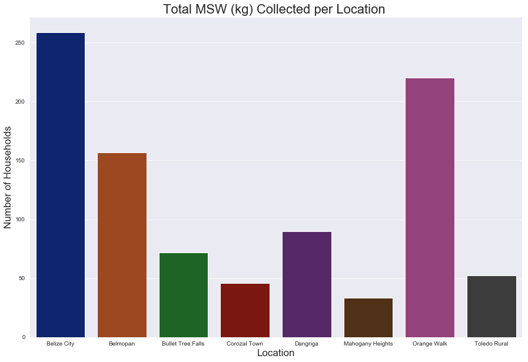


**Here we can see the number of households visited per location.  Only 3 locations (Bullet Tree Falls, Corozal Town, and Mahogany Heights) do not reach the sample size of 30 typically required for the central limit theorem to apply.  This is noteworthy, and is something to be considered for future work.**


```python
plt.figure(figsize=(15, 10));

location_order = ['Belize City',
                  'Belmopan',
                  'Bullet Tree Falls',
                  'Corozal Town',
                  'Dangriga',
                  'Mahogany Heights',
                  'Orange Walk',
                  'Toledo Rural']
         
sns.countplot('Location',
              data=belize_eda_model,
              order=location_order);

plt.title('Number of Households per Location ', fontsize=22);
plt.xlabel('Location', fontsize=17);
plt.ylabel('Number of Households', fontsize=17);
```


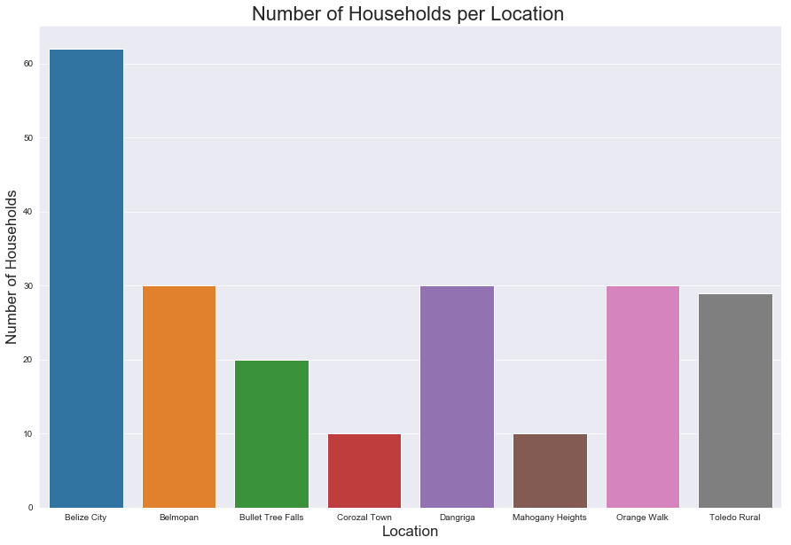


### MSW Composition per Location


```python
plt.figure(figsize=(15, 10));
print('Number of Households per Location:\n', belize_eda_model['Location'].value_counts())

location_order = ['Belize City',
                  'Belmopan',
                  'Bullet Tree Falls',
                  'Corozal Town',
                  'Dangriga',
                  'Mahogany Heights',
                  'Orange Walk',
                  'Toledo Rural']

sns.barplot('Location',
            'Organics_wt_%',
            data=belize_eda_model,
            color='Green',
#             estimator=np.median,
            ci=0,
            order=location_order);

sns.barplot('Location',
            'Plastics_wt_%',
            data=belize_eda_model,
            color='Blue',
#             estimator=np.median,
            ci=0,
            order=location_order);

sns.barplot('Location',
            'Paper_and_cardboard_wt_%',
            data=belize_eda_model,
            color='Brown',
#             estimator=np.median,
            ci=0,
            order=location_order);

# belize_eda_model_reduced = belize_eda_model.copy()
# belize_eda_model_reduced['energy_kWh_per_kg'] = belize_eda_model_reduced['energy_kWh_per_kg'] / 10 

sns.lineplot('Location',
             'energy_kWh_per_kg',
             data=belize_eda_model,
#              estimator=np.median,
             color='Black');

plt.title('Average MSW Composition & Energy Density per Location', fontsize=22);
plt.xticks(rotation=45, fontsize=15);
plt.xlabel('Location', fontsize=20);
plt.yticks(fontsize=15);
plt.ylabel('MSW Composition %', fontsize=20);
# plt.ylim(0, 1.5)

from matplotlib.lines import Line2D
custom_lines = [Line2D([0], [0], color='Green', lw=4),
                Line2D([0], [0], color='Blue', lw=4),
                Line2D([0], [0], color='Brown', lw=4),
                Line2D([0], [0], color='Black', lw=4)]

plt.legend(custom_lines, ['Organics',
                          'Plastics',
                          'Paper and Cardboard',
                          'Energy Density (kWh/kg)'],
           fontsize=12);
#            title='Waste Type',
#            title_fontsize=18);
```

    Number of Households per Location:
     Belize City          62
    Orange Walk          30
    Dangriga             30
    Belmopan             30
    Toledo Rural         29
    Bullet Tree Falls    20
    Corozal Town         10
    Mahogany Heights     10
    Name: Location, dtype: int64
    


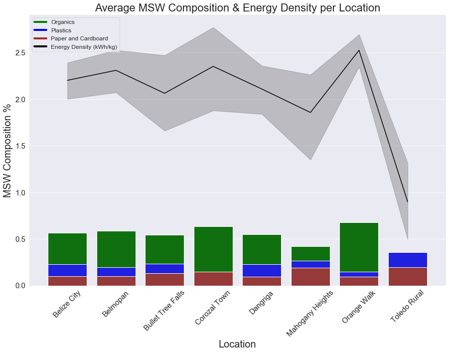


```python
belize_eda_model[belize_eda_model['Location'] == 'Toledo Rural']['Wastedisposalgeneral'].value_counts(dropna=False)
```


    disp_burn       24
    other            2
    disp_bury        2
    disp_collect     1
    Name: Wastedisposalgeneral, dtype: int64


```python
belize_eda_model[belize_eda_model['Location'] == 'Toledo Rural']['Wastedisposalgreen'].value_counts(dropna=False)
```


    other             21
    disp_burn          6
    disp_land_dump     2
    Name: Wastedisposalgreen, dtype: int64


```python
belize_eda_model[belize_eda_model['Location'] == 'Toledo Rural']['Wastedisposalnappies'].value_counts(dropna=False)
```


    disp_burn    28
    other         1
    Name: Wastedisposalnappies, dtype: int64


### MSW Composition per Urbanity


```python
plt.figure(figsize=(15, 10));
print('Number of Households per Urbanity:\n', belize_eda_model['Urbanity'].value_counts())

sns.barplot('Urbanity',
            'Organics_wt_%',
            data=belize_eda_model,
            color='Green',
#             estimator=np.median,
            ci=0);

sns.barplot('Urbanity',
            'Plastics_wt_%',
            data=belize_eda_model,
            color='Blue',
#             estimator=np.median,
            ci=0);

sns.barplot('Urbanity',
            'Paper_and_cardboard_wt_%',
            data=belize_eda_model,
            color='Brown',
#             estimator=np.median,
            ci=0);

sns.lineplot('Urbanity',
             'energy_kWh_per_kg',
             data=belize_eda_model,
#              estimator=np.median,
             color='Black');

plt.title('Average MSW Composition & Energy Density per Urbanity', fontsize=22);
plt.xticks(fontsize=15);
plt.xlabel('Urbanity', fontsize=20);
plt.yticks(fontsize=15);
plt.ylabel('MSW Composition %', fontsize=20);
# plt.ylim(0, 1)

from matplotlib.lines import Line2D
custom_lines = [Line2D([0], [0], color='Green', lw=4),
                Line2D([0], [0], color='Blue', lw=4),
                Line2D([0], [0], color='Brown', lw=4),
                Line2D([0], [0], color='Black', lw=4)]

plt.legend(custom_lines, ['Organics',
                          'Plastics',
                          'Paper and Cardboard',
                          'Energy Density (kWh/kg)'],
           fontsize=15)
#            title='Waste Type',
#            title_fontsize=18);
```

    Number of Households per Urbanity:
     Urban       92
    Regional    70
    Rural       59
    Name: Urbanity, dtype: int64
    


    <matplotlib.legend.Legend at 0x140d88ae240>


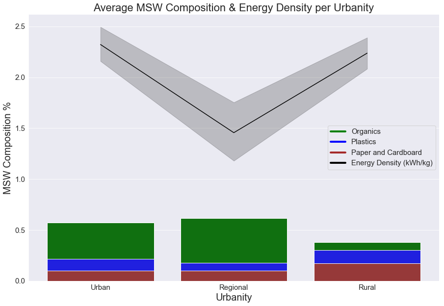


## Economics and Waste

**Let's have a look at these columns and see how much useful economic info we have.**


```python
income_features = ['Incometotal',
                   'Grocerytotal',
                   'Groceryexpenses',
                   'Groceryperiodnum',
                   'Housenumberpeopleincome']

for feature in income_features:
    print(f'{feature} Value Counts:')
    print(belize_eda_model[feature].value_counts(normalize=True, dropna=False).head(10))
    print('------------------------')
```

    Incometotal Value Counts:
    Unknown        0.610860
    0.0            0.085973
    1500.0         0.027149
    2000.0         0.022624
    1071.428571    0.018100
    1000.0         0.013575
    700.0          0.009050
    2142.857143    0.009050
    535.7142857    0.009050
    1714.285714    0.009050
    Name: Incometotal, dtype: float64
    ------------------------
    Grocerytotal Value Counts:
    Unknown        0.402715
    428.5714286    0.085973
    642.8571429    0.058824
    857.1428571    0.049774
    214.2857143    0.036199
    300.0          0.031674
    0.0            0.027149
    750.0          0.022624
    321.4285714    0.018100
    400.0          0.018100
    Name: Grocerytotal, dtype: float64
    ------------------------
    Groceryexpenses Value Counts:
    Unknown    0.389140
    200.0      0.095023
    100.0      0.063348
    300.0      0.054299
    150.0      0.054299
    250.0      0.040724
    50.0       0.036199
    0.0        0.031674
    500.0      0.027149
    400.0      0.027149
    Name: Groceryexpenses, dtype: float64
    ------------------------
    Groceryperiodnum Value Counts:
    Unknown    0.371041
    7.0        0.271493
    14.0       0.149321
    30.0       0.144796
    1.0        0.040724
    2.0        0.013575
    0.0        0.009050
    Name: Groceryperiodnum, dtype: float64
    ------------------------
    Housenumberpeopleincome Value Counts:
    Unknown    0.348416
    1.0        0.303167
    2.0        0.190045
    0.0        0.076923
    3.0        0.054299
    4.0        0.018100
    6.0        0.004525
    5.0        0.004525
    Name: Housenumberpeopleincome, dtype: float64
    ------------------------
    

**As is evident above, the Incometotal feature has 60%+ 'Unknown' values.  We have other economic indicators however, namely grocery expenses.  The Grocerytotal feature is a monthly figure, and can be used as an indicator of economic status. There are still a lot of 'Unknown' values (40%) but if we want to attempt to make any analysis about any economic factors then we will have to drop some rows**


```python
print('Rows before reduction:', belize_eda_model.shape[0])
belize_eda_model_income = belize_eda_model[belize_eda_model['Grocerytotal'] != 'Unknown'] 

print('Shape after reduction:', belize_eda_model_income.shape[0])
print('------------------------')
print(f'Loss of {belize_eda_model.shape[0] - belize_eda_model_income.shape[0]} rows for the\
 economic analysis!')

belize_eda_model_income.head()
```

    Rows before reduction: 221
    Shape after reduction: 132
    ------------------------
    Loss of 89 rows for the economic analysis!
    


<div>
<style scoped>
    .dataframe tbody tr th:only-of-type {
        vertical-align: middle;
    }

    .dataframe tbody tr th {
        vertical-align: top;
    }

    .dataframe thead th {
        text-align: right;
    }
</style>
<table border="1" class="dataframe">
  <thead>
    <tr style="text-align: right;">
      <th></th>
      <th>ID</th>
      <th>Premisestype</th>
      <th>Location</th>
      <th>Urbanity</th>
      <th>Locationlat</th>
      <th>Locationlong</th>
      <th>Binsnumber</th>
      <th>Collectionavailable</th>
      <th>Collectioninfo</th>
      <th>Collectionperiod</th>
      <th>Collectionrating</th>
      <th>Collectionwastelevelwhenta</th>
      <th>Collectionrubbishbagsupport</th>
      <th>Collectionwillingtopay</th>
      <th>Wastedisposalgeneral</th>
      <th>Wastedisposalgreen</th>
      <th>Wastedisposalnappies</th>
      <th>Groceryexpenses</th>
      <th>Groceryperiodnum</th>
      <th>Grocerytotal</th>
      <th>Housenumberpeople</th>
      <th>Housenumberchildren</th>
      <th>Housenumberpeopleincome</th>
      <th>Houseownership</th>
      <th>Incometotal</th>
      <th>Levysupport</th>
      <th>Organics_wt_%</th>
      <th>Paper_and_cardboard_wt_%</th>
      <th>Plastics_wt_%</th>
      <th>Non_combust_wt_%</th>
      <th>Total_weight (kg)</th>
      <th>energy_kWh_per_kg</th>
      <th>total_energy_kWh</th>
      <th>Collection_frequency</th>
      <th>eps</th>
      <th>plastic_bags</th>
      <th>pet_bottles</th>
      <th>pp</th>
      <th>flexibles_film</th>
      <th>other_plastic</th>
      <th>feminine_hygiene</th>
      <th>cardboard</th>
      <th>drinkbags</th>
      <th>nappies</th>
      <th>hdpe_bottles</th>
      <th>paper</th>
      <th>aluminium_cans</th>
      <th>jars</th>
      <th>other_organics</th>
      <th>food</th>
      <th>lpb</th>
      <th>aluminium_recyclable</th>
      <th>steel_cans</th>
      <th>other_sanitary_waste</th>
      <th>textiles</th>
      <th>other_other</th>
      <th>bottles_wine_and_spirits</th>
      <th>bottles_cds</th>
      <th>other_metal</th>
      <th>other_glass_glass</th>
    </tr>
  </thead>
  <tbody>
    <tr>
      <th>1</th>
      <td>39</td>
      <td>pt_household</td>
      <td>Belmopan</td>
      <td>Urban</td>
      <td>17.2446</td>
      <td>-88.7685</td>
      <td>1</td>
      <td>yes</td>
      <td>yes</td>
      <td>p_3days</td>
      <td>2</td>
      <td>half_full</td>
      <td>yes</td>
      <td>2</td>
      <td>disp_collect</td>
      <td>disp_collect</td>
      <td>other</td>
      <td>0</td>
      <td>7</td>
      <td>0</td>
      <td>2</td>
      <td>0</td>
      <td>1</td>
      <td>own</td>
      <td>0</td>
      <td>yes</td>
      <td>0.760519</td>
      <td>0.050493</td>
      <td>0.171676</td>
      <td>0.017312</td>
      <td>8.318</td>
      <td>2.90</td>
      <td>24.12</td>
      <td>3.5</td>
      <td>0.200</td>
      <td>0.206</td>
      <td>0.229</td>
      <td>0.192</td>
      <td>0.079</td>
      <td>0.000</td>
      <td>0.000</td>
      <td>0.158</td>
      <td>0.0</td>
      <td>2.157</td>
      <td>0.522</td>
      <td>0.212</td>
      <td>0.000</td>
      <td>0.000</td>
      <td>0.000</td>
      <td>4.169</td>
      <td>0.050</td>
      <td>0.053</td>
      <td>0.091</td>
      <td>0.0</td>
      <td>0.000</td>
      <td>0.000</td>
      <td>0.000</td>
      <td>0.000</td>
      <td>0.0</td>
      <td>0.0</td>
    </tr>
    <tr>
      <th>5</th>
      <td>34</td>
      <td>pt_household</td>
      <td>Belmopan</td>
      <td>Urban</td>
      <td>17.2519</td>
      <td>-88.7679</td>
      <td>0</td>
      <td>yes</td>
      <td>no</td>
      <td>p_3days</td>
      <td>5</td>
      <td>half_full</td>
      <td>no</td>
      <td>0</td>
      <td>disp_collect</td>
      <td>other</td>
      <td>other</td>
      <td>200</td>
      <td>30</td>
      <td>200</td>
      <td>2</td>
      <td>0</td>
      <td>2</td>
      <td>own</td>
      <td>3000</td>
      <td>yes</td>
      <td>0.490176</td>
      <td>0.335342</td>
      <td>0.134268</td>
      <td>0.040215</td>
      <td>7.634</td>
      <td>2.25</td>
      <td>17.18</td>
      <td>3.5</td>
      <td>0.087</td>
      <td>0.300</td>
      <td>0.085</td>
      <td>0.084</td>
      <td>0.208</td>
      <td>0.243</td>
      <td>0.914</td>
      <td>0.675</td>
      <td>0.0</td>
      <td>0.000</td>
      <td>0.018</td>
      <td>1.384</td>
      <td>0.000</td>
      <td>0.153</td>
      <td>0.667</td>
      <td>2.161</td>
      <td>0.097</td>
      <td>0.017</td>
      <td>0.137</td>
      <td>0.0</td>
      <td>0.404</td>
      <td>0.000</td>
      <td>0.000</td>
      <td>0.000</td>
      <td>0.0</td>
      <td>0.0</td>
    </tr>
    <tr>
      <th>6</th>
      <td>35</td>
      <td>pt_household</td>
      <td>Belmopan</td>
      <td>Urban</td>
      <td>17.2432</td>
      <td>-88.7655</td>
      <td>1</td>
      <td>yes</td>
      <td>no</td>
      <td>p_week</td>
      <td>5</td>
      <td>half_full</td>
      <td>no</td>
      <td>20</td>
      <td>disp_collect</td>
      <td>disp_collect</td>
      <td>other</td>
      <td>250</td>
      <td>30</td>
      <td>250</td>
      <td>2</td>
      <td>0</td>
      <td>1</td>
      <td>rent</td>
      <td>0</td>
      <td>yes</td>
      <td>0.070561</td>
      <td>0.025038</td>
      <td>0.227618</td>
      <td>0.676783</td>
      <td>2.636</td>
      <td>0.28</td>
      <td>0.74</td>
      <td>7.0</td>
      <td>0.090</td>
      <td>0.222</td>
      <td>0.136</td>
      <td>0.117</td>
      <td>0.035</td>
      <td>0.000</td>
      <td>0.000</td>
      <td>0.000</td>
      <td>0.0</td>
      <td>0.000</td>
      <td>0.000</td>
      <td>0.066</td>
      <td>0.000</td>
      <td>0.000</td>
      <td>0.000</td>
      <td>0.186</td>
      <td>0.000</td>
      <td>0.000</td>
      <td>0.000</td>
      <td>0.0</td>
      <td>0.000</td>
      <td>0.000</td>
      <td>1.340</td>
      <td>0.444</td>
      <td>0.0</td>
      <td>0.0</td>
    </tr>
    <tr>
      <th>10</th>
      <td>42</td>
      <td>pt_household</td>
      <td>Belmopan</td>
      <td>Urban</td>
      <td>17.2429</td>
      <td>-88.767</td>
      <td>0</td>
      <td>yes</td>
      <td>no</td>
      <td>p_3days</td>
      <td>5</td>
      <td>full</td>
      <td>yes</td>
      <td>50</td>
      <td>disp_collect</td>
      <td>disp_collect</td>
      <td>disp_collect</td>
      <td>150</td>
      <td>7</td>
      <td>642.857</td>
      <td>1</td>
      <td>3</td>
      <td>0</td>
      <td>rent</td>
      <td>Unknown</td>
      <td>yes</td>
      <td>0.715135</td>
      <td>0.096672</td>
      <td>0.121632</td>
      <td>0.066561</td>
      <td>5.048</td>
      <td>2.72</td>
      <td>13.73</td>
      <td>3.5</td>
      <td>0.073</td>
      <td>0.170</td>
      <td>0.100</td>
      <td>0.010</td>
      <td>0.176</td>
      <td>0.000</td>
      <td>0.160</td>
      <td>0.000</td>
      <td>0.0</td>
      <td>0.000</td>
      <td>0.085</td>
      <td>0.283</td>
      <td>0.000</td>
      <td>0.000</td>
      <td>0.148</td>
      <td>3.302</td>
      <td>0.205</td>
      <td>0.084</td>
      <td>0.208</td>
      <td>0.0</td>
      <td>0.000</td>
      <td>0.044</td>
      <td>0.000</td>
      <td>0.000</td>
      <td>0.0</td>
      <td>0.0</td>
    </tr>
    <tr>
      <th>12</th>
      <td>41</td>
      <td>pt_household</td>
      <td>Belmopan</td>
      <td>Urban</td>
      <td>17.2446</td>
      <td>-88.7685</td>
      <td>0</td>
      <td>yes</td>
      <td>no</td>
      <td>p_3days</td>
      <td>4</td>
      <td>half_full</td>
      <td>yes</td>
      <td>10</td>
      <td>disp_collect</td>
      <td>disp_collect</td>
      <td>disp_collect</td>
      <td>200</td>
      <td>14</td>
      <td>428.571</td>
      <td>2</td>
      <td>1</td>
      <td>2</td>
      <td>rent</td>
      <td>0</td>
      <td>yes</td>
      <td>0.781575</td>
      <td>0.021545</td>
      <td>0.018574</td>
      <td>0.178306</td>
      <td>2.692</td>
      <td>2.54</td>
      <td>6.84</td>
      <td>3.5</td>
      <td>0.010</td>
      <td>0.016</td>
      <td>0.000</td>
      <td>0.012</td>
      <td>0.012</td>
      <td>0.000</td>
      <td>1.265</td>
      <td>0.000</td>
      <td>0.0</td>
      <td>0.000</td>
      <td>0.000</td>
      <td>0.005</td>
      <td>0.025</td>
      <td>0.000</td>
      <td>0.026</td>
      <td>0.813</td>
      <td>0.035</td>
      <td>0.006</td>
      <td>0.000</td>
      <td>0.0</td>
      <td>0.018</td>
      <td>0.000</td>
      <td>0.449</td>
      <td>0.000</td>
      <td>0.0</td>
      <td>0.0</td>
    </tr>
  </tbody>
</table>
</div>


```python
#Change feature type to float
belize_eda_model_income['Grocerytotal'] = belize_eda_model_income['Grocerytotal'].astype(float)

#Look at feature distribution
belize_eda_model_income['Grocerytotal'].hist();

print(belize_eda_model_income['Grocerytotal'].value_counts().head(10))
```

    428.571429     19
    642.857143     13
    857.142857     11
    214.285714      8
    300.000000      7
    0.000000        6
    750.000000      5
    535.714286      4
    1071.428571     4
    400.000000      4
    Name: Grocerytotal, dtype: int64
    


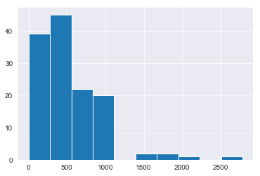


```python
#Remove high end outliers as well as those with a value of 0
belize_eda_model_income = belize_eda_model_income[
    (
        belize_eda_model_income['Grocerytotal'] < 1500
    ) & 
    (
        belize_eda_model_income['Grocerytotal'] > 0
    )]
belize_eda_model_income['Grocerytotal'].hist();
print('Rows remaining:', belize_eda_model_income.shape[0])
```

    Rows remaining: 120
    


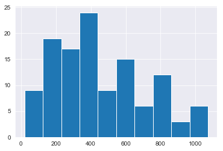


#### Create Grocery Expenses Category Function


```python
def grocery_expenses_categories(expenses):
    if expenses < 200:
        expenses = 'Less than $200'
        return expenses
    elif expenses >= 200 and expenses < 400:
        expenses = '$200 and 400'
        return expenses
    elif expenses >= 400 and expenses < 600:
        expenses = '$400 and 600'
        return expenses
    elif expenses >= 600 and expenses < 800:
        expenses = '$600 and 800'
        return expenses
    else:
        expenses = 'More than $800'
        return expenses
        
belize_eda_model_income['Monthly_grocery_expenses_cat'] = belize_eda_model_income['Grocerytotal'].map(lambda x: grocery_expenses_categories(x))
print(belize_eda_model_income['Monthly_grocery_expenses_cat'].value_counts())
belize_eda_model_income.head()
```

    $400 and 600      32
    $200 and 400      30
    More than $800    21
    $600 and 800      21
    Less than $200    16
    Name: Monthly_grocery_expenses_cat, dtype: int64
    


<div>
<style scoped>
    .dataframe tbody tr th:only-of-type {
        vertical-align: middle;
    }

    .dataframe tbody tr th {
        vertical-align: top;
    }

    .dataframe thead th {
        text-align: right;
    }
</style>
<table border="1" class="dataframe">
  <thead>
    <tr style="text-align: right;">
      <th></th>
      <th>ID</th>
      <th>Premisestype</th>
      <th>Location</th>
      <th>Urbanity</th>
      <th>Locationlat</th>
      <th>Locationlong</th>
      <th>Binsnumber</th>
      <th>Collectionavailable</th>
      <th>Collectioninfo</th>
      <th>Collectionperiod</th>
      <th>Collectionrating</th>
      <th>Collectionwastelevelwhenta</th>
      <th>Collectionrubbishbagsupport</th>
      <th>Collectionwillingtopay</th>
      <th>Wastedisposalgeneral</th>
      <th>Wastedisposalgreen</th>
      <th>Wastedisposalnappies</th>
      <th>Groceryexpenses</th>
      <th>Groceryperiodnum</th>
      <th>Grocerytotal</th>
      <th>Housenumberpeople</th>
      <th>Housenumberchildren</th>
      <th>Housenumberpeopleincome</th>
      <th>Houseownership</th>
      <th>Incometotal</th>
      <th>Levysupport</th>
      <th>Organics_wt_%</th>
      <th>Paper_and_cardboard_wt_%</th>
      <th>Plastics_wt_%</th>
      <th>Non_combust_wt_%</th>
      <th>Total_weight (kg)</th>
      <th>energy_kWh_per_kg</th>
      <th>total_energy_kWh</th>
      <th>Collection_frequency</th>
      <th>eps</th>
      <th>plastic_bags</th>
      <th>pet_bottles</th>
      <th>pp</th>
      <th>flexibles_film</th>
      <th>other_plastic</th>
      <th>feminine_hygiene</th>
      <th>cardboard</th>
      <th>drinkbags</th>
      <th>nappies</th>
      <th>hdpe_bottles</th>
      <th>paper</th>
      <th>aluminium_cans</th>
      <th>jars</th>
      <th>other_organics</th>
      <th>food</th>
      <th>lpb</th>
      <th>aluminium_recyclable</th>
      <th>steel_cans</th>
      <th>other_sanitary_waste</th>
      <th>textiles</th>
      <th>other_other</th>
      <th>bottles_wine_and_spirits</th>
      <th>bottles_cds</th>
      <th>other_metal</th>
      <th>other_glass_glass</th>
      <th>Monthly_grocery_expenses_cat</th>
    </tr>
  </thead>
  <tbody>
    <tr>
      <th>5</th>
      <td>34</td>
      <td>pt_household</td>
      <td>Belmopan</td>
      <td>Urban</td>
      <td>17.2519</td>
      <td>-88.7679</td>
      <td>0</td>
      <td>yes</td>
      <td>no</td>
      <td>p_3days</td>
      <td>5</td>
      <td>half_full</td>
      <td>no</td>
      <td>0</td>
      <td>disp_collect</td>
      <td>other</td>
      <td>other</td>
      <td>200</td>
      <td>30</td>
      <td>200.000000</td>
      <td>2</td>
      <td>0</td>
      <td>2</td>
      <td>own</td>
      <td>3000</td>
      <td>yes</td>
      <td>0.490176</td>
      <td>0.335342</td>
      <td>0.134268</td>
      <td>0.040215</td>
      <td>7.634</td>
      <td>2.25</td>
      <td>17.18</td>
      <td>3.5</td>
      <td>0.087</td>
      <td>0.300</td>
      <td>0.085</td>
      <td>0.084</td>
      <td>0.208</td>
      <td>0.243</td>
      <td>0.914</td>
      <td>0.675</td>
      <td>0.0</td>
      <td>0.0</td>
      <td>0.018</td>
      <td>1.384</td>
      <td>0.000</td>
      <td>0.153</td>
      <td>0.667</td>
      <td>2.161</td>
      <td>0.097</td>
      <td>0.017</td>
      <td>0.137</td>
      <td>0.00</td>
      <td>0.404</td>
      <td>0.000</td>
      <td>0.000</td>
      <td>0.000</td>
      <td>0.0</td>
      <td>0.0</td>
      <td>$200 and 400</td>
    </tr>
    <tr>
      <th>6</th>
      <td>35</td>
      <td>pt_household</td>
      <td>Belmopan</td>
      <td>Urban</td>
      <td>17.2432</td>
      <td>-88.7655</td>
      <td>1</td>
      <td>yes</td>
      <td>no</td>
      <td>p_week</td>
      <td>5</td>
      <td>half_full</td>
      <td>no</td>
      <td>20</td>
      <td>disp_collect</td>
      <td>disp_collect</td>
      <td>other</td>
      <td>250</td>
      <td>30</td>
      <td>250.000000</td>
      <td>2</td>
      <td>0</td>
      <td>1</td>
      <td>rent</td>
      <td>0</td>
      <td>yes</td>
      <td>0.070561</td>
      <td>0.025038</td>
      <td>0.227618</td>
      <td>0.676783</td>
      <td>2.636</td>
      <td>0.28</td>
      <td>0.74</td>
      <td>7.0</td>
      <td>0.090</td>
      <td>0.222</td>
      <td>0.136</td>
      <td>0.117</td>
      <td>0.035</td>
      <td>0.000</td>
      <td>0.000</td>
      <td>0.000</td>
      <td>0.0</td>
      <td>0.0</td>
      <td>0.000</td>
      <td>0.066</td>
      <td>0.000</td>
      <td>0.000</td>
      <td>0.000</td>
      <td>0.186</td>
      <td>0.000</td>
      <td>0.000</td>
      <td>0.000</td>
      <td>0.00</td>
      <td>0.000</td>
      <td>0.000</td>
      <td>1.340</td>
      <td>0.444</td>
      <td>0.0</td>
      <td>0.0</td>
      <td>$200 and 400</td>
    </tr>
    <tr>
      <th>10</th>
      <td>42</td>
      <td>pt_household</td>
      <td>Belmopan</td>
      <td>Urban</td>
      <td>17.2429</td>
      <td>-88.767</td>
      <td>0</td>
      <td>yes</td>
      <td>no</td>
      <td>p_3days</td>
      <td>5</td>
      <td>full</td>
      <td>yes</td>
      <td>50</td>
      <td>disp_collect</td>
      <td>disp_collect</td>
      <td>disp_collect</td>
      <td>150</td>
      <td>7</td>
      <td>642.857143</td>
      <td>1</td>
      <td>3</td>
      <td>0</td>
      <td>rent</td>
      <td>Unknown</td>
      <td>yes</td>
      <td>0.715135</td>
      <td>0.096672</td>
      <td>0.121632</td>
      <td>0.066561</td>
      <td>5.048</td>
      <td>2.72</td>
      <td>13.73</td>
      <td>3.5</td>
      <td>0.073</td>
      <td>0.170</td>
      <td>0.100</td>
      <td>0.010</td>
      <td>0.176</td>
      <td>0.000</td>
      <td>0.160</td>
      <td>0.000</td>
      <td>0.0</td>
      <td>0.0</td>
      <td>0.085</td>
      <td>0.283</td>
      <td>0.000</td>
      <td>0.000</td>
      <td>0.148</td>
      <td>3.302</td>
      <td>0.205</td>
      <td>0.084</td>
      <td>0.208</td>
      <td>0.00</td>
      <td>0.000</td>
      <td>0.044</td>
      <td>0.000</td>
      <td>0.000</td>
      <td>0.0</td>
      <td>0.0</td>
      <td>$600 and 800</td>
    </tr>
    <tr>
      <th>12</th>
      <td>41</td>
      <td>pt_household</td>
      <td>Belmopan</td>
      <td>Urban</td>
      <td>17.2446</td>
      <td>-88.7685</td>
      <td>0</td>
      <td>yes</td>
      <td>no</td>
      <td>p_3days</td>
      <td>4</td>
      <td>half_full</td>
      <td>yes</td>
      <td>10</td>
      <td>disp_collect</td>
      <td>disp_collect</td>
      <td>disp_collect</td>
      <td>200</td>
      <td>14</td>
      <td>428.571429</td>
      <td>2</td>
      <td>1</td>
      <td>2</td>
      <td>rent</td>
      <td>0</td>
      <td>yes</td>
      <td>0.781575</td>
      <td>0.021545</td>
      <td>0.018574</td>
      <td>0.178306</td>
      <td>2.692</td>
      <td>2.54</td>
      <td>6.84</td>
      <td>3.5</td>
      <td>0.010</td>
      <td>0.016</td>
      <td>0.000</td>
      <td>0.012</td>
      <td>0.012</td>
      <td>0.000</td>
      <td>1.265</td>
      <td>0.000</td>
      <td>0.0</td>
      <td>0.0</td>
      <td>0.000</td>
      <td>0.005</td>
      <td>0.025</td>
      <td>0.000</td>
      <td>0.026</td>
      <td>0.813</td>
      <td>0.035</td>
      <td>0.006</td>
      <td>0.000</td>
      <td>0.00</td>
      <td>0.018</td>
      <td>0.000</td>
      <td>0.449</td>
      <td>0.000</td>
      <td>0.0</td>
      <td>0.0</td>
      <td>$400 and 600</td>
    </tr>
    <tr>
      <th>15</th>
      <td>45</td>
      <td>pt_household</td>
      <td>Belmopan</td>
      <td>Urban</td>
      <td>17.2428</td>
      <td>-88.7676</td>
      <td>2</td>
      <td>yes</td>
      <td>no</td>
      <td>p_3days</td>
      <td>5</td>
      <td>half_full</td>
      <td>no</td>
      <td>12</td>
      <td>disp_collect</td>
      <td>disp_land_dump</td>
      <td>other</td>
      <td>35</td>
      <td>2</td>
      <td>525.000000</td>
      <td>1</td>
      <td>0</td>
      <td>1</td>
      <td>own</td>
      <td>700</td>
      <td>yes</td>
      <td>0.469758</td>
      <td>0.136694</td>
      <td>0.354032</td>
      <td>0.039516</td>
      <td>2.480</td>
      <td>2.18</td>
      <td>5.41</td>
      <td>3.5</td>
      <td>0.000</td>
      <td>0.148</td>
      <td>0.037</td>
      <td>0.000</td>
      <td>0.088</td>
      <td>0.185</td>
      <td>0.000</td>
      <td>0.234</td>
      <td>0.0</td>
      <td>0.0</td>
      <td>0.420</td>
      <td>0.086</td>
      <td>0.000</td>
      <td>0.000</td>
      <td>0.218</td>
      <td>0.827</td>
      <td>0.000</td>
      <td>0.000</td>
      <td>0.098</td>
      <td>0.12</td>
      <td>0.019</td>
      <td>0.000</td>
      <td>0.000</td>
      <td>0.000</td>
      <td>0.0</td>
      <td>0.0</td>
      <td>$400 and 600</td>
    </tr>
  </tbody>
</table>
</div>


#### Grocery Expenses Distribution


```python
order = ['Less than $200',
         '$200 and 400',
         '$400 and 600',
         '$600 and 800',
         'More than $800']

plt.figure(figsize=(15, 10))
sns.countplot('Monthly_grocery_expenses_cat',
                data=belize_eda_model_income,
                order=order);

plt.title('Distribution of Household Grocery Expenses', fontsize=22);
plt.xticks(fontsize=12);
plt.xlabel('Monthly Grocery Expenses', fontsize=17);
plt.yticks(fontsize=12);
plt.ylabel('Number of Households', fontsize=17);
# l = plt.legend(loc='best',
#            labels=['Less than $500',
#                    'Between $500 and 1000',
#                    'More than $1000'], fontsize=10)
# l.set_title('Monthly Grocery Expenses')
```


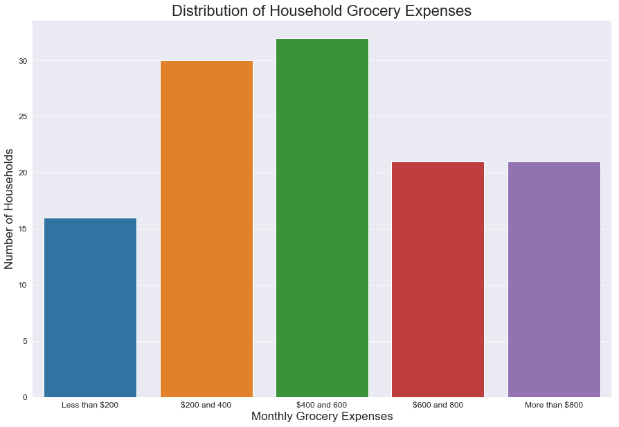


**We see a fairly even distribution here, with more of a concentration of homes being in the mid-range betweeen $200 and 600**

**More data would be requested for future works of this sort to ensure that an even representation of all economic classes is available for analysis**

#### Grocery Expenses vs Energy Density


```python
print(belize_eda_model_income['Monthly_grocery_expenses_cat'].value_counts())

order = ['Less than $200',
         '$200 and 400',
         '$400 and 600',
         '$600 and 800',
         'More than $800']

plt.figure(figsize=(15, 10))

sns.swarmplot('Monthly_grocery_expenses_cat',
              'energy_kWh_per_kg',
              data=belize_eda_model_income,
              order=order);

sns.lineplot('Monthly_grocery_expenses_cat',
              'energy_kWh_per_kg',
              data=belize_eda_model_income);
#               estimator=np.median);

plt.title('Average MSW Energy Density vs. Monthly Grocery Expenses', fontsize=22);
plt.xticks(fontsize=12);
plt.xlabel('Monthly Grocery Expenses', fontsize=17);
plt.yticks(fontsize=12);
plt.ylabel('Energy Density (kWh/kg)', fontsize=17);
plt.ylim(0, 4)
```

    $400 and 600      32
    $200 and 400      30
    More than $800    21
    $600 and 800      21
    Less than $200    16
    Name: Monthly_grocery_expenses_cat, dtype: int64
    


    (0, 4)


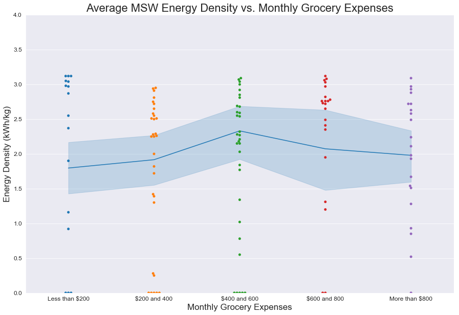


# Solomon Islands

## Import Data


```python
#Bring in qualitative dataset
solomon_df_qual = pd.read_csv('Datasets/Solid_waste_audit_Solomon_Islands_Interviews.csv',
                      index_col='RecordID').reset_index()
print('Shape of Dataset:', solomon_df_qual.shape)
solomon_df_qual.rename(columns={'RecordID':'ID'}, inplace=True)
solomon_df_qual.head()
```

    Shape of Dataset: (181, 73)
    


<div>
<style scoped>
    .dataframe tbody tr th:only-of-type {
        vertical-align: middle;
    }

    .dataframe tbody tr th {
        vertical-align: top;
    }

    .dataframe thead th {
        text-align: right;
    }
</style>
<table border="1" class="dataframe">
  <thead>
    <tr style="text-align: right;">
      <th></th>
      <th>ID</th>
      <th>HouseholdCommercialShipID</th>
      <th>TotalsampleweightKG</th>
      <th>Amountwillingtopayforrubbishbag</th>
      <th>Amountwillingtopayforwastecollection</th>
      <th>AreaorIslandName</th>
      <th>Collectionservicerating</th>
      <th>DailyDiet1</th>
      <th>DailyDiet2</th>
      <th>DailyDiet3</th>
      <th>Diet1source</th>
      <th>Diet2source</th>
      <th>Diet3source</th>
      <th>Electricityexpensesper</th>
      <th>EstimatedMonthlyIncome</th>
      <th>GarbageCollectionType</th>
      <th>GroceryexpensesUS</th>
      <th>Groceryexpensesper</th>
      <th>HouseOwnership</th>
      <th>HouseholdGPSlatitude</th>
      <th>HouseholdGPSlongitude</th>
      <th>Incomesource</th>
      <th>InformationreceivedaboutWasteCollectionServices</th>
      <th>MonthlyIncomeUS</th>
      <th>NumberofBins</th>
      <th>Numberofemployedpeopleinfamily</th>
      <th>Numberofpeopleinhousehold</th>
      <th>Radio</th>
      <th>Reasonforrating</th>
      <th>Softdrinkcansperweek</th>
      <th>Suggestionsforimprovement</th>
      <th>Supportforlevy</th>
      <th>Supportforrubbishbag</th>
      <th>SurveyDate</th>
      <th>Totalelectricityexpenses</th>
      <th>Transportationexpensesper</th>
      <th>Transportationexpensestotal</th>
      <th>WasteDisposalMethodBulky</th>
      <th>WasteDisposalMethodGeneral</th>
      <th>WasteDisposalMethodNappies</th>
      <th>WasteDisposalMethodGreen</th>
      <th>WasteLevelwhencollectionarrives</th>
      <th>Wasteburned</th>
      <th>Waterbottlesperweek</th>
      <th>Weather</th>
      <th>WeeklyElectricityexpenses</th>
      <th>WeeklyGroceryExpenses</th>
      <th>WeeklyTransportationExpenses</th>
      <th>GeneralWasteCollect</th>
      <th>GreenWasteCollect</th>
      <th>SanitaryWasteCollect</th>
      <th>BulkyWasteCollect</th>
      <th>GeneralWasteTransport</th>
      <th>GreenWasteTransport</th>
      <th>SanitaryWasteTransport</th>
      <th>BulkyWasteTransport</th>
      <th>GeneralWasteDump</th>
      <th>GreenWasteDump</th>
      <th>SanitaryWasteDump</th>
      <th>BulkyWasteDump</th>
      <th>GeneralWasteBury</th>
      <th>GreenWasteBury</th>
      <th>SanitaryWasteBury</th>
      <th>BulkyWasteBury</th>
      <th>GeneralWasteBurn</th>
      <th>GreenWasteBurn</th>
      <th>SanitaryWasteBurn</th>
      <th>BulkyWasteBurn</th>
      <th>GeneralWasteWater</th>
      <th>GreenWasteWater</th>
      <th>SanitaryWasteWater</th>
      <th>BulkyWasteWater</th>
      <th>Collect</th>
    </tr>
  </thead>
  <tbody>
    <tr>
      <th>0</th>
      <td>2</td>
      <td>AH03_Sol</td>
      <td>0.254</td>
      <td>can if this system is in place</td>
      <td>not sure</td>
      <td>Ambu</td>
      <td>NaN</td>
      <td>vegetable</td>
      <td>potatoes</td>
      <td>Rice</td>
      <td>produce</td>
      <td>produce</td>
      <td>buy</td>
      <td>NaN</td>
      <td>1400.0</td>
      <td>None</td>
      <td>12.48</td>
      <td>NaN</td>
      <td>Family</td>
      <td>-8.73195</td>
      <td>160.70519</td>
      <td>employment; marketing</td>
      <td>NO</td>
      <td>174.72</td>
      <td>plastic</td>
      <td>4</td>
      <td>10.0</td>
      <td>NaN</td>
      <td>NaN</td>
      <td>NaN</td>
      <td>each family to have a bit for tins to avoid br...</td>
      <td>NaN</td>
      <td>yes</td>
      <td>12/03/2018 00:00:00</td>
      <td>60</td>
      <td>NaN</td>
      <td>25</td>
      <td>NaN</td>
      <td>inside bags/ plastic burn</td>
      <td>inside big hole</td>
      <td>animal feed/ replant cabbage</td>
      <td>NaN</td>
      <td>NaN</td>
      <td>0.0</td>
      <td>raining</td>
      <td>NaN</td>
      <td>100.0</td>
      <td>25.0</td>
      <td>1</td>
      <td>1</td>
      <td>0</td>
      <td>0</td>
      <td>0</td>
      <td>0</td>
      <td>0</td>
      <td>0</td>
      <td>0</td>
      <td>0</td>
      <td>0</td>
      <td>0</td>
      <td>0</td>
      <td>0</td>
      <td>0</td>
      <td>0</td>
      <td>1</td>
      <td>0</td>
      <td>0</td>
      <td>0</td>
      <td>0</td>
      <td>0</td>
      <td>0</td>
      <td>0</td>
      <td>1</td>
    </tr>
    <tr>
      <th>1</th>
      <td>3</td>
      <td>AH06_Sol</td>
      <td>2.088</td>
      <td>$0.05</td>
      <td>$20</td>
      <td>Ambu</td>
      <td>NaN</td>
      <td>rice/potato/kumera</td>
      <td>Casawa</td>
      <td>Banana</td>
      <td>produce &amp; buy</td>
      <td>NaN</td>
      <td>NaN</td>
      <td>month</td>
      <td>2000.0</td>
      <td>None</td>
      <td>6.24</td>
      <td>fortnight</td>
      <td>Own</td>
      <td>-8.73195</td>
      <td>160.70519</td>
      <td>carporter; teacher; casual worked</td>
      <td>NaN</td>
      <td>249.60</td>
      <td>1</td>
      <td>4</td>
      <td>9.0</td>
      <td>yes</td>
      <td>No service</td>
      <td>1.0</td>
      <td>NaN</td>
      <td>Yes</td>
      <td>YES</td>
      <td>12/05/2018 00:00:00</td>
      <td>50</td>
      <td>NaN</td>
      <td>NaN</td>
      <td>NaN</td>
      <td>burn</td>
      <td>bury them (dogs take otherwise)</td>
      <td>Pig; burn</td>
      <td>NaN</td>
      <td>NaN</td>
      <td>0.0</td>
      <td>raining</td>
      <td>NaN</td>
      <td>50.0</td>
      <td>20.0</td>
      <td>0</td>
      <td>0</td>
      <td>0</td>
      <td>0</td>
      <td>0</td>
      <td>0</td>
      <td>0</td>
      <td>0</td>
      <td>0</td>
      <td>0</td>
      <td>0</td>
      <td>0</td>
      <td>0</td>
      <td>0</td>
      <td>1</td>
      <td>0</td>
      <td>1</td>
      <td>1</td>
      <td>0</td>
      <td>0</td>
      <td>0</td>
      <td>0</td>
      <td>0</td>
      <td>0</td>
      <td>0</td>
    </tr>
    <tr>
      <th>2</th>
      <td>4</td>
      <td>AH09_Sol</td>
      <td>1.410</td>
      <td>$20</td>
      <td>$50 per day</td>
      <td>Ambu</td>
      <td>NaN</td>
      <td>rice</td>
      <td>potato; taro</td>
      <td>root grobs</td>
      <td>buy</td>
      <td>produce</td>
      <td>produce</td>
      <td>day</td>
      <td>1200.0</td>
      <td>None</td>
      <td>24.96</td>
      <td>NaN</td>
      <td>Own</td>
      <td>-8.73195</td>
      <td>160.70519</td>
      <td>teacher</td>
      <td>NaN</td>
      <td>149.76</td>
      <td>NO</td>
      <td>1</td>
      <td>8.0</td>
      <td>NaN</td>
      <td>NaN</td>
      <td>1.0</td>
      <td>NaN</td>
      <td>NaN</td>
      <td>yes; support this system</td>
      <td>12/03/2018 00:00:00</td>
      <td>60</td>
      <td>day</td>
      <td>100</td>
      <td>NaN</td>
      <td>throw inside pit</td>
      <td>inside the pit</td>
      <td>burn</td>
      <td>NaN</td>
      <td>NaN</td>
      <td>0.0</td>
      <td>Runny</td>
      <td>NaN</td>
      <td>200.0</td>
      <td>700.0</td>
      <td>0</td>
      <td>0</td>
      <td>0</td>
      <td>0</td>
      <td>0</td>
      <td>0</td>
      <td>0</td>
      <td>0</td>
      <td>1</td>
      <td>0</td>
      <td>0</td>
      <td>0</td>
      <td>1</td>
      <td>0</td>
      <td>1</td>
      <td>0</td>
      <td>0</td>
      <td>1</td>
      <td>0</td>
      <td>0</td>
      <td>0</td>
      <td>0</td>
      <td>0</td>
      <td>0</td>
      <td>0</td>
    </tr>
    <tr>
      <th>3</th>
      <td>5</td>
      <td>AH10_Sol</td>
      <td>2.774</td>
      <td>Yes</td>
      <td>$50 fortnightly</td>
      <td>Ambu</td>
      <td>NaN</td>
      <td>potato/ cassara</td>
      <td>Rice</td>
      <td>Vegetables</td>
      <td>produceotato/ cassara</td>
      <td>buy</td>
      <td>produce</td>
      <td>month</td>
      <td>3000.0</td>
      <td>None</td>
      <td>6.24</td>
      <td>NaN</td>
      <td>Own</td>
      <td>-8.73195</td>
      <td>160.70519</td>
      <td>teacher</td>
      <td>Yes; company in Auki</td>
      <td>374.40</td>
      <td>1</td>
      <td>1</td>
      <td>4.0</td>
      <td>yes</td>
      <td>NaN</td>
      <td>1.0</td>
      <td>NaN</td>
      <td>NaN</td>
      <td>Yes</td>
      <td>12/03/2018 00:00:00</td>
      <td>50</td>
      <td>NaN</td>
      <td>NaN</td>
      <td>abandon it</td>
      <td>throw - old pits from toilets</td>
      <td>wash and resuse (throw away diapers)</td>
      <td>collect -  too much to compost</td>
      <td>NaN</td>
      <td>NaN</td>
      <td>0.0</td>
      <td>raining</td>
      <td>NaN</td>
      <td>50.0</td>
      <td>100.0</td>
      <td>0</td>
      <td>1</td>
      <td>0</td>
      <td>0</td>
      <td>0</td>
      <td>0</td>
      <td>0</td>
      <td>0</td>
      <td>1</td>
      <td>0</td>
      <td>1</td>
      <td>0</td>
      <td>1</td>
      <td>0</td>
      <td>0</td>
      <td>0</td>
      <td>0</td>
      <td>0</td>
      <td>0</td>
      <td>0</td>
      <td>0</td>
      <td>0</td>
      <td>0</td>
      <td>0</td>
      <td>1</td>
    </tr>
    <tr>
      <th>4</th>
      <td>6</td>
      <td>AH11_Sol</td>
      <td>3.030</td>
      <td>$2</td>
      <td>$20</td>
      <td>Ambu</td>
      <td>NaN</td>
      <td>rice/cabbage</td>
      <td>Casarra/ kumera</td>
      <td>Fish</td>
      <td>produce or buy</td>
      <td>produce</td>
      <td>buy</td>
      <td>month</td>
      <td>3000.0</td>
      <td>None</td>
      <td>24.96</td>
      <td>NaN</td>
      <td>Own</td>
      <td>-8.73195</td>
      <td>160.70519</td>
      <td>teacher</td>
      <td>NaN</td>
      <td>374.40</td>
      <td>1</td>
      <td>1</td>
      <td>6.0</td>
      <td>no</td>
      <td>no service</td>
      <td>NaN</td>
      <td>NaN</td>
      <td>NaN</td>
      <td>yes</td>
      <td>12/03/2018 00:00:00</td>
      <td>50</td>
      <td>day</td>
      <td>10</td>
      <td>NaN</td>
      <td>bag them then burn</td>
      <td>NaN</td>
      <td>pig; burn</td>
      <td>NaN</td>
      <td>NaN</td>
      <td>0.0</td>
      <td>sunny</td>
      <td>NaN</td>
      <td>200.0</td>
      <td>70.0</td>
      <td>1</td>
      <td>0</td>
      <td>0</td>
      <td>0</td>
      <td>0</td>
      <td>0</td>
      <td>0</td>
      <td>0</td>
      <td>0</td>
      <td>0</td>
      <td>0</td>
      <td>0</td>
      <td>0</td>
      <td>0</td>
      <td>0</td>
      <td>0</td>
      <td>1</td>
      <td>1</td>
      <td>0</td>
      <td>0</td>
      <td>0</td>
      <td>0</td>
      <td>0</td>
      <td>0</td>
      <td>1</td>
    </tr>
  </tbody>
</table>
</div>


```python
#Bring in EDA dataset from modeling notebook
solomon_eda_model = pd.read_csv('Datasets/Solomon - EDA_DataFrame.csv', index_col='Unnamed: 0')
print('Shape of Dataset:', solomon_eda_model.shape)
solomon_eda_model.head()
```

    Shape of Dataset: (231, 31)
    


<div>
<style scoped>
    .dataframe tbody tr th:only-of-type {
        vertical-align: middle;
    }

    .dataframe tbody tr th {
        vertical-align: top;
    }

    .dataframe thead th {
        text-align: right;
    }
</style>
<table border="1" class="dataframe">
  <thead>
    <tr style="text-align: right;">
      <th></th>
      <th>ID</th>
      <th>Organics_wt_%</th>
      <th>Paper_and_cardboard_wt_%</th>
      <th>Plastics_wt_%</th>
      <th>Non_combust_wt_%</th>
      <th>Total_weight (kg)</th>
      <th>energy_kWh_per_kg</th>
      <th>total_energy_kWh</th>
      <th>Date</th>
      <th>Commercial</th>
      <th>Location</th>
      <th>commercial</th>
      <th>cardboard</th>
      <th>paper</th>
      <th>eps</th>
      <th>plastic bags</th>
      <th>flexibles/film</th>
      <th>other plastic</th>
      <th>glass jars</th>
      <th>food</th>
      <th>textles</th>
      <th>other organics</th>
      <th>aluminium cans</th>
      <th>steel cans</th>
      <th>lpb</th>
      <th>pp</th>
      <th>pet bottles</th>
      <th>nappies</th>
      <th>aluminium recyclable</th>
      <th>other batteries</th>
      <th>other</th>
    </tr>
  </thead>
  <tbody>
    <tr>
      <th>0</th>
      <td>1</td>
      <td>0.183104</td>
      <td>0.021827</td>
      <td>0.030315</td>
      <td>0.183104</td>
      <td>4.948</td>
      <td>0.60</td>
      <td>2.97</td>
      <td>2020-12-05</td>
      <td>0.0</td>
      <td>Guadalcanal</td>
      <td>0.0</td>
      <td>0.108</td>
      <td>0.0</td>
      <td>0.000</td>
      <td>0.000</td>
      <td>0.084</td>
      <td>0.014</td>
      <td>0.0</td>
      <td>0.000</td>
      <td>0.0</td>
      <td>3.784</td>
      <td>0.360</td>
      <td>0.344</td>
      <td>0.0</td>
      <td>0.0</td>
      <td>0.052</td>
      <td>0.0</td>
      <td>0.0</td>
      <td>0.202</td>
      <td>0.0</td>
    </tr>
    <tr>
      <th>1</th>
      <td>2</td>
      <td>0.778178</td>
      <td>0.000000</td>
      <td>0.051232</td>
      <td>0.170590</td>
      <td>7.222</td>
      <td>2.55</td>
      <td>18.42</td>
      <td>2020-12-05</td>
      <td>0.0</td>
      <td>Guadalcanal</td>
      <td>0.0</td>
      <td>0.000</td>
      <td>0.0</td>
      <td>0.000</td>
      <td>0.052</td>
      <td>0.196</td>
      <td>0.026</td>
      <td>0.0</td>
      <td>0.000</td>
      <td>0.0</td>
      <td>5.620</td>
      <td>0.716</td>
      <td>0.516</td>
      <td>0.0</td>
      <td>0.0</td>
      <td>0.096</td>
      <td>0.0</td>
      <td>0.0</td>
      <td>0.000</td>
      <td>0.0</td>
    </tr>
    <tr>
      <th>2</th>
      <td>3</td>
      <td>0.929521</td>
      <td>0.020612</td>
      <td>0.012301</td>
      <td>0.037566</td>
      <td>12.032</td>
      <td>2.99</td>
      <td>35.98</td>
      <td>2020-12-05</td>
      <td>0.0</td>
      <td>Guadalcanal</td>
      <td>0.0</td>
      <td>0.248</td>
      <td>0.0</td>
      <td>0.000</td>
      <td>0.000</td>
      <td>0.140</td>
      <td>0.006</td>
      <td>0.0</td>
      <td>11.184</td>
      <td>0.0</td>
      <td>0.000</td>
      <td>0.344</td>
      <td>0.108</td>
      <td>0.0</td>
      <td>0.0</td>
      <td>0.002</td>
      <td>0.0</td>
      <td>0.0</td>
      <td>0.000</td>
      <td>0.0</td>
    </tr>
    <tr>
      <th>3</th>
      <td>4</td>
      <td>0.955752</td>
      <td>0.000000</td>
      <td>0.044248</td>
      <td>0.000000</td>
      <td>0.452</td>
      <td>3.11</td>
      <td>1.41</td>
      <td>2020-12-05</td>
      <td>0.0</td>
      <td>Guadalcanal</td>
      <td>0.0</td>
      <td>0.000</td>
      <td>0.0</td>
      <td>0.000</td>
      <td>0.008</td>
      <td>0.000</td>
      <td>0.012</td>
      <td>0.0</td>
      <td>0.000</td>
      <td>0.0</td>
      <td>0.432</td>
      <td>0.000</td>
      <td>0.000</td>
      <td>0.0</td>
      <td>0.0</td>
      <td>0.000</td>
      <td>0.0</td>
      <td>0.0</td>
      <td>0.000</td>
      <td>0.0</td>
    </tr>
    <tr>
      <th>4</th>
      <td>5</td>
      <td>0.980088</td>
      <td>0.000000</td>
      <td>0.019912</td>
      <td>0.000000</td>
      <td>10.848</td>
      <td>3.12</td>
      <td>33.85</td>
      <td>2020-12-05</td>
      <td>0.0</td>
      <td>Guadalcanal</td>
      <td>0.0</td>
      <td>0.000</td>
      <td>0.0</td>
      <td>0.004</td>
      <td>0.088</td>
      <td>0.000</td>
      <td>0.000</td>
      <td>0.0</td>
      <td>0.000</td>
      <td>0.0</td>
      <td>10.632</td>
      <td>0.000</td>
      <td>0.000</td>
      <td>0.0</td>
      <td>0.0</td>
      <td>0.124</td>
      <td>0.0</td>
      <td>0.0</td>
      <td>0.000</td>
      <td>0.0</td>
    </tr>
  </tbody>
</table>
</div>


## Qualitative EDA


```python
solomon_df_qual.head(15)
```


<div>
<style scoped>
    .dataframe tbody tr th:only-of-type {
        vertical-align: middle;
    }

    .dataframe tbody tr th {
        vertical-align: top;
    }

    .dataframe thead th {
        text-align: right;
    }
</style>
<table border="1" class="dataframe">
  <thead>
    <tr style="text-align: right;">
      <th></th>
      <th>ID</th>
      <th>HouseholdCommercialShipID</th>
      <th>TotalsampleweightKG</th>
      <th>Amountwillingtopayforrubbishbag</th>
      <th>Amountwillingtopayforwastecollection</th>
      <th>AreaorIslandName</th>
      <th>Collectionservicerating</th>
      <th>DailyDiet1</th>
      <th>DailyDiet2</th>
      <th>DailyDiet3</th>
      <th>Diet1source</th>
      <th>Diet2source</th>
      <th>Diet3source</th>
      <th>Electricityexpensesper</th>
      <th>EstimatedMonthlyIncome</th>
      <th>GarbageCollectionType</th>
      <th>GroceryexpensesUS</th>
      <th>Groceryexpensesper</th>
      <th>HouseOwnership</th>
      <th>HouseholdGPSlatitude</th>
      <th>HouseholdGPSlongitude</th>
      <th>Incomesource</th>
      <th>InformationreceivedaboutWasteCollectionServices</th>
      <th>MonthlyIncomeUS</th>
      <th>NumberofBins</th>
      <th>Numberofemployedpeopleinfamily</th>
      <th>Numberofpeopleinhousehold</th>
      <th>Radio</th>
      <th>Reasonforrating</th>
      <th>Softdrinkcansperweek</th>
      <th>Suggestionsforimprovement</th>
      <th>Supportforlevy</th>
      <th>Supportforrubbishbag</th>
      <th>SurveyDate</th>
      <th>Totalelectricityexpenses</th>
      <th>Transportationexpensesper</th>
      <th>Transportationexpensestotal</th>
      <th>WasteDisposalMethodBulky</th>
      <th>WasteDisposalMethodGeneral</th>
      <th>WasteDisposalMethodNappies</th>
      <th>WasteDisposalMethodGreen</th>
      <th>WasteLevelwhencollectionarrives</th>
      <th>Wasteburned</th>
      <th>Waterbottlesperweek</th>
      <th>Weather</th>
      <th>WeeklyElectricityexpenses</th>
      <th>WeeklyGroceryExpenses</th>
      <th>WeeklyTransportationExpenses</th>
      <th>GeneralWasteCollect</th>
      <th>GreenWasteCollect</th>
      <th>SanitaryWasteCollect</th>
      <th>BulkyWasteCollect</th>
      <th>GeneralWasteTransport</th>
      <th>GreenWasteTransport</th>
      <th>SanitaryWasteTransport</th>
      <th>BulkyWasteTransport</th>
      <th>GeneralWasteDump</th>
      <th>GreenWasteDump</th>
      <th>SanitaryWasteDump</th>
      <th>BulkyWasteDump</th>
      <th>GeneralWasteBury</th>
      <th>GreenWasteBury</th>
      <th>SanitaryWasteBury</th>
      <th>BulkyWasteBury</th>
      <th>GeneralWasteBurn</th>
      <th>GreenWasteBurn</th>
      <th>SanitaryWasteBurn</th>
      <th>BulkyWasteBurn</th>
      <th>GeneralWasteWater</th>
      <th>GreenWasteWater</th>
      <th>SanitaryWasteWater</th>
      <th>BulkyWasteWater</th>
      <th>Collect</th>
    </tr>
  </thead>
  <tbody>
    <tr>
      <th>0</th>
      <td>2</td>
      <td>AH03_Sol</td>
      <td>0.254</td>
      <td>can if this system is in place</td>
      <td>not sure</td>
      <td>Ambu</td>
      <td>NaN</td>
      <td>vegetable</td>
      <td>potatoes</td>
      <td>Rice</td>
      <td>produce</td>
      <td>produce</td>
      <td>buy</td>
      <td>NaN</td>
      <td>1400.0</td>
      <td>None</td>
      <td>12.48</td>
      <td>NaN</td>
      <td>Family</td>
      <td>-8.73195</td>
      <td>160.70519</td>
      <td>employment; marketing</td>
      <td>NO</td>
      <td>174.72</td>
      <td>plastic</td>
      <td>4</td>
      <td>10.0</td>
      <td>NaN</td>
      <td>NaN</td>
      <td>NaN</td>
      <td>each family to have a bit for tins to avoid br...</td>
      <td>NaN</td>
      <td>yes</td>
      <td>12/03/2018 00:00:00</td>
      <td>60</td>
      <td>NaN</td>
      <td>25</td>
      <td>NaN</td>
      <td>inside bags/ plastic burn</td>
      <td>inside big hole</td>
      <td>animal feed/ replant cabbage</td>
      <td>NaN</td>
      <td>NaN</td>
      <td>0.0</td>
      <td>raining</td>
      <td>NaN</td>
      <td>100.0</td>
      <td>25.0</td>
      <td>1</td>
      <td>1</td>
      <td>0</td>
      <td>0</td>
      <td>0</td>
      <td>0</td>
      <td>0</td>
      <td>0</td>
      <td>0</td>
      <td>0</td>
      <td>0</td>
      <td>0</td>
      <td>0</td>
      <td>0</td>
      <td>0</td>
      <td>0</td>
      <td>1</td>
      <td>0</td>
      <td>0</td>
      <td>0</td>
      <td>0</td>
      <td>0</td>
      <td>0</td>
      <td>0</td>
      <td>1</td>
    </tr>
    <tr>
      <th>1</th>
      <td>3</td>
      <td>AH06_Sol</td>
      <td>2.088</td>
      <td>$0.05</td>
      <td>$20</td>
      <td>Ambu</td>
      <td>NaN</td>
      <td>rice/potato/kumera</td>
      <td>Casawa</td>
      <td>Banana</td>
      <td>produce &amp; buy</td>
      <td>NaN</td>
      <td>NaN</td>
      <td>month</td>
      <td>2000.0</td>
      <td>None</td>
      <td>6.24</td>
      <td>fortnight</td>
      <td>Own</td>
      <td>-8.73195</td>
      <td>160.70519</td>
      <td>carporter; teacher; casual worked</td>
      <td>NaN</td>
      <td>249.60</td>
      <td>1</td>
      <td>4</td>
      <td>9.0</td>
      <td>yes</td>
      <td>No service</td>
      <td>1.0</td>
      <td>NaN</td>
      <td>Yes</td>
      <td>YES</td>
      <td>12/05/2018 00:00:00</td>
      <td>50</td>
      <td>NaN</td>
      <td>NaN</td>
      <td>NaN</td>
      <td>burn</td>
      <td>bury them (dogs take otherwise)</td>
      <td>Pig; burn</td>
      <td>NaN</td>
      <td>NaN</td>
      <td>0.0</td>
      <td>raining</td>
      <td>NaN</td>
      <td>50.0</td>
      <td>20.0</td>
      <td>0</td>
      <td>0</td>
      <td>0</td>
      <td>0</td>
      <td>0</td>
      <td>0</td>
      <td>0</td>
      <td>0</td>
      <td>0</td>
      <td>0</td>
      <td>0</td>
      <td>0</td>
      <td>0</td>
      <td>0</td>
      <td>1</td>
      <td>0</td>
      <td>1</td>
      <td>1</td>
      <td>0</td>
      <td>0</td>
      <td>0</td>
      <td>0</td>
      <td>0</td>
      <td>0</td>
      <td>0</td>
    </tr>
    <tr>
      <th>2</th>
      <td>4</td>
      <td>AH09_Sol</td>
      <td>1.410</td>
      <td>$20</td>
      <td>$50 per day</td>
      <td>Ambu</td>
      <td>NaN</td>
      <td>rice</td>
      <td>potato; taro</td>
      <td>root grobs</td>
      <td>buy</td>
      <td>produce</td>
      <td>produce</td>
      <td>day</td>
      <td>1200.0</td>
      <td>None</td>
      <td>24.96</td>
      <td>NaN</td>
      <td>Own</td>
      <td>-8.73195</td>
      <td>160.70519</td>
      <td>teacher</td>
      <td>NaN</td>
      <td>149.76</td>
      <td>NO</td>
      <td>1</td>
      <td>8.0</td>
      <td>NaN</td>
      <td>NaN</td>
      <td>1.0</td>
      <td>NaN</td>
      <td>NaN</td>
      <td>yes; support this system</td>
      <td>12/03/2018 00:00:00</td>
      <td>60</td>
      <td>day</td>
      <td>100</td>
      <td>NaN</td>
      <td>throw inside pit</td>
      <td>inside the pit</td>
      <td>burn</td>
      <td>NaN</td>
      <td>NaN</td>
      <td>0.0</td>
      <td>Runny</td>
      <td>NaN</td>
      <td>200.0</td>
      <td>700.0</td>
      <td>0</td>
      <td>0</td>
      <td>0</td>
      <td>0</td>
      <td>0</td>
      <td>0</td>
      <td>0</td>
      <td>0</td>
      <td>1</td>
      <td>0</td>
      <td>0</td>
      <td>0</td>
      <td>1</td>
      <td>0</td>
      <td>1</td>
      <td>0</td>
      <td>0</td>
      <td>1</td>
      <td>0</td>
      <td>0</td>
      <td>0</td>
      <td>0</td>
      <td>0</td>
      <td>0</td>
      <td>0</td>
    </tr>
    <tr>
      <th>3</th>
      <td>5</td>
      <td>AH10_Sol</td>
      <td>2.774</td>
      <td>Yes</td>
      <td>$50 fortnightly</td>
      <td>Ambu</td>
      <td>NaN</td>
      <td>potato/ cassara</td>
      <td>Rice</td>
      <td>Vegetables</td>
      <td>produceotato/ cassara</td>
      <td>buy</td>
      <td>produce</td>
      <td>month</td>
      <td>3000.0</td>
      <td>None</td>
      <td>6.24</td>
      <td>NaN</td>
      <td>Own</td>
      <td>-8.73195</td>
      <td>160.70519</td>
      <td>teacher</td>
      <td>Yes; company in Auki</td>
      <td>374.40</td>
      <td>1</td>
      <td>1</td>
      <td>4.0</td>
      <td>yes</td>
      <td>NaN</td>
      <td>1.0</td>
      <td>NaN</td>
      <td>NaN</td>
      <td>Yes</td>
      <td>12/03/2018 00:00:00</td>
      <td>50</td>
      <td>NaN</td>
      <td>NaN</td>
      <td>abandon it</td>
      <td>throw - old pits from toilets</td>
      <td>wash and resuse (throw away diapers)</td>
      <td>collect -  too much to compost</td>
      <td>NaN</td>
      <td>NaN</td>
      <td>0.0</td>
      <td>raining</td>
      <td>NaN</td>
      <td>50.0</td>
      <td>100.0</td>
      <td>0</td>
      <td>1</td>
      <td>0</td>
      <td>0</td>
      <td>0</td>
      <td>0</td>
      <td>0</td>
      <td>0</td>
      <td>1</td>
      <td>0</td>
      <td>1</td>
      <td>0</td>
      <td>1</td>
      <td>0</td>
      <td>0</td>
      <td>0</td>
      <td>0</td>
      <td>0</td>
      <td>0</td>
      <td>0</td>
      <td>0</td>
      <td>0</td>
      <td>0</td>
      <td>0</td>
      <td>1</td>
    </tr>
    <tr>
      <th>4</th>
      <td>6</td>
      <td>AH11_Sol</td>
      <td>3.030</td>
      <td>$2</td>
      <td>$20</td>
      <td>Ambu</td>
      <td>NaN</td>
      <td>rice/cabbage</td>
      <td>Casarra/ kumera</td>
      <td>Fish</td>
      <td>produce or buy</td>
      <td>produce</td>
      <td>buy</td>
      <td>month</td>
      <td>3000.0</td>
      <td>None</td>
      <td>24.96</td>
      <td>NaN</td>
      <td>Own</td>
      <td>-8.73195</td>
      <td>160.70519</td>
      <td>teacher</td>
      <td>NaN</td>
      <td>374.40</td>
      <td>1</td>
      <td>1</td>
      <td>6.0</td>
      <td>no</td>
      <td>no service</td>
      <td>NaN</td>
      <td>NaN</td>
      <td>NaN</td>
      <td>yes</td>
      <td>12/03/2018 00:00:00</td>
      <td>50</td>
      <td>day</td>
      <td>10</td>
      <td>NaN</td>
      <td>bag them then burn</td>
      <td>NaN</td>
      <td>pig; burn</td>
      <td>NaN</td>
      <td>NaN</td>
      <td>0.0</td>
      <td>sunny</td>
      <td>NaN</td>
      <td>200.0</td>
      <td>70.0</td>
      <td>1</td>
      <td>0</td>
      <td>0</td>
      <td>0</td>
      <td>0</td>
      <td>0</td>
      <td>0</td>
      <td>0</td>
      <td>0</td>
      <td>0</td>
      <td>0</td>
      <td>0</td>
      <td>0</td>
      <td>0</td>
      <td>0</td>
      <td>0</td>
      <td>1</td>
      <td>1</td>
      <td>0</td>
      <td>0</td>
      <td>0</td>
      <td>0</td>
      <td>0</td>
      <td>0</td>
      <td>1</td>
    </tr>
    <tr>
      <th>5</th>
      <td>7</td>
      <td>AH13_Sol</td>
      <td>1.986</td>
      <td>50c to $1</td>
      <td>50c to $1 is fine with me</td>
      <td>Ambu</td>
      <td>NaN</td>
      <td>chicken</td>
      <td>sweet potato</td>
      <td>fish</td>
      <td>buy</td>
      <td>produce</td>
      <td>buy</td>
      <td>month</td>
      <td>2000.0</td>
      <td>None</td>
      <td>87.36</td>
      <td>NaN</td>
      <td>Own</td>
      <td>-8.73195</td>
      <td>160.70519</td>
      <td>private job</td>
      <td>no</td>
      <td>249.60</td>
      <td>no bins</td>
      <td>1</td>
      <td>7.0</td>
      <td>yes</td>
      <td>no service</td>
      <td>7.0</td>
      <td>need to have a rubbish collection</td>
      <td>NaN</td>
      <td>Yes; I like this idea</td>
      <td>12/03/2018 00:00:00</td>
      <td>50</td>
      <td>NaN</td>
      <td>NaN</td>
      <td>backyard disposal</td>
      <td>backyard disposal</td>
      <td>backyard disposal</td>
      <td>backyard disposal</td>
      <td>do not remember; about 1 full shopping bag</td>
      <td>NaN</td>
      <td>0.0</td>
      <td>raining</td>
      <td>NaN</td>
      <td>700.0</td>
      <td>25.0</td>
      <td>0</td>
      <td>0</td>
      <td>0</td>
      <td>0</td>
      <td>0</td>
      <td>0</td>
      <td>0</td>
      <td>0</td>
      <td>0</td>
      <td>0</td>
      <td>0</td>
      <td>0</td>
      <td>0</td>
      <td>0</td>
      <td>0</td>
      <td>0</td>
      <td>0</td>
      <td>0</td>
      <td>0</td>
      <td>0</td>
      <td>0</td>
      <td>0</td>
      <td>0</td>
      <td>0</td>
      <td>0</td>
    </tr>
    <tr>
      <th>6</th>
      <td>8</td>
      <td>AH15_Sol</td>
      <td>2.038</td>
      <td>$10</td>
      <td>$10</td>
      <td>Ambu</td>
      <td>NaN</td>
      <td>potato</td>
      <td>rice</td>
      <td>Kasafa</td>
      <td>produce</td>
      <td>buy</td>
      <td>produce</td>
      <td>NaN</td>
      <td>NaN</td>
      <td>None</td>
      <td>131.04</td>
      <td>day</td>
      <td>Own</td>
      <td>-8.73195</td>
      <td>160.70519</td>
      <td>shop keeper (daughter)</td>
      <td>NaN</td>
      <td>NaN</td>
      <td>NaN</td>
      <td>1</td>
      <td>6.0</td>
      <td>yes</td>
      <td>NaN</td>
      <td>NaN</td>
      <td>NaN</td>
      <td>Support</td>
      <td>good idea</td>
      <td>23/11/2018 00:00:00</td>
      <td>solar</td>
      <td>day</td>
      <td>10</td>
      <td>NaN</td>
      <td>burn/bury in pit</td>
      <td>NaN</td>
      <td>NaN</td>
      <td>NaN</td>
      <td>NaN</td>
      <td>0.0</td>
      <td>sunny</td>
      <td>NaN</td>
      <td>1050.0</td>
      <td>70.0</td>
      <td>0</td>
      <td>0</td>
      <td>0</td>
      <td>0</td>
      <td>0</td>
      <td>0</td>
      <td>0</td>
      <td>0</td>
      <td>0</td>
      <td>0</td>
      <td>0</td>
      <td>0</td>
      <td>1</td>
      <td>0</td>
      <td>0</td>
      <td>0</td>
      <td>1</td>
      <td>0</td>
      <td>0</td>
      <td>0</td>
      <td>0</td>
      <td>0</td>
      <td>0</td>
      <td>0</td>
      <td>0</td>
    </tr>
    <tr>
      <th>7</th>
      <td>9</td>
      <td>AH16_Sol</td>
      <td>2.432</td>
      <td>$1</td>
      <td>$80</td>
      <td>Ambu</td>
      <td>NaN</td>
      <td>rice/ taro</td>
      <td>cabbage</td>
      <td>tea/cake</td>
      <td>buy</td>
      <td>produce</td>
      <td>buy</td>
      <td>NaN</td>
      <td>2600.0</td>
      <td>None</td>
      <td>18.72</td>
      <td>NaN</td>
      <td>Own</td>
      <td>-8.73195</td>
      <td>160.70519</td>
      <td>teacher</td>
      <td>NaN</td>
      <td>324.48</td>
      <td>no. only boxes and bags</td>
      <td>1</td>
      <td>5.0</td>
      <td>no</td>
      <td>no service</td>
      <td>4.5</td>
      <td>NaN</td>
      <td>NaN</td>
      <td>yes</td>
      <td>12/03/2018 00:00:00</td>
      <td>NaN</td>
      <td>NaN</td>
      <td>NaN</td>
      <td>burn for fire</td>
      <td>burn</td>
      <td>NaN</td>
      <td>animals/ bush heap</td>
      <td>NaN</td>
      <td>NaN</td>
      <td>0.0</td>
      <td>sunny</td>
      <td>solar</td>
      <td>150.0</td>
      <td>30.0</td>
      <td>0</td>
      <td>0</td>
      <td>0</td>
      <td>0</td>
      <td>0</td>
      <td>0</td>
      <td>0</td>
      <td>0</td>
      <td>0</td>
      <td>1</td>
      <td>0</td>
      <td>0</td>
      <td>0</td>
      <td>0</td>
      <td>0</td>
      <td>0</td>
      <td>1</td>
      <td>0</td>
      <td>0</td>
      <td>1</td>
      <td>0</td>
      <td>0</td>
      <td>0</td>
      <td>0</td>
      <td>0</td>
    </tr>
    <tr>
      <th>8</th>
      <td>10</td>
      <td>AH18_Sol</td>
      <td>5.988</td>
      <td>yes</td>
      <td>no</td>
      <td>Ambu</td>
      <td>NaN</td>
      <td>cassara/potato/taro</td>
      <td>rice</td>
      <td>vegetables</td>
      <td>produce</td>
      <td>NaN</td>
      <td>produce</td>
      <td>3 months</td>
      <td>1000.0</td>
      <td>None</td>
      <td>49.92</td>
      <td>month</td>
      <td>Own</td>
      <td>-8.73195</td>
      <td>160.70519</td>
      <td>market and carpenter</td>
      <td>no</td>
      <td>124.80</td>
      <td>NaN</td>
      <td>2</td>
      <td>6.0</td>
      <td>yes</td>
      <td>NaN</td>
      <td>NaN</td>
      <td>NaN</td>
      <td>NaN</td>
      <td>NaN</td>
      <td>12/03/2018 00:00:00</td>
      <td>50</td>
      <td>NaN</td>
      <td>NaN</td>
      <td>burn</td>
      <td>plastic and tin = burn</td>
      <td>NaN</td>
      <td>food banana</td>
      <td>NaN</td>
      <td>NaN</td>
      <td>0.0</td>
      <td>raining</td>
      <td>NaN</td>
      <td>400.0</td>
      <td>20.0</td>
      <td>0</td>
      <td>0</td>
      <td>0</td>
      <td>0</td>
      <td>0</td>
      <td>0</td>
      <td>0</td>
      <td>0</td>
      <td>0</td>
      <td>0</td>
      <td>0</td>
      <td>0</td>
      <td>0</td>
      <td>0</td>
      <td>0</td>
      <td>0</td>
      <td>1</td>
      <td>0</td>
      <td>0</td>
      <td>1</td>
      <td>0</td>
      <td>0</td>
      <td>0</td>
      <td>0</td>
      <td>0</td>
    </tr>
    <tr>
      <th>9</th>
      <td>11</td>
      <td>AH21_Sol</td>
      <td>0.846</td>
      <td>$2-$5 is ok with me</td>
      <td>yes</td>
      <td>Ambu</td>
      <td>NaN</td>
      <td>sweet potato</td>
      <td>cabbage/ veges</td>
      <td>fish</td>
      <td>buy</td>
      <td>buy</td>
      <td>buy</td>
      <td>month</td>
      <td>8000.0</td>
      <td>None</td>
      <td>12.48</td>
      <td>NaN</td>
      <td>Own</td>
      <td>-8.73195</td>
      <td>160.70519</td>
      <td>canteen</td>
      <td>NaN</td>
      <td>998.40</td>
      <td>shopping bags; large shopping bag</td>
      <td>1 (self employed)</td>
      <td>1.0</td>
      <td>yes</td>
      <td>NaN</td>
      <td>2.0</td>
      <td>Government needs to put in place a collection ...</td>
      <td>NaN</td>
      <td>yes</td>
      <td>12/03/2018 00:00:00</td>
      <td>50</td>
      <td>NaN</td>
      <td>NaN</td>
      <td>do not have any</td>
      <td>dispose in the hold</td>
      <td>do not have</td>
      <td>mulching and feeding pigs (cabbages etc)</td>
      <td>full 1 week</td>
      <td>NaN</td>
      <td>0.0</td>
      <td>NaN</td>
      <td>NaN</td>
      <td>100.0</td>
      <td>30.0</td>
      <td>0</td>
      <td>1</td>
      <td>0</td>
      <td>0</td>
      <td>0</td>
      <td>0</td>
      <td>0</td>
      <td>0</td>
      <td>0</td>
      <td>0</td>
      <td>0</td>
      <td>0</td>
      <td>0</td>
      <td>0</td>
      <td>0</td>
      <td>0</td>
      <td>0</td>
      <td>0</td>
      <td>0</td>
      <td>0</td>
      <td>0</td>
      <td>0</td>
      <td>0</td>
      <td>0</td>
      <td>1</td>
    </tr>
    <tr>
      <th>10</th>
      <td>50</td>
      <td>AH22_Sol</td>
      <td>2.056</td>
      <td>$5</td>
      <td>$50</td>
      <td>Ambu</td>
      <td>NaN</td>
      <td>potato</td>
      <td>rice</td>
      <td>kasafa</td>
      <td>produce</td>
      <td>buy</td>
      <td>produce</td>
      <td>week</td>
      <td>NaN</td>
      <td>None</td>
      <td>NaN</td>
      <td>NaN</td>
      <td>Own</td>
      <td>-8.77482</td>
      <td>160.70215</td>
      <td>work</td>
      <td>NaN</td>
      <td>NaN</td>
      <td>NaN</td>
      <td>1</td>
      <td>5.0</td>
      <td>no</td>
      <td>NaN</td>
      <td>NaN</td>
      <td>NaN</td>
      <td>Support</td>
      <td>support</td>
      <td>28/11/2018 00:00:00</td>
      <td>50</td>
      <td>month</td>
      <td>180</td>
      <td>pit hole</td>
      <td>pit hole</td>
      <td>dig hole and bury</td>
      <td>burn</td>
      <td>NaN</td>
      <td>NaN</td>
      <td>0.0</td>
      <td>sunny</td>
      <td>NaN</td>
      <td>NaN</td>
      <td>45.0</td>
      <td>0</td>
      <td>0</td>
      <td>0</td>
      <td>0</td>
      <td>0</td>
      <td>0</td>
      <td>0</td>
      <td>0</td>
      <td>0</td>
      <td>0</td>
      <td>0</td>
      <td>0</td>
      <td>1</td>
      <td>0</td>
      <td>1</td>
      <td>1</td>
      <td>0</td>
      <td>1</td>
      <td>0</td>
      <td>0</td>
      <td>0</td>
      <td>0</td>
      <td>0</td>
      <td>0</td>
      <td>0</td>
    </tr>
    <tr>
      <th>11</th>
      <td>23</td>
      <td>AH24_Sol</td>
      <td>1.094</td>
      <td>$10 per week</td>
      <td>NaN</td>
      <td>Ambu</td>
      <td>NaN</td>
      <td>rice</td>
      <td>potato/ cassara</td>
      <td>fish</td>
      <td>buy</td>
      <td>produce</td>
      <td>buy</td>
      <td>month</td>
      <td>NaN</td>
      <td>None</td>
      <td>24.96</td>
      <td>NaN</td>
      <td>Own</td>
      <td>-8.73195</td>
      <td>160.70519</td>
      <td>teacher</td>
      <td>NaN</td>
      <td>NaN</td>
      <td>NaN</td>
      <td>5</td>
      <td>10.0</td>
      <td>no/ TV for big jams</td>
      <td>NaN</td>
      <td>14.0</td>
      <td>NaN</td>
      <td>NaN</td>
      <td>yes</td>
      <td>12/03/2018 00:00:00</td>
      <td>$100 or $50</td>
      <td>NaN</td>
      <td>NaN</td>
      <td>throw</td>
      <td>plastic/ tins - dig hole</td>
      <td>NaN</td>
      <td>food pigs/ leaves - burn</td>
      <td>NaN</td>
      <td>NaN</td>
      <td>0.0</td>
      <td>raining</td>
      <td>NaN</td>
      <td>200.0</td>
      <td>20.0</td>
      <td>0</td>
      <td>0</td>
      <td>0</td>
      <td>0</td>
      <td>0</td>
      <td>0</td>
      <td>0</td>
      <td>0</td>
      <td>0</td>
      <td>0</td>
      <td>0</td>
      <td>1</td>
      <td>0</td>
      <td>0</td>
      <td>0</td>
      <td>0</td>
      <td>0</td>
      <td>1</td>
      <td>0</td>
      <td>0</td>
      <td>0</td>
      <td>0</td>
      <td>0</td>
      <td>0</td>
      <td>0</td>
    </tr>
    <tr>
      <th>12</th>
      <td>24</td>
      <td>AH25_Sol</td>
      <td>0.494</td>
      <td>$1</td>
      <td>$20</td>
      <td>Ambu</td>
      <td>NaN</td>
      <td>potato/ rice</td>
      <td>kasara</td>
      <td>NaN</td>
      <td>produce and buy</td>
      <td>produce</td>
      <td>NaN</td>
      <td>NaN</td>
      <td>1800.0</td>
      <td>None</td>
      <td>24.96</td>
      <td>NaN</td>
      <td>Own</td>
      <td>-8.73195</td>
      <td>160.70519</td>
      <td>road worker</td>
      <td>NaN</td>
      <td>224.64</td>
      <td>1</td>
      <td>1</td>
      <td>7.0</td>
      <td>no</td>
      <td>no service</td>
      <td>NaN</td>
      <td>NaN</td>
      <td>NaN</td>
      <td>yes</td>
      <td>12/03/2018 00:00:00</td>
      <td>NaN</td>
      <td>NaN</td>
      <td>NaN</td>
      <td>put aside and/or burn</td>
      <td>burn</td>
      <td>wash - dry - burn</td>
      <td>pig; burn</td>
      <td>NaN</td>
      <td>NaN</td>
      <td>0.0</td>
      <td>NaN</td>
      <td>solar</td>
      <td>200.0</td>
      <td>20.0</td>
      <td>0</td>
      <td>0</td>
      <td>0</td>
      <td>0</td>
      <td>0</td>
      <td>0</td>
      <td>0</td>
      <td>0</td>
      <td>0</td>
      <td>0</td>
      <td>0</td>
      <td>0</td>
      <td>0</td>
      <td>0</td>
      <td>0</td>
      <td>0</td>
      <td>1</td>
      <td>1</td>
      <td>1</td>
      <td>1</td>
      <td>0</td>
      <td>0</td>
      <td>0</td>
      <td>0</td>
      <td>0</td>
    </tr>
    <tr>
      <th>13</th>
      <td>25</td>
      <td>AH26_Sol</td>
      <td>1.954</td>
      <td>NaN</td>
      <td>no</td>
      <td>Ambu</td>
      <td>NaN</td>
      <td>vegetable</td>
      <td>rice</td>
      <td>potato/cassara</td>
      <td>buy</td>
      <td>buy</td>
      <td>buy</td>
      <td>NaN</td>
      <td>2000.0</td>
      <td>None</td>
      <td>18.72</td>
      <td>NaN</td>
      <td>Own</td>
      <td>-8.73195</td>
      <td>160.70519</td>
      <td>business - farmer</td>
      <td>NaN</td>
      <td>249.60</td>
      <td>NaN</td>
      <td>1</td>
      <td>8.0</td>
      <td>no / yes- TV</td>
      <td>NaN</td>
      <td>NaN</td>
      <td>NaN</td>
      <td>NaN</td>
      <td>NaN</td>
      <td>12/03/2018 00:00:00</td>
      <td>NaN</td>
      <td>NaN</td>
      <td>NaN</td>
      <td>NaN</td>
      <td>burn plastics + tins pack and throw</td>
      <td>dig hole / put put nappies in a bag and bury them</td>
      <td>food for pigs + green burn</td>
      <td>NaN</td>
      <td>NaN</td>
      <td>0.0</td>
      <td>raining</td>
      <td>10</td>
      <td>150.0</td>
      <td>NaN</td>
      <td>0</td>
      <td>0</td>
      <td>1</td>
      <td>0</td>
      <td>0</td>
      <td>0</td>
      <td>0</td>
      <td>0</td>
      <td>1</td>
      <td>0</td>
      <td>0</td>
      <td>0</td>
      <td>0</td>
      <td>0</td>
      <td>1</td>
      <td>0</td>
      <td>1</td>
      <td>1</td>
      <td>0</td>
      <td>0</td>
      <td>0</td>
      <td>0</td>
      <td>1</td>
      <td>0</td>
      <td>1</td>
    </tr>
    <tr>
      <th>14</th>
      <td>26</td>
      <td>AH27_Sol</td>
      <td>3.574</td>
      <td>$10</td>
      <td>$20</td>
      <td>Ambu</td>
      <td>NaN</td>
      <td>bread</td>
      <td>rice</td>
      <td>mellon</td>
      <td>buy</td>
      <td>buy</td>
      <td>buy</td>
      <td>two weeks</td>
      <td>1500.0</td>
      <td>None</td>
      <td>87.36</td>
      <td>day</td>
      <td>Own</td>
      <td>-8.73195</td>
      <td>160.70519</td>
      <td>work (Tocon Council)</td>
      <td>NaN</td>
      <td>187.20</td>
      <td>NaN</td>
      <td>4</td>
      <td>6.0</td>
      <td>yes</td>
      <td>NaN</td>
      <td>NaN</td>
      <td>NaN</td>
      <td>NaN</td>
      <td>if apply here its best system</td>
      <td>12/03/2018 00:00:00</td>
      <td>50</td>
      <td>day</td>
      <td>5</td>
      <td>into pit</td>
      <td>into pit</td>
      <td>into another pit (separately)</td>
      <td>burn</td>
      <td>NaN</td>
      <td>NaN</td>
      <td>0.0</td>
      <td>sunny</td>
      <td>NaN</td>
      <td>700.0</td>
      <td>10.0</td>
      <td>0</td>
      <td>0</td>
      <td>0</td>
      <td>0</td>
      <td>0</td>
      <td>0</td>
      <td>0</td>
      <td>0</td>
      <td>0</td>
      <td>0</td>
      <td>0</td>
      <td>0</td>
      <td>1</td>
      <td>0</td>
      <td>1</td>
      <td>1</td>
      <td>0</td>
      <td>1</td>
      <td>0</td>
      <td>0</td>
      <td>0</td>
      <td>0</td>
      <td>0</td>
      <td>0</td>
      <td>0</td>
    </tr>
  </tbody>
</table>
</div>


```python
#Inspect feature value counts
for column in solomon_df_qual.columns:
    print(f'{column} Value Counts:')
    print(solomon_df_qual[column].value_counts(normalize=True, dropna=False).head(10))
    print('Total Unique Values:', solomon_df_qual[column].nunique())
    print('----------------------------')
```

    ID Value Counts:
    40    0.016575
    35    0.016575
    37    0.016575
    38    0.016575
    39    0.016575
    34    0.016575
    41    0.016575
    42    0.016575
    33    0.016575
    32    0.016575
    Name: ID, dtype: float64
    Total Unique Values: 100
    ----------------------------
    HouseholdCommercialShipID Value Counts:
    AH28_Sol    0.005525
    R21_Sol     0.005525
    R04_Sol     0.005525
    R60_Sol     0.005525
    R75_Sol     0.005525
    H39_Sol     0.005525
    H06_Sol     0.005525
    H04_Sol     0.005525
    AR26_Sol    0.005525
    AH36_Sol    0.005525
    Name: HouseholdCommercialShipID, dtype: float64
    Total Unique Values: 181
    ----------------------------
    TotalsampleweightKG Value Counts:
    1.094    0.016575
    1.810    0.011050
    1.170    0.011050
    1.478    0.011050
    0.846    0.011050
    0.168    0.011050
    2.128    0.005525
    8.108    0.005525
    1.225    0.005525
    0.950    0.005525
    Name: TotalsampleweightKG, dtype: float64
    Total Unique Values: 173
    ----------------------------
    Amountwillingtopayforrubbishbag Value Counts:
    50c         0.154696
    $5          0.127072
    $1.00       0.116022
    $2          0.071823
    NaN         0.049724
    20c         0.044199
    $1          0.038674
    $10         0.033149
    $5.00       0.022099
    $100.00     0.016575
    Name: Amountwillingtopayforrubbishbag, dtype: float64
    Total Unique Values: 60
    ----------------------------
    Amountwillingtopayforwastecollection Value Counts:
    NaN        0.071823
    $5         0.066298
    $20.00     0.055249
    $20        0.055249
    $1.00      0.055249
    $50.00     0.049724
    $10        0.044199
    $50        0.033149
    50c        0.033149
    $80        0.027624
    Name: Amountwillingtopayforwastecollection, dtype: float64
    Total Unique Values: 89
    ----------------------------
    AreaorIslandName Value Counts:
    Kilusakwalo    0.165746
    Honiara        0.143646
    Arabella       0.121547
    Guadal1        0.116022
    Guadal3        0.110497
    Ambu           0.099448
    Guadal2        0.099448
    Guadal5        0.071823
    Honiara2       0.038674
    Honiara3       0.033149
    Name: AreaorIslandName, dtype: float64
    Total Unique Values: 10
    ----------------------------
    Collectionservicerating Value Counts:
    NaN           0.712707
     1.000000     0.093923
     10.000000    0.088398
     4.000000     0.027624
     5.000000     0.022099
     2.738095     0.011050
     2.000000     0.011050
     1.500000     0.005525
     3.000000     0.005525
     8.000000     0.005525
    Name: Collectionservicerating, dtype: float64
    Total Unique Values: 12
    ----------------------------
    DailyDiet1 Value Counts:
    Rice            0.193370
    rice            0.138122
    Root crops      0.060773
    Potato          0.027624
    rice/taro       0.016575
    Kassava         0.016575
    Root grops      0.016575
    Sweet potato    0.016575
    rice/potato     0.011050
    Cassava         0.011050
    Name: DailyDiet1, dtype: float64
    Total Unique Values: 90
    ----------------------------
    DailyDiet2 Value Counts:
    Rice          0.104972
    rice          0.066298
    NaN           0.044199
    Potato        0.038674
    Cabbage       0.027624
    Vegetables    0.022099
    cabbage       0.022099
    Banana        0.016575
    Cassava       0.016575
    potato        0.016575
    Name: DailyDiet2, dtype: float64
    Total Unique Values: 114
    ----------------------------
    DailyDiet3 Value Counts:
    NaN             0.149171
    Rice            0.110497
    cabbage         0.038674
    Cabbage         0.038674
    Local market    0.027624
    tin food        0.027624
    fish            0.027624
    Fish            0.022099
    banana          0.022099
    taro/kasafa     0.016575
    Name: DailyDiet3, dtype: float64
    Total Unique Values: 92
    ----------------------------
    Diet1source Value Counts:
    buy                      0.441989
    produce                  0.281768
    NaN                      0.237569
    produce and buy          0.016575
    produce or buy           0.011050
    produce & buy            0.005525
    produceotato/ cassara    0.005525
    Name: Diet1source, dtype: float64
    Total Unique Values: 6
    ----------------------------
    Diet2source Value Counts:
    buy               0.381215
    produce           0.325967
    NaN               0.259669
    produceatteson    0.005525
    produce or buy    0.005525
    Local food        0.005525
    produce           0.005525
    potatos           0.005525
    Bbuy              0.005525
    Name: Diet2source, dtype: float64
    Total Unique Values: 8
    ----------------------------
    Diet3source Value Counts:
    buy                          0.464088
    NaN                          0.364641
    produce                      0.154696
    buy and produce              0.005525
    potatos; caasava; cabbage    0.005525
    produce and buy              0.005525
    Name: Diet3source, dtype: float64
    Total Unique Values: 5
    ----------------------------
    Electricityexpensesper Value Counts:
    NaN                       0.756906
    month                     0.104972
    Week                      0.071823
    week                      0.033149
    fortnight                 0.005525
    3 months                  0.005525
    5 weeks  (solar power)    0.005525
    two weeks                 0.005525
    4 days                    0.005525
    day                       0.005525
    Name: Electricityexpensesper, dtype: float64
    Total Unique Values: 9
    ----------------------------
    EstimatedMonthlyIncome Value Counts:
    NaN        0.276243
     2000.0    0.088398
     1000.0    0.049724
     3000.0    0.044199
     800.0     0.044199
     500.0     0.038674
     4000.0    0.033149
     1200.0    0.027624
     5000.0    0.027624
     400.0     0.022099
    Name: EstimatedMonthlyIncome, dtype: float64
    Total Unique Values: 51
    ----------------------------
    GarbageCollectionType Value Counts:
    None     0.651934
    Rates    0.348066
    Name: GarbageCollectionType, dtype: float64
    Total Unique Values: 2
    ----------------------------
    GroceryexpensesUS Value Counts:
     62.40     0.132597
     24.96     0.116022
    NaN        0.110497
     12.48     0.088398
     37.44     0.055249
     18.72     0.049724
     15.60     0.044199
     6.24      0.044199
     124.80    0.044199
     9.36      0.038674
    Name: GroceryexpensesUS, dtype: float64
    Total Unique Values: 41
    ----------------------------
    Groceryexpensesper Value Counts:
    NaN          0.502762
    Week         0.176796
    month        0.082873
    week         0.077348
    Month        0.077348
    day          0.044199
    Day          0.016575
    fortnight    0.005525
    Monthly      0.005525
    $100.00      0.005525
    Name: Groceryexpensesper, dtype: float64
    Total Unique Values: 10
    ----------------------------
    HouseOwnership Value Counts:
    Own                                                 0.679558
    NaN                                                 0.171271
    Family                                              0.099448
    Rent                                                0.022099
    Haus Poto Police                                    0.005525
    Governement (police)                                0.005525
    Solomon idlands Govt (police excersive quarters)    0.005525
    STS store                                           0.005525
    Government                                          0.005525
    Name: HouseOwnership, dtype: float64
    Total Unique Values: 8
    ----------------------------
    HouseholdGPSlatitude Value Counts:
    -8.77482    0.176796
    -8.89920    0.121547
    -9.46428    0.116022
    -9.45459    0.099448
    -8.73195    0.088398
    -9.43209    0.071823
    -9.44316    0.071823
    -9.44666    0.038674
    -9.44575    0.011050
    -9.43057    0.011050
    Name: HouseholdGPSlatitude, dtype: float64
    Total Unique Values: 45
    ----------------------------
    HouseholdGPSlongitude Value Counts:
    160.70215    0.176796
    160.75961    0.121547
    160.03885    0.116022
    160.04522    0.099448
    160.70519    0.088398
    160.04553    0.071823
    160.03622    0.071823
    160.04765    0.038674
    159.93810    0.005525
    159.95970    0.005525
    Name: HouseholdGPSlongitude, dtype: float64
    Total Unique Values: 47
    ----------------------------
    Incomesource Value Counts:
    Market             0.254144
    work               0.077348
    Work               0.055249
    market             0.044199
    teacher            0.038674
    NaN                0.027624
    Waka               0.022099
    self employed      0.016575
    taxi driver        0.016575
    Garden; Farming    0.011050
    Name: Incomesource, dtype: float64
    Total Unique Values: 86
    ----------------------------
    InformationreceivedaboutWasteCollectionServices Value Counts:
    NaN                                                                  0.933702
    no                                                                   0.011050
    Yes; company in Auki                                                 0.005525
    none                                                                 0.005525
    Heard about it from radio and people                                 0.005525
    Saw when I visited Auti; some people collecting waste                0.005525
    They had changed the contract after tender. Five buddies applied     0.005525
    no                                                                   0.005525
    Yes information from radio                                           0.005525
    Church                                                               0.005525
    Name: InformationreceivedaboutWasteCollectionServices, dtype: float64
    Total Unique Values: 11
    ----------------------------
    MonthlyIncomeUS Value Counts:
    NaN         0.281768
     249.60     0.088398
     124.80     0.049724
     99.84      0.044199
     374.40     0.044199
     62.40      0.038674
     499.20     0.033149
     624.00     0.027624
     149.76     0.027624
     2496.00    0.022099
    Name: MonthlyIncomeUS, dtype: float64
    Total Unique Values: 51
    ----------------------------
    NumberofBins Value Counts:
    NaN             0.414365
    1               0.198895
    no              0.044199
    0               0.038674
    No              0.033149
    2               0.027624
    no; only bag    0.022099
    3               0.022099
    nil             0.011050
    one             0.011050
    Name: NumberofBins, dtype: float64
    Total Unique Values: 40
    ----------------------------
    Numberofemployedpeopleinfamily Value Counts:
    1      0.298343
    NaN    0.243094
    2      0.160221
    0      0.093923
    4      0.044199
    3      0.038674
    -      0.016575
    One    0.011050
    No     0.011050
    no     0.011050
    Name: Numberofemployedpeopleinfamily, dtype: float64
    Total Unique Values: 22
    ----------------------------
    Numberofpeopleinhousehold Value Counts:
     6.0     0.143646
     4.0     0.138122
     5.0     0.132597
     3.0     0.110497
     8.0     0.104972
     7.0     0.099448
     9.0     0.060773
     10.0    0.049724
    NaN      0.049724
     2.0     0.038674
    Name: Numberofpeopleinhousehold, dtype: float64
    Total Unique Values: 17
    ----------------------------
    Radio Value Counts:
    no                           0.403315
    yes                          0.370166
    NaN                          0.154696
    no                           0.011050
    yes; sometimes               0.005525
    not much                     0.005525
    yes                          0.005525
    no / yes- TV                 0.005525
    Phone radio                  0.005525
    Just mobile phone for fun    0.005525
    Name: Radio, dtype: float64
    Total Unique Values: 14
    ----------------------------
    Reasonforrating Value Counts:
    NaN                                  0.563536
    no collection                        0.044199
    no service                           0.033149
    No collection                        0.022099
    Helpful                              0.016575
    No service                           0.016575
    Na                                   0.011050
    no collector                         0.011050
    To improve the collection service    0.011050
    HCC Failure cine up                  0.005525
    Name: Reasonforrating, dtype: float64
    Total Unique Values: 57
    ----------------------------
    Softdrinkcansperweek Value Counts:
    NaN      0.563536
     2.0     0.121547
     3.0     0.060773
     1.0     0.044199
     10.0    0.022099
     20.0    0.022099
     8.0     0.016575
     6.0     0.016575
     7.0     0.011050
     4.5     0.011050
    Name: Softdrinkcansperweek, dtype: float64
    Total Unique Values: 25
    ----------------------------
    Suggestionsforimprovement Value Counts:
    NaN                                                                 0.624309
    No                                                                  0.033149
    No collection                                                       0.022099
    No service                                                          0.016575
    No idea                                                             0.016575
    More dialog approach. More rubbish trucks. Three times per month    0.005525
    Yes; have a collection                                              0.005525
    Tools                                                               0.005525
    they should improve waste collection                                0.005525
    comes every week                                                    0.005525
    Name: Suggestionsforimprovement, dtype: float64
    Total Unique Values: 56
    ----------------------------
    Supportforlevy Value Counts:
    NaN                                                                                                    0.160221
    Support                                                                                                0.160221
    Yes                                                                                                    0.104972
    support                                                                                                0.011050
    Yes; to pedice this pabis and waste collection and it would be better to keep our environment clean    0.005525
    Agree but if the rate increase it would nice. More awareness should be done                            0.005525
    Support; we should do a lot of awareness then do a lot of clean up compaign                            0.005525
    Support; we need drums and bags for deposing of rubbish                                                0.005525
    Yes. That must be a must so that we gare seden to rubbish bllwg me.                                    0.005525
    Really agreed; To built recycling facilities                                                           0.005525
    Name: Supportforlevy, dtype: float64
    Total Unique Values: 105
    ----------------------------
    Supportforrubbishbag Value Counts:
    Yes                                                               0.226519
    yes                                                               0.138122
    Support                                                           0.138122
    support                                                           0.060773
    NaN                                                               0.038674
    Yes                                                               0.011050
    Yes; highly support it                                            0.011050
    Yes support                                                       0.011050
    agree                                                             0.011050
    I will support because at least the rubbish is being collected    0.005525
    Name: Supportforrubbishbag, dtype: float64
    Total Unique Values: 72
    ----------------------------
    SurveyDate Value Counts:
    NaN                    0.270718
    26/11/2018 00:00:00    0.193370
    12/03/2018 00:00:00    0.132597
    28/11/2018 00:00:00    0.121547
    29/11/2018 00:00:00    0.099448
    12/05/2018 00:00:00    0.093923
    30/11/2018 00:00:00    0.049724
    23/11/2018 00:00:00    0.011050
    01/01/0001 00:00:00    0.005525
    29/11/2019 00:00:00    0.005525
    Name: SurveyDate, dtype: float64
    Total Unique Values: 12
    ----------------------------
    Totalelectricityexpenses Value Counts:
    NaN            0.767956
    50             0.082873
    100            0.038674
    solar          0.027624
    solar power    0.022099
    60             0.016575
    1000           0.005525
    55             0.005525
    $100 or $50    0.005525
    120            0.005525
    Name: Totalelectricityexpenses, dtype: float64
    Total Unique Values: 13
    ----------------------------
    Transportationexpensesper Value Counts:
    NaN          0.480663
    Week         0.176796
    day          0.099448
    month        0.088398
    Day          0.088398
    Month        0.044199
    solar        0.005525
    fortnight    0.005525
    $100.00      0.005525
    Monthly      0.005525
    Name: Transportationexpensesper, dtype: float64
    Total Unique Values: 9
    ----------------------------
    Transportationexpensestotal Value Counts:
    NaN     0.812155
    10      0.033149
    100     0.022099
    20      0.022099
    40      0.022099
    200     0.011050
    50      0.011050
    60      0.011050
    walk    0.011050
    12      0.005525
    Name: Transportationexpensestotal, dtype: float64
    Total Unique Values: 16
    ----------------------------
    WasteDisposalMethodBulky Value Counts:
    NaN                0.237569
    Burn               0.127072
    burn               0.055249
    sea                0.038674
    Dumping area       0.027624
    Burn them          0.016575
    Bury               0.011050
    pit hole           0.011050
    burn everything    0.011050
    Yes                0.011050
    Name: WasteDisposalMethodBulky, dtype: float64
    Total Unique Values: 86
    ----------------------------
    WasteDisposalMethodGeneral Value Counts:
    Burn               0.149171
    burn               0.093923
    NaN                0.038674
    Dumping area       0.027624
    burn/sea           0.016575
    sea                0.016575
    Bin                0.016575
    burn everything    0.011050
    into pit           0.011050
    into bins          0.011050
    Name: WasteDisposalMethodGeneral, dtype: float64
    Total Unique Values: 118
    ----------------------------
    WasteDisposalMethodNappies Value Counts:
    NaN                0.298343
    Burn               0.138122
    burn               0.027624
    Dumping area       0.027624
    Bin                0.022099
    burn all           0.011050
    burn everything    0.011050
    into bins          0.011050
    River              0.011050
    -                  0.011050
    Name: WasteDisposalMethodNappies, dtype: float64
    Total Unique Values: 87
    ----------------------------
    WasteDisposalMethodGreen Value Counts:
    Burn                  0.220994
    burn                  0.154696
    NaN                   0.049724
    pig; burn             0.033149
    Dumping area          0.027624
    Bin                   0.016575
    burn everything       0.011050
    burn all              0.011050
    Bottom banana tree    0.011050
    compost garden        0.011050
    Name: WasteDisposalMethodGreen, dtype: float64
    Total Unique Values: 91
    ----------------------------
    WasteLevelwhencollectionarrives Value Counts:
    NaN                                                                0.834254
    Full                                                               0.011050
    Full; family done it by ourselves                                  0.005525
    When rubbish is full up                                            0.005525
    No mark                                                            0.005525
    Full rice bags                                                     0.005525
    HCC rubbish truck never collect almost a month                     0.005525
    Self dumping nobody came to collect                                0.005525
    onece a week but not always consistent. Sometimes twice a month    0.005525
    weekly (but they donÂ’t keep up)                                   0.005525
    Name: WasteLevelwhencollectionarrives, dtype: float64
    Total Unique Values: 29
    ----------------------------
    Wasteburned Value Counts:
    Yes                               0.458564
    NaN                               0.453039
    No                                0.038674
    Backyard disposal                 0.005525
    Yes; sometimes                    0.005525
    Drain; burn                       0.005525
    Burn everything                   0.005525
    No - use to reclaim the island    0.005525
    yes                               0.005525
    Raley                             0.005525
    Name: Wasteburned, dtype: float64
    Total Unique Values: 11
    ----------------------------
    Waterbottlesperweek Value Counts:
    NaN      0.419890
     0.0     0.287293
     4.0     0.038674
     10.0    0.038674
     20.0    0.033149
     15.0    0.022099
     2.0     0.016575
     7.0     0.016575
     5.0     0.016575
     1.0     0.011050
    Name: Waterbottlesperweek, dtype: float64
    Total Unique Values: 26
    ----------------------------
    Weather Value Counts:
    NaN               0.370166
    Raining           0.176796
    sunny             0.154696
    Sunny             0.143646
    raining           0.071823
    raining           0.022099
    cloudy            0.016575
    humid             0.005525
    sunny; raining    0.005525
    Runny             0.005525
    Name: Weather, dtype: float64
    Total Unique Values: 14
    ----------------------------
    WeeklyElectricityexpenses Value Counts:
    NaN            0.480663
    Solar          0.243094
    solar          0.044199
    100            0.038674
    200            0.016575
    150            0.016575
    Solar power    0.016575
    solar power    0.016575
    300            0.011050
    60             0.011050
    Name: WeeklyElectricityexpenses, dtype: float64
    Total Unique Values: 28
    ----------------------------
    WeeklyGroceryExpenses Value Counts:
     500.0     0.132597
     200.0     0.116022
    NaN        0.110497
     100.0     0.088398
     300.0     0.055249
     150.0     0.049724
     125.0     0.044199
     50.0      0.044199
     1000.0    0.044199
     75.0      0.038674
    Name: WeeklyGroceryExpenses, dtype: float64
    Total Unique Values: 41
    ----------------------------
    WeeklyTransportationExpenses Value Counts:
    NaN       0.215470
     100.0    0.082873
     10.0     0.060773
     200.0    0.049724
     50.0     0.044199
     280.0    0.038674
     20.0     0.033149
     700.0    0.033149
     500.0    0.027624
     70.0     0.027624
    Name: WeeklyTransportationExpenses, dtype: float64
    Total Unique Values: 49
    ----------------------------
    GeneralWasteCollect Value Counts:
    0    0.939227
    1    0.060773
    Name: GeneralWasteCollect, dtype: float64
    Total Unique Values: 2
    ----------------------------
    GreenWasteCollect Value Counts:
    0    0.972376
    1    0.027624
    Name: GreenWasteCollect, dtype: float64
    Total Unique Values: 2
    ----------------------------
    SanitaryWasteCollect Value Counts:
    0    0.955801
    1    0.044199
    Name: SanitaryWasteCollect, dtype: float64
    Total Unique Values: 2
    ----------------------------
    BulkyWasteCollect Value Counts:
    0    0.994475
    1    0.005525
    Name: BulkyWasteCollect, dtype: float64
    Total Unique Values: 2
    ----------------------------
    GeneralWasteTransport Value Counts:
    0    0.98895
    1    0.01105
    Name: GeneralWasteTransport, dtype: float64
    Total Unique Values: 2
    ----------------------------
    GreenWasteTransport Value Counts:
    0    1.0
    Name: GreenWasteTransport, dtype: float64
    Total Unique Values: 1
    ----------------------------
    SanitaryWasteTransport Value Counts:
    0    0.98895
    1    0.01105
    Name: SanitaryWasteTransport, dtype: float64
    Total Unique Values: 2
    ----------------------------
    BulkyWasteTransport Value Counts:
    0    0.98895
    1    0.01105
    Name: BulkyWasteTransport, dtype: float64
    Total Unique Values: 2
    ----------------------------
    GeneralWasteDump Value Counts:
    0    0.801105
    1    0.198895
    Name: GeneralWasteDump, dtype: float64
    Total Unique Values: 2
    ----------------------------
    GreenWasteDump Value Counts:
    0    0.883978
    1    0.116022
    Name: GreenWasteDump, dtype: float64
    Total Unique Values: 2
    ----------------------------
    SanitaryWasteDump Value Counts:
    0    0.867403
    1    0.132597
    Name: SanitaryWasteDump, dtype: float64
    Total Unique Values: 2
    ----------------------------
    BulkyWasteDump Value Counts:
    0    0.867403
    1    0.132597
    Name: BulkyWasteDump, dtype: float64
    Total Unique Values: 2
    ----------------------------
    GeneralWasteBury Value Counts:
    0    0.933702
    1    0.066298
    Name: GeneralWasteBury, dtype: float64
    Total Unique Values: 2
    ----------------------------
    GreenWasteBury Value Counts:
    0    0.994475
    1    0.005525
    Name: GreenWasteBury, dtype: float64
    Total Unique Values: 2
    ----------------------------
    SanitaryWasteBury Value Counts:
    0    0.955801
    1    0.044199
    Name: SanitaryWasteBury, dtype: float64
    Total Unique Values: 2
    ----------------------------
    BulkyWasteBury Value Counts:
    0    0.961326
    1    0.038674
    Name: BulkyWasteBury, dtype: float64
    Total Unique Values: 2
    ----------------------------
    GeneralWasteBurn Value Counts:
    0    0.508287
    1    0.491713
    Name: GeneralWasteBurn, dtype: float64
    Total Unique Values: 2
    ----------------------------
    GreenWasteBurn Value Counts:
    1    0.58011
    0    0.41989
    Name: GreenWasteBurn, dtype: float64
    Total Unique Values: 2
    ----------------------------
    SanitaryWasteBurn Value Counts:
    0    0.729282
    1    0.270718
    Name: SanitaryWasteBurn, dtype: float64
    Total Unique Values: 2
    ----------------------------
    BulkyWasteBurn Value Counts:
    0    0.657459
    1    0.342541
    Name: BulkyWasteBurn, dtype: float64
    Total Unique Values: 2
    ----------------------------
    GeneralWasteWater Value Counts:
    0    0.878453
    1    0.121547
    Name: GeneralWasteWater, dtype: float64
    Total Unique Values: 2
    ----------------------------
    GreenWasteWater Value Counts:
    0    0.983425
    1    0.016575
    Name: GreenWasteWater, dtype: float64
    Total Unique Values: 2
    ----------------------------
    SanitaryWasteWater Value Counts:
    0    0.955801
    1    0.044199
    Name: SanitaryWasteWater, dtype: float64
    Total Unique Values: 2
    ----------------------------
    BulkyWasteWater Value Counts:
    0    0.994475
    1    0.005525
    Name: BulkyWasteWater, dtype: float64
    Total Unique Values: 2
    ----------------------------
    Collect Value Counts:
    0    0.906077
    1    0.093923
    Name: Collect, dtype: float64
    Total Unique Values: 2
    ----------------------------
    

### Drop Unnecessary Columns


```python
drop_columns = ['Amountwillingtopayforrubbishbag',
                'Amountwillingtopayforwastecollection',
                'Collectionservicerating',
                'DailyDiet1',
                'DailyDiet2',
                'DailyDiet3',
                'Diet1source',
                'Diet2source',
                'Diet3source',
                'Electricityexpensesper',
                'GroceryexpensesUS',
                'Groceryexpensesper',
                'Incomesource',
                'InformationreceivedaboutWasteCollectionServices',
                'NumberofBins',
                'Numberofemployedpeopleinfamily',
                'Radio',
                'Reasonforrating',
                'Softdrinkcansperweek',
                'Suggestionsforimprovement',
                'Supportforlevy',
                'Supportforrubbishbag',
                'Totalelectricityexpenses',
                'Transportationexpensesper',
                'Transportationexpensestotal',
                'WasteDisposalMethodBulky',
                'WasteLevelwhencollectionarrives',
                'Weather',
                'WeeklyElectricityexpenses',
                'GeneralWasteCollect',
                'GreenWasteCollect',
                'SanitaryWasteCollect',
                'Wasteburned',
                'BulkyWasteCollect',
                'GeneralWasteTransport',
                'GreenWasteTransport',
                'SanitaryWasteTransport',
                'BulkyWasteTransport',
                'GeneralWasteDump',
                'GreenWasteDump',
                'SanitaryWasteDump',
                'BulkyWasteDump',
                'GeneralWasteBury',
                'GreenWasteBury',
                'SanitaryWasteBury',
                'BulkyWasteBury',
                'GeneralWasteBurn',
                'GreenWasteBurn',
                'SanitaryWasteBurn',
                'BulkyWasteBurn',
                'GeneralWasteWater',
                'GreenWasteWater',
                'SanitaryWasteWater',
                'BulkyWasteWater',
                'Collect']
solomon_df_qual = solomon_df_qual.drop(drop_columns, axis=1)
print(solomon_df_qual.shape)
solomon_df_qual.head()
```

    (181, 18)
    


<div>
<style scoped>
    .dataframe tbody tr th:only-of-type {
        vertical-align: middle;
    }

    .dataframe tbody tr th {
        vertical-align: top;
    }

    .dataframe thead th {
        text-align: right;
    }
</style>
<table border="1" class="dataframe">
  <thead>
    <tr style="text-align: right;">
      <th></th>
      <th>ID</th>
      <th>HouseholdCommercialShipID</th>
      <th>TotalsampleweightKG</th>
      <th>AreaorIslandName</th>
      <th>EstimatedMonthlyIncome</th>
      <th>GarbageCollectionType</th>
      <th>HouseOwnership</th>
      <th>HouseholdGPSlatitude</th>
      <th>HouseholdGPSlongitude</th>
      <th>MonthlyIncomeUS</th>
      <th>Numberofpeopleinhousehold</th>
      <th>SurveyDate</th>
      <th>WasteDisposalMethodGeneral</th>
      <th>WasteDisposalMethodNappies</th>
      <th>WasteDisposalMethodGreen</th>
      <th>Waterbottlesperweek</th>
      <th>WeeklyGroceryExpenses</th>
      <th>WeeklyTransportationExpenses</th>
    </tr>
  </thead>
  <tbody>
    <tr>
      <th>0</th>
      <td>2</td>
      <td>AH03_Sol</td>
      <td>0.254</td>
      <td>Ambu</td>
      <td>1400.0</td>
      <td>None</td>
      <td>Family</td>
      <td>-8.73195</td>
      <td>160.70519</td>
      <td>174.72</td>
      <td>10.0</td>
      <td>12/03/2018 00:00:00</td>
      <td>inside bags/ plastic burn</td>
      <td>inside big hole</td>
      <td>animal feed/ replant cabbage</td>
      <td>0.0</td>
      <td>100.0</td>
      <td>25.0</td>
    </tr>
    <tr>
      <th>1</th>
      <td>3</td>
      <td>AH06_Sol</td>
      <td>2.088</td>
      <td>Ambu</td>
      <td>2000.0</td>
      <td>None</td>
      <td>Own</td>
      <td>-8.73195</td>
      <td>160.70519</td>
      <td>249.60</td>
      <td>9.0</td>
      <td>12/05/2018 00:00:00</td>
      <td>burn</td>
      <td>bury them (dogs take otherwise)</td>
      <td>Pig; burn</td>
      <td>0.0</td>
      <td>50.0</td>
      <td>20.0</td>
    </tr>
    <tr>
      <th>2</th>
      <td>4</td>
      <td>AH09_Sol</td>
      <td>1.410</td>
      <td>Ambu</td>
      <td>1200.0</td>
      <td>None</td>
      <td>Own</td>
      <td>-8.73195</td>
      <td>160.70519</td>
      <td>149.76</td>
      <td>8.0</td>
      <td>12/03/2018 00:00:00</td>
      <td>throw inside pit</td>
      <td>inside the pit</td>
      <td>burn</td>
      <td>0.0</td>
      <td>200.0</td>
      <td>700.0</td>
    </tr>
    <tr>
      <th>3</th>
      <td>5</td>
      <td>AH10_Sol</td>
      <td>2.774</td>
      <td>Ambu</td>
      <td>3000.0</td>
      <td>None</td>
      <td>Own</td>
      <td>-8.73195</td>
      <td>160.70519</td>
      <td>374.40</td>
      <td>4.0</td>
      <td>12/03/2018 00:00:00</td>
      <td>throw - old pits from toilets</td>
      <td>wash and resuse (throw away diapers)</td>
      <td>collect -  too much to compost</td>
      <td>0.0</td>
      <td>50.0</td>
      <td>100.0</td>
    </tr>
    <tr>
      <th>4</th>
      <td>6</td>
      <td>AH11_Sol</td>
      <td>3.030</td>
      <td>Ambu</td>
      <td>3000.0</td>
      <td>None</td>
      <td>Own</td>
      <td>-8.73195</td>
      <td>160.70519</td>
      <td>374.40</td>
      <td>6.0</td>
      <td>12/03/2018 00:00:00</td>
      <td>bag them then burn</td>
      <td>NaN</td>
      <td>pig; burn</td>
      <td>0.0</td>
      <td>200.0</td>
      <td>70.0</td>
    </tr>
  </tbody>
</table>
</div>


### Generate GPS Coordinates for each Location


```python
solomon_eda_model.groupby("Location").sum()
```


<div>
<style scoped>
    .dataframe tbody tr th:only-of-type {
        vertical-align: middle;
    }

    .dataframe tbody tr th {
        vertical-align: top;
    }

    .dataframe thead th {
        text-align: right;
    }
</style>
<table border="1" class="dataframe">
  <thead>
    <tr style="text-align: right;">
      <th></th>
      <th>ID</th>
      <th>Organics_wt_%</th>
      <th>Paper_and_cardboard_wt_%</th>
      <th>Plastics_wt_%</th>
      <th>Non_combust_wt_%</th>
      <th>Total_weight (kg)</th>
      <th>energy_kWh_per_kg</th>
      <th>total_energy_kWh</th>
      <th>Commercial</th>
      <th>commercial</th>
      <th>cardboard</th>
      <th>paper</th>
      <th>eps</th>
      <th>plastic bags</th>
      <th>flexibles/film</th>
      <th>other plastic</th>
      <th>glass jars</th>
      <th>food</th>
      <th>textles</th>
      <th>other organics</th>
      <th>aluminium cans</th>
      <th>steel cans</th>
      <th>lpb</th>
      <th>pp</th>
      <th>pet bottles</th>
      <th>nappies</th>
      <th>aluminium recyclable</th>
      <th>other batteries</th>
      <th>other</th>
    </tr>
    <tr>
      <th>Location</th>
      <th></th>
      <th></th>
      <th></th>
      <th></th>
      <th></th>
      <th></th>
      <th></th>
      <th></th>
      <th></th>
      <th></th>
      <th></th>
      <th></th>
      <th></th>
      <th></th>
      <th></th>
      <th></th>
      <th></th>
      <th></th>
      <th></th>
      <th></th>
      <th></th>
      <th></th>
      <th></th>
      <th></th>
      <th></th>
      <th></th>
      <th></th>
      <th></th>
      <th></th>
    </tr>
  </thead>
  <tbody>
    <tr>
      <th>Ambu</th>
      <td>3243</td>
      <td>19.436331</td>
      <td>0.567514</td>
      <td>1.474649</td>
      <td>2.521506</td>
      <td>100.8340</td>
      <td>64.05</td>
      <td>288.43</td>
      <td>0.0</td>
      <td>0.0</td>
      <td>0.548</td>
      <td>0.664</td>
      <td>0.080</td>
      <td>0.992</td>
      <td>1.8600</td>
      <td>0.560</td>
      <td>0.296</td>
      <td>76.7440</td>
      <td>0.064</td>
      <td>12.308</td>
      <td>3.810</td>
      <td>2.580</td>
      <td>0.040</td>
      <td>0.020</td>
      <td>0.268</td>
      <td>0.000</td>
      <td>0.000</td>
      <td>0.000</td>
      <td>0.000</td>
    </tr>
    <tr>
      <th>Arabella</th>
      <td>9287</td>
      <td>30.169003</td>
      <td>1.841283</td>
      <td>2.235095</td>
      <td>2.754618</td>
      <td>209.3540</td>
      <td>100.33</td>
      <td>587.27</td>
      <td>0.0</td>
      <td>0.0</td>
      <td>3.610</td>
      <td>1.020</td>
      <td>0.000</td>
      <td>1.200</td>
      <td>4.2560</td>
      <td>1.426</td>
      <td>2.322</td>
      <td>123.1180</td>
      <td>2.812</td>
      <td>56.314</td>
      <td>5.476</td>
      <td>2.008</td>
      <td>0.000</td>
      <td>0.132</td>
      <td>2.918</td>
      <td>0.000</td>
      <td>0.000</td>
      <td>0.762</td>
      <td>1.980</td>
    </tr>
    <tr>
      <th>Auki Commercial</th>
      <td>3512</td>
      <td>6.980420</td>
      <td>4.874062</td>
      <td>3.184540</td>
      <td>0.960978</td>
      <td>31.5660</td>
      <td>27.91</td>
      <td>66.46</td>
      <td>0.0</td>
      <td>0.0</td>
      <td>5.734</td>
      <td>2.370</td>
      <td>0.242</td>
      <td>0.859</td>
      <td>2.6620</td>
      <td>0.416</td>
      <td>0.132</td>
      <td>16.4680</td>
      <td>0.183</td>
      <td>0.142</td>
      <td>0.800</td>
      <td>0.570</td>
      <td>0.096</td>
      <td>0.000</td>
      <td>0.660</td>
      <td>0.104</td>
      <td>0.000</td>
      <td>0.000</td>
      <td>0.128</td>
    </tr>
    <tr>
      <th>Guadalcanal</th>
      <td>3447</td>
      <td>44.904472</td>
      <td>3.855722</td>
      <td>8.847000</td>
      <td>21.811157</td>
      <td>885.7776</td>
      <td>155.35</td>
      <td>1998.33</td>
      <td>0.0</td>
      <td>0.0</td>
      <td>18.588</td>
      <td>1.396</td>
      <td>0.404</td>
      <td>25.110</td>
      <td>26.6696</td>
      <td>3.644</td>
      <td>2.600</td>
      <td>155.4540</td>
      <td>21.580</td>
      <td>425.888</td>
      <td>106.786</td>
      <td>58.482</td>
      <td>0.326</td>
      <td>0.062</td>
      <td>20.636</td>
      <td>7.274</td>
      <td>0.030</td>
      <td>1.070</td>
      <td>9.778</td>
    </tr>
    <tr>
      <th>Honiara</th>
      <td>6216</td>
      <td>17.604969</td>
      <td>4.002057</td>
      <td>10.210733</td>
      <td>8.182242</td>
      <td>656.5412</td>
      <td>66.72</td>
      <td>1435.27</td>
      <td>0.0</td>
      <td>0.0</td>
      <td>28.483</td>
      <td>9.604</td>
      <td>3.759</td>
      <td>42.070</td>
      <td>26.6000</td>
      <td>10.465</td>
      <td>9.702</td>
      <td>199.9942</td>
      <td>30.121</td>
      <td>133.021</td>
      <td>48.958</td>
      <td>20.125</td>
      <td>2.975</td>
      <td>1.526</td>
      <td>28.672</td>
      <td>48.447</td>
      <td>5.607</td>
      <td>0.308</td>
      <td>6.104</td>
    </tr>
    <tr>
      <th>Kilusakwalo</th>
      <td>3252</td>
      <td>24.977252</td>
      <td>2.101945</td>
      <td>2.887989</td>
      <td>3.032814</td>
      <td>131.9960</td>
      <td>83.83</td>
      <td>361.78</td>
      <td>0.0</td>
      <td>0.0</td>
      <td>2.114</td>
      <td>3.486</td>
      <td>0.140</td>
      <td>0.868</td>
      <td>2.8920</td>
      <td>0.934</td>
      <td>0.000</td>
      <td>70.4400</td>
      <td>0.152</td>
      <td>26.288</td>
      <td>5.644</td>
      <td>2.840</td>
      <td>0.056</td>
      <td>0.124</td>
      <td>1.184</td>
      <td>12.462</td>
      <td>2.228</td>
      <td>0.144</td>
      <td>0.000</td>
    </tr>
  </tbody>
</table>
</div>


```python
sol_gps_keys = list(solomon_df_qual.groupby('AreaorIslandName').median()['HouseholdGPSlatitude'].keys())
sol_gps_lat_values = list(solomon_df_qual.groupby('AreaorIslandName').median()['HouseholdGPSlatitude'].values)
sol_gps_long_values = list(solomon_df_qual.groupby('AreaorIslandName').median()['HouseholdGPSlongitude'].values)

solomon_df_qual.groupby('AreaorIslandName').median()
```


<div>
<style scoped>
    .dataframe tbody tr th:only-of-type {
        vertical-align: middle;
    }

    .dataframe tbody tr th {
        vertical-align: top;
    }

    .dataframe thead th {
        text-align: right;
    }
</style>
<table border="1" class="dataframe">
  <thead>
    <tr style="text-align: right;">
      <th></th>
      <th>ID</th>
      <th>TotalsampleweightKG</th>
      <th>EstimatedMonthlyIncome</th>
      <th>HouseholdGPSlatitude</th>
      <th>HouseholdGPSlongitude</th>
      <th>MonthlyIncomeUS</th>
      <th>Numberofpeopleinhousehold</th>
      <th>Waterbottlesperweek</th>
      <th>WeeklyGroceryExpenses</th>
      <th>WeeklyTransportationExpenses</th>
    </tr>
    <tr>
      <th>AreaorIslandName</th>
      <th></th>
      <th></th>
      <th></th>
      <th></th>
      <th></th>
      <th></th>
      <th></th>
      <th></th>
      <th></th>
      <th></th>
    </tr>
  </thead>
  <tbody>
    <tr>
      <th>Ambu</th>
      <td>10.5</td>
      <td>1.9700</td>
      <td>2000.0</td>
      <td>-8.73195</td>
      <td>160.705190</td>
      <td>249.60</td>
      <td>6.5</td>
      <td>0.0</td>
      <td>200.0</td>
      <td>27.50</td>
    </tr>
    <tr>
      <th>Arabella</th>
      <td>11.5</td>
      <td>2.3335</td>
      <td>1200.0</td>
      <td>-8.89920</td>
      <td>160.759610</td>
      <td>212.16</td>
      <td>6.0</td>
      <td>0.0</td>
      <td>200.0</td>
      <td>280.00</td>
    </tr>
    <tr>
      <th>Guadal1</th>
      <td>42.0</td>
      <td>3.3580</td>
      <td>18000.0</td>
      <td>-9.46428</td>
      <td>160.038850</td>
      <td>2246.40</td>
      <td>5.0</td>
      <td>24.0</td>
      <td>500.0</td>
      <td>742.00</td>
    </tr>
    <tr>
      <th>Guadal2</th>
      <td>61.5</td>
      <td>6.5190</td>
      <td>4000.0</td>
      <td>-9.45459</td>
      <td>160.045220</td>
      <td>499.20</td>
      <td>6.0</td>
      <td>4.0</td>
      <td>300.0</td>
      <td>300.00</td>
    </tr>
    <tr>
      <th>Guadal3</th>
      <td>32.5</td>
      <td>4.3640</td>
      <td>500.0</td>
      <td>-9.44316</td>
      <td>160.045530</td>
      <td>62.40</td>
      <td>4.5</td>
      <td>3.0</td>
      <td>100.0</td>
      <td>60.00</td>
    </tr>
    <tr>
      <th>Guadal5</th>
      <td>39.0</td>
      <td>6.2100</td>
      <td>1800.0</td>
      <td>-9.43209</td>
      <td>160.036220</td>
      <td>224.64</td>
      <td>4.0</td>
      <td>10.0</td>
      <td>125.0</td>
      <td>28.75</td>
    </tr>
    <tr>
      <th>Honiara</th>
      <td>76.5</td>
      <td>1.5080</td>
      <td>2750.0</td>
      <td>-9.43182</td>
      <td>159.933410</td>
      <td>343.20</td>
      <td>7.0</td>
      <td>10.0</td>
      <td>500.0</td>
      <td>200.00</td>
    </tr>
    <tr>
      <th>Honiara2</th>
      <td>87.0</td>
      <td>2.1820</td>
      <td>3200.0</td>
      <td>-9.45380</td>
      <td>159.956920</td>
      <td>399.36</td>
      <td>9.0</td>
      <td>10.0</td>
      <td>300.0</td>
      <td>130.00</td>
    </tr>
    <tr>
      <th>Honiara3</th>
      <td>93.5</td>
      <td>2.7730</td>
      <td>2000.0</td>
      <td>-9.44569</td>
      <td>159.959535</td>
      <td>249.60</td>
      <td>11.0</td>
      <td>11.0</td>
      <td>120.0</td>
      <td>100.00</td>
    </tr>
    <tr>
      <th>Kilusakwalo</th>
      <td>46.5</td>
      <td>1.1700</td>
      <td>1100.0</td>
      <td>-8.77482</td>
      <td>160.702150</td>
      <td>137.28</td>
      <td>5.0</td>
      <td>0.0</td>
      <td>200.0</td>
      <td>15.00</td>
    </tr>
  </tbody>
</table>
</div>


### Create Map to Display Sampling Locations


```python
solomon_map = folium.Map(
    location=[-9.1016, 160.4718],
    zoom_start=9)

for idx, location in enumerate(zip(sol_gps_lat_values, sol_gps_long_values)):
    folium.Marker(location, popup=sol_gps_keys[idx]).add_to(solomon_map)

solomon_map.add_child(folium.LatLngPopup())

solomon_map
```


<div style="width:100%;"><div style="position:relative;width:100%;height:0;padding-bottom:60%;"><span style="color:#565656">Make this Notebook Trusted to load map: File -> Trust Notebook</span><iframe src="about:blank" style="position:absolute;width:100%;height:100%;left:0;top:0;border:none !important;" data-html=PCFET0NUWVBFIGh0bWw+CjxoZWFkPiAgICAKICAgIDxtZXRhIGh0dHAtZXF1aXY9ImNvbnRlbnQtdHlwZSIgY29udGVudD0idGV4dC9odG1sOyBjaGFyc2V0PVVURi04IiAvPgogICAgCiAgICAgICAgPHNjcmlwdD4KICAgICAgICAgICAgTF9OT19UT1VDSCA9IGZhbHNlOwogICAgICAgICAgICBMX0RJU0FCTEVfM0QgPSBmYWxzZTsKICAgICAgICA8L3NjcmlwdD4KICAgIAogICAgPHNjcmlwdCBzcmM9Imh0dHBzOi8vY2RuLmpzZGVsaXZyLm5ldC9ucG0vbGVhZmxldEAxLjYuMC9kaXN0L2xlYWZsZXQuanMiPjwvc2NyaXB0PgogICAgPHNjcmlwdCBzcmM9Imh0dHBzOi8vY29kZS5qcXVlcnkuY29tL2pxdWVyeS0xLjEyLjQubWluLmpzIj48L3NjcmlwdD4KICAgIDxzY3JpcHQgc3JjPSJodHRwczovL21heGNkbi5ib290c3RyYXBjZG4uY29tL2Jvb3RzdHJhcC8zLjIuMC9qcy9ib290c3RyYXAubWluLmpzIj48L3NjcmlwdD4KICAgIDxzY3JpcHQgc3JjPSJodHRwczovL2NkbmpzLmNsb3VkZmxhcmUuY29tL2FqYXgvbGlicy9MZWFmbGV0LmF3ZXNvbWUtbWFya2Vycy8yLjAuMi9sZWFmbGV0LmF3ZXNvbWUtbWFya2Vycy5qcyI+PC9zY3JpcHQ+CiAgICA8bGluayByZWw9InN0eWxlc2hlZXQiIGhyZWY9Imh0dHBzOi8vY2RuLmpzZGVsaXZyLm5ldC9ucG0vbGVhZmxldEAxLjYuMC9kaXN0L2xlYWZsZXQuY3NzIi8+CiAgICA8bGluayByZWw9InN0eWxlc2hlZXQiIGhyZWY9Imh0dHBzOi8vbWF4Y2RuLmJvb3RzdHJhcGNkbi5jb20vYm9vdHN0cmFwLzMuMi4wL2Nzcy9ib290c3RyYXAubWluLmNzcyIvPgogICAgPGxpbmsgcmVsPSJzdHlsZXNoZWV0IiBocmVmPSJodHRwczovL21heGNkbi5ib290c3RyYXBjZG4uY29tL2Jvb3RzdHJhcC8zLjIuMC9jc3MvYm9vdHN0cmFwLXRoZW1lLm1pbi5jc3MiLz4KICAgIDxsaW5rIHJlbD0ic3R5bGVzaGVldCIgaHJlZj0iaHR0cHM6Ly9tYXhjZG4uYm9vdHN0cmFwY2RuLmNvbS9mb250LWF3ZXNvbWUvNC42LjMvY3NzL2ZvbnQtYXdlc29tZS5taW4uY3NzIi8+CiAgICA8bGluayByZWw9InN0eWxlc2hlZXQiIGhyZWY9Imh0dHBzOi8vY2RuanMuY2xvdWRmbGFyZS5jb20vYWpheC9saWJzL0xlYWZsZXQuYXdlc29tZS1tYXJrZXJzLzIuMC4yL2xlYWZsZXQuYXdlc29tZS1tYXJrZXJzLmNzcyIvPgogICAgPGxpbmsgcmVsPSJzdHlsZXNoZWV0IiBocmVmPSJodHRwczovL3Jhd2Nkbi5naXRoYWNrLmNvbS9weXRob24tdmlzdWFsaXphdGlvbi9mb2xpdW0vbWFzdGVyL2ZvbGl1bS90ZW1wbGF0ZXMvbGVhZmxldC5hd2Vzb21lLnJvdGF0ZS5jc3MiLz4KICAgIDxzdHlsZT5odG1sLCBib2R5IHt3aWR0aDogMTAwJTtoZWlnaHQ6IDEwMCU7bWFyZ2luOiAwO3BhZGRpbmc6IDA7fTwvc3R5bGU+CiAgICA8c3R5bGU+I21hcCB7cG9zaXRpb246YWJzb2x1dGU7dG9wOjA7Ym90dG9tOjA7cmlnaHQ6MDtsZWZ0OjA7fTwvc3R5bGU+CiAgICAKICAgICAgICAgICAgPG1ldGEgbmFtZT0idmlld3BvcnQiIGNvbnRlbnQ9IndpZHRoPWRldmljZS13aWR0aCwKICAgICAgICAgICAgICAgIGluaXRpYWwtc2NhbGU9MS4wLCBtYXhpbXVtLXNjYWxlPTEuMCwgdXNlci1zY2FsYWJsZT1ubyIgLz4KICAgICAgICAgICAgPHN0eWxlPgogICAgICAgICAgICAgICAgI21hcF8xYzk2YTQ4ZWMyZWY0MjQ5YmE3MTQzYTRmNDdhODYwNyB7CiAgICAgICAgICAgICAgICAgICAgcG9zaXRpb246IHJlbGF0aXZlOwogICAgICAgICAgICAgICAgICAgIHdpZHRoOiAxMDAuMCU7CiAgICAgICAgICAgICAgICAgICAgaGVpZ2h0OiAxMDAuMCU7CiAgICAgICAgICAgICAgICAgICAgbGVmdDogMC4wJTsKICAgICAgICAgICAgICAgICAgICB0b3A6IDAuMCU7CiAgICAgICAgICAgICAgICB9CiAgICAgICAgICAgIDwvc3R5bGU+CiAgICAgICAgCjwvaGVhZD4KPGJvZHk+ICAgIAogICAgCiAgICAgICAgICAgIDxkaXYgY2xhc3M9ImZvbGl1bS1tYXAiIGlkPSJtYXBfMWM5NmE0OGVjMmVmNDI0OWJhNzE0M2E0ZjQ3YTg2MDciID48L2Rpdj4KICAgICAgICAKPC9ib2R5Pgo8c2NyaXB0PiAgICAKICAgIAogICAgICAgICAgICB2YXIgbWFwXzFjOTZhNDhlYzJlZjQyNDliYTcxNDNhNGY0N2E4NjA3ID0gTC5tYXAoCiAgICAgICAgICAgICAgICAibWFwXzFjOTZhNDhlYzJlZjQyNDliYTcxNDNhNGY0N2E4NjA3IiwKICAgICAgICAgICAgICAgIHsKICAgICAgICAgICAgICAgICAgICBjZW50ZXI6IFstOS4xMDE2LCAxNjAuNDcxOF0sCiAgICAgICAgICAgICAgICAgICAgY3JzOiBMLkNSUy5FUFNHMzg1NywKICAgICAgICAgICAgICAgICAgICB6b29tOiA5LAogICAgICAgICAgICAgICAgICAgIHpvb21Db250cm9sOiB0cnVlLAogICAgICAgICAgICAgICAgICAgIHByZWZlckNhbnZhczogZmFsc2UsCiAgICAgICAgICAgICAgICB9CiAgICAgICAgICAgICk7CgogICAgICAgICAgICAKCiAgICAgICAgCiAgICAKICAgICAgICAgICAgdmFyIHRpbGVfbGF5ZXJfZTY3NWQ1YjAzM2ZkNDc1YTg0NmU4NDcxYjI0MTgzNTQgPSBMLnRpbGVMYXllcigKICAgICAgICAgICAgICAgICJodHRwczovL3tzfS50aWxlLm9wZW5zdHJlZXRtYXAub3JnL3t6fS97eH0ve3l9LnBuZyIsCiAgICAgICAgICAgICAgICB7ImF0dHJpYnV0aW9uIjogIkRhdGEgYnkgXHUwMDI2Y29weTsgXHUwMDNjYSBocmVmPVwiaHR0cDovL29wZW5zdHJlZXRtYXAub3JnXCJcdTAwM2VPcGVuU3RyZWV0TWFwXHUwMDNjL2FcdTAwM2UsIHVuZGVyIFx1MDAzY2EgaHJlZj1cImh0dHA6Ly93d3cub3BlbnN0cmVldG1hcC5vcmcvY29weXJpZ2h0XCJcdTAwM2VPRGJMXHUwMDNjL2FcdTAwM2UuIiwgImRldGVjdFJldGluYSI6IGZhbHNlLCAibWF4TmF0aXZlWm9vbSI6IDE4LCAibWF4Wm9vbSI6IDE4LCAibWluWm9vbSI6IDAsICJub1dyYXAiOiBmYWxzZSwgIm9wYWNpdHkiOiAxLCAic3ViZG9tYWlucyI6ICJhYmMiLCAidG1zIjogZmFsc2V9CiAgICAgICAgICAgICkuYWRkVG8obWFwXzFjOTZhNDhlYzJlZjQyNDliYTcxNDNhNGY0N2E4NjA3KTsKICAgICAgICAKICAgIAogICAgICAgICAgICB2YXIgbWFya2VyX2ZiZWYyYzIwYWFkYzQ3NTU4ZDMwZWUwYTRhOTA1YmM4ID0gTC5tYXJrZXIoCiAgICAgICAgICAgICAgICBbLTguNzMxOTUsIDE2MC43MDUxOV0sCiAgICAgICAgICAgICAgICB7fQogICAgICAgICAgICApLmFkZFRvKG1hcF8xYzk2YTQ4ZWMyZWY0MjQ5YmE3MTQzYTRmNDdhODYwNyk7CiAgICAgICAgCiAgICAKICAgICAgICB2YXIgcG9wdXBfZmMzMWFhYTRjYjE5NDdhMDk0ZmQ5ODJlMjIyMzZiMmIgPSBMLnBvcHVwKHsibWF4V2lkdGgiOiAiMTAwJSJ9KTsKCiAgICAgICAgCiAgICAgICAgICAgIHZhciBodG1sXzcwYjZkY2JkYmEyYzRmNDlhOTk2NWNmZTU3YTU5YTJiID0gJChgPGRpdiBpZD0iaHRtbF83MGI2ZGNiZGJhMmM0ZjQ5YTk5NjVjZmU1N2E1OWEyYiIgc3R5bGU9IndpZHRoOiAxMDAuMCU7IGhlaWdodDogMTAwLjAlOyI+QW1idTwvZGl2PmApWzBdOwogICAgICAgICAgICBwb3B1cF9mYzMxYWFhNGNiMTk0N2EwOTRmZDk4MmUyMjIzNmIyYi5zZXRDb250ZW50KGh0bWxfNzBiNmRjYmRiYTJjNGY0OWE5OTY1Y2ZlNTdhNTlhMmIpOwogICAgICAgIAoKICAgICAgICBtYXJrZXJfZmJlZjJjMjBhYWRjNDc1NThkMzBlZTBhNGE5MDViYzguYmluZFBvcHVwKHBvcHVwX2ZjMzFhYWE0Y2IxOTQ3YTA5NGZkOTgyZTIyMjM2YjJiKQogICAgICAgIDsKCiAgICAgICAgCiAgICAKICAgIAogICAgICAgICAgICB2YXIgbWFya2VyXzA5NGZjMjk4ZWJhNjRlZjFiZTQ2N2Y5YjQ5OGI5NjlkID0gTC5tYXJrZXIoCiAgICAgICAgICAgICAgICBbLTguODk5MiwgMTYwLjc1OTYxXSwKICAgICAgICAgICAgICAgIHt9CiAgICAgICAgICAgICkuYWRkVG8obWFwXzFjOTZhNDhlYzJlZjQyNDliYTcxNDNhNGY0N2E4NjA3KTsKICAgICAgICAKICAgIAogICAgICAgIHZhciBwb3B1cF8zZmMyZmUyMjViOTM0YzNmYjc0N2ZjYTlmNmFkOWU2YSA9IEwucG9wdXAoeyJtYXhXaWR0aCI6ICIxMDAlIn0pOwoKICAgICAgICAKICAgICAgICAgICAgdmFyIGh0bWxfM2VkMTA0MTIzZjA2NGEzNjhkMGRhZTlhN2RhOTIxODIgPSAkKGA8ZGl2IGlkPSJodG1sXzNlZDEwNDEyM2YwNjRhMzY4ZDBkYWU5YTdkYTkyMTgyIiBzdHlsZT0id2lkdGg6IDEwMC4wJTsgaGVpZ2h0OiAxMDAuMCU7Ij5BcmFiZWxsYTwvZGl2PmApWzBdOwogICAgICAgICAgICBwb3B1cF8zZmMyZmUyMjViOTM0YzNmYjc0N2ZjYTlmNmFkOWU2YS5zZXRDb250ZW50KGh0bWxfM2VkMTA0MTIzZjA2NGEzNjhkMGRhZTlhN2RhOTIxODIpOwogICAgICAgIAoKICAgICAgICBtYXJrZXJfMDk0ZmMyOThlYmE2NGVmMWJlNDY3ZjliNDk4Yjk2OWQuYmluZFBvcHVwKHBvcHVwXzNmYzJmZTIyNWI5MzRjM2ZiNzQ3ZmNhOWY2YWQ5ZTZhKQogICAgICAgIDsKCiAgICAgICAgCiAgICAKICAgIAogICAgICAgICAgICB2YXIgbWFya2VyX2I3MzA0YTU3NWYxYzQ3ZmU5OGNlYTQ2ZDlmYzNlYmE1ID0gTC5tYXJrZXIoCiAgICAgICAgICAgICAgICBbLTkuNDY0MjgsIDE2MC4wMzg4NV0sCiAgICAgICAgICAgICAgICB7fQogICAgICAgICAgICApLmFkZFRvKG1hcF8xYzk2YTQ4ZWMyZWY0MjQ5YmE3MTQzYTRmNDdhODYwNyk7CiAgICAgICAgCiAgICAKICAgICAgICB2YXIgcG9wdXBfM2E2MjdmYjBjNWY3NDEwNDljYjdjOWIwZDZmN2FhZjIgPSBMLnBvcHVwKHsibWF4V2lkdGgiOiAiMTAwJSJ9KTsKCiAgICAgICAgCiAgICAgICAgICAgIHZhciBodG1sXzY5YTJjNzVkZjk5YTQxOTg4MTE1YmVkNTAwOGE1MTQ2ID0gJChgPGRpdiBpZD0iaHRtbF82OWEyYzc1ZGY5OWE0MTk4ODExNWJlZDUwMDhhNTE0NiIgc3R5bGU9IndpZHRoOiAxMDAuMCU7IGhlaWdodDogMTAwLjAlOyI+R3VhZGFsMTwvZGl2PmApWzBdOwogICAgICAgICAgICBwb3B1cF8zYTYyN2ZiMGM1Zjc0MTA0OWNiN2M5YjBkNmY3YWFmMi5zZXRDb250ZW50KGh0bWxfNjlhMmM3NWRmOTlhNDE5ODgxMTViZWQ1MDA4YTUxNDYpOwogICAgICAgIAoKICAgICAgICBtYXJrZXJfYjczMDRhNTc1ZjFjNDdmZTk4Y2VhNDZkOWZjM2ViYTUuYmluZFBvcHVwKHBvcHVwXzNhNjI3ZmIwYzVmNzQxMDQ5Y2I3YzliMGQ2ZjdhYWYyKQogICAgICAgIDsKCiAgICAgICAgCiAgICAKICAgIAogICAgICAgICAgICB2YXIgbWFya2VyXzc5NTA5NDQ3MjRlNjQxZTU5MWJkOTRjZWNlNWQ0MDQ0ID0gTC5tYXJrZXIoCiAgICAgICAgICAgICAgICBbLTkuNDU0NTksIDE2MC4wNDUyMl0sCiAgICAgICAgICAgICAgICB7fQogICAgICAgICAgICApLmFkZFRvKG1hcF8xYzk2YTQ4ZWMyZWY0MjQ5YmE3MTQzYTRmNDdhODYwNyk7CiAgICAgICAgCiAgICAKICAgICAgICB2YXIgcG9wdXBfZjI2OWY0YWExMTc2NGU2OTk0NmRlYzMzNTg1NzUwNmIgPSBMLnBvcHVwKHsibWF4V2lkdGgiOiAiMTAwJSJ9KTsKCiAgICAgICAgCiAgICAgICAgICAgIHZhciBodG1sXzJhNTE2OTQ1M2YxZjQwZWQ5MDNmNjZjMTRiMWIzODdjID0gJChgPGRpdiBpZD0iaHRtbF8yYTUxNjk0NTNmMWY0MGVkOTAzZjY2YzE0YjFiMzg3YyIgc3R5bGU9IndpZHRoOiAxMDAuMCU7IGhlaWdodDogMTAwLjAlOyI+R3VhZGFsMjwvZGl2PmApWzBdOwogICAgICAgICAgICBwb3B1cF9mMjY5ZjRhYTExNzY0ZTY5OTQ2ZGVjMzM1ODU3NTA2Yi5zZXRDb250ZW50KGh0bWxfMmE1MTY5NDUzZjFmNDBlZDkwM2Y2NmMxNGIxYjM4N2MpOwogICAgICAgIAoKICAgICAgICBtYXJrZXJfNzk1MDk0NDcyNGU2NDFlNTkxYmQ5NGNlY2U1ZDQwNDQuYmluZFBvcHVwKHBvcHVwX2YyNjlmNGFhMTE3NjRlNjk5NDZkZWMzMzU4NTc1MDZiKQogICAgICAgIDsKCiAgICAgICAgCiAgICAKICAgIAogICAgICAgICAgICB2YXIgbWFya2VyXzg4MmNlZDZhNGFjNTQwNmM4ZTU4M2U3ZDI3OTdiMTdlID0gTC5tYXJrZXIoCiAgICAgICAgICAgICAgICBbLTkuNDQzMTYsIDE2MC4wNDU1M10sCiAgICAgICAgICAgICAgICB7fQogICAgICAgICAgICApLmFkZFRvKG1hcF8xYzk2YTQ4ZWMyZWY0MjQ5YmE3MTQzYTRmNDdhODYwNyk7CiAgICAgICAgCiAgICAKICAgICAgICB2YXIgcG9wdXBfYTk1NDhhOGI4ODIzNDcxOTgwZDdiZjMxMWVmNDk5NjcgPSBMLnBvcHVwKHsibWF4V2lkdGgiOiAiMTAwJSJ9KTsKCiAgICAgICAgCiAgICAgICAgICAgIHZhciBodG1sXzIyNWUyYmY5MDQ2NzQ4NDdiODgzMmMwYTE5YjQ2YjE1ID0gJChgPGRpdiBpZD0iaHRtbF8yMjVlMmJmOTA0Njc0ODQ3Yjg4MzJjMGExOWI0NmIxNSIgc3R5bGU9IndpZHRoOiAxMDAuMCU7IGhlaWdodDogMTAwLjAlOyI+R3VhZGFsMzwvZGl2PmApWzBdOwogICAgICAgICAgICBwb3B1cF9hOTU0OGE4Yjg4MjM0NzE5ODBkN2JmMzExZWY0OTk2Ny5zZXRDb250ZW50KGh0bWxfMjI1ZTJiZjkwNDY3NDg0N2I4ODMyYzBhMTliNDZiMTUpOwogICAgICAgIAoKICAgICAgICBtYXJrZXJfODgyY2VkNmE0YWM1NDA2YzhlNTgzZTdkMjc5N2IxN2UuYmluZFBvcHVwKHBvcHVwX2E5NTQ4YThiODgyMzQ3MTk4MGQ3YmYzMTFlZjQ5OTY3KQogICAgICAgIDsKCiAgICAgICAgCiAgICAKICAgIAogICAgICAgICAgICB2YXIgbWFya2VyX2ZlMDlmYjkxMGEzOTRhYmZhNzkyNTQ1NzQ4Njg5MDFlID0gTC5tYXJrZXIoCiAgICAgICAgICAgICAgICBbLTkuNDMyMDg5OTk5OTk5OTk5LCAxNjAuMDM2MjJdLAogICAgICAgICAgICAgICAge30KICAgICAgICAgICAgKS5hZGRUbyhtYXBfMWM5NmE0OGVjMmVmNDI0OWJhNzE0M2E0ZjQ3YTg2MDcpOwogICAgICAgIAogICAgCiAgICAgICAgdmFyIHBvcHVwX2NkNTljMTI5ZjU0NzQzZjE5Y2VhM2M4OTMyY2I5YjQyID0gTC5wb3B1cCh7Im1heFdpZHRoIjogIjEwMCUifSk7CgogICAgICAgIAogICAgICAgICAgICB2YXIgaHRtbF83NmE2OTdkODY0ZDM0YzI2OGU4YjE0YmJiMjA1YjE5OCA9ICQoYDxkaXYgaWQ9Imh0bWxfNzZhNjk3ZDg2NGQzNGMyNjhlOGIxNGJiYjIwNWIxOTgiIHN0eWxlPSJ3aWR0aDogMTAwLjAlOyBoZWlnaHQ6IDEwMC4wJTsiPkd1YWRhbDU8L2Rpdj5gKVswXTsKICAgICAgICAgICAgcG9wdXBfY2Q1OWMxMjlmNTQ3NDNmMTljZWEzYzg5MzJjYjliNDIuc2V0Q29udGVudChodG1sXzc2YTY5N2Q4NjRkMzRjMjY4ZThiMTRiYmIyMDViMTk4KTsKICAgICAgICAKCiAgICAgICAgbWFya2VyX2ZlMDlmYjkxMGEzOTRhYmZhNzkyNTQ1NzQ4Njg5MDFlLmJpbmRQb3B1cChwb3B1cF9jZDU5YzEyOWY1NDc0M2YxOWNlYTNjODkzMmNiOWI0MikKICAgICAgICA7CgogICAgICAgIAogICAgCiAgICAKICAgICAgICAgICAgdmFyIG1hcmtlcl84ZDQyOTEwNTQwMDI0YTQyYjBkMjgxZjA2Nzk1NDI4NiA9IEwubWFya2VyKAogICAgICAgICAgICAgICAgWy05LjQzMTgyLCAxNTkuOTMzNDFdLAogICAgICAgICAgICAgICAge30KICAgICAgICAgICAgKS5hZGRUbyhtYXBfMWM5NmE0OGVjMmVmNDI0OWJhNzE0M2E0ZjQ3YTg2MDcpOwogICAgICAgIAogICAgCiAgICAgICAgdmFyIHBvcHVwX2E2YTZhYzMyNDllNTRkMGZiODc4NTEyOTlhMTg0MDUyID0gTC5wb3B1cCh7Im1heFdpZHRoIjogIjEwMCUifSk7CgogICAgICAgIAogICAgICAgICAgICB2YXIgaHRtbF81NDNlYmM1ZDBjZmI0YzFiYWVhMzMwNzYwODFhMDg4NSA9ICQoYDxkaXYgaWQ9Imh0bWxfNTQzZWJjNWQwY2ZiNGMxYmFlYTMzMDc2MDgxYTA4ODUiIHN0eWxlPSJ3aWR0aDogMTAwLjAlOyBoZWlnaHQ6IDEwMC4wJTsiPkhvbmlhcmE8L2Rpdj5gKVswXTsKICAgICAgICAgICAgcG9wdXBfYTZhNmFjMzI0OWU1NGQwZmI4Nzg1MTI5OWExODQwNTIuc2V0Q29udGVudChodG1sXzU0M2ViYzVkMGNmYjRjMWJhZWEzMzA3NjA4MWEwODg1KTsKICAgICAgICAKCiAgICAgICAgbWFya2VyXzhkNDI5MTA1NDAwMjRhNDJiMGQyODFmMDY3OTU0Mjg2LmJpbmRQb3B1cChwb3B1cF9hNmE2YWMzMjQ5ZTU0ZDBmYjg3ODUxMjk5YTE4NDA1MikKICAgICAgICA7CgogICAgICAgIAogICAgCiAgICAKICAgICAgICAgICAgdmFyIG1hcmtlcl8zMzA2YzgyNGEyYmM0MmQ0ODZjNWY5MTkxMWNlYTNhZSA9IEwubWFya2VyKAogICAgICAgICAgICAgICAgWy05LjQ1MzgsIDE1OS45NTY5Ml0sCiAgICAgICAgICAgICAgICB7fQogICAgICAgICAgICApLmFkZFRvKG1hcF8xYzk2YTQ4ZWMyZWY0MjQ5YmE3MTQzYTRmNDdhODYwNyk7CiAgICAgICAgCiAgICAKICAgICAgICB2YXIgcG9wdXBfYzRlMDMyZGNmN2I2NDFmM2I2NmNkZDgxZWZlOGVlN2EgPSBMLnBvcHVwKHsibWF4V2lkdGgiOiAiMTAwJSJ9KTsKCiAgICAgICAgCiAgICAgICAgICAgIHZhciBodG1sXzcyMzEwOTQ4ZWFlYjQyN2Y4ODhhMzdhMGU0OWZlYzgyID0gJChgPGRpdiBpZD0iaHRtbF83MjMxMDk0OGVhZWI0MjdmODg4YTM3YTBlNDlmZWM4MiIgc3R5bGU9IndpZHRoOiAxMDAuMCU7IGhlaWdodDogMTAwLjAlOyI+SG9uaWFyYTI8L2Rpdj5gKVswXTsKICAgICAgICAgICAgcG9wdXBfYzRlMDMyZGNmN2I2NDFmM2I2NmNkZDgxZWZlOGVlN2Euc2V0Q29udGVudChodG1sXzcyMzEwOTQ4ZWFlYjQyN2Y4ODhhMzdhMGU0OWZlYzgyKTsKICAgICAgICAKCiAgICAgICAgbWFya2VyXzMzMDZjODI0YTJiYzQyZDQ4NmM1ZjkxOTExY2VhM2FlLmJpbmRQb3B1cChwb3B1cF9jNGUwMzJkY2Y3YjY0MWYzYjY2Y2RkODFlZmU4ZWU3YSkKICAgICAgICA7CgogICAgICAgIAogICAgCiAgICAKICAgICAgICAgICAgdmFyIG1hcmtlcl85NWIwOTZlYmU3NGQ0NzI1OWViOWRmOGQ3Nzg5ZGRjZSA9IEwubWFya2VyKAogICAgICAgICAgICAgICAgWy05LjQ0NTY4OTk5OTk5OTk5OSwgMTU5Ljk1OTUzNV0sCiAgICAgICAgICAgICAgICB7fQogICAgICAgICAgICApLmFkZFRvKG1hcF8xYzk2YTQ4ZWMyZWY0MjQ5YmE3MTQzYTRmNDdhODYwNyk7CiAgICAgICAgCiAgICAKICAgICAgICB2YXIgcG9wdXBfMTBiYmQwODM5NzljNDMzMmI4NzA1NmE2ZGRlMDBlMTIgPSBMLnBvcHVwKHsibWF4V2lkdGgiOiAiMTAwJSJ9KTsKCiAgICAgICAgCiAgICAgICAgICAgIHZhciBodG1sX2E5YmU5NjZlYzYwMjRhMmViOGI5NDljMDFhNzZmMzg1ID0gJChgPGRpdiBpZD0iaHRtbF9hOWJlOTY2ZWM2MDI0YTJlYjhiOTQ5YzAxYTc2ZjM4NSIgc3R5bGU9IndpZHRoOiAxMDAuMCU7IGhlaWdodDogMTAwLjAlOyI+SG9uaWFyYTM8L2Rpdj5gKVswXTsKICAgICAgICAgICAgcG9wdXBfMTBiYmQwODM5NzljNDMzMmI4NzA1NmE2ZGRlMDBlMTIuc2V0Q29udGVudChodG1sX2E5YmU5NjZlYzYwMjRhMmViOGI5NDljMDFhNzZmMzg1KTsKICAgICAgICAKCiAgICAgICAgbWFya2VyXzk1YjA5NmViZTc0ZDQ3MjU5ZWI5ZGY4ZDc3ODlkZGNlLmJpbmRQb3B1cChwb3B1cF8xMGJiZDA4Mzk3OWM0MzMyYjg3MDU2YTZkZGUwMGUxMikKICAgICAgICA7CgogICAgICAgIAogICAgCiAgICAKICAgICAgICAgICAgdmFyIG1hcmtlcl84YWY1NDJkMTU4Njk0OGQ4YWFkODg2NTc3NDYzYTQyMSA9IEwubWFya2VyKAogICAgICAgICAgICAgICAgWy04Ljc3NDgyLCAxNjAuNzAyMTVdLAogICAgICAgICAgICAgICAge30KICAgICAgICAgICAgKS5hZGRUbyhtYXBfMWM5NmE0OGVjMmVmNDI0OWJhNzE0M2E0ZjQ3YTg2MDcpOwogICAgICAgIAogICAgCiAgICAgICAgdmFyIHBvcHVwXzYyZTYxMjRiYTIxNDQ3MDhiMDE4MWNlMTc5M2M4NGEyID0gTC5wb3B1cCh7Im1heFdpZHRoIjogIjEwMCUifSk7CgogICAgICAgIAogICAgICAgICAgICB2YXIgaHRtbF8yMDFjYjE4NDJhMmU0ZDc0ODFhODY2Njc2NDVkYjEyYyA9ICQoYDxkaXYgaWQ9Imh0bWxfMjAxY2IxODQyYTJlNGQ3NDgxYTg2NjY3NjQ1ZGIxMmMiIHN0eWxlPSJ3aWR0aDogMTAwLjAlOyBoZWlnaHQ6IDEwMC4wJTsiPktpbHVzYWt3YWxvPC9kaXY+YClbMF07CiAgICAgICAgICAgIHBvcHVwXzYyZTYxMjRiYTIxNDQ3MDhiMDE4MWNlMTc5M2M4NGEyLnNldENvbnRlbnQoaHRtbF8yMDFjYjE4NDJhMmU0ZDc0ODFhODY2Njc2NDVkYjEyYyk7CiAgICAgICAgCgogICAgICAgIG1hcmtlcl84YWY1NDJkMTU4Njk0OGQ4YWFkODg2NTc3NDYzYTQyMS5iaW5kUG9wdXAocG9wdXBfNjJlNjEyNGJhMjE0NDcwOGIwMTgxY2UxNzkzYzg0YTIpCiAgICAgICAgOwoKICAgICAgICAKICAgIAogICAgCiAgICAgICAgICAgICAgICB2YXIgbGF0X2xuZ19wb3B1cF9lYmQ3NDZiMGFhOWY0MGEzYTAwNTBlZjZjMmYyOTU0ZCA9IEwucG9wdXAoKTsKICAgICAgICAgICAgICAgIGZ1bmN0aW9uIGxhdExuZ1BvcChlKSB7CiAgICAgICAgICAgICAgICAgICAgbGF0X2xuZ19wb3B1cF9lYmQ3NDZiMGFhOWY0MGEzYTAwNTBlZjZjMmYyOTU0ZAogICAgICAgICAgICAgICAgICAgICAgICAuc2V0TGF0TG5nKGUubGF0bG5nKQogICAgICAgICAgICAgICAgICAgICAgICAuc2V0Q29udGVudCgiTGF0aXR1ZGU6ICIgKyBlLmxhdGxuZy5sYXQudG9GaXhlZCg0KSArCiAgICAgICAgICAgICAgICAgICAgICAgICAgICAgICAgICAgICI8YnI+TG9uZ2l0dWRlOiAiICsgZS5sYXRsbmcubG5nLnRvRml4ZWQoNCkpCiAgICAgICAgICAgICAgICAgICAgICAgIC5vcGVuT24obWFwXzFjOTZhNDhlYzJlZjQyNDliYTcxNDNhNGY0N2E4NjA3KTsKICAgICAgICAgICAgICAgICAgICB9CiAgICAgICAgICAgICAgICBtYXBfMWM5NmE0OGVjMmVmNDI0OWJhNzE0M2E0ZjQ3YTg2MDcub24oJ2NsaWNrJywgbGF0TG5nUG9wKTsKICAgICAgICAgICAgCjwvc2NyaXB0Pg== onload="this.contentDocument.open();this.contentDocument.write(atob(this.getAttribute('data-html')));this.contentDocument.close();" allowfullscreen webkitallowfullscreen mozallowfullscreen></iframe></div></div>


```python

```


```python
plt.figure(figsize=(15, 10))
sns.countplot('AreaorIslandName',
              data=solomon_df_qual)
```


    <matplotlib.axes._subplots.AxesSubplot at 0x20487a1b6d8>


```python
plt.figure(figsize=(15, 10))
sns.barplot('AreaorIslandName',
            'EstimatedMonthlyIncome',
            data=solomon_df_qual)
```


    <matplotlib.axes._subplots.AxesSubplot at 0x20488746e48>


## Energy EDA

### Average Energy Density per Household


```python
solomon_eda_model['energy_kWh_per_kg'].describe()
```


    count    231.000000
    mean       2.162511
    std        1.062601
    min        0.000000
    25%        1.400000
    50%        2.730000
    75%        3.020000
    max        3.120000
    Name: energy_kWh_per_kg, dtype: float64


### Typical MSW Composition IQR


```python
composition_list = ['Organics_wt_%', 'Paper_and_cardboard_wt_%', 'Plastics_wt_%']

for comp in composition_list:
    print(f'{comp} Bot IQR:', round(solomon_eda_model[comp].describe()['25%'] * 100, 1),'%')
    print(f'{comp} Top IQR:', round(solomon_eda_model[comp].describe()['75%'] * 100, 1),'%')
    print('--------------------------')
```

    Organics_wt_% Bot IQR: 33.7 %
    Organics_wt_% Top IQR: 92.8 %
    --------------------------
    Paper_and_cardboard_wt_% Bot IQR: 0.0 %
    Paper_and_cardboard_wt_% Top IQR: 7.6 %
    --------------------------
    Plastics_wt_% Bot IQR: 2.2 %
    Plastics_wt_% Top IQR: 16.6 %
    --------------------------
    

### Number of Households per Location


```python
solomon_eda_model.Location.value_counts()
```


    Guadalcanal        80
    Honiara            40
    Arabella           37
    Kilusakwalo        33
    Ambu               24
    Auki Commercial    16
    Name: Location, dtype: int64


```python
plt.figure(figsize=(15, 10));

location_order = ['Ambu',
                  'Arabella',
                  'Auki Commercial',
                  'Guadalcanal',
                  'Honiara',
                  'Kilusakwalo']
         
sns.countplot('Location',
              data=solomon_eda_model,
              order=location_order);

plt.title('Number of Households per Location ', fontsize=22);
plt.xlabel('Location', fontsize=17);
plt.ylabel('Number of Households', fontsize=17);
```


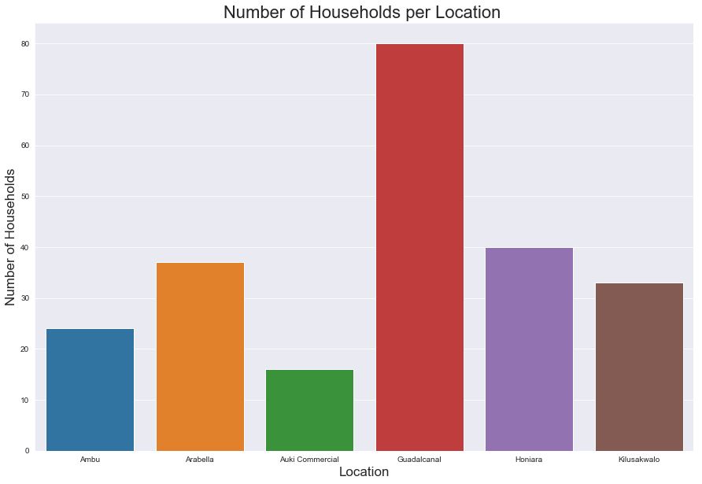


### MSW Composition per Location


```python
plt.figure(figsize=(15, 10));
print('Number of Households per Location:\n', solomon_eda_model['Location'].value_counts())

location_order = ['Ambu',
                  'Arabella',
                  'Auki Commercial',
                  'Guadalcanal',
                  'Honiara',
                  'Kilusakwalo']

sns.barplot('Location',
            'Organics_wt_%',
            data=solomon_eda_model,
            color='Green',
#             estimator=np.median,
            ci=0,
            order=location_order);

sns.barplot('Location',
            'Plastics_wt_%',
            data=solomon_eda_model,
            color='Blue',
#             estimator=np.median,
            ci=0,
            order=location_order);

sns.barplot('Location',
            'Paper_and_cardboard_wt_%',
            data=solomon_eda_model,
            color='Brown',
#             estimator=np.median,
            ci=0,
            order=location_order);

# solomon_eda_model_reduced = solomon_eda_model.copy()
# solomon_eda_model_reduced['energy_kWh_per_kg'] = solomon_eda_model_reduced['energy_kWh_per_kg'] / 10 

sns.lineplot('Location',
             'energy_kWh_per_kg',
             data=solomon_eda_model,
#              estimator=np.median,
             color='Black');

plt.title('Average MSW Composition & Energy Density (kWh/kg) per Location', fontsize=22);
plt.xticks(rotation=45, fontsize=15);
plt.xlabel('Location', fontsize=20);
plt.yticks(fontsize=15);
plt.ylabel('MSW Composition %', fontsize=20);
# plt.ylim(0, 1)

from matplotlib.lines import Line2D
custom_lines = [Line2D([0], [0], color='Green', lw=4),
                Line2D([0], [0], color='Blue', lw=4),
                Line2D([0], [0], color='Brown', lw=4),
                Line2D([0], [0], color='Black', lw=4)]

plt.legend(custom_lines, ['Organics',
                          'Plastics',
                          'Paper and Cardboard',
                          'Energy Density (kWh/kg)'],
           fontsize=12);
#            title='Waste Type',
#            title_fontsize=18);
```

    Number of Households per Location:
     Guadalcanal        80
    Honiara            40
    Arabella           37
    Kilusakwalo        33
    Ambu               24
    Auki Commercial    16
    Name: Location, dtype: int64
    


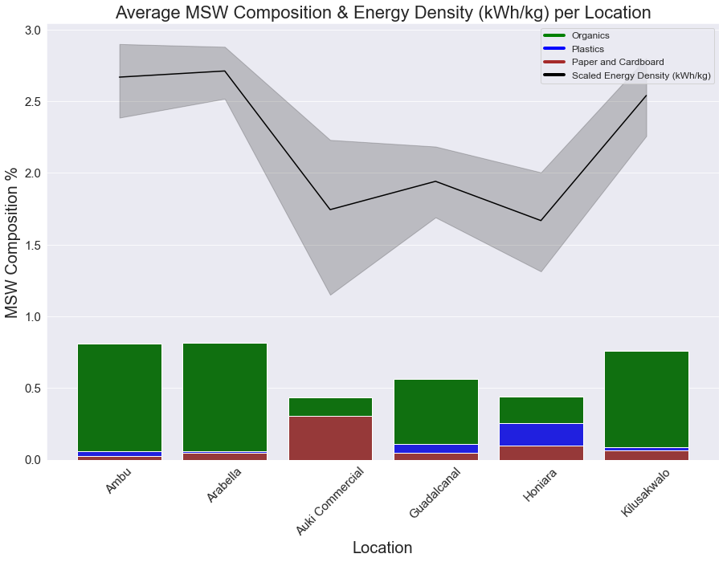


# Vanuatu

## Import Data


```python
#Bring in qualitative dataset
vanuatu_df_qual = pd.read_csv('Datasets/Solid_waste_audit_Vanuatu_Interviews.csv',
                      index_col='RecordID').reset_index()
print('Shape of Dataset:', vanuatu_df_qual.shape)
vanuatu_df_qual.rename(columns={'RecordID':'ID'}, inplace=True)
vanuatu_df_qual.head()
```

    Shape of Dataset: (186, 74)
    


<div>
<style scoped>
    .dataframe tbody tr th:only-of-type {
        vertical-align: middle;
    }

    .dataframe tbody tr th {
        vertical-align: top;
    }

    .dataframe thead th {
        text-align: right;
    }
</style>
<table border="1" class="dataframe">
  <thead>
    <tr style="text-align: right;">
      <th></th>
      <th>ID</th>
      <th>HouseholdCommercialShipID</th>
      <th>TotalsampleweightKG</th>
      <th>Amountwillingtopayforrubbishbag</th>
      <th>Amountwillingtopayforwastecollection</th>
      <th>AreaorIslandName</th>
      <th>Collectionservicerating</th>
      <th>DailyDiet1</th>
      <th>DailyDiet2</th>
      <th>DailyDiet3</th>
      <th>Diet1source</th>
      <th>Diet2source</th>
      <th>Diet3source</th>
      <th>Electricityexpensesper</th>
      <th>EstimatedMonthlyIncome</th>
      <th>GarbageCollectionType</th>
      <th>GroceryexpensesUS</th>
      <th>Groceryexpensesper</th>
      <th>HouseOwnership</th>
      <th>HouseholdGPSlatitude</th>
      <th>HouseholdGPSlongitude</th>
      <th>Incomesource</th>
      <th>InformationreceivedaboutWasteCollectionServices</th>
      <th>MonthlyIncomeUS</th>
      <th>NumberofBins</th>
      <th>Numberofemployedpeopleinfamily</th>
      <th>Numberofpeopleinhousehold</th>
      <th>Radio</th>
      <th>Reasonforrating</th>
      <th>Softdrinkcansperweek</th>
      <th>Suggestionsforimprovement</th>
      <th>Supportforlevy</th>
      <th>Supportforrubbishbag</th>
      <th>SurveyDate</th>
      <th>Totalelectricityexpenses</th>
      <th>Transportationexpensesper</th>
      <th>Transportationexpensestotal</th>
      <th>WasteDisposalMethodBulky</th>
      <th>WasteDisposalMethodGeneral</th>
      <th>WasteDisposalMethodNappies</th>
      <th>WasteDisposalMethodGreen</th>
      <th>WasteLevelwhencollectionarrives</th>
      <th>Wasteburned</th>
      <th>Waterbottlesperweek</th>
      <th>Weather</th>
      <th>WeeklyElectricityexpenses</th>
      <th>WeeklyGroceryExpenses</th>
      <th>WeeklyTransportationExpenses</th>
      <th>GeneralWasteCollect</th>
      <th>GreenWasteCollect</th>
      <th>SanitaryWasteCollect</th>
      <th>BulkyWasteCollect</th>
      <th>GeneralWasteTransport</th>
      <th>GreenWasteTransport</th>
      <th>SanitaryWasteTransport</th>
      <th>BulkyWasteTransport</th>
      <th>GeneralWasteDump</th>
      <th>GreenWasteDump</th>
      <th>SanitaryWasteDump</th>
      <th>BulkyWasteDump</th>
      <th>GeneralWasteBury</th>
      <th>GreenWasteBury</th>
      <th>SanitaryWasteBury</th>
      <th>BulkyWasteBury</th>
      <th>GeneralWasteBurn</th>
      <th>GreenWasteBurn</th>
      <th>SanitaryWasteBurn</th>
      <th>BulkyWasteBurn</th>
      <th>GeneralWasteWater</th>
      <th>GreenWasteWater</th>
      <th>SanitaryWasteWater</th>
      <th>BulkyWasteWater</th>
      <th>Collect</th>
      <th>ïHouseholdCommercialShipID</th>
    </tr>
  </thead>
  <tbody>
    <tr>
      <th>0</th>
      <td>1</td>
      <td>LH60_Van</td>
      <td>2.347</td>
      <td>100</td>
      <td>1000</td>
      <td>Lelepa</td>
      <td>NaN</td>
      <td>NaN</td>
      <td>NaN</td>
      <td>NaN</td>
      <td>Buy</td>
      <td>Local</td>
      <td>NaN</td>
      <td>Solar</td>
      <td>20000.0</td>
      <td>None</td>
      <td>43.87815</td>
      <td>NaN</td>
      <td>NaN</td>
      <td>-17.60097</td>
      <td>168.21058</td>
      <td>Fishing</td>
      <td>NaN</td>
      <td>175.51260</td>
      <td>3</td>
      <td>2</td>
      <td>NaN</td>
      <td>NaN</td>
      <td>NaN</td>
      <td>2.0</td>
      <td>NaN</td>
      <td>Yes</td>
      <td>Yes</td>
      <td>15/11/2018</td>
      <td>NaN</td>
      <td>NaN</td>
      <td>NaN</td>
      <td>NaN</td>
      <td>NaN</td>
      <td>NaN</td>
      <td>NaN</td>
      <td>NaN</td>
      <td>Yes</td>
      <td>10.0</td>
      <td>NaN</td>
      <td>NaN</td>
      <td>5000.0</td>
      <td>NaN</td>
      <td>0</td>
      <td>0</td>
      <td>0</td>
      <td>0</td>
      <td>0</td>
      <td>0</td>
      <td>0</td>
      <td>0</td>
      <td>0</td>
      <td>0</td>
      <td>0</td>
      <td>0</td>
      <td>0</td>
      <td>0</td>
      <td>0</td>
      <td>0</td>
      <td>0</td>
      <td>0</td>
      <td>0</td>
      <td>0</td>
      <td>0</td>
      <td>0</td>
      <td>0</td>
      <td>0</td>
      <td>0</td>
      <td>NaN</td>
    </tr>
    <tr>
      <th>1</th>
      <td>2</td>
      <td>LH59_Van</td>
      <td>2.752</td>
      <td>100</td>
      <td>2000</td>
      <td>Lelepa</td>
      <td>NaN</td>
      <td>NaN</td>
      <td>NaN</td>
      <td>NaN</td>
      <td>Buy</td>
      <td>Local</td>
      <td>NaN</td>
      <td>Solar</td>
      <td>35000.0</td>
      <td>None</td>
      <td>52.65378</td>
      <td>NaN</td>
      <td>NaN</td>
      <td>-17.60097</td>
      <td>168.21058</td>
      <td>Work</td>
      <td>NaN</td>
      <td>307.14705</td>
      <td>1</td>
      <td>1</td>
      <td>NaN</td>
      <td>NaN</td>
      <td>NaN</td>
      <td>5.0</td>
      <td>NaN</td>
      <td>Yes</td>
      <td>Yes</td>
      <td>15/11/2018</td>
      <td>NaN</td>
      <td>NaN</td>
      <td>NaN</td>
      <td>NaN</td>
      <td>NaN</td>
      <td>Dump it</td>
      <td>NaN</td>
      <td>NaN</td>
      <td>Yes</td>
      <td>10.0</td>
      <td>NaN</td>
      <td>NaN</td>
      <td>6000.0</td>
      <td>3000.0</td>
      <td>0</td>
      <td>0</td>
      <td>0</td>
      <td>0</td>
      <td>0</td>
      <td>0</td>
      <td>0</td>
      <td>0</td>
      <td>0</td>
      <td>0</td>
      <td>1</td>
      <td>0</td>
      <td>0</td>
      <td>0</td>
      <td>0</td>
      <td>0</td>
      <td>0</td>
      <td>0</td>
      <td>0</td>
      <td>0</td>
      <td>0</td>
      <td>0</td>
      <td>0</td>
      <td>0</td>
      <td>0</td>
      <td>NaN</td>
    </tr>
    <tr>
      <th>2</th>
      <td>3</td>
      <td>LH58_Van</td>
      <td>0.531</td>
      <td>100</td>
      <td>2000</td>
      <td>Lelepa</td>
      <td>NaN</td>
      <td>NaN</td>
      <td>NaN</td>
      <td>NaN</td>
      <td>Buy</td>
      <td>Local</td>
      <td>NaN</td>
      <td>Solar</td>
      <td>20000.0</td>
      <td>None</td>
      <td>35.10252</td>
      <td>NaN</td>
      <td>NaN</td>
      <td>-17.60097</td>
      <td>168.21058</td>
      <td>Self Emplyment</td>
      <td>NaN</td>
      <td>175.51260</td>
      <td>NaN</td>
      <td>1</td>
      <td>NaN</td>
      <td>NaN</td>
      <td>NaN</td>
      <td>3.0</td>
      <td>NaN</td>
      <td>Yes</td>
      <td>Yes</td>
      <td>15/11/2018</td>
      <td>NaN</td>
      <td>NaN</td>
      <td>NaN</td>
      <td>NaN</td>
      <td>NaN</td>
      <td>Dump it</td>
      <td>NaN</td>
      <td>Plastic</td>
      <td>Yes</td>
      <td>7.0</td>
      <td>NaN</td>
      <td>NaN</td>
      <td>4000.0</td>
      <td>2000.0</td>
      <td>0</td>
      <td>0</td>
      <td>0</td>
      <td>0</td>
      <td>0</td>
      <td>0</td>
      <td>0</td>
      <td>0</td>
      <td>0</td>
      <td>0</td>
      <td>1</td>
      <td>0</td>
      <td>0</td>
      <td>0</td>
      <td>0</td>
      <td>0</td>
      <td>0</td>
      <td>0</td>
      <td>0</td>
      <td>0</td>
      <td>0</td>
      <td>0</td>
      <td>0</td>
      <td>0</td>
      <td>0</td>
      <td>NaN</td>
    </tr>
    <tr>
      <th>3</th>
      <td>4</td>
      <td>LH57_Van</td>
      <td>0.307</td>
      <td>70</td>
      <td>100</td>
      <td>Lelepa</td>
      <td>NaN</td>
      <td>NaN</td>
      <td>NaN</td>
      <td>NaN</td>
      <td>Buy</td>
      <td>Local</td>
      <td>NaN</td>
      <td>Solar</td>
      <td>30000.0</td>
      <td>None</td>
      <td>43.87815</td>
      <td>NaN</td>
      <td>NaN</td>
      <td>-17.60097</td>
      <td>168.21058</td>
      <td>Art Craft</td>
      <td>NaN</td>
      <td>263.26890</td>
      <td>1</td>
      <td>1</td>
      <td>NaN</td>
      <td>NaN</td>
      <td>NaN</td>
      <td>1.0</td>
      <td>NaN</td>
      <td>Yes</td>
      <td>Yes</td>
      <td>15/11/2018</td>
      <td>NaN</td>
      <td>NaN</td>
      <td>NaN</td>
      <td>NaN</td>
      <td>NaN</td>
      <td>Dump</td>
      <td>NaN</td>
      <td>NaN</td>
      <td>NaN</td>
      <td>6.0</td>
      <td>NaN</td>
      <td>NaN</td>
      <td>5000.0</td>
      <td>2000.0</td>
      <td>0</td>
      <td>0</td>
      <td>0</td>
      <td>0</td>
      <td>0</td>
      <td>0</td>
      <td>0</td>
      <td>0</td>
      <td>0</td>
      <td>0</td>
      <td>1</td>
      <td>0</td>
      <td>0</td>
      <td>0</td>
      <td>0</td>
      <td>0</td>
      <td>0</td>
      <td>0</td>
      <td>0</td>
      <td>0</td>
      <td>0</td>
      <td>0</td>
      <td>0</td>
      <td>0</td>
      <td>0</td>
      <td>NaN</td>
    </tr>
    <tr>
      <th>4</th>
      <td>5</td>
      <td>LH56_Van</td>
      <td>1.980</td>
      <td>NaN</td>
      <td>NaN</td>
      <td>Lelepa</td>
      <td>NaN</td>
      <td>NaN</td>
      <td>NaN</td>
      <td>NaN</td>
      <td>NaN</td>
      <td>NaN</td>
      <td>NaN</td>
      <td>500</td>
      <td>15000.0</td>
      <td>None</td>
      <td>26.32689</td>
      <td>NaN</td>
      <td>NaN</td>
      <td>-17.60097</td>
      <td>168.21058</td>
      <td>Resort - hotel</td>
      <td>NaN</td>
      <td>131.63445</td>
      <td>2</td>
      <td>1</td>
      <td>NaN</td>
      <td>NaN</td>
      <td>NaN</td>
      <td>2.0</td>
      <td>NaN</td>
      <td>NaN</td>
      <td>Yes</td>
      <td>15/11/2018</td>
      <td>NaN</td>
      <td>NaN</td>
      <td>NaN</td>
      <td>NaN</td>
      <td>Burn</td>
      <td>Burn under the ground in the bush</td>
      <td>NaN</td>
      <td>NaN</td>
      <td>No</td>
      <td>4.0</td>
      <td>NaN</td>
      <td>NaN</td>
      <td>3000.0</td>
      <td>600.0</td>
      <td>0</td>
      <td>0</td>
      <td>0</td>
      <td>0</td>
      <td>0</td>
      <td>0</td>
      <td>0</td>
      <td>0</td>
      <td>0</td>
      <td>0</td>
      <td>1</td>
      <td>0</td>
      <td>0</td>
      <td>0</td>
      <td>0</td>
      <td>0</td>
      <td>1</td>
      <td>0</td>
      <td>1</td>
      <td>0</td>
      <td>0</td>
      <td>0</td>
      <td>0</td>
      <td>0</td>
      <td>0</td>
      <td>NaN</td>
    </tr>
  </tbody>
</table>
</div>


```python
#Bring in EDA dataset from modeling notebook
vanuatu_eda_model = pd.read_csv('Datasets/Vanuatu - EDA_DataFrame.csv', index_col='Unnamed: 0')
print('Shape of Dataset:', vanuatu_eda_model.shape)
vanuatu_eda_model.head()
```

    Shape of Dataset: (204, 34)
    


<div>
<style scoped>
    .dataframe tbody tr th:only-of-type {
        vertical-align: middle;
    }

    .dataframe tbody tr th {
        vertical-align: top;
    }

    .dataframe thead th {
        text-align: right;
    }
</style>
<table border="1" class="dataframe">
  <thead>
    <tr style="text-align: right;">
      <th></th>
      <th>ID</th>
      <th>Organics_wt_%</th>
      <th>Paper_and_cardboard_wt_%</th>
      <th>Plastics_wt_%</th>
      <th>Non_combust_wt_%</th>
      <th>Total_weight (kg)</th>
      <th>energy_kWh_per_kg</th>
      <th>total_energy_kWh</th>
      <th>Date</th>
      <th>Commercial</th>
      <th>Location</th>
      <th>commercial</th>
      <th>aluminium cans</th>
      <th>steel cans</th>
      <th>metal other</th>
      <th>lpb</th>
      <th>paper</th>
      <th>pet bottles</th>
      <th>plastic bags</th>
      <th>flexibles/film</th>
      <th>other plastic</th>
      <th>glass jars</th>
      <th>other organics</th>
      <th>textles</th>
      <th>ceramics</th>
      <th>other</th>
      <th>aluminium recyclable</th>
      <th>cardboard</th>
      <th>nappies</th>
      <th>food</th>
      <th>hdpe bottles</th>
      <th>pp</th>
      <th>feminine hygiene</th>
      <th>electrical items and peripherals (incl tvs)</th>
    </tr>
  </thead>
  <tbody>
    <tr>
      <th>0</th>
      <td>29</td>
      <td>0.652021</td>
      <td>0.147424</td>
      <td>0.056767</td>
      <td>0.143789</td>
      <td>37.4160</td>
      <td>2.45</td>
      <td>91.67</td>
      <td>2020-11-06</td>
      <td>0.0</td>
      <td>Port Vila</td>
      <td>0.0</td>
      <td>0.028</td>
      <td>2.324</td>
      <td>0.1400</td>
      <td>0.064</td>
      <td>0.660</td>
      <td>0.392</td>
      <td>0.172</td>
      <td>0.312</td>
      <td>1.248</td>
      <td>0.244</td>
      <td>24.396</td>
      <td>4.792</td>
      <td>0.576</td>
      <td>2.068</td>
      <td>0.000</td>
      <td>0.000</td>
      <td>0.000</td>
      <td>0.000</td>
      <td>0.000</td>
      <td>0.000</td>
      <td>0.000</td>
      <td>0.0</td>
    </tr>
    <tr>
      <th>1</th>
      <td>30</td>
      <td>0.560960</td>
      <td>0.076200</td>
      <td>0.202659</td>
      <td>0.160182</td>
      <td>7.4016</td>
      <td>2.24</td>
      <td>16.58</td>
      <td>2020-11-06</td>
      <td>0.0</td>
      <td>Port Vila</td>
      <td>0.0</td>
      <td>0.000</td>
      <td>0.408</td>
      <td>0.0316</td>
      <td>0.000</td>
      <td>0.000</td>
      <td>0.844</td>
      <td>0.156</td>
      <td>0.000</td>
      <td>0.500</td>
      <td>0.332</td>
      <td>0.000</td>
      <td>0.000</td>
      <td>0.000</td>
      <td>0.306</td>
      <td>0.108</td>
      <td>0.564</td>
      <td>0.088</td>
      <td>4.064</td>
      <td>0.000</td>
      <td>0.000</td>
      <td>0.000</td>
      <td>0.0</td>
    </tr>
    <tr>
      <th>2</th>
      <td>31</td>
      <td>0.858795</td>
      <td>0.033639</td>
      <td>0.098524</td>
      <td>0.009041</td>
      <td>30.0840</td>
      <td>3.03</td>
      <td>91.15</td>
      <td>2020-11-06</td>
      <td>0.0</td>
      <td>Port Vila</td>
      <td>0.0</td>
      <td>0.052</td>
      <td>0.000</td>
      <td>0.0000</td>
      <td>0.232</td>
      <td>0.672</td>
      <td>1.484</td>
      <td>0.000</td>
      <td>0.780</td>
      <td>0.460</td>
      <td>0.000</td>
      <td>0.000</td>
      <td>0.064</td>
      <td>0.000</td>
      <td>0.128</td>
      <td>0.092</td>
      <td>0.044</td>
      <td>13.876</td>
      <td>11.892</td>
      <td>0.060</td>
      <td>0.180</td>
      <td>0.068</td>
      <td>0.0</td>
    </tr>
    <tr>
      <th>3</th>
      <td>32</td>
      <td>0.805631</td>
      <td>0.053073</td>
      <td>0.128093</td>
      <td>0.013203</td>
      <td>22.8740</td>
      <td>2.97</td>
      <td>67.94</td>
      <td>2020-11-07</td>
      <td>0.0</td>
      <td>Port Vila</td>
      <td>0.0</td>
      <td>0.000</td>
      <td>0.302</td>
      <td>0.0000</td>
      <td>0.202</td>
      <td>0.192</td>
      <td>0.884</td>
      <td>0.670</td>
      <td>1.084</td>
      <td>0.256</td>
      <td>0.000</td>
      <td>0.000</td>
      <td>0.820</td>
      <td>0.000</td>
      <td>0.000</td>
      <td>0.000</td>
      <td>0.000</td>
      <td>4.792</td>
      <td>13.636</td>
      <td>0.000</td>
      <td>0.036</td>
      <td>0.000</td>
      <td>0.0</td>
    </tr>
    <tr>
      <th>4</th>
      <td>33</td>
      <td>0.742040</td>
      <td>0.062489</td>
      <td>0.091095</td>
      <td>0.104376</td>
      <td>11.7460</td>
      <td>2.67</td>
      <td>31.36</td>
      <td>2020-11-07</td>
      <td>0.0</td>
      <td>Port Vila</td>
      <td>0.0</td>
      <td>0.032</td>
      <td>1.120</td>
      <td>0.0000</td>
      <td>0.000</td>
      <td>0.060</td>
      <td>0.168</td>
      <td>0.156</td>
      <td>0.256</td>
      <td>0.368</td>
      <td>0.000</td>
      <td>0.000</td>
      <td>0.200</td>
      <td>0.030</td>
      <td>0.000</td>
      <td>0.044</td>
      <td>0.474</td>
      <td>8.220</td>
      <td>0.496</td>
      <td>0.122</td>
      <td>0.000</td>
      <td>0.000</td>
      <td>0.0</td>
    </tr>
  </tbody>
</table>
</div>


## Qualitative EDA


```python
vanuatu_df_qual.head(15)
```


<div>
<style scoped>
    .dataframe tbody tr th:only-of-type {
        vertical-align: middle;
    }

    .dataframe tbody tr th {
        vertical-align: top;
    }

    .dataframe thead th {
        text-align: right;
    }
</style>
<table border="1" class="dataframe">
  <thead>
    <tr style="text-align: right;">
      <th></th>
      <th>ID</th>
      <th>HouseholdCommercialShipID</th>
      <th>TotalsampleweightKG</th>
      <th>Amountwillingtopayforrubbishbag</th>
      <th>Amountwillingtopayforwastecollection</th>
      <th>AreaorIslandName</th>
      <th>Collectionservicerating</th>
      <th>DailyDiet1</th>
      <th>DailyDiet2</th>
      <th>DailyDiet3</th>
      <th>Diet1source</th>
      <th>Diet2source</th>
      <th>Diet3source</th>
      <th>Electricityexpensesper</th>
      <th>EstimatedMonthlyIncome</th>
      <th>GarbageCollectionType</th>
      <th>GroceryexpensesUS</th>
      <th>Groceryexpensesper</th>
      <th>HouseOwnership</th>
      <th>HouseholdGPSlatitude</th>
      <th>HouseholdGPSlongitude</th>
      <th>Incomesource</th>
      <th>InformationreceivedaboutWasteCollectionServices</th>
      <th>MonthlyIncomeUS</th>
      <th>NumberofBins</th>
      <th>Numberofemployedpeopleinfamily</th>
      <th>Numberofpeopleinhousehold</th>
      <th>Radio</th>
      <th>Reasonforrating</th>
      <th>Softdrinkcansperweek</th>
      <th>Suggestionsforimprovement</th>
      <th>Supportforlevy</th>
      <th>Supportforrubbishbag</th>
      <th>SurveyDate</th>
      <th>Totalelectricityexpenses</th>
      <th>Transportationexpensesper</th>
      <th>Transportationexpensestotal</th>
      <th>WasteDisposalMethodBulky</th>
      <th>WasteDisposalMethodGeneral</th>
      <th>WasteDisposalMethodNappies</th>
      <th>WasteDisposalMethodGreen</th>
      <th>WasteLevelwhencollectionarrives</th>
      <th>Wasteburned</th>
      <th>Waterbottlesperweek</th>
      <th>Weather</th>
      <th>WeeklyElectricityexpenses</th>
      <th>WeeklyGroceryExpenses</th>
      <th>WeeklyTransportationExpenses</th>
      <th>GeneralWasteCollect</th>
      <th>GreenWasteCollect</th>
      <th>SanitaryWasteCollect</th>
      <th>BulkyWasteCollect</th>
      <th>GeneralWasteTransport</th>
      <th>GreenWasteTransport</th>
      <th>SanitaryWasteTransport</th>
      <th>BulkyWasteTransport</th>
      <th>GeneralWasteDump</th>
      <th>GreenWasteDump</th>
      <th>SanitaryWasteDump</th>
      <th>BulkyWasteDump</th>
      <th>GeneralWasteBury</th>
      <th>GreenWasteBury</th>
      <th>SanitaryWasteBury</th>
      <th>BulkyWasteBury</th>
      <th>GeneralWasteBurn</th>
      <th>GreenWasteBurn</th>
      <th>SanitaryWasteBurn</th>
      <th>BulkyWasteBurn</th>
      <th>GeneralWasteWater</th>
      <th>GreenWasteWater</th>
      <th>SanitaryWasteWater</th>
      <th>BulkyWasteWater</th>
      <th>Collect</th>
      <th>ïHouseholdCommercialShipID</th>
    </tr>
  </thead>
  <tbody>
    <tr>
      <th>0</th>
      <td>1</td>
      <td>LH60_Van</td>
      <td>2.347</td>
      <td>100</td>
      <td>1000</td>
      <td>Lelepa</td>
      <td>NaN</td>
      <td>NaN</td>
      <td>NaN</td>
      <td>NaN</td>
      <td>Buy</td>
      <td>Local</td>
      <td>NaN</td>
      <td>Solar</td>
      <td>20000.0</td>
      <td>None</td>
      <td>43.87815</td>
      <td>NaN</td>
      <td>NaN</td>
      <td>-17.60097</td>
      <td>168.21058</td>
      <td>Fishing</td>
      <td>NaN</td>
      <td>175.512600</td>
      <td>3</td>
      <td>2</td>
      <td>NaN</td>
      <td>NaN</td>
      <td>NaN</td>
      <td>2.0</td>
      <td>NaN</td>
      <td>Yes</td>
      <td>Yes</td>
      <td>15/11/2018</td>
      <td>NaN</td>
      <td>NaN</td>
      <td>NaN</td>
      <td>NaN</td>
      <td>NaN</td>
      <td>NaN</td>
      <td>NaN</td>
      <td>NaN</td>
      <td>Yes</td>
      <td>10.0</td>
      <td>NaN</td>
      <td>NaN</td>
      <td>5000.0</td>
      <td>NaN</td>
      <td>0</td>
      <td>0</td>
      <td>0</td>
      <td>0</td>
      <td>0</td>
      <td>0</td>
      <td>0</td>
      <td>0</td>
      <td>0</td>
      <td>0</td>
      <td>0</td>
      <td>0</td>
      <td>0</td>
      <td>0</td>
      <td>0</td>
      <td>0</td>
      <td>0</td>
      <td>0</td>
      <td>0</td>
      <td>0</td>
      <td>0</td>
      <td>0</td>
      <td>0</td>
      <td>0</td>
      <td>0</td>
      <td>NaN</td>
    </tr>
    <tr>
      <th>1</th>
      <td>2</td>
      <td>LH59_Van</td>
      <td>2.752</td>
      <td>100</td>
      <td>2000</td>
      <td>Lelepa</td>
      <td>NaN</td>
      <td>NaN</td>
      <td>NaN</td>
      <td>NaN</td>
      <td>Buy</td>
      <td>Local</td>
      <td>NaN</td>
      <td>Solar</td>
      <td>35000.0</td>
      <td>None</td>
      <td>52.65378</td>
      <td>NaN</td>
      <td>NaN</td>
      <td>-17.60097</td>
      <td>168.21058</td>
      <td>Work</td>
      <td>NaN</td>
      <td>307.147050</td>
      <td>1</td>
      <td>1</td>
      <td>NaN</td>
      <td>NaN</td>
      <td>NaN</td>
      <td>5.0</td>
      <td>NaN</td>
      <td>Yes</td>
      <td>Yes</td>
      <td>15/11/2018</td>
      <td>NaN</td>
      <td>NaN</td>
      <td>NaN</td>
      <td>NaN</td>
      <td>NaN</td>
      <td>Dump it</td>
      <td>NaN</td>
      <td>NaN</td>
      <td>Yes</td>
      <td>10.0</td>
      <td>NaN</td>
      <td>NaN</td>
      <td>6000.0</td>
      <td>3000.0</td>
      <td>0</td>
      <td>0</td>
      <td>0</td>
      <td>0</td>
      <td>0</td>
      <td>0</td>
      <td>0</td>
      <td>0</td>
      <td>0</td>
      <td>0</td>
      <td>1</td>
      <td>0</td>
      <td>0</td>
      <td>0</td>
      <td>0</td>
      <td>0</td>
      <td>0</td>
      <td>0</td>
      <td>0</td>
      <td>0</td>
      <td>0</td>
      <td>0</td>
      <td>0</td>
      <td>0</td>
      <td>0</td>
      <td>NaN</td>
    </tr>
    <tr>
      <th>2</th>
      <td>3</td>
      <td>LH58_Van</td>
      <td>0.531</td>
      <td>100</td>
      <td>2000</td>
      <td>Lelepa</td>
      <td>NaN</td>
      <td>NaN</td>
      <td>NaN</td>
      <td>NaN</td>
      <td>Buy</td>
      <td>Local</td>
      <td>NaN</td>
      <td>Solar</td>
      <td>20000.0</td>
      <td>None</td>
      <td>35.10252</td>
      <td>NaN</td>
      <td>NaN</td>
      <td>-17.60097</td>
      <td>168.21058</td>
      <td>Self Emplyment</td>
      <td>NaN</td>
      <td>175.512600</td>
      <td>NaN</td>
      <td>1</td>
      <td>NaN</td>
      <td>NaN</td>
      <td>NaN</td>
      <td>3.0</td>
      <td>NaN</td>
      <td>Yes</td>
      <td>Yes</td>
      <td>15/11/2018</td>
      <td>NaN</td>
      <td>NaN</td>
      <td>NaN</td>
      <td>NaN</td>
      <td>NaN</td>
      <td>Dump it</td>
      <td>NaN</td>
      <td>Plastic</td>
      <td>Yes</td>
      <td>7.0</td>
      <td>NaN</td>
      <td>NaN</td>
      <td>4000.0</td>
      <td>2000.0</td>
      <td>0</td>
      <td>0</td>
      <td>0</td>
      <td>0</td>
      <td>0</td>
      <td>0</td>
      <td>0</td>
      <td>0</td>
      <td>0</td>
      <td>0</td>
      <td>1</td>
      <td>0</td>
      <td>0</td>
      <td>0</td>
      <td>0</td>
      <td>0</td>
      <td>0</td>
      <td>0</td>
      <td>0</td>
      <td>0</td>
      <td>0</td>
      <td>0</td>
      <td>0</td>
      <td>0</td>
      <td>0</td>
      <td>NaN</td>
    </tr>
    <tr>
      <th>3</th>
      <td>4</td>
      <td>LH57_Van</td>
      <td>0.307</td>
      <td>70</td>
      <td>100</td>
      <td>Lelepa</td>
      <td>NaN</td>
      <td>NaN</td>
      <td>NaN</td>
      <td>NaN</td>
      <td>Buy</td>
      <td>Local</td>
      <td>NaN</td>
      <td>Solar</td>
      <td>30000.0</td>
      <td>None</td>
      <td>43.87815</td>
      <td>NaN</td>
      <td>NaN</td>
      <td>-17.60097</td>
      <td>168.21058</td>
      <td>Art Craft</td>
      <td>NaN</td>
      <td>263.268900</td>
      <td>1</td>
      <td>1</td>
      <td>NaN</td>
      <td>NaN</td>
      <td>NaN</td>
      <td>1.0</td>
      <td>NaN</td>
      <td>Yes</td>
      <td>Yes</td>
      <td>15/11/2018</td>
      <td>NaN</td>
      <td>NaN</td>
      <td>NaN</td>
      <td>NaN</td>
      <td>NaN</td>
      <td>Dump</td>
      <td>NaN</td>
      <td>NaN</td>
      <td>NaN</td>
      <td>6.0</td>
      <td>NaN</td>
      <td>NaN</td>
      <td>5000.0</td>
      <td>2000.0</td>
      <td>0</td>
      <td>0</td>
      <td>0</td>
      <td>0</td>
      <td>0</td>
      <td>0</td>
      <td>0</td>
      <td>0</td>
      <td>0</td>
      <td>0</td>
      <td>1</td>
      <td>0</td>
      <td>0</td>
      <td>0</td>
      <td>0</td>
      <td>0</td>
      <td>0</td>
      <td>0</td>
      <td>0</td>
      <td>0</td>
      <td>0</td>
      <td>0</td>
      <td>0</td>
      <td>0</td>
      <td>0</td>
      <td>NaN</td>
    </tr>
    <tr>
      <th>4</th>
      <td>5</td>
      <td>LH56_Van</td>
      <td>1.980</td>
      <td>NaN</td>
      <td>NaN</td>
      <td>Lelepa</td>
      <td>NaN</td>
      <td>NaN</td>
      <td>NaN</td>
      <td>NaN</td>
      <td>NaN</td>
      <td>NaN</td>
      <td>NaN</td>
      <td>500</td>
      <td>15000.0</td>
      <td>None</td>
      <td>26.32689</td>
      <td>NaN</td>
      <td>NaN</td>
      <td>-17.60097</td>
      <td>168.21058</td>
      <td>Resort - hotel</td>
      <td>NaN</td>
      <td>131.634450</td>
      <td>2</td>
      <td>1</td>
      <td>NaN</td>
      <td>NaN</td>
      <td>NaN</td>
      <td>2.0</td>
      <td>NaN</td>
      <td>NaN</td>
      <td>Yes</td>
      <td>15/11/2018</td>
      <td>NaN</td>
      <td>NaN</td>
      <td>NaN</td>
      <td>NaN</td>
      <td>Burn</td>
      <td>Burn under the ground in the bush</td>
      <td>NaN</td>
      <td>NaN</td>
      <td>No</td>
      <td>4.0</td>
      <td>NaN</td>
      <td>NaN</td>
      <td>3000.0</td>
      <td>600.0</td>
      <td>0</td>
      <td>0</td>
      <td>0</td>
      <td>0</td>
      <td>0</td>
      <td>0</td>
      <td>0</td>
      <td>0</td>
      <td>0</td>
      <td>0</td>
      <td>1</td>
      <td>0</td>
      <td>0</td>
      <td>0</td>
      <td>0</td>
      <td>0</td>
      <td>1</td>
      <td>0</td>
      <td>1</td>
      <td>0</td>
      <td>0</td>
      <td>0</td>
      <td>0</td>
      <td>0</td>
      <td>0</td>
      <td>NaN</td>
    </tr>
    <tr>
      <th>5</th>
      <td>6</td>
      <td>LH55_Van</td>
      <td>0.133</td>
      <td>100</td>
      <td>1000</td>
      <td>Lelepa</td>
      <td>NaN</td>
      <td>NaN</td>
      <td>NaN</td>
      <td>NaN</td>
      <td>Buy</td>
      <td>Local</td>
      <td>NaN</td>
      <td>Solar</td>
      <td>50000.0</td>
      <td>None</td>
      <td>35.10252</td>
      <td>NaN</td>
      <td>NaN</td>
      <td>-17.60097</td>
      <td>168.21058</td>
      <td>Working</td>
      <td>NaN</td>
      <td>438.781500</td>
      <td>2</td>
      <td>2</td>
      <td>NaN</td>
      <td>NaN</td>
      <td>NaN</td>
      <td>4.0</td>
      <td>NaN</td>
      <td>Yes</td>
      <td>Yes</td>
      <td>15/11/2018</td>
      <td>NaN</td>
      <td>NaN</td>
      <td>NaN</td>
      <td>NaN</td>
      <td>Burn</td>
      <td>Dump</td>
      <td>No</td>
      <td>NaN</td>
      <td>NaN</td>
      <td>11.0</td>
      <td>NaN</td>
      <td>NaN</td>
      <td>4000.0</td>
      <td>2000.0</td>
      <td>0</td>
      <td>0</td>
      <td>0</td>
      <td>0</td>
      <td>0</td>
      <td>0</td>
      <td>0</td>
      <td>0</td>
      <td>0</td>
      <td>0</td>
      <td>1</td>
      <td>0</td>
      <td>0</td>
      <td>0</td>
      <td>0</td>
      <td>0</td>
      <td>1</td>
      <td>0</td>
      <td>0</td>
      <td>0</td>
      <td>0</td>
      <td>0</td>
      <td>0</td>
      <td>0</td>
      <td>0</td>
      <td>NaN</td>
    </tr>
    <tr>
      <th>6</th>
      <td>7</td>
      <td>LH54_Van</td>
      <td>0.066</td>
      <td>100</td>
      <td>1000</td>
      <td>Lelepa</td>
      <td>NaN</td>
      <td>NaN</td>
      <td>NaN</td>
      <td>NaN</td>
      <td>Buy</td>
      <td>Local food</td>
      <td>NaN</td>
      <td>Solar</td>
      <td>5000.0</td>
      <td>None</td>
      <td>26.32689</td>
      <td>NaN</td>
      <td>NaN</td>
      <td>-17.60097</td>
      <td>168.21058</td>
      <td>Tourism</td>
      <td>NaN</td>
      <td>43.878150</td>
      <td>2</td>
      <td>NaN</td>
      <td>NaN</td>
      <td>NaN</td>
      <td>NaN</td>
      <td>0.0</td>
      <td>NaN</td>
      <td>Yes</td>
      <td>Yes</td>
      <td>15/11/2018</td>
      <td>NaN</td>
      <td>NaN</td>
      <td>NaN</td>
      <td>NaN</td>
      <td>NaN</td>
      <td>Dump</td>
      <td>NaN</td>
      <td>NaN</td>
      <td>NaN</td>
      <td>6.0</td>
      <td>NaN</td>
      <td>NaN</td>
      <td>3000.0</td>
      <td>1000.0</td>
      <td>0</td>
      <td>0</td>
      <td>0</td>
      <td>0</td>
      <td>0</td>
      <td>0</td>
      <td>0</td>
      <td>0</td>
      <td>0</td>
      <td>0</td>
      <td>1</td>
      <td>0</td>
      <td>0</td>
      <td>0</td>
      <td>0</td>
      <td>0</td>
      <td>0</td>
      <td>0</td>
      <td>0</td>
      <td>0</td>
      <td>0</td>
      <td>0</td>
      <td>0</td>
      <td>0</td>
      <td>0</td>
      <td>NaN</td>
    </tr>
    <tr>
      <th>7</th>
      <td>8</td>
      <td>LH53_Van</td>
      <td>0.893</td>
      <td>50</td>
      <td>1000</td>
      <td>Lelepa</td>
      <td>NaN</td>
      <td>NaN</td>
      <td>NaN</td>
      <td>NaN</td>
      <td>Buy food</td>
      <td>Local</td>
      <td>NaN</td>
      <td>Solar</td>
      <td>50000.0</td>
      <td>None</td>
      <td>17.55126</td>
      <td>NaN</td>
      <td>NaN</td>
      <td>-17.60097</td>
      <td>168.21058</td>
      <td>Government Employed</td>
      <td>NaN</td>
      <td>438.781500</td>
      <td>NaN</td>
      <td>1</td>
      <td>NaN</td>
      <td>NaN</td>
      <td>NaN</td>
      <td>NaN</td>
      <td>NaN</td>
      <td>Yes</td>
      <td>Yes</td>
      <td>15/11/2018</td>
      <td>NaN</td>
      <td>NaN</td>
      <td>NaN</td>
      <td>NaN</td>
      <td>Burnt</td>
      <td>Dump</td>
      <td>Burnt</td>
      <td>NaN</td>
      <td>NaN</td>
      <td>NaN</td>
      <td>NaN</td>
      <td>NaN</td>
      <td>2000.0</td>
      <td>3200.0</td>
      <td>0</td>
      <td>0</td>
      <td>0</td>
      <td>0</td>
      <td>0</td>
      <td>0</td>
      <td>0</td>
      <td>0</td>
      <td>0</td>
      <td>0</td>
      <td>1</td>
      <td>0</td>
      <td>0</td>
      <td>0</td>
      <td>0</td>
      <td>0</td>
      <td>1</td>
      <td>1</td>
      <td>0</td>
      <td>0</td>
      <td>0</td>
      <td>0</td>
      <td>0</td>
      <td>0</td>
      <td>0</td>
      <td>NaN</td>
    </tr>
    <tr>
      <th>8</th>
      <td>10</td>
      <td>LH51_Van</td>
      <td>2.829</td>
      <td>NaN</td>
      <td>2000</td>
      <td>Lelepa</td>
      <td>NaN</td>
      <td>NaN</td>
      <td>NaN</td>
      <td>NaN</td>
      <td>Buy</td>
      <td>Local</td>
      <td>NaN</td>
      <td>NaN</td>
      <td>20000.0</td>
      <td>None</td>
      <td>17.55126</td>
      <td>NaN</td>
      <td>NaN</td>
      <td>-17.60097</td>
      <td>168.21058</td>
      <td>Tourist</td>
      <td>NaN</td>
      <td>175.512600</td>
      <td>NaN</td>
      <td>NaN</td>
      <td>NaN</td>
      <td>NaN</td>
      <td>NaN</td>
      <td>0.0</td>
      <td>NaN</td>
      <td>Yes</td>
      <td>Yes</td>
      <td>15/11/2018</td>
      <td>NaN</td>
      <td>NaN</td>
      <td>NaN</td>
      <td>NaN</td>
      <td>NaN</td>
      <td>NaN</td>
      <td>NaN</td>
      <td>NaN</td>
      <td>NaN</td>
      <td>8.0</td>
      <td>NaN</td>
      <td>NaN</td>
      <td>2000.0</td>
      <td>1000.0</td>
      <td>0</td>
      <td>0</td>
      <td>0</td>
      <td>0</td>
      <td>0</td>
      <td>0</td>
      <td>0</td>
      <td>0</td>
      <td>0</td>
      <td>0</td>
      <td>0</td>
      <td>0</td>
      <td>0</td>
      <td>0</td>
      <td>0</td>
      <td>0</td>
      <td>0</td>
      <td>0</td>
      <td>0</td>
      <td>0</td>
      <td>0</td>
      <td>0</td>
      <td>0</td>
      <td>0</td>
      <td>0</td>
      <td>NaN</td>
    </tr>
    <tr>
      <th>9</th>
      <td>11</td>
      <td>LH50_Van</td>
      <td>0.475</td>
      <td>100</td>
      <td>1000</td>
      <td>Lelepa</td>
      <td>NaN</td>
      <td>NaN</td>
      <td>NaN</td>
      <td>NaN</td>
      <td>Buy</td>
      <td>Local</td>
      <td>NaN</td>
      <td>Solar</td>
      <td>15000.0</td>
      <td>None</td>
      <td>17.55126</td>
      <td>NaN</td>
      <td>NaN</td>
      <td>-17.60097</td>
      <td>168.21058</td>
      <td>Self Employment</td>
      <td>NaN</td>
      <td>131.634450</td>
      <td>3</td>
      <td>1</td>
      <td>NaN</td>
      <td>NaN</td>
      <td>NaN</td>
      <td>NaN</td>
      <td>NaN</td>
      <td>Yes</td>
      <td>Yes</td>
      <td>15/11/2018</td>
      <td>NaN</td>
      <td>NaN</td>
      <td>NaN</td>
      <td>Dump</td>
      <td>NaN</td>
      <td>NaN</td>
      <td>Pigs</td>
      <td>NaN</td>
      <td>NaN</td>
      <td>NaN</td>
      <td>NaN</td>
      <td>NaN</td>
      <td>2000.0</td>
      <td>1000.0</td>
      <td>0</td>
      <td>0</td>
      <td>0</td>
      <td>0</td>
      <td>0</td>
      <td>0</td>
      <td>0</td>
      <td>0</td>
      <td>0</td>
      <td>0</td>
      <td>0</td>
      <td>1</td>
      <td>0</td>
      <td>0</td>
      <td>0</td>
      <td>0</td>
      <td>0</td>
      <td>0</td>
      <td>0</td>
      <td>0</td>
      <td>0</td>
      <td>0</td>
      <td>0</td>
      <td>0</td>
      <td>0</td>
      <td>NaN</td>
    </tr>
    <tr>
      <th>10</th>
      <td>12</td>
      <td>LH49_Van</td>
      <td>0.244</td>
      <td>100</td>
      <td>2000</td>
      <td>Lelepa</td>
      <td>NaN</td>
      <td>Rice&amp; Tins</td>
      <td>Group local</td>
      <td>Fish</td>
      <td>Buy</td>
      <td>Produce</td>
      <td>NaN</td>
      <td>Solar light</td>
      <td>150000.0</td>
      <td>None</td>
      <td>17.55126</td>
      <td>NaN</td>
      <td>Own</td>
      <td>-17.60097</td>
      <td>168.21058</td>
      <td>Fishing - Own business</td>
      <td>NaN</td>
      <td>1316.344500</td>
      <td>NaN</td>
      <td>NaN</td>
      <td>NaN</td>
      <td>NaN</td>
      <td>NaN</td>
      <td>3.0</td>
      <td>NaN</td>
      <td>Yes&amp; Clean our environment&amp; recycle for money</td>
      <td>Yes</td>
      <td>15/11/2018</td>
      <td>NaN</td>
      <td>NaN</td>
      <td>NaN</td>
      <td>NaN</td>
      <td>Burn</td>
      <td>NaN</td>
      <td>Burn</td>
      <td>NaN</td>
      <td>NaN</td>
      <td>5.0</td>
      <td>NaN</td>
      <td>NaN</td>
      <td>2000.0</td>
      <td>800.0</td>
      <td>0</td>
      <td>0</td>
      <td>0</td>
      <td>0</td>
      <td>0</td>
      <td>0</td>
      <td>0</td>
      <td>0</td>
      <td>0</td>
      <td>0</td>
      <td>0</td>
      <td>0</td>
      <td>0</td>
      <td>0</td>
      <td>0</td>
      <td>0</td>
      <td>1</td>
      <td>1</td>
      <td>0</td>
      <td>0</td>
      <td>0</td>
      <td>0</td>
      <td>0</td>
      <td>0</td>
      <td>0</td>
      <td>NaN</td>
    </tr>
    <tr>
      <th>11</th>
      <td>13</td>
      <td>LH48_Van</td>
      <td>1.852</td>
      <td>50</td>
      <td>50</td>
      <td>Lelepa</td>
      <td>NaN</td>
      <td>Manihot lano</td>
      <td>Fish</td>
      <td>Chicken</td>
      <td>Produce</td>
      <td>Produce</td>
      <td>Produce and buy</td>
      <td>NaN</td>
      <td>40000.0</td>
      <td>None</td>
      <td>8.77563</td>
      <td>NaN</td>
      <td>Own</td>
      <td>-17.60097</td>
      <td>168.21058</td>
      <td>Employment</td>
      <td>NaN</td>
      <td>351.025200</td>
      <td>Cardboard box</td>
      <td>2</td>
      <td>4.0</td>
      <td>NaN</td>
      <td>NaN</td>
      <td>4.0</td>
      <td>NaN</td>
      <td>Yes&amp; highly support this government inititive ...</td>
      <td>Yes&amp; good if eventually introdced</td>
      <td>NaN</td>
      <td>NaN</td>
      <td>NaN</td>
      <td>NaN</td>
      <td>NaN</td>
      <td>NaN</td>
      <td>NaN</td>
      <td>Burn on Popie island</td>
      <td>NaN</td>
      <td>NaN</td>
      <td>0.0</td>
      <td>NaN</td>
      <td>NaN</td>
      <td>1000.0</td>
      <td>NaN</td>
      <td>0</td>
      <td>0</td>
      <td>0</td>
      <td>0</td>
      <td>0</td>
      <td>0</td>
      <td>0</td>
      <td>0</td>
      <td>0</td>
      <td>0</td>
      <td>0</td>
      <td>0</td>
      <td>0</td>
      <td>0</td>
      <td>0</td>
      <td>0</td>
      <td>0</td>
      <td>1</td>
      <td>0</td>
      <td>0</td>
      <td>0</td>
      <td>0</td>
      <td>0</td>
      <td>0</td>
      <td>0</td>
      <td>NaN</td>
    </tr>
    <tr>
      <th>12</th>
      <td>14</td>
      <td>LH46_Van</td>
      <td>0.606</td>
      <td>50</td>
      <td>200</td>
      <td>Lelepa</td>
      <td>NaN</td>
      <td>NaN</td>
      <td>NaN</td>
      <td>NaN</td>
      <td>NaN</td>
      <td>NaN</td>
      <td>NaN</td>
      <td>NaN</td>
      <td>2500.0</td>
      <td>None</td>
      <td>NaN</td>
      <td>NaN</td>
      <td>NaN</td>
      <td>-17.60097</td>
      <td>168.21058</td>
      <td>Tourism</td>
      <td>NaN</td>
      <td>21.939075</td>
      <td>1</td>
      <td>NaN</td>
      <td>2.0</td>
      <td>NaN</td>
      <td>NaN</td>
      <td>NaN</td>
      <td>NaN</td>
      <td>Yes</td>
      <td>NaN</td>
      <td>15/11/2018</td>
      <td>NaN</td>
      <td>NaN</td>
      <td>NaN</td>
      <td>Burn</td>
      <td>Burn</td>
      <td>Burn</td>
      <td>Burn</td>
      <td>NaN</td>
      <td>NaN</td>
      <td>NaN</td>
      <td>NaN</td>
      <td>NaN</td>
      <td>NaN</td>
      <td>NaN</td>
      <td>0</td>
      <td>0</td>
      <td>0</td>
      <td>0</td>
      <td>0</td>
      <td>0</td>
      <td>0</td>
      <td>0</td>
      <td>0</td>
      <td>0</td>
      <td>0</td>
      <td>0</td>
      <td>0</td>
      <td>0</td>
      <td>0</td>
      <td>0</td>
      <td>1</td>
      <td>1</td>
      <td>1</td>
      <td>1</td>
      <td>0</td>
      <td>0</td>
      <td>0</td>
      <td>0</td>
      <td>0</td>
      <td>NaN</td>
    </tr>
    <tr>
      <th>13</th>
      <td>15</td>
      <td>H50_Van</td>
      <td>9.734</td>
      <td>100</td>
      <td>1000</td>
      <td>Port Vila 3</td>
      <td>10.0</td>
      <td>NaN</td>
      <td>NaN</td>
      <td>NaN</td>
      <td>Buy</td>
      <td>Buy</td>
      <td>Buy</td>
      <td>Month</td>
      <td>100000.0</td>
      <td>User Pays</td>
      <td>175.51260</td>
      <td>NaN</td>
      <td>Own</td>
      <td>-17.74842</td>
      <td>168.31775</td>
      <td>Air ports Vanuatu</td>
      <td>NaN</td>
      <td>877.563000</td>
      <td>1 plastic bag</td>
      <td>2</td>
      <td>6.0</td>
      <td>Yes</td>
      <td>Collection is good</td>
      <td>4.5</td>
      <td>NaN</td>
      <td>Yes</td>
      <td>Yes</td>
      <td>16/11/2018</td>
      <td>2000.0</td>
      <td>NaN</td>
      <td>NaN</td>
      <td>Buy private truck</td>
      <td>Into plastic bags (Yellow)</td>
      <td>into yellow bag</td>
      <td>Compost</td>
      <td>NaN</td>
      <td>NaN</td>
      <td>4.0</td>
      <td>Sunny</td>
      <td>NaN</td>
      <td>20000.0</td>
      <td>3000.0</td>
      <td>1</td>
      <td>0</td>
      <td>1</td>
      <td>0</td>
      <td>0</td>
      <td>0</td>
      <td>0</td>
      <td>1</td>
      <td>0</td>
      <td>0</td>
      <td>0</td>
      <td>0</td>
      <td>0</td>
      <td>0</td>
      <td>0</td>
      <td>0</td>
      <td>0</td>
      <td>0</td>
      <td>0</td>
      <td>0</td>
      <td>0</td>
      <td>0</td>
      <td>1</td>
      <td>0</td>
      <td>1</td>
      <td>NaN</td>
    </tr>
    <tr>
      <th>14</th>
      <td>104</td>
      <td>LV08_Van</td>
      <td>5.870</td>
      <td>NaN</td>
      <td>NaN</td>
      <td>Luganville</td>
      <td>NaN</td>
      <td>NaN</td>
      <td>NaN</td>
      <td>NaN</td>
      <td>NaN</td>
      <td>NaN</td>
      <td>NaN</td>
      <td>NaN</td>
      <td>NaN</td>
      <td>User Pays</td>
      <td>NaN</td>
      <td>NaN</td>
      <td>NaN</td>
      <td>-15.51457</td>
      <td>167.20198</td>
      <td>NaN</td>
      <td>NaN</td>
      <td>NaN</td>
      <td>NaN</td>
      <td>NaN</td>
      <td>NaN</td>
      <td>NaN</td>
      <td>NaN</td>
      <td>NaN</td>
      <td>NaN</td>
      <td>NaN</td>
      <td>NaN</td>
      <td>19/11/2018</td>
      <td>NaN</td>
      <td>NaN</td>
      <td>NaN</td>
      <td>NaN</td>
      <td>NaN</td>
      <td>NaN</td>
      <td>NaN</td>
      <td>NaN</td>
      <td>NaN</td>
      <td>NaN</td>
      <td>NaN</td>
      <td>NaN</td>
      <td>NaN</td>
      <td>NaN</td>
      <td>0</td>
      <td>0</td>
      <td>0</td>
      <td>0</td>
      <td>0</td>
      <td>0</td>
      <td>0</td>
      <td>0</td>
      <td>0</td>
      <td>0</td>
      <td>0</td>
      <td>0</td>
      <td>0</td>
      <td>0</td>
      <td>0</td>
      <td>0</td>
      <td>0</td>
      <td>0</td>
      <td>0</td>
      <td>0</td>
      <td>0</td>
      <td>0</td>
      <td>0</td>
      <td>0</td>
      <td>0</td>
      <td>NaN</td>
    </tr>
  </tbody>
</table>
</div>


```python
#Inspect feature value counts
for column in vanuatu_df_qual.columns:
    print(f'{column} Value Counts:')
    print(vanuatu_df_qual[column].value_counts(normalize=True, dropna=False).head(10))
    print('Total Unique Values:', vanuatu_df_qual[column].nunique())
    print('----------------------------')
```

    ID Value Counts:
    196    0.005376
    62     0.005376
    71     0.005376
    70     0.005376
    69     0.005376
    68     0.005376
    67     0.005376
    66     0.005376
    65     0.005376
    64     0.005376
    Name: ID, dtype: float64
    Total Unique Values: 186
    ----------------------------
    HouseholdCommercialShipID Value Counts:
    SHR30_Van    0.005376
    SHR13_Van    0.005376
    SHR34_Van    0.005376
    SHR14_Van    0.005376
    LV26_Van     0.005376
    LV10_Van     0.005376
    H02_Van      0.005376
    H06_Van      0.005376
    LV21_Van     0.005376
    LH33_Van     0.005376
    Name: HouseholdCommercialShipID, dtype: float64
    Total Unique Values: 186
    ----------------------------
    TotalsampleweightKG Value Counts:
    8.502     0.010753
    6.052     0.010753
    1.165     0.005376
    3.306     0.005376
    7.224     0.005376
    1.840     0.005376
    3.050     0.005376
    7.400     0.005376
    0.475     0.005376
    11.936    0.005376
    Name: TotalsampleweightKG, dtype: float64
    Total Unique Values: 184
    ----------------------------
    Amountwillingtopayforrubbishbag Value Counts:
    NaN                           0.220430
    50vt                          0.123656
    100                           0.091398
    100vt                         0.059140
    50                            0.059140
    100vt is ok                   0.048387
    Maintain the current price    0.021505
    1 dollar                      0.016129
    70                            0.010753
    80                            0.010753
    Name: Amountwillingtopayforrubbishbag, dtype: float64
    Total Unique Values: 68
    ----------------------------
    Amountwillingtopayforwastecollection Value Counts:
    NaN        0.220430
    1&000vt    0.075269
    500vt      0.075269
    200        0.059140
    1000       0.053763
    Yes        0.021505
    200vt      0.021505
    2000       0.021505
    2&000vt    0.021505
    100        0.021505
    Name: Amountwillingtopayforwastecollection, dtype: float64
    Total Unique Values: 73
    ----------------------------
    AreaorIslandName Value Counts:
    Lelepa         0.301075
    Luganville     0.247312
    Shefa Rural    0.182796
    Port Vila      0.123656
    Port Vila 3    0.107527
    Port Vila 2    0.037634
    Name: AreaorIslandName, dtype: float64
    Total Unique Values: 6
    ----------------------------
    Collectionservicerating Value Counts:
    NaN      0.381720
     10.0    0.301075
     5.0     0.086022
     9.0     0.053763
     8.0     0.043011
     7.0     0.043011
     2.0     0.021505
     6.0     0.021505
     1.0     0.016129
     4.0     0.016129
    Name: Collectionservicerating, dtype: float64
    Total Unique Values: 12
    ----------------------------
    DailyDiet1 Value Counts:
    NaN            0.381720
    Rice           0.193548
    Market         0.107527
    Local food     0.021505
    Grow           0.016129
    Rice           0.010753
    Market         0.010753
    Local food     0.010753
    Buy            0.010753
    Rice/ Meat     0.010753
    Name: DailyDiet1, dtype: float64
    Total Unique Values: 51
    ----------------------------
    DailyDiet2 Value Counts:
    NaN            0.408602
    Market         0.053763
    Taro           0.048387
    Rice           0.043011
    Grow           0.037634
    Banana         0.037634
    Shop           0.032258
    Supermarket    0.026882
    Local Food     0.021505
    Store          0.016129
    Name: DailyDiet2, dtype: float64
    Total Unique Values: 55
    ----------------------------
    DailyDiet3 Value Counts:
    NaN            0.586022
    Banana         0.069892
    Grow           0.021505
    Rice           0.021505
    Supermarket    0.021505
    Taro           0.016129
    Buy clothes    0.010753
    Chicken        0.010753
    Tinned fish    0.010753
    Clothes        0.010753
    Name: DailyDiet3, dtype: float64
    Total Unique Values: 49
    ----------------------------
    Diet1source Value Counts:
    Buy                                               0.720430
    NaN                                               0.155914
    Produce                                           0.053763
    Produce and buy                                   0.016129
    buy                                               0.016129
    Produce and Buy                                   0.016129
    Produceierra                                      0.005376
    Both                                              0.005376
    SuProduceProducelied by the Vanuatu government    0.005376
    Buy food                                          0.005376
    Name: Diet1source, dtype: float64
    Total Unique Values: 9
    ----------------------------
    Diet2source Value Counts:
    Buy                0.521505
    NaN                0.198925
    Produce            0.166667
    Local              0.075269
    buy                0.010753
    Local food         0.010753
    B                  0.005376
    Both               0.005376
    Produce and Buy    0.005376
    Name: Diet2source, dtype: float64
    Total Unique Values: 8
    ----------------------------
    Diet3source Value Counts:
    NaN                0.456989
    Buy                0.349462
    Produce            0.161290
    Produce and buy    0.010753
    buy                0.010753
    Both               0.005376
    Produce and Buy    0.005376
    Name: Diet3source, dtype: float64
    Total Unique Values: 6
    ----------------------------
    Electricityexpensesper Value Counts:
    Month                                            0.473118
    NaN                                              0.198925
    Solar                                            0.188172
    Week                                             0.037634
    month                                            0.026882
    Solar                                            0.010753
    Months                                           0.010753
    0                                                0.010753
    2 weeks                                          0.005376
    I Don't know as the landlord pays these bills    0.005376
    Name: Electricityexpensesper, dtype: float64
    Total Unique Values: 15
    ----------------------------
    EstimatedMonthlyIncome Value Counts:
    NaN          0.241935
     30000.0     0.080645
     40000.0     0.080645
     20000.0     0.059140
     100000.0    0.053763
     25000.0     0.048387
     50000.0     0.048387
     5000.0      0.037634
     35000.0     0.037634
     150000.0    0.026882
    Name: EstimatedMonthlyIncome, dtype: float64
    Total Unique Values: 46
    ----------------------------
    GarbageCollectionType Value Counts:
    User Pays    0.516129
    None         0.301075
    Rates        0.182796
    Name: GarbageCollectionType, dtype: float64
    Total Unique Values: 3
    ----------------------------
    GroceryexpensesUS Value Counts:
     43.87815     0.188172
     87.75630     0.123656
    NaN           0.107527
     17.55126     0.091398
     26.32689     0.080645
     131.63445    0.059140
     8.77563      0.043011
     175.51260    0.043011
     52.65378     0.043011
     35.10252     0.032258
    Name: GroceryexpensesUS, dtype: float64
    Total Unique Values: 28
    ----------------------------
    Groceryexpensesper Value Counts:
    NaN             0.483871
    Week            0.424731
    week            0.021505
    Month           0.021505
    2 weeks         0.010753
    Fortnight       0.010753
    Day             0.010753
    twice a week    0.005376
    Two weeks       0.005376
    month           0.005376
    Name: Groceryexpensesper, dtype: float64
    Total Unique Values: 9
    ----------------------------
    HouseOwnership Value Counts:
    Own             0.650538
    NaN             0.166667
    Rent            0.112903
    Family          0.021505
    School          0.010753
    Yes             0.005376
    Nelfou          0.005376
    Own and Rent    0.005376
    Own             0.005376
    Lease           0.005376
    Name: HouseOwnership, dtype: float64
    Total Unique Values: 11
    ----------------------------
    HouseholdGPSlatitude Value Counts:
    -17.60097    0.301075
    -17.71330    0.053763
    -17.70561    0.043011
    -17.70220    0.026882
    -17.71365    0.021505
    -17.73036    0.021505
    -15.50700    0.010753
    -17.70694    0.010753
    -17.70803    0.010753
    -17.72134    0.010753
    Name: HouseholdGPSlatitude, dtype: float64
    Total Unique Values: 99
    ----------------------------
    HouseholdGPSlongitude Value Counts:
    168.21058    0.301075
    168.29775    0.053763
    168.30181    0.043011
    168.30490    0.026882
    168.29734    0.021505
    168.31470    0.021505
    168.32236    0.016129
    168.30023    0.010753
    168.30042    0.010753
    168.32311    0.010753
    Name: HouseholdGPSlongitude, dtype: float64
    Total Unique Values: 99
    ----------------------------
    Incomesource Value Counts:
    NaN                 0.048387
    Security            0.016129
    Employment          0.016129
    Tourism             0.016129
    Handcraft           0.016129
    Bus driver          0.010753
    Market              0.010753
    Teacher Employer    0.010753
    Council             0.010753
    Working             0.010753
    Name: Incomesource, dtype: float64
    Total Unique Values: 159
    ----------------------------
    InformationreceivedaboutWasteCollectionServices Value Counts:
    NaN                   0.586022
    Friends               0.053763
    LMC awareness         0.016129
    Heard from others     0.010753
    Family                0.010753
    Radio                 0.010753
    Awareness             0.010753
    On TV in person       0.005376
    Radio& from others    0.005376
    on TV                 0.005376
    Name: InformationreceivedaboutWasteCollectionServices, dtype: float64
    Total Unique Values: 62
    ----------------------------
    MonthlyIncomeUS Value Counts:
    NaN            0.247312
     263.26890     0.080645
     351.02520     0.080645
     175.51260     0.059140
     877.56300     0.053763
     438.78150     0.048387
     219.39075     0.048387
     307.14705     0.037634
     43.87815      0.037634
     1316.34450    0.026882
    Name: MonthlyIncomeUS, dtype: float64
    Total Unique Values: 45
    ----------------------------
    NumberofBins Value Counts:
    1                                       0.188172
    NaN                                     0.177419
    No                                      0.069892
    2                                       0.064516
    3                                       0.043011
    None                                    0.016129
    1 plastic bag                           0.016129
    no                                      0.010753
    No. Only bags                           0.010753
    2-3 Plastic bags each collection day    0.005376
    Name: NumberofBins, dtype: float64
    Total Unique Values: 83
    ----------------------------
    Numberofemployedpeopleinfamily Value Counts:
    1                                               0.403226
    2                                               0.263441
    NaN                                             0.118280
    3                                               0.086022
    4                                               0.037634
    0                                               0.037634
    2 self employed (shop)                          0.005376
    2 ppl in house. No one works                    0.005376
    Self employed                                   0.005376
    1 daughter + mother selling sweetened drinks    0.005376
    Name: Numberofemployedpeopleinfamily, dtype: float64
    Total Unique Values: 15
    ----------------------------
    Numberofpeopleinhousehold Value Counts:
    NaN      0.301075
     5.0     0.166667
     6.0     0.139785
     4.0     0.102151
     7.0     0.080645
     3.0     0.053763
     10.0    0.037634
     2.0     0.037634
     8.0     0.032258
     9.0     0.016129
    Name: Numberofpeopleinhousehold, dtype: float64
    Total Unique Values: 12
    ----------------------------
    Radio Value Counts:
    Yes                 0.392473
    NaN                 0.301075
    No                  0.123656
    Phone radio         0.026882
    No& only TV         0.021505
    Cell phone radio    0.016129
    Radio phone         0.005376
    TV                  0.005376
    Radio               0.005376
    Only TV             0.005376
    Name: Radio, dtype: float64
    Total Unique Values: 27
    ----------------------------
    Reasonforrating Value Counts:
    NaN                                                                                0.360215
    Collection is good                                                                 0.021505
    Good                                                                               0.010753
    Mostly have green waste and don't have many plastics& so they want more options    0.005376
    Not concistant with collection                                                     0.005376
    Fairly satisfied but think could better                                            0.005376
    Pick up every day                                                                  0.005376
    Because some times they don't come                                                 0.005376
    Collection good                                                                    0.005376
    Sometimes bag burst and plastic flies around                                       0.005376
    Name: Reasonforrating, dtype: float64
    Total Unique Values: 115
    ----------------------------
    Softdrinkcansperweek Value Counts:
    NaN      0.311828
     0.0     0.145161
     1.0     0.123656
     2.0     0.091398
     3.0     0.069892
     10.0    0.037634
     2.5     0.032258
     4.5     0.032258
     4.0     0.026882
     7.0     0.021505
    Name: Softdrinkcansperweek, dtype: float64
    Total Unique Values: 20
    ----------------------------
    Suggestionsforimprovement Value Counts:
    NaN                                                                                                                                                                                         0.639785
    No                                                                                                                                                                                          0.010753
    None                                                                                                                                                                                        0.010753
    Need more trucks to improve the service                                                                                                                                                     0.005376
    On collection day do two collections. One AM and one PM. If they miss it& the rubbish stays too long                                                                                        0.005376
    Be regular/ do weekend collection for waste to be recycled. Not black bags. Food and liquid worker spill out through. Poor collection - should take water that  . Provide more services.    0.005376
    XL bags                                                                                                                                                                                     0.005376
    Better management of safety& collectors don't wear PPE and therefore won't collect spill waste                                                                                              0.005376
    Collection service should use wheely bins to improve the storage                                                                                                                            0.005376
    clearer information on what and how to deal with item. Not suitable for the redbag                                                                                                          0.005376
    Name: Suggestionsforimprovement, dtype: float64
    Total Unique Values: 65
    ----------------------------
    Supportforlevy Value Counts:
    Yes                                                    0.333333
    NaN                                                    0.188172
    yes                                                    0.037634
    support                                                0.010753
    No                                                     0.010753
    Yes I support this plan                                0.010753
    Support levy. Would support cleaning up the islands    0.005376
    I fully support                                        0.005376
    Fully support its good and I really like it            0.005376
    Yes& Clean our environment& recycle for money          0.005376
    Name: Supportforlevy, dtype: float64
    Total Unique Values: 81
    ----------------------------
    Supportforrubbishbag Value Counts:
    Yes                                                                                                                              0.424731
    NaN                                                                                                                              0.241935
    yes                                                                                                                              0.064516
    Support                                                                                                                          0.016129
    Yes                                                                                                                              0.010753
    50vt                                                                                                                             0.010753
    I think it will be a good one& because we need competition from another company to find the price and collection will be good    0.005376
    Yes& Much better than previous methods                                                                                           0.005376
    Highly support this idea if can be ntroduced to Lelepa island                                                                    0.005376
    DoesnÂ’t reduce plastic. No. bag too small& some rubbish doesnÂ’t fir                                                            0.005376
    Name: Supportforrubbishbag, dtype: float64
    Total Unique Values: 48
    ----------------------------
    SurveyDate Value Counts:
    15/11/2018    0.209677
    14/11/2018    0.139785
    11/12/2018    0.112903
    11/10/2018    0.096774
    20/11/2018    0.080645
    19/11/2018    0.075269
    13/11/2018    0.069892
    NaN           0.064516
    22/11/2018    0.053763
    16/11/2018    0.048387
    Name: SurveyDate, dtype: float64
    Total Unique Values: 13
    ----------------------------
    Totalelectricityexpenses Value Counts:
    NaN        0.215054
     0.0       0.172043
     1000.0    0.075269
     2000.0    0.069892
     5000.0    0.048387
     3000.0    0.043011
     6000.0    0.043011
     4000.0    0.043011
     7000.0    0.032258
     300.0     0.026882
    Name: Totalelectricityexpenses, dtype: float64
    Total Unique Values: 34
    ----------------------------
    Transportationexpensesper Value Counts:
    NaN          0.521505
    Week         0.295699
    Day          0.112903
    Month        0.021505
    day          0.010753
    Car          0.005376
    Walk         0.005376
    3200         0.005376
    Two weeks    0.005376
    0            0.005376
    Name: Transportationexpensesper, dtype: float64
    Total Unique Values: 11
    ----------------------------
    Transportationexpensestotal Value Counts:
    NaN        0.924731
     300.0     0.032258
     500.0     0.010753
     900.0     0.010753
     600.0     0.005376
     1000.0    0.005376
     3000.0    0.005376
     0.0       0.005376
    Name: Transportationexpensestotal, dtype: float64
    Total Unique Values: 7
    ----------------------------
    WasteDisposalMethodBulky Value Counts:
    NaN                 0.311828
    Burn                0.064516
    Stored away         0.037634
    Into yellow bags    0.016129
    0                   0.016129
    Bin                 0.016129
    take to tip         0.010753
    Recycle corp        0.010753
    road                0.010753
    Store away          0.010753
    Name: WasteDisposalMethodBulky, dtype: float64
    Total Unique Values: 99
    ----------------------------
    WasteDisposalMethodGeneral Value Counts:
    NaN                         0.150538
    Burn                        0.112903
    Red bag                     0.091398
    Red plastic                 0.043011
    Bin bag                     0.037634
    Bin                         0.026882
    Into yellow bags            0.026882
    Yellow bags                 0.021505
    Into yellow plastic bags    0.016129
    into yellow bags            0.016129
    Name: WasteDisposalMethodGeneral, dtype: float64
    Total Unique Values: 84
    ----------------------------
    WasteDisposalMethodNappies Value Counts:
    NaN                         0.263441
    Red bag                     0.053763
    Red plastic                 0.037634
    Burn                        0.032258
    Into yellow bags            0.026882
    Yellow bag                  0.026882
    Into yellow plastic bags    0.021505
    Dump                        0.021505
    into yellow bag             0.016129
    Yellow bags                 0.016129
    Name: WasteDisposalMethodNappies, dtype: float64
    Total Unique Values: 83
    ----------------------------
    WasteDisposalMethodGreen Value Counts:
    Compost             0.188172
    Burn                0.150538
    NaN                 0.134409
    Pig                 0.016129
    Red plastic         0.016129
    Compost             0.010753
    Burn                0.010753
    Bin                 0.010753
    Burn& Compost       0.010753
    Into yellow bags    0.010753
    Name: WasteDisposalMethodGreen, dtype: float64
    Total Unique Values: 88
    ----------------------------
    WasteLevelwhencollectionarrives Value Counts:
    NaN                                            0.435484
    Full                                           0.263441
    Overload                                       0.043011
    Half-full                                      0.021505
    Half                                           0.021505
    full                                           0.010753
    Half full                                      0.005376
    1 Bag per week (Small)                         0.005376
    Completely full                                0.005376
    2 bags work (lap) 1 bag 2 week (yellow bag)    0.005376
    Name: WasteLevelwhencollectionarrives, dtype: float64
    Total Unique Values: 43
    ----------------------------
    Wasteburned Value Counts:
    NaN            0.322581
    Yes            0.166667
    No             0.096774
    Burn leaves    0.091398
    Burn           0.010753
    Burn them      0.010753
    Yes& leaves    0.010753
    Leaves         0.010753
    Leaf           0.010753
    Only leaf      0.010753
    Name: Wasteburned, dtype: float64
    Total Unique Values: 56
    ----------------------------
    Waterbottlesperweek Value Counts:
    NaN      0.290323
     10.0    0.075269
     5.0     0.069892
     0.0     0.064516
     6.0     0.048387
     2.0     0.048387
     4.0     0.043011
     1.0     0.043011
     7.0     0.037634
     5.5     0.037634
    Name: Waterbottlesperweek, dtype: float64
    Total Unique Values: 27
    ----------------------------
    Weather Value Counts:
    Sunny                      0.580645
    NaN                        0.258065
    Raining                    0.075269
    Windy                      0.021505
    Sunny and Raining          0.016129
    Cloudy                     0.010753
    Sunny and windy            0.005376
    raining                    0.005376
    Fire/ sunny                0.005376
    Sunny & a bit of cloudy    0.005376
    Name: Weather, dtype: float64
    Total Unique Values: 12
    ----------------------------
    WeeklyElectricityexpenses Value Counts:
    NaN       0.989247
     250.0    0.005376
     0.0      0.005376
    Name: WeeklyElectricityexpenses, dtype: float64
    Total Unique Values: 2
    ----------------------------
    WeeklyGroceryExpenses Value Counts:
     5000.0     0.188172
     10000.0    0.123656
    NaN         0.107527
     2000.0     0.091398
     3000.0     0.080645
     15000.0    0.059140
     1000.0     0.043011
     6000.0     0.043011
     20000.0    0.043011
     4000.0     0.032258
    Name: WeeklyGroceryExpenses, dtype: float64
    Total Unique Values: 28
    ----------------------------
    WeeklyTransportationExpenses Value Counts:
    NaN        0.188172
     1000.0    0.145161
     5000.0    0.102151
     2000.0    0.086022
     3000.0    0.075269
     4000.0    0.048387
     500.0     0.037634
     300.0     0.032258
     2100.0    0.032258
     600.0     0.032258
    Name: WeeklyTransportationExpenses, dtype: float64
    Total Unique Values: 30
    ----------------------------
    GeneralWasteCollect Value Counts:
    1    0.564516
    0    0.435484
    Name: GeneralWasteCollect, dtype: float64
    Total Unique Values: 2
    ----------------------------
    GreenWasteCollect Value Counts:
    0    0.854839
    1    0.145161
    Name: GreenWasteCollect, dtype: float64
    Total Unique Values: 2
    ----------------------------
    SanitaryWasteCollect Value Counts:
    0    0.55914
    1    0.44086
    Name: SanitaryWasteCollect, dtype: float64
    Total Unique Values: 2
    ----------------------------
    BulkyWasteCollect Value Counts:
    0    0.741935
    1    0.258065
    Name: BulkyWasteCollect, dtype: float64
    Total Unique Values: 2
    ----------------------------
    GeneralWasteTransport Value Counts:
    0    0.989247
    1    0.010753
    Name: GeneralWasteTransport, dtype: float64
    Total Unique Values: 2
    ----------------------------
    GreenWasteTransport Value Counts:
    0    0.994624
    1    0.005376
    Name: GreenWasteTransport, dtype: float64
    Total Unique Values: 2
    ----------------------------
    SanitaryWasteTransport Value Counts:
    0    0.994624
    1    0.005376
    Name: SanitaryWasteTransport, dtype: float64
    Total Unique Values: 2
    ----------------------------
    BulkyWasteTransport Value Counts:
    0    0.897849
    1    0.102151
    Name: BulkyWasteTransport, dtype: float64
    Total Unique Values: 2
    ----------------------------
    GeneralWasteDump Value Counts:
    0    0.978495
    1    0.021505
    Name: GeneralWasteDump, dtype: float64
    Total Unique Values: 2
    ----------------------------
    GreenWasteDump Value Counts:
    0    1.0
    Name: GreenWasteDump, dtype: float64
    Total Unique Values: 1
    ----------------------------
    SanitaryWasteDump Value Counts:
    0    0.930108
    1    0.069892
    Name: SanitaryWasteDump, dtype: float64
    Total Unique Values: 2
    ----------------------------
    BulkyWasteDump Value Counts:
    0    0.946237
    1    0.053763
    Name: BulkyWasteDump, dtype: float64
    Total Unique Values: 2
    ----------------------------
    GeneralWasteBury Value Counts:
    0    0.994624
    1    0.005376
    Name: GeneralWasteBury, dtype: float64
    Total Unique Values: 2
    ----------------------------
    GreenWasteBury Value Counts:
    0    1.0
    Name: GreenWasteBury, dtype: float64
    Total Unique Values: 1
    ----------------------------
    SanitaryWasteBury Value Counts:
    0    0.956989
    1    0.043011
    Name: SanitaryWasteBury, dtype: float64
    Total Unique Values: 2
    ----------------------------
    BulkyWasteBury Value Counts:
    0    0.994624
    1    0.005376
    Name: BulkyWasteBury, dtype: float64
    Total Unique Values: 2
    ----------------------------
    GeneralWasteBurn Value Counts:
    0    0.795699
    1    0.204301
    Name: GeneralWasteBurn, dtype: float64
    Total Unique Values: 2
    ----------------------------
    GreenWasteBurn Value Counts:
    0    0.682796
    1    0.317204
    Name: GreenWasteBurn, dtype: float64
    Total Unique Values: 2
    ----------------------------
    SanitaryWasteBurn Value Counts:
    0    0.924731
    1    0.075269
    Name: SanitaryWasteBurn, dtype: float64
    Total Unique Values: 2
    ----------------------------
    BulkyWasteBurn Value Counts:
    0    0.897849
    1    0.102151
    Name: BulkyWasteBurn, dtype: float64
    Total Unique Values: 2
    ----------------------------
    GeneralWasteWater Value Counts:
    0    1.0
    Name: GeneralWasteWater, dtype: float64
    Total Unique Values: 1
    ----------------------------
    GreenWasteWater Value Counts:
    0    0.994624
    1    0.005376
    Name: GreenWasteWater, dtype: float64
    Total Unique Values: 2
    ----------------------------
    SanitaryWasteWater Value Counts:
    0    0.55914
    1    0.44086
    Name: SanitaryWasteWater, dtype: float64
    Total Unique Values: 2
    ----------------------------
    BulkyWasteWater Value Counts:
    0    0.741935
    1    0.258065
    Name: BulkyWasteWater, dtype: float64
    Total Unique Values: 2
    ----------------------------
    Collect Value Counts:
    1    0.623656
    0    0.376344
    Name: Collect, dtype: float64
    Total Unique Values: 2
    ----------------------------
    ïHouseholdCommercialShipID Value Counts:
    NaN    1.0
    Name: ïHouseholdCommercialShipID, dtype: float64
    Total Unique Values: 0
    ----------------------------
    

### Drop Unnecessary Columns


```python
drop_columns = ['Amountwillingtopayforrubbishbag',
                'Amountwillingtopayforwastecollection',
                'Collectionservicerating',
                'DailyDiet1',
                'DailyDiet2',
                'DailyDiet3',
                'Diet1source',
                'Diet2source',
                'Diet3source',
                'Electricityexpensesper',
                'GroceryexpensesUS',
                'Groceryexpensesper',
                'Incomesource',
                'InformationreceivedaboutWasteCollectionServices',
                'NumberofBins',
                'Numberofemployedpeopleinfamily',
                'Radio',
                'Reasonforrating',
                'Softdrinkcansperweek',
                'Suggestionsforimprovement',
                'Supportforlevy',
                'Supportforrubbishbag',
                'Totalelectricityexpenses',
                'Transportationexpensesper',
                'Transportationexpensestotal',
                'WasteDisposalMethodBulky',
                'WasteLevelwhencollectionarrives',
                'Weather',
                'WeeklyElectricityexpenses',
                'GeneralWasteCollect',
                'GreenWasteCollect',
                'SanitaryWasteCollect',
                'Wasteburned',
                'BulkyWasteCollect',
                'GeneralWasteTransport',
                'GreenWasteTransport',
                'SanitaryWasteTransport',
                'BulkyWasteTransport',
                'GeneralWasteDump',
                'GreenWasteDump',
                'SanitaryWasteDump',
                'BulkyWasteDump',
                'GeneralWasteBury',
                'GreenWasteBury',
                'SanitaryWasteBury',
                'BulkyWasteBury',
                'GeneralWasteBurn',
                'GreenWasteBurn',
                'SanitaryWasteBurn',
                'BulkyWasteBurn',
                'GeneralWasteWater',
                'GreenWasteWater',
                'SanitaryWasteWater',
                'BulkyWasteWater',
                'Collect']
vanuatu_df_qual = vanuatu_df_qual.drop(drop_columns, axis=1)
print(vanuatu_df_qual.shape)
vanuatu_df_qual.head()
```

    (186, 19)
    


<div>
<style scoped>
    .dataframe tbody tr th:only-of-type {
        vertical-align: middle;
    }

    .dataframe tbody tr th {
        vertical-align: top;
    }

    .dataframe thead th {
        text-align: right;
    }
</style>
<table border="1" class="dataframe">
  <thead>
    <tr style="text-align: right;">
      <th></th>
      <th>ID</th>
      <th>HouseholdCommercialShipID</th>
      <th>TotalsampleweightKG</th>
      <th>AreaorIslandName</th>
      <th>EstimatedMonthlyIncome</th>
      <th>GarbageCollectionType</th>
      <th>HouseOwnership</th>
      <th>HouseholdGPSlatitude</th>
      <th>HouseholdGPSlongitude</th>
      <th>MonthlyIncomeUS</th>
      <th>Numberofpeopleinhousehold</th>
      <th>SurveyDate</th>
      <th>WasteDisposalMethodGeneral</th>
      <th>WasteDisposalMethodNappies</th>
      <th>WasteDisposalMethodGreen</th>
      <th>Waterbottlesperweek</th>
      <th>WeeklyGroceryExpenses</th>
      <th>WeeklyTransportationExpenses</th>
      <th>ïHouseholdCommercialShipID</th>
    </tr>
  </thead>
  <tbody>
    <tr>
      <th>0</th>
      <td>1</td>
      <td>LH60_Van</td>
      <td>2.347</td>
      <td>Lelepa</td>
      <td>20000.0</td>
      <td>None</td>
      <td>NaN</td>
      <td>-17.60097</td>
      <td>168.21058</td>
      <td>175.51260</td>
      <td>NaN</td>
      <td>15/11/2018</td>
      <td>NaN</td>
      <td>NaN</td>
      <td>NaN</td>
      <td>10.0</td>
      <td>5000.0</td>
      <td>NaN</td>
      <td>NaN</td>
    </tr>
    <tr>
      <th>1</th>
      <td>2</td>
      <td>LH59_Van</td>
      <td>2.752</td>
      <td>Lelepa</td>
      <td>35000.0</td>
      <td>None</td>
      <td>NaN</td>
      <td>-17.60097</td>
      <td>168.21058</td>
      <td>307.14705</td>
      <td>NaN</td>
      <td>15/11/2018</td>
      <td>NaN</td>
      <td>Dump it</td>
      <td>NaN</td>
      <td>10.0</td>
      <td>6000.0</td>
      <td>3000.0</td>
      <td>NaN</td>
    </tr>
    <tr>
      <th>2</th>
      <td>3</td>
      <td>LH58_Van</td>
      <td>0.531</td>
      <td>Lelepa</td>
      <td>20000.0</td>
      <td>None</td>
      <td>NaN</td>
      <td>-17.60097</td>
      <td>168.21058</td>
      <td>175.51260</td>
      <td>NaN</td>
      <td>15/11/2018</td>
      <td>NaN</td>
      <td>Dump it</td>
      <td>NaN</td>
      <td>7.0</td>
      <td>4000.0</td>
      <td>2000.0</td>
      <td>NaN</td>
    </tr>
    <tr>
      <th>3</th>
      <td>4</td>
      <td>LH57_Van</td>
      <td>0.307</td>
      <td>Lelepa</td>
      <td>30000.0</td>
      <td>None</td>
      <td>NaN</td>
      <td>-17.60097</td>
      <td>168.21058</td>
      <td>263.26890</td>
      <td>NaN</td>
      <td>15/11/2018</td>
      <td>NaN</td>
      <td>Dump</td>
      <td>NaN</td>
      <td>6.0</td>
      <td>5000.0</td>
      <td>2000.0</td>
      <td>NaN</td>
    </tr>
    <tr>
      <th>4</th>
      <td>5</td>
      <td>LH56_Van</td>
      <td>1.980</td>
      <td>Lelepa</td>
      <td>15000.0</td>
      <td>None</td>
      <td>NaN</td>
      <td>-17.60097</td>
      <td>168.21058</td>
      <td>131.63445</td>
      <td>NaN</td>
      <td>15/11/2018</td>
      <td>Burn</td>
      <td>Burn under the ground in the bush</td>
      <td>NaN</td>
      <td>4.0</td>
      <td>3000.0</td>
      <td>600.0</td>
      <td>NaN</td>
    </tr>
  </tbody>
</table>
</div>


### Generate GPS Coordinates for each Location


```python
vanuatu_df_qual.groupby("AreaorIslandName").sum()
```


<div>
<style scoped>
    .dataframe tbody tr th:only-of-type {
        vertical-align: middle;
    }

    .dataframe tbody tr th {
        vertical-align: top;
    }

    .dataframe thead th {
        text-align: right;
    }
</style>
<table border="1" class="dataframe">
  <thead>
    <tr style="text-align: right;">
      <th></th>
      <th>ID</th>
      <th>TotalsampleweightKG</th>
      <th>EstimatedMonthlyIncome</th>
      <th>HouseholdGPSlatitude</th>
      <th>HouseholdGPSlongitude</th>
      <th>MonthlyIncomeUS</th>
      <th>Numberofpeopleinhousehold</th>
      <th>Waterbottlesperweek</th>
      <th>WeeklyGroceryExpenses</th>
      <th>WeeklyTransportationExpenses</th>
      <th>ïHouseholdCommercialShipID</th>
    </tr>
    <tr>
      <th>AreaorIslandName</th>
      <th></th>
      <th></th>
      <th></th>
      <th></th>
      <th></th>
      <th></th>
      <th></th>
      <th></th>
      <th></th>
      <th></th>
      <th></th>
    </tr>
  </thead>
  <tbody>
    <tr>
      <th>Lelepa</th>
      <td>2783</td>
      <td>66.314</td>
      <td>1697700.0</td>
      <td>-985.65432</td>
      <td>9419.79248</td>
      <td>14898.387051</td>
      <td>94.0</td>
      <td>278.5</td>
      <td>154050.0</td>
      <td>61205.0</td>
      <td>0.0</td>
    </tr>
    <tr>
      <th>Luganville</th>
      <td>6139</td>
      <td>250.528</td>
      <td>994000.0</td>
      <td>-713.35967</td>
      <td>7690.33764</td>
      <td>8722.976220</td>
      <td>216.0</td>
      <td>160.0</td>
      <td>248625.0</td>
      <td>72000.0</td>
      <td>0.0</td>
    </tr>
    <tr>
      <th>Port Vila</th>
      <td>3612</td>
      <td>237.394</td>
      <td>1610500.0</td>
      <td>-407.60122</td>
      <td>3871.39986</td>
      <td>14133.152115</td>
      <td>123.0</td>
      <td>124.0</td>
      <td>149400.0</td>
      <td>81700.0</td>
      <td>0.0</td>
    </tr>
    <tr>
      <th>Port Vila 2</th>
      <td>843</td>
      <td>36.210</td>
      <td>167000.0</td>
      <td>-124.02741</td>
      <td>1178.20535</td>
      <td>1465.530210</td>
      <td>38.0</td>
      <td>34.0</td>
      <td>82000.0</td>
      <td>17500.0</td>
      <td>0.0</td>
    </tr>
    <tr>
      <th>Port Vila 3</th>
      <td>493</td>
      <td>200.602</td>
      <td>1047000.0</td>
      <td>-354.82430</td>
      <td>3366.35630</td>
      <td>9188.084610</td>
      <td>66.0</td>
      <td>124.5</td>
      <td>324000.0</td>
      <td>68600.0</td>
      <td>0.0</td>
    </tr>
    <tr>
      <th>Shefa Rural</th>
      <td>4546</td>
      <td>312.755</td>
      <td>1658040.0</td>
      <td>-602.08144</td>
      <td>5722.22344</td>
      <td>14550.345565</td>
      <td>192.0</td>
      <td>166.5</td>
      <td>185600.0</td>
      <td>144400.0</td>
      <td>0.0</td>
    </tr>
  </tbody>
</table>
</div>


```python
van_gps_keys = list(vanuatu_df_qual.groupby('AreaorIslandName').median()['HouseholdGPSlatitude'].keys())
van_gps_lat_values = list(vanuatu_df_qual.groupby('AreaorIslandName').median()['HouseholdGPSlatitude'].values)
van_gps_long_values = list(vanuatu_df_qual.groupby('AreaorIslandName').median()['HouseholdGPSlongitude'].values)

vanuatu_df_qual.groupby('AreaorIslandName').median()
```


<div>
<style scoped>
    .dataframe tbody tr th:only-of-type {
        vertical-align: middle;
    }

    .dataframe tbody tr th {
        vertical-align: top;
    }

    .dataframe thead th {
        text-align: right;
    }
</style>
<table border="1" class="dataframe">
  <thead>
    <tr style="text-align: right;">
      <th></th>
      <th>ID</th>
      <th>TotalsampleweightKG</th>
      <th>EstimatedMonthlyIncome</th>
      <th>HouseholdGPSlatitude</th>
      <th>HouseholdGPSlongitude</th>
      <th>MonthlyIncomeUS</th>
      <th>Numberofpeopleinhousehold</th>
      <th>Waterbottlesperweek</th>
      <th>WeeklyGroceryExpenses</th>
      <th>WeeklyTransportationExpenses</th>
      <th>ïHouseholdCommercialShipID</th>
    </tr>
    <tr>
      <th>AreaorIslandName</th>
      <th></th>
      <th></th>
      <th></th>
      <th></th>
      <th></th>
      <th></th>
      <th></th>
      <th></th>
      <th></th>
      <th></th>
      <th></th>
    </tr>
  </thead>
  <tbody>
    <tr>
      <th>Lelepa</th>
      <td>53.5</td>
      <td>0.8080</td>
      <td>27000.0</td>
      <td>-17.600970</td>
      <td>168.210580</td>
      <td>236.942010</td>
      <td>5.0</td>
      <td>6.00</td>
      <td>3000.0</td>
      <td>1000.0</td>
      <td>NaN</td>
    </tr>
    <tr>
      <th>Luganville</th>
      <td>106.5</td>
      <td>4.4840</td>
      <td>40000.0</td>
      <td>-15.508465</td>
      <td>167.176800</td>
      <td>351.025200</td>
      <td>5.0</td>
      <td>4.00</td>
      <td>5000.0</td>
      <td>1500.0</td>
      <td>NaN</td>
    </tr>
    <tr>
      <th>Port Vila</th>
      <td>164.0</td>
      <td>9.9100</td>
      <td>50000.0</td>
      <td>-17.721340</td>
      <td>168.322360</td>
      <td>438.781500</td>
      <td>5.0</td>
      <td>5.00</td>
      <td>5500.0</td>
      <td>3000.0</td>
      <td>NaN</td>
    </tr>
    <tr>
      <th>Port Vila 2</th>
      <td>153.0</td>
      <td>3.8960</td>
      <td>52000.0</td>
      <td>-17.719710</td>
      <td>168.315610</td>
      <td>456.332760</td>
      <td>7.0</td>
      <td>5.00</td>
      <td>10000.0</td>
      <td>3500.0</td>
      <td>NaN</td>
    </tr>
    <tr>
      <th>Port Vila 3</th>
      <td>24.5</td>
      <td>7.8290</td>
      <td>40000.0</td>
      <td>-17.742450</td>
      <td>168.318045</td>
      <td>351.025200</td>
      <td>5.0</td>
      <td>6.25</td>
      <td>15000.0</td>
      <td>3000.0</td>
      <td>NaN</td>
    </tr>
    <tr>
      <th>Shefa Rural</th>
      <td>133.5</td>
      <td>7.0515</td>
      <td>37500.0</td>
      <td>-17.706940</td>
      <td>168.300420</td>
      <td>329.086125</td>
      <td>6.0</td>
      <td>5.00</td>
      <td>5000.0</td>
      <td>3000.0</td>
      <td>NaN</td>
    </tr>
  </tbody>
</table>
</div>


### Create Map to Display Sampling Locations


```python
vanuatu_map = folium.Map(
    location=[-16.4888, 167.8876],
    zoom_start=8)

for idx, location in enumerate(zip(van_gps_lat_values, van_gps_long_values)):
    folium.Marker(location, popup=van_gps_keys[idx]).add_to(vanuatu_map)

vanuatu_map.add_child(folium.LatLngPopup())

vanuatu_map
```


<div style="width:100%;"><div style="position:relative;width:100%;height:0;padding-bottom:60%;"><span style="color:#565656">Make this Notebook Trusted to load map: File -> Trust Notebook</span><iframe src="about:blank" style="position:absolute;width:100%;height:100%;left:0;top:0;border:none !important;" data-html=PCFET0NUWVBFIGh0bWw+CjxoZWFkPiAgICAKICAgIDxtZXRhIGh0dHAtZXF1aXY9ImNvbnRlbnQtdHlwZSIgY29udGVudD0idGV4dC9odG1sOyBjaGFyc2V0PVVURi04IiAvPgogICAgCiAgICAgICAgPHNjcmlwdD4KICAgICAgICAgICAgTF9OT19UT1VDSCA9IGZhbHNlOwogICAgICAgICAgICBMX0RJU0FCTEVfM0QgPSBmYWxzZTsKICAgICAgICA8L3NjcmlwdD4KICAgIAogICAgPHNjcmlwdCBzcmM9Imh0dHBzOi8vY2RuLmpzZGVsaXZyLm5ldC9ucG0vbGVhZmxldEAxLjYuMC9kaXN0L2xlYWZsZXQuanMiPjwvc2NyaXB0PgogICAgPHNjcmlwdCBzcmM9Imh0dHBzOi8vY29kZS5qcXVlcnkuY29tL2pxdWVyeS0xLjEyLjQubWluLmpzIj48L3NjcmlwdD4KICAgIDxzY3JpcHQgc3JjPSJodHRwczovL21heGNkbi5ib290c3RyYXBjZG4uY29tL2Jvb3RzdHJhcC8zLjIuMC9qcy9ib290c3RyYXAubWluLmpzIj48L3NjcmlwdD4KICAgIDxzY3JpcHQgc3JjPSJodHRwczovL2NkbmpzLmNsb3VkZmxhcmUuY29tL2FqYXgvbGlicy9MZWFmbGV0LmF3ZXNvbWUtbWFya2Vycy8yLjAuMi9sZWFmbGV0LmF3ZXNvbWUtbWFya2Vycy5qcyI+PC9zY3JpcHQ+CiAgICA8bGluayByZWw9InN0eWxlc2hlZXQiIGhyZWY9Imh0dHBzOi8vY2RuLmpzZGVsaXZyLm5ldC9ucG0vbGVhZmxldEAxLjYuMC9kaXN0L2xlYWZsZXQuY3NzIi8+CiAgICA8bGluayByZWw9InN0eWxlc2hlZXQiIGhyZWY9Imh0dHBzOi8vbWF4Y2RuLmJvb3RzdHJhcGNkbi5jb20vYm9vdHN0cmFwLzMuMi4wL2Nzcy9ib290c3RyYXAubWluLmNzcyIvPgogICAgPGxpbmsgcmVsPSJzdHlsZXNoZWV0IiBocmVmPSJodHRwczovL21heGNkbi5ib290c3RyYXBjZG4uY29tL2Jvb3RzdHJhcC8zLjIuMC9jc3MvYm9vdHN0cmFwLXRoZW1lLm1pbi5jc3MiLz4KICAgIDxsaW5rIHJlbD0ic3R5bGVzaGVldCIgaHJlZj0iaHR0cHM6Ly9tYXhjZG4uYm9vdHN0cmFwY2RuLmNvbS9mb250LWF3ZXNvbWUvNC42LjMvY3NzL2ZvbnQtYXdlc29tZS5taW4uY3NzIi8+CiAgICA8bGluayByZWw9InN0eWxlc2hlZXQiIGhyZWY9Imh0dHBzOi8vY2RuanMuY2xvdWRmbGFyZS5jb20vYWpheC9saWJzL0xlYWZsZXQuYXdlc29tZS1tYXJrZXJzLzIuMC4yL2xlYWZsZXQuYXdlc29tZS1tYXJrZXJzLmNzcyIvPgogICAgPGxpbmsgcmVsPSJzdHlsZXNoZWV0IiBocmVmPSJodHRwczovL3Jhd2Nkbi5naXRoYWNrLmNvbS9weXRob24tdmlzdWFsaXphdGlvbi9mb2xpdW0vbWFzdGVyL2ZvbGl1bS90ZW1wbGF0ZXMvbGVhZmxldC5hd2Vzb21lLnJvdGF0ZS5jc3MiLz4KICAgIDxzdHlsZT5odG1sLCBib2R5IHt3aWR0aDogMTAwJTtoZWlnaHQ6IDEwMCU7bWFyZ2luOiAwO3BhZGRpbmc6IDA7fTwvc3R5bGU+CiAgICA8c3R5bGU+I21hcCB7cG9zaXRpb246YWJzb2x1dGU7dG9wOjA7Ym90dG9tOjA7cmlnaHQ6MDtsZWZ0OjA7fTwvc3R5bGU+CiAgICAKICAgICAgICAgICAgPG1ldGEgbmFtZT0idmlld3BvcnQiIGNvbnRlbnQ9IndpZHRoPWRldmljZS13aWR0aCwKICAgICAgICAgICAgICAgIGluaXRpYWwtc2NhbGU9MS4wLCBtYXhpbXVtLXNjYWxlPTEuMCwgdXNlci1zY2FsYWJsZT1ubyIgLz4KICAgICAgICAgICAgPHN0eWxlPgogICAgICAgICAgICAgICAgI21hcF81NWI2MmE1MGJkNzE0MzZmYmM4ZWVmODU0YTQ1OWVkYSB7CiAgICAgICAgICAgICAgICAgICAgcG9zaXRpb246IHJlbGF0aXZlOwogICAgICAgICAgICAgICAgICAgIHdpZHRoOiAxMDAuMCU7CiAgICAgICAgICAgICAgICAgICAgaGVpZ2h0OiAxMDAuMCU7CiAgICAgICAgICAgICAgICAgICAgbGVmdDogMC4wJTsKICAgICAgICAgICAgICAgICAgICB0b3A6IDAuMCU7CiAgICAgICAgICAgICAgICB9CiAgICAgICAgICAgIDwvc3R5bGU+CiAgICAgICAgCjwvaGVhZD4KPGJvZHk+ICAgIAogICAgCiAgICAgICAgICAgIDxkaXYgY2xhc3M9ImZvbGl1bS1tYXAiIGlkPSJtYXBfNTViNjJhNTBiZDcxNDM2ZmJjOGVlZjg1NGE0NTllZGEiID48L2Rpdj4KICAgICAgICAKPC9ib2R5Pgo8c2NyaXB0PiAgICAKICAgIAogICAgICAgICAgICB2YXIgbWFwXzU1YjYyYTUwYmQ3MTQzNmZiYzhlZWY4NTRhNDU5ZWRhID0gTC5tYXAoCiAgICAgICAgICAgICAgICAibWFwXzU1YjYyYTUwYmQ3MTQzNmZiYzhlZWY4NTRhNDU5ZWRhIiwKICAgICAgICAgICAgICAgIHsKICAgICAgICAgICAgICAgICAgICBjZW50ZXI6IFstMTYuNDg4OCwgMTY3Ljg4NzZdLAogICAgICAgICAgICAgICAgICAgIGNyczogTC5DUlMuRVBTRzM4NTcsCiAgICAgICAgICAgICAgICAgICAgem9vbTogOCwKICAgICAgICAgICAgICAgICAgICB6b29tQ29udHJvbDogdHJ1ZSwKICAgICAgICAgICAgICAgICAgICBwcmVmZXJDYW52YXM6IGZhbHNlLAogICAgICAgICAgICAgICAgfQogICAgICAgICAgICApOwoKICAgICAgICAgICAgCgogICAgICAgIAogICAgCiAgICAgICAgICAgIHZhciB0aWxlX2xheWVyX2UyYmRiMGRkZjI0OTQzYmE5ZGVkMzM5MGIwYWE2YzhmID0gTC50aWxlTGF5ZXIoCiAgICAgICAgICAgICAgICAiaHR0cHM6Ly97c30udGlsZS5vcGVuc3RyZWV0bWFwLm9yZy97en0ve3h9L3t5fS5wbmciLAogICAgICAgICAgICAgICAgeyJhdHRyaWJ1dGlvbiI6ICJEYXRhIGJ5IFx1MDAyNmNvcHk7IFx1MDAzY2EgaHJlZj1cImh0dHA6Ly9vcGVuc3RyZWV0bWFwLm9yZ1wiXHUwMDNlT3BlblN0cmVldE1hcFx1MDAzYy9hXHUwMDNlLCB1bmRlciBcdTAwM2NhIGhyZWY9XCJodHRwOi8vd3d3Lm9wZW5zdHJlZXRtYXAub3JnL2NvcHlyaWdodFwiXHUwMDNlT0RiTFx1MDAzYy9hXHUwMDNlLiIsICJkZXRlY3RSZXRpbmEiOiBmYWxzZSwgIm1heE5hdGl2ZVpvb20iOiAxOCwgIm1heFpvb20iOiAxOCwgIm1pblpvb20iOiAwLCAibm9XcmFwIjogZmFsc2UsICJvcGFjaXR5IjogMSwgInN1YmRvbWFpbnMiOiAiYWJjIiwgInRtcyI6IGZhbHNlfQogICAgICAgICAgICApLmFkZFRvKG1hcF81NWI2MmE1MGJkNzE0MzZmYmM4ZWVmODU0YTQ1OWVkYSk7CiAgICAgICAgCiAgICAKICAgICAgICAgICAgdmFyIG1hcmtlcl8xNTFiNWFjMzJlM2I0YzZkYTlmOGE2YzA1YWY5Y2FmNSA9IEwubWFya2VyKAogICAgICAgICAgICAgICAgWy0xNy42MDA5NywgMTY4LjIxMDU4XSwKICAgICAgICAgICAgICAgIHt9CiAgICAgICAgICAgICkuYWRkVG8obWFwXzU1YjYyYTUwYmQ3MTQzNmZiYzhlZWY4NTRhNDU5ZWRhKTsKICAgICAgICAKICAgIAogICAgICAgIHZhciBwb3B1cF80OGM4YWM2MWRlOWU0YTZmODUyZjlkYTQ4NzYwYTQ4MCA9IEwucG9wdXAoeyJtYXhXaWR0aCI6ICIxMDAlIn0pOwoKICAgICAgICAKICAgICAgICAgICAgdmFyIGh0bWxfYzA0ZTI2ZTEzMDRiNDM4NGFiOWUyMzQ1ZmVkZTkzZDggPSAkKGA8ZGl2IGlkPSJodG1sX2MwNGUyNmUxMzA0YjQzODRhYjllMjM0NWZlZGU5M2Q4IiBzdHlsZT0id2lkdGg6IDEwMC4wJTsgaGVpZ2h0OiAxMDAuMCU7Ij5MZWxlcGE8L2Rpdj5gKVswXTsKICAgICAgICAgICAgcG9wdXBfNDhjOGFjNjFkZTllNGE2Zjg1MmY5ZGE0ODc2MGE0ODAuc2V0Q29udGVudChodG1sX2MwNGUyNmUxMzA0YjQzODRhYjllMjM0NWZlZGU5M2Q4KTsKICAgICAgICAKCiAgICAgICAgbWFya2VyXzE1MWI1YWMzMmUzYjRjNmRhOWY4YTZjMDVhZjljYWY1LmJpbmRQb3B1cChwb3B1cF80OGM4YWM2MWRlOWU0YTZmODUyZjlkYTQ4NzYwYTQ4MCkKICAgICAgICA7CgogICAgICAgIAogICAgCiAgICAKICAgICAgICAgICAgdmFyIG1hcmtlcl84YjkzYjQ2OThjM2E0MGNhYWIzNGUzYWZmYzUzMzZhNyA9IEwubWFya2VyKAogICAgICAgICAgICAgICAgWy0xNS41MDg0NjUsIDE2Ny4xNzY4MDAwMDAwMDAwMV0sCiAgICAgICAgICAgICAgICB7fQogICAgICAgICAgICApLmFkZFRvKG1hcF81NWI2MmE1MGJkNzE0MzZmYmM4ZWVmODU0YTQ1OWVkYSk7CiAgICAgICAgCiAgICAKICAgICAgICB2YXIgcG9wdXBfNDdkZjlkNTgxYjhkNGU5ZWJiZjgwZWFkNGI4Yzg3ZjcgPSBMLnBvcHVwKHsibWF4V2lkdGgiOiAiMTAwJSJ9KTsKCiAgICAgICAgCiAgICAgICAgICAgIHZhciBodG1sX2M4NzlhNjFlN2U3NjQ3MDU4OGZkOWZkMWJjYWRjYzYxID0gJChgPGRpdiBpZD0iaHRtbF9jODc5YTYxZTdlNzY0NzA1ODhmZDlmZDFiY2FkY2M2MSIgc3R5bGU9IndpZHRoOiAxMDAuMCU7IGhlaWdodDogMTAwLjAlOyI+THVnYW52aWxsZTwvZGl2PmApWzBdOwogICAgICAgICAgICBwb3B1cF80N2RmOWQ1ODFiOGQ0ZTllYmJmODBlYWQ0YjhjODdmNy5zZXRDb250ZW50KGh0bWxfYzg3OWE2MWU3ZTc2NDcwNTg4ZmQ5ZmQxYmNhZGNjNjEpOwogICAgICAgIAoKICAgICAgICBtYXJrZXJfOGI5M2I0Njk4YzNhNDBjYWFiMzRlM2FmZmM1MzM2YTcuYmluZFBvcHVwKHBvcHVwXzQ3ZGY5ZDU4MWI4ZDRlOWViYmY4MGVhZDRiOGM4N2Y3KQogICAgICAgIDsKCiAgICAgICAgCiAgICAKICAgIAogICAgICAgICAgICB2YXIgbWFya2VyX2FlMTU5YzZjY2VmZjQ0ZDBiYjU0NzQ1OWQ4MjFkODFkID0gTC5tYXJrZXIoCiAgICAgICAgICAgICAgICBbLTE3LjcyMTMzOTk5OTk5OTk5OCwgMTY4LjMyMjM2XSwKICAgICAgICAgICAgICAgIHt9CiAgICAgICAgICAgICkuYWRkVG8obWFwXzU1YjYyYTUwYmQ3MTQzNmZiYzhlZWY4NTRhNDU5ZWRhKTsKICAgICAgICAKICAgIAogICAgICAgIHZhciBwb3B1cF9lNjQ4Njc5MTU1NjM0NGE3YWQ0ZTkxNDI0YTA4YjUzZSA9IEwucG9wdXAoeyJtYXhXaWR0aCI6ICIxMDAlIn0pOwoKICAgICAgICAKICAgICAgICAgICAgdmFyIGh0bWxfOWY0OWQyOTA1MjM3NGQ2MDk3YTk2NDJkZDJhNjA5N2QgPSAkKGA8ZGl2IGlkPSJodG1sXzlmNDlkMjkwNTIzNzRkNjA5N2E5NjQyZGQyYTYwOTdkIiBzdHlsZT0id2lkdGg6IDEwMC4wJTsgaGVpZ2h0OiAxMDAuMCU7Ij5Qb3J0IFZpbGE8L2Rpdj5gKVswXTsKICAgICAgICAgICAgcG9wdXBfZTY0ODY3OTE1NTYzNDRhN2FkNGU5MTQyNGEwOGI1M2Uuc2V0Q29udGVudChodG1sXzlmNDlkMjkwNTIzNzRkNjA5N2E5NjQyZGQyYTYwOTdkKTsKICAgICAgICAKCiAgICAgICAgbWFya2VyX2FlMTU5YzZjY2VmZjQ0ZDBiYjU0NzQ1OWQ4MjFkODFkLmJpbmRQb3B1cChwb3B1cF9lNjQ4Njc5MTU1NjM0NGE3YWQ0ZTkxNDI0YTA4YjUzZSkKICAgICAgICA7CgogICAgICAgIAogICAgCiAgICAKICAgICAgICAgICAgdmFyIG1hcmtlcl84Yzk5YTUxMTE3Zjk0NzFhOTE3ZTQwMzNiNWEwMTlhNCA9IEwubWFya2VyKAogICAgICAgICAgICAgICAgWy0xNy43MTk3MSwgMTY4LjMxNTYxMDAwMDAwMDAyXSwKICAgICAgICAgICAgICAgIHt9CiAgICAgICAgICAgICkuYWRkVG8obWFwXzU1YjYyYTUwYmQ3MTQzNmZiYzhlZWY4NTRhNDU5ZWRhKTsKICAgICAgICAKICAgIAogICAgICAgIHZhciBwb3B1cF9lZDNiY2NiNTNlNjM0NWE5ODhiYzZhMzE3NzNlMDllYiA9IEwucG9wdXAoeyJtYXhXaWR0aCI6ICIxMDAlIn0pOwoKICAgICAgICAKICAgICAgICAgICAgdmFyIGh0bWxfODBmZTgyMmZhYWYzNGJmNzhmNzdiNGIwY2I4YjY2Y2UgPSAkKGA8ZGl2IGlkPSJodG1sXzgwZmU4MjJmYWFmMzRiZjc4Zjc3YjRiMGNiOGI2NmNlIiBzdHlsZT0id2lkdGg6IDEwMC4wJTsgaGVpZ2h0OiAxMDAuMCU7Ij5Qb3J0IFZpbGEgMjwvZGl2PmApWzBdOwogICAgICAgICAgICBwb3B1cF9lZDNiY2NiNTNlNjM0NWE5ODhiYzZhMzE3NzNlMDllYi5zZXRDb250ZW50KGh0bWxfODBmZTgyMmZhYWYzNGJmNzhmNzdiNGIwY2I4YjY2Y2UpOwogICAgICAgIAoKICAgICAgICBtYXJrZXJfOGM5OWE1MTExN2Y5NDcxYTkxN2U0MDMzYjVhMDE5YTQuYmluZFBvcHVwKHBvcHVwX2VkM2JjY2I1M2U2MzQ1YTk4OGJjNmEzMTc3M2UwOWViKQogICAgICAgIDsKCiAgICAgICAgCiAgICAKICAgIAogICAgICAgICAgICB2YXIgbWFya2VyX2ViMTRiNjEzMzc5YTQ0MmM4ZjllMzFjZTRiYTE1YzhlID0gTC5tYXJrZXIoCiAgICAgICAgICAgICAgICBbLTE3Ljc0MjQ0OTk5OTk5OTk5OCwgMTY4LjMxODA0NDk5OTk5OTk4XSwKICAgICAgICAgICAgICAgIHt9CiAgICAgICAgICAgICkuYWRkVG8obWFwXzU1YjYyYTUwYmQ3MTQzNmZiYzhlZWY4NTRhNDU5ZWRhKTsKICAgICAgICAKICAgIAogICAgICAgIHZhciBwb3B1cF9mYmY4OTcyNDk5MjI0Y2QyYjAyNjZmNzVkNTJhNjljOSA9IEwucG9wdXAoeyJtYXhXaWR0aCI6ICIxMDAlIn0pOwoKICAgICAgICAKICAgICAgICAgICAgdmFyIGh0bWxfNGRlZmY4YmRkZjU3NDk2ZGJmYmJlN2ZjNTI3YmQxOWIgPSAkKGA8ZGl2IGlkPSJodG1sXzRkZWZmOGJkZGY1NzQ5NmRiZmJiZTdmYzUyN2JkMTliIiBzdHlsZT0id2lkdGg6IDEwMC4wJTsgaGVpZ2h0OiAxMDAuMCU7Ij5Qb3J0IFZpbGEgMzwvZGl2PmApWzBdOwogICAgICAgICAgICBwb3B1cF9mYmY4OTcyNDk5MjI0Y2QyYjAyNjZmNzVkNTJhNjljOS5zZXRDb250ZW50KGh0bWxfNGRlZmY4YmRkZjU3NDk2ZGJmYmJlN2ZjNTI3YmQxOWIpOwogICAgICAgIAoKICAgICAgICBtYXJrZXJfZWIxNGI2MTMzNzlhNDQyYzhmOWUzMWNlNGJhMTVjOGUuYmluZFBvcHVwKHBvcHVwX2ZiZjg5NzI0OTkyMjRjZDJiMDI2NmY3NWQ1MmE2OWM5KQogICAgICAgIDsKCiAgICAgICAgCiAgICAKICAgIAogICAgICAgICAgICB2YXIgbWFya2VyXzU4OTYxOGZiMTNjNzRjZDNhNmY0ZTA2ZWMzY2RmOWU3ID0gTC5tYXJrZXIoCiAgICAgICAgICAgICAgICBbLTE3LjcwNjk0LCAxNjguMzAwNDJdLAogICAgICAgICAgICAgICAge30KICAgICAgICAgICAgKS5hZGRUbyhtYXBfNTViNjJhNTBiZDcxNDM2ZmJjOGVlZjg1NGE0NTllZGEpOwogICAgICAgIAogICAgCiAgICAgICAgdmFyIHBvcHVwXzBlZWE4Y2QzYzU0YzRkNzc4ZDRkZjMzMzlkZGQxYWYxID0gTC5wb3B1cCh7Im1heFdpZHRoIjogIjEwMCUifSk7CgogICAgICAgIAogICAgICAgICAgICB2YXIgaHRtbF9kNjQ1OTNiYzA0NTA0YTNmODM4MjM3ZTg5Zjc3MmU5NiA9ICQoYDxkaXYgaWQ9Imh0bWxfZDY0NTkzYmMwNDUwNGEzZjgzODIzN2U4OWY3NzJlOTYiIHN0eWxlPSJ3aWR0aDogMTAwLjAlOyBoZWlnaHQ6IDEwMC4wJTsiPlNoZWZhIFJ1cmFsPC9kaXY+YClbMF07CiAgICAgICAgICAgIHBvcHVwXzBlZWE4Y2QzYzU0YzRkNzc4ZDRkZjMzMzlkZGQxYWYxLnNldENvbnRlbnQoaHRtbF9kNjQ1OTNiYzA0NTA0YTNmODM4MjM3ZTg5Zjc3MmU5Nik7CiAgICAgICAgCgogICAgICAgIG1hcmtlcl81ODk2MThmYjEzYzc0Y2QzYTZmNGUwNmVjM2NkZjllNy5iaW5kUG9wdXAocG9wdXBfMGVlYThjZDNjNTRjNGQ3NzhkNGRmMzMzOWRkZDFhZjEpCiAgICAgICAgOwoKICAgICAgICAKICAgIAogICAgCiAgICAgICAgICAgICAgICB2YXIgbGF0X2xuZ19wb3B1cF9iMjM4MDY5NTBmMjM0MzI5OWFlYTliNjI1YTdhMTA3MyA9IEwucG9wdXAoKTsKICAgICAgICAgICAgICAgIGZ1bmN0aW9uIGxhdExuZ1BvcChlKSB7CiAgICAgICAgICAgICAgICAgICAgbGF0X2xuZ19wb3B1cF9iMjM4MDY5NTBmMjM0MzI5OWFlYTliNjI1YTdhMTA3MwogICAgICAgICAgICAgICAgICAgICAgICAuc2V0TGF0TG5nKGUubGF0bG5nKQogICAgICAgICAgICAgICAgICAgICAgICAuc2V0Q29udGVudCgiTGF0aXR1ZGU6ICIgKyBlLmxhdGxuZy5sYXQudG9GaXhlZCg0KSArCiAgICAgICAgICAgICAgICAgICAgICAgICAgICAgICAgICAgICI8YnI+TG9uZ2l0dWRlOiAiICsgZS5sYXRsbmcubG5nLnRvRml4ZWQoNCkpCiAgICAgICAgICAgICAgICAgICAgICAgIC5vcGVuT24obWFwXzU1YjYyYTUwYmQ3MTQzNmZiYzhlZWY4NTRhNDU5ZWRhKTsKICAgICAgICAgICAgICAgICAgICB9CiAgICAgICAgICAgICAgICBtYXBfNTViNjJhNTBiZDcxNDM2ZmJjOGVlZjg1NGE0NTllZGEub24oJ2NsaWNrJywgbGF0TG5nUG9wKTsKICAgICAgICAgICAgCjwvc2NyaXB0Pg== onload="this.contentDocument.open();this.contentDocument.write(atob(this.getAttribute('data-html')));this.contentDocument.close();" allowfullscreen webkitallowfullscreen mozallowfullscreen></iframe></div></div>


```python
plt.figure(figsize=(15, 10))
sns.countplot('AreaorIslandName',
              data=solomon_df_qual)
```


    <matplotlib.axes._subplots.AxesSubplot at 0x20487a1b6d8>


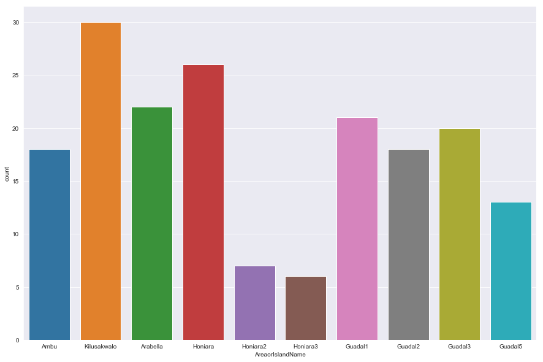


```python
plt.figure(figsize=(15, 10))
sns.barplot('AreaorIslandName',
            'EstimatedMonthlyIncome',
            data=solomon_df_qual)
```


    <matplotlib.axes._subplots.AxesSubplot at 0x20488746e48>


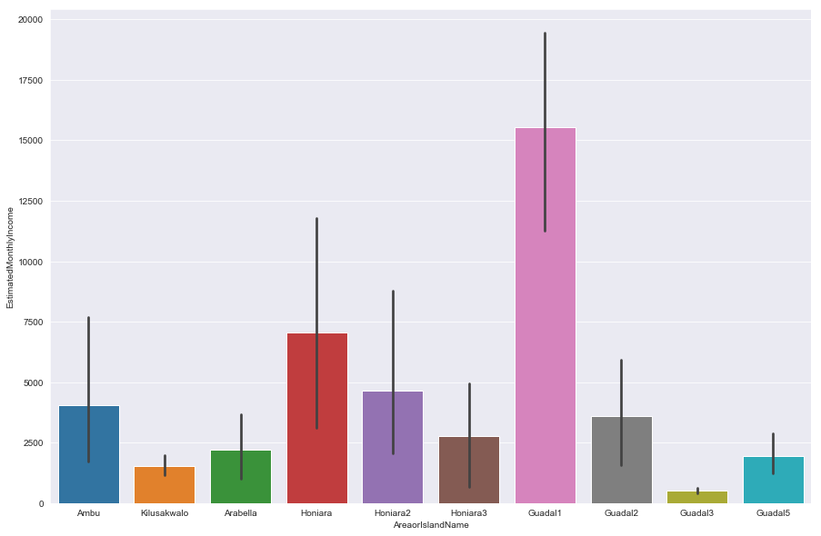


## Energy EDA

### Average Energy Density per Household


```python
vanuatu_eda_model['energy_kWh_per_kg'].describe()
```


    count    204.000000
    mean       1.884804
    std        1.158808
    min        0.000000
    25%        0.972500
    50%        2.320000
    75%        2.920000
    max        3.120000
    Name: energy_kWh_per_kg, dtype: float64


### Typical MSW Composition IQR


```python
composition_list = ['Organics_wt_%', 'Paper_and_cardboard_wt_%', 'Plastics_wt_%']

for comp in composition_list:
    print(f'{comp} Bot IQR:', round(vanuatu_eda_model[comp].describe()['25%'] * 100, 1),'%')
    print(f'{comp} Top IQR:', round(vanuatu_eda_model[comp].describe()['75%'] * 100, 1),'%')
    print('--------------------------')
```

    Organics_wt_% Bot IQR: 22.7 %
    Organics_wt_% Top IQR: 84.6 %
    --------------------------
    Paper_and_cardboard_wt_% Bot IQR: 0.7 %
    Paper_and_cardboard_wt_% Top IQR: 12.0 %
    --------------------------
    Plastics_wt_% Bot IQR: 4.7 %
    Plastics_wt_% Top IQR: 23.1 %
    --------------------------
    

### Most Frequent Items by Weight


```python
vanuatu_eda_model.groupby('')
```

### Number of Households per Location


```python
vanuatu_eda_model.Location.value_counts()
```


    Lelepa          60
    Port Vila       50
    Luganville      49
    Shefa Rural     35
    Ifira Island    10
    Name: Location, dtype: int64


```python
plt.figure(figsize=(15, 10));

location_order = ['Ifira Island',
                  'Lelepa',
                  'Luganville',
                  'Port Vila',
                  'Shefa Rural']
         
sns.countplot('Location',
              data=vanuatu_eda_model,
              order=location_order);

plt.title('Number of Households per Location ', fontsize=22);
plt.xlabel('Location', fontsize=17);
plt.ylabel('Number of Households', fontsize=17);
```


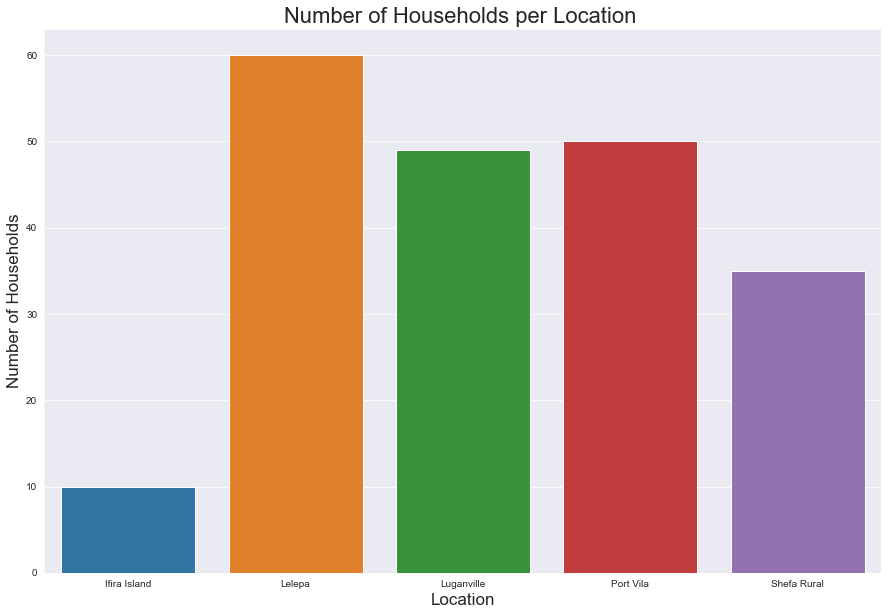


### MSW Composition per Location


```python
plt.figure(figsize=(15, 10));
print('Number of Households per Location:\n', vanuatu_eda_model['Location'].value_counts())

location_order = ['Ifira Island',
                  'Lelepa',
                  'Luganville',
                  'Port Vila',
                  'Shefa Rural']

sns.barplot('Location',
            'Organics_wt_%',
            data=vanuatu_eda_model,
            color='Green',
#             estimator=np.median,
            ci=0,
            order=location_order);

sns.barplot('Location',
            'Plastics_wt_%',
            data=vanuatu_eda_model,
            color='Blue',
#             estimator=np.median,
            ci=0,
            order=location_order);

sns.barplot('Location',
            'Paper_and_cardboard_wt_%',
            data=vanuatu_eda_model,
            color='Brown',
#             estimator=np.median,
            ci=0,
            order=location_order);

# vanuatu_eda_model_reduced = vanuatu_eda_model.copy()
# vanuatu_eda_model_reduced['energy_kWh_per_kg'] = vanuatu_eda_model_reduced['energy_kWh_per_kg'] / 10 

sns.lineplot('Location',
             'energy_kWh_per_kg',
             data=vanuatu_eda_model,
#              estimator=np.median,
             color='Black');

plt.title('Average MSW Composition & Energy Density (kWh/kg) per Location', fontsize=22);
plt.xticks(rotation=45, fontsize=15);
plt.xlabel('Location', fontsize=20);
plt.yticks(fontsize=15);
plt.ylabel('MSW Composition %', fontsize=20);
# plt.ylim(0, 1)

from matplotlib.lines import Line2D
custom_lines = [Line2D([0], [0], color='Green', lw=4),
                Line2D([0], [0], color='Blue', lw=4),
                Line2D([0], [0], color='Brown', lw=4),
                Line2D([0], [0], color='Black', lw=4)]

plt.legend(custom_lines, ['Organics',
                          'Plastics',
                          'Paper and Cardboard',
                          'Energy Density (kWh/kg)'],
           fontsize=12);
#            title='Waste Type',
#            title_fontsize=18);
```

    Number of Households per Location:
     Lelepa          60
    Port Vila       50
    Luganville      49
    Shefa Rural     35
    Ifira Island    10
    Name: Location, dtype: int64
    


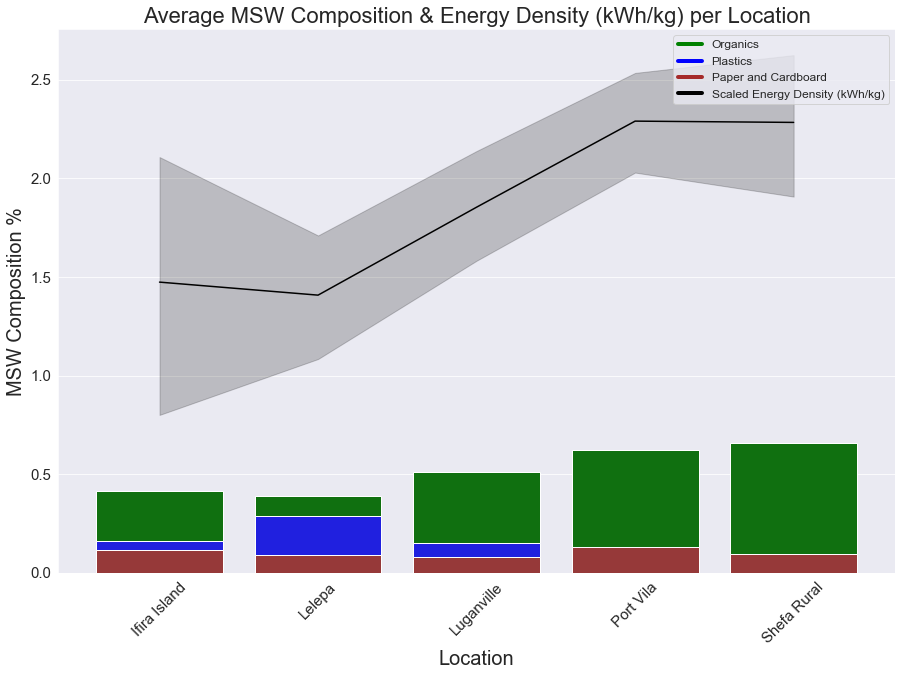


```python

```


```python

```
